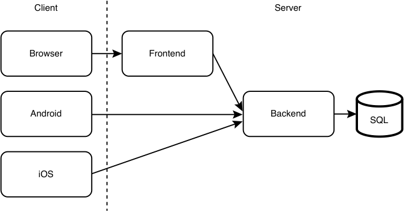
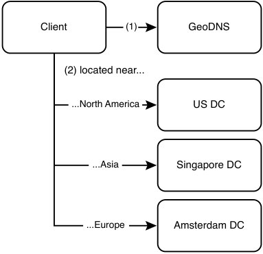
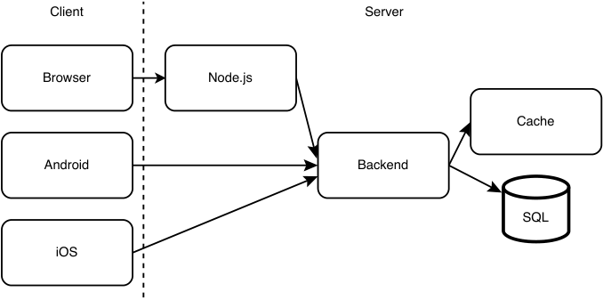
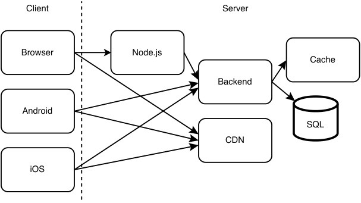
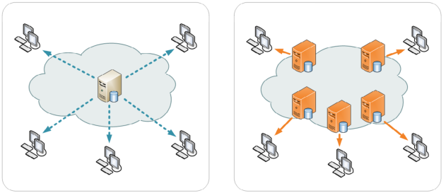
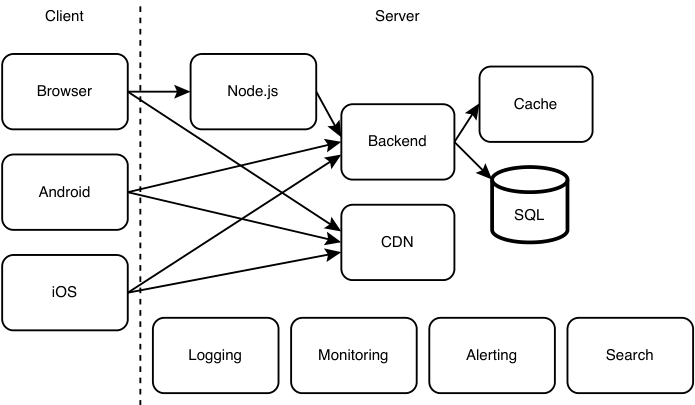
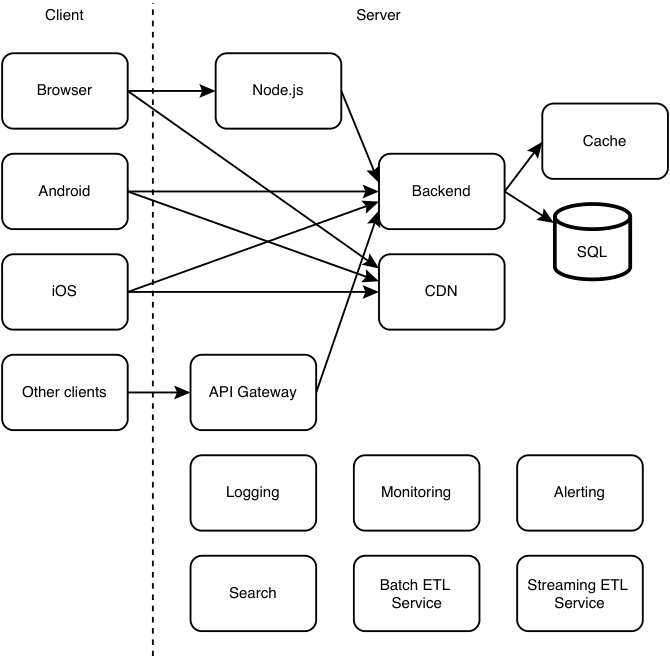
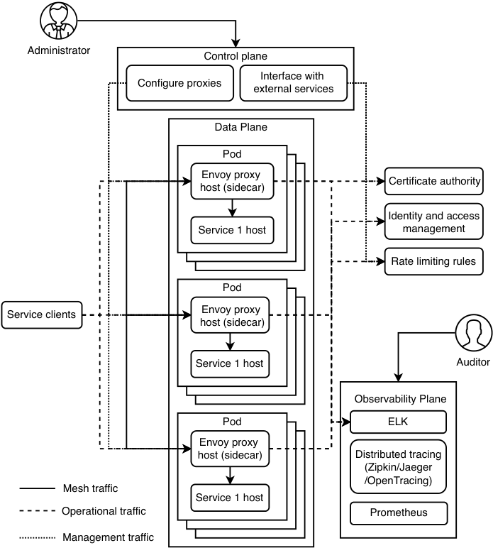

# _A walkthrough of system design concepts_

## _This chapter covers_

- Learning the importance of the system design interview

- Scaling a service

- Using cloud hosting vs. bare metal

A system design interview is a discussion between the candidate and the interviewer about designing a software system that is typically provided over a network. The interviewer begins the interview with a short and vague request to the candidate to design a particular software system. Depending on the particular system, the user base may be non-technical or technical.

System design interviews are conducted for most software engineering, software architecture, and engineering manager job interviews. (In this book, we collectively refer to software engineers, architects, and managers as simply _engineers_ .) Other components of the interview process include coding and behavioral/cultural interviews.

## _1.1 A discussion about tradeoffs_

The following factors attest to the importance of system design interviews and preparing well for them as a candidate and an interviewer.

Run in performance as a candidate in the system design interviews is used to estimate your breadth and depth of system design expertise and your ability to communicate and discuss system designs with other engineers. This is a critical factor in determining the level of seniority at which you will be hired into the company. The ability to design and review large-scale systems is regarded as more important with increasing engineering seniority. Correspondingly, system design interviews are given more weight in interviews for senior positions. Preparing for them, both as an interviewer and candidate, is a good investment of time for a career in tech.

The tech industry is unique in that it is common for engineers to change companies every few years, unlike other industries where an employee may stay at their company for many years or their whole career. This means that a typical engineer will go through system design interviews many times in their career. Engineers employed at a highly desirable company will go through even more system design interviews as an interviewer. As an interview candidate, you have less than one hour to make the best possible impression, and the other candidates who are your competition are among the smartest and most motivated people in the world.

System design is an art, not a science. It is not about perfection. We make tradeoffs and compromises to design the system we can achieve with the given resources and time that most closely suits current and possible future requirements. All the discussions of various systems in this book involve estimates and assumptions and are not academically rigorous, exhaustive, or scientific. We may refer to software design patterns and architectural patterns, but we will not formally describe these principles. Readers should refer to other resources for more details.

A system design interview is not about the right answer. It is about one’s ability to discuss multiple possible approaches and weigh their tradeoffs in satisfying the requirements. Knowledge of the various types of requirements and common systems discussed in part 1 will help us design our system, evaluate various possible approaches, and discuss tradeoffs.

## _1.2 Should you read this book?_

The open-ended nature of system design interviews makes it a challenge to prepare for and know how or what to discuss during an interview. An engineer or student who searches for online learning materials on system design interviews will find a vast quantity of content that varies in quality and diversity of the topics covered. This is confusing and hinders learning. Moreover, until recently, there were few dedicated books on this topic, though a trickle of such books is beginning to be published. I believe this is because a high-quality book dedicated to the topic of system design interviews is, quoting the celebrated 19th-century French poet and novelist Victor Hugo, “an idea whose time has come.” Multiple people will get this same idea at around the same time, and this affirms its relevance.

This is not an introductory software engineering book. This book is best used after one has acquired a minimal level of industry experience. Perhaps if you are a student in your first internship, you can read the documentation websites and other introductory materials of unfamiliar tools and discuss them together with other unfamiliar concepts in this book with engineers at your workplace. This book discusses how to approach system design interviews and minimizes duplication of introductory material that we can easily find online or in other books. At least intermediate proficiency in coding and SQL is assumed.

This book offers a structured and organized approach to start preparing for system design interviews or to fill gaps in knowledge and understanding from studying the large amount of fragmented material. Equally valuably, it teaches how to demonstrate one’s engineering maturity and communication skills during a system design interview, such as clearly and concisely articulating one’s ideas, knowledge, and questions to the interviewer within the brief ~50 minutes.

A system design interview, like any other interview, is also about communication skills, quick thinking, asking good questions, and performance anxiety. One may forget to mention points that the interviewer is expecting. Whether this interview format is flawed can be endlessly debated. From personal experience, with seniority one spends an increasing amount of time in meetings, and essential abilities include quick thinking, being able to ask good questions, steering the discussion to the most critical and relevant topics, and communicating one’s thoughts succinctly. This book emphasizes that one must effectively and concisely express one’s system design expertise within the <1 hour interview and drive the interview in the desired direction by asking the interviewer the right questions. Reading this book, along with practicing system design discussions with other engineers, will allow you to develop the knowledge and fluency required to pass system design interviews and participate well in designing systems in the company you join. It can also be a resource for interviewers who conduct system design interviews.

One may excel in written over verbal communication and forget to mention important points during the ~50-minute interview. System design interviews are biased in favor of engineers with good verbal communication and against engineers less proficient in verbal communication, even though the latter may have considerable system design expertise and have made valuable system design contributions in the organizations where they worked. This book prepares engineers for these and other challenges of system design interviews, shows how to approach them in an organized way, and coaches how not to be intimidated.

If you are a software engineer looking to broaden your knowledge of system design concepts, improve your ability to discuss a system, or are simply looking for a collection of system design concepts and sample system design discussions, read on.

## _1.3 Overview of this book_

This book is divided into two parts. Part 1 is presented like a typical textbook, with chapters that cover the various topics discussed in a system design interview. Part 2 consists of discussions of sample interview questions that reference the concepts covered in part 1 and also discusses antipatterns and common misconceptions and mistakes. In those discussions, we also state the obvious that one is not expected to possess all knowledge of all domains. Rather, one should be able to reason that certain approaches will help satisfy requirements better, with certain tradeoffs. For example, we don’t need to calculate file size reduction or CPU and memory resources required for Gzip compression on a file, but we should be able to state that compressing a file before sending it will reduce network traffic but consume more CPU and memory resources on both the sender and recipient.

An aim of this book is to bring together a bunch of relevant materials and organize them into a single book so you can build a knowledge foundation or identify gaps in your knowledge, from which you can study other materials.

The rest of this chapter is a prelude to a sample system design that mentions some of the concepts that will be covered in part 1. Based on this context, we will discuss many of the concepts in dedicated chapters.

## _1.4 Prelude: A brief discussion of scaling the various services of a system_

We begin this book with a brief description of a typical initial setup of an app and a general approach to adding scalability into our app’s services as needed. Along the way, we introduce numerous terms and concepts and many types of services required by a tech company, which we discuss in greater detail in the rest of the book.

DEFINITION The _scalability_ of a service is the ability to easily and cost-effectively vary resources allocated to it to serve changes in load. This applies to both increasing or decreasing user numbers and/or requests to the system. This is discussed more in chapter 3.

### _1.4.1 The beginning: A small initial deployment of our app_

Riding the rising wave of interest in artisan bagels, we have just built an awesome consumer-facing app named Beigel that allows users to read and create posts about nearby bagel cafes.

Initially, Beigel consists primarily of the following components:

- Our consumer apps. They are essentially the same app, one for each of the three common platforms:

   - A browser app. This is a ReactJS browser consumer app that makes requests to a JavaScript runtime service. To reduce the size of the JavaScript bundle that users need to download, we compress it with Brotli. Gzip is an older and more popular choice, but Brotli produces smaller compressed files.

   - An iOS app, which is downloaded on a consumer’s iOS device.

   - An Android app, which is also downloaded on a consumer’s Android device.

- A stateless backend service that serves the consumer apps. It can be a Go or Java service.

- A SQL database contained in a single cloud host.

We have two main services: the frontend service and the backend service. Figure 1.1 illustrates these components. As shown, the consumer apps are client-side components, while services and database are server-side components.

NOTE    Refer to sections 6.5.1 and 6.5.2 for a discussion on why we need a frontend service between the browser and the backend service.

Figure 1.1    Initial system design of our app. For a more thorough discussion on the rationale for having three client applications and two server applications (excluding the SQL application/database), refer to chapter 6.

When we first launch a service, it may only have a small number of users and thus a low request rate. A single host may be sufficient to handle the low request rate. We will set up our DNS to direct all requests to this host.

Initially, we can host the two services within the same data center, each on a single cloud host. (We compare cloud vs. bare metal in the next section.) We configure our DNS to direct all requests from our browser app to our Node.js host and from our Node.js host and two mobile apps to our backend host.

### _1.4.2 Scaling with GeoDNS_

Months later, Beigel has gained hundreds of thousands of daily active users in Asia, Europe, and North America. During periods of peak traffic, our backend service receives thousands of requests per second, and our monitoring system is starting to report status code 504 responses due to timeouts. We must scale up our system.

We have observed the rise in traffic and prepared for this situation. Our service is stateless as per standard best practices, so we can provision multiple identical backend hosts and place each host in a different data center in a different part of the world. Referring to figure 1.2, when a client makes a request to our backend via its domain beigel.com, we use GeoDNS to direct the client to the data center closest to it.

Figure 1.2    We may provision our service in multiple geographically distributed data centers. Depending on the client’s location (inferred from its IP address), a client obtains the IP address of a host of the closest data center, to which it sends its requests. The client may cache this host IP address.

If our service serves users from a specific country or geographical region in general, we will typically host our service in a nearby data center to minimize latency. If your service serves a large geographically distributed userbase, we can host it on multiple data centers and use GeoDNS to return to a user the IP address of our service hosted in the closest data center. This is done by assigning multiple A records to our domain for various locations and a default IP address for other locations. (An _A record_ is a DNS configuration that maps a domain to an IP address.)

When a client makes a request to the server, the GeoDNS obtains the client’s location from their IP address and assigns the client the corresponding host IP address. In the unlikely but possible event that the data center is inaccessible, GeoDNS can return an IP address of the service on another data center. This IP address can be cached at various levels, including the user’s Internet Service Provider (ISP), OS, and browser.

### _1.4.3 Adding a caching service_

Referring to figure 1.3, we next set up a Redis cache service to serve cached requests from our consumer apps. We select certain backend endpoints with heavy traffic to serve from the cache. That bought us some time as our user base and request load continued to grow. Now, further steps are needed to scale up.

Figure 1.3    Adding a cache to our service. Certain backend endpoints with heavy traffic can be cached. The backend will request data from the database on a cache miss or for SQL databases/tables that were not cached.

### _1.4.4 Content distribution network_

Our browser apps had been hosting static content/files that are displayed the same to any user and unaffected by user input, such as JavaScript, CSS libraries, and some images and videos. We had placed these files within our app’s source code repository, and our users were downloading them from our Node.js service together with the rest of the app. Referring to figure 1.4, we decided to use a third-party content distribution network (CDN) to host the static content. We selected and provisioned sufficient capacity from a CDN to host our files, uploaded our files onto our CDN instance, rewrote our code to fetch the files from the URLs of the CDN, and removed the files from our source code repository.

Figure 1.4    Adding a CDN to our service. Clients can obtain CDN addresses from the backend, or certain CDN addresses can be hardcoded in the clients or Node.js service.

Referring to figure 1.5, a CDN stores copies of the static files in various data centers across the world, so a user can download these files from the data center that can provide them the lowest latency, which is usually the geographically closest one, though other data centers may be faster if the closest one is serving heavy traffic or suffering a partial outage.

Figure 1.5    The left illustration shows all clients downloading from the same host. The right illustration shows clients downloading from various hosts of a CDN. (Copyright cc-by-sa https://creativecommons.org/licenses/by-sa/3.0/.Imageby Kanoha from https://upload.wikimedia.org/wikipedia/commons/f/f9/NCDN_-_CDN.png.)

Using a CDN improved latency, throughput, reliability, and cost. (We discuss all these concepts in chapter 3.) Using a CDN, unit costs decrease with demand because maintenance, integration overhead, and customer support are spread over a larger load.

Popular CDNs include CloudFlare, Rackspace, and AWS CloudFront.

### _1.4.5 A brief discussion of horizontal scalability and cluster management, continuous integration, and continuous deployment_

Our frontend and backend services are idempotent (we discuss some benefits of idempotency and its benefits in sections 4.6.1, 6.1.2, and 7.7), thus they are horizontally scalable, so we can provision more hosts to support our larger request load without rewriting any source code and deploy the frontend or backend service to those hosts as needed.

Each of our services has multiple engineers working on its source code. Our engineers submit new commits every day. We change software development and release practices to support this larger team and faster development, hiring two DevOps engineers in the process to develop the infrastructure to manage a large cluster. As scaling requirements of a service can change quickly, we want to be able to easily resize its cluster. We need to be able to easily deploy our services and required configurations to new hosts. We also want to easily build and deploy code changes to all the hosts in our service’s cluster. We can take advantage of our large userbase for experimentation by deploying different code or configurations to various hosts. This section is a brief discussion of cluster management for horizontal scalability and experimentation.

#### ci/cd and infrastructure as code

To allow new features to be released quickly while minimizing the risk of releasing bugs, we adopt continuous integration and continuous deployment with Jenkins and unit testing and integration testing tools. (A detailed discussion of CI/CD is outside the scope of this book.) We use Docker to containerize our services, Kubernetes (or Docker Swarm) to manage our host cluster including scaling and providing load balancing, and Ansible or Terraform for configuration management of our various services running on our various clusters.

NOTE    Mesos is widely considered obsolete. Kubernetes is the clear winner. A couple of relevant articles are https://thenewstack.io/apache-mesos-narrowly-avoids-a-move-to-the-attic-for-now/andhttps://www.datacenterknowledge.com/business/after-kubernetes-victory-its-former-rivals-change-tack.Terraformallowsaninfrastructureengineerto create a single configuration compatible with multiple cloud providers. A configuration is authored in Terraform’s domain-specific language (DSL) and communicates with cloud APIs to provision infrastructure. In practice, a Terraform configuration may contain some vendor-specific code, which we should minimize. The overall consequence is less vendor lock-in.

This approach is also known as _Infrastructure as Code._ Infrastructure as Code is the process of managing and provisioning computer data centers through machine-readable definition files, rather than physical hardware configuration or interactive configuration tools (Wittig, Andreas; Wittig, Michael [2016]. _Amazon Web Services in Action._ Manning Publications. p. 93. ISBN 978-1-61729-288-0).

#### gradual rollouts and rollbacks

In this section, we briefly discuss gradual rollouts and rollbacks, so we can contrast them with experimentation in the next section.

When we deploy a build to production, we may do so gradually. We may deploy the build to a certain percentage of hosts, monitor it and then increase the percentage, repeating this process until 100% of production hosts are running this build. For example, we may deploy to 1%, 5%, 10%, 25%, 50%, 75%, and then finally 100%. We may manually or automatically roll back deployments if we detect any problems, such as:

- Bugs that slipped through testing.

- Crashes.

- Increased latency or timeouts.

- Memory leaks.

- Increased resource consumption like CPU, memory, or storage utilization.

- Increased user churn. We may also need to consider user churn in gradual outs— that is, that new users are signing on and using the app, and certain users may stop using the app. We can gradually expose an increasing percentage of users to a new build and study its effect on churn. User churn may occur due to the mentioned factors or unexpected problems such as many users disliking the changes.

For example, a new build may increase latency beyond an acceptable level. We can use a combination of caching and dynamic routing to handle this. Our service may specify a one-second latency. When a client makes a request that is routed to a new build, and a timeout occurs, our client may read from its cache, or it may repeat its request and be routed to a host with an older build. We should log the requests and responses so we can troubleshoot the timeouts.

We can configure our CD pipeline to divide our production cluster into several groups, and our CD tool will determine the appropriate number of hosts in each group and assign hosts to groups. Reassignments and redeployments may occur if we resize our cluster.

#### experimentation

As we make UX changes in developing new features (or removing features) and aesthetic designs in our application, we may wish to gradually roll them out to an increasing percentage of users, rather than to all users at once. The purpose of experimentation is to determine the effect of UX changes on user behavior, in contrast to gradual rollouts, which are about the effect of new deployments on application performance and user churn. Common experimentation approaches are A/B and multivariate testing, such as multi-armed bandit. These topics are outside the scope of this book. For more information on A/B testing, refer to https://www.optimizely.com/optimization-glossary/ab-testing/.Formultivariatetesting,see_Experimentationfor Engineers_ by David Sweet (Manning Publications, 2023) or https://www.optimizely.com/optimization-glossary/multi-armed-bandit/foranintroductiontomulti-armedbandit.)

Experimentation is also done to deliver personalized user experiences.

Another difference between experimentation vs. gradual rollouts and rollbacks is that in experimentation, the percentage of hosts running various builds is often tuned by an experimentation or feature toggle tool that is designed for that purpose, while in gradual rollouts and rollbacks, the CD tool is used to manually or automatically roll back hosts to previous builds if problems are detected.

CD and experimentation allow short feedback cycles to new deployments and features.

In web and backend applications, each user experience (UX) is usually packaged in a different build. A certain percentage of hosts will contain a different build. Mobile apps are usually different. Many user experiences are coded into the same build, but each individual user will only be exposed to a subset of these user experiences. The main reasons for this are:

- Mobile application deployments must be made through the app store. It may take many hours to deploy a new version to user devices. There is no way to quickly roll back a deployment.

- Compared to Wi-Fi, mobile data is slower, less reliable, and more expensive. Slow speed and unreliability mean we need to have much content served offline, already in the app. Mobile data plans in many countries are still expensive and may come with data caps and overage charges. We should avoid exposing users to these charges, or they may use the app less or uninstall it altogether. To conduct experimentation while minimizing data usage from downloading components and media, we simply include all these components and media in the app and expose the desired subset to each individual user.

- A mobile app may also include many features that some users will never use because it is not applicable to them. For example, section 15.1 discusses various methods of payment in an app. There are possibly thousands of payment solutions in the world. The app needs to contain all the code and SDKs for every payment solution, so it can present each user with the small subset of payment solutions they may have.

A consequence of all this is that a mobile app can be over 100MB in size. The techniques to address this are outside the scope of this book. We need to achieve a balance and consider tradeoffs. For example, YouTube’s mobile app installation obviously cannot include many YouTube videos.

### _1.4.6 Functional partitioning and centralization of cross-cutting concerns_

Functional partitioning is about separating various functions into different services or hosts. Many services have common concerns that can be extracted into shared services. Chapter 6 discusses the motivation, benefits, and tradeoffs.

#### shared services

Our company is expanding rapidly. Our daily active user count has grown to millions. We expand our engineering team to five iOS engineers, five Android engineers, 10 frontend engineers, 100 backend engineers, and we create a data science team.

Our expanded engineering team can work on many services beyond the apps directly used by consumers, such as services for our expanding customer support and operations departments. We add features within the consumer apps for consumers to contact customer support and for operations to create and launch variations of our products.

Many of our apps contain search bars. We create a shared search service with Elasticsearch.

In addition to horizontal scaling, we use functional partitioning to spread out data processing and requests across a large number of geographically distributed hosts by partitioning based on functionality and geography. We already did functional partitioning of our cache, Node.js service, backend service, and database service into separate hosts, and we do functional partitioning for other services as well, placing each service on its own cluster of geographically distributed hosts. Figure 1.6 shows the shared services that we add to Beigel.

Figure 1.6    Functional partitioning. Adding shared services.

We added a logging service, consisting of a log-based message broker. We can use the Elastic Stack (Elasticsearch, Logstash, Kibana, Beats). We also use a distributed tracing system, such as Zipkin or Jaeger or distributed logging, to trace a request as it traverses through our numerous services. Our services attach span IDs to each request so they can be assembled as traces and analyzed. Section 2.5 discusses logging, monitoring, and alerting.

We also added monitoring and alerting services. We build internal browser apps for our customer support employees to better assist customers. These apps process the consumer app logs generated by the customer and present them with good UI so our customer support employees can more easily understand the customer’s problem.

API gateway and service mesh are two ways to centralize cross-cutting concerns. Other ways are the decorator pattern and aspect-oriented programming, which are outside the scope of this book.

#### api gateway

By this time, app users make up less than half of our API requests. Most requests originate from other companies, which offer services such as recommending useful products and services to our users based on their in-app activities. We develop an API gateway layer to expose some of our APIs to external developers.

An API gateway is a reverse proxy that routes client requests to the appropriate backend services. It provides the common functionality to many services, so individual services do not duplicate them:

- Authorization and authentication, and other access control and security policies

- Logging, monitoring, and alerting at the request level

- Rate limiting

- Billing

- Analytics

Our initial architecture involving an API gateway and its services is illustrated in figure 1.7. A request to a service goes through a centralized API gateway. The API gateway carries out all the functionality described previously, does a DNS lookup, and then forwards the request to a host of the relevant service. The API gateway makes requests to services such as DNS, identity and access control and management, rate-limiting configuration service, etc. We also log all configuration changes done through the API gateway.

Figure 1.7    Initial architecture with our API gateway and services. Requests to services go through the API gateway

However, this architecture has the following drawbacks. The API gateway adds latency and requires a large cluster of hosts. The API gateway host and a service’s host that serves a particular request may be in different data centers. A system design that tries to route requests through API gateway hosts and service hosts will be an awkward and complex design.

A solution is to use a service mesh, also called the sidecar pattern. We discuss service mesh further in chapter 6. Figure 1.8 illustrates our service mesh. We can use a service mesh framework such as Istio. Each host of each service can run a sidecar along the main service. We use Kubernetes pods to accomplish this. Each pod can contain its service (in one container) as well as its sidecar (in another container). We provide an admin interface to configure policies, and these configurations can be distributed to all sidecars.

Figure 1.8    Illustration of a service mesh. Prometheus makes requests to each proxy host to pull/ scrape metrics, but this is not illustrated in the diagram because the many arrows will make it too cluttered and confusing. Figure adapted from https://livebook.manning.com/book/cloud-native/chapter-10/146.Withthisarchitecture,allservicerequestsand responses are routed through the sidecar. The service and sidecar are on the same host (i.e., same machine) so they can address each other over localhost, and there is no network latency. However, the sidecar does consume system resources.

#### sidecarless service mesh—the cutting edge

The service mesh required our system to nearly double the number of containers. For systems that involve communication between internal services (aka ingress or eastwest), we can reduce this complexity by placing the sidecar proxy logic into client hosts that make requests to service hosts. In the design of sidecarless service mesh, client hosts receive configurations from the control plane. Client hosts must support the control plane API, so they must also include the appropriate network communication libraries.

A limitation of sidecarless service mesh is that there must be a client who is in the same language as the service.

The development of sidecarless service mesh platforms is in its early stages. Google Cloud Platform (GCP) Traffic Director is an implementation that was released in April 2019 (https://cloud.google.com/blog/products/networking/traffic-director-global-traffic-management-for-open-service-mesh).####command Query responsibility segregation (cQrs)

Command Query Responsibility Segregation (CQRS) is a microservices pattern where command/write operations and query/read operations are functionally partitioned onto separate services. Message brokers and ETL jobs are examples of CQRS. Any design where data is written to one table and then transformed and inserted into another table is an example of CQRS. CQRS introduces complexity but has lower latency and better scalability and is easier to maintain and use. The write and read services can be scaled separately.

You will see many examples of CQRS in this book, though they will not be called out. Chapter 15 has one such example, where an Airbnb host writes to the Listing Service, but guests read from the Booking Service. (Though the Booking Service also provides write endpoints for guests to request bookings, which is unrelated to a host updating their listings.)

You can easily find more detailed definition of CQRS in other sources.

### _1.4.7 Batch and streaming extract, transform, and load (ETL)_

Some of our systems have unpredictable traffic spikes, and certain data processing requests do not have to be synchronous (i.e., process immediately and return response):

- Some requests that involve large queries to our databases (such as queries that process gigabytes of data).

- It may make more sense to periodically preprocess certain data ahead of requests rather than process it only when a request is made. For example, our app’s home page may display the top 10 most frequently learned words across all users in the last hour or in the seven days. This information should be processed ahead of time once an hour or once a day. Moreover, the result of this processing can be reused for all users, rather than repeating the processing for each user.

- Another possible example is that it may be acceptable for users to be shown data that is outdated by some hours or days. For example, users do not need to see the most updated statistics of the number of users who have viewed their shared content. It is acceptable to show them statistics that are out-of-date by a few hours.

- Writes (e.g., INSERT, UPDATE, DELETE database requests) that do not have to be executed immediately. For example, writes to the logging service do not have to be immediately written to the hard disk drives of logging service hosts. These write requests can be placed in a queue and executed later.

In the case of certain systems like logging, which receive large request volumes from many other systems, if we do not use an asynchronous approach like ETL, the logging system cluster will have to have thousands of hosts to process all these requests synchronously.

We can use a combination of event streaming systems like Kafka (or Kinesis if we use AWS) and batch ETL tools such as Airflow for such batch jobs.

If we wish to continuously process data, rather than periodically running batch jobs, we can use streaming tools such as Flink. For example, if a user inputs some data into our app, and we want to use it to send certain recommendations or notifications to them within seconds or minutes, we can create a Flink pipeline that processes recent user inputs. A logging system is usually streaming because it expects a non-stop stream of requests. If the requests are less frequent, a batch pipeline will be sufficient.

### _1.4.8 Other common services_

As our company grows and our userbase expands, we develop more products, and our products should become increasingly customizable and personalized to serve this large, growing, and diverse userbase. We will require numerous other services to satisfy the new requirements that come with this growth and to take advantage of it. They include the following:

- Customer/external user credentials management for external user authentication and authorization.

- Various storage services, including database services. The specific requirements of each system mean that there are certain optimal ways that the data it uses should be persisted, processed, and served. We will need to develop and maintain various shared storage services that use different technologies and techniques.

- Asynchronous processing. Our large userbase requires more hosts and may create unpredictable traffic spikes to our services. To handle traffic spikes, we need asynchronous processing to efficiently utilize our hardware and reduce unnecessary hardware expenditure.

- Notebooks service for analytics and machine learning, including experimentation, model creation, and deployment. We can use our large customer base for experimentation to discover user preferences, personalize user experiences, attract more users, and discover other ways to increase our revenue.

- Internal search and subproblems (e.g., autocomplete/typeahead service). Many of our web or mobile applications can have search bars for users to search for their desired data.

- Privacy compliance services and teams. Our expanding user numbers and large amount of customer data will attract malicious external and internal actors, who will attempt to steal data. A privacy breach on our large userbase will affect numerous people and organizations. We must invest in safeguarding user privacy.

- Fraud detection. The increasing revenue of our company will make it a tempting target for criminals and fraudsters, so effective fraud detection systems are a must.

### _1.4.9 Cloud vs. bare metal_

We can manage our own hosts and data centers or outsource this to cloud vendors. This section is a comparative analysis of both approaches.

#### general considerations

At the beginning of this section, we decided to use cloud services (renting hosts from providers such as Amazon’s AWS, DigitalOcean, or Microsoft Azure) instead of bare metal (owning and managing our own physical machines).

Cloud providers provide many services we will require, including CI/CD, logging, monitoring, alerting, and simplified setup and management of various database types including caches, SQL, and NoSQL.

If we chose bare metal from the beginning, we would have set up and maintained any of these services that we require. This may take away attention and time from feature development, which may prove costly to our company.

We must also consider the cost of engineering labor vs. cloud tools. Engineers are very expensive resources, and besides being monetarily costly, good engineers tend to prefer challenging work. Bore them with menial tasks such as small-scale setups of common services, and they may move to another company and be difficult to replace in a competitive hiring market.

Cloud tools are often cheaper than hiring engineers to set up and maintain your bare-metal infrastructure. We most likely do not possess the economies of scale and their accompanying unit cost efficiencies or the specialized expertise of dedicated cloud providers. If our company is successful, it may reach a growth stage where we have the economies of scale to consider bare metal.

Using cloud services instead of bare metal has other benefits including the following.

#### simplicity of setup

On a cloud provider’s browser app, we can easily choose a package most suited for our purposes. On bare metal, we would need steps such as installing server software like Apache or setting up network connections and port forwarding.

#### cost advantages

Cloud has no initial upfront cost of purchasing physical machines/servers. A cloud vendor allows us to pay for incremental use and may offer bulk discounts. Scaling up or down in response to unpredictably changing requirements is easy and fast. If we choose bare metal, we may end up in a situation where we have too few or too many physical machines. Also, some cloud providers offer “auto-scaling” services, which automatically resize our cluster to suit the present load.

That being said, cloud is not always cheaper than bare metal. Dropbox (https:// www.geekwire.com/2018/dropbox-saved-almost-75-million-two-years-building-tech -infrastructure/) and Uber (https://www.datacenterknowledge.com/uber/want-build-data-centers-uber-follow-simple-recipe)aretwoexamplesofcompanies that host on their own data centers because their requirements meant it was the more cost-efficient choice.

#### cloud services may provide better support and Quality

Anecdotal evidence suggests that cloud services generally provide superior performance, user experience, and support and have fewer and less serious outages. A possible reason is that cloud services must be competitive in the market to attract and retain customers, compared to bare metal, which an organization’s users have little choice but to use. Many organizations tend to value and pay more attention to customers than internal users or employees, possibly because customer revenue is directly measurable, while the benefit of providing high-quality services and support to internal users may be more difficult to quantify. The corollary is that the losses to revenue and morale from poor-quality internal services are also difficult to quantify. Cloud services may also have economies of scale that bare metal lacks because the efforts of the cloud service’s team are spread across a larger user base.

External-facing documentation may be better than internal-facing documentation. It may be better written, updated more often, and placed on a well-organized website that is easy to search. There may be more resources allocated, so videos and step-by-step tutorials may be provided.

External services may provide higher-quality input validation than internal services. Considering a simple example, if a certain UI field or API endpoint field requires the user to input an email address, the service should validate that the user’s input is actually a valid email address. A company may pay more attention to external users who complain about the poor quality of input validation because they may stop using and paying for the company’s product. Similar feedback from internal users who have little choice may be ignored.

When an error occurs, a high-quality service should return instructive error messages that guide the user on how to remedy the error, preferably without the time-consuming process of having to contact support personnel or the service’s developers. External services may provide better error messages as well as allocate more resources and incentives to provide high-quality support.

If a customer sends a message, they may receive a reply within minutes or hours, while it may take hours or days to respond to an employee’s questions. Sometimes a question to an internal helpdesk channel is not responded to at all. The response to an employee may be to direct them to poorly written documentation.

An organization’s internal services can only be as good as external services if the organization provides adequate resources and incentives. Because better user experience and support improve users’ morale and productivity, an organization may consider setting up metrics to measure how well internal users are served. One way to avoid these complications is to use cloud services. These considerations can be generalized to external vs. internal services.

Last, it is the responsibility of individual developers to hold themselves to high standards but not to make assumptions about the quality of others’ work. However, the persistent poor quality of internal dependencies can hurt organizational productivity and morale.

#### upgrades

Both the hardware and software technologies used in an organization’s bare metal infrastructure will age and be difficult to upgrade. This is obvious for finance companies that use mainframes. It is extremely costly, difficult, and risky to switch from mainframes to commodity servers, so such companies continue to buy new mainframes, which are far more expensive than their equivalent processing power in commodity servers. Organizations that use commodity servers also need the expertise and effort to constantly upgrade their hardware and software. For example, even upgrading the version of MySQL used in a large organization takes considerable time and effort. Many organizations prefer to outsource such maintenance to cloud providers.

#### some disadvantages

One disadvantage of cloud providers is vendor lock-in. Should we decide to transfer some or all components of our app to another cloud vendor, this process may not be straightforward. We may need considerable engineering effort to transfer data and services from one cloud provider to another and pay for duplicate services during this transition.

There are many possible reasons we will want to migrate out of a vendor. Today, the vendor may be a well-managed company that fulfills a demanding SLA at a competitive price, but there is no guarantee this will always be true. The quality of a company’s service may degrade in the future, and it may fail to fulfill its SLA. The price may become uncompetitive, as bare metal or other cloud vendors become cheaper in the future. Or the vendor may be found to be lacking in security or other desirable characteristics.

Another disadvantage is the lack of ownership over the privacy and security of our data and services. We may not trust the cloud provider to safeguard our data or ensure the security of our services. With bare metal, we can personally verify privacy and security.

For these reasons, many companies adopt a multi-cloud strategy, using multiple cloud vendors instead of a single one, so these companies can migrate away from any particular vendor at short notice should the need suddenly arise.

### _1.4.10 Serverless: Function as a Service (FaaS)_

If a certain endpoint or function is infrequently used or does not have strict latency requirements, it may be cheaper to implement it as a function on a Function as a Service (FaaS) platform, such as AWS Lambda or Azure Functions. Running a function only when needed means that there does not need to be hosts continuously waiting for requests to this function.

OpenFaaS and Knative are open-source FaaS solutions that we can use to support FaaS on our own cluster or as a layer on AWS Lambda to improve the portability of our functions between cloud platforms. As of this book’s writing, there is no integration between open-source FaaS solutions and other vendor-managed FaaS such as Azure Functions.

Lambda functions have a timeout of 15 minutes. FaaS is intended to process requests that can complete within this time.

In a typical configuration, an API gateway service receives incoming requests and triggers the corresponding FaaS functions. The API gateway is necessary because there needs to be a continuously running service that waits for requests.

Another benefit of FaaS is that service developers need not manage deployments and scaling and can concentrate on coding their business logic.

Note that a single run of a FaaS function requires steps such as starting a Docker container, starting the appropriate language runtime (Java, Python, Node.js, etc.) and running the function, and terminating the runtime and Docker container. This is commonly referred to as _cold start_ . Frameworks that take minutes to start, such as certain Java frameworks, may be unsuitable for FaaS. This spurred the development of JDKs with fast startups and low memory footprints such as GraalVM (https://www.graalvm.org/).Whyisthisoverheadrequired? Why can’t all functions be packaged into a single package and run across all host instances, similar to a monolith? The reasons are the disadvantages of monoliths (refer to appendix A).

Why not have a frequently-used function deployed to certain hosts for a certain amount of time, (i.e., with an expiry)? Such a system is similar to auto-scaling microservices and can be considered when using frameworks that take a long time to start.

The portability of FaaS is controversial. At first glance, an organization that has done much work in a proprietary FaaS like AWS Lambda can become locked in; migrating to another solution becomes difficult, time-consuming, and expensive. Open-source FaaS platforms are not a complete solution, because one must provision and maintain one’s own hosts, which defeats the scalability purpose of FaaS. This problem becomes especially significant at scale, when FaaS may become much more expensive than bare metal.

However, a function in FaaS can be written in two layers: an inner layer/function that contains the main logic of the function, wrapped by an outer layer/function that contains vendor-specific configurations. To switch vendors for any function, one only needs to change the outer function.

Spring Cloud Function (https://spring.io/projects/spring-cloud-function)isanemerging FaaS framework that is a generalization of this concept. It is supported by AWS Lambda, Azure Functions, Google Cloud Functions, Alibaba Function Compute, and may be supported by other FaaS vendors in the future.

### _1.4.11 Conclusion: Scaling backend services_

In the rest of part 1, we discuss concepts and techniques to scale a backend service. A frontend/UI service is usually a Node.js service, and all it does is serve the same browser app written in a JavaScript framework like ReactJS or Vue.js to any user, so it can be scaled simply by adjusting the cluster size and using GeoDNS. A backend service is dynamic and can return a different response to each request. Its scalability techniques are more varied and complex. We discussed functional partitioning in the previous example and will occasionally touch on it as needed.

#### _Summary_

- System design interview preparation is critical to your career and also benefits your company.

- The system design interview is a discussion between engineers about designing a software system that is typically provided over a network.

- GeoDNS, caching, and CDN are basic techniques for scaling our service.

- CI/CD tools and practices allow feature releases to be faster with fewer bugs. They also allow us to divide our users into groups and expose each group to a different version of our app for experimentation purposes.

- Infrastructure as Code tools like Terraform are useful automation tools for cluster management, scaling, and feature experimentation.

- Functional partitioning and centralization of cross-cutting concerns are key elements of system design.

- ETL jobs can be used to spread out the processing of traffic spikes over a longer time period, which reduces our required cluster size.

- Cloud hosting has many advantages. Cost is often but not always an advantage. There are also possible disadvantages such as vendor lock-in and potential privacy and security risks.

- Serverless is an alternative approach to services. In exchange for the cost advantage of not having to keep hosts constantly running, it imposes limited functionality.

