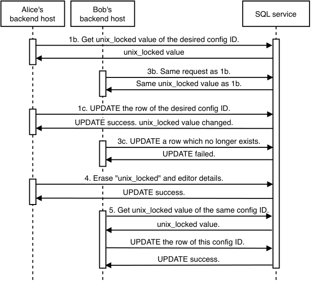

# _A typical system design interview flow_

## _This chapter covers_

- Clarifying system requirements and optimizing possible tradeoffs

- Drafting your system’s API specification

- Designing the data models of your system

- Discussing concerns like logging, monitoring, and alerting or search

- Reflecting on your interview experience and evaluating the company

In this chapter, we will discuss a few principles of system design interviews that must be followed during your 1 hour system design interview. When you complete this book, refer to this list again. Keep these principles in mind during your interviews:

- 1 Clarify functional and non-functional requirements (refer to chapter 3), such as QPS (queries per second) and P99 latency. Ask whether the interviewer desires wants to start the discussion from a simple system and then scale up and design more features or start with immediately designing a scalable system.

- 2 Everything is a tradeoff. There is almost never any characteristic of a system that is entirely positive and without tradeoffs. Any new addition to a system to improve scalability, consistency, or latency also increases complexity and cost and requires security, logging, monitoring, and alerting.

- 3 Drive the interview. Keep the interviewer’s interest strong. Discuss what they want. Keep suggesting topics of discussion to them.

- 4 Be mindful of time. As just stated, there is too much to discuss in 1 hour.

- 5 Discuss logging, monitoring, alerting, and auditing.

- 6 Discuss testing and maintainability including debuggability, complexity, security, and privacy.

- 7 Consider and discuss graceful degradation and failure in the overall system and every component, including silent and disguised failures. Errors can be silent. Never trust anything. Don’t trust external or internal systems. Don’t trust your own system.

- 8 Draw system diagrams, flowcharts, and sequence diagrams. Use them as visual aids for your discussions.

- 9 The system can always be improved. There is always more to discuss.

A discussion of any system design interview question can last for many hours. You will need to focus on certain aspects by suggesting to the interviewer various directions of discussion and asking which direction to go. You have less than 1 hour to communicate or hint the at full extent of your knowledge. You must possess the ability to consider and evaluate relevant details and to smoothly zoom up and down to discuss high-level architecture and relationships and low-level implementation details of every component. If you forget or neglect to mention something, the interviewer will assume you don’t know it. One should practice discussing system design questions with fellow engineers to improve oneself in this art. Prestigious companies interview many polished candidates, and every candidate who passes is well-drilled and speaks the language of system design fluently.

The question discussions in this section are examples of the approaches you can take to discuss various topics in a system design interview. Many of these topics are common, so you will see some repetition between the discussions. Pay attention to the use of common industry terms and how many of the sentences uttered within the time-limited discussion are filled with useful information.

The following list is a rough guide. A system design discussion is dynamic, and we should not expect it to progress in the order of this list:

- 1 Clarify the requirements. Discuss tradeoffs.

- 2 Draft the API specification.

- 3 Design the data model. Discuss possible analytics.

- 4 Discuss failure design, graceful degradation, monitoring, and alerting. Other topics include bottlenecks, load balancing, removing single points of failure, high availability, disaster recovery, and caching.

- 5 Discuss complexity and tradeoffs, maintenance and decommissioning processes, and costs.


## _2.1 Clarify requirements and discuss tradeoffs_

Clarifying the requirements of the question is the first checkbox to tick off during an interview. Chapter 3 describes the details and importance of discussing functional and non-functional requirements.

We end this chapter with a general guide to discussing requirements in an interview. We will go through this exercise in each question of part 2. We emphasize that you keep in mind that your particular interview may be a unique situation, and you should deviate from this guide as required by your situation.

Discuss functional requirements within 10 minutes because that is already ≥20% of the interview time. Nonetheless, attention to detail is critical. Do not write down the functional requirements one at a time and discuss them. You may miss certain requirements. Rather, quickly brainstorm and scribble down a list of functional requirements and then discuss them. We can tell the interviewer that we want to ensure we have captured all crucial requirements, but we also wish to be mindful of time.

We can begin by spending 30 seconds or 1 minute discussing the overall purpose of the system and how it fits into the big-picture business requirements. We can briefly mention endpoints common to nearly all systems, like health endpoints, signup, and login. Anything more than a brief discussion is unlikely to be within the scope of the interview. We then discuss the details of some common functional requirements:

- 1 Consider user categories/roles:

   - a Who will use this system and how? Discuss and scribble down user stories. Consider various combinations of user categories, such as manual versus programmatic or consumer versus enterprise. For example, a manual/consumer combination involves requests from our consumers via our mobile or browser apps. A programmatic/enterprise combination involves requests from other services or companies.

   - b Technical or nontechnical? Design platforms or services for developers or non-developers. Technical examples include a database service like key-value store, libraries for purposes like consistent hashing, or analytics services. Non-technical questions are typically in the form of “Design this well-known consumer app.” In such questions, discuss all categories of users, not just the non-technical consumers of the app.

   - c List the user roles (e.g., buyer, seller, poster, viewer, developer, manager).

   - d Pay attention to numbers. Every functional and non-functional requirement must have a number. Fetch news items? How many news items? How much time? How many milliseconds/seconds/hours/days?

   - e Any communication between users or between users and operations staff?

   - f Ask about i18n and L10n support, national or regional languages, postal address, price, etc. Ask whether multiple currency support is required.


- 2 Based on the user categories, clarify the scalability requirements. Estimate the number of daily active users and then estimate the daily or hourly request rate. For example, if a search service has 1 billion daily users, each submitting 10 search requests, there are 10 billion daily requests or 420 million hourly requests.

- 3 Which data should be accessible to which users? Discuss the authentication and authorization roles and mechanisms. Discuss the contents of the response body of the API endpoint. Next, discuss how often is data retrieved—real-time, monthly reports, or another frequency?

- 4 Search. What are possible use cases that involve search?

- 5 Analytics is a typical requirement. Discuss possible machine learning requirements, including support for experimentation such as A/B testing or multi-armed bandit. Refer to https://www.optimizely.com/optimization-glossary/ab-testing/andhttps://www.optimizely.com/optimization-glossary/multi-armed-bandit/forintroductionstothesetopics.-6 Scribble down pseudocode function signatures (e.g., `fetchPosts(userId)` ) to fetch posts by a certain user and match them to the user stories. Discuss with the interviewer which requirements are needed and which are out of scope.

Always ask, “Are there other user requirements?” and brainstorm these possibilities. Do not allow the interviewer to do the thinking for you. Do not give the interviewer the impression that you want them to do the thinking for you or want them to tell you all the requirements.

Requirements are subtle, and one often misses details even if they think they have clarified them. One reason software development follows agile practices is that requirements are difficult or impossible to communicate. New requirements or restrictions are constantly discovered through the development process. With experience, one learns the clarifying questions to ask.

Display your awareness that a system can be expanded to serve other functional requirements in the future and brainstorm such possibilities.

The interviewer should not expect you to possess all domain knowledge, so you may not think of certain requirements that require specific domain knowledge. What you do need is demonstrate your critical thinking, attention to detail, humility, and willingness to learn.

Next, discuss non-functional requirements. Refer to chapter 3 for a detailed discussion of non-functional requirements. We may need to design our system to serve the entire world population and assume that our product has complete global market dominance. Clarify with your interviewer whether we should design immediately for scalability. If not, they may be more interested in how we consider complicated functional requirements. This includes the data models we design. After we discuss requirements, we can proceed to discuss our system design.


## _2.2 Draft the API specification_

Based on the functional requirements, determine the data that the system’s users expect to receive from and send to the system. We will generally spend less than five minutes scrabbling down a draft of the GET, POST, PUT, and DELETE endpoints, including path and query parameters. It is generally inadvisable to linger on drafting the endpoints. Inform the interviewer that there is much more to discuss within our 50 minutes, so we will not use much time here.

You should have already clarified the functional requirements before scribbling these endpoints; you are past the appropriate section of the interview to clarify functional requirements and should not do so here unless you missed anything.

Next, propose an API specification and describe how it satisfies the functional requirements, then briefly discuss it and identify any functional requirements that you may have missed.

### _2.2.1 Common API endpoints_

These are common endpoints of most systems. You can quickly go over these endpoints and clarify that they are out of scope. It is very unlikely that you will need to discuss them in detail, but it never hurts to display that you are detail-oriented while also seeing the big picture.

#### health

`GET /health` is a test endpoint. A 4xx or 5xx response indicates the system has production problems. It may just do a simple database query, or it may return health information such as disk space, statuses of various other endpoints, and application logic checks.

#### signup and login (authentication)

An app user will typically need to sign up (`POST /signup`) and log in (`POST /login`) prior to submitting content to the app. OpenID Connect is a common authentication protocol, discussed in appendix B.

#### user and content management

We may need endpoints to get, modify, and delete user details. Many consumer apps provide channels for users to flag/report inappropriate content, such as content that is illegal or violates community guidelines.

## _2.3 Connections and processing between users and data_

In section 2.1, we discussed the types of users and data and which data should be accessible to which users. In section 2.2, we designed API endpoints for users to CRUD (create, read, update, and delete) data. We can now draw diagrams to represent the connections between user and data and to illustrate various system components and the data processing that occurs between them.


Phase 1:

- Draw a box to represent each type of user.

- Draw a box to represent each system that serves the functional requirements.

- Draw the connections between users and systems.

#### Phase 2:

- Break up request processing and storage.

- Create different designs based on the non-functional requirements, such as realtime versus eventual consistency.

- Consider shared services.

#### Phase 3:

- Break up the systems into components, which will usually be libraries or services.

- Draw the connections.

- Consider logging, monitoring, and alerting.

- Consider security.

Phase 4:

- Include a summary of our system design.

- Provide any new additional requirements.

- Analyze fault-tolerance. What can go wrong with each component? Network delays, inconsistency, no linearizability. What can we do to prevent and/or mitigate each situation and improve the fault-tolerance of this component and the overall system?

Refer to appendix C for an overview of the _C4 model_ , which is a system architecture diagram technique to decompose a system into various levels of abstraction.

## _2.4 Design the data model_

We should discuss whether we are designing the data model from scratch or using existing databases. Sharing databases between services is commonly regarded as an antipattern, so if we are using existing databases, we should build more API endpoints designed for programmatic customers, as well as batch and/or streaming ETL pipelines from and to those other databases as required.

The following are common problems that may occur with shared databases:

- Queries from various services on the same tables may compete for resources. Certain queries, such as UPDATE on many rows, or transactions that contain other long-running queries may lock a table for an extended period of time.


- Schema migrations are more complex. A schema migration that benefits one service may break the DAO code of other services. This means that although an engineer may work only on that service, they need to keep up to date with the low-level details of the business logic and perhaps even the source code of other services that they do not work on, which may be an unproductive use of both their time and the time of other engineers who made those changes and need to communicate it to them and others. More time will be spent in writing and reading documentation and presentation slides and in meetings. Various teams may take time to agree on proposed schema migrations, which may be an unproductive use of engineering time. Other teams may not be able to agree on schema migrations or may compromise on certain changes, which will introduce technical debt and decrease overall productivity.

- The various services that share the same set of databases are restricted to using those specific database technologies (.g., MySQL, HDFS, Cassandra, Kafka, etc.), regardless of how well-suited those technologies are to each service’s use cases. Services cannot pick the database technology that best suits their requirements.

This means that in either case we will need to design a new schema for our service. We can use the request and response bodies of the API endpoints we discussed in the previous section as starting points to design our schema, closely mapping each body to a table’s schema and probably combining the bodies of read (GET) and write (POST and PUT) requests of the same paths to the same table.

### _2.4.1 Example of the disadvantages of multiple services sharing databases_

If we were designing an ecommerce system, we may want a service that can retrieve business metric data, such as the total number of orders in the last seven days. Our teams found that without a source of truth for business metric definitions, different teams were computing metrics differently. For example, should the total number of orders include canceled or refunded orders? What time zone should be used for the cutoff time of “seven days ago”? Does “last seven days” include the present day? The communication overhead between multiple teams to clarify metric definitions was costly and error-prone.

Although computing business metrics uses order data from the Orders service, we decide to form a new team to create a dedicated Metrics service, since metric definitions can be modified independently of order data.

The Metrics service will depend on the Orders service for order data. A request for a metric will be processed as follows:

- 1 Retrieve the metric.

- 2 Retrieve the related data from the Orders service.

- 3 Compute the metric.

- 4 Return the metric’s value.


If both services share the same database, the computation of a metric makes SQL queries on Orders service’s tables. Schema migrations become more complex. For example, the Orders team decides that users of the Order table have been making too many large queries on it. After some analysis, the team determined that queries on recent orders are more important and require higher latency than queries on older orders. The team proposes that the Order table should contain only orders from the last year, and older orders will be moved to an Archive table. The Order table can be allocated a larger number of followers/read replicas than the Archive table.

The Metrics team must understand this proposed change and change metric computation to occur on both tables. The Metrics team may object to this proposed change, so the change may not go ahead, and the organizational productivity gain from faster queries on recent order data cannot be achieved.

If the Orders team wishes to move the Order table to Cassandra to use its low write latency while the Metrics service continues using SQL because of its simplicity and because it has a low write rate, the services can no longer share the same database.

### _2.4.2 A possible technique to prevent concurrent user update conflicts_

There are many situations where a client application allows multiple users to edit a shared configuration. If an edit to this shared configuration is nontrivial for a user (if a user needs to spend more than a few seconds to enter some information before submitting their edit), it may be a frustrating UX if multiple users simultaneously edit this configuration, and then overwrite each other’s changes when they save them. Source control management prevents this for source code, but most other situations involve non-technical users, and we obviously cannot expect them to learn git.

For example, a hotel room booking service may require users to spend some time to enter their check-in and check-out dates and their contact and payment information and then submit their booking request. We should ensure that multiple users do not overbook the room.

Another example may be configuring the contents of a push notification. For example, our company may provide a browser app for employees to configure push notifications sent to our Beigel app (refer to chapter 1). A particular push notification configuration may be owned by a team. We should ensure that multiple team members do not edit the push notification simultaneously and then overwrite each other’s changes.

There are many ways of preventing concurrent updates. We present one possible way in this section.

To prevent such situations, we can lock a configuration when it is being edited. Our service may contain an SQL table to store these configurations. We can add a timestamp column to the relevant SQL table that we can name “unix_locked” and string columns “edit_username” and “edit_email.” (This schema design is not normalized, but it is usually ok in practice. Ask your interviewer whether they insist on a normalized schema.) We can then expose a PUT endpoint that our UI can use to notify our backend when a user clicks on an edit icon or button to start editing the query string. Referring to figure 2.1, here are a series of steps that may occur when two users decide to edit a push notification at approximately the same time. One user can lock a configuration for a certain period (e.g., 10 minutes), and another user finds that it is locked:

- 1 Alice and Bob are both viewing the push notification configuration on our Notifications browser app. Alice decides to update the title from “Celebrate National Bagel Day!” to “20% off on National Bagel Day!” She clicks on the Edit button. The following steps occur:

   - a The click event sends a PUT request, which sends her username and email to the backend. The backend’s load balancer assigns this request to a host.

   - b Alice’s backend host makes two SQL queries, one at a time. First, it determines the current unix_locked time:

```sql
SELECT unix_locked
FROM table_name
WHERE config_id = {config_id}.
```


- c The backend checks whether the “edit_start” timestamp is less than 12 minutes ago. (This includes a 2 minute buffer in case the countdown timer in step 2 started late, and also because hosts’ clocks cannot be perfectly synchronized.) If so, it updates the row to indicate to lock the configuration. The UPDATE query sets “edit_start” to the backend’s current UNIX time and overwrites the “edit_username” and “edit_email” with Alice’s username and email. We need the “unix_locked” filter just in case another user has changed it in the meantime. The UPDATE query returns a Boolean to indicate whether it ran successfully:

```sql
UPDATE table_name
SET unix_locked = {new_time}, edit_username = {username}, edit_email = {email}
WHERE config_id = {config_id}
AND unix_locked = {unix_locked}
```


   - d If the UPDATE query was successful, the backend returns 200 success to the UI with a response body like:
     ```json
     {"can_edit": "true"}
     ```

- 2 The UI opens a page where Alice can make this edit and displays a 10-minute countdown timer. She erases the old title and starts to type the new title.

- 3 In between the SQL queries of steps 1b and 1c, Bob decides to edit the configuration too:

   - a He clicks on the Edit button, triggering a PUT request, which is assigned to a different host.

   - b The first SQL query returns the same unix_locked time as in step 1b.

   - c The second SQL query is sent just after the query in step 1c. SQL DML queries are sent to the same host (see section 4.3.2). This means this query cannot run until the query in step 1c completes. When the query runs, the unix_time value had changed, so the row is not updated, and the SQL service returns false to the backend. The backend returns a 200 success to the UI with a response body like:
     ```json
     {
       "can_edit": "false",
       "edit_start": "1655836315",
       "edit_username": "Alice",
       "edit_email": "alice@beigel.com"
     }
     ```

   - d The UI computes the number of minutes Alice has left and displays a banner notification that states, “Alice (alice@beigel.com) is making an edit. Try again in 8 minutes.”

- 4 Alice finishes her edits and clicks on the Save button. This triggers a PUT request to the backend, which saves her edited values and erases “unix_locked”, “edit_ start”, “edit_username”, and “edit_email”.

- 5 Bob clicks on the Edit button again, and now he can make edits. If Bob had clicked the Edit button at least 12 minutes after the “edit_start” value, he can also make edits. If Alice had not saved her changes before her countdown expires, the UI will display a notification to inform her that she cannot save her changes anymore.





Figure 2.1    Illustration of a locking mechanism that uses SQL. Here, two users request to update the same SQL row that corresponds to the same configuration ID. Alice’s host first gets the unix_locked timestamp value of the desired configuration ID, then sends an UPDATE query to update that row, so Alice has locked that specific configuration ID. Right after her host sent that query in step 1c, Bob’s host sends an UPDATE query, too, but Alice’s host had changed the unix_locked value, so Bob’s UPDATE query cannot run successfully, and Bob cannot lock that configuration ID.


What if Bob visits the push notification configuration page after Alice starts editing the configuration? A possible UI optimization at this point is to disable the Edit button and display the banner notification, so Bob knows he cannot make edits because Alice is doing so. To implement this optimization, we can add the three fields to the GET response for the push notification configuration, and the UI should process those fields and render the Edit button as “enabled” or “disabled.”

Refer to https://vladmihalcea.com/jpa-entity-version-property-hibernate/foranoverviewofversiontrackingwith Jakarta Persistence API and Hibernate.

## _2.5 Logging, monitoring, and alerting_

There are many books on logging, monitoring, and alerting. In this section, we will discuss key concepts that one must mention in an interview and dive into specific concepts that one may be expected to discuss. Never forget to mention monitoring to the interviewer.

### _2.5.1 The importance of monitoring_

Monitoring is critical for every system to provide visibility into the customer’s experience. We need to identify bugs, degradations, unexpected events, and other weaknesses in our system’s ability to satisfy current and possible future functional and non-functional requirements.

Web services may fail at any time. We may categorize these failures by urgency and how quickly they need attention. High-urgency failures must be attended to immediately. Low-urgency failures may wait until we complete higher-priority tasks. Our requirements and discretion determine the multiple levels of urgency that we define.

If our service is a dependency of other services, every time those services experience degradations, their teams may identify our service as a potential source of those degradations, so we need a logging and monitoring setup that will allow us to easily investigate possible degradations and answer their questions.

### _2.5.2 Observability_

This leads us to the concept of observability. The observability of our system is a measure of how well-instrumented it is and how easily we can find out what’s going on inside it (John Arundel & Justin Domingus, _Cloud Native DevOps with Kubernetes_ , p. 272, O’Reilly Media Inc, 2019.). Without logging, metrics, and tracing, our system is opaque. We will not easily know how well a code change meant to decrease P99 of a particular endpoint by 10% works in production. If P99 decreased by much less than 10% or much more than 10%, we should be able to derive relevant insights from our instrumentation on why our predictions fell short.

Refer to Google’s SRE book (https://sre.google/sre-book/monitoring-distributed-systems/#xref_monitoring_golden-signals)foradetaileddiscussionof the four golden signals of monitoring: latency, traffic, errors, and saturation.


- 1 _Latency_ —We can set up alerts for latency that exceeds our service-level agreement (SLA), such as more than 1 second. Our SLA may be for any individual request more than 1 second, or alerts that trigger for a P99 over a sliding window (e.g., 5 seconds, 10 seconds, 1 minute, 5 minutes).

- 2 _Traffic_ —Measured in HTTP requests per second. We can set up alerts for various endpoints that trigger if there is too much traffic. We can set appropriate numbers based on the load limit determined in our load testing.

- 3 _Errors_ —Set up high-urgency alerts for 4xx or 5xx response codes that must be immediately addressed. Trigger low-urgency (or high urgency, depending on your requirements) alerts on failed audits.

- 4 _Saturation_ —Depending on whether our system’s constraint is CPU, memory, or I/O, we can set utilization targets that should not be exceeded. We can set up alerts that trigger if utilization targets are reached. Another example is storage utilization. We can set up an alert that triggers if storage (due to file or database usage) may run out within hours or days.

The three instruments of monitoring and alerting are metrics, dashboards, and alerts. A _metric_ is a variable we measure, like error count, latency, or processing time. A _dashboard_ provides a summary view of a service’s core metrics. An _alert_ is a notification sent to service owners in a reaction to some problem happening in the service. Metrics, dashboards, and alerts are populated by processing log data. We may provide a common browser UI to create and manage them more easily.

OS metrics like CPU utilization, memory utilization, disk utilization, and network I/O can be included in our dashboard and used to tune the hardware allocation for our service as appropriate or detect memory leaks.

On a backend application, our backend framework may log each request by default or provide simple annotations on the request methods to turn on logging. We can put logging statements in our application code. We can also manually log the values of certain variables within our code to help us understand how the customer’s request was processed.

Scholl et al. (Boris Scholl, Trent Swanson & Peter Jausovec. _Cloud Native: Using Containers, Functions, and Data to build Next-Generation Applications._ O’Reilly, 2019. p. 145.) states the following general considerations in logging:

- Log entries should be structured to be easy to parse by tools and automation.

- Each entry should contain a unique identifier to trace requests across services and share between users and developers.

- Log entries should be small, easy to read, and useful.

- Timestamps should use the same time zone and time format. A log that contains entries with different time zones and time formats is difficult to read or parse.

- Categorize log entries. Start with debug, info, and error.

- Do not log private or sensitive information like passwords or connection strings. A common term to refer to such information is Personally Identifiable Information (PII).


Logs that are common to most services include the following. Many request-level logging tools have default configurations to log these details:

- Host logging:

   - CPU and memory utilization on the hosts

   - Network I/O

- Request-level logging captures the details of every request:

   - Latency

   - Who and when made the request

   - Function name and line number

   - Request path and query parameters, headers, and body

   - Return status code and body (including possible error messages)

In a particular system, we may be particularly interested in certain user experiences, such as errors. We can place log statements within our application and set up customized metrics, dashboards, and alerts that focus on these user experiences. For example, to focus on 5xx errors due to application bugs, we can create metrics, dashboards and alerts that process certain details like request parameters and return status codes and error messages, if any.

We should also log events to monitor how well our system satisfies our unique functional and non-functional requirements. For example, if we build a cache, we want to log cache faults, hits, and misses. Metrics should include the counts of faults, hits, and misses.

In enterprise systems, we may wish to give users some access to monitoring or even build monitoring tools specifically for users for example, customers can create dashboards to track the state of their requests and filter and aggregate metrics and alerts by categories such as URL paths.

We should also discuss how to address possible silent failures. These may be due to bugs in our application code or dependencies such as libraries and other services that allow the response code to be 2xx when it should be 4xx or 5xx or may indicate your service requires logging and monitoring improvements.

Besides logging, monitoring, and alerting on individual requests, we may also create batch and streaming audit jobs to validate our system’s data. This is akin to monitoring our system’s data integrity. We can create alerts that trigger if the results of the job indicate failed validations. Such a system is discussed in chapter 10.

### _2.5.3 Responding to alerts_

A team that develops and maintains a service may typically consist of a few engineers. This team may set up an on-call schedule for the service’s high-urgency alerts. An on-call engineer may not be intimately familiar with the cause of a particular alert, so we should prepare a runbook that contains a list of the alerts, possible causes, and procedures to find and fix the cause.


As we prepare the runbook, if we find that certain runbook instructions consist of a series of commands that can easily be copied and pasted to solve the problem (e.g., restarting a host), these steps should be automated in the application, along with logging that these steps were run (Mike Julian, _Practical Monitoring,_ chapter 3, O’Reilly Media Inc, 2017). Failure to implement automated failure recovery when possible is runbook abuse. If certain runbook instructions consist of running commands to view particuar metrics, we should display these metrics on our dashboard.

A company may have a Site Reliability Engineering (SRE) team, which consists of engineers who develop tools and processes to ensure high reliability of critical services and are often on-call for these critical services. If our service obtains SRE coverage, a build of our service may have to satisfy the SRE team’s criteria before it can be deployed. This criteria typically consists of high unit test coverage, a functional test suite that passes SRE review, and a well-written runbook that has good coverage and description of possible problems and has been vetted by the SRE team.

After the outage is resolved, we should author a postmortem that identifies what went wrong, why, and how the team will ensure it does not recur. Postmortems should be blameless, or employees may attempt to downplay or hide problems instead of addressing them.

Based on identifying patterns in the actions that are taken to resolve the problem, we can identify ways to automate the mitigation of these problems, introducing self-healing characteristics to the system.

### _2.5.4 Application-level logging tools_

The open-source ELK (Elasticsearch, Logstash, Beats, Kibana) suite and the paid-service Splunk are common application-level logging tools. Logstash is used to collect and manage logs. Elasticsearch is a search engine, useful for storage, indexing, and searching through logs. Kibana is for visualization and dashboarding of logs, using Elasticsearch as a data source and for users to search logs. Beats was added in 2015 as a light data shipper that ships data to Elasticsearch or Logstash in real time.

In this book, whenever we state that we are logging any event, it is understood that we log the event to a common ELK service used for logging by other services in our organization.

There are numerous monitoring tools, which may be proprietary or FOSS (Free and open-source software). We will briefly discuss a few of these tools, but an exhaustive list, detailed discussion, and comparison are outside the scope of this book. These tools differ in characteristics such as

- Features. Various tools may offer all or a subset of logging, monitoring, alerting, and dashboarding.

- Support for various operating systems and other types of equipment besides servers, such as load balancers, switches, modems, routers, or network cards, etc.

- Resource consumption.


- Popularity, which is proportionate to the ease of finding engineers familiar with the system.

- Developer support, such as the frequency of updates.

They also differ in subjective characteristics like

- Learning curve.

- Difficulty of manual configuration and the likelihood of a new user to make mistakes.

- Ease of integration with other software and services.

- Number and severity of bugs.

- UX. Some of the tools have browser or desktop UI clients, and various users may prefer the UX of one UI over another.

FOSS monitoring tools include the following:

- _Prometheus + Grafana_ —Prometheus for monitoring, Grafana for visualization and dashboarding.

- _Sensu_ —A monitoring system that uses Redis to store data. We can configure Sensu to send alerts to a third-party alerting service.

- _Nagios_ —A monitoring and alerting system.

- _Zabbix_ —A monitoring system that includes a monitoring dashboard tool.

Proprietary tools include Splunk, Datadog, and New Relic.

A _time series database_ (TSDB) is a system that is optimized for storing and serving time series, such as the continuous writes that happen with logging time series data. Examples include the following. Most queries may be made on recent data, so old data will be less valuable, and we can save storage by configuring down sampling on TSDB. This rolls up old data by computing averages over defined intervals. Only these averages are saved, and the original data is deleted, so less storage is used. The data retention period and resolution depend on our requirements and budget.

To further reduce the cost of storing old data, we can compress it or use a cheap storage medium like tape or optical disks. Refer to https://www.zdnet.com/article/could-the-tech-beneath-amazons-glacier-revolutionise-data-storage/orhttps://arstechnica.com/information-technology/2015/11/to-go-green-facebook-puts-petabytes-of-cat-pics-on-ice-and-likes-windfarming/forexamplesofcustomsetupssuch as hard disk storage servers that slow down or stop when not in use:

- _Graphite_ —Commonly used to log OS metrics (though it can monitor other setups like websites and applications), which are visualized with the Grafana web application.

- _Prometheus_ —Also typically visualized with Grafana.

- _OpenTSDB_ —A distributed, scalable TSDB that uses HBase.

- _InfluxDB_ —An open-source TSDB written in Go.


Prometheus is an open-source monitoring system built around a time series database. Prometheus pulls from target HTTP endpoints to request metrics, and a Pushgateway pushes alerts to Alertmanager, which we can configure to push to various channels such as email and PagerDuty. We can use Prometheus query language (PromQL) to explore metrics and draw graphs.

Nagios is a proprietary legacy IT infrastructure monitoring tool that focuses on server, network, and application monitoring. It has hundreds of third-party plugins, web interfaces, and advanced visualization dashboarding tools.

### _2.5.5 Streaming and batch audit of data quality_

Data quality is an informal term that refers to ensuring that data represents the realworld construct to which it refers and can be used for its intended purposes. For example, if a particular table that is updated by an ETL job is missing some rows that were produced by that job, the data quality is poor.

Database tables can be continuously and/or periodically audited to detect data quality problems. We can implement such auditing by defining streaming and batch ETL jobs to validate recently added and modified data.

This is particularly useful to detect silent errors, which are errors that were undetected by earlier validation checks, such as validation checks that occur during processing of a service request.

We can extend this concept to a hypothetical shared service for database batch auditing, discussed in chapter 10.

### _2.5.6 Anomaly detection to detect data anomalies_

Anomaly detection is a machine learning concept to detect unusual datapoints. A full description of machine-learning concepts is outside the scope of this book. This section briefly describes anomaly detection to detect unusual datapoints. This is useful both to ensure data quality and for deriving analytical insights, as an unusual rise or fall of a particular metric can indicate problems with data processing or changing market conditions.

In its most basic form, anomaly detection consists of feeding a continuous stream of data into an anomaly detection algorithm. After it processes a defined number of datapoints, referred to in machine learning as the training set, the anomaly detection algorithm develops a statistical model. The model’s purpose is to accept a datapoint and assign a probability that the datapoint is anomalous. We can validate that this model works by using it on a set of datapoints called the validation set, where each datapoint has been manually labeled as normal or anomalous. Finally, we can quantify accuracy characteristics of the model by testing it on another manually-labeled set, called the test set.

Many parameters are manually tunable, such as which machine-learning models are used, the number of datapoints in each of the three sets, and the model’s parameters to adjust characteristics, such as precision vs. recall. Machine-learning concepts such as precision and recall are outside the scope of this book.


In practice, this approach to detecting data anomalies is complex and costly to implement, maintain, and use. It is reserved for critical datasets.

### _2.5.7 Silent errors and auditing_

Silent errors may occur due to bugs where an endpoint may return status code 200 even though errors occurred. We can write batch ETL jobs to audit recent changes to our databases and raise alerts on failed audits. Further details are provided in chapter 10.

### _2.5.8 Further reading on observability_

- Michael Hausenblas, _Cloud Observability in Action_ , Manning Publications, 2023. A guide to applying observability practices to cloud-based serverless and Kubernetes environments.

- https://www.manning.com/liveproject/configure-observability.Ahands-oncourseinimplementingaservicetemplate ’ s observability-related features.

- Mike Julian, _Practical Monitoring,_ O’Reilly Media Inc, 2017. A dedicated book on observability best practices, incident response, and antipatterns.

- Boris Scholl, Trent Swanson, and Peter Jausovec. _Cloud Native: Using Containers, Functions, and Data to build Next-Generation Applications._ O’Reilly, 2019. Emphasizes that observability is integral to cloud-native applications.

- John Arundel and Justin Domingus, _Cloud Native DevOps with Kubernetes,_ chapters 15 and 16, O’Reilly Media Inc, 2019. These chapters discuss observability, monitoring, and metrics in cloud-native applications.

## _2.6 Search bar_

Search is a common feature of many applications. Most frontend applications provide users with search bars to rapidly find their desired data. The data can be indexed in an Elasticsearch cluster.

### _2.6.1 Introduction_

A search bar is a common UI component in many apps. It can be just a single search bar or may contain other frontend components for filtering. Figure 2.2 is an example of a search bar.


Figure 2.2    Google search bar with drop-down menus for filtering results. Image from Google.


Common techniques of implementing search are:

- 1 Search on a SQL database with the `LIKE` operator and pattern matching. A query may resemble something like `SELECT <column> FROM <table> WHERE Lower(<column>) LIKE "%Lower(<search_term>)%"`.

- 2 Use a library such as match-sorter (https://github.com/kentcdodds/match-sorter),whichisa JavaScript library that accepts search terms and does matching and sorting on the records. Such a solution needs to be separately implemented on each client application. This is a suitable and technically simple solution for up to a few GB of text data (i.e., up to millions of records). A web application usually downloads its data from a backend, and this data is unlikely to be more than a few megabytes, or the application will not be scalable to millions of users. A mobile application may store data locally, so it is theoretically possible to have GBs of data, but data synchronization between millions of phones may be impractical.

- 3 Use a search engine such as Elasticsearch. This solution is scalable and can handle PBs of data.

The first technique has numerous limitations and should only be used as a quick temporary implementation that will soon be either discarded or changed to a proper search engine. Disadvantages include:

- Difficult to customize the search query.

- No sophisticated features like boosting, weight, fuzzy search, or text preprocessing such asystemming or tokenization.

This discussion assumes that individual records are small; that is, they are text records, not video records. For video records, the indexing and search operations are not directly on the video data, but on accompanying text metadata. The implementation of indexing and search in search engines is outside the scope of this book.

We will reference these techniques in the question discussions in part 2, paying much more attention to using Elasticsearch.

### _2.6.2 Search bar implementation with Elasticsearch_

An organization can have a shared Elasticsearch cluster to serve the search requirements of many of its services. In this section, we first describe a basic Elasticsearch fulltext search query, then the basic steps for adding Elasticsearch to your service given an existing Elasticsearch cluster. We will not discuss Elasticsearch cluster setup in this book or describe Elasticsearch concepts and terminology in detail. We will use our Beigel app (from chapter 1) for our examples.

To provide basic full-text search with fuzzy matching, we can attach our search bar to a GET endpoint that forwards the query to our Elasticsearch service. An Elasticsearch query is done against an Elasticsearch index (akin to a database in a relational database). If the GET query returns a 2xx response with a list of search results, the frontend loads a results page that displays the list.

For example, if our Beigel app provides a search bar, and a user searches for the term “sesame,” the Elasticsearch request may resemble either of the following.

The search term may be contained in a query parameter, which allows exact matches only:

```http
GET /beigel-index/_search?q=sesame
```

We can also use a JSON request body, which allows us to use the full Elasticsearch DSL, which is outside the scope of this book:

```http
GET /beigel-index/_search
{
  "query": {
    "match": {
      "query": "sesame",
      "fuzziness": "AUTO"
    }
  }
}
```

" `fuzziness` " `:` " `AUTO` " is to allow fuzzy (approximate) matching, which has many use cases, such as if the search term or search results contain misspellings.

The results are returned as a JSON array of hits sorted by decreasing relevance, such as the following example. Our backend can pass the results back to the frontend, which can parse and present them to the user.

### _2.6.3 Elasticsearch index and ingestion_

Creating an Elasticsearch index consists of ingesting the documents that should be searched when the user submits a search query from a search bar, followed by the indexing operation.

We can keep the index updated with periodic or event-triggered indexing or delete requests using the Bulk API.

To change the index’s mapping, one way is to create a new index and drop the old one. Another way is to use Elasticsearch’s reindexing operation, but this is expensive because the internal Lucene commit operation occurs synchronously after every write request (https://www.elastic.co/guide/en/elasticsearch/reference/current/index-modules-translog.html#index-modules-translog).Creatingan Elasticsearch index requires all data that you wish to search to be stored in the Elasticsearch document store, which increases our overall storage requirements. There are various optimizations that involve sending only a subset of data to be indexed. Table 2.1 is an approximate mapping between SQL and Elasticsearch terminology.


Table 2.1    Approximate mapping between SQL and Elasticsearch terminology. There are differences between the mapped terms, and this table should not be taken at face value. This mapping is meant for an Elasticsearch beginner with SQL experience to use as a starting point for further learning.


|SQL|Elasticsearch|
|---|---|
|||
|Database<br>Partition<br>Table<br>Column<br>Row<br>Schema<br>Index|Index<br>Shard<br>Type (deprecated without replacement)<br>Field<br>Document<br>Mapping<br>Everything is indexed|


### _2.6.4 Using Elasticsearch in place of SQL_

Elasticsearch can be used like SQL. Elasticsearch has the concept of query context vs. filter context (https://www.elastic.co/guide/en/elasticsearch/reference/current/query-filter-context.html). Fromthedocumentation,inafilter context, a query clause answers the question, “Does this document match this query clause?” The answer is a simple yes or no; no scores are calculated. In a query context, a query clause answers the question, “How well does this document match this query clause?”. The query clause determines whether the document matches and calculates a relevance score. Essentially, query context is analogous to SQL queries, while filter context is analogous to search.

Using Elasticsearch in place of SQL will allow both searching and querying, eliminate duplicate storage requirements, and eliminate the maintenance overhead of the SQL database. I have seen services that use only Elasticsearch for data storage.

However, Elasticsearch is often used to complement relational databases instead of replacing them. It is a schemaless database and does not have the concept of normalization or relations between tables such as primary key and foreign key. Unlike SQL, Elasticsearch also does not offer Command Query Responsibility Segregation (refer to section 1.4.6) or ACID.

Moreover, the Elasticsearch Query Language (EQL) is a JSON-based language, and it is verbose and presents a learning curve. SQL is familiar to non-developers, such as data analysts, and non-technical personnel. Non-technical users can easily learn basic SQL within a day.

Elasticsearch SQL was introduced in June 2018 in the release of Elasticsearch 6.3.0 (https://www.elastic.co/blog/an-introduction-to-elasticsearch-sql-with-practical-examples-part-1andhttps://www.elastic.co/what-is/elasticsearch-sql).Itsupportsallcommonfilterand aggregation operations (https://www.elastic.co/guide/en/elasticsearch/reference/current/sql-functions.html). Thisisapromisingdevelopment. SQL’s dominance is well-established, but in the coming years, it is possible that more services will use Elasticsearch for all their data storage as well as search.


### _2.6.5 Implementing search in our services_

Mentioning search during the user stories and functional requirements discussion of the interview demonstrates customer focus. Unless the question is to design a search engine, it is unlikely that we will describe implementing search beyond creating Elasticsearch indexes, ingesting and indexing, making search queries, and processing results. Most of the question discussions of part 2 discuss search in this manner.

### _2.6.6 Further reading on search_

Here are more resources on Elasticsearch and indexing:

- https://www.elastic.co/guide/en/elasticsearch/reference/current/index.html. The officialElasticsearchguide.- Madhusudhan Konda, _Elasticsearch in Action (Second Edition),_ Manning Publications, 2023. A hands-on guide to developing fully functional search engines with Elasticsearch and Kibana.

- https://www.manning.com/livevideo/elasticsearch-7-and-elastic-stack.Acourseon Elasticsearch 7 and Elastic Stack.

- https://www.manning.com/liveproject/centralized-logging-in-the-cloud-with-elasticsearch-and-kibana.Ahands-oncourseonlogginginthe cloud with Elasticsearch and Kibana.

- https://stackoverflow.com/questions/33858542/how-to-really-reindex-data-in-elasticsearch.Thisisagoodalternativetothe official Elasticsearch guide regarding how to update an Elasticsearch index.

- https://developers.soundcloud.com/blog/how-to-reindex-1-billion-documents--in-1-hour-at-soundcloud.Acasestudyofalarge reindexing operation.

## _2.7 Other discussions_

When we reach a point in our discussion where our system design satisfies our requirements, we can discuss other topics. This section briefly discusses a few possible topics of further discussion.

### _2.7.1 Maintaining and extending the application_

We’ve discussed the requirements at the beginning of the interview and have established a system design for them. We can continue to improve our design to better serve our requirements.

We can also expand the discussion to other possible requirements. Anyone who works in the tech industry knows that application development is never complete. There are always new and competing requirements. Users submit feedback they want developed or changed. We monitor the traffic and request contents of our API endpoints to make scaling and development decisions. There is constant discussion on what features to develop, maintain, deprecate, and decommission. We can discuss these topics:


- Maintenance may already be discussed during the interview. Which system components rely on technology (such as software packages), and which are developed fastest and require the most maintenance work? How will we handle upgrades that introduce breaking changes in any component?

- Features we may need to develop in the future and the system design.

- Features that may not be needed in the future and how to gracefully deprecate and decommission them. What is an adequate level of user support to provide during this process and how to best provide it?

### _2.7.2 Supporting other types of users_

We can extend the service to support other types of users. If we focused on either consumer or enterprise, manual or programmatic, we may discuss extending the system to support the other user categories. We can discuss extending the current services, building new services, and the tradeoffs of both approaches.

### _2.7.3 Alternative architectural decisions_

During the earlier part of the interview, we should have discussed alternative architectural decisions. We can revisit them in greater detail.

### _2.7.4 Usability and feedback_

Usability is a measure of how well our users can use our system to effectively and efficiently achieve the desired goals. It is an assessment of how easy our user interface is to use. We can define usability metrics, log the required data, and implement a batch ETL job to periodically compute these metrics and update a dashboard that displays them. Usability metrics can be defined based on how we intend our users to use our system.

For example, if we made a search engine, we want our users to find their desired result quickly. One possible metric can be the average index of the result list that a user clicks on. We want the results to be ordered in decreasing relevance, and we assume that a low average chosen index indicates that a user found their desired result close to the top of the list.

Another example metric is the amount of help users need from our support department when they use our application. It is ideal for our application to be self-service; that is, a user can perform their desired tasks entirely within the application without having to ask for help. If our application has a help desk, this can be measured by the number of help desk tickets created per day or week. A high number of help desk tickets indicates that our application is not self-service.

Usability can also be measured with user surveys. A common usability survey metric is _Net Promoter Score (NPS)_ . NPS is defined as the percentage of customers rating their likelihood to recommend our application to a friend or colleague as 9 or 10 minus the percentage rating this at 6 or below on a scale of 0 to 1,083.


We can create UI components within our application for users to submit feedback. For example, our web UI may have an HTML link or form for users to email feedback and comments. If we do not wish to use email, because of reasons such as possible spam, we can create an API endpoint to submit feedback and attach our form submission to it. Good logging will aid the reproducibility of bugs by helping us match the user’s feedback with her logged activities.

### _2.7.5 Edge cases and new constraints_

Near the end of the interview, the interviewer may introduce edge cases and new constraints, limited only to the imagination. They may consist of new functional requirements or pushing certain non-functional requirements to the extreme. You may have anticipated some of these edge cases during requirements planning. We can discuss if we can make tradeoffs to fulfill them or redesign our architecture to support our current requirements as well as these new requirements. Here are some examples.

- New functional requirements: We designed a sales service that supports credit card payments. What if our payment system needs to be customizable to support different credit card payment requirements in each country? What if we also need to support other payment types like store credit? What if we need to support coupon codes?

- We designed a text search service. How may we extend it to images, audio, and video?

- We designed a hotel room booking service. What if the user needs to change rooms? We’ll need to find an available room for them, perhaps in another hotel.

- What if we decide to add social networking features to our news feed recommendation service?

#### Scalability and performance:

- What if a user has one million followers or one million recipients of their messages? Can we accept a long P99 message delivery time? Or do we need to design for better performance?

- What if we need to perform an accurate audit of our sales data for the last 10 years?

#### Latency and throughput:

- What if our P99 message delivery time needs to be within 500 ms?

- If we designed a video streaming service that does not accommodate live streaming, how may we modify the design to support live streaming? How may we support simultaneously streaming of a million high-resolution videos across 10 billion devices?


Availability and fault-tolerance:

- We designed a cache that didn’t require high availability since all our data is also in the database. What if we want high availability, at least for certain data?

- What if our sales service was used for high-frequency trading? How may we increase its availability?

- How may each component in your system fail? How may we prevent or mitigate these failures?

Cost:

- We may have made expensive design decisions to support low latency and high performance. What may we trade for lower costs?

- How may we gracefully decommission our service if required?

- Did we consider portability? How may we move our application to the cloud (or off the cloud)? What are the tradeoffs in making our application portable? (Higher costs and complexity.) Consider MinIO (https://min.io/)forportableobjectstorage.

Every question in part 2 of this book ends with a list of topics for further discussion.

### _2.7.6 Cloud-native concepts_

We may discuss addressing the non-functional requirements via cloud-native concepts like microservices, service mesh and sidecar for shared services (Istio), containerization (Docker), orchestration (Kubernetes), automation (Skaffold, Jenkins), and infrastructure as code (Terraform, Helm). A detailed discussion of these topics is outside the scope of this book. Interested readers can easily find dedicated books or online materials.

## _2.8 Post-interview reflection and assessment_

You will improve your interview performance as you go through more interviews. To help you learn as much as possible from each interview, you should write a post-interview reflection as soon as possible after each interview. Then you will have the best possible written record of your interview, and you can write your honest critical assessment of your interview performance.

### _2.8.1 Write your reflection as soon as possible after the interview_

To help with this process, at the end of an interview, politely ask for permission to take photos of your diagrams, but do not persist if permission is denied. Carry a pen and a paper notebook with you in your bag. If you cannot take photos, use the earliest possible opportunity to redraw your diagrams from memory into your notebook. Next, scribble down as much detail you can recall.


You should write your reflection as soon as possible after the interview, when you can still remember many details. You may be tired after your interview, but it is counterproductive to relax and possibly forget information valuable to improving your future interview performance. Immediately go home or back to your hotel room and write your reflection, so you may write it in a comfortable and distraction-free environment. Your reflection may have the following outline:

- 1 Header:

   - a The company and group the interview was for.

   - b The interview’s date.

   - c Your interviewer’s name and job title.

   - d The question that the interviewer asked.

   - e Were diagrams from your photos or redrawn from memory?

- 2 Divide the interview into approximate 10-minute sections. Place your diagrams within the sections when you started drawing them. Your photos may contain multiple diagrams, so you may need to split your photos into their separate diagrams.

- 3 Fill in the sections with as much detail of the interview as you can recall.

   - a What you said.

   - b What you drew.

   - c What the interviewer said.

- 4 Write your personal assessment and reflections. Your assessments may be imprecise, so you should aim to improve them with practice.

   - a Try to find the interviewer’s resume or LinkedIn profile.

   - b Put yourself in the interviewer’s shoes. Why do you think the interviewer chose that system design question? What did you think the interviewer expected?

   - c The interviewer’s expressions and body language. Did the interviewer seem satisfied or unsatisfied with your statements and your drawings? Which were they? Did the interviewer interrupt or was eager to discuss any statements you made? What statements were they?

- 5 In the coming days, if you happen to recall more details, append them to these as separate sections, so you do not accidentally introduce inaccuracies into your original reflection.

While you are writing your reflection, ask yourself questions such as the following:

- What questions did the interviewer ask you about your design?

- Did the interviewer question your statements by asking , for example, “Are you sure?”

- What did the interviewer not tell you? Do you believe this was done on purpose to see if you would mention it, or might the interviewer have lacked this knowledge?

When you have finished your reflection and recollections, take a well-deserved break.


### _2.8.2 Writing your assessment_

Writing your assessment serves to help you learn as much as possible about your areas of proficiency and deficiency that you demonstrated at the interview. Begin writing your assessment within a few days of the interview.

Before you start researching the question that you were asked, first write down any additional thoughts on the following. The purpose is for you to be aware of the current limit of your knowledge and how polished you are at a system design interview.

### _2.8.3 Details you didn’t mention_

It is impossible to comprehensively discuss a system within 50 minutes. You choose which details to mention within that time. Based on your current knowledge (i.e., before you begin your research), what other details do you think you could have added? Why didn’t you mention them during the interview?

Did you consciously choose not to discuss them? Why? Did you think those details were irrelevant or too low level, or were there other reasons you decided to use the interview time to discuss other details?

Was it due to insufficient time? How could you have managed the interview time better, so you had time to discuss it?

Were you unfamiliar with the material? Now you are clearly aware of this shortcoming. Study the material so you can describe it better.

Were you tired? Was it due to lack of sleep? Should you have rested more the day before instead of cramming too much? Was it from the interviews before this one? Should you have requested a short break before the interview? Perhaps the aroma of a cup of coffee on the interview table will improve your alertness.

Were you nervous? Were you intimidated by the interviewer or other aspects of the situation? Look up the numerous online resources on how to keep calm.

Were you burdened by the weight of expectations of yourself or others? Remember to keep things in perspective. There are numerous good companies. Or you may be lucky and enter a company that isn’t prestigious but has excellent business performance in the future so your experience and equity become valuable. You know that you are humble and determined to keep learning every day, and no matter what, this will be one of many experiences that you are determined to learn as much from as possible to improve your performance in the many interviews to come.

Which details were probably incorrect? This indicates concepts that you are unfamiliar with. Do your research and learn these concepts better?

Now, you should find resources on the question that was asked. You may search in books and online resources such as the following:

- Google

- Websites such as http://highscalability.com/-YouTubevideos


As emphasized throughout this book, there are many possible approaches to a system design question. The materials you find will share similarities and also have numerous differences from each other. Compare your reflection to the materials that you found. Examine how each of those resources did the following compared to you:

- Clarifying the question. Did you ask intelligent questions? What points did you miss?

- Diagrams. Did the materials contain understandable flow charts? Compare the high-level architecture diagrams and low-level component design diagrams with your own.

- How well does their high-level architecture address the requirements? What tradeoffs were made? Do you think the tradeoffs were too costly? What technologies were chosen and why?

- Communication proficiency.

   - How much of the material did you understand the first time you read or watched it?

   - What did you not understand? Was it due to your lack of knowledge, or was the presentation unclear? What can be changed so that you will understand it the first time? Answering these questions improves your ability to clearly and concisely communicate complex and intricate ideas.

You can always add more material to your assessment at any time in the future. Even months after the interview, you may have new insights into all manner of topics, ranging from areas of improvement to alternative approaches you could have suggested, and you can add these insights to your assessment then. Extract as much value as possible from your interview experiences.

You can and should discuss the question with others, but never disclose the company where you were asked this question. Respect the privacy of your interviewers and the integrity of the interview process. We are all ethically and professionally obliged to maintain a level playing field so companies can hire on merit, and we can work and learn from other competent engineers. Industry productivity and compensation will benefit from all of us doing our part.

### _2.8.4 Interview feedback_

Ask for interview feedback. You may not receive much feedback if the company has a policy of not providing specific feedback, but it never hurts to ask.

The company may request feedback by email or over the phone. You should provide interview feedback if asked. Remind yourself that even though there will be no effect on the hiring decision, you can help the interviewers as a fellow engineer.


## _2.9 Interviewing the company_

In this book, we have been focused on how to handle a system design interview as the candidate. This section discusses some questions that you, as the candidate, may wish to ask to decide whether this company is where you wish to invest the next few years of your finite life.

The interview process goes both ways. The company wants to understand your experience, expertise, and suitability to fill the role with the best candidate it can find. You will spend at least a few years of your life at this company, so you must work with the best people and development practices and philosophy that you can find, which will allow you to develop your engineering skills as much as possible.

Here are some ideas to estimate how you can develop your engineering skills.

Before the interview, read the company’s engineering blog to understand more about the following. If there are too many articles, read the top 10 most popular ones and those most relevant to your position. For each article about a tool, understand the following:

- 1 What is this tool?

- 2 Who uses it?

- 3 What does it do? How does it do these things? How does it do certain things similarly or differently from other similar tools? What can it do that other tools cannot? How does it do these things? What can’t it do that other tools can?

Consider writing down at least two questions about each article. Before your interview, look through your questions and plan which ones to ask during the interview. Some points to understand about the company include the following:

- The company’s technology stack in general.

- The data tools and infrastructure the company uses.

- Which tools were bought, and which were developed? How are these decisions made?

- Which tools are open source?

- What other open-source contributions has the company made?

- The history and development of various engineering projects.

- The quantity and breakdown of engineering resources the projects consumed— the VP and director overseeing the project, and the composition, seniority, expertise, and experience of the engineering managers, project managers, and engineers (frontend, backend, data engineers and scientists, mobile, security, etc.).

- The status of the tools. How well did the tools anticipate and address their users’ requirements? What are the best experiences and pain points with the company’s tools, as reflected in frequent feedback? Which ones were abandoned, and why? How do these tools stack up to competitors and to the state of the art?

- What has the company or the relevant teams within the company done to address these points?

- What are the experiences of engineers with the company’s CI/CD tools? How often do engineers run into problems with CI/CD? Are there incidents where CI builds succeed but CD deployments fail? How much time do they spend to troubleshoot these problems? How many messages were sent to the relevant help desk channels in the last month, divided by the number of engineers?

- What projects are planned, and what needs do they fulfill? What is the engineering department’s strategic vision?

- What were the organizational-wide migrations in the last two years? Examples of migrations:

   - Shift services from bare metal to a cloud vendor or between cloud vendors.

   - Stop using certain tools (e.g., a database like Cassandra, a particular monitoring solution).

- Have there been sudden U-turns—for example, migrating from bare metal to Google Cloud Platform followed by migrating to AWS just a year later? How much were these U-turns motivated by unpredictable versus overlooked or political factors?

- Have there been any security breaches in the history of the company, how serious were they, and what is the risk of future breaches? This is a sensitive question, and companies will only reveal what is legally required.

- The overall level of the company’s engineering competence.

- The management track record, both in the current and previous roles.

Be especially critical of your prospective manager’s technical background. As an engineer or engineering manager, never accept a non-technical engineering manager, especially a charismatic one. An engineering manager who cannot critically evaluate engineering work, cannot make good decisions on sweeping changes in engineering processes or lead the execution of such changes (e.g., cloud-native processes like moving from manual deployments to continuous deployment), and may prioritize fast feature development at the cost of technical debt that they cannot recognize. Such a manager has typically been in the same company (or an acquired company) for many years, has established a political foothold that enabled them to get their position, and is unable to get a similar position in other companies that have competent engineering organizations. Large companies that breed the growth of such managers have or are about to be disrupted by emerging startups. Working at such companies may be more lucrative in the short term than alternatives currently available to you, but they may set back your long-term growth as an engineer by years. They may also be financially worse for you because companies that you rejected for short-term financial gain end


_**Summary**_ up performing better in the market, with higher growth in the valuation of your equity. Proceed at your own peril.

Overall, what can I learn and cannot learn from this company in the next four years? When you have your offers, you can go over the information you have collected and make a thoughtful decision. https://blog.pragmaticengineer.com/reverse-interviewing/isanarticleoninterviewingyourprospectivemanager and team.

## _Summary_

- Everything is a tradeoff. Low latency and high availability increase cost and complexity. Every improvement in certain aspects is a regression in others.

- Be mindful of time. Clarify the important points of the discussion and focus on them.

- Start the discussion by clarifying the system’s requirements and discuss possible tradeoffs in the system’s capabilities to optimize for the requirements.

- The next step is to draft the API specification to satisfy the functional

   - requirements.

- Draw the connections between users and data. What data do users read and write to the system, and how is data modified as it moves between system components?

- Discuss other concerns like logging, monitoring, alerting, search, and others

   - that come up in the discussion.

- After the interview, write your self-assessment to evaluate your performance and learn your areas of strength and weakness. It is a useful future reference to track your improvement.

- Know what you want to achieve in the next few years and interview the company to determine if it is where you wish to invest your career.

- Logging, monitoring, and alerting are critical to alert us to unexpected events quickly and provide useful information to resolve them.

- Use the four golden signals and three instruments to quantify your service’s

   - observability.

- Log entries should be easy to parse, small, useful, categorized, have standardized time formats, and contain no private information.

- Follow the best practices of responding to alerts, such as runbooks that are useful and easy to follow, and continuously refine your runbook and approach based on the common patterns you identify.


