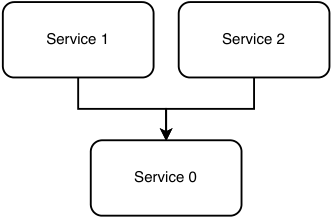
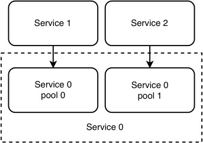
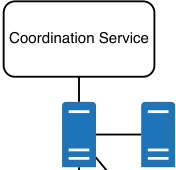
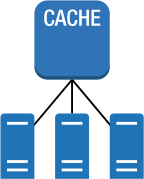

# _Non-functional requirements_

## _This chapter covers_

- Discussing non-functional requirements at the start of the interview

- Using techniques and technologies to fulfill non-functional requirements

- Optimizing for non-functional requirements

A system has functional and non-functional requirements. Functional requirements describe the inputs and outputs of the system. You can represent them as a rough API specification and endpoints.

_Non-functional requirements_ refer to requirements other than the system inputs and outputs. Typical non-functional requirements include the following, to be discussed in detail later in this chapter.

- _Scalability_ —The ability of a system to adjust its hardware resource usage easily and with little fuss to cost-efficiently support its load.

- _Availability_ —The percentage of time a system can accept requests and return the desired response.

- _Performance/latency/P99 and throughput_ —Performance or latency is the time taken for a user’s request to the system to return a response. The maximum request rate that a system can process is its bandwidth. Throughput is the current request rate being processed by the system. However, it is common (though incorrect) to use the term “throughput” in place of “bandwidth.” Throughput/bandwidth is the inverse of latency. A system with low latency has high throughput.

- _Fault-tolerance_ —The ability of a system to continue operating if some of its components fail and the prevention of permanent harm (such as data loss) should downtime occur.

- _Security_ —Prevention of unauthorized access to systems.

- _Privacy_ —Access control to Personally Identifiable Information (PII), which can be used to uniquely identify a person.

- _Accuracy_ —A system’s data may not need to be perfectly accurate, and accuracy tradeoffs to improve costs or complexity are often a relevant discussion.

- _Consistency_ —Whether data in all nodes/machines match.

- _Cost_ —We can lower costs by making tradeoffs against other non-functional properties of the system.

- _Complexity, maintainability, debuggability, and testability_ —These are related concepts that determine how difficult it is to build a system and then maintain it after it is built.

A customer, whether technical or non-technical, may not explicitly request non-functional requirements and may assume that the system will satisfy them. This means that the customer’s stated requirements will almost always be incomplete, incorrect, and sometimes excessive. Without clarification, there will be misunderstandings on the requirements. We may not obtain certain requirements and therefore inadequately satisfy them, or we may assume certain requirements, which are actually not required and provide an excessive solution.

A beginner is more likely to fail to clarify non-functional requirements, but a lack of clarification can occur for both functional and non-functional requirements. We must begin any systems design discussion with discussion and clarification of both the functional and non-functional requirements.

Non-functional requirements are commonly traded off against each other. In any system design interview, we must discuss how various design decisions can be made for various tradeoffs.

It is tricky to separately discuss non-functional requirements and techniques to address them because certain techniques have tradeoff gains on multiple non-functional requirements for losses on others. In the rest of this chapter, we briefly discuss each non-functional requirement and some techniques to fulfill it, followed by a detailed discussion of each technique.

## _3.1 Scalability_

_Scalability_ is the ability of a system to adjust its hardware resource usage easily and with little fuss to cost-efficiently support its load.

The process of expanding to support a larger load or number of users is called _scaling._ Scaling requires increases in CPU processing power, RAM, storage capacity, and network bandwidth. Scaling can refer to vertical scaling or horizontal scaling.

Vertical scaling is conceptually straightforward and can be easily achieved just by spending more money. It means upgrading to a more powerful and expensive host, one with a faster processor, more RAM, a bigger hard disk drive, a solid-state drive instead of a spinning hard disk for lower latency, or a network card with higher bandwidth. There are three main disadvantages of vertical scaling.

First, we will reach a point where monetary cost increases faster than the upgraded hardware’s performance. For example, a custom mainframe that has multiple processors will cost more than the same number of separate commodity machines that have one processor each.

Second, vertical scaling has technological limits. Regardless of budget, current technological limitations will impose a maximum amount of processing power, RAM, or storage capacity that is technologically possible on a single host.

Third, vertical scaling may require downtime. We must stop our host, change its hardware and then start it again. To avoid downtime, we need to provision another host, start our service on it, and then direct requests to the new host. Moreover, this is only possible if the service’s state is stored on a different machine from the old or new host. As we discuss later in this book, directing requests to specific hosts or storing a service’s state in a different host are techniques to achieve many non-functional requirements, such as scalability, availability, and fault-tolerance.

Because vertical scaling is conceptually trivial, in this book unless otherwise stated, our use of terms like “scalable” and “scaling” refer to horizontally scalable and horizontal scaling.

Horizontal scaling refers to spreading out the processing and storage requirements across multiple hosts. “True” scalability can only be achieved by horizontal scaling. Horizontal scaling is almost always discussed in a system design interview.

Based on these questions, we determine the customer’s scalability requirements.

- How much data comes to the system and is retrieved from the system?

- How many read queries per second?

- How much data per request?

- How many video views per second?

- How big are sudden traffic spikes?

### _3.1.1 Stateless and stateful services_

HTTP is a stateless protocol, so a backend service that uses it is easy to scale horizontally. Chapter 4 describes horizontal scaling of database reads. A stateless HTTP backend combined with horizontally scalable database read operations is a good starting point to discuss a scalable system design.

Writes to shared storage are the most difficult to scale. We discuss techniques, including replication, compression, aggregation, denormalization, and Metadata Service later in this book.

Refer to section 6.7 for a discussion of various common communication architectures, including the tradeoffs between stateful and stateless.

### _3.1.2 Basic load balancer concepts_

Every horizontally scaled service uses a load balancer, which may be one of the following:

- A hardware load balancer, a specialized physical device that distributes traffic across multiple hosts. Hardware load balancers are known for being expensive and can cost anywhere from a few thousand to a few hundred thousand dollars.

- A shared load balancer service, also referred to as LBaaS (load balancing as a service).

- A server with load balancing software installed. HAProxy and NGINX are the most common.

This section discusses basic concepts of load balancers that we can use in an interview.

In the system diagrams in this book, I draw rectangles to represent various services or other components and arrows between them to represent requests. It is usually understood that requests to a service go through a load balancer and are routed to a service’s hosts. We usually do not illustrate the load balancers themselves.

We can tell the interviewer that we need not include a load balancer component in our system diagrams, as it is implied, and drawing it and discussing it on our system diagrams is a distraction from the other components and services that compose our service.

#### level 4 vs. level

We should be able to distinguish between level 4 and level 7 load balancers and discuss which one is more suitable for any particular service. A level 4 load balancer operates at the transport layer (TCP). It makes routing decisions based on address information extracted from the first few packets in the TCP stream and does not inspect the contents of other packets; it can only forward the packets. A level 7 load balancer operates at the application layer (HTTP), so it has these capabilities:

- _Load balancing/routing decisions_ —Based on a packet’s contents.

- _Authentication_ —It can return 401 if a specified authentication header is absent.

- _TLS termination_ —Security requirements for traffic within a data center may be ‹

- lower than traffic over the internet, so performing TLS termination (HTTPS HTTP) means there is no encryption/decryption overhead between data center hosts. If our application requires traffic within our data center to be encrypted (i.e., encryption in transit), we will not do TLS termination.

#### sticky sessions

A sticky session refers to a load balancer sending requests from a particular client to a particular host for a duration set by the load balancer or the application. Sticky sessions are used for stateful services. For example, an ecommerce website, social media website, or banking website may use sticky sessions to maintain user session data like login information or profile preferences, so a user doesn’t have to reauthenticate or reenter preferences as they navigate the site. An ecommerce website may use sticky sessions for a user’s shopping cart.

A sticky session can be implemented using duration-based or application-controlled cookies. In a duration-based session, the load balancer issues a cookie to a client that defines a duration. Each time the load balancer receives a request, it checks the cookie. In an application-controlled session, the application generates the cookie. The load balancer still issues its own cookie on top of this application-issued cookie, but the load balancer’s cookie follows the application cookie’s lifetime. This approach ensures clients are not routed to another host after the load balancer’s cookie expires, but it is more complex to implement because it requires additional integration between the application and the load balancer.

#### session replication

In _session replication_ , writes to a host are copied to several other hosts in the cluster that are assigned to the same session, so reads can be routed to any host with that session. This improves availability.

These hosts may form a backup ring. For example, if there are three hosts in a session, when host A receives a write, it writes to host B, which in turn writes to host C. Another way is for the load balancer to make write requests to all the hosts assigned to a session.

#### load balancing vs. reverse proxy

You may come across the term “reverse proxy” in other system design interview preparation materials. We will briefly compare load balancing and reverse proxy.

Load balancing is for scalability, while reverse proxy is a technique to manage  client– server communication. A reverse proxy sits in front of a cluster of servers and acts as a gateway between clients and servers by intercepting and forwarding incoming requests to the appropriate server based on request URI or other criteria. A reverse proxy may also provide performance features, such as caching and compression, and security features, such as SSL termination. Load balancers can also provide SSL termination, but their main purpose is scalability.

Refer to https://www.nginx.com/resources/glossary/reverse-proxy-vs-load-balancer/foragooddiscussiononloadbalancingversus reverse proxy.

#### further reading

- https://www.cloudflare.com/learning/performance/types-of-load-balancing-algorithms/isagoodbriefdescriptionofvarious load balancing algorithms.

- https://rancher.com/load-balancing-in-kubernetesisagoodintroductiontoloadbalancingin Kubernetes.

- https://kubernetes.io/docs/concepts/services-networking/service/#loadbalancerandhttps://kubernetes.io/docs/tasks/access-application-cluster/create-external-load-balancer/describehowtoattachanexternal cloud service load balancer to a Kubernetes service.

## _3.2 Availability_

_Availability_ is the percentage of time a system can accept requests and return the desired response. Common benchmarks for availability are shown in table 3.1.

Table 3.1    Common benchmarks for availability

|Availability %|Downtime per year|Downtime per month|Downtime per week|Downtime per day|
|---|---|---|---|---|
|99.9 (three 9s) 99.99 (four 9s) 99.999 (fve 9s)|8.77 hours 52.6 minutes 5.26 minutes|43.8 minutes 4.38 minutes 26.3 seconds|10.1 minutes 1.01 minutes 6.05 seconds|1.44 minutes 8.64 seconds 864 milliseconds|

Refer to https://netflixtechblog.com/active-active-for-multi-regional-resiliency-c47719f6685bforadetaileddiscussionon Netflix’s multi-region active-active deployment for high availability. In this book, we discuss similar techniques for high availability, such as replication within and across data centers in different continents. We also discuss monitoring and alerting.

High availability is required in most services, and other non-functional requirements may be traded off to allow high availability without unnecessary complexity.

When discussing the non-functional requirements of a system, first establish whether high availability is required. Do not assume that strong consistency and low latency are required. Refer to the CAP theorem and discuss if we can trade them off for higher availability. As far as possible, suggest using asynchronous communication techniques that accomplish this, such as event sourcing and saga, discussed in chapters 4 and 5.

Services where requests do not need to be immediately processed and responses immediately returned are unlikely to require strong consistency and low latency, such as requests made programmatically between services. Examples include logging to longterm storage or sending a request in Airbnb to book a room for some days from now.

Use synchronous communication protocols when an immediate response is absolutely necessary, typically for requests made directly by people using your app.

Nonetheless, do not assume that requests made by people need immediate responses with the requested data. Consider whether the immediate response can be an acknowledgment and whether the requested data can be returned minutes or hours later. For example, if a user requests to submit their income tax payment, this payment need not happen immediately. The service can queue the request internally and immediately respond to the user that the request will be processed in minutes or hours. The payment can later be processed by a streaming job or a periodic batch job, and then the user can be notified of the result (such as whether the payment succeeded or failed) through channels such as email, text, or app notifications.

An example of a situation where high availability may not be required is in a caching service. Because caching may be used to reduce the latency and network traffic of a request and is not needed to fulfill the request, we may decide to trade off availability for lower latency in the caching service’s system design. Another example is rate limiting, discussed in chapter 8.

Availability can also be measured with incident metrics. https://www.atlassian.com/incident-management/kpis/common-metricsdescribesvariousincidentmetricslike MTTR (Mean Time to Recovery) and MTBF (Mean Time Between Failures). These metrics usually have dashboards and alerts.

## _3.3 Fault-tolerance_

Fault-tolerance is the ability of a system to continue operating if some of its components fail and the prevention of permanent harm (such as data loss) should downtime occur. This allows graceful degradation, so our system can maintain some functionality when parts of it fail, rather than a complete catastrophic failure. This buys engineers time to fix the failed sections and restore the system to working order. We may also implement self-healing mechanisms that automatically provision replacement components and attach them to our system, so our system can recover without manual intervention and without any noticeable effect on end users.

Availability and fault-tolerance are often discussed together. While availability is a measure of uptime/downtime, fault-tolerance is not a measure but rather a system characteristic.

A closely related concept is failure design, which is about smooth error handling. Consider how we will handle errors in third-party APIs that are outside our control as well as silent/undetected errors. Techniques for fault-tolerance include the following.

### _3.3.1 Replication and redundancy_

Replication is discussed in chapter 4.

One replication technique is to have multiple (such as three) redundant instances/ copies of a component, so up to two can be simultaneously down without affecting uptime. As discussed in chapter 4, update operations are usually assigned a particular host, so update performance is affected only if the other hosts are on different data centers geographically further away from the requester, but reads are often done on all replicas, so read performance decreases when components are down.

One instance is designated as the source of truth (often called the leader), while the other two components are designated as replicas (or followers). There are various possible arrangements of the replicas. One replica is on a different server rack within the same data center, and another replica is in a different data center. Another arrangement is to have all three instances on different data centers, which maximizes fault-tolerance with the tradeoff of lower performance.

An example is the Hadoop Distributed File System (HDFS), which has a configurable property called “replication factor” to set the number of copies of any block. The default value is three. Replication also helps to increase availability.

### _3.3.2 Forward error correction and error correction code_

_Forward error correction_ (FEC) is a technique to prevent errors in data transmission over noise or unreliable communication channels by encoding the message in a redundant way, such as by using an _error correction code_ (ECC).

FEC is a protocol-level rather than a system-level concept. We can express our awareness of FEC and ECC during system design interviews, but it is unlikely that we will need to explain it in detail, so we do not discuss them further in this book.

### _3.3.3 Circuit breaker_

The circuit breaker is a mechanism that stops a client from repeatedly attempting an operation that is likely to fail. With respect to downstream services, a circuit breaker calculates the number of requests that failed within a recent interval. If an error threshold is exceeded, the client stops calling downstream services. Sometime later, the client attempts a limited number of requests. If they are successful, the client assumes that the failure is resolved and resumes sending requests without restrictions.

DEFINITION    If a service B depends on a service A, A is the upstream service and B is the downstream service.

A circuit breaker saves resources from being spent to make requests that are likely to fail. It also prevents clients from adding additional burden to an already overburdened system.

However, a circuit breaker makes the system more difficult to test. For example, say we have a load test that is making incorrect requests but is still properly testing our system’s limits. This test will now activate the circuit breaker, and a load that may have previously overwhelmed the downstream services and will now pass. A similar load by our customers will cause an outage. It is also difficult to estimate the appropriate error threshold and timers.

A circuit breaker can be implemented on the server side. An example is Resilience4j (https://github.com/resilience4j/resilience4j).Itwasinspiredby Hystrix (https://github.com/Netflix/Hystrix),whichwasdevelopedat Netflix and transitioned to maintenance mode in 2017 (https://github.com/Netflix/Hystrix/issues/#issuecomment-440065505).Netflix’sfocushasshiftedtowardmore adaptive implementations that react to an application’s real-time performance rather than pre-configured settings, such as adaptive concurrency limits (https://netflixtechblog.medium.com/performance-under-load-3e6fa9a60581).###_3.3.4 Exponential backoff and retry_

Exponential backoff and retry is similar to a circuit breaker. When a client receives an error response, it will wait before reattempting the request and exponentially increase the wait duration between retries. The client also adjusts the wait period by a small random negative or positive amount, a technique called “jitter.” This prevents multiple clients from submitting retries at exactly the same time, causing a “retry storm” that may overwhelm the downstream service. Similar to a circuit breaker, when a client receives a success response, it assumes that the failure is resolved and resumes sending requests without restrictions.

### _3.3.5 Caching responses of other services_

Our service may depend on external services for certain data. How should we handle the case where an external service is unavailable? It is generally preferable to have graceful degradation instead of crashing or returning an error. We can use a default or empty response in place of the return value. If using stale data is better than no data, we can cache the external service’s responses whenever we make successful requests and use these responses when the external service is unavailable.

### _3.3.6 Checkpointing_

A machine may perform certain data aggregation operations on many data points by systematically fetching a subset of them, performing the aggregation on them, then writing the result to a specified location, repeating this process until all data points are processed or infinitely, such as in the case of a streaming pipeline. Should this machine fail during data aggregation, the replacement machine should know from which data points to resume the aggregation. This can be done by writing a checkpoint after each subset of data points are processed and the result is successfully written. The replacement machine can resume processing at the checkpoint.

Checkpointing is commonly applied to ETL pipelines that use message brokers such as Kafka. A machine can fetch several events from a Kafka topic, process the events, and then write the result, followed by writing a checkpoint. Should this machine fail, its replacement can resume at the most recent checkpoint.

Kafka offers offset storages at the partition level in Kafka (https://kafka.apache.org/22/javadoc/org/apache/kafka/clients/consumer/KafkaConsumer.html). Flinkconsumesdatafrom Kafka topics and periodically checkpoints using Flink’s distributed checkpointing mechanism (https://ci.apache.org/projects/flink/flink-docs-master/docs/dev/datastream/fault-tolerance/checkpointing/).###_3.3.7 Dead letter queue_

If a write request to a third-party API fails, we can queue the request in a dead letter queue and try the requests again later.

Are dead letter queues stored locally or on a separate service? We can trade off complexity and reliability:

- The simplest option is that if it is acceptable to miss requests, just drop failed requests.

- Implement the dead letter queue locally with a try-catch block. Requests will be lost if the host fails.

- A more complex and reliable option is to use an event-streaming platform like Kafka.

In an interview, you should discuss multiple approaches and their tradeoffs. Don’t just state one approach.

### _3.3.8 Logging and periodic auditing_

One method to handle silent errors is to log our write requests and perform periodic auditing. An auditing job can process the logs and verify that the data on the service we write to matches the expected values. This is discussed further in chapter 10.

### _3.3.9 Bulkhead_

The bulkhead pattern is a fault-tolerance mechanism where a system is divided into isolated pools, so a fault in one pool will not affect the entire system.

For example, the various endpoints of a service can each have their own thread pool, and not share a thread pool, so if an endpoint’s thread pool is exhausted, this will not affect the ability of other endpoints to serve requests (To learn more about this, see _Microservices for the Enterprise: Designing, Developing, and Deploying_ by Indrasiri and Siriwardena (Apress, 2019).

Another example of bulkhead is discussed in _Release It!: Design and Deploy Production-Ready Software, Second Edition_ by Michael T. Nygard’s (Pragmatic Bookshelf, 2018). A certain request may cause a host to crash due to a bug. Each time this request is repeated, it will crash another host. Dividing the service into bulkheads (i.e., dividing the hosts into pools) prevents this request from crashing all the hosts and causing a total outage. This request should be investigated, so the service must have logging and monitoring. Monitoring will detect the offending request, and engineers can use the logs to troubleshoot the crash and determine its cause.

Or a requestor may have a high request rate to a service and prevent the latter from serving other requestors. The bulkhead pattern allocates certain hosts to a particular requestor, preventing the latter from consuming all the service’s capacity. (Rate limiting discussed in chapter 8 is another way to prevent this situation.)

A service’s hosts can be divided into pools, and each pool is allocated requestors. This is also a technique to prioritize certain requestors by allocating more resources to them.

In figure 3.1, a service serves two other services. Unavailability of the service’s hosts will prevent it from serving any requestor.

Figure 3.1    All requests to service 0 are load-balanced across its hosts. The unavailability of service 0’s hosts will prevent it from serving any requestor.

In figure 3.2, a service’s hosts are divided into pools, which are allocated to requestors. The unavailability of the hosts of one pool will not affect other requestors. An obvious tradeoff of this approach is that the pools cannot support each other if there are traffic spikes from certain requestors. This is a deliberate decision that we made to allocate a certain number of hosts to a particular requestor. We can either manually or automatically scale the pools as required.

Figure 3.2    Service 0 is divided into two pools, each allocated to a requestor. The unavailability of one pool will not affect the other.

Refer to Michael Nygard’s book _Release It!: Design and Deploy Production-Ready Software,_ Second Edition (Pragmatic Bookshelf, 2018), for other examples of the bulkhead pattern.

We will not mention bulkhead in the system design discussions of part 2, but it is generally applicable for most systems, and you can discuss it during an interview.

### _3.3.10 Fallback pattern_

The fallback pattern consists of detecting a problem and then executing an alternative code path, such as cached responses or alternative services that are similar to the service the client is trying to get information from. For example, if a client requests our backend for a list of nearby bagel cafes, it can cache the response to be used in the future if our backend service is experiencing an outage. This cached response may not be up to date, but it is better than returning an error message to the user. An alternative is for the client to make a request to a third-party maps API like Bing or Google Maps, which may not have the customized content that our backend provides. When we design a fallback, we should consider its reliability and that the fallback itself may fail.

NOTE    Refer to https://aws.amazon.com/builders-library/avoiding-fallback-in-distributed-systems/formoreinformationonfallbackstrategies,why Amazon almost never uses the fallback pattern, and alternatives to the fallback pattern that Amazon uses.

## _3.4 Performance/latency and throughput_

Performance or latency is the time taken for a user’s request to the system to return a response. This includes the network latency of the request to leave the client and travel to the service, the time the service takes to process the request and create the response, and the network latency of the response to leave the service and travel to the client. A typical request on a consumer-facing app (e.g., viewing a restaurant’s menu on a food delivery app or submitting a payment on an ecommerce app) has a desired latency of tens of milliseconds to several seconds. High-frequency trading applications may demand latency of several milliseconds.

Strictly speaking, latency refers to the travel time of a packet from its source to its destination. However, the term “latency” has become commonly used to have the same meaning as “performance,” and both terms are often used interchangeably. We still use the term latency if we need to discuss packet travel time.

The term latency can also be used to describe the request-response time between components within the system, rather than the user’s request-response time. For example, if a backend host makes a request to a logging or storage system to store data, the system’s latency is the time required to log/store the data and return a response to the backend host.

The system’s functional requirements may mean that a response may not actually need to contain the information requested by the user but may simply be an acknowledgment along with a promise that after a specified duration, the requested information will be sent to the user or will be available for the user to obtain by making another request. Such a tradeoff may simplify the system’s design, so we must always clarify requirements and discuss how soon information is required after a user’s request.

Typical design decisions to achieve low latency include the following. We can deploy the service in a data center geographically close to its users, so packets between users and our service do not need to travel far. If our users are geographically dispersed, we may deploy our service in multiple data centers that are chosen to minimize geographical distance to clusters of users. If hosts across data centers need to share data, our service must be horizontally scalable.

Occasionally, there may be other factors that contribute more to latency than the physical distance between users and data centers, such as traffic or network bandwidth, or the backend system processing (the actual business logic and the persistence layer). We can use test requests between users and various data centers to determine the data center with the lowest latency for users in a particular location.

Other techniques include using a CDN, caching, decreasing the data size with RPC instead of REST, designing your own protocol with a framework like Netty to use TCP and UDP instead of HTTP, and using batch and streaming techniques.

In examining latency and throughput, we discuss the characteristics of the data and how it gets in and out of the system, and then we can suggest strategies. Can we count views several hours after they happened? This will allow batch or streaming approaches. What is the response time? If small, data must already be aggregated, and aggregation should be done during writes, with minimal or no aggregation during reads.

## _3.5 Consistency_

Consistency has different meanings in ACID and CAP (from the CAP theorem). ACID consistency focuses on data relationships like foreign keys and uniqueness. As stated in Martin Kleppmann’s _Designing Data-Intensive Applications_ (O’Reilly, 2017), CAP consistency is actually linearizability, defined as all nodes containing the same data at a moment in time, and changes in data must be linear; that is, nodes must start serving the changes at the same time.

Eventually, consistent databases trade off consistency for improvements in availability, scalability, and latency. An ACID database, including RDBMS databases, cannot accept writes when it experiences a network partition because it cannot maintain ACID consistency if writes occur during a network partition. Summarized in table 3.2, MongoDB, HBase, and Redis trade off availability for linearizability, while CouchDB, Cassandra, Dynamo, Hadoop, and Riak trade off linearizability for availability.

Table 3.2    Databases that favor availability vs. linearizability

|Favor linearizability|Favor availability|
|---|---|
|||
|HBase MongoDB Redis|Cassandra CouchDB Dynamo Hadoop Riak|

During the discussion, we should emphasize the distinction between ACID and CAP consistency, and the tradeoffs between linearizability vs. eventual consistency. In this book, we will discuss various techniques for linearizability and eventual consistency, including the following:

- Full mesh

- Quorum

Techniques for eventual consistency that involve writing to a single location, which propagates this write to the other relevant locations:

- Event sourcing (section 5.2), a technique to handle traffic spikes.

- Coordination service.

- Distributed cache.

Techniques for eventual consistency that trade off consistency and accuracy for lower cost:

- Gossip protocol.

- Random leader selection.

Disadvantages of linearizability include the following:

- Lower availability, since most or all nodes must be sure of consensus before they can serve requests. This becomes more difficult with a larger number of nodes.

- More complex and expensive.

### _3.5.1 Full mesh_

Figure 3.3 illustrates an example of full mesh. Every host in the cluster has the address of every other host and broadcasts messages to all of them.

Figure 3.3 Illustration of full mesh. Every host is connected to every other host and broadcasts messages to all of them.

How do hosts discover each other? When a new host is added, how is its address sent to other hosts? Solutions for host discovery include:

- Maintain the list of addresses in a configuration file. Each time the list changes, deploy this file across all hosts/nodes.

- Use a third-party service that listens for heartbeats from every host. A host is kept registered as long as the service receives heartbeats. All hosts use this service to obtain the full list of addresses.

Full mesh is easier to implement than other techniques, but it is not scalable. The number of messages grows quadratically with the number of hosts. Full mesh works well for small clusters but cannot support big clusters. In quorum, only a majority of hosts need to have the same data for the system to be considered consistent. BitTorrent is an example of a protocol that uses full mesh for decentralized p2p file sharing. During an interview, we can briefly mention full mesh and compare it with scalable approaches.

### _3.5.2 Coordination service_

Figure 3.4 illustrates a coordination service, a third-party component that chooses a leader node or set of leader nodes. Having a leader decreases the number of messages. All other nodes send their messages to the leader, and the leader may do some necessary processing and send back the final result. Each node only needs to communicate with its leader or set of leaders, and each leader manages a number of nodes.

Example algorithms are Paxos, Raft, and Zab. Another example is single leader multiple follower in SQL (section 4.3.2), a technique to allow scalable reads. ZooKeeper (https://zookeeper.apache.org/)isadistributedcoordinationservice. ZooKeeper has the following advantages over a config file stored on a single host. (Most of these advantages are discussed at https://stackoverflow.com/q/36312640/1045085.) We can implement these features on a distributed filesystem or distributed database, but ZooKeeper already provides them:

- Access control (https://zookeeper.apache.org/doc/r3.1.2/zookeeperProgrammers.html#sc_ZooKeeperAccessControl).-Storingdatainmemoryforhigh performance.

- Scalability, with horizontal scaling by adding hosts to the ZooKeeper Ensemble (https://zookeeper.apache.org/doc/r3.1.2/zookeeperAdmin.html#sc_zkMulitServerSetup).-Guaranteedeventualconsistencywithinaspecified time bound or strong consistency with higher cost (https://zookeeper.apache.org/doc/current/zookeeperInternals.html#sc_consistency).ZooKeepertradesoffavailabilityforconsistency; it is a CP system in the CAP theorem.

- Clients can read data in the order it is written.

Complexity is the main disadvantage of a coordination service. A coordination service is a sophisticated component that has to be highly reliable and ensure one and only one leader is elected. (The situation where two nodes both believe they are the leader is called “split brain.” Refer to Martin Kleppmann, _Designing Data-Intensive Applications,_ O’Reilly, 2017, p. 158.)

### _3.5.3 Distributed cache_

We can use a distributed cache like Redis or Memcached. Referring to figure 3.5, our service’s nodes can make periodic requests to the origin to fetch new data, then make requests to the distributed cache (e.g., an in-memory store like Redis) to update its data. This solution is simple, has low latency, and the distributed cache cluster can be scaled independently of our service. However, this solution has more requests than every other solution here except the full mesh.

Figure 3.5    Illustration of using a distributed cache to broadcast messages. The nodes can make requests to an in-memory store like Redis to update data, or it can make periodic requests to fetch new data.

NOTE    Redis is an in-memory cache, not a typically distributed one by definition. It is used as a distributed cache for practical intents and purposes. Refer to https:// redis.io/docs/about/ and https://stacoverflow.com/questions/18376665/redis-distributed-or-not.Bothasenderandreceiverhostcan validate that a message contains its required fields. This is often done by both sides because the additional cost is trivial while reducing the possibility of errors on either side, resulting in an invalid message. When a sender host sends an invalid message to a receiver host via an HTTP request, and the receiver host can detect that this message is invalid, it can immediately return a 400 or 422. We can set up high-urgency alerts to trigger on 4xx errors, so we will immediately be alerted of this error and can immediately investigate. However, if we use Redis, invalid data written by a node may stay undetected until it is fetched by another node, so there will be a delay in alerts.

Requests sent directly from one host to another go through schema validation. However, Redis is just a database, so it does not validate schema, and hosts can write arbitrary data to it. This may create security problems. (Refer to https://www.trendmicro.com/en_us/research/20/d/exposed-redis-instances-abused-for-remote-code-execution-cryptocurrency-mining.htmlandhttps://www.imperva.com/blog/new-research-shows-75-of-open-redis-servers-infected.) Redis is designed to be accessed by trusted clients inside trusted environments (https://redis.io/topics/security).Redisdoesnotsupportencryption,which may be a privacy concern. Implementing encryption at rest increases complexity, costs, and reduces performance (https://docs.aws.amazon.com/AmazonElastiCache/latest/red-ug/at-rest-encryption.html). Acoordinationserviceaddressesthesedisadvantages but has higher complexity and cost.

### _3.5.4 Gossip protocol_

Gossip protocol is modeled after how epidemics spread. Referring to figure 3.6, each node randomly selects another node periodically or with a random interval and then shares data. This approach trades off consistency for lower cost and complexity.

Figure 3.6 Illustration of gossip communication

Cassandra uses a gossip protocol to maintain consistency across distributed data partitions. DynamoDB uses a gossip protocol called “vector clocks” to maintain consistency across multiple data centers.

### _3.5.5 Random Leader Selection_

Referring to figure 3.7, random leader selection uses a simple algorithm to elect a leader. This simple algorithm does not guarantee one and only one leader, so there may be multiple leaders. This is a minor problem because each leader can share data with all other hosts, so all hosts, including all leaders, will have the correct data. The disadvantage is possible duplicate requests and unnecessary network traffic.

Leader Figure 3.7 Illustration of multiple leaders, which can result from random leader Leader selection

Kafka uses a leader-follower replication model with random leader selection to provide fault-tolerance. YARN uses a random leader selection approach to manage resource allocation across a cluster of hosts.

## _3.6 Accuracy_

Accuracy is a relevant non-functional requirement in systems with complex data processing or a high rate of writes. _Accuracy_ of data means that the data values are correct and are not approximations. Estimation algorithms trade off accuracy for lower complexity. Examples of estimation algorithms include HyperLogLog for cardinality

(COUNT DISTINCT) estimate in the Presto distributed SQL query engine and countmin sketch for estimating frequencies of events in a stream of data.

A cache is stale if the data in its underlying database has been modified. A cache may have a refresh policy where it will fetch the latest data at a fixed periodic interval. A short refresh policy is more costly. An alternative is for the system to update or delete the associated cache key when data is modified, which increases complexity.

Accuracy is somewhat related to consistency. Systems that are eventually consistent trade off accuracy for improvements in availability, complexity, and cost. When a write is made to an eventually consistent system, results from reads made after this write may not include the effects of the write, which makes them inaccurate. The eventually consistent system is inaccurate until the replicas are updated with the effects of the write operation. However, we use the term “consistency” to discuss such a situation, not “accuracy.”

## _3.7 Complexity and maintainability_

The first step to minimize complexity is to clarify both functional and non-functional requirements, so we do not design for unnecessary requirements.

As we sketch design diagrams, note which components may be separated into independent systems. Use common services to reduce complexity and improve maintainability. Common services that are generalizable across virtually all services include

- Load balancer service.

- Rate limiting. Refer to chapter 8.

- Authentication and authorization. Refer to appendix B.

- Logging, monitoring, alerting. Refer to section 2.5.

- TLS termination. Refer to other sources for more information.

- Caching. Refer to section 4.8.

- DevOps and CI/CD if applicable. These are outside the scope of this book.

Services that are generalizable for certain organizations, such as those that collect user data for data science, include analytics and machine learning.

Complex systems may require yet more complexity for high availability and high fault-tolerance. If a system has an unavoidable degree of complexity, consider tradeoffs of complexity for lower availability and fault-tolerance.

Discuss possible tradeoffs in other requirements to improve complexity, such as ETL pipelines to delay data processing operations that need not occur in real time.

A common technique to trade off complexity for better latency and performance is to use techniques that minimize the size of messages in network communication. Such techniques include RPC serialization frameworks and Metadata services. (Refer to section 6.3 for a discussion on Metadata service.)

RPC serialization frameworks such as Avro, Thrift, and protobuf can reduce message size at the expense of maintaining schema files. (Refer to section 6.7 for a discussion of REST vs RPC.) We should always suggest using such serialization frameworks in any interview, and we will not mention this point again in the book.

We should also discuss how outages can occur, evaluate the effect of various outages on users and the business, and how to prevent and mitigate outages. Common concepts include replication, failover, and authoring runbooks. Runbooks are discussed in section 2.5.3.

We will discuss complexity in all chapters of part 2.

### _3.7.1 Continuous deployment (CD)_

Continuous deployment (CD) was first mentioned in this book in section 1.4.5. As mentioned in that section, CD allows easy deployments and rollbacks. We have a fast feedback cycle that improves our system’s maintainability. If we accidentally deploy a buggy build to production, we can easily roll it back. Fast and easy deployments of incremental upgrades and new features lead to a fast software development lifecycle. This is a major advantage of services over monoliths, as discussed in appendix A.

Other CD techniques include blue/green deployments, also referred to as zero downtime deployments. Refer to sources such as https://spring.io/blog/2016/05/31/zero-downtime-deployment-with-a-database,https://dzone.com/articles/zero-downtime-deployment,andhttps://craftquest.io/articles/what-are-zero-downtime-atomic-deploymentsformoreinformation.

Static code analysis tools like SonarQube (https://www.sonarqube.org/)alsoimproveoursystem’smaintainability.##_3.8 Cost_

In system design discussions, we can suggest trading off other non-functional requirements for lower cost. Examples:

- Higher cost for lower complexity by vertical scaling instead of horizontal scaling.

- Lower availability for improved costs by decreasing the redundancy of a system (such as the number of hosts, or the replication factor in a database).

- Higher latency for improved costs by using a data center in a cheaper location that is further away from users.

Discuss the cost of implementation, cost of monitoring, and cost of each non-functional requirement such as high availability.

Production problems vary in seriousness and how quickly they must be addressed and resolved, so do not implement more monitoring and alerting than required. Costs are higher if engineers need to be alerted to a problem as soon as it occurs, compared to when it is permissible for alerts to be created hours after a problem.

Besides the cost of maintenance in the form of addressing possible production problems, there will also be costs due to the natural atrophy of software over time as libraries and services are deprecated. Identify components that may need future updates. Which dependencies (such as libraries) will prevent other components from being easily

_**Privacy**_ updated if these dependencies become unsupported in the future? How may we design our system to more easily replace these dependencies if updates are required?

How likely is it that we will need to change dependencies in the future, particularly third-party dependencies where we have less control? Third-party dependencies may be decommissioned or prove unsatisfactory for our requirements, such as reliability or security problems.

A complete cost discussion should include consideration of the costs to decommission the system if necessary. We may decide to decommission the system for multiple reasons, such as the team deciding to change its focus or the system has too few users to justify its development and maintenance costs. We may decide to provide the existing users with their data, so we will need to extract the data into various text and/or CSV files for our users.

## _3.9_

#### _Security_

During an interview, we may need to discuss possible security vulnerabilities in our system and how we will prevent and mitigate security breaches. This includes access both from external parties and internally within our organization. The following topics are commonly discussed with regard to security:

- TLS termination versus keeping data encrypted between services or hosts in a data center (called encryption in transit). TLS termination is usually done to save processing because encryption between hosts in a data center is usually not required. There may be exceptions for sensitive data on which we use encryption in transit.

- Which data can be stored unencrypted, and which should be stored encrypted (called _encryption at rest_ ). Encryption at rest is conceptually different from storing hashed data.

We should have some understanding of OAuth 2.0 and OpenID Connect, which are described in appendix B.

We may also discuss rate limiting to prevent DDoS attacks. A rate-limiting system can make up its own interview question, and this is discussed in chapter 8. It should be mentioned during the design of almost any external-facing system.

## _3.10 Privacy_

Personally Identifiable Information (PII) is data that can be used to uniquely identify a customer, such as full name, government identifiers, addresses, email addresses, and bank account identifiers. PII must be safeguarded to comply with regulations such as the General Data Protection Regulation (GDPR) and the California Consumer Privacy Act (CCPA). This includes both external and internal access.

Within our system, access control mechanisms should be applied to PII stored in databases and files. We can use mechanisms such as the Lightweight Directory Access Protocol (LDAP). We can encrypt data both in transit (using SSL) and at rest.

Consider using hashing algorithms such as SHA-2 and SHA-3 to mask PII and maintain individual customer privacy in computing aggregate statistics (e.g., mean number of transactions per customer).

If PII is stored on an append-only database or file system like HDFS, a common privacy technique is to assign each customer an encryption key. The encryption keys can be stored in a mutable storage system like SQL. Data associated with a particular customer should be encrypted with their encryption key before it is stored. If a customer’s data needs to be deleted, all that must be done is to delete the customer’s encryption key, and then all of the customer’s data on the append-only storage becomes inaccessible and hence effectively deleted.

We can discuss the complexity, cost, and effects of privacy along many aspects, such as customer service or personalization, including machine learning.

We should also discuss prevention and mitigation strategies for data breaches, such as data retention policies and auditing. The details tend to be specific to each organization, so it is an open-ended discussion.

### _3.10.1 External vs. internal services_

If we design an external service, we definitely should design security and privacy mechanisms. What about internal services that only serve other internal services? We may decide to rely on the security mechanisms of our user services against malicious external attackers and assume that internal users will not attempt malicious actions, so security measures are not required for our rate limiter service. We may also decide that we trust our user services not to request data about rate limiter requestors from other user services, so privacy measures are not required.

However, it is likely that we will decide that our company should not trust internal users to properly implement security mechanisms, should not trust that internal users are not malicious, and should not trust internal users to not inadvertently or maliciously violate our customer’s privacy. We should adopt an engineering culture of implementing security and privacy mechanisms by default. This is consistent with the internal access controls and privacy policies of all kinds of services and data adopted by most organizations. For example, most organizations have role-based access control for each service’s Git repository and CI/CD. Most organizations also have procedures to grant access to employee and customer data only to persons they deem necessary to have access to this data. These access controls and data access are typically limited in scope and duration as much as possible. There is no logical reason to adopt such policies for certain systems and not adopt them for others. We should ensure that our internal service does not expose any sensitive features or data before we decide that it can exclude security and privacy mechanisms. Moreover, every service, external or internal, should log access to sensitive databases.

Another privacy mechanism is to have a well-defined policy for storing user information. Databases that store user information should be behind services that are

_**Further reading**_ well-documented and have tight security and strict access control policies. Other services and databases should only store user IDs and no other user data. The user IDs can be changed either periodically or in the event of a security or privacy breach.

Figure 1.8 illustrates a service mesh, including security and privacy mechanisms, illustrated as an external request to an identity and access management service.

## _3.11 Cloud native_

Cloud native is an approach to address non-functional requirements, including scalability, fault-tolerance, and maintainability. The definition of cloud native by the Cloud Native Computing Foundation is as follows (https://github.com/cncf/toc/blob/main/DEFINITION.md).Iitalicizedcertainwordsforemphasis:

Cloud native technologies empower organizations to build and run scalable applications in modern, dynamic environments such as public, private, and hybrid clouds. _Containers, service meshes, microservices, immutable infrastructure,_ and _declarative APIs_ exemplify this approach.

These techniques enable _loosely coupled_ systems that are _resilient, manageable,_ and _observable_ . Combined with _robust automation_ , they allow engineers to make highimpact _changes frequently_ and _predictably_ with minimal toil.

The Cloud Native Computing Foundation seeks to drive adoption of this paradigm by fostering and sustaining an ecosystem of open source, vendorneutral projects. We democratize state-of-the-art patterns to make these innovations accessible for everyone.

This is not a book on cloud-native computing, but we utilize cloud-native techniques (containers, service meshes, microservices, serverless functions, immutable infrastructure or Infrastructure as Code, declarative APIs, automation) throughout this book to achieve the benefits (resilient, manageable, observable, allow frequent and predictable changes), and include references to materials on the relevant concepts.

## _3.12 Further reading_

Interested readers can look up the PACELC theorem, which we do not discuss in this book. The PACELC is an extension of the CAP theorem. It states that when a network partition occurs in a distributed system, one must choose between availability and consistency, or else during normal operation, one must choose between latency and consistency.

A useful resource that has content similar to this chapter is _Microservices for the Enterprise: Designing, Developing, and Deploying_ (2018, Apress) by Kasun Indrasiri and Prabath Siriwardena.

#### _Summary_

- We must discuss both the functional and non-functional requirements of a system. Do not make assumptions about the non-functional requirements. Non-functional characteristics can be traded off against each other to optimize for the non-functional requirements.

- Scalability is the ability to easily adjust the system’s hardware resource usage for cost efficiency. This is almost always discussed because it is difficult or impossible to predict the amount of traffic to our system.

- Availability is the percentage of time a system can accept requests and return the desired response. Most, but not all, systems require high availability, so we should clarify whether it is a requirement in our system.

- Fault-tolerance is the ability of a system to continue operating if some components fail and the prevention of permanent harm should downtime occur. This allows our users to continue using some features and buys time for engineers to fix the failed components.

- Performance or latency is the time taken for a user’s request to the system to return a response. Users expect interactive applications to load fast and respond quickly to their input.

- Consistency is defined as all nodes containing the same data at a moment in time, and when changes in data occur, all nodes must start serving the changed data at the same time. In certain systems, such as financial systems, multiple users viewing the same data must see the same values, while in other systems such as social media, it may be permissible for different users to view slightly different data at any point in time, as long as the data is eventually the same.

- Eventually, consistent systems trade off accuracy for lower complexity and cost.

- Complexity must be minimized so the system is cheaper and easier to build and maintain. Use common techniques, such as common services, wherever applicable.

- Cost discussions include minimizing complexity, cost of outages, cost of maintenance, cost of switching to other technologies, and cost of decommissioning.

- Security discussions include which data must be secured and which can be unsecured, followed by using concepts such as encryption in transit and encryption at rest.

- Privacy considerations include access control mechanisms and procedures, deletion or obfuscation of user data, and prevention and mitigation of data breaches.

- Cloud native is an approach to system design that employs a collection of techniques to achieve common non-functional requirements.

## _databases_ ~~_4_~~

