# _Scaling databases_

## _This chapter covers_

- Understanding various types of storage services

- Replicating databases

- Aggregating events to reduce database writes

- Differentiating normalization vs.

- denormalization

- Caching frequent queries in memory

In this chapter, we discuss concepts in scaling databases, their tradeoffs, and common databases that utilize these concepts in their implementations. We consider these concepts when choosing databases for various services in our system.

## _4.1 Brief prelude on storage services_

Storage services are stateful services. Compared to stateless services, _stateful services_ have mechanisms to ensure consistency and require redundancy to avoid data loss. A stateful service may choose mechanisms like Paxos for strong consistency or eventual-consistency mechanisms. These are complex decisions, and tradeoffs have to be made, which depend on the various requirements like consistency, complexity, security, latency, and performance. This is one reason we keep all services stateless as much as possible and keep state only in stateful services.


NOTE    In strong consistency, all accesses are seen by all parallel processes (or nodes, processors, etc.) in the same order (sequentially). Therefore, only one consistent state can be observed, as opposed to weak consistency, where different parallel processes (or nodes, etc.) can perceive variables in different states.

Another reason is that if we keep state in individual hosts of a web or backend service, we will need to implement sticky sessions, consistently routing the same user to the same host. We will also need to replicate the data in case a host fails and handle failover (such as routing the users to the appropriate new host when their host fails). By pushing all states to a stateful storage service, we can choose the appropriate storage/database technology for our requirements, and take advantage of not having to design, implement, and make mistakes with managing state.

Storage can be broadly classified into the following. We should know how to distinguish between these categories. A complete introduction to various storage types is outside the scope of this book (refer to other materials if required), the following are brief notes required to follow the discussions in this book:

#### _Database:_

   - _SQL_ —Has relational characteristics such as tables and relationships between tables, including primary keys and foreign keys. SQL must have ACID properties.

   - _NoSQL_ —A database that does not have all SQL properties.

   - _Column-oriented_ —Organizes data into columns instead of rows for efficient filtering. Examples are Cassandra and HBase.

   - _Key-value_ —Data is stored as a collection of key-value pairs. Each key corresponds to a disk location via a hashing algorithm. Read performance is good. Keys must be hashable, so they are primitive types and cannot be pointers to objects. Values don’t have this limitation; they can be primitives or pointers. Key-value databases are usually used for caching, employing various techniques like Least Recently Used (LRU). Cache has high performance but does not require high availability (because if the cache is unavailable, the requester can query the original data source). Examples are Memcached and Redis.

- _Document_ —Can be interpreted as a key-value database where values have no size limits or much larger limits than key-value databases. Values can be in various formats. Text, JSON, or YAML are common. An example is MongoDB.

- _Graph_ —Designed to efficiently store relationships between entities. Examples are Neo4j, RedisGraph, and Amazon Neptune.

- _File storage_ —Data stored in files, which can be organized into directories/folders. We can see it as a form of key-value, with path as the key.

- _Block storage_ —Stores data in evenly sized chunks with unique identifiers. We are unlikely to use block storage in web applications. Block storage is relevant for designing low-level components of other storage systems (such as databases).


- _Object storage_ —Flatter hierarchy than file storage. Objects are usually accessed with simple HTTP APIs. Writing objects is slow, and objects cannot be modified, so object storage is suited for static data. AWS S3 is a cloud example.

## _4.2 When to use vs. avoid databases_

When deciding how to store a service’s data, you may discuss using a database vs. other possibilities such as file, block, and object storage. During the interview, remember that even though you may prefer certain approaches and you can state a preference during an interview, you must be able to discuss all relevant factors and consider others’ opinions. In this section, we discuss various factors that you may bring up. As always, discuss various approaches and tradeoffs.

The decision to choose between a database or filesystem is usually based on discretion and heuristics. There are few academic studies or rigorous principles. A commonly cited conclusion from an old 2006 Microsoft paper (https://www.microsoft.com/en-us/research/publication/to-blob-or-not-to-blob-large-object-storage-in-a-database-or-a-filesystem)states, “Objects smaller than 256K are best stored in a database while objects larger than 1M are best stored in the filesystem. Between 256K and 1M, the read:write ratio and rate of object overwrite or replacement are important factors.” A few other points:

- SQL Server requires special configuration settings to store files larger than 2 GB.

- Database objects are loaded entirely into memory, so it is inefficient to stream a file from a database.

- Replication will be slow if database table rows are large objects because these large blob objects will need to be replicated from the leader node to follower nodes.

## _4.3 Replication_

We scale a database(i.e., implement a distributed database onto multiple hosts, commonly called nodes in database terminology) via replication, partitioning, and sharding. Replication is making copies of data, called replicas, and storing them on different nodes. Partitioning and sharing are both about dividing a data set into subsets. Sharding implies the subsets are distributed across multiple nodes, while partitioning does not. A single host has limitations, so it cannot fulfill our requirements:

- _Fault-tolerance_ —Each node can back up its data onto other nodes within and across data centers in case of node or network failure. We can define a failover process for other nodes to take over the roles and partitions/shards of failed nodes.

- _Higher storage capacity_ —A single node can be vertically scaled to contain multiple hard drives of the largest available capacity, but this is monetarily expensive, and along the way, the node’s throughput may become a problem.


- _Higher throughput_ —The database needs to process reads and writes for multiple simultaneous processes and users. Vertical scaling approaches its limits with the fastest network card, a better CPU, and more memory.

- _Lower latency_ —We can geographically distribute replicas to be closer to dispersed users. We can increase the number of particular replicas on a data center if there are more reads on that data from that locality.

To scale reads (SELECT operation), we simply increase the number of replicas of that data. Scaling writes is more difficult, and much of this chapter is about handling the difficulties of scaling write operations.

### _4.3.1 Distributing replicas_

A typical design is to have one backup onto a host on the same rack and one backup on a host on a different rack or data center or both. There is much literature on this topic (e.g., https://learn.microsoft.com/en-us/azure/availability-zones/az-overview).Thedatamayalsobesharded, which provides the following benefits. The main tradeoff of sharding is increased complexity from needing to track the shards’ locations:

- _Scale storage_ —If a database/table is too big to fit into a single node, sharding across nodes allows the database/table to remain a single logical unit.

- _Scale memory_ —If a database is stored in memory, it may need to be sharded, since vertical scaling of memory on a single node quickly becomes monetarily expensive.

- _Scale processing_ —A sharded database may take advantage of parallel processing.

- _Locality_ —A database may be sharded such that the data a particular cluster node needs is likely to be stored locally rather than on another shard on another node.

NOTE    For linearizability, certain partitioned databases like HDFS implement deletion as an append operation (called a logical soft delete). In HDFS, this is called appending a tombstone. This prevents disruptions and inconsistency to read operations that are still running while deletion occurs.

### _4.3.2 Single-leader replication_

In single-leader replication, all write operations occur on a single node, called the leader. Single-leader replication is about scaling reads, not writes. Some SQL distributions such as MySQL and Postgres have configurations for single-leader replication. The SQL service loses its ACID consistency. This is a relevant consideration if we choose to horizontally scale a SQL database to serve a service with high traffic.


Figure 4.1 illustrates single-leader replication with primary-secondary leader failover. All writes (also called Data Manipulation Language or DDL queries in SQL) occur on the primary leader node and are replicated to its followers, including the secondary leader. If the primary leader fails, the failover process promotes the secondary leader to primary. When the failed leader is restored, it becomes the secondary leader.


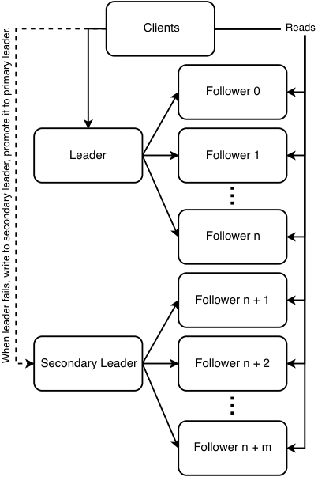


Figure 4.1    Single-leader replication with primary-secondary leader failover. Figure adapted from _Web Scalability for Startup Engineers_ by Artur Ejsmont, figure 5.4 (McGraw Hill, 2015).

A single node has a maximum throughput that must be shared by its followers, imposing a maximum number of followers, which in turn limits read scalability. To scale reads further, we can use multi-level replication, shown in figure 4.2. There are multiple levels of followers, like a pyramid. Each level replicates to the one below. Each node replicates to the number of followers that it is capable of handling, with the tradeoff that consistency is further delayed.


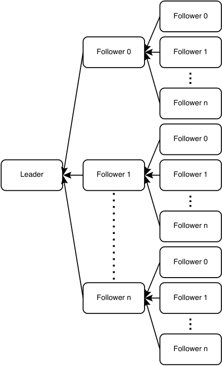


Figure 4.2    Multi-level replication. Each node replicates to its followers, which in turn replicates to their followers. This architecture ensures a node replicates to the number of followers that it is capable of handling, with the tradeoff that consistency is further delayed.

Single-leader replication is the simplest to implement. The main limitation of single-leader replication is that the entire database must fit into a single host. Another limitation is eventual consistency, as write replication to followers takes time.

MySQL binlog-based replication is an example of single-leader replication. Refer to chapter 5 of Ejsmont’s book _Web Scalability for Startup Engineers_ for a good discussion. Here are some relevant online documents:

- https://dev.to/tutelaris/introduction-to-mysql-replication-97c-https://dev.mysql.com/doc/refman/8.0/en/binlog-replication-configuration-overview.html-https://www.digitalocean.com/community/tutorials/how-to-set-up-replication-in-mysql-https://docs.microsoft.com/en-us/azure/mysql/single-server/how-to-data-in-replication-https://www.percona.com/blog/2013/01/09/how-does-mysql-replication-really-work/-https://hevodata.com/learn/mysql-binlog-based-replication/####ahacktoscalingsingle-leaderreplication: Query logic in the application layer

Manually entered strings increase database size slowly, which you can verify with simple estimates and calculations. If data was programmatically generated or has accumulated for a long period of time, storage size may grow beyond a single node.

If we cannot reduce the database size but we wish to continue using SQL, a possible way is to divide the data between multiple SQL databases. This means that our service has to be configured to connect to more than one SQL database, and we need to rewrite our SQL queries in the application to query from the appropriate database.

If we had to partition a single table into two or more databases, then our application will need to query multiple databases and combine the results. Querying logic is no longer encapsulated in the database and has spilled into the application. The application must store metadata to track which databases contain particular data. This is essentially multi-leader replication with metadata management in the application. The services and databases are more difficult to maintain, particularly if there are multiple services using these databases.

For example, if our bagel cafe recommender Beigel processes billions of searches daily, a single SQL table `fact_searches` that records our searches will grow to TBs within days. We can partition this data across multiple databases, each in its own cluster. We can partition by day and create a new table daily and name the tables in the format `fact_searches_YYYY_MM_DD` (e.g., `fact_searches_2023_01_01` and `fact_ searches_2023_01_02` ). Any application that queries these tables will need to have this partition logic, which, in this case, is the table-naming convention. In a more complex example, certain customers may make so many transactions that we need tables just for them. If many queries to our search API originate from other food recommender apps, we may create a table for each of them (e.g., `fact_searches_a_2023_01_01` ) to store all searches on January 1, 2023, from companies that start with the letter A. We may need another SQL table, `search_orgs` , that stores metadata about companies that make search requests to Beigel.

We may suggest this during a discussion as a possibility, but it is highly unlikely that we will use this design. We should use databases with multi-leader or leaderless replication.


### _4.3.3 Multi-leader replication_

Multi-leader and leaderless replication are techniques to scale writes and database storage size. They require handling of race conditions, which are not present in single-leader replication.

In multi-leader replication, as the name suggests, there are multiple nodes designated as leaders and writes can be made on any leader. Each leader must replicate its writes to all other nodes.

#### consistency problems and approaches

This replication introduces consistency and race conditions for operations where sequence is important. For example, if a row is updated in one leader while it is being deleted in another, what should be the outcome? Using timestamps to order operations does not work because the clocks on different nodes cannot be perfectly synchronized. Attempting to use the same clock on different nodes doesn’t work because each node will receive the clock’s signals at different times, a well-known phenomenon called _clock skew_ . So even server clocks that are periodically synchronized with the same source will differ by a few milliseconds or greater. If queries are made to different servers within time intervals smaller than this difference, it is impossible to determine the order in which they were made.

Here we discuss replication problems and scenarios related to consistency that we commonly encounter in a system design interview. These situations may occur with any storage format, including databases and file systems. The book _Designing Data-Intensive Applications_ by Martin Kleppmann and its references have more thorough treatments of replication pitfalls.

What is the definition of database consistency? Consistency ensures a database transaction brings the database from one valid state to another, maintaining database invariants; any data written to the database must be valid according to all defined rules, including constraints, cascades, triggers, or any combination thereof.

As discussed elsewhere in this book, consistency has a complex definition. A common informal understanding of consistency is that the data must be the same for every user:

- 1 The same query on multiple replicas should return the same results, even though the replicas are on different physical servers.

- 2 Data Manipulation Language (DML) queries (i.e., INSERT, UPDATE, or DELETE) on different physical servers that affect the same rows should be executed in the sequence that they were sent.

We may accept eventual consistency, but any particular user may need to receive data that is a valid state to them. For example, if user A queries for a counter’s value, increments a counter by one and then queries again for that counter’s value, it will make sense to user A to receive a value incremented by one. Meanwhile, other users who query for the counter may be provided the value before it was incremented. This is called read-after-write consistency.


In general, look for ways to relax the consistency requirements. Find approaches that minimize the amount of data that must be kept consistent for all users.

DML queries on different physical servers that affect the same rows may cause race conditions. Some possible situations:

- DELETE and INSERT the same row on a table with a primary key. If the DELETE executed first, the row should exist. If the INSERT was first, the primary key prevents execution, and DELETE should delete the row.

- Two UPDATE operations on the same cell with different values. Only one should be the eventual state.

What about DML queries sent at the same millisecond to different servers? This is an exceedingly unlikely situation, and there seems to be no common convention for resolving race conditions in such situations. We can suggest various approaches. One approach is to prioritize DELETE over INSERT/UPDATE and randomly break the ties for other INSERT/UPDATE queries. Anyway, a competent interviewer will not waste seconds of the 50-minute interview on discussions that yield no signals like this one.

### _4.3.4 Leaderless replication_

In leaderless replication, all nodes are equal. Reads and writes can occur on any node. How are race conditions handled? One method is to introduce the concept of quorum. A quorum is the minimum number of nodes that must be in agreement for consensus. It is easy to reason that if our database has n nodes and reads and writes both have quorums of n/2 + 1 nodes, consistency is guaranteed. If we desire consistency, we choose between fast writes and fast reads. If fast writes are required, set a low write quorum and high read quorum, and vice versa for fast reads. Otherwise, only eventual consistency is possible, and UPDATE and DELETE operations cannot be consistent.

Cassandra, Dynamo, Riak, and Voldemort are examples of databases that use leaderless replication. In Cassandra, UPDATE operations suffer from race conditions, while DELETE operations are implemented using tombstones instead of the rows actually being deleted. In HDFS, reads and replication are based on rack locality, and all replicas are equal.

### _4.3.5 HDFS replication_

This is a brief refresher section on HDFS, Hadoop, and Hive. Detailed discussions are outside the scope of this book.

HDFS replication does not fit cleanly into any of these three approaches. An HDFS cluster has an active NameNode, a passive (backup) NameNode, and multiple DataNode nodes. The NameNode executes file system namespace operations like opening, closing, and renaming files and directories. It also determines the mapping of blocks to DataNodes. The DataNodes are responsible for serving read and write requests from the file system’s clients. The DataNodes also perform block creation, deletion, and replication upon instruction from the NameNode. User data never flows through the


NameNode. HDFS stores a table as one or more files in a directory. Each file is divided into blocks, which are sharded across DataNode nodes. The default block size is 64 MB; this value can be set by admins.

Hadoop is a framework that stores and processes distributed data using the MapReduce programming model. Hive is a data warehouse solution built on top of Hadoop. Hive has the concept of partitioning tables by one or more columns for efficient filter queries. For example, we can create a partitioned Hive table as follows:

```sql
CREATE TABLE sample_table (user_id STRING, created_date DATE, country STRING) PARTITIONED BY (created_date, country);
```

Figure 4.3 illustrates the directory tree of this table. The table’s directory has subdirectories for the date values, which in turn have subdirectories for the column values. Queries filtered by created_date and/or country will process only the relevant files, avoiding the waste of a full table scan.


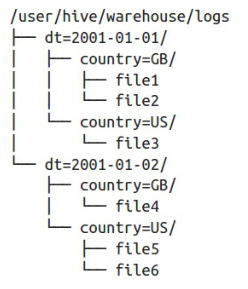


Figure 4.3     An example HDFS directory tree of a table “sample_table” whose columns include date and country, and the table is partitioned by these two columns. The sample_table directory has subdirectories for the date values, which in turn have subdirectories for the column values.  (Source:  https://stackoverflow.com/questions/44782173/hive-does-hive-support-partitioning-and-bucketing-while-usiing-external-tables.)

HDFS is append-only, and does not support UPDATE or DELETE operations, possibly because of possible replication race conditions from UPDATE and DELETE. INSERT does not have race conditions.

HDFS has name quotas, space quotas, and storage type quotas. Regarding a directory tree:

- A name quota is a hard limit on the number of file and directory names.

- A space quota is a hard limit on the number of bytes in all files.

- A storage type quota is a hard limit on the usage of specific storage types. Discussion of HDFS storage types is outside the scope of this book.

TIP    Novices to Hadoop and HDFS often use the Hadoop INSERT command, which should be avoided. An INSERT query creates a new file with a single row, which will occupy an entire 64 MB block and is wasteful. It also contributes to the number of names, and programmatic INSERT queries will soon exceed the name quota. Refer to https://hadoop.apache.org/docs/current/hadoop-project-dist/hadoop-hdfs/HdfsQuotaAdminGuide.htmlformoreinformation. One should append directly to the HDFS file, while ensuring that the appended rows have the same fields as the existing rows in the file to prevent data inconsistency and processing errors.

If we are using Spark, which saves data on HDFS, we should use `saveAsTable` or `saveAsTextFile` instead, such as the following example code snippet. Refer to the Spark documentation such as https://spark.apache.org/docs/latest/sql-data-sources-hive-tables.html.

```scala val spark = SparkSession.builder().appName("Our app").config("some.config", "value").getOrCreate()
val df = spark.sparkContext.textFile({hdfs_file})
df.createOrReplaceTempView({table_name})
spark.sql({spark_sql_query_with_table_name}).saveAsTextFile({hdfs_directory})
```

### _4.3.6 Further reading_

Refer to _Designing Data-Intensive Applications_ by Martin Kleppmann (O'Reilly, 2017) for more discussion on topics such as

- Consistency techniques like read repair, anti-entropy, and tuples.

- Multi-leader replication consensus algorithm and implementations in CouchDB, MySQL Group replication, and Postgres.

- Failover problems, like split brain.

- Various consensus algorithms to resolve these race conditions. A consensus algorithm is for achieving agreement on a data value.

## _4.4 Scaling storage capacity with sharded databases_

If the database size grows to exceed the capacity of a single host, we will need to delete old rows. If we need to retain this old data, we should store it in sharded storage such as HDFS or Cassandra. Sharded storage is horizontally scalable and in theory should support an infinite storage capacity simply by adding more hosts. There are production HDFS clusters with over 100 PB (https://eng.uber.com/uber-big-data-platform/).Clustercapacityof YB is theoretically possible, but the monetary cost of the hardware required to store and perform analytics on such amounts of data will be prohibitively expensive.

TIP    We can use a database with low latency such as Redis to store data used to directly serve consumers.

Another approach is to store the data in the consumer’s devices or browser cookies and localStorage. However, this means that any processing of this data must also be done on the frontend and not the backend.


### _4.4.1 Sharded RDBMS_

If we need to use an RDBMS, and the amount of data exceeds what can be stored on a single node, we can use a sharded RDBMS solution like Amazon RDS (https://aws.amazon.com/blogs/database/sharding-with-amazon-relational-database-service/),orimplementourownsharded SQL. These solutions impose limitations on SQL operations:

- JOIN queries will be much slower. A JOIN query will involve considerable network traffic between each node and every other node. Consider a JOIN between two tables on a particular column. If both tables are sharded across the nodes, each shard of one table needs to compare the value of this column in every row with the same column in every row of the other table. If the JOIN is being done on the columns that are used as the shard keys, then the JOIN will be much more efficient, since each node will know which other nodes to perform the JOIN on. We may constrain JOIN operations to such columns only.

- Aggregation operations will involve both the database and application. Certain aggregation operations will be easier than others, such as sum or mean. Each node simply needs to sum and/or count the values and then return these aggregated values to the application, which can perform simple arithmetic to obtain the final result. Certain aggregation operations such as median and percentile will be more complicated and slower.

## _4.5 Aggregating events_

Database writes are difficult and expensive to scale, so we should try to reduce the rate of database writes wherever possible in our system’s design. Sampling and aggregation are common techniques to reduce database write rate. An added bonus is slower database size growth.

Besides reducing database writes, we can also reduce database reads by techniques such as caching and approximation. Chapter 17 discusses count-min sketch, an algorithm for creating an approximate frequency table for events in a continuous data stream.

_Sampling_ data means to consider only certain data points and ignoring others. There are many possible sampling strategies, including sampling every nth data point or just random sampling. With sampling in writes, we write data at a lower rate than if we write all data points. Sampling is conceptually trivial and is something we can mention during an interview.

Aggregating events is about aggregating/combining multiple events into a single event, so instead of multiple database writes, only a single database write must occur. We can consider aggregation if the exact timestamps of individual events are unimportant.

Aggregation can be implemented using a streaming pipeline. The first stage of the streaming pipeline may receive a high rate of events and require a large cluster with thousands of hosts. Without aggregation, every succeeding stage will also require a large cluster. Aggregation allows each succeeding stage to have fewer hosts. We also use replication and checkpointing in case hosts fail. Referring to chapter 5, we can use a distributed transaction algorithm such as Saga, or quorum writes, to ensure that each event is replicated to a minimum number of replicas.

### _4.5.1 Single-tier aggregation_

Aggregation can be single or multi-tier. Figure 4.4 illustrates an example of single-tier aggregation, for counting numbers of values. In this example, an event can have value A, B, C, etc. These events can be evenly distributed across the hosts by a load balancer. Each host can contain a hash table in memory and aggregate these counts in its hash table. Each host can flush the counts to the database periodically (such as every five minutes) or when it is running out of memory, whichever is sooner.


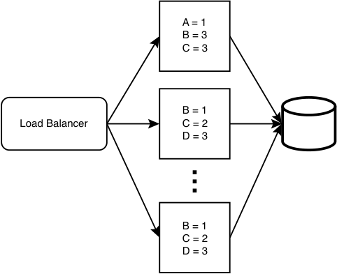


Figure 4.4     An example illustration of single-tier aggregation. A load balancer distributes events across a single layer/tier of hosts, which aggregate them and then writes these aggregated counts to the database. If the individual events were written directly to the database, the write rate will be much higher, and the database will have to be scaled up. Not illustrated here are the host replicas, which are required if high availability and accuracy are necessary.

### _4.5.2 Multi-tier aggregation_

Figure 4.5 illustrates multi-tier aggregation. Each layer of hosts can aggregate events from its ancestors in the previous tier. We can progressively reduce the number of hosts in each layer until there is a desired number of hosts (this number is up to our requirements and available resources) in the final layer, which writes to the database.

The main tradeoffs of aggregation are eventual consistency and increased complexity. Each layer adds some latency to our pipeline and thus our database writes, so database reads may be stale. Implementing replication, logging, monitoring, and alerting also add complexity to this system.


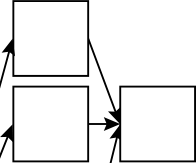


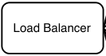


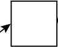


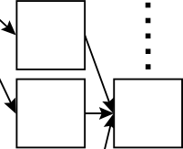


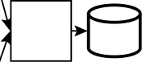


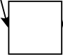


Figure 4.5     An example illustration of multi-tier aggregation. This is similar to the inverse of multi-level replication.

### _4.5.3 Partitioning_

This requires a level 7 load balancer. (Refer to section 3.1.2 for a brief description of a level 7 load balancer.) The load balancer can be configured to process incoming events and forward them to certain hosts depending on the events’ contents.

Referring to the example in figure 4.6, if the events are simply values from A–Z, the load balancer can be configured to forward events with values of A–I to certain hosts, events with values J–R to certain hosts, and events with values S–Z to certain hosts. The hash tables from the first layer of hosts are aggregated into a second layer of hosts, then into a final hash table host. Finally, this hash table is sent to a max-heap host, which constructs the final max-heap.

We can expect event traffic to follow normal distribution, which means certain partitions will receive disproportionately high traffic. To address this, referring to figure 4.6, we observe that we can allocate a different number of hosts to each partition. Partition A–I has three hosts, J–R has one host, and S–Z has two hosts. We make these partitioning decisions because traffic is uneven across partitions, and certain hosts may receive disproportionately high traffic, (i.e., they become “hot”), more than what they are able to process.


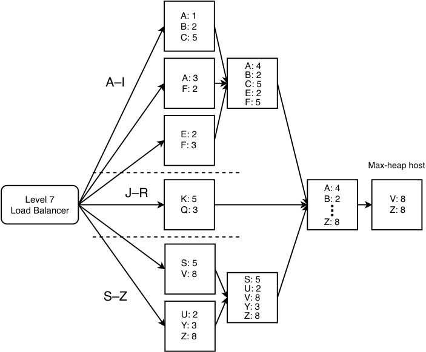


Figure 4.6     An example illustration of multi-tier aggregation with partitioning

We also observe that partition J–R has only one host, so it does not have a second layer. As designers, we can make such decisions based on our situation.

Besides allocating a different number of hosts to each partition, another way to evenly distribute traffic is to adjust the number and width of the partitions. For example, instead of {A-I, J-R, S-Z}, we can create partitions {{A-B, D-F}, {C, G-J}, {K-S}, {T-Z}}. That is, we changed from three to four partitions and put C in the second partition. We can be creative and dynamic in addressing our system’s scalability requirements.

### _4.5.4 Handling a large key space_

Figure 4.6 in the previous section illustrates a tiny key space of 26 keys from A–Z. In a practical implementation, the key space will be much larger. We must ensure that the combined key spaces of a particular level do not cause memory overflow in the next level. The hosts in the earlier aggregation levels should limit their key space to less than what their memory can accommodate, so that the hosts in the later aggregation levels have sufficient memory to accommodate all the keys. This may mean that the hosts in earlier aggregation levels will need to flush more frequently.


For example, figure 4.7 illustrates a simple aggregation service with only two levels. There are two hosts in the first level and one host in the second level. The two hosts in the first level should limit their key space to half of what they can actually accommodate, so the host in the second level can accommodate all keys.


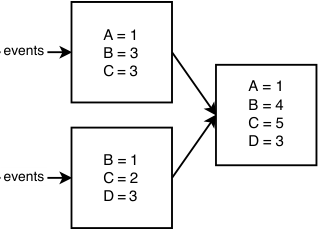


Figure 4.7 A simple aggregation service with only two levels; two hosts in the first level and one host in the second level

We can also provision hosts with less memory for earlier aggregation levels, and hosts with more memory in later levels.

### _4.5.5 Replication and fault-tolerance_

So far, we have not discussed replication and fault-tolerance. If a host goes down, it loses all of its aggregated events. Moreover, this is a cascading failure because all its earlier hosts may overflow, and these aggregated events will likewise be lost.

We can use checkpointing and dead letter queues, discussed in sections 3.3.6 and 3.3.7. However, since a large number of hosts may be affected by the outage of a host that is many levels deep, a large amount of processing has to be repeated, which is a waste of resources. This outage may also add considerable latency to the aggregation.

A possible solution is to convert each node into an independent service with a cluster of multiple stateless nodes that make requests to a shared in-memory database like Redis. Figure 4.8 illustrates such a service. The service can have multiple hosts (e.g., three stateless hosts). A shared load balancing service can spread requests across these hosts. Scalability is not a concern here, so each service can have just a few (e.g., three hosts for fault-tolerance).


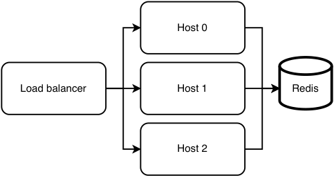


Figure 4.8     We can replace a node with a service, which we refer to as an aggregation unit. This unit has three stateless hosts for faulttolerance, but we can use more hosts if desired.


At the beginning of this chapter, we discussed that we wanted to avoid database writes, which we seem to contradict here. However, each service has a separate Redis cluster, so there is no competition for writing to the same key. Moreover, these aggregated events are deleted each successful flush, so the database size will not grow uncontrollably.

NOTE We can use Terraform to define this entire aggregation service. Each aggregation unit can be a Kubernetes cluster with three pods, and one host per pod (two hosts if we are using a sidecar service pattern).

## _4.6 Batch and streaming ETL_

ETL (Extract, Transform, Load) is a general procedure of copying data from one or more sources into a destination system, which represents the data differently from the source(s) or in a different context than the source(s). Batch refers to processing the data in batches, usually periodically, but it can also be manually triggered. Streaming refers to a continuous flow of data to be processed in real time.

We can think of batch vs. streaming as analogous to polling vs. interrupt. Similar to polling, a batch job always runs at a defined frequency regardless of whether there are new events to process, while a streaming job runs whenever a trigger condition is met, which is usually the publishing of a new event.

An example use case for batch jobs is to generate monthly bills (such as PDF or CSV files) for customers. Such a batch job is especially relevant if the data required for these bills are only available on a certain date each month (e.g., billing statements from our vendors that we need to generate bills for our customers). If all data to generate these periodic files are generated within our organization, we can consider Kappa architecture (refer to chapter 17) and implement a streaming job that processes each piece of data as soon as it is available. The advantages of this approach are that the monthly files are available almost as soon as the month is over, the data processing costs are spread out over the month, and it is easier to debug a function that processes a small piece of data at a time, rather than a batch job that processes GBs of data.

Airflow and Luigi are common batch tools. Kafka and Flink are common streaming tools. Flume and Scribe are specialized streaming tools for logging; they aggregate log data streamed in real time from many servers. Here we briefly introduce some ETL concepts.

An ETL pipeline consists of a Directed Acyclic Graph (DAG) of tasks. In the DAG, a node corresponds to a task, and its ancestors are its dependencies. A job is a single run of an ETL pipeline.

### _4.6.1 A simple batch ETL pipeline_

A simple batch ETL pipeline can be implemented using a crontab, two SQL tables, and a script (i.e., a program written in a scripting language) for each job. cron is suitable for small noncritical jobs with no parallelism where a single machine is adequate. The following are the two example SQL tables:


```sql
CREATE TABLE cron_dag ( id INT,         -- ID of a job. parent_id INT, -- Parent job. A job can have 0, 1, or multiple parents. PRIMARY KEY (id), FOREIGN KEY (parent_id) REFERENCES cron_dag (id) );
CREATE TABLE cron_jobs ( id INT, name VARCHAR(255), updated_at INT, PRIMARY KEY (id) );
```


The crontab’s instructions can be a list of the scripts. In this example, we used Python scripts, though we can use any scripting language. We can place all the scripts in a common directory /cron_dag/dag/, and other Python files/modules in other directories. There are no rules on how to organize the files; this is up to what we believe is the best arrangement:

```cron
0 * * * * ~/cron_dag/dag/first_node.py
0 * * * * ~/cron_dag/dag/second_node.py
```

Each script can follow the following algorithm. Steps 1 and 2 can be abstracted into reusable modules:

- 1 Check that the updated_at value of the relevant job is less than its dependent jobs.

- 2 Trigger monitoring if necessary.

- 3 Execute the specific job.

The main disadvantages of this setup are:

- It isn’t scalable. All jobs run on a single host, which carries all the usual disadvantages of a single host:

   - There’s a single point of failure.

   - There may be insufficient computational resources to run all the jobs scheduled at a particular time.

   - The host’s storage capacity may be exceeded.

- A job may consist of numerous smaller tasks, like sending a notification to millions of devices. If such a job fails and needs to be retried, we need to avoid repeating the smaller tasks that succeeded (i.e., the individual tasks should be idempotent). This simple design does not provide such idempotency.

- No validation tools to ensure the job IDs are consistent in the Python scripts and SQL tables, so this setup is vulnerable to programming errors.

- No GUI (unless we make one ourselves).

- We have not yet implemented logging, monitoring, or alerting. This is very important and should be our next step. For example, what if a job fails or a host crashes while it is running a job? We need to ensure that scheduled jobs complete successfully.

QUESTION    How can we horizontally scale this simple batch ETL pipeline to improve its scalability and availability?

Dedicated job scheduling systems include Airflow and Luigi. These tools come with web UIs for DAG visualization and GUI user-friendliness. They are also vertically scalable and can be run on clusters to manage large numbers of jobs. In this book, whenever we need a batch ETL service, we use an organizational-level shared Airflow service.

### _4.6.2 Messaging terminology_

The section clarifies common terminology for various types of messaging and streaming setups that one tends to encounter in technical discussions or literature.

#### messaging system

A messaging system is a general term for a system that transfers data from one application to another to reduce the complexity of data transmission and sharing in applications, so application developers can focus on data processing.

#### message Queue

A message contains a work object of instructions sent from one service to another, waiting in the queue to be processed. Each message is processed only once by a single consumer.

#### producer/consumer

Producer/consumer aka publisher/subscriber or pub/sub, is an asynchronous messaging system that decouples services that produce events from services that process events. A producer/consumer system contains one or more message queues.

#### message broker

A message broker is a program that translates a message from the formal messaging protocol of the sender to the formal messaging protocol of the receiver. A message broker is a translation layer. Kafka and RabbitMQ are both message brokers. RabbitMQ claims to be “the most widely deployed open-source message broker” (https://www.rabbitmq.com/).AMQPisoneofthemessaging protocols implemented by RabbitMQ. A description of AMQP is outside the scope of this book. Kafka implements its own custom messaging protocol.

#### event streaming

Event streaming is a general term that refers to a continuous flow of events that are processed in real time. An event contains information about a change of state. Kafka is the most common event streaming platform.


#### pull vs. push

Inter-service communication can be done by pull or push. In general, pull is better than push, and this is the general concept behind producer-consumer architectures. In pull, the consumer controls the rate of message consumption and will not be overloaded.

Load testing and stress testing may be done on the consumer during its development, and monitoring its throughput and performance with production traffic and comparing the measurements with the tests allows the team to accurately determine if more engineering resources are needed to improve the tests. The consumer can monitor its throughput and producer queue sizes over time, and the team can scale it as required.

If our production system has a continuously high load, it is unlikely that the queue will be empty for any significant period, and our consumer can keep polling for messages. If we have a situation where we must maintain a large streaming cluster to process unpredictable traffic spikes within a few minutes, we should use this cluster for other lower-priority messages too (i.e., a common Flink, Kafka, or Spark service for the organization).

Another situation where polling or pull from a user is better than push is if the user is firewalled, or if the dependency has frequent changes and will make too many push requests. Pull also will have one less setup step than push. The user is already making requests to the dependency. However, the dependency usually does not make requests to the user.

The flip side (https://engineering.linkedin.com/blog/2019/data-hub)isifoursystemcollects data from many sources using crawlers; development and maintenance of all these crawlers may be too complex and tedious. It may be more scalable for individual data providers to push information to our central repository. Push also allows more timely updates.

One more exception where push is better than pull is in lossy applications like audio and video live-streaming. These applications do not resend data that failed to deliver the first time, and they generally use UDP to push data to their recipients.

### _4.6.3 Kafka vs. RabbitMQ_

In practice, most companies have a shared Kafka service, that is used by other services. In the rest of this book, we will use Kafka when we need a messaging or event-streaming service. In an interview, rather than risk the ire of an opinionated interviewer, it is safer to display our knowledge of the details of and differences between Kafka and RabbitMQ and discuss their tradeoffs.

Both can be used to smooth out uneven traffic, preventing our service from being overloaded by traffic spikes, and keeping our service cost-efficient, because we do not need to provision a large number of hosts just to handle periods of high traffic.

Kafka is more complex than RabbitMQ and provides a superset of capabilities over RabbitMQ. In other words, Kafka can always be used in place of RabbitMQ but not vice versa.


If RabbitMQ is sufficient for our system, we can suggest using RabbitMQ, and also state that our organization likely has a Kafka service that we can use so as to avoid the trouble of setup and maintenance (including logging, monitoring and alerting) of another component such as RabbitMQ. Table 4.1 lists differences between Kafka and RabbitMQ.

Table 4.1    Some differences between Kafka and RabbitMQ


|Designed for scalability, reliability, and avail-|Simple to set up, but not scalable by default.|
|---|---|
|ability. More complex setup required than<br>RabbitMQ.|We can implement scalability on our own at the applica-<br>tion level by attaching our application to a load balancer|
|Requires ZooKeeper to manage the|and producing to and consuming from the load balancer.|
|Kafka cluster. This includes confguring IP|But this will take more work to set up than Kafka and being|
|addresses of every Kafka host in ZooKeeper.|far less mature will almost certainly be inferior in many|
||ways.|
|A durable message broker because it has|Not scalable, so not durable by default. Messages are lost|
|replication. We can adjust the replication|if downtime occurs. Has a “lazy queue” feature to persist|
|factor on ZooKeeper and arrange replication|messages to disk for better durability, but this does not|
|to be done on different server racks and|protect against disk failure on the host.|
|data centers.||
|Events on the queue are not removed after|Messages on the queue are removed upon dequeuing, as|
|consumption, so the same event can be|per the defnition of “queue” (RabbitMQ 3.9 released on|
|consumed repeatedly. This is for failure tol-|July 26, 2021, has a stream https://www.rabbitmq.com/||erance,incasetheconsumerfailsbeforeit|streams.htmlfeature that allows repeated consumption of|
|fnished processing the event and needs to|each message, so this difference is only present for earlier|
|reprocess the event.|versions.)|


In this regard, it is conceptually inaccurate to use the term “queue” in Kafka. It is actually a list. But the term “Kafka queue” is commonly used.

We may create several queues to allow several consumers per message, one queue per consumer. But this is not the intended use of having multiple queues.

We can configure a retention period in Has the concept of AMQP standard per-message queue Kafka, which is seven days by default, so an priority. We can create multiple queues with varying event is deleted after seven days regardless priority. Messages on a queue are not dequeued until of whether it has been consumed. We can higher-priority queues are empty. No concept of fairness or choose to set the retention period to infinite consideration of starvation. and use Kafka as a database. No concept of priority.

### _4.6.4 Lambda architecture_

Lambda architecture is a data-processing architecture for processing big data running batch and streaming pipelines in parallel. In informal terms, it refers to having parallel fast and slow pipelines that update the same destination. The fast pipeline trades off consistency and accuracy for lower latency (i.e., fast updates), and vice versa for the slow pipeline. The fast pipeline employs techniques such as:


- Approximation algorithms (discussed in section 17.7).

- In-memory databases like Redis.

- For faster processing, nodes in the fast pipeline may not replicate the data that they process so there may be some data loss and lower accuracy from node outages.

The slow pipeline usually uses MapReduce databases, such as Hive and Spark with HDFS. We can suggest lambda architecture for systems that involve big data and require consistency and accuracy.

#### Note on various database solutions

There are numerous database solutions. Common ones include various SQL distributions, Hadoop and HDFS, Kafka, Redis, and Elasticsearch. There are numerous less-common ones, including MongoDB, Neo4j, AWS DynamoDB, and Google’s Firebase Realtime Database. In general, knowledge of less common databases, especially proprietary databases, is not expected in a system design interview. Proprietary databases are seldom adopted. If a startup does adopt a proprietary database, it should consider migrating to an open-source database sooner rather than later. The bigger the database, the worse the vendor lock-in as the migration process will be more difficult, error-prone, and expensive.

An alternative to Lambda architecture is Kappa architecture. _Kappa architecture_ is a software architecture pattern for processing streaming data, performing both batch and streaming processing with a single technology stack. It uses an append-only immutable log like Kafka to store incoming data, followed by stream processing and storage in a database for users to query. Refer to section 17.9.1 for a detailed comparison between Lambda and Kappa architecture.

## _4.7 Denormalization_

If our service’s data can fit into a single host, a typical approach is to choose SQL and normalize our schema. The benefits of normalization include the following:

- They are consistent, with no duplicate data, so there will not be tables with inconsistent data.

- Inserts and updates are faster since only one table has to be queried. In a denormalized schema, an insert or update may need to query multiple tables.

- Smaller database size because there is no duplicate data. Smaller tables will have faster read operations.

- Normalized tables tend to have fewer columns, so they will have fewer indexes. Index rebuilds will be faster.

- Queries can JOIN only the tables that are needed.

The disadvantages of normalization include the following:


- JOIN queries are much slower than queries on individual tables. In practice, denormalization is frequently done because of this.

- The fact tables contain codes rather than data, so most queries both for our service and ad hoc analytics will contain JOIN operations. JOIN queries tend to be more verbose than queries on single tables, so they are more difficult to write and maintain.

An approach to faster read operations that is frequently mentioned in interviews is to trade off storage for speed by denormalizing our schema to avoid JOIN queries.

## _4.8 Caching_

For databases that store data on disk, we can cache frequent or recent queries in memory. In an organization, various database technologies can be provided to users as shared database services, such as an SQL service or Spark with HDFS. These services can also utilize caching, such as with a Redis cache.

This section is a brief description of various caching strategies. The benefits of caching include improvements to:

- _Performance:_ This is the intended benefit of a cache, and the other benefits below are incidental. A cache uses memory, which is faster and more expensive than a database, which uses disk.

- _Availability:_ If the database is unavailable, the service is still available so applications can retrieve data from the cache. This only applies to data that is cached. To save costs, a cache may contain only a subset of data in the database. However, caches are designed for high performance and low latency, not for high availability. A cache’s design may trade off availability and other non-functional requirements for high performance. Our database should be highly available, and we must not rely on the cache for our service’s availability.

- _Scalability:_ By serving frequently requested data, the cache can serve much of the service’s load. It is also faster than the database, so requests are served faster which decreases the number of open HTTP connections at any one time, and a smaller backend cluster can serve the same load. However, this is an inadvisable scalability technique if your cache is typically designed to optimize latency and may make tradeoffs against availability to achieve this. For example, one will not replicate a cache across data centers because cross data-center requests are slow and defeat the main purpose of a cache which is to improve latency. So, if a data center experiences an outage (such as from network problems), the cache becomes unavailable, and all the load is transferred to the database, which may be unable to handle it. The backend service should have rate limiting, adjusted to the capacity of the backend and database.


Caching can be done at many levels, including client, API Gateway (Rob Vettor, David Coulter, Genevieve Warren, “Caching in a cloud-native application.” Microsoft Docs. May 17, 2020. (https://docs.microsoft.com/en-us/dotnet/architecture/cloud-native/azure-caching),andateachservice ( _Cloud Native Patterns_ by Cornelia Davis, (Manning Publications, 2019). Figure 4.9 illustrates caching at an API Gateway. This cache can scale independently of the services, to serve the traffic volume at any given time.


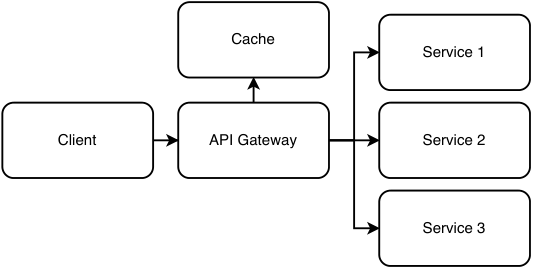


Figure 4.9     Caching at an API gateway. Diagram adapted from Rob Vettor, David Coulter, Genevieve Warren. May 17, 2020. “Caching in a cloud-native application.” Microsoft Docs. https://docs.microsoft.com/en-us/dotnet/architecture/cloud-native/azure-caching.###_4.8.1Readstrategies_

Read strategies are optimized for fast reads.

#### cache-aside (lazy loading)

_Cache-aside_ refers to the cache sitting “aside” the database. Figure 4.10 illustrates cacheaside. In a read request, the application first makes a read request to the cache, which returns the data on a cache hit. On a cache miss, the application makes a read request to the database, then writes the data to the cache so subsequent requests for this data will be cache hits. So, data is loaded only when it is first read, which is called _lazy load_ .


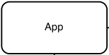


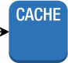


Figure 4.10 Illustration of cache-aside


Cache-aside is best for read-heavy loads. Advantages:

- Cache-aside minimizes the number of read requests and resource consumption. To further reduce the number of requests, the application can store the results of multiple database requests as a single cache value (i.e., a single cache key for the results of multiple database requests).

- Only requested data is written to the cache, so we can easily determine our required cache capacity and adjust it as needed to save costs.

- Simplicity of implementation.

If the cache cluster goes down, all requests will go to the database. We must ensure that the database can handle this load. Disadvantages:

- The cached data may become stale/inconsistent, especially if writes are made directly to the database. To reduce stale data, we can set a TTL or use writethrough (refer section below) so every write goes through the cache.

- A request with a cache miss is slower than a request directly to the database, because of the additional read request and additional write request to the cache.

#### read-through

In _read-through_ , _write-through_ , or _write-back_ caching, the application makes requests to the cache, which may make requests to the database if necessary.

Figure 4.11 illustrates the architecture of read-through, write-through, or write-back caching. In a cache miss on a read-through cache, the cache makes a request to the database and stores the data in the cache (i.e., also lazy load, like cache-aside), then returns the data to the application.


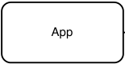


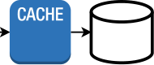


Figure 4.11     In read-through, write-through, or write-back caching, the application makes requests to the cache, which makes requests to the database if necessary. So, this simple architecture diagram can represent all three caching strategies.

Read-through is best for read-heavy loads. As the application does not contact the database, the implementation burden of database requests is shifted from the application to the cache. A tradeoff is that unlike cache-aside, a read-through cache cannot group multiple database requests as a single cache value.

### _4.8.2 Write strategies_

Write strategies are optimized to minimize cache staleness, in exchange for higher latency or complexity.


#### write-through

Every write goes through the cache, then to the database. Advantages:

- It is consistent. The cache is never stale since cache data is updated with every database write.

Disadvantages:

- Slower writes since every write is done on both the cache and database.

- Cold start problem because a new cache node will have missing data and cache misses. We can use cache-aside to resolve this.

- Most data is never read, so we incur unnecessary cost. We can configure a TTL (time-to-live) to reduce wasted space.

- If our cache is smaller than our database, we must determine the most appropriate cache eviction policy.

#### write-back/write-behind

The application writes data to the cache, but the cache does not immediately write to the database. The cache periodically flushes updated data to the database. Advantages:

- Faster writes on average than write-through. Writes to database are not blocking.

Disadvantages:

- Same disadvantages as write-through, other than slower writes.

- Complexity because our cache must have high availability, so we cannot make tradeoffs against availability to improve performance/latency. The design will be more complex since it must have both high availability and performance.

#### write-around

In _write-around_ , the application only writes to the database. Referring to figure 4.12, write-around is usually combined with cache-aside or read-through. The application updates the cache on a cache miss.


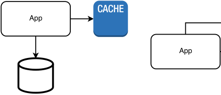


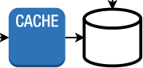


Figure 4.12     Two possible architectures of write-around. (Left) Write-around with cache-aside. (Right) Write-around with read-through.


## _4.9 Caching as a separate service_

Why is caching a separate service? Why not just cache in the memory of a service’s hosts?

- Services are designed to be stateless, so each request is randomly assigned to a host. Since each host may cache different data, it is less likely to have cached any particular request that it receives. This is unlike databases, which are stateful and can be partitioned, so each database node is likely to serve requests for the same data.

- Further to the previous point, caching is especially useful when there are uneven request patterns that lead to hot shards. Caching is useless if requests or responses are unique.

- If we cache on hosts, the cache will be wiped out every time our service gets a deployment, which may be multiple times every day.

- We can scale the cache independently of the services that it serves (though this comes with the dangers discussed in the beginning of this chapter). Our caching service can use specific hardware or virtual machines that are optimized for the non-functional requirements of a caching service, which may be different from the services that it serves.

- If many clients simultaneously send the same request that is a cache miss, our database service will execute the same query many times. Caches can deduplicate requests and send a single request to our service. This is called request coalescing, and it reduces the traffic on our service.

Besides caching on our backend service, we should also cache on clients (browser or mobile apps) to avoid the overhead of network requests if possible. We should also consider using a CDN.

## _4.10 Examples of different kinds of data to cache and how to cache them_

We can cache either HTTP responses or database queries. We can cache the body of an HTTP response, and retrieve it using a cache key, which is the HTTP method and URI of the request. Within our application, we can use the cache-aside pattern to cache relational database queries.

Caches can be private or public/shared. Private cache is on a client and is useful for personalized content. Public cache is on a proxy such as a CDN, or on our services. Information that should not be cached includes the following:

- Private information must never be stored in a cache. An example is bank account details.

- Realtime public information, such as stock prices, or flight arrival times or hotel room availabilities in the near future.


- Do not use private caching for paid or copyrighted content, such as books or videos that require payment.

- Public information that may change can be cached but should be revalidated against the origin server. An example is availability of flight tickets or hotel rooms next month. The server response will be just a response code 304 confirmation that the cached response is fresh, so this response will be much smaller than if there was no caching. This will improve network latency and throughput. We set a `max-age` value that indicates our assessment on how long the cached response remains fresh. However, we may have reason to believe that conditions may change in the future that cause this `max-age` value may become too long, so we may wish to implement logic in our backend that quickly validates that a cached response is still fresh. If we do this, we return `must-revalidate` in our response so clients will revalidate cached responses with our backend before using them.

Public information that will not change for a long time can be cached with a long cache expiry time. Examples include bus or train schedules.

In general, a company can save hardware costs by pushing as much processing and storage as possible onto the clients’ devices and use data centers only to back up critical data and for communication between users. For example, WhatsApp stores a user’s authentication details and their connections, but does not store their messages (which are the bulk of a user’s storage consumption). It provides Google Drive backup, so it pushes message backup costs onto another company. Freed of this cost, WhatsApp can continue to be free to its users, who pay Google for storage if they exceed the free storage tier.

However, we should not assume that the localStorage caching is functioning as intended, so we should always expect cache misses and prepare our service to receive these requests. We cache in every layer (client/browser, load balancer, frontend/API Gateway/sidecar, and in our backend) so _requests pass through as few services as possible_ . This allows _lower latency and cost._

A browser starts rendering a webpage only after it has downloaded and processed all the latter’s CSS files, so browser caching of CSS may considerably improve browser app performance.

NOTE    Refer to https://csswizardry.com/2018/11/css-and-network-performance/foradiscussiononoptimizingawebpage’sperformance by allowing the browser to download and process all of a webpage’s CSS as quickly as possible.

A disadvantage of caching on the client is that it complicates usage analytics, since the backend will not receive an indication that the client accessed this data. If it is necessary or beneficial to know that the client accessed its cached data, we will need the additional complexity of logging these usage counts in the client and send these logs to our backend.


## _4.11 Cache invalidation_

_Cache invalidation_ is the process where cache entries are replaced or removed. _Cache busting_ is cache invalidation specifically for files.

### _4.11.1 Browser cache invalidation_

For browser caches, we typically set a `max-age` for each file. What if a file is replaced by a new version before its cache expiry? We use a technique called _fingerprinting_ , which gives these files new identifiers (version numbers, file names or query string hashes). For example, a file named “style.css” can instead be named “style.b3d716.css,” and the hash in the file name can be replaced during a new deployment. In another example, an HTML tag `` that contains an image file name can instead be `` ; we use a query parameter `hash` to indicate the file version. With fingerprinting, we can also use the `immutable` cache-control option to prevent unnecessary requests to the origin server.

Fingerprinting is important for caching multiple GET requests or files that depend on each other. GET request caching headers cannot express that certain files or responses are interdependent, which may cause old versions of files to be deployed.

For example, we will typically cache CSS and JavaScript but not HTML (unless the webpage is static; many browser apps we build will display different content on each visit). However, all of them may change in a new deployment of our browser app. If we serve new HTML with old CSS or JavaScript, the webpage may be broken. A user may instinctively click the browser reload button, which will resolve the problem as the browser revalidates with the origin server when the user reloads the page. But this is a bad user experience. These problems are difficult to find during testing. Fingerprinting ensures that the HTML contains the correct CSS and JavaScript file names.

We may decide to try to avoid this problem without fingerprinting by caching HTML as well as CSS and JavaScript and setting the same `max-age` for all these files so they will expire simultaneously. However, the browser may make requests for these different files at different times, separated by seconds. If a new deployment happens to be in progress during these requests, the browser may still get a mix of old and new files.

Besides dependent files, an application may also contain dependent GET requests. For example, a user may make a GET request for a list of items (items on sale, hotel rooms, flights to San Francisco, photo thumbnails, etc.), followed by a GET request for details of an item. Caching the first request may cause requests for details of a product that no longer exists. REST architecture best practices dictate that requests are cacheable by default, but depending on these considerations, we should either not cache or set a short expiry time.

### _4.11.2 Cache invalidation in caching services_

We do not have direct access to clients’ caches, so this restricts our cache invalidation options to techniques like setting `max-age` or fingerprinting. However, we can directly create, replace, or remove entries in a caching service. There are many online resources on cache replacement policies, and their implementations are outside the scope of this book, so we will only briefly define a few common ones here.

- Random replacement: Replace a random item when the cache is full. It is the simplest strategy.

- Least recently used (LRU): Replace the least recently used item first.

- First in first out (FIFO): Replace the items in the order they were added, regardless of how often they are used/accessed.

- Last in first out (LIFO), also called first in last out (FILO): Replace the items in the reverse order they were added, regardless of how often they are used/ accessed.

## _4.12 Cache warming_

_Cache warming_ means to fill a cache with entries ahead of the first requests for these entries, so each first request for an entry can be served from the cache rather than result in a cache miss. Cache warming applies to services like CDNs or our frontend or backend services, not to browser cache.

The advantage of cache warming is that the first request for precached data will have the same low latency as subsequent requests. However, cache warming comes with many disadvantages, including the following:

- Additional complexity and cost of implementing cache warning. A caching service may contain thousands of hosts and warming them can be a complex and costly process. We can reduce the cost by only partially filling the cache, with entries, which will be most frequently requested. Refer to https://netflixtechblog.com/cache-warming-agility-for-a-stateful-service-2d3b1da82642foradiscussionof Netflix’s cache warmer system design.

- Additional traffic from querying our service to fill the cache, including on our frontend, backend, and database services. Our service may not be able to take the load of cache warming.

- Assuming we have user base of millions of users, only the first user who accessed that data will receive a slow experience. This may not justify the complexity and cost of cache warming. Frequently accessed data will be cached on its first request, while infrequently accessed data does not justify caching or cache warming.

- The cache expiry time cannot be short, or cache items may expire before they are used, and warming the cache is a waste of time. So, we either need to set a long expiry time, and our cache service is bigger and more expensive than necessary, or we will need to set different expiry times for different entries, introducing additional complexity and possible mistakes.

The P99 for requests made without caching should generally be less than one second. Even if we relax this requirement, it should not exceed 10 seconds. Instead of cache warming, we can ensure that requests served without caching have a reasonable P99.


### _4.13 Further reading_

This chapter uses material from Web Scalability for Startup Engineers by Artur Ejsmont (McGraw Hill, 2015).

### _4.13.1 Caching references_

- Kevin Crawley “Scaling Microservices — Understanding and Implementing Cache,” August 22, 2019 (https://dzone.com/articles/scaling-microservices-understanding-and-implementi)- Rob Vettor, David Coulter, and Genevieve Warren “Caching in a cloud-native application,” Microsoft Docs, May 17, 2020 Microsoft Docs. (https://docs.microsoft.com/en-us/dotnet/architecture/cloud-native/azure-caching)-_Cloud Native Patterns_ by Cornelia Davis (Manning Publications, 2019)

- https://jakearchibald.com/2016/caching-best-practices/-https://developer.mozilla.org/en-US/docs/Web/HTTP/Headers/Cache-Control-Tom Barker _Intelligent Caching_ (O’Reilly Media, 2017)

#### _Summary_

- Designing a stateful service is much more complex and error-prone than a stateless service, so system designs try to keep services stateless, and use shared stateful services.

- Each storage technology falls into a particular category. We should know how to distinguish these categories, which are as follows.

   - Database, which can be SQL or NoSQL. NoSQL can be categorized into column-oriented or key-value.

   - Document.

   - Graph.

   - File storage.

   - Block storage.

   - Object storage.

- Deciding how to store a service’s data involves deciding to use a database vs.

   - another storage category.

- There are various replication techniques to scale databases, including single-leader replication, multi-leader replication, leaderless replication, and other techniques such as HDFS replication that do not fit cleanly into these three approaches.

- Sharding is needed if a database exceeds the storage capacity of a single host.


- Database writes are expensive and difficult to scale, so we should minimize database writes wherever possible. Aggregating events helps to reduce the rate of database writes.

- Lambda architecture involves using parallel batch and streaming pipelines to process the same data, and realize the benefits of both approaches while allowing them to compensate for each other’s disadvantages.

- Denormalizing is frequently used to optimize read latency and simpler SELECT queries, with tradeoffs like consistency, slower writes, more storage required, and slower index rebuilds.

- Caching frequent queries in memory reduces average query latency.

- Read strategies are for fast reads, trading off cache staleness.

- Cache-aside is best for read-heavy loads, but the cached data may become stale and cache misses are slower than if the cache wasn’t present.

- A read-through cache makes requests to the database, removing this burden from the application.

- A write-through cache is never stale, but it is slower.

- A write-back cache periodically flushes updated data to the database. Unlike other cache designs, it must have high availability to prevent possible data loss from outages.

- A write-around cache has slow writes and a higher chance of cache staleness. It is suitable for situations where the cached data is unlikely to change.

- A dedicated caching service can serve our users much better than caching on the memory of our services’ hosts.

- Do not cache private data. Cache public data; revalidation and cache expiry time depends on how often and likely the data will change.

- Cache invalidation strategies are different in services versus clients because we have access to the hosts in the former but not the latter.

- Warming a cache allows the first user of the cached data to be served as quickly as subsequent users, but cache warming has many disadvantages.


## ~~_5_~~


