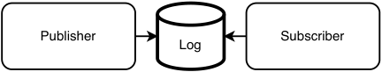
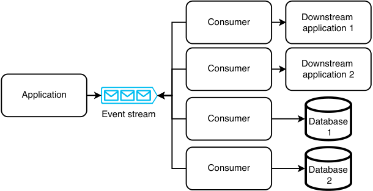
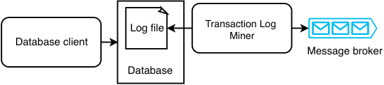
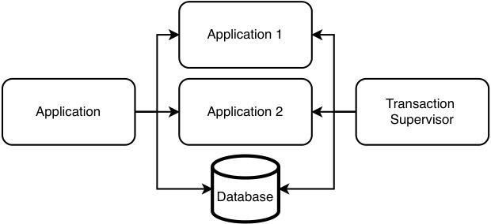
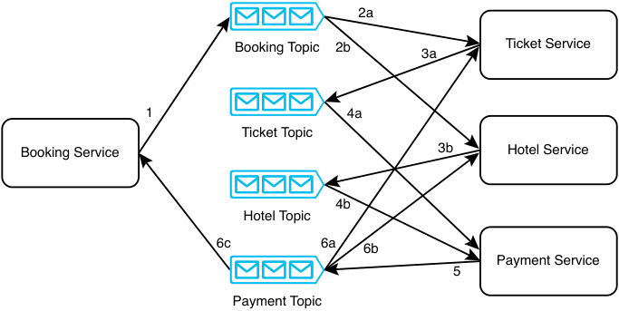
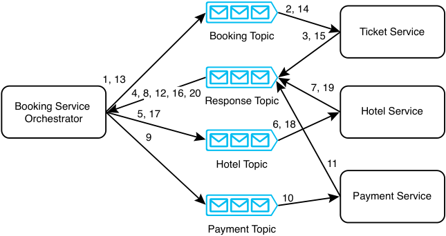

# _Distributed transactions_

## _This chapter covers_

- Creating data consistency across multiple services

- Using event sourcing for scalability, availability, lower cost, and consistency

- Writing a change to multiple services with Change Data Capture (CDC)

- Doing transactions with choreography vs. orchestration

In a system, a unit of work may involve writing data to multiple services. Each write to each service is a separate request/event. Any write may fail; the causes may include bugs or host or network outages. This may cause data inconsistency across the services. For example, if a customer bought a tour package consisting of both an air ticket and a hotel room, the system may need to write to a ticket service, a room reservation service, and a payments service. If any write fails, the system will be in an inconsistent state. Another example is a messaging system that sends messages to recipients and logs to a database that messages have been sent. If a message is successfully sent to a recipient’s device, but the write to the database fails, it will appear that the message has not been delivered.

A transaction is a way to group several reads and writes into a logical unit to maintain data consistency across services. They execute atomically, as a single operation, and the entire transaction either succeeds (commit) or fails (abort, rollback). A transaction has ACID properties, though the understanding of ACID concepts differs between databases, so the implementations also differ.

If we can use an event-streaming platform like Kafka to distribute these writes, allowing downstream services to pull instead of push these writes, we should do so. (Refer to section 4.6.2 for a discussion of pull vs. push.) For other situations, we introduce the concept of a _distributed transaction_ , which combines these separate write requests as a single distributed (atomic) transaction. We introduce the concept of _consensus_ —that is, all the services agree that the write event has occurred (or not occurred). For consistency across the services, consensus should occur despite possible faults during write events. This section describes algorithms for maintaining consistency in distributed transactions:

- The related concepts of event sourcing, Change Data Capture (CDC), and Event Driven Architecture (EDA).

- Checkpointing and dead letter queue were discussed in sections 3.3.6 and 3.3.7.

- Saga.

- Two-phase commit. (This is outside the scope of this book. Refer to appendix D for a brief discussion on two-phase commit.)

Two-phase commit and saga achieve consensus (all commit or all abort), while the other techniques are designed to designate a particular database as a source of truth should inconsistency result from failed writes.

## _5.1 Event Driven Architecture (EDA)_

In _Scalability for Startup Engineers_ (2015), Artur Ejsmont states, “Event Driven Architecture (EDA) is an architectural style where most interactions between different components are realized by announcing events that have already happened instead of requesting work to be done” (p. 295).

EDA is asynchronous and non-blocking. A request does not need to be processed, which may take considerable time and result in high latency. Rather, it only has to publish an event. If the event is successfully published, the server returns a successful response. The event can be processed afterwards. If necessary, the server can then send the response to the requestor. EDA promotes loose coupling, scalability, and responsiveness (low latency).

The alternative to EDA is that a service makes a request directly to another service. Regardless of whether such a request was blocking or non-blocking, unavailability or slow performance of either service means that the overall system is unavailable. This request also consumes a thread in each service, so there is one less thread available during the time the request takes to process. This effect is especially noticeable if the request takes a long time to process or occurs during traffic spikes. A traffic spike can overwhelm the service and cause 504 timeouts. The requestors will also be affected because each requestor must continue to maintain a thread as long as the request has not completed, so the requestor device has fewer resources for other work.

To prevent traffic spikes from causing outages, we need to use complex auto-scaling solutions or maintain a large cluster of hosts, which incurs more expense. (Rate limiting is another possible solution and is discussed in chapter 8.)

These alternatives are more expensive, complex, error-prone, and less scalable. The strong consistency and low latency that they provide may not actually be needed by users.

A less resource-intensive approach is to publish an event onto an event log. The publisher service does not need to continuously consume a thread to wait for the subscriber service to finish processing an event.

In practice, we may choose not to completely follow the non-blocking philosophy of EDA, such as by performing request validation when a request is made. For example, the server may validate that the request contains all required fields and valid values; a string field may need to be nonempty and not null; it may also have a minimum and maximum length. We may make this choice so that an invalid request can fail quickly, rather than waste resources and time persisting invalid data only to find an error afterwards. Event sourcing and Change Data Capture (CDC) are examples of EDA.

## _5.2_

#### _Event sourcing_

Event sourcing is a pattern for storing data or changes to data as events in an appendonly log. According to Davis ( _Cloud Native Patterns_ by Cornelia Davis (Manning Publications, 2019)), the idea of event sourcing is that the event log is the source of truth, and all other databases are projections of the event log. Any write must first be made to the event log. After this write succeeds, one or more event handlers consume this new event and writes it to the other databases.

Event sourcing is not tied to any particular data source. It can capture events from various sources, such as user interactions and external and internal systems. Referring to figure 5.1, event sourcing consists of publishing and persisting fine-grained, state-changing events of an entity as a sequence of events. These events are stored in a log, and subscribers process the log’s event to determine the entity’s current state. So, the publisher service asynchronously communicates with the subscriber service via the event log.

Figure 5.1     In event sourcing, a publisher publishes a sequence of events to a log that indicates changes to the state of an entity. A subscriber processes the log events in sequence to determine the entity’s current state.

This can be implemented in various ways. A publisher can publish an event to an event store or append-only log such as a Kafka topic, write a row to a relational database (SQL), write a document to a document database like MongoDB or Couchbase, or even write to an in-memory database such as Redis or Apache Ignite for low latency.

QUESTION    What if a subscriber host crashes while processing an event? How will the subscriber service know that it must process that event again?

Event sourcing provides a complete audit trail of all events in the system, and the ability to derive insights into the system’s past states by replaying events for debugging or analytics. Event sourcing also allows business logic to change by introducing new event types and handlers without affecting existing data.

Event sourcing adds complexity to system design and development because we must manage event stores, replay, versioning, and schema evolution. It increases storage requirements. Event replay becomes more costly and time-consuming as the logs grow.

## _5.3 Change Data Capture (CDC)_

_Change Data Capture (CDC)_ is about logging data change events to a change log event stream and providing this event stream through an API.

Figure 5.2 illustrates CDC. A single change or group of changes can be published as a single event to a change log event stream. This event stream has multiple consumers, each corresponding to a service/application/database. Each consumer consumes the event and provides it to its downstream service to be processed.

Figure 5.2    Using a change log event stream to synchronize data changes. Besides consumers, serverless functions can also be used to propagate changes to downstream applications or databases.

CDC ensures consistency and lower latency than event sourcing. Each request is processed in near real time, unlike in event sourcing where a request can stay in the log for some time before a subscriber processes it.

The transaction log tailing pattern (Chris Richardson, _Microservices Patterns: With Examples in Java,_ pp. 99–100, Manning Publications, 2019) is another system design pattern to prevent possible inconsistency when a process needs to write to a database and produce to Kafka. One of the two writes may fail, causing inconsistency.

Figure 5.3 illustrates the transaction log tailing pattern. In transaction log tailing, a process called the transaction log miner tails a database’s transaction log and produces each update as an event.

Figure 5.3    Illustration of the transaction log tailing pattern. A service does a write query to a database, which records this query in its log file. The transaction log miner tails the log file and picks up this query, then produces an event to the message broker.

CDC platforms include Debezium (https://debezium.io/), Databus (https://github.com/linkedin/databus), DynamoDB Streams (https://docs.aws.amazon.com/amazondynamodb/latest/developerguide/Streams.html),and Eventuate CDC Service (https://github.com/eventuate-foundation/eventuate-cdc).Theycanbeusedastransaction log miners.

Transaction log miners may generate duplicate events. One way to handle duplicate events is to use the message broker’s mechanisms for exactly-once delivery. Another way is for the events to be defined and processed idempotently.

## _5.4 Comparison of event sourcing and CDC_

Event-driven architecture (EDA), event sourcing, and CDC are related concepts used in distributed systems that to propagate data changes to interested consumers and downstream services. They decouple services by using asynchronous communication patterns to communicate these data changes. In some system designs, you might use both event sourcing and CDC together. For example, you can use event sourcing within a service to record data changes as events, while using CDC to propagate those events to other services. They differ in some of their purposes, in their granularity, and in their sources of truth. These differences are discussed in table 5.1.

Table 5.1    Differences between event sourcing and Change Data Capture (CDC)

||Event Sourcing|Change Data Capture (CDC)|
|---|---|---|
||||
|Purpose Source of truth Granularity|Record events as the source of truth. The log, or events published to the log, are the source of truth. Fine-grained events that represent specifc actions or changes in state.|Synchronize data changes by propagating events from a source service to downstream services. A database in the publisher service. The pub- lished events are not the source of truth. Individual database level changes such as new, updated, or deleted rows or documents.|

## _5.5 Transaction supervisor_

A transaction supervisor is a process that ensures a transaction is successfully completed or is compensated. It can be implemented as a periodic batch job or serverless function. Figure 5.4 shows an example of a transaction supervisor.

Figure 5.4    Example illustration of a transaction supervisor. An application may write to multiple downstream applications and databases. A transaction supervisor periodically syncs the various destinations in case any writes fail.

A transaction supervisor should generally be first implemented as an interface for manual review of inconsistencies and manual executions of compensating transactions. Automating compensating transactions is generally risky and should be approached with caution. Before automating a compensating transaction, it must first be extensively tested. Also ensure that there are no other distributed transaction mechanisms, or they may interfere with each other, leading to data loss or situations that are difficult to debug.

A compensating transaction must always be logged, regardless of whether it was manually or automatically run.

## _5.6 Saga_

A saga is a long-lived transaction that can be written as a sequence of transactions. All transactions must complete successfully, or compensating transactions are run to roll back the executed transactions. A saga is a pattern to help manage failures. A saga itself has no state.

A typical saga implementation involves services communicating via a message broker like Kafka or RabbitMQ. In our discussions in this book that involve saga, we will use Kafka.

An important use case of sagas is to carry out a distributed transaction only if certain services satisfy certain requirements. For example, in booking a tour package, a travel service may make a write request to an airline ticket service, and another write request to a hotel room service. If there are either no available flights or hotel rooms, the entire saga should be rolled back.

The airline ticket service and hotel room service may also need to write to a payments service, which is separate from the airline ticket service and hotel service for possible reasons including the following:

- The payment service should not process any payments until the airline ticket service confirms that the ticket is available, and the hotel room service confirms that the room is available. Otherwise, it may collect money from the user before confirming the entire tour package.

- The airline ticket and hotel room services may belong to other companies, and we cannot pass the user’s private payment information to them. Rather, our company needs to handle the user’s payment, and our company should make payments to other companies.

If a transaction to the payments service fails, the entire saga should be rolled back in reverse order using compensating transactions on the other two services.

There are two ways to structure the coordination: choreography (parallel) or orchestration (linear). In the rest of this section, we discuss one example of choreography and one example of orchestration, then compare choreography vs. orchestration. Refer to https://microservices.io/patterns/data/saga.htmlforanotherexample.###_5.6.1 Choreography_

In choreography, the service that begins the saga communicates with two Kafka topics. It produces to one Kafka topic to start the distributed transaction and consumes from another Kafka topic to perform any final logic. Other services in the saga communicate directly with each other via Kafka topics.

Figure 5.5 illustrates a choreography saga to book a tour package. In this chapter, the figures that include Kafka topics illustrate event consumption with the line arrowheads pointing away from the topic. In the other chapters of this book, an event consumption is illustrated with the line arrowhead pointing to the topic. The reason for this difference is that the diagrams in this chapter may be confusing if we follow the same convention as the other chapters. The diagrams in this chapter illustrate multiple services consuming from multiple certain topics and producing to multiple other topics, and it is clearer to display the arrowhead directions in the manner that we chose.

Figure 5.5    A choreography saga to book an airline ticket and a hotel room for a tour package. Two labels with the same number but different letters represent steps that occur in parallel.

The steps of a successful booking are as follows:

- 1 A user may make a booking request to the booking service. The booking service produces a booking request event to the booking topic.

- 2 The ticket service and hotel service consume this booking request event. They both confirm that their requests can be fulfilled. Both services may record this event in their respective databases, with the booking ID and a state like “AWAITING_PAYMENT”.

- 3 The ticket service and hotel service each produce a payment request event to the ticket topic and hotel topic, respectively.

- 4 The payment service consumes these payment request events from the ticket topic and hotel topic. Because these two events are consumed at different times and likely by different hosts, the payment service needs to record the receipt of these events in a database, so the service’s hosts will know when all the required events have been received. When all required events are received, the payment service will process the payment.

- 5 If the payment is successful, the payment service produces a payment success event to the payment topic.

- 6 The ticket service, hotel service, and booking service consume this event. The ticket service and hotel service both confirm this booking, which may involve changing the state of that booking ID to CONFIRMED, or other processing and business logic as necessary. The booking service may inform the user that the booking is confirmed.

Steps 1–4 are compensable transactions, which can be rolled back by compensating transactions. Step 5 is a pivot transaction. Transactions after the pivot transaction can be retried until they succeed. The step 6 transactions are retriable transactions; this is an example of CDC as discussed in section 5.3. The booking service doesn’t need to wait for any responses from the ticket service or the hotel service.

A question that may be asked is how does an external company subscribe to our company’s Kafka topics? The answer is that it doesn’t. For security reasons, we never allow direct external access to our Kafka service. We have simplified the details of this discussion for clarity. The ticket service and hotel service actually belong to our company. They communicate directly with our Kafka service/topics and make requests to external services. Figure 5.5 did not illustrate these details, so they don’t clutter the design diagram.

If the payment service responds with an error that the ticket cannot be reserved (maybe because the requested flight is fully booked or canceled), step 6 will be different. Rather than confirming the booking, the ticket service and hotel service will cancel the booking, and the booking service may return an appropriate error response to the user. Compensating transactions made by error responses from the hotel service or payment service will be similar to the described situation, so we will not discuss them. Other points to note in choreography:

- There are no bidirectional lines; that is, a service does not both produce to and subscribe to the same topic.

- No two services produce to the same topic.

- A service can subscribe to multiple topics. If a service needs to receive multiple events from multiple topics before it can perform an action, it needs to record in a database that it has received certain events, so it can read the database to determine if all the required events have been received.

- The relationship between topics and services can be 1:many or many:1, but not many:many.

- There may be cycles. Notice the cycle in figure 5.5 (hotel topic > payment service > payment topic > hotel service > hotel topic).

In figure 5.5, there are many lines between multiple topics and services. Choreography between a larger number of topics and services can become overly complex, errorprone, and difficult to maintain.

### _5.6.2 Orchestration_

In orchestration, the service that begins the saga is the orchestrator. The orchestrator communicates with each service via a Kafka topic. In each step in the saga, the orchestrator must produce to a topic to request this step to begin, and it must consume from another topic to receive the step’s result.

An orchestrator is a finite-state machine that reacts to events and issues commands. The orchestrator must only contain the sequence of steps. It must not contain any other business logic, except for the compensation mechanism.

Figure 5.6 illustrates an orchestration saga to book a tour package. The steps in a successful booking process are as shown.

Figure 5.6    An orchestration saga to book an airline ticket and a hotel room for a tour package

- 1 The orchestrator produces a ticket request event to the booking topic.

- 2 The ticket service consumes this ticket request event and reserves the airline ticket for the booking ID with the state “AWAITING_PAYMENT”.

- 3 The ticket service produces a “ticket pending payment” event to the response topic.

- 4 The orchestrator consumes the “ticket pending payment” event.

- 5 The orchestrator produces a hotel reservation request event to the hotel topic.

- 6 The hotel service consumes the hotel reservation request event and reserves the hotel room for the booking ID with the state “AWAITING_PAYMENT”.

- 7 The hotel service produces a “room pending payment” event to the response topic.

- 8 The orchestrator consumes the “room pending payment” event.

- 9 The orchestrator produces a payment request event to the payment topic.

- 10 The payment service consumes the payment request event.

- 11 The payment service processes the payment and then produces a payment confirmation event to the response topic.

- 12 The orchestrator consumes the payment confirmation event.

- 13 The orchestrator produces a payment confirmation event to the booking topic.

- 14 The ticket service consumes the payment confirmation event and changes the state corresponding to that booking to “CONFIRMED”.

- 15 The ticket service produces a ticket confirmation event to the response topic.

- 16 The orchestrator consumes this ticket confirmation event from response topic.

- 17 The orchestrator produces a payment confirmation event to the hotel topic.

- 18 The hotel service consumes this payment confirmation event and changes the state corresponding to that booking to “CONFIRMED”.

- 19 The hotel service produces a hotel room confirmation event to the response topic.

- 20 The booking service orchestrator consumes the hotel room confirmation event. It can then perform next steps, such as sending a success response to the user, or any further logic internal to the booking service.

Steps 18 and 19 appear unnecessary, as step 18 will not fail; it can keep retrying until it succeeds. Steps 18 and 20 can be done in parallel. However, we carry out these steps linearly to keep the approach consistent.

Steps 1–13 are compensable transactions. Step 14 is the pivot transaction. Steps 15 onward are retriable transactions.

If any of the three services produces an error response to the booking topic, the orchestrator can produce events to the various other services to run compensating transactions.

### _5.6.3 Comparison_

Table 5.1 compares choreography vs. orchestration. We should understand their differences and tradeoffs to evaluate which approach to use in a particular system design. The final decision may be partly arbitrary, but by understanding their differences, we also understand what we are trading off by choosing one approach over another.

Table 5.1    Choreography saga vs. orchestration saga

|Choreography|Orchestration|
|---|---|
|||
|Requests to services are made in parallel. This is the observer object-oriented design pattern. The service that begins the saga communicates with two Kafka topics. It produces one Kafka topic to start the distributed transaction and consumes from another Kafka topic to perform any fnal logic. The service that begins the saga only has code that produces to the saga’s frst topic and consumes from the saga’s last topic. A developer must read the code of every service involved in the saga to understand its steps. A service may need to subscribe to multiple Kafka topics, such as the Accounting Service in fgure 5.5 of Richardson’s book. This is because it may produce a certain event only when it has consumed certain other events from multiple services. This means that it must record in a database which events it has already consumed.|Requests to services are made linearly. This is the controller object-oriented design pattern. The orchestrator communicates with each service via a Kafka topic. In each step in the saga, the orchestrator must produce to a topic to request this step to begin, and it must consume from another topic to receive the step’s result. The orchestrator has code that produces and con- sumes Kafka topics that correspond to steps in the saga, so reading the orchestrator’s code allows one to understand the services and steps in the distrib- uted transaction. Other than the orchestrator, each service only subscribes to one other Kafka topic (from one other service). The relationships between the various services are easier to understand. Unlike choreography, a service never needs to consume multiple events from separate services before it can produce a certain event, so it may be possible to reduce the number of database writes.|

|Choreography|Orchestration|
|---|---|
|||
|Less resource-intensive, less chatty, and less net- work traffc; hence, it has lower latency overall. Parallel requests also result in lower latency. Services have a less independent software devel- opment lifecycle because developers must under- stand all services to change any one of them. No such single point of failure as in orchestration (i.e., no service needs to be highly available except the Kafka service). Compensating transactions are triggered by the various services involved in the saga.|Since every step must pass through the orchestra- tor, the number of events is double that of chore- ography. The overall effect is that orchestration is more resource-intensive, chattier, and has more network traffc; hence, it has higher latency overall. Requests are linear, so latency is higher. Services are more independent. A change to a service only affects the orchestrator and does not affect other services. If the orchestration service fails, the entire saga cannot execute (i.e., the orchestrator and the Kafka service must be highly available). Compensating transactions are triggered by the orchestrator.|

## _5.7 Other transaction types_

The following consensus algorithms are typically more useful for achieving consensus for a large number of nodes, typically in distributed databases. We will not discuss them in this book. Refer to _Designing Data-Intensive Applications_ by Martin Kleppman for more details.

- Quorum writes

- Paxos and EPaxos

- Raft

- Zab (ZooKeeper atomic broadcast protocol) – Used by Apache ZooKeeper.

## _5.8 Further reading_

- _Designing Data-Intensive Applications: The Big Ideas Behind Reliable, Scalable, and Maintainable Systems_ by Martin Kleppmann (O'Reilly Media, 2017)

- _Cloud Native: Using Containers, Functions, and Data to Build Next-Generation Applications_ by Boris Scholl, Trent Swanson, and Peter Jausovec (O’Reilly Media, 2019)

- _Cloud Native Patterns_ by Cornelia Davis (Manning Publications, 2019)

- _Microservices Patterns: With Examples in Java_ by Chris Richardson (Manning Publications, 2019). Chapter 3.3.7 discusses the transaction log tailing pattern. Chapter 4 is a detailed chapter on saga.

#### _Summary_

- A distributed transaction writes the same data to multiple services, with either eventual consistency or consensus.

- In event sourcing, write events are stored in a log, which is the source of truth and an audit trail that can replay events to reconstruct the system state.

- In Change Data Capture (CDC), an event stream has multiple consumers, each corresponding to a downstream service.

- A saga is a series of transactions that are either all completed successfully or are all rolled back.

- Choreography (parallel) or orchestration (linear) are two ways to coordinate sagas.

