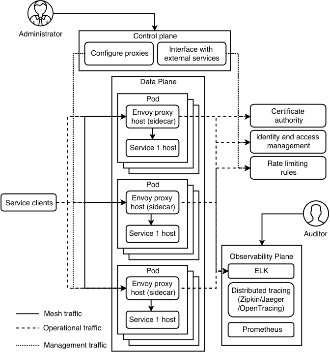
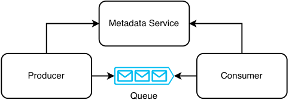
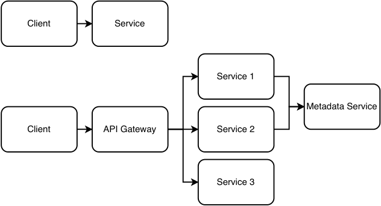
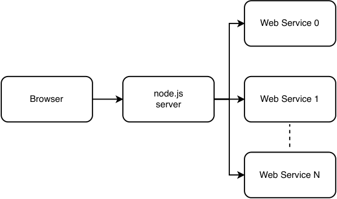

# _Common services for functional partitioning_

## _This chapter covers_

- Centralizing cross-cutting concerns with API gateway or service mesh/sidecar

- Minimizing network traffic with a metadata service

- Considering web and mobile frameworks to fulfill requirements

- Implementing functionality as libraries vs. services

- Selecting an appropriate API paradigm between REST, RPC, and GraphQL

Earlier in this book, we discussed functional partitioning as a scalability technique that partitions out specific functions from our backend to run on their own dedicated clusters. This chapter first discusses the API gateway, followed by the sidecar pattern (also called service mesh), which was a recent innovation. Next, we discuss centralization of common data into a metadata service. A common theme of these services is that they contain functionalities common to many backend services, which we can partition from those services into shared common services.

NOTE    Istio, a popular service mesh implementation, had its first production release in 2018.


Last, we discuss frameworks that can be used to develop the various components in a system design.

## _6.1 Common functionalities of various services_

A service can have many non-functional requirements, and many services with different functional requirements can share the same non-functional requirements. For example, a service that calculates sales taxes and a service to check hotel room availability may both take advantage of caching to improve performance or only accept requests from registered users.

If engineers implement these functionalities separately for each service, there may be duplication of work or duplicate code. Errors or inefficiencies are more likely because scarce engineering resources are spread out across a larger amount of work.

One possible solution is to place this code into libraries where various services can use them. However, this solution has the disadvantages discussed in section 6.7. Library updates are controlled by users, so the services may continue to run old versions that contain bugs or security problems fixed in newer versions. Each host running the service also runs the libraries, so the different functionalities cannot be independently scaled.

A solution is to centralize these cross-cutting concerns with an _API gateway._ An API gateway is a lightweight web service that consists of stateless machines located across several data centers. It provides common functionalities to our organization’s many services for centralization of cross-cutting concerns across various services, even if they are written in different programming languages. It should be kept as simple as possible despite its many responsibilities. Amazon API Gateway (https://aws.amazon.com/api-gateway/)and Kong (https://konghq.com/kong)areexamplesofcloud-provided API gateways.

The functionalities of an API gateway include the following, which can be grouped into categories.

### _6.1.1 Security_

These functionalities prevent unauthorized access to a service’s data:

- _Authentication:_ Verifies that a request is from an authorized user.

- _Authorization:_ Verifies that a user is allowed to make this request.

- _SSL termination:_ Termination is usually not handled by the API gateway itself but by a separate HTTP proxy that runs as a process on the same host. We do termination on the API gateway because termination on a load balancer is expensive. Although the term “SSL termination” is commonly used, the actual protocol is TLS, which is the successor to SSL.

- _Server-side data encryption:_ If we need to store data securely on backend hosts or on a database, the API gateway can encrypt data before storage and decrypt data before it is sent to a requestor.


### _6.1.2 Error-checking_

Error-checking prevents invalid or duplicate requests from reaching service hosts, allowing them to process only valid requests:

- _Request validation:_ One validation step is to ensure the request is properly formatted. For example, a POST request body should be valid JSON. It ensures that all required parameters are present in the request and their values honor constraints. We can configure these requirements on our service on our API gateway.

- _Request deduplication:_ Duplication may occur when a response with success status fails to reach the requestor/client because the requestor/client may reattempt this request. Caching is usually used to store previously seen request IDs to avoid duplication. If our service is idempotent, stateless, or “at least once” delivery, it can handle duplicate requests, and request duplication will not cause errors. However, if our service expects “exactly once” or “at most once” delivery, request duplication may cause errors.

### _6.1.3 Performance and availability_

An API gateway can improve the performance and availability of services by providing caching, rate limiting, and request dispatching.

- _Caching:_ The API gateway can cache common requests to the database or other services such as:

   - In our service architecture, the API gateway may make requests to a metadata service (refer to section 6.3). It can cache information on the most actively used entities.

   - Use identity information to save calls to authentication and authorization services.

- _Rate Limiting (also called throttling):_ Prevents our service from being overwhelmed by requests. (Refer to chapter 8 for a discussion on a sample rate-limiting service.)

- _Request dispatching:_ The API gateway makes remote calls to other services. It creates HTTP clients for these various services and ensures that requests to these services are properly isolated. When one service experiences slowdown, requests to other services are not affected. Common patterns like bulkhead and circuit breaker help implement resource isolation and make services more resilient when remote calls fail.

### _6.1.4 Logging and analytics_

Another common functionality provided by an API gateway is request logging or usage data collection, which is the gathering real-time information for various purposes such as analytics, auditing, billing, and debugging.


## _6.2 Service mesh/sidecar pattern_

Section 1.4.6 briefly discussed using a service mesh to address the disadvantages of an API gateway, repeated here:

- Additional latency in each request, from having to route the request through an additional service.

- A large cluster of hosts, which requires scaling to control costs.

Figure 6.1 is a repeat of figure 1.8, illustrating a service mesh. A slight disadvantage of this design is that a service’s host will be unavailable if its sidecar is unavailable, even if the service is up; this is the reason we generally do not run multiple services or containers on a single host.





Figure 6.1    Illustration of a service mesh, repeated from figure 1.8


Istio’s documentation states that a service mesh consists of a control plane and a data plane (https://istio.io/latest/docs/ops/deployment/architecture/),while Jenn Gile from Nginx also described an observability plane (https://www.nginx.com/blog/how-to-choose-a-service-mesh/).Figure6.1containsallthreetypes of planes.

An administrator can use the control plane to manage proxies and interface with external services. For example, the control plane can connect to a certificate authority to obtain a certificate, or to an identity and access control service to manage certain configurations. It can also push the certificate ID or the identify and access control service configurations to the proxy hosts. Interservice and intraservice requests occur between the Envoy (https://www.envoyproxy.io/)proxyhosts,whichwerefer to as mesh traffic. Sidecar proxy interservice communication can use various protocols including HTTP and gRPC (https://docs.microsoft.com/en-us/dotnet/architecture/cloud-native/service-mesh-communication-infrastructure).Theobservabilityplaneprovideslogging,monitoring, alerting, and auditing.

Rate limiting is another example of a common shared service that can be managed by a service mesh. Chapter 8 discusses this in more detail. AWS App Mesh (https://aws.amazon.com/app-mesh)isacloud-providedservicemesh.

NOTE Refer to section 1.4.6 for a brief discussion on sidecarless service mesh.

## _6.3 Metadata service_

A metadata service stores information that is used by multiple components within a system. If these components pass this information between each other, they can pass IDs rather than all the information. A component that receives an ID can request the metadata service for the information that corresponds to that ID. There is less duplicate information in the system, analogous to SQL normalization, so there is better consistency.

One example is ETL pipelines. Consider an ETL pipeline for sending welcome emails for certain products that users have signed up for. The email message may be an HTML file of several MB that contains many words and images, which are different according to product. Referring to figure 6.2, when a producer produces a message to the pipeline queue, instead of including an entire HTML file in the message, the producer can only include the ID of the file. The file can be stored in a metadata service. When a consumer consumes a message, it can request the metadata service for the HTML file that corresponds to that ID. This approach saves the queue from containing large amounts of duplicate data.





Figure 6.2    We can use a metadata service to reduce the size of individual messages in a queue, by placing large objects in the metadata service, and enqueuing only IDs in individual messages.


A tradeoff of using a metadata service is increased complexity and overall latency. Now the producer must write both to the Metadata Service and the queue. In certain designs, we may populate the metadata service in an earlier step, so the producer does not need to write to the metadata service.

If the producer cluster experiences traffic spikes, it will make a high rate of read requests to the metadata service, so the metadata service should be capable of supporting high read volumes.

In summary, a metadata service is for ID lookups. We will use metadata services in many of our sample question discussions in part 2.

Figure 6.3 illustrates the architecture changes from introducing the API gateway and metadata services. Instead of making requests to the backend, clients will make requests to the API gateway, which performs some functions and may send requests to either the metadata service and/or the backend. Figure 1.8 illustrates a service mesh.





Figure 6.3    Functional partitioning of a service (top) to separate out the API gateway and metadata service (bottom). Before this partitioning, clients query the service directly. With the partitioning, clients query the API gateway, which performs some functions and may route the request to one of the services, which in turn may query the metadata service for certain shared functionalities.

## _6.4 Service discovery_

Service discovery is a microservices concept that might be briefly mentioned during an interview in the context of managing multiple services. Service discovery is done under the hood, and most engineers do not need to understand their details. Most engineers only need to understand that each internal API service is typically assigned a port number via which it is accessed. External API services and most UI services are assigned URLs through which they are accessed. Service discovery may be covered in interviews for teams that develop infrastructure. It is unlikely that the details of service discovery will be discussed for other engineers because it provides little relevant interview signal.


Very briefly, service discovery is a way for clients to identify which service hosts are available. A service registry is a database that keeps track of the available hosts of a service. Refer to sources such as https://docs.aws.amazon.com/whitepapers/latest/microservices-on-aws/service-discovery.htmlfordetailsonserviceregistriesin Kubernetes and AWS. Refer to https://microservices.io/patterns/client-side-discovery.htmlandhttps://microservices.io/patterns/server-side-discovery.htmlfordetailsonclient-sidediscovery and server-side discovery.

## _6.5 Functional partitioning and various frameworks_

In this section, we discuss some of the countless frameworks that can be used to develop the various components in a system design diagram. New frameworks are continuously being developed, and various frameworks fall in and out of favor with the industry. The sheer number of frameworks can be confusing to a beginner. Moreover, certain frameworks can be used for more than one component, making the overall picture even more confusing. This section is a broad discussion of various frameworks, including

- Web

- Mobile, including Android and iOS

- Backend

- PC

The universe of languages and frameworks is far bigger than can be covered in this section, and it is not the aim of this section to discuss them all. The purpose of this section is to provide some awareness of several frameworks and languages. By the end of this section, you should be able to read more easily the documentation of a framework to understand its purposes and where it fits into a system design.

### _6.5.1 Basic system design of an app_

Figure 1.1 introduced a basic system design of an app. In almost all cases today, a company that develops a mobile app that makes requests to a backend service will have an iOS app on the iOS app store and an Android app on the Google Play store. It may also develop a browser app that has the same features as the mobile apps or maybe a simple page that directs users to download the mobile apps. There are many variations. For example, a company may also develop a PC app. But attempting to explain every possible combination is counterproductive, and we will not do so.

We will start with discussing the following questions regarding figure 1.1, then expand our discussion to various frameworks and their languages:

- Why is there a separate web server application from the backend and browser app?

- Why does the browser app make requests to this Node.js app, which then makes requests to the backend that is shared with the Android and iOS apps?


### _6.5.2 Purposes of a web server app_

The purposes of a web server app include the following:

- When someone using a web browser accesses the URL (e.g., https://google.com/),thebrowserdownloadsthebrowser app from the Node.js app. As stated in section 1.4.1, the browser app should preferably be small so it can be downloaded quickly.

- When the browser makes a specific URL request (e.g., with a specific path like https://google.com/about), Node.js handles the routing of the URL and serves the corresponding page.

- The URL may include certain path and query parameters that require specific backend requests. The Node.js app processes the URL and makes the appropriate backend requests.

- Certain user actions on the browser app, such as filling and submitting forms or clicking on buttons, may require backend requests. A single action may correspond to multiple backend requests, so the Node.js app exposes its own API to the browser app. Referring to figure 6.4, for each user action, the browser app makes an API request to the Node.js app/server, which then makes one or more appropriate backend requests and returns the requested data.





Figure 6.4    A Node.js server can serve a request from a browser by making appropriate requests to one or more web services, aggregate and process their responses, and return the appropriate response to the browser.

Why doesn’t a browser make requests directly to the backend? If the backend was a REST app, its API endpoints may not return the exact data required by the browser. The browser may have to make multiple API requests and fetch more data than required. This data transmission occurs over the internet, between a user’s device and a data center, which is inefficient. It is more efficient for the Node.js app to make these large requests because the data transmission will likely happen between adjacent hosts in the same data center. The Node.js app can then return the exact data required by the browser.

GraphQL apps allow users to request the exact data required, but securing GraphQL endpoints is more work than a REST app, causing more development time and possible security breaches. Other disadvantages include the following. Refer to section 6.7.4 for more discussion on GraphQL:

- Flexible queries mean that more work is required to optimize performance.

- More code on the client.

- More work needed to define the schema.

- Larger requests.

### _6.5.3 Web and mobile frameworks_

This section contains a list of frameworks, classified into the following:

- Web/browser app development

- Mobile app development

- Backend app development

- PC aka desktop app development (i.e., for Windows, Mac, and Linux)

A complete list will be very long, include many frameworks that one will be unlikely to encounter or even read about during their career, and in the author’s opinion, will not be useful to the reader. This list only states some of the frameworks that are prominent or used to be prominent.

The flexibility of these spaces makes a complete and objective discussion difficult. Frameworks and languages are developed in countless ways, some of which make sense and others which do not.

#### browser app development

Browsers accept only HTML, CSS, and JavaScript, so browser apps must be in these languages for backward compatibility. A browser is installed on a user’s device, so it must be upgraded by the user themselves, and it is difficult and impractical to persuade or force users to download a browser that accepts another language. It is possible to develop a browser app in vanilla JavaScript (i.e., without any frameworks), but this is impractical for all but the smallest browser apps because frameworks contain many functions that one will otherwise have to reimplement in vanilla JavaScript (e.g., animation or data rendering like sorting tables or drawing charts).

Although browser apps must be in these three languages, a framework can offer other languages. The browser app code written in these languages is transpiled to HTML, CSS, and JavaScript.

The most popular browser app frameworks include React, Vue.js, and Angular. Other frameworks include Meteor, jQuery, Ember.js, and Backbone.js. A common theme of these frameworks is that developers mix the markup and logic in the same files, rather than having separate HTML files for markup and JavaScript files for logic. These frameworks may also contain their own languages for markup and logic. For example, React introduced JSX, which is an HTML-like markup language. A JSX file can include both markup and JavaScript functions and classes. Vue.js has the template tag, which is similar to HTML.

Some of the more prominent web development languages (which are transpiled to JavaScript) include the following:

- TypeScript (https://www.typescriptlang.org/)isastaticallytypedlanguage. It is a wrapper/superset around JavaScript. Virtually any JavaScript framework can also use TypeScript, with some setup work.

- Elm (https://elm-lang.org/)canbedirectlytranspiledto HTML, CSS, and JavaScript, or it can also be used within other frameworks like React.

- PureScript (https://www.purescript.org/)aimsforasimilarsyntax as Haskell.

- Reason (https://reasonml.github.io/).-ReScript (https://rescript-lang.org/).-Clojure (https://clojure.org/)isageneral-purposelanguage. The ClojureScript (https://clojurescript.org/)frameworktranspilesto Clojure to JavaScript.

- CoffeeScript (https://coffeescript.org/).Thesebrowserappframeworksarefor the browser/client side. Here are some server-side frameworks. Any server-side framework can also make requests to databases and be used for backend development. In practice, a company often chooses one framework for server development and another framework for backend development. This is a common point of confusion for beginners trying to distinguish between “server-side frontend” frameworks and “backend” frameworks. There is no strict division between them.

- Express (https://expressjs.com/)isa Node.js (https://nodejs.org/)serverframework. Node.js is a JavaScript runtime environment built on Chrome’s V8 JavaScript engine. The V8 JavaScript engine was originally built for Chrome, but it can also run on an operating system like Linux or Windows. The purpose of Node.js is for JavaScript code to run on an operating system. Most frontend or full-stack job postings that state Node.js as a requirement are actually referring to Express.

- Deno (https://deno.land/)supports JavaScript and TypeScript. It was created by Ryan Dahl, the original creator of Node.js, to address his regrets about Node.js.

- Goji (https://goji.io/)isa Golang framework.

- Rocket (https://rocket.rs/)isa Rust framework. Refer to https://blog.logrocket.com/the-current-state-of-rust-web-frameworks/formoreexamplesof Rust web server and backend frameworks.

- Vapor (https://vapor.codes/)isaframeworkforthe Swift language.


- Vert.x (https://vertx.io/)offersdevelopmentin Java, Groovy, and Kotlin.

- PHP (https://www.php.net/). (There is no universal agreement on whether PHP is a language or a framework. The author’s opinion is that there is no practical value in debating this semantic.) A common solution stack is the LAMP (Linux, Apache, MySQL, PHP/Perl/Python) acronym. PHP code can be run on an Apache (https://httpd.apache.org/)server,whichinturnruns on a Linux host. PHP was popular before ~2010 (https://www.tiobe.com/tiobe-index/php/),butintheauthor’sexperience, PHP code is seldom directly used for new projects. PHP remains prominent for web development via the WordPress platform, which is useful for building simple websites. More sophisticated user interfaces and customizations are more easily done by web developers, using frameworks that require considerable coding, such as React and Vue.js. Meta (formerly known as Facebook) was a prominent PHP user. The Facebook browser app was formerly developed in PHP. In 2014, Facebook introduced the Hack language (https://hacklang.org/)and HipHop Virtual Machine (HHVM) (https://hhvm.com/).Hackisa PHP-like language that does not suffer from the bad security and performance of PHP. It runs on HVVM. Meta is an extensive user of Hack and HHVM.

#### mobile app development

The dominant mobile operating systems are Android and iOS, developed by Google and Apple, respectively. Google and Apple each offer their own Android or iOS app development platform, which are commonly referred to as “native” platforms. The native Android development languages are Kotlin and Java, while the native iOS development languages are Swift and Objective-C.

#### cross-platform development

Cross-platform development frameworks in theory reduce duplicate work by running the same code on multiple platforms. In practice, there may be additional code required to code the app for each platform, which will negate some of this benefit. Such situations occur when the UI (user interface) components provided by operating systems are too different from each other. Frameworks which are cross-platform between Android and iOS include the following:

- React Native is distinct from React. The latter is for web development only. There is also a framework called React Native for Web (https://github.com/necolas/react-native-web),whichallowswebdevelopmentusing React Native.

- Flutter (https://flutter.dev/)iscross-platformacross Android, iOS, web, and PC.

- Ionic (https://ionicframework.com/)iscross-platformacross Android, iOS, web, and PC.

- Xamarin (https://dotnet.microsoft.com/en-us/apps/xamarin)iscross-platformacross Android, iOS, and Windows.


Electron (https://www.electronjs.org/)iscross-platformbetweenweband PC.

Cordova (https://cordova.apache.org/)isaframeworkformobile and PC development using HTML, CSS, and JavaScript. With Cordova, cross-platform development with web development frameworks like Ember.js is possible.

Another technique is to code a _progressive web app_ (PWA). A PWA is a browser app or web application that can provide a typical desktop browser experience and also uses certain browser features such as _service workers_ and _app manifests_ to provide mobile user experiences similar to mobile devices. For example, using service workers, a progressive web app can provide user experiences, such as push notifications, and cache data in the browser to provide offline experiences similar to native mobile apps. A developer can configure an app manifest so the PWA can be installed on a desktop or mobile device. A user can add an icon of the app on their device’s home screen, start menu, or desktop and tap on that icon to open the app; this is a similar experience to installing apps from the Android or iOS app stores. Since different devices have different screen dimensions, designers and developers should use a _responsive web design_ approach, which is an approach to web design to make the web app render well on various screen dimensions or when the user resizes their browser window. Developers can use approaches like _media queries_ (https://developer.mozilla.org/en-US/docs/Web/CSS/Media_Queries/Using_media_queries)or_ResizeObserver_ (https://developer.mozilla.org/en-US/docs/Web/API/ResizeObserver)toensuretheapprenders well on various browser or screen dimensions.

#### backend development

Here is a list of backend development frameworks. Backend frameworks can be classified into RPC, REST, and GraphQL. Some backend development frameworks are fullstack; that is, they can be used to develop a monolithic browser application that makes database requests. We can also choose to use them for browser app development and make requests to a backend service developed in another framework, but the author has never heard of these frameworks being used this way:

- gRPC (https://grpc.io/)isan RPC framework that can be developed in C#, C++, Dart, Golang, Java, Kotlin, Node, Objective-C, PHP, Python, or Ruby. It may be extended to other languages in the future.

- Thrift (https://thrift.apache.org/)and Protocol Buffers (https://developers.google.com/protocol-buffers)areusedtoserializedata objects, compressing them to reduce network traffic. An object can be defined in a definition file. We can then generate client and server (backend, not web server) code from a definition file. Clients can use the client code to serialize requests to the backend, which uses the backend code to deserialize the requests, and vice versa for the backend’s responses. Definition files also help to maintain backward and forward compatibility by placing limitations on possible changes.


- Dropwizard (https://www.dropwizard.io/)isanexampleofa Java REST framework. Spring Boot (https://spring.io/projects/spring-boot)canbeusedtocreate Java applications, including REST services.

- Flask (https://flask.palletsprojects.com/)and Django (https://www.djangoproject.com/)aretwoexamplesof REST frameworks in Python. They can also be used for web server development.

Here are several examples of full-stack frameworks:

- Dart (https://dart.dev)isalanguagethatoffers frameworks for any solution. It can be used for full-stack, backend, server, browser, and mobile apps.

- Rails (https://rubyonrails.org/)isa Ruby full-stack framework that can also be used for REST. Ruby on Rails is often used as a single solution, rather than using Ruby with other frameworks or Rails with other languages.

- Yesod (https://www.yesodweb.com/)isa Haskell framework that can also be used just for REST. Browser app development can be done with Yesod using its Shakespearean template languages https://www.yesodweb.com/book/shakespearean-templates,whichtranspilesto HTML, CSS, and JavaScript.

- Integrated Haskell Platform (https://ihp.digitallyinduced.com/)isanother Haskell framework.

- Phoenix (https://www.phoenixframework.org/)isaframeworkforthe Elixir language.

- JavaFX (https://openjfx.io/)isa Java client application platform for desktop, mobile, and embedded systems. It is descended from Java Swing (https://docs.oracle.com/javase/tutorial/uiswing/),fordeveloping GUI for Java programs.

- Beego (https://beego.vip/)and Gin (https://gin-gonic.com/)are Golang frame works.

## _6.6 Library vs. service_

After determining our system’s components, we can discuss the pros and cons of implementing each component on the client-side vs. server-side, as a library vs. service. Do not immediately assume that a particular choice is best for any particular component. In most situations, there is no obvious choice between using a library vs. service, so we need to be able to discuss design and implementation details and tradeoffs for both options.

A library may be an independent code bundle, a thin layer that forwards all requests and responses between clients and servers, respectively, or it may contain elements of both. In other words, some of the API logic is implemented within the library while the rest may be implemented by services called by the library. In this chapter, for the purpose of comparing libraries vs. services, the term “library” refers to an independent library.

Table 6.1 summarizes a comparison of libraries vs. services. Most of these points are discussed in detail in the rest of this chapter.


Table 6.1    Summary comparison of libraries vs. services


|Library|Service|
|---|---|
|||
|Users choose which version/build to use and have<br>more choice on upgrading to new versions.<br>A disadvantage is that users may continue to use<br>old versions of libraries that contain bugs or secu-<br>rity problems fxed in newer versions.<br>Users who wish to always use the latest version of a<br>frequently updated library have to implement pro-<br>grammatic upgrades themselves.<br>No communication or data sharing between<br>devices limits applications. If the user is another<br>service, this service is horizontally scaled, and data<br>sharing between hosts is needed, the customer<br>service’s hosts must be able to communicate with<br>each other to share data. This communication must<br>be implemented by the user service’s developers.<br>Language-specifc.<br>Predictable latency.<br>Predictable, reproducible behavior.<br>If we need to scale up the load on the library, the<br>entire application must be scaled up with it. Scaling<br>costs are borne by the user’s service.<br>Users may be able to decompile the code to steal<br>intellectual property.|Developers select the build and control when<br>upgrades happen.<br>No such limitation. Data synchronization between<br>multiple hosts can be done via requests to each<br>other or to a database. Users need not be con-<br>cerned about this.<br>Technology-agnostic.<br>Less predictable latency due to dependence on<br>network conditions.<br>Network problems are unpredictable and diffcult to<br>reproduce, so the behavior may be less predictable<br>and less reproducible.<br>Independently scalable. Scaling costs are borne by<br>the service.<br>Code is not exposed to users. (Though APIs can be<br>reverse-engineered. This is outside the scope of<br>this book.)|


### _6.6.1 Language specific vs. technology-agnostic_

For ease of use, a library should be in the client’s language, so the same library must be reimplemented in each supported language.

Most libraries are optimized to perform a well-defined set of related tasks, so they can be optimally implemented in a single language. However, certain libraries may be partially or completely written in another language because certain languages and frameworks may be better suited for specific purposes. Implementing this logic entirely in the same language may cause inefficiencies during use. Moreover, while developing our library, we may want to utilize libraries written in other languages. There are various utility libraries that one can use to develop a library that contains components in other languages. This is outside the scope of this book. A practical difficulty is that the team or company that develops this library will require engineers fluent in all of these languages.


A service is technology-agnostic because a client can utilize a service regardless of the former or latter’s technology stacks. A service can be implemented in the language and frameworks best-suited for its purposes. There is a slight additional overhead for clients, who will need to instantiate and maintain HTTP, RPC, or GraphQL connections to the service.

### _6.6.2 Predictability of latency_

A library has no network latency, has guaranteed and predictable response time, and can be easily profiled with tools such as flame graphs.

A service has unpredictable and uncontrollable latency as it depends on numerous factors such as:

- Network latency, which depends on the user’s internet connection quality.

- The service’s ability to handle its current traffic volume.

### _6.6.3 Predictability and reproducibility of behavior_

A service has less predictable and reproducible behavior than a library because its behavior has more dependencies such as:

- A deployment rollout is usually gradual (i.e., the build is deployed to a few service hosts at a time). Requests may be routed by the load balancer to hosts running different builds, resulting in different behavior.

- Users do not have complete control of the service’s data, and it may be changed between requests by the service’s developers. This is unlike a library, where users have complete control of their machine’s file system.

- A service may make requests to other services and be affected by their unpredictable and unreproducible behavior.

Despite these factors, a service is often easier to debug than a library because:

- A service’s developers have access to its logs, while a library’s developers do not have access to the logs on the users’ devices.

- A service’s developers control its environment and can set up a uniform environment using tools like virtual machines and Docker for its hosts. A library is run by users on a diversity of environments such as variations in hardware, firmware, and OS (Android vs. iOS). A user may choose to send their crash logs to the developers, but it may still be difficult to debug without access to the user’s device and exact environment.

### _6.6.4 Scaling considerations for libraries_

A library cannot be independently scaled up since it is contained within the user’s application. It does not make sense to discuss scaling up a library on a single user device. If the user’s application runs in parallel on multiple devices, the user can scale


A POST request to the payment service may return a response like:
```json
{
  "links": {
    "pay": "https://api.acme.com/payment/abc123"
  }
}
```
where the response contains an invoice ID, and the next step is to POST a payment for that invoice ID.

There is also the OPTIONS HTTP method, which is for fetching metadata about an endpoint, such as available actions, fields that can be updated, or what data do certain fields expect.

In practice, hypermedia and OPTIONS are difficult for client developers to use, and it makes more sense to provide a client developer with API documentation of each endpoint or function, such as using OpenAPI (https://swagger.io/specification/)for REST or the built-in documentation tools of RPC and GraphQL frameworks.

Refer to https://jsonapi.org/forconventionsonrequest/response JSON body specification.

Other communication architectures like RPC or GraphQL do not provide hypermedia.

#### caching

Developers should declare REST resources as cacheable whenever possible, a practice which carries advantages such as the following:

- Lower latency because some network calls are avoided.

- Higher availability because the resource is available even if the service is not.

- Better scalability, since there is lower load on the server.

Use the `Expires` , `Cache-Control` , `ETag` , and HTTP headers for Last-Modified caching.

The `Expires` HTTP header specifies an absolute expiry time for a cached resource. A service can set a time value up to one year ahead of its current clock time. An example header is `Expires: Mon, 11 Dec 2021 18:00 PST` .

The `Cache-Control` header consists of comma-separated directives (instructions) for caching in both requests and responses. An example header is `Cache-Control: max-age=3600` , which means the response is cacheable for 3600 seconds. A POST or PUT request (noun) may include a `Cache-Control` header as a directive to the server to cache this data, but this does not mean that the server will follow this directive, and this directive might not be contained in responses for this data. Refer to https://developer.mozilla.org/en-US/docs/Web/HTTP/Headers/Cache-Controlforallcacherequestandresponsedirectives.

An `ETag` value is an opaque string token that is an identifier for a specific version of a resource. (An _opaque token_ is a token that has a proprietary format that is only known to the issuer. To validate an opaque token, the recipient of the token needs to call the server that issued the token.) A client can refresh its resource more efficiently by including the `ETag` value in the GET request. The server will only return the resource’s value if the latter’s `ETag` is different. In other words, the resource’s value changed, so it does not unnecessarily return the resource’s value if the client already has it.

The Last-Modified header contains the date and time the resource was last modified and can be used as a fallback for the `ETag` header if the latter is unavailable. Related headers are and . If-Modified-Since If-Unmodified-Since

#### disadvantages of rest

A disadvantage is that it has no integrated documentation mechanisms, other than hypermedia or OPTIONS endpoints, which developers can choose not to provide. One must add an OpenAPI documentation framework to a service implemented using a REST framework. Otherwise, clients have no way of knowing the available request endpoints, or their details such as path or query parameters or the request and response body fields. REST also has no standardized versioning procedure; a common convention is to use a path like “/v2,” “/v3,” etc. for versioning. Another disadvantage of REST is that it does not have a universal specification, which leads to confusion. OData and JSON-API are two popular specifications.

### _6.7.3 RPC (Remote Procedure Call)_

RPC is a technique to make a procedure execute in a different address space (i.e., another host), without the programmer having to handle the network details. Popular open-source RPC frameworks include Google’s gRPC, Facebook’s Thrift, and RPyC in Python.

For an interview, you should be familiar with the following common encoding formats. You should understand how encoding (also called serialization or marshalling) and decoding (also called parsing, deserialization, or unmarshalling) are done.

- CSV, XML, JSON

- Thrift

- Protocol Buffers (protobuf)

- Avro

The main advantages of RPC frameworks like gRPC over REST are:

- RPC is designed for resource optimization, so it is the best communication architecture choice for low-power devices, such as IoT devices like smart home devices. For a large web service, its lower resource consumption compared to REST or GraphQL becomes significant with scale.

- Protobuf is an efficient encoding. JSON is repetitive and verbose, causing requests and responses to be large. Network traffic savings become significant with scale.

- Developers define the schemas of their endpoints in files. Common formats include Avro, Thrift, and protobuf. Clients use these files to create requests and interpret responses. As schema documentation is a required step in developing the API, client developers will always have good API documentation. These encoding formats also have schema modification rules, which make it clear to developers how to maintain backward and/or forward compatibility in schema modifications.

The main disadvantages of RPC are also from its nature as a binary protocol. It is troublesome for clients to have to update to the latest version of the schema files, especially outside an organization. Also, if an organization wishes to monitor its internal network traffic, it is easier to do so with text protocols like REST than with binary protocols like RPC.

### _6.7.4 GraphQL_

GraphQL is a query language that enables _declarative data fetching_ , where a client can specify exactly what data it needs from an API. It provides an API data query and manipulation language for pinpoint requests. It also provides an integrated API documentation tool that is essential for navigating this flexibility. The main benefits are:

- The client decides what data they want and its format.

- The server is efficient and delivers exactly what the client requests without under fetching (which necessitates multiple requests) or over-fetching (which inflates response size).

#### Tradeoffs:

- May be too complex for simple APIs.

- Has a higher learning curve than RPC and REST, including security mechanisms.

- Has a smaller user community than RPC and REST.

- Encodes in JSON only, which carries all the tradeoffs of JSON.

- User analytics may be more complicated because each API user performs slightly different queries. In REST and RPC, we can easily see how many queries were made to each API endpoint, but this is less obvious in GraphQL.

- We should be cautious when using GraphQL for external APIs. It is similar to exposing a database and allowing clients to make SQL queries.

Many of the benefits of GraphQL can be done in REST. A simple API can begin with simple REST HTTP methods (GET, POST, PUT, DELETE) with simple JSON bodies. As its requirements become more complex, it can use more REST capabilities such as OData https://www.odata.org/,oruseJSON-APIcapabilitieslikehttps://jsonapi.org/format/#fetching-includestocombinerelateddatafrommultiple resources into a single request. GraphQL may be more convenient than REST in addressing complex requirements because it provides a standard implementation and documentation of its capabilities. REST, on the other hand, has no universal standard.


### _6.7.5 WebSocket_

WebSocket is a communications protocol for full-duplex communication over a persistent TCP connection, unlike HTTP, which creates a new connection for every request and closes it with every response. REST, RPC, GraphQL, and Actor model are design patterns or philosophies, while WebSocket and HTTP are communication protocols. However, it makes sense to compare WebSocket to the rest as API architectural styles because we can choose to implement our API using WebSocket rather than the other four choices.

To create a WebSocket connection, a client sends a WebSocket request to the server. WebSocket uses an HTTP handshake to create an initial connection and requests the server to upgrade to WebSocket from HTTP. Subsequent messages can use WebSocket over this persistent TCP connection.

WebSocket keeps connections open, which increases overhead for all parties. This means that WebSocket is stateful (compared to REST and HTTP, which are stateless). A request must be handled by the host that contains the relevant state/connection, unlike in REST where any host can handle any request. Both the stateful nature of WebSocket and the resource overhead of maintaining connections means that WebSocket is less scalable.

WebSocket allows p2p communication, so no backend is required. It trades off scalability for lower latency and higher performance.

### _6.7.6 Comparison_

During an interview, we may need to evaluate the tradeoffs between these architectural styles and the factors to consider in choosing a style and protocol. REST and RPC are the most common. Startups usually use REST for simplicity, while large organizations can benefit from RPC’s efficiency and backward and forward compatibility. GraphQL is a relatively new philosophy. WebSocket is useful for bidirectional communication, including p2p communication. Other references include https:// apisyouwonthate.com/blog/picking-api-paradigm/ and https://www.baeldung.com/rest-vs-websockets.## _Summary_- An API gateway is a web service designed to be stateless and lightweight yet fulfill many cross-cutting concerns across various services, which can be grouped into security, error-checking, performance and availability, and logging.

- A service mesh or sidecar pattern is an alternative pattern. Each host gets its own sidecar, so no service can consume an unfair share.

- To minimize network traffic, we can consider using a metadata service to store data that is processed by multiple components within a system.

- Service discovery is for clients to identify which service hosts are available.


- A browser app can have two or more backend services. One of them is a web server service that intercepts requests and responses from the other backend services.

- A web server service minimizes network traffic between the browser and data center, by performing aggregation and filtering operations with the backend.

- Browser app frameworks are for browser app development. Server-side frameworks are for web service development. Mobile app development can be done with native or cross-platform frameworks.

- There are cross-platform or full-stack frameworks for developing browser apps, mobile apps, and web servers. They carry tradeoffs, which may make them unsuitable for one’s particular requirements.

- Backend development frameworks can be classified into RPC, REST, and GraphQL frameworks.

- Some components can be implemented as either libraries or services. Each approach has its tradeoffs.

- Most communication paradigms are implemented on top of HTTP. RPC is a lower-level protocol for efficiency.

- REST is simple to learn and use. We should declare REST resources as cacheable whenever possible.

- REST requires a separate documentation framework like OpenAPI.

- RPC is a binary protocol designed for resource optimization. Its schema modification rules also allow backward- and forward-compatibility.

- GraphQL allows pinpoint requests and has an integrated API documentation

   - tool. However, it is complex and more difficult to secure.

- WebSocket is a stateful communications protocol for full-duplex communication. It has more overhead on both the client and server than other communication paradigms.


