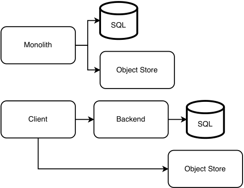
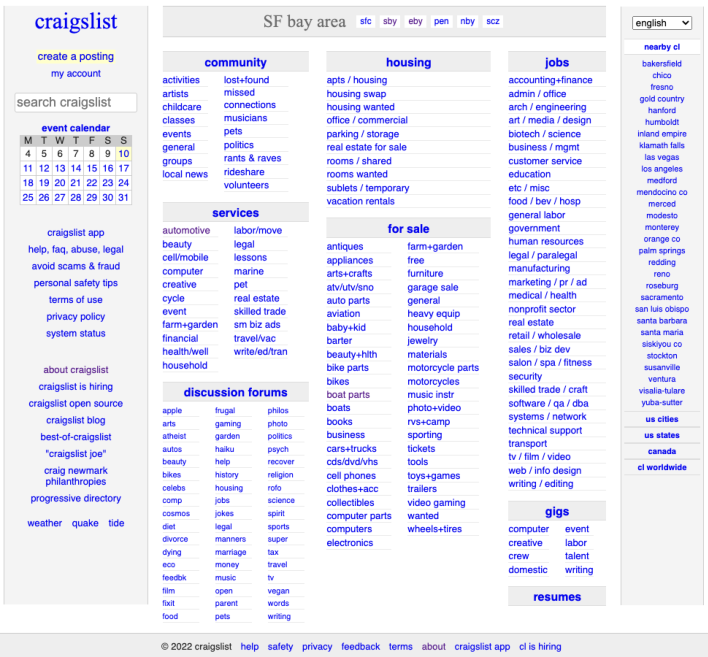
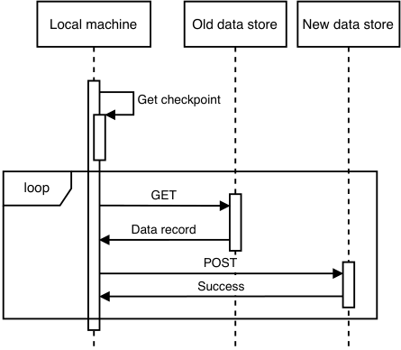
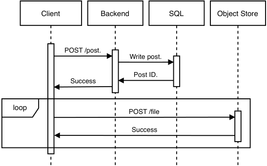
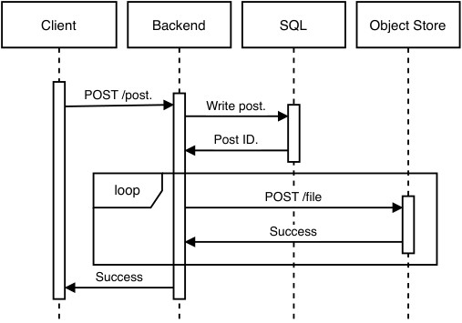
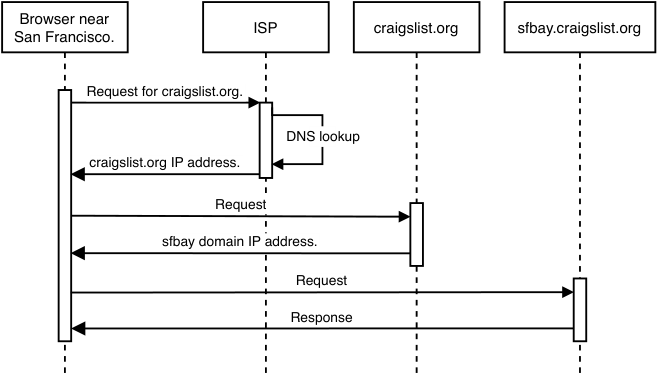
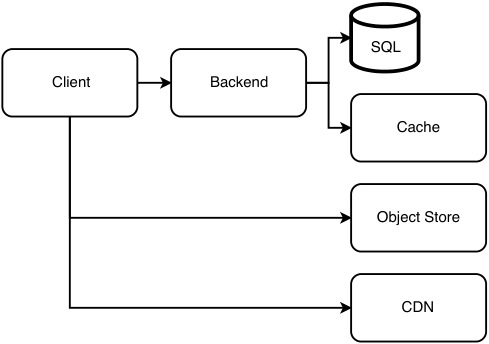
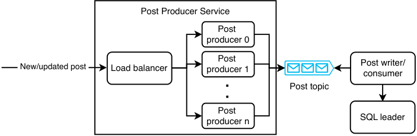
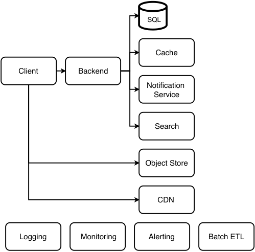
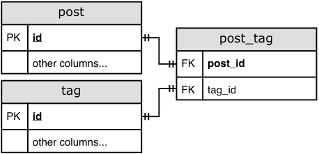

# _Design Craigslist_

## _This chapter covers_

- Designing an application with two distinct types of users

- Considering geolocation routing for partitioning users

- Designing read-heavy vs. write-heavy

- applications

- Handling minor deviations during the interview

We want to design a web application for classifieds posts. Craigslist is an example of a typical web application that may have more than a billion users. It is partitioned by geography. We can discuss the overall system, which includes browser and mobile apps, a stateless backend, simple storage requirements, and analytics. More use cases and constraints can be added for an open-ended discussion. This chapter is unique in that it is the only one in this book where we discuss a monolith architecture as a possible system design.

## _7.1 User stories and requirements_

Let’s discuss the user stories for Craigslist. We distinguish two primary user types: viewer and poster.

A poster should be able to create and delete a post and search their posts as they may have many, especially if they were programmatically generated. This post should contain the following information:

- Title.

- Some paragraphs of description.

- Price. Assume a single currency and ignore currency conversions.

- Location.

- Up to 10 photos of 1 MB each.

- Video, though this may be added to a later iteration of our application.

A poster can renew their post every seven days. They will receive an email notification with a click-through to renew their post.

A viewer should be able to

- 1 View all posts or search in posts within any city made in the last seven days. View a list of results, possibly as an endless scroll.

- 2 Apply filters on the results.

- 3 Click an individual post to view its details.

- 4 Contact the poster, such as by email.

- 5 Report fraud and misleading posts (e.g., a possible clickbait technique is to state a low price on the post but a higher price in the description).

The non-functional requirements are as follows:

- _Scalable_ —Up to 10 million users in a single city.

- _High availability_ —99.9% uptime.

- _High performance_ —Viewers should be able to view posts within seconds of creation. Search and viewing posts should have 1 second P99.

- _Security_ —A poster should log in before creating a post. We can use an authentication library or service. Appendix B discusses OpenID Connect, which is a popular authentication mechanism. We will not discuss this further in the rest of this chapter.

Most of the required storage will be for Craigslist posts. The amount of required storage is low:

- We may show a Craigslist user only the posts in their local area. This means that a data center serving any individual user only needs to store a fraction of all the posts (though it may also back up posts from other data centers).

- Posts are manually (not programmatically) created, so storage growth will be slow.

- We do not handle any programmatically generated data.

- A post may be automatically deleted after one week.

A low storage requirement means that all the data can fit into a single host, so we do not require distributed storage solutions. Let’s assume an average post contains 1,000 letters or 1 KB of text. If we assume that a big city has 10 million people and 10% of them are posters creating an average of 10 posts/day (i.e., 10 GB/day), our SQL database can easily store months of posts.

## _7.2 API_

Let’s scribble down some API endpoints, separated into managing posts and managing users. (In an interview, we have no time to write down a formal API specification such as in OpenAPI format or GraphQL schema, so we can tell the interviewer that we can use a formal specification to define our API, but in the interest of time we will use rough scribbles during the interview. We will not mention this again in the rest of the book.)

CRUD posts:

- `GET` and `DELETE /post/{id}`

- `GET /post?search={search_string}`. This can be an endpoint to `GET` all posts. It can have a “search” query parameter to search on posts’ content. We may also implement query parameters for pagination, which will be discussed in section 12.7.1.

- `POST` and `PUT /post`

- `POST /contact`

- `POST /report`

- `DELETE /old_posts`

User management:

- `POST /signup`. We do not need to discuss user account management.

- `POST /login`

- `DELETE /user`

Other:

- `GET /health`. Usually automatically generated by the framework. Our implementation can be as simple as making a small `GET` request and verifying it returns 200, or it can be detailed and include statistics like P99 and availability of various endpoints.

There are various filters, which may vary by the product category. For simplicity, we assume a fixed set of filters. Filters can be implemented both on the frontend and backend:

- _Neighborhood:_ enum

- _Minimum price_

- _Maximum price_

- _Item condition:_ enum. Values include NEW, EXCELLENT, GOOD, and ACCEPTABLE.

The `GET /post` endpoint can have a “search” query parameter to search on posts.

## _7.3 SQL database schema_

We can design the following SQL schema for our Craigslist user and post data.

- _User:_ id PRIMARY KEY, first_name text, last_name text, signup_ts integer

- _Post:_ This table is denormalized, so JOIN queries are not required to get all the details of a post. id PRIMARY KEY, created_at integer, poster_id integer, location_id integer, title text, description text, price integer, condition text, country_code char(2), state text, city text, street_number integer, street_name text, zip_code text, phone_number integer, email text

- _Images:_ id PRIMARY KEY, ts integer, post_id integer, image_address text

- _Report:_ id PRIMARY KEY, ts integer, post_id integer, user_id integer, abuse_type text, message text

- _Storing images:_ We can store images on an object store. AWS S3 and Azure Blob Storage are popular because they are reliable, simple to use and maintain, and cost-efficient.

- _image_address:_ The identifier used to retrieve an image from the object store.

When low latency is required, such as when responding to user queries, we usually use SQL or in-memory databases with low latency such as Redis. NoSQL databases that use distributed file systems such as HDFS are for large data-processing jobs.

## _7.4_

#### _Initial high-level architecture_

Referring to figure 7.1, we can discuss multiple possibilities for our initial Craigslist design, in order of complexity. We will discuss these two designs in the next two sections.

- 1 A monolith that uses a user authentication service for authentication and an object store for storing posts.

- 2 A client frontend service, a backend service, a SQL service, an object store, and a user authentication service.

In all designs, we also include a logging service because logging is almost always a must, so we can effectively debug our system. For simplicity, we can exclude monitoring and alerting. However, most cloud vendors provide logging, monitoring, and alerting tools that are easy to set up, and we should use them.

Figure 7.1    Simple initial designs for our high-level architecture. (Top) Our high-level architecture consists of just a monolith and an object store. (Bottom) A conventional high-level architecture with a UI frontend service and a backend service. Image files are stored in an object store, which clients make requests to. The rest of a post is stored in SQL.

## _7.5 A monolith architecture_

Our first suggested design to use a monolith is unintuitive, and the interviewer may even be taken aback. One is unlikely to use monolith architecture for web services in their career. However, we should keep in mind that every design decision is about tradeoffs and not be afraid to suggest such designs and discuss tradeoffs.

We can implement our application as a monolith that contains both the UI and the backend functionality and store entire webpages in our object store. A key design decision is that we can store a post’s webpage in its entirety in the object store, including the post’s photos. Such a design decision means that we may not use many of the columns of the Post table discussed in section 7.3; we will use this table for the high-level architecture illustrated at the bottom of figure 7.1, which we discuss later in this chapter.

Referring to figure 7.2, the home page is static, except for the location navigation bar (containing a regional location such as “SF bay area” and links to more specific locations such as “sfc,” “sby,” etc.), and the “nearby cl” section that has a list of other cities. Other sites are static, including the sites on the left navigation bar, such as “craigslist app” and “about craigslist,” and the sites on the bottom navigation bar, such as “help,” “safety,” “privacy,” etc., are static.

Figure 7.2    A Craigslist homepage. (Source: https://sfbay.craigslist.org/)

This approach is simple to implement and maintain. Its main tradeoffs are:

- 1 HTML tags, CSS, and JavaScript are duplicated on every post.

- 2 If we develop a native mobile app, it cannot share a backend with the browser app. A possible solution is to develop a progressive web app (discussed in section 6.5.3), which is installable on mobile devices and can be used on web browsers on any device.

- 3 Any analytics on posts will require us to parse the HTML. This is only a minor disadvantage. We can develop and maintain our own utility scripts to fetch post pages and parse the HTML.

A disadvantage of the first tradeoff is that additional storage is required to store the duplicate page components. Another disadvantage is that new features or fields cannot be applied to old posts, though since posts are automatically deleted after one week, this may be acceptable depending on our requirements. We can discuss this with our interviewer as an example of how we should not assume any requirement when designing a system.

We can partially mitigate the second tradeoff by writing the browser app using a responsive design approach and implementing the mobile app as a wrapper around the browser app using WebViews. https://github.com/react-native-webview/react-native-webviewisa WebView library for React Native. https://developer.android.com/reference/android/webkit/WebViewisthe WebView library for native Android, and https://developer.apple.com/documentation/webkit/wkwebviewistheWebViewlibraryfornativeiOS. We can use CSS media queries (https://developer.mozilla.org/en-US/docs/Learn/CSS/CSS_layout/Responsive_Design#media_queries)todisplaydifferentpagelayouts for phone displays, tablet displays, and laptop and desktop displays. This way, we do not need to use UI components from a mobile framework. A comparison of UX between using this approach versus the conventional approach of using the UI components in mobile development frameworks is outside the scope of this book.

For authentication on the backend service and Object Store Service, we can use a third-party user authentication service or maintain our own. Refer to appendix B for a detailed discussion of Simple Login and OpenID Connect authentication mechanisms.

## _7.6 Using an SQL database and object store_

The bottom diagram of figure 7.1 shows a more conventional high-level architecture. We have a UI frontend service that makes requests to a backend service and an object store service. The backend service makes requests to an SQL service.

In this approach, the object store is for image files, while the SQL database stores the rest of a post’s data as discussed in section 7.4. We could have simply stored all data in the SQL database, including images, and not had an object store at all. However, this will mean that a client must download image files through the backend host. This is an additional burden on the backend host, increases image download latency, and increases the overall possibility of download failures from sudden network connectivity problems.

If we wish to keep our initial implementation simple, we can consider going without the feature to have images on posts and add the object store when we wish to implement this feature.

That being said, because each post is limited to 10 image files of 1 MB each, and we will not store large image files, we can discuss with the interviewer whether this requirement may change in the future. We can suggest that if we are unlikely to require larger images, we can store the images in SQL. The image table can have a post_id text column and an image blob column. An advantage of this design is its simplicity.

## _7.7 Migrations are troublesome_

While we are on the subject of choosing the appropriate data stores for our non-functional requirements, let’s discuss the problem of data migrations before we proceed with discussing other features and requirements.

Another disadvantage of storing image files on SQL is that in the future we will have to migrate to storing them on an object store. Migration from one data store to another is generally troublesome and tedious.

Let’s discuss a possible simple migration process, assuming the following:

- 1 We can treat both data stores as single entities. That is, replication is abstracted away from us, and we do not need to consider how data is distributed across various data centers to optimize for non-functional requirements like latency or availability.

- 2 Downtime is permissible. We can disable writes to our application during the data migration, so users will not add new data to the old data store while data is being transferred from the old data store to the new data store.

- 3 We can disconnect/terminate requests in progress when the downtime begins, so users who are making write (POST, PUT, DELETE) requests will receive 500 errors. We can give users advance notification of this downtime via various channels, such as email, browser and mobile push notifications, or a banner notification on the client.

We can write a Python script that runs on a developer’s laptop to read records from one store and write it to another store. Referring to figure 7.3, this script will make GET requests to our backend to get the current data records and POST requests to our new object store. Generally, this simple technique is suitable if the data transfer can complete within hours and only needs to be done once. It will take a developer a few hours to write this script, so it may not be worth it for the developer to spend more time improving the script to speed up the data transfer.

We should expect that our migration job may stop suddenly due to bugs or network problems, and we will need to restart the script execution. The write endpoints should be idempotent to prevent duplicate records from being written to our new data store. The script should do checkpointing, so it does not reread and rewrite records that have already been transferred. A simple checkpointing mechanism will suffice; after each write, we can save the object’s ID to our local machine’s hard disk. If the job fails midway, the job can resume from the checkpoint when we restart it (after fixing bugs if necessary).

Figure 7.3    Sequence diagram of a simple data migration process. The local machine first finds the checkpoint if there is any, then makes the relevant requests to move each record from the old data store to the new data store.

An alert reader will notice that for this checkpoint mechanism to work, the script needs to read the records in the same order each time it is run. There are many possible ways to achieve this, including the following:

- If we can obtain a complete and sorted list of our records’ IDs and store it in our local machine’s hard disk, our script can load this list into memory before commencing the data transfer. Our script fetches each record by its ID, writes it to the new data store, and records on our hard disk that this ID has been transferred. Because hard disk writes are slow, we can write/checkpoint these completed IDs in batches. With this batching, a job may fail before a batch of IDs has been checkpointed, so these objects may be reread and rewritten, and our idempotent write endpoints prevent duplicate records.

- If our data objects have any ordinal (indicates position) fields such as timestamps, our script can checkpoint using this field. For example, if we checkpoint by date, our script first transfers the records with the earliest date, checkpoints this date, increments the date, transfers the records with this date, and so on, until the transfer is complete.

This script must read/write the fields of the data objects to the appropriate tables and columns. The more features we add before a data migration, the more complex the migration script will be. More features mean more classes and properties. There will be more database tables and columns, we will need to author a larger number of ORM/ SQL queries, and these query statements will also be more complex and may have JOINs between tables.

If the data transfer is too big to complete with this technique, we will need to run the script within the data center. We can run it separately on each host if the data is distributed across multiple hosts. Using multiple hosts allows the data migration to occur without downtime. If our data store is distributed across many hosts, it is because we have many users, and in these circumstances, downtime is too costly to revenue and reputation.

To decommission the old data store one host at a time, we can follow these steps on each host.

- 1 Drain the connections on the host. _Connection draining_ refers to allowing existing requests to complete while not taking on new requests. Refer to sources like https://cloud.google.com/load-balancing/docs/enabling-connection-draining,https://aws.amazon.com/blogs/aws/elb-connection-draining-remove-instances-from-service-with-care/,andhttps://docs.aws.amazon.com/elasticloadbalancing/latest/classic/config-conn-drain.htmlformoreinformationonconnection draining.

- 2 After the host is drained, run the data transfer script on the host.

- 3 When the script has finished running, we no longer need this host.

How should we handle write errors? If this migration takes many hours or days to complete, it will be impractical if the transfer job crashes and terminates each time there is an error with reading or writing data. Our script should instead log the errors and continue running. Each time there is an error, log the record that is being read or written, and continue reading and writing the other records. We can examine the errors, fix bugs, if necessary, then rerun the script to transfer these specific records.

A lesson to take away from this is that a data migration is a complex and costly exercise that should be avoided if possible. When deciding which data stores to use for a system, unless we are implementing this system as a proof-of-concept that will handle only a small amount of data (preferably unimportant data that can be lost or discarded without consequences), we should set up the appropriate data stores at the beginning, rather than set them up later then have to do a migration.

## _7.8 Writing and reading posts_

Figure 7.4 is a sequence diagram of a poster writing a post, using the architecture in section 7.6. Although we are writing data to more than one service, we will not require distributed transaction techniques for consistency. The following steps occur:

- 1 The client makes a POST request to the backend with the post, excluding the images. The backend writes the post to the SQL database and returns the post ID to the client.

- 2 The client can upload the image files one at a time to the object store, or fork threads to make parallel upload requests.

Figure 7.4    Sequence diagram of writing a new post, where the client handles image uploads

In this approach, the backend returns 200 success without knowing if the image files were successfully uploaded to the object store. For the backend to ensure that the entire post is uploaded successfully, it must upload the images to the object store itself.

Figure 7.5 illustrates such an approach. The backend can only return 200 success to the client after all image files are successfully uploaded to the object store, just in case image file uploads are unsuccessful. This may occur due to reasons such as the backend host crashing during the upload process, network connectivity problems, or if the object store is unavailable.

Figure 7.5    Sequence diagram of writing a new post, where the backend handles image uploads

Let’s discuss the tradeoffs of either approach. Advantages of excluding the backend from the image uploads include

- _Fewer resources_ —We push the burden of uploading images onto the client. If image file uploads went through our backend, our backend must scale up with our object store.

- _Lower overall latency_ —The image files do not need to go through an additional host. If we decide to use a CDN to store images, this latency problem will become even worse because clients cannot take advantage of CDN edges close to their locations.

Advantages of including the backend in the image uploads are as follows:

- We will not need to implement and maintain authentication and authorization mechanisms on our object store. Because the object store is not exposed to the outside world, our system has a smaller overall attack surface.

- Viewers are guaranteed to be able to view all images of a post. In the previous approach, if some or all images are not successfully uploaded, viewers will not see them when they view the post. We can discuss with the interviewer if this is an acceptable tradeoff.

One way to capture most of the advantages of both approaches is for clients to write image files to the backend but read image files from the CDN.

QUESTION   What are the tradeoffs of uploading each image file in a separate request vs. uploading all the files in a single request?

Does the client really need to upload each image file in a separate request? This complexity may be unnecessary. The maximum size of a write request will be slightly more than 10 MB, which is small enough to be uploaded in seconds. But this means that retries will also be more expensive. Discuss these tradeoffs with the interviewer.

The sequence diagram of a viewer reading a post is identical to figure 7.4, except that we have GET instead of POST requests. When a viewer reads a post, the backend fetches the post from the SQL database and returns it to the client. Next, the client fetches and displays the post’s images from the object store. The image fetch requests can be parallel, so the files are stored on different storage hosts and are replicated, and they can be downloaded in parallel from separate storage hosts.

## _7.9 Functional partitioning_

The first step in scaling up can be to employ functional partitioning by geographical region, such as by city. This is commonly referred to as _geolocation routing_ , serving traffic based on the location DNS queries originate from the geographic location of our users, for example. We can deploy our application into multiple data centers and route each user to the data center that serves their city, which is also usually the closest data center. So, the SQL cluster in each data center contains only the data of the cities that it serves. We can implement replication of each SQL cluster to two other SQL services in different data centers as described with MySQL’s binlog-based replication (refer to section 4.3.2).

Craigslist does this geographical partitioning by assigning a subdomain to each city (e.g., sfbay.craigslist.org, shanghai.craiglist.org, etc). If we go to craigslist.org in our browser, the following steps occur. An example is shown on figure 7.6.

- 1 Our internet service provider does a DNS lookup for craigslist.org and returns its IP address. (Browsers and OS have DNS caches, so the browser can use its DNS cache or the OS’s DNS cache for future DNS lookups, which is faster than sending this DNS lookup request to the ISP.)

- 2 Our browser makes a request to the IP address of craigslist.org. The server determines our location based on our IP address, which is contained in the address, and returns a 3xx response with the subdomain that corresponds to our location. This returned address can be cached by the browser and other intermediaries along the way, such as the user’s OS and ISP.

- 3 Another DNS lookup is required to obtain the IP address of this subdomain.

- 4 Our browser makes a request to the IP address of the subdomain. The server returns the webpage and data of that subdomain.

Figure 7.6    Sequence diagram for using GeoDNS to direct user requests to the appropriate IP address

We can use GeoDNS for our Craigslist. Our browser only needs to do a DNS lookup once for craigslist.org, and the IP address returned will be the data center that corresponds to our location. Our browser can then make a request to this data center to get our city’s posts. Instead of having a subdomain specified in our browser’s address bar, we can state the city in a drop-down menu on our UI. The user can select a city in this drop-down menu to make a request to the appropriate data center and view that city’s posts. Our UI can also provide a simple static webpage page that contains all Craigslist cities, where a user can click through to their desired city.

Cloud services such as AWS (https://docs.aws.amazon.com/Route53/latest/DeveloperGuide/routing-policy-geo.html)provideguidestoconfiguringgeolocation routing.

## _7.10 Caching_

Certain posts may become very popular and receive a high rate of read requests, for example, a post that shows an item with a much lower price than its market value. To ensure compliance with our latency SLA (e.g., 1-second P99) and prevent 504 timeout errors, we can cache popular posts.

We can implement an LRU cache using Redis. The key can be a post ID, and the value is the entire HTML page of a post. We may implement an image service in front of the object store, so it can contain its own cache mapping object identifiers to images. The static nature of posts limits potential cache staleness, though a poster may update their post. If so, the host should refresh the corresponding cache entry.

## _7.11 CDN_

Referring to figure 7.7, we can consider using a CDN, although Craigslist has very little static media (i.e., images and video) that are shown to all users. The static contents it does have are CSS and JavaScript files, which are only a few MB in total. We can also use browser caching for the CSS and JavaScript files. (Browser caching was discussed in section 4.10.)

Figure 7.7    Our Craigslist architecture diagram after adding our cache and CDN

## _7.12 Scaling reads with a SQL cluster_

It is unlikely that we will need to go beyond functional partitioning and caching. If we do need to scale reads, we can follow the approaches discussed in chapter 3, one of which is SQL replication.

## _7.13 Scaling write throughput_

At the beginning of this chapter, we stated that this is a read-heavy application. It is unlikely that we will need to allow programmatic creation of posts. This section is a hypothetical situation where we do allow it and perhaps expose a public API for post creation.

If there are traffic spikes in inserting and updating to the SQL host, the required throughput may exceed its maximum write throughput. Referring to https://stackoverflow.com/questions/2861944/how-to-do-very-fast-inserts-to-sql-server-2008,certainSQLimplementationsoffermethodsforfast INSERT for example, SQL Server’s ExecuteNonQuery achieves thousands of INSERTs per second. Another solution is to use batch commits instead of individual _INSERT statements_ , so there is no log flush overhead for each INSERT statement.

#### use a message broker like kafka

To handle write traffic spikes, we can use a streaming solution like Kafka, by placing a Kafka service in front of the SQL services.

Figure 7.8 shows a possible design. When a poster submits a new or updated post, the hosts of the Post Writer Service can produce to the Post topic. The service is stateless and horizontally scalable. We can create a new service we name “Post Writer” that continuously consumes from the Post topic and writes to the SQL service. This SQL service can use leader-follower replication, which was discussed in chapter 3.

Figure 7.8    Using horizontal scaling and a message broker to handle write traffic spikes

The main tradeoffs of this approach are complexity and eventual consistency. Our organization likely has a Kafka service that we can use, so we don’t have to create our own Kafka service, somewhat negating the complexity. Eventual consistency duration increases as writes will take longer to reach the SQL followers.

If the required write throughput exceeds the average write throughput of a single SQL host, we can do further functional partitioning of SQL clusters and have dedicated SQL clusters for categories with heavy write traffic. This solution is not ideal because the application logic for viewing posts will need to read from particular SQL clusters depending on category. Querying logic is no longer encapsulated in the SQL service but present in the application, too. Our SQL service is no longer independent on our backend service, and maintenance of both services becomes more complex.

If we need higher write throughput, we can use a NoSQL database such as Cassandra or Kafka with HDFS.

We may also wish to discuss adding a rate limiter (refer to chapter 8) in front of our backend cluster to prevent DDoS attacks.

## _7.14 Email service_

Our backend can send requests to a shared email service for sending email.

To send a renewal reminder to posters when a post is seven days old, this can be implemented as a batch ETL job that queries our SQL database for posts that are seven days old and then requests the email service to send an email for each post.

The notification service for other apps may have requirements such as handling unpredictable traffic spikes, low latency, and notifications should be delivered within a short time. Such a notification service is discussed in the next chapter.

## _7.15 Search_

Referring to section 2.6, we create an Elasticsearch index on the Post table for users to search posts. We can discuss if we wish to allow the user to filter the posts before and after searching, such as by user, price, condition, location, recency of post, etc., and we make the appropriate modifications to our index.

## _7.16 Removing old posts_

Craigslist posts expire after a certain number of days, upon which the post is no longer accessible. This can be implemented with a cron job or Airflow, calling the `DELETE / old_posts` endpoint daily. `DELETE /old_posts` may be its own endpoint separate from `DELETE /post/{id}` because the latter is a single simple database delete operation, while the former contains more complex logic to first compute the appropriate timestamp value then delete posts older than this timestamp value. Both endpoints may also need to delete the appropriate keys from the Redis cache.

This job is simple and non-critical because it is acceptable for posts that were supposed to be deleted to continue to be accessible for days, so a cron job may be sufficient, and Airflow may introduce unneeded complexity. We must be careful not to accidentally delete posts before they are due, so any changes to this feature must be thoroughly tested in staging before a deployment to production. The simplicity of cron over a complex workflow management platform like Airflow improves maintainability, especially if the engineer who developed the feature has moved on and maintenance is being done by a different engineer.

Removing old posts or deletion of old data in general has the following advantages:

- Monetary savings on storage provisioning and maintenance.

- Database operations, such as reads and indexing, are faster.

- Maintenance operations that require copying all data to a new location are faster, less complex, and lower cost, such as adding or migrating to a different database solution.

- Fewer privacy concerns for the organization and limiting the effect of data breaches, though this advantage is not strongly felt since this is public data.

Disadvantages:

- Prevents analytics and useful insights that may be gained from keeping the data.

- Government regulations may make it necessary to keep data for a certain period.

- A tiny probability that the deleted post’s URL may be used for a newer post, and a viewer may think they are viewing the old post. The probability of such events is higher if one is using a link-shortening service. However, the probability of this is so low, and it has little user effect, so this risk is acceptable. This risk will be unacceptable if sensitive personal data may be exposed.

If cost is a problem and old data is infrequently accessed, an alternative to data deletion may be compression followed by storing on low-cost archival hardware such as tape, or an online data archival service like AWS Glacier or Azure Archive Storage. When certain old data is required, it can be written onto disk drives prior to data processing operations.

## _7.17 Monitoring and alerting_

Besides what was discussed in section 2.5, we should monitor and send alerts for the following:

- Our database monitoring solution (discussed in chapter 10) should trigger a low-urgency alert if old posts were not removed.

- Anomaly detection for:

   - Number of posts added or removed.

   - High number of searches for a particular term.

   - Number of posts flagged as inappropriate.

## _7.18 Summary of our architecture discussion so far_

Figure 7.9 shows our Craigslist architecture with many of the services we have discussed, namely the client, backend, SQL, cache, notification service, search service, object store, CDN, logging, monitoring, alerting, and batch ETL.

Figure 7.9    Our Craigslist architecture with notification service, search, logging, monitoring, and alerting. Logging, monitoring, and alerting can serve many other components, so on our diagram, they are shown as loose components. We can define jobs on the batch ETL service for purposes such as to periodically remove old posts.

## _7.19 Other possible discussion topics_

Our system design fulfills the requirements stated at the beginning of this chapter. The rest of the interview may be on new constraints and requirements.

### _7.19.1 Reporting posts_

We have not discussed the functionality for users to report posts because it is straightforward. Such a discussion may include a system design to fulfill such requirements:

- If a certain number of reports are made, the post is taken down, and the poster receives an email notification.

- A poster’s account and email may be automatically banned, so the poster cannot log in to Craigslist or create posts. However, they can continue viewing posts without logging in and can continue sending emails to other posters.

- A poster should be able to contact an admin to appeal this decision. We may need to discuss with the interviewer if we need a system to track and record these interactions and decisions.

- If a poster wishes to block emails, they will need to configure their own email account to block the sender’s email address. Craigslist does not handle this.

### _7.19.2 Graceful degradation_

How can we handle a failure on each component? What are the possible corner cases that may cause failures and how may we handle them?

### _7.19.3 Complexity_

Craigslist is designed to be a simple classifieds app that is optimized for simplicity of maintenance by a small engineering team. The feature set is deliberately limited and well-defined, and new features are seldomly introduced. We may want to discuss strategies to achieve this.

#### minimize dependencies

Any app that contains dependencies to libraries and/or services naturally atrophies over time and requires developers to maintain it just to keep providing its current functionality. Old library versions and occasionally entire libraries are deprecated, and services can be decommissioned, necessitating that developers install a later version or find alternatives. New library versions or service deployments may also break our application. Library updates may also be necessary if bugs or security flaws are found in the currently used libraries. Minimizing our system’s feature set minimizes its dependencies, which simplifies debugging, troubleshooting, and maintenance.

This approach requires an appropriate company culture that focuses on providing the minimal useful set of features that do not require extensive customization for each market. For example, possibly the main reason that Craigslist does not provide payments is that the business logic to handle payments can be different in each city.

We must consider different currencies, taxes, payment processors (MasterCard, Visa, PayPal, WePay, etc.), and constant work is required to keep up with changes in these factors. Many big tech companies have engineering cultures that reward program managers and engineers for conceptualizing and building new services; such a culture is unsuitable for us here.

#### use cloud services

In figure 7.9, other than the client and backend, every service can be deployed on a cloud service. For example, we can use the following AWS services for each of the services in figure 7.9. Other cloud vendors like Azure or GCP provide similar services:

- _SQL:_ RDS _(_ https://aws.amazon.com/rds/)-_Object Store:_ S3 _(_ https://aws.amazon.com/s3/)-_Cache:_ ElastiCache _(_ https://aws.amazon.com/elasticache/)-_CDN:_ CloudFront (https://www.amazonaws.cn/en/cloudfront/)-_Notificationservice:_ Simple Notification Service _(_ https://aws.amazon.com/sns)-_Search:_ CloudSearch _(_ https://aws.amazon.com/cloudsearch/)-_Logging,monitoring,andalerting:_ CloudWatch _(_ https://aws.amazon.com/cloudwatch/)-_Batch ETL:_ Lambda functions with rate and cron expressions _(_ https://docs.aws.amazon.com/lambda/latest/dg/services-cloudwatchevents-expressions.html)####storingentirewebpagesas html documents

A webpage usually consists of an HTML template with interspersed JavaScript functions that make backend requests to fill in details. In the case of Craigslist, a post’s HTML page template may contain fields such as title, description, price, photo, etc., and each field’s value can be filled in with JavaScript.

The simple and small design of Craigslist’s post webpage allows the simpler alternative we first discussed in section 7.5, and we can discuss it further here. A post’s webpage can be stored as a single HTML document in our database or CDN. This can be as simple as a key-value pair where the key is the post’s ID, and the value is the HTML document. This solution trades off some storage space because there will be duplicate HTML in every database entry. Search indexes can be built against this list of post IDs.

This approach also makes it less complex to add or remove fields from new posts. If we decide to add a new required field (e.g., subtitle), we can change the fields without a SQL database migration. We don’t need to modify the fields in old posts, which have a retention period and will be automatically deleted. The Post table is simplified, replacing a post’s fields with the post’s CDN URL. The columns become “id, ts, poster_id, location_id, post_url”.

#### observability

Any discussion of maintainability must emphasize the importance of observability, discussed in detail in section 2.5. We must invest in logging, monitoring, alerting, automated testing and adopt good SRE practices, including good monitoring dashboards, runbooks, and automation of debugging.

### _7.19.4 Item categories/tags_

We can provide item categories/tags, such as “automotive,” “real estate,” “furniture,” etc., and allow posters to place up to a certain number of tags (e.g., three) on a listing. We can create a SQL dimension table for tags. Our Post table can have a column for a comma-separated tag list. An alternative is to have an associative/junction table “post_ tag,” as shown in figure 7.10.

