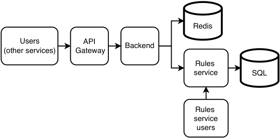
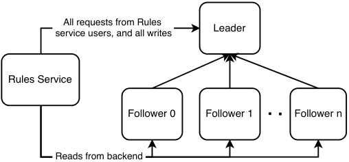
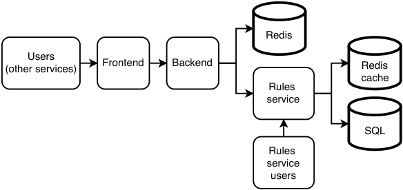
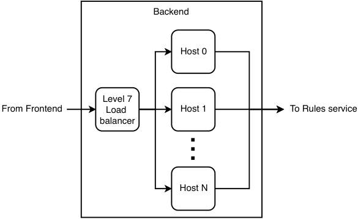
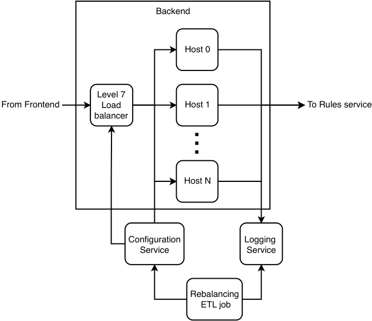
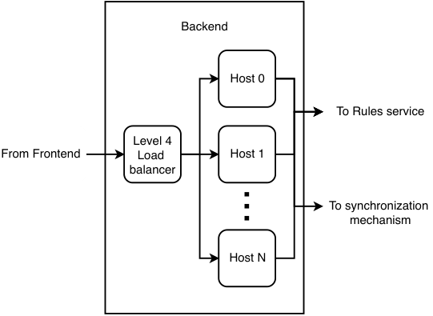
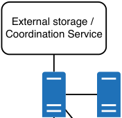
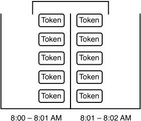
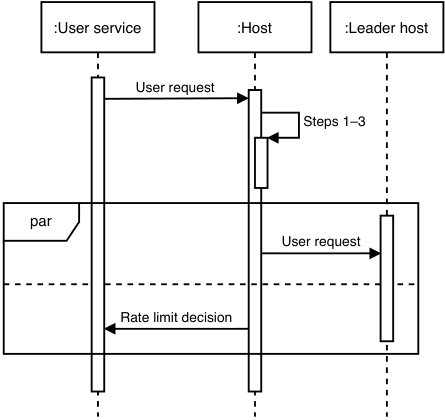

# _Design a rate-limiting service_

## _This chapter covers_

- Using rate limiting

- Discussing a rate-limiting service

- Understanding various rate-limiting algorithms

Rate limiting is a common service that we should almost always mention during a system design interview and is mentioned in most of the example questions in this book. This chapter aims to address situations where 1) the interviewer may ask for more details when we mention rate limiting during an interview, and 2) the question itself is to design a rate-limiting service.

_Rate limiting_ defines the rate at which consumers can make requests to API endpoints. Rate limiting prevents inadvertent or malicious overuse by clients, especially bots. In this chapter, we refer to such clients as “excessive clients”. Examples of inadvertent overuse include the following:

- Our client is another web service that experienced a (legitimate or malicious) traffic spike.

- The developers of that service decided to run a load test on their production environment.

Such inadvertent overuse causes a “noisy neighbor” problem, where a client utilizes too much resource on our service, so our other clients will experience higher latency or higher rate of failed requests.

Malicious attacks include the following. There are other bot attacks that rate limiting does not prevent(see https://www.cloudflare.com/learning/bots/what-is-bot-management/formoreinformation)-_Denial-of-service_ (DoS) or _distributed denial-of-service (DDoS) attacks_ —DoS floods a target with requests, so normal traffic cannot be processed. DoS uses a single machine, while DDoS is the use of multiple machines for the attack. This distinction is unimportant in this chapter, and we refer to them collectively as “DoS”.

- _Brute force attack_ —A brute force attack is repeated trial and error to find sensitive data, such as cracking passwords, encryption keys, API keys, and SSH login credentials.

- _Web scraping_ —Web scraping uses bots to make GET requests to many web pages of a web application to obtain a large amount of data. An example is scraping Amazon product pages for prices and product reviews.

Rate limiting can be implemented as a library or as a separate service called by a frontend, API gateway, or service mesh. In this question, we implement it as a service to gain the advantages of functional partitioning discussed in chapter 6. Figure 8.1 illustrates a rate limiter design that we will discuss in this chapter.

Figure 8.1    Initial high-level architecture of rate limiter. The frontend, backend, and Rules service also log to a shared logging service; this is not shown here. The Redis database is usually implemented as a shared Redis service, rather than our service provisioning its own Redis database. The Rules service users may make API requests to the Rules service via a browser app. We can store the rules in SQL.

## _8.1 Alternatives to a rate-limiting service and why they are infeasible_

Why don’t we scale out the service by monitoring the load and adding more hosts when needed, instead of doing rate limiting? We can design our service to be horizontally scalable, so it will be straightforward to add more hosts to serve the additional load. We can consider auto-scaling.

The process of adding new hosts when a traffic spike is detected may be too slow. Adding a new host involves steps that take time, like provisioning the host hardware,

## _8.4 Non-functional requirements_

Rate limiting is a basic functionality required by virtually any service. It must be scalable, have high performance, be as simple as possible, secure, and private. Rate limiting is not essential to a service’s availability, so we can trade off high availability and fault-tolerance. Accuracy and consistency are fairly important but not stringent.

### _8.4.1 Scalability_

Our service should be scalable to billions of daily requests that query whether a particular requestor should be rate limited. Requests to change rate limits will only be manually made by internal users in our organization, so we do not need to expose this capability to external users.

How much storage is required? Assume our service has one billion users, and we need to store up 100 requests per user at any moment. Only the user IDs and a queue of 100 timestamps per user need to be recorded; each is 64 bits. Our rate limiter is a shared service, so we will need to associate requests with the service that is being rate limited. A typical big organization has thousands of services. Let’s assume up to 100 of them need rate limiting.

We should ask whether our rate limiter actually needs to store data for one billion users. What is the retention period? A rate limiter usually should only need to store data for 10 seconds because it makes a rate limiting decision based on the user’s request rate for the last 10 seconds. Moreover, we can discuss with the interviewer whether there will be more than 1–10 million users within a 10-second window. Let’s make a conservative worst-case estimate of 10 million users. Our overall storage requirement is 100 * 64 * 101 * 10M = 808 GB. If we use Redis and assign a key to each user, a value’s size will be just 64 * 100 = 800 bytes. It may be impractical to delete data immediately after it is older than 10 seconds, so the actual amount of required storage depends on how fast our service can delete old data.

### _8.4.2 Performance_

When another service receives a request from its user (we refer to such requests as _user requests_ ), it makes a request to our rate limiting service (we refer to such requests as _rate limiter requests_ ) to determine if the user request should be rate-limited. The rate limiter request is blocking; the other service cannot respond to its user before the rate limiter request is completed. The rate limiter request’s response time adds to the user request’s response time. So, our service needs very low latency, perhaps a P99 of 100 ms. The decision to rate-limit or not rate-limit the user request must be quick. We don’t require low latency for viewing or analytics of logs.

### _8.4.3 Complexity_

Our service will be a shared service, used by many other services in our organization. Its design should be simple to minimize the risk of bugs and outages, aid troubleshooting, allow it to focus on its single functionality as a rate limiter, and minimize costs. Developers of other services should be able to integrate our rate limiting solution as simply and seamlessly as possible.

### _8.4.4 Security and privacy_

Chapter 2 discussed security and privacy expectations for external and internal services. Here, we can discuss some possible security and privacy risks. The security and privacy implementations of our user services may be inadequate to prevent external attackers from accessing our rate limiting service. Our (internal) user services may also attempt to attack our rate limiter, for example, by spoofing requests from another user service to rate limit it. Our user services may also violate privacy by requesting data about rate limiter requestors from other user services.

For these reasons, we will implement security and privacy in our rate limiter’s system design.

### _8.4.5 Availability and fault-tolerance_

We may not require high availability or fault-tolerance. If our service has less than three nines availability and is down for an average of a few minutes daily, user services can simply process all requests during that time and not impose rate limiting. Moreover, the cost increases with availability. Providing 99.9% availability is fairly cheap, while 99.99999% may be prohibitively expensive.

As discussed later in this chapter, we can design our service to use a simple highly available cache to cache the IP addresses of excessive clients. If the rate-limiting service identified excessive clients just prior to the outage, this cache can continue to serve rate-limiter requests during the outage, so these excessive clients will continue to be rate limited. It is statistically unlikely that an excessive client will occur during the few minutes the rate limiting service has an outage. If it does occur, we can use other techniques such as firewalls to prevent a service outage, at the cost of a negative user experience during these few minutes.

### _8.4.6 Accuracy_

To prevent poor user experience, we should not erroneously identify excessive clients and rate limit them. In case of doubt, we should not rate limit the user. The rate limit value itself does not need to be precise. For example, if the limit is 10 requests in 10 seconds, it is acceptable to occasionally rate limit a user at 8 or 12 requests in 10 seconds. If we have an SLA that requires us to provide a minimum request rate, we can set a higher rate limit (e.g., 12+ requests in 10 seconds).

### _8.4.7 Consistency_

The previous discussion on accuracy leads us to the related discussion on consistency. We do not need strong consistency for any of our use cases. When a user service updates a rate limit, this new rate limit need not immediately apply to new requests; a few seconds of inconsistency may be acceptable. Eventual consistency is also acceptable for viewing logged events such as which users were rate-limited or performing analytics on these logs. Eventual rather than strong consistency will allow a simpler and cheaper design.

## _8.5 Discuss user stories and required service components_

A rate-limiter request contains a required user ID and a user service ID. Since rate limiting is independent on each user service, the ID format can be specific to each user service. The ID format for a user service is defined and maintained by the user service, not by our rate-limiting service. We can use the user service ID to distinguish possible identical user IDs from different user services. Because each user service has a different rate limit, our rate limiter also uses the user service ID to determine the rate limit value to apply.

Our rate limiter will need to store this (user ID, service ID) data for 60 seconds, since it must use this data to compute the user’s request rate to determine if it is higher than the rate limit. To minimize the latency of retrieving any user’s request rate or any service’s rate limit, these data must be stored (or cached) on in-memory storage. Because consistency and latency are not required for logs, we can store logs on an eventually consistent storage like HDFS, which has replication to avoid data loss from possible host failures.

Last, user services can make infrequent requests to our rate-limiting service to create and update rate limits for their endpoints. This request can consist of a user service ID, endpoint ID, and the desired rate limit (e.g., a maximum of 10 requests in 10 seconds). Putting these requirements together, we need the following:

- A database with fast reads and writes for counts. The schema will be simple; it is unlikely to be much more complex than (user ID, service ID). We can use an in-memory database like Redis.

- A service where rules can be defined and retrieved, which we call the Rules service.

- A service that makes requests to the Rules service and the Redis database, which we can call the Backend service.

The two services are separate because requests to the Rules service for adding or modifying rules should not interfere with requests to the rate limiter that determine if a request should be rate limited.

## _8.6 High-level architecture_

Figure 8.2 (repeated from figure 8.1) illustrates our high-level architecture considering these requirements and stories. When a client makes a request to our rate-limiting service, this request initially goes through the frontend or service mesh. If the frontend’s security mechanisms allow the request, the request goes to the backend, where the following steps occur:

- 1 Get the service’s rate limit from the Rules service. This can be cached for lower latency and lower request volume to the Rules service.

- 2 Determine the service’s current request rate, including this request.

- 3 Return a response that indicates if the request should be rate-limited.

Steps 1 and 2 can be done in parallel to reduce overall latency by forking a thread for each step or using threads from a common thread pool.

The frontend and Redis (distributed cache) services in our high-level architecture in figure 8.2 are for horizontal scalability. This is the distributed cache approach discussed in section 3.5.3.

Figure 8.2    Initial high-level architecture of rate limiter. The frontend, backend, and Rules service also log to a shared logging service; this is not shown here. The Redis database is usually implemented as a shared Redis service, rather than our service provisioning its own Redis database. The Rules service users may make API requests to the Rules service via a browser app.

We may notice in figure 8.2 that our Rules service has users from two different services (Backend and Rules service users) with very different request volumes, one of which (Rules service users) does all the writes.

Referring back to the leader-follower replication concepts in sections 3.3.2 and 3.3.3, and illustrated in figure 8.3, the Rules service users can make all their SQL queries, both reads and writes to the leader node. The backend should make its SQL queries, which are only read/SELECT queries, to the follower nodes. This way, the Rules service users have high consistency and experience high performance.

Figure 8.3    The leader host should process all requests from Rules service users, and all write operations. Reads from the backend can be distributed across the follower hosts.

Referring to figure 8.4, as we do not expect rules to change often, we can add a Redis cache to the Rules service to improve its read performance even further. Figure 8.4 displays cache-aside caching, but we can also use other caching strategies from section 3.8. Our Backend service can also cache rules in Redis. As discussed earlier in section 8.4.5, we can also cache the IDs of excessive users. As soon as a user exceeds its rate limit, we can cache its ID along with an expiry time where a user should no longer be rate-limited. Then our backend need not query the Rules service to deny a user’s request.

If we are using AWS (Amazon Web Services), we can consider DynamoDB instead of Redis and SQL. DynamoDB can handle millions of requests per second (https:// aws.amazon.com/dynamodb/), and it can be either eventually consistent or strongly consistent (https://docs.aws.amazon.com/whitepapers/latest/comparing-dynamodb-and-hbase-for-nosql/consistency-model.html),butusingitsubjectsus to vendor lock-in.

Figure 8.4    Rate limiter with Redis cache on the Rules service. Frequent requests from the backend can be served from this cache instead of the SQL database.

The backend has all our non-functional requirements. It is scalable, has high performance, is not complex, is secure and private, and is eventually consistent. The SQL database with its leader-leader replication is highly available and fault-tolerant, which goes beyond our requirements. We will discuss accuracy in a later section. This design is not scalable for the Rules service users, which is acceptable as discussed in section 8.4.1.

Considering our requirements, our initial architecture may be overengineered, overly complex, and costly. This design is highly accurate and strongly consistent, both of which are not part of our non-functional requirements. Can we trade off some accuracy and consistency for lower cost? Let’s first discuss two possible approaches to scaling up our rate limiter:

- 1 A host can serve any user, by not keeping any state and fetching data from a shared database. This is the stateless approach we have followed for most questions in this book.

- 2 A host serves a fixed set of users and stores its user’s data. This is a stateful approach that we discuss in the next section.

## _8.7 Stateful approach/sharding_

Figure 8.5 illustrates the backend of a stateful solution that is closer to our non-functional requirements. When a request arrives, our load balancer routes it to its host. Each host stores the counts of its clients in its memory. The host determines if the user has exceeded their rate limit and returns true or false. If a user makes a request and its host is down, our service will return a 500 error, and the request will not be rate limited.

Figure 8.5    Backend architecture of rate limiter that employs a stateful sharded approach. The counts are stored in the hosts’ memory, rather than in a distributed cache like Redis.

A stateful approach requires a level 7 load balancer. This may seem to contradict what we discussed in section 8.1 about using a level 7 load balancer, but note that we are now discussing using it in a distributed rate-limiting solution, not just for sticky sessions to allow each host to reject expensive requests and perform its own rate limiting.

A question that immediately arises in such an approach is fault-tolerance, whether we need to safeguard against data loss when a host goes down. If so, this leads to discussions on topics like replication, failover, hot shards, and rebalancing. As briefly discussed in section 3.1, we can use sticky sessions in replication. But in our requirements discussion earlier in the chapter, we discussed that we don’t need consistency, high availability, or fault-tolerance. If a host that contains certain users’ data goes down, we can simply assign another host to those users and restart the affected users’ request rate counts from 0. Instead, the relevant discussion will be on detecting host outages, assigning and provisioning replacement hosts, and rebalancing traffic.

The 500 error should trigger an automated response to provision a new host. Our new host should fetch its list of addresses from the configuration service, which can be a simple manually updated file stored on a distributed object storage solution like AWS S3 (for high availability, this file must be stored on a distributed storage solution and not on a single host), or a complex solution like ZooKeeper. When we develop our rate-limiting service, we should ensure that the host setup process does not exceed a few minutes. We should also have monitoring on the host setup duration and trigger a low-urgency alert if the setup duration exceeds a few minutes.

We should monitor for hot shards and periodically rebalance traffic across our hosts. We can periodically run a batch ETL job that reads the request logs, identifies hosts that receive large numbers of requests, determines an appropriate load balancing configuration, and then writes this configuration to a configuration service. The ETL job can also push the new configuration to the load-balancer service. We write to a configuration service in case any load balancer host goes down. When the host recovers or a new load balancer host is provisioned, it can read the configuration from the configuration service.

Figure 8.6 illustrates our backend architecture with the rebalancing job. This rebalancing prevents a large number of heavy users from being assigned to a particular host, causing it to go down. Since our solution does not have failover mechanisms that distribute the users of a failed host over other hosts, we do not have the risk of a death spiral, where a host fails because of excessive traffic, then its traffic is redistributed over the remaining hosts and increases their traffic, which in turn causes them to fail.

Figure 8.6    Backend architecture with a rebalancing ETL job

A tradeoff of this approach is that it is less resilient to DoS/DDoS attacks. If a user has a very high request rate, such as hundreds of requests per second, its assigned host cannot handle this, and all users assigned to this host cannot be rate limited. We may choose to have an alert for such cases, and we should block requests from this user across all services. Load balancers should drop requests from this IP address—that is, do not send the requests to any backend host, and do not return any response, but do log the request.

Compared to the stateless approach, the stateful approach is more complex and has higher consistency and accuracy, but has lower:

- Cost

- Availability

- Fault-tolerance

Overall, this approach is a poor cousin of a distributed database. We attempted to design our own distributed storage solution, and it will not be as sophisticated or mature as widely used distributed databases. It is optimized for simplicity and low cost and has neither strong consistency nor high availability.

## _8.8 Storing all counts in every host_

The stateless backend design discussed in section 8.6 used Redis to store request timestamps. Redis is distributed, and it is scalable and highly available. It also has low latency and will be an accurate solution. However, this design requires us to use a Redis database, which is usually implemented as a shared service. Can we avoid our dependency on an external Redis service, which will expose our rate limiter to possible degradation on that service?

The stateful backend design discussed in section 8.7 avoids this lookup by storing state in the backend, but it requires the load balancer to process every request to determine which host to send it to, and it also requires reshuffling to prevent hot shards. What if we can reduce the storage requirement such that all user request timestamps can fit in memory on a single host?

## _8.8.1 High-level architecture_

How can we reduce the storage requirement? We can reduce our 808 GB storage requirement to 8.08 GB ≈ 8 GB by creating a new instance of our rate-limiting service for each of the ~100 services that uses it and use the frontend to route requests by service to the appropriate service. 8 GB can fit into a host’s memory. Due to our high request rate, we cannot use a single host for rate limiting. If we use 128 hosts, each host will store only 64 MB. The final number we decide upon will likely be between 1 and 128.

Figure 8.7 is the backend architecture of this approach. When a host receives a request, it does the following in parallel:

- Makes a rate-limiting decision and returns it.

- Asynchronously synchronizes its timestamps with other hosts.

Figure 8.7    High-level architecture of a rate-limiting service where all user request timestamps can fit into a single backend host, requests are randomly load balanced across hosts, and each host can respond to a user request with a rate limiting decision without first making requests to other services or hosts. Hosts synchronize their timestamps with each other in a separate process.

Our level 4 load balancer randomly balances requests across hosts, so a user may be directed to different hosts in each rate limiting request. For rate limits to be accurately computed, the rate limits on our hosts need to be kept synchronized. There are multiple possible ways to synchronize the hosts. We discuss them in detail in the next section. Here we’ll just say that we will use streaming instead of batch updates because batch updates are too infrequent and cause users to be rate-limited at a much higher request rate than the set request rate.

Compared to the other two designs discussed earlier (the stateless backend design and stateful backend design), this design trades off consistency and accuracy for lower latency and higher performance (it can process a higher request rate). Because a host may not have all the timestamps in memory before making a rate-limiting decision, it may compute a lower request rate than the actual value. It also has these characteristics:

- Use a level 4 load balancer to direct requests to any host like a stateless service (though the frontend).

- A host can make rate limiting decisions with its data in memory.

- Data synchronization can be done in an independent process.

What if a host goes down and its data is lost? Certain users who will be rate limited will be permitted to make more requests before they are rate limited. As discussed earlier, this is acceptable. Refer to pp. 157–158 of Martin Kleppmann’s book _Designing Data-Intensive Systems_ for a brief discussion on leader failover and possible problems. Table 8.2 summarizes our comparison between the three approaches that we have discussed.

Table 8.2    Comparison of our stateless backend design, stateful backend design, and design that stores counts in every host

|Stateless backend design|Stateful backend design|Storing counts in every host|
|---|---|---|
||||
|Stores counts in a distributed database. Stateless, so a user can be routed to any host. Scalable. We rely on the distrib- uted database to serve both high read and high write traffc. Effcient storage consumption. We can confgure our desired replication factor in our distrib- uted database. Eventually consistent. A host making a rate limiting decision may do so before synchroniza- tion is complete, so this decision may be slightly inaccurate. Backend is stateless, so we use the highly available and fault-tol- erant properties of the distrib- uted database. Dependent on external database service. Outages of such ser- vices may affect our service, and remediating such outages may be outside our control.|Stores each user’s count in a backend host. Requires a level 7 load balancer to route each user to its assigned host. Scalable. A load balancer is an expensive and vertically scalable component that can handle a high request rate. Lowest storage consumption because there is no backup by default. We can design a stor- age service with an in-cluster or out-cluster approach, as discussed in section 13.5. With- out backup, it is the cheapest approach. Most accurate and consistent since a user always makes requests to the same hosts. Without backup, any host fail- ure will result in data loss of all the user counts it contains. This is the lowest availability and fault-tolerant of the three designs. However, these factors may be inconsequential because they are not non-functional requirements. If the rate limiter cannot obtain an accurate count, it can simply let the request through. Not dependent on external data- base services. Load balancer needs to process every request to determine which host to send it to. This also requires reshuf- fing to prevent hot shards.|Store every user’s counts in every host. Every host has every user’s counts, so a user can be routed to any host. Not scalable because each host needs to store the counts of every user. Need to divide users into separate instances of this service and require another component (such as a frontend) to route users to their assigned instances. Most expensive approach. High storage consumption. Also, high network traffc from n–n com- munication between hosts to synchronize counts. Least accurate and consistent approach because it takes time to synchronize counts between all hosts. Hosts are interchangeable, so this is the most highly available and fault-tolerant of the three designs. Not dependent on external database services like Redis. Avoids risk of service outage from outages of such down- stream services. Also, it’s easier to implement, particularly in big organizations where provisioning or modifying database services may involve considerable bureaucracy.|

### _8.8.2 Synchronizing counts_

How can the hosts synchronize their user request counts? In this section, we discuss a few possible algorithms. All the algorithms except all-to-all are feasible for our rate limiter.

Should the synchronization mechanism be pull or push? We can choose push to trade off consistency and accuracy for higher performance, lower resource consumption, and lower complexity. If a host goes down, we can simply disregard its counts and allow users to make more requests before they are rate-limited. With these considerations, we can decide that hosts should asynchronously share their timestamps using UDP instead of TCP.

We should consider that hosts must be able to handle their traffic from these two main kinds of requests:

- 1 Request to make a rate limiting decision. Such requests are limited by the load balancer and by provisioning a larger cluster of hosts as necessary.

- 2 Request to update the host’s timestamps in memory. Our synchronization mechanism must ensure that a host does not receive a high rate of requests, especially as we increase the number of hosts in our cluster.

#### all-to-all

_All-to-all_ means every node transmits messages to every other node in a group. It is more general than _broadcasting_ , which refers to simultaneous transfer of the message to recipients. Referring to figure 3.3 (repeated in figure 8.8), all-to-all requires a _full mesh_ topology, where every node in a network is connected to every other node. All-to-all scales quadratically with the number of nodes, so it is not scalable. If we use all-to-all communication with 128 hosts, each all-to-call communication will require 128 * 128 * 64 MB, which is > 1 TB, which is infeasible.

Figure 8.8    A full mesh topology. Every node in a network is connected to every other node. In our rate limiter, every node receives user requests, computes request rate, and approves or denies the request. gossip protocol

In _gossip protocol_ , referring to figure 3.6 (repeated in figure 8.9), nodes periodically randomly pick other nodes and send them messages. Yahoo’s distributed rate limiter uses gossip protocol to synchronize its hosts (https://yahooeng.tumblr.com/post/111288877956/cloud-bouncer-distributed-rate-limiting-at-yahoo).Thisapproachtradesoffconsistencyand accuracy for higher performance and lower resource consumption. It is also more complex.

Figure 8.9    Gossip protocol. Each node periodically randomly picks other nodes and sends them messages.

In this section, all-to-all and gossip protocol are the synchronization mechanisms that require all nodes to send messages directly to each other. This means that all nodes must know the IP addresses of the other nodes. Since nodes are continuously added and removed from the cluster, each node will make requests to the configuration service (such as ZooKeeper) to find the other nodes’ IP addresses.

In the other synchronization mechanisms, hosts make requests to each other via a particular host or service.

#### external storage or coordination service

Referring to figure 8.10 (almost identical to figure 3.4), these two approaches use external components for hosts to communicate with each other.

Hosts can communicate with each other via a leader host. This host is selected by the cluster’s configuration service (such as ZooKeeper). Each host only needs to know the IP address of the leader host, while the leader host needs to periodically update its list of hosts.

Figure 8.10    Hosts can communicate through an external component, such as an external storage service or coordination service.

#### random leader selection

We can trade off higher resource consumption for lower complexity by using a simple algorithm to elect a leader. Referring to figure 3.7 (repeated in figure 8.11), this may cause multiple leaders to be elected. As long as each leader communicates with all keys, but there may be a limit on the number of keys that can be updated in a single MSET operation (https://stackoverflow.com/questions/49361876/mset-over-400-000-map-entries-in-redis). (Stack Overflow is not an academically credible source, and the official Redis documentation on MSET does not state an upper limit on the number of keys in a request. However, when designing a system, we must always ask reasonable questions and should not completely trust even official documentation.) Moreover, if each key is 64 bits, a request to update 10 million keys will be 8.08 GB in size, which is much too big.

If we need to divide the update command into multiple requests, each request incurs resource overhead and network latency.

Moreover, there is no mechanism to delete keys (i.e., removing users who have not made recent requests), so the system doesn’t know when to remove users to reduce the token refill request rate or to make room in the Redis database for other users who made recent requests. Our system will need a separate storage mechanism to record the last timestamp of a user’s request, and a process to delete old keys.

In a distributed implementation like in section 8.8, every host may contain its own token bucket and use this bucket to make rate limiting decisions. Hosts may synchronize their buckets using techniques discussed in section 8.8.2. If a host makes a rate-limiting decision using its bucket before synchronizing this bucket with other hosts, a user may be able to make requests at a higher rate than the set rate limit. For example, if two hosts each receive requests close in time, each one will subtract a token and have nine tokens left, then synchronize with other hosts. Even though there were two requests, all hosts will synchronize to nine tokens.

#### Cloud Bouncer

Cloud Bouncer, (https://yahooeng.tumblr.com/post/111288877956/cloud-bouncer-distributed-rate-limiting-at-yahoo),whichwasdevelopedat Yahoo in 2014, is an example of a distributed rate-limiting library that is based on a token bucket.

### _8.9.2 Leaky bucket_

A leaky bucket has a maximum number of tokens, leaks at a fixed rate, and stops leaking when empty. Each time a request arrives, we add a token to the bucket. If the bucket is full, the request is rejected, or rate limited.

Referring to figure 8.13, a common implementation of a leaky bucket is to use a FIFO queue with a fixed size. The queue is dequeued periodically. When a request arrives, a token is enqueued if the queue has spare capacity. Due to the fixed queue size, this implementation is less memory-efficient than a token bucket.

Token ~~A request enqueues a token.~~

Each second, dequeue a token.

Leaky bucket. FIFO quele of fixed size.

Figure 8.13    A leaky bucket that dequeues once per second

This algorithm has some of the same problems as a token bucket:

- Every second, a host needs to dequeue every queue in every key.

- We need a separate mechanism to delete old keys.

- A queue cannot exceed its capacity, so in a distributed implementation, there may be multiple hosts that simultaneously fill their buckets/queues fully before they synchronize. This means that the user exceeded its rate limit.

Another possible design is to enqueue timestamps instead of tokens. When a request arrives, we first dequeue timestamps until the remaining timestamps in the queue are older than our retention period, then enqueue the request’s timestamp if the queue has space. It returns false if the enqueue was successful and true otherwise. This approach avoids the requirement to dequeue from every single queue every second.

QUESTION Do you notice any possible consistency problems?

An alert reader will immediately notice two possible consistency problems that will introduce inaccuracy into a rate limiting decision:

- 1 A race condition can occur where a host writes a key-value pair to the leader host, and it is immediately overwritten by another host.

- 2 Hosts’ clocks are not synchronized, and a host may make a rate limiting decision using timestamps written by other hosts with slightly different clocks.

This slight inaccuracy is acceptable. These two problems also apply to all the distributed rate-limiting algorithms discussed in this section that use timestamps, namely fixed window counter and sliding window log, but we will not mention them again.

### _8.9.3 Fixed window counter_

Fixed window counters are implemented as key-value pairs. A key can be a combination of a client ID and a timestamp (e.g., user0_1628825241), while the value is the request count. When a client makes a request, its key is incremented if it exists or created if it does not exist. The request is accepted if the count is within the set rate limit and rejected if the count exceeds the set rate limit.

The window intervals are fixed. For example, a window can be between the [0, 60) seconds of each minute. After a window has passed, all keys expire. For example, the key “user0_1628825241” is valid from 3:27:00 AM GMT to 3:27:59 AM GMT because 1628825241 is 3:27:21 AM GMT, which is within the minute of 3:27 AM GMT.

QUESTION    How much can the request rate exceed the set rate limit?

A disadvantage of fixed window counter is that it may allow a request rate of up to twice the set rate limit. For example, referring to figure 8.13, if the rate limit is five requests in one minute, a client can make up to five requests in [8:00:00 AM, 8:01:00 AM) and up to another five requests in [8:01:00 AM, 8:01:30 AM). The client has actually made 10 requests in a one-minute interval, twice the set rate limit of five requests per minute (figure 8.14).

Figure 8.14     The user made five requests in [8:00:30 AM, 8:01:30 AM) and another five in [8:01:00 AM, 8:01:30 AM). Even though it was within the limit of five requests per fixed window, it actually made 10 requests in one minute.

Adapting this approach for our rate limiter, each time a host receives a user request, it takes these steps with its hash map. Refer to figure 8.15 for a sequence diagram of these steps:

- 1 Determine the appropriate keys to query. For example, if our rate limit had a 10-second expiry, the corresponding keys for user0 at 1628825250 will be [“user0_1628825241”, “user0_1628825242”, …, “user0_1628825250”].

- 2 Make requests for these keys. If we are storing key-value pairs in Redis instead of the host’s memory, we can use the MGET (https://redis.io/commands/mget/)commandtoreturnthevalue of all specified keys. Although the MGET command is O(N) where N is the number of keys to retrieve, making a single request instead of multiple requests has lower network latency and resource overhead.

- 3 If no keys are found, create a new key-value pair, such as, for example, (user0_1628825250, 1). If one key is found, increment its value. If more than one key is found (due to race conditions), sum the values of all the returned keys and increment this sum by one. This is the number of requests in the last 10 seconds.

- 4 In parallel:

   - a Write the new or updated key-value pair to the leader host (or Redis database). If there were multiple keys, delete all keys except the oldest one.

   - b Return true if the count is more than 10 and false otherwise.

Figure 8.15     Sequence diagram of our fixed window counter approach. This diagram illustrates the approach of using the host’s memory to store the request timestamps, instead of Redis. The rate-limiting decision is made immediately on the host, using only data stored in the host’s memory. The subsequent steps on the leader host for synchronization are not illustrated.

QUESTION    How may race conditions cause multiple keys to be found in step 5?

Redis keys can be set to expire (https://redis.io/commands/expire/),soweshouldsetthe keys to expire after 10 seconds. Otherwise, we will need to implement a separate process to continuously find and delete expired keys. If this process is needed, it is an advantage of the fixed window counter that the key deletion process is independent of the hosts. This independent deletion process can be scaled separately from the host, and it can be developed independently, making it easier to test and debug.

### _8.9.4 Sliding window log_

A sliding window log is implemented as a key-value pair for each client. The key is the client ID, and the value is a sorted list of timestamps. A sliding window log stores a timestamp for each request.

Figure 8.16 is a simple illustration of sliding window log. When a new request comes in, we append its timestamp and check if the first timestamp is expired. If so, perform a binary search to find the last expired timestamp, then remove all timestamps before that. Use a list instead of a queue because a queue does not support binary search. Return true if the list has more than 10 timestamps, and false otherwise.

#### When 62 is appended, do a binary search for 62 – 60 = 2.

Figure 8.16     Simple sliding window log illustration. A timestamp is appended when a new request is made. Next, the last expired timestamp is found using binary search, and then all expired timestamps are removed. The request is allowed if the size of the list does not exceed the limit.

Sliding window log is accurate (except in a distributed implementation, due to the factors discussed in the last paragraph of section 8.9.2) but storing a timestamp value for every request consumes more memory than a token bucket.

The sliding window log algorithm counts requests even after the rate limit is exceeded, so it also allows us to measure the user’s request rate.

### _8.9.5 Sliding window counter_

Sliding window counter is a further development of fixed window counter and sliding window log. It uses multiple fixed window intervals, and each interval is 1/60[th] the length of the rate limit’s time window.

For example, if the rate limit interval is one hour, we use 60 one-minute windows instead of one one-hour window. The current rate is determined by summing the last 60 windows. It may slightly undercount requests. For example, counting requests at 11:00:35 will sum the 60 one-minute windows from the [10:01:00, 10:01:59] window to the [11:00:00, 11:00:59] window, and ignore the [10:00:00, 10:00:59] window. This approach is still more accurate than a fixed window counter.

## _8.10 Employing a sidecar pattern_

This brings us to the discussion of applying sidecar pattern to rate limiting policies. Figure 1.8 illustrates our rate limiting service architecture using a sidecar pattern. Like what was discussed in section 1.4.6, an administrator can configure a user service’s rate limiting policies in the control plane, which distributes them to the sidecar hosts. With this design where user services contain their rate limiting policies in their sidecar hosts, user service hosts do not need to make requests to our rate-limiting service to look up their rate-limiting policies, saving the network overhead of these requests.

## _8.11 Logging, monitoring, and alerting_

Besides the logging, monitoring, and alerting practices discussed in section 2.5, we should configure monitoring and alerting for the following. We can configure monitoring tasks in our shared monitoring service on the logs in our shared logging service, and these tasks should trigger alerts to our shared alerting service to alert developers about these problems:

- Signs of possible malicious activity, such as users, which continue to make requests at a high rate despite being shadow-banned.

- Signs of possible DDoS attempts, such as an unusually high number of users being rate limited in a short interval.

## _8.12 Providing functionality in a client library_

Does a user service need to query the rate limiter service for every request? An alternative approach is for the user service to aggregate user requests and then query the rate limiter service in certain circumstances such as when it

- Accumulates a batch of user requests

- Notices a sudden increase in request rate

Generalizing this approach, can rate limiting be implemented as a library instead of a service? Section 6.7 is a general discussion of a library vs. service. If we implement it entirely as a library, we will need to use the approach in section 8.7, where a host can contain all user requests in memory and synchronize the user requests with each other. Hosts must be able to communicate with each other to synchronize their user request timestamps, so the developers of the service using our library must configure a configuration service like ZooKeeper. This may be overly complex and error-prone for most developers, so as an alternative, we can offer a library with features to improve the performance of the rate limiting service, by doing some processing on the client, thereby allowing a lower rate of requests to the service.

This pattern of splitting processing between client and server can generalize to any system, but it may cause tight coupling between the client and server, which is, in general, an antipattern. The development of the server application must continue to support old client versions for a long time. For this reason, a client SDK (software development kit) is usually just a layer on a set of REST or RPC endpoints and does not do any data processing. If we wish to do any data processing in the client, at least one of the following conditions should be true:

- The processing should be simple, so it is easy to continue to support this client library in future versions of the server application.

- The processing is resource-intensive, so the maintenance overhead of doing such processing on the client is a worthy tradeoff for the significant reduction in the monetary cost of running the service.

- There should be a stated support lifecycle that clearly informs users when the client will no longer be supported.

Regarding batching of requests to the rate limiter, we can experiment with batch size to determine the best balance between accuracy and network traffic.

What if the client also measures the request rate and only uses the rate limiting service if the request rate exceeds a set threshold? A problem with this is that since clients do not communicate with each other, a client can only measure the request rate on the

_**Summary**_ specific host it’s installed on and cannot measure the request rate of specific users. This means that rate limiting is activated based on the request rate across all users, not on specific users. Users may be accustomed to a particular rate limit and may complain if they are suddenly rate limited at a particular request rate where they were not rate limited before.

An alternative approach is for the client to use anomaly detection to notice a sudden increase in the request rate, then start sending rate-limiting requests to the server.

## _8.13 Further reading_

- Smarshchok, Mikhail, 2019. System Design Interview YouTube channel, https:// youtu.be/FU4WlwfS3G0.

- The discussions of fixed window counter, sliding window log, and sliding window counter were adapted from https://www.figma.com/blog/an-alternative-approach-to-rate-limiting/.-Madden, Neil, 2020. _API Security in Action._ Manning Publications.

- Posta, Christian E. and Maloku, Rinor, 2022. _Istio in Action_ . Manning Publications.

- Bruce, Morgan and Pereira, Paulo A., 2018. _Microservices in Action_ , chapter 3.5. Manning Publications.

## _Summary_

- Rate limiting prevents service outages and unnecessary costs.

- Alternatives such as adding more hosts or using the load balancer for rate limiting are infeasible. Adding more hosts to handle traffic spikes may be too slow, while using a level 7 load balancer just for rate limiting may add too much cost and complexity.

- Do not use rate limiting if it results in poor user experience or for complex use cases such as subscriptions.

- The non-functional requirements of a rate limiter are scalability, performance, and lower complexity. To optimize for these requirements, we can trade off availability, fault-tolerance, accuracy, and consistency.

- The main input to our rate-limiter service is user ID and service ID, which will be processed according to rules defined by our admin users to return a “yes” or “no” response on rate limiting.

- There are various rate limiting algorithms, each with its own tradeoffs. Token bucket is easy to understand and implement and is memory-efficient, but synchronization and cleanup are tricky. Leaky bucket is easy to understand and implement but is slightly inaccurate. A fixed window log is easy to test and debug, but it is inaccurate and more complicated to implement. A sliding window log is accurate, but it requires more memory. A sliding window counter uses less memory than sliding window log, but it is less accurate than sliding window log.

- We can consider a sidecar pattern for our rate-limiting service.

