# _Design a notification/alerting service_

## _This chapter covers_

- Limiting the feature scope and discussion of a service

- Designing a service that delegates to platform-specific channels

- Designing a system for flexible configurations and templates

- Handling other typical concerns of a service

We create functions and classes in our source code to avoid duplication of coding, debugging, and testing, to improve maintainability, and to allow reuse. Likewise, we generalize common functionalities used by multiple services (i.e. centralization of cross-cutting concerns).

Sending user notifications is a common system requirement. In any system design discussion, whenever we discuss sending notifications, we should suggest a common notification service for the organization.

## _9.1 Functional requirements_

Our notification service should be as simple as possible for a wide range of users, which causes considerable complexity in the functional requirements. There are many possible features that a notification service can provide. Given our limited time, we should clearly define some use cases and features for our notification customer just after they submit an order. The message may have parameters for the customer’s name, order confirmation code, list of items (an item can have many parameters), and prices. There may be many parameters in a message.

Our notification service may provide an API to CRUD templates. Each time a user wishes to send a notification, it can either create the entire message itself or select a particular template and fill in the values of that template.

A template feature also reduces traffic to our notification service. This is discussed later in this chapter.

We can provide many features to create and manage templates, and this can be a service in itself (a template service). We will limit our initial discussion to CRUD templates.

### _9.1.5 Trigger conditions_

Notifications can be triggered manually or programmatically. We may provide a browser app for users to create a notification, add recipients, and then send it out immediately. Notifications may also be sent out programmatically, and this can be configured either on the browser app or via an API. Programmatic notifications are configured to be triggered on a schedule or by API requests.

### _9.1.6 Manage subscribers, sender groups, and recipient groups_

If a user wishes to send a notification to more than one recipient, we may need to provide features to manage recipient groups. A user may address a notification using a recipient group, instead of having to provide a list of recipients every time the former needs to send a notification.

WARNING    Recipient groups contain PII (Personally-Identifiable Information), so they are subject to privacy laws such as GDPR and CCPA.

Users should be able to CRUD recipient groups. We may also consider role-based access control (RBAC). For example, a group may have read and write roles. A user requires the group’s read role to view its members and other details and then the write role to add or remove members. RBAC for groups is outside the scope of our discussion.

A recipient should be able to opt into notifications and opt out of unwanted notifications; otherwise, they are just spam. We will skip this discussion in this chapter. It may be discussed as a follow-up topic.

### _9.1.7 User features_

Here are other features we can provide:

- The service should identify duplicate notification requests from senders and not send duplicate notifications to recipients.

- We should allow a user to view their past notification requests. An important use case is for a user to check if they have already made a particular notification request, so they will not make duplicate notification requests. Although the notification service can also automatically identify and duplicate notification requests, we will not completely trust this implementation, since a user may define a duplicate request differently from the notification service.

- A user will store many notification configurations and templates. It should be able to find configurations or templates by various fields, like names or descriptions. A user may also be able to save favorite notifications.

- A user should be able to look up the status of notifications. A notification may be scheduled, in progress (similar to emails in an outbox), or failed. If a notification’s delivery is failed, a user should be able to see if a retry is scheduled and the number of times delivery has been retried.

- (Optional) A priority level set by the user. We may process higher-priority notifications before lower-priority ones or use a weighted approach to prevent starvation.

### _9.1.8 Analytics_

We can assume analytics is outside the scope of this question, though we can discuss it as we design our notification service.

## _9.2 Non-functional requirements_

We can discuss the following non-functional requirements:

- Scale: Our notification service should be able to send billions of notifications daily. At 1 MB/notification, our notification service will process and send petabytes of data daily. There may be thousands of senders and one billion recipients.

- Performance: A notification should be delivered within seconds. To improve the speed of delivering critical notifications, we may consider allowing users to prioritize certain notifications over others.

- High availability: Five 9s uptime.

- Fault-tolerant: If a recipient is unavailable to receive a notification, it should receive the notification at the next opportunity.

- Security: Only authorized users should be allowed to send notifications.

- Privacy: Recipients should be able to opt out of notifications.

## _9.3 Initial high-level architecture_

We can design our system with the following considerations:

- Users who request creation of notifications do so through a single service with a single interface. Users specify the desired channel(s) and other parameters through this single service/interface.

- However, each channel can be handled by a separate service. Each channel service provides logic specific to its channel. For example, a browser notification channel service can create browser notifications using the web notification API. Refer to documentation like “Using the Notifications API” (https://developer.mozilla.org/en-US/docs/Web/API/Notifications_API/Using_the_Notifications_API)and “Notification” (https://developer.mozilla.org/en-US/docs/Web/API/notification).Certainbrowserslike Chrome also provide their own notifications API. Refer to “chrome.notifications” (https://developer.chrome.com/docs/extensions/reference/notifications/)and “Rich Notifications API” (https://developer.chrome.com/docs/extensions/mv3/richNotifications/)forrichnotificationswithrich elements like images and progress bars.

- We can centralize common channel service logic in another service, which we can call the “job constructor.”

- Notifications via various channels may be handled by external third-party services, illustrated in figure 9.1. Android push notifications are made via Firebase Cloud Messaging (FCM). iOS push notifications are made via Apple Push notification service. We may also employ third-party services for email, SMS/texting, and phone calls. Making requests to third-party services means that we must limit the request rate and handle failed requests.

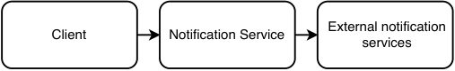

Figure 9.1    Our Notification Service may make requests to external notification services, so the former must limit the request rate and handle failed requests.

- Sending notifications entirely via synchronous mechanisms is not scalable because the process consumes a thread while it waits for the request and response to be sent over the network. To support thousands of senders and billions of recipients, we should use asynchronous techniques like event streaming.

Based on these considerations, figures 9.2 and 9.3 show our initial high-level architecture. To send a notification, a client makes a request to our notification service. The request is first processed by the frontend service or API gateway and then sent to the backend service. The backend service has a producer cluster, a notification Kafka topic, and a consumer cluster. A producer host simply produces a message on to the notification Kafka topic and returns 200 success. The consumer cluster consumes the messages, generates notification events, and produces them to the relevant channel queues. Each notification event is for a single recipient/destination. This asynchronous event driven approach allows the notification service to handle unpredictable traffic spikes.

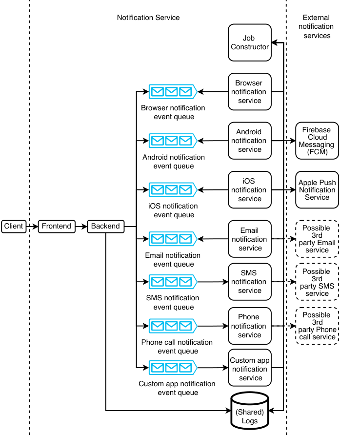

Figure 9.2    High-level architecture of our notification service, illustrating all the possible requests when a client/user sends a notification. We collectively refer to the various Kafka consumers (each of which is a notification service for a specific channel) as channel services. We illustrate that the backend and channel services use a shared logging database, but all the components of our notification service should log to a shared logging service.

On the other side of the queues, we have a separate service for each notification channel. Some of them may depend on external services, such as Android’s Firebase Cloud Messaging (FCM) and iOS’s Apple Push Notification Service (APNs). The browser notification service may be further broken up into various browser types (e.g., Firefox and Chrome).

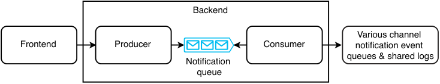

Figure 9.3    Zoom-in of our backend service from figure 9.2. The backend service consists of a producer cluster, a notification Kafka topic, and a consumer cluster. In subsequent illustrations, we will omit the zoom-in diagram of the backend service.

Each notification channel must be implemented as a separate service (we can refer to it as a channel service) because sending notifications on a particular channel requires a particular server application, and each channel has different capabilities, configurations, and protocols. Email notifications use SMTP. To send an email notification via the email notification system, the user provides the sender email address, recipient email addresses, title, body, and attachments. There are also other email types like calendar events. A SMS gateway uses various protocols including HTTP, SMTP, and SMPP. To send an SMS message, the user provides an origin number, a destination number, and a string.

In this discussion, let’s use the term “destination” or “address” to refer to a field that that identifies where to send a single notification object, such as a phone number, an email address, a device ID for push notifications, or custom destinations such as user IDs for internal messaging, and so on.

Each channel service should concentrate on its core functionality of sending a notification to a destination. It should process the full notification content and deliver the notification to its destination. But we may need to use third-party APIs to deliver messages by certain channels. For example, unless our organization is a telecommunications company, we will use a telecommunications company’s API to deliver phone calls and SMS. For mobile push notifications, we will use Apple Push Notification Service for iOS notifications and Firebase Cloud Messaging for Android notifications. It is only for browser notifications and our custom app notifications that we can deliver messages without using third-party APIs. Wherever we need to use a third-party API, the corresponding channel service should be the only component in our notification service that directly makes requests to that API.

Having no coupling between a channel service and the other services in our notification service makes our system more fault-tolerant and allows the following:

- The channel service can be used by services other than our notification service.

- The channel service can be scaled independently from the other services.

- The services can change their internal implementation details independently of each other and be maintained by separate teams with specialized knowledge. For example, the automated phone call service team should know how to send automated phone calls, and the email service team should know how to send email, but each team need not know about how the other team’s service works.

- Customized channel services can be developed, and our notification service can send requests to them. For example, we may wish to implement notifications within our browser or mobile app that are displayed as custom UI components and not as push notifications. The modular design of channel services makes them easier to develop.

We can use authentication (e.g., refer to the discussion of OpenID Connect in the appendix) on the frontend service to ensure that only authorized users, such as service layer hosts, can request channel services to send notifications. The frontend service handles requests to the OAuth2 authorization server.

Why shouldn’t users simply use the notification systems of the channels they require? What are the benefits of the development and maintenance overhead of the additional layers?

The notification service can provide a common UI (not shown in figure 13.1) for its clients (i.e., the channel services), so users can manage all their notifications across all channels from a single service and do not need to learn and manage multiple services. The frontend service provides a common set of operations:

- _Rate limiting_ —Prevents 5xx errors from notification clients being overwhelmed by too many requests. Rate limiting can be a separate common service, discussed in chapter 8. We can use stress testing to determine the appropriate limit. The rate limiter can also inform maintainers if the request rate of a particular channel consistently exceeds or is far below the set limit, so we can make an appropriate scaling decision. Auto-scaling is another option we can consider.

- _Privacy_ —Organizations may have specific privacy policies that regulate notifications sent to devices or accounts. The service layer can be used to configure and enforce these policies across all clients.

- _Security_ —Authentication and authorization for all notifications.

- _Monitoring, analytics, and alerting_ —The service can log notification events and compute aggregate statistics such as notification success and failure rates over sliding windows of various widths. Users can monitor these statistics and set alert thresholds on failure rates.

- _Caching_ —Requests can be made through a caching service, using one of the caching strategies discussed in chapter 8.

We provision a Kafka topic for each channel. If a notification has multiple channels, we can produce an event for each channel and produce each event to the corresponding topic. We can also have a Kafka topic for each priority level, so if we have five channels and three priority levels, we will have 15 topics.

The approach of using Kafka rather than synchronous request-response follows the cloud native principle of event-driven over synchronous. Benefits include less coupling, independent development of various components in a service, easier troubleshooting (we can replay messages from the past at any point in time), and higher throughput with no blocking calls. This comes with storage costs. If we process one billion messages daily, the storage requirement is 1 PB daily, or ~10 PB, with a one-week retention period. For a consistent load on the job constructor, each channel service consumer host has its own thread pool. Each thread can consume and process one event at a time.

The backend and each channel service can log their requests for purposes such as troubleshooting and auditing.

## _9.4 Object store: Configuring and sending notifications_

The notification service feeds a stream of events into the channel services. Each event corresponds to a single notification task to a single addressee.

QUESTION    What if a notification contains large files or objects? It is inefficient for multiple Kafka events to contain the same large file/object.

In figure 9.3, the backend may produce an entire 1 MB notification to a Kafka topic. However, a notification may contain large files or objects. For example, a phone call notification may contain a large audio file, or an email notification may contain multiple video attachments. Our backend can first POST these large objects in an object store, which will return object IDs. Our backend can then generate a notification event that includes these object IDs instead of the original objects and produce this event to the appropriate Kafka topic. A channel service will consume this event, GET the objects from our object store, assemble the notification, and then deliver it to the recipient. In figure 9.4, we add our metadata service to our high-level architecture.

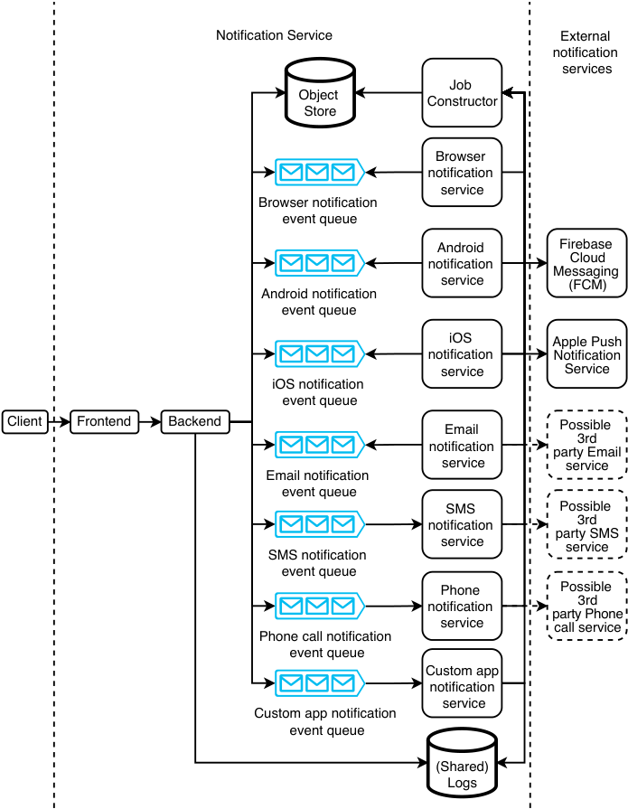

Figure 9.4    Our high-level architecture with a metadata service. Our backend service can POST large objects to the metadata service, so the notification events can be kept small.

If a particular large object is being delivered to multiple recipients, our backend will POST it multiple times to our object store. From the second POST onwards, our object store can return a 304 Not Modified response.

## _9.5 Notification templates_

An addressee group with millions of destinations may cause millions of events to be produced. This may occupy much memory in Kafka. The previous section discussed how we can use a metadata service to reduce the duplicate content in events and thus reduce their sizes.

### _9.5.1 Notification template service_

Many notification events are almost duplicates with a small amount of personalization. For example, figure 9.5 shows a push notification that can be sent to millions of users that contains an image common to all recipients and a string that varies only by the recipient’s name. In another example, if we are sending an email, most of the email’s contents will be identical to all recipients. The email title and body may only be slightly different for each recipient (such as a different name or a different percentage of discount for each user), while any attachments will likely be identical for all recipients.

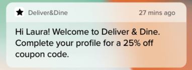

Figure 9.5    Example of a push notification that contains an image common to all recipients and can have a string that only varies by the recipient’s name. The common content can be placed in a template such as “Hi ${name}! Welcome to Deliver & Dine.” A Kafka queue event can contain a key-value pair of the form (“name” and the recipient’s name, destination ID). Image from https://buildfire.com/what-is-a-push-notification/.Insection9.1.4,wediscussedthattemplates are useful to users for managing such personalization. Templates are also useful to improve our notification service’s scalability. We can minimize the sizes of the notification events by placing all the common data into a template. Creation and management of templates can itself be a complex system. We can call it the notification template service, or template service for short. Figure 9.6 illustrates our high-level architecture with our template service. A client only needs to include a template ID in a notification, and a channel service will GET the template from the template service when generating the notification.

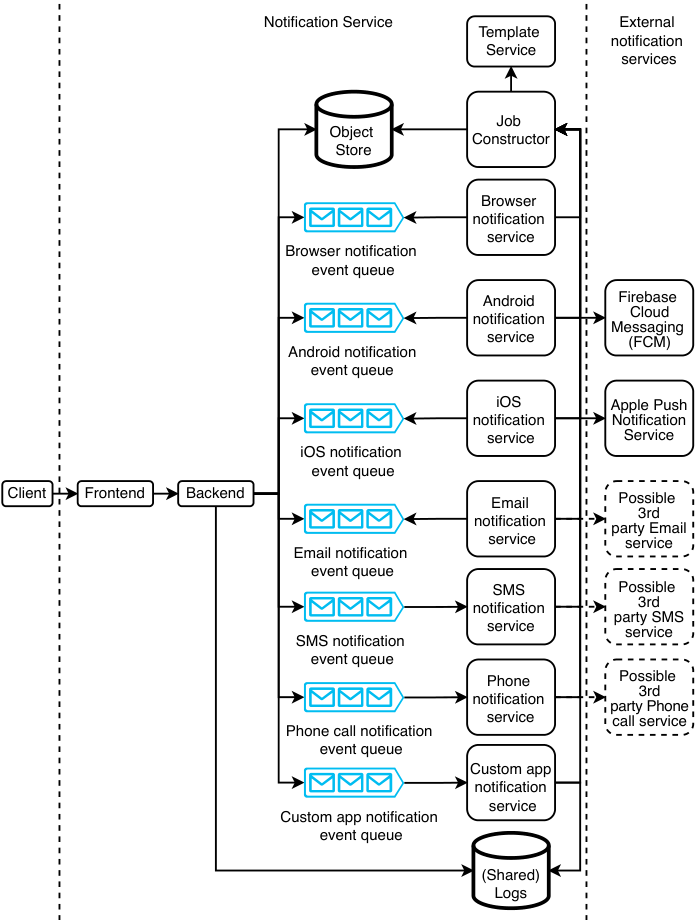

Figure 9.6    High-level architecture including our template service. Notification service users can CRUD templates. The template service should have its own authentication and authorization and RBAC (rolebased access control). The job constructor should only have read access. Admins should have admin access so they can create, update, and delete templates or grant roles to other users.

Combining this approach with our metadata service, an event need only contain the notification ID (which can also be used as the notification template key), any personalized data in the form of key-value pairs, and the destination. If the notification has no personalized content (i.e., it is identical for all its destinations), the metadata service contains essentially the entire notification content, and an event will only contain a destination and a notification content ID.

A user can set up a notification template prior to sending notifications. A user can send CRUD requests on notification templates to the service layer, which forwards them to the metadata service to perform the appropriate queries on the metadata database. Depending on our available resources or ease-of-use considerations, we may also choose to allow users not to have to set up a notification template and simply send entire notification events to our service.

### _9.5.2 Additional features_

We may decide that a template requires additional features such as the following. These additional features may be briefly discussed near the end of the interview as follow-up topics. It is unlikely there will be enough time during the interview for an in-depth discussion. A sign of engineering maturity and a good interview signal is the ability to foresee these features, while also demonstrating that one can fluently zoom in and out of the details of any of these systems, and clearly and concisely describe them to the interviewer.

#### authoring, access control, and change management

A user should be able to author templates. The system should store the template’s data, including its content and its creation details, such as author ID and created and updated timestamps.

User roles include admin, write, read, and none. These correspond to the access permissions that a user has to a template. Our notification template service may need to be integrated with our organization’s user management service, which may use a protocol like LDAP.

We may wish to record templates’ change history, including data such as the exact change that was made, the user who made it, and the timestamp. Going further, we may wish to develop a change approval process. Changes made by certain roles may need approval from one or more admins. This may be generalized to a shared approval service that can be used by any application where one or more users propose a write operation, and one or more other users approve or deny the operation.

Extending change management further, a user may need to rollback their previous change or revert to a specific version.

#### reusable and extendable template classes and functions

A template may consist of reusable sub-templates, each of which is separately owned and managed. We can refer to them as template classes.

A template’s parameters can be variables or functions. Functions are useful for dynamic behavior on the recipient’s device.

A variable can have a data type (e.g., integer, varchar(255), etc.). When a client creates a notification from a template, our backend can validate the parameter values. Our notification service can also provide additional constraints/validation rules, such as a minimum or maximum integer value or string length. We can also define validation rules on functions.

A template’s parameters may be populated by simple rules (e.g., a recipient name field or a currency symbol field) or by machine-learning models (e.g., each recipient may be offered a different discount). This will require integration with systems that supply data necessary to fill in the dynamic parameters. Content management and personalization are different functions owned by different teams, and the services and their interfaces should be designed to clearly reflect this ownership and division of responsibilities.

#### search

Our template service may store many templates and template classes, and some of them may be duplicates or very similar. We may wish to provide a search feature. Section 2.6 discusses how to implement search in a service.

#### other

There are endless possibilities. For example, how can we manage CSS and JavaScript in templates?

## _9.6 Scheduled notifications_

Our notification service can use a shared Airflow service or job scheduler service to provide scheduled notifications. Referring to figure 9.7, our backend service should provide an API endpoint to schedule notifications and can generate and make the appropriate request to the Airflow service to create a scheduled notification.

When the user sets up or modifies a periodic notification, the Airflow job’s Python script is automatically generated and merged into the scheduler’s code repository. A detailed discussion of an Airflow service is outside the scope of this question. For the purpose of the interview, the interviewer may request that we design our own task scheduling system instead of using an available solution such as Airflow or Luigi. We can use the cron-based solution discussed in section 4.6.1.

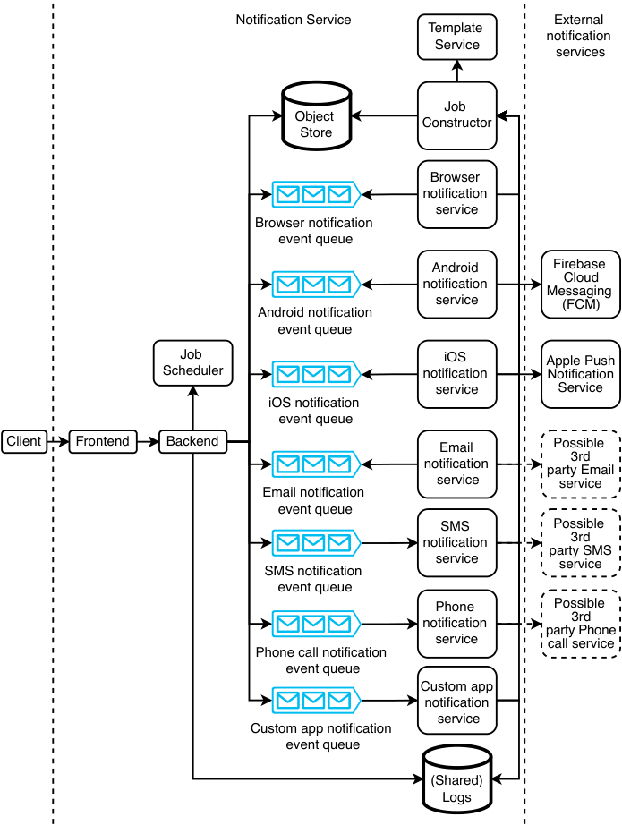

Figure 9.7    High-level architecture with an Airflow/job scheduler service. The job scheduler service is for users to configure periodic notifications. At the scheduled times, the job scheduler service will produce notification events to the backend.

Periodic notifications may compete with ad hoc notifications because both can be limited by the rate limiter. Each time the rate limiter prevents a notification request from immediately proceeding, this should be logged. We should have a dashboard to display the rate of rate limiting events. We also need to add an alert that triggers when there are frequent rate limiting events. Based on this information, we can scale up our cluster sizes, allocate more budget to external notification services, or request or limit certain users from excessive notifications.

## _9.7 Notification addressee groups_

A notification may have millions of destinations/addresses. If our users must specify each of these destinations, each user will need to maintain its own list, and there may be much duplicated recipient data among our users. Moreover, passing these millions of destinations to the notification service means heavy network traffic. It is more convenient for users to maintain the list of destinations in our notification service and use that list’s ID in making requests to send notifications. Let’s refer to such a list as a “notification addressee group.” When a user makes a request to deliver a notification, the request may contain either a list of destinations (up to a limit) or a list of Addressee Group IDs.

We can design an address group service to handle notification addressee groups. Other functional requirements of this service may include:

- Access control for various roles like read-only, append-only (can add but cannot delete addresses), and admin (full access). Access control is an important security feature here because an unauthorized user can send notifications to our entire user base of over 1 billion recipients, which can be spam or more malicious activity.

- May also allow addressees to remove themselves from notification groups to prevent spam. These removal events may be logged for analytics.

- The functionalities can be exposed as API endpoints, and all these endpoints are accessed via the service layer.

We may also need a manual review and approval process for notification requests to a large number of recipients. Notifications in testing environments do not require approval, while notifications in the production environment require manual approval. For example, a notification request to one million recipients may require manual approval by an operations staff, 10 million recipients may require a manager’s approval, 100 million recipients may require a senior manager’s approval, and a notification to the entire user base may require director-level approval. We can design a system for senders to obtain approval in advance of sending notifications. This is outside the scope of this question.

Figure 9.8 illustrates our high-level architecture with an address group service. A user can specify an address group in a notification request. The backend can make GET requests to the address group service to obtain an address group’s user IDs. Because there can be over one billion user IDs in a group, a single GET response cannot contain all user IDs, but rather has a maximum number of user IDs. The Address Group Service must provide a `GET /address-group/count/{name}` endpoint that returns the count of addresses in this group, and a `GET /address-group/{name}/start-index/ {start-index}/end-index/{end-index}` endpoint so our backend can make GET requests to obtain batches of addresses.

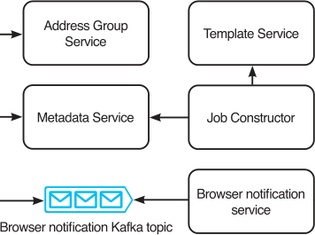

Figure 9.8    Zoom-in of figure 9.6, with the addition of an address group service. An address group contains a list of recipients. The address group service allows a user to send a notification to multiple users by specifying a single address group, instead of having to specify each and every recipient.

We can use a choreography saga (section 5.6.1) to GET these addresses and generate notification events. This can handle traffic surges to our address group service. Figure 9.9 illustrates our backend architecture to perform this task.

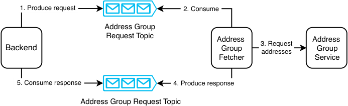

Figure 9.9    Our backend architecture to construct notification events from an address group

Referring to the sequence diagram in figure 9.10, a producer can create an event for such a job. A consumer consumes this event and does the following:

- 1 Uses GET to obtain a batch of addresses from the address group service

- 2 Generates a notification event from each address

- 3 Produces it to the appropriate notification event Kafka topic

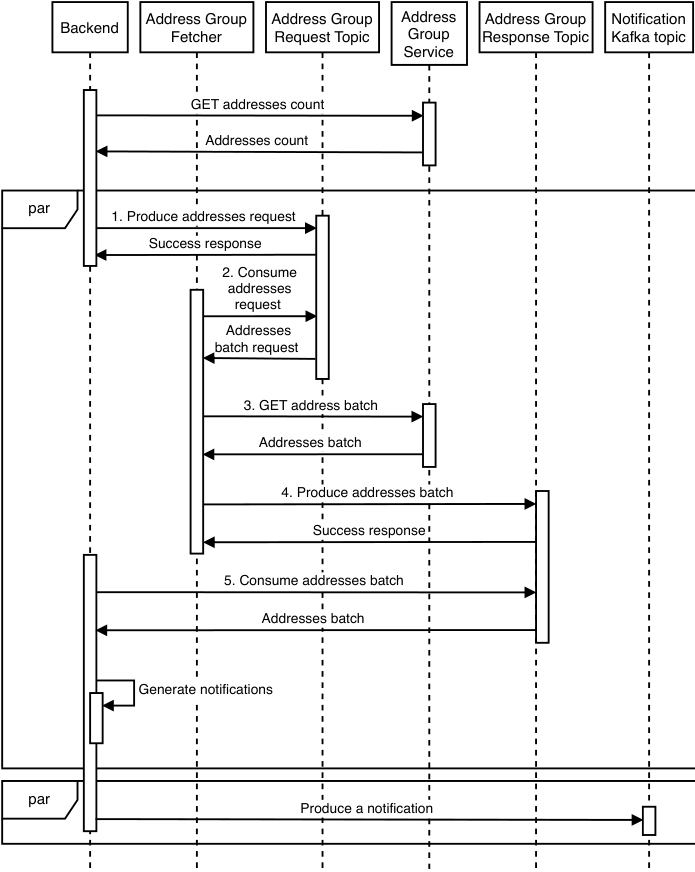

Figure 9.10    Sequence diagram for our backend service to construct notification events from an address group

Should we split the backend service into two services, so that step 5 onward is done by another service? We did not do this because the backend may not need to make requests to the address group service.

TIP This backend produces to one topic and consumes from another. If you need a program that consumes from one topic and produces to another, consider using Kafka Streams (https://kafka.apache.org/10/documentation/streams/).QUESTION   What if new users are added to a new address group while the address group fetcher is fetching its addresses?

A problem with this that we will immediately discover is that a big address group changes rapidly. New recipients are constantly being added or removed from the group, due to various reasons:

- Someone may change their phone number or email address.

- Our app may gain new users and lose current users during any period.

- In a random population of one billion people, thousands of people are born and die every day.

When is a notification considered delivered to all recipients? If our backend attempts to keep fetching batches of new recipients to create notification events, given a sufficiently big group, this event creation will never end. We should deliver a notification only to recipients who were within an address group at the time the notification was triggered.

A discussion of possible architecture and implementation details of an address group service is outside the scope of this question.

## _9.8 Unsubscribe requests_

Every notification should contain a button, link, or other UI for recipients to unsubscribe from similar notifications. If a recipient requests to be removed from future notifications, the sender should be notified of this request.

We may also add a notification management page in our app for our app users, like figure 9.11. App users can choose the categories of notifications that they wish to receive. Our notification service should provide a list of notification categories, and a notification request should have a category field that is a required field.

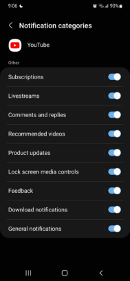

Figure 9.11    Notification management in the YouTube Android app. We can define a list of notification categories, so our app users can choose which categories to subscribe to.

#### QUESTION    Should unsubscribe be implemented on the client or server?

The answer is either to implement it on the server or on both sides. Do not implement it only on the client. If unsubscribe is implemented only on the client, the notification service will continue to send notifications to recipients, and the app on the recipient’s device will block the notification. We can implement this approach for our browser and mobile apps, but we cannot implement this on email, phone calls, or SMS. Moreover, it is a waste of resources to generate and send a notification only for it to be blocked by the client. However, we may still wish to implement notification blocking on the client in case the server-side implementation has bugs and continues to send notifications that should have been blocked.

If unsubscribe is implemented on the server, the notification service will block notifications to the recipient. Our backend should provide an API endpoint to subscribe or unsubscribe from notifications, and the button/link should send a request to this API.

One way to implement notification blocking is to modify the Address Group Service API to accept category. The new `GET` API endpoints can be something like `GET /address-group/count/{name}/category/{category}` and `GET /address-group/{name}/category/{category}/start-index/{start-index}/end-index/{end-index}`. The address group service will return only recipients who accept notifications of that category. Architecture and further implementation details are outside the scope of this question.

## _9.9 Handling failed deliveries_

Notification delivery may fail due to reasons unrelated to our notification service:

- The recipient’s device was uncontactable. Possible causes may include:

   - Network problems.

   - The recipient’s device may be turned off.

   - Third-party delivery services may be unavailable.

   - The app user uninstalled the mobile app or canceled their account. If the app user had canceled their account or uninstalled the mobile app, there should be mechanisms to update our address group service, but the update hasn’t yet been applied. Our channel service can simply drop the request and do nothing else. We can assume that the address group service will be updated in the future, and then GET responses from the address group service will no longer include this recipient.

- The recipient has blocked this notification category, and the recipient’s device blocked this notification. This notification should not have been delivered, but it was delivered anyway, likely because of bugs. We should configure a low-urgency alert for this case.

Each of the subcases in the first case should be handled differently. Network problems that affect our data center are highly unlikely, and if it does happen, the relevant team should have already broadcasted an alert to all relevant teams (obviously via channels that don’t depend on the affected data center). It is unlikely that we will discuss this further in an interview.

If there were network problems that only affected the specific recipient or the recipient’s device was turned off, the third-party delivery service will return a response to our channel service with this information. The channel service can add a retry count to the notification event, or it can increment the count if the retry field is already present (i.e., this delivery was already a retry). Next, it produces this notification to a Kafka topic that functions as a dead letter queue. A channel service can consume from the dead letter queue and then retry the delivery request. In figure 9.12, we add dead letter queues to our high-level architecture. If the retry fails three times, the channel service can log this and make a request to the address group service to record that the user is uncontactable. The address group service should provide an appropriate API endpoint for this. The address group service should also stop including this user in future GET requests. The implementation details are outside the scope of this question.

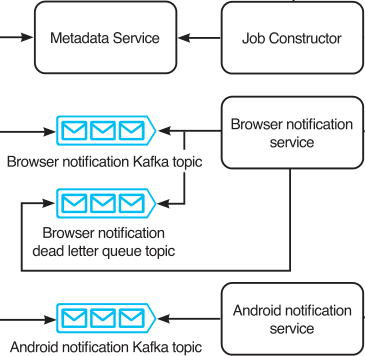

Figure 9.12    Zoom-in of figure 9.6, with the addition of a browser notification dead letter queue. The dead letter queues for the other channel services will be similar. If the browser notification service encounters a 503 Service Unavailable error when delivering a notification, it produces/enqueues this notification event to its dead letter queue. It will retry the delivery later. If delivery fails after three attempts, the browser notification service will log the event (to our shared logging service). We may also choose to also configure a low-urgency alert for such failed deliveries.

If a third-party delivery service is unavailable, the channel service should trigger a high-urgency alert, employ exponential backoff, and retry with the same event. The channel service can increase the interval between retries.

Our notification service should also provide an API endpoint for the recipient app to request missed notifications. When the recipient email, browser, or mobile app is ready to receive notifications, it can make a request to this API endpoint.

## _9.10 Client-side considerations regarding duplicate notifications_

Channel services that send notifications directly to recipient devices must allow both push and pull requests. When a notification is created, a channel service should immediately push it to the recipient. However, the recipient client device may be offline or unavailable for some reason. When the device comes back online, it should pull notifications from the notifications service. This is applicable to channels that don’t use external notifications services, such as browser or custom app notifications.

How can we avoid duplicate notifications? Earlier we discussed solutions to avoid duplicate notifications for external notification services (i.e., push requests). Avoiding duplicate notifications for pull requests should be implemented on the client side. Our service should not deny requests for the same notifications (perhaps other than rate limiting) because the client may have good reasons to repeat requests. The client should record notifications already shown (and dismissed) by the user, perhaps in browser localStorage or a mobile device’s SQLite database. When a client receives notifications in a pull (or perhaps also a push) request, it should look up against the device’s storage to determine whether any notification has already been displayed before displaying new notifications to the user.

## _9.11 Priority_

Notifications may have different priority levels. Referring to figure 9.13, we can decide how many priority levels we need, such as 2 to 5, and create a separate Kafka topic for each priority level.

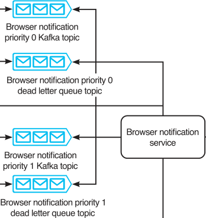

Figure 9.13 Figure 9.12 with two priority levels

To process higher-priority notifications before lower-priority ones, a consumer host can simply consume from the higher-priority Kafka topics until they are empty, then consume from the lower-priority Kafka topics. For a weighted approach, each time a consumer host is ready to consume an event, it can first use weighted random selection to select a Kafka topic to consume from.

QUESTION    Extend the system design to accommodate a different priority configuration for each channel.

## _9.12 Search_

We may provide search for users to search and view existing notification/alerting setups. We can index on notification templates and notification address groups. Referring to section 2.6.1, a frontend search library like match-sorter should be sufficient for this use case.

## _9.13 Monitoring and alerting_

Besides what was discussed in section 2.5, we should monitor and send alerts for the following.

Users should be able to track the state of their notifications. This can be provided via another service that reads from the log service. We can provide a notification service UI for users to create and manage notifications, including templates and tracking notifications’ statuses.

We can create monitoring dashboards on various statistics. Besides the success and failure rates already mentioned earlier, other useful statistics are the number of events in the queue and event size percentiles over time, broken down by channel and priority, as well as OS statistics like CPU, memory, and disk storage consumption. High memory consumption and a large number of events in the queue indicate that unnecessary resource consumption, and we may examine the events to determine whether any data can be placed into a metadata service to reduce the events’ sizes in the queue.

We can do periodic auditing to detect silent errors. For example, we can arrange with the external notification services we use to compare these two numbers:

- The number of 200 responses received by our notification services that send requests to external notification services.

- The number of valid notifications received by those external notification services.

Anomaly detection can be used to determine an unusual change in the notification rate or message sizes, by various parameters such as sender, receiver, and channel.

## _9.14 Availability monitoring and alerting on the notification/alerting service_

We discussed in section 9.1.1 that our notification service should not be used for uptime monitoring because it shares the same infrastructure and services as the services that it monitors. But what if we insist on finding a way for this notification service to be a general shared service for outage alerts? What if it itself fails? How will our alerting service alert users? One solution involves using external devices, such as servers located in various data centers.

We can provide a client daemon that can be installed on these external devices. The service sends periodic heartbeats to these external devices, which are configured to expect these heartbeats. If a device does not receive a heartbeat at the expected time, it can query the service to verify the latter’s health. If the system returns a 2xx response, the device assumes there was a temporary network connectivity problem and takes no further action. If the request times out or returns an error, the device can alert its user(s) by automated phone calls, texting, email, push notifications, and/or other channels. This is essentially an independent, specialized, small-scale monitoring and alerting service that serves only one specific purpose and sends alerts to only a few users.

## _9.15 Other possible discussion topics_

We can also scale (increase or decrease) the amount of memory of the Kafka cluster if necessary. If the number of events in the queues monotonically increases over time, notifications are not being delivered, and we must either scale up the consumer cluster to process and deliver these notification events or implement rate limiting and inform the relevant users about their excessive use.

We can consider auto-scaling for this shared service. However, auto-scaling solutions are tricky to use in practice. In practice, we can configure auto-scaling to automatically increase cluster sizes of the service’s various components up to a limit to avoid outages on unforeseen traffic spikes, while also sending alerts to developers to further increase resource allocation if required. We can manually review the instances where auto-scaling was triggered and refine the auto-scaling configurations accordingly.

A detailed discussion of a notification service can fill an entire book and include many shared services. To focus on the core components of a notification service and keep the discussion to a reasonable length, we glossed over many topics in this chapter. We can discuss these topics during any leftover time in the interview:

- A recipient should be able to opt into notifications and out of unwanted notifications; otherwise, they are just spam. We can discuss this feature.

- How can we address the situation where we need to correct a notification that has already been sent to a large number of users?

   - If we discovered this error while the notification is being sent, we may wish to cancel the process and not send the notification to the remaining recipients.

   - For devices where the notifications haven’t yet been triggered, we can cancel notifications that haven’t been triggered.

   - For devices where the notifications have already been triggered, we will need to send a follow-up notification to clarify this error.

- Rather than rate-limiting a sender regardless of which channels it uses, design a system that also allows rate limiting on individual channels.

- Possibilities for analytics include:

   - Analysis of notification delivery times of various channels, which can be used to improve performance.

   - Notification response rate and tracking and analytics on user actions and other responses to notifications.

   - Integrating our notification system with an A/B test system.

- APIs and architecture for the additional template service features we discussed in section 9.5.2.

- A scalable and highly available job scheduler service.

- Systems design of the address group service to support the features that we discussed in section 9.7. We can also discuss other features such as:

   - Should we use a batch or streaming approach to process unsubscribe requests?

   - How to manually resubscribe a recipient to notifications.

   - Automatically resubscribe a recipient to notifications if the recipient’s device or account makes any other requests to any service in our organization.

- An approval service for obtaining and tracking the relevant approvals to send notifications to a large number of recipients. We can also extend this discussion to system design of mechanisms to prevent abuse or send unwanted notifications.

- Further details on the monitoring and alerts, including examples and elaboration of the exact metrics and alerts to define.

- Further discussion on the client daemon solution.

- Design our various messaging services (e.g., design an email service, SMS service, automated phone call service, etc.).

## _9.16 Final notes_

Our solution is scalable. Every component is horizontally scalable. Fault-tolerance is extremely important in this shared service, and we have constantly paid attention to it. Monitoring and availability are robust; there is no single point of failure, and the monitoring and alerting of system availability and health involves independent devices.

## _Summary_

- A service that must serve the same functionality to many different platforms can consist of a single backend that centralizes common processing and directs requests to the appropriate component (or another service) for each platform.

- Use a metadata service and/or object store to reduce the size of messages in a message broker queue.

- Consider how to automate user actions using templates.

- We can use a task scheduling service for periodic notifications.

- One way to deduplicate messages is on the receiver’s device.

- Communicate between system components via asynchronous means like sagas.

- We should create monitoring dashboards for analytics and tracking errors.

- Do periodic auditing and anomaly detection to detect possible errors that our other metrics missed.

