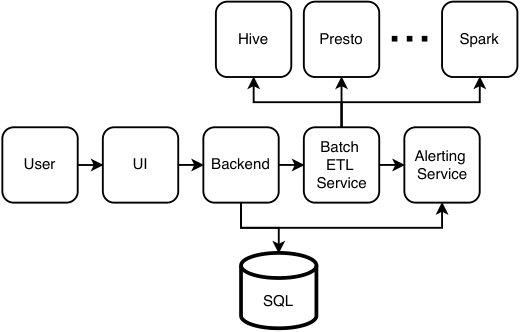
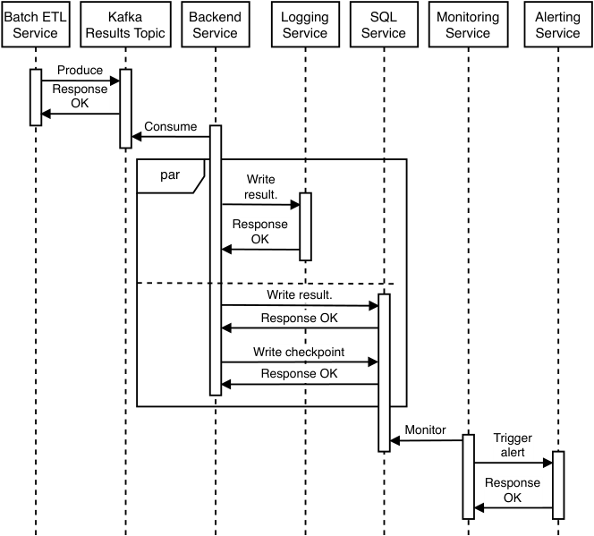
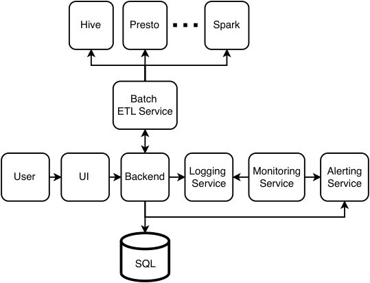
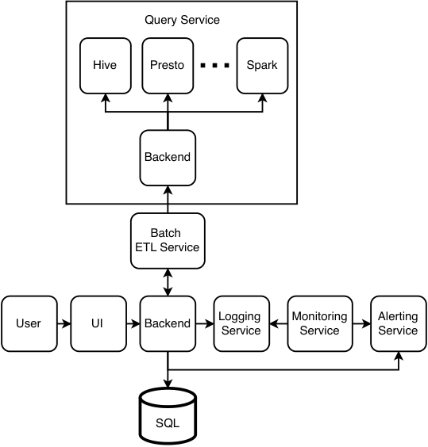
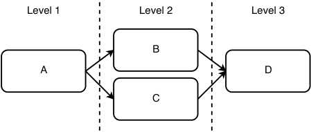
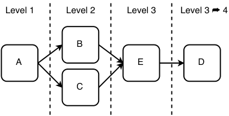

# _Design a database batch auditing service_

## _This chapter covers_

- Auditing database tables to find invalid data

- Designing a scalable and accurate solution to audit database tables

- Exploring possible features to answer an unusual question

Let’s design a shared service for manually defined validations. This is an unusually open-ended system design interview question, even by the usual standards of system design interviews, and the approach discussed in this chapter is just one of many possibilities.

We begin this chapter by introducing the concept of _data quality_ . There are many definitions of data quality. In general, data quality can refer to how suitable a dataset is to serve its purpose and may also refer to activities that improve the dataset’s suitability for said purpose. There are many dimensions of data quality. We can adopt the dimensions from https://www.heavy.ai/technical-glossary/data-quality:-_Accuracy_ —How close a measurement is to the true value.

- _Completeness_ —Data has all the required values for our purpose.

- _Consistency_ —Data in different locations has the same values, and the different locations start serving the same data changes at the same time.


- _Validity_ —Data is correctly formatted, and values are within an appropriate range.

- _Uniqueness_ —No duplicate or overlapping data.

- _Timeliness_ —Data is available when it is required.

Two approaches in validating data quality are anomaly detection, which we discussed in section 2.5.6, and manually defined validations. In this chapter, we will discuss only manually defined validations. For example, a certain table may be updated hourly and occasionally have no updates for a few hours, but it may be highly unusual for two updates to be more than 24 hours apart. The validation condition is “latest timestamp is less than 24 hours ago.”

Batch auditing with manually defined validations is a common requirement. A transaction supervisor (section 5.5) is one of many possible use cases, though a transaction supervisor does not just check whether data is valid but also returns any data differences between the multiple services/databases that it compares, as well as the operations needed to restore consistency to those services/databases.

## _10.1 Why is auditing necessary?_

The first impression of this question may be that it doesn’t make sense. We may argue that other than the case of a transaction supervisor, batch auditing may encourage bad practices.

For example, if we have a situation where data was invalid due to data loss in databases or file systems that are not replicated or backed up, then we should implement replication or backup instead of losing the data. However, replication or backup may take seconds or longer, and the leader host may fail before the data is successfully replicated or backed up.

#### Preventing data loss

One technique that prevents data loss from occurring due to late replication is quorum consistency (i.e., write to a majority of hosts/nodes in the cluster before returning a success response to the client). In Cassandra, a write is replicated to an in-memory data structure called Memtable across multiple nodes before returning a success response. Writing to memory is also much faster than writing to disk. The Memtable is flushed to disk (called an SSTable) either periodically or when it reaches a certain size (e.g., 4 MB).

If the leader host recovers, the data may be recovered and then replicated to other hosts. However, this will not work in certain databases like MongoDB that, depending on its configuration, can deliberately lose data from a leader host to maintain consistency (Arthur Ejsmont, _Web Scalability for Startup Engineers,_ McGraw Hill Education, 2015, pp. 198–199. In a MongoDB database, if the write concern _(_ https://www.mongodb.com/docs/manual/core/replica-set-write-concern/)issetto1,all nodes must be consistent with the leader node. If a write to the leader node is successful, but the leader node fails before replication occurs, the other nodes use a consensus protocol to select a new leader. If the former leader node recovers, it will roll back any data that is different from the new leader node, including such writes.

We can also argue that data should be validated at the time a service receives it, not after it has already been stored to a database or file. For example, when a service receives invalid data, it should return the appropriate 4xx response and not persist this data. The following 4xx codes are returned for write requests with invalid data. Refer to sources like https://developer.mozilla.org/en-US/docs/Web/HTTP/Status#client_error_responsesformoreinformation-_400 Bad Request_ —This is a catch-all response for any request that the server perceives to be invalid.

- _409 Conflict_ —The request conflicts with a rule. For example, an upload of a file that is older than the existing one on the server.

- _422 Unprocessable Entity_ —The request entity has valid syntax but could not be processed. An example is a POST request with a JSON body containing invalid fields.

One more argument against auditing is that validation should be done in the database and application, rather than an external auditing process. We can consider using database constraints as much as possible because applications change much faster than databases. It is easier to change application code than database schema (do database migrations). At the application level, the application should validate inputs and outputs, and there should be unit tests on the input and output validation functions.

#### Database constraints

There are arguments that database constraints are harmful (https://dev.to/jonlauridsen/database-constraints-considered-harmful-38),thattheyareprematureoptimizations, do not capture all data integrity requirements, and make the system more difficult to test and to adjust to changing requirements. Some companies like GitHub (https:// github.com/github/gh-ost/issues/331#issuecomment-266027731) and Alibaba (https:// github.com/alibaba/Alibaba-Java-Coding-Guidelines#sql-rules) forbid foreign key co n - stra ints.

In practice, there will be bugs and silent errors. Here is an example that the author has personally debugged. A POST endpoint JSON body had a date field that should contain a future date value. POST requests were validated and then written to a SQL table. There was also a daily batch ETL job that processed objects marked with the current date. Whenever a client made a POST request, the backend validated that the cli ent’s date value had the correct format and was set up to one week in the future.

However, the SQL table contained a row with a date set five years in the future, and this went undetected for five years until the daily batch ETL job processed it, and the invalid result was detected at the end of a series of ETL pipelines. The engineers who wrote this code had left the company, which made the problem more difficult to debug. The author examined the git history and found that this one-week rule was not implemented until months after the API was first deployed to production and deduced that an invalid POST request had written this offending row. It was impossible to confirm this as there were no logs for the POST request because the log retention period was two weeks. A periodic auditing job on the SQL table would have detected this error, regardless of whether the job was implemented and started running long after the data was written.

Despite our best efforts to stop any invalid data from being persisted, we must assume that this will happen and be prepared for it. Auditing is another layer of validation checks.

A common practical use case for batch auditing is to validate large (e.g., >1 GB) files, especially files from outside our organization over which we have not been able to control how they were generated. It is too slow for a single host to process and validate each row. If we store the data in a MySQL table, we may use LOAD DATA (https://dev.mysql.com/doc/refman/8.0/en/load-data.html),whichismuchfasterthan INSERT, then run SELECT statements to audit the data. A SELECT statement will be much faster and also arguably easier than running a script over a file, especially if the SELECT takes advantage of indexes. If we use a distributed file system like HDFS, we can use NoSQL options like Hive or Spark with fast parallel processing.

Moreover, even if invalid values are found, we may decide that dirty data is better than no data and still store them in a database table.

Last, there are certain problems that only batch auditing can find, such as duplicate or missing data. Certain data validation may require previously ingested data; for example, anomaly detection algorithms use previously ingested data to process and spot anomalies in currently ingested data.

## _10.2 Defining a validation with a conditional statement on a SQL query’s result_

Terminology clarification: A table has rows and columns. An entry in a particular (row, column) coordinate can be referred to as a cell, element, datapoint, or value. In this chapter, we use these terms interchangeably.

Let’s discuss how a manually defined validation can be defined by comparison operators on the results of a SQL query. The result of a SQL query is a 2D array, which we will name “result”. We can define a conditional statement on result. Let’s go over some examples. All these examples are daily validations, so we validate only yesterday’s rows, and our example queries have the WHERE clause “Date(timestamp) > Curdate() - INTERVAL 1 DAY”. In each example, we describe a validation, followed by its SQL query and then possible conditional statements.

Manually defined validations can be defined on

- _Individual datapoints of a column_ —An example is the “latest timestamp is < 24 hours old” that we discussed previously.

```sql
SELECT COUNT(*) AS cnt
FROM Transactions
WHERE Date(timestamp) >= Curdate() - INTERVAL 1 DAY
```


Possible true conditional statements are `result[0][0] > 0` and `result[` ' `cnt` ' `] [0] > 0` .

Let’s discuss another example. If a particular coupon code ID expires on a certain date, we can define a periodic validation on our transactions table that raises an alert if this code ID appears after this date. This may indicate that coupon code IDs are being recorded incorrectly.

```sql
SELECT COUNT(*) AS cnt
FROM Transactions
WHERE code_id = @code_id
AND Date(timestamp) > @date ‰AND Date(timestamp) = Curdate() - INTERVAL 1 DAY
```


Possible true conditional statements are `result[0][0] == 0` and: `result[` ' `cnt` ' `][0] == 0` .

- _Multiple datapoints of a column—_ For example, if an individual app user cannot make more than five purchases per day, we can define a daily validation on our transactions table that raises an alert if there are more than five rows for any user ID since the previous day. This may indicate bugs, that a user was erroneously able to make more than five purchases that day, or that purchases are being incorrectly recorded.

```sql
SELECT user_id, count(*) AS cnt
FROM Transactions
WHERE Date(timestamp) = Curdate() - INTERVAL 1 DAY
GROUP BY user_id
```


The conditional statement is `result.length <= 5` .

Another possibility:

```sql
SELECT *
FROM (
SELECT user_id, count(*) AS cnt
FROM Transactions
WHERE Date(timestamp) = Curdate() - INTERVAL 1 DAY
GROUP BY user_id )
AS yesterday_user_counts
WHERE cnt > 5;
```


The conditional statement is `result.length == 0` .

- _Multiple columns in a single row—_ For example, the total number of sales that uses a particular coupon code cannot exceed 100 per day.

```sql
SELECT count(*) AS cnt
FROM Transactions
WHERE Date(timestamp) = Curdate() - INTERVAL 1 DAY ‰AND coupon_code = @coupon_code
```


The conditional statement is `result.length <= 100` .

An alternative query and conditional statement are as follows:


```sql
SELECT *
FROM (
SELECT count(*) AS cnt
FROM Transactions
WHERE Date(timestamp) = Curdate() - INTERVAL 1 DAY ‰AND coupon_code = @coupon_code )
AS yesterday_user_counts
WHERE cnt > 100;
```


The conditional statement is `result.length == 0` .

- _Multiple tables—_ For example, if we have a fact table sales_na to record sales in North America, that has a country_code column, we can create a dimension table country_codes that has a list of country codes for each geographical region. We can define a periodic validation that checks that all new rows have country_code values of countries within North America:

```sql
SELECT *
FROM sales_na S JOIN country_codes C ON S.country_code = C.id WHERE C.region != 'NA';
```

The conditional statement is `result.length == 0` .

- _A conditional statement on multiple queries—_ For example, we may wish to raise an alert if the number of sales on a day changes by more than 10% compared to the same day last week. We can run two queries and compare their results as follows. We append the query results to a `result` array, so this `result` array is 3D instead of 2D:

```sql
SELECT COUNT(*)
FROM sales
WHERE Date(timestamp) = Curdate()
```


```sql
SELECT COUNT(*)
FROM sales
WHERE Date(timestamp) = Curdate() - INTERVAL 7 DAY
```


The conditional statement is `Math.abs(result[0][0][0] – result[1][0][0]) / result[0][0][0] < 0.1` .

There are countless other possibilities for manually defined validations, such as:

- A minimum number of new rows can be written each hour to a table.

- A particular string column cannot contain null values, and string lengths must be between 1 and 255.

- A particular string column must have values that match a particular regex.

- A particular integer column should be nonnegative.

Some of these types of constraints can also be implemented by function annotations in ORM libraries (e.g., `@NotNull` and `@Length(min = 0, max = 255)` ) in Hibernate or constraint types in Golang’s SQL package. In this case, our auditing service serves as an additional layer of validation. Failed audits indicate silent errors in our service, which we should investigate.


This section’s examples were in SQL. We can generalize this concept to define validation queries in other query languages like HiveQL, Trino (formerly called PrestoSQL), or Spark. Though our design focuses on defining queries using database query languages, we can also define validation functions in general purpose programming languages.

## _10.3 A simple SQL batch auditing service_

In this section, we first discuss a simple script for auditing a SQL table. Next, we discuss how we can create a batch auditing job from this script.

### _10.3.1 An audit script_

The simplest form of a batch auditing job is a script that does the following steps:

- 1 Runs a database query

- 2 Reads the result into a variable

- 3 Checks the value of this variable against certain conditions

The example Python script in the following listing runs a MySQL query that checks if the latest timestamp of our transactions table is < 24 hours old and prints the result to console.

Listing 10.1     Python script and MySQL query to check the latest timestamp

```python import mysql cnx = mysql.connector.connect(user='admin', password='password', host='127.0.0.1', database='transactions') cursor = cnx.cursor() query = """
    SELECT COUNT(*) AS cnt
    FROM Transactions
    WHERE Date(timestamp) >= Curdate() - INTERVAL 1 DAY
""" cursor.execute(query) results = cursor.fetchall() cursor.close() cnx.close()
# result[0][0] > 0 is the condition.
print(result[0][0] > 0)
# result['cnt'][0] > 0 also works.
```

We may need to run several database queries and compare their results. Listing 10.2 is a possible example.


Listing 10.2     An example script that compares the results of several queries

```python import mysql queries = [
    {
        'database': 'transactions',
        'query': """
            SELECT COUNT(*) AS cnt
            FROM Transactions
            WHERE Date(timestamp) >= Curdate() - INTERVAL 1 DAY
        """,
    },
    {
        'database': 'transactions',
        'query': """
            SELECT COUNT(*) AS cnt
            FROM Transactions
            WHERE Date(timestamp) >= Curdate() - INTERVAL 1 DAY
        """
    }
] results = [] for query in queries:
    cnx = mysql.connector.connect(user='admin', password='password', host='127.0.0.1', database=query['database'])
    cursor = cnx.cursor()
    cursor.execute(query['query'])
    results.append(cursor.fetchall())
    cursor.close()
    cnx.close() print(result[0][0][0] > result[1][0][0])
```


### _10.3.2 An audit service_

Next, let’s extend this to a batch auditing service. We can generalize the script to allow a user to specify

- 1 The SQL databases and queries.

- 2 The condition that will be run on the query result.

Let’s implement a Python file template that we can name `validation.py.template` . Listing 10.3 is a possible implementation of this file. This is a simplified implementation. The batch auditing job is divided into two phases:

- 1 Run the database queries and use their results to determine whether the audit passed or failed.

- 2 If the audit failed, trigger an alert.


In a practical implementation, the login credentials will be supplied by a secrets management service, and the host is read from a configuration file. These details are outside the scope of this question. The user story for this service can be as follows:

- 1 The user logs in to the service and creates a new batch auditing job.

- 2 The user inputs the values for database, queries, and condition.

- 3 Our service will create a validation.py file from this `validation.py.template` and replace the parameters like `{database}` with the user’s input values.

- 4 Our service creates a new Airflow or cron job that imports validation.py and runs the validation function.

We may notice that these validation.py files are essentially functions. A batch ETL service stores functions rather than objects.

We commented in the `validation.py.template` that we should create an Airflow task for each database query. Our backend should generate such a validation.py file. This will be a good coding interview exercise but is outside the scope of a system design interview.

Listing 10.3    A Python file template for an audit service

```python from datetime import datetime, timedelta from airflow import DAG from airflow.operators.bash import BranchPythonOperator import mysql.connector import os import pdpyras

# Example user inputs:
# {name} – ''
# {queries} – ['', '']
# {condition} – result[0][0][0] > result[1][0][0]
 def _validation():
    results = []
    # Database queries are expensive. An issue with running every query here
    # is that if a query fails, all queries need to be rerun.
    # We can consider instead creating an Airflow task for each query.
    for query in {queries}:
        cnx = mysql.connector.connect(user='admin', password='password', host='127.0.0.1', database=query['database'])
        cursor = cnx.cursor()
        cursor.execute(query['query'])
        results.append(cursor.fetchall())
        cursor.close()
        cnx.close()
    # XCom is an Airflow feature to share data between tasks.
    ti.xcom_push(key='validation_result_{name}', value={condition})
 def _alert():
    # Some sample code to trigger a PagerDuty alert if the audit failed.
    # This is just an example and should not be taken as working code.
    # We may also wish to send this result to our Backend Service.
    # This is discussed later in this chapter.
    result = ti.xcom_pull(key='validation_result_{name}')
    if result:
        routing_key = os.environ['PD_API_KEY']
        session = pdpyras.EventsAPISession(routing_key)
        dedup_key = session.trigger("{name} validation failed", "audit")
```
 with DAG(
    {name}, default_args={
        'depends_on_past': False,
        'email': ['zhiyong@beigel.com'],
        'email_on_failure': True,
        'email_on_retry': False,
        'retries': 1,
        'retry_delay': timedelta(minutes=5),
    }, description={description}, schedule_interval=timedelta(days=1), start_date=datetime(2023, 1, 1), catchup=False, tags=['validation', {name}],
) as dag:
    t1 = BranchPythonOperator(
        task_id='validation', python_callable=_validation
    )
    # Alerting is a separate Airflow task, so in case the alert fails,
    # the Airflow job does not rerun the expensive validation function.
    t2 = BranchPythonOperator(
        task_id='alert', python_callable=_alert
    )
    t1 >> t2
```

## _10.4 Requirements_

Let’s design a system where users can define SQL, Hive, or Trino (formerly called Presto) queries for periodic batch audits of their database tables. Functional requirements are as follows:

- CRUD audit jobs. An audit job has the following fields:

   - Interval, such as minute, hour, day, or custom time intervals

   - Owners

   - A validation database query in SQL or related dialects like HQL, Trino, Cassandra, etc.

   - A conditional statement on the SQL query result

- A failed job should trigger an alert

- View logs of past and currently running jobs, including whether there were errors, and the results of their conditional statements. Users should also be able to view the status and history of any triggered alerts, such as what time they were triggered and whether and, if so, what time they were marked as resolved.

- A job must complete within 6 hours.

- A database query must complete within 15 minutes. Our system should disallow jobs with long-running queries.

Non-functional requirements are as follows:

- _Scale_ —We project that there will be less than 10000 jobs (i.e., 10000 database statements). The jobs and their logs are read only through our UI, so traffic is low.

- _Availability_ —This is an internal system that no other systems directly depend on. High availability is not required.

- _Security_ —Jobs have access control. A job can only be CRUD by its owners.

- _Accuracy_ —The audit job result should be accurate as defined by the job’s configuration.

## _10.5 High-level architecture_

Figure 10.1 is an initial high-level architecture diagram of a hypothetical service for users to define periodic validation checks on their tables. We assume that the batch ETL service is an Airflow service or works similarly to Airflow. It stores the Python files of the batch jobs, runs them at their defined schedules, stores the status and history of these jobs, and returns Boolean values indicating if their audit conditions were true or false. Users will interact with our UI, which makes requests through our backend:

- 1 Users make requests to a shared batch ETL service to CRUD the batch auditing jobs, including checking on the status and history of these jobs.

- 2 Our shared batch ETL service is not an alerting service, so it does not have API endpoints to trigger alerts or to view the status and history of any triggered alerts. Users make requests to a shared alerting service via our UI and backend to view this information.





Figure 10.1    Initial high-level architecture of a hypothetical service for users to define periodic validation checks on their data.


When a user submits a request to create a batch auditing job, the following steps occur:

- 1 Our backend service creates the validation.py file by substituting user’s input values into the template. Since this template is just a short string, it can be stored in memory on every backend service host.

- 2 Our backend service sends a request to the batch ETL service with this file. The batch ETL service creates the batch ETL job and stores this file, then returns a 200 success response to our backend service.

Our batch auditing service is essentially a wrapper over a shared Batch ETL Service.

An audit job’s configuration has fields such as the job’s owners, a cron expression, the database type (Hive, Trino, Spark, SQL, etc.) and the query to execute. The main SQL table will store the audit jobs’ configurations, which we can name job_config. We can also create an `owner` table that maps jobs to their owners and has the columns `job_id` and `owner_id` .

Since validation queries can be defined in various SQL-like dialects, our batch ETL service is connected to various shared databases such as SQL, Hive, Trino, Spark, Cassandra, etc. If a job fails or there are any failed audits, the batch ETL service makes requests to a shared alerting service to alert the relevant persons. For security, we can use a shared OpenID Connect service for authentication, which is discussed in appendix B.

### _10.5.1 Running a batch auditing job_

An audit job is periodically run with the configured time interval and has two main steps:

- 1 Run the database query.

- 2 Run the conditional statement with the database query’s result.

Referring to section 4.6.1, a batch ETL job is created as a script (e.g., Python script in an Airflow service). When the user creates an audit job, our backend can generate the corresponding Python script. This generation can utilize a template script that we had predefined and implemented. This template script can contain several sections where the appropriate parameters (interval, database query, and conditional statement) are substituted.

The main scalability challenges are on the batch ETL service and possibly the alerting service, so a scalability discussion is about designing a scalable batch ETL service and scalable alerting service. Refer to chapter 9 for a detailed discussion on an alerting service.

Since the user’s audit job is mainly defined as a validation function that runs an SQL statement, we also suggest using a Function as a Service (FaaS) platform and take advantage of its built-in scalability. We can create safeguards against anomalous queries, such as a 15-minute limit on query execution time, or suspend the job if the query result is invalid.


The result of each audit job run can be stored in our SQL database and accessed by users via our UI.

### _10.5.2 Handling alerts_

Should alerts regarding failed audits be triggered by our batch ETL service or by our backend? Our first thought may be that it is our batch ETL service that runs the auditing jobs, so it should trigger such alerts. However, this means that the alerting functionalities used by our batch auditing service are split between two of its components:

- Requests to trigger alerts are made by our batch ETL service.

- Requests to view alert status and history are made from our backend service.

This means that the configuration to connect to our alerting service must be made on both services, which is additional maintenance overhead. A future team maintaining this batch auditing service may have different engineers who are unfamiliar with the code, and if there are problems with alerts, they may initially erroneously believe that interactions with the alerting service are all on one service and may waste time debugging on the wrong service before they find out that the problem was on the other service.

Thus, we may decide that all interactions with our alerting service should be on our backend service. A batch ETL job will only check if the condition is true or false and send this Boolean value to our backend service. If the value is false, our backend service will trigger an alert on our alerting service.

However, this approach may cause a possible bug. If the backend service host handling generating and making alert request crashes or becomes unavailable, the alert may not be sent. Some possible ways to prevent this bug are the following:

- The request from our batch ETL service to our backend service can be blocking, and the backend service returns a 200 only after it has successfully sent the alert request. We can rely on the retry mechanisms of our batch ETL service (such as the retry mechanisms in Airflow) to ensure the alert request is made. However, this approach means that our batch ETL service is essentially still making the alert request, and tightly couples these two services.

- Our batch ETL service can produce to a partitioned Kafka topic, and our backend service hosts can consume from these partitions, and checkpoint on each partition (possibly using SQL). However, this may cause duplicate alerts, as a backend service host may fail after making the alert request but before checkpointing. Our alerting service needs to be able to deduplicate alerts.

Our current architecture does both logging and monitoring. It logs the audit results to SQL. It monitors these audit jobs; if a job fails, our batch auditing service triggers an alert. Only alerting is done by a shared service.

An alternative approach is to log the audit job results both to SQL and a shared logging service. We can use another SQL table for checkpointing every few results.


Referring to the sequence diagram in figure 10.2, each time a host recovers from a failure, it can query this SQL table to obtain the last checkpoint. Writing duplicate logs to SQL is not a problem because we can simply use “INSERT INTO <table> IF NOT EXISTS…” statements. Writing duplicate results to the logging service can be handled in three ways:

- 1 Assume that the consequences of duplicate logs are trivial, and simply write them to the logging service.

- 2 The logging service should handle duplicates.

- 3 Query the logging service to determine whether a result exists before writing to it. This will double our traffic to the logging service.





Figure 10.2    Sequence diagram which illustrates logging in parallel to a logging service and SQL service. We can monitor and alert on the SQL service.

Figure 10.3 shows our revised high-level architecture with our shared logging and monitoring services. Logging and alerting are decoupled from the batch ETL service. The developers of the batch ETL service need not be concerned with changes to the alerting service and vice versa, and the batch ETL service need not be configured to make requests to the alerting service.





Figure 10.3    High-level architecture using shared services. Every service logs to the shared logging service, but we only illustrate its relationship with the backend and monitoring services.

## _10.6 Constraints on database queries_

Database queries are the most expensive and longest-running computations in many services, including this one. For reasons including the following, the batch ETL service should be constrained in the rate and duration of queries it is allowed to run:

- The various database services are shared services. Any user who runs long and expensive queries significantly decreases the service’s remaining capacity to serve queries by other users and increases the latency across the board. Queries consume CPU and memory on their hosts. Each connection to a database service also consumes a thread; the process on this thread executes the query and collects and returns the query results. We can allocate a thread pool containing a limited number of threads so there will never be too many concurrent queries.

- Our database services may be provided by third-party cloud providers who bill on usage, and expensive and long-running queries will cost a lot of money.

- The batch ETL service has a schedule of queries to execute. It must ensure that every query can be executed within its period. For example, an hourly query must complete within one hour.

We can implement techniques to parse a user’s query definition as they author it in a job configuration, or when they submit the query together with the rest of the job configuration to our backend.

In this section, we discuss constraints we can implement on user queries to fulfill our system’s requirements and control costs.


### _10.6.1 Limit query execution time_

A simple way to prevent expensive queries is to limit query execution time to 10 minutes when the owner is creating or editing a job configuration and to 15 minutes when the job is running. When a user is authoring or editing a query in a job configuration, our backend should require the user to run the query and validate that it takes less than 10 minutes before allowing the user to save the query string. This will ensure that users are trained to keep their queries within a 10-minute limit. An alternative is to present a nonblocking/asynchronous experience. Allow a user to save a query, execute the query, then alert the user via email or chat of whether their query ran successfully within 10 minutes, so their job configuration is accepted or rejected accordingly. A tradeoff of this UX is that owners may be reluctant to change their query strings, so possible bugs or improvements may not be addressed.

We may wish to prevent multiple users from concurrently editing a query and overwriting each other’s updates. Refer to section 2.4.2 for a discussion on preventing this.

If a query’s execution exceeds 15 minutes, terminate the query, disable the job until the owner edits and validates the query, and trigger a high-urgency alert to the owners. If a query’s execution exceeds 10 minutes, trigger a low-urgency alert to the job configuration’s owners to warn them of the consequences that their query may exceed 15 minutes in the future.

### _10.6.2 Check the query strings before submission_

Rather than making a user wait for minutes before saving a job configuration or informing the user 10 minutes after they saved a configuration that it was rejected, it will be more convenient to users if our UI can provide immediate feedback to them on their query strings as they are authoring them to prevent them from submitting job configurations with invalid or expensive queries. Such validation may include the following.

Do not allow full table scans. Allow queries to run on only tables that contain partition keys, and queries must contain filters on partition keys. We can also consider going a step further and limiting the number of partition key values within a query. To determine a table’s partition keys, our backend will need to run a DESCRIBE query on the relevant database service. Do not allow queries that contain JOINs, which can be extremely expensive.

After a user defines a query, we can display the query execution plan to the user, which will allow the user to tune the query to minimize its execution time. This feature should be accompanied by references to guides on tuning queries in the relevant database query language. Refer to https://www.toptal.com/sql-server/sql-database-tuning-for-developersforaguideon SQL query tuning. For guides to tuning Hive queries, refer to https://cwiki.apache.org/confluence/display/Hive/LanguageManual+Explainorthechaptertitled “Performance Considerations” in Dayang Du, _Apache Hive Essentials,_ Packt Publishing, 2018.


### _10.6.3 Users should be trained early_

Our users who author the queries should be instructed in these constraints early, so they can learn to adapt to these constraints. We should also provide good UX and instructive documentation to guide our users in these constraints. Moreover, these constraints should preferably be defined and set in an early release of our database batch auditing service, rather than added months after the first release. If our users were allowed to submit expensive queries before we impose these constraints, they may resist and argue against these constraints, and it may be difficult or impossible to persuade them to change their queries.

## _10.7 Prevent too many simultaneous queries_

We should configure a limit for the number of simultaneous queries that the batch ETL service can execute. Each time a user submits a job configuration, which will contain a query to be run with a particular schedule, the backend can check the number of queries scheduled to be executed simultaneously on the same database and trigger an alert to our service’s developers if the number of simultaneous queries approaches the estimated capacity. We can monitor the waiting time of each query before it begins execution and trigger low-urgency alerts if the waiting time exceeds 30 minutes or another benchmark value that we decide on. We can also investigate designing load-testing schemes to estimate the capacity. Our revised high-level architecture is illustrated in figure 10.4.





Figure 10.4    Revised high-level architecture with a shared query service through which other services make database requests.


Figure 10.4 contains a new database query service. Since the databases are shared services, cross-cutting concerns such as the configured limit on the number of simultaneous queries should be stored on the database query service, not in our database auditing service.

Another possible optimization is that the batch ETL service can query the alerting service via our backend service before running a database query to check whether there are any unresolved alerts. If so, there is no need to proceed with the audit job.

## _10.8 Other users of database schema metadata_

To assist users in authoring queries, our service can automatically derive job configurations from schema metadata. For example, WHERE filters are usually defined on partition columns, so the UI can present query templates that suggest these columns to the user or suggest to the user to author a query that only tests the latest partition. By default, if a new partition passes an audit, our service should not schedule any more audits for that partition. Our users may have reasons to rerun the same audit despite it passing. For example, an audit job may contain bugs and erroneously pass, and the job owner may need to edit the audit job and rerun passing audits. So, our service may allow users to manually rerun an audit or schedule a limited number of audits on that partition.

Tables may have a freshness SLA on how often new roles are appended. This is related to the concept of _data freshness_ , about how up-to-date or recent the data is. An audit on a table should not be done before the data is ready, as this is wasteful and will trigger false alerts. Perhaps the database query service can implement a feature to allow table owners to configure freshness SLAs on their tables, or we can develop a database metadata catalog/platform for our organization using a tool like Amundsen (https:// www.amundsen.io/), DataHub (https://datahubproject.io/),or Metacat (https:// github.com/Netflix/metacat).

Another useful feature of a database metadata platform is to record incidents regarding its tables. A table owner or our service can update the database metadata platform that a particular table is experiencing problems. Our database query service can warn any person or service that queries this table about the failed audits. A user who queries a table may query the table again in the future, so a useful feature in our database metadata platform is to allow users to subscribe to changes in the table’s metadata or to be alerted to problems that affect the table.

Our batch ETL service can also monitor changes to database schema and respond accordingly. If a column’s name was changed, it should update this column name in audit job configuration query strings that contain it. If a column is deleted, it should disable all related jobs and alert their owners.


## _10.9 Auditing a data pipeline_

Figure 10.5 illustrates a data pipeline (such as an Airflow DAG) and its multiple tasks. Each task may write to certain table(s), which are read by the next stage. A job configuration can contain fields for “pipeline name” and “level,” which can be added columns in our job_config table.





Figure 10.5    A sample data pipeline that has multiple stages. We can create audit jobs for each stage.

When a particular audit job fails, our service should do the following:

- Disable the downstream audits to save resources because it is a meaningless waste to execute audit jobs if their upstream jobs had failed.

- Disable other jobs that contain queries to this table and their downstream jobs, too.

- Trigger high-urgency alerts to the owners of all disabled jobs and to the owners of all downstream jobs.

We should also update our database metadata platform that this table has a problem. Any data pipeline that uses this table should disable all tasks downstream of this table, or bad data from this table may propagate into downstream tables. For example, machine-learning pipelines can use audit results to determine whether they should run, so experiments are not run with bad data. Airflow already allows users to configure _trigger rules_ (https://airflow.apache.org/docs/apache-airflow/stable/concepts/dags.html#trigger-rules)sothateachtaskruns only if all its dependencies or at least one dependency successfully finishes execution. Our new batch ETL service feature is an enhancement to Airflow and other workflow management platforms.

All this suggests that our batch ETL service can be generalized into a shared service, so it can provide this feature to batch ETL jobs across our organization.

When the user adds a new level to a pipeline, they also need to update the level values of all downstream tasks. As illustrated in figure 10.6, our backend can assist them by automatically incrementing the level numbers of downstream tasks.





Figure 10.6    When we add a new task “E” in between levels 2 and 3, we can automatically increment the number(s) of the appropriate level(s), so level 3 becomes level 4.

## _10.10 Logging, monitoring, and alerting_

Adding to what was discussed in section 2.5, we should monitor and send alerts for the following. The following logs may be useful to users and can be displayed on our UI:

- The current job status (e.g., started, in progress, succeeded, failed) and the time this status was logged.

- Failed batch ETL service database queries. The alert should also contain the reason for the failure, such as query time out or an error in query execution.

- As mentioned earlier, monitor the time taken to execute the database queries and raise alerts if this time exceeds a benchmark value we decide on.

- As mentioned earlier, alert job owners if upstream jobs fail.

- One-second P99 and 4xx and 5xx responses of our backend endpoints.

- One-second P99 and 4xx and 5xx responses on requests to external services.

- High traffic, defined by a request rate higher than our load limit, determined via load testing.

- High CPU, memory, or I/O utilization.

- High storage utilization in our SQL service (if we manage our own SQL service, rather than use a shared service).

4xx responses should trigger high-urgency alerts, while other problems can trigger low-urgency alerts.

## _10.11 Other possible types of audits_

Besides the audits/tests discussed so far, we may also discuss other types of tests such as the following.

### _10.11.1 Cross data center consistency audits_

It is common for the same data to be stored in multiple data centers. To ensure data consistency across data centers, our database batch auditing service may provide the ability to run sampling tests to compare data across data centers.


### _10.11.2 Compare upstream and downstream data_

Referring to section 7.7 on data migrations, a user may need to copy data from one table to another. They can create an audit job to compare the latest partitions in the upstream and downstream tables to ensure data consistency.

## _10.12 Other possible discussion topics_

Here are some other possible discussion topics during the interview:

- Design a scalable batch ETL service or a scalable alerting service. We will need a distributed event streaming platform like Kafka for both services.

- Code a function that generates the Airflow Python job from `validation.py .template` and other appropriate templates, with a separate Airflow task for each query, though this is a coding question, not a system design question.

- An audit job alert database table owners of data integrity problems in their tables, but we did not discuss how they can troubleshoot and discover the causes of these problems. How can table owners troubleshoot data integrity problems? Can we enhance our audit service, or what are other possibilities to help them?

- Certain audit jobs may fail on one run and then pass when the owner runs the same query while doing troubleshooting. How may owners troubleshoot such jobs, and what logging or features may our service provide to assist them?

- How may we find and deduplicate identical or similar audit jobs?

- Our database batch auditing service sends large numbers of alerts. A problem with a table may affect multiple audit jobs and trigger multiple alerts to the same user. How may we deduplicate alerts? Which parts of this alert deduplication logic will be implemented in our database batch auditing service, and which parts will be implemented in the shared alerting service?

- Our service can also allow tests to be triggered by certain events and not just run on a schedule. For example, we can track the number of rows changed after each query, sum these numbers, and run a test after a specified number of rows is changed. We can discuss possible events that can trigger tests and their system designs.

## _10.13 References_

This chapter was inspired by Uber’s Trust data quality platform, though many of the implementation details discussed in this chapter may be considerably different from Trust. A discussion of data quality at Uber can be found at https://eng.uber.com/operational-excellence-data-quality/,thoughthisarticledidnotmention Trust by name. Refer to the article for an overview of Uber’s data quality platform, including a discussion of its constituent services and their interactions between each other and users.


#### _Summary_

- During a system design interview, we can discuss auditing as a common approach to maintaining data integrity. This chapter discussed a possible system design for batch auditing.

- We can periodically run database queries to detect data irregularities, which may be due to various problems like unexpected user activity, silent errors, or malicious activity.

- We defined a common solution for detecting data irregularities that encompasses many use cases for these periodic database queries, and we designed a scalable, available, and accurate system.

- We can use task scheduling platforms like Airflow to schedule auditing jobs, rather than defining our own cron jobs, which are less scalable and more error prone.

- We should define the appropriate monitoring and alerting to keep users informed of successful or failed audit jobs. The periodic database auditing service also uses the alerting service, discussed in chapter 9, and OpenID Connect, discussed in appendix B.

- We can provide a query service for users to make ad hoc queries.


