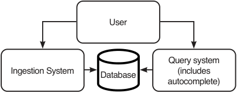
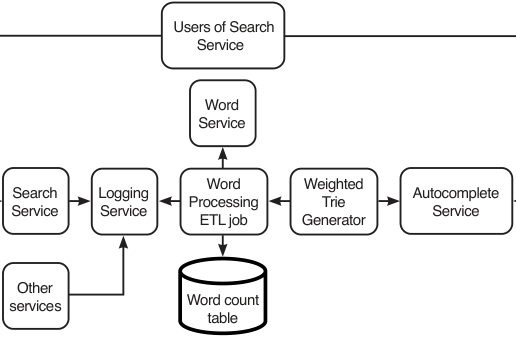
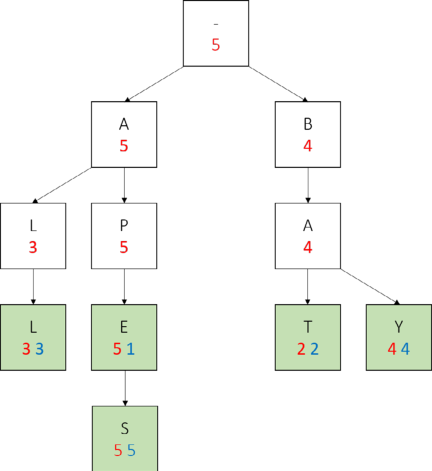
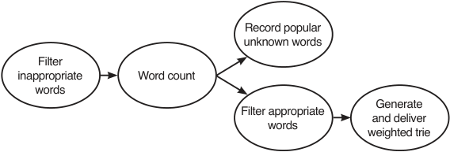
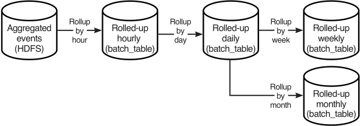
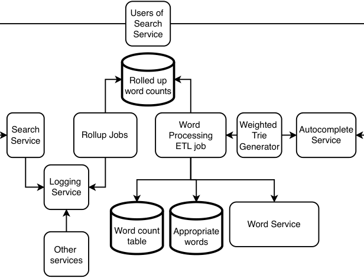

# _Design Autocomplete/Typeahead_

## _This chapter covers_

- Comparing autocomplete with search

- Separating data collection and processing from querying

- Processing a continuous data stream

- Dividing a large aggregation pipeline into

- stages to reduce storage costs

- Employing the byproducts of data processing pipelines for other purposes

We wish to design an autocomplete system. Autocomplete is a useful question to test a candidate’s ability to design a distributed system that continuously ingests and processes large amounts of data into a small (few MBs) data structure that users can query for a specific purpose. An autocomplete system obtains its data from strings submitted by up to billions of users and then processes this data into a weighted trie. When a user types in a string, the weighted trie provides them with autocomplete suggestions. We can also add personalization and machine learning elements to our autocomplete system.


## _11.1 Possible uses of autocomplete_

We first discuss and clarify the intended use cases of this system to ensure we determine the appropriate requirements. Possible uses of autocomplete include:

- Complements a search service. While a user enters a search query, the autocomplete service returns a list of autocomplete suggestions with each keystroke. If the user selects a suggestion, the search service accepts it and returns a list of results.

   - General search, such as Google, Bing, Baidu, or Yandex.

   - Search within a specific document collection. Examples include Wikipedia and video-sharing apps.

- A word processor may provide autocomplete suggestions. When a user begins typing a word, they may be provided autocomplete suggestions for common words that begin with the user’s currently entered prefix. Using a technique called fuzzy matching, the autocomplete feature can also be a spellcheck feature that suggests words with prefixes that closely match but are not identical to the user’s currently entered prefix.

- An integrated development environment (IDE) (for coding) may have an autocomplete feature. The autocomplete feature can record variable names or constant values within the project directory and provide them as autocomplete suggestions whenever the user declares a variable or constant. Exact matches are required (no fuzzy matching).

An autocomplete service for each of these use cases will have different data sources and architecture. A potential pitfall in this interview (or other system design interviews in general) is to jump to conclusions and immediately assume that this autocomplete service is for a search service, which is a mistake you may make because you are most familiar with the autocomplete used in a search engine like Google or Bing.

Even if the interviewer gives you a specific question like “Design a system that provides autocomplete for a general search app like Google,” you can spend half a minute discussing other possible uses of autocomplete. Demonstrate that you can think beyond the question and do not make hasty assumptions or jump to conclusions.

## _11.2 Search vs. autocomplete_

We must distinguish between autocomplete and search and not get their requirements mixed up. This way, we will design an autocomplete service rather than a search service. How is autocomplete similar and different from search? Similarities include the following:

- Both services attempt to discern a user’s intentions based on their search string and return a list of results sorted by most likely match to their intention.

- To prevent inappropriate content from being returned to users, both services may need to preprocess the possible results.


- Both services may log user inputs and use them to improve their suggestions/ results. For example, both services may log the results that are returned and which the user clicks on. If the user clicks on the first result, it indicates that this result is more relevant to that user.

Autocomplete is conceptually simpler than search. Some high-level differences are described in table 11.1. Unless the interviewer is interested, do not spend more than a minute dwelling on these differences in the interview. The point is to demonstrate critical thinking and your ability to see the big picture.

Table 11.1    Some differences between search and autocomplete


|Search|Autocomplete|
|---|---|
|||
|Results are usually a list of webpage URLs<br>or documents. These documents are prepro-<br>cessed to generate an index. During a search<br>query, the search string is matched to the<br>index to retrieve relevant documents.<br>P99 latency of a few seconds may be accept-<br>able. Higher latency of up to a minute may be<br>acceptable in certain circumstances.<br>Various result data types are possible, includ-<br>ing strings, complex objects, fles, or media.<br>Each result is given a relevance score.<br>Much effort is expended to compute rel-<br>evance scores as accurately as possible,<br>where accuracy is perceived by the user.<br>A search result may return any of the input<br>documents. This means every document<br>must be processed, indexed, and possible to<br>return in a search result. For lower complexity,<br>we may sample the contents of a document,<br>but we must process every single document.<br>May return hundreds of results.<br>A user can click on multiple results, by<br>clicking the “back” button and then clicking<br>another result. This is a feedback mechanism<br>we can draw many possible inferences from.|Results are lists of strings, generated based<br>on user search strings.<br>Low latency of ~100 ms P99 desired for good<br>user experience. Users expect suggestions<br>almost immediately after entering each<br>character.<br>Result data type is just string.<br>Does not always have a relevance score. For<br>example, an IDE’s autocomplete result list<br>may be lexicographically ordered.<br>Accuracy requirements (e.g., user clicks on<br>one of the frst few suggestions rather than<br>a later one) may not be as strict as search.<br>This is highly dependent on business require-<br>ments, and high accuracy may be required in<br>certain use cases.<br>If high accuracy is not required, techniques<br>like sampling and approximation algorithms<br>can be used for lower complexity.<br>Typically returns 5–10 results.<br>Different feedback mechanism. If none of the<br>autocomplete suggestions match, the user<br>fnishes typing their search string and then<br>submits it.|


## _11.3 Functional requirements_

We can have the following Q&A with our interviewer to discuss the functional requirements of our autocomplete system.

### _11.3.1 Scope of our autocomplete service_

We can first clarify some details of our scope, such as which use cases and languages should be supported:

- Is this autocomplete meant for a general search service or for other use cases like a word processor or IDE?

   - It is for suggesting search strings in a general search service.

- Is this only for English?

   - Yes.

- How many words must it support?

   - The Webster English dictionary has ~470K words (https://www.merriam-webster.com/help/faq-how-many-english-words),whilethe Oxford English dictionary has >171K words (https://www.lexico.com/explore/how-many-words-are-there-in-the-english-language).Wedon’tknowhowmanyof these words are at least 6 characters in length, so let’s not make any assumptions. We may wish to support popular words that are not in the dictionary, so let’s support a set of up to 100K words. With an average English word length of 4.7 (rounded to 5) letters and 1 byte/letter, our storage requirement is only 5 MB. Allowing manual (but not programmatic) addition of words and phrases negligibly increase our storage requirement.

NOTE    The IBM 350 RAMAC introduced in 1956 was the first computer with a 5 MB hard drive (https://www.ibm.com/ibm/history/exhibits/650/650_pr2.html). It weighed over a tonand occupied a footprint of 9 m (30 ft) by 15 m (50 ft). Programming was done in machine language and wire jumpers on a plugboard. There were no system design interviews back then.

### _11.3.2 Some UX details_

We can clarify some UX (user experience) details of the autocomplete suggestions, such as whether the autocomplete suggestions should be on sentences or individual words or how many characters a user should enter before seeing autocomplete suggestions:


- Is the autocomplete on words or sentences?

   - We can initially consider just words and then extend to phrases or sentences if we have time.

- Is there a minimum number of characters that should be entered before suggestions are displayed?

   - 3 characters sound reasonable.

- Is there a minimum length for suggestions? It’s not useful for a user to get suggestions for 4 or 5-letter words after typing in 3 characters, since those are just 1 or 2 more letters.

   - Let’s consider words with at least 6 letters.

- Should we consider numbers or special characters, or just letters?

   - Just letters. Ignore numbers and special characters.

- How many autocomplete suggestions should be shown at a time, and in what order?

   - Let’s display 10 suggestions at a time, ordered by most to least frequent. First, we can provide a suggestions API GET endpoint that accepts a string and returns a list of 10 dictionary words ordered by decreasing priority. Then we can extend it to also accept user ID to return personalized suggestions.

### _11.3.3 Considering search history_

We need to consider if the autocomplete suggestions should be based only on the user’s current input or on their search history and other data sources.

- Limiting the suggestions to a set of words implies that we need to process users’ submitted search strings. If the output of this processing is an index from which autocomplete suggestions are obtained, does previously processed data need to be reprocessed to include these manually added and removed words/phrases?

   - Such questions are indicative of engineering experience. We discuss with the interviewer that there will be a substantial amount of past data to reprocess. But why will a new word or phrase be manually added? It will be based on analytics of past user search strings. We may consider an ETL pipeline that creates tables easy to query for analytics and insights.

- What is the data source for suggestions? Is it just the previously submitted queries, or are there other data sources, such as user demographics?

   - It’s a good thought to consider other data sources. Let’s use only the submitted queries. Maybe an extensible design that may admit other data sources in the future will be a good idea.

- Should it display suggestions based on all user data or the current user data (i.e., personalized autocomplete)?

   - Let’s start with all user data and then consider personalization.


- What period should be used for suggestions?

   - Let’s first consider all time and then maybe consider removing data older than a year. We can use a cutoff date, such as not considering data before January 1 of last year.

### _11.3.4 Content moderation and fairness_

We can also consider other possible features like content moderation and fairness:

- How about a mechanism to allow users to report inappropriate suggestions? – That will be useful, but we can ignore it for now.

- Do we need to consider if a small subset of users submitted most of the searches? Should our autocomplete service try to serve the majority of users by processing the same number of searches per user?

   - No, let’s consider only the search strings themselves. Do not consider which users made them.

## _11.4 Non-functional requirements_

After discussing the functional requirements, we can have a similar Q&A to discuss the non-functional requirements. This may include a discussion of possible tradeoffs such as availability versus performance:

- It should be scalable so it can be used by a global user base.

- High availability is not needed. This is not a critical feature, so fault-tolerance can be traded off.

- High performance and throughput are necessary. Users must see autocomplete suggestions within half a second.

- Consistency is not required. We can allow our suggestions to be hours out of date; new user searches do not need to immediately update the suggestions.

- For privacy and security, no authorization or authentication is needed to use autocomplete, but user data should be kept private.

- Regarding accuracy, we can reason the following:

   - We may wish to return suggestions based on search frequency, so we can count the frequency of search strings. We can decide that such a count does not need to be accurate, and an approximation is sufficient in our first design pass. We can consider better accuracy if we have time, including defining accuracy metrics.

   - We will not consider misspellings or mixed-language queries. Spellcheck will be useful, but let’s ignore it in this question.


- Regarding potentially inappropriate words and phrases, we can limit the suggestions to a set of words, which will prevent inappropriate words, but not phrases. Let’s refer to them as “dictionary words,” even though they may include words that we added and not from a dictionary. If you like, we can design a mechanism for admins to manually add and remove words and phrases from this set.

- On how up to date the suggestions should be, we can have a loose requirement of 1 day.

## _11.5 Planning the high-level architecture_

We can begin the design thought process of a system design interview by sketching a very high-level initial architecture diagram such as figure 11.1. Users submit search queries, which the ingestion system processes and then stores in the database. Users receive autocomplete suggestions from our database when they are typing their search strings. There may be other intermediate steps before a user receives their autocomplete suggestions, which we label as the query system. This diagram can guide our reasoning process.





Figure 11.1    A very high-level initial architecture of our autocomplete service. Users submit their strings to the ingestion system, which are saved to the database. Users send requests to the query system for autocomplete suggestions. We haven’t discussed where the data processing takes place.

Next, we reason that we can break up the system into the following components:

- 1 Data ingestion

- 2 Data processing

- 3 Query the processed data to obtain autocomplete suggestions.

Data processing is generally more resource-intensive than ingestion. Ingestion only needs to accept and log requests and must handle traffic spikes. So, to scale up, we split the data processing system from the ingestion system. This is an example of the Command Query Responsibility Segregation (CQRS) design pattern discussed in chapter 1. Another factor to consider is that the ingestion system can actually be the search service’s logging service, that can also be the organization’s shared logging service.


## _11.6 Weighted trie approach and initial high-level architecture_

Figure 11.2 shows our initial high-level architecture of our Autocomplete System. Our Autocomplete System is not a single service but a system where users only query one service (the autocomplete service) and do not directly interact with the rest of the system. The rest of the system serves to collect users’ search strings and periodically generate and deliver a weighted trie to our autocomplete service.

The shared logging service is the raw data source from which our autocomplete service derives the autocomplete suggestions that it provides to its users. Search service users send their queries to the search service, which logs them to the logging service. Other services also log to this shared logging service. The autocomplete service may query the logging service for just the search service logs or other services’ logs, too, if we find those useful to improve our autocomplete suggestions.





Figure 11.2    Initial high-level architecture of our Autocomplete System. Users of our search service submit their search strings to the search service, and these strings are logged to a shared logging service. The Word Processing ETL job may be a batch or streaming job that reads and processes the logged search strings. The weighted trie generator reads the word counts and generates the weighted trie and then sends it to the autocomplete service, from which users obtain autocomplete suggestions.

The shared logging service should have an API for pulling log messages based on topic and timestamp. We can tell the interviewer that its implementation details, such as which database it uses (MySQL, HDFS, Kafka, Logstash, etc.), are irrelevant to our current discussion, since we are designing the autocomplete service, not our organization’s shared logging service. We add that we are prepared to discuss the implementation details of a shared logging service if necessary.

Users retrieve autocomplete suggestions from the autocomplete service’s backend. Autocomplete suggestions are generated using a weighted trie, illustrated in figure 11.3. When a user enters a string, the string is matched with the weighted trie. The result list is generated from the children of the matched string, sorted by decreasing weight. For example, a search string “ba” will return the result [“bay”, “bat”]. “bay” has a weight of 4 while “bat” has a weight of 2, so “bay” is before “bat.”





Figure 11.3    A weighted trie of the words “all”, “apes,” “bat,” and “bay.” (Source: https://courses.cs.duke.edu/cps100/spring16/autocomplete/trie.html.)

We shall now discuss the detailed implementation of these steps.

## _11.7 Detailed implementation_

The weighted trie generator can be a daily batch ETL pipeline (or a streaming pipeline if real-time updates are required). The pipeline includes the word processing ETL job. In figure 11.2, the word processing ETL job and weighted trie generator are separate pipeline stages because the word processing ETL job can be useful for many other purposes and services, and having separate stages allows them to be implemented, tested, maintained, and scaled independently.

Our word count pipeline may have the following tasks/steps, illustrated as a DAG in figure 11.4:

- 1 Fetch the relevant logs from the search topic of the logging service (and maybe other topics) and place them in a temporary storage.

- 2 Split the search strings into words.

- 3 Filter out inappropriate words.

- 4 Count the words and write to a word count table. Depending on required accuracy, we can count every word or use an approximation algorithm like count-min sketch (described in section 17.7.1).

- 5 Filter for appropriate words and record popular unknown words.

- 6 Generate the weighted trie from the word count table.

- 7 Send the weighted trie to our backend hosts.





Figure 11.4   DAG of our word count pipeline. Recording popular unknown words and filtering appropriate words can be done independently.

We can consider various database technologies for our raw search log:

- An Elasticsearch index partitioned by day, part of a typical ELK stack, with a default retention period of seven days.

- The logs of each day can be an HDFS file (i.e., partitioned by day). User searches can be produced to a Kafka topic with a retention period of a few days (rather than just one day, in case we need to look at older messages for any reason). At a certain set time each day, the first pipeline stage will consume messages until it reaches a message with a timestamp more recent than the set time (this means it consumes one additional message, but this slight imprecision is fine) or until the topic is empty. The consumer creates a new HDFS directory for the partition corresponding to that date and appends all messages to a single file within that directory. Each message can contain a timestamp, user ID, and the search string. HDFS does not offer any mechanism to configure a retention period, so for those choices, we will need to add a stage to our pipeline to delete old data.

- SQL is infeasible because it requires all the data to fit into a single node.

Let’s assume that the logging service is an ELK service. As mentioned in section 4.3.5, HDFS is a common storage system for the MapReduce programming model. We use the MapReduce programming model to parallelize data processing over many nodes. We can use Hive or Spark with HDFS. If using Hive, we can use Hive on Spark (https:// spark.apache.org/docs/latest/sql-data-sources-hive-tables.html), so both our Hive or Spark approaches are actually using Spark. Spark can read and write from HDFS into memory and process data in memory, which is much faster than processing on disk. In subsequent sections, we briefly discuss implementations using Elasticsearch, Hive, and Spark. A thorough discussion of code is outside the scope of a system design interview, and a brief discussion suffices.

This is a typical ETL job. In each stage, we read from the database storage of the previous stage, process the data, and write to the database storage to be used by the next stage.


### _11.7.1 Each step should be an independent task_

Referring again to the batch ETL DAG in figure 11.4, why is each step an independent stage? When we first develop an MVP, we can implement the weighted trie generation as a single task and simply chain all the functions. This approach is simple, but not maintainable. (Complexity and maintainability seem to be correlated, and a simple system is usually easier to maintain, but here we see an example where there are tradeoffs.)

We can implement thorough unit testing on our individual functions to minimize bugs, implement logging to identify any remaining bugs that we encounter in production, and surround any function that may throw errors with try-catch blocks and log these errors. Nonetheless, we may miss certain problems, and if any error in our weighted trie generation crashes the process, the entire process needs to restart from the beginning. These ETL operations are computationally intensive and may take hours to complete, so such an approach has low performance. We should implement these steps as separate tasks and use a task scheduler system like Airflow, so each task only runs after the previous one successfully completes.

### _11.7.2 Fetch relevant logs from Elasticsearch to HDFS_

For Hive, we can use a `CREATE EXTERNAL TABLE` command (https://www.elastic.co/guide/en/elasticsearch/hadoop/current/hive.html#_reading_data_from_elasticsearch) to define a Hive table on our Elasticsearch topic. Next, we can write the logs to HDFS using a Hive command like:

```sql
INSERT OVERWRITE DIRECTORY '/path/to/output/dir'
SELECT * FROM Log
WHERE created_at = date_sub(current_date, 1);
```

(This command assumes we want yesterday’s logs.)

For Spark, we can use the SparkContext esRDD method (https://www.elastic.co/guide/en/elasticsearch/hadoop/current/spark.html#spark-read) to connect to our Elasticsearch topic, followed by a Spark filter query (https://spark.apache.org/docs/latest/api/sql/index.html#filter) to read the data for the appropriate dates, and then write to HDFS using the Spark saveAsTextFile function (https://spark.apache.org/docs/latest/api/scala/org/apache/spark/api/java/JavaRDD.html#saveAsTextFile(path:String):Unit).

During an interview, even if we don’t know that Hive or Spark has Elasticsearch integrations, we can tell our interviewer that such integrations may exist because these are popular mainstream data platforms. If such integrations don’t exist, or if our interviewer asks us to, we may briefly discuss how to code a script to read from one platform and write to another. This script should take advantage of each platform’s parallel processing capabilities. We may also discuss partitioning strategies. In this step, the input/logs may be partitioned by service, while the output is partitioned by date. During this stage, we can also trim whitespace from both ends of the search strings.

### _11.7.3 Split the search strings into words and other simple operations_

Next, we split the search strings by whitespace with the split function. (We may also need to consider common problems like the users omitting spaces (e.g., “HelloWorld”) or using other separators like a period, dash, or comma. In this chapter, we assume that these problems are infrequent, and we can ignore them. We may wish to do analytics on the search logs to find out how common these problems actually are.) We will refer to these split strings as “search words.” Refer to https://cwiki.apache.org/confluence/display/Hive/LanguageManual+UDF#LanguageManualUDF-StringFunctions for Hive’s split function and https://spark.apache.org/docs/latest/api/sql/index.html#split for Spark’s split function. We read from the HDFS file in the previous step and then split the strings.

At this stage, we can also perform various simple operations that are unlikely to change over the lifetime of our system, such as filtering for strings that are at least six characters long and contain only letters (i.e., no numbers or special characters), and lowercasing all strings so we will not have to consider case in further processing. We then write these strings as another HDFS file.

### _11.7.4 Filter out inappropriate words_

We will consider these two parts in filtering for appropriate words or filtering out inappropriate words:

- 1 Managing our lists of appropriate and inappropriate words.

- 2 Filtering our list of search words against our lists of appropriate and inappropriate words.

#### words service

Our words service has API endpoints to return sorted lists of appropriate or inappropriate words. These lists will be at most a few MB and are sorted to allow binary search. Their small size means that any host that fetches the lists can cache them in memory in case the words service is unavailable. Nonetheless, we can still use our typical horizontally scaled architecture for our words service, consisting of stateless UI and backend services, and a replicated SQL service as discussed in section 3.3.2. Figure 11.5 shows our high-level architecture of our words service, which is a simple application to read and write words to a SQL database. The SQL tables for appropriate and inappropriate words may contain a string column for words, and other columns that provide information such as the timestamp when the word was added to the table, the user who added this word, and an optional string column for notes such as why the word was appropriate or inappropriate. Our words service provides a UI for admin users to view the lists of appropriate and inappropriate words and manually add or remove words, all of which are API endpoints. Our backend may also provide endpoints to filter words by category or to search for words.


Figure 11.5    High-level architecture of our words service


#### filtering out inappropriate words

Our word count ETL pipeline requests our words service for the inappropriate words and then writes this list to an HDFS file. We might already have an HDFS file from a previous request. Our words service admins might have deleted certain words since then, so the new list might not have the words that are present in our old HDFS file. HDFS is append-only, so we cannot delete individual words from the HDFS file but instead must delete the old file and write a new file.

With our HDFS file of inappropriate words, we can use the `LOAD DATA` command to register a Hive table on this file and then filter out inappropriate words with a simple query such as the following and then write the output to another HDFS file.

We can determine which search strings are inappropriate words using a distributed analytics engine such as Spark. We can code in PySpark or Scala or use a Spark SQL query to JOIN the users’ words with the appropriate words.

In an interview, we should spend less than 30 seconds on an SQL query to scribble down the important logic as follows. We can briefly explain that we want to manage our 50 minutes well, so we do not wish to spend precious minutes to write a perfect SQL query. The interviewer will likely agree that this is outside the scope of a system design interview, that we are not there to display our SQL skills, and allow us to move on. A possible exception is if we are interviewing for a data engineer position:

- Filters, such as WHERE clauses

- JOIN conditions

- Aggregations, such as AVG, COUNT, DISTINCT, MAX, MIN, PERCENTILE, RANK, ROW_NUMBER, etc.

```sql
SELECT word
FROM words
WHERE word NOT IN (SELECT word FROM inappropriate_words);
```


Since our inappropriate words table is small, we can use a _map join_ (mappers in a MapReduce job perform the join. Refer to https://cwiki.apache.org/confluence/display/hive/languagemanual+joins)forfasterperformance:

```sql
SELECT /*+ MAPJOIN(i) */ w.word
FROM words w
LEFT OUTER JOIN inappropriate_words i
ON i.word = w.word
WHERE i.word IS NULL;
```


_Broadcast hash join_ in Spark is analogous to map join in Hive. A broadcast hash join occurs between a small variable or table that can fit in memory of each node (in Spark, this is set in the `spark.sql.autoBroadcastJoinThreshold` property, which is 10 MB by default), and a larger table that needs to be divided among the nodes. A broadcast hash join occurs as follows:

- 1 Create a hash table on the smaller table, where the key is the value to be joined on and the value is the entire row. For example, in our current situation, we are joining on a word string, so a hash table of the inappropriate_words table that has the columns (“word,” “created_at,” “created_by”) may contain entries like


   - {(“apple”, (“apple”, 1660245908, “brad”)), (“banana”, (“banana”, 1550245908, “grace”)), (“orange”, (“orange”, 1620245107, “angelina”)) . . . }.

- 2 Broadcast/copy this hash table to all nodes performing the join operation.

- 3 Each node JOINs the smaller table to the node’s portion of the larger table.

If both tables cannot fit in memory, a shuffled sort merge join is done, where both datasets are shuffled, the records are sorted by key, and a merge join is done where both sides are iterated and joined based on the join key. This approach assumes that we don’t need to keep statistics on inappropriate words. Here are some resources for further reading on Spark joins:

- https://spark.apache.org/docs/3.3.0/sql-performance-tuning.html#join-strategy-hints-for-sql-queriesorhttps://spark.apache.org/docs/3.3.0/rdd-programming-guide.html#broadcast-variables.The official Spark documentation for the various Spark JOIN strategies to improve JOIN performance. It states the various JOIN strategies available but does not discuss their detailed mechanisms. Refer to the resources below for thorough discussions.

- https://spark.apache.org/docs/3.3.0/sql-performance-tuning.html#join-strategy-hints-for-sql-queries-Damiji, J. et al. A Family of Spark Joins. In _Learning Spark, 2[nd] Edition._ O’Reilly Media, 2020.

- Chambers, B. and Zaharia, M. Joins. _In Spark: The Definitive Guide: Big Data Processing Made Simple._ O’Reilly Media, 2018.

- https://docs.qubole.com/en/latest/user-guide/engines/hive/hive-mapjoin-options.html-https://towardsdatascience.com/strategies-of-spark-join-c0e7b4572bcf

###_11.7.5 Fuzzy matching and spelling correction_

A final processing step before we count the words is to correct misspellings in users’ search words. We can code a function that accepts a string, uses a library with a _fuzzy matching_ algorithm to correct possible misspelling, and returns either the original string or fuzzy-matched string. (Fuzzy matching, also called approximate string matching, is the technique of finding strings that match a pattern approximately. An overview of fuzzy matching algorithms is outside the scope of this book.) We can then use Spark to run this function in parallel over our list of words divided into evenly sized sublists and then write the output to HDFS.

This spelling correction step is its own independent task/stage because we have multiple fuzzy matching algorithms and libraries or services to choose from, so we may choose a particular algorithm to optimize for our requirements. Keeping this stage separate allows us to easily switch between a library or service for fuzzy matching, as changes to this pipeline stage will not affect the other stages. If we use a library, we may need to update it to keep up with changing trends and popular new words.


### _11.7.6 Count the words_

We are now ready to count the words. This can be a straightforward MapReduce operation, or we can use an algorithm like count-min sketch (refer to section 17.7.1).

The Scala code below implements the MapReduce approach. This code was slightly modified from https://spark.apache.org/examples.html. Wemapthewordsinthe input HDFS file to (`String, Int`) pairs called `counts`, sort by descending order of counts and then save it as another HDFS file:

```scala val textFile = sc.textFile("hdfs://...")
val counts = textFile.map(word => (word, 1))
                     .reduceByKey(_ + _)
                     .map(item => item.swap)
                     .sortByKey(false)
                     .map(item => item.swap)
counts.saveAsTextFile("hdfs://...")
```

### _11.7.7 Filter for appropriate words_

The word-counting step should significantly reduce the number of words to be filtered. Filtering for appropriate words is very similar to filtering for inappropriate words in section 11.7.4.

We can use a simple Hive command such as:

```sql
SELECT word
FROM counted_words
WHERE word IN (SELECT word FROM appropriate_words);
```
 to filter for appropriate words, or a Map Join or broadcast hash join such as:

```sql
SELECT /*+ MAPJOIN(a) */ c.word
FROM counted_words c JOIN appropriate_words a
ON c.word = a.word;
```

### _11.7.8 Managing new popular unknown words_

After counting the words in the previous step, we may find new popular words in the top 100, which were previously unknown to us. In this stage, we write these words to the Words Service, which can write them to a SQL unknown_words table. Similar to section 11.7.4, our words service provides UI features and backend endpoints to allow operations staff to manually choose to add these words to the lists of appropriate or inappropriate words.

As illustrated in our word count batch ETL job DAG in figure 11.4, this step can be done independently and in parallel with the filtering for appropriate words.

### _11.7.9 Generate and deliver the weighted trie_

We now have the list of top appropriate words to construct our weighted trie. This list is only a few MB, so the weighted trie can be generated on a single host. The algorithm to construct a weighted trie is outside the scope of a system design interview. It is a possible coding interview question. A partial Scala class definition is as follows, but we code in the language of our backend:

```scala class TrieNode(var children: Array[TrieNode], var weight: Int) {
  // Functions for
}
```
- // - create and return a Trie node.

- // - insert a node into the Trie.

- // - getting the child with the highest weight.

}


We serialize the weighted trie to JSON. The trie is a few MB in size, which may be too large to be downloaded to the client each time the search bar is displayed to the user but is small enough to replicate to all hosts. We can write the trie to a shared object store such as AWS S3 or a document database such as MongoDB or Amazon DocumentDB. Our backend hosts can be configured to query the object store daily and fetch the updated JSON string. The hosts can query at random times, or they can be configured to query at the same time with some jitter to prevent a large number of simultaneous requests from overwhelming the object store.

If a shared object is large (e.g., gigabytes), we should consider placing it in a CDN. Another advantage of this small trie is that a user can download the entire trie when they load our search app, so the trie lookup is client-side rather than server-side. This greatly reduces the number of requests to our backend, which has advantages such as the following:

- If the network is unreliable or slow, a user may sporadically not get suggestions as they enter their search string, which is a poor user experience.

- When the trie is updated, a user that is in the middle of typing in a search string may notice the change. For example, if the strings in the old trie were related in some way, the new trie may not possess these relationships, and the user notices this sudden change. Or if the user does backspace on a few characters, they may notice the suggestions are different from before.

If we have a geographically distributed user base, network latency becomes unacceptable, given our requirement for high performance. We can provision hosts in multiple data centers, though this may be costly and introduce replication lag. A CDN is a cost-effective choice.

Our autocomplete service should provide a PUT endpoint to update its weighted trie, which this stage will use to deliver the generated weighted trie to our autocomplete service.

## _11.8 Sampling approach_

If our autocomplete does not require high accuracy, we should do sampling, so most of the operations to generate the weighted trie can be done within a single host, which has many advantages including the following:

- The trie will be generated much faster.

- As the trie can be generated much faster, it will be easier test code changes before deploying them to the production environment. The overall system will be easier to develop, debug, and maintain.

- Consumes much less hardware resources, including processing, storage, and network.


Sampling can be done at most steps:

- 1 Sampling the search strings from the logging service. This approach has the lowest accuracy but also the lowest complexity. We may need a large sample to obtain a statistically significant number of words, which are at least six characters long.

- 2 Sampling words after splitting the search strings to individual words and filtering for words that are at least six characters long. This approach avoids the computational expense of filtering for appropriate words, and we may not need as large a sample as the previous approach.

- 3 Sampling words after filtering for appropriate words. This approach has the highest accuracy but also the highest complexity.

## _11.9 Handling storage requirements_

Based on our high-level architecture, we can create tables with the following columns, using each table to populate the next:

- 1 Raw search requests with timestamp, user ID, and search string. This table can be used for many other purposes besides autocomplete (e.g., analytics to discover user interests and trending search terms).

- 2 After splitting the raw search strings, the individual words can be appended to a table that contains columns for date and word.

- 3 Determine which search strings are dictionary words and generate a table that contains date (copied from the previous table), user ID, and dictionary word.

- 4 Aggregate the dictionary words into a table of word counts.

- 5 Create a weighted trie to provide autocomplete suggestions.

Let’s estimate the amount of storage required. We assume one billion users; each user submits 10 searches daily with an average of 20 characters per search. Each day, there may be approximately 1B * 10 * 20 = 200 GB of search strings. We may delete old data once a month, so at any time we have up to 12 months of data, so the search log will need 200 GB * 365 = 73 TB just for the search strings column. If we wish to reduce storage costs, we can consider various ways.

One way is to trade off accuracy, by using approximation and sampling techniques. For example, we may sample and store only ~10% of user searches and generate the trie only on this sample.

Another way is illustrated in figure 11.6. Figure 11.6 illustrates a batch ETL job that aggregates and roll up data at various periods to reduce the amount of data stored. At each stage, we can overwrite the input data with the rolled-up data. At any time, we will have up to one day of raw data, four weeks of data rolled up by week, and 11 months of data rolled up by month. We can further reduce storage requirements by keeping only the top 10% or 20% most frequent strings from each rollup job.





Figure 11.6    Flow diagram of our batch pipeline. We have a rollup job that progressively rolls up by increasing time intervals to reduce the number of rows processed in each stage.

This approach also improves scalability. Without the rollup job, a word count batch ETL job will need to process 73 TB of data, which will take many hours and be monetarily expensive. The rollup job reduces the amount of data processed for the final word count used by the weighted trie generator.

We can set a short retention period on logging service, such as 14–30 days, so its storage requirement will be just 2.8–6 TB. Our daily weighted trie generator batch ETL job can be done on the weekly or monthly rolled up data. Figure 11.7 illustrates our new high-level architecture with the rollup jobs.





Figure 11.7    High-level architecture of our Autocomplete System with the rollup jobs. By aggregating/ rolling up word counts over progressively larger intervals, we can reduce overall storage requirements, and the cluster size of the word processing ETL job.


## _11.10 Handling phrases instead of single words_

In this section, we discuss a couple of considerations for extending our system to handle phrases instead of single words. The trie will become bigger, but we can still limit it to a few MB by keeping only the most popular phrases.

### _11.10.1 Maximum length of autocomplete suggestions_

We can keep to our previous decision that autocomplete suggestions should have a minimum length of five characters. But what should be the maximum length of autocomplete suggestions? A longer maximum length will be most useful to users but comes with cost and performance tradeoffs. Our system will need more hardware resources or take longer to log and process longer strings. The trie may also become too big.

We must decide on the maximum length. This may vary by language and culture. Certain languages like Arabic are more verbose than English. We only consider English in our system, but we should be ready to extend to other languages if this becomes a functional requirement.

One possible solution is to implement a batch ETL pipeline to find the 90th percentile length of our users’ search strings and use this as the maximum length. To calculate a median or percentile, we sort the list and then pick the value in the appropriate position. Calculating median or percentile in a distributed system is outside the scope of this book. We may instead simply sample the search strings and compute the 90th percentile.

We may also decide that doing analytics for this decision is overengineering, and we can instead apply simple heuristics. Start with 30 characters and change this number according to user feedback, performance, and cost considerations.

### _11.10.2 Preventing inappropriate suggestions_

We will still need to filter out inappropriate words. We may decide the following:

- If a phrase contains a single inappropriate word, we filter out the entire phrase.

- No longer filter for appropriate words but give autocomplete suggestions for any word or phrase.

- Do not correct misspelled words in phrases. Assume that misspellings are sufficiently uncommon that they will not appear in autocomplete suggestions. We also assume that popular phrases will mostly be spelled correctly, so they will appear in autocomplete suggestions.

The difficult challenge is the need to filter out inappropriate phrases, not just inappropriate words. This is a complex problem to which even Google has not found a complete solution (https://algorithmwatch.org/en/auto-completion-disinformation/),duetothesheervastness of the problem space. Possible inappropriate autocomplete suggestions include:


- Discrimination or negative stereotypes on religion, gender, and other groups.

- Misinformation, including political misinformation such as conspiracy theories on climate change or vaccination or misinformation driven by business agendas.

- Libel against prominent individuals, or defendants in legal proceedings where no verdict has been reached.

Current solutions use a combination of heuristics and machine learning.

## _11.11 Logging, monitoring, and alerting_

Besides the usual actions in chapter 9, we should log searches that don’t return any autocomplete results, which is indicative of bugs in our trie generator.

## _11.12 Other considerations and further discussion_

Here are other possible requirements and discussion points that may come up as the interview progresses:

- There are many common words longer than three letters, such as “then,” “continue,” “hold,” “make,” “know,” and “take.” Some of these words may consistently be in the list of most popular words. It may be a waste of computational resources to keep counting popular words. Can our Autocomplete System keep a list of such words, and use approximation techniques to decide which ones to return when a user enters an input?

- As mentioned earlier, these user logs can be used for many other purposes besides autocomplete. For example, this can be a service that provides trending search terms, with applications to recommender systems.

- Design a distributed logging service.

- Filtering inappropriate search terms. Filtering inappropriate content is a general consideration of most services.

- We can consider other data inputs and processing to create personalized autocomplete.

- We can consider a Lambda architecture. A Lambda architecture contains a fast pipeline, so user queries can quickly propagate to the weighted trie generator, such as in seconds or minutes, so the autocomplete suggestions are updated quickly with a tradeoff in accuracy. A Lambda architecture also contains a slow pipeline for accurate but slower updates.

- Graceful degradation for returning outdated suggestions if upstream components are down.

- A rate limiter in front of our service to prevent DoS attacks.

- A service that is related but distinct from autocomplete is a spelling suggestion service, where a user receives word suggestions if they input a misspelled word. We can design a spelling suggestion service that uses experimentation techniques such as A/B testing or multi-armed bandit to measure the effect of various fuzzy matching functions on user churn.


## _Summary_

- An autocomplete system is an example of a system that continuously ingests and processes large amount of data into a small data structure that users query for a specific purpose.

- Autocomplete has many use cases. An autocomplete service can be a shared service, used by many other services.

- Autocomplete has some overlap with search, but they are clearly for different purposes. Search is for finding documents, while autocomplete is for suggesting what the user intends to input.

- This system involves much data preprocessing, so the preprocessing and querying should be divided into separate components and then they can be independently developed and scaled.

- We can use the search service and logging service as data inputs for our autocomplete service. Our autocomplete service can process the search strings that these services record from users and offer autocomplete suggestions from these strings.

- Use a weighted trie for autocomplete. Lookups are fast and storage requirements are low.

- Break up a large aggregation job into multiple stages to reduce storage and processing costs. The tradeoff is high complexity and maintenance.

- Other considerations include other uses of the processed data, sampling, filtering content, personalization, Lambda architecture, graceful degradation, and rate limiting.


