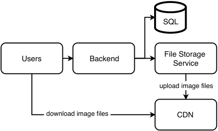
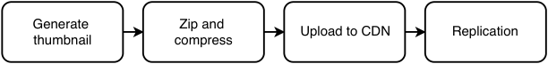
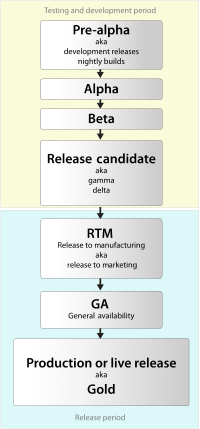
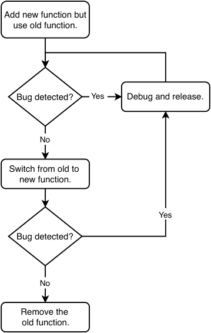
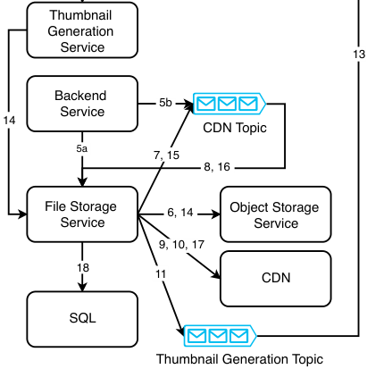
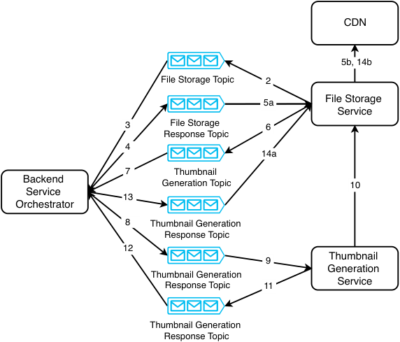

# _Design Flickr_

## _This chapter covers_

- Selecting storage services based on

- non-functional requirements

- Minimizing access to critical services

- Utilizing sagas for asynchronous processes

In this chapter, we design an image sharing service like Flickr. Besides sharing files/ images, users can also append metadata to files and other users, such as access control, comments, or favorites.

Sharing and interacting with images and video are basic functionalities in virtually every social application and is a common interview topic. In this chapter, we discuss a distributed system design for image-sharing and interaction among a billion users, including both manual and programmatic users. We will see that there is much more than simply attaching a CDN. We will discuss how to design the system for scalable preprocessing operations that need to be done on uploaded content before they are ready for download.


## _12.1 User stories and functional requirements_

Let’s discuss user stories with the interviewer and scribble them down:

- A user can view photos shared by others. We refer to this user as a _viewer_ .

- Our app should generate and display thumbnails of 50 px width. A user should view multiple photos in a grid and can select one at a time to view the full-resolution version.

- A user can upload photos. We refer to this user as a _sharer_ .

- A sharer can set access control on their photos. A question we may ask is whether access control should be at the level of individual photos or if a sharer may only allow a viewer to view either all the former’s photos or none. We choose the latter option for simplicity.

- A photo has predefined metadata fields, which have values provided by the

   - sharer. Example fields are location or tags.

- An example of dynamic metadata is the list of viewers who have read access to the

   - file. This metadata is dynamic because it can be changed.

- Users can comment on photos. A sharer can toggle commenting on and off. A user can be notified of new comments.

- A user can favorite a photo.

- A user can search on photo titles and descriptions.

- Photos can be programmatically downloaded. In this discussion, “view a photo” and “download a photo” are synonymous. We do not discuss the minor detail of whether users can download photos onto device storage.

- We briefly discuss personalization.

These are some points that we will not discuss:

- A user can filter photos by photo metadata. This requirement can be satisfied by a simple SQL path parameter, so we will not discuss it.

- Photo metadata that is recorded by the client, such as location (from hardware such as GPS), time (from the device’s clock), and details of the camera (from the operating system).

- We will not discuss video. Discussions of many details of video (such as codecs) require specialized domain knowledge that is outside the scope of a general system design interview.

## _12.2 Non-functional requirements_

Here are some questions we may discuss on non-functional requirements:

- How many users and downloads via API do we expect?

   - Our system must be scalable. It should serve one billion users distributed across the world. We expect heavy traffic. Assume 1% of our users (10 million)

 upload 10 high-resolution (10 MB) images daily. This works out to 1 PB of uploads daily, or 3.65 EB over 10 years. The average traffic is over 1 GB/second, but we should expect traffic spikes, so we should plan for 10 GB/second.

- Do the photos have to be available immediately after upload? Does deletion need to be immediate? Must privacy setting changes take immediate effect?

   - Photos can take a few minutes to be available to our entire user base. We can trade off certain non-functional characteristics for lower cost, such as consistency or latency, and likewise for comments. Eventual consistency is acceptable.

   - Privacy settings must be effective sooner. A deleted photo does not have to be erased from all our storage within a few minutes; a few hours is permissible. However, it should be inaccessible to all users within a few minutes.

- High-resolution photos require high network speeds, which may be expensive. How may we control costs?

   - After some discussion, we have decided that a user should only be able to download one high-resolution photo at a time, but multiple low-resolution thumbnails can be downloaded simultaneously. When a user is uploading files, we can upload them one at a time.

Other non-functional requirements are

- High availability, such as five 9s availability. There should be no outages that prevent users from downloading or uploading photos.

- High performance and low latency of 1-second P99 for thumbnails downloads; this is not needed for high-resolution photos.

- High performance is not needed for uploads.

A note regarding thumbnails is that we can use the CSS `img` tag with either the `width` (https://developer.mozilla.org/en-US/docs/Web/HTML/Element/img#attr-width)or `height` attributes to display thumbnails from full-resolution images. Mobile apps have similar markup tags. This approach has high network costs and is not scalable. To display a grid of thumbnails on the client, every image needs to be downloaded in its full resolution. We can suggest to the interviewer to implement this in our MVP (minimum viable product). When we scale up our service to serve heavy traffic, we can consider two possible approaches to generate thumbnails.

The first approach is for the server to generate a thumbnail from the full-resolution image each time a client requests a thumbnail. This will be scalable if it was computationally inexpensive to generate a thumbnail. However, a full-resolution image file is tens of MB in size. A viewer will usually request a grid of >10 thumbnails in a single request. Assuming a full-resolution image is 10 MB (it can be much bigger), this means the server will need to process >100 MB of data in much less than one second to fulfill a 1-second P99. Moreover, the viewer may make many such requests within a few seconds as they scroll through thumbnails. This may be computationally feasible if the storage and processing are done on the same machine, and that machine uses SSD hard disks and not spinning hard disks. But this approach will be prohibitively expensive. Moreover, we will not be able to do functional partitioning of processing and storage into separate services. The network latency of transferring many GBs between the processing and storage services every second will not allow 1-second P99. So, this approach is not feasible overall.

The only scalable approach is to generate and store a thumbnail just after the file is uploaded and serve these thumbnails when a viewer requests them. Each thumbnail will only be a few KBs in size, so storage costs are low. We can also cache both thumbnails and full-resolution image files on the client, to be discussed in section 12.7. We discuss this approach in this chapter.

## _12.3 High-level architecture_

Figure 12.1 shows our initial high-level architecture. Both sharers and viewers make requests through a backend to upload or download image files. The backend communicates with an SQL service.





Figure 12.1    Our initial high-level architecture of our image-sharing service. Our users can download image files directly from a CDN. Uploads to the CDN can be buffered via a separate distributed file storage service. We can store other data such as user information or image file access permissions in SQL.

The first is a CDN for image files and image metadata (each image metadata is a formatted JSON or YAML string). This is most likely a third-party service.

Due to reasons including the following, we may also need a separate distributed file storage service for sharers to upload their image files, and this service handles interactions with the CDN. We can refer to this as our file storage service.

- Depending on our SLA contract with our CDN provider, our CDN may take up to a few hours to replicate images to its various data centers. During that time, it may be slow for our viewers to download this image, especially if there is a high rate of download requests because many viewers wish to download it.

- The latency of uploading an image file to the CDN may be unacceptably slow to a sharer. Our CDN may not be able to support many sharers simultaneously uploading images. We can scale our file storage service as required to handle high upload/write traffic.

- We can either delete files from the file storage service after they are uploaded to the CDN, or we may wish to retain them as a backup. A possible reason to choose the latter may be that we don’t want to completely trust the CDN’s SLA and may wish to use our file storage service as a backup for our CDN should the latter experience outages. A CDN may also have a retention period of a few weeks or months, after which it deletes the file and downloads it again if required from a designated origin/source. Other possible situations may include the sudden requirement to disconnect our CDN because we suddenly discover that it has security problems.

## _12.4 SQL schema_

We use an SQL database for dynamic data that is shown on the client apps, such as which photos are associated to which user. We can define the following SQL table schema in listing 12.1. The Image table contains image metadata. We can assign each sharer its own CDN directory, which we track using the ImageDir table. The schema descriptions are included in the CREATE statement.

Listing 12.1    SQL CREATE statements for the Image and ImageDir tables

```sql
CREATE TABLE Image (
    cdn_path VARCHAR(255) PRIMARY KEY COMMENT="Image file path on the CDN.", cdn_photo_key VARCHAR(255) NOT NULL UNIQUE COMMENT="ID assigned by the CDN.", file_key VARCHAR(255) NOT NULL UNIQUE COMMENT="ID assigned by our File Storage Service.", resolution ENUM('thumbnail', 'hd') COMMENT="Indicates the image is a thumbnail or high resolution", owner_id VARCHAR(255) NOT NULL COMMENT="ID of the user who owns the image.", is_public BOOLEAN NOT NULL DEFAULT 1 COMMENT="Indicates if the image is public or private.",
    INDEX thumbnail (Resolution, UserId) COMMENT="Composite index on resolution and user ID."
) COMMENT="Image metadata.";

CREATE TABLE ImageDir (
    cdn_dir VARCHAR(255) PRIMARY KEY COMMENT="CDN directory assigned to the user.", user_id INTEGER NOT NULL COMMENT="User ID."
) COMMENT="Record the CDN directory assigned to each sharer.";
```

As fetching photos by user ID and resolution is a common query, we index our tables by these fields. We can follow the approaches discussed in chapter 4 to scale SQL reads.


We can define the following schema to allow a sharer to grant a viewer permission to view the former’s photos and a viewer to favorite photos. An alternative to using two tables is to define an `is_favorite` Boolean column in the Share table, but the tradeoff is that it will be a sparse column that uses unnecessary storage:

```sql
CREATE TABLE Share (
    id            INT PRIMARY KEY, cdn_photo_key VARCHAR(255), user_id       VARCHAR(255)
);

CREATE TABLE Favorite (
    id            INT PRIMARY KEY, cdn_photo_key VARCHAR(255) NOT NULL UNIQUE, user_id       VARCHAR(255) NOT NULL UNIQUE
);
```


## _12.5 Organizing directories and files on the CDN_

Let’s discuss one way to organize CDN directories. A directory hierarchy can be user > album > resolution > file. We can also consider date because a user may be more interested in recent files.

Each user has their own CDN directory. We may allow a user to create albums, where each album has 0 or more photos. Mapping of albums to photos is one-to-many; that is, each photo can only belong to one album. On our CDN, we can place photos not in albums in an album called “default.” So, a user directory may have one or more album directories.

An album directory can store the several files of the image in various resolutions, each in its own directory, and a JSON image metadata file. For example, a directory “original” may contain an originally-uploaded file “swans.png,” and a directory “thumbnail” may contain the generated thumbnail “swans_thumbnail.png.”

A CdnPath value template is <album_name>/<resolution>/<image_name.extension>. The user ID or name is not required because it is contained in the UserId field.

For example, a user with username “alice” may create an album named “nature,” inside which they place an image called “swans.png.” The CdnPath value is “nature/ original/swans.png.” The corresponding thumbnail has CdnPath “nature/thumbnail/ swans_thumbnail.png.” The tree command on our CDN will show the following. “bob” is another user:

$ tree ~ | head -n 8 . ├── alice │ └── nature │ ├── original │ │   └── swans.png │ └── thumbnail │ └── swans_thumbnail.png ├── bob

In the rest of this discussion, we use the terms “image” and “file” interchangeably.


## _12.6 Uploading a photo_

Should thumbnails be generated on the client or server? As stated in the preface, we should expect to discuss various approaches and evaluate their tradeoffs.

### _12.6.1 Generate thumbnails on the client_

Generating thumbnails on the client saves computational resources on our backend, and the thumbnail is small, so it contributes little to network traffic. A 100 px thumbnail is about 40 KB, a negligible addition to a high-resolution photo, which may be a few MB to 10s of MB in size.

Before the upload process, the client may check if the thumbnail has already been uploaded to the CDN. During the upload process, the following steps occur, illustrated in figure 12.2:

- 1 Generate the thumbnail.

- 2 Place both files into a folder and then compress it with an encoding like Gzip or Brotli. Compression of a few MB to 10s of MB saves significant network traffic, but our backend will expend CPU and memory resources to uncompress the directory.

- 3 Use a POST request to upload the compressed file to our CDN directory. The request body is a JSON string that describes the number and resolution of images being uploaded.

- 4 On the CDN, create directories as necessary, unzip the compressed file, and write the files to disk. Replicate it to the other data centers (refer to the next question).





Figure 12.2    Process for a client to upload a photo to our image-sharing service

NOTE As alluded to in the preface, in the interview, we are not expected to know the details of compression algorithms, cryptographically secure hashing algorithms, authentication algorithms, pixel-to-MB conversion, or the term “thumbnail.” We are expected to reason intelligently and communicate clearly. The interviewer expects us to be able to reason that thumbnails are smaller than high-resolution images, that compression will help in transferring large files over a network and that authentication and authorization are needed for files and users. If we don’t know the term “thumbnail,” we can use clear terms like “a grid of small preview photos” or “small grid photos” and clarify that “small” refers to a small number of pixels, which means small file size.


#### disadvantages of client-side generation

However, the disadvantages of client-side processing are non-trivial. We do not have control of the client device or detailed knowledge of its environment, making bugs difficult to reproduce. Our code will also need to anticipate many more failure scenarios that can occur on clients compared to servers. For example, image processing may fail because the client ran out of hard disk space because the client was consuming too much CPU or memory on other applications, or because the network connection suddenly failed.

We have no control over many of these situations that may occur on a client. We may overlook failure scenarios during implementation and testing, and debugging is more difficult because it is harder to replicate the situation that occurred on a client’s device than on a server that we own and have admin access to.

Many possible factors such as the following may affect the application, making it difficult to determine what to log:

- Generating on the client requires implementing and maintaining the thumbnail generation in each client type (i.e., browser, Android, and iOS). Each uses a different language, unless we use cross-platform frameworks like Flutter and React Native, which come with their own tradeoffs.

- Hardware factors, such as a CPU that is too slow or insufficient memory, may cause thumbnail generation to be unacceptably slow.

- The specific OS version of the operating system running on the client may have bugs or security problems that make it risky to process images on it or cause problems that are very difficult to anticipate or troubleshoot. For example, if the OS suddenly crashes while uploading images, it may upload corrupt files, and this will affect viewers.

- Other software running on the client may consume too much CPU or memory, and cause thumbnail generation to fail or be unacceptably slow. Clients may also be running malicious software, such as viruses that interfere with our application. It is impractical for us to check if clients contain such malicious software, and we cannot ensure that clients are following security best practices.

- Related to the previous point, we can follow security best practices on our own systems to guard against malicious activity, but have little influence over our clients in ensuring they do the same. For this reason, we may wish to minimize data storage and processing in our clients and store and process data only on the server.

- Our clients’ network configurations may interfere with file uploads, such as blocked ports, hosts, or possibly VPNs.

- Some of our clients may have unreliable network connectivity. We may need logic to handle sudden network disconnects. For example, the client should save a generated thumbnail to device storage before uploading it to our server. Should the upload fail, the client will not need to generate the thumbnail again before retrying the upload.


- Related to the previous point, there may be insufficient device storage to save the thumbnail. In our client implementation, we need to remember to check that there is sufficient device storage before generating the thumbnail, or our sharers may experience a poor user experience of waiting for the thumbnail to be generated and then experience an error due to lack of storage.

- Also related to the same point, client-side thumbnail generation may cause our app to require more permissions, such as the permission to write to local storage. Some users may be uncomfortable with granting our app write access to their devices’ storage. Even if we do not abuse this permission, external or internal parties may compromise our system, and hackers may then go through our system to perform malicious activities on our users’ devices.

A practical problem is that each individual problem may affect only a small number of users, and we may decide that it is not worth to invest our resources to fix this problem that affects these few users, but cumulatively all these problems may affect a non-trivial fraction of our potential user base.

#### a more tedious and lengthy software release lifecycle

Because client-side processing has higher probability of bugs and higher cost of remediation, we will need to spend considerable resources and time to test each software iteration before deployment, which will slow down development. We cannot take advantage of CI/CD (continuous integration/continuous deployment) like we can in developing services. We will need to adopt a software release lifecycle like that shown in figure 12.3. Each new version is manually tested by internal users and then gradually released to progressively larger fractions of our user base. We cannot quickly release and roll back small changes. Since releases are slow and tedious, each release will contain many code changes.





Figure 12.3    An example software release lifecycle. A new version is manually tested by internal users during the alpha phase and then it is released to progressively larger fractions of our users in each subsequent phase. The software release lifecycles of some companies have more stages than illustrated here. By Heyinsun (https:// commons.wikimedia.org/w/index .php?curid=6818861), CC BY 3.0 (https://creativecommons.org/licenses/by/3.0/deed.en).Inasituationwherereleasing/deployingcode changes (either to clients or servers) is slow, another possible approach to preventing bugs in a new release is to include the new code without removing the old code in the following manner, illustrated in figure 12.4. This example assumes we are releasing a new function, but this approach can generalize to new code in general:

- 1 Add the new function. Run the new function on the same input as the old function, but continue to use the output of the old function instead of the new function. Surround the usages of the new function in try-catch statements, so an exception will not crash the application. In the catch statement, log the exception and send the log to our logging service, so we can troubleshoot and debug it.

- 2 Debug the function and release new versions until no more bugs are observed.

- 3 Switch the code from using the old function to the new function. Surround the code in try catch blocks, where the catch statement will log the exception and use our old function as a backup. Release this version and observe for problems. If problems are observed, switch the code back to using the old function (i.e., go back to the previous step).

- 4 When we are confident that the new function is sufficiently mature (we can never be sure it is bug-free), remove the old function from our code. This cleanup is for code readability and maintainability.





A limitation of this approach is that it is difficult to introduce non-backward-compatible code. Another disadvantage is that the code base is bigger and less maintainable. Moreover, our developer team needs the discipline to follow this process all the way through, rather than be tempted to skip steps or disregard the last step.

The approach also consumes more computational resources and energy on the client, which may be a significant problem for mobile devices.

Finally, this extra code increases the client app’s size. This effect is trivial for a few functions, but can add up if much logic requires such safeguards.

### _12.6.2 Generate thumbnails on the backend_

We just discussed the tradeoffs of generating thumbnails on the client. Generating on a server requires more hardware resources, as well as engineering effort to create and maintain this backend service, but the service can be created with the same language and tools as other services. We may decide that the costs of the former outweigh the latter.

This section discusses the process of generating thumbnails on the backend. There are three main steps:

- 1 Before uploading the file, check if the file has been uploaded before. This prevents costly and unnecessary duplicate uploads.

- 2 Upload the file to the file storage service and CDN.

- 3 Generate the thumbnail and upload it to the file storage service and CDN.

When the file is uploaded to the backend, the backend will write the file to our file storage service and CDN and then trigger a streaming job to generate the thumbnail.

The main purpose of our file storage service is as a buffer for uploading to CDN, so we can implement replication between hosts within our data center but not on other data centers. In the event of a significant data center outage with data loss, we can also use the files from the CDN for recovery operations. We can use the file storage service and CDN as backups for each other.

For scalable image file uploads, some of the image file upload steps can be asynchronous, so we can use a saga approach. Refer to section 5.6 for an introduction to saga.

#### choreography saga approach

Figure 12.5 illustrates the various services and Kafka topics in this choreography saga. The detailed steps are as follows. The step numbers are labeled on both figures:

- 1 The user first hashes the image and then makes a GET request to the backend check if the image has already been uploaded. This may happen because the user successfully uploaded the image in a previous request, but the connection failed while the file storage service or backend was returning success, so the user may be retrying the upload.


- 2 Our backend forwards the request to the file storage service.

- 3 Our file storage service returns a response that indicates if the file had already been successfully uploaded.

- 4 Our backend returns this response to the user.

- 5 This step depends on whether the file has already been successfully uploaded.

   - a If this file has not been successfully uploaded before, the user uploads this file to our file storage service via the backend. (The user may compress the file before uploading it.)

   - b Alternatively, if the file has already been successfully uploaded, our backend can produce a thumbnail generation event to our Kafka topic. We can skip to step 8.

- 6 Our file storage service writes the file to the object storage service.

- 7 After successfully writing the file, our file storage service produces an event to our CDN Kafka topic and then returns a success response to the user via the backend.

- 8 Our file storage service consumes the event from step 6, which contains the image hash.

- 9 Similar to step 1, our file storage service makes a request to the CDN with the image hash to determine whether the image had already been uploaded to the CDN. This could have happened if a file storage service host had uploaded the image file to the CDN before, but then failed before it wrote the relevant checkpoint to the CDN topic.

- 10 Our file storage service uploads the file to the CDN. This is done asynchronously and independently of the upload to our file storage service, so our user experience is unaffected if upload to the CDN is slow.

- 11 Our file storage service produces a thumbnail generation event that contains the file ID to our thumbnail generation Kafka topic and receives a success response from our Kafka service.

- 12 Our backend returns a success response to the user that the latter’s image file is successfully uploaded. It returns this response only after producing the thumbnail generation event to ensure that this event is produced, which is necessary to ensure that the thumbnail generation will occur. If producing the event to Kafka fails, the user will receive a 504 Timeout response. The user can restart this process from step 1. What if we produce the event multiple times to Kafka? Kafka’s exactly once guarantee ensures that this will not be a problem.

- 13 Our thumbnail generation service consumes the event from Kafka to begin thumbnail generation.


- 14 The thumbnail generation service fetches the file from the file storage service, generates the thumbnails, and writes the output thumbnails to the object storage service via the file storage service.

Why doesn’t the thumbnail generation service write directly to the CDN?

   - The thumbnail generation service should be a self-contained service that accepts a request to generate a thumbnail, pulls the file from the file storage service, generates the thumbnail, and writes the result thumbnail back to the file storage service. Writing directly to other destinations such as the CDN introduces additional complexity, e.g., if the CDN is currently experiencing heavy load, the thumbnail generation service will have to periodically check if the CDN is ready to accept the file, while also ensuring that the former itself does not run out of storage in the meanwhile. It is simpler and more maintainable if writes to the CDN are handled by the file storage service.

   - Each service or host that is allowed to write to the CDN is an additional security maintenance overhead. We reduce the attack surface by not allowing the thumbnail generation service to access the CDN.

- 15 The thumbnail generation service writes a ThumbnailCdnRequest to the CDN topic to request the file storage service to write the thumbnails to the CDN.

- 16 The file storage service consumes this event from the CDN topic and fetches the thumbnail from the object storage service.

- 17 The file storage service writes the thumbnail to the CDN. The CDN returns the file’s key.

- 18 The file storage service inserts this key to the SQL table (if the key does not already exist) that holds the mapping of user ID to keys. Note that steps 16–18 are blocking. If the file storage service host experiences an outage during this insert step, its replacement host will rerun from step 16. The thumbnail size is only a few KB, so the computational resources and network overhead of this retry are trivial.

- 19 Depending on how soon our CDN can serve these (high-resolution and thumbnail) image files, we can delete these files from our file storage service immediately, or we can implement a periodic batch ETL job to delete files that were created an hour ago. Such a job may also query the CDN to ensure the files have been replicated to various data centers, before deleting them from our file storage service, but that may be overengineering. Our file storage service may retain the file hashes, so it can respond to requests to check if the file had been uploaded before. We may implement a batch ETL job to delete hashes that were created more than one hour ago.





Figure 12.5    Choreography of thumbnail generation, starting from step 5a. The arrows indicate the step numbers described in the main text. For clarity, we didn’t illustrate the user. Some of the events that the file storage service produces and consumes to the Kafka topics are to signal it to transfer image files between the object storage service and the CDN. There are also events to trigger thumbnail generation, and to write CDN metadata to the SQL service.

#### Identify the transaction types

Which are the compensable transactions, pivot transaction, and retriable transactions? The steps before step 11 are the compensable transactions because we have not sent the user a confirmation response that the upload has succeeded. Step 11 is the pivot transaction because we will then confirm with the user that the upload has succeeded, and retry is unnecessary. Steps 12–16 are retriable transactions. We have the required (image file) data to keep retrying these (thumbnail generation) transactions, so they are guaranteed to succeed.

If instead of just a thumbnail and the original resolution, we wish to generate multiple images, each with a different resolution and then the tradeoffs of both approaches become more pronounced.

What if we use FTP instead of HTTP POST or RPC to upload photos? FTP writes to disk, so any further processing will incur the latency and CPU resources to read it from disk to memory. If we are uploading compressed files, to uncompress a file, we first need to load it from disk to memory. This is an unnecessary step that does not occur if we used a POST request or RPC.


The upload speed of the file storage service limits the rate of thumbnail generation requests. If the file storage service uploads files faster than the thumbnail generation service can generate and upload thumbnails, the Kafka topic prevents the thumbnail generation service from being overloaded with requests.

#### orchestration saga approach

We can also implement the file upload and thumbnail generation process as an orchestration saga. Our backend service is the orchestrator. Referring to figure 12.6, the steps in the orchestration saga of thumbnail generation are as follows:

- 1 The first step is the same as in the choreography approach. The client makes a GET request to the backend to check if the image has already been uploaded.

- 2 Our backend service uploads the file to the object store service (not shown on figure 12.6) via the file storage service. Our file storage service produces an event to our file storage response topic to indicate that the upload succeeded.

- 3 Our backend service consumes the event from our file storage response topic.

- 4 Our backend service produces an event to our CDN topic to request the file to be uploaded to the CDN.

- 5 (a) Our file storage service consumes from our CDN topic and (b) uploads the file to the CDN. This is done as a separate step from uploading to our object store service, so if the upload to the CDN fails, repeating this step does not involve a duplicate upload to our object store service. An approach that is more consistent with orchestration is for our backend service to download the file from the file storage service and then upload it to the CDN. We can choose to stick with the orchestration approach throughout or deviate from it here so the file does not have to move between three services. Keep in mind that if we do choose this deviation, we will need to configure the file storage service to make requests to the CDN.

- 6 Our file storage service produces an event to our CDN response topic to indicate that the file was successfully uploaded to the CDN.

- 7 Our backend service consumes from our CDN response topic.

- 8 Our backend service produces to our thumbnail generation topic to request that our thumbnail generation service generate thumbnails from the uploaded image.

- 9 Our thumbnail generation service consumes from our thumbnail generation topic.

- 10 Our thumbnail generation service fetches the file from our file storage service, generates the thumbnails, and writes them to our file storage service.

- 11 Our thumbnail generation service produces an event to our file storage topic to indicate that thumbnail generation was successful.

- 12 Our file storage service consumes the event from our file storage topic and uploads the thumbnails to the CDN. The same discussion in step 4, about orchestration versus network traffic, also applies here.





Figure 12.6    Orchestration of thumbnail generation, starting from step 2. Figure 12.5 illustrated the object storage service, which we omit on this diagram for brevity. For clarity, we also don’t illustrate the user.

### _12.6.3 Implementing both server-side and client-side generation_

We can implement both server-side and client-side thumbnail generation. We can first implement server-side generation, so we can generate thumbnails for any client. Next, we can implement client-side generation for each client type, so we realize the benefits of client-side generation. Our client can first try to generate the thumbnail. If it fails, our server can generate it. With this approach, our initial implementations of client-side generation do not have to consider all possible failure scenarios, and we can choose to iteratively improve our client-side generation.

This approach is more complex and costly than just server-side generation, but may be cheaper and easier than even just client-side generation because the client-side generation has the server-side generation to act as a failover, so client-side bugs and crashes will be less costly. We can attach version codes to clients, and clients will include these version codes in their requests. If we become aware of bugs in a particular version, we can configure our server-side generation to occur for all requests sent by these clients. We can correct the bugs and provide a new client version, and notify affected users to update their clients. Even if some users do not perform the update, this is not a serious problem because we can do these operations server-side, and these client devices will age and eventually stop being used.


## _12.7 Downloading images and data_

The images and thumbnails have been uploaded to the CDN, so they are ready for viewers. A request from a viewer for a sharer’s thumbnails is processed as follows:

- 1 Query the Share table for the list of sharers who allow the viewer to view the former’s images.

- 2 Query the Image table to obtain all CdnPath values of thumbnail resolutions images of the user. Return the CdnPath values and a temporary OAuth2 token to read from the CDN.

- 3 The client can then download the thumbnails from the CDN. To ensure that the client is authorized to download the requested files, our CDN can use the token authorization mechanism that we will introduce in detail in section 13.3.

Dynamic content may be updated or deleted, so we store them on SQL rather than on the CDN. This includes photo comments, user profile information, and user settings. We can use a Redis cache for popular thumbnails and popular full-resolution images. When a viewer favorites an image, we can take advantage of the immutable nature of the images to cache both the thumbnails and the full-resolution image on the client if it has sufficient storage space. Then a viewer’s request to view their grid of favorite images will not consume any server resources and will also be instantaneous.

For the purpose of the interview, if we were not allowed to use an available CDN and then the interview question becomes how to design a CDN, which is discussed in the next chapter.

### _12.7.1 Downloading pages of thumbnails_

Consider the use case where a user views one page of thumbnails at a time, and each page is maybe 10 thumbnails. Page 1 will have thumbnails 1–10, page 2 will have thumbnails 11–20, and so on. If a new thumbnail (let’s call it thumbnail 0) is ready when the user is on page 1, and the user goes to page 2, how can we ensure that the user’s request to download page 2 returns a response that contains thumbnails 11–20 instead of 10–19?

One technique is to version the pagination like `GET thumbnails?page=<page >&page_version=<page_version>` . If `page_version` is omitted, the backend can substitute the latest version by default. The response to this request should contain `page_ version` , so the user can continue using the same `page_version` value for subsequent requests as appropriate. This way, a user can smoothly flip through pages. When the user returns to page 1, they can omit `page_version` and the latest page 1 of thumbnails will be displayed.

However, this technique only works if thumbnails are added to or deleted from the beginning of the list. If thumbnails are added to or deleted from other positions in the list while the user is flipping through pages, the user will not see the new thumbnails or continue to see the deleted thumbnails. A better technique is for the client to pass the current first item or last item to the backend. If the user is flipping forward, use `GET thumbnails?previous_last=<last_item>` . If the user is flipping backward, use GET thumbnails?previous_first=<first_item>. Why this is so is left as a simple exercise to the reader.

## _12.8 Monitoring and alerting_

Besides what was discussed in section 2.5, we should monitor and alert on both file uploads and downloads, and requests to our SQL database.

## _12.9 Some other services_

There are many other services we may discuss in no particular order of priority, including monetization such as ads and premium features, payments, censorship, personalization, etc.

### _12.9.1 Premium features_

Our image-sharing service can offer a free tier, with all the functionalities we have discussed so far. We can offer sharers premium features such as the following.

Sharers can state that their photos are copyrighted and that viewers must pay to download their full-resolution photos and use them elsewhere. We can design a system for sharers to sell their photos to other users. We will need to record the sales and keep track of photo ownership. We may provide sellers with sales metrics, dashboards, and analytics features for them to make better business decisions. We may provide recommender systems to recommend sellers what type of photos to sell and how to price them. All these features may be free or paid.

We can offer a free tier of 1,000 photos for free accounts and larger allowances for various subscription plans. We will also need to design usage and billing services for these premium features.

### _12.9.2 Payments and taxes service_

Premium features require a payments service and a tax service to manage transactions and payments from and to users. As discussed in section 15.1, payments are very complex topics and generally not asked in a system design interview. The interviewer may ask them as a challenge topic. The same concerns apply to taxes. There are many possible types of taxes, such as sales, income, and corporate taxes. Each type can have many components, such as country, state, county, and city taxes. There can be tax-exemption rules regarding income level or a specific product or industry. Tax rates may be progressive. We may need to provide relevant business and income tax forms for the locations where the photos were bought and sold.

### _12.9.3 Censorship/content moderation_

Censorship, also commonly called content moderation, is important in any application where users share data with each other. It is our ethical (and in many cases also legal) responsibility to police our application and remove inappropriate or offensive content, regardless of whether the content is public or only shared with select viewers.

We will need to design a system for content moderation. Content moderation can be done both manually and automatically. Manual methods include mechanisms for viewers to report inappropriate content and for operations staff to view and delete this content. We may also wish to implement heuristics or machine-learning approaches for content moderation. Our system must also provide administrative features such as warning or banning sharers and make it easy for operations staff to cooperate with local law enforcement authorities.

### _12.9.4 Advertising_

Our clients can display ads to users. A common way is to add a third-party ads SDK to our client. Such an SDK is provided by an ad network (e.g., Google Ads). The ad network provides the advertiser (i.e., us) with a console to select categories of ads that we prefer or do not desire. For example, we may not wish to show mature ads or ads from competitor companies.

Another possibility is to design a system to display ads for our sharers internally within our client. Our sharers may wish to display ads within our client to boost their photo sales. One use case of our app is for viewers to search for photos to purchase to use for their own purposes. When a viewer loads our app’s homepage, it can display suggested photos, and sharers may pay for their photos to appear on the homepage. We may also display “sponsored” search results when a viewer searches for photos.

We may also provide users with paid subscription packages in exchange for an ad-free experience.

### _12.9.5 Personalization_

As our service scales to a large number of users, we will want to provide personalized experiences to cater to a wide audience and increase revenue. Based on the user’s activity both within the app and from user data acquired from other sources, a user can be provided with personalized ads, search, and content recommendations.

Data science and machine-learning algorithms are usually outside the scope of a system design interview, and the discussion will be focused on designing experimentation platforms to divide users into experiment groups, serve each group from a different machine-learning model, collect and analyze results, and expand successful models to a wider audience.


## _12.10 Other possible discussion topics_

Other possible discussion topics include the following:

- We can create an Elasticsearch index on photo metadata, such as title, description, and tags. When a user submits a search query, the search can do fuzzy matching on tags as well as titles and descriptions. Refer to section 2.6.3 for a discussion on creating an Elasticsearch cluster.

- We discussed how sharers can grant view access to their images to viewers. We can discuss more fine-grained access control to images, such as access control on individual images, permissions to download images in various resolutions, or permission for viewers to share images to a limited number of other viewers. We can also discuss access control to user profiles. A user can either allow anyone to view their profile or grant access to each individual. Private profiles should be excluded from search results.

- We can discuss more ways to organize photos. For example, sharers may add photos to groups. A group may have photos from multiple sharers. A user may need to be a group member to view and/or share photos to it. A group may have admin users, who can add and remove users from the group. We can discuss various ways to package and sell collections of photos and the related system design.

- We can discuss a system for copyright management and watermarking. A user may assign a specific copyright license to each photo. Our system may attach an invisible watermark to the photo and may also attach additional watermarks during transactions between users. These watermarks can be used to track ownership and copyright infringement.

- The user data (image files) on this system is sensitive and valuable. We may discuss possible data loss, prevention, and mitigation. This includes security breaches and data theft.

- We can discuss strategies to control storage costs. For example, we can use different storage systems for old versus new files or for popular images versus other images.

- We can create batch pipelines for analytics. An example is a pipeline to compute the most popular photos, or uploaded photo count by hour, day, and month. Such pipelines are discussed in chapter 17.

- A user can follow another user and be notified of new photos and/or comments.

- We can extend our system to support audio and video streaming. Discussing video streaming requires domain-specific expertise that is not required in a general system design interview, so this topic may be asked in interviews for specific roles where said expertise is required, or it may be asked as an exploratory or challenge question.


#### _Summary_

- Scalability, availability, and high download performance are required for a fileor image-sharing service. High upload performance and consistency are not required.

- Which services are allowed to write to our CDN? Use a CDN for static data, but secure and limit write access to sensitive services like a CDN.

- Which processing operations should be put in the client vs. the server? One consideration is that processing on a client can save our company hardware resources and cost, but may be considerably more complex and incur more costs from this complexity.

- Client-side and server-side have their tradeoffs. Server-side is generally preferred where possible for ease of development/upgrades. Doing both allows the low computational cost of client-side and the reliability of server-side.

- Which processes can be asynchronous? Use techniques like sagas for those processes to improve scalability and reduce hardware costs.


