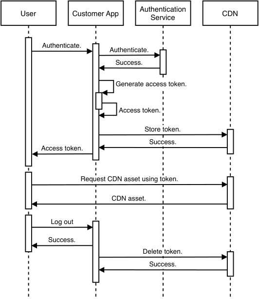
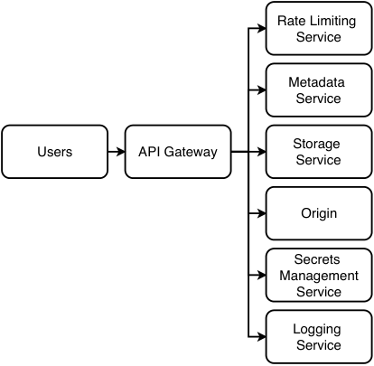
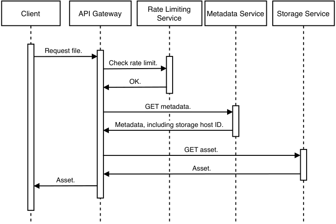
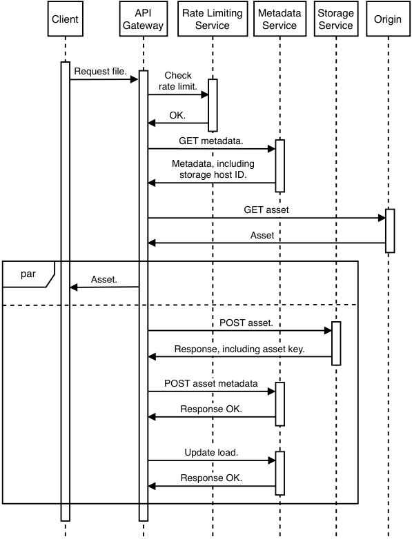
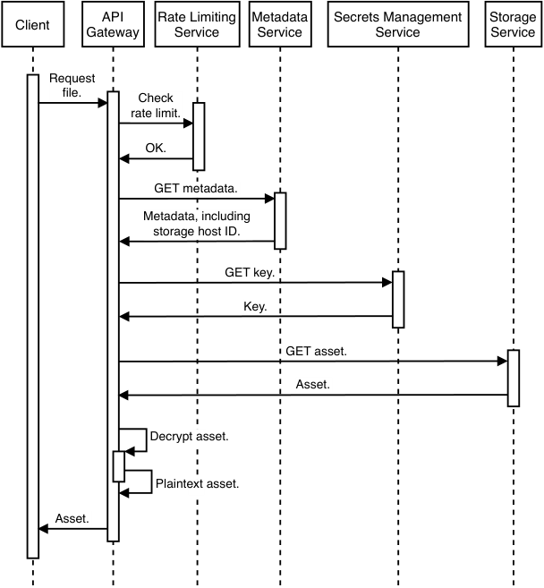
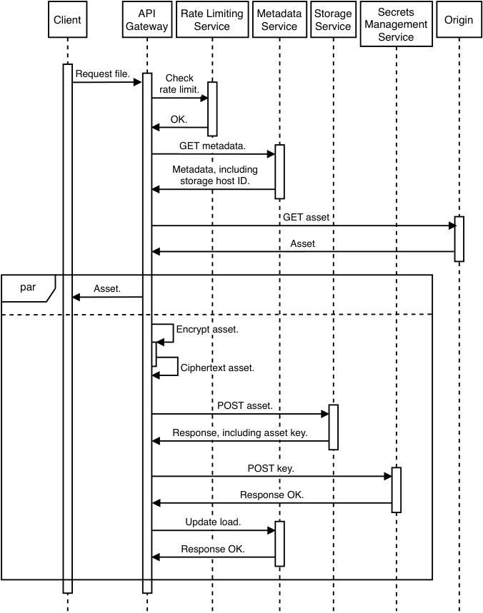
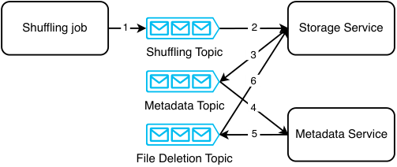
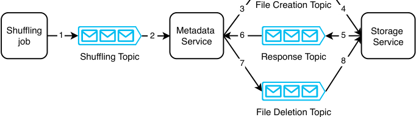

# _Design a Content Distribution Network_

## _This chapter covers_

- Discussing the pros, cons, and unexpected

- situations

- Satisfying user requests with frontend

- metadata storage architecture

- Designing a basic distributed storage system

A CDN (Content Distribution Network) is a cost-effective and geographically distributed file storage service that is designed to replicate files across its multiple data centers to serve static content to a large number of geographically distributed users quickly, serving each user from the data center that can serve them fastest. There are secondary benefits, such as fault-tolerance, allowing users to be served from other data centers if any particular data center is unavailable. Let’s discuss a design for a CDN, which we name CDNService.

## _13.1 Advantages and disadvantages of a CDN_

Before we discuss the requirements and system design for our CDN, we can first discuss the advantages and disadvantages of using a CDN, which may help us understand our requirements.

### _13.1.1 Advantages of using a CDN_

If our company hosts services on multiple data centers, we likely have a shared object store that is replicated across these data centers for redundancy and availability. This shared object store provides many of the benefits of a CDN. We use a CDN if our geographically distributed userbase can benefit from the extensive network of data centers that a CDN provides.

The reasons to consider using a CDN were discussed in section 1.4.4, and some are repeated here:

- _Lower latency_ —A user is served from a nearby data center, so latency is lower. Without a third-party CDN, we will need to deploy our service to multiple data centers, which carries considerable complexity, such as monitoring to ensure availability. Lower latency may also carry other benefits, such as improving SEO (search engine optimization). Search engines tend to penalize slow web pages both directly and indirectly. An example of an indirect penalty is that users may leave a website if it loads slowly; such a website can be described as having a high bounce rate, and search engines penalize websites with high bounce rates.

- _Scalability_ —With a third-party provider, we do not need to scale our system ourselves. The third party takes care of scalability.

- _Lower unit costs_ —A third-party CDN usually provides bulk discount, so we will have lower unit costs as we serve more users and higher loads. It can provide lower costs as it has economies of scale from serving traffic for many companies and spread the costs of hardware and appropriately skilled technical personnel over this larger volume. The fluctuating hardware and network requirements of multiple companies can normalize each other and result in more stable demand versus serving just a single company.

- _Higher throughput_ —A CDN provides additional hosts to our service, which allows us to serve a larger number of simultaneous users and higher traffic.

- _Higher availability_ —The additional hosts can serve as a fallback should our service’s hosts fail, especially if the CDN is able to keep to its SLA. Being geographically distributed across multiple data centers is also beneficial for availability, as a disaster that causes an outage on a single data center will not affect other data centers located far away. Moreover, unexpected traffic spikes to a single data center can be redirected and balanced across the other data centers.

### _13.1.2 Disadvantages of using a CDN_

Many sources discuss the advantages of a CDN, but few also discuss the disadvantages. An interview signal of an engineer’s maturity is their ability to discuss and evaluate tradeoffs in any technical decision and anticipate challenges by other engineers. The interviewer will almost always challenge your design decisions and probe if you have considered various non-functional requirements. Some disadvantages of using a CDN include the following:

- The additional complexities of including another service in our system. Examples of such complexities include:

   - An additional DNS lookup

   - An additional point of failure

- A CDN may have high unit costs for low traffic. There may also be hidden costs, like costs per GB of data transfer because CDNs may use third-party networks.

- Migrating to a different CDN may take months and be costly. Reasons to migrate to another CDN include:

   - A particular CDN may not have hosts located near our users. If we acquire a significant user base in a region not covered by your CDN, we may need to migrate to a more suitable CDN.

   - A CDN company may go out of business.

   - A CDN company may provide poor service, such as not fulfilling its SLA, which affects our own users; provide poor customer support; or experience incidents like data loss or security breaches.

- Some countries or organizations may block the IP addresses of certain CDNs.

- There may be security and privacy concerns in storing your data on a third party. We can implement encryption at rest so the CDN cannot view our data, which will incur additional cost and latency (from encrypting and decrypting data). The design and implementation must be implemented or reviewed by qualified security engineers, which adds additional costs and communication overhead to our team.

- Another possible security concern is that it’s possible to insert malicious code into JavaScript libraries, and we cannot personally ensure the security and integrity of these remotely hosted libraries.

- The flip side of allowing a third-party to ensure high availability is that if technical problems occur with the CDN occur, we do not know how long it will take for the CDN company to fix them. Any service degradation may affect our customers, and the communication overhead of communicating with an external company may be greater than communication within our company. The CDN company may provide an SLA, but we cannot be sure that it will be honored, and migrating to another CDN is costly, as we just discussed. Moreover, our SLA becomes dependent on a third party.

- The configuration management of a CDN or any third-party tool/service in general may be insufficiently customizable for certain of our use cases, leading to unexpected problems. The next section discusses an example.

### _13.1.3 Example of an unexpected problem from using a CDN to serve images_

This section discusses an example of an unexpected problem that can occur from using a CDN or third-party tools or services in general.

A CDN may read a GET request’s User-Agent (https://developer.mozilla.org/en-US/docs/Web/HTTP/Headers/User-Agent)headertodetermineifthe request is from a web browser, and if so, return images in WebP (https://developers.google.com/speed/webp)formatinsteadoftheformat it was uploaded in (such as PNG or JPEG). In some services, this may be ideal, but other browser applications that want images to be returned in their original formats have three choices:

- 1 Override the User-Agent header in our web application.

- 2 Configure the CDN to serve WebP images for certain services and images in the original formats for other services.

- 3 Route the request through a backend service.

Regarding solution 1, as of publication of this book, Chrome web browser does not allow applications to override the User-Agent header, while Firefox does (Refer to https://bugs.chromium.org/p/chromium/issues/detail?id=571722,https://bugzilla.mozilla.org/show_bug.cgi?id=1188932,andhttps://stackoverflow.com/a/42815264.) Solution 1 will limit our users to specific web browsers, which may be infeasible.

Regarding solution 2, the CDN may not provide the ability to customize this setting for individual services. It may only allow the setting to serve images in WebP format to be broadly turned on or off across all our services. Even if it does provide such individualized configuration, the relevant infrastructure team in our company that manages CDN configurations may be unable or unwilling to set this configuration for individual services in our company. This problem may be more prevalent in large companies.

Solution 3 requires developers to expose an API endpoint just to fetch the original image from the CDN. This solution should be best avoided because it negates most of all the benefits of a CDN. It adds additional latency and complexity (including documentation and maintenance overhead). The backend host may be geographically far from the user, so the user loses the benefit from the CDN of being served from a nearby data center. This backend service will need to scale with demand for the images; if the request rate for the images is high, both the CDN and the backend service need be scaled up. Rather than adopting this solution, it makes more sense to store the files in a cheaper object store whose hosts are in the same data center as our backend service. Unfortunately, I have personally seen this “solution” used in big companies because the application and the CDN were owned by different teams, and management was uninterested in fostering cooperation between them.

## _13.2 Requirements_

Functional requirements are simple. Authorized users should be able to create directories, upload files with 10 GB file size limit, and download files.

NOTE We will not discuss content moderation. Content moderation is essential in any application where users see content created by others. We assume that it is the responsibility of the organizations that use our CDN, not the responsibility of the company that provides the CDN.

Most of the non-functional requirements are the advantages of a CDN:

- _Scalable_ —The CDN may scale to support petabytes of storage and download volumes of terabytes per day.

- _High availability_ —Four or five 9s uptime required.

- _High performance_ —A file should be downloaded from the data center that can serve it fastest to the requestor. However, synchronization may take time, so upload performance is less important, as long as the file is available on at least one data center before synchronization is complete.

- _Durable_ —A file must not be corrupted.

- _Security and privacy_ —The CDN serves requests and sends files to destinations outside the data center. Files should only be downloaded and uploaded by authorized users.

## _13.3 CDN authentication and authorization_

As discussed in appendix B, the purpose of authentication is to verify a user’s identity, while the purpose of authorization is to ensure that a user accessing a resource (such as a file in our CDN) has permission to do so. These measures prevent _hotlinking_ , in which a site or service accesses CDN assets without permission. Our CDN incurs the costs of serving these users without getting paid for it, and unauthorized file or data access may be a copyright violation.

TIP   Refer to appendix B for an introduction to authentication and authorization.

CDN authentication and authorization can be done with either cookie-based authentication or token-based authentication. As discussed in section B.4, token-based authentication uses less memory, can use third-party services with more security expertise, and allow fine-grained access control. Besides these benefits, token authentication for our CDN also allows requestors to be restricted to allowed IP addresses or specific user accounts.

In this section, we discuss a typical implementation for CDN authentication and authorization. The following sections discuss a possible CDN system design that we may discuss during an interview, including how this authentication and authorization process can be done in our design.

### _13.3.1 Steps in CDN authentication and authorization_

In this discussion, we refer to a CDN customer as a site or service that uploads assets to a CDN and then directs its users/clients to the CDN. We refer to a CDN user as a client that downloads assets from a CDN.

The CDN issues each customer a secret key and provides an SDK or library to generate access tokens from the following information. Referring to figure 13.1, the access token generation process is as follows:

- 1 The user sends an authentication request to the customer app. The customer app may perform the authentication using an authentication service. (The details of the authentication mechanism are irrelevant for the CDN access token generation process. Refer to appendix B for an introduction to various authentication protocols like Simple Login and OpenID Connect.)

- 2 The customer app generates an access token using the SDK, with the following inputs:

   - a _Secret key_ —The customer’s secret key.

   - b _CDN URL_ —The CDN URL that the generated access token is valid for.

   - c _Expiry_ —The access token’s expiry timestamp, after which the user needs a new access token. When a user makes a request to the CDN with an expired token, the CDN can return a 302 response to redirect the user to the customer. The customer generates a new access token and then returns this access token to the user with a 302 response to retry the request on the CDN.

   - d _Referrer_ —This is a Referrer HTTP request header.

#### Referrer header and security

When a client/user makes an HTTP request to a CDN, it should include the customer’s URL as its `Referrer` HTTP header. The CDN only allows authorized referrers, so this prevents unauthorized referrers from using the CDN.

However, this is not a legitimate security mechanism. Clients can easily spoof `Referrer` headers by simply using a different URL as the `Referrer` header. A site/service can spoof a referrer header by impersonating an authorized site/service and fool clients to believe that the latter are communicating with the authorized site/service.

   - e _Allowed IPs_ —This may be a list of IP address ranges that are authorized to download CDN assets.

   - f _Allowed countries or regions_ —We may include a blacklist or whitelist of countries/regions. This “Allowed IPs” field already indicates which countries/ regions are allowed, but we can still include this field for convenience.

- 3 The customer app stores the token and then returns this token to the user. For additional security, the token can be stored in an encrypted form.

- 4 Whenever a customer app gives a user a CDN URL, and the user makes a GET request for this CDN asset, the GET request should be signed with the access token. This is called URL signing. An example of a signed URL is http://12345.r.cdnsun.net/photo.jpeg?secure=DMF1ucDxtHCxwYQ(fromhttps://cdnsun.com/knowledgebase/cdn-static/setting-a-url-signing-protect-your-cdn-content). “secure=DMF1ucDxtHCxwYQ” is a query parameter to send the access token to the CDN. The CDN performs authorization. It verifies that the user’s token is valid and that the asset can be downloaded with that token, as well as with the user’s IP or country/region. Finally, the CDN returns the asset to the user.

- 5 When a user logs out, the customer app destroys the user’s token. The user will need to generate another token when logging in.

Figure 13.1    Sequence diagram of token generation process, followed by using the token to request CDN assets, and destroying the token upon user logout. The process of destroying the token can be asynchronous as illustrated here, or it can be synchronous because logouts are not frequent events.

Deleting the token can be asynchronous as illustrated in figure 13.1, or it can be synchronous because logouts are not frequent events. If token deletion is asynchronous, there is a risk that tokens will not be deleted if the customer app host handling this deletion suddenly fails. One solution is to simply ignore this problem and allow some tokens to not be destroyed. Another solution is to use an event-driven approach. The customer app host can produce a token deletion event to a Kafka queue, and a consumer cluster can consume these events and delete the tokens on the CDN. A third solution is to implement token deletion as synchronous/blocking. If token deletion fails because the customer app host suddenly fails, the user/client will receive a 500 error, and the client can retry the logout request. This approach will result in higher latency for the logout request, but this may be acceptable.

Refer to sources like https://docs.microsoft.com/en-us/azure/cdn/cdn-token-auth,https://cloud.ibm.com/docs/CDN?topic=CDN-working-with-token-authentication,https://blog.cdnsun.com/protecting-cdn-content-with-token-authentication-and-url-signingformoreinformationon CDN token authentication and authorization.

### _13.3.2 Key rotation_

A customer’s key may be periodically changed, just in case a hacker manages to steal the key, the damage can be limited as it will only be useful to him until the key is changed.

The key is rotated rather than suddenly changed. _Key rotation_ is a key renewal process, which contains a period where both the old and new keys are valid. It will take time for a new key to be disseminated to all the customer’s systems, so the customer may continue using both the old and new key in the meantime. At a set expiry time, the old key will expire, and users cannot access CDN assets with expired keys.

It is also useful to establish this procedure for cases where we know that a hacker has stolen the key. The CDN can rotate the key and set a short time to expiration for the old key. The customer can switch to the new key as soon as possible.

## _13.4 High-level architecture_

Figure 13.2 shows high-level architecture of our CDN. We adopt a typical API gateway-metadata-storage/database architecture. A user request is handled by an API gateway, which is a layer/service that makes requests to various other services. (Refer to section 1.4.6 for an overview of API gateway.) These include SSL termination, authentication and authorization, rate limiting (refer to chapter 8), and logging to a shared logging service for purposes such as analytics and billing. We can configure the API gateway to look up the metadata service to determine which storage service host to read or write to for any user. If the CDN asset is encrypted at rest, the metadata service can also record this, and we can use a secrets management service to manage the encryption keys.

Figure 13.2    High-level architecture of our CDN. User requests are routed through an API gateway, which makes requests to the appropriate services, including rate limiting and logging. Assets are stored on a storage service, and the metadata service keeps track of the storage service hosts and file directories that store each asset. If the assets are encrypted, we use a secrets management service to manage the encryption keys. If the requested asset is missing, the API gateway retrieves it from the origin (i.e., our service; this is configured in the metadata service), adds it to the storage service, and updates the metadata service.

We can generalize the operations into reads (download) vs. writes (directory creation, upload, and file deletion). For simplicity of the initial design, every file can be replicated to every data center. Otherwise, our system will have to handle complexities such as:

- The metadata service will track which data centers contain which files.

- A file distribution system that periodically uses user query metadata to determine the optimal file distribution across the data centers. This includes the number and locations of replicas.

## _13.5 Storage service_

The storage service is a cluster of hosts/nodes which contain the files. As discussed in section 4.2, we should not use a database to store large files. We should store files in the hosts’ filesystems. Files should be replicated for availability and durability, with each file assigned to multiple (e.g., three) hosts. We need availability monitoring and a failover process that updates the metadata service and provisions replacement nodes. The host manager can be in-cluster or out-cluster. An in-cluster manager directly manages nodes, while an out-cluster manager manages small independent clusters of nodes, and each small cluster manages itself.

### _13.5.1 In-cluster_

We can use a distributed file system like HDFS, which includes ZooKeeper as the in-cluster manager. ZooKeeper manages leader election and maintains a mapping between files, leaders, and followers. An in-cluster manager is a highly sophisticated component that also requires reliability, scalability, and high performance. An alternative that avoids such a component is an out-cluster manager.

### _13.5.2 Out-cluster_

Each cluster managed by an out-cluster manager consists of three or more nodes distributed across several data centers. To read or write a file, the metadata service identifies the cluster it is or should be stored in and then reads or writes the file from a randomly selected node in the cluster. This node is responsible for replication to other nodes in the cluster. Leader election is not required, but mapping files to clusters is required. The out-cluster manager maintains a mapping of files to clusters.

### _13.5.3 Evaluation_

In practice, out-cluster manager is not really simpler than in-cluster manager. Table 13.1 compares these two approaches.

Table 13.1    Comparison of in-cluster manager and out-cluster manager

|In-cluster manager|Out-cluster manager|
|---|---|
|||
|Metadata service does not make requests to the in-cluster manager. Manages fle assignment within individual roles in the cluster. Needs to know about every node in the cluster. Monitors heartbeats from nodes. Deals with host failures. Nodes may die, and new nodes may be added to the cluster.|Metadata service makes requests to the out-cluster manager. Manages fle assignment to a cluster, but not to individual nodes. May not know about each indi- vidual node, but needs to know about each cluster. Monitors health of each indepen- dent cluster. Tracks each cluster’s utilization and deals with overheated clus- ters. New fles may no longer be assigned to clusters that reach their capacity limits.|

## _13.6 Common operations_

When the client makes a request with our CDN service’s domain (e.g., cdnservice.flickr .com) rather than an IP address, GeoDNS (refer to sections 1.4.2 and 7.9) assigns the IP address of the closest host, where a load balancer directs it an API gateway host. As described in section 6.2, the API gateway performs a number of operations, including caching. The frontend service and its associated caching service can assist with caching frequently accessed files.

### _13.6.1 Reads: Downloads_

For a download, the next step is to select a storage host to serve this request. The metadata service aids in this selection by maintaining and providing the following metadata. It can use Redis and/or SQL:

- The storage service hosts which contain the files. Some or all the hosts may be on other data centers, so that information must be stored, too. Files take time to be replicated across hosts.

- The metadata service of each data center keeps track of the current load of its hosts. A host’s load can be approximated by the sum of the sizes of the files it is currently serving.

- For purposes such as estimating how much time a file takes to download from a host or to distinguish between files with the same name (but this is usually done with MD5 or SHA hash).

- File ownership and access control.

- Health status of hosts.

#### download process

Figure 13.3 is a sequence diagram of the steps taken by the API gateway to download a file, assuming the CDN does contain this asset. We omit some steps such as SSL termination, authentication and authorization, and logging.

- 1 Query the rate limiting service to check if the request exceeds the client’s rate limit. We assume that rate limiter allows the request through.

- 2 Query the metadata service to get the storage service hosts that contain this asset.

- 3 Select a storage host and stream the asset to the client.

- 4 Update the metadata service with the load increase of the storage host. If the metadata service records the asset’s size, this step can be done in parallel with step 3. Otherwise, the API gateway will need to measure the asset’s size, to update the metadata service with the correct load increase.

Figure 13.3    Sequence diagram of a client making a CDN download. We assume rate limiter allows the request through. The sequence is straightforward if the asset is present.

An alert reader may note that the last step of the API gateway updating the load to the metadata service can be done asynchronously. If the API gateway host experiences an outage during this update, the metadata service may not receive it. We can choose to ignore this error and allow the user to use the CDN more than the former is allowed to. Alternatively, the API gateway host can produce this event to a Kafka topic. Either the metadata service can consume from this topic, or we can use a dedicated consumer cluster to consume from the topic and then update the metadata service.

The CDN may not contain this asset. It may have deleted it for reasons including the following:

- There may be a set retention period for assets, such as a few months or years, and this period had passed for that asset. The retention period may also be based on when the asset was last accessed.

- A less likely reason is that the asset was never uploaded because the CDN ran out of storage space (or had other errors), but the customer believed that the asset was successfully uploaded.

- Other errors in the CDN.

Referring to figure 13.4, if the CDN does not have the asset, it will need to download it from the origin, which is a backup location provided by the customer. This will increase latency. It will then need to store it by uploading it to the storage service and updating the metadata service. To minimize latency, the storage process can be done in parallel with returning the asset to the client.

Figure 13.4    Sequence diagram of a CDN download process if the CDN does not contain the requested asset. The CDN will need to download the asset from the origin (a backup location provided by the customer), and return it to the user, as well as store the asset for future requests. POST asset metadata and upload load can be done as a single request, but we can keep them as separate requests for simplicity.

#### download process with encryption at rest

What if we needed to store assets in encrypted form? Referring to figure 13.5, we can store the encryption keys in a secrets management service (which requires authentication). When an API gateway host is initialized, it can authenticate with the secrets management service, which will pass the former a token for future requests. Referring to figure 13.5, when an authorized user requests an asset, the host can first obtain the asset’s encryption key from the secrets management service, fetch the encrypted asset from the storage service, decrypt the asset, and return it to the user. If the asset is large, it may be stored in multiple blocks in the storage service, and each block will need to be separately fetched and decrypted.

Figure 13.5    Sequence diagram of downloading an asset that is encrypted at rest, assuming the asset is present in the CDN. If the asset is large, it may be stored in multiple blocks in the storage service, and each block will need to be separately fetched and decrypted.

Figure 13.6 illustrates the process that occurs if a request is made to fetch an encrypted asset that the CDN does not possess. Similar to figure 13.5, the API gateway will need to fetch the asset from the origin. Next, the API gateway can parallelly return the asset to the user while storing it in the storage service. The API gateway can generate a random encryption key, encrypt the asset, write the asset to the storage service, and write the key to the secrets management service.

Figure 13.6    Sequence diagram of the steps to download an encrypted file. POST asset and POST key can also be done in parallel.

### _13.6.2 Writes: Directory creation, file upload, and file deletion_

A file is identified by its ID, not its content. (We cannot use file names as identifiers because different users can give different files the same name. Even an individual user may give the same name to different files.) We consider files with different IDs but the same contents to be different files. Should identical files with different owners be stored separately, or should we attempt to save storage by keeping only one copy of a file? To save storage in this manner, we will have to build an additional layer of complexity to manage groups of owners, so that any owner may see that a file is accessible by other owners that they recognize, rather than owners that belong to other groups. We assume that the number of identical files is a small fraction of all the files, so this may be over-engineering. Our initial design should store such files separately, but we must remember that there are no absolute truths in system design (thus system design is an art, not a science). We can discuss with our interviewer that as the total amount of storage our CDN uses becomes large, the cost savings of saving storage by deduplicating the files may be worth the additional complexity and cost.

A file can be GB or TB in size. What if file upload or download fails before it is complete? It will be wasteful to upload or download the file from the beginning. We should develop a process similar to checkpointing or bulkhead to divide a file into chunks, so a client only needs to repeat the upload or download operations on the chunks that have not completed. Such an upload process is known as _multipart upload_ , and we can also apply the same principles to downloads, too.

We can design a protocol for multipart uploads. In such a protocol, uploading a chunk can be equivalent to uploading an independent file. For simplicity, chunks can be of fixed size, such as 128 MB. When a client begins a chunk upload, it can send an initial message that contains the usual metadata such as the user ID, the filename, and size. It can also include the number of the chunk about to be uploaded. In multipart upload, the storage host will now need to allocate a suitable address range on the disk to store the file and record this information. When it starts receiving a chunk upload, it should write the chunk to the appropriate addresses. The metadata service can track which chunk uploads have completed. When the client completes uploading the final chunk, the metadata service marks the file as ready for replication and download. If a chunk upload fails, the client can reupload just this chunk instead of the entire file.

If the client stops uploading the file before all chunks are successfully uploaded, these chunks will uselessly occupy space in our storage host. We can implement a simple cron job or a batch ETL job that periodically deletes these chunks of incompletely uploaded files. Other possible discussion topics include:

- Allowing the client to choose the chunk size.

- Replicating the file as it is being uploaded, so the file can be ready for download sooner across the CDN. This introduces additional complexity and is unlikely to be required, but we can discuss such a system should such high performance be required.

- A client can start playing a media file as soon as it downloads the first chunk. We will briefly discuss this in section 13.9.

NOTE    The multipart upload with checkpointing that we discussed here is unrelated to multipart/form-data HTML encoding. The latter is for uploading form data that contains files. Refer to sources such as https://swagger.io/docs/specification/describing-request-body/multipart-requests/andhttps://developer.mozilla.org/en-US/docs/Web/HTTP/Methods/POSTformoredetails.

Another question is how to handle adding, updating (the contents), and deleting files on this distributed system. Section 4.3 discussed replication of update and delete operations, their complications, and some solutions. We can discuss some possible solutions adopted from that section:

- A single-leader approach that designates a particular data center to perform these operations and propagate the changes to the other data centers. This approach may be adequate for our requirements, especially if we do not require the changes to be rapidly available on all data centers.

- The multi-leader approaches discussed, including tuples. (Refer to Martin Kleppmann’s book _Designing Data-Intensive Systems_ for a discussion on tuples.)

- The client acquires a lock on this file in every data center, performs this operation on every data center, and then releases the locks.

In each of these approaches, the frontend updates the metadata service with the file’s availability on the data centers.

#### do not keep file copies on all data centers

Certain files may be used mostly by particular regions (e.g., audio or text files in human languages predominantly used in a particular region), so not all data centers need to contain a copy of the files. We can set replication criteria to determine when a file should be copied to a particular data center (e.g., number of requests or users for this file within the last month). However, this means that the file needs to be replicated within a data center for fault-tolerance.

Certain contents are separated into multiple files because of application requirements to serve certain file combinations to certain users. For example, a video file may be served to all users, and it has an accompanying audio file in a particular language. This logic can be handled at the application level rather than by the CDN.

#### rebalancing the batch etl job

We have a periodic (hourly or daily) batch job to distribute files across the various data centers and replicate files to the appropriate number of hosts to meet demand. This batch job obtains the file download logs of the previous period from the logging service, determines the request counts of the files, and uses these numbers to adjust the numbers of storage hosts for each file. Next, it creates a map of which files should be added to or deleted from each node and then uses this map to make the corresponding shuffling.

For real-time syncing, we can develop the metadata service further to constantly analyze file locations and access and redistribute files.

Cross data center replication is a complex topic, and you are unlikely to discuss this in deep detail during a system design interview, unless you are interviewing for roles that request such expertise. In this section, we discuss a possible design to update the file mappings in the metadata service and the files in the storage service.

NOTE    Refer to sources like https://serverfault.com/questions/831790/how-to-manage-failover-in-zookeeper-across-datacenters-using-observers,https://zookeeper.apache.org/doc/r3.5.9/zookeeperObservers.html,andhttps://stackoverflow.com/questions/41737770/how-to-deploy-zookeeper-across-multiple-data-centers-and-failover for more information on how to configure cross data center replication on ZooKeeper. Refer to https://solr.apache.org/guide/8_11/cross-data-center-replication-cdcr.htmlforaguideonhowcross data center replication can be configured in Solr, a search platform that uses ZooKeeper to manage its nodes.

Let’s discuss an approach to write new file metadata to the metadata service and shuffle the files accordingly between the data centers (in the in-cluster approach) or hosts (in the out-cluster approach) of the storage service. Our approach will need to make requests to the storage service to transfer files between its hosts across various data centers. To prevent inconsistency between the metadata service and storage service in case of failed write requests, the metadata service should only update its file location metadata when it receives a success response from the storage service, indicating that the files are successfully written to their new locations. The storage service relies on its manager (in-cluster or out-cluster) to ensure consistency within its own nodes/hosts. This ensures the metadata service does not return file locations before the files have been successfully written to those locations.

Moreover, files should be deleted from their previous nodes only after they are successfully written to their new locations, so if file writes to the new locations fail, the files continue to exist at their old locations, and the metadata service can continue to return these old file locations when it receives requests for those files.

We can use a saga approach (refer to section 5.6). Figure 13.7 illustrates a choreography approach, while figure 13.8 illustrates an orchestration approach where the metadata service is the orchestrator.

The steps in figure 13.7 are as follows:

- 1 The shuffling job produces an event to the shuffling topic, which corresponds to moving a file from certain locations to others. This event may also contain information such as the recommended replication factor of this file, corresponding to the number of leader nodes that should contain this file.

- 2 The storage service consumes this event and writes the file to their new locations.

- 3 The storage service produces an event to the metadata topic to request the metadata service to update its file location metadata.

- 4 The metadata service consumes from the metadata topic and updates the file location metadata.

- 5 The metadata service produces an event to the file deletion topic to request the storage service to delete the files from their old locations.

- 6 The storage service consumes this event and deletes the file from its old locations.

Figure 13.7    A choreography saga to update the metadata service and storage service

#### Identify the transaction types

Which are the compensable transactions, pivot transaction, and retriable trans actions?

All transactions before step 6 can be compensated. Step 6 is the pivot transaction because the file deletion is irreversible. It is the final step, so there are no retriable transactions.

That being said, we can implement file deletion as _soft delete_ (mark data as deleted, but not actually delete it). We can periodically _hard delete_ (delete data from our storage hardware with no intention to use or recover it again) data from our database. In this case, all the transactions are compensable, and there will be no pivot transaction.

Figure 13.8    An orchestration saga to update the metadata service and storage service

The steps in figure 13.8 are as follows:

- 1 This is the same step as step 1 of the choreography approach previously discussed.

- 2 The metadata service consumes this event.

- 3 The metadata service produces an event to the file creation topic to request the storage service to create the file at the new locations.

- 4 The storage service consumes this event and writes the files to their new locations.

- 5 The storage service produces an event to the response topic to inform the metadata service that the file writes were successfully completed.

- 6 The metadata service consumes this event.

- 7 The metadata service produces an event to the file deletion topic to request the storage service to delete the file from its old locations.

- 8 The storage service consumes this event and deletes the file from its old locations.

## _13.7 Cache invalidation_

As a CDN is for static files, cache invalidation is much less of a concern. We can fingerprint the files as discussed in section 4.11.1. We discussed various caching strategies (section 4.8) and designing a system to monitor the cache for stale files. This system will have to anticipate high traffic.

## _13.8 Logging, monitoring, and alerting_

In section 2.5, we discussed key concepts of logging, monitoring, and alerting that one must mention in an interview. Besides what was discussed in section 2.5, we should monitor and send alerts for the following:

- Uploaders should be able to track the state of their files, whether the upload is in progress, completed, or failed.

- Log CDN misses and then monitors and triggers low-urgency alerts for them.

- The frontend service can log the request rate for files. This can be done on a shared logging service.

- Monitor for unusual or malicious activity.

## _13.9 Other possible discussions on downloading media files_

We may wish media files to be playable before they are fully downloaded. A solution is to divide the media file into smaller files, which can be downloaded in sequence and assembled into a media file that is a partial version of the original. Such a system requires a client-side media player that can do such assembly while playing the partial version. The details may be beyond the scope of a system design interview. It involves piercing together the files’ byte strings.

As the sequence is important, we need metadata that indicates which files to download first. Our system splits a file into smaller files and assigns each small file with a sequence number. We also generate a metadata file that contains information on the order of the files and their total number. How can the files be efficiently downloaded in a particular sequence? We can also discuss other possible video streaming optimization strategies.

## _Summary_

- A CDN is a scalable and resilient distributed file storage service, which is a utility that is required by almost any web service that serves a large or geographically distributed user base.

- A CDN is geographically distributed file storage service that allows each user to access a file from the data center that can serve them the fastest.

- A CDN’s advantages include lower latency, scalability, lower unit costs, higher throughput, and higher availability.

- A CDN’s disadvantages include additional complexity, high unit costs for low traffic and hidden costs, expensive migration, possible network restrictions, security and privacy concerns, and insufficient customization capabilities.

- A storage service can be separate from a metadata service that keeps track of which storage service hosts store particular files. The storage service’s implementation can focus on host provisioning and health.

- We can log file accesses and use this data to redistribute or replicate files across data centers to optimize latency and storage.

- CDNs can use third-party token-based authentication and authorization with key rotation for secure, reliable, and fine-grained access control.

- A possible CDN high-level architecture can be a typical API gateway-metadata-storage/database architecture. We customize and scale each component to suit our specific functional and non-functional requirements.

- Our distributed file storage service can be managed in-cluster or out-cluster. Each has its tradeoffs.

- Frequently accessed files can be cached on the API gateway for faster reads.

- For encryption at rest, a CDN can use a secrets management service to manage encryption keys.

- Large files should be uploaded with a multipart upload process that divides the file into chunks and manages the upload of each chunk separately.

- To maintain low latency of downloads while managing costs, a periodic batch job can redistribute files across data centers and replicate them to the appropriate number of hosts.

