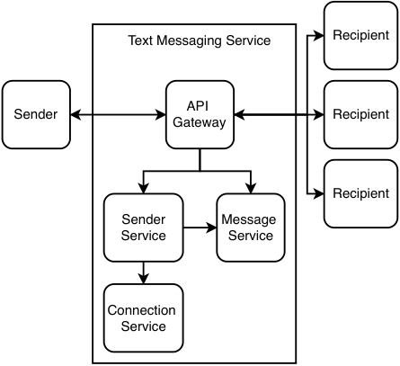
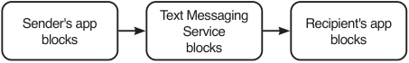
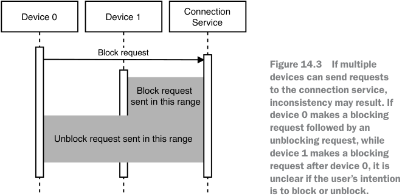
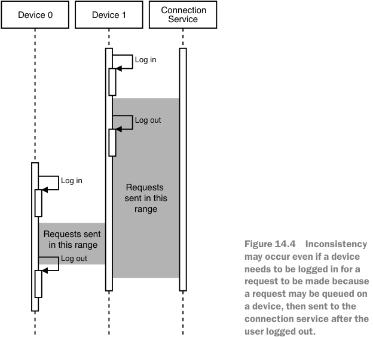
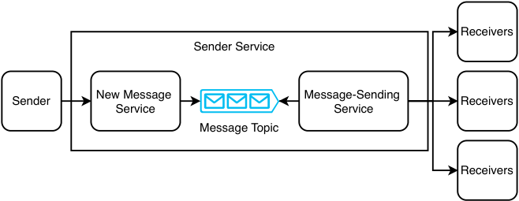
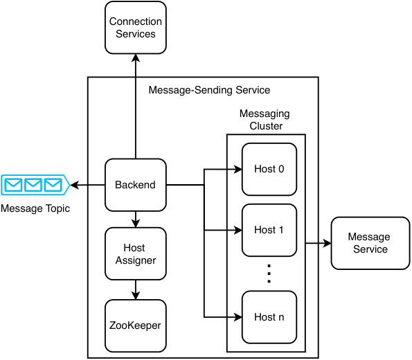
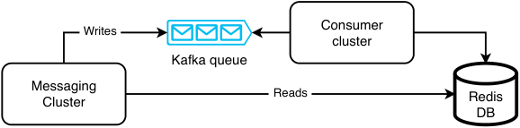

# _Design a text messaging app_

## _This chapter covers_

- Designing an app for billions of clients to send short messages

- Considering approaches that trade off latency

- vs. cost

- Designing for fault-tolerance

Let’s design a text messaging app, a system for 100K users to send messages to each other within seconds. Do not consider video or audio chat. Users send messages at an unpredictable rate, so our system should be able to handle these traffic surges. This is the first example system in this book that considers exactly-once delivery. Messages should not be lost, nor should they be sent more than once.

## _14.1 Requirements_

After some discussion, we determined the following functional requirements:

- Real-time or eventually-consistent? Consider either case.

- How many users may a chatroom have? A chatroom can contain between two to 1,000 users.

- Is there a character limit for a message? Let’s make it 1000 UTF-8 characters. At up to 32 bits/character, a message is up to 4 KB in size.

- Notification is a platform-specific detail that we need not consider. Android, iOS, Chrome, and Windows apps each have their platform-specific notification library.

- Delivery confirmation and read receipt.

- Log the messages. Users can view and search up to 10 MB of their past messages. With one billion users, this works out to 10 PB of storage.

- Message body is private. We can discuss with the interviewer if we can view any message information, including information like knowing that a message was send from one user to another. However, error events such as failure to send a message should trigger an error that is visible to us. Such error logging and monitoring should preserve user privacy. End-to-end encryption will be ideal.

- No need to consider user onboarding (i.e., the process of new users signing on to our messaging app).

- No need to consider multiple chatrooms/channels for the same group of users.

- Some chat apps have template messages that users can select to quickly create and send, such as “Good morning!” or “Can’t talk now, will reply later.” This can be a client-side feature that we do not consider here.

- Some messaging apps allow users to see if their connections are online. We do not consider this.

- We consider sending text only, not media like voice messages, photos, or videos.

Non-functional requirements:

- _Scalability:_ 100K simultaneous users. Assume each user sends a 4 KB message every minute, which is a write rate of 400 MB/min. A user can have up to 1,000 connections, and a message can be sent to up to 1,000 recipients, each of whom may have up to five devices.

- _High availability:_ Four nines availability.

- _High performance:_ 10-second P99 message delivery time.

- _Security and privacy:_ Require user authentication. Messages should be private.

- _Consistency:_ Strict ordering of messages is not necessary. If multiple users send messages to each other more or less simultaneously, these messages can appear in different orders to different users.

## _14.2 Initial thoughts_

At first glance, this seems to be similar to the notification/alerting service we discussed in chapter 9. Looking closer, we see some differences, listed in table 14.1. We cannot naively reuse our notification/alerting service’s design, but we can use it as a starting point. We identify similar requirements and their corresponding design components and use the differences to increase or reduce our design’s complexity as appropriate.

Table 14.1    Differences between our messaging app and our notification/alerting service

|Messaging app|Notifcation/alerting service|
|---|---|
|||
|All messages are equal priority and have a 10-second P99 delivery time. Messages are delivered from one client to others, all within a single channel on a single service. No need to consider other channels or services. Only a manual trigger condition. No message templates. (Except per- haps message suggestions.) Due to end-to-end encryption, we can- not see the user’s messages, so there is less freedom to identify and dedupli- cate common elements into functions to reduce computational resource consumption. Users may request for old messages. Delivery confrmation and read receipt are part of the app.|Events can have different priority levels. Multiple channels, such as email, SMS, automated phone calls, push notifca- tions, or notifcations within apps. An event can be manually, programmat- ically, or periodically triggered. Users can create and manage notifca- tion templates. No end-to-end encryption. We have more freedom to create abstractions, such as a template service. Most notifcations only need to be sent once. We may not have access to most notif- cation channels, such as email, texting, push notifcations, etc., so delivery and read confrmations may not be possible.|

## _14.3 Initial high-level design_

A user first selects the recipient (by name) of their message from a list of recipients. Next, they compose a message on a mobile, desktop, or browser app and then hit a Send button. The app first encrypts the message with the recipient’s public key and then makes a request to our messaging service to deliver the message. Our messaging service sends the message to the recipient. The recipient sends delivery confirmation and read receipt messages to the sender. This design has the following implications:

- Our app needs to store each recipient’s metadata, including names and public keys.

- Our messaging service needs to maintain an open WebSocket connection to each recipient.

- If there is more than one recipient, the sender needs to encrypt the message with each recipient’s public key.

- Our messaging service needs to handle unpredictable traffic surges from many senders suddenly deciding to send messages within a short period.

Referring to figure 14.1, we create separate services to serve different functional requirements and optimize for their different nonfunctional requirements.

- _Sender service:_ Receives messages from senders and immediately delivers them to recipients. It also records these messages in the message service, described next.

- _Message service:_ Senders can make requests to this service for their sent messages, while recipients can make requests to this service for both their received and unreceived messages.

- _Connection service:_ For storage and retrieval of users’ active and blocked connections, add other users to one’s contact list, block other users from sending messages. The connection service also stores connection metadata, such as names, avatars, and public keys.

Figure 14.1 illustrates our high-level architecture with the relationships between our services. Users make requests to our services via an API gateway. Our sender service makes requests to our message service to record messages, including messages that failed to be delivered to recipients. It also makes requests to our connection service to check if a recipient has blocked the message sender. We discuss more details in subsequent sections.

Figure 14.1    High-level architecture with the relationships between our services. A recipient can make requests to send delivery confirmations and read receipts, which are sent to the sender. Any user (sender or receiver) can request the message service for old or undelivered messages.

## _14.4 Connection service_

The connection service should provide the following endpoints:

- _`GET /connection/user/{userId}`:_ `GET` all of a user’s connections and their metadata, including both active and blocked connections and active connections’ public keys. We may also add additional path or query parameters for filtering by connection groups or other categories.

- _`POST /connection/user/{userId}/recipient/{recipientId}`:_ New connection request from a user with userId to another user with recipientId.

- _`PUT /connection/user/{userId}/recipient/{recipientId}/request/{accept}`:_ Accept is a Boolean variable to accept or reject a connection request.

- _`PUT /connection/user/{userId}/recipient/{recipientId}/block/{block}`:_ Block is a Boolean variable to block or unblock a connection.

- _`DELETE /connection/user/{userId}/recipient/{recipientId}`:_ Delete a connection.

### _14.4.1 Making connections_

Users’ connections (including both active and blocked connections) should be stored on users’ devices (i.e., in their desktop or mobile apps) or in browser cookies or localStorage, so the connection service is a backup for this data in case a user changes devices or to synchronize this data across a user’s multiple devices. We do not expect heavy write traffic or a large amount of data, so we can implement it as a simple stateless backend service that stores data in a shared SQL service.

### _14.4.2 Sender blocking_

We refer to a blocked connection as a blocked sender connection if a user has blocked this sender and a blocked recipient connection if a user is blocked by this recipient. In this section, we discuss an approach to blocking senders to maximize our messaging app’s performance and offline functionality. Referring to figure 14.2, we should implement blocking at every layer—that is, on the client (both the sender’s and recipient’s devices) and on the server. The rest of this section discusses some relevant considerations of this approach.

Figure 14.2    Blocking should be implemented at every layer. When a blocked sender attempts to send a message, his device should block it. If this blocking fails and the message went to the server, the server should block it. If the server failed to block the message and it reached the recipient’s device, the recipient’s device should block it.

#### reduce traffic

To reduce traffic to the server, blocked recipient connections should be stored on a user’s device, so the device can prevent the user from interacting with this recipient, and the server does not have to block such undesired interactions. Whether we wish to inform a user that another user has blocked them is a UX design decision that is up to us.

#### allow immediate blocking/unblocking

When a user submits a request on the client to block a sender, the client should also send the relevant PUT request to block the sender. However, in case this particular endpoint is unavailable, the client can also record that it had blocked the sender, so it can hide any messages from the blocked sender and not display new message notifications. The client performs the analogous operations for unblocking a sender. These requests can be sent to a dead letter queue on the device and then sent to the server when that endpoint is available again. This is an example of graceful degradation. Limited functionality is maintained even when part of a system fails.

This may mean that a user’s other devices may continue to receive messages from the intended blocked sender or may block messages from the intended unblocked sender.

Our connection service can keep track of which devices have synchronized their connections with our service. If a synchronized device sends a message to a recipient that has blocked the sender, this indicates a possible bug or malicious activity, and our connection service should trigger an alert to the developers. We discuss this further in section 14.6.

#### hacking the app

There is no practical way to prevent a sender from attempting to hack into the app to delete data about recipients that have blocked them. If we encrypt the blocked recipients on the sender’s device, the only secure way to store the key is on the server, which means that the sender’s device needs to query the server to view blocked recipients, and this defeats the purpose of storing this data on the sender’s device. This security concern is another reason to implement blocking at every layer. A detailed discussion of security and hacking is outside the scope of this book.

#### possible consistency problem

A user may send the same blocking or unblocking requests from multiple devices. At first, it seemed that this would not cause any problems because the PUT request is idempotent. However, inconsistency may result. Our graceful degradation mechanism had made this feature more complex. Referring to figure 14.3, if a user makes a blocking request and then an unblocking request on one device and also makes a blocking request on another device, it is unclear if the final state is to block or unblock the sender. As stated in other places in this book, attaching a device’s timestamp to the request to determine the requests’ order is not a solution because the devices’ clocks cannot be perfectly synchronized.

Allowing only one device to be connected at a time does not solve this problem because we allow these requests to be queued on a user’s device if the request to the server could not be made. Referring to figure 14.4, a user may connect to one device and make some requests that are queued, then connect to another device and make other requests that are successful, and then the first device may successfully make the requests to the server.

This general consistency problem is present when an app offers offline functionality that involves write operations.

One solution is to ask the user to confirm the final state of each device. (This is the approach followed by this app written by the author: https://play.google.com/store/apps/details?id=com.zhiyong.tingxie.) The steps may be as follows:

- 1 A user does such a write operation on one device, which then updates the server.

- 2 Another device synchronizes with the server and finds that its state is different from the server.

- 3 The device presents a UI to the user that asks the user to confirm the final state.

Another possible solution is to place limits on the write operations (and offline functionality) in a way to prevent inconsistency. In this case, when a device sends a block request, it should not be allowed to unblock until all other devices have synchronized with the server, and vice versa for unblock requests.

A disadvantage of both approaches is that the UX is not as smooth. There is a tradeoff between usability and consistency. The UX will be better if a device can send arbitrary write operations regardless of its network connectivity, which is impossible to keep consistent.

#### public keys

When a device installs (or reinstalls) our app and starts our app for the first time, it generates a public-private key pair. It should store its public key in the connection service. The connection service should immediately update the user’s connections with the new public key via their WebSocket connections.

As a user may have up to 1,000 connections, each with five devices, a key change may require up to 5,000 requests, and some of these requests may fail because the recipients may be unavailable. Key changes will likely be rare events, so this should not cause unpredicted traffic surges, and the connection service should not need to use message brokering or Kafka. A connection who didn’t receive the update can receive it in a later GET request.

If a sender encrypts their message with an outdated public key, it will appear as gibberish after the recipient decrypts it. To prevent the recipient device from displaying such errors to the recipient user, the sender can hash the message with a cryptographic hash function such as SHA-2 and include this hash as part of the message. The recipient device can hash the decrypted message and display the decrypted message to the recipient user only if the hashes match. The sender service (discussed in detail in the next section) can provide a special message endpoint for a recipient to request the sender to resend the message. The recipient can include its public key, so the sender will not repeat this error and can also replace its outdated public key with the new one.

One way to prevent such errors is that a public key change should not be effective immediately. The request to change a public key can include a grace period (such as seven days) during which both keys are valid. If a recipient receives a message encrypted with the old key, it can send a special message request to the Sender Service containing the new key, and the sender service requests the sender to update the latter’s key.

## _14.5 Sender service_

The sender service is optimized for scalability, availability, and performance of a single function, which is to receive messages from senders and deliver them to recipients in near real time. It should be made as simple as possible to optimize debuggability and maintainability of this critical function. If there are unpredicted traffic surges, it should be able to buffer these messages in a temporary storage, so it can process and deliver them when it has sufficient resources.

Figure 14.5 is the high-level architecture of our sender service. It consists of two services with a Kafka topic between them. We name them the new message service and the message-sending service. This approach is similar to our notification service backend in section 9.3. However, we don’t use a metadata service here because the content is encrypted, so we cannot parse it to replace common components with IDs.

Figure 14.5    High-level architecture of our sender service. A sender sends its message to the sender service via an API gateway (not illustrated).

A message has the fields sender ID, a list of up to 1,000 recipient IDs, body string, and message sent status enum (the possible statuses are “message sent,” “message delivered,” and “message read”).

### _14.5.1 Sending a message_

Sending a message occurs as follows. On the client, a user composes a message with a sender ID, recipient IDs, and a body string. Delivery confirmation and read receipt are initialized to false. The client encrypts the body and then sends the message to the sender service.

The new message service receives a message request, produces it to the new message Kafka topic, then returns 200 success to the sender. A message request from one sender may contain up to 5,000 recipients, so it should be processed asynchronously this way. The new message service may also perform simple validations, such as whether the request was properly formatted, and return 400 error to invalid requests (as well as trigger the appropriate alerts to developers).

Figure 14.6 illustrates the high-level architecture of our message-sending service. The message generator consumes from the new message Kafka topic and generates a separate message for each recipient. The host may fork a thread or maintain a thread

How can a device only retrieve its unreceived messages? One possibility we may think of is for the message service to record which of the user’s devices hasn’t received that message and use this to provide an endpoint for each device to retrieve only its unreceived messages. This approach assumes that the message service never needs to deliver the same message more than once to each device. Messages may be delivered but then lost. A user may delete their messages, but then wish to read them again. Our messaging app may have bugs, or the device may have problems, which cause the user to lose their messages. For such a use case, the Message Service API may expose a path or query parameter for devices to query for messages newer than their latest message. A device may receive duplicate messages, so it should check for duplicate messages.

As mentioned earlier, the message service can have a retention period of a few weeks, after which it deletes the message.

When a recipient device comes online, it can query the messaging service for new messages. This request will be directed to its host, which can query the metadata service for the new messages and return them to the recipient device.

The message-sending service also provides an endpoint to update blocked/ unblocked senders. The connection service makes requests to the message-sending service to update blocked/unblocked senders. The connection service and  messagesending  service are separate to allow independent scaling; we expect more traffic on the latter than the former.

### _14.5.2 Other discussions_

We may go through the following questions:

- What happens if a user sends a backend host a message, but the backend host dies before it responds to the user that it has received it?

If a backend host dies, the client will receive a 5xx error. We can implement the usual techniques for failed requests, such as exponential retry and backoff and a dead letter queue. The client can retry until a producer host successfully enqueues the message and returns a 200 response to the backend host which can likewise return a 200 response to the sender.

If a consumer host dies, we can implement an automatic or manual failover process such that another consumer host can consume the message from that Kafka partition and then update that partition’s offset:

- What approach should be taken to solve message ordering?

We can use consistent hashing, so that messages to a particular receiver are produced to a particular Kafka partition. This ensures that messages to a particular receiver are consumed and received in order.

If a consistent hashing approach causes certain partitions to be overloaded with messages, we can increase the number of partitions and alter the consistent hashing algorithm to evenly spread the messages across the larger number of partitions. Another way is to use an in-memory database like Redis to store a receiver to partition mapping, and adjust this mapping as needed to prevent any particular partition from becoming overburdened.

Finally, the client can also ensure that messages arrive in order. If messages arrive out of order, it can trigger low-urgency alerts for further investigation. The client can also deduplicate messages:

- What if messages were n:n/many:many instead of 1:1?

We can limit the number of people in a chatroom.

The architecture is scalable. It can scale up or down cost-efficiently. It employs shared services such as an API gateway and a shared Kafka service. Using Kafka allows it to handle traffic spikes without outages.

Its main disadvantage is latency, particularly during traffic spikes. Using pull mechanisms such as queues allows eventual consistency, but they are unsuitable for real-time messaging. If we require real-time messaging, we cannot use a Kafka queue, but must instead decrease the ratio of hosts to devices and maintain a large cluster of hosts.

## _14.6 Message service_

Our message service serves as a log of messages. Users may make requests to it for the following purposes:

- If a user just logged in to a new device or the device’s app storage was cleared, the device will need to download its past messages (both its sent and received messages).

- A message may be undeliverable. Possible reasons include being powered off, being disabled by the OS, or no network connectivity to our service. When the client is turned on, it can request the message service for messages that were sent to it while it was unavailable.

For privacy and security, our system should use end-to-end encryption, so messages that pass through our system are encrypted. An additional advantage of end-to-end encryption is that messages are automatically encrypted both in transit and at rest.

#### End-to-end encryption

We can understand end-to-end encryption in three simple steps:

- 1 A receiver generates a public-private key pair.

- 2 A sender encrypts a message with the receiver’s public key and then sends the receiver the message.

- 3 A receiver decrypts a message with their private key.

After the client successfully receives the messages, the message service can have a retention period of a few weeks, after which it deletes the messages to save storage and for better privacy and security. This deletion prevents hackers from exploiting possible security flaws in our service to obtain message contents. It limits the amount of data that hackers can steal and decrypt from our system should they manage to steal private keys from users’ devices.

However, a user may have multiple devices running this messaging app. What if we want the message to be delivered to all devices?

One way is to retain the messages in the undelivered message service and perhaps have a periodic batch job to delete data from the dead letter queue older than a set age.

Another way is to allow a user to log in to only one phone at any time and provide a desktop app that can send and receive messages through the user’s phone. If the user logs in through another phone, they will not see their old messages from their previous phone. We can provide a feature that lets users backup their data to a cloud storage service (such as Google Drive or Microsoft OneDrive) so they can download it to another phone.

Our message service expects high write traffic and low read traffic, which is an ideal use case for Cassandra. The architecture of our message service can be a stateless backend service and a shared Cassandra service.

## _14.7 Message-sending service_

Section 14.5 discussed the sender service, which contains a new message service to filter out invalid messages and then buffer the messages in a Kafka topic. The bulk of the processing and the message delivery is carried out by the message-sending service, which we discuss in detail in this section.

### _14.7.1 Introduction_

The sender service cannot simply send messages to the receiver without the latter first initiating a session with the former because the receiver devices are not servers. It is generally infeasible for user’s devices to be servers for reasons including the following:

- _Security:_ Nefarious parties can send malicious programs to devices, such as hijacking them for DDoS attacks.

- _Increased network traffic to devices:_ Devices will be able to receive network traffic from others without first initiating a connection. This may cause their owners to incur excessive fees for this increased traffic.

- _Power consumption:_ If every app required the device to be a server, the increased power consumption will considerably reduce battery life.

We can use a P2P protocol like BitTorrent, but it comes with the tradeoffs discussed earlier. We will not discuss this further.

The requirement for devices to initiate connections means that our messaging service must constantly maintain a large number of connections, one for each client. We require a large cluster of hosts, which defeats the purpose of using a message queue.

Using WebSocket will also not help us because open WebSocket connections also consume host memory.

The consumer cluster may have thousands of hosts to serve up to 100K simultaneous receivers/users. This means that each backend host must maintain open WebSocket connections with a number of users, as shown in figure 14.1. This statefulness is inevitable. We will need a distributed coordination service such as ZooKeeper to assign hosts to users. If a host goes down, ZooKeeper should detect this and provision a replacement host.

Let’s consider a failover procedure when a message-sending service host dies. A host should emit heartbeats to its devices. If the host dies, its devices can request our message- sending service for new WebSocket connections. Our container orchestration system (such as Kubernetes) should provision a new host, use ZooKeeper to determine its devices, and open WebSocket connections with these devices.

Before the old host died, it may have successfully delivered the message to some but not all the recipients. How can the new host avoid redelivering the same message and cause duplicates?

One way is to do checkpointing after each message. We can use an in-memory database such as Redis and partition the Redis cluster for strong consistency. The host can write to Redis each time after a message is successfully delivered to a recipient. The host also reads from Redis before delivering a message, so the host will not deliver duplicate messages.

Another way is to simply resend the messages to all recipients and rely on the recipient’s devices to deduplicate the message.

A third way is for the sender to resend the message if it does not receive an acknowledgment after a few minutes. This message may be processed and delivered by another consumer host. If this problem persists, it can trigger an alert to a shared monitoring and alerting service to alert developers of this problem.

### _14.7.2 High-level architecture_

Figure 14.8 shows the high-level architecture of the message-sending service. The main components are:

- 1 The messaging cluster. This is a large cluster of hosts, each of which is assigned to a number of devices. Each individual device can be assigned an ID.

- 2 The host assigner service. This is a backend service that uses a ZooKeeper service to maintain a mapping of device IDs to hosts. Our cluster management system such as Kubernetes may also use the ZooKeeper service. During failover, Kubernetes updates the ZooKeeper service to remove the record of the old host and add records concerning any newly-provisioned hosts.

- 3 The connection service, discussed earlier in this chapter.

- 4 The message service, which was illustrated in figure 14.6. Every message that is received or sent to a device is also logged in the message service.

Figure 14.8    High-level architecture of the message-sending service that assigns clients to dedicated hosts. Message backup is not illustrated.

Every client is connected to our sender service via WebSocket, so hosts can send messages to client with near real-time latency. This means that we need a sizable number of hosts in the messaging cluster. Certain engineering teams have managed to establish millions of concurrent connections on a single host (https://migratorydata.com/2013/10/10/scaling-to-12-million-concurrent-connections-how-migratorydata-did-it/).Everyhostwillalsoneedto store its connections’ public keys. Our messaging service needs an endpoint for its connections to send their hosts’ the formers’ new public keys as necessary.

However, this does not mean that a single host can simultaneously process messages to and from millions of clients. Tradeoffs must be made. Messages that can be delivered in a few seconds have to be small, limited to a few hundred characters of text. We can create a separate messaging service with its own host cluster for handling files such as photos and videos and scale this service independently of the messaging service that handles text. During traffic spikes, users can continue to send messages to each other with a few seconds of latency, but sending a file may take minutes.

Each host may store messages up to a few days old, periodically deleting old messages from memory. Referring to figure 14.9, when a host receives a message, it may store the message in its memory, while forking a thread to produce the message to a Kafka queue. A consumer cluster can consume from the queue and write the message to a shared Redis service. (Redis has fast writes, but we can still use Kafka to buffer writes for higher fault-tolerance.) When a client requests old messages, this request is passed through the backend to its host, and the host reads these old messages from the shared Redis service. This overall approach prioritizes reads over writes, so read requests can have low latency. Moreover, since write traffic will be much greater than read traffic, using a Kafka queue ensures that traffic spikes do not overwhelm the Redis service.

Figure 14.9    Interaction between the messaging cluster and Redis database. We can use a Kafka queue to buffer reads for higher fault-tolerance.

The host assigner service can contain the mapping of client/chatroom IDs to hosts, keeping this mapping in a Redis cache. We can use consistent hashing, round robin, or weighted round robin to assign IDs to hosts, but this may quickly lead to a hot shard problem (certain hosts process a disproportionate load). The metadata service can contain information on the traffic of each host, so the host assigner service can use this information to decide which host to assign a client or chatroom to, to avoid the hot shard problem (certain hosts process a disproportionate load). We can balance the hosts such that each host can serve the same proportion of clients that have heavy traffic and clients with light traffic.

The metadata service can also contain information on each user’s devices.

A host can log its request activity (i.e., messaging processing activity) to a logging service, which may store it in HDFS. We can run a periodic batch job to rebalance hosts by reassigning clients and hosts and updating the metadata service. To improve the load rebalancing further, we can consider using more sophisticated statistical approaches such as machine learning.

### _14.7.3 Steps in sending a message_

We can now discuss step 3a in section 14.5.1 in more detail. When the backend service sends a message to another individual device or to a chatroom, the following steps can occur separately for the text and file contents of that message:

- 1 The backend host makes a request to the host assigner service, which does a lookup to ZooKeeper to determine which host serves the recipient individual client or chatroom. If there is no host assigned yet, ZooKeeper can assign a host.

- 2 The backend host sends the message to those hosts, which we refer to as recipient hosts.

### _14.7.4 Some questions_

We may expect questions from the interviewer about statefulness. This design breaks the tenets of cloud native, which extols eventual consistency. We can discuss that this is unsuitable for this use case of a text messaging app, particularly for group chats. Cloud native makes certain tradeoffs, like higher write latency and eventual consistency for low read latency, higher availability, etc., which may not be fully applicable to our requirements of low write latency and strong consistency. Some other questions that may be discussed are as follows:

- _What happens if a server dies before it delivers the message to the receiver or the “sent” notification to a sender?_ We have discussed how to handle the situation where any of a receiver’s devices are offline. How do we ensure that “sent” notifications are delivered to a sender? One approach is for the client and recipient hosts to store recent “message sent” events. We can use Cassandra for its fast writes. If a sender did not receive a response after some time, it can query our messaging service to determine if the message was sent. The client or recipient host can return a successful response to the sender. Another approach is to treat a “sent” notification as a separate message. A recipient host can send a “sent” notification to the sender device.

- _What approach should be taken to solve message ordering?_ Each message has a timestamp from the sender client. It may be possible that later messages may be successfully processed and delivered before earlier messages. If a recipient device displays messages in order, and a user is viewing their device, earlier messages can suddenly appear before later ones, which may confuse the user. A solution is for an earlier message to be discarded if a later message has already been delivered to a recipient’s device. When a recipient client receives a message, it can determine if there are any messages with later timestamps, and if so, return a 422 error with a suitable error message. The error can propagate to the sender’s device. The user who sent the message can decide to send the message again with the knowledge that it will appear after a later message that was successfully delivered.

- _What if messages were n:n/many:many instead of 1:1?_ We will limit the number of people in a chatroom.

### _14.7.5 Improving availability_

In the high-level architecture in figure 14.8, each client is assigned to a single host. Even if there is a monitoring service that receives heartbeats from hosts, it will take at least tens of seconds to recover from a host failure. The host assigner needs to execute a complicated algorithm to redistribute clients across hosts.

We can improve availability by having a pool of hosts on standby that do not usually serve clients, but only send heartbeats. When a host fails, the host assigner can immediately assign all its clients to a standby host. This will reduce the downtime to seconds, which we can discuss with the interviewer whether this is acceptable.

A design that minimizes downtime is to create mini clusters. Assign one or two secondary hosts to each host. We can call the latter the primary host. This primary host will constantly forward all its requests to its secondary hosts, ensuring that the secondary hosts are up to date with the primary host and are always ready to take over as primary host. When a primary host fails, failover to a secondary host can happen immediately. We can use Terraform to define this infrastructure. Define a Kubernetes cluster of 3 pods. Each pod has one node. Overall, this approach may be too costly and complex.

## _14.8 Search_

Each user can only search on their own messages. We may implement search-to-search directly in text messages, and not build a reverse index on each client, avoiding the costs of design, implementation, and maintenance of a reverse index. The storage size of an average client’s messages will probably be far less than 1 GB (excluding media files). It is straightforward to load these messages into memory and search them.

We may search on media file names, but not on the content of the files themselves. Search on byte strings is outside the scope of this book.

## _14.9 Logging, monitoring, and alerting_

In section 2.5, we discussed key concepts of logging, monitoring, and alerting that one must mention in an interview. Besides what was discussed in section 2.5, we should log the following:

- Log requests between services, such as the API gateway to the backend service.

- Log message sent events. To preserve user privacy, we can log certain details but not others.

- For user privacy, never log the contents of a message, including all its fields (i.e., sender, receiver, body, delivery confirmation, and read receipt).

- Log if a message was sent within a data center or from one data center to another.

- Log error events, such as errors in sending messages, delivery confirmation events, and read receipt events.

Besides what was discussed in section 2.5, we should monitor and send alerts for the following:

- As usual, we monitor errors and timeouts. We monitor utilization of various services for scaling decisions. We monitor the storage consumption of the Undelivered Message Service.

- A combination of no errors on the backend service and a consistently small storage utilization in the undelivered message service indicates that we may investigate decreasing the sender service cluster size.

- We also monitor for fraud and anomalous situations, such as a client sending a high rate of messages. Programmatic sending is not allowed. Consider placing a rate limiter in front of the API gateway or backend service. Block such clients completely from sending or receiving messages while we investigate the problem.

## _14.10 Other possible discussion topics_

Here are some other possible discussion topics for this system:

- For one user to send messages to another, the former must first request the latter for permission. The latter may accept or block. The latter may change their mind and grant permission after blocking.

- A user can block another user at any time. The latter cannot select the former to send messages to. These users cannot be in the same chatroom. Blocking a user will remove oneself from any chatroom containing that user.

- What about logging in from a different device? We should only allow one device to log in at a time.

- Our system does not ensure that messages are received in the order they were sent. Moreover, if a chatroom has multiple participants who send messages close in time, the other participants may not receive the messages in order. The messages may arrive in different orders for various participants. How do we design a system that ensures that messages are displayed in order? What assumptions do we make? If participant A sends a message while their device is not connected to the internet, and other participants connected to the internet send messages shortly after, what order should the messages be displayed on others’ devices, and what order should they appear on participant A’s device?

- How may we expand our system to support file attachments or audio and video chat? We can briefly discuss the new components and services.

- We did not discuss message deletion. A typical messaging app may provide users the ability to delete messages, after which it should not receive them again. We should allow a user to delete messages even when their device is offline, and these deletes should be synchronized with the server. This synchronization mechanism can be a point for further discussion.

- We can further discuss the mechanism to block or unblock users in greater detail.

- What are the possible security and privacy risks with our current design and possible solutions?

- How can our system support synchronization across a user’s multiple devices?

- What are the possible race conditions when users add or remove other users to a chat? What if silent errors occur? How can our service detect and resolve inconsistencies?

- We did not discuss messaging systems based on peer-to-peer (P2P) protocols like Skype or BitTorrent. Since a client has a dynamic rather than static IP address (static IP address is a paid service to the client’s internet service provider), the client can run a daemon that updates our service whenever its IP address changes. What are some possible complications?

- To reduce computational resources and costs, a sender can compress its message before encrypting and sending it. The recipients can uncompress the message after they receive and decrypt it.

- Discuss a system design for user onboarding. How can a new user join our messaging app? How may a new user add or invite contacts? A user can manually type in contacts or add contacts using Bluetooth or QR codes. Or our mobile app can access the phone’s contact list, which will require the corresponding Android or iOS permissions. Users may invite new users by sending them a URL to download or sign on to our app.

- Our architecture is a centralized approach. Every message needs to go through our backend. We can discuss decentralized approaches, such as P2P architecture, where every device is a server and can receive requests from other devices.

## _Summary_

- The main discussion of a simple text messaging app system design is about how to route large numbers of messages between a large number of clients.

- A chat system is similar to a notification/alerting service. Both services send messages to large numbers of recipients.

- A scalable and cost-efficient technique to handle traffic spikes is to use a message queue. However, latency will suffer during traffic spikes.

- We can decrease latency by assigning fewer users to a host, with the tradeoff of higher costs.

- Either solution must handle host failures and reassign a host’s users to other hosts.

- A recipient’s device may be unavailable, so provide a GET endpoint to retrieve messages.

- We should log requests between services and the details of message sent events and error events.

- We can monitor usage metrics to adjust cluster size and monitor for fraud.

