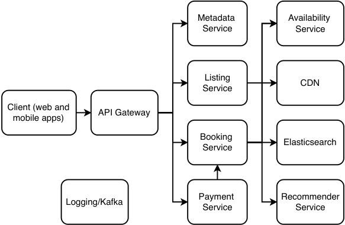
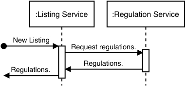
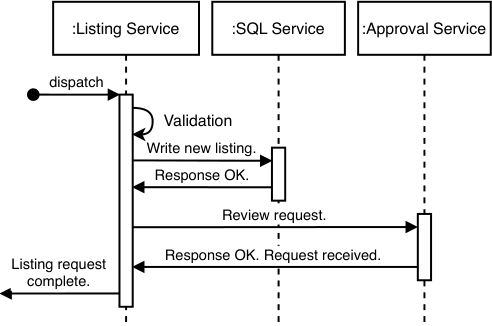
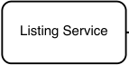
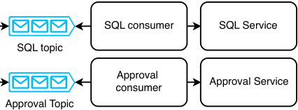
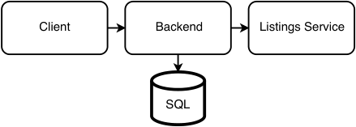
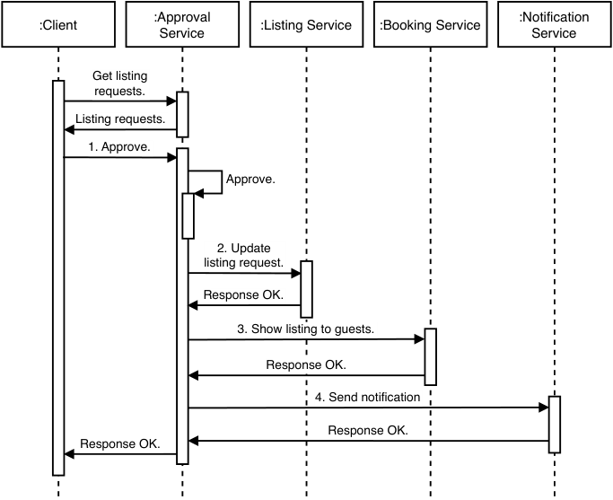
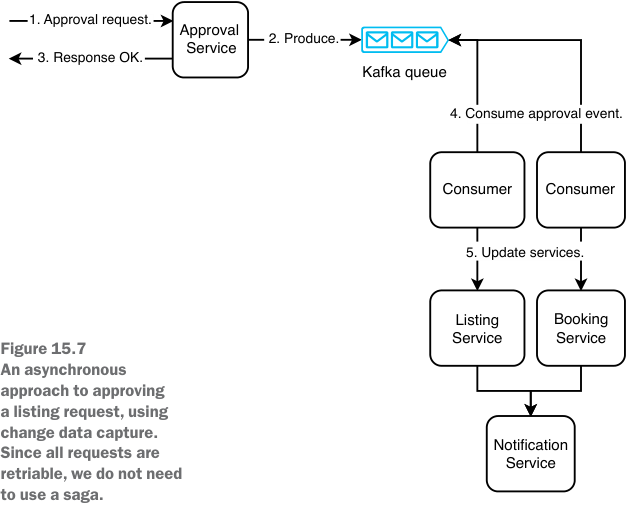
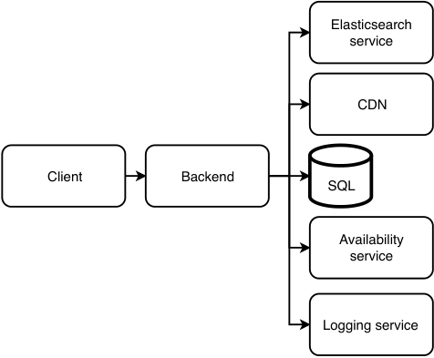
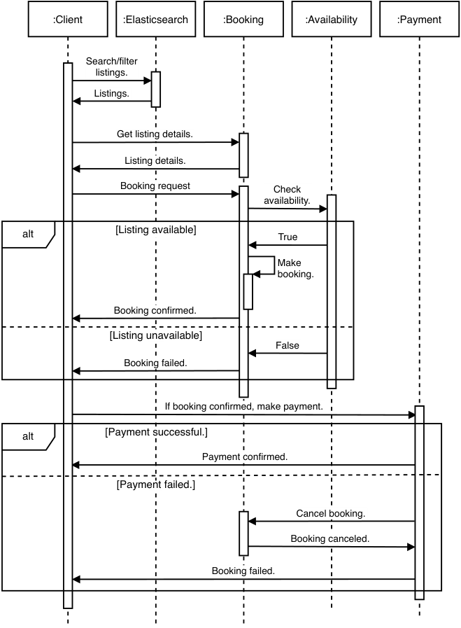

# _Design Airbnb_

## _This chapter covers_

- Designing a reservation system

- Designing systems for operations staff to

- manage items and reservations

- Scoping a complex system

The question is to design a service for landlords to rent rooms for short-term stays to travelers. This may be both a coding and system design question. A coding discussion will be in the form of coding and object-oriented programming (OOP) solution of multiple classes. In this chapter, we assume this question can be applied to reservation systems in general, such as

- Movie tickets

- Air tickets

- Parking lots

- Taxis or ridesharing, though this has different non-functional requirements and different system design.

## _15.1 Requirements_

Before we discuss requirements, we can discuss the kind of system that we are designing. Airbnb is:

- 1 A reservation app, so there is a type of user who makes reservations on finite items. Airbnb calls them “guests.” There is also a type of user who creates listings of these items. Airbnb calls them “hosts.”

- 2 A marketplace app. It matches people who sell products and services to people who buy them. Airbnb matches hosts and guests.

- 3 It also handles payments and collects commissions. This means there are internal users who do customer support and operations (commonly abbreviated as “ops”), to mediate disputes and monitor and react to fraud. This distinguishes Airbnb from simpler apps like Craigslist. The majority of employees in companies like Airbnb are customer support and operations.

At this point, we may clarify with the interviewer whether the scope of the interview is limited to hosts and guests or includes the other types of users. In this chapter, we discuss hosts, guests, operations, and analytics.

A host’s use cases include the following. This list can be very long, so we will limit our discussion to the following use cases.

- Onboarding and updates to add, update, and delete listings. Updates may include small tasks like changing listing photos. There may be much intricate business logic. For example, a listing may have a minimum and/or maximum booking duration, and pricing may vary by day of week or other criteria. The app may display pricing recommendations. Listings may be subject to local regulations. For example, San Francisco’s short-term rental law limits rentals where the host is not present in the unit to a maximum of 90 days per year. Certain listing changes may also require approval from operations staff before they are published.

- Handle bookings—for example accept or reject booking requests:

   - A host may be able to view a guest’s ratings and reviews by other hosts, before accepting or rejecting the guest’s booking request.

   - Airbnb may provide additional options such as automated acceptances under certain host-specified criteria, such as guests with a high average rating.

   - Cancel a booking after accepting it. This may trigger monetary penalties or suspension listing privileges. The exact rules may be complicated.

- Communicate with guests, such as via in-app messaging.

- Post a rating and review of a guest and view the guest’s rating and review.

- Receive payment from the guest (minus Airbnb’s commission).

- Receive tax filing documents.

- Analytics, such as viewing earnings, ratings, and review contents over time.

- Communicate with operations staff, including requests for mediation (such as requesting guests to pay for damages) or reporting fraud.

A guest’s use cases include the following:

- Search and view listings.

- Submit a booking request and payment and check the statuses of booking requests.

- Communicate with hosts.

- Post a rating and review of a listing and view the host’s rating and review.

- Communicate with operations staff, analogous to hosts.

Ops’ use cases include

- Reviewing listing requests and removing inappropriate listings.

- Communicating with customers for purposes such as dispute mediation, offering alternative listings, and sending refunds.

We will not discuss payments in detail because payments are complex. A payment solution must consider numerous currencies and regulations (including taxes) that differ by country, state, city, and other levels of government and are different for various products and services. We may impose different transaction fees by payment type (e.g., a maximum transaction amount for checks or a discount for payments made via gift cards to encourage the purchase of gift cards). The mechanisms and regulations on refunds differ by payment type, product, country, customer, and numerous other factors. There are hundreds or thousands of ways to accept payments, such as

- Cash.

- Various debit and credit card processors like MasterCard, Visa, and many others. Each has their own API.

- Online payment processors like PayPal or Alipay.

- Check/cheque.

- Store credit.

- Payment cards or gift cards that may be specific to certain combinations of companies and countries.

- Cryptocurrency.

Going back to our discussion on requirements, after approximately 5–10 minutes of rapid discussion and scribbling, we clarify the following functional requirements:

- A host may list a room. Assume a room is for one person. Room properties are city and price. The host may provide up to 10 photos and a 25 MB video for a room.

- A guest may filter rooms by city, check-in, and check-out date.

- A guest may book a room with a check-in and check-out date. Host approval for booking is not required.

- A host or guest may cancel a booking at any time before it begins.

- A host or guest may view their list of bookings.

- A guest can have only one room booked for any particular date.

- Rooms cannot be double-booked.

- For simplicity, unlike the actual Airbnb, we exclude the following features:

   - Let a host manually accept or reject booking requests.

   - Cancel a booking (by the guest or host) after it is made is out of scope.

   - We can briefly discuss notifications (such as push or email) to guests and hosts but will not go into depth.

   - Messaging between users, such as between guests and hosts and between ops and guests/hosts.

The following are outside the scope of this interview. It is good to mention these possible functional requirements to demonstrate your critical thinking and attention to detail.

- Other fine details of a place, such as:

   - Exact address. Only a city string is necessary. Ignore other location details like state and country.

   - We assume every listing only permits one guest.

   - Whole place vs. private room vs. shared room.

   - Details of amenities, such as private versus shared bathrooms or kitchen details.

   - Child-friendly.

   - Pet-friendly.

- Analytics.

- Airbnb may provide hosts with pricing recommendations. A listing may set a minimum and maximum price/night, and Airbnb may vary the price within this range.

- Additional pricing options and properties, such as cleaning fees and other fees, different prices on peak dates (e.g., weekends and holidays) or taxes.

- Payments or refunds, including cancellation penalties.

- Customer support, including dispute mediation. A good clarifying question is whether we need to discuss how ops reviews listing requests. We can also ask if the customer support that is out of scope refers to just the booking process or also includes customer support during the listing process. We can clarify that the term “customer” refers to both hosts and guests. In this interview, we assume that the interviewer may request to briefly discuss listing reviews by ops.

- Insurance.

- Chat or other communication between any parties, such as host and guest. This is out of scope because it is a messaging service or notifications service (which we discussed in other chapters) and not a reservation service.

- Signup and login.

- Compensation of hosts and guests for outages.

- User reviews, such as a guest reviewing their stay or a host reviewing their guest’s behavior.

If we need to discuss API endpoints for listing and booking rooms, they can be as follows:

- findRooms(cityId, checkInDate, checkOutDate)

- `bookRoom(userId, roomId, checkInDate, checkOutDate)`

- `cancelBooking(bookingId)`

- `viewBookings(hostId)`

- `viewBookings(guestId)`

Our non-functional requirements are as follows:

- Scalable to 1 billion rooms or 100 million daily bookings. Past booking data can be deleted. No programmatically generated user data.

- Strong consistency for bookings, or more precisely listing availability, so there will be no double bookings or bookings on unavailable dates in general. Eventual consistency for other listing information such as description or photos may be acceptable.

- High availability because there are monetary consequences of lost bookings. However, as we explain later in section 15.2.5, we cannot completely prevent lost bookings if we wish to prevent double bookings.

- High performance is unnecessary. P99 of a few seconds is acceptable.

- Typical security and privacy requirements. Authentication required. User data is private. Authorization is not a requirement for the functionalities in this interview’s scope.

## _15.2 Design decisions_

As we discuss the design for listing and booking rooms, we soon come across a couple of questions.

- 1 Should we replicate rooms to multiple data centers?

- 2 How should the data model represent room availability?

### _15.2.1 Replication_

Our Airbnb system is similar to Craigslist in that the products are localized. A search can be only done on one city at a time. We can take advantage of this to allocate a data center host to a city with many listings or to multiple cities that have fewer listings. Because write performance is not critical, we can use single-leader replication. To minimize read latency, the secondary leader and the followers can be geographically spread out across data centers. We can use a metadata service to contain a mapping of city to leader and follower host IP addresses, for our service to look up the geographically closest follower host to fetch the rooms of any particular city or to write to the leader host corresponding to that city. This mapping will be tiny in size and only modified by admins infrequently, so we can simply replicate it on all data centers, and admins can manually ensure data consistency when updating the mapping.

We can use a CDN to store the room photos and videos, and as usual other static content like JavaScript and CSS.

Contrary to usual practice, we may choose not to use an in-memory cache. In search results, we only display available rooms. If a room is highly desirable, it will soon be reserved and no longer displayed in searches. If a room keeps being displayed in searches, it is likely to be undesirable, and we may choose not to incur the costs and additional complexity of providing a cache. Another way of stating this is that cache freshness is difficult to maintain, and the cached data quickly becomes stale.

As always, these decisions are debatable, and we should be able to discuss their tradeoffs.

### _15.2.2 Data models for room availability_

We should quickly brainstorm various ways to represent room availability in our data model and discuss their tradeoffs. In an interview, one must display the ability to evaluate multiple approaches and not just propose one approach:

- _(room_id, date, guest_id) table_ —This is conceptually simple, with the tradeoff of containing multiple rows that differ only by date. For example, if room 1 is booked by guest 1 for the whole of January, there will be 31 rows.

- _(room_id, guest_id, check_in, check_out) table_ —This is more compact. When a guest submits a search with a check-in and check-out date, we require an algorithm to determine if there are overlapping dates. Should we code this algorithm in the database query or in the backend? The former will be more difficult to maintain and test. But if backend hosts have to fetch this room availability data from the database, this incurs I/O costs. The code for both approaches can be asked in coding interviews.

There are many possible database schemas.

### _15.2.3 Handling overlapping bookings_

If multiple users attempt to book the same room with overlapping dates, the first user’s booking should be granted, and our UI should inform the other users that this room is no longer available for the dates they selected and guide them through finding another available room. This may be a negative UX experience, so we may want to briefly brainstorm a couple of alternative approaches. You may suggest other possibilities.

### _15.2.4 Randomize search results_

We can randomize the order of the search results to reduce such occurrences, though that may interfere with personalization (such as recommender systems.)

### _15.2.5 Lock rooms during booking flow_

When a user clicks on a search result to view the details of a room and possibly submit a booking request, we can lock these dates for the room for a few minutes. During this time, searches by other users with overlapping dates will not return this room in the result list. If this room is locked after other users have already received their search results, clicking on the room’s details should present a notification of the lock and possibly its remaining duration if those users wish to try again, just in case that user did not book that room.

This means that we will lose some bookings. We may decide that preventing double bookings is worth the tradeoff of losing bookings. This is a difference between Airbnb and hotels. A hotel can allow overbooking of its cheaper rooms because it can expect a few cancellations to occur. If the cheaper rooms are overbooked on a particular date, the hotel can upgrade the excess guests to more expensive rooms. Airbnb hosts cannot do this, so we cannot allow double bookings.

Section 2.4.2 describes a mechanism to prevent concurrent update conflicts from multiple users from simultaneously updating a shared configuration.

## _15.3 High-level architecture_

From the previous section’s requirements discussion, we draw our high-level architecture, shown in figure 15.1. Each service serves a group of related functional requirements. This allows us to develop and scale the services separately:

- _Booking service_ —For guests to make bookings. This service is our direct revenue source and has the most stringent non-functional requirements for availability and latency. Higher latency directly translates to lower revenue. Downtime on this service has the most serious effect on revenue and reputation. However, strong consistency may be less important, and we can trade off consistency for availability and latency.

- _Listing service_ —For hosts to create and manage listings. It is important but less critical than the booking and listing services. It is a separate service because it has different functional and non-functional requirements than the booking and availability services, so it should not share resources with them.

- _Availability service_ —The availability service keeps track of listing availability and is used by both the booking and listing services. The availability and latency requirements are as stringent as the booking service. Reads must be scalable, but writes are less frequent and may not require scalability. We discuss this further in section 15.8.

- _Approval service_ —Certain operations like adding new listings or updating certain listing information may require ops approval prior to publishing. We can design an approval service for these use cases. We name the service the “approval service” rather than the more ambiguous-sounding “review service.”

- _Recommender service_ —Provides personalized listing recommendations to guests. We can see it as an internal ads service. A detailed discussion is out of scope in the interview, but we can include it in the diagram and discuss it just for a short moment.

- _Regulations service_ —As discussed earlier, the listing service and booking service need to consider local regulations. The regulations service can provide an API to the listing service, so the latter can provide hosts with the appropriate UX for creating listings that comply with local regulations. The listing service and regulation service can be developed by separate teams, so each team member can concentrate on gaining domain expertise relevant to their respective service. Dealing with regulations may be initially outside the scope of an interview, but the interviewer may be interested to see how we handle it.

- _Other services:_ Collective label for certain services for internal uses like analytics, which are mostly outside the scope of this interview.

Figure 15.1    High-level architecture. As usual, instead of an API gateway, we can use a service mesh in our listing and booking services.

## _15.4 Functional partitioning_

We can employ functional partitioning by geographical region, similar to the approach discussed with Craigslist in section 7.9. Listings can be placed in a data center. We deploy our application into multiple data centers and route each user to the data center that serves their city.

## _15.5 Create or update a listing_

Creating a listing can be divided into two tasks. The first task is for the host to obtain their appropriate listing regulations. The second task is for the host to submit a listing request. In this chapter, we refer to both creating and updating listings as listing requests.

Figure 15.2 is a sequence diagram of obtaining the appropriate regulations. The sequence is as follows:

- 1 The host is currently on the client (a webpage mobile app component) that provides a button to create a new listing. When the host clicks on the button, the app sends a request to the listing service that contains the user’s location. (The host’s location can be obtained by asking the host to manually provide it or by asking the host to grant permission to access their location.)

- 2 The listing service forwards their location to the regulation service (refer to section 15.10.1). The regulation service responds with the appropriate regulations.

- 3 The listing service returns the regulations to the client. The client may adjust the UX to accommodate the regulations. For example, if there is a rule that a booking must last at least 14 days, the client will immediately display an error to the host if they enter a minimum booking period of less than 14 days.

Figure 15.2    Sequence diagram of obtaining the appropriate listing regulations

Figure 15.3 is a sequence diagram of a simplified listing request. The host enters their listing information and submits it. This is sent as a POST request to the listing service. The listing service does the following:

- 1 Validates the request body.

- 2 Writes to a SQL table for listings, which we can name the Listing table. New listings and certain updates need manual approval by the Ops staff. The Listing SQL table can contain a Boolean column named “Approved” that indicates if a listing has been approved by ops.

- 3 If Ops approval is required, it sends a POST request to the Approval service to notify Ops to review the listing.

- 4 Sends the client a 200 response.

Figure 15.3    Sequence diagram of a simplified request to create or update a listing

Referring to figure 15.4, steps 2 and 3 can be done in parallel using CDC. All steps are _idempotent._ We can use INSERT IGNORE on SQL tables to prevent duplicate writes _(_ https://stackoverflow.com/a/1361368/1045085).Wecanalsousetransactionlog tailing, discussed in section 5.3.

Figure 15.4    Using CDC for a distributed transaction to the SQL service and approval service

This is a simplified design. In a real implementation, the listing process may consist of multiple requests to the listing service. The form to create a listing may be divided into multiple parts, and a host may fill and submit each part separately, and each submission is a separate request. For example, adding photos to a listing may be done one at a time. A host may fill in a listing’s title, type, and description and submit it as one request and then fill in pricing details and submit it as another request, and so on.

Another point to note is to allow a host to make additional updates to their listing request while it is pending review. Each update should UPDATE the corresponding listing table row.

We will not discuss notifications in detail because the exact business logic for notifications may be intricate and often change. Notifications can be implemented as a batch ETL job that makes requests to the listing service and then requests a shared notifications service to send notifications. The batch job can query for incomplete listings then

- Notify hosts to remind them that they have not completed the listing process.

- Notify ops of incomplete listings, so ops staff can contact hosts to encourage and guide them to complete the listing process.

## _15.6 Approval service_

The interviewer may be more interested in the booking process, so this discussion on the approval service may be brief.

The approval service is an internal application with low traffic and can have a simple architecture. Referring to figure 15.5, the design consists of a client web application and a backend service, which makes requests to the listings service and a shared SQL service. We assume that manual approval is required for all requests; for example, we cannot automate any approvals or rejections.

Figure 15.5    High-level architecture of the approval service, for Ops personnel to review certain operations, such as adding or updating listings

The approval service provides a POST endpoint for the listing service to submit listing requests that require review. We can write these requests to a SQL table we call “listing_request,” which contains the following columns:

- _id_ —An ID. The primary key.

- _listing_id_ —The listing ID in the Listing table in the listing service. If both tables were in the same service, this would be a foreign key.

- _created_at_ —Timestamp that this listing request was created or updated.

- _listing_hash_ —We may include this column as part of an additional mechanism to ensure that an Ops staff member does not submit an approval or rejection of a listing request that changed while they were reviewing it.

- _status_ —An enum of the listing request, which can be one of the values “none,” “assigned,” and “reviewed.”

- _last_accessed_ —Timestamp that this listing request was last fetched and returned to an Ops staff member.

- _review_code_ —An enum. May be simply “APPROVED” for approved listing requests. There may be multiple enums that correspond to categories of reasons to reject a listing request. Examples include VIOLATE_LOCAL_REGULATIONS, BANNED_HOST, ILLEGAL_CONTENT, SUSPICIOUS, FAIL_QUALITY_ STANDARDS, etc.

- _reviewer_id_ —The ID of the operations staff member who was assigned this listing request.

- _review_submitted_at_ —Timestamp that the Ops staff member submitted their approval or rejection.

- _review_notes_ —An Ops staff member may author some notes on why this listing request was approved or rejected.

Assuming we have 10,000 Operations staff, and each staff member reviews up to 5000 new or updated listings weekly, Ops will write 50 million rows weekly to the SQL table. If each row occupies 1 KB, the approval table will grow by 1 KB * 50M * 30 days = 1.5 TB monthly. We can keep 1–2 months of data in the SQL table and run a periodic batch job to archive old data into object storage.

We can also design endpoints and an SQL table for each ops staff to obtain and perform their assigned work/reviews. An Ops staff member can first make a GET request containing their ID to fetch a listing request from the listing_request table. To prevent multiple staff from being assigned the same listing request, the backend can run an SQL transaction with the following steps:

- 1 If a staff member has already been assigned a listing request, return this assigned request. SELECT a row with status “assigned” and with the staff member's ID as the reviewer_id.

- 2 If there is no assigned listing request, SELECT the row with the minimum created_at timestamp that has status “none”. This will be the assigned listing request.

- 3 UPDATE the status to “assigned,” and the reviewer_id to the ops staff member’s ID.

The backend returns this listing request to the Ops staff, who will review it and approve or reject it. Figure 15.6 is a sequence diagram of a synchronous approval process. Approval or rejection is a POST request to the Approval, which triggers the following steps:

- 1 UPDATE the row into the listing_request table. UPDATE the columns status, review_code, review_submitted_at, and review_notes. There is a possible race condition where a host may update their listing request while an Ops staff member is reviewing it, so the POST request should contain the listing hash that the approval service had earlier returned to the Ops staff member, and the backend should ensure this hash is identical to the present hash. If the hashes are different, return the updated listing request to the Ops staff member, who will need to repeat the review.

We may try to identify this race condition by checking if listing_request.last_ accessed timestamp is more recent than listing_request.review_submitted_at. However, this technique is unreliable because the clocks of the various hosts that timestamp columns are not perfectly synchronized. Also, the time may have been changed for any multitude of reasons such as daylight savings, server restarts, the server clock may be periodically synchronized with a reference server, etc. In distributed systems, it is not possible to rely on clocks to ensure consistency (Martin Kleppmann, _Designing Data-Intensive Applications_ (O’Reilly, 2017)).

#### Lamport clock and vector clock

Lamport clock (https://martinfowler.com/articles/patterns-of-distributed-systems/lamport-clock.html)isatechniqueforordering events in a distributed system. Vector clock is a more sophisticated technique. For more details, refer to chapter 11 of the book by George Coulouris, Jean Dollimore, Tim Kindberg, and Gordon Blair, _Distributed Systems: Concepts and Design,_ Pearson, 2011 _._

- 2 Send a PUT request to the Listing Service, which will UPDATE the listing_ request.status and listing_request.reviewed_at columns. Again, first SELECT the hash and verify that it is identical to the submitted hash. Wrap both SQL queries in a transaction.

- 3 Send a POST request to the Booking Service, so the booking service may begin showing this listing to guests. An alternative approach is described in figure 15.7.

- 4 The backend also requests a shared notification service (chapter 9) to notify the host of the approval or rejection.

- 5 Finally, the backend sends a 200 response to the client. These steps should be written in an idempotent manner, so any or all steps can be repeated if a host fails during any step.

Discuss how this POST request can be idempotent in case it fails before all steps are completed and we must retry the same request. For example:

- The backend can query the notification service to check if a particular notification request has already been made, before making the notification request.

- To prevent duplicate rows in the approval table, the SQL row insertion can use a “IF NOT EXISTS” operator.

As we can see, this synchronous request involves requests to multiple services and may have long latency. A failed request to any service will introduce inconsistency.

Figure 15.6    Sequence diagram of fetching listing requests followed by a synchronous approval of a listing request. The approval service can be a saga orchestrator.

Should we use change data capture (CDC) instead? Figure 15.7 illustrates this asynchronous approach. In an approval request, the approval service produces to a Kafka queue and returns 200. A consumer consumes from the Kafka queue and makes the requests to all these other services. The rate of approvals is low, so the consumer can employ exponential backoff and retry to avoid rapidly polling the Kafka queue when the latter is empty, and poll only once per minute when the queue is empty.

The notification service should notify the host only after the listing and booking services are updated, so it consumes from two Kafka topics, one corresponding to each service. When the notification service consumes an event from one topic corresponding to a particular listing approval event, it must wait for the event from the other service that corresponds to the same listing approval event, and then it can send the notification. So, the notification service needs a database to record these events. This database is not shown in figure 15.7.

As an additional safeguard against silent errors that may cause inconsistency between the services, we can implement a batch ETL job to audit the three services. This job can trigger an alert to developers if it finds inconsistency.

We use CDC rather than saga for this process because we do not expect any of the services to reject the request, so there will not be any required compensating transactions. The listing service and booking service have no reason to prevent the listing from going live, and the notification service has no reason not to send the user a notification.

But what if a user cancels their account just before their listing is approved? We will need a CDC process to either deactivate or delete their listings and make requests to other services as appropriate. If the various services involved in the approval process of figure 15.6 receive the user deletion request just before the approval request, they can either record that the listing is invalid or delete the listing. Then the approval request will not cause the listing to become active. We should discuss with our interviewer on the tradeoffs of various approaches and other relevant concerns that come to mind. They will appreciate this attention to detail.

There may be other requested features. For example, a listing review may involve more than one Ops staff member. We can bring up these points and discuss them if the interviewer is interested.

An Ops staff may specialize in reviewing listing requests of certain jurisdictions, so how may we assign their appropriate listing requests? Our application is already functionally partitioned by geographical region, so if a staff member can review listing requests of listings in a particular data center, nothing else is required in our design. Otherwise, we can discuss some possibilities:

- A JOIN query between the listing_request table and the listing table to fetch listing requests with a particular country or city. Our listing_request table and listing table are in different services, so we will need a different solution:

   - Redesign our system. Combine the listing and approval services, so both tables are in the same service.

   - Handle the join logic in the application layer, which carries disadvantages such as I/O cost of data transfer between services.

   - Denormalize or duplicate the listing data, by adding a location column to listing_request table or duplicating the listing table in the approvals service. A listing’s physical location does not change, so there is low risk of inconsistency due to denormalization or duplication, though inconsistency can happen, such as from bugs or if the initially entered location was wrong then corrected.

- A listing ID can contain a city ID, so one can determine the listing’s city by the listing ID. Our company can maintain a list of (ID, city), which can be accessed by any service. This list should be append-only so we will not need to do expensive and error-prone data migrations.

As stated here, approved listings will be copied to the booking service. Because the booking service may have high traffic, this step may have the highest failure rate. As per our usual approaches, we can implement exponential backoff and retry or a dead letter queue. The traffic from our approval service to the booking service is negligible compared to traffic from guests, so we will not try to reduce the probability of booking service downtime by reducing traffic from the approval service.

Last, we can also discuss automation of some approvals or rejections. We can define rules in a SQL table “Rules,” and a function can fetch these rules and apply them on the listing contents. We can also use machine learning; we can train machine-learning models in a machine-learning service, and place selected model IDs into the Rules table, so the function can send the listing contents along with the model IDs to the machine learning service, which will return approval, rejection, or inconclusive (i.e., requires manual review). The listing_request.reviewer_id can be a value like “AUTOMATED,” while the listing_request.review_code value of an inconclusive review can be “INCONCLUSIVE.”

## _15.7 Booking service_

The steps of a simplified booking/reservation process are as follows:

- 1 A guest submits a search query for the listing that matches the following and receives a list of available listings. Each listing in the result list may contain a thumbnail and some brief information. As discussed in the requirements section, other details are out of scope.

   - City

   - Check-in date

   - Check-out date

- 2 The guest may filter the results by price and other listing details.

- 3 The guest clicks on a listing to view more details, including high-resolution photos and videos if any. From here, the guest may go back to the result list.

- 4 The guest has decided on which listing to book. They submit a booking request and receive a confirmation or error.

- 5 If the guest receives a confirmation, they are then directed to make payment.

- 6 A guest may change their mind and submit a cancellation request.

Similar to the listing service discussed earlier, we may choose to send notifications such as

- Notify guests and hosts after a booking is successfully completed or canceled.

- If a guest filled in the details of a booking request but didn’t complete the booking request, remind them after some hours or days to complete the booking request.

- Recommend listings to guests based on various factors like their past bookings, listings they have viewed, their other online activity, their demographic, etc. The listings can be selected by a recommender system.

- Notifications regarding payments. Regarding payment, we may choose to escrow payments before the host accepts or request payment only after the host accepts. The notification logic will vary accordingly.

Let’s quickly discuss scalability requirements. As discussed earlier, we can functionally partition listings by city. We can assume that we have up to one million listings in a particular city. We can make a generous overestimate of up to 10 million daily requests for search, filtering, and listing details. Even assuming that these 10 million requests are concentrated in a single hour of the day, this works out to less than 3,000 queries per second, which can be handled by a single or small number of hosts. Nonetheless, the architecture discussed in this section will be capable of handling much larger traffic.

Figure 15.8 is a high-level architecture of the booking service. All queries are processed by a backend service, which queries either the shared Elasticsearch or SQL services as appropriate.

Figure 15.8    High-level architecture of the booking service

Search and filter requests are processed on the Elasticsearch service. The Elasticsearch service may also handle pagination (https://www.elastic.co/guide/en/elasticsearch/reference/current/paginate-search-results.html),soitcansavememory and CPU usage by returning only a small number of results at a time. Elasticsearch supports fuzzy search, which is useful to guests who misspell locations and addresses.

A request to CRUD details of a listing is formatted into a SQL query using an ORM and made against the SQL service. Photos and videos are downloaded from the CDN. A booking request is forwarded to the availability service, which is discussed in detail in the next section. Write operations to the booking service’s SQL database are by

- 1 Booking requests.

- 2 The approval service as described in the previous section. The approval service makes infrequent updates to listing details.

- 3 Requests to cancel bookings and make the listings available again. This occurs if payments fail.

Our SQL service used by this booking service can use the leader-follower architecture discussed in section 4.3.2. The infrequent writes are made to the leader host, which will replicate them to the follower hosts. The SQL service may contain a Booking table with the following columns:

- _id_ —A primary key ID assigned to a booking.

- _listing_id_ —The listing’s ID assigned by the Listing service. If this table was in the listing service, this column would be a foreign key.

- _guest_id_ —The ID of the guest who made the booking.

- _check_in_ —Check-in date.

- _check_out_ —Check-out date.

- _timestamp_ —The time this row was inserted or updated. This column can be just for record-keeping.

The other write operations in this process are to the availability service:

- 1 The booking or cancellation request will alter a listing’s availability on the relevant dates.

- 2 We may consider locking the listing for five minutes at step 3 in the booking process (request more of a listing’s details) because the guest may make a booking request. This means that the listing will not be shown to other guests who made search queries with dates that overlap the current guest’s. Conversely, we may unlock the listing early (before the five minutes are up) if the guest makes a search or filtering request, which indicates that they are unlikely to book this listing.

The Elasticsearch index needs to be updated when a listing’s availability or details change. Adding or updating a listing requires write requests to both the SQL service and Elasticsearch service. As discussed in chapter 5, this can be handled as a distributed transaction to prevent inconsistency should failures occur during writes to either service. A booking request requires writes to the SQL services in both the booking service and availability service (discussed in the next section) and should also be handled as a distributed transaction.

If the booking causes the listing to become ineligible for further listings, the booking service must update its own database to prevent further bookings and also update the Elasticsearch service so this listing stops appearing in searches.

The Elasticsearch result may sort listings by decreasing guest ratings. The results may also be sorted by a machine learning experiment service. These considerations are out of scope.

Figure 15.9 is a sequence diagram of our simplified booking process.

Figure 15.9    Sequence diagram of our simplified booking process. Many details are glossed over. Examples: Getting the listing details may involve a CDN. We don’t give hosts the option to manually accept or reject booking requests. Making payment will involve a large number of requests to multiple services. We did not illustrate requests to our notification service.

Last, we may consider that many guests may search for listings and view the details of many listings before making a booking request, so we can consider splitting the search and view functions vs. the booking function into separate services, so they can scale separately. The service to search and view listings will receive more traffic and be allocated more resources than the service to make booking requests.

## _15.8 Availability service_

The availability service needs to avoid situations like the following:

- Double bookings.

- A guest’s booking may not be visible to the host.

- A host may mark certain dates as unavailable, but a guest may book those dates.

- Our customer support department will be burdened by guest and host complaints from these poor experiences.

The availability service provides the following endpoints:

- Given a location ID, listing type ID, check-in date, and check-out date, GET available listings.

- Lock a listing from a particular check-in date to check-out date for a few (e.g., five) minutes.

- CRUD a reservation, from a particular check-in date to check-out date.

Figure 15.10 is the high-level architecture of the availability service. It consists of a backend service, which makes requests to a shared SQL service. The shared SQL service has a leader-follower architecture, illustrated in figures 4.1 and 4.2.

Figure 15.10    High-level architecture of the availability service

The SQL service can contain an availability table, which can have the following columns. There is no primary key:

- _listing_id_ —The listing’s ID assigned by the listing service.

- _date_ —The availability date.

- _booking_id_ —The booking/reservation ID assigned by the booking service when a booking is made.

- _available_ —A string field that functions as an enum. It indicates if the listing is available, locked, or booked. We may save space by deleting the row if this (listing_id, date) combination is not locked or booked. However, we aim to achieve high occupancy, so this space saving will be insignificant. Another disadvantage is that our SQL service should provision sufficient storage for all possible rows, so if we save space by not inserting rows unless required, we may not realize that we have insufficient storage provisioned until we have a high occupancy rate across our listings.

- _timestamp_ —The time this row was inserted or updated.

We discussed a listing lock process in the previous section. We can display a six-minute timer on the client (web or mobile app). The timer on the client should have a slightly longer duration than the timer on the backend because the clocks on the client and the backend host cannot be perfectly synchronized.

This lock listing mechanism can reduce, but not completely prevent, multiple guests from making overlapping booking requests. We can use SQL row locking to prevent overlapping bookings. (Refer to https://dev.mysql.com/doc/refman/8.0/en/glossary.html#glos_exclusive_lockandhttps://www.postgresql.org/docs/current/explicit-locking.html#LOCKING-ROWS.) The backend service must use an SQL transaction on the leader host. First, make a SELECT query to check if the listing is available on the requested dates. Second, make an INSERT or UPDATE query to mark the listing accordingly.

A consistency tradeoff of the leader-follower SQL architecture is that a search result may contain unavailable listings. If a guest attempts to book an unavailable listing, the booking service can return a 409 response. We do not expect the effect on user experience to be too severe because a user can expect that a listing may be booked while they are viewing it. However, we should add a metric to our monitoring service to monitor such occurrences, so we will be alerted and can react as necessary if this occurs excessively.

Earlier in this chapter, we discussed why we will not cache popular (listing, date) pairs. If we do choose to do so, we can implement a caching strategy suited for readheavy loads; this is discussed in section 4.8.1.

How much storage is needed? If each column occupies 64 bits, a row will occupy 40 bytes. One million listings will occupy 7.2 GB for 180 days of data, which can easily fit on a single host. We can manually delete old data as required to free up space.

An alternative SQL table schema can be similar to the Booking table discussed in the previous section, except that it may also contain a column named “status” or “availability” that indicates if the listing is locked or booked. The algorithm to find if a listing is available between a certain check-in and check-out date can be a coding interview question. You may be asked to code a solution in a coding interview, but not in a system design interview.

## _15.9 Logging, monitoring, and alerting_

Besides what was discussed in section 2.5, such as CPU, memory, disk usage of Redis, and disk usage of Elasticsearch, we should monitor and send alerts for the following.

We should have anomaly detection for an unusual rate of bookings, listings, or cancellations. Other examples include an unusually high rate of listings being manually or programmatically flagged for irregularities.

Define end-to-end user stories, such as the steps that a host takes to create a listing or the steps a guest takes to make a booking. Monitor the rate of completed vs. non-completed user stories/flows, and create alerts for unusually high occurrences of situations where users do not go through an entire story/flow. Such a situation is also known as a low funnel conversion rate.

We can define and monitor the rate of undesirable user stories, such as booking requests either not being made or being canceled after communication between guests and hosts.

## _15.10 Other possible discussion topics_

The various services and business logic discussed in this chapter read like a smattering of topics and a gross oversimplification of a complex business. In an interview, we may continue designing more services and discussing their requirements, users, and inter-service communication. We may also consider more details of the various user stories and the corresponding intricacies in their system design:

- A user may be interested in listings that do not exactly match their search criteria. For example, the available check-in date and/or check-out date may be slightly different, or listings in nearby cities may also be acceptable. How may we design a search service that returns such results? May we modify the search query before submitting it to Elasticsearch, or how may we design an Elasticsearch index that considers such results as relevant?

- What other features may we design for hosts, guests, Ops, and other users? For example, can we design a system for guests to report inappropriate listings? Can we design a system that monitors host and guest behavior to recommend possible punitive actions such as restrictions on using the service or account deactivation?

- Functional requirements defined earlier as outside the scope of the interview. Their architecture details, such as whether the requirements are satisfied in our current services or should be separate services.

- We did not discuss search. We may consider letting guests search for listings by keywords. We will need to index our listings. We may use Elasticsearch or design our own search service.

- Expand the product range, such as offering listings suited to business travelers.

- Allow double-booking, similar to hotels. Upgrade guests if rooms are unavailable, since more expensive rooms tend to have high vacancy.

- Chapter 17 discusses an example analytics system.

- Show users some statistics (e.g., how popular a listing is).

- Personalization, such as a recommender system for rooms. For example, a recommender service can recommend new listings so they will quickly have guests, which will be encouraging to new hosts.

- A frontend engineer or UX designer interview may include discussion of UX flows.

- Fraud protection and mitigation.

### _15.10.1 Handling regulations_

We can consider designing and implementing a dedicated regulation service to provide a standard API for communicating regulations. All other services must be designed to interact with this API, so they are flexible to changing regulations or at least be more easily redesigned in response to unforeseen regulations.

In the author’s experience, designing services to be flexible to changing regulations is a blind spot in many companies, and considerable resources are spent on re-architecture, implementation, and migration each time regulations change.

#### Exercise

A possible exercise is to discuss differences in regulations requirements between Airbnb and Craigslist.

Data privacy laws are a relevant concern to many companies. Examples include COPPA (https://www.ftc.gov/enforcement/rules/rulemaking-regulatory-reform-proceedings/childrens-online-privacy-protection-rule), GDPR (https://gdpr-info.eu/),and CCPA (https://oag.ca.gov/privacy/ccpa).Somegovernmentsmayrequirecompaniesto share data on activities that occur in their jurisdictions or that data on their citizens cannot leave the country.

Regulations may affect the core business of the company. In the case of Airbnb, there are regulations directly on hosts and guests. Examples of such regulations may include

- A listing may only be hosted for a maximum number of days in a year.

- Only properties constructed before or after a certain year can be listed.

- Bookings cannot be made on certain dates, such as certain public holidays.

- Bookings may have a minimum or maximum duration in a specific city.

- Listings may be disallowed altogether in certain cities or addresses.

- Listing may require safety equipment such as carbon monoxide detectors, fire detectors, and fire escapes.

- There may be other livability and safety regulations.

Within a country, certain regulations may be specific to listings that meet certain conditions, and the specifics may differ by each specific country, state, city, or even address (e.g., certain apartment complexes may impose their own rules).

## _Summary_

- Airbnb is a reservation app, a marketplace app, and a customer support and operations app. Hosts, guests, and Ops are the main user groups.

- Airbnb’s products are localized, so listings can be grouped in data centers by geography.

- The sheer number of services involved in listing and booking is impossible to comprehensively discuss in a system design interview. We can list a handful of main services and briefly discuss their functionalities.

- Creating a listing may involve multiple requests from the Airbnb host to ensure the listing complies with local regulations.

- After an Airbnb host submits a listing request, it may need to be manually approved by an Ops/admin member. After approval, it can be found and booked by guests.

- Interactions between these various services should be asynchronous if low latency is unnecessary. We employ distributed transactions techniques to allow asynchronous interactions.

- Caching is not always a suitable strategy to reduce latency, especially if the cache quickly becomes stale.

- Architecture diagrams and sequence diagrams are invaluable in designing a complex transaction.

