# _Design a news feed_

## _This chapter covers_

- Designing a personalized scalable system

- Filtering out news feed items

- Designing a news feed to serve images and text

Design a news feed that provides a user with a list of news items, sorted by approximate reverse chronological order that belong to the topics selected by the user. A news item can be categorized into 1–3 topics. A user may select up to three topics of interest at any time.

This is a common system design interview question. In this chapter, we use the terms “news item” and “post” interchangeably. In social media apps like Facebook or Twitter, a user’s news feed is usually populated by posts from friends/connections. However, in this news feed, users get posts written by other people in general, rather than by their connections.


## _16.1 Requirements_

These are the functional requirements of our news feed system, which as usual we can discuss/uncover via an approximately five-minute Q&A with the interviewer.

- A user can select topics of interest. There are up to 100 tags. (We will use the term “tag” in place of “news topic” to prevent ambiguity with the term “Kafka topic.”)

- A user can fetch a list of English-language news items 10 at a time, up to 1,000 items.

- Although a user need only fetch up to 1,000 items, our system should archive all items.

- Let’s first allow users to get the same items regardless of their geographical location and then consider personalization, based on factors like location and language.

- Latest news first; that is, news items should be arranged in reverse chronological order, but this can be an approximation.

- Components of a news item:

   - A new item will usually contain several text fields, such as a title with perhaps a 150-character limit and a body with perhaps a 10,000-character limit. For simplicity, we can consider just one text field with a 10,000-character limit.

   - UNIX timestamp that indicates when the item was created.

   - We initially do not consider audio, images, or video. If we have time, we can consider 0–10 image files of up to 1 MB each.

TIP    The initial functional requirements exclude images because images add considerable complexity to the system design. We can first design a system that handles only text and then consider how we can expand it to handle images and other media.

- We can consider that we may not want to serve certain items because they contain inappropriate content.

The following are mostly or completely out of scope of the functional requirements:

- Versioning is not considered because an article can have multiple versions. An author may add additional text or media to an article or edit the article to correct errors.

- We initially do not need to consider analytics on user data (such as their topics of interest, articles displayed to them, and articles they chose to read) or sophisticated recommender systems.

- We do not need any other personalization or social media features like sharing or commenting.

- We need not consider the sources of the news items. Just provide a POST API endpoint to add news items.


- We initially do not need to consider search. We can consider search after we satisfy our other requirements.

- We do not consider monetization such as user login, payments, or subscriptions. We can assume all articles are free. We do not consider serving ads along with articles.

The non-functional requirements of our news feed system can be as follows:

- Scalable to support 100K daily active users each making an average of 10 requests daily, and one million news items/day.

- High performance of one-second P99 is required for reads.

- User data is private.

- Eventual consistency of up to a few hours is acceptable. Users need not be able to view or access an article immediately after it is uploaded, but a few seconds is desirable. Some news apps have a requirement that an item can be designated as “breaking news,” which must be delivered immediately with high priority, but our news feed need not support this feature.

- High availability is required for writes. High availability for reads is a bonus but not required, as users can cache old news on their devices.

## _16.2 High-level architecture_

We first sketch a very high-level architecture of our news feed system, shown in figure 16.1. The sources of the news items submit news items to an ingestion service in our backend, and then they are written to a database. Users query our news feed service, which gets the news items from our database and returns them to our users.


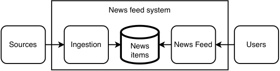


Figure 16.1    Initial very high-level architecture of our news feed. News sources submit news items to an ingestion service, which processes them and persists them to a database. On the other side, users query our news feed service, which gets news items from our database.

A few observations we can make from this architecture:

- The ingestion service must be highly available and handle heavy and unpredictable traffic. We should consider using an event streaming platform like Kafka.

- The database needs to archive all items but only provide up to 1,000 items to a user. This suggests that we can use one database to archive all items and others to serve the required items. We can choose a database technology best suited for increases to a large number, and the usual responsibilities of the frontend have different hardware resources compared to querying the metadata service and Redis service, we can split the latter two functionalities away into a separate backend service, so we can scale these capabilities independently.

Regarding the eventual consistency requirement and our observation that a user’s device may not need to update its news items more frequently than hourly, if a user requests an update within an hour of their previous request, we can reduce our service load in at least either of these two approaches:

- 1 Their device can ignore the request.

- 2 Their device can make the request, but do not retry if the response is a 504 timeout.

The ETL jobs write to another Kafka queue. When backend hosts are not serving user requests for posts, they can consume from the Kafka queue and update the Redis table. The ETL jobs fulfill the following functions:

Before the raw news items are served to users, we may first need to run validation or moderation/censorship tasks that depend on other news items or other data in general. For simplicity, we will collectively refer to all such tasks as “validation tasks.” Referring to figure 16.3, these can be parallel ETL tasks. We may need an additional HDFS table for each task. Each table contains the item IDs that passed the validations. Examples are as follows:

- Finding duplicate items.

- If there is a limit on the number of news items on a particular tag/subject that can be submitted within the last hour, there can be a validation task for this.

- Determine the intersection of the item IDs from the intermediate HDFS tables. This is the set of IDs that passed all validations. Write this set to a final HDFS table. Read the IDs from the final HDFS table and then copy the corresponding news items to overwrite the Redis cache.


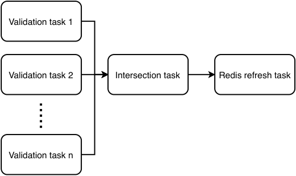


Figure 16.3    ETL job DAG. The validation tasks run in parallel. Each validation task outputs a set of valid post IDs. When the tasks are done, the intersection task determines the intersection of all these sets, which are the IDs of posts that users can be served.


We may also have ETL jobs to trigger notifications via a notification service. Notification channels may include our mobile and browser apps, email, texting, and social media. Refer to chapter 9 for a detailed discussion on a notification service. We will not discuss this in detail in this chapter.

Notice the key role of moderation in our news feed service, as illustrated in figure 16.2 and discussed in the context of our ETL jobs. We may also need to moderate the posts for each specific user, e.g., as discussed earlier, blocked users should not be allowed to make requests. Referring to figure 16.4, we can consider unifying all this moderation into a single moderation service. We discussed this further in section 16.4.


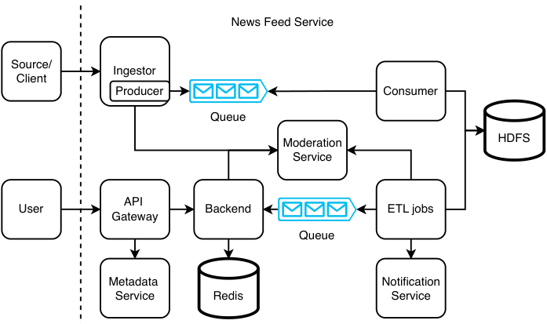


Figure 16.4    High-level architecture of our news feed system with all content moderation centralized in a moderation service. Developers can define all content moderation logic in this service.

## _16.3 Prepare feed in advance_

In our design in figure 16.2, each user will need one Redis query per (tag, hour) pair. Each user may need to make many queries to obtain their relevant or desired items, causing high read traffic and possibly high latency on our news feed service.

We can trade off higher storage for lower latency and traffic by preparing a user’s feed in advance. We can prepare two hash maps, {user ID, post ID} and {post ID, post}. Assuming 100 tags with 1K 10K-character items each, the latter hash map occupies slightly over 1 GB. For the former hash map, we will need to store one billion user IDs and up to 100*1000 possible post IDs. An ID is 64 bits. Total storage requirement is up to 800 TB, which may be beyond the capacity of a Redis cluster. One possible solution is to partition the users by region and store just two to three regions per data center, so there are up to 20M users per data center, which works out to 16 TB. Another possible solution is to limit the storage requirement to 1 TB by limiting it to a few dozen post IDs, but this does not fulfill our 1,000-item requirement.


Another possible solution is to use a sharded SQL implementation for the {user ID, post ID} pair, as discussed in section 4.3. We can shard this table by hashed user ID, so user IDs are randomly distributed among the nodes, and the more intensive users are randomly distributed too. This will prevent hot shard problems. When our backend receives a request for a user ID’s posts, it can hash the user ID and then make a request to the appropriate SQL node. (We will discuss momentarily how it finds an appropriate SQL node.) The table that contains the {post ID, post} pairs can be replicated across every node, so we can do JOIN queries between these two tables. (This table may also contain other dimension columns for timestamp, tag, etc.) Figure 16.5 illustrates our sharding and replication strategy.


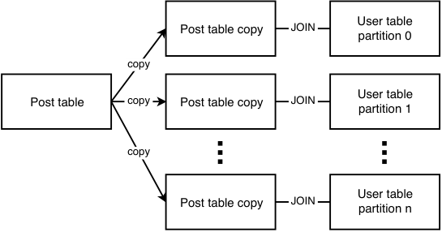


Figure 16.5    Illustration of our sharding and replication strategy. The table with {hashed user ID, post ID} is sharded and distributed across multiple leader hosts and replicated to follower hosts. The table with {post ID, post} is replicated to every host. We can JOIN on post ID.

Referring to figure 16.6, we can divide the 64-bit address space of hashed user IDs among our clusters. Cluster 0 can contain any hashed user IDs in [0, (2[64] – 1)/4), cluster 1 can contain any hashed user IDs in [(2[64] – 1)/4, (2[64] – 1)/2), cluster 2 can contain any hashed user IDs in [(2[64] – 1)/2, 3 * (2[64] – 1)/4), and cluster 3 can contain any hashed user IDs in [3 * (2[64] – 1)/4, 2[64] – 1). We can start with this even division. As traffic will be uneven between clusters, we can balance the traffic by adjusting the number and sizes of the divisions.


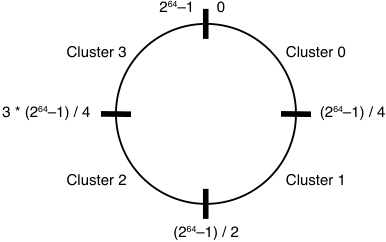


Figure 16.6    Consistent hashing of hashed user IDs to cluster names. We can divide clusters across the 64-bit address space. In this illustration, we assume we have four clusters, so each cluster takes one-quarter of the address space. We can start with even divisions and then adjust the number and sizes of divisions to balance the traffic between them.


How does our backend find an appropriate SQL node? We need a mapping of hashed user IDs to cluster names. Each cluster can have multiple A records, one for each follower, so a backend host is randomly assigned to a follower node in the appropriate cluster.

We need to monitor traffic volume to the clusters to detect hot shards and rebalance the traffic by resizing clusters appropriately. We can adjust the host’s hard disk capacity to save costs. If we are using a cloud vendor, we can adjust the VM (virtual machine) size that we use.

Figure 16.7 illustrates the high-level architecture of our news feed service with this design. When a user makes a request, the backend hashes the user ID as just discussed. The backend then does a lookup to ZooKeeper to obtain the appropriate cluster name and sends the SQL query to the cluster. The query is sent to a random follower node, executed there, and then the result list of posts is returned to the user.


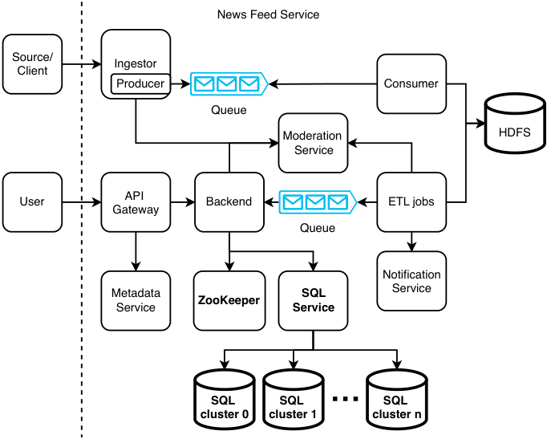


Figure 16.7    High-level architecture of our news feed service with user feeds prepared in advance. Differences from figure 16.4 are bolded. When a user request arrives at our backend, our backend first obtains the appropriate SQL cluster name and then queries the appropriate SQL cluster for the posts. Our backend can direct user requests to a follower node that contains the requested user ID. Alternatively, as illustrated here, we can separate the routing of SQL requests into an SQL service.

If our only client is a mobile app (i.e., no web app), we can save storage by storing posts on the client. We can then assume that a user only needs to fetch their posts once and delete their rows after they are fetched. If a user logs in to a different mobile device, they will not see the posts that they had fetched on their previous device. This occurrence may be sufficiently uncommon, and so it is acceptable to us, especially because news quickly becomes outdated, and a user will have little interest in a post a few days after it is published.

Another way is to add a timestamp column and have an ETL job that periodically deletes rows that are older than 24 hours.

We may decide to avoid sharded SQL by combining both approaches. When a user opens the mobile app, we can use a prepared feed to serve only their first request for their posts and only store the number of post IDs that can fit into a single node. If the user scrolls down, the app may make more requests for more posts, and these requests can be served from Redis. Figure 16.8 illustrates the high-level architecture of this approach with Redis. This approach has tradeoffs of higher complexity and maintenance overhead for lower latency and cost.


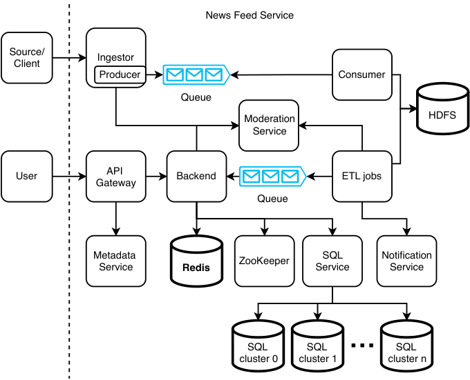


Figure 16.8    High-level architecture with both a prepared feed and Redis service. The difference from figure 16.7 is the added Redis service, which is bolded.

Let’s discuss a couple of ways a client can avoid fetching the same posts from Redis more than once:

- 1 A client can include the post IDs that it currently has in its `GET /post` request, so our backend can return posts that the client hasn’t fetched.

- 2 Our Redis table labels posts by hour. A client can request its posts of a certain hour. If there are too many posts to be returned, we can label posts by smaller time increments (such as blocks of 10 minutes per hour). Another possible way is to provide an API endpoint that returns all post IDs of a certain hour and a request body on the `GET /post` endpoint that allows users to specify the post IDs that it wishes to fetch.

## _16.4 Validation and content moderation_

In this section, we discuss concerns about validation and possible solutions. Validation may not catch all problems, and posts may be erroneously delivered to users. Content filtering rules may differ by user demographic.

Refer to section 15.6 for a discussion of an approval service for Airbnb, which is another approach to validation and content moderation. We will briefly discuss this here. Figure 16.9 illustrates our high-level architecture with an approval service. Certain ETL jobs may flag certain posts for manual review. We can send such posts to our approval service for manual review. If a reviewer approves a post, it will be sent to our Kafka queue to be consumed by our backend and served to users. If a reviewer rejects a post, our approval service can notify the source/client via a messaging service.


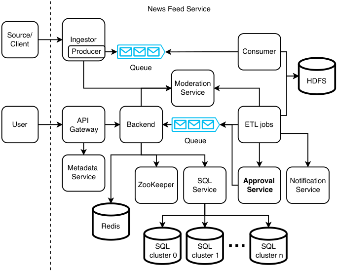


Figure 16.9    ETL jobs can flag certain posts for manual approval. These posts can be sent to our approval service (in bold; this service is added to figure 16.8) for manual review, instead of being produced by a Kafka queue. (If we have a high rate of posts flagged for review, our approval service itself may need to contain a Kafka queue.) If a reviewer approves a post, it will be sent back to our Kafka queue via an ETL job to be consumed by our backend (or it can send the post directly to our backend). If a reviewer rejects a post, our approval service can notify the source/client via a messaging service, not illustrated in this figure.


### _16.4.1 Changing posts on users’ devices_

Certain validations are difficult to automate. For example, a post may be truncated. For simplicity, consider a post with just one sentence: “This is a post.” A truncated post can be: “This is a.” A post with spelling mistakes is easy to detect, but this post has no spelling mistakes but is clearly invalid. Such problems are difficult for automated validation.

Certain inappropriate content, like inappropriate words is easy to detect, but much inappropriate content like age-inappropriate content, bomb threats, or fake news is extremely difficult to automatically screen for.

In any system design, we should not try to prevent all errors and failures. We should assume that mistakes and failures are inevitable, and we should develop mechanisms to make it easy to detect, troubleshoot, and fix them. Certain posts that should not be delivered may be accidentally delivered to users. We need a mechanism to delete such posts on our news feed service or overwrite them with corrected posts. If users’ devices cache posts, they should be deleted or overwritten with the corrected versions.

To do this, we can modify our `GET /posts` endpoint. Each time a user fetches posts, the response should contain a list of corrected posts and a list of posts to be deleted. The client mobile app should display the corrected posts and delete the appropriate posts.

One possible way is to add an “event” enum to a post, with possible values `REPLACE` and `DELETE` . If we want to replace or delete an old post on a client, we should create a new post object that has the same post ID as the old post. The post object should have an event with the value `REPLACE` for replacement or `DELETE` for deletion.

For our news feed service to know which posts on a client need to be modified, the former needs to know which posts the client has. Our news feed service can log the IDs of posts that clients downloaded, but the storage requirement may be too big and costly. If we set a retention period on clients (such as 24 hours or 7 days) so they automatically delete old posts, we can likewise delete these old logs, but storage may still be costly.

Another solution is for clients to include their current post IDs in `GET /post` requests, our backend can process these post IDs to determine which new posts to send (as we discussed earlier) and also determine which posts need to be changed or deleted.

In section 16.4.3, we discuss a moderation service where one of the key functions is that admins can view currently available posts on the news feed service and make moderation decisions where posts are changed or deleted.

### _16.4.2 Tagging posts_

We can assume an approval or rejection is applied to an entire post. That is, if any part of a post fails validation or moderation, we simply reject the entire post instead of attempting to serve part of it. What should we do with posts that fail validation? We may simply drop them, notify their sources, or manually review them. The first choice may cause poor user experience, while the third choice may be too expensive if done at scale. We can choose the second option.


We can expand the intersection task of figure 16.3 to also message the responsible source/user if any validation fails. The intersection task can aggregate all failed validations and send them to the source/user in a single message. It may use a shared messaging service to send messages. Each validation task can have an ID and a short description of the validation. A message can contain the IDs and descriptions of failed validations for the user to reference if it wishes to contact our company to discuss any necessary changes to their post or to dispute the rejection decision.

Another requirement we may need to discuss is whether we need to distinguish rules that apply globally versus region-specific rules. Certain rules may apply only to specific countries because of local cultural sensitivities or government laws and regulations. Generalizing this, a user should not be shown certain posts depending on their stated preferences and their demographic, such as age or region. Furthermore, we cannot reject such posts in the ingestor because doing so will apply these validation tasks to all users, not just specific users. We must instead tag the posts with certain metadata that will be used to filter out specific posts for each user. To prevent ambiguity with tags for user interests, we can refer to such tags as filter tags, or “filters” for short. A post can have both tags and filters. A key difference between tags and filters is that users configure their preferred tags, while filters are completely controlled by us. As discussed in the next subsection, this difference means that filters will be configured in the moderation service, but tags are not.

We assume that when a new tag/filter is added or a current tag/filter is deleted, this change will only apply to future posts, and we do not need to relabel past posts.

A single Redis lookup is no longer sufficient for a user to fetch their posts. We’ll need three Redis hash tables, with the following key-value pairs:

- _{post ID, post}:_ For fetching posts by ID

- _{tag, [post ID]}:_ For filtering post IDs by tag

- _{post ID, [filter]}:_ For filtering out posts by filter

Multiple key-value lookups are needed. The steps are as follows:

- 1 A client makes a `GET /post` request to our news feed service.

- 2 Our API gateway queries our metadata service for a client’s tags and filters. Our client can also store its own tags and filters and provide them in a `GET /post` request, and then we can skip this lookup.

- 3 Our API gateway queries Redis to obtain the post IDs with the user’s tags and filters.

- 4 It queries Redis for the filter of each post ID and excludes this post ID from the user if it contains any of the user’s filters.

- 5 It queries Redis for the post of each post ID and then returns these posts to the client.


_Note that the logic to filter out post IDs by tags must be done at the application level._ An alternative is to use SQL tables instead of Redis tables. We can create a post table with (post_ id, post) columns, a tag table with (tag, post_id) columns, and a filter table with (filter, post_id) columns, and do a single SQL JOIN query to obtain a client’s posts:

```sql
SELECT post
FROM post p
JOIN tag t
ON p.post_id = t.post_id LEFT
JOIN filter f
ON p.post_id = f.post_id
WHERE p.post_id IS NULL
```


Section 16.3 discussed preparing users’ feeds in advance by preparing the Redis table with {user_id, post_id}. Even with the post filtering requirements discussed in this section, we can have an ETL job that prepares this Redis table.

Last, we note that with a region-specific news feed, we may need to partition the Redis cache by region or introduce an additional “region” column in the Redis key. We can also do this if we need to support multiple languages.

### _16.4.3 Moderation service_

Our system does validation at four places: the client, ingestor, ETL jobs, and in the backend during `GET /post` requests. We implement the same validations in the various browser and mobile apps and in the ingestor, even though this means duplicate development and maintenance and higher risk of bugs. The validations add CPU processing overhead but reduce traffic to our news feed service, which means a smaller cluster size and lower costs. This approach is also more secure. If hackers bypass client-side validations by making API requests directly to our news feed service, our server-side validations will catch these invalid requests.

Regarding the server-side validations, the ingestor, ETL jobs, and backend have different validations. However, referring to figure 16.4, we can consider consolidating and abstracting them into a single service that we can call the moderation service.

As alluded to in the previous subsection about tags vs. filters, the general purpose of the moderation service is for us (not users) to control whether users will see submitted posts. Based on our discussion so far, the moderation service will provide the following features for admins:

- 1 Configure validation tasks and filters.

- 2 Execute moderation decisions to change or delete posts.

Consolidating moderation into a single service ensures that teams working on various services within our news feed service do not accidentally implement duplicate validations and allows non-technical staff in content moderation teams to perform all moderation tasks without having to request engineering assistance. The moderation service also logs these decisions for reviews, audits, or rollback (reverse a moderation decision).


#### Using tools to communicate

In general, communicating with engineering teams and getting engineering work prioritized is difficult, particularly in large organizations, and any tools that allow one to perform their work without this communication are generally good investments.

This moderation request can be processed in the same manner as other write requests to our news feed service. Similar to the ETL jobs, the moderation service produces to the news feed topic, and our news feed service consumes this event and writes the relevant data to Redis.

## _16.5 Logging, monitoring, and alerting_

In section 2.5, we discussed key concepts of logging, monitoring, and alerting that one must mention in an interview. Besides what was discussed in section 2.5, we should monitor and send alerts for the following:

- Unusually large or small rate of traffic from any particular source.

- An unusually large rate of items that fail validation, across all items and within each individual source.

- Negative user reactions, such as users flagging articles for abuse or errors.

- Unusually long processing of an item across the pipeline. This can be monitored by comparing the item’s timestamp when it was uploaded to the current time when the item reaches the Redis database. Unusually long processing may indicate that certain pipeline components need to be scaled up, or there may be inefficient pipeline operations that we should reexamine.

### _16.5.1 Serving images as well as text_

Let’s allow a news item to have 0–10 images of up to 1 MB each. We will consider a post’s images to be part of a post object, and a tag or filter applies to the entire post object, not to individual properties like a post’s body or any image.

This considerably increases the overhead of `GET /post` requests. Image files are considerably different from post body strings:

- Image files are much larger than bodies, and we can consider different storage technologies for them.

- Image files may be reused across posts.

- Validation algorithms for image files will likely use image processing libraries, which are considerably different from validation of post body strings.


## _16.5.2 High-level architecture_

We first observe that the 40 KB storage requirement of an article’s text is negligible compared to the 10 MB requirement for its images. This means that uploading or processing operations on an article’s text is fast, but uploading or processing images takes more time and computational resources.

Figure 16.10 shows our high-level architecture with a media service. Media upload must be synchronous because the source needs to be informed if the upload succeeded or failed. This means that the ingestor service’s cluster will be much bigger than before we added media to articles. The media service can store the media on a shared object service, which is replicated across multiple data centers, so a user can access the media from the data center closest to them.


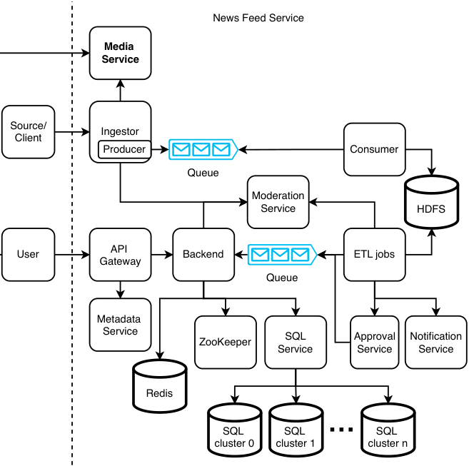


Figure 16.10    Adding a media service (in bold; this service is added to figure 16.9), which allows our news items to contain audio, images and videos. A separate media service also makes it easier to manage and analyze media separately of its news items.


Figure 16.11 is a sequence diagram of a source uploading an article. Because media uploads require more data transfer than metadata or text, the media uploads should complete before producing the article’s metadata and text onto the Kafka queue. If the media uploads succeed but producing to the queue fails, we can return a 500 error to the source. During a file upload process to the media service, the ingestor can first hash the file and send this hash to the media service to check if the file has already been uploaded. If so, the media service can return a 304 response to the ingestor, and a costly network transfer can be avoided. We note that in this design, the consumer cluster can be much smaller than the Media service cluster.


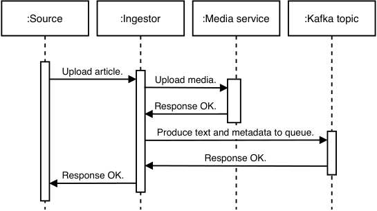


Figure 16.11    Sequence diagram of a source uploading an article. Media is almost always larger than text, so our ingestor first uploads media to our Media Service. After our ingestor successfully uploads the media, it produces the text and metadata to our Kafka topic, to be consumed and written to HDFS as discussed in this chapter.

What if the ingestor host fails after the media was successfully uploaded but before it can produce to the Kafka topic? It makes sense to keep the media upload rather than delete it because the media upload process is resource-intensive. The source will receive an error response and can try the upload again. This time, the media service can return a 304 as discussed in the previous paragraph, and then the ingestor can produce the corresponding event. The source may not retry. In that case, we can periodically run an audit job to find media that do not have accompanying metadata and text in HDFS and delete this media.

If our users are widely geographically distributed, or user traffic is too heavy for our media service, we can use a CDN. Refer to chapter 13 for a discussion on a CDN system design. The authorization tokens to download images from the CDN can be granted by the API gateway, using a service mesh architecture. Figure 16.12 shows our high-level architecture with a CDN. A new item will contain text fields for content such as title, body, and media URLs. Referring to figure 16.12, a source can upload images to our image service and text content to our news feed service. A client can

- Download article text and media URLs from Redis.

- Download media from the CDN.


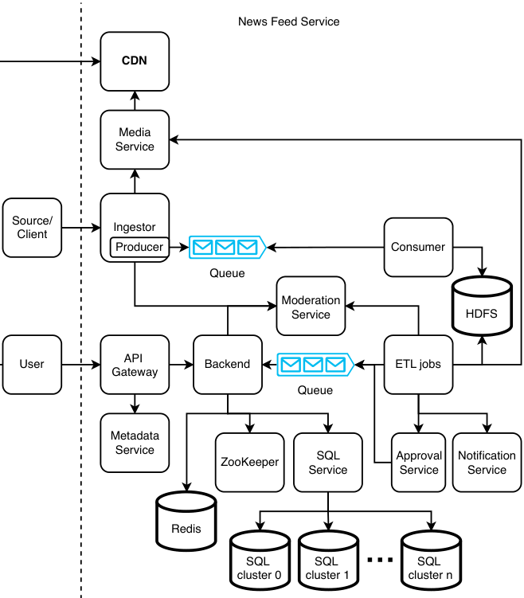


Figure 16.12    Using a CDN (in bold; this service is added to figure 16.10) to host media. Users will download images directly from our CDN, gaining the benefits of a CDN such as lower latency and higher availability.

The main differences with figure 16.10 are the following:

- The media service writes media to the CDN, and users download media from the CDN.

- ETL jobs and the approval service make requests to the media service.

We use both a media service and a CDN because some articles will not be served to users, so some images don’t need to be stored on the CDN, which will reduce costs. Certain ETL jobs may be automatic approvals of articles, so these jobs need to inform the media service that the article is approved, and the media service should upload the article’s media to the CDN to be served to users. The approval service makes similar requests to the media service.


We may discuss the tradeoffs of handling and storing text and media in separate services vs. a single service. We can refer to chapter 13 to discuss more details of hosting images on a CDN, such as the tradeoffs of hosting media on a CDN.

Taking this a step further, we can also host complete articles on our CDN, including all text and media. The Redis values can be reduced to article IDs. Although an article’s text is usually much smaller than its media, there can still be performance improvements from placing it on a CDN, particularly for frequent requests of popular articles. Redis is horizontally scalable but inter data center replication is complex.

In the approval service, should the images and text of an article be reviewed separately or together? For simplicity, reviewing an article can consist of reviewing both its text and accompanying media as a single article.

How can we review media more efficiently? Hiring review staff is expensive, and a staff will need to listen to an audio clip or watch a video completely before making a review decision. We can consider transcribing audio, so a reviewer can read rather than listen to audio files. This will allow us to hire hearing-impaired staff, improving the company’s inclusivity culture. A staff can play a video file at 2x or 3x speed when they review it and read the transcribed audio separately from viewing the video file. We can also consider machine learning solutions to review articles.

## _16.6 Other possible discussion topics_

Here are other possible discussion topics that may come up as the interview progresses, which may be suggested by either the interviewer or candidate:

- Create hashtags, which are dynamic, rather than a fixed set of topics.

- Users may wish to share news items with other users or groups.

- Have a more detailed discussion on sending notifications to creators and readers.

- Real-time dissemination of articles. ETL jobs must be streaming, not batch.

- Boosting to prioritize certain articles over others.

We can consider the items that were out-of-scope in the functional requirements discussion:

- Analytics.

- Personalization. Instead of serving the same 1,000 news items to all users, serve each user a personalized set of 100 news items. This design will be substantially more complex.

- Serving articles in languages other than English. Potential complications, such as handling UTF or language transations.

- Monetizing the news feed. Topics include:

   - Design a subscription system.

   - Reserve certain posts for subscribers.

   - An article limit for non-subscribers.

   - Ads and promoted posts.


## _Summary_

- When drawing the initial high-level architecture of the news feed system, consider the main data of interest and draw the components that read and write this data to the database.

- Consider the non-functional requirements of reading and writing the data and then select the appropriate database types and consider the accompanying services, if any. These include the Kafka service and Redis service.

- Consider which operations don’t require low latency and place them in batch and streaming jobs for scalability.

- Determine any processing operations that must be performed before and after writes and reads and wrap them in services. Prior operations may include compression, content moderation, and lookups to other services to get relevant IDs or data. Post operations may include notifications and indexing. Examples of such services in our news feed system include the ingestor service, consumer service, ETL jobs, and backend service.

- Logging, monitoring, and alerting should be done on failures and unusual events that we may be interested in.


