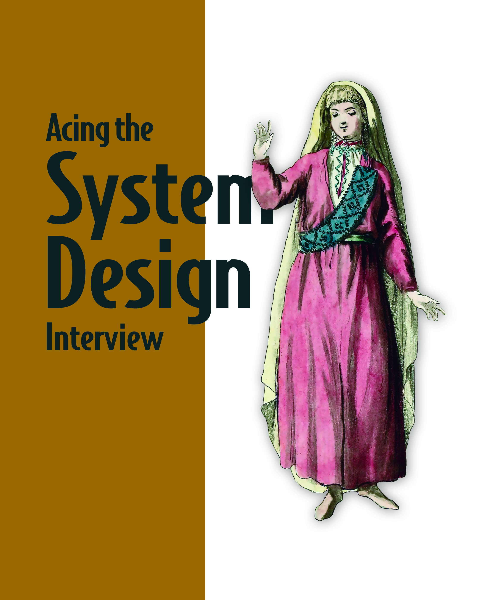

<!-- PAGE 1 -->
 1 -->

M A N N I N G
Zhiyong Tan
Forewords by Anthony Asta
                 and Michael Elder

<!-- PAGE 2 -->
 2 -->

This is a quick lookup guide for common considerations in system design. After you read the book, 
you can refer to the appropriate sections when you design or review a scalable/distributed system 
and need a refresher or reference on a particular concept. 
Concept
Chapter(s)/section(s)
Tradeoffs
1.1, 2
A simple full stack design
1.4
Functional partitioning, centralization of cross-cutting concerns
1.4.6, 6
Requirements
2, 3
Logging, monitoring, alerting
2.5
Distributed databases
Sampling
4.5, 11.8-10
Distributed transactions
Library vs. service
6.6, 12.6
REST, RPC, GraphQL, WebSocket
6.7
Graceful degradation
2, 3.3
Data migrations
7.7
Distributed rate limiting
Distributed notification service
Data quality
2.5.5, 10 (also covers auditing)
Exactly-once delivery
Personalization
1.4, 16
Lambda architecture
Authentication and authorization
13.3, appendix B

<!-- PAGE 3 -->
 3 -->

M A N N I N G
Shelter Island
Acing the System 
Design Interview
ZHIYONG TAN

<!-- PAGE 4 -->
 4 -->

For online information and ordering of this and other Manning books, please visit www.manning.com. 
The publisher offers discounts on this book when ordered in quantity.
For more information, please contact
Special Sales Department
Manning Publications Co.
20 Baldwin Road
PO Box 761
Shelter Island, NY 11964
Email: orders@manning.com
© 2024 Manning Publications Co. All rights reserved.
No part of this publication may be reproduced, stored in a retrieval system, or transmitted, in any form 
or by means electronic, mechanical, photocopying, or otherwise, without prior written permission of the 
publisher.
Many of the designations used by manufacturers and sellers to distinguish their products are claimed 
as trademarks. Where those designations appear in the book, and Manning Publications was aware of a 
trademark claim, the designations have been printed in initial caps or all caps.
Recognizing the importance of preserving what has been written, it is Manning’s policy to have the books 
we publish printed on acid-­free paper, and we exert our best efforts to that end. Recognizing also our 
responsibility to conserve the resources of our planet, Manning books are printed on paper that is at 
least 15 percent recycled and processed without the use of elemental chlorine.
∞
	
Manning Publications Co. 
20 Baldwin Road
PO Box 761 
Shelter Island, NY 11964
ISBN: 9781633439108
Printed in the United States of America
The author and publisher have made every effort to ensure that the information in this book was correct 
at press time. The author and publisher do not assume and hereby disclaim any liability to any party for 
any loss, damage, or disruption caused by errors or omissions, whether such errors or omissions result 
from negligence, accident, or any other cause, or from any usage of the information herein.
	
Development editor: 	 Katie Sposato Johnson
	
Technical editor: 	 Mohit Kumar
	Senior technical development editor: 	 Al Scherer
	
Review editor: 	 Adriana Sabo
	
Production editor: 	 Aleksandar DragosavljeviÊ
	
Copy editor: 	 Katie Petito
	
Technical proofreader: 	 Victor Duran
	
Typesetter: 	 Tamara ŠveliÊ SabljiÊ
	
Cover designer: 	 Marija Tudor

<!-- PAGE 5 -->
 5 -->

To Mom and Dad.

<!-- PAGE 6 -->
 6 -->

foreword	
preface	
xxi
acknowledgments	
xxiii
about this book	
xxv
about the author	
xxviii
about the cover illustration	
xxix
Part 1...........................................................................1
	
	
A walkthrough of system design concepts  3
	 1.1	
It is a discussion about tradeoffs  4
	 1.2	
Should you read this book?  4
	 1.3	
Overview of this book  5
	 1.4	
Prelude—A brief discussion of scaling the various services of a 
system  6
The beginning—A small initial deployment of our app   6 
Scaling with GeoDNS   7  ■  Adding a caching service   8 
Content Distribution Network (CDN)  9  ■  A brief discussion 
of horizontal scalability and cluster management, continuous 
integration (CI) and continuous deployment (CD)   10 
Functional partitioning and centralization of cross-cutting 
concerns   13  ■  Batch and streaming extract, transform, and 
load (ETL)   17  ■  Other common services   18  ■  Cloud vs. bare 
metal   19  ■  Serverless—Function as a Service (FaaS)  22 
Conclusion—Scaling backend services   23
	 	

<!-- PAGE 7 -->
 7 -->

	
	
	
	
A typical system design interview flow  24
	 2.1	
Clarify requirements and discuss tradeoffs   26
	 2.2	
Draft the API specification   28
Common API endpoints   28
	 2.3	
Connections and processing between users and data   28
	 2.4	
Design the data model   29
Example of the disadvantages of multiple services sharing 
databases   30  ■  A possible technique to prevent concurrent user 
update conflicts  31
	 2.5	
Logging, monitoring, and alerting  34
The importance of monitoring  34  ■  Observability  34 
Responding to alerts   36  ■  Application-level logging tools   37 
Streaming and batch audit of data quality   39  ■  Anomaly 
detection to detect data anomalies   39  ■  Silent errors and 
auditing   40  ■  Further reading on observability  40
	 2.6	
Search bar  40
Introduction   40  ■  Search bar implementation with 
Elasticsearch  41  ■  Elasticsearch index and ingestion  42 
Using Elasticsearch in place of SQL   43  ■  Implementing search 
in our services   44  ■  Further reading on search  44
	 2.7	
Other discussions   44
Maintaining and extending the application   44  ■  Supporting 
other types of users   45  ■  Alternative architectural decisions   45 
Usability and feedback   45  ■  Edge cases and new 
constraints   46  ■  Cloud native concepts   47
	 2.8	
Post-interview reflection and assessment   47
Write your reflection as soon as possible after the interview   47 
Writing your assessment   49  ■  Details you didn’t mention   49 
Interview feedback   50
	 2.9	
Interviewing the company   51
	 	
	
	
Non-functional requirements  54
	 3.1	
Scalability  56
Stateless and stateful services  57  ■  Basic load balancer 
concepts  57
	 3.2	
Availability  59

<!-- PAGE 8 -->
 8 -->

	 3.3	
Fault-tolerance  60
Replication and redundancy   60  ■  Forward error correction 
(FEC) and error correction code (ECC)   61  ■  Circuit 
breaker   61  ■  Exponential backoff and retry   62  ■  Caching 
responses of other services  62  ■  Checkpointing   62 
Dead letter queue   62  ■  Logging and periodic auditing   63 
Bulkhead   63  ■  Fallback pattern  64
	 3.4	
Performance/latency and throughput  65
	 3.5	
Consistency  66
Full mesh   67  ■  Coordination service  68  ■  Distributed 
cache   69  ■  Gossip protocol   70  ■  Random Leader 
Selection   70
	 3.6	
Accuracy  70
	 3.7	
Complexity and maintainability  71
Continuous deployment (CD)   72
	 3.8	
Cost  72
	 3.9	
Security  73
	 3.10	
Privacy  73
External vs. internal services  74
	 3.11	
Cloud native  75
	 3.12	
Further reading  75
	 	
	
	
Scaling databases  77
	 4.1	
Brief prelude on storage services  77
	 4.2	
When to use vs. avoid databases  79
	 4.3	
Replication  79
Distributing replicas  80  ■  Single-leader replication   80 
Multi-leader replication   84  ■  Leaderless replication   85 
HDFS replication   85  ■  Further reading   87
	 4.4	
Scaling storage capacity with sharded databases    87
Sharded RDBMS  88
	 4.5	
Aggregating events    88
Single-tier aggregation  89  ■  Multi-tier aggregation      89 
Partitioning    90  ■  Handling a large key space    91 
Replication and fault-tolerance    92

<!-- PAGE 9 -->
 9 -->

	
	
	 4.6	
Batch and streaming ETL  93
A simple batch ETL pipeline  93  ■  Messaging terminology  95 
Kafka vs. RabbitMQ  96  ■  Lambda architecture    98
	 4.7	
Denormalization   98
	 4.8	
Caching   99
Read strategies  100  ■  Write strategies   101
	 4.9	
Caching as a separate service  103
	 4.10	
Examples of different kinds of data to cache and how to cache 
them  103
	 4.11	
Cache invalidation  104
Browser cache invalidation  105  ■  Cache invalidation in 
caching services  105
	 4.12	
Cache warming  106
	 4.13	
Further reading  107
Caching references   107
	 	
	
	
Distributed transactions  109
	 5.1	
Event Driven Architecture (EDA)  110
	 5.2	
Event sourcing   111
	 5.3	
Change Data Capture (CDC)  112
	 5.4	
Comparison of event sourcing and CDC  113
	 5.5	
Transaction supervisor  114
	 5.6	
Saga  115
Choreography  115  ■  Orchestration   117  ■  Comparison   119
	 5.7	
Other transaction types  120
	 5.8	
Further reading   120
	 	
	
	
Common services for functional partitioning  122
	 6.1	
Common functionalities of various services  123
Security  123  ■  Error-checking  124  ■  Performance and 
availability  124  ■  Logging and analytics  124
	 6.2	
Service mesh / sidecar pattern   125

<!-- PAGE 10 -->
 10 -->

	 6.3	
Metadata service   126
	 6.4	
Service discovery  127
	 6.5	
Functional partitioning and various frameworks  128
Basic system design of an app  128  ■  Purposes of a web server 
app  129  ■  Web and mobile frameworks   130
	 6.6	
Library vs. service   134
Language specific vs. technology-agnostic   135  ■  Predictability 
of latency   136  ■  Predictability and reproducibility of 
behavior   136  ■  Scaling considerations for libraries   136 
Other considerations   137
	 6.7	
Common API paradigms  137
The Open Systems Interconnection (OSI) model   137 
REST   138  ■  RPC (Remote Procedure Call)   140 
GraphQL   141  ■  WebSocket   142  ■  Comparison   142
	 	
Part 2.......................................................................145
	
	
Design Craigslist  147
	 7.1	
User stories and requirements   148
	 7.2	
API   149
	 7.3	
SQL database schema   150
	 7.4	
Initial high-level architecture   150
	 7.5	
A monolith architecture  151
	 7.6	
Using a SQL database and object store  153
	 7.7	
Migrations are troublesome  153
	 7.8	
Writing and reading posts  156
	 7.9	
Functional partitioning   158
	 7.10	
Caching   159
	 7.11	
CDN   160
	 7.12	
Scaling reads with a SQL cluster   160
	 7.13	
Scaling write throughput   160
	 7.14	
Email service   161
	 7.15	
Search   162

<!-- PAGE 11 -->
 11 -->

	
	
	 7.16	
Removing old posts   162
	 7.17	
Monitoring and alerting   163
	 7.18	
Summary of our architecture discussion so far  163
	 7.19	
Other possible discussion topics   164
Reporting posts  164  ■  Graceful degradation   164 
Complexity   164  ■  Item categories/tags   166  ■  Analytics and 
recommendations   166  ■  A/B testing   167  ■  Subscriptions 
and saved searches   167  ■  Allow duplicate requests to the 
search service   168  ■  Avoid duplicate requests to the search 
service   168  ■  Rate limiting   169  ■  Large number of 
posts   169  ■  Local regulations   169
	 	
	
	
Design a rate-limiting service  171
	 8.1	
Alternatives to a rate-limiting service, and why they are 
infeasible   172
	 8.2	
When not to do rate limiting   174
	 8.3	
Functional requirements   174
	 8.4	
Non-functional requirements   175
Scalability   175  ■  Performance   175  ■  Complexity   175 
Security and privacy   176  ■  Availability and fault-
tolerance   176  ■  Accuracy   176  ■  Consistency   176
	 8.5	
Discuss user stories and required service components   177
	 8.6	
High-level architecture  177
	 8.7	
Stateful approach/sharding  180
	 8.8	
Storing all counts in every host  182
High-level architecture  182  ■  Synchronizing counts  185
	 8.9	
Rate-limiting algorithms   187
Token bucket   188  ■  Leaky bucket   189  ■  Fixed window 
counter  190  ■  Sliding window log   192  ■  Sliding window 
counter   193
	 8.10	
Employing a sidecar pattern   193
	 8.11	
Logging, monitoring, and alerting  193
	 8.12	
Providing functionality in a client library  194
	 8.13	
Further reading  195
	 	

<!-- PAGE 12 -->
 12 -->

	
	
Design a notification/alerting service  196
	 9.1	
Functional requirements  196
Not for uptime monitoring  197  ■  Users and data  197 
Recipient channels  198  ■  Templates  198  ■  Trigger 
conditions  199  ■  Manage subscribers, sender groups, and 
recipient groups  199  ■  User features  199  ■  Analytics  200
	 9.2	
Non-functional requirements  200
	 9.3	
Initial high-level architecture   200
	 9.4	
Object store: Configuring and sending notifications   205
	 9.5	
Notification templates   207
Notification template service  207  ■  Additional features  209
	 9.6	
Scheduled notifications  210
	 9.7	
Notification addressee groups   212
	 9.8	
Unsubscribe requests  215
	 9.9	
Handling failed deliveries  216
	 9.10	
Client-side considerations regarding duplicate 
notifications   218
	 9.11	
Priority   218
	 9.12	
Search   219
	 9.13	
Monitoring and alerting   219
	 9.14	
Availability monitoring and alerting on the notification/
alerting service   220
	 9.15	
Other possible discussion topics  220
	 9.16	
Final notes   221
	 	
	
Design a database batch auditing service  223
	 10.1	
Why is auditing necessary?  224
	 10.2	
Defining a validation with a conditional statement on a SQL 
query’s result   226
	 10.3	
A simple SQL batch auditing service  229
An audit script  229  ■  An audit service  230
	 10.4	
Requirements   232

<!-- PAGE 13 -->
 13 -->

	
	
	 10.5	
High-level architecture  233
Running a batch auditing job   234  ■  Handling alerts  235
	 10.6	
Constraints on database queries  237
Limit query execution time  238  ■  Check the query strings before 
submission  238  ■  Users should be trained early  239
	 10.7	
Prevent too many simultaneous queries  239
	 10.8	
Other users of database schema metadata  240
	 10.9	
Auditing a data pipeline  241
	 10.10	 Logging, monitoring, and alerting   242
	 10.11	 Other possible types of audits  242
Cross data center consistency audits  242  ■  Compare upstream 
and downstream data  243
	 10.12	 Other possible discussion topics   243
	 10.13	 References   243
	 	
	
Autocomplete/typeahead  245
	 11.1	
Possible uses of autocomplete   246
	 11.2	
Search vs. autocomplete   246
	 11.3	
Functional requirements   248
Scope of our autocomplete service  248  ■  Some UX (user 
experience) details  248  ■  Considering search history  249 
Content moderation and fairness  250
	 11.4	
Nonfunctional requirements   250
	 11.5	
Planning the high-level architecture   251
	 11.6	
Weighted trie approach and initial high-level 
architecture  252
	 11.7	
Detailed implementation   253
Each step should be an independent task  255  ■  Fetch relevant 
logs from Elasticsearch to HDFS  255  ■  Split the search strings 
into words, and other simple operations  255  ■  Filter out 
inappropriate words  256  ■  Fuzzy matching and spelling 
correction  258  ■  Count the words  259  ■  Filter for appropriate 
words  259  ■  Managing new popular unknown words  259 
Generate and deliver the weighted trie  259

<!-- PAGE 14 -->
 14 -->

	 11.8	
Sampling approach  260
	 11.9	
Handling storage requirements  261
	 11.10	 Handling phrases instead of single words  263
Maximum length of autocomplete suggestions  263 
Preventing inappropriate suggestions  263
	 11.11	 Logging, monitoring, and alerting   264
	 11.12	 Other considerations and further discussion  264
	 	
	
Design Flickr  266
	 12.1	
User stories and functional requirements   267
	 12.2	
Non-functional requirements   267
	 12.3	
High-level architecture   269
	 12.4	
SQL schema  270
	 12.5	
Organizing directories and files on the CDN   271
	 12.6	
Uploading a photo   272
Generate thumbnails on the client   272  ■  Generate thumbnails 
on the backend   276  ■  Implementing both server-side and client-
side generation  281
	 12.7	
Downloading images and data   282
Downloading pages of thumbnails  282
	 12.8	
Monitoring and alerting   283
	 12.9	
Some other services   283
Premium features  283  ■  Payments and taxes service  283 
Censorship/content moderation  283  ■  Advertising  284 
Personalization  284
	 12.10	 Other possible discussions  284
	 	
	
Design a Content Distribution Network (CDN)  287
	 13.1	
Advantages and disadvantages of a CDN   288
Advantages of using a CDN   288  ■  Disadvantages of using a 
CDN   289  ■  Example of an unexpected problem from using a 
CDN to serve images   290
	 13.2	
Requirements   291

<!-- PAGE 15 -->
 15 -->

	
	
	 13.3	
CDN authentication and authorization  291
Steps in CDN authentication and authorization  292 
Key rotation  294
	 13.4	
High-level architecture   294
	 13.5	
Storage service   295
In-cluster   296  ■  Out-cluster   296  ■  Evaluation   296
	 13.6	
Common operations   297
Reads–Downloads   297  ■  Writes–Directory creation, file upload, 
and file deletion   301
	 13.7	
Cache invalidation  306
	 13.8	
Logging, monitoring, and alerting   306
	 13.9	
Other possible discussions on downloading media files   306
	 	
	
Design a text messaging app  308
	 14.1	
Requirements  309
	 14.2	
Initial thoughts   310
	 14.3	
Initial high-level design  310
	 14.4	
Connection service  312
Making connections   312  ■  Sender blocking  312
	 14.5	
Sender service  316
Sending a message  316  ■  Other discussions  319
	 14.6	
Message service  320
	 14.7	
Message sending service  321
Introduction  321  ■  High-level architecture   322  ■  Steps in 
sending a message   324  ■  Some questions   325  ■  Improving 
availability   325
	 14.8	
Search   326
	 14.9	
Logging, monitoring, and alerting   326
	 14.10	 Other possible discussion points   327
	 	

<!-- PAGE 16 -->
 16 -->

	
Design Airbnb  329
	 15.1	
Requirements  330
	 15.2	
Design decisions   333
Replication   334  ■  Data models for room availability   334 
Handling overlapping bookings   335  ■  Randomize search 
results   335  ■  Lock rooms during booking flow   335
	 15.3	
High-level architecture   335
	 15.4	
Functional partitioning   337
	 15.5	
Create or update a listing   337
	 15.6	
Approval service   339
	 15.7	
Booking service   345
	 15.8	
Availability service   349
	 15.9	
Logging, monitoring, and alerting   350
	 15.10	 Other possible discussion points   351
Handling regulations   352
	 	
	
Design a news feed  354
	 16.1	
Requirements   355
	 16.2	
High-level architecture   356
	 16.3	
Prepare feed in advance  360
	 16.4	
Validation and content moderation  364
Changing posts on users’ devices  365  ■  Tagging posts  365 
Moderation service  367
	 16.5	
Logging, monitoring, and alerting   368
Serving images as well as text   368  ■  High-level 
architecture    369
	 16.6	
Other possible discussion points   372
	 	
	
Design a dashboard of top 10 products on Amazon by sales 	
	
	
	
volume  374
	 17.1	
Requirements   375
	 17.2	
Initial thoughts  376

<!-- PAGE 17 -->
 17 -->

	
	
	 17.3	
Initial high-level architecture  377
	 17.4	
Aggregation service   378
Aggregating by product ID   379  ■  Matching host IDs and 
product IDs   379  ■  Storing timestamps   380  ■  Aggregation 
process on a host   380
	 17.5	
Batch pipeline   381
	 17.6	
Streaming pipeline   383
Hash table and max-heap with a single host   383 
Horizontal scaling to multiple hosts and multi-tier 
aggregation   385
	 17.7	
Approximation   386
Count-min sketch   388
	 17.8	
Dashboard with Lambda architecture  390
	 17.9	
Kappa architecture approach  390
Lambda vs. Kappa architecture  391  ■  Kappa architecture for 
our dashboard  392
	 17.10	 Logging, monitoring, and alerting   393
	 17.11	 Other possible discussion points   393
	 17.12	 References   394
	 	
	
A
	
Monoliths vs. microservices  395
	 A.1	
Disadvantages of monoliths   395
	 A.2	
Advantages of monoliths   396
	 A.3	
Advantages of services   396
Agile and rapid development and scaling of product requirements 
and business functionalities  397  ■  Modularity and 
replaceability   397  ■  Failure isolation and fault-tolerance   397 
Ownership and organizational structure   398
	 A.4	
Disadvantages of services   398
Duplicate components   398  ■  Development and maintenance 
costs of additional components   399  ■  Distributed 
transactions   400  ■  Referential integrity   400  ■  Coordinating 
feature development and deployments that span multiple 
services   400  ■  Interfaces   401
	 A.5	
References  402

<!-- PAGE 18 -->
 18 -->

	
B
	
OAuth 2.0 authorization and OpenID Connect 	 	
	
	
	
	
authentication  403
	 B.1	
Authorization vs. authentication   403
	 B.2	
Prelude: Simple login, cookie-based authentication  404
	 B.3	
Single sign-on (SSO)   404
	 B.4	
Disadvantages of simple login   404
Complexity and lack of maintainability   405  ■  No partial 
authorization   405
	 B.5	
OAuth 2.0 flow   406
OAuth 2.0 terminology   407  ■  Initial client setup   407 
Back channel and front channel   409
	 B.6	
Other OAuth 2.0 flows   410
	 B.7	
OpenID Connect authentication   411
	
C
	
C4 Model  413
	
D
	
Two-phase commit (2PC)  418
index  422

<!-- PAGE 19 -->
 19 -->

foreword
Over the course of the last 20 years, I have focused on building teams of distributed sys-
tems engineers at some of the largest tech companies in the industry (Google, Twitter, 
and Uber). In my experience, the fundamental pattern of building high-functioning 
teams at these companies is the ability to identify engineering talent that can demon-
strate their mastery of system design through the interview process. Acing the System 
Design Interview is an invaluable guide that equips aspiring software engineers and sea-
soned professionals alike with the knowledge and skills required to excel in one of the 
most critical aspects of technical interviews. In an industry where the ability to design 
scalable and reliable systems is paramount, this book is a treasure trove of insights, 
strategies, and practical tips that will undoubtedly help readers navigate the intricacies 
of the system design interview process.
As the demand for robust and scalable systems continues to soar, companies are 
increasingly prioritizing system design expertise in their hiring process. An effective sys-
tem design interview not only assesses a candidate’s technical prowess but also evaluates 
their ability to think critically, make informed decisions, and solve complex problems. 
Zhiyong’s perspective as an experienced software engineer and his deep understanding 
of the system design interview landscape make him the perfect guide for anyone seek-
ing to master this crucial skill set.
In this book, Zhiyong presents a comprehensive roadmap that takes readers through 
each step of the system design interview process. After an overview of the fundamen-
tal principles and concepts, he then delves into various design aspects, including scal-
ability, reliability, performance, and data management. With clarity and precision, he 
breaks down each topic, providing concise explanations and real-world examples that 
illustrate their practical application. He is able to demystify the system design interview 

<!-- PAGE 20 -->
 20 -->

xviii
foreword
xviii
process by drawing on his own experiences and interviews with experts in the field. He 
offers valuable insights into the mindset of interviewers, the types of questions com-
monly asked, and the key factors interviewers consider when evaluating a candidate’s 
performance. Through these tips, he not only helps readers understand what to expect 
during an interview but also equips them with the confidence and tools necessary to 
excel in this high-stakes environment.
By combining the theory chapters of part 1 with the practical application chapters of 
part 2, Zhiyong ensures that readers not only grasp the theoretical foundations but also 
cultivate the ability to apply that knowledge to real-world scenarios. Moreover, this book 
goes beyond technical know-how and emphasizes the importance of effective commu-
nication in the system design interview process. Zhiyong explores strategies for effec-
tively articulating ideas, presenting solutions, and collaborating with interviewers. This 
holistic approach recognizes that successful system design is not solely dependent on 
technical brilliance but also on the ability to convey ideas and work collaboratively with 
others.
Whether you are preparing for a job interview or seeking to enhance your system 
design expertise, this book is an essential companion that will empower you to tackle 
even the most complex system design challenges with confidence and finesse.
So, dive into the pages ahead, embrace the knowledge and insights, and embark on a 
journey to master the art of building scalable and reliable systems. You will undoubtedly 
position yourself as an invaluable asset to any organization and pave the way for a suc-
cessful career as a software engineer.
Start your path to acing the system design interview!
—Anthony Asta
Director of Engineering at LinkedIn
(ex-Engineering Management at Google, Twitter, and Uber)

<!-- PAGE 21 -->
 21 -->

xix
Software development is a world of continuous everything. Continuous improvement, 
continuous delivery, continuous monitoring, and continuous re-evaluation of user 
needs and capacity expectations are the hallmarks of any significant software system. 
If you want to succeed as a software engineer, you must have a passion for continuous 
learning and personal growth. With passion, software engineers can literally change 
how our society connects with each other, how we share knowledge, and how we man-
age our lifestyles. 
Software trends are always evolving, from the trendiest programming language or 
framework to programmable cloud-native infrastructure. If you stick with this industry 
for decades, you’ll see these transitions several times over, just like I have. However, one 
immutable constant remains through it all: understanding the systematic reasoning of 
how a software system manages work, organizes its data, and interacts with humans is 
critical to being an effective software engineer or technology leader.
As a software engineer and then IBM Distinguished Engineer, I’ve seen firsthand 
how design tradeoffs can make or break the successful outcomes of a software system. 
Whether you’re a new engineer seeking your first role or a seasoned technology vet-
eran looking for a new challenge in a new company, this book can help you refine your 
approach to reasoning by explaining the tradeoffs inherent with any design choices. 
Acing the System Design Interview brings together and organizes the many dimensions 
of system design that you need to consider for any software system. Zhiyong Tan has 
brilliantly organized a crash course in the fundamentals of system design tradeoffs and 
presents many real-world case studies that you can use to reinforce your readiness for 
even the most challenging of system design interviews.
Part 1 of the book begins with an informative survey of critical aspects of system 
design. Starting with non-functional requirements, you’ll learn about many of the com-
mon dimensions that you must keep in mind while considering system design tradeoffs. 
Following an elaboration on , you will walk through how to organize the application pro-
gramming interface (API) specification to explain how your system design addresses 

<!-- PAGE 22 -->
 22 -->

xx
foreword
xx
the use cases of the interview problem statement. Behind the API, you’ll learn several 
industry best practices for organizing the system data model using industry-standard 
datastores and patterns for managing distributed transactions. And beyond addressing 
the prima facie use cases, you’ll learn about key aspects of system operation, including 
modern approaches to observability and log management. 
In part 2, ride along for 11 distinct system design problems, from text messaging to 
Airbnb. In each interview problem, you can pick up new skills on how to tease out the 
right questions to organize the non-functional system requirements, followed by what 
tradeoffs to invest in further discussion. System design is a skill set often rooted in an 
experience that lends itself well to learning from prior art and examples based on oth-
ers’ experiences. If you internalize the many lessons and wisdom from the examples 
presented in this book, you’ll be well prepared for even the most challenging system 
design interview problems.
I’m excited to see the contribution that Zhiyong Tan has made to the industry with 
the following work. Whether you are approaching the material after a recent gradu-
ation or after many years of already working in the industry, I hope you’ll find new 
opportunities for personal growth as I did when absorbing the experiences represented 
in Acing the System Design Interview.
—Michael D. Elder
Distinguished Engineer & Senior Director, PayPal
Former IBM Distinguished Engineer and IBM Master Inventor, IBM

<!-- PAGE 23 -->
 23 -->

xxi
preface
It is Wednesday at 4 p.m. As you leave your last video interview for your dream com-
pany, you are filled with a familiar mix of feelings: exhaustion, frustration, and déjà vu. 
You already know that in one to two days you will receive the email that you have seen 
so many times in your years as an engineer. “Thank you for your interest in the senior 
software engineer role at XXX. While your experience and skill set are impressive, 
after much consideration, we regret to inform you that we will not be proceeding with 
your candidacy.”
It was the system design interview again. You had been asked to design a photo-­
sharing app, and you made a brilliant design that is scalable, resilient, and maintain-
able. It used the latest frameworks and employed software development lifecycle best 
practices. But you could see that the interviewer was unimpressed. They had that far-
away look in their eyes and the bored, calm, polite tone that told you they believed they 
spent their time with you on this interview to be professional and to deliver “a great 
candidate experience.” 
This is your seventh interview attempt at this company in four years, and you have 
also interviewed repeatedly at other companies you really want to join. It is your dream 
to join this company, which has a userbase of billions and develops some of the most 
impressive developer frameworks and programming languages that dominate the 
industry. You know that the people you will meet and what you will learn at this com-
pany will serve you well in your career and be a great investment of your time.
Meanwhile, you have been promoted multiple times at the companies you have 
worked at, and you’re now a senior software engineer, making it even harder when 
you don’t pass the interviews for the equivalent job at your dream companies. You have 
been a tech lead of multiple systems, led and mentored teams of junior engineers, and 
authored and discussed system designs with senior and staff engineers, making tangi-
ble and valuable contributions to multiple system designs. Before each interview at a 
dream company, you read through all the engineering blog posts and watched all their 
engineering talks published in the last three years. You have also read every highly rated 

<!-- PAGE 24 -->
 24 -->

xxii
preface
xxii
book on microservices, data-intensive applications, cloud-native patterns, and domain-
driven design. Why can’t you just nail those system design interviews?
Has it just been bad luck all these attempts? The supply versus demand of candidates 
versus jobs at those companies? The statistical unlikelihood of being selected? Is it a 
lottery? Do you simply have to keep trying every six months until you get lucky? Do you 
need to light incense and make more generous offerings to the interview/performance 
review/promotion gods (formerly known as the exam gods back in school)?
Taking a deep breath and closing your eyes to reflect, you realize that there is so 
much you can improve in those 45 minutes that you had to discuss your system design. 
(Even though each interview is one hour, between introductions and Q&A, you essen-
tially have only 45 minutes to design a complex system that typically evolves over years.) 
Chatting with your fellow engineer friends confirms your hypothesis. You did not 
thoroughly clarify the system requirements. You assumed that what was needed was a 
minimum viable product for a backend that serves mobile apps in storing and sharing 
photos, and you started jotting down sample API specifications. The interviewer had 
to interrupt you to clarify that it should be scalable to a billion users. You drew a system 
design diagram that included a CDN, but you didn’t discuss the tradeoffs and alterna-
tives of your design choices. You were not proactive in suggesting other possibilities 
beyond the narrow scope that the interviewer gave you at the beginning of the inter-
view, such as analytics to determine the most popular photos or personalization to rec-
ommend photos to share with a user. You didn’t ask the right questions, and you didn’t 
mention important concepts like logging, monitoring, and alerting.
You realize that even with your engineering experience and your hard work in study-
ing and reading to keep up with industry best practices and developments, the breath 
of system design is vast, and you lack much formal knowledge and understanding of 
many system design components that you’ll never directly touch, like load balancers 
or certain NoSQL databases, so you cannot create a system design diagram of the level 
of completeness that the interviewer expects, and you cannot fluently zoom in and out 
when discussing various levels of the system. Until you learn to do so, you cannot meet 
the hiring bar, and you cannot truly understand a complex system or ascend to a more 
senior engineering leadership or mentorship role. 

<!-- PAGE 25 -->
 25 -->

xxiii
acknowledgments
I thank my wife Emma for her consistent encouragement in my various endeavors, 
diving into various difficult and time-consuming projects at work, writing various apps, 
and writing this book. I thank my daughter Ada, my inspiration to endure the frustra-
tion and tedium of coding and writing. 
I thank my brother Zhilong, who gave me much valuable feedback on my drafts and 
is himself an expert in system design and video encoding protocols at Meta. I thank my 
big sister Shumin for always being supportive and pushing me to achieve more. 
Thank you, Mom and Dad, for your sacrifices that made it all possible. 
I wish to thank the staff at Manning for all their help, beginning with my book pro-
posal reviewers Andreas von Linden, Amuthan Ganeshan, Marc Roulleau, Dean Tsal-
tas, and Vincent Liard. Amuthan provided detailed feedback and asked good questions 
about the proposed topics. Katie Sposato Johnson was my guide for the 1.5-year process 
of reviewing and revising the manuscript. She proofread each chapter, and her feed-
back considerably improved the book’s presentation and clarity. My technical editor, 
Mohit Chilkoti, provided many good suggestions to improve clarity and pointed out 
errors. My review editor Adriana Sabo and her team organized the panel reviews, which 
gathered invaluable feedback that I used to substantially improve this book. To all the 
reviewers: Abdul Karim Memon, Ajit Malleri, Alessandro Buggin, Alessandro Cam-
peis, Andres Sacco, Anto Aravinth, Ashwini Gupta, Clifford Thurber, Curtis Washing-
ton, Dipkumar Patel, Fasih Khatib, Ganesh Swaminathan, Haim Raman, Haresh Lala, 
Javid Asgarov, Jens Christian B. Madsen, Jeremy Chen, Jon Riddle, Jonathan Reeves, 
Kamesh Ganesan, Kiran Anantha, Laud Bentil, Lora Vardarova, Matt Ferderer, Max 
Sadrieh, Mike B., Muneeb Shaikh, Najeeb Arif, Narendran Solai Sridharan, Nolan To, 
Nouran Mahmoud, Patrick Wanjau, Peiti Li, Péter Szabó, Pierre-Michel Ansel, Pradeep 

<!-- PAGE 26 -->
 26 -->

xxiv
acknowledgments
xxiv
Chellappan, Rahul Modpur, Rajesh Mohanan, Sadhana Ganapathiraju, Samson Hailu, 
Samuel Bosch, Sanjeev Kilarapu, Simeon Leyzerzon, Sravanthi Reddy, Vincent Ngo, 
Zoheb Ainapore, Zorodzayi Mukuya, your suggestions helped make this a better book.
I’d like to thank Marc Roulleau, Andres von Linden, Amuthan Ganesan, Rob 
Conery, and Scott Hanselman for their support and their recommendations for addi-
tional resources.
I wish to thank the tough northerners (not softie southerners) Andrew Waldron and 
Ian Hough. Andy pushed me to fill in many useful gritty details across all the chapters 
and guided me on how to properly format the figures to fit the pages. He helped me 
discover how much more capable I am than I previously thought. Aira DučiÊ and Matko 
Hrvatin helped much with marketing, and Dragana Butigan-BerberoviÊ and Ivan Mar-
tinoviÊ did a great job on formatting. Stjepan JurekoviÊ and Nikola DimitrijeviÊ guided 
me through my promo video. 

<!-- PAGE 27 -->
 27 -->

xxv
about this book
This book is about web services. A candidate should discuss the system’s require-
ments and then design a system of reasonable complexity and cost that fulfills those 
requirements. 
Besides coding interviews, system design interviews are conducted for most software 
engineering, software architecture, and engineering manager interviews.
The ability to design and review large-scale systems is regarded as more important 
with increasing engineering seniority. Correspondingly, system design interviews are 
given more weight in interviews for senior positions. Preparing for them, both as an 
interviewer and candidate, is a good investment of time for a career in tech.
The open-ended nature of system design interviews makes it a challenge to prepare 
for and know how or what to discuss during an interview. Moreover, there are few dedi-
cated books on this topic. This is because system design is an art and a science. It is not 
about perfection. It is about making tradeoffs and compromises to design the system we 
can achieve with the given resources and time that most closely suits current and possi-
ble future requirements. With this book, the reader can build a knowledge foundation 
or identify and fill gaps in their knowledge.
A system design interview is also about verbal communication skills, quick thinking, 
asking good questions, and handling performance anxiety. This book emphasizes that 
one must effectively and concisely express one’s system design expertise within a less-
than-1-hour interview and drive the interview in the desired direction by asking the 
interviewer the right questions. Reading this book, along with practicing system design 
discussions with other engineers, will allow you to develop the knowledge and fluency 
required to pass system design interviews and participate well in designing systems in 
the organization you join. It can also be a resource for interviewers who conduct system 
design interviews.

<!-- PAGE 28 -->
 28 -->

xxvi
about this book
xxvi
Who should read this book
This book is for software engineers, software architects, and engineering managers 
looking to advance their careers.
This is not an introductory software engineering book. This book is best used after 
one has acquired a minimal level of industry experience—perhaps a student doing a 
first internship may read the documentation websites and other introductory mate-
rials of unfamiliar tools and discuss them together with other unfamiliar concepts in 
this book with engineers at her workplace. This book discusses how to approach sys-
tem design interviews and does not duplicate introductory material that we can easily 
find online or in other books. At least intermediate proficiency in coding and SQL are 
assumed.
How this book is organized: A roadmap
This book has 17 chapters across two parts and four brief appendixes.
Part 1 is presented like a typical textbook, with chapters that cover various topics dis-
cussed in a system design interview. 
Part 2 consists of discussions of sample interview questions that reference the con-
cepts covered in part 1. Each chapter was chosen to use some or most of the concepts 
covered in part 1. This book focuses on general web services, and we exclude highly spe-
cialized and complex topics like payments, video streaming, location services, or data-
base development. Moreover, in my opinion, asking a candidate to spend 10 minutes 
to discuss database linearizability or consistency topics like coordination services, quo-
rum, or gossip protocols does not reveal any expertise other than having read enough 
to discuss the said topic for 10 minutes. An interview for a specialized role that requires 
expertise on a highly specialized topic should be the focus of the entire interview and 
deserves its own dedicated books. In this book, wherever such topics are referenced, we 
refer to other books or resources that are dedicated to these said topics.
liveBook discussion forum
Purchase of Acing the System Design Interview includes free access to liveBook, Manning’s 
online reading platform. Using liveBook’s exclusive discussion features, you can attach 
comments to the book globally or to specific sections or paragraphs. It’s a snap to 
make notes for yourself, ask and answer technical questions, and receive help from 
the author and other users. To access the forum, go to https://livebook.manning 
.com/book/acing-the-system-design-interview/discussion. You can also learn more 
about Manning’s forums and the rules of conduct at https://livebook.manning.com/
discussion.
Manning’s commitment to our readers is to provide a venue where a meaningful dia-
logue between individual readers and between readers and the author can take place. It 
is not a commitment to any specific amount of participation on the part of the author, 
whose contribution to the forum remains voluntary (and unpaid). We suggest you try 

<!-- PAGE 29 -->
 29 -->

	
xxvii
about this book
	
xxvii
asking the author some challenging questions lest his interest stray! The forum and the 
archives of previous discussions will be accessible from the publisher’s website as long as 
the book is in print.
Other online resources
¡ https://github.com/donnemartin/system-design-primer
¡ https://bigmachine.io/products/mission-interview/ 
¡ http://geeksforgeeks.com
¡ http://algoexpert.io
¡ https://www.learnbay.io/
¡ http://leetcode.com
¡ https://bigmachine.io/products/mission-interview/ 

<!-- PAGE 30 -->
 30 -->

xxviii
about the author
Zhiyong Tan is a manager at PayPal. Previously, he was a senior full-stack engineer at 
Uber, a software engineer at Teradata, and a data engineer at various startups. Over 
the years, he has been on both sides of the table in numerous system design interviews. 
Zhiyong has also received prized job offers from prominent companies such as Ama-
zon, Apple, and ByteDance/TikTok.
About the technical editor
Mohit Chilkoti is a Platform Architect at Chargebee. He is an AWS-certified Solutions 
Architect and has designed an Alternative Investment Trading Platform for Morgan 
Stanley and a Retail Platform for Tekion Corp.

<!-- PAGE 31 -->
 31 -->

xxix
about the cover illustration
The figure on the cover of Acing the System Design Interview is “Femme Tatar Tobolsk,” or 
“A Tatar woman from the Tobolsk region,” taken from a collection by Jacques Grasset 
de Saint-Sauveur, published in 1784. The illustration is finely drawn and colored by 
hand. 
In those days, it was easy to identify where people lived and what their trade or station 
in life was just by their dress. Manning celebrates the inventiveness and initiative of the 
computer business with book covers based on the rich diversity of regional culture cen-
turies ago, brought back to life by pictures from collections such as this one.

<!-- PAGE 32 -->
 32 -->

<!-- PAGE 33 -->
 33 -->

Part 1
xxx
This part of the book discusses common topics in system design inter-
views. It sets the stage for part 2, where we discuss sample system design interview 
questions. 
We begin in chapter 1 by walking through a sample system and introducing 
many system design concepts along the way without explaining them in detail, 
then deep dive into these concepts in subsequent chapters. 
In chapter 2, we discuss one’s experience in a typical system design interview. 
We’ll learn to clarify the requirements of the question and what aspects of the sys-
tem to optimize at the expense of others. Then we discuss other common topics, 
including storing and searching data, operational concerns like monitoring and 
alerting, and edge cases and new constraints. 
In chapter 3, we dive into non-functional requirements, which are usually not 
explicitly requested by the customer or interviewer and must be clarified prior to 
designing a system. 
A large system may serve hundreds of millions of users and receive billions of 
data read and write requests every day. We discuss in chapter 4 how we can scale 
our databases to handle such traffic.
The system may be divided into services, and we may need to write related data 
to these multiple services, which we discuss in chapter 5.
Many systems require certain common functionalities. In chapter 6, we dis-
cuss how we can centralize such cross-cutting functionalities into services that can 
serve many other systems.

<!-- PAGE 34 -->
 34 -->

<!-- PAGE 35 -->
 35 -->

A walkthrough of 
system design concepts
This chapter covers
¡ Learning the importance of the system design 	
	 interview
¡ Scaling a service
¡ Using cloud hosting vs. bare metal
A system design interview is a discussion between the candidate and the interviewer 
about designing a software system that is typically provided over a network. The 
interviewer begins the interview with a short and vague request to the candidate to 
design a particular software system. Depending on the particular system, the user 
base may be non-technical or technical.
System design interviews are conducted for most software engineering, software 
architecture, and engineering manager job interviews. (In this book, we collectively 
refer to software engineers, architects, and managers as simply engineers.) Other com-
ponents of the interview process include coding and behavioral/cultural interviews.

