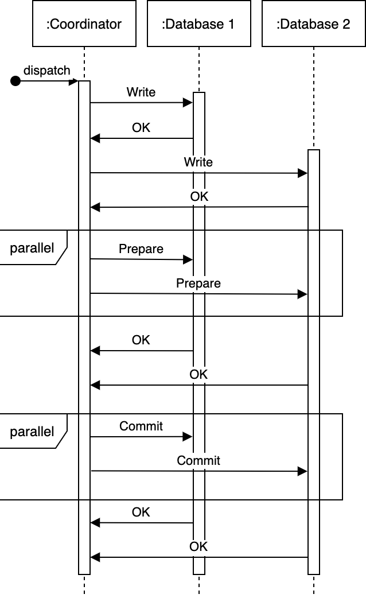

# Appendix C  C4 Model

Our email component is a client that makes requests to our email system. Our reset 
password controller uses our email component to send password reset emails to our 
users. 
Our account summary controller provides users with their bank account balance 
summaries. To obtain this information, it calls functions in our mainframe banking sys-
tem façade, which in turn makes requests to our mainframe banking system. There may 
also be other components in our backend service, not illustrated in figure C.3, which 
use our mainframe banking system façade to make requests to our mainframe banking 
system.
Single-Page Application
(Container: JavaScript and Angular)
Provides all off the Internet banking
functionality to customers via their
web browser.
Mobile App
(Container: Xamarin)
Provides a limited subset of the
Internet banking functionality to 
customers via their mobile device. 
Sign In Controller
(Component: Spring MVC
### Rest Controller)
Allows users to sign in to the
Internet Banking System
Uses
Reset Password 
Controller
(Component: Spring 
### MVC Rest Controller)
Allows users to reset
their passwords with a
single use URL.
## Security Component
(Component: Spring Bean)
Provides functionality
related to signing in,
changing passwords, etc.
Email Component
(Component: Spring Bean)
Sends emails to users.
Accounts Summary Controller
(Component: Spring MVC
### Rest Controller)
Provides customers with a
summary of their bank accounts.
Mainframe Banking 
System Facade
(Component: Spring Bean)
A facade onto the 
mainframe banking system.
Mainframe Banking System
(Softwear System)
Stores all of the core banking
information about customers,
accounts, transactions, etc.
Email System
(Software System)
The internal Microsoft
Exchange email system.
Database
(Container: Oracle
Database Schema)
Stores user registration 
information, hashed
authentication credentials,
access logs, etc.
API calls
(JSON/HTTPS)
API Application (Container)
Uses
Uses
Uses
Sends email using
Reads from and writes to
(JDBC)
Uses
(XML/HTTPS)
Figure C.3    A component diagram. Image adapted from https://c4model.com/, licensed under https://
creativecommons.org/licenses/by/4.0/.

 449 -->

	

A code diagram is a UML class diagram. (Refer to other sources such as https://www.uml 
.org/ if you are unfamiliar with UML.) You may use object-oriented programming 
(OOP) design patterns in designing an interface. 
Figure C.4 is an example code diagram of our mainframe banking system façade 
from figure C.3. Employing the façade pattern, our MainframeBankingSystem 
Facade interface is implemented in our MainframeBankingSystemFacadeImpl class. 
We employ the factory pattern, where a MainframeBankingSystemFacadeImpl object 
creates a GetBalanceRequest object. We may use the template method pattern to define 
an AbstractRequest interface and GetBalanceRequest class, define an Internet 
BankingSystemException interface and a MainframeBankingSystemException 
class, and define an AbstractResponse interface and GetBalanceResponse class. A 
MainframeBankingSystemFacadeImpl object may use a BankingSystemConnection 
connection pool to connect and make requests to our mainframe banking system and 
throw a MainframeBankingSystemException object when it encounters an error. (We 
didn’t illustrate dependency injection in figure C.4.) 
MainframeBankingSystemFacadeImpl
GetBalanceResponse
MainframeBankingSystemException
InternetBankingSystemException
AbstractRequest
BankingSystemConnection
AbstractResponse
GetBalanceRequest
com.bigbankpic.internetbanking.component.mainframe
+uses
+creates
+parses
+throws
+sends
+receives
MainframeBankingSystemFacade
Figure C.4    A code (UML class) diagram. Image adapted from https://c4model.com/, licensed under 
https://creativecommons.org/licenses/by/4.0/. 
Diagrams drawn during an interview or in a system’s documentation tend not to con-
tain only components of a specific level, but rather usually mix components of levels 
1–3.
The value of the C4 model is not about following this framework to the letter, but 
rather about recognizing its levels of abstraction and fluently zooming in and out of a 
system design.

 450 -->

D
We discuss two-phase commit (2PC) here as a possible distributed transactions tech-
nique, but emphasize that it is unsuitable for distributed services. If we discuss dis-
tributed transactions during an interview, we can briefly discuss 2PC as a possibility 
and also discuss why it should not be used for services. This section will cover this 
material. 
Figure D.1 illustrates a successful 2PC execution. 2PC consists of two phases 
(hence its name), the prepare phase and the commit phase. The coordinator first 
sends a prepare request to every database. (We refer to the recipients as databases, 
but they may also be services or other types of systems.) If every database responds 
successfully, the coordinator then sends a commit request to every database. If any 
database does not respond or responds with an error, the coordinator sends an abort 
request to every database.
**Two-phase commit (2PC)**

 451 -->

	

Figure D.1    A successful 2PC execution. This figure illustrates two databases, but the same phases 
apply to any number of databases. Figure adapted from Designing Data-Intensive Applications by Martin 
Kleppmann, 2017, O’Reilly Media. 
2PC achieves consistency with a performance tradeoff from the blocking require-
ments. A weakness of 2PC is that the coordinator must be available throughout the 
process, or inconsistency may result. Figure D.2 illustrates that a coordinator crash 
during the commit phase may cause inconsistency, as certain databases will commit, 
but the rest will abort. Moreover, coordinator unavailability completely prevents any 
database writes from occurring.  

 452 -->

