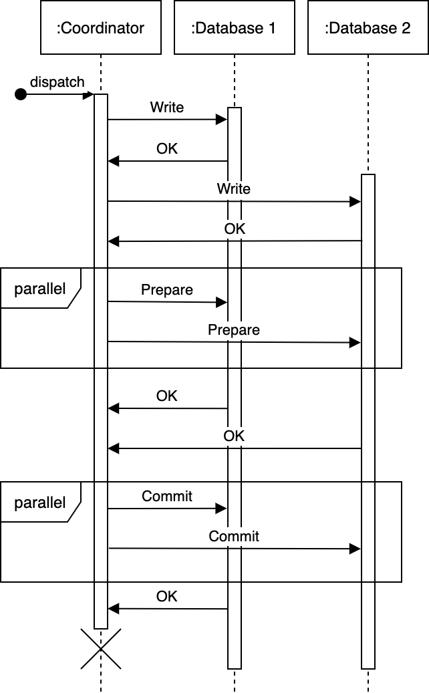

# Appendix D  Two-phase commit (2PC)

Figure D.2    A coordinator crash during the commit phase will cause inconsistency. Figure adapted from 
Designing Data-Intensive Applications by Martin Kleppmann, O’Reilly Media, 2017. 
Inconsistency can be avoided by participating databases neither committing nor abort-
ing transactions until their outcome is explicitly decided. This has the downside that 
those transactions may hold locks and block other transactions for a long time until 
the coordinator comes back.
2PC requires all databases to implement a common API to interact with the coordi-
nator. The standard is called X/Open XA (eXtended Architecture), which is a C API 
that has bindings in other languages too. 
2PC is generally unsuitable for services, for reasons including the following: 
¡ The coordinator must log all transactions, so during a crash recovery it can com-
pare its log to the databases to decide on synchronization. This imposes addi-
## tional storage requirements.
¡ Moreover, this is unsuitable for stateless services, which may interact via HTTP, 
which is a stateless protocol. 

<!-- PAGE 453 -->
 453 -->

	

¡ All databases must respond for a commit to occur (i.e., the commit does not 
occur if any database is unavailable). There is no graceful degradation. Overall, 
there is lower scalability, performance, and fault-tolerance. 
¡ Crash recovery and synchronization must be done manually because the write is 
committed to certain databases but not others. 
¡ The cost of development and maintenance of 2PC in every service/database 
involved. The protocol details, development, configuration, and deployment 
must be coordinated across all the teams involved in this effort. 
¡ Many modern technologies do not support 2PC. Examples include NoSQL 
databases, like Cassandra and MongoDB, and message brokers, like Kafka and 
RabbitMQ. 
¡ 2PC reduces availability, as all participating services must be available for com-
mits. Other distributed transaction techniques, such as Saga, do not have this 
requirement. 
Table D.1 briefly compares 2PC with Saga. We should avoid 2PC and prefer other tech-
niques like Saga, Transaction Supervisor, Change Data Capture, or checkpointing for 
distributed transactions involving services. 
## Table D.1    2PC vs. Saga
2PC
## Saga
XA is an open standard, but an 
implementation may be tied to 
a particular platform/vendor, 
which may cause lock-in.
Universal. Typically implemented 
by producing and consuming 
messages to Kafka topics. (Refer 
to chapter 5.)
Typically for immediate 
transactions.
Typically for long-running 
transactions.
Requires a transaction to be 
committed in a single process.
A transaction can be split into 
multiple steps.

<!-- PAGE 454 -->
 454 -->

