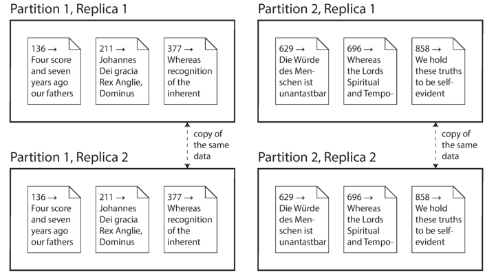

# **PART II Distributed Data** 

_For a successful technology, reality must take precedence over public relations, for nature cannot be fooled._ 

—Richard Feynman, _Rogers Commission Report_ (1986) 

In Part I of this book, we discussed aspects of data systems that apply when data is stored on a single machine. Now, in Part II, we move up a level and ask: what happens if multiple machines are involved in storage and retrieval of data? 

There are various reasons why you might want to distribute a database across multiple machines: 

# _Scalability_ 

If your data volume, read load, or write load grows bigger than a single machine can handle, you can potentially spread the load across multiple machines. 

# _Fault tolerance/high availability_ 

If your application needs to continue working even if one machine (or several machines, or the network, or an entire datacenter) goes down, you can use multiple machines to give you redundancy. When one fails, another one can take over. 

# _Latency_ 

If you have users around the world, you might want to have servers at various locations worldwide so that each user can be served from a datacenter that is geographically close to them. That avoids the users having to wait for network packets to travel halfway around the world. 

# **Scaling to Higher Load** 

If all you need is to scale to higher load, the simplest approach is to buy a more powerful machine (sometimes called _vertical scaling_ or _scaling up_ ). Many CPUs, many RAM chips, and many disks can be joined together under one operating system, and a fast interconnect allows any CPU to access any part of the memory or disk. In this kind of _shared-memory architecture_ , all the components can be treated as a single machine [1].[i] 

The problem with a shared-memory approach is that the cost grows faster than linearly: a machine with twice as many CPUs, twice as much RAM, and twice as much disk capacity as another typically costs significantly more than twice as much. And due to bottlenecks, a machine twice the size cannot necessarily handle twice the load. 

A shared-memory architecture may offer limited fault tolerance—high-end machines have hot-swappable components (you can replace disks, memory modules, and even CPUs without shutting down the machines)—but it is definitely limited to a single geographic location. 

Another approach is the _shared-disk architecture_ , which uses several machines with independent CPUs and RAM, but stores data on an array of disks that is shared between the machines, which are connected via a fast network.[ii] This architecture is used for some data warehousing workloads, but contention and the overhead of locking limit the scalability of the shared-disk approach [2]. 

# **Shared-Nothing Architectures** 

By contrast, _shared-nothing architectures_ [3] (sometimes called _horizontal scaling_ or _scaling out_ ) have gained a lot of popularity. In this approach, each machine or virtual machine running the database software is called a _node_ . Each node uses its CPUs, RAM, and disks independently. Any coordination between nodes is done at the software level, using a conventional network. 

No special hardware is required by a shared-nothing system, so you can use whatever machines have the best price/performance ratio. You can potentially distribute data across multiple geographic regions, and thus reduce latency for users and potentially be able to survive the loss of an entire datacenter. With cloud deployments of virtual 

> i. In a large machine, although any CPU can access any part of memory, some banks of memory are closer to one CPU than to others (this is called _nonuniform memory access_ , or NUMA [1]). To make efficient use of this architecture, the processing needs to be broken down so that each CPU mostly accesses memory that is nearby—which means that partitioning is still required, even when ostensibly running on one machine. 

ii. _Network Attached Storage_ (NAS) or _Storage Area Network_ (SAN). 

machines, you don’t need to be operating at Google scale: even for small companies, a multi-region distributed architecture is now feasible. 

In this part of the book, we focus on shared-nothing architectures—not because they are necessarily the best choice for every use case, but rather because they require the most caution from you, the application developer. If your data is distributed across multiple nodes, you need to be aware of the constraints and trade-offs that occur in such a distributed system—the database cannot magically hide these from you. 

While a distributed shared-nothing architecture has many advantages, it usually also incurs additional complexity for applications and sometimes limits the expressiveness of the data models you can use. In some cases, a simple single-threaded program can perform significantly better than a cluster with over 100 CPU cores [4]. On the other hand, shared-nothing systems can be very powerful. The next few chapters go into details on the issues that arise when data is distributed. 

# **Replication Versus Partitioning** 

There are two common ways data is distributed across multiple nodes: 

# _Replication_ 

Keeping a copy of the same data on several different nodes, potentially in different locations. Replication provides redundancy: if some nodes are unavailable, the data can still be served from the remaining nodes. Replication can also help improve performance. We discuss replication in Chapter 5. 

# _Partitioning_ 

Splitting a big database into smaller subsets called _partitions_ so that different partitions can be assigned to different nodes (also known as _sharding_ ). We discuss partitioning in Chapter 6. 

These are separate mechanisms, but they often go hand in hand, as illustrated in Figure II-1. 

_Figure II-1. A database split into two partitions, with two replicas per partition._ 

With an understanding of those concepts, we can discuss the difficult trade-offs that you need to make in a distributed system. We’ll discuss _transactions_ in Chapter 7, as that will help you understand all the many things that can go wrong in a data system, and what you can do about them. We’ll conclude this part of the book by discussing the fundamental limitations of distributed systems in Chapters 8 and 9. 

Later, in Part III of this book, we will discuss how you can take several (potentially distributed) datastores and integrate them into a larger system, satisfying the needs of a complex application. But first, let’s talk about distributed data. 

# **References** 

[1] Ulrich Drepper: “What Every Programmer Should Know About Memory,” _akkadia.org_ , November 21, 2007. 

[2] Ben Stopford: “Shared Nothing vs. Shared Disk Architectures: An Independent View,” _benstopford.com_ , November 24, 2009. 

[3] Michael Stonebraker: “The Case for Shared Nothing,” _IEEE Database Engineering Bulletin_ , volume 9, number 1, pages 4–9, March 1986. 

[4] Frank McSherry, Michael Isard, and Derek G. Murray: “Scalability! But at What COST?,” at _15th USENIX Workshop on Hot Topics in Operating Systems_ (HotOS), May 2015. 

