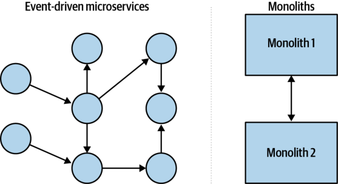
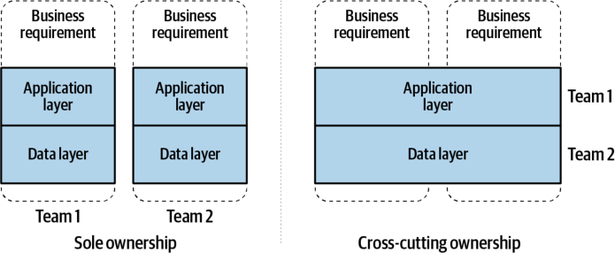
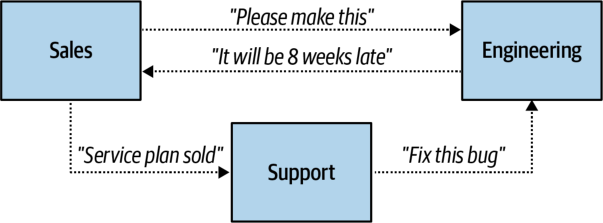
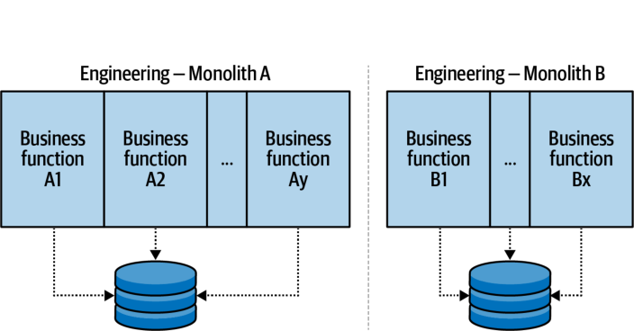
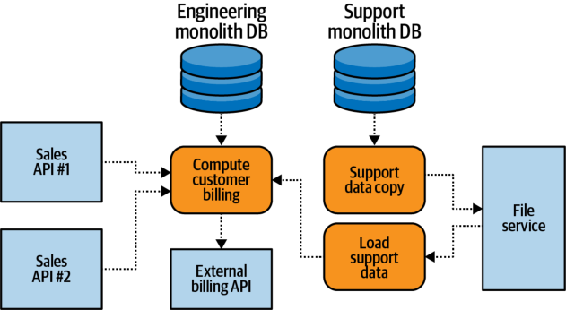

## **CHAPTER 1** 

## **Why Event-Driven Microservices** 

The medium is the message. 

—Marshall McLuhan 

McLuhan argues that it is not the _content_ of media, but rather engagement with its medium, that impacts humankind and introduces fundamental changes to society. Newspapers, radio, television, the internet, instant messaging, and social media have all changed human interaction and social structures thanks to our collective engagement. 

The same is true with computer system architectures. You need only look at the history of computing inventions to see how network communications, relational databases, big-data developments, and cloud computing have significantly altered how architectures are built and how work is performed. Each of these inventions changed not only the way that technology was used within various software projects, but also the way that organizations, teams, and people communicated with one another. From centralized mainframes to distributed mobile applications, each new medium has fundamentally changed people’s relationship with computing. 

The medium of the asynchronously produced and consumed event has been fundamentally shifted by modern technology. These events can now be persisted indefinitely, at extremely large scale, and be consumed by any service as many times as necessary. Compute resources can be easily acquired and released on-demand, enabling the easy creation and management of microservices. Microservices can store and manage their data according to their own needs, and do so at a scale that was previously limited to batch-based big-data solutions. These improvements to the humble and simple event-driven medium have far-reaching impacts that not only change computer architectures, but also completely reshape how teams, people, and organizations create systems and businesses. 

## **What Are Event-Driven Microservices?** 

Microservices and microservice-style architectures have existed for many years, in many different forms, under many different names. Service-oriented architectures (SOAs) are often composed of multiple microservices synchronously communicating directly with one another. Message-passing architectures use consumable events to asynchronously communicate with one another. Event-based communication is certainly not new, but the need for handling big data sets, at scale and in real time, _is_ new and necessitates a change from the old architectural styles. 

In a modern event-driven microservices architecture, systems communicate by issuing and consuming events. These events are not destroyed upon consumption as in message-passing systems, but instead remain readily available for other consumers to read as they require. This is an important distinction, as it allows for the truly powerful patterns covered in this book. 

The services themselves are small and purpose-built, created to help fulfill the necessary business goals of the organization. A typical definition of “small” is something that takes no more than two weeks to write. By another definition, the service should be able to (conceptually) fit within one’s own head. These services consume events from input event streams; apply their specific business logic; and may emit their own output events, provide data for request-response access, communicate with a thirdparty API, or perform other required actions. As this book will detail, these services can be stateful or stateless, complex or simple; and they might be implemented as long-running, standalone applications or executed as a function using Functions-asa-Service. 

This combination of event streams and microservices forms an interconnected graph of activity across a business organization. Traditional computer architectures, composed of monoliths and intermonolith communications, have a similar graph structure. Both of these graphs are shown in Figure 1-1. 

_Figure 1-1. The graph structures of microservices and monoliths_ 

Identifying how to make this graph structure operate efficiently involves looking at the two major components: the nodes and connections. This chapter will examine each in turn. 

## **Introduction to Domain-Driven Design and Bounded Contexts** 

Domain-driven design, as coined by Eric Evans in his book of the same title, introduces some of the necessary concepts for building event-driven microservices. Given the wealth of articles, books, and blogs-of-the-month readily available to talk about this subject, I will keep this section brief. 

The following concepts underpin domain-driven design: 

## _Domain_ 

The problem space that a business occupies and provides solutions to. This encompasses everything that the business must contend with, including rules, processes, ideas, business-specific terminology, and anything related to its problem space, _regardless of whether or not the business concerns itself with it_ . The domain exists regardless of the existence of the business. 

## _Subdomain_ 

A component of the main domain. Each subdomain focuses on a specific subset of responsibilities and typically reflects some of the business’s organizational structure (such as Warehouse, Sales, and Engineering). A subdomain can be seen as a domain in its own right. Subdomains, like the domain itself, belong to the problem space. 

**Introduction to Domain-Driven Design and Bounded Contexts | 3** 

## _Domain (and subdomain) model_ 

An abstraction of the actual domain useful for business purposes. The pieces and properties of the domain that are most important to the business are used to generate the model. The main domain model of an business is discernible through the products the business provides its customers, the interfaces by which customers interact with the products, and the various other processes and functions by which the business fulfills its stated goals. Models often need to be refined as the domain changes and as business priorities shift. A domain model is part of the solution space, as it is a construct the business uses to solve problems. 

## _Bounded context_ 

The logical boundaries, including the inputs, outputs, events, requirements, processes, and data models, relevant to the subdomain. While ideally a bounded context and a subdomain will be in complete alignment, legacy systems, technical debt, and third-party integrations often create exceptions. Bounded contexts are also a property of the solution space and have a significant impact on how microservices interact with one another. 

Bounded contexts should be highly cohesive. The internal operations of the context should be intensive and closely related, with the vast majority of communication occurring internally rather than cross-boundary. Having highly cohesive responsibilities allows for reduced design scope and simpler implementations. 

Connections between bounded contexts should be loosely coupled, as changes made within one bounded context should minimize or eliminate the impact on neighboring contexts. A loose coupling can ensure that requirement changes in one context do not propagate a surge of dependent changes to neighboring contexts. 

## **Leveraging Domain Models and Bounded Contexts** 

Every organization forms a single domain between itself and the outside world. Everyone working within the organization is operating to support the needs of its domain. 

This domain is broken down into subdomains—perhaps, for a technology-centric company, an Engineering department, a Sales department, and a Customer Support department. Each subdomain has its own requirements and duties and may itself be subdivided. This division process repeats until the subdomain models are granular and actionable and can be translated into small and independent services by the implementing teams. Bounded contexts are established around these subdomains and form the basis for the creation of microservices. 

## **Aligning Bounded Contexts with Business Requirements** 

It is common for the business requirements of a product to change during its lifetime, perhaps due to organizational changes or new feature requests. In contrast, it’s rare for a company to need to change the underlying implementation of any given product without accompanying business requirement changes. This is why bounded contexts should be built around business requirements and not technological requirements. 

Aligning bounded contexts on business requirements allows teams to make changes to microservice implementations in a loosely coupled and highly cohesive way. It provides a team with the autonomy to design and implement a solution for the specific business needs, which greatly reduces interteam dependencies and enables each team to focus strictly on its own requirements. 

Conversely, aligning microservices on technical requirements is problematic. This pattern is often seen in improperly designed synchronous point-to-point microservices and in traditional monolith-style computing systems where teams own specific technical layers of the application. The main issue with technological alignment is that it distributes the responsibility of fulfilling the business function across multiple bounded contexts, which may involve multiple teams with differing schedules and duties. Because no team is solely responsible for implementing a solution, each service becomes coupled to another across both team and API boundaries, making changes difficult and expensive. A seemingly innocent change, a bug, or a failed service can have serious ripple effects to the business-serving capabilities of all services that use the technical system. Technical alignment is seldomly used in event-driven microservice (EDM) architectures and should be avoided completely whenever possible. Eliminating cross-cutting technological and team dependencies will reduce a system’s sensitivity to change. 

Figure 1-2 shows both scenarios: sole ownership on the left and cross-cutting ownership on the right. With sole ownership, the team is fully organized around the two independent business requirements (bounded contexts) and has complete control over its application code and the database layer. On the right, the teams have been organized via technical requirements, where the application layer is managed separate from the data layer. This creates explicit dependencies between the teams, as well as implicit dependencies between the business requirements. 

**Introduction to Domain-Driven Design and Bounded Contexts | 5** 

_Figure 1-2. Alignment on business contexts versus on technological contexts_ 

Modeling event-driven microservices architectures around business requirements is preferred, though there are tradeoffs with this approach. Code may be replicated a number of times, and many services may use similar data access patterns. Product developers may try to reduce repetition by sharing data sources with other products or by coupling on boundaries. In these cases, the subsequent tight coupling may be far more costly in the long run than repeating logic and storing similar data. These tradeoffs will be examined in greater detail throughout this book. 

Keep loose coupling between bounded contexts, and focus on minimizing intercontext dependencies. This will allow bounded context implementations to change as necessary, without subsequently breaking many (or any) other systems. 

Additionally, each team may be required to have full stack expertise, which can be complicated by the need for specialized skill sets and access permissions. The organization should operationalize the most common requirements such that these vertical teams can support themselves, while more specialized skill sets can be provided on a cross-team, as-needed basis. These best practices are covered in more detail in Chapter 14. 

## **Communication Structures** 

An organization’s teams, systems, and people all must communicate with one another to fulfill their goals. These communications form an interconnected topology of dependencies called a _communication structure_ . There are three main communication structures, and each affects the way businesses operate. 

## **Business Communication Structures** 

The business communication structure (Figure 1-3) dictates communication between teams and departments, each driven by the major requirements and responsibilities assigned to it. For example, Engineering produces the software products, Sales sells to customers, and Support ensures that customers and clients are satisfied. The organization of teams and the provisioning of their goals, from the major business units down to the work of the individual contributor, fall under this structure. Business requirements, their assignment to teams, and team compositions all change over time, which can greatly impact the relationship between the business communication structure and the implementation communication structure. 

_Figure 1-3. Sample business communications structure_ 

## **Implementation Communication Structures** 

The _implementation communication structure_ (Figure 1-4) is the data and logic pertaining to the subdomain model as dictated by the organization. It formalizes business processes, data structures, and system design so that business operations can be performed quickly and efficiently. This results in a tradeoff in flexibility for the business communication structure, as redefining the business requirements that must be satisfied by the implementation requires a rewrite of the logic. These rewrites are most often iterative modifications to the subdomain model and associated code, which over time reflect the evolution of the implementation to fulfill the new business requirements. 

The quintessential example of an implementation communication structure for software engineering is the monolithic database application. The business logic of the application communicates internally via either function calls or shared state. This monolithic application, in turn, is used to satisfy the business requirements dictated by the business communication structure. 

_Figure 1-4. Sample implementation communication structure_ 

## **Data Communication Structures** 

The data communication structure (Figure 1-5) is the process through which data is communicated across the business and particularly between implementations. Although a data communication structure comprising email, instant messaging, and meetings is often used for communicating business changes, it has largely been neglected for software implementations. Its role has usually been fulfilled ad hoc, from system to system, with the implementation communication structure often playing double duty by including data communication functions in addition to its own requirements. This has caused many problems in how companies grow and change over time, the impact of which is evaluated in the next section. 

_Figure 1-5. Sample ad hoc data communication structure_ 

## **Conway’s Law and Communication Structures** 

_Organizations which design systems...are constrained to produce designs which are copies of the communication structures of these organizations._ 

—Melvin Conway— _How Do Committees Invent?_ (April 1968) 

This quote, known as _Conway’s law_ , implies that a team will build products according to the communication structures of its organization. Business communication structures organize people into teams, and these teams typically produce products that are delimited by their team boundaries. Implementation communication structures provide access to the subdomain data models for a given product, but also restrict access to other products due to the weak data communication capabilities. 

Because domain concepts span the business, domain data is often needed by other bounded contexts within an organization. Implementation communication structures are generally poor at providing this communication mechanism, though they excel at supplying the needs of their own bounded context. They influence the design of products in two ways. First, due to the inefficiencies of communicating the necessary domain data across the organization, they discourage the creation of new, logically separate products. Second, they provide easy access to existing domain data, at the risk of continually expanding the domain to encompass the new business requirements. This particular pattern is embodied by monolithic designs. 

Data communication structures play a pivotal role in how an organization designs and builds products, but for many organizations this structure has long been missing. As noted, implementation communication structures frequently play this role in addition to their own. 

Some organizations attempt to mitigate the inability to access domain data from other implementations, but these efforts have their own drawbacks. For example, shared databases are often used, though these frequently promote anti-patterns and often cannot scale sufficiently to accommodate all performance requirements. Databases may provide read-only replicas; however, this can expose their inner data models unnecessarily. Batch processes can dump data to a file store to be read by other processes, but this approach can create issues around data consistency and multiple sources of truth. Lastly, all of these solutions result in a strong coupling between implementations and further harden an architecture into direct point-to-point relationships. 

If you find that it is too hard to access data in your organization or that your products are scope-creeping because all the data is located in a single implementation, you’re likely experiencing the effects of poor data communication structures. This problem will be magnified as the organization grows, develops new products, and increasingly needs to access commonly used domain data. 

## **Communication Structures in Traditional Computing** 

An organization’s communication structures greatly influence how engineering implementations are created. This is true at the team level as well: the communication structures of the team affect the solutions it builds for the specific business requirements assigned to it. Let’s see how this works in practice. 

Consider the following scenario. A single team has a single service backed by a single data store. They are happily providing their business function, and all is well in the world. One day the team lead comes in with a new business requirement. It’s somewhat related to what the team is already doing and could possibly just be added on to their existing service. However, it’s also different enough that it could go into its own new service. 

The team is at a crossroads: do they implement the new business requirement in a new service or simply add it to their existing service? Let’s take a look at their options in a bit more detail. 

## **Option 1: Make a New Service** 

The business requirement is different enough that it could make sense to put it into a new service. But what about data? This new business function needs some of the old data, but that data is currently locked up in the existing service. Additionally, the team doesn’t really have a process for launching new, fully independent services. On the other hand, the team is getting to be a bit big, and the company is growing 

quickly. If the team has to be divided in the future, having modular and independent systems may make divvying up ownership much easier. 

There are risks associated with this approach. The team must figure out a way to source data from their original data store and copy it to their new data store. They need to ensure that they don’t expose the inner workings and that the changes they make to their data structures won’t affect any other teams copying their data. Additionally, the data being copied will always be somewhat stale, as they can only afford to copy production data in real time every 30 minutes so as not to saturate the data store with queries. This connection will need to be monitored and maintained to ensure that it is running correctly. 

There is also a risk in spinning up and running a new service. They will need to manage two data stores, and two services, and establish logging, monitoring, testing, deployment, and rollback processes for them. They must also take care to synchronize any data structure changes so as not to affect the dependent system. 

## **Option 2: Add It to the Existing Service** 

The other option is to create the new data structures and business logic within the existing service. The required data is already in the data store, and the logging, monitoring, testing, deployment, and rollback processes are already defined and in use. The team is familiar with the system and can get right to work on implementing the logic, and their monolithic patterns support this approach to service design. 

There are also risks associated with this approach, though they are a bit more subtle. Boundaries within the implementation can blur as changes are made, especially since modules are often bundled together in the same codebase. It is far too easy to quickly add features by crossing those boundaries and directly couple across the module. There is a major boon to moving quickly, but it comes at the cost of tight couplings, reduced cohesion, and a lack of modularity. Though teams can guard against this, it requires excellent planning and strict adherence to boundaries, which often fall by the wayside in the face of tight schedules, inexperience, and shifting service ownership. 

## **Pros and Cons of Each Option** 

Most teams would choose the second option—adding the functionality to the existing system. There is nothing wrong with this choice; monolithic architectures are useful and powerful structures and can provide exceptional value to a business. The first option runs head first into the two problems associated with traditional computing: 

- Accessing another system’s data is difficult to do reliably, especially at scale and in real time. 

- Creating and managing new services has substantial overhead and risk associated with it, especially if there is no established way to do so within the organization. 

Accessing local data is always easier than accessing data in another data store. Any data encapsulated in another team’s data store is difficult to obtain, as it requires crossing both implementation and business communication boundaries. This becomes increasingly difficult to maintain and scale as data, connection count, and performance requirements grow. 

Though copying the necessary data over is a worthy approach, it’s not foolproof. This model encourages many direct point-to-point couplings, which become problematic to maintain as an organization grows, business units and ownership change, and products mature and phase out. It creates a strict technical dependency the implementation communication structures of both teams (the team storing the data and the team copying it), requiring them to work in synchronicity whenever a data change is made. Special care must be taken to ensure that the internal data model of an implementation is not unduly exposed, lest other systems tightly couple to it. Scalability, performance, and system availability are often issues for both systems, as the data replication query may place an unsustainable load on the source system. Failed sync processes may not be noticed until an emergency occurs. Tribal knowledge may result in a team copying a copy of data, thinking that it’s the original source of truth. 

Copied data will always be somewhat stale by the time the query is complete and the data is transferred. The larger the data set and the more complex its sourcing, the more likely a copy will be out of sync with the original. This is problematic when systems expect each other to have perfect, up-to-date copies, particularly when communicating with one another about that data. For instance, a reporting service may report different values than a billing service due to staleness. This can have serious downstream consequences for service quality, reporting, analytics, and monetarybased decision making. 

The inability to correctly disseminate data throughout a company is not due to a fundamental flaw in the concept. Quite the contrary: it’s due to a weak or nonexistent data communication structure. In the preceding scenario, the team’s implementation communication structure is performing double duty as an extremely limited data communication structure. 

One of the tenets of event-driven microservices is that core business data should be easy to obtain and usable by any service that requires it. This replaces the ad hoc data communication structure in this scenario with a formalized data communication structure. For the hypothetical team, this data communication structure could eliminate most of the difficulties of obtaining data from other systems. 

## **The Team Scenario, Continued** 

Fast-forward a year. The team decided to go with option 2 and incorporate the new features within the same service. It was quick, it was easy, and they have implemented a number of new features since then. As the company has grown, the team has grown, and now it is time for it to be reorganized into two smaller, more focused teams. 

Each new team must now be assigned certain business functions from the previous service. The business requirements of each team are neatly divided based on areas of the business that need the most attention. Dividing the implementation communication structure, however, is not proving to be easy. Just as before, it seems that the teams both require large amounts of the same data to fulfill their requirements. New sets of questions arise: 

- Which team should own which data? 

- Where should the data reside? 

- What about data where both teams need to modify the values? 

The team leads decide that it may be best to just share the service instead, and both of them can work on different parts. This will require a lot more cross-team communication and synchronization of efforts, which may be a drag on productivity. And what about in the future, if they double in size again? Or if the business requirements change enough that they’re no longer able to fulfill everything with the same data structure? 

## **Conflicting Pressures** 

There are two conflicting pressures on the original team. It was influenced to keep all of its data local in one service to make adding new business functions quicker and easier, at the cost of expanding the implementation communication structure. Eventually the growth of the team necessitated splitting up the business communication structure—a requirement followed by the reassignment of business requirements to the new teams. The implementation communication structure, however, cannot support the reassignments in its current form and needs to be broken down into suitable components. Neither approach is scalable, and both point to a need to do things differently. These problems all stem from the same root cause: a weak, ill-defined means of communicating data between implementation communication structures. 

## **Event-Driven Communication Structures** 

The event-driven approach offers an alternative to the traditional behavior of implementation and data communication structures. Event-based communications are not a drop-in replacement for request-response communications, but rather a completely 

**Event-Driven Communication Structures | 13** 

different way of communicating between services. An event-streaming data communication structure decouples the production and ownership of data from the access to it. Services no longer couple directly through a request-response API, but instead through event data defined within event streams (this process is covered more in Chapter 3). Producers’ responsibilities are limited to producing well-defined data into their respective event streams. 

## **Events Are the Basis of Communication** 

All shareable data is published to a set of event streams, forming a continuous, canonical narrative detailing everything that has happened in the organization. This becomes the channel by which systems communicate with one another. Nearly anything can be communicated as an event, from simple occurrences to complex, stateful records. Events _are_ the data; they are not merely signals indicating data is ready elsewhere or just a means of direct data transfer from one implementation to another. Rather, they act both as data storage and as a means of asynchronous communication between services. 

## **Event Streams Provide the Single Source of Truth** 

Each event in a stream is a statement of fact, and together these statements form the single source of truth—the basis of communication for all systems within the organization. A communication structure is only as good as the veracity of its information, so it’s critical that the organization adopts the event stream narrative as a single source of truth. If some teams choose instead to put conflicting data in other locations, the event stream’s function as the organization’s data communications backbone is significantly diminished. 

## **Consumers Perform Their Own Modeling and Querying** 

The event-based data communication structure differs from an overextended implementation communication structure in that it is incapable of providing any querying or data lookup functionality. All business and application logic must be encapsulated within the producer and consumer of the events. 

Data access and modeling requirements are completely shifted to the consumer, with consumers each obtaining their own copy of events from the source event streams. Any querying complexity is also shifted from the implementation communication structure of the data owner to that of the consumer. The consumer remains fully responsible for any mixing of data from multiple event streams, special query functionality, or other business-specific implementation logic. Both producers and consumers are otherwise relieved of their duty to provide querying mechanisms, data transfer mechanisms, APIs (application programming interfaces), and cross-team 

services for the means of communicating data. They are now limited in their responsibility to only solving the needs of their immediate bounded context. 

## **Data Communication Is Improved Across the Organization** 

The usage of a data communications structure is an inversion, with all shareable data being exposed outside of the implementation communication structure. Not all data must be shared, and thus not all of it needs to be published to the set of event streams. However, any data that is of interest to any other team or service must be published to the common set of event streams, such that the production and ownership of data becomes fully decoupled. This provides the formalized data communication structure that has long been missing from system architectures and better adheres to the bounded context principles of loose coupling and high cohesiveness. 

Applications can now access data that would otherwise have been laborious to obtain via point-to-point connections. New services can simply acquire any needed data from the canonical event streams, create their own models and state, and perform any necessary business functions without depending on direct point-to-point connections or APIs with any other service. This unlocks the potential for an organization to more effectively use its vast amounts of data in any product, and even mix data from multiple products in unique and powerful ways. 

## **Accessible Data Supports Business Communication Changes** 

Event streams contain core domain events that are central to the operation of the business. Though teams may restructure and projects may come and go, the important core domain data remains readily available to any new product that requires it, _independent of any specific implementation communication structure_ . This gives the business unparalleled flexibility, as access to core domain events no longer relies upon any particular implementation. 

## **Asynchronous Event-Driven Microservices** 

Event-driven microservices enable the business logic transformations and operations necessary to meet the requirements of the bounded context. These applications are tasked with fulfilling these requirements and emitting any of their own necessary events to other downstream consumers. Here are a few of the primary benefits of using event-driven microservices: 

## _Granularity_ 

Services map neatly to bounded contexts and can be easily rewritten when business requirements change. 

## _Scalability_ 

Individual services can be scaled up and down as needed. 

**Asynchronous Event-Driven Microservices | 15** 

## _Technological flexibility_ 

Services use the most appropriate languages and technologies. This also allows for easy prototyping using pioneering technology. 

## _Business requirement flexibility_ 

Ownership of granular microservices is easy to reorganize. There are fewer crossteam dependencies compared to large services, and the organization can react more quickly to changes in business requirements that would otherwise be impeded by barriers to data access. 

## _Loosely coupling_ 

Event-driven microservices are coupled on domain data and not on a specific implementation API. Data schemas can be used to greatly improve how data changes are managed, as will be discussed in Chapter 3. 

## _Continuous delivery support_ 

It’s easy to ship a small, modular microservice, and roll it back if needed. 

## _High testability_ 

Microservices tend to have fewer dependencies than large monoliths, making it easier to mock out the required testing endpoints and ensure proper code coverage. 

## **Example Team Using Event-Driven Microservices** 

Let’s revisit the team from earlier but with an event-driven data communication structure. 

A new business requirement is introduced to the team. It’s somewhat related to what their current products do, but it’s also different enough that it could go into its own service. Does adding it to an existing service violate the single responsibility principle and overextend the currently defined bounded context? Or is it a simple extension, perhaps the addition of some new related data or functionality, of an existing service? 

Previous technical issues—such as figuring out where to source the data and how to sink it, handling batch syncing issues, and implementing synchronous APIs—are largely removed now. The team can spin up a new microservice and ingest the necessary data from the event streams, all the way back to the beginning of time if needed. It is entirely possible that the team mixes in common data used in their other services, so long as that data is used solely to fulfill the needs of the new bounded context. The storage and structure of this data are left entirely up to the team, which can choose which fields to keep and which to discard. 

Business risks are also alleviated, as the small, finer-grained services allow for single team ownership, enabling the teams to scale and reorganize as necessary. When the team grows too large to manage under a single business owner, they can split up as 

required and reassign the microservice ownership. The ownership of the event data moves with the producing service, and organizational decisions can be made to reduce the amount of cross-team communication required to perform future work. 

The nature of the microservice prevents spaghetti code and expansive monoliths from taking hold, provided that the overhead for creating new services and obtaining the necessary data is minimal. Scaling concerns are now focused on individual eventprocessing services, which can scale their CPU, memory, disk, and instance count as required. The remaining scaling requirements are offloaded onto the data communication structure, which must ensure that it can handle the various loads of services consuming from and producing to its event streams. 

To do all of this, however, the team needs to ensure that the data is indeed present in the data communication structure, and they must have the means for easily spinning up and managing a fleet of microservices. This requires an organization-wide adoption of EDM architecture. 

## **Synchronous Microservices** 

Microservices can be implemented asynchronously using events (the approach this book advocates) or synchronously, which is common in service-oriented architectures. Synchronous microservices tend to be fulfilled using a request-response approach, where services communicate directly through APIs to fulfill business requirements. 

## **Drawbacks of Synchronous Microservices** 

There are a number of issues with synchronous microservices that make them difficult to use at large scale. This is not to say that a company cannot succeed by using synchronous microservices, as evidenced by the achievements of companies such as Netflix, Lyft, Uber, and Facebook. But many companies have also made fortunes using archaic and horribly tangled spaghetti-code monoliths, so do not confuse the ultimate success of a company with the quality of its underlying architecture. There are a number of books that describe how to implement synchronous microservices, so I recommend that you read those to get a better understanding of synchronous approaches.[1] 

Furthermore, note that neither point-to-point request-response microservices nor asynchronous event-driven microservices are strictly better than the other. Both have their place in an organization, as some tasks are far better suited to one over the 

> 1 See, for example, _Building Microservices_ by Sam Newman (O’Reilly, 2015) and _Microservices for the Enterprise_ by Kasun Indrasiri and Prabath Siriwardena (Apress, 2018). 

other. However, my own experience, as well as that of many of my peers and colleagues, indicates that EDM architectures offer an unparalleled flexibility that is absent in synchronous request-response microservices. Perhaps you’ll come to agree as you proceed through this book, but at the very least, you’ll gain an understanding of their strengths and drawbacks. 

Here are some of the biggest shortcomings of synchronous request-response microservices. 

## **Point-to-point couplings** 

Synchronous microservices rely on other services to help them perform their business tasks. Those services, in turn, have their own dependent services, which have their own dependent services, and so on. This can lead to excessive fanout and difficultly in tracing which services are responsible for fulfilling specific parts of the business logic. The number of connections between services can become staggeringly high, which further entrenches the existing communication structures and makes future changes more difficult. 

## **Dependent scaling** 

The ability to scale up your own service depends on the ability of all dependent services to scale up as well and is directly related to the degree of communications fanout. Implementation technologies can be a bottleneck on scalability. This is further complicated by highly variable loads and surging request patterns, which all need to be handled synchronously across the entire architecture. 

## **Service failure handling** 

If a dependent service is down, then decisions must be made about how to handle the exception. Deciding how to handle the outages, when to retry, when to fail, and how to recover to ensure data consistency becomes increasingly difficult the more services there are within the ecosystem. 

## **API versioning and dependency management** 

Multiple API definitions and service versions will often need to exist at the same time. It is not always possible or desirable to force clients to upgrade to the newest API. This can add a lot of complexity in orchestrating API change requests across multiple services, especially if they are accompanied by changes to the underlying data structures. 

## **Data access tied to the implementation** 

Synchronous microservices have all the same problems as traditional services when it comes to accessing external data. Although there are service design strategies for 

mitigating the need to access external data, microservices will often still need to access commonly used data from other services. This puts the onus of data access and scalability back on the implementation communication structure. 

## **Distributed monoliths** 

Services may be composed such that they act as a distributed monolith, with many intertwining calls being made between them. This situation often arises when a team is decomposing a monolith and decides to use synchronous point-to-point calls to mimic the existing boundaries within their monolith. Point-to-point services make it easy to blur the lines between the bounded contexts, as the function calls to remote systems can slot in line-for-line with existing monolith code. 

## **Testing** 

Integration testing can be difficult, as each service requires fully operational dependents, which require their own in turn. Stubbing them out may work for unit tests, but seldom proves sufficient for more extensive testing requirements. 

## **Benefits of Synchronous Microservices** 

There are a number of undeniable benefits provided by synchronous microservices. Certain data access patterns are favorable to direct request-response couplings, such as authenticating a user and reporting on an AB test. Integrations with external thirdparty solutions almost always use a synchronous mechanism and generally provide a flexible, language-agnostic communication mechanism over HTTP. 

Tracing operations across multiple systems can be easier in a synchronous environment than in an asynchronous one. Detailed logs can show which functions were called on which systems, allowing for high debuggability and visibility into business operations. 

Services hosting web and mobile experiences are by and large powered by requestresponse designs, regardless of their synchronous or asynchronous nature. Clients receive a timely response dedicated entirely to their needs. 

The experience factor is also quite important, especially as many developers in today’s market tend to be much more experienced with synchronous, monolithic-style coding. This makes acquiring talent for synchronous systems easier, in general, than acquiring talent for asynchronous event-driven development. 

A company’s architecture could only rarely, if ever, be based entirely on event-driven microservices. Hybrid architectures will certainly be the norm, where synchronous and asynchronous solutions are deployed side-by-side as the problem space requires. 

## **Summary** 

Communication structures direct how software is created and managed through the life of an organization. Data communication structures are often underdeveloped and ad hoc, but the introduction of a durable, easy-to-access set of domain events, as embodied by event-driven systems, enables smaller, purpose-built implementations to be used. 

