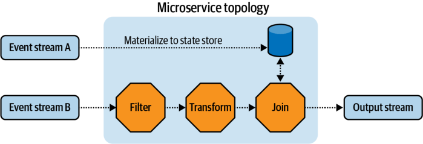
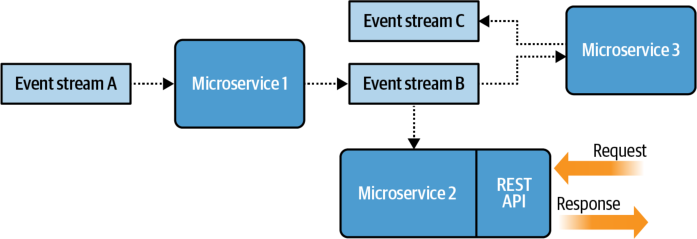
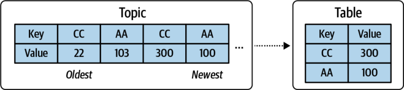
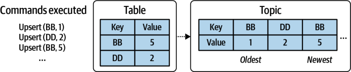
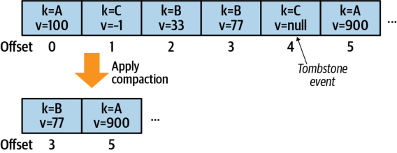
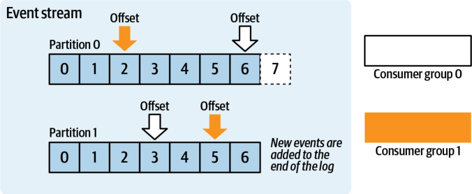
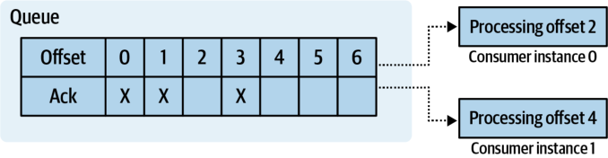

## **CHAPTER 2** 

## **Event-Driven Microservice Fundamentals** 

An _event-driven microservice_ is a small application built to fulfill a specific bounded context. _Consumer_ microservices consume and process events from one or more input event streams, whereas _producer_ microservices produce events to event streams for other services to consume. It is common for an event-driven microservice to be a consumer of one set of input event streams and a producer of another set of output event streams. These services may be stateless (see Chapter 5) or stateful (see Chapter 7) and may also contain synchronous request-response APIs (see Chapter 13). These services all share the common functionality of consuming events from or producing events to the event broker. Communication between event-driven microservices is completely asynchronous. 

Event streams are served by an _event broker_ , which is covered in more detail in the second half of this chapter. Running microservices at any meaningful scale often necessitates using deployment pipelines and container management systems, also discussed near the end of this chapter. 

## **Building Topologies** 

The term _topology_ comes up frequently in discussions of event-driven microservices. This term is often used to mean the processing logic of an individual microservice. It may also be used to refer to the graph-like relationship between individual microservices, event streams, and request-response APIs. Let’s look at each definition in turn. 

## **Microservice Topology** 

A microservice topology is the event-driven topology internal to a single microservice. This defines the data-driven operations to be performed on incoming events, including transformation, storage, and emission. 

Figure 2-1 shows a single microservice topology ingesting from two input event streams. 

_Figure 2-1. A simple microservice topology_ 

The microservice topology ingests events from event stream A and materializes them into a data store. The materialization operation is covered in greater detail later in this chapter. Meanwhile, event stream B is ingested, and certain events are filtered out, transformed, and then joined against the stored state. The results are output to a new event stream. The ingestion, processing, and output of the microservice are part of its topology. 

## **Business Topology** 

A business topology is the set of microservices, event streams, and APIs that fulfill complex business functions. It is an arbitrary grouping of services and may represent the services owned by a single team or department or those that fulfill a superset of complex business functionality. The business communication structures detailed in Chapter 1 compose the business topology. Microservices implement the business bounded contexts, and event streams provide the data communication mechanism for sharing cross-context domain data. 

A _microservice topology_ details the inner workings of a single microservice. A _business topology_ , on the other hand, details the relationships _between_ services. 

Figure 2-2 shows a business topology with three independent microservices and event streams. Note that the business topology does not detail the inner workings of a microservice. 

_Figure 2-2. A simple business topology_ 

Microservice 1 consumes and transforms data from event stream A and produces the results to event stream B. Microservice 2 and microservice 3 both consume from event stream B. Microservice 2 acts strictly as a consumer and provides a REST API in which data can be accessed synchronously. Meanwhile, microservice 3 performs its own transformations according to its bounded context requirements and outputs to event stream C. New microservices and event streams can be added to the business topology as needed, coupled asynchronously through event streams. 

## **The Contents of an Event** 

An event can be _anything_ that has happened within the scope of the business communication structure. Receiving an invoice, booking a meeting room, requesting a cup of coffee (yes, you can hook a coffee machine up to an event stream), hiring a new employee, and successfully completing arbitrary code are all examples of events that happen within a business. It is important to recognize that events can be anything that is important to the business. Once these events start being captured, event-driven systems can be created to harness and use them across the organization. 

An event is a _recording_ of what happened, much like how an application’s information and error logs record what takes place in the application. Unlike these logs, however, events are _also_ the single source of truth, as covered in Chapter 1. As such, they must contain all the information required to accurately describe what happened. 

## **The Structure of an Event** 

Events are typically represented using a key/value format. The value stores the complete details of the event, while the key is used for identification purposes, routing, and aggregation operations on events _with the same key_ . The key is not a required field for all event types. 

|**Key**|**Value**|
|---|---|
|Unique ID|Details pertaining to the Unique ID|

There are three main event types, which will be used throughout this book and which you’ll inevitably encounter in your own domains. 

## **Unkeyed Event** 

Unkeyed events are used to describe an event as a singular statement of fact. An example could be an event indicating that a customer interacted with a product, such as a user opening a book entity on a digital book platform. As the name implies, there is no key involved in this event. 

|**Key**|**Value**|
|---|---|
|N/A|ISBN: 372719, Timestamp: 1538913600|

## **Entity Event** 

An entity is a _unique thing_ and is keyed on the unique ID of that thing. The entity event describes the properties and state of an entity—most commonly an object in the business context—at a given point in time. For a book publisher, an example could be a book entity, keyed on ISBN. The value field contains all the necessary information related to the unique entity. 

|**Key**||**Value**|
|---|---|---|
|ISBN:|372719|Author: Adam Bellemare|

Entity events are particularly important in event-driven architectures. They provide a continual history of the state of an entity and can be used to materialize state (covered in the next section). Only the latest entity event is needed to determine the current state of an entity. 

## **Keyed Event** 

A keyed event contains a key but does _not represent an entity_ . Keyed events are usually used for partitioning the stream of events to guarantee data locality within a single partition of an event stream (more on this later in the chapter). An example could be a stream of events, keyed on ISBN, indicating which user has interacted with the book. 

|**Key**||**Value**|
|---|---|---|
|ISBN:|372719|UserId: A537FE|
|ISBN:|372719|UserId: BB0012|

Note that the events could be aggregated by key such that a list of users can be composed for each ISBN, resulting in a single _entity_ event keyed on ISBN.. 

## **Materializing State from Entity Events** 

You can _materialize_ a stateful table by applying entity events, in order, from an entity event stream. Each entity event is upserted into the key/value table, such that the most recently read event for a given key is represented. Conversely, you can convert a table into a stream of entity events by publishing each update to the event stream. This is known as the _table-stream duality_ , and it is fundamental to the creation of state in an event-driven microservice. This is illustrated in Figure 2-3, where AA and CC both have the newest values in their materialized table. 

_Upserting_ means inserting a new row if it doesn’t already exist in the table, or updating it if it does. 

_Figure 2-3. Materializing an event stream into a table_ 

In the same way, you can have a table record all updates and in doing so produce a stream of data representing the table’s state over time. In the following example, BB is upserted twice, while DD is upserted just once. The output stream in Figure 2-4 shows three upsert events representing these operations. 

_Figure 2-4. Generating an event stream from the changes applied to a table_ 

A relational database table, for instance, is created and populated through a series of data insertion, update, and deletion commands. These commands can be produced as events to an immutable log, such as a local append-only file (like the binary log in MySQL) or an external event stream. By playing back the entire contents of the log, you can exactly reconstruct the table and all of its data contents. 

This table-stream duality is used for communicating state between event-driven microservices. Any consumer client can read an event stream of keyed events and materialize it into its own local state store. This simple yet powerful pattern allows microservices to share state through events alone, without any direct coupling between producer and consumer services. 

The deletion of a keyed event is handled by producing a tombstone. A tombstone is a keyed event with its value set to null. This is a convention that indicates to the consumer that the event with that key should be removed from the materialized data store, as the upstream producer has declared that it is now deleted. 

Append-only immutable logs may grow indefinitely unless they are compacted. Compaction is performed by the event broker to reduce the size of its internal logs by retaining only the most recent event for a given key. Older events of the same key will be deleted, and the remaining events compacted down into a new and smaller set of files. The event stream offsets are maintained such that no changes are required by the consumers. Figure 2-5 illustrates the logical compaction of an event stream in the event broker, including the total deletion of the tombstone record. 

_Figure 2-5. After a compaction, only the most recent record is kept for a given key—all tombstone records and their predecessors of the same key are deleted_ 

Compaction reduces both disk usage and the number of events that must be processed to reach the current state, at the expense of eliminating the history of events otherwise provided by the event stream. 

Maintaining state for the processing of business logic is an extremely common pattern in an event-driven architecture. It is a near-certainty that your entire business model will not be able to fit in a purely stateless streaming domain, as past business decisions will influence decisions you make today. As a specific example, if your business is retail, you will need to know your stock level to identify when you need to reorder and to avoid selling customers items you do not have. You also want to be able to keep track of your accounts payable and accounts receivable. Perhaps you want to have a weekly promotion sent to all the customers who have provided you their email addresses. All of these systems require that you have the ability to materialize streams of events into current state representations. 

## **Event Data Definitions and Schemas** 

Event data serves as the means of long term and implementation agnostic data storage, as well as the communication mechanism between services. Therefore, it is important that both the producers and consumers of events have a common understanding of the meaning of the data. Ideally, the consumer must be able to interpret the contents and meaning of an event without having to consult with the owner of the producing service. This requires a common language for communication between producers and consumers and is analogous to an API definition between synchronous request-response services. 

Schematization selections such as Apache Avro and Google’s Protobuf provide two features that are leveraged heavily in event-driven microservices. First, they provide an evolution framework, where certain sets of changes can be safely made to the schemas without requiring downstream consumers to make a code change. Second, they also provide the means to generate typed classes (where applicable) to convert the 

schematized data into plain old objects in the language of your choice. This makes the creation of business logic far simpler and more transparent in the development of microservices. Chapter 3 covers these topics in greater detail. 

## **Microservice Single Writer Principle** 

Each event stream has one and only one producing microservice. This microservice is the owner of each event produced to that stream. This allows for the authoritative source of truth to always be known for any given event, by permitting the tracing of data lineage through the system. Access control mechanisms, as discussed in Chapter 14, should be used to enforce ownership and write boundaries. 

## **Powering Microservices with the Event Broker** 

At the heart of every production-ready event-driven microservice platform is the event broker. This is a system that receives events, stores them in a queue or partitioned event stream, and provides them for consumption by other processes. Events are typically published to different streams based on their underlying logical meaning, similar to how a database will have many tables, each logically separated to contain a specific type of data. 

Event broker systems suitable for large-scale enterprises all generally follow the same model. Multiple, distributed event brokers work together in a cluster to provide a platform for the production and consumption of event streams. This model provides several essential features that are required for running an event-driven ecosystem at scale: 

## _Scalability_ 

Additional event broker instances can be added to increase the cluster’s production, consumption, and data storage capacity. 

## _Durability_ 

Event data is replicated between nodes. This permits a cluster of brokers to both preserve and continue serving data when a broker fails. 

## _High availability_ 

A cluster of event broker nodes enables clients to connect to other nodes in the case of a broker failure. This permits the clients to maintain full uptime. 

## _High-performance_ 

Multiple broker nodes share the production and consumption load. In addition, each broker node must be highly performant to be able to handle hundreds of thousands of writes or reads per second. 

Though there are different ways in which event data can be stored, replicated, and accessed behind the scenes of an event broker, they all generally provide the same mechanisms of storage and access to their clients. 

## **Event Storage and Serving** 

These are the minimal requirements of the underlying storage of the data by the broker: 

## _Partitioning_ 

Event streams can be partitioned into individual substreams, the number of which can vary depending on the needs of the producer and consumer. This partitioning mechanism allows for multiple instances of a consumer to process each substream in parallel, allowing for far greater throughput. Note that _queues_ do not require partitioning, though it may be useful to partition them anyway for performance purposes. 

## _Strict ordering_ 

Data in an event stream partition is strictly ordered, and it is served to clients in the exact same order that it was originally published. 

## _Immutability_ 

All event data is completely immutable once published. There is no mechanism that can modify event data once it is published. You can alter previous data only by publishing a new event with the updated data. 

## _Indexing_ 

Events are assigned an index when written to the event stream. This is used by the consumers to manage data consumption, as they can specify which offset to begin reading from. The difference between the consumer’s current index and the tail index is the consumer lag. This metric can be used to scale up the number of consumers when it is high, and scale them down when it is low. Additionally, it can also be used to awaken Functions-as-a-Service logic. 

## _Infinite retention_ 

Event streams must be able to retain events for an infinite period of time. This property is foundational for maintaining state in an event stream. 

## _Replayability_ 

Event streams must be replayable, such that any consumer can read whatever data it requires. This provides the basis for the single source of truth and is foundational for communicating state between microservices. 

## **Additional Factors to Consider** 

There are a number of additional factors to consider in the selection of an event broker. 

## **Support tooling** 

Support tools are essential for effectively developing event-driven microservices. Many of these tools are bound to the implementation of the event broker itself. Some of these include: 

- Browsing of event and schema data 

- Quotas, access control, and topic management 

- Monitoring, throughput, and lag measurements 

See Chapter 14 for more information regarding tooling you may need. 

## **Hosted services** 

Hosted services allow you to outsource the creation and management of your event broker. 

- Do hosted solutions exist? 

- Will you purchase a hosted solution or host it internally? 

- Does the hosting agent provide monitoring, scaling, disaster recovery, replication, and multizone deployments? 

- Does it couple you to a single specific service provider? 

- Are there professional support services available? 

## **Client libraries and processing frameworks** 

There are multiple event broker implementations to select from, each of which has varying levels of client support. It is important that your commonly used languages and tools work well with the client libraries. 

- Do client libraries and frameworks exist in the required languages? 

- Will you be able to build the libraries if they do not exist? 

- Are you using commonly used frameworks or trying to roll your own? 

## **Community support** 

Community support is an extremely important aspect of selecting an event broker. An open source and freely available project, such as Apache Kafka, is a particularly good example of an event broker with large community support. 

- Is there online community support? 

- Is the technology mature and production-ready? 

- Is the technology commonly used across many organizations? 

- Is the technology attractive to prospective employees? 

- Will employees be excited to build with these technologies? 

## **Long-term and tiered storage** 

Depending on the size of your event streams and the duration of retention, it may be preferable to store older data segments in slower but cheaper storage. Tiered storage provides multiple layers of access performance, with a dedicated disk local to the event broker or its data-serving nodes providing the highest performance tier. Subsequent tiers can include options such as dedicated large-scale storage layer services (e.g., Amazon’s S3, Google Cloud Storage, and Azure Storage). 

- Is tiered storage automatically supported? 

- Can data be rolled into lower or higher tiers based on usage? 

- Can data be seamlessly retrieved from whichever tier it is stored in? 

## **Event Brokers Versus Message Brokers** 

I have found that people may be confused about what constitutes a message broker and what constitutes an event broker. Event brokers can be used in place of a message broker, but a message broker cannot fulfill all the functions of an event broker. Let’s compare them in more depth. 

Message brokers have a long history and have been used in large-scale messageoriented middleware architectures by numerous organizations. Message brokers enable systems to communicate across a network through publish/subscribe message queues. Producers write messages to a queue, while a consumer consumes these messages and processes them accordingly. Messages are then acknowledged as consumed and deleted either immediately or shortly thereafter. Message brokers are designed to handle a different type of problem than event brokers. 

Event brokers, on the other hand, are designed around providing an ordered log of facts. Event brokers meet two very specific needs that are not satisfied by the message broker. For one, the message broker provides only _queues_ of messages, where the 

consumption of the message is handled on a per-queue basis. Applications that share consumption from a queue will each receive only a subset of the records. This makes it impossible to correctly communicate state via events, since each consumer is unable to obtain a full copy of all events. Unlike the message broker, the event broker maintains a single ledger of records and manages individual access via indices, so each independent consumer can access all required events. Additionally, a message broker deletes events after acknowledgment, whereas an event broker retains them for as long as the organization needs. The deletion of the event after consumption makes a message broker insufficient for providing the indefinitely stored, globally accessible, replayable, single source of truth for all applications. 

Event brokers enable an immutable, append-only log of facts that preserves the state of event ordering. The consumer can pick up and reprocess from anywhere in the log at any time. This pattern is essential for enabling event-driven microservices, but it is not available with message brokers. 

Keep in mind that queues, as used in message brokers, still have a role in event-driven microservices. Queues provide useful access patterns that may be awkward to implement with strictly partitioned event streams. The patterns introduced by message broker systems are certainly valid patterns for EDM architectures, but they are not _sufficient_ for the full scope of duties such architectures require. The remainder of the book focuses not on any message broker architectures or application design, but instead on the usage of event brokers in EDM architectures. 

## **Consuming from the Immutable Log** 

Though not a definitive standard, commonly available event brokers use an appendonly _immutable_ log. Events are appended at the end of the log and given an autoincrementing index ID. Consumers of the data use a reference to the index ID to access data. Events can then be consumed as either an event stream or a queue, depending on the needs of the business and the available functionality of the event broker. 

## **Consuming as an event stream** 

Each consumer is responsible for updating its own pointers to previously read indices within the event stream. This index, known as the _offset_ , is the measurement of the current event from the beginning of the event stream. Offsets permit multiple consumers to consume and track their progress independently of one another, as shown in Figure 2-6. 

_Figure 2-6. Consumer groups and their per-partition offsets_ 

The _consumer group_ allows for multiple consumers to be viewed as the same logical entity and can be leveraged for horizontal scaling of message consumption. A new consumer joins the consumer group, causing a redistribution of event stream partition assignments. The new consumer consumes events only from its assigned partitions, just as older consumer instances previously in the group continue to consume only from their remaining assigned partitions. In this way, event consumption can be balanced across the same consumer group, while ensuring that all events for a given partition are exclusively consumed by a single consumer instance. The number of active consumer instances in the group is limited to the number of partitions in the event stream. 

## **Consuming as a queue** 

In queue-based consumption, each event is consumed by one and only one microservice instance. Upon being consumed, that event is marked as “consumed” by the event broker and is no longer provided to any other consumer. Partition counts do not matter when consuming as a queue, as any number of consumer instances can be used for consumption. 

Event order is not maintained when processing from a queue. Parallel consumers consume and process events out of order, while a single consumer may fail to process an event, return it to the queue for processing at a later date, and move on to the next event. 

Queues are not supported by all event brokers. For instance, Apache Pulsar currently supports queues while Apache Kafka does not. Figure 2-7 shows the implementation of a queue using individual offset acknowledgment. 

_Figure 2-7. Consuming from an immutable log as a queue_ 

## **Providing a Single Source of Truth** 

The durable and immutable log provides the storage mechanism for the single source of truth, with the event broker becoming the only location in which services consume and produce data. This way, every consumer is guaranteed to be given an identical copy of the data. 

Adopting the event broker as the single source of truth requires a culture shift in the organization. Whereas previously a team may simply have written direct SQL queries to access data in a monolith’s database, now the team must also publish the monolith’s data to the event broker. The developers managing the monolith must ensure that the data produced is fully accurate, because any disagreement between the event streams and the monolith’s database will be considered a failure of the producing team. Consumers of the data no longer couple directly on the monolith, but instead consume directly from the event streams. 

The adoption of event-driven microservices enables the creation of services that use only the event broker to store and access data. While local copies of the events may certainly be used by the business logic of the microservice, the event broker remains the single source of truth for all data. 

## **Managing Microservices at Scale** 

Managing microservices can become increasingly difficult as the number of services grows. Each microservice requires specific compute resources, data stores, configurations, environment variables, and a whole host of other microservice-specific properties. Each microservice must also be manageable and deployable by the team that owns it. Containerization and virtualization, along with their associated management systems, are common ways to achieve this. Both options allow individual teams to customize the requirements of their microservices through a single unit of deployability. 

## **Putting Microservices into Containers** 

Containers, as recently popularized by Docker, isolate applications from one another. Containers leverage the existing host operating system via a shared kernel model. This provides basic separation between containers, while the container itself isolates environment variables, libraries, and other dependencies. Containers provide most of the benefits of a virtual machine (covered next) at a fraction of the cost, with fast startup times and low resource overhead. 

Containers’ shared operating system approach does have some tradeoffs. Containerized applications must be able to run on the host OS. If an application requires a specialized OS, then an independent host will need to be set up. Security is one of the major concerns, since containers share access to the host machine’s OS. A vulnerability in the kernel can put all the containers on that host at risk. With friendly workloads this is unlikely to be a problem, but current shared tenancy models in cloud computing are beginning to make it a bigger consideration. 

## **Putting Microservices into Virtual Machines** 

Virtual machines (VMs) address some of the shortcomings of containers, though their adoption has been slower. Traditional VMs provide full isolation with a selfcontained OS and virtualized hardware specified for each instance. Although this alternative provides higher security than containers, it has historically been much more expensive. Each VM has higher overhead costs compared to containers, with slower startup times and larger system footprints. 

Efforts are under way to make VMs cheaper and more efficient. Current initiatives include Google’s gVisor, Amazon’s Firecracker, and Kata Containers, to mention just a few. As these technologies improve, VMs will become a much more competitive alternative to containers for your microservice needs. It is worth keeping an eye on this domain should your needs be driven by security-first requirements. 

## **Managing Containers and Virtual Machines** 

Containers and VMs are managed through a variety of purpose-built software known as _container management systems_ (CMSes). These control container deployment, resource allocation, and integration with the underlying compute resources. Popular and commonly used CMSes include Kubernetes, Docker Engine, Mesos Marathon, Amazon ECS, and Nomad. 

Microservices must be able to scale up and down depending on changing workloads, service-level agreements (SLAs), and performance requirements. Vertical scaling must be supported, in which compute resources such as CPU, memory, and disk are 

increased or decreased on each microservice instance. Horizontal scaling must also be supported, with new instances added or removed. 

Each microservice should be deployed as a single unit. For many microservices, a single executable is all that is needed to perform its business requirements, and it can be deployed within a single container. Other microservices may be more complex, with multiple containers and external data stores requiring coordination. This is where something like Kubernetes’s pod concept comes into play, allowing for multiple containers to be deployed and reverted as a single action. Kubernetes also allows for single-run operations; for example, database migrations can be run during the execution of the single deployable. 

VM management is supported by a number of implementations, but is currently more limited than container management. Kubernetes and Docker Engine support Google’s gVisor and Kata Containers, while Amazon’s platform supports AWS Firecracker. The lines between containers and VMs will continue to blur as development continues. Make sure that the CMS you select will handle the containers and VMs that you require of it. 

There are rich sets of resources available for Kubernetes, Docker, Mesos, Amazon ECS, and Nomad. The information they provide goes far beyond what I can present here. I encourage you to look into these materials for more information. 

## **Paying the Microservice Tax** 

The _microservice tax_ is the sum of costs, including financial, manpower, and opportunity, associated with implementing the tools and components of a microservice architecture. This includes the cost of managing, deploying, and operating the event broker, CMS, deployment pipelines, monitoring solutions, and logging services. These expenses are unavoidable and are paid either centrally by the organization or independently by each team implementing microservices. The former results in a scalable, simplified, and unified framework for developing microservices, while the latter results in excessive overhead, duplicate solutions, fragmented tooling, and unsustainable growth. 

Paying the microservice tax is not a trivial matter, and it is one of the largest impediments to getting started with EDM. Small organizations would likely do best to stick with an architecture that better suits their business needs, such as a modular monolith. Larger organizations need to account for the total costs of both the implementation and maintenance of a microservice platform and determine if the long-term roadmap of their business can accommodate the predicted work efforts. 

Fortunately, both open source and hosted services have become far more available and easy to use in recent years. The microservice tax is being steadily reduced with new integrations between CMSes, event brokers, and other commonly needed tools. Be sure that your organization is prepared to devote the necessary resources to pay these up-front costs. 

## **Summary** 

This chapter covered the basic requirements behind event-driven microservices. The event broker is the main mechanism of data communication, providing real-time event streams at scale for other services to consume. Containerization and container management systems allow for running microservices at scale. Lastly, this chapter also covered the important principles underlying events and event-driven logic and provided a first look at managing state in an distributed event-driven world. 

