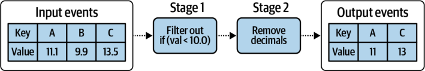
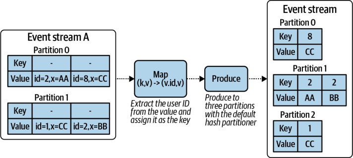
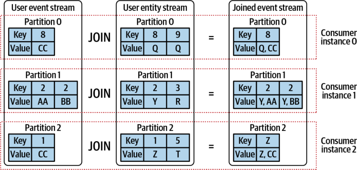
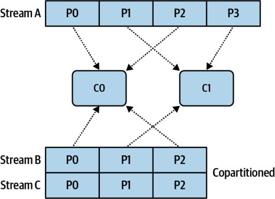
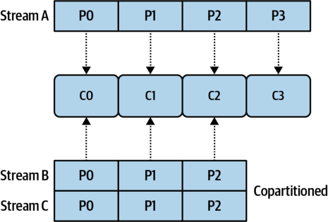

# Chapter 5. Event-Driven Processing Basics

Most event-driven microservices follow, at a minimum, the same three steps: 

1. Consume an event from an input event stream. 

2. Process that event. 

3. Produce any necessary output events. 

There are also event-driven microservices that derive their input _event_ from a synchronous request-response interaction, which is covered more in Chapter 13. This chapter covers only microservices that source their events from event streams. 

In stream-sourced event-driven microservices, the microservice instance will create a producer client and a consumer client and register itself with any necessary consumer groups, if applicable. The microservice starts a loop to poll the consumer client for new events, processing them as they come in and emitting any required output events. This workflow is shown in the following pseudocode. (Your implementation will of course vary according to your language, stream-processing framework, eventbroker selection, and other technical factors.) 

```
ConsumerconsumerClient=newconsumerClient(consumerGroupName,...);
ProducerproducerClient=newproducerClient(...);
```

**while (true) {** 

```
InputEventevent=consumerClient.pollOneEvent(inputEventStream);
OutputEventoutput=processEvent(event);
```

```
producerClient.produceEventToStream(outputEventStream,output);
```

```
//At-least-once processing.
```

```
consumerClient.commitOffsets();
```

```
}
```


The `processEvent` function is of particular interest. This is where the real eventprocessing work gets done, primarily the application of business logic and which events, if any, to emit. This processing function is best thought of as the entry point to the _processing topology_ of the microservice. From here, data-driven patterns transform and process the data for your bounded context’s business needs. 

## Composing Stateless Topologies

Building a microservice topology requires thinking in an event-driven way, as the code executes in response to an event arriving at the consumer input. The topology of the microservice is essentially a sequence of operations to perform on the event. It requires choosing the necessary filters, routers, transformations, materializations, aggregations, and other functions required to perform the necessary business logic of the microservice. Those familiar with functional programming and big data mapreduce-style frameworks may feel quite at home here. For others, this may be a bit of a new concept. 

Consider the topology in Figure 5-1. Events are consumed one at a time and are processed according to the transformations in stages 1 and 2. 





_Figure 5-1. A simple event processing topology_ 

The events with key `A` and `C` both traverse the entire topology. They’re both larger than `10.0` , which gets them through stage 1, and stage 2 simply drops the decimal point from the value of the event. The event keyed on `B` , however, is filtered out and dropped because it does not meet the stage 1 criteria. 

### Transformations

A transform processes a single event and emits zero or more output events. Transforms, as you might guess, provide the bulk of the business logic operations requiring transformations. Events may need to be repartitioned depending on the operations (more on this shortly). Common transformations include, but are not limited to, the following: 

**Filter** 

Propagate the event if it meets the necessary criteria. Emits zero or one events. 


**Map** 

Changes the key and/or value of the event, emitting exactly one event. Note that if you change the key, you may need to repartition to ensure data locality. 

**MapValue** 

Change only the value of the event, not the key. Emits exactly one event. Repartitioning will not be required. 

**Custom transforms** 

Apply custom logic, look up state, and even communicate with other systems synchronously. 

### Branching and Merging Streams

A consumer application may need to _branch_ event streams—that is, apply a logical operator to an event and then output it to a new stream based on the result. One relatively common scenario is consuming a “firehose” of events and deciding where to route them based on particular properties (e.g., country, time zone, origin, product, or any number of features). A second common scenario is emitting results to different output event streams—for example, outputting events to a dead-letter stream in case of a processing error, instead of dropping them completely. 

Applications may also need to _merge_ streams, where events from multiple input streams are consumed, possibly processed in some meaningful way, and then output to a single output stream. There aren’t too many scenarios where it’s important to merge multiple streams into just one, since it is common for microservices to consume from as many input streams as necessary to fulfill their business logic. Chapter 6 discusses how to handle consuming and processing events from multiple input streams in a consistent and reproducible order. 


If you do end up merging event streams, define a new unified schema representative of the merged event steam domain. If this domain doesn’t make sense, then it may be best to leave the streams unmerged and reconsider your system design. 

## Repartitioning Event Streams

Event streams are partitioned according to the event key and the event partitioner logic. For each event, the event partitioner is applied, and a partition is selected for the event to be written to. _Repartitioning_ is the act of producing a new event stream with one or more of the following properties: 


**Different partition count** 

Increase an event stream’s partition count to increase downstream parallelism or to match the number of partitions of another stream for copartitioning (covered later in this chapter). 

**Different event key** 

Change the event key to ensure that events with the same key are routed to the same partition. 

**Different event partitioner** 

Change the logic used to select which partition an event will be written to. 

It’s rare that a purely stateless processor will need to repartition an event stream, barring the case of increasing the partition count for increased downstream parallelism. That being said, a stateless microservice may be used to repartition events that are consumed by a downstream _stateful_ processor, which is the subject of the next example. 


The partitioner algorithm deterministically maps an event’s key to a specific partition, typically by using a hash function. This ensures that all events with the same key end up in the same partition. 

### Example: Repartitioning an Event Stream

Suppose there is a stream of user data coming in from a web-facing endpoint. The user actions are converted into events, with the payload of the events containing both a user ID and other arbitrary event data, labeled `x` . 

Consumers of this state are interested in ensuring that all of the data belonging to a particular user is contained within the _same partition_ , regardless of how the source event stream is partitioned. This stream can be repartitioned to ensure this is the case, as shown in Figure 5-2. 

Producing all events for a given key into a single partition provides the basis for _data locality_ . A consumer need only consume events from a single partition to build a complete picture of events pertaining to that key. This enables consumer microservices to scale up to many instances, each consuming from a single partition, while maintaining a complete stateful account of all events pertaining to that key. Repartitioning and data locality are essential parts of performing stateful processing at scale. 





_Figure 5-2. Repartitioning an event stream_ 

## Copartitioning Event Streams

_Copartitioning_ is the repartition of an event stream into a new one with the same partition count and partition assignor logic as another stream. This is required when keyed events from one event stream need to be colocated (for data locality) with the events of another stream. This is an important concept for stateful stream processing, as numerous stateful operations (such as streaming joins) require that all events for a given key, regardless of which stream they’re from, be processed through the same node. This is covered in more detail in Chapter 7. 

### Example: Copartitioning an Event Stream

Consider again the repartition example of Figure 5-2. Say that you now need to join the repartitioned user event stream with a user entity stream, keyed on that same ID. These joining of these streams is shown in Figure 5-3. 

Both streams have the same partition count, and both have been partitioned using the same partitioner algorithm. Note that the key distribution of each partition matches the distribution of the other stream and that each join is performed by its own consumer instance. The next section covers how partitions are assigned to a microservice instance to leverage copartitioned streams, as was done in this join example. 





_Figure 5-3. Copartitioned user event and user entity streams_ 

## Assigning Partitions to a Consumer Instance

Each microservice maintains its own unique consumer group representing the collective offsets of its input event streams. The first consumer instance that comes online will register with the event broker using its consumer group name. Once registered, the consumer instance will then need to be assigned partitions. 

Some event brokers, such as Apache Kafka, delegate partition assignment to the first online client for each consumer group. As consumer group leader, this instance is responsible for performing the partition assignor duties, ensuring that input eventstream partitions are correctly assigned whenever new instances join that consumer group. 

Other event brokers, such as Apache Pulsar, maintain a centralized ownership of partition assignment within the broker. In this case, the partition assignment and rebalancing are done by the broker, but the mechanism of identification via consumer group remains the same. Partitions are assigned, and work can begin from the last known offsets of consumed events. 

Work is usually momentarily suspended while partitions are reassigned to avoid assignment race conditions. This ensures that any revoked partitions are no longer being processed by another instance before assignment to the new instance, eliminating any potential duplicate output. 

### Assigning Partitions with the Partition Assignor

Multiple instances of a consumer microservice are typically required for processing large volumes of data, whether it’s a dedicated stream-processing framework or a 


basic producer/consumer implementation. A _partition assignor_ ensures that partitions are distributed to the processing instances in a balanced and equitable manner. 

This partition assignor is also responsible for reassigning partitions whenever new consumer instances are added or removed from the consumer group. Depending on your event broker selection, this component may be built into the consumer client or maintained within the event broker. 

### Assigning Copartitioned Partitions

The partition assignor is also responsible for ensuring that any copartitioning requirements are met. All partitions marked as copartitioned must be assigned to the same single consumer instance. This ensures that a given microservice instance will be assigned the correct subset of event data to perform its business logic. It is good practice to have the partition assignor implementation check to see that the event streams have an equal partition count and throw an exception on inequality. 

### Partition Assignment Strategies

The goal of a partition assignment algorithm is to ensure that partitions are evenly distributed across the consumer instances, assuming that the consumer instances are equal in processing capabilities. A partition assignment algorithm may also have secondary goals, such as reducing the number of partitions reassigned during a rebalance. This is particularly important when you are dealing with materialized state sharded across multiple data store instances, as the reassignment of a partition can cause future updates to go to the wrong shard. Chapter 7 explores this concept further with regard to internal state stores. 

There are a number of common strategies for assigning partitions. The default strategy may vary depending on your framework or implementation, but the following three tend to be the most commonly used. 

**Round-robin assignment** 

All partitions are tallied into a list and assigned in a round-robin manner to each consumer instance. A separate list is kept for copartitioned streams to ensure proper copartitioned assignment. 

Figure 5-4 shows two consumer instances, each with its own set of assigned partitions. C0 has two sets of copartitioned partitions compared to one for C1, since assignment both began and ended on C0. 





_Figure 5-4. Round-robin partition assignments for two consumer instances_ 

When the number of consumer instances for the given consumer group increases, partition assignments should be rebalanced to spread the load among the newly added resources. Figure 5-5 shows the effects of adding two more consumer instances. 





_Figure 5-5. Round-robin partition assignments for four consumer instances_ 

C2 is now assigned the copartitioned P2s, as well as stream A’s P2. C3, on the other hand, only has partition P3 from stream A because there are no additional partitions to assign. Adding any further instances will not result in any additional parallelization. 


**Static assignment** 

Static assignment protocols can be used when specific partitions must be assigned to specific consumers. This option is most useful when large volumes of stateful data are materialized on any given instance, usually for internal state stores. When a consumer instance leaves the consumer group, a static assignor will not reassign the partitions, but will instead wait until the missing consumer instance comes back online. Depending on the implementation, partitions may be dynamically reassigned anyway, should the original consumer fail to rejoin the consumer group within a designated period of time. 

**Custom assignment** 

By leveraging external signals and tooling, custom assignments can be tailored to the needs of the client. For example, assignment could be based on the current lag in the input event streams, ensuring an equal distribution of work across all of your consumer instances. 

## Recovering from Stateless Processing Instance Failures

Recovering from stateless failures is effectively the same as simply adding a new instance to a consumer group. Stateless processors do not require any state restoration, which means they can immediately go back to processing events as soon as they’re assigned partitions and establish their stream time. 

## Summary

The basic stateless event-driven microservice consumes events, processes them, and emits any new subsequent events. Each event is processed independently of the others. Basic transformations allow you to change events into more useful formats, which you can then repartition into a newly keyed event stream with a new partition count. Event streams with the same key, the same partitioner algorithm, and the same partition count are said to be _copartitioned_ , which guarantees data locality for a given consumer instance. The partition assignor is used to ensure that partitions between consumer instances are evenly distributed and that copartitioned event streams are correctly coassigned. 

Copartitioning and partition assignment are important concepts for understanding stateful processing, which is covered in Chapter 7. First, though, you must consider how to handle processing multiple partitions from multiple event streams. Out-oforder events, late events, and the order in which events are selected for processing all have a significant impact on the design of your services. This will be the topic of the next chapter. 
