# Chapter 6. Deterministic Stream Processing

Event-driven microservices usually have topologies that are more complex than those introduced in the previous chapter. Events are consumed and processed from multiple event streams, while stateful processing (covered in the next chapter) is required to solve many business problems. Microservices are also subject to the same faults and crashes as nonmicroservice systems. It is not uncommon to have a mixture of microservices processing events in near–real time while other, newly started microservices are catching up by processing historical data. 

Here are the three main questions addressed in this chapter: 

- How does a microservice choose the order of events to process when consuming from multiple partitions? 

- How does a microservice handle out-of-order and late-arriving events? 

- How do we ensure that our microservices produce deterministic results when processing streams in near–real time versus when processing from the beginning of the streams? 

We can answer these questions by examining timestamps, event scheduling, watermarks, and stream times, and how they contribute to deterministic processing. Bugs, errors, and changes in business logic will also necessitate reprocessing, making deterministic results important. This chapter also explores how out-of-order and latearriving events can occur, strategies for handling them, and mitigating their impact on our workflows. 

This chapter is fairly information-dense despite my best efforts to find a simple and concise way to explain the key concepts. There are a number of sections where I will refer you to further resources to explore on your own, as the details often go beyond the scope of this book. 

## Determinism with Event-Driven Workflows

An event-driven microservice has two main processing states. It may be processing events at near–real time, which is typical of long-running microservices. Alternately, it may be processing events from the past in an effort to catch up to the present time, which is common for underscaled and new services. 

If you were to rewind the consumer group offsets of the input event streams to the beginning of time and start the microservice run again, would it generate the same output as the first time it was run? The overarching goal of deterministic processing is that a microservice should produce the same output whether it is processing in real time or catching up to the present time. 

Note that there are workflows that are explicitly nondeterministic, such as those based on the current wall-clock time and those that query external services. External services may provide different results depending on when they are queried, especially if their internal state is updated independently of that from the services issuing the query. In these cases there is no promise of determinism, so be sure to pay attention to any nondeterministic operations in your workflow. 

Fully deterministic processing is the ideal case, where every event arrives on time and there is no latency, no producer or consumer failures, and no intermittent network issues. Since we have no choice but to deal with these scenarios, the reality is that our services can only achieve a best effort at determinism. There are a number of components and processes that work together to facilitate this attempt, and in most cases best-effort determinism will be sufficient for your requirements. There are a few things you need to achieve this: consistent timestamps, well-selected event keys, partition assignment, event scheduling, and strategies to handle late-arriving events. 

## Timestamps

Events can happen anywhere and at any time and often need to be reconciled with events from other producers. Synchronized and consistent timestamps are a hard requirement for comparing events across distributed systems. 

An event stored in an event stream has both an offset and a timestamp. The offset is used by the consumer to determine which events it has already read, while the timestamp, which indicates when that event was created, is used to determine when an 

event occurred relative to other events and to ensure that events are processed in the correct order. 

The following timestamp-related concepts are illustrated in Figure 6-1, which shows their temporal positions in the event-driven workflow: 

**Event time** 

The local timestamp assigned to the event by the producer at the time the event occurred. 

**Broker ingestion time** 

The timestamp assigned to the event by the event broker. You can configure this to be either the event time or the ingestion time, with the former being much more common. In scenarios where the producer’s event time is unreliable, broker-ingestion time can provide a sufficient substitute. 

**Consumer ingestion time** 

The time in which the event is ingested by the consumer. This can be set to the event time specified in the broker record, or it can be the wall-clock time. 

**Processing time** 

The wall-clock time at which the event has been processed by the consumer. 

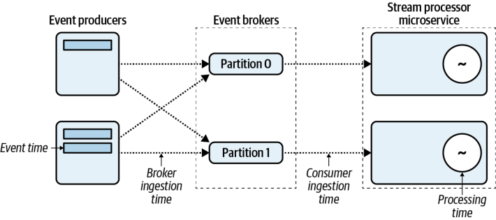

_Figure 6-1. Event scheduler ordering the input events by timestamp_ 

You can see that it’s possible to propagate the event time through the event broker to the consumer, enabling the consumer logic to make decisions based on _when_ an event happened. This will help answer the three questions posed at the start of the chapter. Now that we’ve mapped out the types of timestamps, let’s take a look at how they’re generated. 

### Synchronizing Distributed Timestamps

A fundamental limitation of physics is that two independent systems cannot be guaranteed to have precisely the same system-clock time. Various physical properties limit how precise system clocks can be, such as material tolerances in the underlying clock circuitry, variations in the operating temperature of the chip, and inconsistent network communication delays during synchronization. However, it is possible to establish local system clocks that are _nearly_ in sync and end up being good enough for most computing purposes. 

Consistent clock times are primarily accomplished by synchronizing with Network Time Protocol (NTP) servers. Cloud service providers such as Amazon and Google offer redundant satellite-connected and atomic clocks in their various regions for instant synchronization. 

Synchronization with NTP servers within a local area network can provide very accurate local system clocks, with a drift of only a few mS after 15 minutes. This can be reduced to 1 mS or less with more frequent synchronizations in best-case scenarios according to David Mills, NTP’s inventor, though intermittent network issues may prevent this target from being reached in practice. Synchronization across the open internet can result in much larger skews, with accuracy being reduced to ranges of +/ − 100mS, and is a factor to be considered if you’re trying to resynchronize events from different areas of the globe. 

NTP synchronization is also prone to failure, as network outages, misconfiguration, and transient issues may prevent instances from synchronizing. The NTP servers themselves may also otherwise become unreliable or unresponsive. The clock within an instance may be affected by multitenancy issues, just as in VM-based systems sharing the underlying hardware. 

For the vast majority of business cases, frequent synchronization to NTP servers can provide sufficient consistency for system event time. Improvements to NTP servers and GPS usage have begun to push NTP synchronization accuracy consistently into the submillisecond range. The creation time and ingestion time values assigned as the timestamps can be highly consistent, though minor out-of-order issues will still occur. Handling of late events is covered later in this chapter. 

### Processing with Timestamped Events

Timestamps provide a way to process events distributed across multiple event streams and partitions in a consistent temporal order. Many use cases require you to maintain order between events based on time, and need consistent, reproducible results regardless of when the event stream is processed. Using offsets as a means of comparison works only for events within a single event stream partition, while events quite commonly need to be processed from multiple different event streams. 

**Example: Selecting order of events when processing multiple partitions** 

A bank must ensure that both deposit and withdrawal event streams are processed in the correct temporal order. It keeps a stateful running tally of withdrawals and deposits, applying an overdraft penalty when a client’s account balance drops below $0. For this example, the bank has its deposits in one event stream and its withdrawals in another stream, as shown in Figure 6-2. 

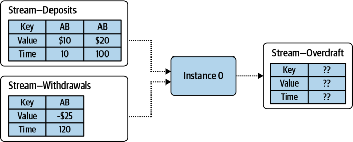

_Figure 6-2. In which order should events be processed?_ 

A naive approach to consuming and processing records, perhaps a round-robin processor, might process the $10 deposit first, the $25 withdrawal second (incurring a negative balance and overdraft penalties), and the $20 deposit third. This is incorrect, however, and does not represent the temporal order in which the events occurred. This example makes clear that you must consider the event’s timestamp when consuming and processing events. The next section discusses this in greater detail. 

## Event Scheduling and Deterministic Processing

Deterministic processing requires that events be processed consistently, such that the results can be reproduced at a later date. Event scheduling is the process of selecting the next events to process when consuming from multiple input partitions. For an immutable log-based event stream, records are consumed in an offset-based order. However, as Figure 6-2 demonstrates, the processing order of events must be interleaved based on the _event time_ provided in the record, regardless of which input partition it comes from, to ensure correct results. 

The most common event-scheduling implementation selects and dispatches the event with the oldest timestamp from all assigned input partitions to the downstream processing topology. 

Event scheduling is a feature of many stream-processing frameworks, but is typically absent from basic consumer implementations. You will need to determine if it is required for your microservice implementation. 

Your microservice will need event scheduling if the order in which events are consumed and processed matters to the business logic. 

### Custom Event Schedulers

Some streaming frameworks allow you to implement custom event schedulers. For example, Apache Samza lets you implement a `MessageChooser` class, where you select which event to process based on a number of factors, such as prioritization of certain event streams over others, the wall-clock time, event time, event metadata, and even content within the event itself. You should take care when implementing your own event scheduler, however, as many custom schedulers are nondeterministic in nature and won’t be able to generate reproducible results if reprocessing is required. 

### Processing Based on Event Time, Processing Time, and Ingestion Time

A time-based order of event processing requires you to select _which_ point in time to use as the event’s timestamp, as per Figure 6-1. The choice is between the locally assigned event time and broker ingestion time. Both timestamps occur only once each in a produce-consume workflow, whereas the wall-clock and consumer ingestion time change depending on when the application is executed. 

In most scenarios, particularly when all consumers and all producers are healthy and there is no event backlog for any consumer group, all four points in time will be within a few seconds of each other. Contrarily, for a microservice processing historic events, event time and consumer ingestion time will differ significantly. 

For the most accurate depiction events in the real world, it is best to use the locally assigned event time _provided you can rely on its accuracy_ . If the producer has unreliable timestamps (and you can’t fix it), your next best bet is to set the timestamps based on when the events are ingested into the event broker. It is only in rare cases where the event broker and the producer cannot communicate that there may be a substantial delay between the true event time and the one assigned by the broker. 

### Timestamp Extraction by the Consumer

The consumer must know the timestamp of the record before it can decide how to order it for processing. At consumer ingestion time, a _timestamp extractor_ is used to extract the timestamp from the consumed event. This extractor can take information from any part of the event’s payload, including the key, value, and metadata. 

Each consumed record has a designated event-time timestamp that is set by this extractor. Once this timestamp has been set, it is used by the consumer framework for the duration of its processing. 

### Request-Response Calls to External Systems

Any non-event-driven requests made to external systems from within an eventdriven topology may introduce nondeterministic results. By definition, external systems are managed externally to the microservice, meaning that at any point in time their internal state and their responses to the requesting microservice may differ. Whether this is significant depends entirely on the business requirements of your microservice and is up to you to assess. 

## Watermarks

Watermarking is used to track the progress of event time through a processing topology and to declare that all data of a given event time (or earlier) has been processed. This is a common technique used by many of the leading stream-processing frameworks, such as Apache Spark, Apache Flink, Apache Samza, and Apache Beam. A whitepaper from Google describes watermarks in greater detail and provides a good starting point for anyone who would like to learn more about it. 

A watermark is a declaration to downstream nodes _within the same processing topology_ that all events of time _t_ and prior have been processed. The node receiving the watermark can then update its own internal event time and propagate its own watermark downstream to its dependent topology nodes. This process is shown in Figure 6-3. 

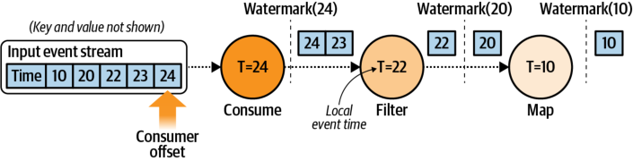

_Figure 6-3. Watermark propagation between nodes in a single topology_ 

In this figure, the consumer node has the highest watermark time because it’s consuming from the source event stream. New watermarks are generated periodically, such as after a period of wall-clock or event time has elapsed or after some minimum number of events has been processed. These watermarks propagate downstream to the other processing nodes in the topology, which update their own event time accordingly. 

This chapter only touches on watermarks to give you an understanding of how they’re used for deterministic processing. If you would like to dig deeper into watermarks, consider Chapters 2 and 3 of the excellent book _Streaming Systems_ , by Tyler Akidau, Slava Chernyak, and Reuven Lax (O’Reilly, 2018). 

### Watermarks in Parallel Processing

Watermarks are particularly useful for coordinating event time between multiple independent consumer instances. Figure 6-4 shows a simple processing topology of two consumer instances. Each consumer instance consumes events from its own assigned partition, applies a `groupByKey` function, followed by an `aggregate` function. This requires a _shuffle_ , where all events with the same key are sent to a single downstream aggregate instance. In this case, events from instance 0 and instance 1 are sent to each other based on the key to ensure all events of the same key are in the same partition. 

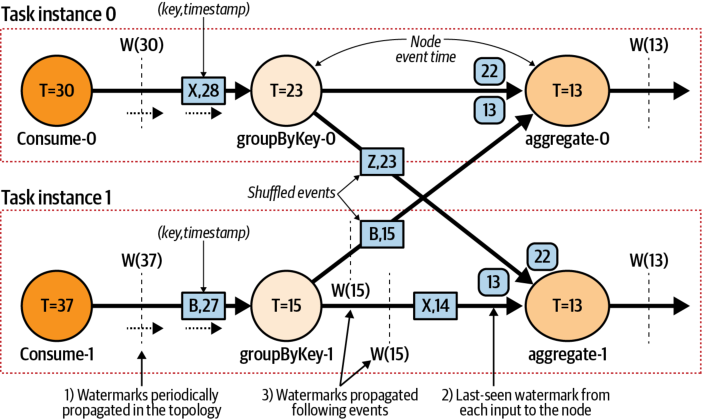

_Figure 6-4. Watermark propagation between nodes in a single topology with multiple processors_ 

There is a fair bit to unpack in this diagram, so let’s take a look at it from the start. 

Watermarks are generated at the source function, where the events are consumed from the event stream partition. The watermarks define the event time at that consumer and are propagated downstream as the event time of the consumer node is incremented (#1 in Figure 6-4). 

Downstream nodes update their event time as the watermarks arrive, and in turn generate their own new watermark to propagate downstream to its successors. Nodes with multiple inputs, such as `aggregate` , consume events and watermarks from multiple upstream inputs. The node’s event time is the _minimum_ of all of its input sources’ event times, which the node keeps track of internally (#2 in Figure 6-4). 

In the example, both `aggregate` nodes will have their event time updated from 13 to 15 once the watermark from the groupByKey-1 node arrives (#3 in Figure 6-4). Note that the watermark does not affect the event scheduling of the node; it simply notifies the node that it should consider any events with a timestamp earlier than the watermark to be considered late. Handling late events is covered later in this chapter. 

Spark, Flink, and Beam, among other heavyweight processing frameworks, require a dedicated cluster of processing resources to perform stream processing at scale. This is particularly relevant because this cluster also provides the means for cross-task communications and centralized coordination of each processing task. Repartitioning events, such as with the `groupByKey` + `aggregate` operation in this example, use cluster-internal communications and _not_ event streams in the event broker. 

## Stream Time

A second option for maintaining time in a stream processor, known simply as _stream time_ , is the approach favored by Apache Kafka Streams. A consumer application reading from one or more event streams maintains a stream time for its topology, which is the highest timestamp of processed events. The consumer instance consumes and buffers events from each event stream partition assigned to it, applies the event-scheduling algorithm to select the next event to process, and then updates the stream time if it is larger than the previous stream time. Stream time will never be decreased. 

Figure 6-5 shows an example of stream time. The consumer node maintains a single stream time based on the highest event-time value it has received. The stream time is currently set to 20 since that was the event time of the most recently processed event. The next event to be processed is the smallest value of the two input buffers—in this case, it’s the event with event time 30. The event is dispatched down to the processing topology, and the stream time will be updated to 30. 

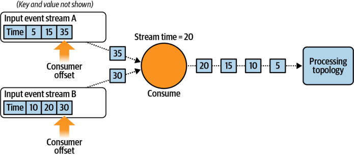

_Figure 6-5. Stream time when consuming from multiple input streams_ 

Stream time is maintained by processing each event completely through the topology before processing the next one. In cases where a topology contains a repartition stream, each topology is split into two, and each subtopology maintains its own distinct stream time. Events are processed in a depth-first manner, such that only one event is being processed in a subtopology at any given time. This is different than the watermark-based approach where events can be buffered at the inputs of each processing node, with each node’s event time independently updated. 

### Stream Time in Parallel Processing

Consider again the same two-instance consumer example from Figure 6-4, but this time with the stream time approach championed by Kafka Streams (see Figure 6-6). A notable difference is that the Kafka Streams approach sends the repartitioned events _back_ to the event broker using what’s known as an _internal event stream_ . This stream is then reconsumed by the instances, with all repartitioned data colocated by key within single partitions. This is functionally the same as the shuffle mechanism within the heavyweight cluster, but does not require a dedicated cluster (note: Kafka Streams is very microservice friendly). 

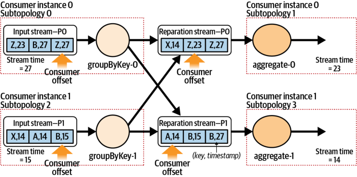

_Figure 6-6. Shuffling events via a repartition event stream_ 

In this example, events from the input stream are repartitioned according to their key and are written into the repartition event stream. The events keyed on `A` and `B` end up in `P1` , while the events keyed on `X` and `Z` end up in `P0` . Also note that the event time has been maintained for each event, and not overwritten by the current wall-clock time. Recall that the repartition should be treated only as a logical shuffling of existing event data. Rewriting the event time of an event would completely destroy the original temporal ordering. 

Notice the subtopologies shown in the figure. Because of the repartition event stream, the processing topology is effectively cut in half, meaning that work on each subtopology can be done in parallel. Subtopologies `1` and `3` consume from the repartition stream and group events together, while subtopologies `0` and `2` produce the repartitioned events. Each subtopology maintains its own stream time, since both are consuming from independent event streams. 

Watermarking strategies can also use repartition event streams. Apache Samza offers a standalone mode that is similar to Kafka Streams, but uses watermarking instead of stream time. 

## Out-of-Order and Late-Arriving Events

In an ideal world, all events are produced without issue and available to the consumer with zero latency. Unfortunately for all of us living in the real world, this is never the case, so we must plan to accommodate out-of-order events. An event is said to be out of order if its timestamp isn’t equal to or greater than the events ahead of it in the 

**Out-of-Order and Late-Arriving Events | 99** 

event stream. In Figure 6-7, event `F` is out of order because its timestamp is lower than `G` ’s, just as event `H` is out of order as its timestamp is lower than `I` ’s. 

Bounded data sets, such as historical data processed in batch, are typically fairly resilient to out-of-order data. The entire batch can be thought of as one large window, and an event arriving out of order by many minutes or even hours is not really relevant provided that the processing for that batch has not yet started. In this way, a bounded data set processed in batch can produce results with high determinism. This comes at the expense of high latency, especially for the traditional sorts of nightly batch bigdata processing jobs where the results are available only after the 24-hour period, plus batch processing time. 

For unbounded data sets, such as those in ever-updating event streams, the developer must consider the requirements of latency and determinism when designing the microservice. This extends beyond the technological requirements into the business requirements, so any event-driven microservice developer must ask, “Does my microservice handle out-of-order and late-arriving events according to business requirements?” Out-of-order events require the business to make specific decisions about how to handle them, and to determine whether latency or determinism takes priority. 

Consider the previous example of the bank account. A deposit followed by an immediate withdrawal must be processed in the correct order lest an overdraft charge be incorrectly applied, regardless of the ordering of events or how late they may be. To mitigate this, the application logic may need to maintain state to handle out-of-order data for a time period specified by the business, such as a one-hour grace window.  

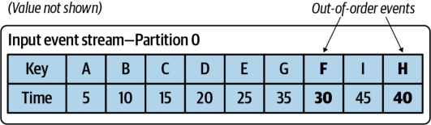

_Figure 6-7. Out-of-order events in an event stream partition_ 

Events from a single partition should always be processed according to their offset order, regardless of their timestamp. This can lead to out-of-order events. 

An event can be considered _late_ only when viewed from the perspective of the consuming microservice. One microservice may consider _any_ out-of-order events as late, whereas another may be fairly tolerant and require many hours of wall-clock or event time to pass before considering an event to be late. 

### Late Events with Watermarks and Stream Time

Consider two events, one with time _t_ , the other with time _t_ ′ . Event _t_ ′ has an _earlier_ timestamp than event _t_ . 

**Watermarks** 

The event _t_ ′ is considered late when it arrives _after_ the watermark _W(t)_ . It is up to the specific node how to handle this event. 

**Stream time** 

The event _t_ ′ is considered late when it arrives the stream time has been _after_ incremented past _t_ ′ . It is up to each operator in the subtopology how to handle this event. 

An event is late only when it has missed a deadline specific to the consumer. 

### Causes and Impacts of Out-of-Order Events

There are several ways that out-of-order events can occur. 

**Sourcing from out-of-order data** 

The most obvious, of course, is when events are sourced from out-of-order data. This can occur when data is consumed from a stream that is already out of order or when events are being sourced from an external system with existing out-of-order timestamps. 

**Multiple producers to multiple partitions** 

Multiple producers writing to multiple output partitions can introduce out-of-order events. Repartitioning an existing event stream is one way in which this can happen. Figure 6-8 shows the repartitioning of two partitions by two consumer instances. In this scenario the source events indicate which product the user has interacted with. For instance, Harry has interacted with products ID12 and ID77. Say that a data analyst needs to rekey these events on the user ID, such that they can perform sessionbased analysis of the user’s engagements. The resultant output streams may end up with some out-of-order events. 

**Out-of-Order and Late-Arriving Events | 101** 

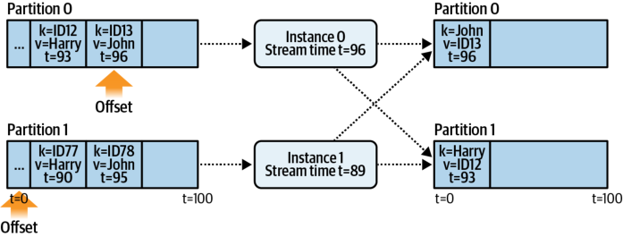

_Figure 6-8. Shuffling events via a repartition event stream_ 

Note that each instance maintains its own internal stream time and that there is no synchronization between the two instances. This can cause a time skew that produces out-of-order events, as shown in Figure 6-9. 

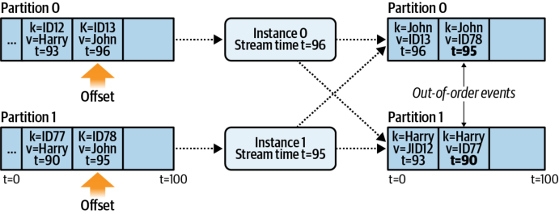

_Figure 6-9. Shuffling events via a repartition event stream_ 

Instance 0 was only slightly ahead of instance 1 in stream time, but because of their independent stream times, the events of time _t_ = 90 and _t_ = 95 are considered out of order in the repartitioned event stream. This issue is exacerbated by unbalanced partition sizes, unequal processing rates, and large backlogs of events. The impact here is that the previously _in-order_ event data is now _out of order_ , and thus as a consumer you cannot depend on having consistently incrementing time in each of your event streams. 

A single-threaded producer will not create out-of-order events in normal operation unless it is sourcing its data from an out-of-order source. 

Since the stream time is incremented whenever an event with a higher timestamp is detected, it is possible to end up in a scenario where a large number of events are considered late due to reordering. This may have an effect on processing depending on how the consumers choose to handle out-of-order events. 

### Time-Sensitive Functions and Windowing

Late events are predominantly the concern of time-based business logic, such as aggregating events in a particular time period or triggering an event after a certain period of time has passed. A late event is one that arrives after the business logic has already finished processing for that particular period of time. Windowing functions are an excellent example of time-based business logic. 

_Windowing_ means grouping events together by time. This is particularly useful for events with the same key, where you want to see _what happened_ with events of that key in that period of time. There are three main types of event windows, but again, be sure to check your stream-processing framework for more information. 

Windowing can be done using either event time or processing time, though event-time windowing typically has more business applications. 

**Tumbling windows** 

A tumbling window is a window of a fixed size. Previous and subsequent windows do not overlap. Figure 6-10 shows three tumbling windows, each aligned on _t_ , _t_ + 1, and so on. This sort of windowing can help answer questions such as “When is the peak hour for product usage?” 

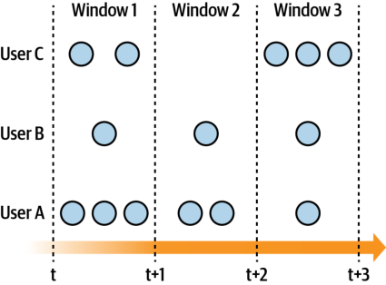

_Figure 6-10. Tumbling windows_ 

**Out-of-Order and Late-Arriving Events | 103** 

**Sliding windows** 

A sliding window has a fixed window size and incremental step known as the _window slide_ . It must reflect only the aggregation of events currently in the window. A sliding window can help answer questions such as “How many users clicked on my product in the past hour?” Figure 6-11 shows an example of the sliding window, including the size of the window and the amount that it slides forward. 

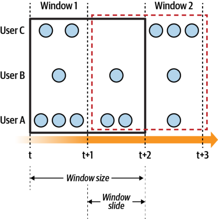

_Figure 6-11. Sliding windows_ 

**Session windows** 

A session window is a dynamically sized window. It is terminated based on a timeout due to inactivity, with a new session started for any activity happening after the timeout. Figure 6-12 shows an example of session windows, with a session gap due to inactivity for user C. This sort of window can help answer questions such as “What does a user look at in a given browsing session?” 

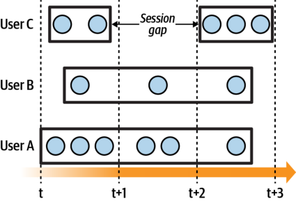

_Figure 6-12. Session windows_ 

Each of these window functions must deal with out-of-order events. You must decide how long to wait for any out-of-order events before deeming them too late for consideration. One of the fundamental issues in stream processing is that you can never be sure that you have received all of the events. Waiting for out-of-order events can work, but eventually your service will need to give up, as it cannot wait indefinitely. Other factors to consider include how much state to store, the likelihood of late events, and the business impact of not using the late events. 

## Handling Late Events

The strategy for handling out-of-order and late-arriving events should be determined at a _business level_ prior to developing an engineering solution, as strategies will vary depending on the importance of the data. Critical events such as financial transactions and system failures may be required to be handled regardless of their position in the stream. Alternately, measurement-style events, such as temperature or force metrics, may simply be discarded as no longer relevant. 

Business requirements also dictate how much latency is acceptable, as waiting for events to arrive may increase determinism but at the expense of higher latency. This can negatively affect the performance characteristics of time-sensitive applications or those with tight service-level agreements. Thankfully, microservices provide the flexibility necessary to tailor determinism, latency, and out-of-order event handling characterstics on a per-service basis. 

There are several ways in which a late-arriving event can be handled, regardless of whether your framework uses watermarks or stream time. 

**Drop event** 

Simply drop the event. The window is closed, and any time-based aggregations are already complete. 

**Wait** 

Delay output of the window results until a fixed amount of time has passed. This incurs higher determinism at the expense of increased latency. The old window(s) need to remain available for updating until the predetermined amount of time has passed. 

**Grace period** 

Output the windowed result as soon as the window is deemed complete. Then, keep the window(s) around and available for the predetermined grace period. Whenever a late event arrives for that window, update the aggregation and output the newly updated aggregation. This is similar to the wait strategy, except updates are generated as late events arrive. 

Regardless of how long a microservice waits, eventually events will simply be too late and will need to be discarded. There is no cut-and-dry technical rule for how your microservice should handle late events; just ensure that your business requirements are sufficiently met. If the protocol for handling late events is not specified in the microservice’s business requirements, then the business must work to resolve that. 

Here are a few questions to help you determine good guidelines for handling late events: 

- How likely are late events to occur? 

- How long does your service need to guard against late events? 

- What are the business impacts of dropping late events? 

- What are the business benefits of waiting a long time to capture late events? 

- How much disk or memory does it take to maintain state? 

- Do the expenses incurred in waiting for late events outweigh the benefits? 

## Reprocessing Versus Processing in Near-Real Time

Immutable event streams provide the ability to rewind consumer group offsets and replay processing from an arbitrary point in time. This is known as _reprocessing_ , and it’s something that every event-driven microservice needs to consider in its design. Reprocessing is typically performed only on event-driven microservices that use event time for processing events, and not those that rely on wall-clock time aggregations and windowing. 

Event scheduling is an important part of being able to correctly reprocess historical data from event streams. It ensures that microservices process events in the same order that they did during near–real time. Handling out-of-order events is also an important part of this process, as repartitioning an event stream through the event 

broker (instead of using a heavyweight framework like Spark, Flink, or Beam) can cause out-of-order events. 

Here are the steps to follow when you want to reprocess your event streams: 

1. _Determine the starting point_ . As a best practice, all stateful consumers should reprocess events from the very beginning of _each_ event stream that they are subscribed to. This applies to entity event streams in particular, as they contain important facts about the entities under question. 

2. _Determine which consumer offsets to reset_ . Any streams that contain events used in stateful processing should be reset to the very beginning, as it is difficult to ensure that you will end up with a correct state if you start in the wrong location (consider what would happen if you reprocessed someone’s bank balance and accidentally omitted previous paychecks). 

3. _Consider the volume of data_ . Some microservices may process huge quantities of events. Consider how long it may take to reprocess the events, and any bottlenecks that may exist. Quotas (see “Quotas” on page 241) may be needed to ensure that your microservice doesn’t overwhelm the event broker with I/O. Additionally, you may need to notify any downstream consumers if you are expecting to generate large amounts of reprocessed output data. They may need to scale their services accordingly if autoscaling (see “Autoscaling Applications” on page 192) is not enabled. 

4. _Consider the time to reprocess_ . It is possible that reprocessing may take many hours to do, so it’s worth calculating how much downtime you may need. Ensure that your downstream consumers are also okay with possibly stale data while your service reprocesses. Scaling the number of consumer instances to maximum parallelism can significantly reduce this downtime and can be scaled down once reprocessing has completed. 

5. _Consider the impact_ . Some microservices perform actions that you may not want to occur when reprocessing. For instance, a service that emails users when their packages have shipped should _not_ re-email users when reprocessing events, as it would be a terrible user experience and completely nonsensical from a business perspective. Carefully consider the impact of reprocessing on the business logic of your system, as well as potential issues that may arise for downstream consumers. 

## Intermittent Failures and Late Events

An event may be late during near-real-time processing (watermark or stream time is incremented) but may be available as expected within the event stream during eventstream reprocessing. This issue can be hard to detect, but it really illustrates the con‐ 

nected nature of event-driven microservices and how upstream problems can affect downstream consumers. Let’s take a quick look at how this can occur. 

## Producer/Event Broker Connectivity Issues

In this scenario, records are _created_ in timestamp order but can’t be _published_ until a later time (see Figure 6-13). During normal operation, producers send their events as they occur, and consumers consume them in near-real-time. This scenario is tricky to identify when it’s happening and can go unnoticed even in retrospect. 

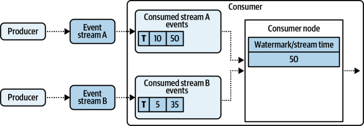

_Figure 6-13. Normal operation prior to producer/broker connection outage_ 

Say a producer has a number of records ready to send, but it is unable to connect to the event broker. The records are timestamped with the _local_ time that the event occurred. The producer will retry a number of times and either eventually succeed or give up and fail (ideally a noisy failure so that the faulty connection can be identified and rectified). This scenario is shown in Figure 6-14. Events from stream A are still consumed, with the watermark/stream time incremented accordingly. However, upon consuming from stream B, the consumer ends up with no new events, so it can simply assume that no new data is available. 

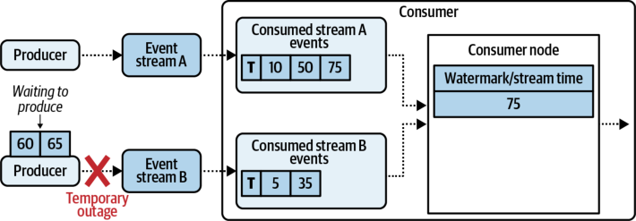

_Figure 6-14. Temporary producer/broker connection outage_ 

Eventually the producer will be able to write records to the event stream. These events are published in the correct event-time order that they actually occurred, but because of the wall-clock delay, near-real-time consumers will have marked them as late and treat them as such. This is shown in Figure 6-15. 

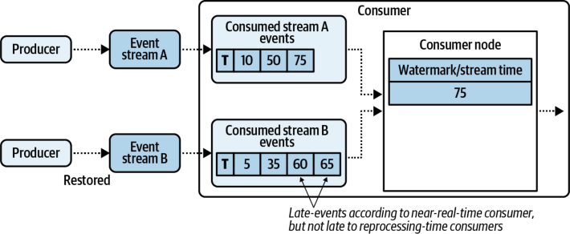

_Figure 6-15. The producer is able to reconnect and publish its temporarily delayed events, while the consumer has already incremented its event time_ 

One way to mitigate this is to wait a predetermined amount of time before processing events, though this approach does incur a latency cost and will only be useful when production delays are shorter than the wait time. Another option is to use robust lateevent-handling logic in your code such that your business logic is not impacted by this scenario. 

## Summary and Further Reading

This chapter looked at determinism and how best to approach it with unbounded streams. It also examined how to select the next events to process between multiple partitions to ensure best-effort determinism when processing in both near-real-time and when reprocessing. The very nature of an unbounded stream of events combined with intermittent failures means that full determinism can never be completely achieved. Reasonable, best-effort solutions that work most of the time provide the best tradeoff between latency and correctness. 

Out-of-order and late-arriving events are factors that you must consider in your designs. This chapter explored how watermarks and stream time can be used to identify and handle these events. If you would like to read more about watermarks, check out Tyler Akidau’s excellent articles, “The World Beyond Batch Streaming 101” and 102. Additional considerations and insights into distributed system time can be found in Mikito Takada’s online book . _Distributed Systems for Fun and Profit_ 
