# **CHAPTER 7 Stateful Streaming** 

Stateful streaming underpins the most important components of an event-driven microservice, as most applications will need to maintain some degree of state for their processing requirements. “Materializing State from Entity Events” on page 25 briefly covered the principles of materializing an event stream into local state. This chapter takes a much deeper look at how to build, manage, and use state for event-driven microservices. 

# **State Stores and Materializing State from an Event Stream** 

Let’s start with some definitions: 

# _Materialized state_ 

A projection of events from the source event stream (immutable) 

# _State store_ 

Where your service’s business state is stored (mutable) 

Both materialized state and state stores are required and used extensively in stateful microservices, but it’s important to distinguish between them. Materialized states enable you to use common business entities in your microservice applications, whereas state stores enable you to store business state and intermediate computations. 

Each microservice design must also take into account where the service will store its data. There are two main options for storing and accessing state: 

- Internally, such that the data is stored in the same container as the processor, allocated in memory or on disk. 

- Externally, such that the data is stored outside of the processor’s container, in some form of external storage service. This is often done across a network. 

Figure 7-1 shows examples of both internal and external state storage. 

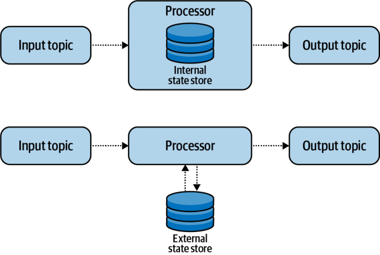

_Figure 7-1. Internal and external state stores_ 

The choice of internal or external storage depends primarily on the microservice’s business responsibilities and technical requirements. But before evaluating these two options in greater depth, you’ll need to consider the role of the changelog. 

# **Recording State to a Changelog Event Stream** 

A _changelog_ is a record of all changes made to the data of the state store. It is the stream in the table-stream duality, with the table of state transformed into a stream of individual events. As a permanent copy of the state maintained _outside_ of the microservice instance, the changelog can be used to rebuild state, as shown in Figure 7-2, and serve as a way of checkpointing event processing progress. 

Changelogs optimize the task of rebuilding failed services because they store the results of previous processing, allowing a recovering processor to avoid reprocessing all input events. 

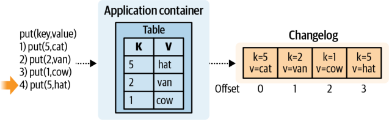

_Figure 7-2. A state store with changelogging enabled_ 

Changelog streams are stored in the event broker just like any other stream and, as noted, provide a means of rebuilding the state store. Changelog streams should be compacted since they only need the most recent key/value pair to rebuild the state. 

Changelogs can scale and recover state in a highly performant manner, especially for internal state stores. In both cases, the newly created application instance just needs to load the data from the associated changelog partitions, as shown in Figure 7-3. 

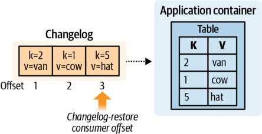

_Figure 7-3. State store being restored from a changelog_ 

Changelogs are either provided as a built-in feature, such as in the Kafka Streams client, or implemented by the application developer. Basic producer/consumer clients tend not to provide any changelogging or stateful support. 

# **Materializing State to an Internal State Store** 

Internal state stores coexist in the same container or VM environment as the microservice’s business logic. Specifically, the existence of the internal state store is tied to the existence of the microservice instance, with both running on the same underlying hardware. 

Each microservice instance materializes the events from its assigned partitions, keeping each partition’s data logically separate within the store. These logically separate 

materialized partitions permit a microservice instance to simply drop the state for a revoked partition after a consumer group rebalance. This avoids resource leaks and multiple sources of truth by ensuring that materialized state exists only on the instance that owns the partition. New partition assignments can be rebuilt by consuming the input events from the event stream or from the changelog. 

High-performance key/value stores, such as RocksDB, are typically used to implement internal state stores and are optimized to be highly efficient with local solidstate drives (SSDs), enabling performant operations on data sets that exceed main memory allocation. While key/value stores tend to be the most common implementation for internal state stores, any form of data store can be used. A relational or document data store implementation would not be unheard of, but again, it would need to be instantiated and contained within each individual microservice instance. 

# **Materializing Global State** 

A _global state store_ is a special form of the internal state store. Instead of materializing only the partitions assigned to it, a global state store materializes the data of _all_ partitions for a given event stream, providing a complete copy of the event data to each microservice instance. Figure 7-4 illustrates the difference between global and nonglobal materialized state. 

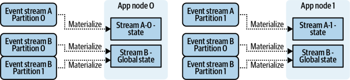

_Figure 7-4. Global materialized state and nonglobal materialized state_ 

Global state stores are useful when a full data set is required by each instance, and tend to comprise small, commonly used, and seldom-changing data sets. Global materialization cannot be effectively used as the driver for event-driven logic, as each microservice instance possesses a full copy of the data and thus would produce duplicate outputs and nondeterministic results. For this reason, it is best to reserve global materialization for common data set lookup and dimension tables. 

# **Advantages of Using Internal State** 

# **Scalability requirements are offloaded from the developer** 

A major benefit of using internal state stores on local disk is that all scalability requirements are fully offloaded to the event broker and compute resource clusters. 

This allows the application development team to focus strictly on writing application logic while relying on the microservices capability teams to provide the scaling mechanisms common to all event-driven microservices. This approach ensures a single unit of scalability, where each application can be scaled simply by increasing and decreasing the instance count. 

It’s important to understand your application’s performance requirements when you’re considering internal state storage. With modern cloud computing, local disk does not necessarily mean disk that is physically attached, as network-attached storage can mimic local disk and provide the same logical support for your applications. A high-throughput stateful streaming microservice can easily consume hundreds of thousands of events per second. You must carefully consider the performance characteristics required by the application to ensure it can meet its latency requirements. 

# **High-performance disk-based options** 

Maintaining all state within main memory is not always possible in an event-driven microservice, especially if costs are to be kept low. Physically attached local disk can be quite performant for the majority of modern microservice use cases. Local disk implementations tend to favor high random-access patterns, generally supported by SSDs. For instance, the latency for a random-access read from an SSD using RocksDB is approximately 65 microseconds, which means a single thread will have a sequential access ceiling of approximately 15.4k requests/second. In-memory performance is significantly faster, serving millions of random-access requests per second as the norm. The local-disk and local-memory approach allows for extremely high throughput and significantly reduces the data-access bottleneck. 

# **Flexibility to use network-attached disk** 

Microservices may also use network-attached disk instead of local disk, which significantly increases the read/write latency. Since events typically must be processed one at a time to maintain temporal and offset order, the single processing thread will spend a lot of time awaiting read/write responses, resulting in significantly lower throughput per processor. This is generally fine for any stateful service that doesn’t need highperformance processing, but can be problematic if event volumes are high. 

Accessing “local” data stored on network-attached disk has a much higher latency than accessing physically local data stored in the system’s memory or attached disk. While RocksDB paired with a local SSD has an estimated throughput of 15.4k request/second, introducing a network latency of only 1 mS round-trip time to an identical access pattern reduces the throughput cap to just 939 requests/second. While you might be able to do some work to parallelize access and reduce this gap, remember that events must be processed in the offset sequence in which they are consumed and that parallelization is not possible in many cases. 

One major benefit of network-attached disk is that the state can be maintained in the volume and migrated to new processing hardware as needed. When the processing node is brought back up, the network disk can be reattached and processing can resume where it left off, instead of being rebuilt from the changelog stream. This greatly reduces downtime since the state is no longer completely ephemeral as with a local disk, and also increases the flexibility of microservices to migrate across compute resources, such as when you are using inexpensive on-demand nodes. 

# **Disadvantages of Using Internal State** 

# **Limited to using runtime-defined disk** 

Internal state stores are limited to using only disk that is defined and attached to the node at the service’s runtime. Changing either the size or quantity of attached volumes typically requires that the service be halted, the volumes adjusted, and the service restarted. In addition, many compute resource management solutions allow only for volume size to be _increased_ , as decreasing a volume’s size means that data would need to be deleted. 

# **Wasted disk space** 

Data patterns that are cyclical in nature, such as the traffic generated to a shopping website at 3 p.m. versus 3 a.m., can require cyclical storage volume. That is, these patterns may require a large maximum disk for peak traffic but only a small amount otherwise. Reserving full disk for the entire time can waste both space and money when compared to using external services that charge you only per byte of data stored. 

# **Scaling and Recovery of Internal State** 

Scaling processing up to multiple instances and recovering a failed instance are identical processes from a state recovery perspective. The new or recovered instance needs to materialize any state defined by its topology before it can begin processing new events. The quickest way to do so is to reload the changelog topic for each stateful store materialized in the application. 

# **Using hot replicas** 

While it is most common to have only a single replica of materialized state for each partition, additional replicas can be created through some careful state management or leveraged directly by the client framework. Apache Kafka has this functionality built into its Streams framework via a simple configuration setting. This setting provides highly available state stores and enables the microservice to tolerate instance failures with zero downtime. 

Figure 7-5 shows a three-instance deployment with an internal state store replication factor of 2. Each stateful partition is materialized twice, once as the leader and once as a replica. Each replica must manage its own offsets to ensure that it is keeping up with the offsets of the leader replica. Instance 0 and instance 1 are processing stream B events and joining them on the copartitioned materialized state. Instance 1 and instance 2 are also maintaining hot replicas of stream A-P0 and A-P1, respectively, with instance 2 otherwise not processing any other events. 

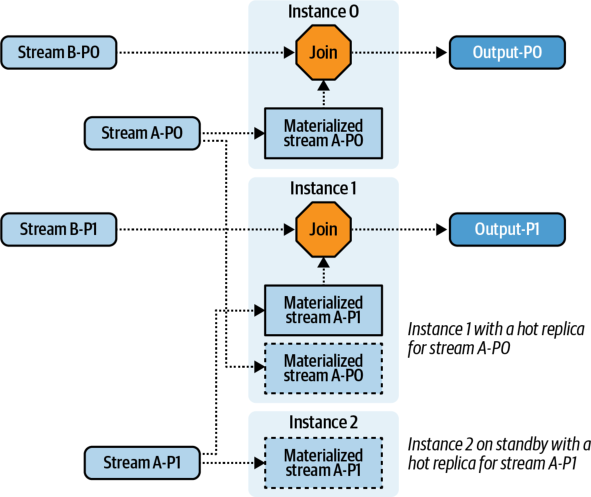

_Figure 7-5. Stream-table join with three instances and two hot replicas per materialized input partition_ 

When the leader is terminated, the consumer group must rebalance the assignment of partitions. The partition assignor determines the location of the hot replica (it previously assigned all partitions and knows all partition-to-instance mappings) and reassigns the partitions accordingly. In Figure 7-6, instance 1 has terminated, and the remaining microservice instances are forced to rebalance their partition assignments. Instances with hot replicas are given priority to claim partition ownership and resume processing immediately. The partition assignor has selected instance 2 to resume processing of stream B-P1. 

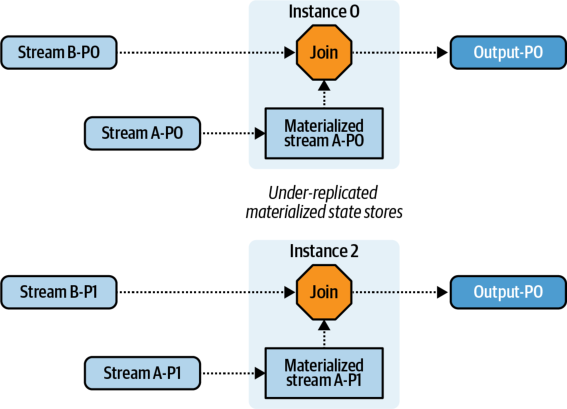

_Figure 7-6. Rebalance due to instance 1 termination_ 

Once processing has resumed, new hot replicas must be built from the changelog to maintain the minimum replica count. The new hot replicas are built and added to the remaining instances, as shown in Figure 7-7. 

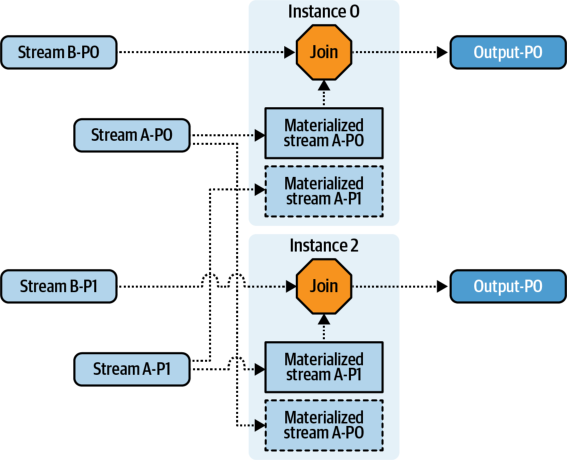

_Figure 7-7. Normal processing with two instances and two hot replicas per materialized input partition_ 

One of the main tradeoffs with a hot-replica approach is the use of additional disk to maintain the replicas in exchange for the reduction in downtime due to an instance failure. 

# **Restoring and scaling from changelogs** 

When a newly created microservice instance joins the consumer group, any stateful partitions that it is assigned can be reloaded simply by consuming from its changelog. During this time the instance should not be processing new events, as doing so could produce nondeterministic and erroneous results. 

# **Restoring and scaling from input event streams** 

If no changelog is maintained, the microservice instance can rebuild its state stores from the input streams. It must re-consume all of its input events from the very beginning of its assigned event stream partitions. Each event must be consumed and processed in strict incrementing order, its state updated, and any subsequent output events produced. 

Consider the impact of events produced during a full reprocessing. Downstream consumers may need to process these idempotently or eliminate them as duplicates. 

This process can take much longer to rebuild state than restoring from a changelog. So, it’s best to employ this strategy only for simple topologies where duplicate output is not a concern, input event stream retention is short, and the entity event streams are sparse. 

# **Materializing State to an External State Store** 

External state stores exist outside of a microservice’s container or virtual machine, but are typically located within the same local network. You can implement an external data store using your preferred technology, but you should select it based on the needs of the microservice’s problem space. Some common examples of external store services include relational databases; document databases; a Lucene-based geospatial search system; and distributed, highly available key/value stores. 

Keep in mind that while a specific microservice’s external state store may use a common data storage platform, the data set itself must remain logically isolated from all other microservice implementations. Sharing materialized state between microservices is a common anti-pattern for implementers of external data stores who seek to use a common materialized data set to serve multiple business needs. This can lead to tight coupling between otherwise completely unrelated products or features and should be avoided. 

Do not share direct state access with other microservices. Instead, all microservices must materialize their own copy of state. This eliminates direct couplings and isolates microservices against unintentional changes, but at the expense of extra processing and data storage resources. 

# **Advantages of External State** 

# **Full data locality** 

Unlike internal state stores, external state stores can provide access to all materialized data for each microservice instance, though each instance is still responsible for materializing its own assigned partitions. A single materialized data set eliminates the need for partition locality when you are performing lookups, relational queries on foreign keys, and geospatial queries between a large number of elements. 

Use state stores with strong read-after-write guarantees to eliminate inconsistent results when using multiple instances. 

# **Technology** 

External data stores can leverage technology that the organization is already familiar with, reducing the time and effort it takes to deliver a microservice to production. Basic consumer/producer patterns are especially good candidates for using external data stores, as covered in Chapter 10. Function-as-a-Service solutions are also excellent external data store candidates, as covered in Chapter 9. 

# **Drawbacks of External State** 

# **Management of multiple technologies** 

External state stores are managed and scaled independently of the microservice business logic solution. One of the risks of an external data store is that the microservice owner is now on the hook for ensuring that it is maintained and scaled appropriately. Each team must implement proper resource allocation, scaling policies, and system monitoring to ensure that their data service is suitable and resilient for the microservice’s load. Having managed data services provided by the organization’s capabilities team or by a third-party cloud platform vendor can help distribute some of this responsibility. 

Each team must fully manage the external state stores for its microservices. Do not delegate responsibility of external state store management to its own team, as this introduces a technical cross-team dependency. Compose a list of acceptable external data services with guides on how to properly manage and scale them. This will prevent each team from having to independently discover its own management solutions. 

# **Performance loss due to network latency** 

Accessing data stored in an external state store has a much higher latency than accessing data stored locally in memory or on disk. In “Advantages of Using Internal State” on page 114, you saw that using a network-attached disk introduces a slight network delay and can significantly reduce throughput and performance. 

While caching and parallelization may reduce the impact of the network latency, the tradeoff is often added complexity and an increased cost for additional memory and CPU. Not all microservice patterns support caching and parallelization efforts either, 

with many requiring the processing thread to simply block and wait for a reply from the external data store. 

# **Financial cost of external state store services** 

Financial costs tend to be higher with external data stores than with similarly sized internal data stores. Hosted external state store solutions often charge by the number of transactions, the size of the data payload, and the retention period for the data. They may also require over-provisioning to handle bursty and inconsistent loads. On-demand pricing models with flexible performance characteristics may help reduce costs, but you must be sure they still meet your performance needs. 

# **Full data locality** 

Though also listed as a benefit, full data locality can present some challenges. The data available in the external state store originates from multiple processors and multiple partitions, each of which is processing at its own rate. It can be difficult to reason about (and debug) the contributions of any particular processing instance to the collective shared state. 

Race conditions and nondeterministic behavior must also be carefully avoided, as each microservice instance operates on its own independent stream time. The stream time guarantees of a single microservice instance do not extend to all of them. 

For example, one instance may attempt to join an event on a foreign key that has not yet been populated by a separate instance. Reprocessing the same data at a later time may execute the join. Because the stream processing of each instance is completely separate from the others, any results obtained through this approach are likely to be nondeterministic and nonreproducible. 

# **Scaling and Recovery with External State Stores** 

Scaling and recovery of microservices using an external state store simply require that you add a new instance with the necessary credentials to access the state store. In contrast, scaling and recovery of the underlying state store are dependent completely upon the selected technology and are much more complicated. 

To reiterate an earlier point, having a list of acceptable external data services with guides on how to properly manage, scale, back up, and restore them is essential for providing developers a sustainable way forward. Unfortunately, the number of state store technologies is prohibitively large and effectively impossible to discuss in this book. Instead, I’ll simply generalize the strategies of building state into three main techniques: rebuilding from the source streams, using changelogs, and creating snapshots. 

# **Using the source streams** 

Created by consuming events from the beginning of time from the source streams creates a fresh copy of the state store. The consumer group input offsets are rewound to the beginning of time for all input streams. This method incurs the longest downtime of all options, but is easily reproducible and relies only on the persistent storage of the event broker to maintain the source data. Keep in mind that this option is really a full application reset and will also result in the reproduction of any output events according to the business logic of the microservice. 

# **Using changelogs** 

External state stores typically do not rely on using broker-stored changelogs to record and restore state, though there is no rule preventing this. Much like an internal state store, external state stores can be repopulated from a changelog. Just like when rebuilding from source streams, you must create a fresh copy of the state store. If rebuilding from changelogs, the microservice consumer instances must ensure they rebuild the entire state as stored in the changelog before resuming processing. 

Rebuilding external state stores from source event streams or changelogs can be prohibitively time-consuming due to network latency overhead. Make sure you can still meet the microservice SLAs in such a scenario. 

# **Using snapshots** 

It is far more typical for external state stores to provide their own backup and restoration process, and many hosted state store services provide simple “one-click” solutions to do so. Best practices for capturing and restoring state should be followed depending on the given state store implementation. 

If the stored state is idempotent, there is no need to ensure that the offsets are precisely in line with the materialized state. In this case, setting the consumer offsets to values from a few minutes before the snapshot was taken should ensure that no data is missed. This also ensures that events are processed with an “at-least-once” guarantee. 

If the stored state is not idempotent and any duplicate events are not acceptable, then you should store your consumer’s partition offsets alongside the data within the data store. This ensures that the consumer offsets and the associated state are consistent. When state is restored from the snapshot, the consumer can set its consumer group offsets to those found in the snapshot from the exact time that the snapshot was created. This is covered in more detail in “Maintaining consistent state” on page 132. 

# **Rebuilding Versus Migrating State Stores** 

Changes to existing state store data structures frequently need to accompany new business requirements. A microservice may need to add new information to existing events, perform some extra join steps with another materialized table, or otherwise store newly derived business data. In such an event, the existing state store will need to be updated to reflect the data, either through rebuilding or migration. 

# **Rebuilding** 

Rebuilding the microservice’s state stores is typically the most common method of updating the internal state of an application. The microservice is first stopped, with the consumer input stream offsets reset to the beginning. Any intermediate state, such as that stored in a changelog or located in the external state store, must be deleted. Lastly, the new version of the microservice is started up, and the state is rebuilt as events are read back in from the input event streams. This approach ensures that the state is built exactly as specified by the new business logic. All new output events are also created and propagated downstream to the subscribing consumers. These are not considered duplicate events, as the business logic and output format may have changed, and these changes must be propagated downstream. 

Rebuilding state requires that all necessary input event stream events still exist, particularly anything that requires materialization of state and aggregations. If your application is critically reliant upon a set of input data, you must ensure that such source data is readily available outside of your microservice implementation’s data store. 

Rebuilding takes time, and it’s important to account for that in the microservice’s SLA. One of the main benefits of practicing rebuilding is that it helps you test your disaster recovery preparedness by running through the recovery process required when a microservice fails and all state is lost. 

Finally, some business requirements absolutely require you to reprocess data from the beginning of time, such as those that extract fields that are present only in the input events. You cannot obtain this data in any other way than replaying the input events, at which point rebuilding the state store is the only viable option. 

# **Migrating** 

Large state stores can take a long time to rebuild or can result in prohibitively expensive data transfer costs when compared to the impact of the change. For instance, consider a business requirement change where an additional, yet optional, field is to be added to a microservice’s output event stream. This change may require you to add 

another column or field to the microservice’s state store. However, it could be that the business has no need to reprocess older data and wants only to apply the logic to new input events going forward. For a state store backed by a relational database, you’d just need to update the business logic alongside the associated table definition. You can perform a simple insertion of a new column with a nullable default, and after a quick series of tests you can redeploy the application. 

Migrations become much riskier when the business need and the data being changed are more complex. Complex migrations are error-prone and can yield results that are incorrect compared to the results of a complete rebuild of the data store. The database migration logic is not a part of the business logic, so inconsistencies can be introduced that would otherwise not arise during a full rebuild of the application. These types of migration errors can be hard to detect if not caught during testing and can lead to inconsistent data. When following a migration-based approach, be sure to perform strict testing and use representative test data sets to compare that approach with a rebuild-based one. 

# **Transactions and Effectively Once Processing** 

_Effectively once processing_ ensures that any updates made to the single source of truth are consistently applied, regardless of any failure to the producer, the consumer, or the event broker. Effectively once processing is also sometimes described as _exactly once processing_ , though this is not quite accurate. A microservice may process the same data multiple times, say due to a consumer failure and subsequent recovery, but fail to commit its offsets and increment its stream time. The processing logic will be executed each time the event is processed, _including any side effects that the code may create_ , such as publishing data to external endpoints or communicating with a thirdparty service. That being said, for most event brokers and most use cases, the terms _exactly once_ and _effectively once_ are used interchangeably. 

_Idempotent writes_ are one commonly supported feature among event broker implementations such as Apache Kafka and Apache Pulsar. They allow for an event to be written once, and only once, to an event stream. In the case that the producer or event broker fails during the write, the idempotent write feature ensures that a duplicate of that event is not created upon retry. 

_Transactions_ may also be supported by your event broker. Currently, full transactional support is offered only by Apache Kafka, though Apache Pulsar is making progress towards its own implementation. Much like a relational database can support multitable updates in a single transaction, an event broker implementation may also support the atomic writing of multiple events to multiple separate event streams. This allows a producer to publish its events to multiple event streams in a single, atomic transaction. Competing event broker implementations that lack transactional support require that the client ensure its own effectively once processing. The next section 

covers both of these options and evaluates how you can leverage them for your own microservices. 

Transactions are extremely powerful and give Apache Kafka a significant advantage over its competitors. In particular, they can accommodate new business requirements that would otherwise require a complex refactoring to ensure atomic production. 

# **Example: Stock Accounting Service** 

The stock accounting service is responsible for issuing a notification event when stock of any given item is low. The microservice must piece together the current stock available for each product based on a chain of additions and subtractions made over time. Selling items to customers, losing items to damage, and losing items to theft are all events that reduce stock, whereas receiving shipments and accepting customer returns increase it. These events are shown in the same event stream for simplicity in this example, as illustrated in Figure 7-8. 

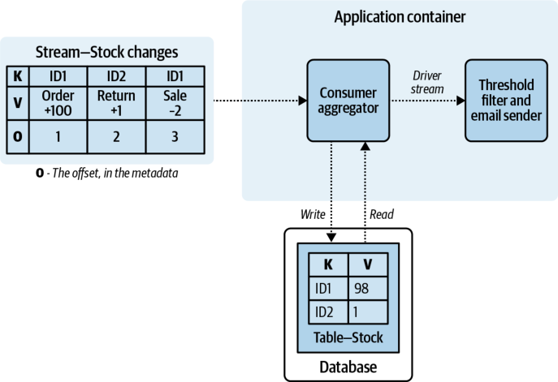

_Figure 7-8. A simple stock accounting service_ 

This stock accounting service is quite simple. It calculates the current running total of stock based off of the event stream changes and stores it in its data store. The business logic filters on a threshold value and decides whether to issue a notification to stock management about low or oversold stock. It must be ensured that each input 

event is applied effectively once to the aggregated state, as applying it more than once is incorrect, as is not applying it at all. This is where effectively once processing comes into play. 

# **Effectively Once Processing with Client-Broker Transactions** 

Effectively once processing can be facilitated by any event broker that supports transactions. With this approach, any output events, updates made to _internal state backed by a changelog_ , and the incrementing of the consumer offsets are wrapped together within a single atomic transaction. This is possible only if all three of these updates are stored within their own specific event stream in the broker. The offset update, the changelog update, and the output event are committed atomically within a single transaction as shown in Figure 7-9. 

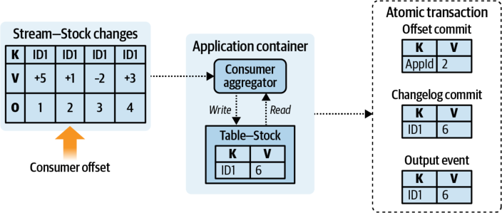

_Figure 7-9. Client-broker transactions—committing offsets and changelogs_ 

The atomic transaction between the producer client and the event broker will publish all events to their corresponding event streams. In the case of permanent failure by the producer, as in Figure 7-10, the broker will ensure that none of the events in the transaction is committed. Event stream consumers typically abstain from processing events that are in uncommitted transactions. The consumer must respect offset order, and so it will block, wait for the transaction to complete, and then proceed to process the event. In the case of transient errors, the producer can simply retry committing its transaction, as it is an idempotent operation. 

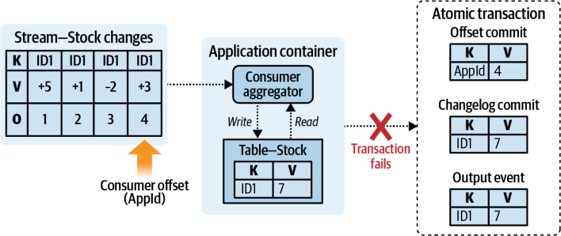

_Figure 7-10. Failed commit for a client-broker transaction_ 

In the case that the producer suffers a fatal exception during a transaction, its replacement instance can simply be rebuilt by restoring from the changelogs as shown in Figure 7-11. The consumer group offsets of the input event streams are also reset according to the last known good position stored in the offset event stream. 

New transactions can begin once the producer is recovered, and all previous incomplete transactions are failed and cleaned up by the event broker. The transactional mechanisms will vary to some extent depending on the broker implementation, so make sure to familiarize yourself with the one you are using. 

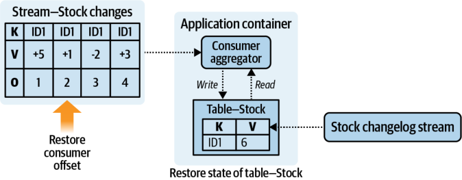

_Figure 7-11. Restoring the state from the broker using changelogs and previous offsets_ 

# **Effectively Once Processing Without Client-Broker Transactions** 

Effectively once processing of events is also possible for implementations that do not support client-broker transactions, though it requires more work and a careful consideration of duplicate events. First, if upstream services are not able to provide effectively once event production guarantees, then it is possible that they may produce 

duplicate records. Any duplicate events created by upstream processes need to be identified and filtered out. Second, state and offset management need to be updated in a _local transaction_ to ensure that the event processing is applied only once to the system state. By following this strategy, clients can be assured that the internal state generated by their processor is consistent with the logical narrative of the input event streams. Let’s take a look at these steps in more detail. 

It is better to use an event broker and client that support idempotent writes than it is to try to solve deduplication after the fact. The former method scales well to all consumer applications, whereas the latter is expensive and difficult to scale. 

# **Generating duplicate events** 

Duplicate events are generated when a producer successfully writes the events to an event stream, but either fails to receive a write acknowledgment and retries, or crashes before updating its own consumer offsets. These scenarios are slightly different: 

_Producer fails to receive acknowledgment from broker and retries_ 

In this scenario, the producer still has the copies of the events to produce in its memory. These events, if published again, may have the same timestamps (if they use event creation time) and same event data, but will be assigned new offsets. 

- _Producer crashes immediately after writing, before updating its own consumer offsets_ In this case, the producer will have successfully written its events, but will _not_ have updated its consumer offsets yet. This means that when the producer comes back up, it will repeat the work that it had previously done, creating logically identical copies of the events but with new timestamps. If processing is deterministic, then the events will have the same data. New offsets will also be assigned. 

_Idempotent production_ is supported by numerous event brokers and can mitigate failures due to crashes and retries, such as in the two preceding scenarios. It cannot mitigate duplicates introduced through faulty business logic. 

# **Identifying duplicate events** 

If idempotent production of events is _not_ available and there are duplicates (with unique offsets and unique timestamps) in the event stream, then it is up to you to mitigate their impact. First, determine if the duplicates actually cause any problems. In many cases duplicates have a minor, if not negligible, effect and can simply be ignored. For those scenarios where duplicate events _do_ cause problems, you will need to figure out how to identify them. One way to do this is to have the producer 

generate a unique ID for each event, such that any duplicates will generate the same unique hash. 

This hash function is often based on the properties of the internal event data, including the key, values, and creation time of the event. This approach tends to work well for events that have a large data domain, but poorly for events that are logically equivalent to one another. Here are a few scenarios where you could generate a unique ID: 

- A bank account transfer, detailing the source, destination, amount, date, and time 

- An ecommerce order, detailing each product, the purchaser, date, time, total amount, and payment provider 

- Stock debited for shipment purposes, where each event has an associated `orderId` (uses an existing unique data ID) 

One factor these examples have in common is that each ID is composed of elements with a very high cardinality (that is, uniqueness). This significantly reduces the chances of duplicates between the IDs. The deduplication ID (dedupe ID) can either be generated with the event or be generated by the consumer upon consumption, with the former being preferable for distribution to all consumers. 

Guarding against duplicate events produced without a key is extremely challenging, as there is no guarantee of partition locality. Produce events with a key, respect partition locality, and use idempotent writes whenever possible. 

# **Guarding against duplicates** 

Any effectively once consumer must either identify and discard duplicates, perform idempotent operations, or consume from event streams that have idempotent producers. Idempotent operations are not possible for all business cases, and without idempotent production you must find a way to guard your business logic against duplicate events. This can be an expensive endeavor, as it requires that each consumer maintain a state store of previously processed dedupe IDs. The store can grow very large depending on the volume of events and the offset or time range that the application must guard against. 

Perfect deduplication requires that each consumer indefinitely maintain a lookup of each dedupe ID already processed, but time and space requirements can become prohibitively expensive if an attempt is made to guard against too large a range. In practice, deduplication is generally only performed for a specific rolling time-window or offset-window as a best-effort attempt. 

Keep deduplication stores small by using time-to-live (TTL), a maximum cache size, and periodic deletions. The specific settings needed will vary depending on the sensitivity of your application to duplicates and the impact of duplicates occurring. 

Deduplication should be attempted only within a single event stream partition, as deduplication between partitions will be prohibitively expensive. Keyed events have an added benefit over unkeyed events, since they will consistently be distributed to the same partition. 

Figure 7-12 shows a deduplication store in action. In this figure you can see the workflow that an event goes through before being passed off to the actual business logic. In this example the TTL is arbitrarily set to 8,000 seconds, but in practice would need to be established based on business requirements. 

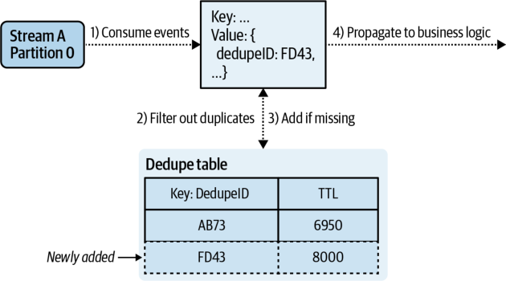

_Figure 7-12. Deduplication using persisted state_ 

A maximum cache size is used in the deduplication store to limit the number of events maintained, particularly during reprocessing. 

Note that you are responsible for maintaining durable backups of the deduplication table, just as for any other materialized table. In the case of a failure, the table must be rebuilt prior to resuming the processing of new events. 

# **Maintaining consistent state** 

A microservice can leverage the transactional capabilities of its state store instead of the event broker to perform effectively once processing. This requires moving the consumer group’s offset management from the event broker and into the data service, allowing a single stateful transaction to atomically update both the state and input offsets. Any changes made to the state coincide completely with those made to the consumer offsets, which maintains consistency within the service. 

In the case of a service failure, such as a timeout when committing to the data service, the microservice can simply abandon to transaction and revert to the last known good state. All consumption is halted until the data service is responsive, at which point consumption is restored from the last known good offset. By keeping the official record of offsets synchronized with the data in the data service, you have a consistent view of state that the service can recover from. This process is illustrated in Figures 7-13, 7-14, and 7-15. 

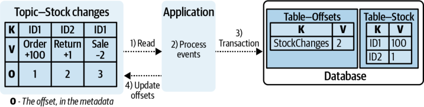

_Figure 7-13. Normal transactional processing of events_ 

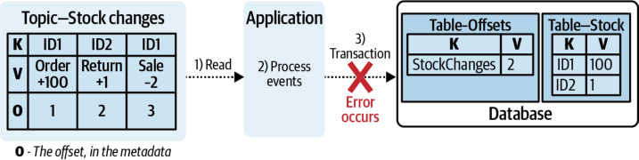

_Figure 7-14. Failure occurs in transactional processing_ 

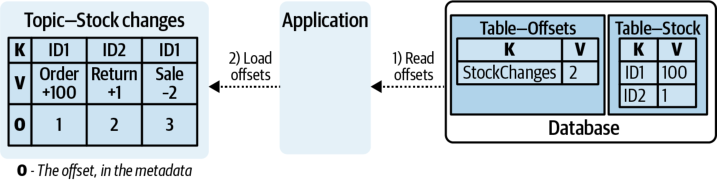

_Figure 7-15. Recovery of offsets during state restoration process_ 

Note that this approach gives your processor effectively once _processing_ , but not effectively once event _production_ . Any events produced by this service are subject to the limitations of at-least-once production, as the nontransactional client-broker production of events is subject to the creation of duplicates. 

If you must have events transactionally produced alongside updates to the state store, refer to Chapter 4. Using a change-data table can provide eventually consistent, effectively once updates to the state store with at-least-once production to the output event stream. 

# **Summary** 

This chapter looked at internal and external state stores, how they work, their advantages, their disadvantages, and when to use them. Data locality plays a large role in the latency and throughput of systems, allowing them to scale up in times of heavy load. Internal state stores can support high-performance processing, while external state stores can provide a range of flexible options for supporting the business needs of your microservices. 

Changelogs play an important role in the backup and restoration of microservice state stores, though this role may also be performed by transaction-supporting databases and regularly scheduled snapshots. Event brokers that support transactions can enable extremely powerful effectively once processing, offloading the responsibility of duplication prevention from the consumer, while deduplication efforts can enable effectively once processing in systems without such support. 

