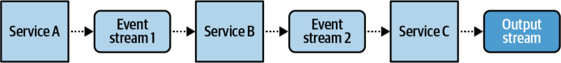
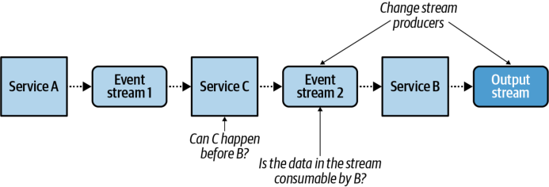
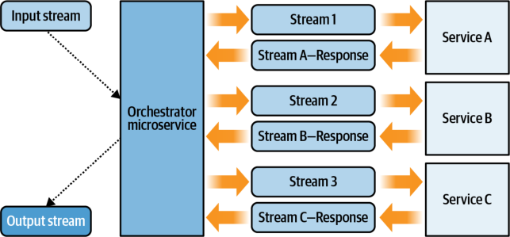
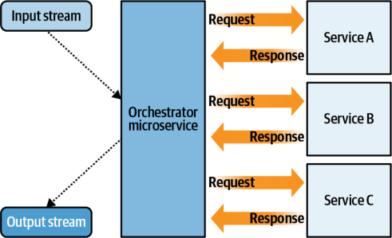
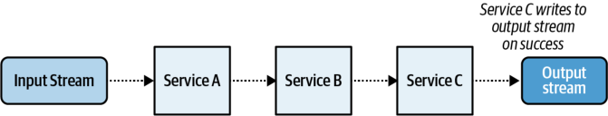
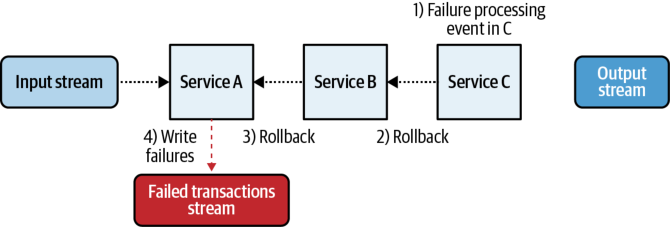
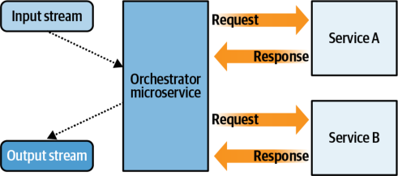
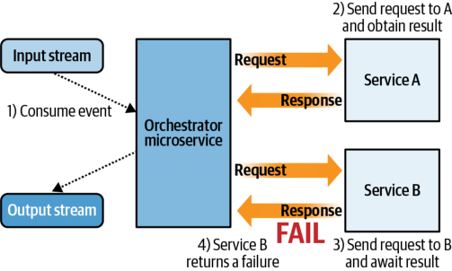
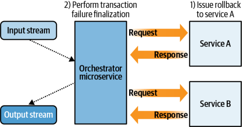

# **CHAPTER 8 Building Workflows with Microservices** 

Microservices, by their very definition, operate on only a small portion of the overall business workflow of an organization. A _workflow_ is a particular set of actions that compose a business process, including any logical branching and compensatory actions. Workflows commonly require multiple microservices, each with its own bounded context, performing its tasks and emitting new events to downstream consumers. Most of what we’ve looked at so far has been how single microservices operate under the hood. Now we’re going to take a look at how multiple microservices can work together to fulfill larger business workflows, and some of the pitfalls and issues that arise from an event-driven microservice approach. 

Here are some of the main considerations for implementing EDM workflows. 

# _Creating and modifying workflows_ 

- How are the services related within the workflow? 

- How can I modify existing workflows without: 

   - Breaking work already in progress? 

   - Requiring changes to multiple microservices? 

   - Breaking monitoring and visibility? 

# _Monitoring workflows_ 

- How can I tell when the workflow is completed for an event? 

- How can I tell if an event has failed to process or is stuck somewhere in the workflow? 

- How can I monitor the overall health of a workflow? 


_Implementing distributed transactions_ 

- Many workflows require that a number of actions happen together or not at all. How do I implement distributed transactions? 

- How do I roll back distributed transactions? 

This chapter covers the two main workflow patterns, choreography and orchestration, and evaluates them against these considerations. 

# **The Choreography Pattern** 

The term _choreographed architectures_ (also known as _reactive architectures_ ) commonly refers to highly decoupled microservice architectures. Microservices react to their input events as they arrive, without any blocking or waiting, in a manner fully independent from any upstream producers or subsequent downstream consumers. This is much like a dance performance, where each dancer must know his or her own role and perform it independently, without being controlled or told what to do during the dance. 

Choreography is common in event-driven microservice architectures. Event-driven architectures focus strictly on providing _reusable event streams_ of relevant business information, where consumers can come and go without any disruption to the upstream workflow. All communications are done strictly through the input and output event streams. A producer in a choreographed system does not know who the consumers of its data are, nor what business logic or operations they intend to perform. The upstream business logic is fully isolated from the downstream consumers. 

Choreography is desirable in the majority of interteam communications, as it allows for loosely coupled systems and reduces coordination requirements. Many business workflows are independent of one another and do not require strict coordination, which makes a choreographed approach ideal for communication. New microservices can be easily added to a choreographed architecture, while existing ones can be removed just as easily. 

The relationships between the microservices define the workflow of a choreographed architecture. A series of microservices operating together can be responsible for providing the business functionality of the workflow. This choreographed workflow is a form of _emergent behavior_ , where it is not just the individual microservices that dictate the workflow, but the relationships between them as well. 


Direct-call microservice architectures focus on providing reusable _services_ , to be used as building blocks for business workflows. Event-driven microservice architectures, on the other hand, focus on providing reusable _events_ , with no foreknowledge of downstream consumption. The latter architecture enables the usage of highly decoupled, choreographed architectures. 

It is important to note that choreography belongs to the domain of event-driven architectures, because the decoupling of the producer and consumer services allows them to carry out their responsibilities independently. Contrast this with the directcall microservice architecture, where the focus is on providing _reusable services_ to compose more extensive business functionality and workflows, and where one microservice directly calls the API of another. By definition, this means the calling microservice must know two things: 

- _Which_ service needs to be called 

- _Why_ the service needs to be called (the expected business value) 

As you can see, a direct-call microservice is tightly coupled and fully dependent on the existing microservice’s bounded contexts. 

# **A Simple Event-Driven Choreography Example** 

Figure 8-1 shows the output of a choreographed workflow in which service A feeds directly into service B, which in turn feeds into service C. In this particular case, you can infer that the services have a dependent workflow of A → B → C. The output of service C indicates the result of the workflow as a whole. 





_Figure 8-1. Simple event-driven choreographed workflow_ 

Now, say that the workflow needs to be rearranged such that the business actions in service C must be performed before those in service B, as shown in Figure 8-2. 





_Figure 8-2. Business changes required by the simple event-driven choreographed workflow_ 

Both services C and B must be edited to consume from streams 1 and 2, respectively. The format of the data within the streams may no longer suit the needs of the new workflow, requiring breaking schema changes that may significantly affect other consumers (not shown) of event stream 2. A whole new event schema may need to be created for event stream 2, with the old data in the event stream ported over to the new format, deleted, or left in place. Finally, you must ensure that processing has completed for all of the output events of services A, B, and C before swapping the topology around, lest some events be incompletely processed and left in an inconsistent state. 

# **Creating and Modifying a Choreographed Workflow** 

While choreography allows for simple addition of new steps at the end of the workflow, it may be problematic to insert steps into the middle or to change the order of the workflow. The relationships between the services may also be difficult to understand outside the context of the workflow, a challenge that is exacerbated as the number of services in the workflow increases. Choreographed workflows can be brittle, particularly when business functions cross multiple microservice instances. This can be mitigated by carefully respecting the bounded contexts of services and ensuring that full business functionality remains local to a single service. However, even when correctly implemented, small business logic changes may require you to modify or rewrite numerous services, especially those that change the order of the workflow itself. 


# **Monitoring a Choreographed Workflow** 

When monitoring a choreographed workflow, you need to take into account its scale and scope. In isolation, distributed choreographed workflows can make it difficult to discern the processing progress of a specific event. For event-driven systems, monitoring business-critical workflows may necessitate listening to each output event stream and materializing it into a state store, to account for where an event may have failed to process or have gotten stuck in processing. 

For example, modifying the workflow order in Figure 8-2 requires also changing the workflow visibility system. This assumes that observers care about _each_ event stream in that workflow and want to know everything about each event. But what about visibility into workflows where you may _not_ care about each event stream in the workflow? What about workflows spread out across an entire organization? 

Consider now a much larger-scale example, such as an order fulfillment process at a large multinational online retailer. A customer views items, selects some for purchase, makes a payment, and awaits a shipping notification. There may be many dozens or even hundreds of services involved in supporting this customer workflow. Visibility into this workflow will vary depending on the needs of the observer. 

The customer may only really care where the order is in the progression from payment to fulfillment to shipping notification. You could reasonably monitor this by tapping off events from three separate event streams. It would be sufficiently resilient to change due to both the “public” nature and the low number of event streams it is consuming from. Meanwhile, a view into the full end-to-end workflow could require consuming from dozens of event streams. This may be more challenging to accomplish due to both the volume of events and the independence of event streams, particularly if the workflow is subject to regular change. 


Be sure you know what it is you’re trying to make visible in the choreographed workflow. Different observers have different requirements, and not all steps of a workflow may require explicit exposure. 

# **The Orchestration Pattern** 

In the orchestration pattern a central microservice, the orchestrator, issues commands to and awaits responses from subordinate worker microservices. Orchestration can be thought of much like a musical orchestra, where a single conductor commands the musicians during the performance. The orchestrator microservice contains the entire workflow logic for a given business process and sends specific events to worker microservices to tell them what to do. 


The orchestrator awaits responses from the instructed microservices and handles the results according to the workflow logic. This is in contrast to the choreographed workflow, in which there is no centralized coordination. 

The orchestration pattern allows for a flexible definition of the workflow within a single microservice. The orchestrator keeps track of which parts of the workflow have been completed, which are in process, and which have yet to be started. The workflow orchestrator issues command events to subordinate microservices, which perform the required task and provide the results back to the orchestrator, typically by issuing requests and responses through an event stream. 

If a payment microservice attempts to fulfill payment three times before failing, it must make those three attempts _internal_ to the payment microservice. It does _not_ make one attempt and notify the orchestrator that it failed and wait to be told to try again or not. The orchestrator should have no say about how payments are processed, including how many attempts to make, as that is part of the bounded context of the payment microservice. The only thing the orchestrator needs to know is if the payment has _completely_ succeeded or if it has _completely_ failed. From there, it may act accordingly based on the workflow logic. 


Ensure the orchestrator’s bounded context is limited strictly to workflow logic and that it contains minimal business fulfillment logic. The orchestrator contains only the workflow logic, while the services under orchestration contain the bulk of the business logic. 

Note that the business responsibilities of a nonorchestrator microservice in an orchestrated pattern are identical to those of the same microservice in the choreographed pattern. The orchestrator is responsible only for orchestration and workflow logic, and not at all for the fulfillment of business logic of any of the microservices themselves. Let’s look at a simple example that illustrates these boundaries. 


# **A Simple Event-Driven Orchestration Example** 

Figure 8-3 shows an orchestration version of the architecture in Figure 8-1. 





_Figure 8-3. Simple orchestrated event-driven workflow_ 

The orchestrator keeps a materialization of the events issued to services A, B, and C, and updates its internal state based on the results returned from the worker microservice (see Table 8-1). 

_Table 8-1. Materialization of events issued from orchestration service_ 

|**Input event ID**|**Service A**|**Service B**|**Service C**|**Status**|
|---|---|---|---|---|
|100|<results>|<results>|<results>|Done|
|101|<results>|<results>|Dispatched|Processing|
|102|Dispatched|null|null|Processing|


Event ID 100 has been successfully processed, while event IDs 101 and 102 are in different stages of the workflow. The orchestrator can make decisions based on these results and select the next step according to the workflow logic. Once the events are processed, the orchestrator can also take the necessary data from service A, B, and C’s results and compose the final output. Assuming the operations in services A, B, and C are independent of one another, you can make changes to the workflow simply by changing the order in which events are sent. In the following orchestration code, events are simply consumed from each input stream and processed according to the workflow business logic: 

```
while(true){
Event[]events=consumer.consume(streams)
```

```
for(Eventevent:events){
```

```
if(event.source=="Input Stream"){
//process event + update materialized state
```


```
producer.send("Stream 1",...)//Send data to stream 1
```

```
}elseif(event.source=="Stream 1-Response"){
//process event + update materialized state
producer.send("Stream 2",...)//Send data to stream 2
```

```
}elseif(event.source=="Stream 2-Response"){
//process event + update materialized state
producer.send("Stream 3",...)//Send data to stream 3
```

```
}elseif(event.source=="Stream 3-Response"){
//process event, update materialized state, and build output
producer.send("Output",...)//Send results to output
}
}
consumer.commitOffsets()
}
```

# **A Simple Direct-Call Orchestration Example** 

Orchestration can also use a request-response pattern, where the orchestrator synchronously calls the microservice’s API and awaits a response for results. The topology shown in Figure 8-4 is nearly identical to the one in Figure 8-3, aside from substitution of direct calls. 





_Figure 8-4. Simple direct-call orchestrated workflow_ 

The normal benefits and restrictions of direct-call services apply here as well. That being said, this pattern is particularly useful for implementing workflows with Function-as-a-Service solutions (see Chapter 9). 

# **Comparing Direct-Call and Event-Driven Orchestration** 

Direct-call and event-driven orchestration workflows are fairly similar when examined close-up. For instance, it might seem that the event-driven system is really just a request-response system, and in these simple examples, it certainly is. But when you 


zoom out a bit, there are a number of factors to consider when choosing which option to use. 

Event-driven workflows: 

- Can use the same I/O monitoring tooling and lag scaling functionality as other event-driven microservices 

- Allow event streams to still be consumed by other services, including those outside of the orchestration 

- Are generally more durable, as both the orchestrator and the dependent services are isolated from each other’s intermittent failures via the event broker 

- Have a built-in retry mechanism for failures, as events can remain in the event stream for retrying 

Direct-call workflows: 

- Are generally faster, as there’s no overhead in producing to and consuming from event streams 

- Have intermittent connectivity issues that may need to be managed by the orchestrator 

To summarize, direct-call aka synchronous request-response workflows are generally faster than event-driven ones, provided all dependent services are operating within their SLAs. They tend to work well when very quick responses are required, such as in real-time operations. Meanwhile, event-driven workflows have more durable I/O streams, producing slower but more robust operations, and are particularly good at handling intermittent failures. 

Keep in mind that there’s quite a lot of opportunity to mix and match these two options. For example, an orchestration workflow may be predominantly eventdriven, but require that a request-response call be made directly to an external API or preexisting service. When mixing these two options together, make sure that each service’s failure modes are handled as expected. 

# **Creating and Modifying an Orchestration Workflow** 

The orchestrator can keep track of events in the workflow by materializing each of the incoming and outgoing event streams and response-request results. The workflow itself is defined solely within the orchestration service, allowing a single point of change for altering the workflow. In many cases, you can incorporate changes to a workflow without disrupting partially processed events. 

Orchestration results in a tight coupling between services. The relationship between the orchestrator and the dependent worker services must be explicitly defined. 


It is important to ensure that the orchestrator is responsible only for orchestrating the business workflow. A common anti-pattern is creating a single “God” service that issues granular commands to many weak minion services. This anti-pattern spreads workflow business logic between the orchestrator and the worker services, making for poor encapsulation, ill-defined bounded contexts, and difficulty in scaling ownership of the workflow microservices beyond a single team. The orchestrator should delegate full responsibility to the dependent worker services to minimize the amount of business logic it performs. 

# **Monitoring the Orchestration Workflow** 

You gain visibility into the orchestration workflow by querying the materialized state, so it’s easy to see the progress of any particular event and any issues that may have arisen in the workflow. You can implement monitoring and logging at the orchestrator level to detect any events that result in workflow failures. 

# **Distributed Transactions** 

A _distributed_ transaction is a transaction that spans two or more microservices. Each microservice is responsible for processing its portion of the transaction, as well as reversing that processing in the case that the transaction is aborted and reverted. Both the fulfillment and reversal logic must reside within the same microservice, both for maintainability purposes and to ensure that new transactions cannot be started if they can’t also be rolled back. 


It is best to avoid implementing distributed transactions whenever possible, as they can add significant risk and complexity to a workflow. You must account for a whole host of concerns, such as synchronizing work between systems, facilitating rollbacks, managing transient failures of instances, and network connectivity, to name just a few. 

While it is still best to avoid implementing distributed transactions whenever possible, they still have their uses and may be required in some circumstances, particularly when such avoidance would otherwise result in even more risk and complexity. 

Distributed transactions in an event-driven world are often known as _sagas_ and can be implemented through either a choreographed pattern or an orchestrator pattern. The saga pattern requires that the participating microservices be able to process reversal actions to revert their portion of the transaction. Both the regular processing actions and the reverting actions should be idempotent, such that any intermittent failures of the participating microservices do not leave the system in an inconsistent state. 


# **Choreographed Transactions: The Saga Pattern** 

Distributed transactions with choreographed workflows can be complex affairs, as each service needs to be able to roll back changes in the event of a failure. This creates strong coupling between otherwise loosely coupled services and can result in some unrelated services having strict dependencies on one another. 

The choreographed saga pattern is suitable for simple distributed transactions, particularly those with strong workflow ordering requirements that are unlikely to change over time. Monitoring the progress of a choreographed transaction can be difficult, because it requires a full materialization of each participating event stream, as in the orchestrated approach. 

# **Choreography Example** 

Continuing with the previous choreographed workflow example, consider the series of microservices A, B, C. The input event stream to service A kicks off a transaction, with the work of services A, B, and C being fully completed, or consequently canceled and rolled back. A failure at any step in the chain aborts the transaction and begins the rollback. The resultant workflow is shown in Figure 8-5. 





_Figure 8-5. Choreographed transaction success_ 

Suppose now that service C is unable to complete its part of the transaction. It must now reverse the workflow, either by issuing events or by responding to the previous service’s request. Services B and A must revert their portion of the transaction, in order, as shown in Figure 8-6. 





_Figure 8-6. Choreographed transaction failure with rollbacks_ 


Service A, the original consumer of the input event, must now decide what to do with the failed transaction results. A curious situation is already evident in the preceding two figures. The status of a successful transaction comes from the output of microservice C. However, the status of the aborted transaction comes out of microservice A, so a consumer would need to listen to both the output of C and the failed transaction stream from A to get a complete picture of finalized transactions. 


Remember the single-writer principle. No more than one service should publish to an event stream. 

Even when consuming from both the output and failed transactions streams, the consumer will still not be able to get the status of ongoing transactions or of transactions that have gotten stuck in processing. This would require that each event stream be materialized, or that the internal state of each microservice be exposed via API, as discussed earlier in this chapter. Making changes to the workflow of a choreographed transaction requires dealing with the same challenges as a nontransactional workflow, but with the added overhead of rolling back changes made by the previous microservice in the workflow. 

Choreographed transactions can be somewhat brittle, generally require a strict ordering, and can be problematic to monitor. They work best in services with a very small number of microservices, such as a pair or a trio with very strict ordering and a low likelihood of needing workflow changes. 

# **Orchestrated Transactions** 

Orchestrated transactions build on the orchestrator model, with the addition of logic to revert the transaction from any point in the workflow. You can roll back these transactions by reversing the workflow logic and ensuring that each worker microservice can provide a complementary reversing action. 

Orchestrated transactions can also support a variety of signals, such as timeouts and human inputs. You can use timeouts to periodically check the local materialized state to see how long a transaction has been processing. Human inputs via a REST API (see Chapter 13) can be processed alongside other events, handling cancellation instructions as required. The centralized nature of the orchestrator allows for close monitoring of the progress and state of any given transaction. 

The transaction can be aborted at any point in the workflow due to a return value from one of the worker microservices, a timeout, or an interrupt sent from a human operator. 


A simple two-stage orchestrated transaction topology is shown in Figure 8-7. 





_Figure 8-7. Simple orchestrated transaction topology_ 

Events are consumed from the input stream and processed by the orchestrator. In this example, the orchestrator is using direct request-response calls to the workflow’s microservices. A request is made to service A, and the orchestrator blocks while awaiting a response. Once it obtains the response, the orchestrator updates its internal state and calls service B, as shown in Figure 8-8. 





_Figure 8-8. Simple orchestrated transaction with a failure in the transaction_ 

Service B cannot perform the necessary operation and, after exhausting its own retries and error-handling logic, eventually returns a failure response to the orchestrator. The orchestrator must now enact its rollback logic based on the current state of that event, ensuring that it issues rollback commands to all required microservices. 


Each microservice is fully responsible for ensuring its own retry policy, error handling, and intermittent failure management. The orchestrator does not manage any of these. 


Figure 8-9 demonstrates the orchestrator issuing a rollback command to service A (service B’s failure response indicates it did not write anything to its internal data store). In this example, Service A performs the rollback successfully, but if it were to fail during its rollback, it would be up to the orchestrator to determine what to do next. The orchestrator could reissue the command a number of times, issue alerts via monitoring frameworks, or terminate the application to prevent further issues. 





_Figure 8-9. Issuing the rollback commands in an orchestrated transaction_ 

Once the transaction has been rolled back, it is up to the orchestrator to decide what to do next to finalize the processing of that event. It may retry the event a number of times, discard it, terminate the application, or output a failure event. The orchestrator, being the single producer, publishes the transaction failure to the output stream and lets a downstream consumer handle it. This differs from choreography, where there is no single stream from which to consume all output without discarding the single writer principle. 


Just as each microservice is fully responsible for its own state changes, it is also responsible for ensuring that its state is consistent after a rollback. The orchestrator’s responsibility in this scenario is limited to issuing the rollback commands and awaiting confirmations from the dependent microservices. 

The orchestrator can also expose the status of transactions in progress in the same output stream, updating the transaction entity as worker services return results. This can provide high visibility into the state of underlying transactions and allows for stream-based monitoring. 

Orchestrated transactions offer better visibility into workflow dependencies, more flexibility for changes, and clearer monitoring options than choreographed transactions. The orchestrator instance adds overhead to the workflow and requires 


management, but can provide to complex workflows the clarity and structure that choreographed transactions cannot provide. 

# **Compensation Workflows** 

Not all workflows need to be perfectly reversible and constrained by transactions. There are many unforeseen issues that can arise in a given workflow, and in many cases you might just have to do your best to complete it. In case of failure, there are actions you can take after the fact to remedy the situation. 

Ticketing and inventory-based systems often use this approach. For example, a website that sells physical products may not have sufficient inventory at the time of purchase to handle a number of concurrent transactions. Upon settling the payments and evaluating its available inventory, the retailer may discover that there is insufficient stock to fulfill the orders. It has several options at this point. 

A strict transaction-based approach would require that the most recent transactions be rolled back—that is, the money returned to the payment provider, and the customer alerted that the item is now out of stock and the order has been cancelled. While technically correct, this could lead to a poor customer experience and a lack of trust between the customer and the retailer. A _compensating workflow_ can remedy the situation based on the business’s customer satisfaction policies. 

As a form of compensation, the business could order new stock, notify the customer that there has been a delay, and offer a discount code for the next purchase as an apology. The customer could be given the option to cancel the order or wait for the new stock to arrive. Music, sport, and other performance venues often use this approach in the case of oversold tickets, as do airlines and other ticket-based travel agencies. Compensation workflows are not always possible, but they are often useful for handling distributed workflow operations with customer-facing products. 

# **Summary** 

Choreography allows for loose coupling between business units and independent workflows. It is suitable for simple distributed transactions and simple nontransactional workflows, where the microservice count is low and the order of business operations is unlikely to ever change. 

Orchestrated transactions and workflows provide better visibility and monitoring into workflows than choreography. They can handle more complicated distributed transactions than choreography and can often be modified in just a single location. Workflows that are subject to changes and contain many independent microservices are well suited to the orchestrator pattern. 


Finally, not all systems require distributed transactions to successfully operate. Some workflows can provide compensatory actions in the case of failure, relying on nontechnical parts of the business to solve customer-facing issues. 


