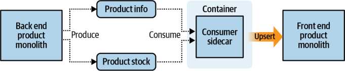
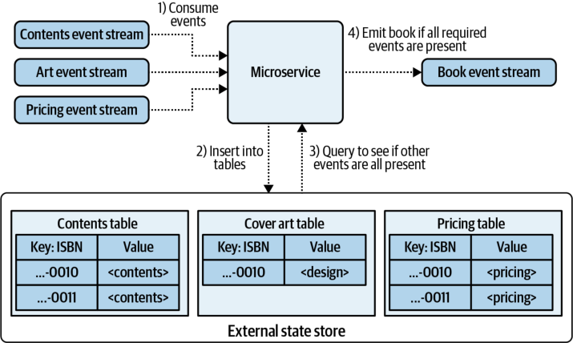
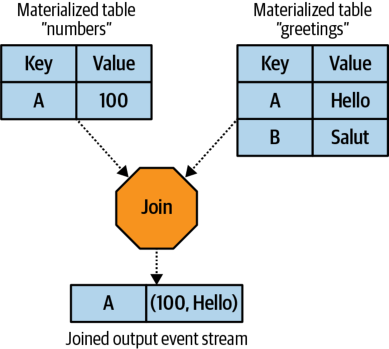
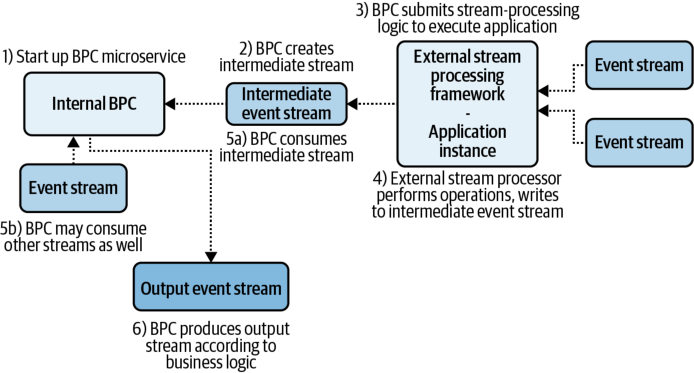

# **CHAPTER 10** 

# **Basic Producer and Consumer Microservices** 

Basic producer and consumer (BPC) microservices ingest events from one or more event streams, apply any necessary transformations or business logic, and emit any necessary events to output event streams. Synchronous request-response I/O may also be a part of this workflow, but that topic is covered in more detail in Chapter 13. This chapter focuses strictly on event-driven components. 

BPC microservices are characterized by the use of basic consumer and producer clients. Basic consumer clients do not include any event scheduling, watermarks, mechanisms for materialization, changelogs, or horizontal scaling of processing instances with local state stores. These capabilities typically belong only to more full-featured frameworks, which Chapters 11 and 12 will discuss in more depth. While it is certainly possible for you to develop your own libraries to provide these features, doing this is quite beyond the scope of this chapter. Thus, you must carefully consider if the BPC pattern will work for your business requirements. 

Producer and consumer clients are readily available in most commonly used languages, lowering the cognitive overhead in getting started with event-driven microservices. The entire workflow of the bounded context is contained within the code of the single microservice application, keeping the responsibilities of the microservice localized and easy to understand. The workflow can also easily be wrapped into one or more containers (depending on the complexity of the implementation), which can then be deployed and executed with the microservice’s container management solution. 

# **Where Do BPCs Work Well?** 

BPC microservices can fulfill a wide range of business requirements despite lacking most of the full-featured framework components. Simple patterns such as stateless transformations are easily implemented, as are stateful patterns where deterministic event scheduling is not required. 

External state stores are more commonly used than internal state stores in BPC implementations, as scaling local state between multiple instances and recovering from instance failures is difficult without a full-featured streaming framework. External state stores can provide multiple microservice instances with uniform access as well as data backup and recovery mechanisms. 

Let’s look at a few use cases in which basic BPC implementations work particularly well. 

# **Integration with Existing and Legacy Systems** 

Legacy systems can participate in event-driven architectures by integrating a basic producer/consumer client into their codebase. This integration often begins early in the adoption of event-driven microservices and may even be part of your strategy for bootstrapping legacy systems into the event-driven ecosystem (see Chapter 4). Legacy systems produce their own data to the event broker’s single source of truth as required and consume back any events that they need from other event streams. 

In some scenarios it’s not possible to safely modify the legacy codebase to produce and consume data from event streams. The _sidecar_ pattern is particularly applicable to this scenario, as it enables some event-driven functionality without affecting the source codebase. 

# **Example: Sidecar pattern** 

An ecommerce store has a frontend that displays all the stock and product data it contains. Previously, the frontend service would source all of its data by synchronizing with a read-only subordinate data store using a scheduled batch job, as in Figure 10-1. 

_Figure 10-1. Scheduled batch between monoliths_ 

Today, there are two event streams, one with product information and one with product stock levels. You can use a sidecar implementation to sink this data into the data store, where a BPC consumes the events and upserts them into the associated data sets. The frontend gains access to a near-real time data feed of product updates, without having to change any of the system code, as in Figure 10-2. 

_Figure 10-2. Using the sidecar to upsert data into the frontend data store_ 

The sidecar resides inside its own container but must be part of the single deployable of the frontend service. Additional tests must be performed to ensure that the integrated sidecar operates as expected. The sidecar pattern allows you to add new functionality to a system without requiring significant changes to the legacy codebase. 

# **Stateful Business Logic That Isn’t Reliant Upon Event Order** 

Many business processes do not have any requirements regarding the order in which events arrive, but do require that _all_ necessary events _eventually_ arrive. This is known as a gating pattern and is one in which the BPC works well as an implementation. 

# **Example: Book publishing** 

Say that you work for a book publisher and there are three things that must be done before a book is ready to be sent to the printer. It is not important in which order these events occur, but it is important that each one occurs prior to releasing the book to the printers: 

# _Contents_ 

The contents of the book must have been written. 

# _Cover art_ 

The cover art for the book must have been created. 

# _Pricing_ 

The prices must be set according to regions and formats. 

Each of these event streams acts as a driver of logic. When a new event comes in on any of these streams, it is first materialized in its proper table and subsequently used to look up every other table to see if the other events are present. Figure 10-3 illustrates an example. 

**Where Do BPCs Work Well? | 171** 

_Figure 10-3. Gating the readiness of a book_ 

In this example, the book ending with ISBN 0010 will already have been published to the output book event stream. Meanwhile, the book ending with ISBN 0011 is currently waiting for cover art to be available and has not been published to the output stream. 

Explicit approval from a human being may also be required in the gating pattern. This is covered in more detail in “Example: Newspaper publishing workflow (approval pattern)” on page 225. 

# **When the Data Layer Does Much of the Work** 

The BPC is also a suitable approach when the underlying data layer performs most of the business logic, such as a geospatial data store; free-text search; and machine learning, AI, and neural network applications. An ecommerce company may ingest new products scraped from websites and perform classification using a BPC microservice, with the backend data layer being a batch-trained machine learning categorizer. Alternately, user behavior events, such as opening the application, may be correlated with a geospatial data store to determine the nearest retailers from which to show advertisements. In these scenarios, the complexity of processing the event is offloaded entirely to the underlying data layer, with the producer and consumer components acting as simple integration mechanisms. 

# **Independent Scaling of the Processing and Data Layer** 

The processing needs and the data storage needs of a microservice are not always linearly related. For instance, the volume of events that a microservice must process may vary with time. One common load pattern, which is incorporated into the following example, mirrors the sleep/wake cycle of a local population, with intensive activity during the day and very low activity during the night. 

# **Example: Perform aggregations on event data to build user engagement profiles** 

Consider a scenario where user behavior events are aggregated into 24-hour sessions. The data from these sessions is used to determine which products are the most recently popular and in turn used to drive advertisements for sales. Once the 24-hour aggregation session is completed, it is flushed from the data store and emitted to an output event stream, freeing up the data storage space. Each user has an aggregation maintained in an external data store, which looks something like this: 

|**Key**|**Value**|
|---|---|
|`userId, timestamp`|`List(productId)`|

The processing needs of the service change with the sleep/wake cycles of the people using the product. At nighttime, when most users are asleep, very little processing power is needed to perform the aggregations compared to what’s required during the day. In the interest of saving money on processing power, the service is scaled down in the night. 

The partition assignor can reassign the input event stream partitions to a single processor instance, as it can handle the consumption and processing of all user events. Note that despite the volume of events being low, the domain of potential users remains constant and so the service requires full access to all user aggregations. Scaling down the processing has no impact on the size of state that the service must maintain. 

During the day, additional processing instances can be brought online to handle the increased event load. The query rate of the data store will also increase in this particular scenario, but caching, partitioning, and batching can help keep the load lighter than the linear increase in processing requirements. 

Service providers such as Google, Amazon, and Microsoft offer highly scalable pay-per-read/write data stores that accommodate this pattern very well. 

**Where Do BPCs Work Well? | 173** 

# **Hybrid BPC Applications with External Stream Processing** 

BPC microservices can also leverage external stream-processing systems to do work that may otherwise be too difficult to do locally. This is a hybrid application pattern, with business logic spread between the BPC and the external stream-processing framework. The heavyweight frameworks of Chapter 11 are excellent candidates for this, as they can provide large-scale stream processing with simple integrations. 

The BPC implementation can perform operations that would otherwise be unavailable to it, while still having access to any necessary language features and libraries. For example, you could use the external stream-processing framework to perform complex aggregations across multiple event streams, while using the BPC microservice to populate a local data store with the results and serve up request-response queries. 

# **Example: Using an External Stream-Processing Framework to Join Event Streams** 

Say your BPC service needs to leverage the joining capabilities of a stream-processing framework, which is particularly good at joining large sets of materialized event streams. The external stream processor will simply materialize event streams into tables and join those rows together that have the same key. This simple join operation is shown in Figure 10-4. 

_Figure 10-4. A typical outsourceable operation performed at scale by a stream-processing framework_ 

The hybrid BPC needs to use a compatible client to start up the work on the external stream processing framework. This client will transform the code into instructions for the framework, which will itself handle consuming, joining, and producing events into the joined output event stream. This design outsources the work to an external processing service that will return the results in the form of an event stream. The workflow for this would look like Figure 10-5. 

_Figure 10-5. A hybrid workflow showing an external stream-processing application sending results back to the BPC via an intermediate event stream_ 

The BPC instantiates a client to run the external stream processing work. When the BPC is terminated, the external stream processing instance should also be terminated to ensure that no ghost processes are left running. 

The major advantage of this pattern is that it unlocks stream-processing features that may otherwise be unavailable to your microservice. Availability is limited to languages with corresponding stream-processing clients, and not all features may be supported for all languages. This pattern is frequently used in tandem with both lightweight and heavyweight frameworks; for example, it’s one of the primary use cases for SQL-based stream operations, such as those provided by Confluent’s KSQL. Technology options like these provide a way to _augment_ the offerings of the BPC, giving it access to powerful stream-processing options that it would not have otherwise. 

The main drawbacks of this pattern relate to the increase in complexity. Testing the application becomes much more complex, as you must also find a way to integrate the external stream-processing framework into your testing environment (see Chapter 15). Debugging and development complexity also increase, because the 

introduction of the streaming framework increases the number of moving parts and potential for bugs. Finally, handling the bounded context of the microservice may become more difficult, as you need to ensure that you can easily manage the deployment, rollback, and operations with hybrid application deployments. 

# **Summary** 

The BPC pattern is simple yet powerful. It forms the foundation of many stateless and stateful event-driven microservice patterns. You can easily implement stateless streaming and simple stateful applications using the BPC pattern. 

The BPC pattern is also flexible. It pairs well with implementations where the data storage layer does most of the business work. You can use it as an interfacing layer between event streams and legacy systems, as well as leverage external stream processing systems to augment its capabilities. 

Due to its basic nature, however, it does require you to invest in libraries to access mechanisms such as simple state materialization, event scheduling, and timestampbased decision making. These components intersect with the offerings found in Chapters 11 and 12, and thus you will need to decide how much in-house development you would like to do versus adopting more purpose-built solutions. 

