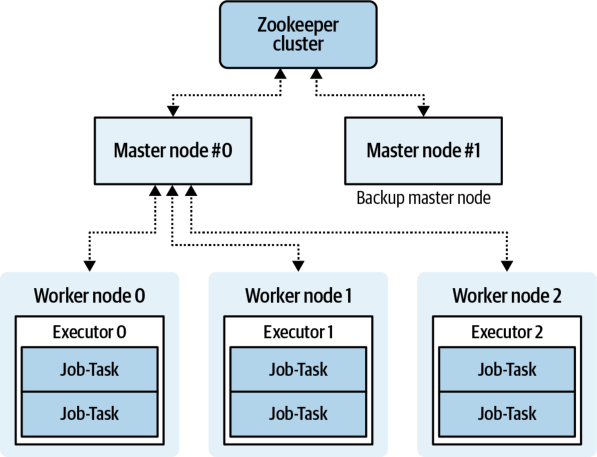
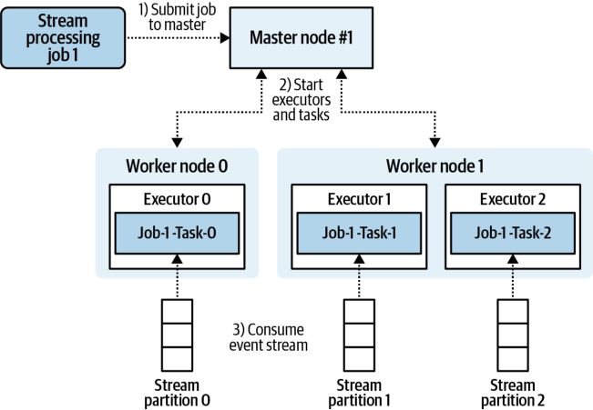
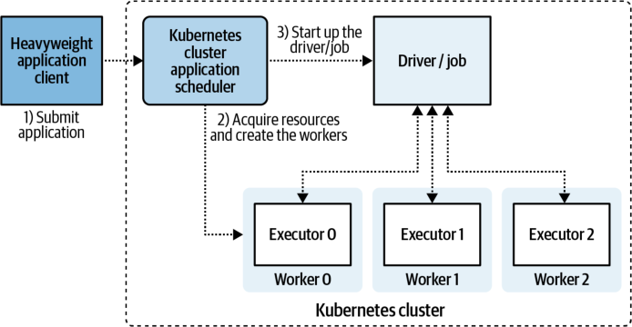
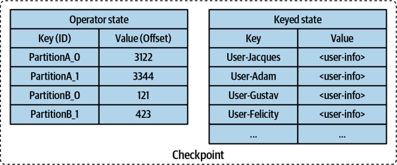
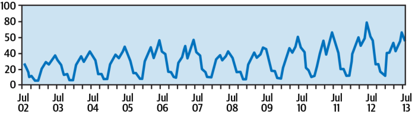
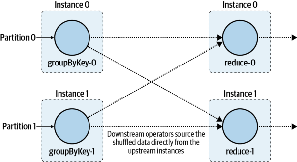
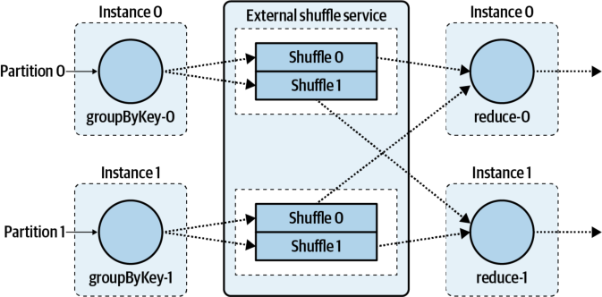
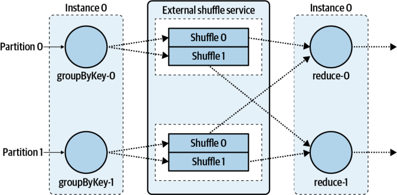
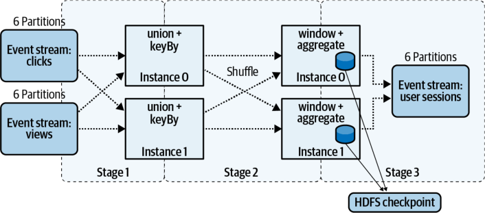
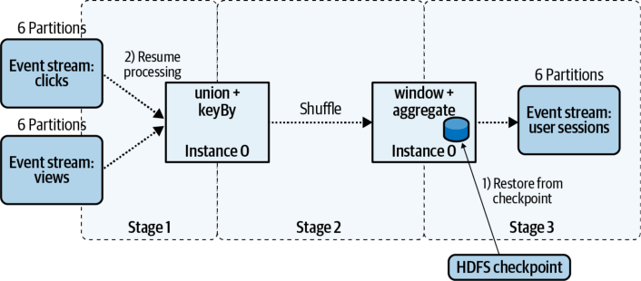

# **CHAPTER 11 Heavyweight Framework Microservices** 

This chapter and the next cover the full-featured frameworks most commonly used in event-driven processing. Frequently referred to as _streaming frameworks_ , they provide mechanisms and APIs for handling streams of data and are often used for consuming and producing events to an event broker. These frameworks can be roughly divided into heavyweight frameworks, which are covered in this chapter, and lightweight frameworks, covered in the next. These chapters aren’t meant to compare the technologies, but rather to provide a generalized overview of how these frameworks work. However, some sections examine framework-specific features, especially as they pertain to implementing applications in a microservice-like way. For the purposes of evaluating heavyweight frameworks, this chapter covers aspects of Apache Spark, Apache Flink, Apache Storm, Apache Heron, and the Apache Beam model as examples of the sorts of technology and operations commonly provided. 

One defining characteristic of a heavyweight streaming framework is that it requires an independent cluster of processing resources to perform its operations. This cluster typically constitutes a number of shareable worker nodes, along with some master nodes that schedule and coordinate work. Additionally, the leading Apache solutions traditionally rely on Apache Zookeeper, another clustered service, to provide highavailability support and coordinate cluster leader elections. Though Zookeeper is not absolutely essential for bringing a heavyweight cluster to production, you should carefully evaluate whether you need it should you create your own cluster. 

A second defining characteristic is that the heavyweight framework uses its own internal mechanisms for handling failures, recovery, resource allocation, task distribution, data storage, communication, and coordination between processing instances and tasks. This is in contrast to the lightweight framework, FaaS, and BPC implementations that rely heavily on the container management system (CMS) and the event broker for these functions. 


These two characteristics are the main reasons why these frameworks are dubbed “heavyweight.” Having to manage and maintain additional clustered frameworks independently of the event broker and the CMS is no small task. 


Some heavyweight frameworks are moving toward lightweight-like execution modes. These lightweight modes integrate well with the CMS used to operate other microservice implementations. 

You may have noticed that the heavyweight framework does a lot of things that are already handled by the CMS and event broker. The CMS can manage resource allocation, failures, recovery, and scaling of systems, while the event broker can provide event-based communication between the instances of a single microservice. The heavyweight framework is a single solution that merges those capabilities of the CMS and event broker. We’ll explore this topic a bit further in the next chapter on lightweight frameworks. 

# **A Brief History of Heavyweight Frameworks** 

Heavyweight stream-processing frameworks are directly descended from their heavyweight batch-processing predecessors. One of the most widely known, Apache Hadoop, was released in 2006, providing open source big-data technologies for anyone to use. Hadoop bundled a number of technologies together to offer massive parallel processing, failure recovery, data durability, and internode communication, allowing users to access commodity hardware cheaply and easily to solve problems requiring many thousands of nodes (or more). 

MapReduce was one of the first widely available means of processing extremely large batches of data (aka big data), but, while powerful, it executes slowly in comparison to many of today’s options. The size of big data has steadily increased over time; although workloads of hundreds (or thousands) of gigabytes were common in the early days, workloads today have scaled to sizes in the terabyte and petabyte range. As these data sets have grown so has the demand for faster processing, more powerful options, simpler execution options, and solutions that can provide near-real-time stream-processing capabilities. 


This is where Spark, Flink, Storm, Heron, and Beam come in. These solutions were developed to process streams of data and provide actionable results much sooner than those provided by batch-based MapReduce jobs. Some of these, like Storm and Heron, are streaming-only technologies and do not currently provide batch processing. Others, like Spark and Flink, merge batch and streaming processing into a single solution. 

These technologies are undoubtedly familiar to most big-data aficionados and are likely already being used to some extent in the data science and analytics branches of many organizations. In fact, this is how many organizations start dabbling in eventdriven processing, as these teams convert their existing batch-based jobs into streaming-based pipelines. 

# **The Inner Workings of Heavyweight Frameworks** 

The aforementioned heavyweight open source Apache frameworks all operate in a fairly similar manner. Proprietary solutions, like Google’s Dataflow, which executes applications written using Apache Beam’s API, probably operate in a similar fashion, but this is only an assumption, given that the source is closed and the backend is not described in detail. One of the challenges of describing heavyweight frameworks in detail is that each has its own operational and design nuances, and full coverage of each framework is far beyond the scope of this chapter. 


Make sure that you thoroughly read and understand the documents detailing how your specific heavyweight framework operates. 

A heavyweight stream processing cluster is a grouping of dedicated processing and storage resources, broken down into two primary roles. The first role is the master node, which prioritizes, assigns, and manages executors and tasks performed by the workers. The second role, the executor, completes these tasks using the processing power, memory, local, and remote disk available to that worker node. In event-driven processing, these tasks will connect to the event broker and consume events from event streams. Figure 11-1 shows a rough breakdown of how this works. 





_Figure 11-1. A generic view of a heavyweight stream-processing framework_ 

This figure also shows Apache Zookeeper, which plays a supporting role for this streaming cluster. Zookeeper provides highly reliable distributed coordination and is used to determine which master node is in charge (as it is not uncommon for nodes to fail, be they workers, masters, or Zookeeper nodes). Upon failure of a master node, Zookeeper helps decide which of the remaining masters is the new leader to ensure continuity of operations. 


Zookeeper has historically been a major component in providing coordination of distributed heavyweight frameworks. Newer frameworks may or may not use Zookeeper. In either case, distributed coordination is essential for reliably running distributed workloads. 

A _job_ is a stream-processing topology that is built using the framework’s software development kit (SDK) and designed to solve problems of the particular bounded context. It runs on the cluster indefinitely, processing events as they arrive, just like any other microservice described in this book. 

Upon acceptance by the cluster, the defined stream processing topology is broken down into tasks and assigned to the worker nodes. The task manager monitors the tasks and ensures that they are completed. When a failure occurs, the task manager restarts the work in one of the available executors. Task managers are usually set up 


with high-availability, such that if the node on which the task manager is operating fails, a backup can take over, preventing all running jobs from failing. 

Figure 11-2 shows a job being submitted to the cluster via master node 1, which in turn is translated into tasks for processing by the executors. These long-running tasks establish connections to the event broker and begin to consume events from the event stream. 





_Figure 11-2. Submitting a stream processing job to read from an event stream_ 

Though this example shows a 1:1 mapping between tasks and stream partitions, you can configure the amount of parallelism that you would like your application to use. One tasks can consume from all the partitions, or many tasks could consume from the same partition, say in the case of a queue. 

# **Benefits and Limitations** 

The heavyweight frameworks discussed in this chapter are predominantly _analytical_ technologies. They provide significant value around analyzing large volumes of events in near–real time to enable quicker decision making. Some fairly common patterns of usage include the following: 

- Extract data, transform it, and load it into a new data store (ETL) 

- Perform session- and window-based analysis 

- Detect abnormal patterns of behavior 


- Aggregate streams and maintain state 

- Perform any sort of stateless streaming operations 

These frameworks are powerful and fairly mature, with many organizations using them and contributing back to their source code. There are numerous books and blog posts, excellent documentation, and many sample applications available to you. 

There are, however, several fairly significant shortcomings that limit, but not completely preclude, microservice applications based on these frameworks. 

First, these heavyweight frameworks were not originally designed with microservicestyle deployment in mind. Deploying these applications requires a dedicated resource cluster beyond that of the event broker and CMS, adding to the complexity of managing large numbers of applications at scale. There are ways to mitigate this complexity, along with new technological developments for deployment, some of which are covered in detail later in this chapter. 

Second, most of these frameworks are JVM (Java Virtual Machine)-based, which limits the implementation languages you can use to create singular microservice applications. A common workaround is to use the heavyweight framework to perform transformations as its own standalone application, while another standalone application in another language serves the business functionality from the transformed state store. 

Third, materializing an entity stream into an indefinitely retained table is not supported out of the box by all frameworks. This can preclude creating table-table joins and stream-table joins and implementing patterns such as the gating pattern shown earlier in Figure 10-3. 

Even when heavyweight frameworks do support stream materialization and joins, that is often not immediately apparent in the documentation. A number of these frameworks focus heavily on time-based aggregations, with examples, blog posts, and advertisements emphasizing time-series analysis and aggregations based on limited window sizes. Some careful digging reveals that the leading frameworks provide a _global window_ , which allows for the materialization of event streams. From here, you can implement your own custom join features, though I find that these are still far less well documented and exhibited than they should be, considering their importance in handling event streams at scale in an organization. 


Again, these shortcomings are indicative of the types of analytical workloads that were envisioned for these frameworks when they were being designed and implemented. Technological improvements to individual implementations and investment into common APIs that are independent of implementation (e.g., Apache Beam) are driving continual changes in the heavyweight framework domain, and it is worth keeping an eye on the leaders to see what new releases bring. 

# **Cluster Setup Options and Execution Modes** 

There are a number of options when it comes to building and managing your heavyweight stream processing cluster, each with its own benefits and drawbacks. 

# **Use a Hosted Service** 

The first, and simplest, way to manage a cluster is to just pay someone to do it for you. Just as there are a number of compute service providers, there are also providers who will be happy to host and possibly manage most of your operational needs for you. This is usually the most expensive option in terms of dollars spent when compared to the projected costs of starting your own cluster, but it significantly reduces the operational overhead and removes the need for in-house expertise. For example, Amazon offers both managed Flink and Spark services; Google, Databricks, and Microsoft offer their own bundling of Spark; and Google offers Dataflow, its own implementation of an Apache Beam runner. 

One thing to note about these services is that they seem to be continually moving toward a full serverless-style approach, where the entire physical cluster is invisible to you as a subscriber. This may or may not be acceptable depending on your security, performance, and data isolation needs. Be sure that you understand what is and is not offered by these service providers, as they may not include all of the features of an independently operated cluster. 

# **Build Your Own Full Cluster** 

A heavyweight framework may have its own dedicated scalable resource cluster independent of the CMS. This deployment is the historical norm for heavyweight clusters, as it closely models the original Hadoop distributions. It is common in situations where the heavyweight framework will be used by services requiring a large number (hundreds or thousands) of worker nodes. 


# **Create Clusters with CMS Integration** 

A cluster can also be created in conjunction with the container management system. The first mode involves just deploying the cluster on CMS-provisioned resources, whereas the second mode involves leveraging the CMS itself as the means of scaling and deploying individual jobs. Some of the major benefits of deploying your cluster on the CMS is that you gain the monitoring, logging, and resource management it provides. Scaling the cluster then becomes a matter of simply adding or removing the necessary node types. 

# **Deploying and running the cluster using the CMS** 

Deploying the heavyweight cluster using the CMS has many benefits. The master nodes, worker nodes, and Zookeeper (if applicable) are brought up within their own container or virtual machines. These containers are managed and monitored like any other container, providing visibility into failures as well as the means to automatically restart these instances. 


You can enforce static assignment of master nodes and any other services that you require to be highly available, to prevent the CMS from shuffling them around as it scales the underlying compute resources. This prevents excessive alerts from the cluster monitor about missing master nodes. 

# **Specifying resources for a single job using the CMS** 

Historically, the heavyweight cluster has been responsible for assigning and managing resources for each submitted application. The introduction of the CMS in recent years gives you an option that can do the same thing, but that can _also_ manage all of other microservice implementations. When the heavyweight cluster requires more resources to scale up, it must first request and obtain the resources from the CMS. These can then be added to the cluster’s pool of resources and finally assigned as needed to the applications. 

Spark and Flink enable you to directly leverage Kubernetes for scalable application deployment beyond their original dedicated cluster configuration, where each application has its own set of dedicated worker nodes. For example, Apache Flink allows for applications to run independently within their own isolated session cluster using Kubernetes. Apache Spark offers a similar option, allowing Kubernetes to play the role of the master node and maintain isolated worker resources for each application. A basic overview of how this works is shown in Figure 11-3. 





_Figure 11-3. Single job deployed on and managed by Kubernetes cluster_ 


This deployment mode is nearly identical to how you would deploy non-heavyweight microservices and merges lightweight and BPC deployment strategies. 

There are several advantages to this deployment pattern: 

- It leverages the CMS resource acquisition model, including scaling needs. 

- There is complete isolation between jobs. 

- You can use different frameworks and versions. 

- Heavyweight streaming applications can be treated just like microservices and use the same deployment processes. 

And of course, there are also several disadvantages: 

- Support is not available for all leading heavyweight streaming frameworks. 

- Integration is not available for all leading CMSes. 

- Features available in full cluster mode, such as automatic scaling, may not yet be supported. 


# **Application Submission Modes** 

Applications can be submitted to the heavyweight cluster for processing in one of two main ways: driver mode and cluster mode. 

# **Driver Mode** 

Driver mode is supported by Spark and Flink. The _driver_ is simply a single, local, standalone application that helps coordinate and execute the application, though the application itself is still executed within the cluster resources. The driver coordinates with the cluster to ensure the progress of the application and can be used to report on errors, perform logging, and complete other operations. Notably, termination of the driver will result in termination of the application, which provides a simple mechanism for deploying and terminating heavyweight streaming applications. The application driver can be deployed as a microservice using the CMS, and the worker resources can be acquired from the heavyweight cluster. To terminate the driver, simply halt it as if it were any other microservice. 

# **Cluster Mode** 

Cluster mode is supported by Spark and Flink and is the default mode of deployment for Storm and Heron jobs. In cluster mode, the entire application is submitted to the cluster for management and execution, whereupon a unique ID is returned to the calling function. This unique ID is necessary for identifying the application and issuing orders to it through the cluster’s API. With this deployment mode, commands must be directly communicated to the cluster to deploy and halt applications, which may not be suitable for your microservice deployment pipeline. 

# **Handling State and Using Checkpoints** 

Stateful operations may be persisted using either internal or external state (Chapter 7), though most heavyweight frameworks favor internal state for its high performance and scalability. Stateful records are kept in memory for fast access, but are also spilled to disk for data durability purposes and when state grows beyond available memory. Using internal state does carry some risks, such as state loss due to disk failure, node failures, and temporary state outages due to aggressive scaling by the CMS. However, the performance gains tend to far outweigh the potential risks, which can be mitigated with careful planning. 

_Checkpoints_ , snapshots of the application’s current internal state, are used to rebuild state after scaling or node failures. A checkpoint is persisted to durable storage external to the application worker nodes to guard against data loss. Checkpointing can be done using any sort of store that is compatible with the framework, such as Hadoop Distributed File System (HDFS, a common option) or a highly available external data 


store. Each partitioned state store can then restore itself from the checkpoint, providing both full restoration capabilities in the case of a total application failure, and partial restoration capabilities in the case of scaling and worker node failures. 

There are two main states that the checkpointing mechanism must consider when consuming and processing partitioned event streams: 

# _Operator state_ 

The pairs of < `partitionId` , `offset` >. The checkpoint must ensure that the internal key state (see next item) matches up with the consumer offsets of each partition. Each `partitionId` is unique among all input topics. 

# _Key state_ 

The pairs of < `key` , `state` >. This is the state pertaining to a keyed entity, such as during aggregations, reductions, windowing, joins, and other stateful operations. 

Both the operator and keyed state must be synchronously recorded such that the keyed state accurately represents the processing of all the events marked as consumed by the operator state. A failure to do so may result in events either not being processed at all or being processed multiple times. An example of this state as recorded into a checkpoint is shown in Figure 11-4. 





_Figure 11-4. A checkpoint with operator and key state_ 


Restoring from a checkpointed state is functionally equivalent to using snapshots to restore external state stores, as covered in “Using snapshots” on page 123. 

The state associated with the application task must be completely loaded from the checkpoint before you can process any new data. The heavyweight framework must also verify that the operator state and the associated keyed state match for each task, 


ensuring the correct assignment of partitions among tasks. Each of the major heavyweight frameworks discussed at the start of this chapter implements checkpoints in its own way, so be sure to check the corresponding documentation for the particulars. 

# **Scaling Applications and Handling Event Stream Partitions** 

The maximum parallelism of a heavyweight application is constrained by the same factors discussed in Chapter 5. A typical stateful stream processor will be limited by the input count of the lowest partitioned stream. Because heavyweight processing frameworks are particularly well suited for computing massive amounts of usergenerated data, it is quite common to see cyclical patterns with significant computational requirements during the day and very few in the middle of the night. An example of a daily cyclical pattern is shown in Figure 11-5. 





_Figure 11-5. Sample of daily cyclical data volume_ 

Applications that process such data benefit greatly from the ability to scale up with increasing demand and down with decreasing demand. Proper scaling can ensure that the application has sufficient capacity to process all events in a timely manner, without wasting resources by overprovisioning. Ideally, the latency between when an event is received and when it is fully processed should be minimized, though many applications are not that sensitive to temporarily increased latency. 


Scaling an application is separate from scaling a cluster. All scaling discussed here assumes that there are sufficient cluster resources to increase parallelism for the application. Refer to your framework’s documentation for scaling of cluster resources. 

Stateless streaming applications are very easily scaled up or down. New processing resources for an application can simply join or leave the consumer group, upon which resources are rebalanced and streaming is resumed. Stateful applications can be more difficult to handle; not only does state need to be loaded into the workers 


assigned to the application, but the loaded state needs to match the input event stream partition assignments. 

There are two main strategies for scaling stateful applications, and while the specifics vary depending on the technology, they share a common goal of minimizing application downtime. 

# **Scaling an Application While It Is Running** 

The first strategy allows you to remove, add, or reassign application instances without stopping the application or affecting processing accuracy. It is available only in some heavyweight streaming frameworks, as it requires careful handling of both state and shuffled events. The addition and removal of instances requires redistributing any assigned stream partitions and reloading state from the last checkpoint. Figure 11-6 shows a regular shuffle, where each downstream reduce operation sources its shuffled events from the upstream `groupByKey` operations. If one of the instances were abruptly terminated, the reduce nodes would no longer know where to source the shuffled events from, leading to a fatal exception. 





_Figure 11-6. Logical representation of a regular shuffle_ 

Spark’s dynamic resource allocation implements this scaling strategy. However, it requires using coarse-grained mode for cluster deployment and using an _external shuffle service_ (ESS) as an isolation layer. The ESS receives the shuffled events from the upstream tasks and stores them for consumption by the downstream tasks, as shown in Figure 11-7. The downstream consumers access the events by asking the ESS for the data that is assigned to them. 





_Figure 11-7. Logical representation of a shuffle using an external shuffle service_ 

Executor/instances of tasks can now be terminated, since the downstream operations are no longer dependent on a specific upstream instance. The shuffled data remains within the ESS, and a scaled-down service, as shown in Figure 11-8, can resume processing. In this example, instance 0 is the only remaining processor and takes on both partitions, while the downstream operations seamlessly continue processing via the interface with the ESS. 





_Figure 11-8. Downscaled application using an external shuffle service (note instance 1 is gone)_ 


Shuffles in real-time event stream continue to be an area of development for heavyweight frameworks. In the next chapter, we take a look at how lightweight frameworks directly leverage the event broker to play the role of the external shuffle service. 

Google Dataflow, which executes applications written with the Beam API, provides built-in scaling of both resources and worker instances. Heron provides a (currently experimental) Health Manager that can make a topology dynamic and self-regulating. This feature is still under development but is meant to enable real-time, stateful scaling of topologies. 

# **Ongoing Improvements of Heavyweight Frameworks** 

Shortly before this book went to press, Apache Spark 3.0.0 release was announced. One of the major changes of this release is the ability to dynamically scale the instance count _without_ the use of an ESS. 

This mode works by tracking the stages that generate shuffle files, and keeping executors that generate that data alive while downstream jobs that use them are still active. In effect, the sources play the role of their own external shuffle service. They also allow themselves to be cleaned up once all downstream jobs no longer require their shuffle files. 

Having dedicated and persistent separate storage for the ESS prevents the CMS from fully scaling the job, as it must always dedicate enough resources to ensuring the ESS is available. This new dynamic scaling option in Spark illustrates the further integration of heavyweight frameworks with CMSs like Kubernetes, and in fact, is one of the main use-cases mentioned in the JIRA ticket describing the new feature. 

# **Scaling an Application by Restarting It** 

The second strategy, scaling an application by restarting it, is supported by all heavyweight streaming frameworks. Consumption of streams is paused, the application is checkpointed, and then it is stopped. Next, the application is reinitialized with the new resources and parallelism, with stateful data reloaded from the checkpoints as required. For example, Flink provides a simple REST mechanism for these purposes, while Storm provides its own rebalance command. 


# **Autoscaling Applications** 

Autoscaling is the process of automatically scaling applications in response to specific metrics. These metrics may include processing latency, consumer lag, memory usage, and CPU usage, to name a few. Some frameworks may have autoscaling options built in, such as Google’s Dataflow engine, Heron’s Health Manager, and Spark Streaming’s dynamic allocation functionality. Others may require you to collect your own performance and resource utilization metrics and wire them up to the scaling mechanism of your framework, such as the lag monitor tooling discussed in “Consumer Offset Lag Monitoring” on page 246. 

# **Recovering from Failures** 

Heavyweight clusters are designed to be highly tolerant to the inevitable failures of long-running jobs. Failures of the master nodes, worker nodes, and Zookeeper nodes (if applicable) can all be mitigated to allow applications to continue virtually uninterrupted. These fault-tolerance features are built into the cluster framework, but can require you to configure additional steps when deploying your cluster. 

In the case of a worker node failure, the tasks that were being executed on that node are moved to another available worker. Any required internal state is reloaded from the most recent checkpoint along with the partition assignments. Master node failures should be transparent to applications already being executed, but depending on your cluster’s configuration you may be unable to deploy new jobs during a master node outage. High-availability mode backed by Zookeeper (or similar technology) can mitigate the loss of a master node. 


Make sure you have proper monitoring and alerting for your master and worker nodes. While a single cluster node failure won’t necessarily halt processing, it can still degrade performance and prevent applications from recovering from successive failures. 

# **Multitenancy Considerations** 

Aside from the overhead of cluster management, you must account for multitenancy issues as the number of applications on a given cluster grows. Specifically, you should consider the priority of resource acquisition, the ratio of spare to committed resources, and the rate at which applications can claim resources (i.e., scaling). For instance, a new streaming application starting from the beginning of time on its input topics may request and acquire the majority of free cluster resources, restricting any currently running applications from acquiring their own. This can cause applications to miss their service-level objectives (SLOs) and create downstream business issues. 


Here are a couple of methods to mitigate these challenges: 

# _Run multiple smaller clusters_ 

Each team or business unit can have its own cluster, and these can be kept fully separate from one another. This approach works best when you can requisition clusters programmatically to keep operational overhead low, either through inhouse development work or by using a third-party service provider. This approach may incur higher financial costs due to the overhead of running a cluster, both in terms of coordinating nodes (e.g., master and Zookeeper nodes) and monitoring/managing the clusters. 

# _Namespacing_ 

A single cluster can be divided into namespaces with specific resource allocation. Each team or business group can be assigned its own resources within their own namespace. Applications executed within that namespace can acquire only those resources, preventing them from starving applications outside of the namespace through aggressive acquisition. A downside to this option is that spare resources must be allocated to each namespace even when they’re not needed, potentially leading to a larger fragmented pool of unused resources. 

# **Languages and Syntax** 

Heavyweight stream processing frameworks are rooted in the JVM languages of their predecessors, with Java being the most common, followed by Scala. Python is also commonly represented, as it is a popular language among data scientists and machine learning specialists, who make up a large portion of these frameworks’ traditional users. MapReduce-style APIs are commonly used, where operations are chained together as immutable operations on data sets. Heavyweight frameworks are fairly restrictive in the languages their APIs support. 

SQL-like languages are also becoming more common. These allow for topologies to be expressed in terms of SQL transformations, and reduce the cognitive overhead of learning the specific API for a new framework. Spark, Flink, Storm, and Beam all provide SQL-like languages, though they differ in features and syntax and not all operations are supported. 

# **Choosing a Framework** 

Choosing a heavyweight stream-processing framework is much like selecting a CMS and event broker. You must determine how much operational overhead your organization is willing to authorize, and if that support is sufficient for running a full production cluster at scale. This overhead includes regular operational duties such as monitoring, scaling, troubleshooting, debugging, and assigning costs, all of which are peripheral to implementing and deploying the actual applications. 


Software service providers may offer these platforms as a service, though the options tend to be more limited than selecting providers for your CMS and event broker. Evaluate the options available to you and choose accordingly. 

Lastly, the popularity of a framework will inform your decision. Spark is extremely popular, with Flink and Storm being less popular but still actively used. Applications can be written independently of heavyweight framework runtime execution through Apache Beam, though this may not be of use or concern to your organization. Heron, a revised form of Storm that offers more advanced features, appears to be the least popular of the options. Apply the same considerations you gave to the selection of your CMS and event broker to the selection of, or abstention from, a heavyweight framework. 


Keep in mind that a heavyweight streaming framework is not reasonably capable of implementing _all_ event-driven microservices. Verify that it is the correct solution for your problem space before committing to it. 

# **Example: Session Windowing of Clicks and Views** 

Imagine that you are running a simple online advertising company. You purchase ad space across the internet and resell it to your own customers. These customers want to see their return on investment, which in this case is measured by the click-through rate of users who are shown an advertisement. Additionally, customers can be billed on a per-session basis, with a session defined as continuous user activity with breaks no longer than 30 minutes. 

In this example there are two event streams: user advertisement views and user advertisement clicks. The goal is to aggregate these two streams into session windows and emit them once an _event time_ (not wall-clock time) of 30 minutes has passed without the user performing any new actions. Refer to Chapter 6 for a refresher on stream time and watermarks. 

Normally when collecting these behavioral events, you could expect to see additional information in the value field, such as where the advertisement was published, the user’s web browser or device information, or other various contexts or metadata. For the sake of this example, both the view and click event streams have been simplified down into this basic schema format: 

|**Key**|**Value**|**Timestamp**|
|---|---|---|
|`String userId`|`Long advertisementId`|`Long createdEventTime`|
|||(the local time the event was created)|


You need to perform the following operations: 

1. Group all of the keys together, such that all events for a given user are local to a processing instance. 

2. Aggregate the events together using a window with a 30-minute timeout. 

3. Emit the window of events once the 30-minute limit has been reached. 

The output stream adheres to the following format: 

# **Key** 

```
<Window windowId, String userId>
```

# **Value** 

```
Action[] sequentialUserActions
```

The `Window` object indicates the time that the window started and the time that it ended. This is part of the composite key, as users will have multiple session windows over time, and session windows may be duplicated between users. This composite key ensures uniqueness. The `Action` object array in the value is used to store the actions in sequential order and permits the microservice to calculate which advertisement views lead its users to billable click-throughs. This `Action` class can be represented as: 

```
Action{
LongeventTime;
LongadvertisementId;
Enumaction;//one of Click, View
}
```

This abbreviated Apache Flink source code shows the topology using its MapReducestyle API: 

```
DataStreamclickStream=...//Create stream of click events
DataStreamviewStream=...//Create stream of view events
```

```
clickStream
.union(viewStream)
.keyBy(<keyselector>)
.window(EventTimeSessionWindows.withGap(Time.minutes(30)))
.aggregate(<aggregatorfunction>)
.addSink(<producertooutputstream>)
```

A visual representation of this topology is shown in Figure 11-9, with a parallelism of 2 (note the 2 separate instances). 





_Figure 11-9. Session-generating processing topology from user views and clicks_ 

# _Stage 1_ 

The executors for each instance are assigned their tasks, which are in turn assigned the input event stream partitions for processing. Both the click and view streams are unioned into a single stream logical stream, and then grouped by the `userId` key. 

# _Stage 2_ 

The `keyBy` operator, in conjunction with the downstream `window` and `aggregate` operators, requires shuffling the now-merged events to the correct downstream instances. All events for a given key are consumed into the same instance, providing the necessary data locality for the remaining operations. 

# _Stage 3_ 

Session windows for each user can be generated now that each user’s events are local to a single instance. Events are added to the local state store in sequential timestamp order, with the aggregation function applied to each event, until a break of 30 minutes or more is detected. At this point the event store evicts the completed session and purges the memory of the `<windowId,userId>` key and value. 


Your framework may allow for additional control over windowing and time-based aggregations. This can include retaining sessions and windows that have closed for a period of time, so that latearriving events can be applied and an update emitted to the output stream. Check the documentation of your framework for more information. 


Next, Figure 11-10 illustrates the effects of scaling down to just a single degree of parallelism. Assuming no dynamic scaling, you would need to halt the stream processor before restoring it from a checkpoint with the new parallelism setting. Upon startup, the service reads the stateful keyed data back from the last known good checkpoint and restores the operator state to the assigned partitions. Once state is restored, the service can resume normal stream processing. 





_Figure 11-10. Session-generating processing topology with no parallelism_ 

Stage 1 operates as before, though in this case all of the partitions are assigned for consumption by tasks in instance 0. Grouping and shuffling are still performed, though the source and destination remain the same instance as seen in stage 2. Keep in mind that the individual tasks running on instance 0 must each consume their assigned shuffled events, though all communication here is entirely local. The last stage of the topology, stage 3, windows and aggregates the events as normal. 

# **Summary** 

This chapter introduced heavyweight stream processing frameworks, including a brief history of their development and the problems they were created to help solve. These systems are highly scalable and allow you to process streams according to a variety of analytical patterns, but they may not be sufficient for the requirements of some stateful event-driven microservice application patterns. 

Heavyweight frameworks operate using centralized resource clusters, which may require additional operational overhead, monitoring, and coordination to integrate successfully into a microservice framework. Recent innovations in cluster and application deployment models have provided better integration with container management solutions such as Kubernetes, allowing for more granular deployment of heavyweight stream processors similar to that of fully independent microservices. 

