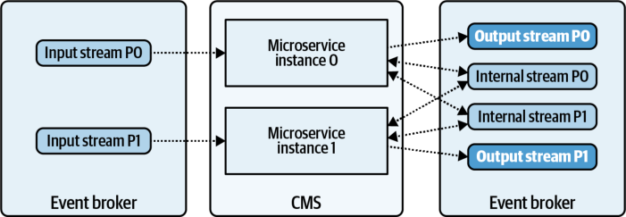
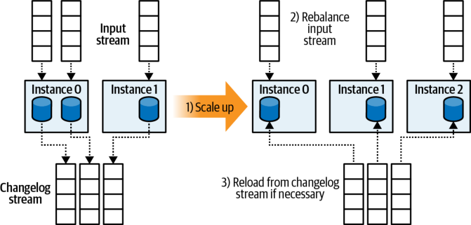
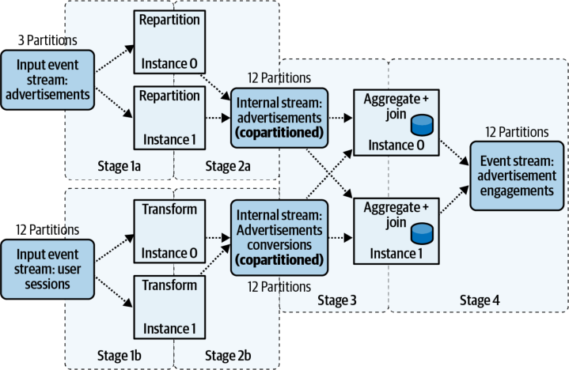

# Chapter 12. Lightweight Framework Microservices

Lightweight frameworks provide similar functionality to heavyweight frameworks, but in a way that heavily leverages the event broker and the container management system (CMS). Unlike heavyweight frameworks, lightweight frameworks have no additional dedicated resource cluster for managing framework-specific resources. Horizonal scaling, state management, and failure recovery are provided by the event broker and the CMS. Applications are deployed as individual microservices, just as any BPC microservice would be deployed. Parallelism is controlled by consumer group membership and partition ownership. Partitions are redistributed as new application instances join and leave the consumer group, including copartitioned assignments. 

## Benefits and Limitations

Lightweight frameworks offer stream processing features that rival those of heavyweight frameworks, and in a number of cases, exceed them. Materialization of streams into tables, along with simple out-of-the-box join functionality, makes it easy to handle streams and the relational data that inevitably ends up in them. Note that while table materializing functionality is not unique to lightweight frameworks, its ready inclusion and ease of use are indicative of the complex stateful problems that lightweight frameworks can address. 

The lightweight model relies upon the event broker to provide the mechanisms for data locality and copartitioning through the use of internal event streams. The event broker also acts as the mechanism of durable storage for a microservice’s internal state via the use of changelogs, as discussed in “Recording State to a Changelog Event Stream” on page 112. By leveraging the CMS, you deploy lightweight microservices like any other event-driven application. You handle application parallelism simply by adding and removing instances, using the CMS to provide the scaling and failure 


management mechanisms. Figure 12-1 illustrates the basic lightweight model, including an internal event stream used to communicate between instances. 





_Figure 12-1. The lightweight framework model, showcasing the usage of internal event streams for repartitioning data_ 

The main limitations for lightweight frameworks relate mostly to the currently available options, covered later in this chapter. 

## Lightweight Processing

The lightweight framework closely mirrors the processing methodology of the heavyweight framework. Individual instances process events according to the topology, with the event broker providing an inter-instance communication layer for scalability beyond a single instance. 

Data of the same key must be local to a given processing instance for any key-based operations, such as a `join` , or a `groupByKey` operation followed by a subsequent `reduce` / `aggregation` . These shuffles involve sending the events through an internal event stream, with each event of a given key written into a single partition (see “Copartitioning Event Streams” on page 83), instead of using direct instance-toinstance communication. 

The lightweight framework leverages the event broker to provide this communication path and illustrates the deeper integration of the lightweight application with the event broker. Contrast this with the heavyweight framework, where shuffling requires extensive coordination directly between the nodes. When combined with application management options provided by the CMS, the lightweight framework is much more aligned than the heavyweight framework with the application deployment and management required of modern-day microservices. 


## Handling State and Using Changelogs

The default mode of operation for lightweight frameworks is to use internal state backed by changelogs stored in the event broker. Using internal state allows for each microservice to control the resources it acquires using deployment configurations. 


Since every lightweight application is fully independent of the others, one application could request to run on instances with very high-performance local disk, while another could request to run on instances with extremely large, albeit perhaps much slower, harddisk drives. 

Different storage engines can also be plugged in, allowing you to use external state stores with alternative models and querying engines. This reaps all the benefits of the lightweight framework functionality, while also enabling options such as graph databases and document stores. 

In contrast to the checkpoint model of the heavyweight frameworks, lightweight frameworks using internal state stores leverage the event broker to store their changelogs. These changelogs provide the durability required for both scaling and failure recovery. 

## Scaling Applications and Recovering from Failures

Scaling a microservice and recovering from failures are effectively the same process. Adding an application instance, due to intentional scaling of a long-running process or due to a failed instance recovering, requires that partitions be correctly assigned alongside any accompanying state. Similarly, removing an instance, deliberately or due to failure, requires that partition assignments and state be reassigned to another live instance so that processing can continue uninterrupted. 

One of the main benefits of the lightweight framework model is that applications can be dynamically scaled as they are under execution. There is no need to restart an application just to change parallelism, though there may be a delay in processing due to consumer group rebalancing and rematerialization of state from the changelog. Figure 12-2 illustrates the process of scaling an application up. The assigned input partitions are rebalanced (including any internal streams) and the state is restored from the changelogs prior to continuation of work. 





_Figure 12-2. Scaling up a lightweight microservice_ 

Let’s look at the main considerations of scaling a lightweight application. 

### Event Shuffling

Event shuffling in lightweight framework microservices is simple, as events are repartitioned into an internal event stream for downstream consumption. This internal event stream isolates the upstream instances that create the shuffled events from the downstream ones that consume them, acting as a shuffle service similar to that required by heavyweight frameworks to perform dynamic scaling. Any dynamic scaling requires only that the consumers be reassigned to the internal event stream, regardless of the producers. 

### State Assignment

Upon scaling, an instance with new internal state assignments must load the data from the changelog before processing any new events. This process is similar to how checkpoints are loaded from durable storage in heavyweight solutions. The operator state (the mappings of `<partitionId, offset>` ) for all event stream partitions, both input and internal, is stored within the consumer group for the individual application. The keyed state (pairs of `<key, state>` ) is stored within the changelog for each state store in the application. 

When reloading from a changelog, the application instance must prioritize consumption and loading of all internal stateful data prior to processing any new events. This is the state restoration phase, and any processing of events before state is fully restored risks creating nondeterministic results. Once state has been fully restored for each state store within the application topology, consumption of both input and internal streams may be safely resumed. 


### State Replication and Hot Replicas

A hot replica, as introduced in “Using hot replicas” on page 116, is a copy of a state store materialized off of the changelog. It provides a standby fallback for when the primary instance serving that data fails, but can also be used to gracefully scale down stateful applications. When an instance is terminated and a consumer group is rebalanced, partitions can be assigned to leverage the hot replica’s state and continue processing without interruption. Hot replicas allow you to maintain high availability during scaling and failures, but they do come at the cost of additional disk and processor usage. 

Similarly, you can use hot replicas to seamlessly scale up the instance count without having to suffer through processing pauses due to state rematerialization on the new node. One of the current issues facing lightweight frameworks is that scaling an instance up typically follows the current workflow: 

1. Start a new instance. 

2. Join the consumer group and rebalance partition ownership. 

3. Pause while state is materialized from the changelog (this can take some time). 

4. Resume processing. 

One option is to populate a replica of the state on the new instance, wait until it’s caught up to the head of the changelog, and then rebalance to assign it ownership of the input partitions. This mode reduces outages due to materializing the changelog streams and only requires extra bandwidth from the event broker to do so. This functionality is currently under development for Kafka Streams. 

## Choosing a Lightweight Framework

Currently, there are two main options that fit the lightweight framework model, both of which require the use of the Apache Kafka event broker. Both frameworks provide indefinitely retained materialized streams in their high-level APIs, unlocking options such as primary-key joins and foreign-key joins. These join patterns permit you to handle relational data without having to materialize to external state stores and therefore reduce the cognitive overhead of writing join-based applications. 

### Apache Kafka Streams

Kafka Streams is a feature-rich stream processing library that is embedded within an individual application, where the input and output events are stored in the Kafka cluster. It combines the simplicity of writing and deploying standard JVM-based applications with a powerful stream-processing framework leveraging deep integration with the Kafka cluster. 


### Apache Samza: Embedded Mode

Samza offers many of the same features as Kafka Streams, though it lags behind in some features related to independent deployment. Samza predates Kafka Streams, and its original deployment model is based on using a heavyweight cluster. It is only relatively recently that Samza released an embedded mode, which closely mirrors Kafka Streams’ application writing, deployment, and management lifecycle. 

Samza’s embedded mode allows you to embed this functionality within individual applications, just like any other Java library. This deployment mode removes the need for a dedicated heavyweight cluster, instead relying on the lightweight framework model discussed in the previous section. By default, Samza does rely on using Apache Zookeeper for coordination across individual instances, but you can modify this to use other coordination mechanisms such as Kubernetes. 


**Apache Samza’s embedded mode may not provide all of the functionality that it has in cluster mode.** 

Lightweight frameworks are not as common as heavyweight frameworks or consumer/producer libraries for the basic consumer/producer pattern. Lightweight frameworks do rely extensively on integration with the event broker, which limits their portability to other event broker technologies. The lightweight framework domain is still fairly young, but is sure to grow and develop as the EDM space matures. 

## Languages and Syntax

Both Kafka Streams and Samza are based in Java, which limits their use to JVM-based languages. The high-level APIs are expressed as a form of MapReduce syntax, as is the case in the lengthier heavyweight framework languages. Those who are experienced with functional programming, or any of the heavyweight frameworks discussed in the previous chapter, will feel right at home using either of these frameworks. 

Apache Samza supports a SQL-like language out of the box, though its functionality is currently limited to simple stateless queries. Kafka Streams doesn’t have first-party SQL support, though its enterprise sponsor, Confluent, provides KSQL under its own community license. Much like the heavyweight solutions, these SQL solutions are wrappers on top of the underlying stream libraries and may not provide the entirety of functions and features that would otherwise be available from the stream libraries directly. 


## Stream-Table-Table Join: Enrichment Pattern

Say you are working for the same large-scale advertising company as in “Example: Session Windowing of Clicks and Views” on page 194, but you are a downstream consumer of the session windows. As a quick reminder, the format of the windowed session events is shown in Table 12-1. 

_Table 12-1. Advertisement-Sessions stream key/value definitions_ 

|**Key**|**Value**|
|---|---|
|`WindowKey<Window windowId, String userId>`|`Action[] sequentialUserActions`|


Here, an action constitutes the following: 

```
Action {
  Long eventTime;
  Long advertisementId;
  Enum action; //one of Click, View
}
```

Your team’s goal is to take the `Advertisement-Sessions` stream and do the following: 

1. For each advertisement view action, determine if there is a click that comes after it. Sum each view-click pair and output as a conversion event, as formatted by Table 12-2: 

_Table 12-2. Advertisement-Conversions stream key/value definitions_ 

|**Key**|**Value**|
|---|---|
|`Long advertisementId`|`Long conversionSum`|


2. Group all of the advertisement conversion events by `advertisementId` , and sum their values into a grand total. 

3. Join all conversion events by `advertisementId` on the materialized advertisement entity stream so that your service can determine which customer owns the advertisement for billing purposes, as shown in Table 12-3: 

_Table 12-3. Advertisement entity stream key/value definitions_ 

|**Key**|**Value**|
|---|---|
|`Long advertisementId`|`Advertisement<String name, String address, …>`|


**Stream-Table-Table Join: Enrichment Pattern | 205** 


Here’s an example of some Kafka Streams source code that you could expect to see for this operation. A KStream is the high-level abstraction of a stream, while a KTable is a high-level abstraction of a table, generated by materializing the advertisement entity stream. 

```
KStream<WindowKey,Actions>userSessions=...
```

```
//Transform 1 userSession into 1 to N conversion events, rekey on AdvertisementId
KTable<AdvertisementId,Long>conversions=userSessions
.transform(...)//transform userSessions into conversion events
.groupByKey()
```

```
.aggregate(...)//Creates an aggregate KTable
```

```
//Materialize the advertisement entities
KTable<AdvertisementId,Advertisement>advertisements=...
```

```
//The tables are automatically co-partitioned by including
//the join operation in the topology.
conversions
.join(advertisements,joinFunc)//See stage 4 for more details.
```

```
.to("AdvertisementEngagements")
```

The topology represented by the code is as follows, illustrated in Figure 12-3. 





_Figure 12-3. Processing topology for advertising engagement-sessions_ 


**Stage 1a and 2a** 

The `Advertisement-Sessions` stream contains too many events for a single instance to process, so the code needs to parallelize using multiple processing instances. In this example, the maximum level of parallelization is initially 3, as that is the partition count of the `Advertisements` entity stream. During off-peak hours it may be possible to just use one or two instances, but during periods of heavy user activity the application will fall behind. 

Fortunately, the `Advertisements` entity stream can be repartitioned up to a matching 12 partitions by means of an internal stream. The events are simply consumed and repartitioned into a new 12-partition internal stream. The advertisement entities are colocated based on `advertisementId` with the conversion events from stages 1b and 2b. 

**Stage 1b and 2b** 

Events are consumed from the `Advertisement-Sessions` event stream, with conversion events tabulated and emitted (key = `Long advertisementId` , value = `Long conversionSum` ). Note that for a given session event there can be multiple conversion events created, one for each pair of view-click events per `advertise mentId` . These events are colocated based on `advertisementId` with the advertisement entities from stages 1a and 2a. 

**Stage 3** 

The `Advertisement-Conversions` events must now be aggregated into the materialized table format shown in Table 12-4, since the business is interested in keeping an indefinitely retained record of the engagements with each `Advertisement` entity. The aggregation is a simple sum of all values for a given `advertisementId` . 

_Table 12-4. Total-Advertisement-Conversions stream key/value definition_ 

|**Long advertisementId**|**Long conversionSum**|
|---|---|
|`AdKey1`|`402`|
|`AdKey2`|`600`|
|`AdKey3`|`38`|


Thus, a new `Advertisement-Conversions` event of key `(AdKey1, 15)` processed by this aggregation operator would increment the internal state store value of `AdKey1` from `402` to `417` . 

**Stage 4** 

The last step of this topology is to join the materialized `Total-AdvertisementConversions` table created in stage 3 with the repartitioned `Advertisement` entity stream. You’ve already established the groundwork for this join by copartitioning 

**Stream-Table-Table Join: Enrichment Pattern | 207** 


the input streams in stages 2a and 2b, ensuring that all `advertisementId` data is local to its processing instance. The entities in the `Advertisement` stream are materialized into their own partition-local state stores and subsequently joined with the `Total-Advertisement-Conversions` . 

A _join function_ is used to specify the desired results from the join, much like a `select` statement is used in SQL to select only the fields that the application requires. A Java join function for this scenario may look something like this: 

```
publicEnrichedAdjoinFunction(Longsum,Advertisementad){
if(sum!=null||ad!=null)
returnnewEnrichedAd(sum,ad.name,ad.type);
else
//Return a tombstone, as one of the inputs is null,
//possibly indicating a deletion.
returnnull;
}
```

The preceding `joinFunction` assumes that either input may be null, indicating an upstream deletion of that event. Accordingly, you need to ensure that your code outputs a corresponding tombstone downstream to its consumers. Thankfully, most frameworks (both lightweight and heavyweight) differentiate between inner, left, right, outer, and foreign-key joins, and do some behind-the-scenes operations to save you from propagating tombstones through your join functions. However, for the purposes of instruction, it’s important that you consider the effects of tombstone events in your microservice topology. 

The Kafka Streams topology and `joinFunction` is identical to the selection expression in SQL: 

```
SELECTadConversionSumTable.sum, adTable.name, adTable.type
FROMadConversionSumTableFULLOUTERJOINadTable
ONadConversionSumTable.id=adTable.id
```

In this case, the materialized view of the `Enriched-Advertising-Engagements` output event stream looks like Table 12-5. 

_Table 12-5. Enriched-Advertising-Engagements stream key/value definitions_ 

|**AdvertisementId (Key)**|**Enriched advertisements (value)**|
|---|---|
|`AdKey1`|`sum=402, name="Josh’s Gerbils", type="Pets"`|
|`AdKey2`|`sum=600, name="David’s Ducks", type="Pets"`|
|`AdKey3`|`sum=38, name="Andrew’s Anvils", type="Metalworking"`|
|`AdKey4`|`sum=10, name="Gary’s Grahams", type="Food"`|
|`AdKey5`|`sum=10, name=null, type=null`|


This sample table shows the expected aggregations from stage 3, joined with the `Advertising` entity data. `AdKey4` and `AdKey5` each show the results of a full outer join: no conversions have yet occurred for `AdKey4` , while there is no advertising entity data yet available for `AdKey5` . 


Check your documentation to validate which types of joins are available for your framework. Kafka Streams supports foreign-key table-table joins, which can be extremely useful for handling relational event data. 

## Summary

This chapter introduced lightweight stream processing frameworks, including their major benefits and tradeoffs. These are highly scalable processing frameworks that rely extensively on integration with the event broker to perform large-scale data processing. Heavy integration with the container management system provides the scalability requirements for each individual microservice. 

Lightweight frameworks are still relatively new compared to heavyweight frameworks. However, the features they provide tend to be well suited for building longrunning, independent, stateful microservices, and are certainly worth exploring for your own business use cases. 
