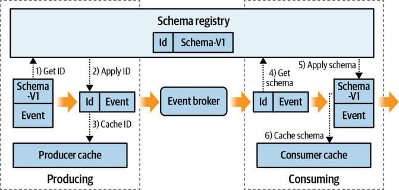
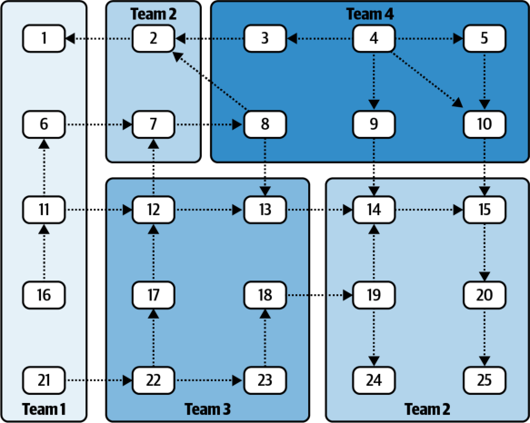
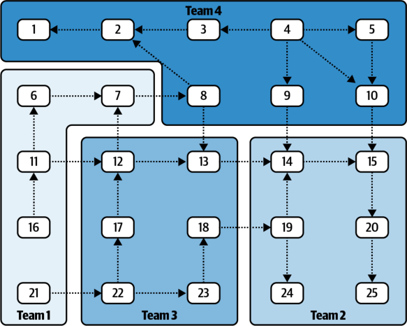

# Chapter 14. Supportive Tooling

Supportive tooling enables you to efficiently manage event-driven microservices at scale. While many of these tools can be provided by command-line interfaces executed by administrators, it is best to have a gamut of self-serve tools. These provide the DevOps capabilities that are essential for ensuring a scalable and elastic business structure. The tools covered in this chapter are by no means the only ones available, but they are tools that I and others have found useful in our experience. Your organization will need to decide what to adopt for its own use cases. 

Unfortunately, there is a dearth of freely available open source tooling for managing event-driven microservices. Where applicable, I have listed specific implementations that are available, but many of them have been privately written for the businesses I have worked for. You will likely need to write your own specific tools, but I encourage you to use open source tooling when available and to contribute back to it when possible. 

## Microservice-to-Team Assignment System

When a company has a small number of systems, it’s easy to use tribal knowledge or informal methods to keep track of who owns which systems. In the microservice world, however, it is important to explicitly track ownership of microservice implementations and event streams. By following the single writer principle (see “Microservice Single Writer Principle” on page 28), you can attribute event stream ownership back to the microservice that owns the write permissions. 

You can use a simple microservice developed in-house to track and manage all of the dependencies between people, teams, and microservices. This system is the foundation for many of the other tools within this chapter, so I strongly suggest that you look into finding or developing it. Assigning microservice ownership this way helps ensure that fine-grained DevOps permissions are correctly assigned to the teams that need them. 

## Event Stream Creation and Modification

Teams will need the ability to create new event streams and modify them accordingly. Microservices should have the right to automatically create their own internal event streams and have full control over important properties such as the partition count, retention policy, and replication factor. 

For instance, a stream that contains highly important, extremely sensitive data that cannot be lost under any circumstances may have an infinite retention policy and a high replication factor. Alternately, a stream containing a high volume of individually unimportant updates may have a high partition count with a low replication factor and a short retention policy. Upon creating an event stream, it is customary to assign ownership of it to a particular microservice or even an external system. This is covered in the next section. 

## Event Stream Metadata Tagging

One useful technique for assigning ownership is to tag streams with metadata. Then, only teams that own the production rights to a stream can add, modify, or remove metadata tags. Some examples of useful metadata include, but are not limited to, the following: 

**Stream owner (service)** 

The service that owns a stream. This metadata is regularly used when communicating change requests or auditing which streams belong to which services. It adds clarity to ownership and the business communications structure of any microservice or event stream in your organization. 

**Personally identifiable information (PII)** 

Information that requires stricter security handling because it can identify users either directly or indirectly. One of the basic use cases of this metadata is to restrict access to any event stream marked as PII unless the team owning the data explicitly gives approval. 

**Financial information** 

Anything pertaining to money, billing, or other important revenue-generating events. Similar but not identical to PII. 

**Namespace** 

A descriptor aligned with the nested bounded context structures of the business. A stream with a namespace assigned could be hidden from services outside of the namespace, but available for services within the namespace. This helps reduce data discovery overload by concealing inaccessible event streams to a user browsing through available event streams. 

**Deprecation** 

A way of indicating that a stream is outdated or has been superseded for some reason. Tagging an event stream as deprecated allows for grandfathered systems to continue using it while new microservices are blocked from requesting a subscription. This tag is generally used when breaking changes must be made to the data format of an existing event stream. The new events can be put into the new stream, while the old stream is maintained until dependent microservices can be migrated over. Finally, the deprecated event stream owner can be notified when there are no more registered consumers of the deprecated stream, at which point it may be safely deleted. 

**Custom tags** 

Any other metadata that may be suitable to your business can and should be tracked with this tool. Consider which tags may be important to your organization and ensure they are available. 

## Quotas

Quotas are generally established by the event broker at a universal level. For instance, an event broker may be set to allow only 20% of its CPU processing time to go toward serving a single producer or consumer group. This quota prevents accidental denial of service due to an unexpectedly chatty producer or a highly parallelized consumer group beginning from the start of a very large event stream. In general, you want to ensure at the very least that your entire cluster won’t be saturated by one service’s I/O requests. You can simply limit how many resources a consumer or producer can use, resulting in it being throttled. 

You may need to set up quotas at a more granular level, preventing surge-prone systems from being throttled while still ensuring a minimum amount of processing power and network I/O for steady-state consumers. You may want to set up different quotas or remove them entirely for producers producing data from sources outside the event broker cluster. For instance, a producer publishing events based on thirdparty input streams or external synchronous requests may simply end up dropping data or crashing if its production rate is throttled below the incoming message rate. 

## Schema Registry

Explicit schemas provide a strong framework for modeling events. Precise definitions of data, including names, types, defaults, and documentation, provide clarity to both producers and consumers of the event. The _schema registry_ is a service that allows your producers to register the schemas they have used to write the event. This provides several distinct benefits: 

- The event schema does not need to be transported with the event. A simple placeholder ID can be used, significantly reducing bandwidth usage. 

- The schema registry provides the single point of reference for obtaining the schemas for an event. 

- Schemas enable data discovery, particularly with free-text search. 

The workflow for a schema registry is shown in Figure 14-1. 

_Figure 14-1. Schema registry workflow for producing and consuming an event_ 

The producer, upon serializing the event prior to production, registers the schema with the schema registry to obtain the schema’s ID (step 1). It then appends the ID to the serialized event (step 2) and caches the information in the producer cache (step 3) to avoid querying the registry again for that schema. Remember, the producer must complete this process for each event, so eliminating the external query for known event formats is essential. 

The consumer receives the event and gets the schema (step 4) for that specific ID from either its cache or the schema registry. It then swaps the ID out for the schema (step 5) and deserializes the event into the known format. The schema is cached if new (step 6), and the deserialized event can now be used by the consumer’s business logic. At this stage the event could also have schema evolution applied. 

Confluent has provided an excellent implementation of a schema registry for Apache Kafka. It supports Apache Avro, Protobuf, and JSON formats and is freely available for production use. 

Registering the schemas to a dedicated event stream frees the schema registry implementation from having to provide durable storage. This is the design choice Confluent made with its schema registry. 

## Schema Creation and Modification Notifications

Event stream schemas are important in terms of standardizing communication. One issue that can arise, particularly with large numbers of event streams, is that it can be problematic to notify other teams that a schema they depend on has evolved (or will be evolving). This is where schema creation and modification notifications come into play. 

The goal of a notification system is simply to alert consumers when their input schemas have evolved. Access control lists (ACLs, discussed later in this chapter) are a great way to determine which microservice consumes from which event stream and, by association, which schemas it depends on. 

Schema updates can be consumed from the schema stream (if you’re using the Confluent schema registry) and cross-referenced to their associated event streams. From here, the ACLs provide information about which services are consuming which event streams and then notify the corresponding teams that own the services via the microservice-to-team assignment system. 

There are a number of benefits to a notification system. While in a perfect world, every consumer would be able to fully review every upstream change to the schema, a notification system provides a safety net for identifying detrimental or breaking changes before they become a crisis. Lastly, a consumer may want to just follow all publicly available schema changes across a company, allowing them greater insight into the data as new event streams come online. 

## Offset Management

Event-driven microservices require that you manage offsets before they proceed with data processing. In normal operation, the microservice will advance its consumer offset as it processes messages. There are, however, cases where you’ll have to manually adjust the offset. 

**Application reset: Resetting the offset** 

Changing the logic of the microservice may require that you reprocess events from a previous point in time. Usually reprocessing requires starting at the beginning of the stream, but your selection point may vary depending on your service’s needs. 

**Application reset: Advancing the offset** 

Alternately, perhaps your microservice doesn’t need old data and should consume only the newest data. You can reset the application offset to be the latest offset, instead of the earliest. 

**Application recovery: Specifying the offset** 

You may want to reset the offset to a specific point in time. This often comes into play with multicluster failover, where you want to ensure you haven’t missed any messages but don’t want to start at the beginning. One strategy includes resetting the offset to a time _N_ minutes prior to the crash, ensuring that no replicated messages are missed. 

For production-grade DevOps, a team must own the microservice in order to modify its offsets, a feature provided by the microservice-to-team assignment system. 

## Permissions and Access Control Lists for Event Streams

Access control to data is important not only from a business security standpoint, but also as a means of enforcing the single writer principle. Permissions and access control lists ensure that bounded contexts can enforce their boundaries. Access permissions to a given event stream should be granted only by the team that owns the producing microservice, a restriction you can enforce by using the microservice-toteam assignment system. Permissions usually fall into these common categories (depending, of course, on the event broker implementation): READ, WRITE, CREATE, DELETE, MODIFY, and DESCRIBE. 

ACLs rely on individual identification for each consumer and producer. Ensure that you enable and enforce identification for your event broker and services as soon as possible, preferably from day one. Adding identification after the fact is extremely painful, as it requires updating and reviewing every single service that connects to the event broker. 

ACLs enforce bounded contexts. For instance, a microservice should be the only owner of CREATE, WRITE, and READ permissions for its internal and changelog event streams. At no point should a microservice couple on the internal event streams of another microservice. Additionally, this microservice should be the only service assigned WRITE permissions to its output stream, according to the single writer principle. The output streams may be made publicly available such that any other system can consume the data, or it may have restricted access because it contains sensitive financial or PII data or is part of a nested bounded context. 

A typical microservice will be individually assigned a set of permissions following the format shown in Table 14-1. 

_Table 14-1. Typical event stream permissions for a given microservice_ 

|**Component**|**Permissions for microservice**|
|---|---|
|Input event streams|READ|
|Output event streams|CREATE, WRITE (and maybe READ, if used internally)|
|Internal and changelog event streams|CREATE, WRITE, READ|

One particularly helpful feature is to provide individual teams with the means of requesting consumer access for a specific microservice, offloading the responsibilities of access control enforcement to them. Alternately, depending on business requirements and metadata tags, you could centralize this process so that teams go through a security review whenever requesting access to sensitive information. The granting and revoking of permissions can be kept as its own stream of events, providing a durable and immutable record of data access for auditing purposes. 

**Discovering Orphaned Streams and Microservices** 

In the normal course of business growth, new microservices and streams will be created, and deprecated ones will be removed. Cross-referencing the list of access permissions with the existing streams and microservices can help in detecting orphans. If a stream has no consumers, it may be marked for deletion. If the producing microservice of that event stream produces no other data in other event streams under active consumption, it too may be removed. In this way you can leverage the permissions list to keep the event stream and business topology healthy and up to date. 

## State Management and Application Reset

It is common to reset the internal state of the application when changing a stateful application’s implementation. Any changes to the data structures stored in the internal and changelog event streams, as well as any changes to the topology workflow, will require that the streams be deleted and re-created according to the new application. 

Some of the stateful microservice patterns discussed in Chapter 7 use state stores external to the processing node. Depending on the capabilities supported by your company’s microservice platform organization, it may be possible (and is certainly advisable) to reset these external state stores when requested by the microservice owner. For example, if a microservice is using an external state store, such as Amazon’s DynamoDB or Google’s Bigtable, it would be best to purge the associated state when resetting the application. This reduces operational overhead and ensures that any stale or erroneous data is automatically removed. Any external stateful services outside the domain of “officially supported capabilities” will likely need to be manually reset. 

It’s important to note that while this tool should be self-serve, in no way should another team be able to delete the event streams and state owned by another team. Again, I recommend using the microservice-to-team assignment system discussed in this chapter to ensure that an application can be reset only by its owner or an admin. In summary, this tool needs to: 

- Delete a microservice’s internal streams and changelog streams 

- Delete any external state store materializations (if applicable) 

- Reset the consumer group offsets to the beginning for each input stream 

## Consumer Offset Lag Monitoring

Consumer lag is one of the best indicators that an event-driven microservice needs to scale up. You can monitor for this by using a tool that periodically computes the lag of consumer groups in question. Though the mechanism may vary between broker implementations, the definition of lag is the same: the difference in event count between the most recent event and the last processed event for a given microservice consumer group. Basic measurements of lag, such as a threshold measurement, are fairly straightforward and easy to implement. For instance, if a consumer’s offset lag is greater than _N_ events for _M_ minutes, trigger a doubling of consumer processors and rebalance the workload. If the lag is resolved and the number of processors currently running is higher than the minimum required, scale the processor count down. 

Some monitoring systems, such as Burrow for Apache Kafka, consider the history of offset lag when computing the lag state. This approach can be useful in cases where you have a large volume of events entering a stream, such that the amount of lag is only ever at 0 for a split second before the next event arrives. Since lag measurements tend to be periodic in nature, it is possible that the system will always appear to be lagging by a conventional measurement. Therefore, using deviation from historical norms can be a useful mechanism for determining if a system is falling behind or catching up. 

Remember that while microservices should be free to scale up and down as required, generally some form of hysteresis—a tolerance threshold—is used to prevent a system from scaling up and down endlessly. This hysteresis loop needs to be part of the logic that evaluates the signal and can often be accommodated by modern cloud platforms such as AWS CloudWatch and Google Cloud Operations (formerly Stackdriver). 

## Streamlined Microservice Creation Process

Creating a code repository for a new business requirement is a typical task in a microservice environment. Automating this task into a streamlined process will ensure that everything fits together and integrates into the common tooling provided by the capabilities teams. 

Here is a typical microservice creation process: 

1. Create a repository. 

2. Create any necessary integrations with the continuous integration pipeline (discussed in “Continuous Integration, Delivery, and Deployment Systems” on page 275). 

3. Configure any webhooks or other dependencies. 

4. Assign ownership to a team using the microservice-to-team assignment system. 

5. Register for access permissions from input streams. 

6. Create any output streams and apply ownership permissions. 

7. Provide the option for applying a template or code generator to create the skeleton of the microservice. 

Teams will complete this process many times over, so streamlining it in this way will save significant time and effort. The newly automated workflow includes an injection point for up-to-date templates and code generators, ensuring that new projects include the latest supported code and tools instead of simply copying an older project. 

## Container Management Controls

Container management is handled by the container management service (CMS), as discussed in Chapter 2. I recommend exposing certain aspects of the CMS so teams can provide their own DevOps capabilities, such as: 

- Setting environment variables for their microservices 

- Indicating which cluster to run a microservice on (e.g., testing, integration, production) 

- Managing CPU, memory, and disk resources, depending on the needs of their microservices 

- Increasing and decreasing service count manually, or depending on service-level agreements and processing lag 

- Autoscaling on CPU, memory, disk or lag metrics 

The business will need to determine how many container management options should be exposed to developers, versus how many should be managed by a dedicated operations team. This typically depends on the culture of DevOps within the organization. 

## Cluster Creation and Management

Cluster creation and management tends to come up as a company scales around event-driven microservices. Generally speaking, a small to medium-sized company can often get away with using a single event broker cluster for all of its serving needs. However, larger companies often find themselves under pressure to provide multiple clusters for various technical and legal reasons. International companies may need to keep certain data within the country of origin. Data sizes may grow so large that it cannot all be practically kept within a single cluster, despite modern event brokers’ excellent horizontal scaling qualities. Various business units in an organization may require their own clusters for isolation purposes. Perhaps most commonly, data must be replicated across multiple clusters in multiple regions to provide redundancy in case of a total cluster outage. 

Multicluster management, including dynamic cross-region communication and disaster recovery, is a complex topic that could very well fill its own book. It is also highly dependent on the services in question and the prevention and recovery strategies being used. Some businesses, like Capital One, have significant custom libraries and code built around their Apache Kafka implementations to allow for native multicluster replication. As a bank, the company cannot afford to lose any financial transaction events whatsoever. Your needs may vary. For these reasons, this book doesn’t cover multicluster service and data management strategies. 

### Programmatic Bringup of Event Brokers

The team responsible for managing the event broker clusters will often also provide tooling for creating and managing new clusters. That being said, commercial cloud providers are also moving into this domain; for instance, Apache Kafka clusters can now be created on-demand in AWS (as of November 2018), joining a number of other cloud service providers. Different event broker technologies may require varying amounts of work to support and should be examined closely by your domain experts. In either case, the goal is to have an event broker cluster management tool that the entire organization can use to easily create and scale event brokers. 

### Programmatic Bringup of Compute Resources

You’ll often need to bring up a set of compute resources that are independent of all other resources. It is not always necessary to create an entirely new container management service, as usually the existing one can serve multiple namespaces. As with event brokers, cloud computing providers commonly provide hosted services that can give you these capabilities on-demand, such as Google’s and Amazon’s hosted Kubernetes solutions. 

The same technical and legal requirements that apply to event brokers extend to compute resources. Avoid regional failures by distributing processing across data centers, process data locally if it cannot leave the country, and save money by dynamically shifting compute-heavy workloads to cheaper service providers. 

Generally you can use the same continuous integration and continuous delivery (CI and CD) tools to perform this task, but you will need a selection mechanism to determine where to deploy the microservices. Additionally, you will need to ensure that the required event data is available to the compute resources, generally through colocation within the same region or availability zone. Cross-region communication is always possible, but it tends to be expensive and slow. 

### Cross-Cluster Event Data Replication

Replicating event data between clusters is important for scaling up event-driven microservices beyond the confines of a single cluster—examples include for the purposes of disaster recovery, regular cross-cluster communication, and programmatically generated testing environments. 

The specifics of how data is replicated between clusters vary with event broker and replication tool implementations. When selecting a replication tool implementation, consider the following: 

- Does it replicate newly added event streams automatically? 

- How does it handle the replication of deleted or modified event streams? 

- Is the data replicated exactly, with the same offsets, partitions, and timestamps, or approximately? 

- What is the latency in replication? Is it acceptable to the business needs? 

- What are the performance characteristics? Can it scale according to business needs? 

### Programmatic Bringup of Tooling

Last, but certainly not least, the same sets of tools discussed thus far should also be programmatically brought up for new clusters. This provides a common set of tools you can deploy to any cluster deployment without relying on any data stores besides the event broker itself. There are a number of benefits to using tooling in this manner. First, the tooling gets used far more often and helps reveal bugs or necessary features to be added. Second, it lowers the barrier to entry for using new clusters, as users will already be familiar with the tooling interfaces. Lastly, when the cluster is terminated, the tools can be terminated alongside it with no additional cleanup required. 

## Dependency Tracking and Topology Visualization

Tracking the data dependencies between microservices can be extremely useful in helping run an event-driven microservice organization. The only requirement is that the organization must know which microservices are reading and writing to which event streams. To achieve this, it could employ a self-reporting system where consumers and producers report on their own consumption and production patterns. The problem with any sort of self-reporting solution, however, is that it is effectively voluntary, and there will always be a number of teams that forget, opt out, or simply are unwilling to report. Determining dependencies without full compliance is not particularly useful, as gaps in the communication structure and incomplete topologies limit insight. This is where the permissions structure and ACLs discussed earlier in this chapter come into play. 

Leveraging the permissions structure to determine dependencies guarantees two things. First, a microservice cannot operate without registering its permissions requirements, as it would not be able to read from or write to any event streams. Second, if any changes are made to the permissions structure, the associated permissions used to determine dependencies and topology generation are also updated. No other changes are required to ensure proper dependency tracking. 

Here are some other uses of such a tool: 

**Determine data lineage** 

One problem that data scientists and data engineers regularly encounter is how to determine where data came from and which route it took. With a full graph of the permissions structure, they can identify each ancestor service and stream of any given event. This can help them trace bugs and defects back to the source and determine all services involved in a given data transformation. Remember that it is possible to go back in time in the permissions event stream and the microservice-to-team assignment event streams to generate a view of the topology at that point in time. This is often quite useful when you are auditing old data. 

**Overlay team boundaries** 

The teams owning the microservices and streams can be mapped onto the topology. When rendered with a proper visualization tool, the topology will clearly show which teams are directly responsible for which services. 

**Discover data sources** 

Visualizers are a useful tool for data discovery. A prospective consumer can see which streams are available and who their producers and consumers are. If more information is needed about the stream data, the prospective consumer can contact the producers. 

**Measure interconnectedness and complexity** 

Just as it is ideal for microservices to be highly cohesive and loosely coupled, so too it is for teams. With this tooling in place, a team can measure how many internal connections between microservices and how many cross-boundary connections it has. A general rule of thumb is that the fewer external connections, the better; but a simple count of connections is a very basic metric. However, even a consistent application of a basic metric can reveal the relative interdependence between teams. 

**Map business requirements to microservices** 

Aligning microservices along business requirements enables a mapping of implementation to business requirement. It is reasonable to explicitly state each microservice’s business requirements alongside its code, perhaps in the repository _README_ or in the microservice metadata store. In turn, this can be mapped to the owning teams. 

A business owner could look at this overlay and ask themselves, “Does this implementation structure align with the goals and priorities of this team?” This is one of the most important tools a business can have at its disposal to ensure that its technical teams are aligned with the business communication structure. 

### Topology Example

Figure 14-2 shows a topology with 25 microservices, overlaid with the ownership of four teams. For purposes of clarity, each arrow represents the production of data to an event stream as well as consumption by the consuming process. Thus, microservice 3 is consuming a stream of data from microservice 4. 

_Figure 14-2. Topology map of service connections_ 

The mapping shows that team 2 is responsible for two microservices that are not part of its main bounded context (bottom right). This may be of concern if the business goals of team 2 do not align with the functions being served by microservices 2 and 7. Additionally, both microservices 2 and 7 have a number of dependencies on teams 1, 3, and 4, which increases the “surface area” that team 2 exposes to the outside world. A measure of interconnectedness is shown in Table 14-2. 

_Table 14-2. Topology graph measure of interconnectedness_ 

|||**Incoming**|**Outgoing**|**Incoming team**|**Outgoing team**|**Services**|
|---|---|---|---|---|---|---|
|||**streams**|**streams**|**connections**|**connections**|**owned**|
|Team|1|1|3|1 (Team 2)|2 (Teams 2,3)|5|
|Team|2|8|2|3 (Teams 1,3,4)|2 (Teams 1,4)|8|
|Team|3|3|3|2 (Teams 1,4)|1 (Team 2)|6|
|Team|4|1|5|1 (Team 1)|2 (Teams 2,3)|8|

Let’s see what happens if we reduce the number of interteam connections and the number of incoming and outgoing streams at the team boundary. Microservices 2 and 7 are good candidates for being reassigned simply due to their ownership island in the topology, and can be reassigned to reduce the number of cross-team dependencies. Microservice 7 can be assigned to team 1 (or to team 3), and microservice 2 can be assigned to team 4. It is also more apparent now that microservice 1 may also be assigned to team 4 to further reduce the cross-boundary communication. This result is shown in Figure 14-3 and Table 14-3. 

_Figure 14-3. Topology map of service connections after reassignment of microservices_ 

_Table 14-3. New measure of interconnectedness; differences are shown in brackets_ 

|||**Incoming**|**Outgoing**|**Incoming team**|**Outgoing team**|**Services**|
|---|---|---|---|---|---|---|
|||**streams**|**streams**|**connections**|**connections**|**owned**|
|Team|1|1|3|1 (Team 3)|1 (Team 3) (–1)|5|
|Team|2|4 (–4)|0 (–2)|2 (Teams 3,4) (–1)|0 (–2)|6 (–2)|
|Team|3|3|3|2 (Teams 1,4)|2 (Teams 1,2) (+1)|6|
|Team|4|1|3 (–2)|1 (Team 1)|2 (Teams 3,4)|8 (+2)|

Computing the cross-boundary dependencies has a positive result: cross-team incoming and outgoing stream counts are reduced, with a net decrease of three connections between teams. Minimizing the number of cross-boundary connections helps optimize the assignment of microservices to teams. This is not sufficient, however, for determining the assignment of microservices to a team. You must also take into account a variety of factors, such as the team’s head count, areas of expertise, and implementation complexities. 

Most importantly of all, though, you must account for the business functions that a microservice is performing. Consider a scenario where one team produces a whole host of event data, perhaps consumed from a number of external sources. It could be that the business responsibility of that team is limited simply to sourcing and organizing the data into events, with business logic being performed downstream by other consumers. In this case, the team would have many stream connections and team connections. This is where it is useful to be able to view the business functions associated with the microservices owned by the team. 

In the preceding example, there are a number of questions worth asking. For one, do the business function implementations of microservice 2 align closer to the goals of team 2 or team 4? What about microservice 7: is it aligned closer with team 1’s goals than team 2’s? And in general, which services align best with which team? These answers tend to be lucrative and must be carefully evaluated against the goals of the team. It is natural that team goals change as business needs evolve, and it is important to ensure that the microservices assigned to those teams align with the overarching business goals. This tooling provides insight into these allocations and helps provide clarity to business owners. 

## Summary

Having multiple autonomous services requires that you carefully consider how you’re going to manage these systems. The tools described in this chapter are designed to help your organization manage its services. 

As the number of services increases, the ability of any one person to know how everything works and how each service and stream fit into the big picture diminishes. Keeping explicit track of properties such as service and stream ownership, schemas, and metadata allows organizations to organize and track change across time. Reducing tribal knowledge and formally codifying otherwise simple stream and service properties should be priorities for your organization. After all, any ambiguity around the properties of a service or stream will be amplified for each additional instance created. 

Autonomy and control over your team’s services are important aspects of managing microservices at scale. In accordance with DevOps principles, you should be able to reset consumer group offsets and microservice state stores. 

Schemas foster a common understanding of the meaning of events. The schema registry provides a mechanism for streamlining schema management and can be used to notify interested parties about any changes to a particular schema. 
