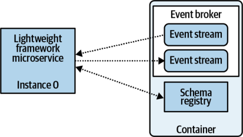
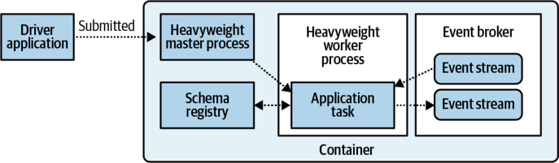

# **CHAPTER 15** 

# **Testing Event-Driven Microservices** 

One of the great things about testing event-driven microservices is that they’re very modular. Input to the service is provided by event streams or by requests from a request-response API. State is materialized to its own independent state store, and output events are written to a service’s output streams. Microservices’ small and purpose-built nature make them far easier to test than larger and more complex services. There are fewer moving parts, a relatively standard methodology of handling I/O and state, and plenty of opportunity to reuse testing tooling with other microservices. This chapter covers testing principles and strategies, including unit testing, integration testing, and performance testing. 

# **General Testing Principles** 

Event-driven microservices share the testing best practices that are common to all applications. _Functional_ testing, such as unit, integration, system, and regression testing, ensures that the microservice does what it is supposed to and that it doesn’t do what it should not do. _Nonfunctional_ testing, such as performance, load, stress, and recovery testing, ensures that it behaves as expected under various environmental scenarios. 

Now, before going much further, it’s important to note that this chapter is meant to be a companion to more extensive works on the principles and how-tos of testing. After all, many books, blogs, and documents have been written on testing, and I certainly can’t cover testing to the extent that they do. This chapter primarily looks at eventdriven-specific testing methodologies and principles and how they integrate into the overall testing picture. Consult your own sources on language-specific testing frameworks and testing best practices to complement this chapter. 


# **Unit-Testing Topology Functions** 

Unit tests are used to test the smallest pieces of code in an application to ensure that they work as expected. These small testing units provide a foundation for which larger, more comprehensive tests can be written to test higher functionality of the application. Event-driven topologies often apply transformation, aggregation, mapping, and reduction functions to events, making these functions ideal candidates for unit testing. 


Make sure to test boundary conditions, such as null and maximum values, for each of your functions. 

# **Stateless Functions** 

Stateless functions do not require any persistent state from previous function calls, and so are quite easy to test independently. The following code shows an example of an EDM topology similar to one that you would find in a map-reduce-style framework: 

```
myInputStream
.filter(myFilterFunction)
.map(myMapFunction)
.to(outputStream)
```

`myMapFunction` and `myFilterFunction` are independent functions, neither of which keeps state. Each function should be unit-tested to ensure that it correctly handles the range of expected input data, particularly corner cases. 

# **Stateful Functions** 

Stateful functions are generally more complicated to test than stateless ones. State can vary with both time and input events, so you must take care to test all of the necessary stateful edge cases. Stateful unit testing also requires that persistent state, whether in the form of a mocked external data store or a temporary internal data store, is available for the duration of the test. 

Here is an example of a stateful aggregation function that might be found in a basic producer-consumer implementation: 


```
publicLongaddValueToAggregation(Stringkey,LongeventValue){
```

- _`//The data store needs to be made available to the unit-test environment`_ `Long storedValue = datastore.getOrElse(key, 0L);` 

```
//Sum the values and load them back into the state store
Longsum=storedValue+eventValue;
datastore.upsert(key,sum);
returnsum;
}
```

This function is used to sum all `eventValue` s for each key. Mocking the endpoint is one way of providing a reliable implementation of the data store for the duration of the test. Another option is creating a locally available version of the data store, though this is more akin to integration testing, which will be covered in more detail shortly. In either case, you must carefully consider what this data store needs to do and how it relates to the actual implementation used at runtime. Mocking tends to work well, because it allows for very high-performance unit testing that isn’t burdened by the overhead of spinning up a full implementation of the data store. 

# **Testing the Topology** 

The full-featured lightweight and heavyweight frameworks typically provide the means to locally test your entire topology. If your framework does not, the community of users and contributors may have created a third-party option that provides this functionality (this is another reason to choose a framework with a strong community). For example, Apache Spark has two separate third-party options for unit tests, `StreamingSuiteBase` and spark-fast-tests, in addition to providing a built-in `MemoryStream` class for fine-grained control over stream input and output. Apache Flink provides its own topology testing options, as does Apache Beam. As for lightweight stream frameworks, Kafka Streams provides the means to test topologies using the `TopologyTestDriver` , which mocks out the functionality of the framework without requiring you to set up an entire event broker. 

Topology testing is more complex than a single unit test and exercises the entire topology as specified by your business logic. You can think of your topology as a single, large, complex function with many moving parts. The topology testing frameworks allow you to fully control _which_ events are produced to the input streams as well as _when_ they are created. You can generate events with specific values; events that are out of order, contain invalid timestamps, or include invalid data; and events that are used to exercise corner-case logic. By doing so, you can ensure that operations such as time-based aggregations, event scheduling, and stateful functions perform as expected. 


For example, consider the following map-reduce-style topology definition: 

```
myInputStream
.map(myMapFunction)
.groupByKey()
.reduce(myReduceFunction)
```

In this topology, consumed events are represented by the variable `myInputStream` . A mapping function is applied, the results are grouped together by key, and then finally they are reduced into a single event per key. While unit tests can be implemented for `myMapFunction` and `myReduceFunction` , they can’t easily reproduce the framework operations of `map` , `groupByKey` , and `reduce` , as these operations (among others) are inherently part of the framework. 

This is where topology testing comes into play. Each stream framework has varying levels of support for testing the topology, and you must explore the options available to you. These testing frameworks _do not_ require you to create an event broker to hold input events or to set up a heavyweight framework cluster for processing. 

# **Testing Schema Evolution and Compatibility** 

To ensure that any output schemas are compatible with previous schemas according to any event stream schema evolutionary rules (see “Full-Featured Schema Evolution” on page 41), you can pull in the schemas from the schema registry and perform evolutionary rule checking as part of the code submission process. Some applications may use schema-generating tools to automatically generate the schemas from the classes or structs defined in the code at compile time, resulting in a programmatically generated schema that can be compared to previous versions. 

# **Integration Testing of Event-Driven Microservices** 

Microservice integration testing comes in two main flavors: _local_ integration testing, where testing is performed on a localized replica of the production environment, and _remote_ integration testing, where the microservice is executed on an environment external to the local system. Each of these solutions has a number of advantages and disadvantages, which we will explore shortly. 

A third flavor is a hybrid option, where certain parts of your microservice and its test environment are hosted or executed locally and others done remotely. Since it’s technically impossible to evaluate all combinations and permutations of this hybrid pattern, I’ll just focus on the two main cases and leave it up to you to determine your own requirements should they differ. 


There are several overarching questions that you should keep in mind for the remainder of this chapter: 

- What are you hoping to get out of your integration testing? Is it as simple as “does this run?” Is it a smoke test with production data? Or are there more complex workflows that need to be tested and validated? 

- Does your microservice need to support restarting from the beginning of input stream time, as in the case of full data loss or reprocessing due to a bug? If so, what do you need to know to test if this functionality works as expected? You may also need to validate that your input event streams are capable of supporting this requirement. 

- What data do you need to determine success or failure? Is manually crafted event data sufficient? Programmatically created? Does it need to be real production data? If so, how much? 

- Do you have any performance, load, throughput, or scaling concerns that need to be tested? 

- How will you go about ensuring that each microservice you build doesn’t require a full home-grown solution to integration testing? 

The next sections will help you understand some of the options available to you, so you can formulate your own answers to these questions. 

# **Local Integration Testing** 

Local integration testing allows for a significant range of functional and nonfunctional testing. This form of testing uses a local copy of the production environment where the microservice will be deployed. At a minimum this means creating an event broker, schema registry, any microservice-specific data stores, the microservice itself, and any required processing framework, such as when you are using a heavyweight framework or FaaS. You could also introduce containerization, logging, and even the container management system, but they are not strictly related to the business logic of the microservice and so are not absolutely necessary. 

The biggest benefit of spinning up your own locally controllable environment is that you get to control each system independently. You can programmatically create scenarios that replicate actual production situations, such as intermittent failures, outof-order events, and loss of network access. You also get to test the integration of the framework with your business logic. Local integration testing also provides the means to test the basic functionality of horizontal scaling, particularly where copartitioning and state are concerned. 


Another significant benefit of local integration testing is that you can effectively test both event-driven and request-response logic at the same time, in the same workflows. You have full control over when events are injected into the input streams, and can issue requests at any point before, during, or after the events have been processed. It may be helpful to think of the request-response API as just another source of events for the purposes of testing your microservice. 

Let’s take a look at some of the options provided by each system component. 

# _The event broker_ 

- Create and delete event streams 

- Apply selective event ordering for input streams to exercise time-based logic, out-of-order events, and upstream producer failures 

- Modify partition counts 

- Induce broker failures and recovery 

- Induce event stream availability failures and recovery 

# _The schema registry_ 

- Publish evolutionary-compatible schemas for a given event stream and use them to produce input events 

- Induce failures and recovery 

# _The data stores_ 

- Make schema changes to existing tables (if applicable) 

- Make changes to stored procedures (if applicable) 

- Rebuild internal state (if applicable) when the application instance count is modified 

- Induce failures and recovery 

# _The processing framework (if applicable)_ 

The application and the processing framework are typically intertwined, and you may need to provide a full-framework implementation for testing, as in the case of FaaS and heavyweight framework solutions. The framework provides functionality such as: 

- Shuffling via internal event streams (lightweight) or shuffle mechanism (heavyweight) to ensure proper copartitioning and data locality 

- Checkpointing, failures, and recovery from checkpoints 

- Inducing a worker instance failure to mimic losing an application instance (heavyweight frameworks) 


_The application_ 

Application-level control predominantly involves managing the number of instances running at any given time. Integration testing should include scaling the instance count (dynamically, if supported) to ensure that: 

- Rebalancing occurs as expected 

- Internal state is restored from checkpoints or changelog streams, and data locality is preserved 

- External state access is unaffected 

- Request-response access to the stateful data is unaffected by changes in application instance count 

The point of having full control over all of these systems is to ensure that your microservice will still work as intended through various failure modes, adverse conditions, and with varying processing capacity. 

There are two main ways to perform local integration tests. The first involves embedding testing libraries that can live strictly in your code. These are not available for all microservice solutions and tend to depend heavily on both language and framework support. The second option involves creating a local environment where each of the necessary components is installed and can be controlled as required. We’ll take a look at these first, then follow up by investigating options for testing microservices that rely on hosted services. 

# **Create a Temporary Environment Within the Runtime of Your Test Code** 

Embedding testing libraries into your code is by far the narrowest of the options, though it can work very well depending on how your client, broker, and framework programming language compatibilities line up. In this approach, the test code starts the necessary components within the same executable as the application. 

For example, the test code of a Kafka Streams application starts its own Kafka broker, schema registry, and microservice topology instances. The test code can then start and stop topology instances, publish events, await responses, incur broker outages, and induce other failure modes. Upon termination, all of the components are terminated, and the state is cleaned up. Consider the following pseudocode (declarations and instantiations skipped for brevity): 

```
broker.start(brokerUrl,brokerPort,...);
schemaRegistry.start(schemaRegistryUrl,srPort,...);
//The first instance of the microservice
topologyOne.start(brokerUrl,schemaRegistryUrl,
inputStreamOne,inputStreamTwo...);
```


```
//A second instance of the same microservice
topologyTwo.start(brokerUrl,schemaRegistryUrl,
inputStream,inputStreamTwo,...);
```

```
//Publish some test data to input stream 1
producer.publish(inputStreamOne,...);
//Publish some test data to input stream 2
producer.publish(inputStreamTwo,...);
//Wait a short amount of time. Not the best way to do it, but you get the idea
Thread.sleep(5000);
```

```
//Now mimic topologyOne failing
topologyOne.stop();
//Check the output of the output topic. Is it as expected?
event=consumer.consume(outputTopic,...)
```

```
//Shut down the remaining components if no more testing is to be done
topologyTwo.stop()
schemaRegistry.stop()
broker.stop()
```

```
if(event...)//validate the consumer output
//pass the test if correct
else
//fail the test.
```

Kafka Streams is a particularly relevant example because it illustrates the limited nature of this approach. The application code, the broker, and the Confluent schema registry are all JVM-based, so you need a JVM-based application to programmatically control everything within the same runtime. Other open source heavyweight frameworks may also work, though some extra overhead is required to handle creating both the master instance and the worker instance. Keep in mind that because these heavyweight frameworks are also almost universally JVM-based, this strategy is predominantly a JVM-only approach at the time of this writing. While it is certainly possible to use workarounds to test non-JVM-based applications in this manner, that process is not nearly as simple. 

# **Create a Temporary Environment External to Your Test Code** 

One option for setting up an environment to perform these tests is simply to install and configure all required systems locally. This is a low-overhead approach particularly if you’re just starting out with microservices, but if every teammate must do the same, it becomes expensive and complex to debug if they’re each running slightly different versions. As with most things microservices, it’s often best to avoid duplicating steps and instead provide supportive tooling that eliminates the overhead. 

A more flexible option is to create a single container that has all of the necessary components installed and configured. This container can be used by any team that 


wants to test its application in this way. You can maintain an open source contribution model (even if internal to the organization), allowing fixes, updates, and new features to be added back for the benefit of all teams. This model is flexible enough to be used with any programming language, though it’s far easier to use with a programmatic API that allows for easy communication with the system components in the container. A lightweight processing framework example is shown in Figure 15-1, with the schema registry, event broker, and necessary topics created internally to the container. The microservice instance itself is executed externally to the container, and simply references the addresses of the broker and schema registry from its testing config file. 





_Figure 15-1. Lightweight microservice using containerized testing dependencies for local integration testing_ 

# **Integrate Hosted Services Using Mocking and Simulator Options** 

A local integration testing environment may also need to provide hosted services, such as a hosted event broker, heavyweight framework, or FaaS platform. While some hosted services may have open source options you can run instead (such as open source Kafka instead of hosted Kafka), not all hosted services have these alternatives. For example, Microsoft’s Event Hubs, Google’s PubSub, and Amazon’s Kinesis are all proprietary and closed, with full implementations unavailable for download. In this situation, the best you can do is use whatever emulators, libraries, or components _are_ available from these companies or open source initiatives. 

Google’s PubSub, for example, has an emulator that can provide sufficient local testing functionality, as does an open source version of Kinesis (and many other Amazon services) provided by LocalStack. Unfortunately, Microsoft Azure’s Event Hubs does not currently have an emulator, nor is an implementation of it available in the open source world. Azure Event Hub clients do, however, allow you to use Apache Kafka in its place, though not all features are supported. 

Applications using FaaS platforms can leverage local testing libraries provided by the hosting service. Google Cloud functions can be tested locally, as can Amazon’s 


Lambda functions and Microsoft Azure’s functions. The open source solutions OpenWhisk, OpenFaaS, and Kubeless, as discussed in Chapter 9, provide similar testing mechanisms, which you can find via a quick web search. These options allow you to configure a complete FaaS environment locally, such that you can test on a platform configured to be as similar to production as possible. 

Establishing an integration testing environment for applications using heavyweight frameworks is similar to the process of establishing one for FaaS frameworks. Each requires that the framework be installed and configured, with the application submitting the processing job directly to the framework. With heavyweight frameworks, a typical single-container installation will just need to run the master and worker instances side-by-side along with the event broker and any other dependencies. With the heavyweight framework set up, you simply need to submit the processing job to the master and await test output on the output event streams. An example is illustrated in Figure 15-2, where the entire set of dependencies has been containerized for easy distribution among developers. 





_Figure 15-2. Heavyweight microservice using containerized testing dependencies for local integration testing_ 

# **Integrate Remote Services That Have No Local Options** 

Some services used in production may simply not have any locally available options, and this is a disadvantage for both development and integration testing. A current example is the absence of any emulator for Microsoft Azure’s Event Hub. The lack of a locally available implementation means that remote environments must be provisioned for each developer, in addition to integration testing environments for these applications. This is also where lines can begin to blur, as integration testing up to this point has been primarily about isolating a single application instance in a disposable, easily managed, local environment. The overhead incurred in this scenario can be a real impediment to independent development and integration testing efforts, so be sure to give it careful consideration before moving forward. 


Alleviating this issue generally requires close coordination with infrastructure teams to ensure either that independent testing environments can be independently provisioned via access controls or that a large, common environment can be created for all to use (this has its own issues, as discussed later in the chapter). Security issues may arise from developers having to connect their local staging environment to remote resources. Cleanup and management of the remote staging environment(s) can also become problematic. There are many ways to approach this challenge, but the problems that the situation may pose are too large to comprehensively tackle here. 

The good news is that most of the biggest closed source service providers are making strong efforts to provide local options for development and testing, so in time the forerunners will all have these available. In the meantime, be cautious about your selection of services and consider whether a local option for development and integration testing is available. 

# **Full Remote Integration Testing** 

Full remote integration testing enables you to perform specific tests that are difficult to conduct in local environments. For example, performance and load testing are essential for ensuring that the microservice under test achieves its service-level objectives. Event processing throughput, request-response latency, instance scaling, and failure recovery are all enabled by full integration testing. 


The goal of full integration testing is to create an environment as close to possible as that of production, including event streams, event data volume, event schemas, and request-response patterns (if applicable), in which to run the application. 

Full integration testing is generally done in one of three following ways. You can use a temporary integration environment and discard it once testing is complete. You can use a common testing environment, which persists between integration tests and is used by multiple teams. Finally, you can use the production environment itself for testing. 

# **Programmatically Create a Temporary Integration Testing Environment** 

“Cluster Creation and Management” on page 248 examined the advantages of having programmatically generated event brokers and compute resource managers. You can leverage these tools to generate temporary environments for your integration testing. A separate set of brokers can be created along with individually reserved compute resources to run the containerized microservices under test. One added benefit of using this approach for full integration testing is that it regularly exercises the process 


of creating new brokers and compute environments. This ensures that any breakages that occur in the scripts or any bugs in the configuration will be exposed at the next integration test. 

The next issue in a newly brought-up environment is that it lacks both event streams and event data. These are, of course, both essential for testing your microservice. You can obtain the names of the event streams to create either by directly asking the user or by using a configuration file within the microservice codebase to be accessed by the tooling. The partition count must mirror that of the production system to ensure that the microservice’s scaling, copartitioning, and repartitioning logic is correctly exercised. 

Once the event streams have been generated, the next step is to populate them with events. This can be done using production data, specially curated testing data sets, or ad hoc, programmatically generated data. 

# **Populating with events from production** 

Events can be copied from the production cluster over to the newly created event streams in the testing cluster. This is where the replication tooling described in “Cross-Cluster Event Data Replication” on page 249 comes into play, as this same tooling can be used to replicate specific event streams from production and load the events. You must account for any security and access restrictions that may prevent production from obtaining the data. 

# _Advantages_ 

- It accurately reflects production data. 

- You can copy as many or as few events as required. 

- The fully isolated environment prevents other microservices under test from inadvertently affecting your testing. 

# _Disadvantages_ 

- Copying data may affect production performance unless you have adequately planned and established broker quotas. 

- It may require copying substantial amounts of data, especially in the case of longlived entities. 

- You must account for event streams containing sensitive information. 

- It requires significant investment in streamlining the creation and copying process to reduce barriers to usage. 

- It may expose sensitive production events. 


# **Populating with events from a curated testing source** 

Curated events allow you to use events with specific properties, values, and relationships to other events in integration testing. These events need to be stored somewhere stable and secure, where they can’t be accidentally or inadvertently overwritten, corrupted, or lost. This strategy is often used in _single shared testing environments_ (more on this later), but you can also apply it by loading the events out of a durable data store into the user-specified streams, similar to copying events from production. 

# _Advantages_ 

- It involves a smaller set of data. 

- It’s carefully curated to ensure specific values and relationships. 

- It has no impact on production. 

# _Disadvantages_ 

- There’s significant overhead to maintain. 

- Data can become stale. 

- New event streams must be handled. 

- Schema changes must be handled. 

- Lesser-used event streams may not be available. 

While many of these disadvantages can be mitigated through strict operational processes, this strategy often ends up following the same pathway that documentation tends to at many organizations. It is well intentioned but remains out-of-date, not necessarily relevant, and seemingly always a lower priority than other work. 

# **Creating mock events using schemas** 

Programmatic creation of mock events is another possibility for populating event streams. You can obtain the schema from the schema registry and generate events that adhere to this schema definition. You can even take older versions of that schema and generate events for those too. 

The complexity of this approach comes from ensuring that there are events with the proper relationships to other events, particularly if any of the services are doing joins between streams or aggregations across different types of events. A microservice that joins multiple events together will require that events with matching primary/foreign keys have been created to properly exercise the joining logic of the service. While this is not typically a significant issue (especially since the microservice code expresses _which_ relationships the business logic requires), it does leave it up to the creators of this data to ensure that it is properly scoped and that all data falls into the expected ranges and values. 


# _Advantages_ 

- It doesn’t require the production cluster to provide any data and can’t negatively affect production performance. 

- You can use fuzzing tools to create event data, testing boundary conditions, and other potential malformed and semiformed fields. 

- You can create specific test cases that aren’t available in production data, ensuring corner cases are covered. 

- It allows you to leverage third-party tools for programmatically creating testing data (for example, Confluent Avro tools). 

# _Disadvantages_ 

- It requires much more attention to creating realistic data than other options. 

- The created data is still not fully accurate when compared to the production distribution. For example, production data may have a serious disparity in data volume due to key distribution that doesn’t show up in mock data. 

- The created data may inaccurately represent certain fields. For example, parsing a string field in a particular way for business operations may pass with the created test data, but fail in a subset of production data. 

# **Testing Using a Shared Environment** 

Another option involves creating a single testing environment with a shared pool of event streams all residing within the same event broker. These streams are populated by testing data that represents a subset of production data, or carefully crafted testing data as previously discussed. This option provides a low-overhead a testing environment, but offloads the management of the event streams and the data onto the application developers. 

# _Advantages_ 

- It’s easy to get started. 

- You only need to maintain infrastructure for one testing environment. 

- It is isolated from production workloads. 

# _Disadvantages_ 

- It is subject to the “tragedy of the commons.” Fragmented and abandoned event streams can make it difficult to distinguish which streams are valid for testing input and which are simply the output of previous tests that were not cleaned up. 

- Systems under test are not necessarily isolated. For example, services running simultaneous large-scale performance testing can affect each other’s results. 

- Incompatible events may be produced to other services’ input event streams. 


- Event stream data inevitably becomes stale and must be updated with newer events. 

- It inaccurately represents the entire range of events found in production. 


This strategy is the worst of the options in terms of usability, as the event broker eventually becomes a dumping ground of confusing event streams and broken data. 

Isolation from other application testing is difficult to achieve, particularly as the output stream of one microservice is usually the input to another service. Careful curation of data streams, strict naming conventions, and restrictions to writing to event streams can help mitigate the disadvantages, but environment maintainers and users will need to exercise diligence and discipline. 

# **Testing Using the Production Environment** 

You can also test microservices in the production environment (note: be careful). The microservice can be spun up, consume from its input event streams, apply business logic, and produce output. The most common approach is to have the microservice use its own designated output event streams and state stores, such that it doesn’t affect the existing production systems. This is particularly important when a previous version of the same microservice is running alongside the new one under test. 

# _Advantages_ 

- You have complete access to production events. 

- It leverages production security models to ensure proper access protocols are followed. 

- It is excellent for smoke-testing an application. 

- You do not need to maintain a separate testing environment. 

# _Disadvantages_ 

- There’s a risk of affecting production capacity, especially if workload is high. It’s not suitable for load and performance testing. 

- You must carefully clean up any resources created during testing, such as event streams, consumer groups, access control permissions, and state stores. This is similar to the requirements for the common staging environment option. 

- It requires tooling support to keep microservices and event streams under test separate from “true production” microservices, particularly when you are testing over a long period of time. This includes the resources used to manage and deploy microservices, as each observer to the production environment must be 


able to identify which services are the true production ones and which are those under test. 

# **Choosing Your Full-Remote Integration Testing Strategy** 

The nice thing about the modularity of microservices is that you don’t have to choose just one way to perform your tests. You can use any option as needed switch to a different one for other projects, and update your testing methodology as requirements change. Investments in supportive tooling for multicluster event brokers and event copying capabilities will largely determine your testing options. 

If you have little to no supportive tooling, you’re most likely going to end up with a single, shared testing event broker with a hodge-podge of event streams generated by various teams and systems. You’ll likely see a mixture of “good” event streams that you can use for testing, and event streams with suffixes like “-testing-01,” “- testing-02,” “-testing-02-final,” and “-testing-02-final-v2.” Event data may or may not be reliable, up-to-date, or in the correct schema format. Tribal knowledge plays a large role in this world, and it can be difficult to ensure your testing sufficiently reflects your service’s production environment. In addition, costs are much higher for a continuously available staging cluster that must also enable performance testing, load large amounts of data, and provide event stores with indefinite duration. 

With proper investment in tooling, each microservice can bring up its own dedicated cluster, populate it with event streams, copy some production data into it, and run the test in a nearly identical production environment. The cluster can be torn down once testing is completed, eliminating testing artifacts that would otherwise stick around in a shared cluster. The overhead for getting to this stage is significant, but the investment unlocks multicluster efforts, redundancy, and disaster recovery options that are difficult to obtain otherwise (see Chapter 14 for more details). 

This isn’t to say a single shared testing cluster is inherently bad. Diligence in marking clean and reliable source streams is important, as is deleting unused testing artifacts. Specific, codified responsibilities can ensure that expectations around staging eventdata reliability are managed by the teams that own the production event data. Teams must also coordinate performance and load testing to ensure they do not affect each other’s results. As your team improves its multicluster and event copying tooling, teams can begin to migrate to their own dynamically created testing clusters. 

# **Summary** 

Event-driven microservices predominantly source their input data from event streams. You can create and populate these streams in a variety of ways, including copying data from production, curating specific data sets, and automatically generating events based on the schema. Each method has its own advantages and disadvantages, but all of them rely on supportive tooling to create, populate, and manage these event streams. 

Establishing an environment in which to test your microservice should be a collaborative effort. Other developers and engineers in your organization will undoubtedly benefit from a common testing platform, so you should consider investing in tooling to streamline your testing processes. Programmatic bringup of environments, including the population of event streams, can significantly reduce the overhead of setting up environments for each microservice under test. 

A single shared testing environment is a common strategy to employ when investment in tooling is low. The tradeoff is the increased difficulty in managing the event data, ensuring validity, and clarifying ownership. Disposable environments are a preferable alternative, as they provide isolation for services under test and reduce the risks and shortcomings caused by multiple tenancy issues. These options tend to require more investment in common supportive tooling, but save significant time and effort in the long run. As an added benefit, using programmatic environment bringup and event copying tooling can better prepare your organization for disaster recovery. 

