# 1 Escaping monolithic hell

**This chapter covers**

- The symptoms of monolithic hell and how to escape it by adopting the microservice architecture 

- The essential characteristics of the microservice architecture and its benefits and drawbacks 

- How microservices enable the DevOps style of development of large, complex applications 

- The microservice architecture pattern language and why you should use it 

It was only Monday lunchtime, but Mary, the CTO of Food to Go, Inc. (FTGO), was already feeling frustrated. Her day had started off really well. She had spent the previous week with other software architects and developers at an excellent conference learning about the latest software development techniques, including continuous deployment and the microservice architecture. Mary had also met up with her former computer science classmates from North Carolina A&T State and shared technology leadership war stories. The conference had left her feeling empowered and eager to improve how FTGO develops software. 

_**Escaping monolithic hell**_ 

Unfortunately, that feeling had quickly evaporated. She had just spent the first morning back in the office in yet another painful meeting with senior engineering and business people. They had spent two hours discussing why the development team was going to miss another critical release date. Sadly, this kind of meeting had become increasingly common over the past few years. Despite adopting agile, the pace of development was slowing down, making it next to impossible to meet the business’s goals. And, to make matters worse, there didn’t seem to be a simple solution. 

The conference had made Mary realize that FTGO was suffering from a case of _monolithic hell_ and that the cure was to adopt the microservice architecture. But the microservice architecture and the associated state-of-the-art software development practices described at the conference felt like an elusive dream. It was unclear to Mary how she could fight today’s fires while simultaneously improving the way software was developed at FTGO. 

Fortunately, as you will learn in this book, there is a way. But first, let’s look at the problems that FTGO is facing and how they got there. 

## 1.1 The slow march toward monolithic hell

Since its launch in late 2005, FTGO had grown by leaps and bounds. Today, it’s one of the leading online food delivery companies in the United States. The business even plans to expand overseas, although those plans are in jeopardy because of delays in implementing the necessary features. 

At its core, the FTGO application is quite simple. Consumers use the FTGO website or mobile application to place food orders at local restaurants. FTGO coordinates a network of couriers who deliver the orders. It’s also responsible for paying couriers and restaurants. Restaurants use the FTGO website to edit their menus and manage orders. The application uses various web services, including Stripe for payments, Twilio for messaging, and Amazon Simple Email Service (SES) for email. 

Like many other aging enterprise applications, the FTGO application is a monolith, consisting of a single Java Web Application Archive (WAR) file. Over the years, it has become a large, complex application. Despite the best efforts of the FTGO development team, it’s become an example of the Big Ball of Mud pattern (www.laputan .org/mud/). To quote Foote and Yoder, the authors of that pattern, it’s a “haphazardly structured, sprawling, sloppy, duct-tape and bailing wire, spaghetti code jungle.” The pace of software delivery has slowed. To make matters worse, the FTGO application has been written using some increasingly obsolete frameworks. The FTGO application is exhibiting all the symptoms of monolithic hell. 

The next section describes the architecture of the FTGO application. Then it talks about why the monolithic architecture worked well initially. We’ll get into how the FTGO application has outgrown its architecture and how that has resulted in monolithic hell. 

_**The slow march toward monolithic hell**_ 

### 1.1.1 The architecture of the FTGO application

FTGO is a typical enterprise Java application. Figure 1.1 shows its architecture. The FTGO application has a hexagonal architecture, which is an architectural style described in more detail in chapter 2. In a hexagonal architecture, the core of the application consists of the business logic. Surrounding the business logic are various adapters that implement UIs and integrate with external systems. 

**Invoked by mobile applications**

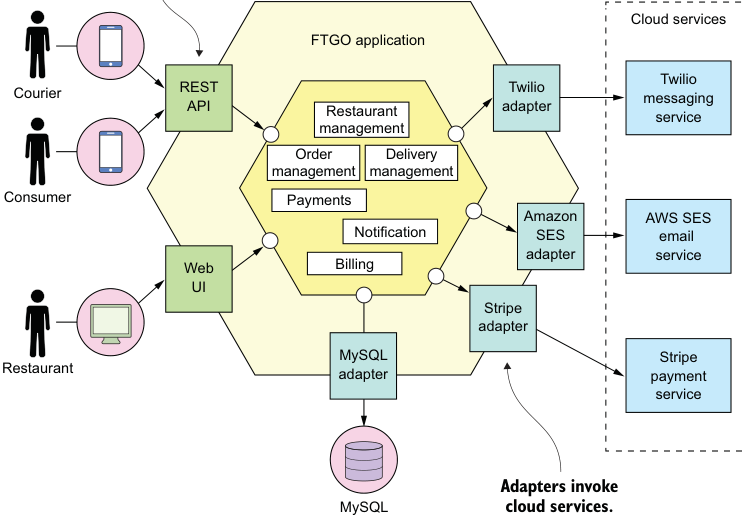

**----- Start of picture text -----** 
Cloud services FTGO application Twilio Courier RESTAPI Restaurant adapterTwilio messagingservice management Order Delivery management management Consumer Payments Amazon AWS SES Notification SE S email adapter service Web Billing UI Stripe adapter MySQL Stripe Restaurant adapter payment service Adapters invoke MySQL cloud services. **----- End of picture text -----** 

Figure 1.1 The FTGO application has a hexagonal architecture. It consists of business logic surrounded by adapters that implement UIs and interface with external systems, such as mobile applications and cloud services for payments, messaging, and email. 

The business logic consists of modules, each of which is a collection of domain objects. Examples of the modules include Order Management, Delivery Management, Billing, and Payments. There are several adapters that interface with the external systems. Some are _inbound_ adapters, which handle requests by invoking the business logic, including the REST API and Web UI adapters. Others are _outbound_ adapters, which enable the business logic to access the MySQL database and invoke cloud services such as Twilio and Stripe. 

Despite having a logically modular architecture, the FTGO application is packaged as a single WAR file. The application is an example of the widely used _monolithic_ style 

of software architecture, which structures a system as a single executable or deployable component. If the FTGO application were written in the Go language (GoLang), it would be a single executable. A Ruby or NodeJS version of the application would be a single directory hierarchy of source code. The monolithic architecture isn’t inherently bad. The FTGO developers made a good decision when they picked monolithic architecture for their application. 

### 1.1.2 The benefits of the monolithic architecture

In the early days of FTGO, when the application was relatively small, the application’s monolithic architecture had lots of benefits: 

- _Simple to develop_ —IDEs and other developer tools are focused on building a single application. 

- _Easy to make radical changes to the application_ —You can change the code and the database schema, build, and deploy. 

- _Straightforward to test_ —The developers wrote end-to-end tests that launched the application, invoked the REST API, and tested the UI with Selenium. 

- _Straightforward to deploy_ —All a developer had to do was copy the WAR file to a server that had Tomcat installed. 

- _Easy to scale_ —FTGO ran multiple instances of the application behind a load balancer. 

Over time, though, development, testing, deployment, and scaling became much more difficult. Let’s look at why. 

### 1.1.3 Living in monolithic hell

Unfortunately, as the FTGO developers have discovered, the monolithic architecture has a huge limitation. Successful applications like the FTGO application have a habit of outgrowing the monolithic architecture. Each sprint, the FTGO development team implemented a few more stories, which made the code base larger. Moreover, as the company became more successful, the size of the development team steadily grew. Not only did this increase the growth rate of the code base, it also increased the management overhead. 

As figure 1.2 shows, the once small, simple FTGO application has grown over the years into a monstrous monolith. Similarly, the small development team has now become multiple Scrum teams, each of which works on a particular functional area. As a result of outgrowing its architecture, FTGO is in monolithic hell. Development is slow and painful. Agile development and deployment is impossible. Let’s look at why this has happened. 

**COMPLEXITY INTIMIDATES DEVELOPERS**

A major problem with the FTGO application is that it’s too complex. It’s too large for any developer to fully understand. As a result, fixing bugs and correctly implementing new features have become difficult and time consuming. Deadlines are missed. 

_**The slow march toward monolithic hell**_ 

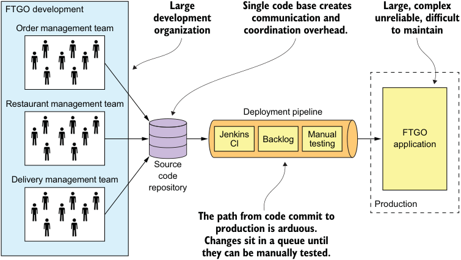

**----- Start of picture text -----** 
FTGO development Large Single code base creates Large, complex development communication and unreliable, difficult Order management team organization coordination overhead. to maintain Restaurant management team Deployment pipeline Jenkins Manual FTGO Cl Backlog testing application Source Delivery management team code repository Production The path from code commit to production is arduous. Changes sit in a queue until they can be manually tested. **----- End of picture text -----** 

Figure 1.2 A case of monolithic hell. The large FTGO developer team commits their changes to a single source code repository. The path from code commit to production is long and arduous and involves manual testing. The FTGO application is large, complex, unreliable, and difficult to maintain. 

To make matters worse, this overwhelming complexity tends to be a downward spiral. If the code base is difficult to understand, a developer won’t make changes correctly. Each change makes the code base incrementally more complex and harder to understand. The clean, modular architecture shown earlier in figure 1.1 doesn’t reflect reality. FTGO is gradually becoming a monstrous, incomprehensible, big ball of mud. 

Mary remembers recently attending a conference where she met a developer who was writing a tool to analyze the dependencies between the thousands of JARs in their multimillion lines-of-code (LOC) application. At the time, that tool seemed like something FTGO could use. Now she’s not so sure. Mary suspects a better approach is to migrate to an architecture that is better suited to a complex application: microservices. 

**DEVELOPMENT IS SLOW**

As well as having to fight overwhelming complexity, FTGO developers find day-to-day development tasks slow. The large application overloads and slows down a developer’s IDE. Building the FTGO application takes a long time. Moreover, because it’s so large, the application takes a long time to start up. As a result, the edit-build-run-test loop takes a long time, which badly impacts productivity. 

**PATH FROM COMMIT TO DEPLOYMENT IS LONG AND ARDUOUS**

Another problem with the FTGO application is that deploying changes into production is a long and painful process. The team typically deploys updates to production once a month, usually late on a Friday or Saturday night. Mary keeps reading that the state-of-the-art for Software-as-a-Service (SaaS) applications is _continuous deployment_ : 

_**Escaping monolithic hell**_ 

deploying changes to production many times a day during business hours. Apparently, as of 2011, Amazon.com deployed a change into production every 11.6 seconds without ever impacting the user! For the FTGO developers, updating production more than once a month seems like a distant dream. And adopting continuous deployment seems next to impossible. 

FTGO has partially adopted agile. The engineering team is divided into squads and uses two-week sprints. Unfortunately, the journey from code complete to running in production is long and arduous. One problem with so many developers committing to the same code base is that the build is frequently in an unreleasable state. When the FTGO developers tried to solve this problem by using feature branches, their attempt resulted in lengthy, painful merges. Consequently, once a team completes its sprint, a long period of testing and code stabilization follows. 

Another reason it takes so long to get changes into production is that testing takes a long time. Because the code base is so complex and the impact of a change isn’t well understood, developers and the Continuous Integration (CI) server must run the entire test suite. Some parts of the system even require manual testing. It also takes a while to diagnose and fix the cause of a test failure. As a result, it takes a couple of days to complete a testing cycle. 

**SCALING IS DIFFICULT**

The FTGO team also has problems scaling its application. That’s because different application modules have conflicting resource requirements. The restaurant data, for example, is stored in a large, in-memory database, which is ideally deployed on servers with lots of memory. In contrast, the image processing module is CPU intensive and best deployed on servers with lots of CPU. Because these modules are part of the same application, FTGO must compromise on the server configuration. 

**DELIVERING A RELIABLE MONOLITH IS CHALLENGING**

Another problem with the FTGO application is the lack of reliability. As a result, there are frequent production outages. One reason it’s unreliable is that testing the application thoroughly is difficult, due to its large size. This lack of testability means bugs make their way into production. To make matters worse, the application lacks _fault isolation_ , because all modules are running within the same process. Every so often, a bug in one module—for example, a memory leak—crashes all instances of the application, one by one. The FTGO developers don’t enjoy being paged in the middle of the night because of a production outage. The business people like the loss of revenue and trust even less. 

**LOCKED INTO INCREASINGLY OBSOLETE TECHNOLOGY STACK**

The final aspect of monolithic hell experienced by the FTGO team is that the architecture forces them to use a technology stack that’s becoming increasingly obsolete. The monolithic architecture makes it difficult to adopt new frameworks and languages. It would be extremely expensive and risky to rewrite the entire monolithic application so that it would use a new and presumably better technology. Consequently, developers 

_**What you’ll learn in this book**_
are stuck with the technology choices they made at the start of the project. Quite often, they must maintain an application written using an increasingly obsolete technology stack. 

The Spring framework has continued to evolve while being backward compatible, so in theory FTGO might have been able to upgrade. Unfortunately, the FTGO application uses versions of frameworks that are incompatible with newer versions of Spring. The development team has never found the time to upgrade those frameworks. As a result, major parts of the application are written using increasingly out-of-date frameworks. What’s more, the FTGO developers would like to experiment with non-JVM languages such as GoLang and NodeJS. Sadly, that’s not possible with a monolithic application. 

## 1.2 Why this book is relevant to you

It’s likely that you’re a developer, architect, CTO, or VP of engineering. You’re responsible for an application that has outgrown its monolithic architecture. Like Mary at FTGO, you’re struggling with software delivery and want to know how to escape monolith hell. Or perhaps you fear that your organization is on the path to monolithic hell and you want to know how to change direction before it’s too late. If you need to escape or avoid monolithic hell, this is the book for you. 

This book spends a lot of time explaining microservice architecture concepts. My goal is for you to find this material accessible, regardless of the technology stack you use. All you need is to be familiar with the basics of enterprise application architecture and design. In particular, you need to know the following: 

- Three-tier architecture 

- Web application design 

- How to develop business logic using object-oriented design 

- How to use an RDBMS: SQL and ACID transactions 

- How to use interprocess communication using a message broker and REST APIs 

- Security, including authentication and authorization 

The code examples in this book are written using Java and the Spring framework. That means in order to get the most out of the examples, you need to be familiar with the Spring framework too. 

## 1.3 What you?ll learn in this book

By the time you finish reading this book you’ll understand the following: 

- The essential characteristics of the microservice architecture, its benefits and drawbacks, and when to use it 

- Distributed data management patterns 

- Effective microservice testing strategies 

- Deployment options for microservices 

- Strategies for refactoring a monolithic application into a microservice architecture 

You’ll also be able to do the following: 

- Architect an application using the microservice architecture pattern 

- Develop the business logic for a service 

- Use sagas to maintain data consistency across services 

- Implement queries that span services 

- Effectively test microservices 

- Develop production-ready services that are secure, configurable, and observable 

- Refactor an existing monolithic application to services 

## 1.4 Microservice architecture to the rescue

Mary has come to the conclusion that FTGO must migrate to the microservice architecture. 

Interestingly, software architecture has very little to do with functional requirements. You can implement a set of _use cases_ —an application’s functional requirements—with any architecture. In fact, it’s common for successful applications, such as the FTGO application, to be big balls of mud. 

Architecture matters, however, because of how it affects the so-called _quality of service_ requirements, also called _nonfunctional requirements_ , _quality attributes_ , or _ilities_ . As the FTGO application has grown, various quality attributes have suffered, most notably those that impact the velocity of software delivery: maintainability, extensibility, and testability. 

On the one hand, a disciplined team can slow down the pace of its descent toward monolithic hell. Team members can work hard to maintain the modularity of their application. They can write comprehensive automated tests. On the other hand, they can’t avoid the issues of a large team working on a single monolithic application. Nor can they solve the problem of an increasingly obsolete technology stack. The best a team can do is delay the inevitable. To escape monolithic hell, they must migrate to a new architecture: the Microservice architecture. 

Today, the growing consensus is that if you’re building a large, complex application, you should consider using the microservice architecture. But what are _microservices_ exactly? Unfortunately, the name doesn’t help because it overemphasizes size. There are numerous definitions of the microservice architecture. Some take the name too literally and claim that a service should be tiny—for example, 100 LOC. Others claim that a service should only take two weeks to develop. Adrian Cockcroft, formerly of Netflix, defines a microservice architecture as a service-oriented architecture composed of loosely coupled elements that have bounded contexts. That’s not a bad definition, but it is a little dense. Let’s see if we can do better. 

### 1.4.1 Scale cube and microservices

My definition of the microservice architecture is inspired by Martin Abbott and Michael Fisher’s excellent book, _The Art of Scalability_ (Addison-Wesley, 2015). This 

_**Microservice architecture to the rescue**_ 

book describes a useful, three-dimensional scalability model: the _scale cube_ , shown in figure 1.3. 

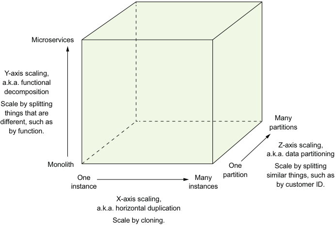

**----- Start of picture text -----** 
Microservices Y-axis scaling, a.k.a. functional decomposition Scale by splitting things that are Many different, such as partitions by function. Z-axis scaling, a.k.a. data partitioning Monolith One Scale by splitting One Many partition similar things, such as instance instances by customer ID. X-axis scaling, a.k.a. horizontal duplication Scale by cloning. **----- End of picture text -----** 

Figure 1.3 The scale cube defines three separate ways to scale an application: X-axis scaling load balances requests across multiple, identical instances; Z-axis scaling routes requests based on an attribute of the request; Y-axis functionally decomposes an application into services. 

The model defines three ways to scale an application: X, Y, and Z. 

**X-AXIS SCALING LOAD BALANCES REQUESTS ACROSS MULTIPLE INSTANCES**

_X-axis_ scaling is a common way to scale a monolithic application. Figure 1.4 shows how X-axis scaling works. You run multiple instances of the application behind a load balancer. The load balancer distributes requests among the _N_ identical instances of the application. This is a great way of improving the capacity and availability of an application. 

**Z-AXIS SCALING ROUTES REQUESTS BASED ON AN ATTRIBUTE OF THE REQUEST**

_Z-axis_ scaling also runs multiple instances of the monolith application, but unlike X-axis scaling, each instance is responsible for only a subset of the data. Figure 1.5 shows how Z-axis scaling works. The router in front of the instances uses a request attribute to route it to the appropriate instance. An application might, for example, route requests using userId. 

In this example, each application instance is responsible for a subset of users. The router uses the userId specified by the request Authorization header to select one of 

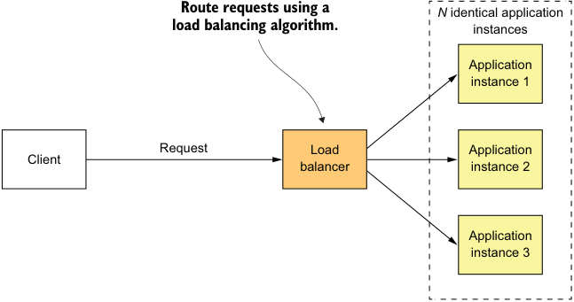

**----- Start of picture text -----** 
Route requests using a N  identical application load balancing algorithm. instances Application instance 1 Request Load Application Client balancer instance 2 Application instance 3 **----- End of picture text -----** 

Figure 1.4 X-axis scaling runs multiple, identical instances of the monolithic application behind a load balancer. 

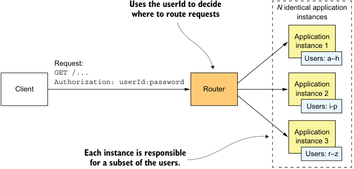

**----- Start of picture text -----** 
Uses the userId to decide N  identical application where to route requests instances Application instance 1 Users: a–h Request: GET /... Authorization: userId:password Application Client Router instance 2 Users: i-p Application instance 3 Each instance is responsible Users: r–z for a subset of the users. **----- End of picture text -----** 

Figure 1.5 Z-axis scaling runs multiple identical instances of the monolithic application behind a router, which routes based on a **request** attribute . Each instance is responsible for a subset of the data. the _N_ identical instances of the application. Z-axis scaling is a great way to scale an application to handle increasing transaction and data volumes. 

Y-AXIS SCALING FUNCTIONALLY DECOMPOSES AN APPLICATION INTO SERVICES 

X- and Z-axis scaling improve the application’s capacity and availability. But neither approach solves the problem of increasing development and application complexity. To solve those, you need to apply _Y-axis_ scaling, or _functional decomposition_ . Figure 1.6 shows how Y-axis scaling works: by splitting a monolithic application into a set of services. 

_**Microservice architecture to the rescue**_ 

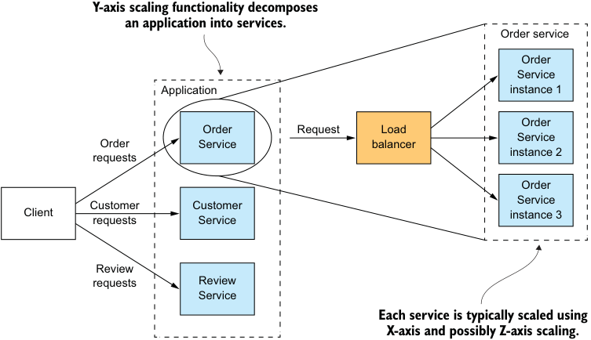

**----- Start of picture text -----** 
Y-axis scaling functionality decomposes an application into services. Order service Order Service Application instance 1 Order Order Request Load Service Order Service balancer instance 2 requests Order Service Customer Customer Client instance 3 requests Service Review requests Review Service Each service is typically scaled using X-axis and possibly Z-axis scaling. **----- End of picture text -----** 

Figure 1.6 Y-axis scaling splits the application into a set of services. Each service is responsible for a particular function. A service is scaled using X-axis scaling and, possibly, Z-axis scaling. 

A _service_ is a mini application that implements narrowly focused functionality, such as order management, customer management, and so on. A service is scaled using X-axis scaling, though some services may also use Z-axis scaling. For example, the Order service consists of a set of load-balanced service instances. 

The high-level definition of microservice architecture (microservices) is an architectural style that functionally decomposes an application into a set of services. Note that this definition doesn’t say anything about size. Instead, what matters is that each service has a focused, cohesive set of responsibilities. Later in the book I discuss what that means. 

Now let’s look at how the microservice architecture is a form of modularity. 

### 1.4.2 Microservices as a form of modularity

_Modularity_ is essential when developing large, complex applications. A modern application like FTGO is too large to be developed by an individual. It’s also too complex to be understood by a single person. Applications must be decomposed into modules that are developed and understood by different people. In a monolithic application, modules are defined using a combination of programming language constructs (such as Java packages) and build artifacts (such as Java JAR files). However, as the FTGO developers have discovered, this approach tends not to work well in practice. Longlived, monolithic applications usually degenerate into big balls of mud. 

The microservice architecture uses services as the unit of modularity. A service has an API, which is an impermeable boundary that is difficult to violate. You can’t bypass 

_**Escaping monolithic hell**_ 

the API and access an internal class as you can with a Java package. As a result, it’s much easier to preserve the modularity of the application over time. There are other benefits of using services as building blocks, including the ability to deploy and scale them independently. 

### 1.4.3 Each service has its own database

A key characteristic of the microservice architecture is that the services are loosely coupled and communicate only via APIs. One way to achieve loose coupling is by each service having its own datastore. In the online store, for example, Order Service has a database that includes the ORDERS table, and Customer Service has its database, which includes the CUSTOMERS table. At development time, developers can change a service’s schema without having to coordinate with developers working on other services. At runtime, the services are isolated from each other—for example, one service will never be blocked because another service holds a database lock. 

**Don’t worry: Loose coupling doesn’t make Larry Ellison richer**

The requirement for each service to have its own database doesn’t mean it has its own database server. You don’t, for example, have to spend 10 times more on Oracle RDBMS licenses. Chapter 2 explores this topic in depth. 

Now that we’ve defined the microservice architecture and described some of its essential characteristics, let’s look at how this applies to the FTGO application. 

### 1.4.4 The FTGO microservice architecture

The rest of this book discusses the FTGO application’s microservice architecture in depth. But first let’s quickly look at what it means to apply Y-axis scaling to this application. If we apply Y-axis decomposition to the FTGO application, we get the architecture shown in figure 1.7. The decomposed application consists of numerous frontend and backend services. We would also apply X-axis and, possibly Z-axis scaling, so that at runtime there would be multiple instances of each service. 

The frontend services include an API gateway and the Restaurant Web UI. The API gateway, which plays the role of a facade and is described in detail in chapter 8, provides the REST APIs that are used by the consumers’ and couriers’ mobile applications. The Restaurant Web UI implements the web interface that’s used by the restaurants to manage menus and process orders. 

The FTGO application’s business logic consists of numerous backend services. Each backend service has a REST API and its own private datastore. The backend services include the following: 

- Order Service **—** Manages orders 

- Delivery Service—Manages delivery of orders from restaurants to consumers 

_**Microservice architecture to the rescue**_ 

- Restaurant Service—Maintains information about restaurants 

- Kitchen Service—Manages the preparation of orders 

- Accounting Service—Handles billing and payments 

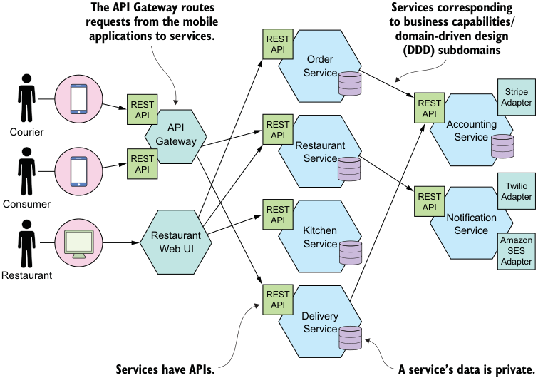

**----- Start of picture text -----** 
The API Gateway routes Services corresponding requests from the mobile to business capabilities/ applications to services. REST domain-driven design API (DDD) subdomains Order Service Stripe REST REST Adapter API API Courier GatewayAPI RESTAPI Restaurant AccountingService REST Service API Twilio REST Adapter Consumer REST API API Notification Kitchen Service Restaurant Service Amazon Web UI SES Adapter Restaurant REST API Delivery Service Services have APIs. A service’s data is private. **----- End of picture text -----** 

Figure 1.7 Some of the services of the microservice architecture-based version of the FTGO application. An API Gateway routes requests from the mobile applications to services. The services collaborate via APIs. 

Many services correspond to the modules described earlier in this chapter. What’s different is that each service and its API are very clearly defined. Each one can be independently developed, tested, deployed, and scaled. Also, this architecture does a good job of preserving modularity. A developer can’t bypass a service’s API and access its internal components. Chapter 13 describes how to transform an existing monolithic application into microservices. 

### 1.4.5 Comparing the microservice architecture and SOA

Some critics of the microservice architecture claim it’s nothing new—it’s serviceoriented architecture (SOA). At a very high level, there are some similarities. SOA and the microservice architecture are architectural styles that structure a system as a set of services. But as table 1.1 shows, once you dig deep, you encounter significant differences. 

Table 1.1 Comparing SOA with microservices 

||SOA|Microservices|
|---|---|---|
|Inter-service communication Data Typical service|Smart pipes, such as Enterprise Ser- vice Bus, using heavyweight protocols, such as SOAP and the other WS* standards. Global data model and shared data- bases Larger monolithic application|Dumb pipes, such as a message broker, or direct service-to-service communication, using lightweight protocols such as REST or gRPC Data model and database per service Smaller service|

SOA and the microservice architecture usually use different technology stacks. SOA applications typically use heavyweight technologies such as SOAP and other WS* standards. They often use an ESB, a _smart pipe_ that contains business and message-processing logic to integrate the services. Applications built using the microservice architecture tend to use lightweight, open source technologies. The services communicate via _dumb pipes_ , such as message brokers or lightweight protocols like REST or gRPC. 

SOA and the microservice architecture also differ in how they treat data. SOA applications typically have a global data model and share databases. In contrast, as mentioned earlier, in the microservice architecture each service has its own database. Moreover, as described in chapter 2, each service is usually considered to have its own domain model. 

Another key difference between SOA and the microservice architecture is the size of the services. SOA is typically used to integrate large, complex, monolithic applications. Although services in a microservice architecture aren’t always tiny, they’re almost always much smaller. As a result, a SOA application usually consists of a few large services, whereas a microservices-based application typically consists of dozens or hundreds of smaller services. 

## 1.5 Benefits and drawbacks of the microservice architecture

Let’s first consider the benefits and then we’ll look at the drawbacks. 

### 1.5.1 Benefits of the microservice architecture

The microservice architecture has the following benefits: 

- It enables the continuous delivery and deployment of large, complex applications. 

- Services are small and easily maintained. 

- Services are independently deployable. 

- Services are independently scalable. 

- The microservice architecture enables teams to be autonomous. 

- It allows easy experimenting and adoption of new technologies. 

- It has better fault isolation. 

_**Benefits and drawbacks of the microservice architecture**_ 

Let’s look at each benefit. 

**ENABLES THE CONTINUOUS DELIVERY AND DEPLOYMENT OF LARGE, COMPLEX APPLICATIONS**

The most important benefit of the microservice architecture is that it enables continuous delivery and deployment of large, complex applications. As described later in section 1.7, continuous delivery/deployment is part of _DevOps_ , a set of practices for the rapid, frequent, and reliable delivery of software. High-performing DevOps organizations typically deploy changes into production with very few production issues. 

There are three ways that the microservice architecture enables continuous delivery/deployment: 

- _It has the testability required by continuous delivery/deployment_ —Automated testing is a key practice of continuous delivery/deployment. Because each service in a microservice architecture is relatively small, automated tests are much easier to write and faster to execute. As a result, the application will have fewer bugs. 

- _It has the deployability required by continuous delivery/deployment_ —Each service can be deployed independently of other services. If the developers responsible for a service need to deploy a change that’s local to that service, they don’t need to coordinate with other developers. They can deploy their changes. As a result, it’s much easier to deploy changes frequently into production. 

- _It enables development teams to be autonomous and loosely coupled_ —You can structure the engineering organization as a collection of small (for example, two-pizza) teams. Each team is solely responsible for the development and deployment of one or more related services. As figure 1.8 shows, each team can develop, deploy, and scale their services independently of all the other teams. As a result, the development velocity is much higher. 

The ability to do continuous delivery and deployment has several business benefits: 

- It reduces the time to market, which enables the business to rapidly react to feedback from customers. 

- It enables the business to provide the kind of reliable service today’s customers have come to expect. 

- Employee satisfaction is higher because more time is spent delivering valuable features instead of fighting fires. 

As a result, the microservice architecture has become the table stakes of any business that depends upon software technology. 

EACH SERVICE IS SMALL AND EASILY MAINTAINED 

Another benefit of the microservice architecture is that each service is relatively small. The code is easier for a developer to understand. The small code base doesn’t slow down the IDE, making developers more productive. And each service typically starts a lot faster than a large monolith does, which also makes developers more productive and speeds up deployments. 

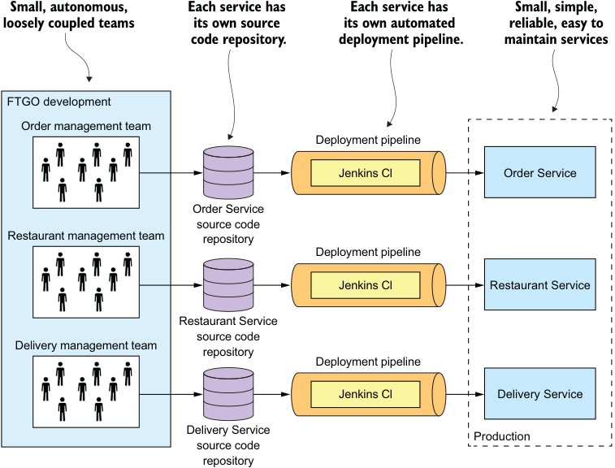

**----- Start of picture text -----** 
Small, autonomous, Each service has Each service has Small, simple, loosely coupled teams its own source its own automated reliable, easy to code repository. deployment pipeline. maintain services FTGO development Order management team Deployment pipeline Jenkins Cl Order Service Order Service source code Restaurant management team repository Deployment pipeline Jenkins Cl Restaurant Service Restaurant Service source code Delivery management team repository Deployment pipeline Jenkins Cl Delivery Service Delivery Service Production source code repository **----- End of picture text -----** 

Figure 1.8 The microservices-based FTGO application consists of a set of loosely coupled services. Each team develops, tests, and deploys their services independently. 

**SERVICES ARE INDEPENDENTLY SCALABLE**

Each service in a microservice architecture can be scaled independently of other services using X-axis cloning and Z-axis partitioning. Moreover, each service can be deployed on hardware that’s best suited to its resource requirements. This is quite different than when using a monolithic architecture, where components with wildly different resource requirements—for example, CPU-intensive vs. memory-intensive— must be deployed together. 

**BETTER FAULT ISOLATION**

The microservice architecture has better fault isolation. For example, a memory leak in one service only affects that service. Other services will continue to handle requests normally. In comparison, one misbehaving component of a monolithic architecture will bring down the entire system. 

**EASILY EXPERIMENT WITH AND ADOPT NEW TECHNOLOGIES**

Last but not least, the microservice architecture eliminates any long-term commitment to a technology stack. In principle, when developing a new service, the developers are free to pick whatever language and frameworks are best suited for that service. 

_**Benefits and drawbacks of the microservice architecture**_ 

In many organizations, it makes sense to restrict the choices, but the key point is that you aren’t constrained by past decisions. 

Moreover, because the services are small, rewriting them using better languages and technologies becomes practical. If the trial of a new technology fails, you can throw away that work without risking the entire project. This is quite different than when using a monolithic architecture, where your initial technology choices severely constrain your ability to use different languages and frameworks in the future. 

### 1.5.2 Drawbacks of the microservice architecture

Certainly, no technology is a silver bullet, and the microservice architecture has a number of significant drawbacks and issues. Indeed most of this book is about how to address these drawbacks and issues. As you read about the challenges, don’t worry. Later in this book I describe ways to address them. 

Here are the major drawbacks and issues of the microservice architecture: 

- Finding the right set of services is challenging. 

- Distributed systems are complex, which makes development, testing, and deployment difficult. 

- Deploying features that span multiple services requires careful coordination. 

- Deciding when to adopt the microservice architecture is difficult. 

Let’s look at each one in turn. 

**FINDING THE RIGHT SERVICES IS CHALLENGING**

One challenge with using the microservice architecture is that there isn’t a concrete, well-defined algorithm for decomposing a system into services. As with much of software development, it’s something of an art. To make matters worse, if you decompose a system incorrectly, you’ll build a _distributed monolith_ , a system consisting of coupled services that must be deployed together. A distributed monolith has the drawbacks of both the monolithic architecture and the microservice architecture. 

**DISTRIBUTED SYSTEMS ARE COMPLEX**

Another issue with using the microservice architecture is that developers must deal with the additional complexity of creating a distributed system. Services must use an interprocess communication mechanism. This is more complex than a simple method call. Moreover, a service must be designed to handle partial failure and deal with the remote service either being unavailable or exhibiting high latency. 

Implementing use cases that span multiple services requires the use of unfamiliar techniques. Each service has its own database, which makes it a challenge to implement transactions and queries that span services. As described in chapter 4, a microservicesbased application must use what are known as _sagas_ to maintain data consistency across services. Chapter 7 explains that a microservices-based application can’t retrieve data from multiple services using simple queries. Instead, it must implement queries using either API composition or CQRS views. 

_**Escaping monolithic hell**_ 

IDEs and other development tools are focused on building monolithic applications and don’t provide explicit support for developing distributed applications. Writing automated tests that involve multiple services is challenging. These are all issues that are specific to the microservice architecture. Consequently, your organization’s developers must have sophisticated software development and delivery skills in order to successfully use microservices. 

The microservice architecture also introduces significant operational complexity. Many more moving parts—multiple instances of different types of service—must be managed in production. To successfully deploy microservices, you need a high level of automation. You must use technologies such as the following: 

- Automated deployment tooling, like Netflix Spinnaker 

- An off-the-shelf PaaS, like Pivotal Cloud Foundry or Red Hat OpenShift 

- A Docker orchestration platform, like Docker Swarm or Kubernetes 

I describe the deployment options in more detail in chapter 12. 

DEPLOYING FEATURES SPANNING MULTIPLE SERVICES NEEDS CAREFUL COORDINATION 

Another challenge with using the microservice architecture is that deploying features that span multiple services requires careful coordination between the various development teams. You have to create a rollout plan that orders service deployments based on the dependencies between services. That’s quite different than a monolithic architecture, where you can easily deploy updates to multiple components atomically. 

DECIDING WHEN TO ADOPT IS DIFFICULT 

Another issue with using the microservice architecture is deciding at what point during the lifecycle of the application you should use this architecture. When developing the first version of an application, you often don’t have the problems that this architecture solves. Moreover, using an elaborate, distributed architecture will slow down development. That can be a major dilemma for startups, where the biggest problem is usually how to rapidly evolve the business model and accompanying application. Using the microservice architecture makes it much more difficult to iterate rapidly. A startup should almost certainly begin with a monolithic application. 

Later on, though, when the problem is how to handle complexity, that’s when it makes sense to functionally decompose the application into a set of microservices. You may find refactoring difficult because of tangled dependencies. Chapter 13 goes over strategies for refactoring a monolithic application into microservices. 

As you can see, the microservice architecture offer many benefits, but also has some significant drawbacks. Because of these issues, adopting a microservice architecture should not be undertaken lightly. But for complex applications, such as a consumerfacing web application or SaaS application, it’s usually the right choice. Well-known sites like eBay (www.slideshare.net/RandyShoup/the-ebay-architecture-striking-abalance-between-site-stability-feature-velocity-performance-and-cost), Amazon.com, Groupon, and Gilt have all evolved from a monolithic architecture to a microservice architecture. 

_**The Microservice architecture pattern language**_ 

You must address numerous design and architectural issues when using the microservice architecture. What’s more, many of these issues have multiple solutions, each with a different set of trade-offs. There is no one single perfect solution. To help guide your decision making, I’ve created the Microservice architecture pattern language. I reference this pattern language throughout the rest of the book as I teach you about the microservice architecture. Let’s look at what a pattern language is and why it’s helpful. 

## 1.6 The Microservice architecture pattern language

Architecture and design are all about making decisions. You need to decide whether the monolithic or microservice architecture is the best fit for your application. When making these decisions you have lots of trade-offs to consider. If you pick the microservice architecture, you’ll need to address lots of issues. 

A good way to describe the various architectural and design options and improve decision making is to use a pattern language. Let’s first look at why we need patterns and a pattern language, and then we’ll take a tour of the Microservice architecture pattern language. 

### 1.6.1 Microservice architecture is not a silver bullet

Back in 1986, Fred Brooks, author of _The Mythical Man-Month_ (Addison-Wesley Professional, 1995), said that in software engineering, there are no silver bullets. That means there are no techniques or technologies that if adopted would give you a tenfold boost in productivity. Yet decades years later, developers are still arguing passionately about their favorite silver bullets, absolutely convinced that their favorite technology will give them a massive boost in productivity. 

A lot of arguments follow the _suck/rock dichotomy_ (http://nealford.com/memeagora/ 2009/08/05/suck-rock-dichotomy.html), a term coined by Neal Ford that describes how everything in the software world either sucks or rocks, with no middle ground. These arguments have this structure: if you do X, then a puppy will die, so therefore you must do Y. For example, synchronous versus reactive programming, object-oriented versus functional, Java versus JavaScript, REST versus messaging. Of course, reality is much more nuanced. Every technology has drawbacks and limitations that are often overlooked by its advocates. As a result, the adoption of a technology usually follows the _Gartner hype cycle_ (https://en.wikipedia.org/wiki/Hype_cycle), in which an emerging technology goes through five phases, including the _peak of inflated expectations_ (it rocks), followed by the _trough of disillusionment_ (it sucks), and ending with the _plateau of productivity_ (we now understand the trade-offs and when to use it). 

Microservices are not immune to the silver bullet phenomenon. Whether this architecture is appropriate for your application depends on many factors. Consequently, it’s bad advice to advise always using the microservice architecture, but it’s equally bad advice to advise never using it. As with many things, it depends. 

The underlying reason for these polarized and hyped arguments about technology is that humans are primarily driven by their emotions. Jonathan Haidt, in his excellent 

book _The Righteous Mind: Why Good People Are Divided by Politics and Religion_ (Vintage, 2013), uses the metaphor of an elephant and its rider to describe how the human mind works. The elephant represents the emotion part of the human brain. It makes most of the decisions. The rider represents the rational part of the brain. It can sometimes influence the elephant, but it mostly provides justifications for the elephant’s decisions. 

We—the software development community—need to overcome our emotional nature and find a better way of discussing and applying technology. A great way to discuss and describe technology is to use the _pattern_ format, because it’s objective. When describing a technology in the pattern format, you must, for example, describe the drawbacks. Let’s take a look at the pattern format. 

### 1.6.2 Patterns and pattern languages

A _pattern_ is a reusable solution to a problem that occurs in a particular context. It’s an idea that has its origins in real-world architecture and that has proven to be useful in software architecture and design. The concept of a pattern was created by Christopher Alexander, a real-world architect. He also created the concept of a _pattern language_ , a collection of related patterns that solve problems within a particular domain. His book _A Pattern Language: Towns, Buildings, Construction_ (Oxford University Press, 1977) describes a pattern language for architecture that consists of 253 patterns. The patterns range from solutions to high-level problems, such as where to locate a city (“Access to water”), to low-level problems, such as how to design a room (“Light on two sides of every room”). Each of these patterns solves a problem by arranging physical objects that range in scope from cities to windows. 

Christopher Alexander’s writings inspired the software community to adopt the concept of patterns and pattern languages. The book _Design Patterns: Elements of Reusable Object-Oriented Software_ (Addison-Wesley Professional, 1994), by Erich Gamma, Richard Helm, Ralph Johnson, and John Vlissides is a collection of object-oriented design patterns. The book popularized patterns among software developers. Since the mid-1990s, software developers have documented numerous software patterns. A _software pattern_ solves a software architecture or design problem by defining a set of collaborating software elements. 

Let’s imagine, for example, that you’re building a banking application that must support a variety of overdraft policies. Each policy defines limits on the balance of an account and the fees charged for an overdrawn account. You can solve this problem using the Strategy pattern, which is a well-known pattern from the classic _Design Patterns_ book. The solution defined by the Strategy pattern consists of three parts: 

- A strategy interface called Overdraft that encapsulates the overdraft algorithm 

- One or more concrete strategy classes, one for each particular context 

- The Account class that uses the algorithm 

The Strategy pattern is an _object-oriented_ design pattern, so the elements of the solution are classes. Later in this section, I describe _high-level_ design patterns, where the solution consists of collaborating services. 

_**The Microservice architecture pattern language**_ 

One reason why patterns are valuable is because a pattern must describe the context within which it applies. The idea that a solution is specific to a particular context and might not work well in other contexts is an improvement over how technology used to typically be discussed. For example, a solution that solves the problem at the scale of Netflix might not be the best approach for an application with fewer users. 

The value of a pattern, however, goes far beyond requiring you to consider the context of a problem. It forces you to describe other critical yet frequently overlooked aspects of a solution. A commonly used pattern structure includes three especially valuable sections: 

- Forces 

- Resulting context 

- Related patterns 

Let’s look at each of these, starting with forces. 

**FORCES: THE ISSUES THAT YOU MUST ADDRESS WHEN SOLVING A PROBLEM**

The _forces_ section of a pattern describes the forces (issues) that you must address when solving a problem in a given context. Forces can conflict, so it might not be possible to solve all of them. Which forces are more important depends on the context. You have to prioritize solving some forces over others. For example, code must be easy to understand and have good performance. Code written in a reactive style has better performance than synchronous code, yet is often more difficult to understand. Explicitly listing the forces is useful because it makes clear which issues need to be solved. 

RESULTING CONTEXT: THE CONSEQUENCES OF APPLYING A PATTERN 

The _resulting context_ section of a pattern describes the consequences of applying the pattern. It consists of three parts: 

- _Benefits_ —The benefits of the pattern, including the forces that have been resolved 

- _Drawbacks_ —The drawbacks of the pattern, including the unresolved forces 

- _Issues_ —The new problems that have been introduced by applying the pattern 

The resulting context provides a more complete and less biased view of the solution, which enables better design decisions. 

RELATED PATTERNS: THE FIVE DIFFERENT TYPES OF RELATIONSHIPS 

The _related patterns_ section of a pattern describes the relationship between the pattern and other patterns. There are five types of relationships between patterns: 

- _Predecessor_ —A predecessor pattern is a pattern that motivates the need for this pattern. For example, the Microservice architecture pattern is the predecessor to the rest of the patterns in the pattern language, except the monolithic architecture pattern. 

- _Successor_ —A pattern that solves an issue that has been introduced by this pattern. For example, if you apply the Microservice architecture pattern, you must 

then apply numerous successor patterns, including service discovery patterns and the Circuit breaker pattern. 

- _Alternative_ —A pattern that provides an alternative solution to this pattern. For example, the Monolithic architecture pattern and the Microservice architecture pattern are alternative ways of architecting an application. You pick one or the other. 

- _Generalization_ —A pattern that is a general solution to a problem. For example, in chapter 12 you’ll learn about the different implementations of the Single service per host pattern. 

- _Specialization_ —A specialized form of a particular pattern. For example, in chapter 12 you’ll learn that the Deploy a service as a container pattern is a specialization of Single service per host. 

In addition, you can organize patterns that tackle issues in a particular problem area into groups. The explicit description of related patterns provides valuable guidance on how to effectively solve a particular problem. Figure 1.9 shows how the relationships between patterns is visually represented. 

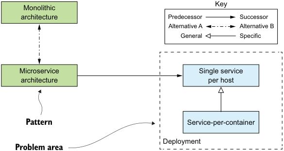

**----- Start of picture text -----** 
Monolithic Key architecture Predecessor Successor Alternative A Alternative B General Specific Microservice Single service architecture per host Pattern Service-per-container Deployment Problem area **----- End of picture text -----** 

Figure 1.9 The visual representation of different types of relationships between the patterns: a _successor_ pattern solves a problem created by applying the _predecessor_ pattern; two or more patterns can be _alternative_ solutions to the same problem; one pattern can be a _specialization_ of another pattern; and patterns that solve problems in the same area can be grouped, or _generalized_ . 

The different kinds of relationships between patterns shown in figure 1.9 are represented as follows: 

- Represents the predecessor-successor relationship 

- Patterns that are alternative solutions to the same problem 

- Indicates that one pattern is a specialization of another pattern 

- Patterns that apply to a particular problem area 

_**The Microservice architecture pattern language**_ 

A collection of patterns related through these relationships sometimes form what is known as a pattern language. The patterns in a pattern language work together to solve problems in a particular domain. In particular, I’ve created the Microservice architecture pattern language. It’s a collection of interrelated software architecture and design patterns for microservices. Let’s take a look at this pattern language. 

### 1.6.3 Overview of the Microservice architecture pattern language

The Microservice architecture pattern language is a collection of patterns that help you architect an application using the microservice architecture. Figure 1.10 shows the high-level structure of the pattern language. The pattern language first helps you decide whether to use the microservice architecture. It describes the monolithic architecture and the microservice architecture, along with their benefits and drawbacks. Then, if the microservice architecture is a good fit for your application, the pattern language helps you use it effectively by solving various architecture and design issues. 

The pattern language consists of several groups of patterns. On the left in figure 1.10 is the application architecture patterns group, the Monolithic architecture pattern and the Microservice architecture pattern. Those are the patterns we’ve been discussing 

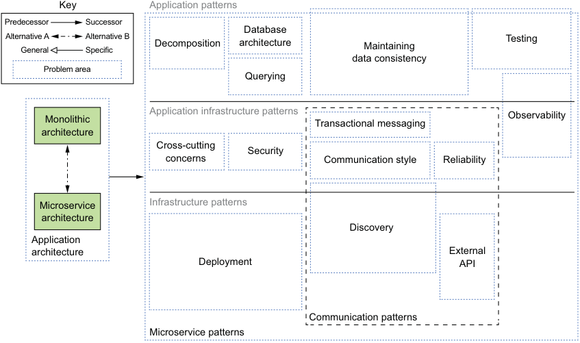

**----- Start of picture text -----** 
Key Application patterns Predecessor Successor Database Alternative AGeneral Alternative BSpecific Decomposition architecture Maintaining Testing data consistency Problem area Querying Application infrastructure patterns Monolithic Observability Transactional messaging architecture Cross-cutting Security concerns Communication style Reliability Microservice Infrastructure patterns architecture Discovery Application architecture External Deployment API Communication patterns Microservice patterns **----- End of picture text -----** 

Figure 1.10 A high-level view of the Microservice architecture pattern language showing the different problem areas that the patterns solve. On the left are the application architecture patterns: Monolithic architecture and Microservice architecture. All the other groups of patterns solve problems that result from choosing the Microservice architecture pattern. 

in this chapter. The rest of the pattern language consists of groups of patterns that are solutions to issues that are introduced by using the Microservice architecture pattern. The patterns are also divided into three layers: 

- _Infrastructure patterns_ —These solve problems that are mostly infrastructure issues outside of development. 

- _Application infrastructure_ —These are for infrastructure issues that also impact development. 

- _Application patterns_ —These solve problems faced by developers. 

These patterns are grouped together based on the kind of problem they solve. Let’s look at the main groups of patterns. 

**PATTERNS FOR DECOMPOSING AN APPLICATION INTO SERVICES**

Deciding how to decompose a system into a set of services is very much an art, but there are a number of strategies that can help. The two decomposition patterns shown in figure 1.11 are different strategies you can use to define your application’s architecture. 

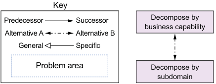

**----- Start of picture text -----** 
Key Predecessor Successor Decompose by business capability Alternative A Alternative B General Specific Problem area Decompose by subdomain **----- End of picture text -----** 

Figure 1.11 There are two decomposition patterns: Decompose by business capability, which organizes services around business capabilities, and Decompose by subdomain, which organizes services around domaindriven design (DDD) subdomains. 

Chapter 2 describes these patterns in detail. 

**COMMUNICATION PATTERNS**

An application built using the microservice architecture is a distributed system. Consequently, interprocess communication (IPC) is an important part of the microservice architecture. You must make a variety of architectural and design decisions about how your services communicate with one another and the outside world. Figure 1.12 shows the communication patterns, which are organized into five groups: 

- _Communication style_ —What kind of IPC mechanism should you use? 

- _Discovery_ —How does a client of a service determine the IP address of a service instance so that, for example, it makes an HTTP request? 

- _Reliability_ —How can you ensure that communication between services is reliable even though services can be unavailable? 

- _Transactional messaging_ —How should you integrate the sending of messages and publishing of events with database transactions that update business data? 

- _External API_ —How do clients of your application communicate with the services? 

_**The Microservice architecture pattern language**_ 

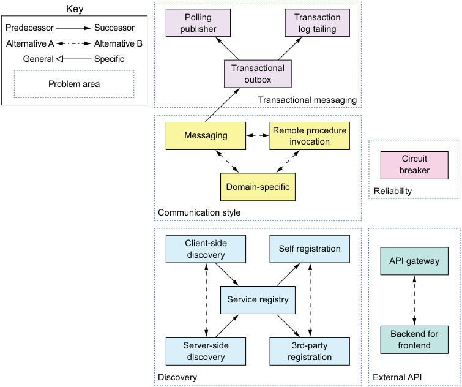

**----- Start of picture text -----** 
Key Polling Transaction Predecessor Successor publisher log tailing Alternative A Alternative B General Specific Transactional outbox Problem area Transactional messaging Remote procedure Messaging invocation Circuit breaker Domain-specific Reliability Communication style Client-side Self registration discovery API gateway Service registry Backend for Server-side 3rd-party frontend discovery registration Discovery External API **----- End of picture text -----** 

Figure 1.12 The five groups of communication patterns 

Chapter 3 looks at the first four groups of patterns: communication style, discovery, reliability, and transaction messaging. Chapter 8 looks at the external API patterns. 

DATA CONSISTENCY PATTERNS FOR IMPLEMENTING TRANSACTION MANAGEMENT 

As mentioned earlier, in order to ensure loose coupling, each service has its own database. Unfortunately, having a database per service introduces some significant issues. I describe in chapter 4 that the traditional approach of using distributed transactions (2PC) isn’t a viable option for a modern application. Instead, an application needs to maintain data consistency by using the Saga pattern. Figure 1.13 shows data-related patterns. 

Chapters 4, 5, and 6 describe these patterns in more detail. 

PATTERNS FOR QUERYING DATA IN A MICROSERVICE ARCHITECTURE 

The other issue with using a database per service is that some queries need to join data that’s owned by multiple services. A service’s data is only accessible via its API, so you can’t use distributed queries against its database. Figure 1.14 shows a couple of patterns you can use to implement queries. 

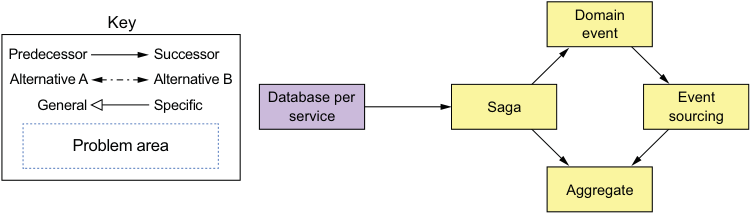

**----- Start of picture text -----** 
Domain Key event Predecessor Successor Alternative A Alternative B General Specific Database perservice Saga sourcingEvent Problem area Aggregate **----- End of picture text -----** 

Figure 1.13 Because each service has its own database, you must use the Saga pattern to maintain data consistency across services. 

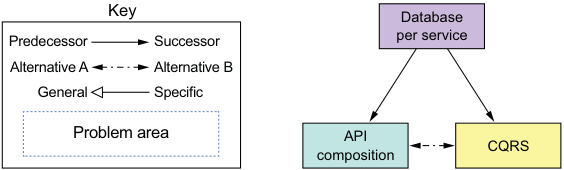

**----- Start of picture text -----** 
Key Database Predecessor Successor per service Alternative A Alternative B General Specific Problem area API CQRS composition **----- End of picture text -----** 

Figure 1.14 Because each service has its own database, you must use one of the querying patterns to retrieve data scattered across multiple services. 

Sometimes you can use the API composition pattern, which invokes the APIs of one or more services and aggregates results. Other times, you must use the Command query responsibility segregation (CQRS) pattern, which maintains one or more easily queried replicas of the data. Chapter 7 looks at the different ways of implementing queries. 

**SERVICE DEPLOYMENT PATTERNS**

Deploying a monolithic application isn’t always easy, but it is straightforward in the sense that there is a single application to deploy. You have to run multiple instances of the application behind a load balancer. 

In comparison, deploying a microservices-based application is much more complex. There may be tens or hundreds of services that are written in a variety of languages and frameworks. There are many more moving parts that need to be managed. Figure 1.15 shows the deployment patterns. 

The traditional, and often manual, way of deploying applications in a languagespecific packaging format, for example WAR files, doesn’t scale to support a microservice architecture. You need a highly automated deployment infrastructure. Ideally, you should use a deployment platform that provides the developer with a simple UI (command-line or GUI) for deploying and managing their services. The deployment platform will typically be based on virtual machines (VMs), containers, or serverless technology. Chapter 12 looks at the different deployment options. 

_**The Microservice architecture pattern language**_ 

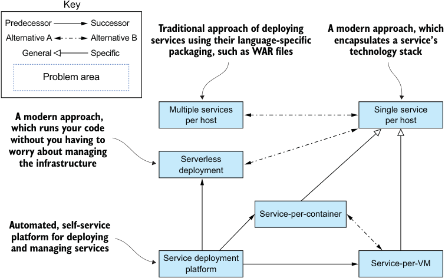

**----- Start of picture text -----** 
Key Predecessor Successor Traditional approach of deploying A modern approach, which Alternative A Alternative B services using their language-specific encapsulates a service’s General Specific packaging, such as WAR files technology stack Problem area Multiple services Single service A modern approach, per host per host which runs your code without you having to worry about managing the infrastructure Serverless deployment Service-per-container Automated, self-service platform for deploying and managing services Service deployment Service-per-VM platform **----- End of picture text -----** 

Figure 1.15 Several patterns for deploying microservices. The traditional approach is to deploy services in a language-specific packaging format. There are two modern approaches to deploying services. The first deploys services as VM or containers. The second is the serverless approach. You simply upload the service’s code and the serverless platform runs it. You should use a service deployment platform, which is an automated, self-service platform for deploying and managing services. 

**OBSERVABILITY PATTERNS PROVIDE INSIGHT INTO APPLICATION BEHAVIOR**

A key part of operating an application is understanding its runtime behavior and troubleshooting problems such as failed requests and high latency. Though understanding and troubleshooting a monolithic application isn’t always easy, it helps that requests are handled in a simple, straightforward way. Each incoming request is load balanced to a particular application instance, which makes a few calls to the database and returns a response. For example, if you need to understand how a particular request was handled, you look at the log file of the application instance that handled the request. 

In contrast, understanding and diagnosing problems in a microservice architecture is much more complicated. A request can bounce around between multiple services before a response is finally returned to a client. Consequently, there isn’t one log file to examine. Similarly, problems with latency are more difficult to diagnose because there are multiple suspects. 

You can use the following patterns to design observable services: 

- _Health check API_ —Expose an endpoint that returns the health of the service. 

- _Log aggregation_ —Log service activity and write logs into a centralized logging server, which provides searching and alerting. 

- _Distributed tracing_ —Assign each external request a unique ID and trace requests as they flow between services. 

- _Exception tracking_ —Report exceptions to an exception tracking service, which deduplicates exceptions, alerts developers, and tracks the resolution of each exception. 

- _Application metrics_ —Maintain metrics, such as counters and gauges, and expose them to a metrics server. 

- _Audit logging_ —Log user actions. 

Chapter 11 describes these patterns in more detail. 

**PATTERNS FOR THE AUTOMATED TESTING OF SERVICES**

The microservice architecture makes individual services easier to test because they’re much smaller than the monolithic application. At the same time, though, it’s important to test that the different services work together while avoiding using complex, slow, and brittle end-to-end tests that test multiple services together. Here are patterns for simplifying testing by testing services in isolation: 

- _Consumer-driven contract test_ —Verify that a service meets the expectations of its clients. 

- _Consumer-side contract test_ —Verify that the client of a service can communicate with the service. 

- _Service component test_ —Test a service in isolation. 

Chapters 9 and 10 describe these testing patterns in more detail. 

**PATTERNS FOR HANDLING CROSS-CUTTING CONCERNS**

In a microservice architecture, there are numerous concerns that every service must implement, including the observability patterns and discovery patterns. It must also implement the Externalized Configuration pattern, which supplies configuration parameters such as database credentials to a service at runtime. When developing a new service, it would be too time consuming to reimplement these concerns from scratch. A much better approach is to apply the Microservice Chassis pattern and build services on top of a framework that handles these concerns. Chapter 11 describes these patterns in more detail. 

**SECURITY PATTERNS**

In a microservice architecture, users are typically authenticated by the API gateway. It must then pass information about the user, such as identity and roles, to the services it invokes. A common solution is to apply the Access token pattern. The API gateway passes an access token, such as JWT (JSON Web Token), to the services, which can validate the token and obtain information about the user. Chapter 11 discusses the Access token pattern in more detail. 

Not surprisingly, the patterns in the Microservice architecture pattern language are focused on solving architect and design problems. You certainly need the right 

_**Beyond microservices: Process and organization**_ 

architecture in order to successfully develop software, but it’s not the only concern. You must also consider process and organization. 

## 1.7 Beyond microservices: Process and organization

For a large, complex application, the microservice architecture is usually the best choice. But in addition to having the right architecture, successful software development requires you to also have organization, and development and delivery processes. Figure 1.16 shows the relationships between process, organization, and architecture. 

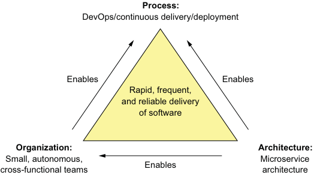

**----- Start of picture text -----** 
Process: DevOps/continuous delivery/deployment Enables Enables Rapid, frequent, and reliable delivery of software Organization: Architecture: Small, autonomous, Microservice Enables cross-functional teams architecture **----- End of picture text -----** 

Figure 1.16 The rapid, frequent, and reliable delivery of large, complex applications requires a combination of DevOps, which includes continuous delivery/deployment, small, autonomous teams, and the microservice architecture. 

I’ve already described the microservice architecture. Let’s look at organization and process. 

### 1.7.1 Software development and delivery organization

Success inevitably means that the engineering team will grow. On the one hand, that’s a good thing because more developers can get more done. The trouble with large teams is, as Fred Brooks wrote in _The Mythical Man-Month_ , the communication overhead of a team of size _N_ is _O_ ( _N_[2] ). If the team gets too large, it will become inefficient, due to the communication overhead. Imagine, for example, trying to do a daily standup with 20 people. 

The solution is to refactor a large single team into a team of teams. Each team is small, consisting of no more than 8–12 people. It has a clearly defined business-oriented mission: developing and possibly operating one or more services that implement a feature or a business capability. The team is cross-functional and can develop, test, and deploy its services without having to frequently communicate or coordinate with other teams. 

**The reverse Conway maneuver**

In order to effectively deliver software when using the microservice architecture, you need to take into account Conway’s law (https://en.wikipedia.org/wiki/Conway%27s _law), which states the following: 

_Organizations which design systems … are constrained to produce designs which are copies of the communication structures of these organizations._ 

**Melvin Conway**

In other words, your application’s architecture mirrors the structure of the organization that developed it. It’s important, therefore, to apply Conway’s law in reverse (www.thoughtworks.com/radar/techniques/inverse-conway-maneuver) and design your organization so that its structure mirrors your microservice architecture. By doing so, you ensure that your development teams are as loosely coupled as the services. 

The velocity of the team of teams is significantly higher than that of a single large team. As described earlier in section 1.5.1, the microservice architecture plays a key role in enabling the teams to be autonomous. Each team can develop, deploy, and scale their services without coordinating with other teams. Moreover, it’s very clear who to contact when a service isn’t meeting its SLA. 

What’s more, the development organization is much more scalable. You grow the organization by adding teams. If a single team becomes too large, you split it and its associated service or services. Because the teams are loosely coupled, you avoid the communication overhead of a large team. As a result, you can add people without impacting productivity. 

### 1.7.2 Software development and delivery process

Using the microservice architecture with a waterfall development process is like driving a horse-drawn Ferrari—you squander most of the benefit of using microservices. If you want to develop an application with the microservice architecture, it’s essential that you adopt agile development and deployment practices such as Scrum or Kanban. Better yet, you should practice continuous delivery/deployment, which is a part of DevOps. 

Jez Humble (https://continuousdelivery.com/) defines continuous delivery as follows: 

_Continuous Delivery is the ability to get changes of all types—including new features, configuration changes, bug fixes and experiments—into production, or into the hands of users, safely and quickly in a sustainable way._ 

A key characteristic of continuous delivery is that software is always releasable. It relies on a high level of automation, including automated testing. Continuous deployment takes continuous delivery one step further in the practice of automatically deploying releasable code into production. High-performing organizations 

_**Beyond microservices: Process and organization**_ 

that practice continuous deployment deploy multiple times per day into production, have far fewer production outages, and recover quickly from any that do occur (https://puppet.com/ resources/whitepaper/state-of-devops-report). As described earlier in section 1.5.1, the microservice architecture directly supports continuous delivery/deployment. 

**Move fast without breaking things**

The goal of continuous delivery/deployment (and, more generally, DevOps) is to rapidly yet reliably deliver software. Four useful metrics for assessing software development are as follows: 

- _Deployment frequency_ —How often software is deployed into production 

- _Lead time_ —Time from a developer checking in a change to that change being deployed 

- _Mean time to recover_ —Time to recover from a production problem 

- _Change failure rate_ —Percentage of changes that result in a production problem 

In a traditional organization, the deployment frequency is low, and the lead time is high. Stressed-out developers and operations people typically stay up late into the night fixing last-minute issues during the maintenance window. In contrast, a DevOps organization releases software frequently, often multiple times per day, with far fewer production issues. Amazon, for example, deployed changes into production every 11.6 seconds in 2014 (www.youtube.com/watch?v=dxk8b9rSKOo), and Netflix had a lead time of 16 minutes for one software component (https://medium.com/netflixtechblog/how-we-build-code-at-netflix-c5d9bd727f15). 

### 1.7.3 The human side of adopting microservices

Adopting the microservice architecture changes your architecture, your organization, and your development processes. Ultimately, though, it changes the working environment of people, who are, as mentioned earlier, emotional creatures. If ignored, their emotions can make the adoption of microservices a bumpy ride. Mary and the other FTGO leaders will struggle to change how FTGO develops software. 

The best-selling book _Managing Transitions_ (Da Capo Lifelong Books, 2017, https://wmbridges.com/books) by William and Susan Bridges introduces the concept of a _transition_ , which refers to the process of how people respond emotionally to a change. It describes a three-stage Transition Model: 

- 1 _Ending, Losing, and Letting Go_ —The period of emotional upheaval and resistance when people are presented with a change that forces them out of their comfort zone. They often mourn the loss of the old way of doing things. For example, when people reorganize into cross-functional teams, they miss their former teammates. Similarly, a data modeling group that owns the global data model will be threatened by the idea of each service having its own data model. 

- 2 _The Neutral Zone_ —The intermediate stage between the old and new ways of doing things, where people are often confused. They are often struggling to learn the new way of doing things. 

- 3 _The New Beginning_ —The final stage where people have enthusiastically embraced the new way of doing things and are starting to experience the benefits. 

The book describes how best to manage each stage of the transition and increase the likelihood of successfully implementing the change. FTGO is certainly suffering from monolithic hell and needs to migrate to a microservice architecture. It must also change its organization and development processes. In order for FTGO to successfully accomplish this, however, it must take into account the transition model and consider people’s emotions. 

In the next chapter, you’ll learn about the goal of software architecture and how to decompose an application into services. 

## Summary

- The Monolithic architecture pattern structures the application as a single deployable unit. 

- The Microservice architecture pattern decomposes a system into a set of independently deployable services, each with its own database. 

- The monolithic architecture is a good choice for simple applications, but microservice architecture is usually a better choice for large, complex applications. 

- The microservice architecture accelerates the velocity of software development by enabling small, autonomous teams to work in parallel. 

- The microservice architecture isn’t a silver bullet—there are significant drawbacks, including complexity. 

- The Microservice architecture pattern language is a collection of patterns that help you architect an application using the microservice architecture. It helps you decide whether to use the microservice architecture, and if you pick the microservice architecture, the pattern language helps you apply it effectively. 

- You need more than just the microservice architecture to accelerate software delivery. Successful software development also requires DevOps and small, autonomous teams. 

- Don’t forget about the human side of adopting microservices. You need to consider employees’ emotions in order to successfully transition to a microservice architecture. 

