# 2 Decomposition strategies

**This chapter covers**

- Understanding software architecture and why it’s important 

- Decomposing an application into services by applying the decomposition patterns Decompose by business capability and Decompose by subdomain 

- Using the bounded context concept from domaindriven design (DDD) to untangle data and make decomposition easier 

Sometimes you have to be careful what you wish for. After an intense lobbying effort, Mary had finally convinced the business that migrating to a microservice architecture was the right thing to do. Feeling a mixture of excitement and some trepidation, Mary had a morning-long meeting with her architects to discuss where to begin. During the discussion, it became apparent that some aspects of the Microservice architecture pattern language, such as deployment and service discovery, were new and unfamiliar, yet straightforward. The key challenge, which is the essence of the microservice architecture, is the functional decomposition of the application into services. The first and most important aspect of the architecture is, therefore, the definition of the services. As they stood around the whiteboard, the FTGO team wondered exactly how to do that! 

In this chapter, you’ll learn how to define a microservice architecture for an application. I describe strategies for decomposing an application into services. You’ll learn that services are organized around business concerns rather than technical concerns. I also show how to use ideas from domain-driven design (DDD) to eliminate god classes, which are classes that are used throughout an application and cause tangled dependencies that prevent decomposition. 

I begin this chapter by defining the microservice architecture in terms of software architecture concepts. After that, I describe a process for defining a microservice architecture for an application starting from its requirements. I discuss strategies for decomposing an application into a collection of services, obstacles to it, and how to overcome them. Let’s start by examining the concept of software architecture. 

## 2.1 What is the microservice architecture exactly?

Chapter 1 describes how the key idea of the microservice architecture is functional decomposition. Instead of developing one large application, you structure the application as a set of services. On one hand, describing the microservice architecture as a kind of functional decomposition is useful. But on the other hand, it leaves several questions unanswered, including how does the microservice architecture relate to the broader concepts of software architecture? What’s a service? And how important is the size of a service? 

In order to answer those questions, we need to take a step back and look at what is meant by _software architecture_ . The architecture of a software application is its high-level structure, which consists of constituent parts and the dependencies between those parts. As you’ll see in this section, an application’s architecture is multidimensional, so there are multiple ways to describe it. The reason architecture is important is because it determines the application’s software quality attributes or _-ilities_ . Traditionally, the goal of architecture has been scalability, reliability, and security. But today it’s important that the architecture also enables the rapid and safe delivery of software. You’ll learn that the microservice architecture is an architecture style that gives an application high maintainability, testability, and deployability. 

I begin this section by describing the concept of _software architecture_ and why it’s important. Next, I discuss the idea of an architectural style. Then I define the microservice architecture as a particular architectural style. Let’s start by looking at the concept of software architecture. 

### 2.1.1 What is software architecture and why does it matter?

Architecture is clearly important. There are at least two conferences dedicated to the topic: O’Reilly Software Architecture Conference (https://conferences.oreilly.com/ software-architecture) and the SATURN conference (https://resources.sei.cmu.edu/ news-events/events/saturn/). Many developers have the goal of becoming an architect. But what is architecture and why does it matter? 

To answer that question, I first define what is meant by the term _software architecture_ . After that, I discuss how an application’s architecture is multidimensional and is best described using a collection of views or blueprints. I then describe that software architecture matters because of its impact on the application’s software quality attributes. 

**A DEFINITION OF SOFTWARE ARCHITECTURE**

There are numerous definitions of software architecture. For example, see https:// en.wikiquote.org/wiki/Software_architecture to read some of them. My favorite definition comes from Len Bass and colleagues at the Software Engineering Institute (www.sei.cmu.edu), who played a key role in establishing software architecture as a discipline. They define software architecture as follows: 

_The software architecture of a computing system is the set of structures needed to reason about the system, which comprise software elements, relations among them, and properties of both._ 

Documenting Software Architectures by Bass et al. 

That’s obviously a quite abstract definition. But its essence is that an application’s architecture is its decomposition into parts (the elements) and the relationships (the relations) between those parts. Decomposition is important for a couple of reasons: 

- It facilitates the division of labor and knowledge. It enables multiple people (or multiple teams) with possibly specialized knowledge to work productively together on an application. 

- It defines how the software elements interact. 

It’s the decomposition into parts and the relationships between those parts that determine the application’s _-ilities_ . 

**THE 4+1 VIEW MODEL OF SOFTWARE ARCHITECTURE**

More concretely, an application’s architecture can be viewed from multiple perspectives, in the same way that a building’s architecture can be viewed from structural, plumbing, electrical, and other perspectives. Phillip Krutchen wrote a classic paper describing the 4+1 view model of software architecture, “Architectural Blueprints— The ‘4+1’ View Model of Software Architecture” (www.cs.ubc.ca/~gregor/teaching/ papers/4+1view-architecture.pdf). The 4+1 model, shown in Figure 2.1, defines four different views of a software architecture. Each describes a particular aspect of the architecture and consists of a particular set of software elements and relationships between them. 

The purpose of each view is as follows: 

- _Logical view_ —The software elements that are created by developers. In objectoriented languages, these elements are classes and packages. The relations between them are the relationships between classes and packages, including inheritance, associations, and depends-on. 

- _Implementation view_ —The output of the build system. This view consists of modules, which represent packaged code, and components, which are executable 

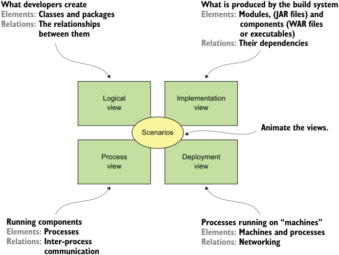

**----- Start of picture text -----** 
What developers create What is produced by the build system Elements: Classes and packages Elements: Modules, (JAR files) and Relations: The relationships components (WAR files between them or executables) Relations: Their dependencies Logical Implementation view view Animate the views. Scenarios Process Deployment view view Running components Processes running on “machines” Elements: Processes Elements: Machines and processes Relations: Inter-process Relations: Networking communication **----- End of picture text -----** 

Figure 2.1 The 4+1 view model describes an application’s architecture using four views, along with scenarios that show how the elements within each view collaborate to handle requests. or deployable units consisting of one or more modules. In Java, a module is a JAR file, and a component is typically a WAR file or an executable JAR file. The relations between them include dependency relationships between modules and composition relationships between components and modules. 

- _Process view_ —The components at runtime. Each element is a process, and the relations between processes represent interprocess communication. 

- _Deployment_ —How the processes are mapped to machines. The elements in this view consist of (physical or virtual) machines and the processes. The relations between machines represent networking. This view also describes the relationship between processes and machines. 

In addition to these four views, there are the scenarios—the +1 in the 4+1 model— that animate views. Each scenario describes how the various architectural components within a particular view collaborate in order to handle a request. A scenario in the logical view, for example, shows how the classes collaborate. Similarly, a scenario in the process view shows how the processes collaborate. 

The 4+1 view model is an excellent way to describe an applications’s architecture. Each view describes an important aspect of the architecture, and the scenarios 

illustrate how the elements of a view collaborate. Let’s now look at why architecture is important. 

**WHY ARCHITECTURE MATTERS**

An application has two categories of requirements. The first category includes the _functional_ requirements, which define what the application must do. They’re usually in the form of use cases or user stories. Architecture has very little to do with the functional requirements. You can implement functional requirements with almost any architecture, even a big ball of mud. 

Architecture is important because it enables an application to satisfy the second category of requirements: its _quality of service_ requirements. These are also known as _quality attributes_ and are the so-called _-ilities_ . The quality of service requirements define the runtime qualities such as scalability and reliability. They also define development time qualities including maintainability, testability, and deployability. The architecture you choose for your application determines how well it meets these quality requirements. 

### 2.1.2 Overview of architectural styles

In the physical world, a building’s architecture often follows a particular style, such as Victorian, American Craftsman, or Art Deco. Each style is a package of design decisions that constrains a building’s features and building materials. The concept of architectural style also applies to software. David Garlan and Mary Shaw (An Introduction to Software Architecture, January 1994, https://www.cs.cmu.edu/afs/cs/project/ able/ftp/intro_softarch/intro_softarch.pdf), pioneers in the discipline of software architecture, define an architectural style as follows: 

_An architectural style, then, defines a family of such systems in terms of a pattern of structural organization. More specifically, an architectural style determines the vocabulary of components and connectors that can be used in instances of that style, together with a set of constraints on how they can be combined._ 

A particular architectural style provides a limited palette of elements (components) and relations (connectors) from which you can define a view of your application’s architecture. An application typically uses a combination of architectural styles. For example, later in this section I describe how the monolithic architecture is an architectural style that structures the implementation view as a single (executable/deployable) component. The microservice architecture structures an application as a set of loosely coupled services. 

**THE LAYERED ARCHITECTURAL STYLE**

The classic example of an architectural style is the layered architecture. A _layered architecture_ organizes software elements into layers. Each layer has a well-defined set of responsibilities. A layered architecture also constraints the dependencies between the layers. A layer can only depend on either the layer immediately below it (if strict layering) or any of the layers below it. 

You can apply the layered architecture to any of the four views discussed earlier. The popular three-tier architecture is the layered architecture applied to the logical view. It organizes the application’s classes into the following tiers or layers: 

- _Presentation layer_ —Contains code that implements the user interface or external APIs 

- _Business logic layer_ —Contains the business logic 

- _Persistence layer_ —Implements the logic of interacting with the database 

The layered architecture is a great example of an architectural style, but it does have some significant drawbacks: 

- _Single presentation layer_ —It doesn’t represent the fact that an application is likely to be invoked by more than just a single system. 

- _Single persistence layer_ —It doesn’t represent the fact that an application is likely to interact with more than just a single database. 

- _Defines the business logic layer as depending on the persistence layer_ —In theory, this dependency prevents you from testing the business logic without the database. 

Also, the layered architecture misrepresents the dependencies in a well-designed application. The business logic typically defines an interface or a repository of interfaces that define data access methods. The persistence tier defines DAO classes that implement the repository interfaces. In other words, the dependencies are the reverse of what’s depicted by a layered architecture. 

Let’s look at an alternative architecture that overcomes these drawbacks: the hexagonal architecture. 

**ABOUT THE HEXAGONAL ARCHITECTURE STYLE**

_Hexagonal architecture_ is an alternative to the layered architectural style. As figure 2.2 shows, the hexagonal architecture style organizes the logical view in a way that places the business logic at the center. Instead of the presentation layer, the application has one or more _inbound adapters_ that handle requests from the outside by invoking the business logic. Similarly, instead of a data persistence tier, the application has one or more _outbound adapters_ that are invoked by the business logic and invoke external applications. A key characteristic and benefit of this architecture is that the business logic doesn’t depend on the adapters. Instead, they depend upon it. 

The business logic has one or more ports. A _port_ defines a set of operations and is how the business logic interacts with what’s outside of it. In Java, for example, a port is often a Java interface. There are two kinds of ports: inbound and outbound ports. An inbound port is an API exposed by the business logic, which enables it to be invoked by external applications. An example of an inbound port is a service interface, which defines a service’s public methods. An outbound port is how the business logic invokes external systems. An example of an output port is a repository interface, which defines a collection of data access operations. 

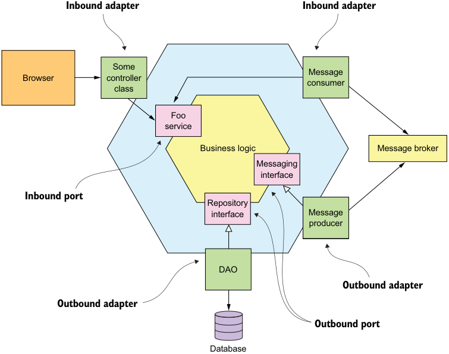

**----- Start of picture text -----** 
Inbound adapter Inbound adapter Some Message Browser controller consumer class Foo service Business logic Message broker Messaging interface Inbound port Repository interface Message producer DAO Outbound adapter Outbound adapter Outbound port Database **----- End of picture text -----** 

Figure 2.2 An example of a hexagonal architecture, which consists of the business logic and one or more adapters that communicate with external systems. The business logic has one or more ports. Inbound adapters, which handled requests from external systems, invoke an inbound port. An outbound adapter implements an outbound port, and invokes an external system. 

Surrounding the business logic are adapters. As with ports, there are two types of adapters: inbound and outbound. An inbound adapter handles requests from the outside world by invoking an inbound port. An example of an inbound adapter is a Spring MVC Controller that implements either a set of REST endpoints or a set of web pages. Another example is a message broker client that subscribes to messages. Multiple inbound adapters can invoke the same inbound port. 

An outbound adapter implements an outbound port and handles requests from the business logic by invoking an external application or service. An example of an outbound adapter is a _data access object_ (DAO) class that implements operations for accessing a database. Another example would be a proxy class that invokes a remote service. Outbound adapters can also publish events. 

An important benefit of the hexagonal architectural style is that it decouples the business logic from the presentation and data access logic in the adapters. The business logic doesn’t depend on either the presentation logic or the data access logic. 

Because of this decoupling, it’s much easier to test the business logic in isolation. Another benefit is that it more accurately reflects the architecture of a modern application. The business logic can be invoked via multiple adapters, each of which implements a particular API or UI. The business logic can also invoke multiple adapters, each one of which invokes a different external system. Hexagonal architecture is a great way to describe the architecture of each service in a microservice architecture. 

The layered and hexagonal architectures are both examples of architectural styles. Each defines the building blocks of an architecture and imposes constraints on the relationships between them. The hexagonal architecture and the layered architecture, in the form of a three-tier architecture, organize the logical view. Let’s now define the microservice architecture as an architectural style that organizes the implementation view. 

### 2.1.3 The microservice architecture is an architectural style

I’ve discussed the 4+1 view model and architectural styles, so I can now define monolithic and microservice architecture. They’re both architectural styles. Monolithic architecture is an architectural style that structures the implementation view as a single component: a single executable or WAR file. This definition says nothing about the other views. A monolithic application can, for example, have a logical view that’s organized along the lines of a hexagonal architecture. 

**Pattern: Monolithic architecture**

Structure the application as a single executable/deployable component. See http:// microservices.io/patterns/ monolithic.html. 

The microservice architecture is also an architectural style. It structures the implementation view as a set of multiple components: executables or WAR files. The components are services, and the connectors are the communication protocols that enable those services to collaborate. Each service has its own logical view architecture, which is typically a hexagonal architecture. Figure 2.3 shows a possible microservice architecture for the FTGO application. The services in this architecture correspond to business capabilities, such as Order management and Restaurant management. 

**Pattern: Microservice architecture**

Structure the application as a collection of loosely coupled, independently deployable services. See http://microservices.io/patterns/microservices.html. 

Later in this chapter, I describe what is meant by _business capability_ . The connectors between services are implemented using interprocess communication mechanisms such as REST APIs and asynchronous messaging. Chapter 3 discusses interprocess communication in more detail. 

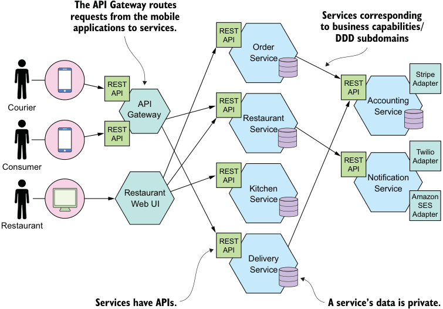

**----- Start of picture text -----** 
The API Gateway routes requests from the mobile Services corresponding applications to services. REST to business capabilities/ API DDD subdomains Order Service Stripe REST REST Adapter API API Courier GatewayAPI RESTAPI Restaurant AccountingService REST Service API Twilio REST Adapter Consumer REST API API Notification Kitchen Service Restaurant Service Amazon Web UI SES Adapter Restaurant REST API Delivery Service Services have APIs. A service’s data is private. **----- End of picture text -----** 

Figure 2.3 A possible microservice architecture for the FTGO application. It consists of numerous services. 

A key constraint imposed by the microservice architecture is that the services are loosely coupled. Consequently, there are restrictions on how the services collaborate. In order to explain those restrictions, I’ll attempt to define the term _service_ , describe what it means to be loosely coupled, and tell you why this matters. 

**WHAT IS A SERVICE?**

A _service_ is a standalone, independently deployable software component that implements some useful functionality. Figure 2.4 shows the external view of a service, which in this example is the Order Service. A service has an API that provides its clients access to its functionality. There are two types of operations: commands and queries. The API consists of commands, queries, and events. A command, such as createOrder(), performs actions and updates data. A query, such as findOrderById(), retrieves data. A service also publishes events, such as OrderCreated, which are consumed by its clients. 

A service’s API encapsulates its internal implementation. Unlike in a monolith, a developer can’t write code that bypasses its API. As a result, the microservice architecture enforces the application’s modularity. 

Each service in a microservice architecture has its own architecture and, potentially, technology stack. But a typical service has a hexagonal architecture. Its API is implemented by adapters that interact with the service’s business logic. The operations 

**Defines operations** 

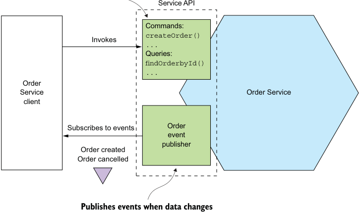

**----- Start of picture text -----** 
Service API Commands: createOrder() Invokes ... Queries: findOrderbyId() ... Order Service Order Service client Subscribes to events Order event publisher Order created Order cancelled Publishes events when data changes **----- End of picture text -----** 

Figure 2.4 A service has an API that encapsulates the implementation. The API defines operations, which are invoked by clients. There are two types of operations: commands update data, and queries retrieve data. When its data changes, a service publishes events that clients can subscribe to. adapter invokes the business logic, and the events adapter publishes events emitted by the business logic. 

Later in chapter 12, when I discuss deployment technologies, you’ll see that the implementation view of a service can take many forms. The component might be a standalone process, a web application or OSGI bundle running in a container, or a serverless cloud function. An essential requirement, however, is that a service has an API and is independently deployable. 

**WHAT IS LOOSE COUPLING?**

An important characteristic of the microservice architecture is that the services are loosely coupled (https://en.wikipedia.org/wiki/Loose_coupling). All interaction with a service happens via its API, which encapsulates its implementation details. This enables the implementation of the service to change without impacting its clients. Loosely coupled services are key to improving an application’s development time attributes, including its maintainability and testability. They are much easier to understand, change, and test. 

The requirement for services to be loosely coupled and to collaborate only via APIs prohibits services from communicating via a database. You must treat a service’s persistent data like the fields of a class and keep them private. Keeping the data private enables a developer to change their service’s database schema without having to spend time coordinating with developers working on other services. Not sharing database tables also improves runtime isolation. It ensures, for example, that one service can’t hold database locks that block another service. Later on, though, you’ll learn that one downside of not sharing databases is that maintaining data consistency and querying across services are more complex. 

**THE ROLE OF SHARED LIBRARIES**

Developers often package functionality in a library (module) so that it can be reused by multiple applications without duplicating code. After all, where would we be today without Maven or npm repositories? You might be tempted to also use shared libraries in microservice architecture. On the surface, it looks like a good way to reduce code duplication in your services. But you need to ensure that you don’t accidentally introduce coupling between your services. 

Imagine, for example, that multiple services need to update the Order business object. One approach is to package that functionality as a library that’s used by multiple services. On one hand, using a library eliminates code duplication. On the other hand, consider what happens when the requirements change in a way that affects the Order business object. You would need to simultaneously rebuild and redeploy those services. A much better approach would be to implement functionality that’s likely to change, such as Order management, as a service. 

You should strive to use libraries for functionality that’s unlikely to change. For example, in a typical application it makes no sense for every service to implement a generic Money class. Instead, you should create a library that’s used by the services. 

**THE SIZE OF A SERVICE IS MOSTLY UNIMPORTANT**

One problem with the term _microservice_ is that the first thing you hear is _micro_ . This suggests that a service should be very small. This is also true of other size-based terms such as miniservice or nanoservice. In reality, size isn’t a useful metric. 

A much better goal is to define a well-designed service to be a service capable of being developed by a small team with minimal lead time and with minimal collaboration with other teams. In theory, a team might only be responsible for a single service, so that service is by no means _micro_ . Conversely, if a service requires a large team or takes a long time to test, it probably makes sense to split the team and the service. Or if you constantly need to change a service because of changes to other services or if it’s triggering changes in other services, that’s a sign that it’s not loosely coupled. You might even have built a distributed monolith. 

The microservice architecture structures an application as a set of small, loosely coupled services. As a result, it improves the development time attributes—maintainability, testability, deployability, and so on—and enables an organization to develop better software faster. It also improves an application’s scalability, although that’s not the main goal. To develop a microservice architecture for your application, you need to identify the services and determine how they collaborate. Let’s look at how to do that. 

## 2.2 Defining an application?s microservice architecture

How should we define a microservice architecture? As with any software development effort, the starting points are the written requirements, hopefully domain experts, and perhaps an existing application. Like much of software development, defining an architecture is more art than science. This section describes a simple, three-step process, shown in figure 2.5, for defining an application’s architecture. It’s important to remember, though, that it’s not a process you can follow mechanically. It’s likely to be iterative and involve a lot of creativity. 

**----- Start of picture text -----** 
The starting point are the requirements, such as the user stories. **----- End of picture text -----** 

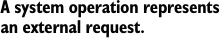

**----- Start of picture text -----** 
A system operation represents an external request. **----- End of picture text -----** 

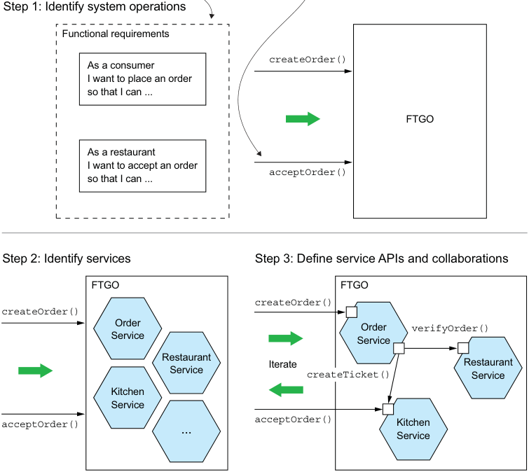

**----- Start of picture text -----** 
Step 1: Identify system operations Functional requirements createOrder() As a consumer I want to place an order so that I can ... FTGO As a restaurant I want to accept an order acceptOrder() so that I can ... Step 2: Identify services Step 3: Define service APIs and collaborations FTGO FTGO createOrder() createOrder() Order Order verifyOrder() Service Service Restaurant Iterate Restaurant Service createTicket() Service Kitchen Service acceptOrder() acceptOrder() Kitchen ... Service **----- End of picture text -----** 

Figure 2.5 A three-step process for defining an application’s microservice architecture 

An application exists to handle requests, so the first step in defining its architecture is to distill the application’s requirements into the key requests. But instead of describing the requests in terms of specific IPC technologies such as REST or messaging, I use the more abstract notion of system operation. A _system operation_ is an abstraction of a request that the application must handle. It’s either a command, which updates data, or a query, which retrieves data. The behavior of each command is defined in terms of an abstract domain model, which is also derived from the requirements. The system operations become the architectural scenarios that illustrate how the services collaborate. 

The second step in the process is to determine the decomposition into services. There are several strategies to choose from. One strategy, which has its origins in the discipline of business architecture, is to define services corresponding to business capabilities. Another strategy is to organize services around domain-driven design subdomains. The end result is services that are organized around business concepts rather than technical concepts. 

The third step in defining the application’s architecture is to determine each service’s API. To do that, you assign each system operation identified in the first step to a service. A service might implement an operation entirely by itself. Alternatively, it might need to collaborate with other services. In that case, you determine how the services collaborate, which typically requires services to support additional operations. You’ll also need to decide which of the IPC mechanisms I describe in chapter 3 to implement each service’s API. 

There are several obstacles to decomposition. The first is network latency. You might discover that a particular decomposition would be impractical due to too many round-trips between services. Another obstacle to decomposition is that synchronous communication between services reduces availability. You might need to use the concept of self-contained services, described in chapter 3. The third obstacle is the requirement to maintain data consistency across services. You’ll typically need to use sagas, discussed in chapter 4. The fourth and final obstacle to decomposition is socalled god classes, which are used throughout an application. Fortunately, you can use concepts from domain-driven design to eliminate god classes. 

This section first describes how to identity an application’s operations. After that, we’ll look at strategies and guidelines for decomposing an application into services, and at obstacles to decomposition and how to address them. Finally, I’ll describe how to define each service’s API. 

### 2.2.1 Identifying the system operations

The first step in defining an application’s architecture is to define the system operations. The starting point is the application’s requirements, including user stories and their associated user scenarios (note that these are different from the architectural scenarios). The system operations are identified and defined using the two-step process shown in figure 2.6. This process is inspired by the object-oriented design process covered in Craig Larman’s book _Applying UML and Patterns_ (Prentice Hall, 2004) (see www.craiglarman.com/wiki/index.php?title=Book_Applying_UML_and_Patterns for details). The first step creates the high-level domain model consisting of the key classes that provide a vocabulary with which to describe the system operations. The second step identifies the system operations and describes each one’s behavior in terms of the domain model. 

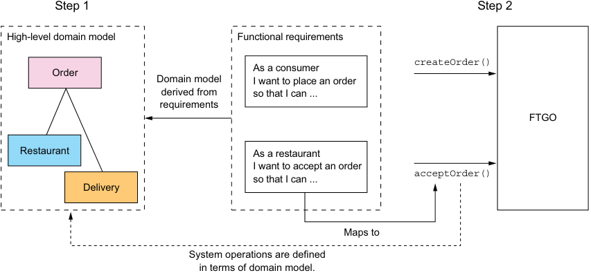

**----- Start of picture text -----** 
Step 1 Step 2 High-level domain model Functional requirements createOrder() As a consumer Order Domain model I want to place an order derived from so that I can ... requirements FTGO Restaurant As a restaurant I want to accept an order acceptOrder() so that I can ... Delivery Maps to System operations are defined in terms of domain model. **----- End of picture text -----** 

Figure 2.6 System operations are derived from the application’s requirements using a two-step process. The first step is to create a high-level domain model. The second step is to define the system operations, which are defined in terms of the domain model. 

The domain model is derived primarily from the nouns of the user stories, and the system operations are derived mostly from the verbs. You could also define the domain model using a technique called Event Storming, which I talk about in chapter 5. The behavior of each system operation is described in terms of its effect on one or more domain objects and the relationships between them. A system operation can create, update, or delete domain objects, as well as create or destroy relationships between them. 

Let’s look at how to define a high-level domain model. After that I’ll define the system operations in terms of the domain model. 

**CREATING A HIGH-LEVEL DOMAIN MODEL**

The first step in the process of defining the system operations is to sketch a highlevel domain model for the application. Note that this domain model is much simpler than what will ultimately be implemented. The application won’t even have a single domain model because, as you’ll soon learn, each service has its own domain model. Despite being a drastic simplification, a high-level domain model is useful at this stage because it defines the vocabulary for describing the behavior of the system operations. 

A domain model is created using standard techniques such as analyzing the nouns in the stories and scenarios and talking to the domain experts. Consider, for example, 

the Place Order story. We can expand that story into numerous user scenarios including this one: 

- Given a consumer 

- And a restaurant 

- And a delivery address/time that can be served by that restaurant And an order total that meets the restaurant's order minimum 

- When the consumer places an order for the restaurant 

- Then consumer's credit card is authorized 

- And an order is created in the PENDING_ACCEPTANCE state And the order is associated with the consumer And the order is associated with the restaurant 

The nouns in this user scenario hint at the existence of various classes, including Consumer, Order, Restaurant, and CreditCard. 

Similarly, the Accept Order story can be expanded into a scenario such as this one: 

Given an order that is in the PENDING_ACCEPTANCE state and a courier that is available to deliver the order 

- When a restaurant accepts an order with a promise to prepare by a particular time 

- Then the state of the order is changed to ACCEPTED 

- And the order's promiseByTime is updated to the promised time And the courier is assigned to deliver the order 

This scenario suggests the existence of Courier and Delivery classes. The end result after a few iterations of analysis will be a domain model that consists, unsurprisingly, of those classes and others, such as MenuItem and Address. Figure 2.7 is a class diagram that shows the key classes. 

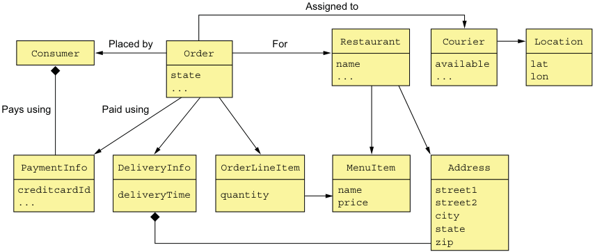

**----- Start of picture text -----** 
Assigned to Placed by For Restaurant Courier Location Consumer Order name available lat state ... ... lon ... Pays using Paid using PaymentInfo DeliveryInfo OrderLineItem MenuItem Address creditcardId deliveryTime quantity name street1 ... price street2 city state zip **----- End of picture text -----** 

Figure 2.7 The key classes in the FTGO domain model 

The responsibilities of each class are as follows: 

- Consumer—A consumer who places orders. 

- Order—An order placed by a consumer. It describes the order and tracks its status. 

- OrderLineItem—A line item of an Order. 

- DeliveryInfo—The time and place to deliver an order. 

- Restaurant—A restaurant that prepares orders for delivery to consumers. 

- MenuItem—An item on the restaurant’s menu. 

- Courier—A courier who deliver orders to consumers. It tracks the availability of the courier and their current location. 

- Address—The address of a Consumer or a Restaurant. 

- Location—The latitude and longitude of a Courier. 

A class diagram such as the one in figure 2.7 illustrates one aspect of an application’s architecture. But it isn’t much more than a pretty picture without the scenarios to animate it. The next step is to define the system operations, which correspond to architectural scenarios. 

**DEFINING SYSTEM OPERATIONS**

Once you’ve defined a high-level domain model, the next step is to identify the requests that the application must handle. The details of the UI are beyond the scope of this book, but you can imagine that in each user scenario, the UI will make requests to the backend business logic to retrieve and update data. FTGO is primarily a web application, which means that most requests are HTTP-based, but it’s possible that some clients might use messaging. Instead of committing to a specific protocol, therefore, it makes sense to use the more abstract notion of a system operation to represent requests. 

There are two types of system operations: 

- _Commands_ —System operations that create, update, and delete data 

- _Queries_ —System operations that read (query) data 

Ultimately, these system operations will correspond to REST, RPC, or messaging endpoints, but for now thinking of them abstractly is useful. Let’s first identify some commands. 

A good starting point for identifying system commands is to analyze the verbs in the user stories and scenarios. Consider, for example, the Place Order story. It clearly suggests that the system must provide a Create Order operation. Many other stories individually map directly to system commands. Table 2.1 lists some of the key system commands. 

Table 2.1 Key system commands for the FTGO application 

|Actor|Story|Command|Description|
|---|---|---|---|
|Consumer Restaurant|Create Order Accept Order|createOrder() acceptOrder()|Creates an order Indicates that the restaurant has accepted the order and is committed to preparing it by the indicated time|

Table 2.1 Key system commands for the FTGO application _(continued)_ 

|Actor|Story|Command|Description|
|---|---|---|---|
|Restaurant Courier Courier Courier|Order Ready for Pickup Update Location Delivery picked up Delivery delivered|noteOrderReadyForPickup() noteUpdatedLocation() noteDeliveryPickedUp() noteDeliveryDelivered()|Indicates that the order is ready for pickup Updates the current location of the courier Indicates that the courier has picked up the order Indicates that the courier has deliv- ered the order|

A command has a specification that defines its parameters, return value, and behavior in terms of the domain model classes. The behavior specification consists of preconditions that must be true when the operation is invoked, and post-conditions that are true after the operation is invoked. Here, for example, is the specification of the createOrder() system operation: 

|Operation Returns Preconditions Post-conditions|createOrder(consumer id, payment method, delivery address, delivery time, restaurant id, order line items) orderId, … The consumer exists and can place orders. The line items correspond to the restaurant’s menu items. The delivery address and time can be serviced by the restaurant. The consumer’s credit card was authorized for the order total. An order was created in thePENDING_ACCEPTANCEstate.|
|---|---|

The preconditions mirror the _givens_ in the Place Order user scenario described earlier. The post-conditions mirror the _thens_ from the scenario. When a system operation is invoked it will verify the preconditions and perform the actions required to make the post-conditions true. 

Here’s the specification of the acceptOrder() system operation: 

|Operation Returns Preconditions Post-conditions|acceptOrder(restaurantId, orderId, readyByTime) — Theorder.statusisPENDING_ACCEPTANCE. A courier is available to deliver the order. Theorder.statuswas changed toACCEPTED. Theorder.readyByTimewas changed to thereadyByTime. The courier was assigned to deliver the order.|
|---|---|

Its pre- and post-conditions mirror the user scenario from earlier. 

Most of the architecturally relevant system operations are commands. Sometimes, though, queries, which retrieve data, are also important. 

Besides implementing commands, an application must also implement queries. The queries provide the UI with the information a user needs to make decisions. At this stage, we don’t have a particular UI design for FTGO application in mind, but consider, for example, the flow when a consumer places an order: 

- 1 User enters delivery address and time. 

- 2 System displays available restaurants. 

- 3 User selects restaurant. 

- 4 System displays menu. 

- 5 User selects item and checks out. 

- 6 System creates order. 

This user scenario suggests the following queries: 

- findAvailableRestaurants(deliveryAddress, deliveryTime)—Retrieves the restaurants that can deliver to the specified delivery address at the specified time 

- findRestaurantMenu(id)—Retrieves information about a restaurant including the menu items 

Of the two queries, findAvailableRestaurants() is probably the most architecturally significant. It’s a complex query involving geosearch. The geosearch component of the query consists of finding all points—restaurants—that are near a location—the delivery address. It also filters out those restaurants that are closed when the order needs to be prepared and picked up. Moreover, performance is critical, because this query is executed whenever a consumer wants to place an order. 

The high-level domain model and the system operations capture what the application does. They help drive the definition of the application’s architecture. The behavior of each system operation is described in terms of the domain model. Each important system operation represents an architecturally significant scenario that’s part of the description of the architecture. 

Once the system operations have been defined, the next step is to identify the application’s services. As mentioned earlier, there isn’t a mechanical process to follow. There are, however, various decomposition strategies that you can use. Each one attacks the problem from a different perspective and uses its own terminology. But with all strategies, the end result is the same: an architecture consisting of services that are primarily organized around business rather than technical concepts. 

Let’s look at the first strategy, which defines services corresponding to business capabilities. 

### 2.2.2 Defining services by applying the Decompose by business capability pattern

One strategy for creating a microservice architecture is to decompose by business capability. A concept from business architecture modeling, a _business capability_ is something that a business does in order to generate value. The set of capabilities for a given business depends on the kind of business. For example, the capabilities of an insurance company typically include Underwriting, Claims management, Billing, Compliance, and so on. The capabilities of an online store include Order management, Inventory management, Shipping, and so on. 

**Pattern: Decompose by business capability**

Define services corresponding to business capabilities. See http://microservices.io/ patterns/decomposition/decompose-by-business-capability.html. 

**BUSINESS CAPABILITIES DEFINE WHAT AN ORGANIZATION DOES**

An organization’s business capabilities capture _what_ an organization’s business is. They’re generally stable, as opposed to _how_ an organization conducts its business, which changes over time, sometimes dramatically. That’s especially true today, with the rapidly growing use of technology to automate many business processes. For example, it wasn’t that long ago that you deposited checks at your bank by handing them to a teller. It then became possible to deposit checks using an ATM. Today you can conveniently deposit most checks using your smartphone. As you can see, the Deposit check business capability has remained stable, but the manner in which it’s done has drastically changed. 

**IDENTIFYING BUSINESS CAPABILITIES**

An organization’s business capabilities are identified by analyzing the organization’s purpose, structure, and business processes. Each business capability can be thought of as a service, except it’s business-oriented rather than technical. Its specification consists of various components, including inputs, outputs, and service-level agreements. For example, the input to an Insurance underwriting capability is the consumer’s application, and the outputs include approval and price. 

A business capability is often focused on a particular business object. For example, the Claim business object is the focus of the Claim management capability. A capability can often be decomposed into sub-capabilities. For example, the Claim management capability has several sub-capabilities, including Claim information management, Claim review, and Claim payment management. 

It is not difficult to imagine that the business capabilities for FTGO include the following: 

- Supplier management 

   - _Courier management_ —Managing courier information 

   - _Restaurant information management_ —Managing restaurant menus and other information, including location and open hours 

- Consumer management—Managing information about consumers 

- Order taking and fulfillment 

   - _Order management_ —Enabling consumers to create and manage orders 

   - _Restaurant order management_ —Managing the preparation of orders at a restaurant 

   - Logistics 

   - _Courier availability management_ —Managing the real-time availability of couriers to delivery orders 

   - _Delivery management_ —Delivering orders to consumers 

- Accounting 

   - _Consumer accounting_ —Managing billing of consumers 

   - _Restaurant accounting_ —Managing payments to restaurants 

   - _Courier accounting_ —Managing payments to couriers 

- … 

The top-level capabilities include Supplier management, Consumer management, Order taking and fulfillment, and Accounting. There will likely be many other toplevel capabilities, including marketing-related capabilities. Most top-level capabilities are decomposed into sub-capabilities. For example, Order taking and fulfillment is decomposed into five sub-capabilities. 

On interesting aspect of this capability hierarchy is that there are three restaurantrelated capabilities: Restaurant information management, Restaurant order management, and Restaurant accounting. That’s because they represent three very different aspects of restaurant operations. 

Next we’ll look at how to use business capabilities to define services. 

**FROM BUSINESS CAPABILITIES TO SERVICES**

Once you’ve identified the business capabilities, you then define a service for each capability or group of related capabilities. Figure 2.8 shows the mapping from capabilities to services for the FTGO application. Some top-level capabilities, such as the Accounting capability, are mapped to services. In other cases, sub-capabilities are mapped to services. 

The decision of which level of the capability hierarchy to map to services, because is somewhat subjective. My justification for this particular mapping is as follows: 

- I mapped the sub-capabilities of Supplier management to two services, because Restaurants and Couriers are very different types of suppliers. 

- I mapped the Order taking and fulfillment capability to three services that are each responsible for different phases of the process. I combined the Courier availability management and Delivery management capabilities and mapped them to a single service because they’re deeply intertwined. 

- I mapped the Accounting capability to its own service, because the different types of accounting seem similar. 

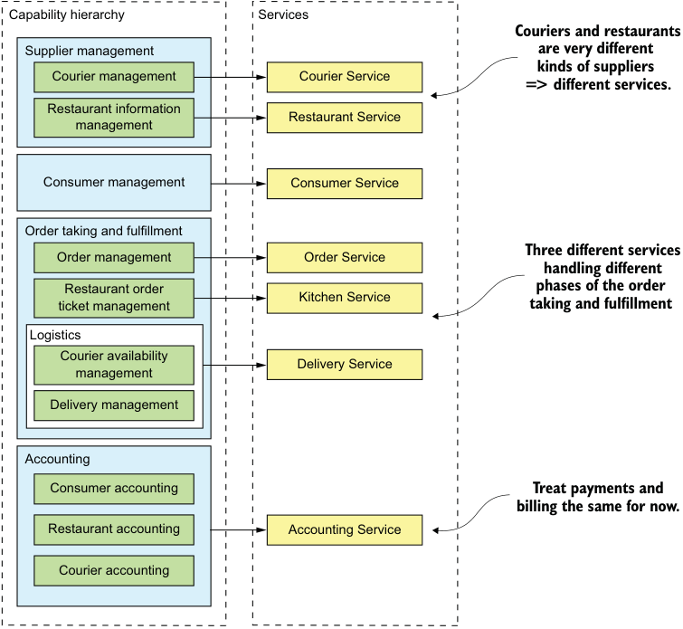

**----- Start of picture text -----** 
Capability hierarchy Services Couriers and restaurants Supplier management are very different Courier management Courier Service kinds of suppliers => different services. Restaurant information Restaurant Service management Consumer management Consumer Service Order taking and fulfillment Three different services Order management Order Service handling different Restaurant order phases of the order ticket management Kitchen Service taking and fulfillment Logistics Courier availability Delivery Service management Delivery management Accounting Consumer accounting Treat payments and billing the same for now. Restaurant accounting Accounting Service Courier accounting **----- End of picture text -----** 

Figure 2.8 Mapping FTGO business capabilities to services. Capabilities at various levels of the capability hierarchy are mapped to services. 

Later on, it may make sense to separate payments (of Restaurants and Couriers) and billing (of Consumers). 

A key benefit of organizing services around capabilities is that because they’re stable, the resulting architecture will also be relatively stable. The individual components of the architecture may evolve as the _how_ aspect of the business changes, but the architecture remains unchanged. 

Having said that, it’s important to remember that the services shown in figure 2.8 are merely the first attempt at defining the architecture. They may evolve over time as we learn more about the application domain. In particular, an important step in the architecture definition process is investigating how the services collaborate in each of the key architectural services. You might, for example, discover that a particular decomposition is inefficient due to excessive interprocess communication and that you must combine services. Conversely, a service might grow in complexity to the point where it becomes worthwhile to split it into multiple services. What’s more, in section 2.2.5, I describe several obstacles to decomposition that might cause you to revisit your decision. 

Let’s take a look at another way to decompose an application that is based on domain-driven design. 

### 2.2.3 Defining services by applying the Decompose by sub-domain pattern

DDD, as described in the excellent book Domain-driven design by Eric Evans (Addison-Wesley Professional, 2003), is an approach for building complex software applications that is centered on the development of an object-oriented domain model. A _domain mode_ captures knowledge about a domain in a form that can be used to solve problems within that domain. It defines the vocabulary used by the team, what DDD calls the _Ubiquitous Language_ . The domain model is closely mirrored in the design and implementation of the application. DDD has two concepts that are incredibly useful when applying the microservice architecture: subdomains and bounded contexts. 

**Pattern: Decompose by subdomain**

Define services corresponding to DDD subdomains. See http://microservices.io /patterns/decomposition/decompose-by-subdomain.html. 

DDD is quite different than the traditional approach to enterprise modeling, which creates a single model for the entire enterprise. In such a model there would be, for example, a single definition of each business entity, such as customer, order, and so on. The problem with this kind of modeling is that getting different parts of an organization to agree on a single model is a monumental task. Also, it means that from the perspective of a given part of the organization, the model is overly complex for their needs. Moreover, the domain model can be confusing because different parts of the organization might use either the same term for different concepts or different terms for the same concept. DDD avoids these problems by defining multiple domain models, each with an explicit scope. 

DDD defines a separate domain model for each subdomain. A subdomain is a part of the _domain_ , DDD’s term for the application’s problem space. Subdomains are identified using the same approach as identifying business capabilities: analyze the business and identify the different areas of expertise. The end result is very likely to be subdomains that are similar to the business capabilities. The examples of subdomains in FTGO include Order taking, Order management, Kitchen management, Delivery, and Financials. As you can see, these subdomains are very similar to the business capabilities described earlier. 

DDD calls the scope of a domain model a _bounded context_ . A bounded context includes the code artifacts that implement the model. When using the microservice architecture, each bounded context is a service or possibly a set of services. We can create a microservice architecture by applying DDD and defining a service for each subdomain. Figure 2.9 shows how the subdomains map to services, each with its own domain model. 

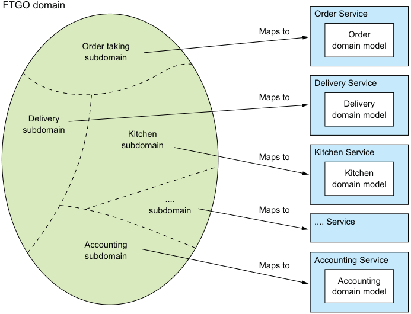

**----- Start of picture text -----** 
FTGO domain Order Service Maps to Order Order taking domain model subdomain Delivery Service Maps to Delivery Delivery domain model subdomain Kitchen subdomain Kitchen Service Maps to Kitchen domain model .... subdomain Maps to .... Service Accounting subdomain Accounting Service Maps to Accounting domain model **----- End of picture text -----** 

Figure 2.9 From subdomains to services: each subdomain of the FTGO application domain is mapped to a service, which has its own domain model. 

DDD and the microservice architecture are in almost perfect alignment. The DDD concept of subdomains and bounded contexts maps nicely to services within a microservice architecture. Also, the microservice architecture’s concept of autonomous teams owning services is completely aligned with the DDD’s concept of each domain model being owned and developed by a single team. Even better, as I describe later in this section, the concept of a subdomain with its own domain model is a great way to eliminate god classes and thereby make decomposition easier. 

Decompose by subdomain and Decompose by business capability are the two main patterns for defining an application’s microservice architecture. There are, however, some useful guidelines for decomposition that have their roots in object-oriented design. Let’s take a look at them. 

### 2.2.4 Decomposition guidelines

So far in this chapter, we’ve looked at the main ways to define a microservice architecture. We can also adapt and use a couple of principles from object-oriented design when applying the microservice architecture pattern. These principles were created by Robert C. Martin and described in his classic book _Designing Object Oriented C++ Applications Using The Booch Method_ (Prentice Hall, 1995). The first principle is the Single Responsibility Principle (SRP), for defining the responsibilities of a class. The second principle is the Common Closure Principle (CCP), for organizing classes into packages. Let’s take a look at these principles and see how they can be applied to the microservice architecture. 

**SINGLE RESPONSIBILITY PRINCIPLE**

One of the main goals of software architecture and design is determining the responsibilities of each software element. The Single Responsibility Principle is as follows: 

_A class should have only one reason to change._ 

**Robert C. Martin**

Each responsibility that a class has is a potential reason for that class to change. If a class has multiple responsibilities that change independently, the class won’t be stable. By following the SRP, you define classes that each have a single responsibility and hence a single reason for change. 

We can apply SRP when defining a microservice architecture and create small, cohesive services that each have a single responsibility. This will reduce the size of the services and increase their stability. The new FTGO architecture is an example of SRP in action. Each aspect of getting food to a consumer—order taking, order preparation, and delivery—is the responsibility of a separate service. 

**COMMON CLOSURE PRINCIPLE**

The other useful principle is the Common Closure Principle: 

_The classes in a package should be closed together against the same kinds of changes. A change that affects a package affects all the classes in that package._ 

**Robert C. Martin**

The idea is that if two classes change in lockstep because of the same underlying reason, then they belong in the same package. Perhaps, for example, those classes implement a different aspect of a particular business rule. The goal is that when that business rule changes, developers only need to change code in a small number of packages (ideally only one). Adhering to the CCP significantly improves the maintainability of an application. 

We can apply CCP when creating a microservice architecture and package components that change for the same reason into the same service. Doing this will minimize 

the number of services that need to be changed and deployed when some requirement changes. Ideally, a change will only affect a single team and a single service. CCP is the antidote to the distributed monolith anti-pattern. 

SRP and CCP are 2 of the 11 principles developed by Bob Martin. They’re particularly useful when developing a microservice architecture. The remaining nine principles are used when designing classes and packages. For more information about SRP, CCP, and the other OOD principles, see the article “The Principles of Object Oriented Design” on Bob Martin’s website (http://butunclebob.com/ArticleS.UncleBob .PrinciplesOfOod). 

Decomposition by business capability and by subdomain along with SRP and CCP are good techniques for decomposing an application into services. In order to apply them and successfully develop a microservice architecture, you must solve some transaction management and interprocess communication issues. 

### 2.2.5 Obstacles to decomposing an application into services

On the surface, the strategy of creating a microservice architecture by defining services corresponding to business capabilities or subdomains looks straightforward. You may, however, encounter several obstacles: 

- Network latency 

- Reduced availability due to synchronous communication 

- Maintaining data consistency across services 

- Obtaining a consistent view of the data 

- God classes preventing decomposition 

Let’s take a look at each obstacle, starting with network latency. 

**NETWORK LATENCY**

_Network latency_ is an ever-present concern in a distributed system. You might discover that a particular decomposition into services results in a large number of round-trips between two services. Sometimes, you can reduce the latency to an acceptable amount by implementing a batch API for fetching multiple objects in a single round trip. But in other situations, the solution is to combine services, replacing expensive IPC with language-level method or function calls. 

**SYNCHRONOUS INTERPROCESS COMMUNICATION REDUCES AVAILABILITY**

Another problem is how to implement interservice communication in a way that doesn’t reduce availability. For example, the most straightforward way to implement the createOrder() operation is for the Order Service to synchronously invoke the other services using REST. The drawback of using a protocol like REST is that it reduces the availability of the Order Service. It won’t be able to create an order if any of those other services are unavailable. Sometimes this is a worthwhile trade-off, but in chapter 3 you’ll learn that using asynchronous messaging, which eliminates tight coupling and improves availability, is often a better choice. 

**MAINTAINING DATA CONSISTENCY ACROSS SERVICES**

Another challenge is maintaining data consistency across services. Some system operations need to update data in multiple services. For example, when a restaurant accepts an order, updates must occur in both the Kitchen Service and the Delivery Service. The Kitchen Service changes the status of the Ticket. The Delivery Service schedules delivery of the order. Both of these updates must be done atomically. 

The traditional solution is to use a two-phase, commit-based, distributed transaction management mechanism. But as you’ll see in chapter 4, this is not a good choice for modern applications, and you must use a very different approach to transaction management, a saga. A _saga_ is a sequence of local transactions that are coordinated using messaging. Sagas are more complex than traditional ACID transactions but they work well in many situations. One limitation of sagas is that they are eventually consistent. If you need to update some data atomically, then it must reside within a single service, which can be an obstacle to decomposition. 

**OBTAINING A CONSISTENT VIEW OF THE DATA**

Another obstacle to decomposition is the inability to obtain a truly consistent view of data across multiple databases. In a monolithic application, the properties of ACID transactions guarantee that a query will return a consistent view of the database. In contrast, in a microservice architecture, even though each service’s database is consistent, you can’t obtain a globally consistent view of the data. If you need a consistent view of some data, then it must reside in a single service, which can prevent decomposition. Fortunately, in practice this is rarely a problem. 

**GOD CLASSES PREVENT DECOMPOSITION**

Another obstacle to decomposition is the existence of so-called god classes. _God classes_ are the bloated classes that are used throughout an application (http://wiki.c2.com/ ?GodClass). A god class typically implements business logic for many different aspects of the application. It normally has a large number of fields mapped to a database table with many columns. Most applications have at least one of these classes, each representing a concept that’s central to the domain: accounts in banking, orders in e-commerce, policies in insurance, and so on. Because a god class bundles together state and behavior for many different aspects of an application, it’s an insurmountable obstacle to splitting any business logic that uses it into services. 

The Order class is a great example of a god class in the FTGO application. That’s not surprising—after all, the purpose of FTGO is to deliver food orders to customers. Most parts of the system involve orders. If the FTGO application had a single domain model, the Order class would be a very large class. It would have state and behavior corresponding to many different parts of the application. Figure 2.10 shows the structure of this class that would be created using traditional modeling techniques. 

As you can see, the Order class has fields and methods corresponding to order processing, restaurant order management, delivery, and payments. This class also has a complex state model, due to the fact that one model has to describe state transitions 

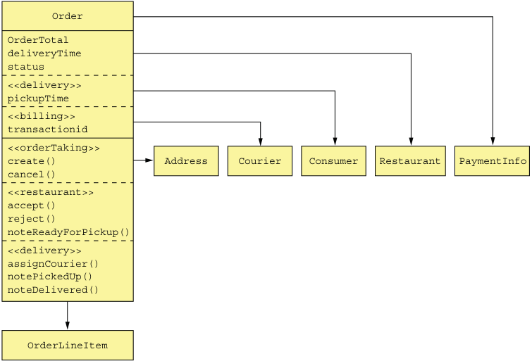

**----- Start of picture text -----** 
Order OrderTotal deliveryTime status <<delivery>> pickupTime <<billing>> transactionid <<orderTaking>> create() Address Courier Consumer Restaurant PaymentInfo cancel() <<restaurant>> accept() reject() noteReadyForPickup() <<delivery>> assignCourier() notePickedUp() noteDelivered() OrderLineItem **----- End of picture text -----** 

Figure 2.10 The **Order** god class is bloated with numerous responsibilities. from disparate parts of the application. In its current form, this class makes it extremely difficult to split code into services. 

One solution is to package the Order class into a library and create a central Order database. All services that process orders use this library and access the access database. The trouble with this approach is that it violates one of the key principles of the microservice architecture and results in undesirable, tight coupling. For example, any change to the Order schema requires the teams to update their code in lockstep. 

Another solution is to encapsulate the Order database in an Order Service, which is invoked by the other services to retrieve and update orders. The problem with that design is that the Order Service would be a data service with an anemic domain model containing little or no business logic. Neither of these options is appealing, but fortunately, DDD provides a solution. 

A much better approach is to apply DDD and treat each service as a separate subdomain with its own domain model. This means that each of the services in the FTGO application that has anything to do with orders has its own domain model with its version of the Order class. A great example of the benefit of multiple domain models is the Delivery Service. Its view of an Order, shown in figure 2.11, is extremely simple: pickup address, pickup time, delivery address, and delivery time. Moreover, rather than call it an Order, the Delivery Service uses the more appropriate name of Delivery. 

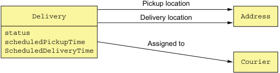

**----- Start of picture text -----** 
Pickup location Delivery Delivery location Address status scheduledPickupTime Assigned to ScheduledDeliveryTime Courier **----- End of picture text -----** 

Figure 2.11 The **Delivery Service** domain model 

The Delivery Service isn’t interested in any of the other attributes of an order. 

The Kitchen Service also has a much simpler view of an order. Its version of an Order is called a Ticket. As figure 2.12 shows, a Ticket simply consist of a status, the requestedDeliveryTime, a prepareByTime, and a list of line items that tell the restaurant what to prepare. It’s unconcerned with the consumer, payment, delivery, and so on. 

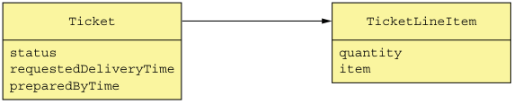

**----- Start of picture text -----** 
Ticket TicketLineItem status quantity requestedDeliveryTime item preparedByTime **----- End of picture text -----** 

Figure 2.12 The **Kitchen Service** domain model 

The Order service has the most complex view of an order, shown in figure 2.13. Even though it has quite a few fields and methods, it’s still much simpler than the original version. 

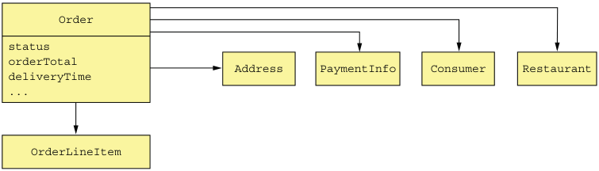

**----- Start of picture text -----** 
Order status orderTotal Address PaymentInfo Consumer Restaurant deliveryTime ... OrderLineItem **----- End of picture text -----** 

Figure 2.13 The **Order Service** domain model 

The Order class in each domain model represents different aspects of the same Order business entity. The FTGO application must maintain consistency between these different objects in different services. For example, once the Order Service has authorized the consumer’s credit card, it must trigger the creation of the Ticket in the Kitchen Service. Similarly, if the restaurant rejects the order via the Kitchen Service, it must be cancelled in the Order Service service, and the customer credited in the billing service. In chapter 4, you’ll learn how to maintain consistency between services, using the previously mentioned event-driven mechanism sagas. 

As well as creating technical challenges, having multiple domain models also impacts the implementation of the user experience. An application must translate between the user experience, which is its own domain model, and the domain models of each of the services. In the FTGO application, for example, the Order status displayed to a consumer is derived from Order information stored in multiple services. This translation is often handled by the API gateway, discussed in chapter 8. Despite these challenges, it’s essential that you identify and eliminate god classes when defining a microservice architecture. 

We’ll now look at how to define the service APIs. 

### 2.2.6 Defining service APIs

So far, we have a list of system operations and a list of a potential services. The next step is to define each service’s API: its operations and events. A service API operation exists for one of two reasons: some operations correspond to system operations. They are invoked by external clients and perhaps by other services. The other operations exist to support collaboration between services. These operations are only invoked by other services. 

A service publishes events primarily to enable it to collaborate with other services. Chapter 4 describes how events can be used to implement sagas, which maintain data consistency across services. And chapter 7 discusses how events can be used to update CQRS views, which support efficient querying. An application can also use events to notify external clients. For example, it could use WebSockets to deliver events to a browser. 

The starting point for defining the service APIs is to map each system operation to a service. After that, we decide whether a service needs to collaborate with others to implement a system operation. If collaboration is required, we then determine what APIs those other services must provide in order to support the collaboration. Let’s begin by looking at how to assign system operations to services. 

**ASSIGNING SYSTEM OPERATIONS TO SERVICES**

The first step is to decide which service is the initial entry point for a request. Many system operations neatly map to a service, but sometimes the mapping is less obvious. Consider, for example, the noteUpdatedLocation() operation, which updates the courier location. On one hand, because it’s related to couriers, this operation should be assigned to the Courier service. On the other hand, it’s the Delivery Service that needs the courier location. In this case, assigning an operation to a service that needs the information provided by the operation is a better choice. In other situations, it might make sense to assign an operation to the service that has the information necessary to handle it. 

Table 2.2 shows which services in the FTGO application are responsible for which operations. 

Table 2.2 Mapping system operations to services in the FTGO application 

|Service|Operations|
|---|---|
|Consumer Service Order Service Restaurant Service Kitchen Service Delivery Service|createConsumer() createOrder() findAvailableRestaurants() acceptOrder() noteOrderReadyForPickup() noteUpdatedLocation() noteDeliveryPickedUp() noteDeliveryDelivered()|

After having assigned operations to services, the next step is to decide how the services collaborate in order to handle each system operation. 

**DETERMINING THE APIS REQUIRED TO SUPPORT COLLABORATION BETWEEN SERVICES**

Some system operations are handled entirely by a single service. For example, in the FTGO application, the Consumer Service handles the createConsumer() operation entirely by itself. But other system operations span multiple services. The data needed to handle one of these requests might, for instance, be scattered around multiple services. For example, in order to implement the createOrder() operation, the Order Service must invoke the following services in order to verify its preconditions and make the post-conditions become true: 

- Consumer Service—Verify that the consumer can place an order and obtain their payment information. 

- Restaurant Service—Validate the order line items, verify that the delivery address/time is within the restaurant’s service area, verify order minimum is met, and obtain prices for the order line items. 

- Kitchen Service—Create the Ticket. 

- Accounting Service—Authorize the consumer’s credit card. 

Similarly, in order to implement the acceptOrder() system operation, the Kitchen Service must invoke the Delivery Service to schedule a courier to deliver the order. Table 2.3 shows the services, their revised APIs, and their collaborators. In order to fully define the service APIs, you need to analyze each system operation and determine what collaboration is required. 

Table 2.3 The services, their revised APIs, and their collaborators 

|Service|Operations|Collaborators|
|---|---|---|
|Consumer Service Order Service Restaurant Service Kitchen Service Delivery Service Accounting Service|verifyConsumerDetails() createOrder() findAvailableRestaurants() verifyOrderDetails() createTicket() acceptOrder() noteOrderReadyForPickup() scheduleDelivery() noteUpdatedLocation() noteDeliveryPickedUp() noteDeliveryDelivered() authorizeCard()|— Consumer Service verifyConsumerDetails() Restaurant Service verifyOrderDetails() Kitchen Service createTicket() Accounting Service authorizeCard() — Delivery Service scheduleDelivery() — —|

So far, we’ve identified the services and the operations that each service implements. But it’s important to remember that the architecture we’ve sketched out is very abstract. We’ve not selected any specific IPC technology. Moreover, even though the term _operation_ suggests some kind of synchronous request/response-based IPC mechanism, you’ll see that asynchronous messaging plays a significant role. Throughout this book I describe architecture and design concepts that influence how these services collaborate. 

Chapter 3 describes specific IPC technologies, including synchronous communication mechanisms such as REST, and asynchronous messaging using a message broker. I discuss how synchronous communication can impact availability and introduce the concept of a self-contained service, which doesn’t invoke other services synchronously. One way to implement a self-contained service is to use the CQRS pattern, covered in chapter 7. The Order Service could, for example, maintain a replica of the data owned by the Restaurant Service in order to eliminate the need for it to synchronously invoke the Restaurant Service to validate an order. It keeps the replica up-to-date by subscribing to events published by the Restaurant Service whenever it updates its data. 

Chapter 4 introduces the saga concept and how it uses asynchronous messaging for coordinating the services that participate in the saga. As well as reliably updating data scattered across multiple services, a saga is also a way to implement a self-contained service. For example, I describe how the createOrder() operation is implemented using a saga, which invokes services such as the Consumer Service, Kitchen Service, and Accounting Service using asynchronous messaging. 

Chapter 8 describes the concept of an API gateway, which exposes an API to external clients. An API gateway might implement a query operation using the API composition pattern, described in chapter 7, rather than simply route it to the service. Logic in the API gateway gathers the data needed by the query by calling multiple services and combining the results. In this situation, the system operation is assigned to the API gateway rather than a service. The services need to implement the query operations needed by the API gateway. 

## Summary

- Architecture determines your application’s _-ilities_ , including maintainability, testability, and deployability, which directly impact development velocity. 

- The microservice architecture is an architecture style that gives an application high maintainability, testability, and deployability. 

- Services in a microservice architecture are organized around business concerns— business capabilities or subdomains—rather than technical concerns. 

- There are two patterns for decomposition: 

   - Decompose by business capability, which has its origins in business architecture 

   - Decompose by subdomain, based on concepts from domain-driven design 

- You can eliminate god classes, which cause tangled dependencies that prevent decomposition, by applying DDD and defining a separate domain model for each service. 

