## _Interprocess communication in a microservice architecture_ 

## _This chapter covers_ 

- Applying the communication patterns: Remote procedure invocation, Circuit breaker, Client-side discovery, Self registration, Server-side discovery, Third party registration, Asynchronous messaging, Transactional outbox, Transaction log tailing, Polling publisher 

- The importance of interprocess communication in a microservice architecture 

- Defining and evolving APIs 

- The various interprocess communication options and their trade-offs 

- The benefits of services that communicate using asynchronous messaging 

- Reliably sending messages as part of a database transaction 

Mary and her team, like most other developers, had some experience with interprocess communication (IPC) mechanisms. The FTGO application has a REST API that’s used by mobile applications and browser-side JavaScript. It also uses various 

_**Interprocess communication in a microservice architecture**_ 

cloud services, such as the Twilio messaging service and the Stripe payment service. But within a monolithic application like FTGO, modules invoke one another via language-level method or function calls. FTGO developers generally don’t need to think about IPC unless they’re working on the REST API or the modules that integrate with cloud services. 

In contrast, as you saw in chapter 2, the microservice architecture structures an application as a set of services. Those services must often collaborate in order to handle a request. Because service instances are typically processes running on multiple machines, they must interact using IPC. It plays a much more important role in a microservice architecture than it does in a monolithic application. Consequently, as they migrate their application to microservices, Mary and the rest of the FTGO developers will need to spend a lot more time thinking about IPC. 

There’s no shortage of IPC mechanisms to chose from. Today, the fashionable choice is REST (with JSON). It’s important, though, to remember that there are no silver bullets. You must carefully consider the options. This chapter explores various IPC options, including REST and messaging, and discusses the trade-offs. 

The choice of IPC mechanism is an important architectural decision. It can impact application availability. What’s more, as I explain in this chapter and the next, IPC even intersects with transaction management. I favor an architecture consisting of loosely coupled services that communicate with one another using asynchronous messaging. Synchronous protocols such as REST are used mostly to communicate with other applications. 

I begin this chapter with an overview of interprocess communication in microservice architecture. Next, I describe remote procedure invocation-based IPC, of which REST is the most popular example. I cover important topics including service discovery and how to handle partial failure. After that, I describe asynchronous messagingbased IPC. I also talk about scaling consumers while preserving message ordering, correctly handling duplicate messages, and transactional messaging. Finally, I go through the concept of self-contained services that handle synchronous requests without communicating with other services in order to improve availability. 

## _3.1 Overview of interprocess communication in a microservice architecture_ 

There are lots of different IPC technologies to choose from. Services can use synchronous request/response-based communication mechanisms, such as HTTPbased REST or gRPC. Alternatively, they can use asynchronous, message-based communication mechanisms such as AMQP or STOMP. There are also a variety of different messages formats. Services can use human-readable, text-based formats such as JSON or XML. Alternatively, they could use a more efficient binary format such as Avro or Protocol Buffers. 

Before getting into the details of specific technologies, I want to bring up several design issues you should consider. I start this section with a discussion of interaction 

_**Overview of interprocess communication in a microservice architecture**_
styles, which are a technology-independent way of describing how clients and services interact. Next I discuss the importance of precisely defining APIs in a microservice architecture, including the concept of API-first design. After that, I discuss the important topic of API evolution. Finally, I discuss different options for message formats and how they can determine ease of API evolution. Let’s begin by looking at interaction styles. 

## _3.1.1 Interaction styles_ 

It’s useful to first think about the style of interaction between a service and its clients before selecting an IPC mechanism for a service’s API. Thinking first about the interaction style will help you focus on the requirements and avoid getting mired in the details of a particular IPC technology. Also, as described in section 3.4, the choice of interaction style impacts the availability of your application. Furthermore, as you’ll see in chapters 9 and 10, it helps you select the appropriate integration testing strategy. 

There are a variety of client-service interaction styles. As table 3.1 shows, they can be categorized in two dimensions. The first dimension is whether the interaction is one-to-one or one-to-many: 

- _One-to-one_ —Each client request is processed by exactly one service. 

- _One-to-many_ —Each request is processed by multiple services. 

The second dimension is whether the interaction is synchronous or asynchronous: 

- _Synchronous_ —The client expects a timely response from the service and might even block while it waits. 

- _Asynchronous_ —The client doesn’t block, and the response, if any, isn’t necessarily sent immediately. 

Table 3.1 The various interaction styles can be characterized in two dimensions: one-to-one vs one-tomany and synchronous vs asynchronous. 

||one-to-one|one-to-many|
|---|---|---|
|Synchronous Asynchronous|Request/response Asynchronous request/response One-way notifications|— Publish/subscribe Publish/async responses|

The following are the different types of one-to-one interactions: 

- _Request/response_ —A service client makes a request to a service and waits for a response. The client expects the response to arrive in a timely fashion. It might event block while waiting. This is an interaction style that generally results in services being tightly coupled. 

- _Asynchronous request/response_ —A service client sends a request to a service, which replies asynchronously. The client doesn’t block while waiting, because the service might not send the response for a long time. 

_**Interprocess communication in a microservice architecture**_ 

- _One-way notifications_ —A service client sends a request to a service, but no reply is expected or sent. 

It’s important to remember that the synchronous request/response interaction style is mostly orthogonal to IPC technologies. A service can, for example, interact with another service using request/response style interaction with either REST or messaging. Even if two services are communicating using a message broker, the client service might be blocked waiting for a response. It doesn’t necessarily mean they’re loosely coupled. That’s something I revisit later in this chapter when discussing the impact of inter-service communication on availability. 

The following are the different types of one-to-many interactions: 

- _Publish/subscribe_ —A client publishes a notification message, which is consumed by zero or more interested services. 

- _Publish/async responses_ —A client publishes a request message and then waits for a certain amount of time for responses from interested services. 

Each service will typically use a combination of these interaction styles. Many of the services in the FTGO application have both synchronous and asynchronous APIs for operations, and many also publish events. 

Let’s look at how to define a service’s API. 

- _3.1.2 Defining APIs in a microservice architecture_ 

APIs or interfaces are central to software development. An application is comprised of modules. Each module has an interface that defines the set of operations that module’s clients can invoke. A well-designed interface exposes useful functionality while hiding the implementation. It enables the implementation to change without impacting clients. 

In a monolithic application, an interface is typically specified using a programming language construct such as a Java interface. A Java interface specifies a set of methods that a client can invoke. The implementation class is hidden from the client. Moreover, because Java is a statically typed language, if the interface changes to be incompatible with the client, the application won’t compile. 

APIs and interfaces are equally important in a microservice architecture. A service’s API is a contract between the service and its clients. As described in chapter 2, a service’s API consists of operations, which clients can invoke, and events, which are published by the service. An operation has a name, parameters, and a return type. An event has a type and a set of fields and is, as described in section 3.3, published to a message channel. 

The challenge is that a service API isn’t defined using a simple programming language construct. By definition, a service and its clients aren’t compiled together. If a new version of a service is deployed with an incompatible API, there’s no compilation error. Instead, there will be runtime failures. 

_**Overview of interprocess communication in a microservice architecture**_ 

Regardless of which IPC mechanism you choose, it’s important to precisely define a service’s API using some kind of _interface definition language_ (IDL). Moreover, there are good arguments for using an API-first approach to defining services (see www .programmableweb.com/news/how-to-design-great-apis-api-first-design-and-raml/how-to/ 2015/07/10 for more). First you write the interface definition. Then you review the interface definition with the client developers. Only after iterating on the API definition do you then implement the service. Doing this up-front design increases your chances of building a service that meets the needs of its clients. 

## API-first design is essential 

Even in small projects, I’ve seen problems occur because components don’t agree on an API. For example, on one project the backend Java developer and the AngularJS frontend developer both said they had completed development. The application, however, didn’t work. The REST and WebSocket API used by the frontend application to communicate with the backend was poorly defined. As a result, the two applications couldn’t communicate! 

The nature of the API definition depends on which IPC mechanism you’re using. For example, if you’re using messaging, the API consists of the message channels, the message types, and the message formats. If you’re using HTTP, the API consists of the URLs, the HTTP verbs, and the request and response formats. Later in this chapter, I explain how to define APIs. 

A service’s API is rarely set in stone. It will likely evolve over time. Let’s take a look at how to do that and consider the issues you’ll face. 

## _3.1.3 Evolving APIs_ 

APIs invariably change over time as new features are added, existing features are changed, and (perhaps) old features are removed. In a monolithic application, it’s relatively straightforward to change an API and update all the callers. If you’re using a statically typed language, the compiler helps by giving a list of compilation errors. The only challenge may be the scope of the change. It might take a long time to change a widely used API. 

In a microservices-based application, changing a service’s API is a lot more difficult. A service’s clients are other services, which are often developed by other teams. The clients may even be other applications outside of the organization. You usually can’t force all clients to upgrade in lockstep with the service. Also, because modern applications are usually never down for maintenance, you’ll typically perform a rolling upgrade of your service, so both old and new versions of a service will be running simultaneously. 

It’s important to have a strategy for dealing with these challenges. How you handle a change to an API depends on the nature of the change. 

## USE SEMANTIC VERSIONING 

The Semantic Versioning specification (http://semver.org) is a useful guide to versioning APIs. It’s a set of rules that specify how version numbers are used and incremented. Semantic versioning was originally intended to be used for versioning of software packages, but you can use it for versioning APIs in a distributed system. 

The Semantic Versioning specification (Semvers) requires a version number to consist of three parts: MAJOR.MINOR.PATCH. You must increment each part of a version number as follows: 

- MAJOR—When you make an incompatible change to the API 

- MINOR—When you make backward-compatible enhancements to the API 

- PATCH—When you make a backward-compatible bug fix 

There are a couple of places you can use the version number in an API. If you’re implementing a REST API, you can, as mentioned below, use the major version as the first element of the URL path. Alternatively, if you’re implementing a service that uses messaging, you can include the version number in the messages that it publishes. The goal is to properly version APIs and to evolve them in a controlled fashion. Let’s look at how to handle minor and major changes. 

## MAKING MINOR, BACKWARD-COMPATIBLE CHANGES 

Ideally, you should strive to only make backward-compatible changes. Backwardcompatible changes are additive changes to an API: 

- Adding optional attributes to request 

- Adding attributes to a response 

- Adding new operations 

If you only ever make these kinds of changes, older clients will work with newer services, provided that they observe the Robustness principle (https://en.wikipedia.org/wiki/ Robustness_principle), which states: “Be conservative in what you do, be liberal in what you accept from others.” Services should provide default values for missing request attributes. Similarly, clients should ignore any extra response attributes. In order for this to be painless, clients and services must use a request and response format that supports the Robustness principle. Later in this section, I describe how textbased formats such as JSON and XML generally make it easier to evolve APIs. 

## MAKING MAJOR, BREAKING CHANGES 

Sometimes you must make major, incompatible changes to an API. Because you can’t force clients to upgrade immediately, a service must simultaneously support old and new versions of an API for some period of time. If you’re using an HTTP-based IPC mechanism, such as REST, one approach is to embed the major version number in the URL. For example, version 1 paths are prefixed with '/v1/…', and version 2 paths with '/v2/…'. 

_**Overview of interprocess communication in a microservice architecture**_ 

Another option is to use HTTP’s content negotiation mechanism and include the version number in the MIME type. For example, a client would request version 1.x of an Order using a request like this: 

GET /orders/xyz HTTP/1.1 Accept: application/vnd.example.resource+json; version=1 ... 

This request tells the Order Service that the client expects a version 1.x response. 

In order to support multiple versions of an API, the service’s adapters that implement the APIs will contain logic that translates between the old and new versions. Also, as described in chapter 8, the API gateway will almost certainly use versioned APIs. It may even have to support numerous older versions of an API. 

Now we’ll look at the issue of message formats, the choice of which can impact how easy evolving an API will be. 

## _3.1.4 Message formats_ 

The essence of IPC is the exchange of messages. _Messages_ usually contain data, and so an important design decision is the format of that data. The choice of message format can impact the efficiency of IPC, the usability of the API, and its evolvability. If you’re using a messaging system or protocols such as HTTP, you get to pick your message format. Some IPC mechanisms—such as gRPC, which you’ll learn about shortly—might dictate the message format. In either case, it’s essential to use a cross-language message format. Even if you’re writing your microservices in a single language today, it’s likely that you’ll use other languages in the future. You shouldn’t, for example, use Java serialization. 

There are two main categories of message formats: text and binary. Let’s look at each one. 

## TEXT-BASED MESSAGE FORMATS 

The first category is text-based formats such as JSON and XML. An advantage of these formats is that not only are they human readable, they’re self describing. A JSON message is a collection of named properties. Similarly, an XML message is effectively a collection of named elements and values. This format enables a consumer of a message to pick out the values of interest and ignore the rest. Consequently, many changes to the message schema can easily be backward-compatible. 

The structure of XML documents is specified by an XML schema (www.w3.org/ XML/Schema). Over time, the developer community has come to realize that JSON also needs a similar mechanism. One popular option is to use the JSON Schema standard (http://json-schema.org). A JSON schema defines the names and types of a message’s properties and whether they’re optional or required. As well as being useful documentation, a JSON schema can be used by an application to validate incoming messages. 

A downside of using a text-based messages format is that the messages tend to be verbose, especially XML. Every message has the overhead of containing the names of 

_**Interprocess communication in a microservice architecture**_ 

the attributes in addition to their values. Another drawback is the overhead of parsing text, especially when messages are large. Consequently, if efficiency and performance are important, you may want to consider using a binary format. 

## BINARY MESSAGE FORMATS 

There are several different binary formats to choose from. Popular formats include Protocol Buffers (https://developers.google.com/protocol-buffers/docs/overview) and Avro (https://avro.apache.org). Both formats provide a typed IDL for defining the structure of your messages. A compiler then generates the code that serializes and deserializes the messages. You’re forced to take an API-first approach to service design! Moreover, if you write your client in a statically typed language, the compiler checks that it uses the API correctly. 

One difference between these two binary formats is that Protocol Buffers uses tagged fields, whereas an Avro consumer needs to know the schema in order to interpret messages. As a result, handling API evolution is easier with Protocol Buffers than with Avro. This blog post (http://martin.kleppmann.com/2012/12/05/schemaevolution-in-avro-protocol-buffers-thrift.html) is an excellent comparison of Thrift, Protocol Buffers, and Avro. 

Now that we’ve looked at message formats, let’s look at specific IPC mechanisms that transport the messages, starting with the Remote procedure invocation (RPI) pattern. 

## _3.2 Communicating using the synchronous Remote procedure invocation pattern_ 

When using a remote procedure invocation-based IPC mechanism, a client sends a request to a service, and the service processes the request and sends back a response. Some clients may block waiting for a response, and others might have a reactive, nonblocking architecture. But unlike when using messaging, the client assumes that the response will arrive in a timely fashion. 

Figure 3.1 shows how RPI works. The business logic in the client invokes a _proxy interface_ , implemented by an _RPI proxy_ adapter class. The _RPI proxy_ makes a request to the service. The request is handled by an _RPI server_ adapter class, which invokes the service’s business logic via an interface. It then sends back a reply to the _RPI proxy_ , which returns the result to the client’s business logic. 

## Pattern: Remote procedure invocation 

A client invokes a service using a synchronous, remote procedure invocation-based protocol, such as REST (http://microservices.io/patterns/communication-style/ messaging.html). 

The _proxy interface_ usually encapsulates the underlying communication protocol. There are numerous protocols to choose from. In this section, I describe REST and 

_**Communicating using the synchronous Remote procedure invocation pattern**_ 

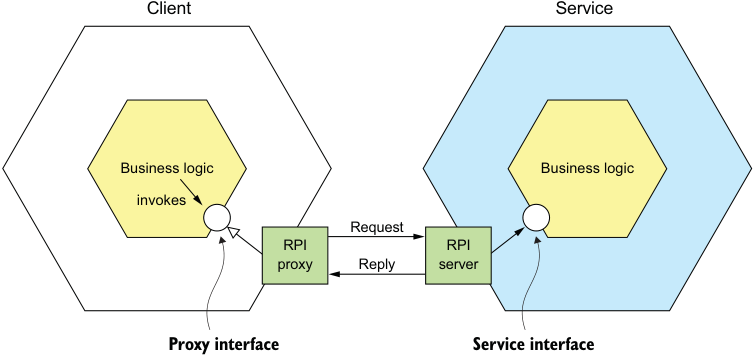

**----- Start of picture text -----** 
Client Service Business logic Business logic invokes Request RPI RPI proxy Reply server Proxy interface Service interface **----- End of picture text -----** 

Figure 3.1 The client’s business logic invokes an interface that is implemented by an _RPI proxy_ adapter class. The _RPI proxy class_ makes a request to the service. The _RPI server_ adapter class handles the request by invoking the service’s business logic. gRPC. I cover how to improve the availability of your services by properly handling partial failure and explain why a microservices-based application that uses RPI must use a service discovery mechanism. 

Let’s first take a look at REST. 

## _3.2.1 Using REST_ 

Today, it’s fashionable to develop APIs in the RESTful style (https://en.wikipedia .org/wiki/Representational_state_transfer). _REST_ is an IPC mechanism that (almost always) uses HTTP. Roy Fielding, the creator of REST, defines REST as follows: 

_REST provides a set of architectural constraints that, when applied as a whole, emphasizes scalability of component interactions, generality of interfaces, independent deployment of components, and intermediary components to reduce interaction latency, enforce security, and encapsulate legacy systems._
www.ics.uci.edu/~fielding/pubs/dissertation/top.htm 

A key concept in REST is a _resource_ , which typically represents a single business object, such as a Customer or Product, or a collection of business objects. REST uses the HTTP verbs for manipulating resources, which are referenced using a URL. For example, a GET request returns the representation of a resource, which is often in the form of an XML document or JSON object, although other formats such as binary can be used. A POST request creates a new resource, and a PUT request updates a resource. The Order Service, for example, has a POST /orders endpoint for creating an Order and a GET /orders/{orderId} endpoint for retrieving an Order. 

_**Interprocess communication in a microservice architecture**_ 

Many developers claim their HTTP-based APIs are RESTful. But as Roy Fielding describes in a blog post, not all of them actually are (http://roy.gbiv.com/untangled/ 2008/rest-apis-must-be-hypertext-driven). To understand why, let’s take a look at the REST maturity model. 

## THE REST MATURITY MODEL 

Leonard Richardson (no relation to your author) defines a very useful maturity model for REST (http://martinfowler.com/articles/richardsonMaturityModel.html) that consists of the following levels: 

- _Level 0_ —Clients of a level 0 service invoke the service by making HTTP POST requests to its sole URL endpoint. Each request specifies the action to perform, the target of the action (for example, the business object), and any parameters. 

- _Level 1_ —A level 1 service supports the idea of resources. To perform an action on a resource, a client makes a POST request that specifies the action to perform and any parameters. 

- _Level 2_ —A level 2 service uses HTTP verbs to perform actions: GET to retrieve, POST to create, and PUT to update. The request query parameters and body, if any, specify the actions' parameters. This enables services to use web infrastructure such as caching for GET requests. 

- _Level 3_ —The design of a level 3 service is based on the terribly named HATEOAS (Hypertext As The Engine Of Application State) principle. The basic idea is that the representation of a resource returned by a GET request contains links for performing actions on that resource. For example, a client can cancel an order using a link in the representation returned by the GET request that retrieved the order. The benefits of HATEOAS include no longer having to hard-wire URLs into client code (www.infoq.com/news/2009/04/ hateoas-restful-api-advantages). 

I encourage you to review the REST APIs at your organization to see which level they correspond to. 

## SPECIFYING REST APIS 

As mentioned earlier in section 3.1, you must define your APIs using an interface definition language (IDL). Unlike older communication protocols like CORBA and SOAP, REST did not originally have an IDL. Fortunately, the developer community has rediscovered the value of an IDL for RESTful APIs. The most popular REST IDL is the Open API Specification (www.openapis.org), which evolved from the Swagger open source project. The Swagger project is a set of tools for developing and documenting REST APIs. It includes tools that generate client stubs and server skeletons from an interface definition. 

## THE CHALLENGE OF FETCHING MULTIPLE RESOURCES IN A SINGLE REQUEST 

REST resources are usually oriented around business objects, such as Consumer and Order. Consequently, a common problem when designing a REST API is how to 

_**Communicating using the synchronous Remote procedure invocation pattern**_
enable the client to retrieve multiple related objects in a single request. For example, imagine that a REST client wanted to retrieve an Order and the Order's Consumer. A pure REST API would require the client to make at least two requests, one for the Order and another for its Consumer. A more complex scenario would require even more round-trips and suffer from excessive latency. 

One solution to this problem is for an API to allow the client to retrieve related resources when it gets a resource. For example, a client could retrieve an Order and its Consumer using GET /orders/order-id-1345?expand=consumer. The query parameter specifies the related resources to return with the Order. This approach works well in many scenarios but it’s often insufficient for more complex scenarios. It’s also potentially time consuming to implement. This has led to the increasing popularity of alternative API technologies such as GraphQL (http://graphql.org) and Netflix Falcor (http://netflix.github.io/falcor/), which are designed to support efficient data fetching. 

## THE CHALLENGE OF MAPPING OPERATIONS TO HTTP VERBS 

Another common REST API design problem is how to map the operations you want to perform on a business object to an HTTP verb. A REST API should use PUT for updates, but there may be multiple ways to update an order, including cancelling it, revising the order, and so on. Also, an update might not be idempotent, which is a requirement for using PUT. One solution is to define a sub-resource for updating a particular aspect of a resource. The Order Service, for example, has a POST /orders/ {orderId}/cancel endpoint for cancelling orders, and a POST /orders/{orderId}/ revise endpoint for revising orders. Another solution is to specify a verb as a URL query parameter. Sadly, neither solution is particularly RESTful. 

This problem with mapping operations to HTTP verbs has led to the growing popularity of alternatives to REST, such as gPRC, discussed shortly in section 3.2.2. But first let’s look at the benefits and drawbacks of REST. 

BENEFITS AND DRAWBACKS OF REST 

There are numerous benefits to using REST: 

- It’s simple and familiar. 

- You can test an HTTP API from within a browser using, for example, the Postman plugin, or from the command line using curl (assuming JSON or some other text format is used). 

- It directly supports request/response style communication. 

- HTTP is, of course, firewall friendly. 

- It doesn’t require an intermediate broker, which simplifies the system’s architecture. 

There are some drawbacks to using REST: 

- It only supports the request/response style of communication. 

- Reduced availability. Because the client and service communicate directly without an intermediary to buffer messages, they must both be running for the duration of the exchange. 

_**Interprocess communication in a microservice architecture**_ 

- Clients must know the locations (URLs) of the service instances(s). As described in section 3.2.4, this is a nontrivial problem in a modern application. Clients must use what is known as a _service discovery mechanism_ to locate service instances. 

- Fetching multiple resources in a single request is challenging. 

- It’s sometimes difficult to map multiple update operations to HTTP verbs. 

Despite these drawbacks, REST seems to be the de facto standard for APIs, though there are a couple of interesting alternatives. GraphQL, for example, implements flexible, efficient data fetching. Chapter 8 discusses GraphQL and covers the API gateway pattern. gRPC is another alternative to REST. Let’s take a look at how it works. 

## _3.2.2 Using gRPC_ 

As mentioned in the preceding section, one challenge with using REST is that because HTTP only provides a limited number of verbs, it’s not always straightforward to design a REST API that supports multiple update operations. An IPC technology that avoids this issue is gRPC (www.grpc.io), a framework for writing cross-language clients and servers (see https://en.wikipedia.org/wiki/Remote_procedure_call for more). gRPC is a binary message-based protocol, and this means—as mentioned earlier in the discussion of binary message formats—you’re forced to take an API-first approach to service design. You define your gRPC APIs using a Protocol Buffers-based IDL, which is Google’s language-neutral mechanism for serializing structured data. You use the Protocol Buffer compiler to generate client-side stubs and server-side skeletons. The compiler can generate code for a variety of languages, including Java, C#, NodeJS, and GoLang. Clients and servers exchange binary messages in the Protocol Buffers format using HTTP/2. 

A gRPC API consists of one or more services and request/response message definitions. A _service definition_ is analogous to a Java interface and is a collection of strongly typed methods. As well as supporting simple request/response RPC, gRPC support streaming RPC. A server can reply with a stream of messages to the client. Alternatively, a client can send a stream of messages to the server. gRPC uses Protocol Buffers as the message format. Protocol Buffers is, as mentioned earlier, an efficient, compact, binary format. It’s a tagged format. Each field of a Protocol Buffers message is numbered and has a type code. A message recipient can extract the fields that it needs and skip over the fields that it doesn’t recognize. As a result, gRPC enables APIs to evolve while remaining backward-compatible. 

Listing 3.1 shows an excerpt of the gRPC API for the Order Service. It defines several methods, including createOrder(). This method takes a CreateOrderRequest as a parameter and returns a CreateOrderReply. 

Listing 3.1 An excerpt of the gRPC API for the **Order Service**
service OrderService { rpc createOrder(CreateOrderRequest) returns (CreateOrderReply) {} 

_**Communicating using the synchronous Remote procedure invocation pattern**_
rpc cancelOrder(CancelOrderRequest) returns (CancelOrderReply) {} rpc reviseOrder(ReviseOrderRequest) returns (ReviseOrderReply) {} ... } message CreateOrderRequest { int64 restaurantId = 1; int64 consumerId = 2; repeated LineItem lineItems = 3; ... } message LineItem { string menuItemId = 1; int32 quantity = 2; } message CreateOrderReply { int64 orderId = 1; } ... 

CreateOrderRequest and CreateOrderReply are typed messages. For example, CreateOrderRequest message has a restaurantId field of type int64. The field’s tag value is 1. gRPC has several benefits: 

- It’s straightforward to design an API that has a rich set of update operations. 

- It has an efficient, compact IPC mechanism, especially when exchanging large messages. 

- Bidirectional streaming enables both RPI and messaging styles of communication. 

- It enables interoperability between clients and services written in a wide range of languages. 

gRPC also has several drawbacks: 

- It takes more work for JavaScript clients to consume gRPC-based API than REST/JSON-based APIs. 

- Older firewalls might not support HTTP/2. 

gRPC is a compelling alternative to REST, but like REST, it’s a synchronous communication mechanism, so it also suffers from the problem of partial failure. Let’s take a look at what that is and how to handle it. 

- _3.2.3 Handling partial failure using the Circuit breaker pattern_ 

In a distributed system, whenever a service makes a synchronous request to another service, there is an ever-present risk of partial failure. Because the client and the service are separate processes, a service may not be able to respond in a timely way to a client’s request. The service could be down because of a failure or for maintenance. Or the service might be overloaded and responding extremely slowly to requests. 

Because the client is blocked waiting for a response, the danger is that the failure could cascade to the client’s clients and so on and cause an outage. 

## Pattern: Circuit breaker 

An RPI proxy that immediately rejects invocations for a timeout period after the number of consecutive failures exceeds a specified threshold. See http://microservices .io/patterns/reliability/circuit-breaker.html. 

Consider, for example, the scenario shown in figure 3.2, where the Order Service is unresponsive. A mobile client makes a REST request to an API gateway, which, as discussed in chapter 8, is the entry point into the application for API clients. The API gateway proxies the request to the unresponsive Order Service. 

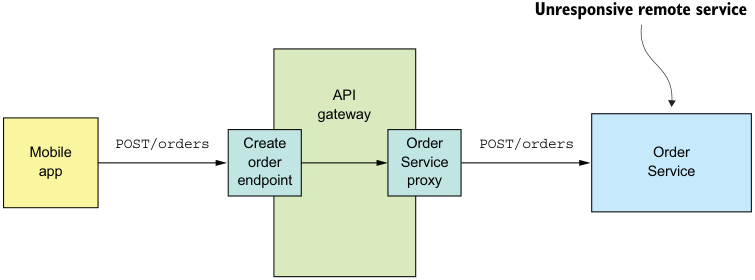

**----- Start of picture text -----** 
Unresponsive remote service API gateway POST/orders Create Order POST/orders Mobile Order order Service app Service endpoint proxy **----- End of picture text -----** 

Figure 3.2 An API gateway must protect itself from unresponsive services, such as the **Order Service** . 

A naive implementation of the OrderServiceProxy would block indefinitely, waiting for a response. Not only would that result in a poor user experience, but in many applications it would consume a precious resource, such as a thread. Eventually the API gateway would run out of resources and become unable to handle requests. The entire API would be unavailable. 

It’s essential that you design your services to prevent partial failures from cascading throughout the application. There are two parts to the solution: 

- You must use design RPI proxies, such as OrderServiceProxy, to handle unresponsive remote services. 

- You need to decide how to recover from a failed remote service. 

First we’ll look at how to write robust RPI proxies. 

_**Communicating using the synchronous Remote procedure invocation pattern**_ 

## DEVELOPING ROBUST RPI PROXIES 

Whenever one service synchronously invokes another service, it should protect itself using the approach described by Netflix (http://techblog.netflix.com/2012/02/faulttolerance-in-high-volume.html). This approach consists of a combination of the following mechanisms: 

- _Network timeouts_ —Never block indefinitely and always use timeouts when waiting for a response. Using timeouts ensures that resources are never tied up indefinitely. 

- _Limiting the number of outstanding requests from a client to a service_ —Impose an upper bound on the number of outstanding requests that a client can make to a particular service. If the limit has been reached, it’s probably pointless to make additional requests, and those attempts should fail immediately. 

- _Circuit breaker pattern_ —Track the number of successful and failed requests, and if the error rate exceeds some threshold, trip the circuit breaker so that further attempts fail immediately. A large number of requests failing suggests that the service is unavailable and that sending more requests is pointless. After a timeout period, the client should try again, and, if successful, close the circuit breaker. 

Netflix Hystrix (https://github.com/Netflix/Hystrix) is an open source library that implements these and other patterns. If you’re using the JVM, you should definitely consider using Hystrix when implementing RPI proxies. And if you’re running in a non-JVM environment, you should use an equivalent library. For example, the Polly library is popular in the .NET community (https://github.com/App-vNext/Polly). 

## RECOVERING FROM AN UNAVAILABLE SERVICE 

Using a library such as Hystrix is only part of the solution. You must also decide on a case-by-case basis how your services should recover from an unresponsive remote service. One option is for a service to simply return an error to its client. For example, this approach makes sense for the scenario shown in figure 3.2, where the request to create an Order fails. The only option is for the API gateway to return an error to the mobile client. 

In other scenarios, returning a fallback value, such as either a default value or a cached response, may make sense. For example, chapter 7 describes how the API gateway could implement the findOrder() query operation by using the API composition pattern. As figure 3.3 shows, its implementation of the GET /orders/{orderId} endpoint invokes several services, including the Order Service, Kitchen Service, and Delivery Service, and combines the results. 

It’s likely that each service’s data isn’t equally important to the client. The data from the Order Service is essential. If this service is unavailable, the API gateway should return either a cached version of its data or an error. The data from the other services is less critical. A client can, for example, display useful information to the user even if the delivery status was unavailable. If the Delivery Service is unavailable, 

_**Interprocess communication in a microservice architecture**_ 

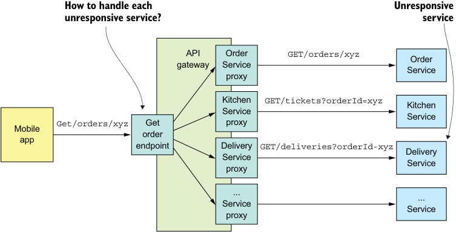

**----- Start of picture text -----** 
How to handle each Unresponsive unresponsive service? service API Order GET/orders/xyz Order gateway Service Service proxy Kitchen GET/tickets?orderId=xyz Kitchen Service Service Mobile Get/orders/xyz Get proxy order app endpoint Delivery GET/deliveries?orderId-xyz Delivery Service Service proxy ... Service ... Service proxy **----- End of picture text -----** 

Figure 3.3 The API gateway implements the **GET /orders/{orderId}** endpoint using API composition. It calls several services, aggregates their responses, and sends a response to the mobile app. The code that implements the endpoint must have a strategy for handling the failure of each service that it calls. the API gateway should return either a cached version of its data or omit it from the response. 

It’s essential that you design your services to handle partial failure, but that’s not the only problem you need to solve when using RPI. Another problem is that in order for one service to invoke another service using RPI, it needs to know the network location of a service instance. On the surface this sounds simple, but in practice it’s a challenging problem. You must use a service discovery mechanism. Let’s look at how that works. 

## _3.2.4 Using service discovery_ 

Say you’re writing some code that invokes a service that has a REST API. In order to make a request, your code needs to know the network location (IP address and port) of a service instance. In a traditional application running on physical hardware, the network locations of service instances are usually static. For example, your code could read the network locations from a configuration file that’s occasionally updated. But in a modern, cloud-based microservices application, it’s usually not that simple. As is shown in figure 3.4, a modern application is much more dynamic. 

Service instances have dynamically assigned network locations. Moreover, the set of service instances changes dynamically because of autoscaling, failures, and upgrades. Consequently, your client code must use a service discovery. 

_**Communicating using the synchronous Remote procedure invocation pattern**_ 

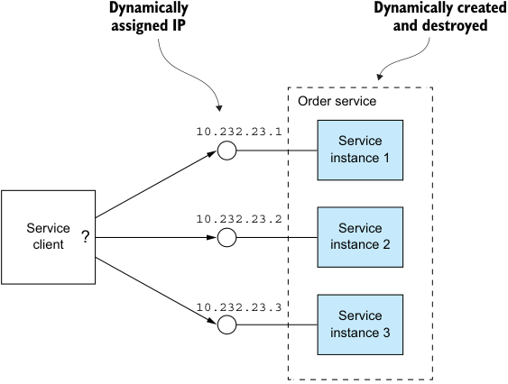

**----- Start of picture text -----** 
Dynamically Dynamically created assigned IP and destroyed Order service 10.232.23.1 Service instance 1 10.232.23.2 Service Service ? client instance 2 10.232.23.3 Service instance 3 **----- End of picture text -----** 

Figure 3.4 Service instances have dynamically assigned IP addresses. 

## OVERVIEW OF SERVICE DISCOVERY 

As you’ve just seen, you can’t statically configure a client with the IP addresses of the services. Instead, an application must use a dynamic service discovery mechanism. Service discovery is conceptually quite simple: its key component is a service registry, which is a database of the network locations of an application’s service instances. 

The service discovery mechanism updates the service registry when service instances start and stop. When a client invokes a service, the service discovery mechanism queries the service registry to obtain a list of available service instances and routes the request to one of them. 

There are two main ways to implement service discovery: 

- The services and their clients interact directly with the service registry. 

- The deployment infrastructure handles service discovery. (I talk more about that in chapter 12.) 

Let’s look at each option. 

## APPLYING THE APPLICATION-LEVEL SERVICE DISCOVERY PATTERNS 

One way to implement service discovery is for the application’s services and their clients to interact with the service registry. Figure 3.5 shows how this works. A service instance registers its network location with the service registry. A service client invokes a service by first querying the service registry to obtain a list of service instances. It then sends a request to one of those instances. 

_**Interprocess communication in a microservice architecture**_ 

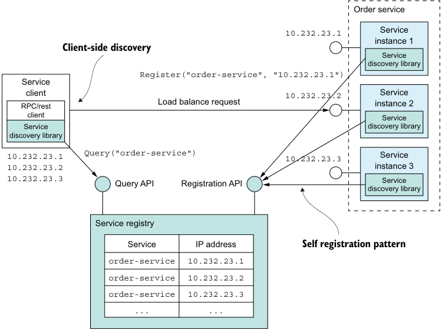

**----- Start of picture text -----** 
Order service 10.232.23.1 Service instance 1 Client-side discovery Service discovery library Register("order-service", "10.232.23.1") Service client 10.232.23.2 Service RPC/rest Load balance request instance 2 client Service Service discovery library discovery library 10.232.23.1 Query("order-service") 10.232.23.3 Service 10.232.23.2 instance 3 10.232.23.3 Query API Registration API Service discovery library Service registry Service IP address Self registration pattern order-service 10.232.23.1 order-service 10.232.23.2 order-service 10.232.23.3 ... ... **----- End of picture text -----** 

Figure 3.5 The service registry keeps track of the service instances. Clients query the service registry to find network locations of available service instances. 

This approach to service discovery is a combination of two patterns. The first pattern is the Self registration pattern. A service instance invokes the service registry’s registration API to register its network location. It may also supply a health check URL, described in more detail in chapter 11. The _health check_ URL is an API endpoint that the service registry invokes periodically to verify that the service instance is healthy and available to handle requests. A service registry may require a service instance to periodically invoke a “heartbeat” API in order to prevent its registration from expiring. 

## Pattern: Self registration 

A service instance registers itself with the service registry. See http://microservices.io/patterns/self-registration.html. 

The second pattern is the Client-side discovery pattern. When a service client wants to invoke a service, it queries the service registry to obtain a list of the service’s instances. To improve performance, a client might cache the service instances. The service client 

_**Communicating using the synchronous Remote procedure invocation pattern**_ 

then uses a load-balancing algorithm, such as a round-robin or random, to select a service instance. It then makes a request to a select service instance. 

## Pattern: Client-side discovery 

A service client retrieves the list of available service instances from the service registry and load balances across them. See http://microservices.io/patterns/clientside-discovery.html. 

Application-level service discovery has been popularized by Netflix and Pivotal. Netflix developed and open sourced several components: Eureka, a highly available service registry, the Eureka Java client, and Ribbon, a sophisticated HTTP client that supports the Eureka client. Pivotal developed Spring Cloud, a Spring-based framework that makes it remarkably easy to use the Netflix components. Spring Cloud-based services automatically register with Eureka, and Spring Cloud-based clients automatically use Eureka for service discovery. 

One benefit of application-level service discovery is that it handles the scenario when services are deployed on multiple deployment platforms. Imagine, for example, you’ve deployed only some of services on Kubernetes, discussed in chapter 12, and the rest is running in a legacy environment. Application-level service discovery using Eureka, for example, works across both environments, whereas Kubernetes-based service discovery only works within Kubernetes. 

One drawback of application-level service discovery is that you need a service discovery library for every language—and possibly framework—that you use. Spring Cloud only helps Spring developers. If you’re using some other Java framework or a non-JVM language such as NodeJS or GoLang, you must find some other service discovery framework. Another drawback of application-level service discovery is that you’re responsible for setting up and managing the service registry, which is a distraction. As a result, it’s usually better to use a service discovery mechanism that’s provided by the deployment infrastructure. 

APPLYING THE PLATFORM-PROVIDED SERVICE DISCOVERY PATTERNS 

Later in chapter 12 you’ll learn that many modern deployment platforms such as Docker and Kubernetes have a built-in service registry and service discovery mechanism. The deployment platform gives each service a DNS name, a virtual IP (VIP) address, and a DNS name that resolves to the VIP address. A service client makes a request to the DNS name/VIP, and the deployment platform automatically routes the request to one of the available service instances. As a result, service registration, service discovery, and request routing are entirely handled by the deployment platform. Figure 3.6 shows how this works. 

The deployment platform includes a service registry that tracks the IP addresses of the deployed services. In this example, a client accesses the Order Service using the 

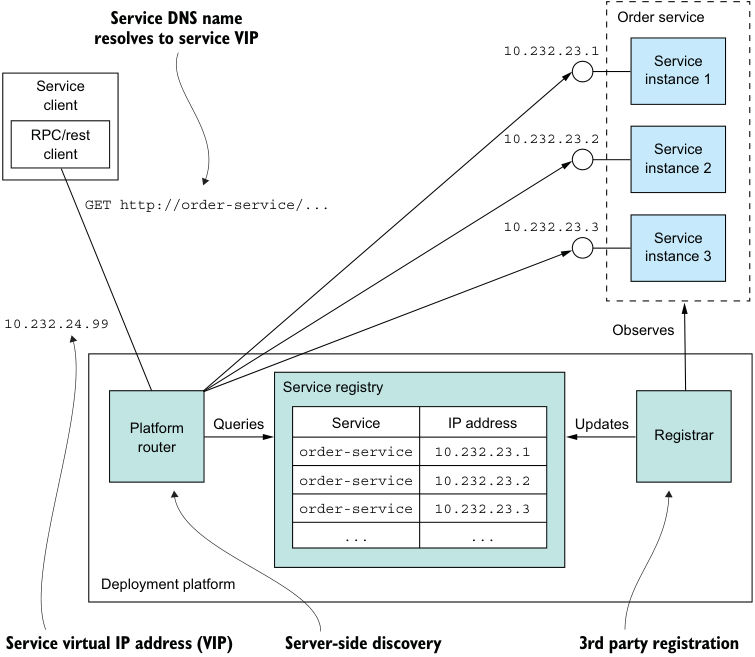

**----- Start of picture text -----** 
Service DNS name Order service resolves to service VIP 10.232.23.1 Service instance 1 Service client RPC/rest 10.232.23.2 client Service instance 2 GET http://order-service/... 10.232.23.3 Service instance 3 10.232.24.99 Observes Service registry Platform Queries Service IP address Updates Registrar router order-service 10.232.23.1 order-service 10.232.23.2 order-service 10.232.23.3 ... ... Deployment platform Service virtual IP address (VIP) Server-side discovery 3rd party registration **----- End of picture text -----** 

Figure 3.6 The platform is responsible for service registration, discovery, and request routing. Service instances are registered with the service registry by the _registrar_ . Each service has a network location, a DNS name/virtual IP address. A client makes a request to the service’s network location. The router queries the service registry and load balances requests across the available service instances. 

DNS name order-service, which resolves to the virtual IP address 10.1.3.4. The deployment platform automatically load balances requests across the three instances of the Order Service. 

This approach is a combination of two patterns: 

- _3rd party registration pattern_ —Instead of a service registering itself with the service registry, a third party called the _registrar_ , which is typically part of the deployment platform, handles the registration. 

- _Server-side discovery pattern_ —Instead of a client querying the service registry, it makes a request to a DNS name, which resolves to a request router that queries the service registry and load balances requests. 

_**Communicating using the Asynchronous messaging pattern**_ 

## Pattern: 3rd party registration 

Service instances are automatically registered with the service registry by a third party. See http://microservices.io/patterns/3rd-party-registration.html. 

## Pattern: Server-side discovery 

A client makes a request to a router, which is responsible for service discovery. See http://microservices.io/patterns/server-side-discovery.html. 

The key benefit of platform-provided service discovery is that all aspects of service discovery are entirely handled by the deployment platform. Neither the services nor the clients contain any service discovery code. Consequently, the service discovery mechanism is readily available to all services and clients regardless of which language or framework they’re written in. 

One drawback of platform-provided service discovery is that it only supports the discovery of services that have been deployed using the platform. For example, as mentioned earlier when describing application-level discovery, Kubernetes-based discovery only works for services running on Kubernetes. Despite this limitation, I recommend using platform-provided service discovery whenever possible. 

Now that we’ve looked at synchronous IPC using REST or gRPC, let’s take a look at the alternative: asynchronous, message-based communication. 

## _3.3 Communicating using the Asynchronous messaging pattern_ 

When using messaging, services communicate by asynchronously exchanging messages. A messaging-based application typically uses a _message broker_ , which acts as an intermediary between the services, although another option is to use a brokerless architecture, where the services communicate directly with each other. A service client makes a request to a service by sending it a message. If the service instance is expected to reply, it will do so by sending a separate message back to the client. Because the communication is asynchronous, the client doesn’t block waiting for a reply. Instead, the client is written assuming that the reply won’t be received immediately. 

## Pattern: Messaging 

A client invokes a service using asynchronous messaging. See http://microservices .io/patterns/communication-style/messaging.html. 

I start this section with an overview of messaging. I show how to describe a messaging architecture independently of messaging technology. Next I compare and contrast 

brokerless and broker-based architectures and describe the criteria for selecting a message broker. I then discuss several important topics, including scaling consumers while preserving message ordering, detecting and discarding duplicate messages, and sending and receiving messages as part of a database transaction. Let’s begin by looking at how messaging works. 

## _3.3.1 Overview of messaging_ 

A useful model of messaging is defined in the book _Enterprise Integration Patterns_ (Addison-Wesley Professional, 2003) by Gregor Hohpe and Bobby Woolf. In this model, messages are exchanged over message channels. A sender (an application or service) writes a message to a channel, and a receiver (an application or service) reads messages from a channel. Let’s look at messages and then look at channels. 

## ABOUT MESSAGES 

A message consists of a header and a message body (www.enterpriseintegrationpatterns .com/Message.html). The _header_ is a collection of name-value pairs, metadata that describes the data being sent. In addition to name-value pairs provided by the message’s sender, the message header contains name-value pairs, such as a unique _message id_ generated by either the sender or the messaging infrastructure, and an optional _return address_ , which specifies the message channel that a reply should be written to. The message _body_ is the data being sent, in either text or binary format. 

There are several different kinds of messages: 

- _Document_ —A generic message that contains only data. The receiver decides how to interpret it. The reply to a command is an example of a document message. 

- _Command_ —A message that’s the equivalent of an RPC request. It specifies the operation to invoke and its parameters. 

- _Event_ —A message indicating that something notable has occurred in the sender. An event is often a domain event, which represents a state change of a domain object such as an Order, or a Customer. 

The approach to the microservice architecture described in this book uses commands and events extensively. 

Let’s now look at channels, the mechanism by which services communicate. 

## ABOUT MESSAGE CHANNELS 

As figure 3.7 shows, messages are exchanged over channels (www.enterpriseintegrationpatterns.com/MessageChannel.html). The business logic in the sender invokes a _sending port_ interface, which encapsulates the underlying communication mechanism. The _sending port_ is implemented by a _message sender_ adapter class, which sends a message to a receiver via a message channel. A _message channel_ is an abstraction of the messaging infrastructure. A _message handler_ adapter class in the receiver is invoked to handle the message. It invokes a _receiving port_ interface implemented by the consumer’s 

_**Communicating using the Asynchronous messaging pattern**_ 

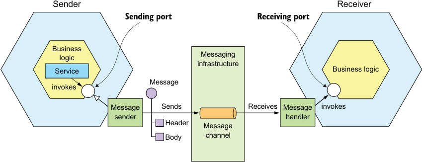

**----- Start of picture text -----** 
Sender Receiver Sending port Receiving port Business Messaging logic infrastructure Service Business logic Message invokes Message Sends Receives Message invokes sender handler Header Message Body channel **----- End of picture text -----** 

Figure 3.7 The business logic in the sender invokes a sending port interface, which is implemented by a  message sender adapter. The message sender sends a message to a receiver via a message channel. The message channel is an abstraction of messaging infrastructure. A message handler adapter in the receiver is invoked to handle the message. It invokes the receiving port interface implemented by the receiver’s business logic. business logic. Any number of senders can send messages to a channel. Similarly, any number of receivers can receive messages from a channel. 

There are two kinds of channels: point-to-point (www.enterpriseintegrationpatterns .com/PointToPointChannel.html) and publish-subscribe (www.enterpriseintegrationpatterns.com/PublishSubscribeChannel.html): 

- A _point-to-point_ channel delivers a message to exactly one of the consumers that is reading from the channel. Services use point-to-point channels for the oneto-one interaction styles described earlier. For example, a command message is often sent over a point-to-point channel. 

- A _publish-subscribe_ channel delivers each message to all of the attached consumers. Services use publish-subscribe channels for the one-to-many interaction styles described earlier. For example, an event message is usually sent over a publish-subscribe channel. 

## _3.3.2 Implementing the interaction styles using messaging_ 

One of the valuable features of messaging is that it’s flexible enough to support all the interaction styles described in section 3.1.1. Some interaction styles are directly implemented by messaging. Others must be implemented on top of messaging. 

Let’s look at how to implement each interaction style, starting with request/response and asynchronous request/response. 

IMPLEMENTING REQUEST/RESPONSE AND ASYNCHRONOUS REQUEST/RESPONSE 

When a client and service interact using either request/response or asynchronous request/response, the client sends a request and the service sends back a reply. The 

difference between the two interaction styles is that with request/response the client expects the service to respond immediately, whereas with asynchronous request/ response there is no such expectation. Messaging is inherently asynchronous, so only provides asynchronous request/response. But a client could block until a reply is received. 

The client and service implement the asynchronous request/response style interaction by exchanging a pair of messages. As figure 3.8 shows, the client sends a command message, which specifies the operation to perform, and parameters, to a pointto-point messaging channel owned by a service. The service processes the requests and sends a reply message, which contains the outcome, to a point-to-point channel owned by the client. 

**Client sends message containing msgId and a reply channel.** 

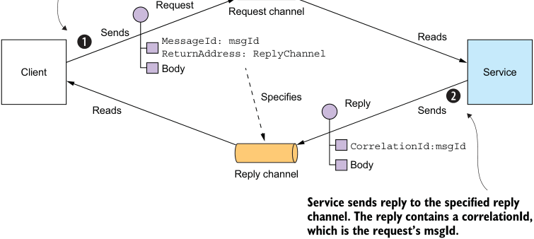

**----- Start of picture text -----** 
Request Request channel Sends MessageId: msgId Reads ReturnAddress: ReplyChannel Client Body Service Specifies Reply Reads Sends CorrelationId:msgId Body Reply channel Service sends reply to the specified reply channel. The reply contains a correlationId, which is the request’s msgId. **----- End of picture text -----** 

Figure 3.8 Implementing asynchronous request/response by including a reply channel and message identifier in the request message. The receiver processes the message and sends the reply to the specified reply channel. 

The client must tell the service where to send a reply message and must match reply messages to requests. Fortunately, solving these two problems isn’t that difficult. The client sends a command message that has a _reply channel_ header. The server writes the reply message, which contains a _correlation id_ that has the same value as _message identifier_ , to the reply channel. The client uses the _correlation id_ to match the reply message with the request. 

Because the client and service communicate using messaging, the interaction is inherently asynchronous. In theory, a messaging client could block until it receives a reply, but in practice the client will process replies asynchronously. What’s more, replies are typically processed by any one of the client’s instances. 

_**Communicating using the Asynchronous messaging pattern**_ 

## IMPLEMENTING ONE-WAY NOTIFICATIONS 

Implementing one-way notifications is straightforward using asynchronous messaging. The client sends a message, typically a command message, to a point-to-point channel owned by the service. The service subscribes to the channel and processes the message. It doesn’t send back a reply. 

## IMPLEMENTING PUBLISH/SUBSCRIBE 

Messaging has built-in support for the publish/subscribe style of interaction. A client publishes a message to a publish-subscribe channel that is read by multiple consumers. As described in chapters 4 and 5, services use publish/subscribe to publish domain events, which represent changes to domain objects. The service that publishes the domain events owns a publish-subscribe channel, whose name is derived from the domain class. For example, the Order Service publishes Order events to an Order channel, and the Delivery Service publishes Delivery events to a Delivery channel. A service that’s interested in a particular domain object’s events only has to subscribe to the appropriate channel. 

## IMPLEMENTING PUBLISH/ASYNC RESPONSES 

The publish/async responses interaction style is a higher-level style of interaction that’s implemented by combining elements of publish/subscribe and request/response. A client publishes a message that specifies a _reply channel_ header to a publish-subscribe channel. A consumer writes a reply message containing a _correlation id_ to the reply channel. The client gathers the responses by using the _correlation id_ to match the reply messages with the request. 

Each service in your application that has an asynchronous API will use one or more of these implementation techniques. A service that has an asynchronous API for invoking operations will have a message channel for requests. Similarly, a service that publishes events will publish them to an event message channel. 

As described in section 3.1.2, it’s important to write an API specification for a service. Let’s look at how to do that for an asynchronous API. 

## _3.3.3 Creating an API specification for a messaging-based service API_ 

The specification for a service’s asynchronous API must, as figure 3.9 shows, specify the names of the message channels, the message types that are exchanged over each channel, and their formats. You must also describe the format of the messages using a standard such as JSON, XML, or Protobuf. But unlike with REST and Open API, there isn’t a widely adopted standard for documenting the channels and the message types. Instead, you need to write an informal document. 

A service’s asynchronous API consists of operations, invoked by clients, and events, published by the services. They’re documented in different ways. Let’s take a look at each one, starting with operations. 

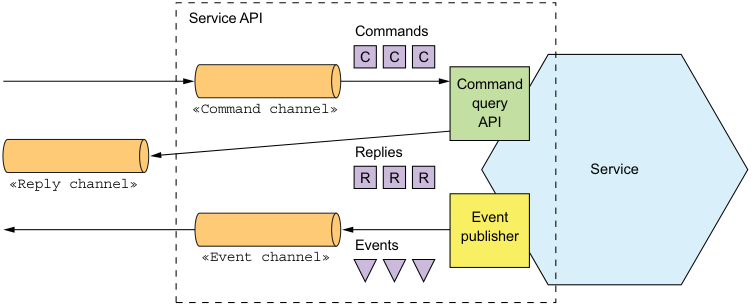

**----- Start of picture text -----** 
Service API Commands C C C Command «Command channel» query API Replies Service «Reply channel» R R R Event publisher Events «Event channel» **----- End of picture text -----** 

Figure 3.9 A service’s asynchronous API consists of message channels and command, reply, and event message types. 

## DOCUMENTING ASYNCHRONOUS OPERATIONS 

A service’s operations can be invoked using one of two different interaction styles: 

- _Request/async response-style API_ —This consists of the service’s command message channel, the types and formats of the command message types that the service accepts, and the types and formats of the reply messages sent by the service. 

- _One-way notification-style API_ —This consists of the service’s command message channel and the types and format of the command message types that the service accepts. 

A service may use the same request channel for both asynchronous request/response and one-way notification. 

## DOCUMENTING PUBLISHED EVENTS 

A service can also publish events using a publish/subscribe interaction style. The specification of this style of API consists of the event channel and the types and formats of the event messages that are published by the service to the channel. 

The messages and channels model of messaging is a great abstraction and a good way to design a service’s asynchronous API. But in order to implement a service you need to choose a messaging technology and determine how to implement your design using its capabilities. Let’s take a look at what’s involved. 

## _3.3.4 Using a message broker_ 

A messaging-based application typically uses a _message broker_ , an infrastructure service through which the service communicates. But a broker-based architecture isn’t the only messaging architecture. You can also use a brokerless-based messaging architecture, in which the services communicate with one another directly. The two approaches, shown in figure 3.10, have different trade-offs, but usually a broker-based architecture is a better approach. 

_**Communicating using the Asynchronous messaging pattern**_ 

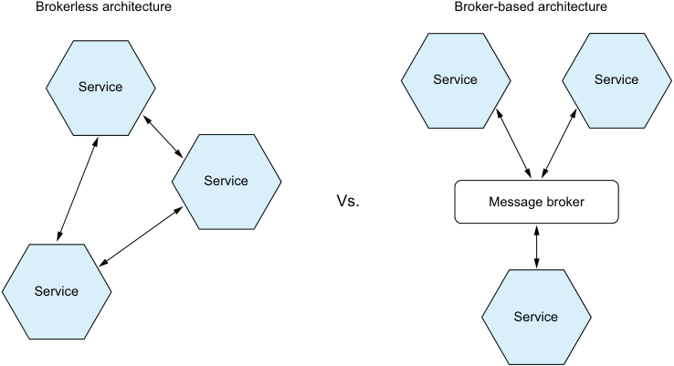

**----- Start of picture text -----** 
Brokerless architecture Broker-based architecture Service Service Service Service Vs. Message broker Service Service **----- End of picture text -----** 

Figure 3.10 The services in brokerless architecture communicate directly, whereas the services in a broker-based architecture communicate via a message broker. 

This book focuses on broker-based architecture, but it’s worthwhile to take a quick look at the brokerless architecture, because there may be scenarios where you find it useful. 

## BROKERLESS MESSAGING 

In a brokerless architecture, services can exchange messages directly. ZeroMQ (http:// zeromq.org) is a popular brokerless messaging technology. It’s both a specification and a set of libraries for different languages. It supports a variety of transports, including TCP, UNIX-style domain sockets, and multicast. 

The brokerless architecture has some benefits: 

- Allows lighter network traffic and better latency, because messages go directly from the sender to the receiver, instead of having to go from the sender to the message broker and from there to the receiver 

- Eliminates the possibility of the message broker being a performance bottleneck or a single point of failure 

- Features less operational complexity, because there is no message broker to set up and maintain 

As appealing as these benefits may seem, brokerless messaging has significant drawbacks: 

- Services need to know about each other’s locations and must therefore use one of the discovery mechanisms describer earlier in section 3.2.4. 

- It offers reduced availability, because both the sender and receiver of a message must be available while the message is being exchanged. 

- Implementing mechanisms, such as guaranteed delivery, is more challenging. 

_**Interprocess communication in a microservice architecture**_ 

In fact, some of these drawbacks, such as reduced availability and the need for service discovery, are the same as when using synchronous, response/response. 

Because of these limitations, most enterprise applications use a message brokerbased architecture. Let’s look at how that works. 

## OVERVIEW OF BROKER-BASED MESSAGING 

A message broker is an intermediary through which all messages flow. A sender writes the message to the message broker, and the message broker delivers it to the receiver. An important benefit of using a message broker is that the sender doesn’t need to know the network location of the consumer. Another benefit is that a message broker buffers messages until the consumer is able to process them. 

There are many message brokers to chose from. Examples of popular open source message brokers include the following: 

- ActiveMQ (http://activemq.apache.org) 

- RabbitMQ (https://www.rabbitmq.com) 

- Apache Kafka (http://kafka.apache.org) 

There are also cloud-based messaging services, such as AWS Kinesis (https://aws.amazon .com/kinesis/) and AWS SQS (https://aws.amazon.com/sqs/). 

When selecting a message broker, you have various factors to consider, including the following: 

- _Supported programming languages_ —You probably should pick one that supports a variety of programming languages. 

- _Supported messaging standards_ —Does the message broker support any standards, such as AMQP and STOMP, or is it proprietary? 

- _Messaging ordering_ —Does the message broker preserve ordering of messages? 

- _Delivery guarantees_ —What kind of delivery guarantees does the broker make? 

- _Persistence_ —Are messages persisted to disk and able to survive broker crashes? 

- _Durability_ —If a consumer reconnects to the message broker, will it receive the messages that were sent while it was disconnected? 

- _Scalability_ —How scalable is the message broker? 

- _Latency_ —What is the end-to-end latency? 

- _Competing consumers_ —Does the message broker support competing consumers? 

Each broker makes different trade-offs. For example, a very low-latency broker might not preserve ordering, make no guarantees to deliver messages, and only store messages in memory. A messaging broker that guarantees delivery and reliably stores messages on disk will probably have higher latency. Which kind of message broker is the best fit depends on your application’s requirements. It’s even possible that different parts of your application will have different messaging requirements. 

It’s likely, though, that messaging ordering and scalability are essential. Let’s now look at how to implement message channels using a message broker. 

_**Communicating using the Asynchronous messaging pattern**_ 

## IMPLEMENTING MESSAGE CHANNELS USING A MESSAGE BROKER 

Each message broker implements the message channel concept in a different way. As table 3.2 shows, JMS message brokers such as ActiveMQ have queues and topics. AMQP-based message brokers such as RabbitMQ have exchanges and queues. Apache Kafka has topics, AWS Kinesis has streams, and AWS SQS has queues. What’s more, some message brokers offer more flexible messaging than the message and channels abstraction described in this chapter. 

Table 3.2 Each message broker implements the message channel concept in a different way. 

|Message broker|Point-to-point channel|Publish-subscribe channel|
|---|---|---|
|JMS Apache Kafka AMQP-based brokers, such as RabbitMQ AWS Kinesis AWS SQS|Queue Topic Exchange + Queue Stream Queue|Topic Topic Fanout exchange and a queue per consumer Stream —|

Almost all the message brokers described here support both point-to-point and publishsubscribe channels. The one exception is AWS SQS, which only supports point-to-point channels. 

Now let’s look at the benefits and drawbacks of broker-based messaging. 

BENEFITS AND DRAWBACKS OF BROKER-BASED MESSAGING 

There are many advantages to using broker-based messaging: 

- _Loose coupling_ —A client makes a request by simply sending a message to the appropriate channel. The client is completely unaware of the service instances. It doesn’t need to use a discovery mechanism to determine the location of a service instance. 

- _Message buffering_ —The message broker buffers messages until they can be processed. With a synchronous request/response protocol such as HTTP, both the client and service must be available for the duration of the exchange. With messaging, though, messages will queue up until they can be processed by the consumer. This means, for example, that an online store can accept orders from customers even when the order-fulfillment system is slow or unavailable. The messages will simply queue up until they can be processed. 

- _Flexible communication_ —Messaging supports all the interaction styles described earlier. 

- _Explicit interprocess communication_ —RPC-based mechanism attempts to make invoking a remote service look the same as calling a local service. But due to the laws of physics and the possibility of partial failure, they’re in fact quite different. 

_**Interprocess communication in a microservice architecture**_ 

Messaging makes these differences very explicit, so developers aren’t lulled into a false sense of security. 

There are some downsides to using messaging: 

- _Potential performance bottleneck_ —There is a risk that the message broker could be a performance bottleneck. Fortunately, many modern message brokers are designed to be highly scalable. 

- _Potential single point of failure_ —It’s essential that the message broker is highly available—otherwise, system reliability will be impacted. Fortunately, most modern brokers have been designed to be highly available. 

- _Additional operational complexity_ —The messaging system is yet another system component that must be installed, configured, and operated. 

Let’s look at some design issues you might face. 

## _3.3.5 Competing receivers and message ordering_ 

One challenge is how to scale out message receivers while preserving message ordering. It’s a common requirement to have multiple instances of a service in order to process messages concurrently. Moreover, even a single service instance will probably use threads to concurrently process multiple messages. Using multiple threads and service instances to concurrently process messages increases the throughput of the application. But the challenge with processing messages concurrently is ensuring that each message is processed once and in order. 

For example, imagine that there are three instances of a service reading from the same point-to-point channel and that a sender publishes Order Created, Order Updated, and Order Cancelled event messages sequentially. A simplistic messaging implementation could concurrently deliver each message to a different receiver. Because of delays due to network issues or garbage collections, messages might be processed out of order, which would result in strange behavior. In theory, a service instance might process the Order Cancelled message before another service processes the Order Created message! 

A common solution, used by modern message brokers like Apache Kafka and AWS Kinesis, is to use _sharded_ (partitioned) channels. Figure 3.11 shows how this works. There are three parts to the solution: 

- 1 A sharded channel consists of two or more shards, each of which behaves like a channel. 

- 2 The sender specifies a shard key in the message’s header, which is typically an arbitrary string or sequence of bytes. The message broker uses a shard key to assign the message to a particular shard/partition. It might, for example, select the shard by computing the hash of the shard key modulo the number of shards. 

- 3 The messaging broker groups together multiple instances of a receiver and treats them as the same logical receiver. Apache Kafka, for example, uses the term _consumer group_ . The message broker assigns each shard to a single receiver. It reassigns shards when receivers start up and shut down. 

_**Communicating using the Asynchronous messaging pattern**_ 

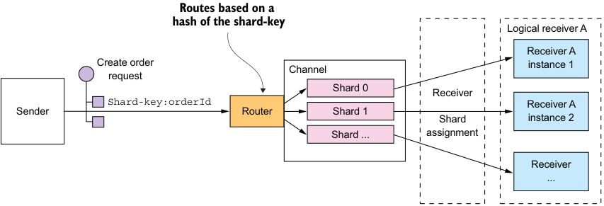

**----- Start of picture text -----** 
Routes based on a hash of the shard-key Logical receiver A Receiver A Create order Channel instance 1 request Shard 0 Receiver Shard-key:orderId Receiver A Sender Router S hard 1 Shard instance 2 Shard ... assignment Receiver ... **----- End of picture text -----** 

Figure 3.11 Scaling consumers while preserving message ordering by using a sharded (partitioned) message channel. The sender includes the shard key in the message. The message broker writes the message to a shard determined by the shard key. The message broker assigns each partition to an instance of the replicated receiver. 

In this example, each Order event message has the orderId as its shard key. Each event for a particular order is published to the same shard, which is read by a single consumer instance. As a result, these messages are guaranteed to be processed in order. 

## _3.3.6 Handling duplicate messages_ 

Another challenge you must tackle when using messaging is dealing with duplicate messages. A message broker should ideally deliver each message only once, but guaranteeing exactly-once messaging is usually too costly. Instead, most message brokers promise to deliver a message _at least_ once. 

When the system is working normally, a message broker that guarantees at-leastonce delivery will deliver each message only once. But a failure of a client, network, or message broker can result in a message being delivered multiple times. Say a client crashes after processing a message and updating its database—but before acknowledging the message. The message broker will deliver the unacknowledged message again, either to that client when it restarts or to another replica of the client. 

Ideally, you should use a message broker that preserves ordering when redelivering messages. Imagine that the client processes an Order Created event followed by an Order Cancelled event for the same Order, and that somehow the Order Created event wasn’t acknowledged. The message broker should redeliver both the Order Created and Order Cancelled events. If it only redelivers the Order Created, the client may undo the cancelling of the Order. 

There are a couple of different ways to handle duplicate messages: 

- Write idempotent message handlers. 

- Track messages and discard duplicates. 

Let’s look at each option. 

## WRITING IDEMPOTENT MESSAGE HANDLERS 

If the application logic that processes messages is idempotent, then duplicate messages are harmless. Application logic is _idempotent_ if calling it multiple times with the same input values has no additional effect. For instance, cancelling an already-cancelled order is an idempotent operation. So is creating an order with a client-supplied ID. An idempotent message handler can be safely executed multiple times, provided that the message broker preserves ordering when redelivering messages. 

Unfortunately, application logic is often not idempotent. Or you may be using a message broker that doesn’t preserve ordering when redelivering messages. Duplicate or out-of-order messages can cause bugs. In this situation, you must write message handlers that track messages and discard duplicate messages. 

## TRACKING MESSAGES AND DISCARDING DUPLICATES 

Consider, for example, a message handler that authorizes a consumer credit card. It must authorize the card exactly once for each order. This example of application logic has a different effect each time it’s invoked. If duplicate messages caused the message handler to execute this logic multiple times, the application would behave incorrectly. The message handler that executes this kind of application logic must become idempotent by detecting and discarding duplicate messages. 

A simple solution is for a message consumer to track the messages that it has processed using the message id and discard any duplicates. It could, for example, store the message id of each message that it consumed in a database table. Figure 3.12 shows how to do this using a dedicated table. 

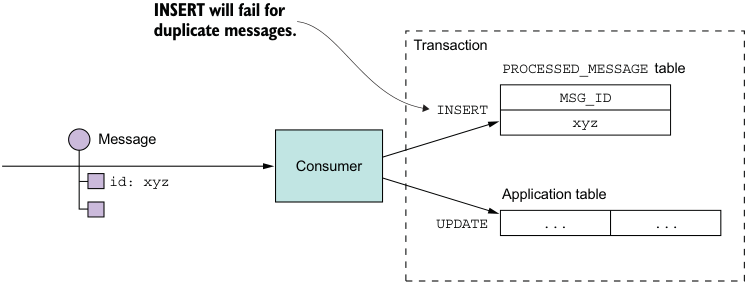

**----- Start of picture text -----** 
INSERT will fail for duplicate messages. Transaction PROCESSED_MESSAGE table MSG_ID INSERT xyz Message Consumer id: xyz Application table UPDATE ... ... **----- End of picture text -----** 

Figure 3.12 A consumer detects and discards duplicate messages by recording the IDs of processed messages in a database table. If a message has been processed before, the INSERT into the PROCESSED_MESSAGES table will fail. 

When a consumer handles a message, it records the message id in the database table as part of the transaction that creates and updates business entities. In this example, the consumer inserts a row containing the message id into a PROCESSED_MESSAGES table. If a message is a duplicate, the INSERT will fail and the consumer can discard the message. 

_**Communicating using the Asynchronous messaging pattern**_ 

Another option is for a  message handler to record message ids in an application table instead of a dedicated table. This approach is particularly useful when using a NoSQL database that has a limited transaction model, so it doesn’t support updating two tables as part of a database transaction. Chapter 7 shows an example of this approach. 

## _3.3.7 Transactional messaging_ 

A service often needs to publish messages as part of a transaction that updates the database. For instance, throughout this book you see examples of services that publish domain events whenever they create or update business entities. Both the database update and the sending of the message must happen within a transaction. Otherwise, a service might update the database and then crash, for example, before sending the message. If the service doesn’t perform these two operations atomically, a failure could leave the system in an inconsistent state. 

The traditional solution is to use a distributed transaction that spans the database and the message broker. But as you’ll learn in chapter 4, distributed transactions aren’t a good choice for modern applications. Moreover, many modern brokers such as Apache Kafka don’t support distributed transactions. 

As a result, an application must use a different mechanism to reliably publish messages. Let’s look at how that works. 

## USING A DATABASE TABLE AS A MESSAGE QUEUE 

Let’s imagine that your application is using a relational database. A straightforward way to reliably publish messages is to apply the Transactional outbox pattern. This pattern uses a database table as a temporary message queue. As figure 3.13 shows, a service that sends messages has an OUTBOX database table. As part of the database 

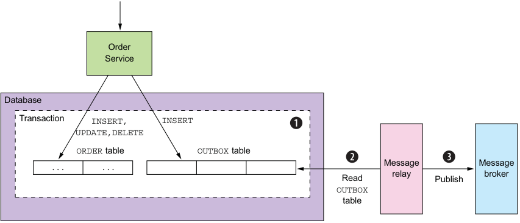

**----- Start of picture text -----** 
Order Service Database Transaction INSERT, INSERT UPDATE,DELETE ORDER table OUTBOX table ... ... Read Messagerelay Publish Messagebroker OUTBOX table **----- End of picture text -----** 

Figure 3.13 A service reliably publishes a message by inserting it into an **OUTBOX** table as part of the transaction that updates the database. The **Message Relay** reads the **OUTBOX** table and publishes the messages to a message broker. 

_**Interprocess communication in a microservice architecture**_ 

transaction that creates, updates, and deletes business objects, the service sends messages by inserting them into the OUTBOX table. Atomicity is guaranteed because this is a local ACID transaction. 

The OUTBOX table acts a temporary message queue. The MessageRelay is a component that reads the OUTBOX table and publishes the messages to a message broker. 

## Pattern: Transactional outbox 

Publish an event or message as part of a database transaction by saving it in an OUTBOX in the database. See http://microservices.io/patterns/data/transactional-outbox.html. 

You can use a similar approach with some NoSQL databases. Each business entity stored as a record in the database has an attribute that is a list of messages that need to be published. When a service updates an entity in the database, it appends a message to that list. This is atomic because it’s done with a single database operation. The challenge, though, is efficiently finding those business entities that have events and publishing them. 

There are a couple of different ways to move messages from the database to the message broker. We’ll look at each one. 

PUBLISHING EVENTS BY USING THE POLLING PUBLISHER PATTERN 

If the application uses a relational database, a very simple way to publish the messages inserted into the OUTBOX table is for the MessageRelay to poll the table for unpublished messages. It periodically queries the table: 

SELECT * FROM OUTBOX ORDERED BY ... ASC 

Next, the MessageRelay publishes those messages to the message broker, sending one to its destination message channel. Finally, it deletes those messages from the OUTBOX table: 

BEGIN DELETE FROM OUTBOX WHERE ID in (....) COMMIT 

## Pattern: Polling publisher 

Publish messages by polling the outbox in the database. See http://microservices.io/patterns/data/polling-publisher.html. 

Polling the database is a simple approach that works reasonably well at low scale. The downside is that frequently polling the database can be expensive. Also, whether you can use this approach with a NoSQL database depends on its querying capabilities. That’s because rather than querying an OUTBOX table, the application must query the 

_**Communicating using the Asynchronous messaging pattern**_ 

business entities, and that may or may not be possible to do efficiently. Because of these drawbacks and limitations, it’s often better—and in some cases, necessary—to use the more sophisticated and performant approach of tailing the database transaction log. 

PUBLISHING EVENTS BY APPLYING THE TRANSACTION LOG TAILING PATTERN 

A sophisticated solution is for MessageRelay to _tail_ the database transaction log (also called the commit log). Every committed update made by an application is represented as an entry in the database’s transaction log. A transaction log miner can read the transaction log and publish each change as a message to the message broker. Figure 3.14 shows how this approach works. 

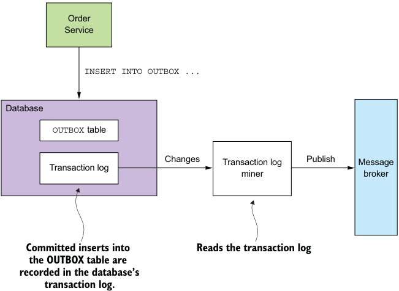

**----- Start of picture text -----** 
Order Service INSERT INTO OUTBOX ... Database OUTBOX table Changes Transaction log Publish Message Transaction log miner broker Committed inserts into Reads the transaction log the OUTBOX table are recorded in the database’s transaction log. **----- End of picture text -----** 

Figure 3.14 A service publishes messages inserted into the **OUTBOX** table by mining the database’s transaction log. 

The Transaction Log Miner reads the transaction log entries. It converts each relevant log entry corresponding to an inserted message into a message and publishes that message to the message broker. This approach can be used to publish messages written to an OUTBOX table in an RDBMS or messages appended to records in a NoSQL database. 

## Pattern: Transaction log tailing 

Publish changes made to the database by tailing the transaction log. See http://microservices.io/patterns/data/transaction-log-tailing.html. 

There are a few examples of this approach in use: 

- _Debezium_ (http://debezium.io)—An open source project that publishes database changes to the Apache Kafka message broker. 

- _LinkedIn Databus_ (https://github.com/linkedin/databus)—An open source project that mines the Oracle transaction log and publishes the changes as events. LinkedIn uses Databus to synchronize various derived data stores with the system of record. 

- _DynamoDB streams_ (http://docs.aws.amazon.com/amazondynamodb/latest/ developerguide/Streams.html)—DynamoDB streams contain the time-ordered sequence of changes (creates, updates, and deletes) made to the items in a DynamoDB table in the last 24 hours. An application can read those changes from the stream and, for example, publish them as events. 

- _Eventuate Tram_ (https://github.com/eventuate-tram/eventuate-tram-core)—Your author’s very own open source transaction messaging library that uses MySQL binlog protocol, Postgres WAL, or polling to read changes made to an OUTBOX table and publish them to Apache Kafka. 

Although this approach is obscure, it works remarkably well. The challenge is that implementing it requires some development effort. You could, for example, write lowlevel code that calls database-specific APIs. Alternatively, you could use an open source framework such as Debezium that publishes changes made by an application to MySQL, Postgres, or MongoDB to Apache Kafka. The drawback of using Debezium is that its focus is capturing changes at the database level and that APIs for sending and receiving messages are outside of its scope. That’s why I created the Eventuate Tram framework, which provides the messaging APIs as well as transaction tailing and polling. 

## _3.3.8 Libraries and frameworks for messaging_ 

A service needs to use a library to send and receive messages. One approach is to use the message broker’s client library, although there are several problems with using such a library directly: 

- The client library couples business logic that publishes messages to the message broker APIs. 

- A message broker’s client library is typically low level and requires many lines of code to send or receive a message. As a developer, you don’t want to repeatedly write boilerplate code. Also, as the author of this book I don’t want the example code cluttered with low-level boilerplate. 

- The client library usually provides only the basic mechanism to send and receive messages and doesn’t support the higher-level interaction styles. 

A better approach is to use a higher-level library or framework that hides the low-level details and directly supports the higher-level interaction styles. For simplicity, the examples in this book use my Eventuate Tram framework. It has a simple, easy-tounderstand API that hides the complexity of using the message broker. Besides an API 

_**Communicating using the Asynchronous messaging pattern**_ 

for sending and receiving messages, Eventuate Tram also supports higher-level interaction styles such as asynchronous request/response and domain event publishing. 

## What!? Why the Eventuate frameworks? 

The code samples in this book use the open source Eventuate frameworks I’ve developed for transactional messaging, event sourcing, and sagas. I chose to use my frameworks because, unlike with, say, dependency injection and the Spring framework, there are no widely adopted frameworks for many of the features the microservice architecture requires. Without the Eventuate Tram framework, many examples would have to use the low-level messaging APIs directly, making them much more complicated and obscuring important concepts. Or they would use a framework that isn’t widely adopted, which would also provoke criticism. 

Instead, the examples use the Eventuate Tram frameworks, which have a simple, easy-to-understand API that hides the implementation details. You can use these frameworks in your applications. Alternatively, you can study the Eventuate Tram frameworks and reimplement the concepts yourself. 

Eventuate Tram also implements two important mechanisms: 

- _Transactional messaging_ —It publishes messages as part of a database transaction. 

- _Duplicate message detection_ —The Eventuate Tram message consumer detects and discards duplicate messages, which is essential for ensuring that a consumer processes messages exactly once, as discussed in section 3.3.6. 

Let’s take a look at the Eventuate Tram APIs. 

## BASIC MESSAGING 

The basic messaging API consists of two Java interfaces: MessageProducer and MessageConsumer. A producer service uses the MessageProducer interface to publish messages to message channels. Here’s an example of using this interface: 

MessageProducer messageProducer = ...; String channel = ...; String payload = ...; messageProducer.send(destination, MessageBuilder.withPayload(payload).build()) 

A consumer service uses the MessageConsumer interface to subscribe to messages: 

MessageConsumer messageConsumer; messageConsumer.subscribe(subscriberId, Collections.singleton(destination), message -> { ... }) 

MessageProducer and MessageConsumer are the foundation of the higher-level APIs for asynchronous request/response and domain event publishing. 

Let’s talk about how to publish and subscribe to events. 

## DOMAIN EVENT PUBLISHING 

Eventuate Tram has APIs for publishing and consuming domain events. Chapter 5 explains that domain events are events that are emitted by an _aggregate_ (business object) when it’s created, updated, or deleted. A service publishes a domain event using the DomainEventPublisher interface. Here is an example: 

DomainEventPublisher domainEventPublisher; 

String accountId = ...; 

DomainEvent domainEvent = new AccountDebited(...); domainEventPublisher.publish("Account", accountId, Collections.singletonList( domainEvent)); 

A service consumes domain events using the DomainEventDispatcher. An example follows: 

DomainEventHandlers domainEventHandlers = DomainEventHandlersBuilder .forAggregateType("Order") .onEvent(AccountDebited.class, domainEvent -> { ... }) .build(); new DomainEventDispatcher("eventDispatcherId", domainEventHandlers, messageConsumer); 

Events aren’t the only high-level messaging pattern supported by Eventuate Tram. It also supports command/reply-based messaging. 

## COMMAND/REPLY-BASED MESSAGING 

A client can send a command message to a service using the CommandProducer interface. For example 

CommandProducer commandProducer = ...; 

Map<String, String> extraMessageHeaders = Collections.emptyMap(); 

String commandId = commandProducer.send("CustomerCommandChannel", new DoSomethingCommand(), "ReplyToChannel", extraMessageHeaders); 

A service consumes command messages using the CommandDispatcher class. CommandDispatcher uses the MessageConsumer interface to subscribe to specified events. It dispatches each command message to the appropriate handler method. Here’s an example: 

CommandHandlers commandHandlers =CommandHandlersBuilder .fromChannel(commandChannel) .onMessage(DoSomethingCommand.class, (command) - > { ... ; return withSuccess(); }) .build(); 

_**Using asynchronous messaging to improve availability**_ 

CommandDispatcher dispatcher = new CommandDispatcher("subscribeId", commandHandlers, messageConsumer, messageProducer); 

Throughout this book, you’ll see code examples that use these APIs for sending and receiving messages. 

As you’ve seen, the Eventuate Tram framework implements transactional messaging for Java applications. It provides a low-level API for sending and receiving messages transactionally. It also provides the higher-level APIs for publishing and consuming domain events and for sending and processing commands. 

Let’s now look at a service design approach that uses asynchronous messaging to improve availability. 

## _3.4 Using asynchronous messaging to improve availability_ 

As you’ve seen, a variety of IPC mechanisms have different trade-offs. One particular trade-off is how your choice of IPC mechanism impacts availability. In this section, you’ll learn that synchronous communication with other services as part of request handling reduces application availability. As a result, you should design your services to use asynchronous messaging whenever possible. 

Let’s first look at the problem with synchronous communication and how it impacts availability. 

## _3.4.1 Synchronous communication reduces availability_ 

REST is an extremely popular IPC mechanism. You may be tempted to use it for interservice communication. The problem with REST, though, is that it’s a synchronous protocol: an HTTP client must wait for the service to send a response. Whenever services communicate using a synchronous protocol, the availability of the application is reduced. 

To see why, consider the scenario shown in figure 3.15. The Order Service has a REST API for creating an Order. It invokes the Consumer Service and the Restaurant Service to validate the Order. Both of those services also have REST APIs. 

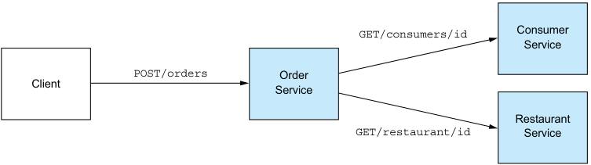

**----- Start of picture text -----** 
GET/consumers/id Consumer Service POST/orders Order Client Service Restaurant GET/restaurant/id Service **----- End of picture text -----** 

Figure 3.15 The **Order Service** invokes other services using REST. It’s straightforward, but it requires all the services to be simultaneously available, which reduces the availability of the API. 

The sequence of steps for creating an order is as follows: 

- 1 Client makes an HTTP POST /orders request to the Order Service. 

- 2 Order Service retrieves consumer information by making an HTTP GET /consumers/id request to the Consumer Service. 

- 3 Order Service retrieves restaurant information by making an HTTP GET /restaurant/id request to the Restaurant Service. 

- 4 Order Taking validates the request using the consumer and restaurant information. 

- 5 Order Taking creates an Order. 

- 6 Order Taking sends an HTTP response to the client. 

Because these services use HTTP, they must all be simultaneously available in order for the FTGO application to process the CreateOrder request. The FTGO application couldn’t create orders if any one of these three services is down. Mathematically speaking, the availability of a system operation is the product of the availability of the services that are invoked by that operation. If the Order Service and the two services that it invokes are 99.5% available, the overall availability is 99.5%[3] = 98.5%, which is significantly less. Each additional service that participates in handling a request further reduces availability. 

This problem isn’t specific to REST-based communication. Availability is reduced whenever a service can only respond to its client after receiving a response from another service. This problem exists even if services communicate using request/ response style interaction over asynchronous messaging. For example, the availability of the Order Service would be reduced if it sent a message to the Consumer Service via a message broker and then waited for a response. 

If you want to maximize availability, you must minimize the amount of synchronous communication. Let’s look at how to do that. 

## _3.4.2 Eliminating synchronous interaction_ 

There are a few different ways to reduce the amount of synchronous communication with other services while handling synchronous requests. One solution is to avoid the problem entirely by defining services that only have asynchronous APIs. That’s not always possible, though. For example, public APIs are commonly RESTful. Services are therefore sometimes required to have synchronous APIs. 

Fortunately, there are ways to handle synchronous requests without making synchronous requests. Let’s talk about the options. 

## USE ASYNCHRONOUS INTERACTION STYLES 

Ideally, all interactions should be done using the asynchronous interaction styles described earlier in this chapter. For example, say a client of the FTGO application used an asynchronous request/asynchronous response style of interaction to create orders. A client creates an order by sending a request message to the Order Service. 

_**Using asynchronous messaging to improve availability**_ 

This service then asynchronously exchanges messages with other services and eventually sends a reply message to the client. Figure 3.16 shows the design. 

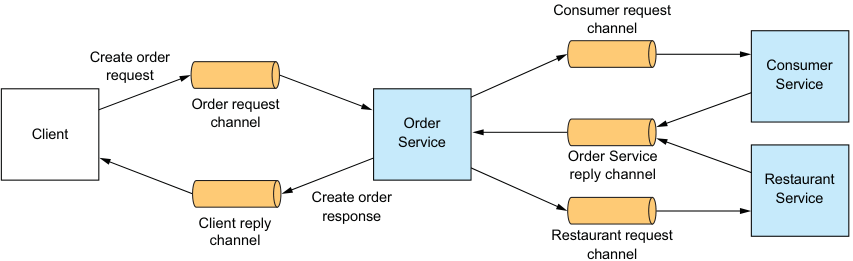

**----- Start of picture text -----** 
Consumer request channel Create order Consumer request Service Order request channel Order Client Service Order Service reply channel Restaurant Create order Service Client reply response channel Restaurant request channel **----- End of picture text -----** 

Figure 3.16 The FTGO application has higher availability if its services communicate using asynchronous messaging instead of synchronous calls. 

The client and the services communicate asynchronously by sending messages via messaging channels. No participant in this interaction is ever blocked waiting for a response. 

Such an architecture would be extremely resilient, because the message broker buffers messages until they can be consumed. The problem, however, is that services often have an external API that uses a synchronous protocol such as REST, so it must respond to requests immediately. 

If a service has a synchronous API, one way to improve availability is to replicate data. Let’s see how that works. 

## REPLICATE DATA 

One way to minimize synchronous requests during request processing is to replicate data. A service maintains a replica of the data that it needs when processing requests. It keeps the replica up-to-date by subscribing to events published by the services that own the data. For example, Order Service could maintain a replica of data owned by Consumer Service and Restaurant Service. This would enable Order Service to handle a request to create an order without having to interact with those services. Figure 3.17 shows the design. 

Consumer Service and Restaurant Service publish events whenever their data changes. Order Service subscribes to those events and updates its replica. 

In some situations, replicating data is a useful approach. For example, chapter 5 describes how Order Service replicates data from Restaurant Service so that it can validate and price menu items. One drawback of replication is that it can sometimes require the replication of large amounts of data, which is inefficient. For example, it may not be practical for Order Service to maintain a replica of the data owned by Consumer Service, due to the large number of consumers. Another drawback of 

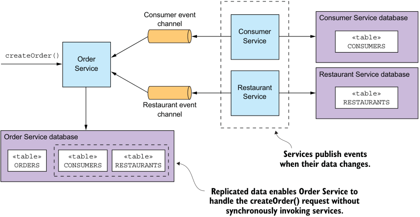

**----- Start of picture text -----** 
Consumer event Consumer Service database channel Consumer «table» Service CONSUMERS createOrder() Order Service Restaurant Service database Restaurant Service «table» Restaurant event RESTAURANTS channel Order Service database «table» «table» «table» Services publish events ORDERS CONSUMERS RESTAURANTS when their data changes. Replicated data enables Order Service to handle the createOrder() request without synchronously invoking services. **----- End of picture text -----** 

Figure 3.17 **Order Service** is self-contained because it has replicas of the consumer and restaurant data. replication is that it doesn’t solve the problem of how a service updates data owned by other services. 

One way to solve that problem is for a service to delay interacting with other services until after it responds to its client. We’ll next look at how that works. 

FINISH PROCESSING AFTER RETURNING A RESPONSE 

Another way to eliminate synchronous communication during request processing is for a service to handle a request as follows: 

- 1 Validate the request using only the data available locally. 

- 2 Update its database, including inserting messages into the OUTBOX table. 

- 3 Return a response to its client. 

While handling a request, the service doesn’t synchronously interact with any other services. Instead, it asynchronously sends messages to other services. This approach ensures that the services are loosely coupled. As you’ll learn in the next chapter, this is often implemented using a _saga_ . 

For example, if Order Service uses this approach, it creates an order in a PENDING state and then validates the order asynchronously by exchanging messages with other services. Figure 3.18 shows what happens when the createOrder() operation is invoked. The sequence of events is as follows: 

- 1 Order Service creates an Order in a PENDING state. 

- 2 Order Service returns a response to its client containing the order ID. 

- 3 Order Service sends a ValidateConsumerInfo message to Consumer Service. 

_**Using asynchronous messaging to improve availability**_ 

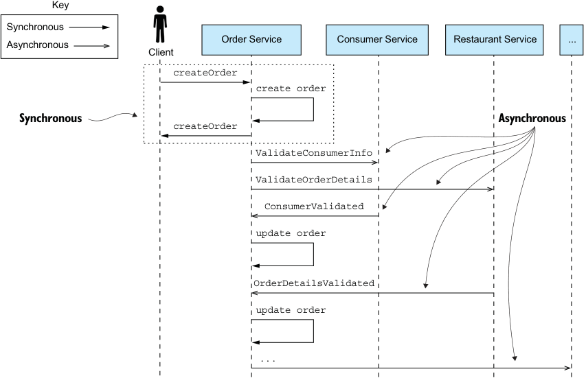

**----- Start of picture text -----** 
Key Synchronous Order Service Consumer Service Restaurant Service ... Asynchronous Client createOrder create order Synchronous createOrder Asynchronous ValidateConsumerInfo ValidateOrderDetails ConsumerValidated update order OrderDetailsValidated update order ... **----- End of picture text -----** 

Figure 3.18 **Order Service** creates an order without invoking any other service. It then asynchronously validates the newly created **Order** by exchanging messages with other services, including **Consumer Service** and **Restaurant Service** . 

- 4 Order Service sends a ValidateOrderDetails message to Restaurant Service. 

- 5 Consumer Service receives a ValidateConsumerInfo message, verifies the consumer can place an order, and sends a ConsumerValidated message to Order Service. 

- 6 Restaurant Service receives a ValidateOrderDetails message, verifies the menu item are valid and that the restaurant can deliver to the order’s delivery address, and sends an OrderDetailsValidated message to Order Service. 

- 7 Order Service receives ConsumerValidated and OrderDetailsValidated and changes the state of the order to VALIDATED. 

- 8 … 

Order Service can receive the ConsumerValidated and OrderDetailsValidated messages in either order. It keeps track of which message it receives first by changing the state of the order. If it receives the ConsumerValidated first, it changes the state of the order to CONSUMER_VALIDATED, whereas if it receives the OrderDetailsValidated message first, it changes its state to ORDER_DETAILS_VALIDATED. Order Service changes the state of the Order to VALIDATED when it receives the other message. 

_**Interprocess communication in a microservice architecture**_ 

After the Order has been validated, Order Service completes the rest of the ordercreation process, discussed in the next chapter. What’s nice about this approach is that even if Consumer Service is down, for example, Order Service still creates orders and responds to its clients. Eventually, Consumer Service will come back up and process any queued messages, and orders will be validated. 

A drawback of a service responding before fully processing a request is that it makes the client more complex. For example, Order Service makes minimal guarantees about the state of a newly created order when it returns a response. It creates the order and returns immediately before validating the order and authorizing the consumer’s credit card. Consequently, in order for the client to know whether the order was successfully created, either it must periodically poll or Order Service must send it a notification message. As complex as it sounds, in many situations this is the preferred approach—especially because it also addresses the distributed transaction management issues I discuss in the next chapter. In chapters 4 and 5, for example, I describe how Order Service uses this approach. 

## _Summary_ 

- The microservice architecture is a distributed architecture, so interprocess communication plays a key role. 

- It’s essential to carefully manage the evolution of a service’s API. Backwardcompatible changes are the easiest to make because they don’t impact clients. If you make a breaking change to a service’s API, it will typically need to support both the old and new versions until its clients have been upgraded. 

- There are numerous IPC technologies, each with different trade-offs. One key design decision is to choose either a synchronous remote procedure invocation pattern or the asynchronous Messaging pattern. Synchronous remote procedure invocation-based protocols, such as REST, are the easiest to use. But services should ideally communicate using asynchronous messaging in order to increase availability. 

- In order to prevent failures from cascading through a system, a service client that uses a synchronous protocol must be designed to handle partial failures, which are when the invoked service is either down or exhibiting high latency. In particular, it must use timeouts when making requests, limit the number of outstanding requests, and use the Circuit breaker pattern to avoid making calls to a failing service. 

- An architecture that uses synchronous protocols must include a service discovery mechanism in order for clients to determine the network location of a service instance. The simplest approach is to use the service discovery mechanism implemented by the deployment platform: the Server-side discovery and 3rd party registration patterns. But an alternative approach is to implement service discovery at the application level: the Client-side discovery and Self registration 

_**Summary**_
patterns. It’s more work, but it does handle the scenario where services are running on multiple deployment platforms. 

- A good way to design a messaging-based architecture is to use the messages and channels model, which abstracts the details of the underlying messaging system. You can then map that design to a specific messaging infrastructure, which is typically message broker–based. 

- One key challenge when using messaging is atomically updating the database and publishing a message. A good solution is to use the Transactional outbox pattern and first write the message to the database as part of the database transaction. A separate process then retrieves the message from the database using either the Polling publisher pattern or the Transaction log tailing pattern and publishes it to the message broker. 

