# 4 Managing transactions with sagas

**This chapter covers**

- Why distributed transactions aren’t a good fit for modern applications 

- Using the Saga pattern to maintain data consistency in a microservice architecture 

- Coordinating sagas using choreography and orchestration 

- Using countermeasures to deal with the lack of isolation 

When Mary started investigating the microservice architecture, one of her biggest concerns was how to implement transactions that span multiple services. Transactions are an essential ingredient of every enterprise application. Without transactions it would be impossible to maintain data consistency. 

ACID (Atomicity, Consistency, Isolation, Durability) transactions greatly simplify the job of the developer by providing the illusion that each transaction has exclusive access to the data. In a microservice architecture, transactions that are within a single service can still use ACID transactions. The challenge, however, lies in implementing transactions for operations that update data owned by multiple services. 

For example, as described in chapter 2, the createOrder() operation spans numerous services, including Order Service, Kitchen Service, and Accounting Service. Operations such as these need a transaction management mechanism that works across services. 

Mary discovered that, as mentioned in chapter 2, the traditional approach to distributed transaction management isn’t a good choice for modern applications. Instead of an ACID transactions, an operation that spans services must use what’s known as a _saga_ , a message-driven sequence of local transactions, to maintain data consistency. One challenge with sagas is that they are ACD (Atomicity, Consistency, Durability). They lack the isolation feature of traditional ACID transactions. As a result, an application must use what are known as _countermeasures_ , design techniques that prevent or reduce the impact of concurrency anomalies caused by the lack of isolation. 

In many ways, the biggest obstacle that Mary and the FTGO developers will face when adopting microservices is moving from a single database with ACID transactions to a multi-database architecture with ACD sagas. They’re used to the simplicity of the ACID transaction model. But in reality, even monolithic applications such as the FTGO application typically don’t use textbook ACID transactions. For example, many applications use a lower transaction isolation level in order to improve performance. Also, many important business processes, such as transferring money between accounts at different banks, are eventually consistent. Not even Starbucks uses two-phase commit (www.enterpriseintegrationpatterns.com/ramblings/18_starbucks.html). 

I begin this chapter by looking at the challenges of transaction management in the microservice architecture and explain why the traditional approach to distributed transaction management isn’t an option. Next I explain how to maintain data consistency using sagas. After that I look at the two different ways of coordinating sagas: _choreography_ , where participants exchange events without a centralized point of control, and _orchestration_ , where a centralized controller tells the saga participants what operation to perform. I discuss how to use countermeasures to prevent or reduce the impact of concurrency anomalies caused by the lack of isolation between sagas. Finally, I describe the implementation of an example saga. 

Let’s start by taking a look at the challenge of managing transactions in a microservice architecture. 

## 4.1 Transaction management in a microservice architecture

Almost every request handled by an enterprise application is executed within a database transaction. Enterprise application developers use frameworks and libraries that simplify transaction management. Some frameworks and libraries provide a programmatic API for explicitly beginning, committing, and rolling back transactions. Other frameworks, such as the Spring framework, provide a declarative mechanism. Spring provides an @Transactional annotation that arranges for method invocations to be automatically executed within a transaction. As a result, it’s straightforward to write transactional business logic. 

Or, to be more precise, transaction management is straightforward in a monolithic application that accesses a single database. Transaction management is more challenging in a complex monolithic application that uses multiple databases and message brokers. And in a microservice architecture, transactions span multiple services, each of which has its own database. In this situation, the application must use a more elaborate mechanism to manage transactions. As you’ll learn, the traditional approach of using distributed transactions isn’t a viable option for modern applications. Instead, a microservices-based application must use sagas. 

Before I explain sagas, let’s first look at why transaction management is challenging in a microservice architecture. 

### 4.1.1 The need for distributed transactions in a microservice architecture

Imagine that you’re the FTGO developer responsible for implementing the createOrder() system operation. As described in chapter 2, this operation must verify that the consumer can place an order, verify the order details, authorize the consumer’s credit card, and create an Order in the database. It’s relatively straightforward to implement this operation in the monolithic FTGO application. All the data required to validate the order is readily accessible. What’s more, you can use an ACID transaction to ensure data consistency. You might use Spring’s @Transactional annotation on the createOrder() service method. 

In contrast, implementing the same operation in a microservice architecture is much more complicated. As figure 4.1 shows, the needed data is scattered around multiple services. The createOrder() operation accesses data in numerous services. It reads data from Consumer Service and updates data in Order Service, Kitchen Service, and Accounting Service. 

Because each service has its own database, you need to use a mechanism to maintain data consistency across those databases. 

### 4.1.2 The trouble with distributed transactions

The traditional approach to maintaining data consistency across multiple services, databases, or message brokers is to use distributed transactions. The de facto standard for distributed transaction management is the X/Open Distributed Transaction Processing (DTP) Model (X/Open XA—see https://en.wikipedia.org/wiki/X/Open_XA). XA uses _two-phase commit_ (2PC) to ensure that all participants in a transaction either commit or rollback. An XA-compliant technology stack consists of XA-compliant databases and message brokers, database drivers, and messaging APIs, and an interprocess communication mechanism that propagates the XA global transaction ID. Most SQL databases are XA compliant, as are some message brokers. Java EE applications can, for example, use JTA to perform distributed transactions. 

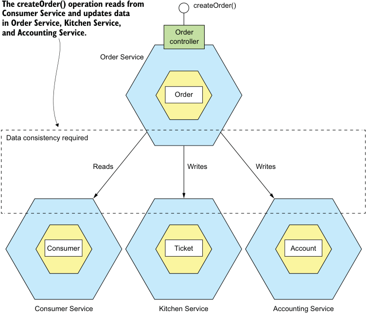

**----- Start of picture text -----**<br>
The createOrder() operation reads from createOrder()<br>Consumer Service and updates data<br>in Order Service, Kitchen Service,<br>and Accounting Service. Order<br>controller<br>Order Service<br>Order<br>Data consistency required<br>Reads Writes Writes<br>Consumer Ticket Account<br>Consumer Service Kitchen Service Accounting Service<br>**----- End of picture text -----**<br>

Figure 4.1 The **createOrder()** operation updates data in several services. It must use a mechanism to maintain data consistency across those services. 

As simple as this sounds, there are a variety of problems with distributed transactions. One problem is that many modern technologies, including NoSQL databases such as MongoDB and Cassandra, don’t support them. Also, distributed transactions aren’t supported by modern message brokers such as RabbitMQ and Apache Kafka. As a result, if you insist on using distributed transactions, you can’t use many modern technologies. 

Another problem with distributed transactions is that they are a form of synchronous IPC, which reduces availability. In order for a distributed transaction to commit, all the participating services must be available. As described in chapter 3, the availability is the product of the availability of all of the participants in the transaction. If a distributed transaction involves two services that are 99.5% available, then the overall availability is 99%, which is significantly less. Each additional service involved in a distributed transaction further reduces availability. There is even Eric Brewer’s CAP theorem, which states that a system can only have two of the following three properties: 

consistency, availability, and partition tolerance (https://en.wikipedia.org/wiki/CAP _theorem). Today, architects prefer to have a system that’s available rather than one that’s consistent. 

On the surface, distributed transactions are appealing. From a developer’s perspective, they have the same programming model as local transactions. But because of the problems mentioned so far, distributed transactions aren’t a viable technology for modern applications. Chapter 3 described how to send messages as part of a database transaction without using distributed transactions. To solve the more complex problem of maintaining data consistency in a microservice architecture, an application must use a different mechanism that builds on the concept of loosely coupled, asynchronous services. This is where sagas come in. 

### 4.1.3 Using the Saga pattern to maintain data consistency

_Sagas_ are mechanisms to maintain data consistency in a microservice architecture without having to use distributed transactions. You define a saga for each system command that needs to update data in multiple services. A saga is a sequence of local transactions. Each local transaction updates data within a single service using the familiar ACID transaction frameworks and libraries mentioned earlier. 

**Pattern: Saga**

Maintain data consistency across services using a sequence of local transactions that are coordinated using asynchronous messaging. See http://microservices.io/ patterns/data/saga.html. 

The system operation initiates the first step of the saga. The completion of a local transaction triggers the execution of the next local transaction. Later, in section 4.2, you’ll see how coordination of the steps is implemented using asynchronous messaging. An important benefit of asynchronous messaging is that it ensures that all the steps of a saga are executed, even if one or more of the saga’s participants is temporarily unavailable. 

Sagas differ from ACID transactions in a couple of important ways. As I describe in detail in section 4.3, they lack the isolation property of ACID transactions. Also, because each local transaction commits its changes, a saga must be rolled back using compensating transactions. I talk more about compensating transactions later in this section. Let’s take a look at an example saga. 

**AN EXAMPLE SAGA: THE CREATE ORDER SAGA**

The example saga used throughout this chapter is the Create Order Saga, which is shown in figure 4.2. The Order Service implements the createOrder() operation using this saga. The saga’s first local transaction is initiated by the external request to create an order. The other five local transactions are each triggered by completion of the previous one. 

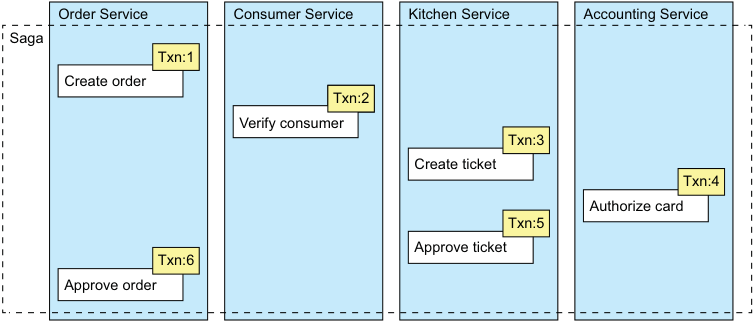

**----- Start of picture text -----**<br>
Order Service Consumer Service Kitchen Service Accounting Service<br>Saga<br>Txn:1<br>Create order<br>Txn: 12<br>Create Verify c o nsumerrder<br>Txn:3<br>Create ticket<br>Txn:4<br>Authorize card<br>Txn:5<br>Approve ticket<br>Txn:6<br>Approve order<br>**----- End of picture text -----**<br>

Figure 4.2 Creating an **Order** using a saga. The **createOrder()** operation is implemented by a saga that consists of local transactions in several services. 

This saga consists of the following local transactions: 

- 1 Order Service—Create an Order in an APPROVAL_PENDING state. 

- 2 Consumer Service—Verify that the consumer can place an order. 

- 3 Kitchen Service—Validate order details and create a Ticket in the CREATE _PENDING. 

- 4 Accounting Service—Authorize consumer’s credit card. 

- 5 Kitchen Service—Change the state of the Ticket to AWAITING_ACCEPTANCE. 

- 6 Order Service—Change the state of the Order to APPROVED. 

Later, in section 4.2, I describe how the services that participate in a saga communicate using asynchronous messaging. A service publishes a message when a local transaction completes. This message then triggers the next step in the saga. Not only does using messaging ensure the saga participants are loosely coupled, it also guarantees that a saga completes. That’s because if the recipient of a message is temporarily unavailable, the message broker buffers the message until it can be delivered. 

On the surface, sagas seem straightforward, but there are a few challenges to using them. One challenge is the lack of isolation between sagas. Section 4.3 describes how to handle this problem. Another challenge is rolling back changes when an error occurs. Let’s take a look at how to do that. 

**SAGAS USE COMPENSATING TRANSACTIONS TO ROLL BACK CHANGES**

A great feature of traditional ACID transactions is that the business logic can easily roll back a transaction if it detects the violation of a business rule. It executes a ROLLBACK statement, and the database undoes all the changes made so far. Unfortunately, sagas can’t be automatically rolled back, because each step commits its changes to the local database. This means, for example, that if the authorization of the credit card fails in the fourth step of the Create Order Saga, the FTGO application must explicitly undo the changes made by the first three steps. You must write what are known as _compensating transactions_ . 

Suppose that the ( _n_ + 1)[th] transaction of a saga fails. The effects of the previous _n_ transactions must be undone. Conceptually, each of those steps, Ti, has a corresponding compensating transaction, Ci, which undoes the effects of the Ti. To undo the effects of those first _n_ steps, the saga must execute each Ci in reverse order. The sequence of steps is T1 … Tn, Cn … C1, as shown in figure 4.3. In this example, Tn+1 fails, which requires steps T1 … Tn to be undone. 

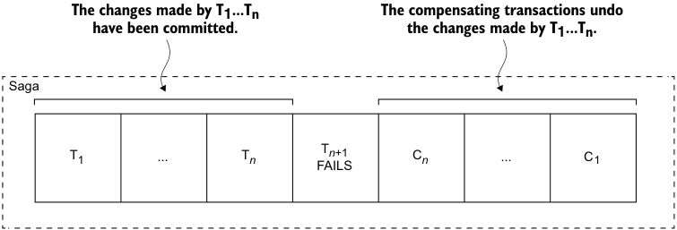

**----- Start of picture text -----**<br>
The changes made by T1...Tn The compensating transactions undo<br>have been committed. the changes made by T1...Tn.<br>Saga<br>T1 ... T n FAILST n +1 C n ... C1<br>**----- End of picture text -----**<br>

Figure 4.3 When a step of a saga fails because of a business rule violation, the saga must explicitly undo the updates made by previous steps by executing compensating transactions. 

The saga executes the compensation transactions in reverse order of the forward transactions: Cn … C1. The mechanics of sequencing the Cis aren’t any different than sequencing the Tis. The completion of Ci must trigger the execution of Ci-1. 

Consider, for example, the Create Order Saga. This saga can fail for a variety of reasons: 

- The consumer information is invalid or the consumer isn’t allowed to create orders. 

- The restaurant information is invalid or the restaurant is unable to accept orders. 

- The authorization of the consumer’s credit card fails. 

If a local transaction fails, the saga’s coordination mechanism must execute compensating transactions that reject the Order and possibly the Ticket. Table 4.1 shows the compensating transactions for each step of the Create Order Saga. It’s important to note that not all steps need compensating transactions. Read-only steps, such as verifyConsumerDetails(), don’t need compensating transactions. Nor do steps such as authorizeCreditCard() that are followed by steps that always succeed. 

Section 4.3 discusses how the first three steps of the Create Order Saga are termed _compensatable transactions_ because they’re followed by steps that can fail, how the fourth step is termed the saga’s _pivot transaction_ because it’s followed by steps that 

Table 4.1 The compensating transactions for the **Create Order Saga** 

|Step|Service|Transaction|Compensating transaction|
|---|---|---|---|
|1<br>2<br>3<br>4<br>5<br>6|Order Service<br>Consumer Service<br>Kitchen Service<br>Accounting Service<br>Kitchen Service<br>Order Service|createOrder()<br>verifyConsumerDetails()<br>createTicket()<br>authorizeCreditCard()<br>approveTicket()<br>approveOrder()|rejectOrder()<br>—<br>rejectTicket()<br>—<br>—<br>—| never fail, and how the last two steps are termed _retriable transactions_ because they always succeed. 

To see how compensating transactions are used, imagine a scenario where the authorization of the consumer’s credit card fails. In this scenario, the saga executes the following local transactions: 

- 1 Order Service—Create an Order in an APPROVAL_PENDING state. 

- 2 Consumer Service—Verify that the consumer can place an order. 

- 3 Kitchen Service—Validate order details and create a Ticket in the CREATE _PENDING state. 

- 4 Accounting Service—Authorize consumer’s credit card, which fails. 

- 5 Kitchen Service—Change the state of the Ticket to CREATE_REJECTED. 

- 6 Order Service—Change the state of the Order to REJECTED. 

The fifth and sixth steps are compensating transactions that undo the updates made by Kitchen Service and Order Service, respectively. A saga’s coordination logic is responsible for sequencing the execution of forward and compensating transactions. Let’s look at how that works. 

## 4.2 Coordinating sagas

A saga’s implementation consists of logic that coordinates the steps of the saga. When a saga is initiated by system command, the coordination logic must select and tell the first saga participant to execute a local transaction. Once that transaction completes, the saga’s sequencing coordination selects and invokes the next saga participant. This process continues until the saga has executed all the steps. If any local transaction fails, the saga must execute the compensating transactions in reverse order. There are a couple of different ways to structure a saga’s coordination logic: 

- _Choreography_ —Distribute the decision making and sequencing among the saga participants. They primarily communicate by exchanging events. 

- _Orchestration_ —Centralize a saga’s coordination logic in a saga orchestrator class. A saga _orchestrator_ sends command messages to saga participants telling them which operations to perform. 

Let’s look at each option, starting with choreography. 

### 4.2.1 Choreography-based sagas

One way you can implement a saga is by using choreography. When using choreography, there’s no central coordinator telling the saga participants what to do. Instead, the saga participants subscribe to each other’s events and respond accordingly. To show how choreography-based sagas work, I’ll first describe an example. After that, I’ll discuss a couple of design issues that you must address. Then I’ll discuss the benefits and drawbacks of using choreography. 

**IMPLEMENTING THE CREATE ORDER SAGA USING CHOREOGRAPHY**

Figure 4.4 shows the design of the choreography-based version of the Create Order Saga. The participants communicate by exchanging events. Each participant, starting with the Order Service, updates its database and publishes an event that triggers the next participant. 


**----- Start of picture text -----**<br>
Key<br>Message broker<br>Publish<br>Subscribe<br>Order events 2 Consumer Service<br>1<br>Consumer verified<br>Order created<br>2. verifyConsumerDetails()<br>3<br>Consumer events<br>Ticket created<br>Order Kitchen Service<br>Service<br>1. createOrder() 6 3. createTicket()<br>7. approveOrder() 6. approveTicket()<br>4<br>7 Ticket events 5a<br>5b Accounting Service<br>5<br>Credit card authorized<br>4. createPendingAuthorization()<br>6. authorizeCard()<br>Credit card events<br>**----- End of picture text -----**<br>

Figure 4.4 Implementing the **Create Order Saga** using choreography. The saga participants communicate by exchanging events. 

The happy path through this saga is as follows: 

- 1 Order Service creates an Order in the APPROVAL_PENDING state and publishes an OrderCreated event. 

- 2 Consumer Service consumes the OrderCreated event, verifies that the consumer can place the order, and publishes a ConsumerVerified event. 

- 3 Kitchen Service consumes the OrderCreated event, validates the Order, creates a Ticket in a CREATE_PENDING state, and publishes the TicketCreated event. 

- 4 Accounting Service consumes the OrderCreated event and creates a CreditCardAuthorization in a PENDING state. 

- 5 Accounting Service consumes the TicketCreated and ConsumerVerified events, charges the consumer’s credit card, and publishes the CreditCardAuthorized event. 

- 6 Kitchen Service consumes the CreditCardAuthorized event and changes the state of the Ticket to AWAITING_ACCEPTANCE. 

- 7 Order Service receives the CreditCardAuthorized events, changes the state of the Order to APPROVED, and publishes an OrderApproved event. 

The Create Order Saga must also handle the scenario where a saga participant rejects the Order and publishes some kind of failure event. For example, the authorization of the consumer’s credit card might fail. The saga must execute the compensating transactions to undo what’s already been done. Figure 4.5 shows the flow of events when the AccountingService can’t authorize the consumer’s credit card. 

The sequence of events is as follows: 

- 1 Order Service creates an Order in the APPROVAL_PENDING state and publishes an OrderCreated event. 

- 2 Consumer Service consumes the OrderCreated event, verifies that the consumer can place the order, and publishes a ConsumerVerified event. 

- 3 Kitchen Service consumes the OrderCreated event, validates the Order, creates a Ticket in a CREATE_PENDING state, and publishes the TicketCreated event. 

- 4 Accounting Service consumes the OrderCreated event and creates a CreditCardAuthorization in a PENDING state. 

- 5 Accounting Service consumes the TicketCreated and ConsumerVerified events, charges the consumer’s credit card, and publishes a Credit Card Authorization Failed event. 

- 6 Kitchen Service consumes the Credit Card Authorization Failed event and changes the state of the Ticket to REJECTED. 

- 7 Order Service consumes the Credit Card Authorization Failed event and changes the state of the Order to REJECTED. 

As you can see, the participants of choreography-based sagas interact using publish/ subscribe. Let’s take a closer look at some issues you’ll need to consider when implementing publish/subscribe-based communication for your sagas. 

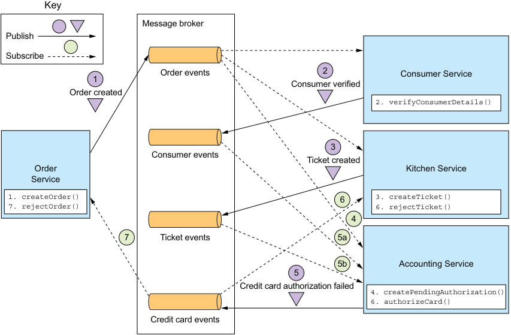

**----- Start of picture text -----**<br>
Key<br>Message broker<br>Publish<br>Subscribe<br>Order events 2 Consumer Service<br>1<br>Consumer verified<br>Order created<br>2. verifyConsumerDetails()<br>3<br>Consumer events<br>Ticket created<br>Order Kitchen Service<br>Service<br>1. createOrder() 6 3. createTicket()<br>7. rejectOrder() 6. rejectTicket()<br>4<br>7 Ticket events 5a<br>5b Accounting Service<br>5<br>Credit card authorization failed<br>4. createPendingAuthorization()<br>6. authorizeCard()<br>Credit card events<br>**----- End of picture text -----**<br>

Figure 4.5 The sequence of events in the **Create Order Saga** when the authorization of the consumer’s credit card fails. **Accounting Service** publishes the **Credit Card Authorization Failed** event, which causes **Kitchen Service** to reject the **Ticket** , and **Order Service** to reject the **Order** . 

**RELIABLE EVENT-BASED COMMUNICATION**

There are a couple of interservice communication-related issues that you must consider when implementing choreography-based sagas. The first issue is ensuring that a saga participant updates its database and publishes an event as part of a database transaction. Each step of a choreography-based saga updates the database and publishes an event. For example, in the Create Order Saga, Kitchen Service receives a Consumer Verified event, creates a Ticket, and publishes a Ticket Created event. It’s essential that the database update and the publishing of the event happen atomically. Consequently, to communicate reliably, the saga participants must use transactional messaging, described in chapter 3. 

The second issue you need to consider is ensuring that a saga participant must be able to map each event that it receives to its own data. For example, when Order Service receives a Credit Card Authorized event, it must be able to look up the corresponding Order. The solution is for a saga participant to publish events containing a _correlation id_ , which is data that enables other participants to perform the mapping. 

For example, the participants of the Create Order Saga can use the orderId as a correlation ID that’s passed from one participant to the next. Accounting Service publishes a Credit Card Authorized event containing the orderId from the TicketCreated event. When Order Service receives a Credit Card Authorized event, it uses the orderId to retrieve the corresponding Order. Similarly, Kitchen Service uses the orderId from that event to retrieve the corresponding Ticket. 

BENEFITS AND DRAWBACKS OF CHOREOGRAPHY-BASED SAGAS 

Choreography-based sagas have several benefits: 

- _Simplicity_ —Services publish events when they create, update, or delete business objects. 

- _Loose coupling_ —The participants subscribe to events and don’t have direct knowledge of each other. 

And there are some drawbacks: 

- _More difficult to understand_ —Unlike with orchestration, there isn’t a single place in the code that defines the saga. Instead, choreography distributes the implementation of the saga among the services. Consequently, it’s sometimes difficult for a developer to understand how a given saga works. 

- _Cyclic dependencies between the services_ —The saga participants subscribe to each other’s events, which often creates cyclic dependencies. For example, if you carefully examine figure 4.4, you’ll see that there are cyclic dependencies, such as Order Service  Accounting Service  Order Service. Although this isn’t necessarily a problem, cyclic dependencies are considered a design smell. 

- _Risk of tight coupling_ —Each saga participant needs to subscribe to all events that affect them. For example, Accounting Service must subscribe to all events that cause the consumer’s credit card to be charged or refunded. As a result, there’s a risk that it would need to be updated in lockstep with the order lifecycle implemented by Order Service. 

Choreography can work well for simple sagas, but because of these drawbacks it’s often better for more complex sagas to use orchestration. Let’s look at how orchestration works. 

### 4.2.2 Orchestration-based sagas

Orchestration is another way to implement sagas. When using orchestration, you define an orchestrator class whose sole responsibility is to tell the saga participants what to do. The saga orchestrator communicates with the participants using command/ async reply-style interaction. To execute a saga step, it sends a command message to a participant telling it what operation to perform. After the saga participant has performed the operation, it sends a reply message to the orchestrator. The orchestrator then processes the message and determines which saga step to perform next. 

To show how orchestration-based sagas work, I’ll first describe an example. Then I’ll describe how to model orchestration-based sagas as state machines. I’ll discuss how to make use of transactional messaging to ensure reliable communication between the saga orchestrator and the saga participants. I’ll then describe the benefits and drawbacks of using orchestration-based sagas. 

**IMPLEMENTING THE CREATE ORDER SAGA USING ORCHESTRATION**

Figure 4.6 shows the design of the orchestration-based version of the Create Order Saga. The saga is orchestrated by the CreateOrderSaga class, which invokes the saga participants using asynchronous request/response. This class keeps track of the process and sends command messages to saga participants, such as Kitchen Service and Consumer Service. The CreateOrderSaga class reads reply messages from its reply channel and then determines the next step, if any, in the saga. 

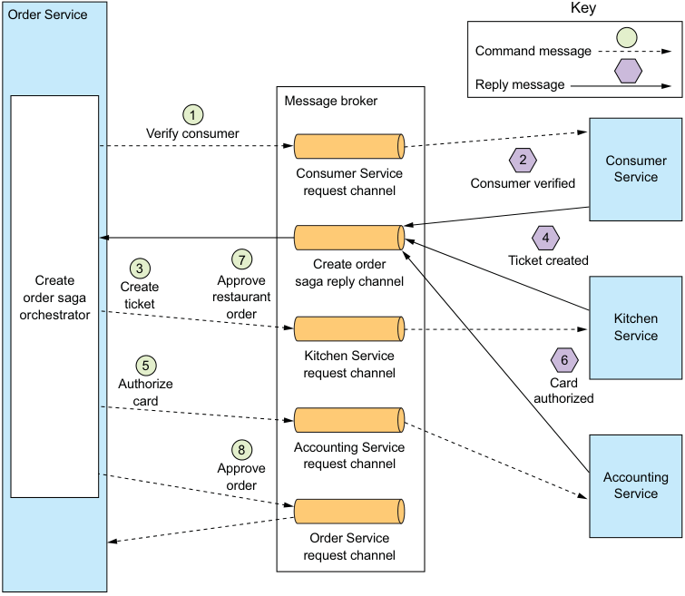

**----- Start of picture text -----**<br>
Order Service Key<br>Command message<br>Reply message<br>Message broker<br>1<br>Verify consumer<br>2 Consumer<br>Consumer Service Service<br>Consumer verified<br>request channel<br>4<br>3 7 Create order Ticket created<br>Create Create Approve saga reply channel<br>order saga ticket restaurant<br>orchestrator order Kitchen<br>Service<br>Kitchen Service 6<br>5<br>request channel<br>Authorize Card<br>card authorized<br>8 Accounting Service<br>Approve request channel<br>Accounting<br>order<br>Service<br>Order Service<br>request channel<br>**----- End of picture text -----**<br>

Figure 4.6 Implementing the **Create Order Saga** using orchestration. **Order Service** implements a saga orchestrator, which invokes the saga participants using asynchronous request/ response. 

Order Service first creates an Order and a Create Order Saga orchestrator. After that, the flow for the happy path is as follows: 

- 1 The saga orchestrator sends a Verify Consumer command to Consumer Service. 

- 2 Consumer Service replies with a Consumer Verified message. 

- 3 The saga orchestrator sends a Create Ticket command to Kitchen Service. 

- 4 Kitchen Service replies with a Ticket Created message. 

- 5 The saga orchestrator sends an Authorize Card message to Accounting Service. 

- 6 Accounting Service replies with a Card Authorized message. 

- 7 The saga orchestrator sends an Approve Ticket command to Kitchen Service. 

- 8 The saga orchestrator sends an Approve Order command to Order Service. 

Note that in final step, the saga orchestrator sends a command message to Order Service, even though it’s a component of Order Service. In principle, the Create Order Saga could approve the Order by updating it directly. But in order to be consistent, the saga treats Order Service as just another participant. 

Diagrams such as figure 4.6 each depict one scenario for a saga, but a saga is likely to have numerous scenarios. For example, the Create Order Saga has four scenarios. In addition to the happy path, the saga can fail due to a failure in either Consumer Service, Kitchen Service, or Accounting Service. It’s useful, therefore, to model a saga as a state machine, because it describes all possible scenarios. 

**MODELING SAGA ORCHESTRATORS AS STATE MACHINES**

A good way to model a saga orchestrator is as a state machine. A _state machine_ consists of a set of states and a set of transitions between states that are triggered by events. Each transition can have an action, which for a saga is the invocation of a saga participant. The transitions between states are triggered by the completion of a local transaction performed by a saga participant. The current state and the specific outcome of the local transaction determine the state transition and what action, if any, to perform. There are also effective testing strategies for state machines. As a result, using a state machine model makes designing, implementing, and testing sagas easier. 

Figure 4.7 shows the state machine model for the Create Order Saga. This state machine consists of numerous states, including the following: 

- Verifying Consumer—The initial state. When in this state, the saga is waiting for the Consumer Service to verify that the consumer can place the order. 

- Creating Ticket—The saga is waiting for a reply to the Create Ticket command. 

- Authorizing Card—Waiting for Accounting Service to authorize the consumer’s credit card. 

- Order Approved—A final state indicating that the saga completed successfully. 

- Order Rejected—A final state indicating that the Order was rejected by one of the participants. 

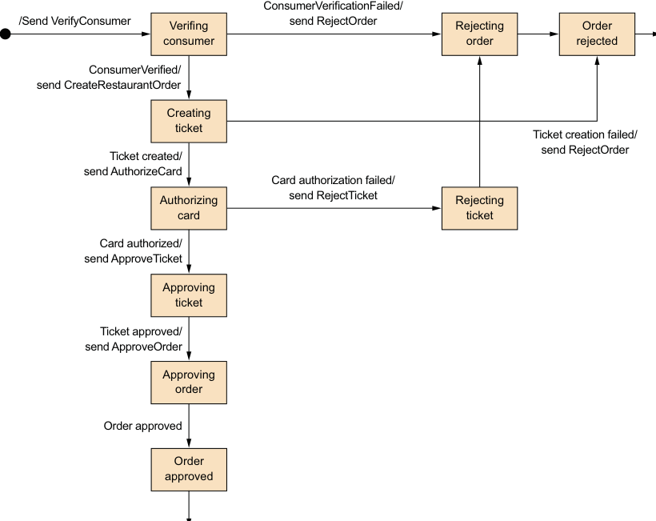

**----- Start of picture text -----**<br>
ConsumerVerificationFailed/<br>/Send VerifyConsumer Verifing send RejectOrder Rejecting Order<br>consumer order rejected<br>ConsumerVerified/<br>send CreateRestaurantOrder<br>Creating<br>ticket<br>Ticket creation failed/<br>Ticket created/ send RejectOrder<br>send AuthorizeCard<br>Card authorization failed/<br>Authorizing send RejectTicket Rejecting<br>card ticket<br>Card authorized/<br>send ApproveTicket<br>Approving<br>ticket<br>Ticket approved/<br>send ApproveOrder<br>Approving<br>order<br>Order approved<br>Order<br>approved<br>**----- End of picture text -----**<br>

Figure 4.7 The state machine model for the **Create Order Saga** 

The state machine also defines numerous state transitions. For example, the state machine transitions from the Creating Ticket state to either the Authorizing Card or the Rejected Order state. It transitions to the Authorizing Card state when it receives a successful reply to the Create Ticket command. Alternatively, if Kitchen Service couldn’t create the Ticket, the state machine transitions to the Rejected Order state. 

The state machine’s initial action is to send the VerifyConsumer command to Consumer Service. The response from Consumer Service triggers the next state transition. If the consumer was successfully verified, the saga creates the Ticket and transitions to the Creating Ticket state. But if the consumer verification failed, the saga rejects the Order and transitions to the Rejecting Order state. The state machine undergoes numerous other state transitions, driven by the responses from saga participants, until it reaches a final state of either Order Approved or Order Rejected. 

**SAGA ORCHESTRATION AND TRANSACTIONAL MESSAGING**

Each step of an orchestration-based saga consists of a service updating a database and publishing a message. For example, Order Service persists an Order and a Create Order Saga orchestrator and sends a message to the first saga participant. A saga participant, such as Kitchen Service, handles a command message by updating its database and sending a reply message. Order Service processes the participant’s reply message by updating the state of the saga orchestrator and sending a command message to the next saga participant. As described in chapter 3, a service must use transactional messaging in order to atomically update the database and publish messages. Later on in section 4.4, I’ll describe the implementation of the Create Order Saga orchestrator in more detail, including how it uses transaction messaging. 

Let’s take a look at the benefits and drawbacks of using saga orchestration. 

**BENEFITS AND DRAWBACKS OF ORCHESTRATION-BASED SAGAS**

Orchestration-based sagas have several benefits: 

- _Simpler dependencies_ —One benefit of orchestration is that it doesn’t introduce cyclic dependencies. The saga orchestrator invokes the saga participants, but the participants don’t invoke the orchestrator. As a result, the orchestrator depends on the participants but not vice versa, and so there are no cyclic dependencies. 

- _Less coupling_ —Each service implements an API that is invoked by the orchestrator, so it does not need to know about the events published by the saga participants. 

- _Improves separation of concerns and simplifies the business logic_ —The saga coordination logic is localized in the saga orchestrator. The domain objects are simpler and have no knowledge of the sagas that they participate in. For example, when using orchestration, the Order class has no knowledge of any of the sagas, so it has a simpler state machine model. During the execution of the Create Order Saga, it transitions directly from the APPROVAL_PENDING state to the APPROVED state. The Order class doesn’t have any intermediate states corresponding to the steps of the saga. As a result, the business is much simpler. 

Orchestration also has a drawback: the risk of centralizing too much business logic in the orchestrator. This results in a design where the smart orchestrator tells the dumb services what operations to do. Fortunately, you can avoid this problem by designing orchestrators that are solely responsible for sequencing and don’t contain any other business logic. 

I recommend using orchestration for all but the simplest sagas. Implementing the coordination logic for your sagas is just one of the design problems you need to solve. Another, which is perhaps the biggest challenge that you’ll face when using sagas, is handling the lack of isolation. Let’s take a look at that problem and how to solve it. 

## 4.3 Handling the lack of isolation

The _I_ in ACID stands for _isolation_ . The isolation property of ACID transactions ensures that the outcome of executing multiple transactions concurrently is the same as if they were executed in some serial order. The database provides the illusion that each ACID transaction has exclusive access to the data. Isolation makes it a lot easier to write business logic that executes concurrently. 

The challenge with using sagas is that they lack the isolation property of ACID transactions. That’s because the updates made by each of a saga’s local transactions are immediately visible to other sagas once that transaction commits. This behavior can cause two problems. First, other sagas can change the data accessed by the saga while it’s executing. And other sagas can read its data before the saga has completed its updates, and consequently can be exposed to inconsistent data. You can, in fact, consider a saga to be ACD: 

- _Atomicity_ —The saga implementation ensures that all transactions are executed or all changes are undone. 

- _Consistency_ —Referential integrity within a service is handled by local databases. Referential integrity across services is handled by the services. 

- _Durability_ —Handled by local databases. 

This lack of isolation potentially causes what the database literature calls _anomalies_ . An anomaly is when a transaction reads or writes data in a way that it wouldn’t if transactions were executed one at time. When an anomaly occurs, the outcome of executing sagas concurrently is different than if they were executed serially. 

On the surface, the lack of isolation sounds unworkable. But in practice, it’s common for developers to accept reduced isolation in return for higher performance. An RDBMS lets you specify the isolation level for each transaction (https://dev.mysql .com/doc/refman/5.7/en/innodb-transaction-isolation-levels.html). The default isolation level is usually an isolation level that’s weaker than full isolation, also known as serializable transactions. Real-world database transactions are often different from textbook definitions of ACID transactions. 

The next section discusses a set of saga design strategies that deal with the lack of isolation. These strategies are known as _countermeasures_ . Some countermeasures implement isolation at the application level. Other countermeasures reduce the business risk of the lack of isolation. By using countermeasures, you can write saga-based business logic that works correctly. 

I’ll begin the section by describing the anomalies that are caused by the lack of isolation. After that, I’ll talk about countermeasures that either eliminate those anomalies or reduce their business risk. 

### 4.3.1 Overview of anomalies

The lack of isolation can cause the following three anomalies: 

- _Lost updates_ —One saga overwrites without reading changes made by another saga. 

- _Dirty reads_ —A transaction or a saga reads the updates made by a saga that has not yet completed those updates. 

- _Fuzzy/nonrepeatable reads_ —Two different steps of a saga read the same data and get different results because another saga has made updates. 

All three anomalies can occur, but the first two are the most common and the most challenging. Let’s take a look at those two types of anomaly, starting with lost updates. 

**LOST UPDATES**

A lost update anomaly occurs when one saga overwrites an update made by another saga. Consider, for example, the following scenario: 

- 1 The first step of the Create Order Saga creates an Order. 

- 2 While that saga is executing, the Cancel Order Saga cancels the Order. 

- 3 The final step of the Create Order Saga approves the Order. 

In this scenario, the Create Order Saga ignores the update made by the Cancel Order Saga and overwrites it. As a result, the FTGO application will ship an order that the customer had cancelled. Later in this section, I’ll show how to prevent lost updates. 

**DIRTY READS**

A dirty read occurs when one saga reads data that’s in the middle of being updated by another saga. Consider, for example, a version of the FTGO application store where consumers have a credit limit. In this application, a saga that cancels an order consists of the following transactions: 

- Consumer Service—Increase the available credit. 

- Order Service—Change the state of the Order to cancelled. 

- Delivery Service—Cancel the delivery. 

Let’s imagine a scenario that interleaves the execution of the Cancel Order and Create Order Sagas, and the Cancel Order Saga is rolled back because it’s too late to cancel the delivery. It’s possible that the sequence of transactions that invoke the Consumer Service is as follows: 

- 1 Cancel Order Saga—Increase the available credit. 

- 2 Create Order Saga—Reduce the available credit. 

- 3 Cancel Order Saga—A compensating transaction that reduces the available credit. 

In this scenario, the Create Order Saga does a dirty read of the available credit that enables the consumer to place an order that exceeds their credit limit. It’s likely that this is an unacceptable risk to the business. 

Let’s look at how to prevent this and other kinds of anomalies from impacting an application. 

### 4.3.2 Countermeasures for handling the lack of isolation

The saga transaction model is ACD, and its lack of isolation can result in anomalies that cause applications to misbehave. It’s the responsibility of the developer to write sagas in a way that either prevents the anomalies or minimizes their impact on the business. This may sound like a daunting task, but you’ve already seen an example of a strategy that prevents anomalies. An Order’s use of *_PENDING states, such as APPROVAL _PENDING, is an example of one such strategy. Sagas that update Orders, such as the Create Order Saga, begin by setting the state of an Order to *_PENDING. The *_PENDING state tells other transactions that the Order is being updated by a saga and to act accordingly. 

An Order’s use of *_PENDING states is an example of what the 1998 paper “Semantic ACID properties in multidatabases using remote procedure calls and update propagations” by Lars Frank and Torben U. Zahle calls a _semantic lock countermeasure_ (https://dl.acm.org/citation.cfm?id=284472.284478). The paper describes how to deal with the lack of transaction isolation in multi-database architectures that don’t use distributed transactions. Many of its ideas are useful when designing sagas. It describes a set of countermeasures for handling anomalies caused by lack of isolation that either prevent one or more anomalies or minimize their impact on the business. The countermeasures described by this paper are as follows: 

- _Semantic lock_ —An application-level lock. 

- _Commutative updates_ —Design update operations to be executable in any order. 

- _Pessimistic view_ —Reorder the steps of a saga to minimize business risk. 

- _Reread value_ —Prevent dirty writes by rereading data to verify that it’s unchanged before overwriting it. 

- _Version file_ —Record the updates to a record so that they can be reordered. 

- _By value_ —Use each request’s business risk to dynamically select the concurrency mechanism. 

Later in this section, I describe each of these countermeasures, but first I want to introduce some terminology for describing the structure of a saga that’s useful when discussing countermeasures. 

**THE STRUCTURE OF A SAGA**

The countermeasures paper mentioned in the last section defines a useful model for the structure of a saga. In this model, shown in figure 4.8, a saga consists of three types of transactions: 

- _Compensatable transactions_ —Transactions that can potentially be rolled back using a compensating transaction. 

- _Pivot transaction_ —The go/no-go point in a saga. If the pivot transaction commits, the saga will run until completion. A pivot transaction can be a transaction that’s neither compensatable nor retriable. Alternatively, it can be the last compensatable transaction or the first retriable transaction. 

- _Retriable transactions_ —Transactions that follow the pivot transaction and are guaranteed to succeed. 

**Compensatable transactions: Must support roll back** 

||Step|Service|Transaction|Compensation Transaction||
|---|---|---|---|---|---|
||1|Order Service|createOrder()|rejectOrder()||
||2|Consumer Service|verifyConsumerDetails()|-||
||3|Kitchen Service|createTicket()|rejectTicket()||
||4|Accounting Service|authorizeCreditCard()|-||
||5|Restaurant Order Service|approveRestaurantOrder()|-||
||6|Order Service|approveOrder()|-||

**Pivot transactions: Retriable transactions: The saga’s go/no-go transaction. Guaranteed to complete If it succeeds, then the saga runs to completion.** 

Figure 4.8 A saga consists of three different types of transactions: compensatable transactions, which can be rolled back, so have a compensating transaction, a pivot transaction, which is the saga’s go/no-go point, and retriable transactions, which are transactions that don’t need to be rolled back and are guaranteed to complete. 

In the Create Order Saga, the createOrder(), verifyConsumerDetails(), and createTicket() steps are compensatable transactions. The createOrder() and createTicket() transactions have compensating transactions that undo their updates. The verifyConsumerDetails() transaction is read-only, so doesn’t need a compensating transaction. The authorizeCreditCard() transaction is this saga’s pivot transaction. If the consumer’s credit card can be authorized, this saga is guaranteed to complete. The approveTicket() and approveOrder() steps are retriable transactions that follow the pivot transaction. 

The distinction between compensatable transactions and retriable transactions is especially important. As you’ll see, each type of transaction plays a different role in the countermeasures. Chapter 13 states that when migrating to microservices, the monolith must sometimes participate in sagas and that it’s significantly simpler if the monolith only ever needs to execute retriable transactions. 

Let’s now look at each countermeasure, starting with the semantic lock countermeasure. 

**COUNTERMEASURE: SEMANTIC LOCK**

When using the semantic lock countermeasure, a saga’s compensatable transaction sets a flag in any record that it creates or updates. The flag indicates that the record isn’t _committed_ and could potentially change. The flag can either be a lock that prevents other transactions from accessing the record or a warning that indicates that other transactions should treat that record with suspicion. It’s cleared by either a retriable transaction—saga is completing successfully—or by a compensating transaction: the saga is rolling back. 

The Order.state field is a great example of a semantic lock. The *_PENDING states, such as APPROVAL_PENDING and REVISION_PENDING, implement a semantic lock. They tell other sagas that access an Order that a saga is in the process of updating the Order. For instance, the first step of the Create Order Saga, which is a compensatable transaction, creates an Order in an APPROVAL_PENDING state. The final step of the Create Order Saga, which is a retriable transaction, changes the field to APPROVED. A compensating transaction changes the field to REJECTED. 

Managing the lock is only half the problem. You also need to decide on a case-bycase basis how a saga should deal with a record that has been locked. Consider, for example, the cancelOrder() system command. A client might invoke this operation to cancel an Order that’s in the APPROVAL_PENDING state. 

There are a few different ways to handle this scenario. One option is for the cancelOrder() system command to fail and tell the client to try again later. The main benefit of this approach is that it’s simple to implement. The drawback, however, is that it makes the client more complex because it has to implement retry logic. 

Another option is for cancelOrder() to block until the lock is released. A benefit of using semantic locks is that they essentially recreate the isolation provided by ACID transactions. Sagas that update the same record are serialized, which significantly reduces the programming effort. Another benefit is that they remove the burden of retries from the client. The drawback is that the application must manage locks. It must also implement a deadlock detection algorithm that performs a rollback of a saga to break a deadlock and re-execute it. 

**COUNTERMEASURE: COMMUTATIVE UPDATES**

One straightforward countermeasure is to design the update operations to be commutative. Operations are _commutative_ if they can be executed in any order. An Account’s debit() and credit() operations are commutative (if you ignore overdraft checks). This countermeasure is useful because it eliminates lost updates. 

Consider, for example, a scenario where a saga needs to be rolled back after a compensatable transaction has debited (or credited) an account. The compensating transaction can simply credit (or debit) the account to undo the update. There’s no possibility of overwriting updates made by other sagas. 

**COUNTERMEASURE: PESSIMISTIC VIEW**

Another way to deal with the lack of isolation is the _pessimistic view_ countermeasure. It reorders the steps of a saga to minimize business risk due to a dirty read. Consider, for example, the scenario earlier used to describe the dirty read anomaly. In that scenario, the Create Order Saga performed a dirty read of the available credit and created an order that exceeded the consumer credit limit. To reduce the risk of that happening, this countermeasure would reorder the Cancel Order Saga: 

- 1 Order Service—Change the state of the Order to cancelled. 

- 2 Delivery Service—Cancel the delivery. 

- 3 Customer Service—Increase the available credit. 

In this reordered version of the saga, the available credit is increased in a retriable transaction, which eliminates the possibility of a dirty read. 

**COUNTERMEASURE: REREAD VALUE**

The _reread value_ countermeasure prevents lost updates. A saga that uses this countermeasure rereads a record before updating it, verifies that it’s unchanged, and then updates the record. If the record has changed, the saga aborts and possibly restarts. This countermeasure is a form of the Optimistic Offline Lock pattern (https://martinfowler .com/eaaCatalog/optimisticOfflineLock.html). 

The Create Order Saga could use this countermeasure to handle the scenario where the Order is cancelled while it’s in the process of being approved. The transaction that approves the Order verifies that the Order is unchanged since it was created earlier in the saga. If it’s unchanged, the transaction approves the Order. But if the Order has been cancelled, the transaction aborts the saga, which causes its compensating transactions to be executed. 

**COUNTERMEASURE: VERSION FILE**

The _version file_ countermeasure is so named because it records the operations that are performed on a record so that it can reorder them. It’s a way to turn noncommutative operations into commutative operations. To see how this countermeasure works, consider a scenario where the Create Order Saga executes concurrently with a Cancel Order Saga. Unless the sagas use the semantic lock countermeasure, it’s possible that the Cancel Order Saga cancels the authorization of the consumer’s credit card before the Create Order Saga authorizes the card. 

One way for the Accounting Service to handle these out-of-order requests is for it to record the operations as they arrive and then execute them in the correct order. In this scenario, it would first record the Cancel Authorization request. Then, when the Accounting Service receives the subsequent Authorize Card request, it would notice that it had already received the Cancel Authorization request and skip authorizing the credit card. 

**COUNTERMEASURE: BY VALUE**

The final countermeasure is the _by value_ countermeasure. It’s a strategy for selecting concurrency mechanisms based on business risk. An application that uses this countermeasure uses the properties of each request to decide between using sagas and distributed transactions. It executes low-risk requests using sagas, perhaps applying the countermeasures described in the preceding section. But it executes high-risk requests involving, for example, large amounts of money, using distributed transactions. 

This strategy enables an application to dynamically make trade-offs about business risk, availability, and scalability. 

It’s likely that you’ll need to use one or more of these countermeasures when implementing sagas in your application. Let’s look at the detailed design and implementation of the Create Order Saga, which uses the semantic lock countermeasure. 

## 4.4 The design of the Order Service and the Create Order Saga

Now that we’ve looked at various saga design and implementation issues, let’s see an example. Figure 4.9 shows the design of Order Service. The service’s business logic consists of traditional business logic classes, such as Order Service and the Order 

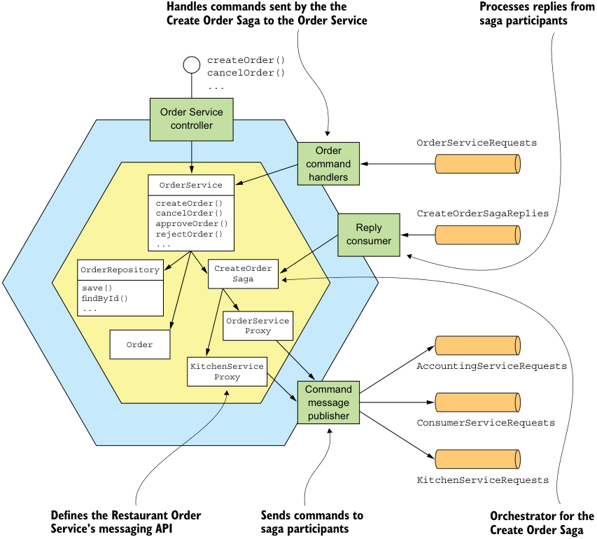

**----- Start of picture text -----**<br>
Handles commands sent by the the Processes replies from<br>Create Order Saga to the Order Service saga participants<br>createOrder()<br>cancelOrder()<br>...<br>Order Service<br>controller<br>OrderServiceRequests<br>Order<br>command<br>handlers<br>OrderService<br>createOrder()<br>cancelOrder() CreateOrderSagaReplies<br>approveOrder() Reply<br>rejectOrder()<br>... consumer<br>OrderRepository CreateOrder<br>Saga<br>save()<br>findById()<br>...<br>OrderService<br>Proxy<br>Order<br>KitchenService AccountingServiceRequests<br>Proxy<br>Command<br>message<br>publisher<br>ConsumerServiceRequests<br>KitchenServiceRequests<br>Defines the Restaurant Order Sends commands to Orchestrator for the<br>Service’s messaging API saga participants Create Order Saga<br>**----- End of picture text -----**<br>

Figure 4.9 The design of the **Order Service** and its sagas entity. There are also saga orchestrator classes, including the CreateOrderSaga class, which orchestrates Create Order Saga. Also, because Order Service participates in its own sagas, it has an OrderCommandHandlers adapter class that handles command messages by invoking OrderService. 

Some parts of Order Service should look familiar. As in a traditional application, the core of the business logic is implemented by the OrderService, Order, and OrderRepository classes. In this chapter, I’ll briefly describe these classes. I describe them in more detail in chapter 5. 

What’s less familiar about Order Service are the saga-related classes. This service is both a saga orchestrator and a saga participant. Order Service has several saga orchestrators, such as CreateOrderSaga. The saga orchestrators send command messages to a saga participant using a saga participant proxy class, such as KitchenServiceProxy and OrderServiceProxy. A saga participant proxy defines a saga participant’s messaging API. Order Service also has an OrderCommandHandlers class, which handles the command messages sent by sagas to Order Service. 

Let’s look in more detail at the design, starting with the OrderService class. 

### 4.4.1 The OrderService class

The OrderService class is a domain service called by the service’s API layer. It’s responsible for creating and managing orders. Figure 4.10 shows OrderService and some of its collaborators. OrderService creates and updates Orders, invokes the OrderRepository to persist Orders, and creates sagas, such as the CreateOrderSaga, using the SagaManager. The SagaManager class is one of the classes provided by the Eventuate Tram Saga framework, which is a framework for writing saga orchestrators and participants, and is discussed a little later in this section. 

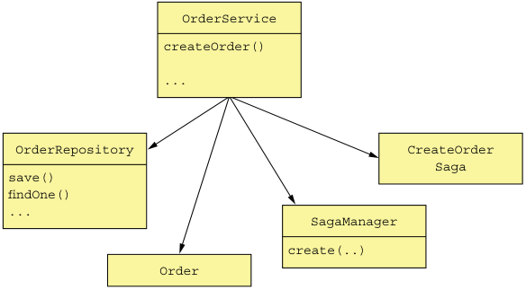

**----- Start of picture text -----**<br>
OrderService<br>createOrder()<br>...<br>OrderRepository CreateOrder<br>Saga<br>save()<br>findOne()<br>... SagaManager<br>create(..)<br>Order<br>**----- End of picture text -----**<br>

Figure 4.10 **OrderService** creates and updates **Orders** , invokes the **OrderRepository** to persist **Orders** , and creates sagas, including the **CreateOrderSaga** . 

I’ll discuss this class in more detail in chapter 5. For now, let’s focus on the createOrder() method. The following listing shows OrderService’s createOrder() method. This method first creates an Order and then creates an CreateOrderSaga to validate the order. 

Listing 4.1 The **OrderService** class and its **createOrder()** method 

```java
@Transactional 
public class OrderService { 
  @Autowired 
  private SagaManager<CreateOrderSagaState> createOrderSagaManager; 

  @Autowired 
  private OrderRepository orderRepository; 

  @Autowired 
  private DomainEventPublisher eventPublisher; 

  public Order createOrder(OrderDetails orderDetails) { 
    ... 
    ResultWithEvents<Order> orderAndEvents = Order.createOrder(...); 
    Order order = orderAndEvents.result; 
    orderRepository.save(order); 
    eventPublisher.publish(Order.class, Long.toString(order.getId()), orderAndEvents.events); 

    CreateOrderSagaState data = new CreateOrderSagaState(order.getId(), orderDetails); 
    createOrderSagaManager.create(data, Order.class, order.getId()); 

    return order; 
  } 
  ... 
}
```

The createOrder() method creates an Order by calling the factory method Order .createOrder(). It then persists the Order using the OrderRepository, which is a JPAbased repository. It creates the CreateOrderSaga by calling SagaManager.create(), passing a CreateOrderSagaState containing the ID of the newly saved Order and the OrderDetails. The SagaManager instantiates the saga orchestrator, which causes it to send a command message to the first saga participant, and persists the saga orchestrator in the database. 

Let’s look at the CreateOrderSaga and its associated classes. 

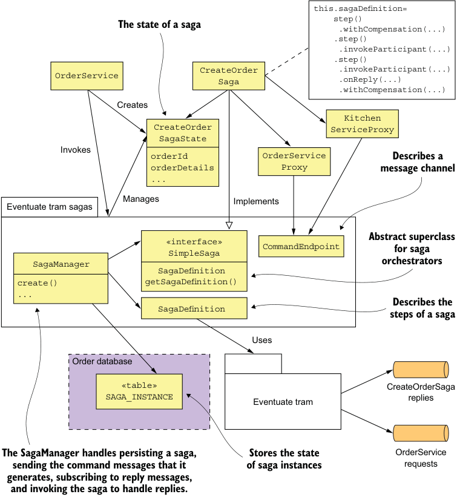

**----- Start of picture text -----**<br>
this.sagaDefinition=<br>step()<br>The state of a saga .withCompensation(...)<br>.step()<br>.invokeParticipant(...)<br>.step()<br>CreateOrder .invokeParticipant(...)<br>OrderService<br>Saga .onReply(...)<br>.withCompensation(...)<br>Creates<br>Kitchen<br>CreateOrder ServiceProxy<br>SagaState<br>Invokes<br>orderId OrderService Describes a<br>orderDetails Proxy message channel<br>...<br>Manages Implements<br>Eventuate tram sagas<br>«interface» Abstract superclass<br>SimpleSaga CommandEndpoint for saga<br>orchestrators<br>SagaManager<br>SagaDefinition<br>create() getSagaDefinition()<br>... Describes the<br>SagaDefinition<br>steps of a saga<br>Uses<br>Order database<br>«table» CreateOrderSaga<br>SAGA_INSTANCE Eventuate tram replies<br>The SagaManager handles persisting a saga, Stores the state OrderService<br>sending the command messages that it of saga instances requests<br>generates, subscribing to reply messages,<br>and invoking the saga to handle replies.<br>**----- End of picture text -----**<br>

Figure 4.11 The **OrderService** 's sagas, such as **Create Order Saga** , are implemented using the Eventuate Tram Saga framework. 

### 4.4.2 The implementation of the Create Order Saga

Figure 4.11 shows the classes that implement the Create Order Saga. The responsibilities of each class are as follows: 

- CreateOrderSaga—A singleton class that defines the saga’s state machine. It invokes the CreateOrderSagaState to create command messages and sends them to participants using message channels specified by the saga participant proxy classes, such as KitchenServiceProxy. 

- CreateOrderSagaState—A saga’s persistent state, which creates command messages. 

- _Saga participant proxy classes, such as_ KitchenServiceProxy—Each proxy class defines a saga participant’s messaging API, which consists of the command channel, the command message types, and the reply types. 

These classes are written using the Eventuate Tram Saga framework. 

The Eventuate Tram Saga framework provides a domain-specific language (DSL) for defining a saga’s state machine. It executes the saga’s state machine and exchanges messages with saga participants using the Eventuate Tram framework. The framework also persists the saga’s state in the database. 

Let’s take a closer look at the implementation of Create Order Saga, starting with the CreateOrderSaga class. 

**THE CREATEORDERSAGA ORCHESTRATOR**

The CreateOrderSaga class implements the state machine shown earlier in figure 4.7. This class implements SimpleSaga, a base interface for sagas. The heart of the CreateOrderSaga class is the saga definition shown in the following listing. It uses the DSL provided by the Eventuate Tram Saga framework to define the steps of the Create Order Saga. 

**Listing 4.2 The definition of the CreateOrderSaga**

```java
public class CreateOrderSaga implements SimpleSaga<CreateOrderSagaState> { 
  private SagaDefinition<CreateOrderSagaState> sagaDefinition; 

  public CreateOrderSaga(OrderServiceProxy orderService, 
                         ConsumerServiceProxy consumerService, 
                         KitchenServiceProxy kitchenService, 
                         AccountingServiceProxy accountingService) { 
    this.sagaDefinition = step() 
      .withCompensation(orderService.reject, CreateOrderSagaState::makeRejectOrderCommand) 
      .step() 
      .invokeParticipant(consumerService.validateOrder, CreateOrderSagaState::makeValidateOrderByConsumerCommand) 
      .step() 
      .invokeParticipant(kitchenService.create, CreateOrderSagaState::makeCreateTicketCommand) 
        .onReply(CreateTicketReply.class, CreateOrderSagaState::handleCreateTicketReply) 
        .withCompensation(kitchenService.cancel, CreateOrderSagaState::makeCancelCreateTicketCommand) 
      .step() 
      .invokeParticipant(accountingService.authorize, CreateOrderSagaState::makeAuthorizeCommand) 
      .step() 
      .invokeParticipant(kitchenService.confirmCreate, CreateOrderSagaState::makeConfirmCreateTicketCommand) 
      .step() 
      .invokeParticipant(orderService.approve, CreateOrderSagaState::makeApproveOrderCommand) 
      .build(); 
  } 

  @Override 
  public SagaDefinition<CreateOrderSagaState> getSagaDefinition() { 
    return sagaDefinition; 
  } 
}
```

The CreateOrderSaga’s constructor creates the saga definition and stores it in the sagaDefinition field. The getSagaDefinition() method returns the saga definition. 

To see how CreateOrderSaga works, let’s look at the definition of the third step of the saga, shown in the following listing. This step of the saga invokes the Kitchen Service to create a Ticket. Its compensating transaction cancels that Ticket. The step(), invokeParticipant(), onReply(), and withCompensation() methods are part of the DSL provided by Eventuate Tram Saga. 

Listing 4.3 The definition of the third step of the saga 

```java
// CreateOrderSaga(..., KitchenServiceProxy kitchenService, ...) { 
    .step() 
      .invokeParticipant(kitchenService.create, CreateOrderSagaState::makeCreateTicketCommand) 
      .onReply(CreateTicketReply.class, CreateOrderSagaState::handleCreateTicketReply) 
      .withCompensation(kitchenService.cancel, CreateOrderSagaState::makeCancelCreateTicketCommand) 
// ...
``` public CreateOrderSaga(..., KitchenServiceProxy kitchenService, ...) { 

The call to invokeParticipant() defines the forward transaction. It creates the CreateTicket command message by calling CreateOrderSagaState.makeCreateTicketCommand() and sends it to the channel specified by kitchenService.create. The call to onReply() specifies that CreateOrderSagaState.handleCreateTicketReply() should be called when a successful reply is received from Kitchen Service. This method stores the returned ticketId in the CreateOrderSagaState. The call to withCompensation() defines the compensating transaction. It creates a RejectTicketCommand command message by calling CreateOrderSagaState.makeCancelCreateTicket() and sends it to the channel specified by kitchenService.create. 

The other steps of the saga are defined in a similar fashion. The CreateOrderSagaState creates each message, which is sent by the saga to the messaging endpoint defined by a KitchenServiceProxy. Let’s take a look at each of those classes, starting with CreateOrderSagaState. 

**THE CREATEORDERSAGASTATE CLASS**

The CreateOrderSagaState class, shown in the following listing, represents the state of a saga instance. An instance of this class is created by OrderService and is persisted in the database by the Eventuate Tram Saga framework. Its primary responsibility is to create the messages that are sent to saga participants. 

Listing 4.4 **CreateOrderSagaState** stores the state of a saga instance 

```java
public class CreateOrderSagaState { 
  private Long orderId; 
  private OrderDetails orderDetails; 
  private long ticketId; 

  public Long getOrderId() { return orderId; } 

  // Invoked by the OrderService to instantiate a CreateOrderSagaState
  private CreateOrderSagaState() { } 

  public CreateOrderSagaState(Long orderId, OrderDetails orderDetails) { 
    this.orderId = orderId; 
    this.orderDetails = orderDetails; 
  } 

  // Creates a CreateTicket command message
  CreateTicket makeCreateTicketCommand() { 
    return new CreateTicket(getOrderDetails().getRestaurantId(), getOrderId(), makeTicketDetails(getOrderDetails())); 
  } 

  void handleCreateTicketReply(CreateTicketReply reply) { 
    // Saves the ID of the newly created Ticket
    logger.debug("getTicketId {}", reply.getTicketId()); 
    setTicketId(reply.getTicketId()); 
  } 

  CancelCreateTicket makeCancelCreateTicketCommand() { 
    // Creates CancelCreateTicket command message
    return new CancelCreateTicket(getOrderId()); 
  } 
  ... 
}
```
The CreateOrderSaga invokes the CreateOrderSagaState to create the command messages. It sends those command messages to the endpoints defined by the SagaParticipantProxy classes. Let’s take a look at one of those classes: KitchenServiceProxy. 

**THE KITCHENSERVICEPROXY CLASS**

The KitchenServiceProxy class, shown in listing 4.5, defines the command message endpoints for Kitchen Service. There are three endpoints: 

- create—Creates a Ticket 

- confirmCreate—Confirms the creation 

- cancel—Cancels a Ticket 

Each CommandEndpoint specifies the command type, the command message’s destination channel, and the expected reply types. 

Listing 4.5 **KitchenServiceProxy** defines the command message endpoints for **Kitchen Service** 

```java
public class KitchenServiceProxy { 
  public final CommandEndpoint<CreateTicket> create = CommandEndpointBuilder 
    .forCommand(CreateTicket.class) 
    .withChannel(KitchenServiceChannels.kitchenServiceChannel) 
    .withReply(CreateTicketReply.class) 
    .build(); 

  public final CommandEndpoint<ConfirmCreateTicket> confirmCreate = CommandEndpointBuilder 
    .forCommand(ConfirmCreateTicket.class) 
    .withChannel(KitchenServiceChannels.kitchenServiceChannel) 
    .withReply(Success.class) 
    .build(); 

  public final CommandEndpoint<CancelCreateTicket> cancel = CommandEndpointBuilder 
    .forCommand(CancelCreateTicket.class) 
    .withChannel(KitchenServiceChannels.kitchenServiceChannel) 
    .withReply(Success.class) 
    .build(); 
}
```

Proxy classes, such as KitchenServiceProxy, aren’t strictly necessary. A saga could simply send command messages directly to participants. But proxy classes have two important benefits. First, a proxy class defines static typed endpoints, which reduces the chance of a saga sending the wrong message to a service. Second, a proxy class is a well-defined API for invoking a service that makes the code easier to understand and test. For example, chapter 10 describes how to write tests for KitchenServiceProxy that verify that Order Service correctly invokes Kitchen Service. Without KitchenServiceProxy, it would be impossible to write such a narrowly scoped test. 

**THE EVENTUATE TRAM SAGA FRAMEWORK**

The Eventuate Tram Saga, shown in figure 4.12, is a framework for writing both saga orchestrators and saga participants. It uses transactional messaging capabilities of Eventuate Tram, discussed in chapter 3. 

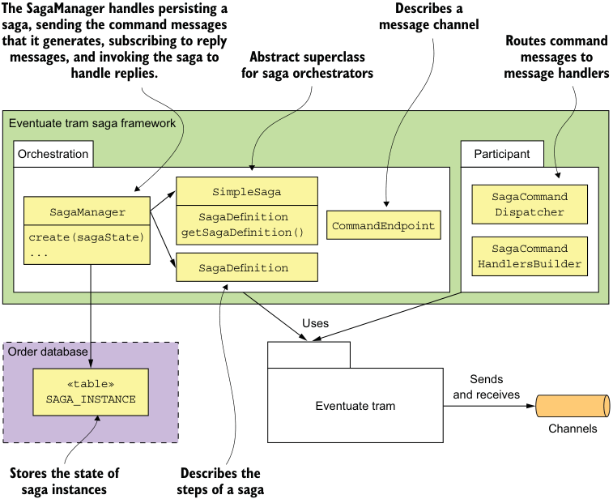

**----- Start of picture text -----**<br>
The SagaManager handles persisting a Describes a<br>saga, sending the command messages message channel<br>that it generates, subscribing to reply Routes command<br>messages, and invoking the saga to Abstract superclass messages to<br>handle replies. for saga orchestrators message handlers<br>Eventuate tram saga framework<br>Orchestration Participant<br>SimpleSaga SagaCommand<br>SagaManager SagaDefinition Dispatcher<br>CommandEndpoint<br>getSagaDefinition()<br>create(sagaState)<br>... SagaDefinition HandlersBuilderSagaCommand<br>Uses<br>Order database<br>«table» Sends<br>and receives<br>SAGA_INSTANCE Eventuate tram<br>Channels<br>Stores the state of Describes the<br>saga instances steps of a saga<br>**----- End of picture text -----**<br>

Figure 4.12 Eventuate Tram Saga is a framework for writing both saga orchestrators and saga participants. 

The saga orchestration package is the most complex part of the framework. It provides SimpleSaga, a base interface for sagas, and a SagaManager class, which creates and manages saga instances. The SagaManager handles persisting a saga, sending the command messages that it generates, subscribing to reply messages, and invoking the saga to handle replies. Figure 4.13 shows the sequence of events when OrderService creates a saga. The sequence of events is as follows: 

- 1 OrderService creates the CreateOrderSagaState. 

- 2 It creates an instance of a saga by invoking the SagaManager. 

- 3 The SagaManager executes the first step of the saga definition. 

- 4 The CreateOrderSagaState is invoked to generate a command message. 

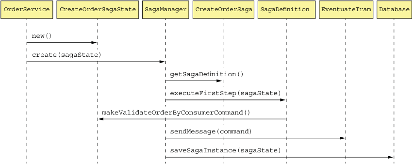

**----- Start of picture text -----**<br>
OrderService CreateOrderSagaState SagaManager CreateOrderSaga SagaDefinition EventuateTram Database<br>new()<br>create(sagaState)<br>getSagaDefinition()<br>executeFirstStep(sagaState)<br>makeValidateOrderByConsumerCommand()<br>sendMessage(command)<br>saveSagaInstance(sagaState)<br>**----- End of picture text -----**<br>

Figure 4.13 The sequence of events when **OrderService** creates an instance of **Create Order Saga** 

- 5 The SagaManager sends the command message to the saga participant (the Consumer Service). 

- 6 The SagaManager saves the saga instance in the database. 

Figure 4.14 shows the sequence of events when SagaManager receives a reply from Consumer Service. 

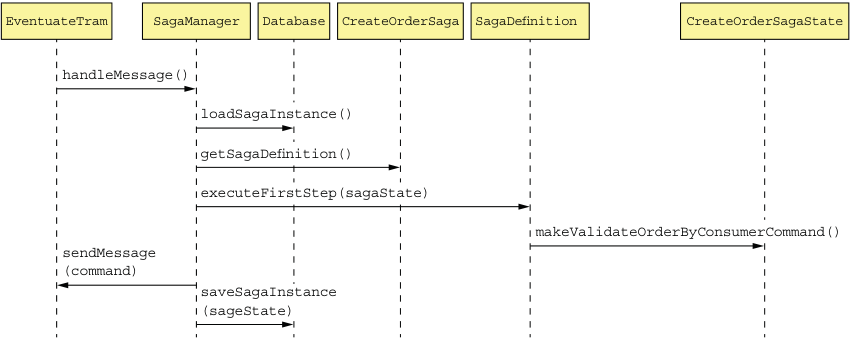

**----- Start of picture text -----**<br>
EventuateTram SagaManager Database CreateOrderSaga SagaDefinition CreateOrderSagaState<br>handleMessage()<br>loadSagaInstance()<br>getSagaDefinition()<br>executeFirstStep(sagaState)<br>makeValidateOrderByConsumerCommand()<br>sendMessage<br>(command)<br>saveSagaInstance<br>(sageState)<br>**----- End of picture text -----**<br>

Figure 4.14 The sequence of events when the **SagaManager** receives a reply message from a saga participant 

The sequence of events is as follows: 

- 1 Eventuate Tram invokes SagaManager with the reply from Consumer Service. 

- 2 SagaManager retrieves the saga instance from the database. 

- 3 SagaManager executes the next step of the saga definition. 

- 4 CreateOrderSagaState is invoked to generate a command message. 

- 5 SagaManager sends the command message to the specified saga participant (Kitchen Service). 

- 6 SagaManager saves the update saga instance in the database. 

If a saga participant fails, SagaManager executes the compensating transactions in reverse order. 

The other part of the Eventuate Tram Saga framework is the saga participant package. It provides the SagaCommandHandlersBuilder and SagaCommandDispatcher classes for writing saga participants. These classes route command messages to handler methods, which invoke the saga participants’ business logic and generate reply messages. Let’s take a look at how these classes are used by Order Service. 

### 4.4.3 The OrderCommandHandlers class

Order Service participates in its own sagas. For example, CreateOrderSaga invokes Order Service to either approve or reject an Order. The OrderCommandHandlers class, shown in figure 4.15, defines the handler methods for the command messages sent by these sagas. 

Each handler method invokes OrderService to update an Order and makes a reply message. The SagaCommandDispatcher class routes the command messages to the appropriate handler method and sends the reply. 

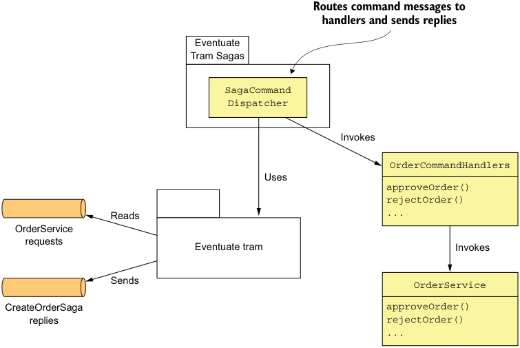

**----- Start of picture text -----**<br>
Routes command messages to<br>handlers and sends replies<br>Eventuate<br>Tram Sagas<br>SagaCommand<br>Dispatcher<br>Invokes<br>OrderCommandHandlers<br>Uses<br>approveOrder()<br>rejectOrder()<br>Reads ...<br>OrderService<br>requests Eventuate tram Invokes<br>Sends OrderService<br>CreateOrderSaga approveOrder()<br>replies rejectOrder()<br>...<br>**----- End of picture text -----**<br>

Figure 4.15 **OrderCommandHandlers** implements command handlers for the commands that are sent by the various **Order Service** sagas. 

The following listing shows the OrderCommandHandlers class. Its commandHandlers() method maps command message types to handler methods. Each handler method takes a command message as a parameter, invokes OrderService, and returns a reply message. 

Listing 4.6 The command handlers for **Order Service** 

```java
public class OrderCommandHandlers { 
  @Autowired 
  private OrderService orderService; 

  public CommandHandlers commandHandlers() { 
    return SagaCommandHandlersBuilder 
      .fromChannel("orderService") 
      .onMessage(ApproveOrderCommand.class, this::approveOrder) 
      .onMessage(RejectOrderCommand.class, this::rejectOrder) 
      ... 
      .build(); 
  } 

  public Message approveOrder(CommandMessage<ApproveOrderCommand> cm) { 
    long orderId = cm.getCommand().getOrderId(); 
    orderService.approveOrder(orderId); 
    return withSuccess(); 
  } 

  public Message rejectOrder(CommandMessage<RejectOrderCommand> cm) { 
    orderService.rejectOrder(orderId); 
  } 
}
```

The approveOrder() and rejectOrder() methods update the specified Order by invoking OrderService. The other services that participate in sagas have similar command handler classes that update their domain objects. 

### 4.4.4 The OrderServiceConfiguration class

The Order Service uses the Spring framework. The following listing is an excerpt of the OrderServiceConfiguration class, which is an @Configuration class that instantiates and wires together the Spring @Beans. 

Listing 4.7 The **OrderServiceConfiguration** is a Spring **@Configuration** class that defines the Spring **@Beans** for the **Order Service** . 

```java
@Configuration 
public class OrderServiceConfiguration { 
  @Bean 
  public OrderService orderService(RestaurantRepository restaurantRepository, 
                                   SagaManager<CreateOrderSagaState> createOrderSagaManager, ...) { 
    return new OrderService(restaurantRepository, ... createOrderSagaManager ...); 
  } 

  @Bean 
  public SagaManager<CreateOrderSagaState> createOrderSagaManager(CreateOrderSaga saga) { 
    return new SagaManagerImpl<>(saga); 
  } 

  @Bean 
  public CreateOrderSaga createOrderSaga(OrderServiceProxy orderService, 
                                         ConsumerServiceProxy consumerService, ...) { 
    return new CreateOrderSaga(orderService, consumerService, ...); 
  } 

  @Bean 
  public OrderCommandHandlers orderCommandHandlers() { 
    return new OrderCommandHandlers(); 
  } 

  @Bean 
  public SagaCommandDispatcher orderCommandHandlersDispatcher(OrderCommandHandlers orderCommandHandlers) { 
    return new SagaCommandDispatcher("orderService", orderCommandHandlers.commandHandlers()); 
  } 

  @Bean 
  public KitchenServiceProxy kitchenServiceProxy() { 
    return new KitchenServiceProxy(); 
  } 

  @Bean 
  public OrderServiceProxy orderServiceProxy() { 
    return new OrderServiceProxy(); 
  } 
  ... 
}
```

This class defines several Spring @Beans including orderService, createOrderSagaManager, createOrderSaga, orderCommandHandlers, and orderCommandHandlersDispatcher. It also defines Spring @Beans for the various proxy classes, including kitchenServiceProxy and orderServiceProxy. 

## Summary

CreateOrderSaga is only one of Order Service’s many sagas. Many of its other system operations also use sagas. For example, the cancelOrder() operation uses a Cancel Order Saga, and the reviseOrder() operation uses a Revise Order Saga. As a result, even though many services have an external API that uses a synchronous protocol, such as REST or gRPC, a large amount of interservice communication will use asynchronous messaging. 

As you can see, transaction management and some aspects of business logic design are quite different in a microservice architecture. Fortunately, saga orchestrators are usually quite simple state machines, and you can use a saga framework to simplify your code. Nevertheless, transaction management is certainly more complicated than in a monolithic architecture. But that’s usually a small price to pay for the tremendous benefits of microservices. 

## Summary

- Some system operations need to update data scattered across multiple services. Traditional, XA/2PC-based distributed transactions aren’t a good fit for modern applications. A better approach is to use the Saga pattern. A saga is sequence of local transactions that are coordinated using messaging. Each local transaction updates data in a single service. Because each local transaction commits its changes, if a saga must roll back due to the violation of a business rule, it must execute compensating transactions to explicitly undo changes. 

- You can use either choreography or orchestration to coordinate the steps of a saga. In a choreography-based saga, a local transaction publishes events that trigger other participants to execute local transactions. In an orchestration-based saga, a centralized saga orchestrator sends command messages to participants telling them to execute local transactions. You can simplify development and testing by modeling saga orchestrators as state machines. Simple sagas can use choreography, but orchestration is usually a better approach for complex sagas. 

- Designing saga-based business logic can be challenging because, unlike ACID transactions, sagas aren’t isolated from one another. You must often use countermeasures, which are design strategies that prevent concurrency anomalies caused by the ACD transaction model. An application may even need to use locking in order to simplify the business logic, even though that risks deadlocks. 

 

