# _Designing business logic in a microservice architecture_ 

# _This chapter covers_ 

- Applying the business logic organization patterns: Transaction script pattern and Domain model pattern 

- Designing business logic with the Domain-driven design (DDD) aggregate pattern 

- Applying the Domain event pattern in a microservice architecture 

The heart of an enterprise application is the business logic, which implements the business rules. Developing complex business logic is always challenging. The FTGO application’s business logic implements some quite complex business logic, especially for order management and delivery management. Mary had encouraged her team to apply object-oriented design principles, because in her experience this was the best way to implement complex business logic. Some of the business logic used the procedural Transcription script pattern. But the majority of the FTGO application’s business logic is implemented in an object-oriented domain model that’s mapped to the database using JPA. 

Developing complex business logic is even more challenging in a microservice architecture where the business logic is spread over multiple services. You need to 

_**Business logic organization patterns**_
address two key challenges. First, a typical domain model is a tangled web of interconnected classes. Although this isn’t a problem in a monolithic application, in a microservice architecture, where classes are scattered around different services, you need to eliminate object references that would otherwise span service boundaries. The second challenge is designing business logic that works within the transaction management constraints of a microservice architecture. Your business logic can use ACID transactions within services, but as described in chapter 4, it must use the Saga pattern to maintain data consistency across services. 

Fortunately, we can address these issues by using the Aggregate pattern from DDD. The Aggregate pattern structures a service’s business logic as a collection of aggregates. An _aggregate_ is a cluster of objects that can be treated as a unit. There are two reasons why aggregates are useful when developing business logic in a microservice architecture: 

- Aggregates avoid any possibility of object references spanning service boundaries, because an inter-aggregate reference is a primary key value rather than an object reference. 

- Because a transaction can only create or update a single aggregate, aggregates fit the constraints of the microservices transaction model. 

As a result, an ACID transaction is guaranteed to be within a single service. 

I begin this chapter by describing the different ways of organizing business logic: the Transcription script pattern and the Domain model pattern. Next I introduce the concept of a DDD aggregate and explain why it’s a good building block for a service’s business logic. After that, I describe the Domain event pattern events and explain why it’s useful for a service to publish events. I end this chapter with a couple of examples of business logic from Kitchen Service and Order Service. 

Let’s now look at business logic organization patterns. 

# _5.1 Business logic organization patterns_ 

Figure 5.1 shows the architecture of a typical service. As described in chapter 2, the business logic is the core of a hexagonal architecture. Surrounding the business logic are the inbound and outbound adapters. An _inbound adapter_ handles requests from clients and invokes the business logic. An _outbound adapter_ , which is invoked by the business logic, invokes other services and applications. 

This service consists of the business logic and the following adapters: 

- REST API adapter—An inbound adapter that implements a REST API which invokes the business logic 

- OrderCommandHandlers—An inbound adapter that consumes command messages from a message channel and invokes the business logic 

- Database Adapter—An outbound adapter that’s invoked by the business logic to access the database 

- Domain Event Publishing Adapter—An outbound adapter that publishes events to a message broker 

_**Designing business logic in a microservice architecture**_ 

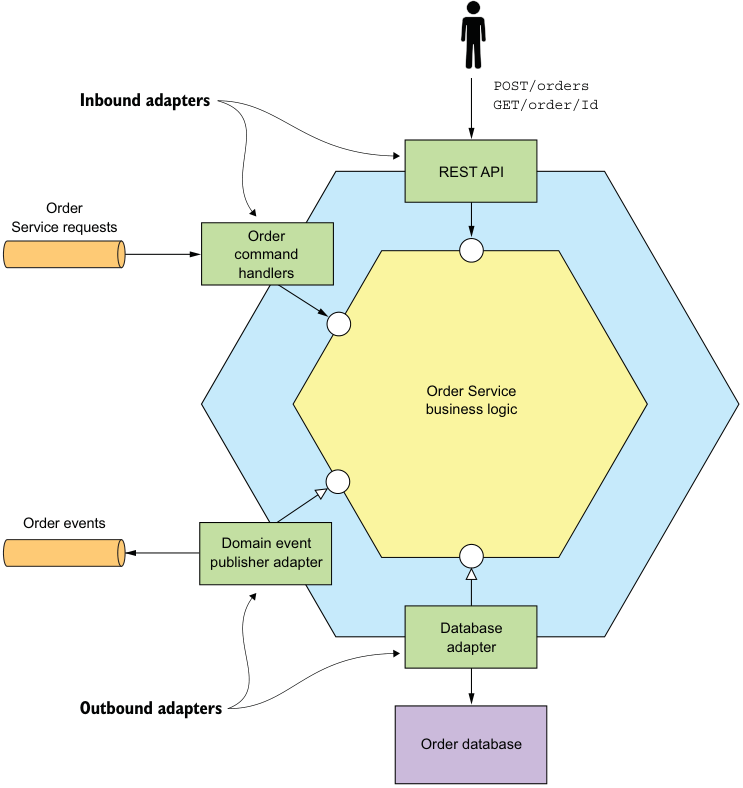

**----- Start of picture text -----** 
POST/orders Inbound adapters GET/order/Id REST API Order Service requests Order command handlers Order Service business logic Order events Domain event publisher adapter Database adapter Outbound adapters Order database **----- End of picture text -----** 

Figure 5.1 The **Order Service** has a hexagonal architecture. It consists of the business logic and one or more adapters that interface with external applications and other services. 

The business logic is typically the most complex part of the service. When developing business logic, you should consciously organize your business logic in the way that’s most appropriate for your application. After all, I’m sure you’ve experienced the frustration of having to maintain someone else’s badly structured code. Most enterprise applications are written in an object-oriented language such as Java, so they consist of classes and methods. But using an object-oriented language doesn’t guarantee that the business logic has an object-oriented design. The key decision you must make when developing business logic is whether to use an object-oriented approach or a procedural approach. There are two main patterns for organizing 

_**Business logic organization patterns**_ 

business logic: the procedural Transaction script pattern, and the object-oriented Domain model pattern. 

# _5.1.1 Designing business logic using the Transaction script pattern_ 

Although I’m a strong advocate of the object-oriented approach, there are some situations where it is overkill, such as when you are developing simple business logic. In such a situation, a better approach is to write procedural code and use what the book _Patterns of Enterprise Application Architecture_ by Martin Fowler (Addison-Wesley Professional, 2002) calls the Transaction script pattern. Rather than doing any object-oriented design, you write a method called a _transaction script_ to handle each request from the presentation tier. As figure 5.2 shows, an important characteristic of this approach is that the classes that implement behavior are separate from those that store state. 

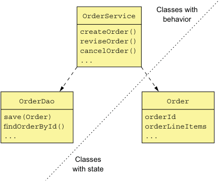

**----- Start of picture text -----** 
Classes with OrderService behavior createOrder() reviseOrder() cancelOrder() ... OrderDao Order save(Order) orderId findOrderById() orderLineItems ... ... Classes with state **----- End of picture text -----** 

Figure 5.2 Organizing business logic as transaction scripts. In a typical transaction script–based design, one set of classes implements behavior and another set stores state. The transaction scripts are organized into classes that typically have no state. The scripts use data classes, which typically have no behavior. 

When using the Transaction script pattern, the scripts are usually located in service classes, which in this example is the OrderService class. A service class has one method for each request/system operation. The method implements the business logic for that request. It accesses the database using data access objects (DAOs), such as the OrderDao. The data objects, which in this example is the Order class, are pure data with little or no behavior. 

# Pattern: Transaction script 

Organize the business logic as a collection of procedural transaction scripts, one for each type of request. 

This style of design is highly procedural and relies on few of the capabilities of objectoriented programming (OOP) languages. This what you would create if you were writing the application in C or another non-OOP language. Nevertheless, you shouldn’t be 

_**Designing business logic in a microservice architecture**_ 

ashamed to use a procedural design when it’s appropriate. This approach works well for simple business logic. The drawback is that this tends not to be a good way to implement complex business logic. 

# _5.1.2 Designing business logic using the Domain model pattern_ 

The simplicity of the procedural approach can be quite seductive. You can write code without having to carefully consider how to organize the classes. The problem is that if your business logic becomes complex, you can end up with code that’s a nightmare to maintain. In fact, in the same way that a monolithic application has a habit of continually growing, transaction scripts have the same problem. Consequently, unless you’re writing an extremely simple application, you should resist the temptation to write procedural code and instead apply the Domain model pattern and develop an object-oriented design. 

# Pattern: Domain model 

Organize the business logic as an object model consisting of classes that have state and behavior. 

In an object-oriented design, the business logic consists of an object model, a network of relatively small classes. These classes typically correspond directly to concepts from the problem domain. In such a design some classes have only either state or behavior, but many contain both, which is the hallmark of a well-designed class. Figure 5.3 shows an example of the Domain model pattern. 

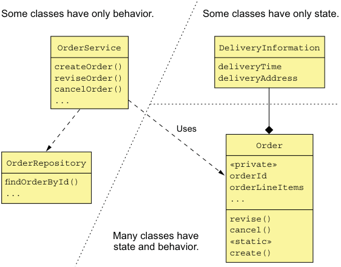

**----- Start of picture text -----** 
Some classes have only behavior. Some classes have only state. OrderService DeliveryInformation createOrder() deliveryTime reviseOrder() deliveryAddress cancelOrder() ... Uses Order OrderRepository «private» orderId findOrderById() orderLineItems ... ... revise() cancel() Many classes have «static» state and behavior. create() **----- End of picture text -----** 

Figure 5.3 Organizing business logic as a domain model. The majority of the business logic consists of classes that have state and behavior. 

_**Business logic organization patterns**_ 

As with the Transaction script pattern, an OrderService class has a method for each request/system operation. But when using the Domain model pattern, the service methods are usually simple. That’s because a service method almost always delegates to persistent domain objects, which contain the bulk of the business logic. A service method might, for example, load a domain object from the database and invoke one of its methods. In this example, the Order class has both state and behavior. Moreover, its state is private and can only be accessed indirectly via its methods. 

Using an object-oriented design has a number of benefits. First, the design is easy to understand and maintain. Instead of consisting of one big class that does everything, it consists of a number of small classes that each have a small number of responsibilities. In addition, classes such as Account, BankingTransaction, and OverdraftPolicy closely mirror the real world, which makes their role in the design easier to understand. Second, our object-oriented design is easier to test: each class can and should be tested independently. Finally, an object-oriented design is easier to extend because it can use well-known design patterns, such as the Strategy pattern and the Template method pattern, that define ways of extending a component without modifying the code. 

The Domain model pattern works well, but there are a number of problems with this approach, especially in a microservice architecture. To address those problems, you need to use a refinement of OOD known as DDD. 

# _5.1.3 About Domain-driven design_ 

DDD, which is described in the book _Domain-Driven Design_ by Eric Evans (AddisonWesley Professional, 2003), is a refinement of OOD and is an approach for developing complex business logic. I introduced DDD in chapter 2 when discussing the usefulness of DDD subdomains when decomposing an application into services. When using DDD, each service has its own domain model, which avoids the problems of a single, application-wide domain model. Subdomains and the associated concept of Bounded Context are two of the strategic DDD patterns. 

DDD also has some tactical patterns that are building blocks for domain models. Each pattern is a role that a class plays in a domain model and defines the characteristics of the class. The building blocks that have been widely adopted by developers include the following: 

- _Entity_ —An object that has a persistent identity. Two entities whose attributes have the same values are still different objects. In a Java EE application, classes that are persisted using JPA @Entity are usually DDD entities. 

- _Value object_ —An object that is a collection of values. Two value objects whose attributes have the same values can be used interchangeably. An example of a value object is a Money class, which consists of a currency and an amount. 

- _Factory_ —An object or method that implements object creation logic that’s too complex to be done directly by a constructor. It can also hide the concrete 

classes that are instantiated. A factory might be implemented as a static method of a class. 

- _Repository_ —An object that provides access to persistent entities and encapsulates the mechanism for accessing the database. 

- _Service_ —An object that implements business logic that doesn’t belong in an entity or a value object. 

These building blocks are used by many developers. Some are supported by frameworks such as JPA and the Spring framework. There is one more building block that has been generally ignored (myself included!) except by DDD purists: aggregates. As it turns out, aggregates are an extremely useful concept when developing microservices. Let’s first look at some subtle problems with classic OOD that are solved by using aggregates. 

# _5.2 Designing a domain model using the DDD aggregate pattern_ 

In traditional object-oriented design, a domain model is a collection of classes and relationships between classes. The classes are usually organized into packages. For example, figure 5.4 shows part of a domain model for the FTGO application. It’s a typical domain model consisting of a web of interconnected classes. 

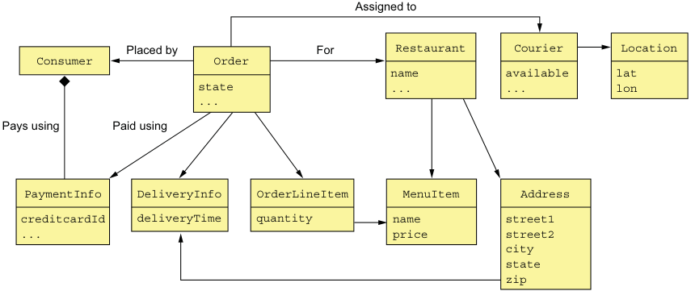

**----- Start of picture text -----** 
Assigned to Placed by For Restaurant Courier Location Consumer Order name available lat state ... ... lon ... Pays using Paid using PaymentInfo DeliveryInfo OrderLineItem MenuItem Address creditcardId deliveryTime quantity name street1 ... price street2 city state zip **----- End of picture text -----** 

Figure 5.4 A traditional domain model is a web of interconnected classes. It doesn’t explicitly specify the boundaries of business objects, such as **Consumer** and **Order** . 

This example has several classes corresponding to business objects: Consumer, Order, Restaurant, and Courier. But interestingly, the explicit boundaries of each business object are missing from this kind of traditional domain model. It doesn’t specify, for 

_**Designing a domain model using the DDD aggregate pattern**_ 

example, which classes are part of the Order business object. This lack of boundaries can sometimes cause problems, especially in microservice architecture. 

I begin this section with an example problem caused by the lack of explicit boundaries. Next I describe the concept of an aggregate and how it has explicit boundaries. After that, I describe the rules that aggregates must obey and how they make aggregates a good fit for the microservice architecture. I then describe how to carefully choose the boundaries of your aggregates and why it matters. Finally, I discuss how to design business logic using aggregates. Let’s first take a look at the problems caused by fuzzy boundaries. 

# _5.2.1 The problem with fuzzy boundaries_ 

Imagine, for example, that you want to perform an operation, such as a load or delete, on an Order business object. What exactly does that mean? What is the scope an operation? You would certainly load or delete the Order object. But in reality there’s more to an Order than simply the Order object. There are also the order line items, the payment information, and so on. Figure 5.4 leaves the boundaries of a domain object to the developer’s intuition. 

Besides a conceptual fuzziness, the lack of explicit boundaries causes problems when updating a business object. A typical business object has _invariants_ , business rules that must be enforced at all times. An Order has a minimum order amount, for example. The FTGO application must ensure that any attempt to update an order doesn’t violate an invariant such as the minimum order amount. The challenge is that in order to enforce invariants, you must design your business logic carefully. 

For example, let’s look at how to ensure the order minimum is met when multiple consumers work together to create an order. Two consumers—Sam and Mary—are working together on an order and simultaneously decide that the order exceeds their budget. Sam reduces the quantity of samosas, and Mary reduces the quantity of naan bread. From the application’s perspective, both consumers retrieve the order and its line items from the database. Both consumers then update a line item to reduce the cost of the order. From each consumer’s perspective the order minimum is preserved. Here’s the sequence of database transactions. 

|Consumer - Mary BEGIN TXN SELECT ORDER_TOTAL FROM ORDER WHERE ORDER ID = X SELECT * FROM ORDER_LINE_ITEM WHERE ORDER_ID = X ... END TXN Verify minimum is met|Consumer - Sam BEGIN TXN SELECT ORDER_TOTAL FROM ORDER WHERE ORDER ID = X SELECT * FROM ORDER_LINE_ITEM WHERE ORDER_ID = X ... END TXN|
|---|---|

_**Designing business logic in a microservice architecture**_ 

BEGIN TXN UPDATE ORDER_LINE_ITEM SET VERSION=..., QUANTITY=... WHERE VERSION = <loaded version> AND ID = ... END TXN 

Verify minimum is met BEGIN TXN UPDATE ORDER_LINE_ITEM SET VERSION=..., QUANTITY=... WHERE VERSION = <loaded version> AND ID = ... END TXN 

Each consumer changes a line item using a sequence of two transactions. The first transaction loads the order and its line items. The UI verifies that the order minimum is satisfied before executing the second transaction. The second transaction updates the line item quantity using an optimistic offline locking check that verifies that the order line is unchanged since it was loaded by the first transaction. 

In this scenario, Sam reduces the order total by $X and Mary reduces it by $Y. As a result, the Order is no longer valid, even though the application verified that the order still satisfied the order minimum after each consumer’s update. As you can see, directly updating part of a business object can result in the violation of the business rules. DDD aggregates are intended to solve this problem. 

# _5.2.2 Aggregates have explicit boundaries_ 

An _aggregate_ is a cluster of domain objects within a boundary that can be treated as a unit. It consists of a root entity and possibly one or more other entities and value objects. Many business objects are modeled as aggregates. For example, in chapter 2 we created a rough domain model by analyzing the nouns used in the requirements and by domain experts. Many of these nouns, such as Order, Consumer, and Restaurant, are aggregates. 

# Pattern: Aggregate 

Organize a domain model as a collection of aggregates, each of which is a graph of objects that can be treated as a unit. 

Figure 5.5 shows the Order aggregate and its boundary. An Order aggregate consists of an Order entity, one or more OrderLineItem value objects, and other value objects such as a delivery Address and PaymentInformation. 

_**Designing a domain model using the DDD aggregate pattern**_ 

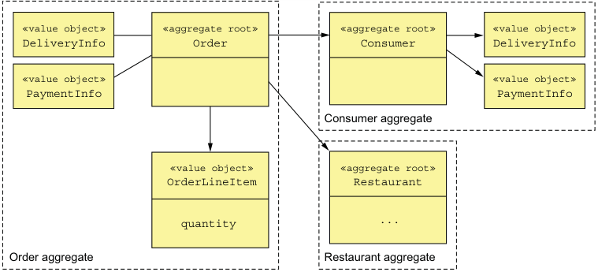

**----- Start of picture text -----** 
«value object» «aggregate root» «aggregate root» «value object» DeliveryInfo Order Consumer DeliveryInfo «value object» «value object» PaymentInfo PaymentInfo Consumer aggregate «value object» «aggregate root» OrderLineItem Restaurant quantity ... Order aggregate Restaurant aggregate **----- End of picture text -----** 

Figure 5.5 Structuring a domain model as a set of aggregates makes the boundaries explicit. 

Aggregates decompose a domain model into chunks, which are individually easier to understand. They also clarify the scope of operations such as load, update, and delete. These operations act on the entire aggregate rather than on parts of it. An aggregate is often loaded in its entirety from the database, thereby avoiding any complications of lazy loading. Deleting an aggregate removes all of its objects from a database. 

# AGGREGATES ARE CONSISTENCY BOUNDARIES 

Updating an entire aggregate rather than its parts solves the consistency issues, such as the example described earlier. Update operations are invoked on the aggregate root, which enforces invariants. Also, concurrency is handled by locking the aggregate root using, for example, a version number or a database-level lock. For example, instead of updating line items’ quantities directly, a client must invoke a method on the root of the Order aggregate, which enforces invariants such as the minimum order amount. Note, though, that this approach doesn’t require the entire aggregate to be updated in the database. An application might, for example, only update the rows corresponding to the Order object and the updated OrderLineItem. 

# IDENTIFYING AGGREGATES IS KEY 

In DDD, a key part of designing a domain model is identifying aggregates, their boundaries, and their roots. The details of the aggregates’ internal structure is secondary. The benefit of aggregates, however, goes far beyond modularizing a domain model. That’s because aggregates must obey certain rules. 

# _5.2.3 Aggregate rules_ 

DDD requires aggregates to obey a set of rules. These rules ensure that an aggregate is a self-contained unit that can enforce its invariants. Let’s look at each of the rules. 

# RULE #1: REFERENCE ONLY THE AGGREGATE ROOT 

The previous example illustrated the perils of updating OrderLineItems directly. The goal of the first aggregate rule is to eliminate this problem. It requires that the root entity be the only part of an aggregate that can be referenced by classes outside of the aggregate. A client can only update an aggregate by invoking a method on the aggregate root. 

A service, for example, uses a repository to load an aggregate from the database and obtain a reference to the aggregate root. It updates an aggregate by invoking a method on the aggregate root. This rule ensures that the aggregate can enforce its invariant. 

# RULE #2: INTER-AGGREGATE REFERENCES MUST USE PRIMARY KEYS 

Another rule is that aggregates reference each other by identity (for example, primary key) instead of object references. For example, as figure 5.6 shows, an Order references its Consumer using a consumerId rather than a reference to the Consumer object. Similarly, an Order references a Restaurant using a restaurantId. 

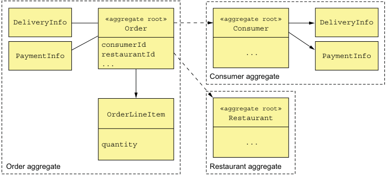

**----- Start of picture text -----** 
DeliveryInfo «aggregate root» «aggregate root» DeliveryInfo Order Consumer consumerId PaymentInfo restaurantId ... PaymentInfo ... Consumer aggregate «aggregate root» OrderLineItem Restaurant quantity ... Order aggregate Restaurant aggregate **----- End of picture text -----** 

Figure 5.6 References between aggregates are by primary key rather than by object reference. The **Order** aggregate has the IDs of the **Consumer** and **Restaurant** aggregates. Within an aggregate, objects have references to one another. 

This approach is quite different from traditional object modeling, which considers foreign keys in the domain model to be a design smell. It has a number of benefits. The use of identity rather than object references means that the aggregates are loosely coupled. It ensures that the aggregate boundaries between aggregates are well defined and avoids accidentally updating a different aggregate. Also, if an aggregate is part of another service, there isn’t a problem of object references that span services. 

This approach also simplifies persistence since the aggregate is the unit of storage. It makes it easier to store aggregates in a NoSQL database such as MongoDB. It also 

_**Designing a domain model using the DDD aggregate pattern**_
eliminates the need for transparent lazy loading and its associated problems. Scaling the database by sharding aggregates is relatively straightforward. 

# RULE #3: ONE TRANSACTION CREATES OR UPDATES ONE AGGREGATE 

Another rule that aggregates must obey is that a transaction can only create or update a single aggregate. When I first read about it many years ago, this rule made no sense! At the time, I was developing traditional monolithic applications that used an RDBMS, so transactions could update multiple aggregates. Today, this constraint is perfect for the microservice architecture. It ensures that a transaction is contained within a service. This constraint also matches the limited transaction model of most NoSQL databases. 

This rule makes it more complicated to implement operations that need to create or update multiple aggregates. But this is exactly the problem that sagas (described in chapter 4) are designed to solve. Each step of the saga creates or updates exactly one aggregate. Figure 5.7 shows how this works. 

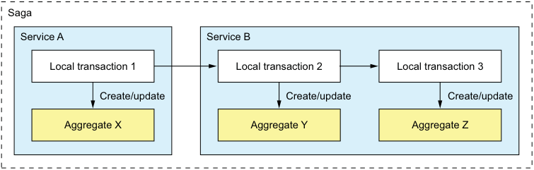

**----- Start of picture text -----** 
Saga Service A Service B Local transaction 1 Local transaction 2 Local transaction 3 Create/update Create/update Create/update Aggregate X Aggregate Y Aggregate Z **----- End of picture text -----** 

Figure 5.7 A transaction can only create or update a single aggregate, so an application uses a saga to update multiple aggregates. Each step of the saga creates or updates one aggregate. 

In this example, the saga consists of three transactions. The first transaction updates aggregate X in service A. The other two transactions are both in service B. One transaction updates aggregate X, and the other updates aggregate Y. 

An alternative approach to maintaining consistency across multiple aggregates within a single service is to cheat and update multiple aggregates within a transaction. For example, service B could update aggregates Y and Z in a single transaction. This is only possible when using a database, such as an RDBMS, that supports a rich transaction model. If you’re using a NoSQL database that only has simple transactions, there’s no other option except to use sagas. 

Or is there? It turns out that aggregate boundaries are not set in stone. When developing a domain model, you get to choose where the boundaries lie. But like a 20th century colonial power drawing national boundaries, you need to be careful. 

# _5.2.4 Aggregate granularity_ 

When developing a domain model, a key decision you must make is how large to make each aggregate. On one hand, aggregates should ideally be small. Because updates to each aggregate are serialized, more fine-grained aggregates will increase the number of simultaneous requests that the application can handle, improving scalability. It will also improve the user experience because it reduces the chance of two users attempting conflicting updates of the same aggregate. On the other hand, because an aggregate is the scope of transaction, you may need to define a larger aggregate in order to make a particular update atomic. 

For example, earlier I mentioned how in the FTGO application’s domain model Order and Consumer are separate aggregates. An alternative design is to make Order part of the Consumer aggregate. Figure 5.8 shows this alternative design. 

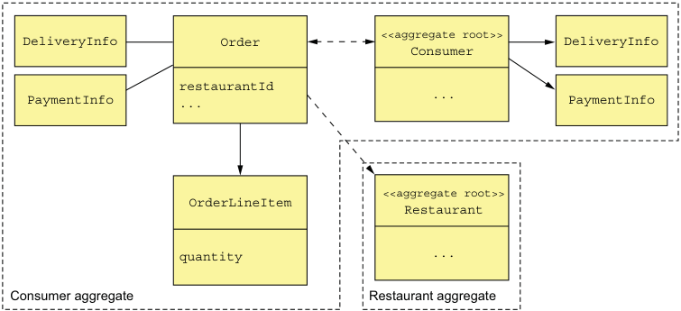

**----- Start of picture text -----** 
<<aggregate root>> DeliveryInfo Order DeliveryInfo Consumer restaurantId PaymentInfo ... ... PaymentInfo <<aggregate root>> OrderLineItem Restaurant quantity ... Consumer aggregate Restaurant aggregate **----- End of picture text -----** 

Figure 5.8 An alternative design defines a **Customer** aggregate that contains the **Customer** and **Order** classes. This design enables an application to atomically update a **Consumer** and one or more of its **Orders** . 

A benefit of this larger Consumer aggregate is that the application can atomically update a Consumer and one or more of its Orders. A drawback of this approach is that it reduces scalability. Transactions that update different orders for the same customer would be serialized. Similarly, two users would conflict if they attempted to edit different orders for the same customer. 

Another drawback of this approach in a microservice architecture is that it is an obstacle to decomposition. The business logic for Orders and Consumers, for example, must be collocated in the same service, which makes the service larger. Because of these issues, making aggregates as fine-grained as possible is best. 

_**Designing a domain model using the DDD aggregate pattern**_ 

# _5.2.5 Designing business logic with aggregates_ 

In a typical (micro)service, the bulk of the business logic consists of aggregates. The rest of the business logic resides in the domain services and the sagas. The sagas orchestrate sequences of local transactions in order to enforce data consistency. The services are the entry points into the business logic and are invoked by inbound adapters. A service uses a repository to retrieve aggregates from the database or save aggregates to the database. Each repository is implemented by an outbound adapter that accesses the database. Figure 5.9 shows the aggregate-based design of the business logic for the Order Service. 

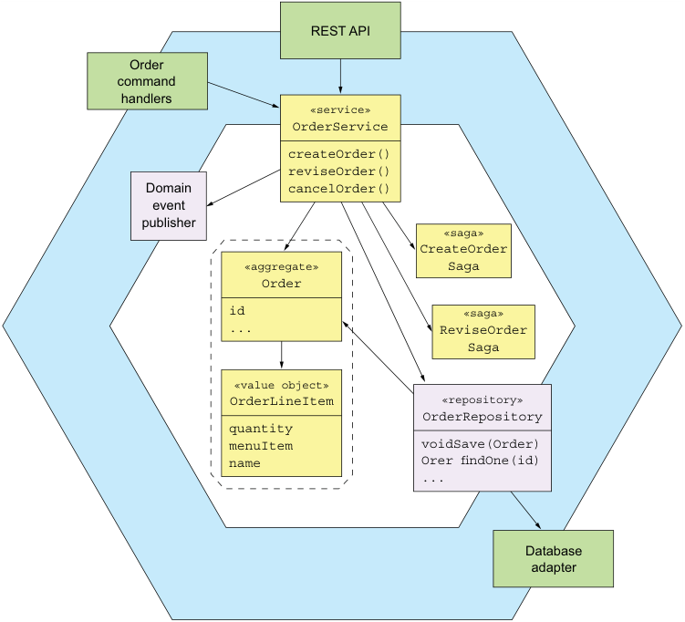

**----- Start of picture text -----** 
REST API Order command handlers «service» OrderService createOrder() reviseOrder() Domain cancelOrder() event publisher «saga» CreateOrder «aggregate» Saga Order id «saga» ... ReviseOrder Saga «value object» OrderLineItem «repository» OrderRepository quantity menuItem voidSave(Order) name Orer findOne(id) ... Database adapter **----- End of picture text -----** 

Figure 5.9 An aggregate-based design for the **Order Service** business logic 

The business logic consists of the Order aggregate, the OrderService service class, the OrderRepository, and one or more sagas. The OrderService invokes the OrderRepository to save and load Orders. For simple requests that are local to the service, 

the service updates an Order aggregate. If an update request spans multiple services, the OrderService will also create a saga, as described in chapter 4. 

We’ll take a look at the code—but first, let’s examine a concept that’s closely related to aggregates: domain events. 

# _5.3_ 

# _Publishing domain events_ 

Merriam-Webster (https://www.merriam-webster.com/dictionary/event) lists several definitions of the word _event_ , including these: 

- 1 Something that happens 

- 2 A noteworthy happening 

- 3 A social occasion or activity 

- 4 An adverse or damaging medical occurrence, a heart attack or other cardiac event 

In the context of DDD, a domain event is something that has happened to an aggregate. It’s represented by a class in the domain model. An event usually represents a state change. Consider, for example, an Order aggregate in the FTGO application. Its state-changing events include Order Created, Order Cancelled, Order Shipped, and so forth. An Order aggregate might, if there are interested consumers, publish one of the events each time it undergoes a state transition. 

# Pattern: Domain event 

An aggregate publishes a domain event when it’s created or undergoes some other significant change. 

# _5.3.1 Why publish change events?_ 

Domain events are useful because other parties—users, other applications, or other components within the same application—are often interested in knowing about an aggregate’s state changes. Here are some example scenarios: 

- Maintaining data consistency across services using choreography-based sagas, described in chapter 4. 

- Notifying a service that maintains a replica that the source data has changed. This approach is known as Command Query Responsibility Segregation (CQRS), and it’s described in chapter 7. 

- Notifying a different application via a registered webhook or via a message broker in order to trigger the next step in a business process. 

- Notifying a different component of the same application in order, for example, to send a WebSocket message to a user’s browser or update a text database such as ElasticSearch. 

- Sending notifications—text messages or emails—to users informing them that their order has shipped, their Rx prescription is ready for pick up, or their flight is delayed. 

_**Publishing domain events**_ 

- Monitoring domain events to verify that the application is behaving correctly. 

- Analyzing events to model user behavior. 

The trigger for the notification in all these scenarios is the state change of an aggregate in an application’s database. 

# _5.3.2 What is a domain event?_ 

A _domain event_ is a class with a name formed using a past-participle verb. It has properties that meaningfully convey the event. Each property is either a primitive value or a value object. For example, an OrderCreated event class has an orderId property. 

A domain event typically also has metadata, such as the event ID, and a timestamp. It might also have the identity of the user who made the change, because that’s useful for auditing. The metadata can be part of the event object, perhaps defined in a superclass. Alternatively, the event metadata can be in an envelope object that wraps the event object. The ID of the aggregate that emitted the event might also be part of the envelope rather than an explicit event property. 

The OrderCreated event is an example of a domain event. It doesn’t have any fields, because the Order’s ID is part of the event envelope. The following listing shows the OrderCreated event class and the DomainEventEnvelope class. 

Listing 5.1 The **OrderCreated** event and the **DomainEventEnvelope** class interface DomainEvent {} interface OrderDomainEvent extends DomainEvent {} class OrderCreated implements OrderDomainEvent {} class DomainEventEnvelope<T extends DomainEvent> { private String aggregateType; private Object aggregateId; **The event’s** private T event; **metadata** ... } 

The DomainEvent interface is a marker interface that identifies a class as a domain event. OrderDomainEvent is a marker interface for events, such as OrderCreated, which are published by the Order aggregate. The DomainEventEnvelope is a class that contains event metadata and the event object. It’s a generic class that’s parameterized by the domain event type. 

# _5.3.3 Event enrichment_ 

Let’s imagine, for example, that you’re writing an event consumer that processes Order events. The OrderCreated event class shown previously captures the essence of what has happened. But your event consumer may need the order details when processing an 

OrderCreated event. One option is for it to retrieve that information from the OrderService. The drawback of an event consumer querying the service for the aggregate is that it incurs the overhead of a service request. 

An alternative approach known as _event enrichment_ is for events to contain information that consumers need. It simplifies event consumers because they no longer need to request that data from the service that published the event. In the OrderCreated event, the Order aggregate can enrich the event by including the order details. The following listing shows the enriched event. 

# Listing 5.2 The enriched **OrderCreated** event 

class OrderCreated implements OrderEvent { private List<OrderLineItem> lineItems; private DeliveryInformation deliveryInformation; private PaymentInformation paymentInformation; private long restaurantId; private String restaurantName; ... 

**Data that its consumers typically need** 

} 

Because this version of the OrderCreated event contains the order details, an event consumer, such as the Order History Service (discussed in chapter 7) no longer needs to fetch that data when processing an OrderCreated event. 

Although event enrichment simplifies consumers, the drawback is that it risks making the event classes less stable. An event class potentially needs to change whenever the requirements of its consumers change. This can reduce maintainability because this kind of change can impact multiple parts of the application. Satisfying every consumer can also be a futile effort. Fortunately, in many situations it’s fairly obvious which properties to include in an event. 

Now that we’ve covered the basics of domain events, let’s look at how to discover them. 

# _5.3.4 Identifying domain events_ 

There are a few different strategies for identifying domain events. Often the requirements will describe scenarios where notifications are required. The requirements might include language such as “When X happens do Y.” For example, one requirement in the FTGO application is “When an Order is placed send the consumer an email.” A requirement for a notification suggests the existence of a domain event. 

Another approach, which is increasing in popularity, is to use event storming. _Event storming_ is an event-centric workshop format for understanding a complex domain. It involves gathering domain experts in a room, lots of sticky notes, and a very large surface—a whiteboard or paper roll—to stick the notes on. The result of event storming is an event-centric domain model consisting of aggregates and events. 

_**Publishing domain events**_ 

Event storming consist of three main steps: 

- 1 _Brainstorm events_ —Ask the domain experts to brainstorm the domain events. Domain events are represented by orange sticky notes that are laid out in a rough timeline on the modeling surface. 

- 2 _Identify event triggers_ —Ask the domain experts to identify the trigger of each event, which is one of the following: 

   - User actions, represented as a command using a blue sticky note 

   - External system, represented by a purple sticky note 

   - Another domain event 

   - Passing of time 

- 3 _Identify aggregates_ —Ask the domain experts to identify the aggregate that consumes each command and emits the corresponding event. Aggregates are represented by yellow sticky notes. 

Figure 5.10 shows the result of an event-storming workshop. In just a couple of hours, the participants identified numerous domain events, commands, and aggregates. It was a good first step in the process of creating a domain model. 

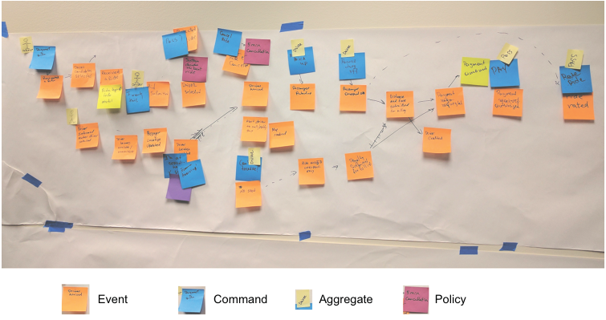

**----- Start of picture text -----** 
Event Command Aggregate Policy **----- End of picture text -----** 

Figure 5.10 The result of an event-storming workshop that lasted a couple of hours. The sticky notes are events, which are laid out along a timeline; commands, which represent user actions; and aggregates, which emit events in response to a command. 

Event storming is a useful technique for quickly creating a domain model. 

Now that we’ve covered the basics of domain events, let’s look at the mechanics of generating and publishing them. 

# _5.3.5 Generating and publishing domain events_ 

Communicating using domain events is a form of asynchronous messaging, discussed in chapter 3. But before the business logic can publish them to a message broker, it must first create them. Let’s look at how to do that. 

# GENERATING DOMAIN EVENTS 

Conceptually, domain events are published by aggregates. An aggregate knows when its state changes and hence what event to publish. An aggregate could invoke a messaging API directly. The drawback of this approach is that because aggregates can’t use dependency injection, the messaging API would need to be passed around as a method argument. That would intertwine infrastructure concerns and business logic, which is extremely undesirable. 

A better approach is to split responsibility between the aggregate and the service (or equivalent class) that invokes it. Services can use dependency injection to obtain a reference to the messaging API, easily publishing events. The aggregate generates the events whenever its state changes and returns them to the service. There are a couple of different ways an aggregate can return events back to the service. One option is for the return value of an aggregate method to include a list of events. For example, the following listing shows how a Ticket aggregate’s accept() method can return a TicketAcceptedEvent to its caller. 

Listing 5.3 The **Ticket** aggregate’s **accept()** method 

|public class Ticket {||||||
|---|---|---|---|---|---|
|public List<DomainEvent> accept(ZonedDateTime readyBy) {||||||
|...||||||
|this.acceptTime = ZonedDateTime.now(); this.readyBy = readyBy;||**Updates** **the Ticket**||||
|return singletonList(new TicketAcceptedEvent(readyBy));  }|||||**Returns** **an event**|
|}||||||

The service invokes the aggregate root’s method, and then publishes the events. For example, the following listing shows how KitchenService invokes Ticket.accept() and publishes the events. 

Listing 5.4 **KitchenService** calls **Ticket.accept()**
public class KitchenService { @Autowired private TicketRepository ticketRepository; @Autowired private DomainEventPublisher domainEventPublisher; 

_**Publishing domain events**_ 

public void accept(long ticketId, ZonedDateTime readyBy) { Ticket ticket = ticketRepository.findById(ticketId) .orElseThrow(() -> new TicketNotFoundException(ticketId)); **Publishes** List<DomainEvent> events = ticket.accept(readyBy); **domain events** domainEventPublisher.publish(Ticket.class, orderId, events); } 

The accept() method first invokes the TicketRepository to load the Ticket from the database. It then updates the Ticket by calling accept(). KitchenService then publishes events returned by Ticket by calling DomainEventPublisher.publish(), described shortly. 

This approach is quite simple. Methods that would otherwise have a void return type now return List<Event>. The only potential drawback is that the return type of non-void methods is now more complex. They must return an object containing the original return value and List<Event>. You’ll see an example of such a method soon. 

Another option is for the aggregate root to accumulate events in a field. The service then retrieves the events and publishes them. For example, the following listing shows a variant of the Ticket class that works this way. 

Listing 5.5 The **Ticket** extends a superclass, which records domain events public class Ticket extends AbstractAggregateRoot { public void accept(ZonedDateTime readyBy) { ... this.acceptTime = ZonedDateTime.now(); this.readyBy = readyBy; registerDomainEvent(new TicketAcceptedEvent(readyBy)); } 

} 

Ticket extends AbstractAggregateRoot, which defines a registerDomainEvent() method that records the event. A service would call AbstractAggregateRoot.getDomainEvents() to retrieve those events. 

My preference is for the first option: the method returning events to the service. But accumulating events in the aggregate root is also a viable option. In fact, the Spring Data Ingalls release train (https://spring.io/blog/2017/01/30/what-s-new-inspring-data-release-ingalls) implements a mechanism that automatically publishes events to the Spring ApplicationContext. The main drawback is that to reduce code duplication, aggregate roots should extend a superclass such as AbstractAggregateRoot, which might conflict with a requirement to extend some other superclass. Another issue is that although it’s easy for the aggregate root’s methods to call registerDomainEvent(), methods in other classes in the aggregate would find it challenging. They would mostly likely need to somehow pass the events to the aggregate root. 

# HOW TO RELIABLY PUBLISH DOMAIN EVENTS? 

Chapter 3 talks about how to reliably send messages as part of a local database transaction. Domain events are no different. A service must use transactional messaging to publish events to ensure that they’re published as part of the transaction that updates the aggregate in the database. The Eventuate Tram framework, described in chapter 3, implements such a mechanism. It insert events into an OUTBOX table as part of the ACID transaction that updates the database. After the transaction commits, the events that were inserted into the OUTBOX table are then published to the message broker. 

The Tram framework provides a DomainEventPublisher interface, shown in the following listing. It defines several overloaded publish() methods that take the aggregate type and ID as parameters, along with a list of domain events. 

# Listing 5.6 The Eventuate Tram framework’s **DomainEventPublisher** interface 

public interface DomainEventPublisher { void publish(String aggregateType, Object aggregateId, List<DomainEvent> domainEvents); 

It uses the Eventuate Tram framework’s MessageProducer interface to publish those events transactionally. 

A service could call the DomainEventPublisher publisher directly. But one drawback of doing so is that it doesn’t ensure that a service only publishes valid events. KitchenService, for example, should only publish events that implement TicketDomainEvent, which is the marker interface for the Ticket aggregate’s events. A better option is for services to implement a subclass of AbstractAggregateDomainEventPublisher, which is shown in listing 5.7. AbstractAggregateDomainEventPublisher is an abstract class that provides a type-safe interface for publishing domain events. It’s a generic class that has two type parameters, A, the aggregate type, and E, the marker interface type for the domain events. A service publishes events by calling the publish() method, which has two parameters: an aggregate of type A and a list of events of type E. 

Listing 5.7 The abstract superclass of type-safe domain event publishers public abstract class AbstractAggregateDomainEventPublisher<A, E extends Doma inEvent> { private Function<A, Object> idSupplier; private DomainEventPublisher eventPublisher; private Class<A> aggregateType; protected AbstractAggregateDomainEventPublisher( DomainEventPublisher eventPublisher, Class<A> aggregateType, Function<A, Object> idSupplier) { this.eventPublisher = eventPublisher; this.aggregateType = aggregateType; 

_**Publishing domain events**_
this.idSupplier = idSupplier; 

} public void publish(A aggregate, List<E> events) { eventPublisher.publish(aggregateType, idSupplier.apply(aggregate), (List<DomainEvent>) events); 

} 

} 

The publish() method retrieves the aggregate’s ID and invokes DomainEventPublisher .publish(). The following listing shows the TicketDomainEventPublisher, which publishes domain events for the Ticket aggregate. 

Listing 5.8 A type-safe interface for publishing **Ticket** aggregates' domain events 

- public class TicketDomainEventPublisher extends AbstractAggregateDomainEventPublisher<Ticket, TicketDomainEvent> { 

public TicketDomainEventPublisher(DomainEventPublisher eventPublisher) { super(eventPublisher, Ticket.class, Ticket::getId); } 

} 

This class only publishes events that are a subclass of TicketDomainEvent. 

Now that we’ve looked at how to publish domain events, let’s see how to consume them. 

# _5.3.6 Consuming domain events_ 

Domain events are ultimately published as messages to a message broker, such as Apache Kafka. A consumer could use the broker’s client API directly. But it’s more convenient to use a higher-level API such as the Eventuate Tram framework’s DomainEventDispatcher, described in chapter 3. A DomainEventDispatcher dispatches domain events to the appropriate handle method. Listing 5.9 shows an example event handler class. KitchenServiceEventConsumer subscribes to events published by Restaurant Service whenever a restaurant’s menu is updated. It’s responsible for keeping Kitchen Service’s replica of the data up-to-date. 

# Listing 5.9 Dispatching events to event handler methods 

public class KitchenServiceEventConsumer { @Autowired private RestaurantService restaurantService; **Maps events to event handlers** public DomainEventHandlers domainEventHandlers() { return DomainEventHandlersBuilder 

.forAggregateType("net.chrisrichardson.ftgo.restaurantservice.Restaurant") .onEvent(RestaurantMenuRevised.class, this::reviseMenu) 

.build(); 

} public void reviseMenu(DomainEventEnvelope<RestaurantMenuRevised> de) { long id = Long.parseLong(de.getAggregateId()); RestaurantMenu revisedMenu = de.getEvent().getRevisedMenu(); restaurantService.reviseMenu(id, revisedMenu); 

} 

} 

**An event handler for the RestaurantMenuRevised event** 

The reviseMenu() method handles RestaurantMenuRevised events. It calls restaurantService.reviseMenu(), which updates the restaurant’s menu. That method returns a list of domain events, which are published by the event handler. 

Now that we’ve looked at aggregates and domain events, it’s time to consider some example business logic that’s implemented using aggregates. 

# _5.4 Kitchen Service business logic_ 

The first example is Kitchen Service, which enables a restaurant to manage their orders. The two main aggregates in this service are the Restaurant and Ticket aggregates. The Restaurant aggregate knows the restaurant’s menu and opening hours and can validate orders. A Ticket represents an order that a restaurant must prepare for pickup by a courier. Figure 5.11 shows these aggregates and other key parts of the service’s business logic, as well as the service’s adapters. 

In addition to the aggregates, the other main parts of Kitchen Service’s business logic are KitchenService, TicketRepository, and RestaurantRepository. KitchenService is the business logic’s entry. It defines methods for creating and updating the Restaurant and Ticket aggregates. TicketRepository and RestaurantRepository define methods for persisting Tickets and Restaurants respectively. 

The Kitchen Service service has three inbound adapters: 

- REST API—The REST API invoked by the user interface used by workers at the restaurant. It invokes KitchenService to create and update Tickets. 

- KitchenServiceCommandHandler—The asynchronous request/response-based API that’s invoked by sagas. It invokes KitchenService to create and update Tickets. 

- KitchenServiceEventConsumer—Subscribes to events published by Restaurant Service. It invokes KitchenService to create and update Restaurants. 

The service also has two outbound adapters: 

- DB adapter—Implements the TicketRepository and the RestaurantRepository interfaces and accesses the database. 

- DomainEventPublishingAdapter—Implements the DomainEventPublisher interface and publishes Ticket domain events. 

_**Kitchen Service business logic**_ 

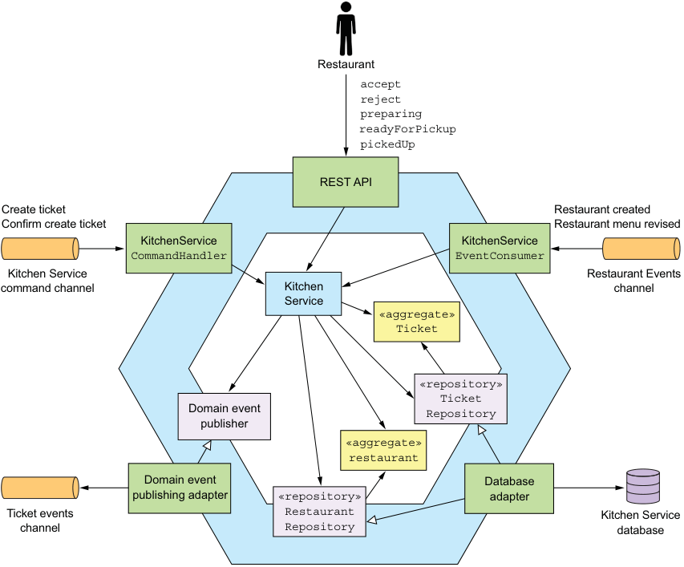

**----- Start of picture text -----** 
Restaurant accept reject preparing readyForPickup pickedUp REST API Create ticket Restaurant created Confirm create ticket Restaurant menu revised KitchenService KitchenService CommandHandler EventConsumer Kitchen Service Restaurant Events command channel Kitchen channel Service «aggregate» Ticket «repository» Ticket Domain event Repository publisher «aggregate» restaurant Domain event Database publishing adapter «repository» adapter Ticket events Restaurant Kitchen Service channel Repository database **----- End of picture text -----** 

Figure 5.11 The design of **Kitchen Service** 

Let’s take a closer look at the design of KitchenService, starting with the Ticket aggregate. 

# _5.4.1 The Ticket aggregate_ 

Ticket is one of the aggregates of Kitchen Service. As described in chapter 2, when talking about the concept of a Bounded Context, this aggregate represents the restaurant kitchen’s view of an order. It doesn’t contain information about the consumer, such as their identity, the delivery information, or payment details. It’s focused on enabling a restaurant’s kitchen to prepare the Order for pickup. Moreover, KitchenService doesn’t generate a unique ID for this aggregate. Instead, it uses the ID supplied by OrderService. 

Let’s first look at the structure of this class and then we’ll examine its methods. 

# STRUCTURE OF THE TICKET CLASS 

The following listing shows an excerpt of the code for this class. The Ticket class is similar to a traditional domain class. The main difference is that references to other aggregates are by primary key. 

Listing 5.10 Part of the **Ticket** class, which is a JPA entity 

@Entity(table="tickets") public class Ticket { 

@Id private Long id; private TicketState state; private Long restaurantId; 

@ElementCollection @CollectionTable(name="ticket_line_items") private List<TicketLineItem> lineItems; private ZonedDateTime readyBy; private ZonedDateTime acceptTime; private ZonedDateTime preparingTime; private ZonedDateTime pickedUpTime; private ZonedDateTime readyForPickupTime; ... 

This class is persisted with JPA and is mapped to the TICKETS table. The restaurantId field is a Long rather than an object reference to a Restaurant. The readyBy field stores the estimate of when the order will be ready for pickup. The Ticket class has several fields that track the history of the order, including acceptTime, preparingTime, and pickupTime. Let’s look at this class’s methods. 

BEHAVIOR OF THE TICKET AGGREGATE 

The Ticket aggregate defines several methods. As you saw earlier, it has a static create() method, which is a factory method that creates a Ticket. There are also some methods that are invoked when the restaurant updates the state of the order: 

- accept()—The restaurant has accepted the order. 

- preparing()—The restaurant has started preparing the order, which means the order can no longer be changed or cancelled. 

- readyForPickup()—The order can now be picked up. 

The following listing shows some of its methods. 

_**Kitchen Service business logic**_ 

# Listing 5.11 Some of the **Ticket** 's methods 

public class Ticket { public static ResultWithAggregateEvents<Ticket, TicketDomainEvent> create(Long id, TicketDetails details) { return new ResultWithAggregateEvents<>(new Ticket(id, details), new TicketCreatedEvent(id, details)); } public List<TicketPreparationStartedEvent> preparing() { switch (state) { case ACCEPTED: this.state = TicketState.PREPARING; this.preparingTime = ZonedDateTime.now(); return singletonList(new TicketPreparationStartedEvent()); default: throw new UnsupportedStateTransitionException(state); } } public List<TicketDomainEvent> cancel() { switch (state) { case CREATED: case ACCEPTED: this.state = TicketState.CANCELLED; return singletonList(new TicketCancelled()); case READY_FOR_PICKUP: throw new TicketCannotBeCancelledException(); default: throw new UnsupportedStateTransitionException(state); } } 

The create() method creates a Ticket. The preparing() method is called when the restaurant starts preparing the order. It changes the state of the order to PREPARING, records the time, and publishes an event. The cancel() method is called when a user attempts to cancel an order. If the cancellation is allowed, this method changes the state of the order and returns an event. Otherwise, it throws an exception. These methods are invoked in response to REST API requests as well as events and command messages. Let’s look at the classes that invoke the aggregate’s method. 

# THE KITCHENSERVICE DOMAIN SERVICE 

KitchenService is invoked by the service’s inbound adapters. It defines various methods for changing the state of an order, including accept(), reject(), preparing(), and others. Each method loads the specifies aggregate, calls the corresponding method on the aggregate root, and publishes any domain events. The following listing shows its accept() method. 

Listing 5.12 The service’s **accept()** method updates **Ticket**
public class KitchenService { 

@Autowired private TicketRepository ticketRepository; 

@Autowired private TicketDomainEventPublisher domainEventPublisher; public void accept(long ticketId, ZonedDateTime readyBy) { Ticket ticket = ticketRepository.findById(ticketId) .orElseThrow(() -> new TicketNotFoundException(ticketId)); List<TicketDomainEvent> events = ticket.accept(readyBy); domainEventPublisher.publish(ticket, events); **Publish** } **domain events** 

} 

The accept() method is invoked when the restaurant accepts a new order. It has two parameters: 

- orderId—ID of the order to accept 

- readyBy—Estimated time when the order will be ready for pickup 

This method retrieves the Ticket aggregate and calls its accept() method. It publishes any generated events. 

Now let’s look at the class that handles asynchronous commands. 

# THE KITCHENSERVICECOMMANDHANDLER CLASS 

The KitchenServiceCommandHandler class is an adapter that’s responsible for handling command messages sent by the various sagas implemented by Order Service. This class defines a handler method for each command, which invokes KitchenService to create or update a Ticket. The following listing shows an excerpt of this class. 

Listing 5.13 Handling command messages sent by sagas public class KitchenServiceCommandHandler { 

@Autowired private KitchenService kitchenService; 

**Maps  command messages** public CommandHandlers commandHandlers() { **to message handlers** return CommandHandlersBuilder 

.fromChannel("orderService") 

.onMessage(CreateTicket.class, this::createTicket) 

.onMessage(ConfirmCreateTicket.class, this::confirmCreateTicket) 

_**Order Service business logic**_ 

.onMessage(CancelCreateTicket.class, this::cancelCreateTicket) .build(); 

} private Message createTicket(CommandMessage<CreateTicket> cm) { 

CreateTicket command = cm.getCommand(); long restaurantId = command.getRestaurantId(); Long ticketId = command.getOrderId(); TicketDetails ticketDetails = command.getTicketDetails(); 

**Invokes KitchenService to create the Ticket**
try { Ticket ticket = kitchenService.createTicket(restaurantId, ticketId, ticketDetails); 

CreateTicketReply reply = new CreateTicketReply(ticket.getId()); **Sends back a** return withSuccess(reply); **successful reply** } catch (RestaurantDetailsVerificationException e) { return withFailure(); } **Sends back a** } **failure reply** private Message confirmCreateTicket (CommandMessage<ConfirmCreateTicket> cm) { **Confirms** Long ticketId = cm.getCommand().getTicketId(); **the order** kitchenService.confirmCreateTicket(ticketId); return withSuccess(); 

} 

... 

All the command handler methods invoke KitchenService and reply with either a success or a failure reply. 

Now that you’ve seen the business logic for a relatively simple service, we’ll look at a more complex example: Order Service. 

# _5.5 Order Service business logic_ 

As mentioned in earlier chapters, Order Service provides an API for creating, updating, and canceling orders. This API is primarily invoked by the consumer. Figure 5.12 shows the high-level design of the service. The Order aggregate is the central aggregate of Order Service. But there’s also a Restaurant aggregate, which is a partial replica of data owned by Restaurant Service. It enables Order Service to validate and price an Order’s line items. 

In addition to the Order and Restaurant aggregates, the business logic consists of OrderService, OrderRepository, RestaurantRepository, and various sagas such as the CreateOrderSaga described in chapter 4. OrderService is the primary entry point into the business logic and defines methods for creating and updated Orders 

_**Designing business logic in a microservice architecture**_ 

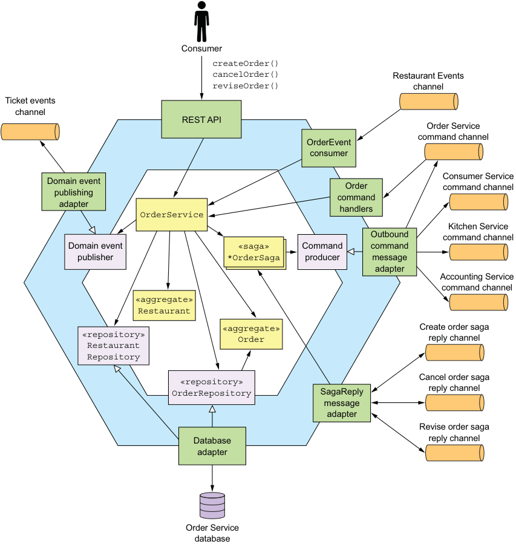

**----- Start of picture text -----** 
Consumer createOrder() cancelOrder() Restaurant Events reviseOrder() channel Ticket events channel REST API Order Service command channel OrderEvent consumer Consumer Service Domain event Order command channel publishing command adapter handlers OrderService Kitchen Service Outbound command channel Domain event «saga» Command command publisher *OrderSaga producer message adapter Accounting Service command channel «aggregate» Restaurant «aggregate» Create order saga «repository» Order reply channel Restaurant Repository Cancel order saga «repository» OrderRepository SagaReply reply channel message adapter Revise order saga Database reply channel adapter Order Service database **----- End of picture text -----** 

Figure 5.12 The design of the **Order Service** . It has a REST API for managing orders. It exchanges messages and events with other services via several message channels. and Restaurants. OrderRepository defines methods for persisting Orders, and RestaurantRepository has methods for persisting Restaurants. Order Service has several inbound adapters: 

- REST API—The REST API invoked by the user interface used by consumers. It invokes OrderService to create and update Orders. 

_**Order Service business logic**_ 

- OrderEventConsumer—Subscribes to events published by Restaurant Service. It invokes OrderService to create and update its replica of Restaurants. 

- OrderCommandHandlers—The asynchronous request/response-based API that’s invoked by sagas. It invokes OrderService to update Orders. 

- SagaReplyAdapter—Subscribes to the saga reply channels and invokes the sagas. 

The service also has some outbound adapters: 

- DB adapter—Implements the OrderRepository interface and accesses the Order Service database 

- DomainEventPublishingAdapter—Implements the DomainEventPublisher interface and publishes Order domain events 

- OutboundCommandMessageAdapter—Implements the CommandPublisher interface and sends command messages to saga participants 

Let’s first take a closer look at the Order aggregate and then examine OrderService. 

# _5.5.1 The Order Aggregate_ 

The Order aggregate represents an order placed by a consumer. We’ll first look at the structure of the Order aggregate and then check out its methods. 

# THE STRUCTURE OF THE ORDER AGGREGATE 

Figure 5.13 shows the structure of the Order aggregate. The Order class is the root of the Order aggregate. The Order aggregate also consists of value objects such as OrderLineItem, DeliveryInfo, and PaymentInfo. 

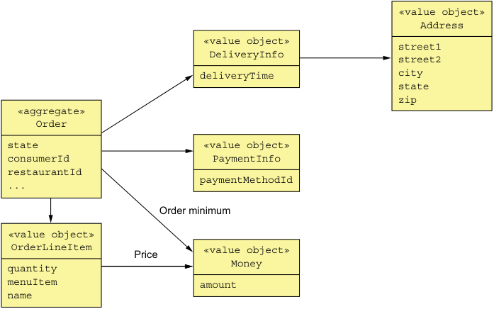

**----- Start of picture text -----** 
«value object» Address «value object» street1 DeliveryInfo street2 deliveryTime city state zip «aggregate» Order state «value object» consumerId PaymentInfo restaurantId ... paymentMethodId Order minimum «value object» OrderLineItem Price «value object» quantity Money menuItem amount name **----- End of picture text -----** 

Figure 5.13 The design of the **Order** aggregate, which consists of the **Order** aggregate root and various value objects. 

The Order class has a collection of OrderLineItems. Because the Order’s Consumer and Restaurant are other aggregates, it references them by primary key value. The Order class has a DeliveryInfo class, which stores the delivery address and the desired delivery time, and a PaymentInfo, which stores the payment info. The following listing shows the code. 

# Listing 5.14 The **Order** class and its fields 

@Entity @Table(name="orders") @Access(AccessType.FIELD) public class Order { 

@Id @GeneratedValue private Long id; @Version private Long version; private OrderState state; private Long consumerId; private Long restaurantId; 

@Embedded private OrderLineItems orderLineItems; 

@Embedded private DeliveryInformation deliveryInformation; 

@Embedded private PaymentInformation paymentInformation; 

@Embedded private Money orderMinimum; 

This class is persisted with JPA and is mapped to the ORDERS table. The id field is the primary key. The version field is used for optimistic locking. The state of an Order is represented by the OrderState enumeration. The DeliveryInformation and PaymentInformation fields are mapped using the @Embedded annotation and are stored as columns of the ORDERS table. The orderLineItems field is an embedded object that contains the order line items. The Order aggregate consists of more than just fields. It also implements business logic, which can be described by a state machine. Let’s take a look at the state machine. 

# THE ORDER AGGREGATE STATE MACHINE 

In order to create or update an order, Order Service must collaborate with other services using sagas. Either OrderService or the first step of the saga invokes an Order method that verifies that the operation can be performed and changes the state of the Order to a pending state. A _pending_ state, as explained in chapter 4, is an example of 

_**Order Service business logic**_
a semantic lock countermeasure, which helps ensure that sagas are isolated from one another. Eventually, once the saga has invoked the participating services, it then updates the Order to reflect the outcome. For example, as described in chapter 4, the Create Order Saga has multiple participant services, including Consumer Service, Accounting Service, and Kitchen Service. OrderService first creates an Order in an APPROVAL_PENDING state, and then later changes its state to either APPROVED or REJECTED. The behavior of an Order can be modeled as the state machine shown in figure 5.14. 

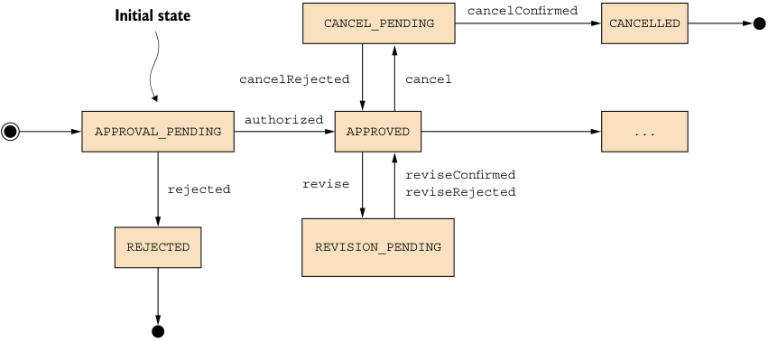

**----- Start of picture text -----** 
Initial state cancelConfirmed CANCEL_PENDING CANCELLED cancelRejected cancel authorized APPROVAL_PENDING APPROVED ... reviseConfirmed revise rejected reviseRejected REJECTED REVISION_PENDING **----- End of picture text -----** 

Figure 5.14 Part of the state machine model of the **Order** aggregate 

Similarly, other Order Service operations such as revise() and cancel() first change the Order to a pending state and use a saga to verify that the operation can be performed. Then, once the saga has verified that the operation can be performed, it changes the Order transitions to some other state that reflects the successful outcome of the operation. If the verification of the operation fails, the Order reverts to the previous state. For example, the cancel() operation first transitions the Order to the CANCEL_PENDING state. If the order can be cancelled, the Cancel Order Saga changes the state of the Order to the CANCELLED state. Otherwise, if a cancel() operation is rejected because, for example, it’s too late to cancel the order, then the Order transitions back to the APPROVED state. 

Let’s now look at the how the Order aggregate implements this state machine. 

# THE ORDER AGGREGATE’S METHODS 

The Order class has several groups of methods, each of which corresponds to a saga. In each group, one method is invoked at the start of the saga, and the other methods are invoked at the end. I’ll first discuss the business logic that creates an Order. After that we’ll look at how an Order is updated. The following listing shows the Order’s methods that are invoked during the process of creating an Order. 

Listing 5.15 The methods that are invoked during order creation public class Order { ... public static ResultWithDomainEvents<Order, OrderDomainEvent> createOrder(long consumerId, Restaurant restaurant, List<OrderLineItem> orderLineItems) { Order order = new Order(consumerId, restaurant.getId(), orderLineItems); List<OrderDomainEvent> events = singletonList(new OrderCreatedEvent( new OrderDetails(consumerId, restaurant.getId(), orderLineItems, order.getOrderTotal()), restaurant.getName())); return new ResultWithDomainEvents<>(order, events); } public Order(OrderDetails orderDetails) { this.orderLineItems = new OrderLineItems(orderDetails.getLineItems()); this.orderMinimum = orderDetails.getOrderMinimum(); this.state = APPROVAL_PENDING; } ... public List<DomainEvent> noteApproved() { switch (state) { case APPROVAL_PENDING: this.state = APPROVED; return singletonList(new OrderAuthorized()); ... default: throw new UnsupportedStateTransitionException(state); } } public List<DomainEvent> noteRejected() { switch (state) { case APPROVAL_PENDING: this.state = REJECTED; return singletonList(new OrderRejected()); ... default: throw new UnsupportedStateTransitionException(state); } } 

The createOrder() method is a static factory method that creates an Order and publishes an OrderCreatedEvent. The OrderCreatedEvent is enriched with the details of the Order, including the line items, the total amount, the restaurant ID, and the restaurant name. Chapter 7 discusses how Order History Service uses Order events, including OrderCreatedEvent, to maintain an easily queried replica of Orders. 

_**Order Service business logic**_ 

The initial state of the Order is APPROVAL_PENDING. When the CreateOrderSaga completes, it will invoke either noteApproved() or noteRejected(). The noteApproved() method is invoked when the consumer’s credit card has been successfully authorized. The noteRejected() method is called when one of the services rejects the order or authorization fails. As you can see, the state of the Order aggregate determines the behavior of most of its methods. Like the Ticket aggregate, it also emits events. 

In addition to createOrder(), the Order class defines several update methods. For example, the Revise Order Saga revises an order by first invoking the revise() method and then, once it’s verified that the revision can be made, it invokes the confirmRevised() method. The following listing shows these methods. 

Listing 5.16 The **Order** method for revising an **Order**
class Order ... public List<OrderDomainEvent> revise(OrderRevision orderRevision) { switch (state) { case APPROVED: LineItemQuantityChange change = orderLineItems.lineItemQuantityChange(orderRevision); if (change.newOrderTotal.isGreaterThanOrEqual(orderMinimum)) { throw new OrderMinimumNotMetException(); } this.state = REVISION_PENDING; return singletonList(new OrderRevisionProposed(orderRevision, change.currentOrderTotal, change.newOrderTotal)); default: throw new UnsupportedStateTransitionException(state); } } public List<OrderDomainEvent> confirmRevision(OrderRevision orderRevision) { switch (state) { case REVISION_PENDING: LineItemQuantityChange licd = orderLineItems.lineItemQuantityChange(orderRevision); orderRevision .getDeliveryInformation() .ifPresent(newDi -> this.deliveryInformation = newDi); if (!orderRevision.getRevisedLineItemQuantities().isEmpty()) { orderLineItems.updateLineItems(orderRevision); } this.state = APPROVED; return singletonList(new OrderRevised(orderRevision, licd.currentOrderTotal, licd.newOrderTotal)); 

_**Designing business logic in a microservice architecture**_ 

default: throw new UnsupportedStateTransitionException(state); 

} 

} 

# } 

The revise() method is called to initiate the revision of an order. Among other things, it verifies that the revised order won’t violate the order minimum and changes the state of the order to REVISION_PENDING. Once Revise Order Saga has successfully updated Kitchen Service and Accounting Service, it then calls confirmRevision() to complete the revision. 

These methods are invoked by OrderService. Let’s take a look at that class. 

# _5.5.2 The OrderService class_ 

The OrderService class defines methods for creating and updating Orders. It’s the main entry point into the business logic and is invoked by various inbound adapters, such as the REST API. Most of its methods create a saga to orchestrate the creation and updating of Order aggregates. As a result, this service is more complicated than the KitchenService class discussed earlier. The following listing shows an excerpt of this class. OrderService is injected with various dependencies, including OrderRepository, OrderDomainEventPublisher, and several saga managers. It defines several methods, including createOrder() and reviseOrder(). 

Listing 5.17 The **OrderService** class has methods for creating and managing orders 

@Transactional public class OrderService { 

@Autowired private OrderRepository orderRepository; 

@Autowired private SagaManager<CreateOrderSagaState, CreateOrderSagaState> createOrderSagaManager; 

@Autowired private SagaManager<ReviseOrderSagaState, ReviseOrderSagaData> reviseOrderSagaManagement; 

@Autowired private OrderDomainEventPublisher orderAggregateEventPublisher; public Order createOrder(OrderDetails orderDetails) { 

Restaurant restaurant = restaurantRepository.findById(restaurantId) .orElseThrow(() - 

> > new RestaurantNotFoundException(restaurantId)); 

_**Order Service business logic**_ 

List<OrderLineItem> orderLineItems = makeOrderLineItems(lineItems, restaurant); 

**Creates the Order aggregate** 

ResultWithDomainEvents<Order, OrderDomainEvent> orderAndEvents = Order.createOrder(consumerId, restaurant, orderLineItems); 

Order order = orderAndEvents.result; orderRepository.save(order); 

**Publishes Persists the Order domain in the database events**
orderAggregateEventPublisher.publish(order, orderAndEvents.events); 

OrderDetails orderDetails = new OrderDetails(consumerId, restaurantId, orderLineItems, order.getOrderTotal()); CreateOrderSagaState data = new CreateOrderSagaState(order.getId(), orderDetails); createOrderSagaManager.create(data, Order.class, order.getId()); 

return order; **Creates the Create** } **Order Saga**
public Order reviseOrder(Long orderId, Long expectedVersion, OrderRevision orderRevision) { public Order reviseOrder(long orderId, OrderRevision orderRevision) { Order order = orderRepository.findById(orderId) .orElseThrow(() -> new OrderNotFoundException(orderId)); ReviseOrderSagaData sagaData = new ReviseOrderSagaData(order.getConsumerId(), orderId, **Retrieves** null, orderRevision); **the Order** reviseOrderSagaManager.create(sagaData); **Creates the** return order; **Revise Order** } **Saga** } 

The createOrder() method first creates and persists an Order aggregate. It then publishes the domain events emitted by the aggregate. Finally, it creates a CreateOrderSaga. The reviseOrder() retrieves the Order and then creates a ReviseOrderSaga. 

In many ways, the business logic for a microservices-based application is not that different from that of a monolithic application. It’s comprised of classes such as services, JPA-backed entities, and repositories. There are some differences, though. A domain model is organized as a set of DDD aggregates that impose various design constraints. Unlike in a traditional object model, references between classes in different aggregates are in terms of primary key value rather than object references. Also, a transaction can only create or update a single aggregate. It’s also useful for aggregates to publish domain events when their state changes. 

Another major difference is that services often use sagas to maintain data consistency across multiple services. For example, Kitchen Service merely participates in sagas, it doesn’t initiate them. In contrast, Order Service relies heavily on sagas when 

_**Designing business logic in a microservice architecture**_ 

creating and updating orders. That’s because Orders must be transactionally consistent with data owned by other services. As a result, most OrderService methods create a saga rather than update an Order directly. 

This chapter has covered how to implement business logic using a traditional approach to persistence. That has involved integrating messaging and event publishing with database transaction management. The event publishing code is intertwined with the business logic. The next chapter looks at event sourcing, an event-centric approach to writing business logic where event generation is integral to the business logic rather than being bolted on. 

# _Summary_ 

- The procedural Transaction script pattern is often a good way to implement simple business logic. But when implementing complex business logic you should consider using the object-oriented Domain model pattern. 

- A good way to organize a service’s business logic is as a collection of DDD aggregates. DDD aggregates are useful because they modularize the domain model, eliminate the possibility of object reference between services, and ensure that each ACID transaction is within a service. 

- An aggregate should publish domain events when it’s created or updated. Domain events have a wide variety of uses. Chapter 4 discusses how they can implement choreography-based sagas. And, in chapter 7, I talk about how to use domain events to update replicated data. Domain event subscribers can also notify users and other applications, and publish WebSocket messages to a user’s browser. 

