## _Developing business lo ic with event sourcin g g_ 

## _This chapter covers_ 

- Using the Event sourcing pattern to develop business logic 

- Implementing an event store 

- Integrating sagas and event sourcing-based business logic 

- Implementing saga orchestrators using event sourcing 

Mary liked the idea, described in chapter 5, of structuring business logic as a collection of DDD aggregates that publish domain events. She could imagine the use of those events being extremely useful in a microservice architecture. Mary planned to use events to implement choreography-based sagas, which maintain data consistency across services and are described in chapter 4. She also expected to use CQRS views, replicas that support efficient querying that are described in chapter 7. 

She was, however, worried that the event publishing logic might be error prone. On one hand, the event publishing logic is reasonably straightforward. Each of an aggregate’s methods that initializes or changes the state of the aggregate returns a list of events. The domain service then publishes those events. But on the other 

hand, the event publishing logic is bolted on to the business logic. The business logic continues to work even when the developer forgets to publish an event. Mary was concerned that this way of publishing events might be a source of bugs. 

Many years ago, Mary had learned about _event sourcing_ , an event-centric way of writing business logic and persisting domain objects. At the time she was intrigued by its numerous benefits, including how it preserves the complete history of the changes to an aggregate, but it remained a curiosity. Given the importance of domain events in microservice architecture, she now wonders whether it would be worthwhile to explore using event sourcing in the FTGO application. After all, event sourcing eliminates a source of programming errors by guaranteeing that an event will be published whenever an aggregate is created or updated. 

I begin this chapter by describing how event sourcing works and how you can use it to write business logic. I describe how event sourcing persists each aggregate as a sequence of events in what is known as an _event store_ . I discuss the benefits and drawbacks of event sourcing and cover how to implement an event store. I describe a simple framework for writing event sourcing-based business logic. After that, I discuss how event sourcing is a good foundation for implementing sagas. Let’s start by looking at how to develop business logic with event sourcing. 

## _6.1 Developing business logic using event sourcing_ 

Event sourcing is a different way of structuring the business logic and persisting aggregates. It persists an aggregate as a sequence of events. Each event represents a state change of the aggregate. An application recreates the current state of an aggregate by replaying the events. 

## Pattern: Event sourcing 

Persist an aggregate as a sequence of domain events that represent state changes. See http://microservices.io/patterns/data/event-sourcing.html. 

Event sourcing has several important benefits. For example, it preserves the history of aggregates, which is valuable for auditing and regulatory purposes. And it reliably publishes domain events, which is particularly useful in a microservice architecture. Event sourcing also has drawbacks. It involves a learning curve, because it’s a different way to write your business logic. Also, querying the event store is often difficult, which requires you to use the CQRS pattern, described in chapter 7. 

I begin this section by describing the limitations of traditional persistence. I then describe event sourcing in detail and talk about how it overcomes those limitations. After that, I show how to implement the Order aggregate using event sourcing. Finally, I describe the benefits and drawbacks of event sourcing. 

Let’s first look at the limitations of the traditional approach to persistence. 

_**Developing business logic using event sourcing**_ 

## _6.1.1 The trouble with traditional persistence_ 

The traditional approach to persistence maps classes to database tables, fields of those classes to table columns, and instances of those classes to rows in those tables. For example, figure 6.1 shows how the Order aggregate, described in chapter 5, is mapped to the ORDER table. Its OrderLineItems are mapped to the ORDER_LINE_ITEM table. 

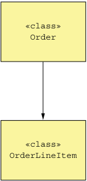

**----- Start of picture text -----** 
«class» Order «class» OrderLineItem **----- End of picture text -----** 

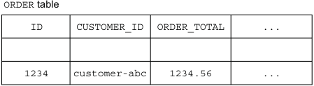

**----- Start of picture text -----** 
ORDER table ID CUSTOMER_ID ORDER_TOTAL ... 1234 customer-abc 1234.56 ... **----- End of picture text -----** 

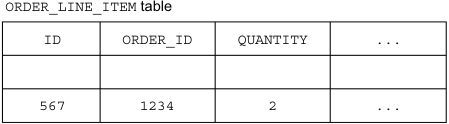

**----- Start of picture text -----** 
ORDER_LINE_ITEM table ID ORDER_ID QUANTITY ... 567 1234 2 ... **----- End of picture text -----** 

Figure 6.1 The traditional approach to persistence maps classes to tables and objects to rows in those tables. 

The application persists an order instance as rows in the ORDER and ORDER_LINE_ITEM tables. It might do that using an ORM framework such as JPA or a lower-level framework such as MyBATIS. 

This approach clearly works well because most enterprise applications store data this way. But it has several drawbacks and limitations: 

- Object-Relational impedance mismatch. 

- Lack of aggregate history. 

- Implementing audit logging is tedious and error prone. 

- Event publishing is bolted on to the business logic. 

Let’s look at each of these problems, starting with the Object-Relational impedance mismatch problem. 

## OBJECT-RELATIONAL IMPEDANCE MISMATCH 

One age-old problem is the so-called _Object-Relational impedance mismatch_ problem. There’s a fundamental conceptual mismatch between the tabular relational schema and the graph structure of a rich domain model with its complex relationships. Some aspects of this problem are reflected in polarized debates over the suitability of Object/Relational mapping (ORM) frameworks. For example, Ted Neward has said that “Object-Relational mapping is the Vietnam of Computer Science” (http://blogs .tedneward.com/post/the-vietnam-of-computer-science/). To be fair, I’ve used 

Hibernate successfully to develop applications where the database schema has been derived from the object model. But the problems are deeper than the limitations of any particular ORM framework. 

## LACK OF AGGREGATE HISTORY 

Another limitation of traditional persistence is that it only stores the current state of an aggregate. Once an aggregate has been updated, its previous state is lost. If an application must preserve the history of an aggregate, perhaps for regulatory purposes, then developers must implement this mechanism themselves. It is time consuming to implement an aggregate history mechanism and involves duplicating code that must be synchronized with the business logic. 

## IMPLEMENTING AUDIT LOGGING IS TEDIOUS AND ERROR PRONE 

Another issue is audit logging. Many applications must maintain an audit log that tracks which users have changed an aggregate. Some applications require auditing for security or regulatory purposes. In other applications, the history of user actions is an important feature. For example, issue trackers and task-management applications such as Asana and JIRA display the history of changes to tasks and issues. The challenge of implementing auditing is that besides being a time-consuming chore, the auditing logging code and the business logic can diverge, resulting in bugs. 

## EVENT PUBLISHING IS BOLTED ON TO THE BUSINESS LOGIC 

Another limitation of traditional persistence is that it usually doesn’t support publishing domain events. Domain events, discussed in chapter 5, are events that are published by an aggregate when its state changes. They’re a useful mechanism for synchronizing data and sending notifications in microservice architecture. Some ORM frameworks, such as Hibernate, can invoke application-provided callbacks when data objects change. But there’s no support for automatically publishing messages as part of the transaction that updates the data. Consequently, as with history and auditing, developers must bolt on event-generation logic, which risks not being synchronized with the business logic. Fortunately, there’s a solution to these issues: event sourcing. 

## _6.1.2 Overview of event sourcing_ 

Event sourcing is an event-centric technique for implementing business logic and persisting aggregates. An aggregate is stored in the database as a series of events. Each event represents a state change of the aggregate. An aggregate’s business logic is structured around the requirement to produce and consume these events. Let’s see how that works. 

## EVENT SOURCING PERSISTS AGGREGATES USING EVENTS 

Earlier, in section 6.1.1, I discussed how traditional persistence maps aggregates to tables, their fields to columns, and their instances to rows. Event sourcing is a very different approach to persisting aggregates that builds on the concept of domain events. It persists each aggregate as a sequence of events in the database, known as an event store. 

_**Developing business logic using event sourcing**_ 

Consider, for example, the Order aggregate. As figure 6.2 shows, rather than store each Order as a row in an ORDER table, event sourcing persists each Order aggregate as one or more rows in an EVENTS table. Each row is a domain event, such as Order Created, Order Approved, Order Shipped, and so on. 

|**Unique event ID**|**Unique event ID**|**The type of the event**|**The type of the event**|**The type of the event**|**Identifes the aggregate**|**Identifes the aggregate**|**The serialized event,**|**The serialized event,**|
|---|---|---|---|---|---|---|---|---|
||||||||**such as JSON**||
||event_id||event_type||entity_type|entity_id|event_data||
||102||Order Created||Order|101|{...}||
||103||Order Approved||Order|101|{...}||
||104||Order Shipped||Order|101|{...}||
||105||Order Delivered||Order|101|{...}||
||||...||||||
||...||||...|...|...||
||EVENTS table||||||||

Figure 6.2 Event sourcing persists each aggregate as a sequence of events. A RDBMS-based application can, for example, store the events in an **EVENTS** table. 

When an application creates or updates an aggregate, it inserts the events emitted by the aggregate into the EVENTS table. An application loads an aggregate from the event store by retrieving its events and replaying them. Specifically, loading an aggregate consists of the following three steps: 

- 1 Load the events for the aggregate. 

- 2 Create an aggregate instance by using its default constructor. 

- 3 Iterate through the events, calling apply(). 

For example, the Eventuate Client framework, covered later in section 6.2.2, uses code similar to the following to reconstruct an aggregate: 

Class aggregateClass = ...; Aggregate aggregate = aggregateClass.newInstance(); for (Event event : events) { aggregate = aggregate.applyEvent(event); } // use aggregate... 

It creates an instance of the class and iterates through the events, calling the aggregate’s applyEvent() method. If you’re familiar with functional programming, you may recognize this as a _fold or reduce_ operation. 

It may be strange and unfamiliar to reconstruct the in-memory state of an aggregate by loading the events and replaying events. But in some ways, it’s not all that different from how an ORM framework such as JPA or Hibernate loads an entity. An ORM framework loads an object by executing one or more SELECT statements to retrieve the current persisted state, instantiating objects using their default constructors. It uses reflection to initialize those objects. What’s different about event sourcing is that the reconstruction of the in-memory state is accomplished using events. 

Let’s now look at the requirements event sourcing places on domain events. 

## EVENTS REPRESENT STATE CHANGES 

Chapter 5 defines domain events as a mechanism for notifying subscribers of changes to aggregates. Events can either contain minimal data, such as just the aggregate ID, or can be enriched to contain data that’s useful to a typical consumer. For example, the Order Service can publish an OrderCreated event when an order is created. An OrderCreated event may only contain the orderId. Alternatively, the event could contain the complete order so consumers of that event don’t have to fetch the data from the Order Service. Whether events are published and what those events contain are driven by the needs of the consumers. With event sourcing, though, it’s primarily the aggregate that determines the events and their structure. 

Events aren’t optional when using event sourcing. Every state change of an aggregate, including its creation, is represented by a domain event. Whenever the aggregate’s state changes, it must emit an event. For example, an Order aggregate must emit an OrderCreated event when it’s created, and an Order* event whenever it is updated. This is a much more stringent requirement than before, when an aggregate only emitted events that were of interest to consumers. 

What’s more, an event must contain the data that the aggregate needs to perform the state transition. The state of an aggregate consists of the values of the fields of the objects that comprise the aggregate. A state change might be as simple as changing the value of the field of an object, such as Order.state. Alternatively, a state change can involve adding or removing objects, such as revising an Order’s line items. 

Suppose, as figure 6.3 shows, that the current state of the aggregate is S and the new state is S'. An event E that represents the state change must contain the data such that when an Order is in state S, calling order.apply(E) will update the Order to state S'. In the next section you’ll see that apply() is a method that performs the state change represented by an event. 

Some events, such as the Order Shipped event, contain little or no data and just represent the state transition. The apply() method handles an Order Shipped event by changing the Order’s status field to SHIPPED. Other events, however, contain a lot of data. An OrderCreated event, for example, must contain all the data needed by the apply() method to initialize an Order, including its line items, payment information, delivery information, and so on. Because events are used to persist an aggregate, you no longer have the option of using a minimal OrderCreated event that contains the orderId. 

_**Developing business logic using event sourcing**_ 

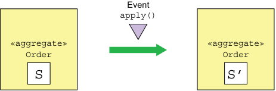

**----- Start of picture text -----** 
Event apply() «aggregate» «aggregate» Order Order S S’ **----- End of picture text -----** 

**Objects and field values** 

**Updated objects** 

Figure 6.3 Applying event **E** when the **Order** is in state **S** must change the **Order** state to **S'** . The event must contain the data necessary to perform the state change. 

## AGGREGATE METHODS ARE ALL ABOUT EVENTS 

The business logic handles a request to update an aggregate by calling a command method on the aggregate root. In a traditional application, a command method typically validates its arguments and then updates one or more of the aggregate’s fields. Command methods in an event sourcing-based application work because they must generate events. As figure 6.4 shows, the outcome of invoking an aggregate’s command method is a sequence of events that represent the state changes that must be made. These events are persisted in the database and applied to the aggregate to update its state. 

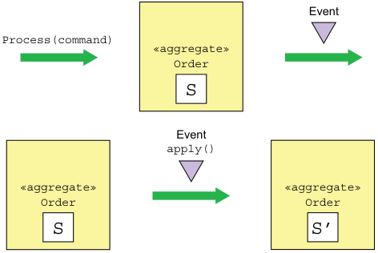

**----- Start of picture text -----** 
Event Process(command) «aggregate» Order S Event apply() «aggregate» «aggregate» Order Order S S’ **----- End of picture text -----** 

Figure 6.4 Processing a command generates events without changing the state of the aggregate. An aggregate is updated by applying an event. 

The requirement to generate events and apply them requires a restructuring—albeit mechanical—of the business logic. Event sourcing refactors a command method into two or more methods. The first method takes a command object parameter, which represents the request, and determines what state changes need to be performed. It validates its arguments, and without changing the state of the aggregate, returns a list of events representing the state changes. This method typically throws an exception if the command cannot be performed. 

The other methods each take a particular event type as a parameter and update the aggregate. There’s one of these methods for each event. It’s important to note that these methods can’t fail, because an event represents a state change that _has_ happened. Each method updates the aggregate based on the event. 

The Eventuate Client framework, an event-sourcing framework described in more detail in section 6.2.2, names these methods process() and apply(). A process() method takes a command object, which contains the arguments of the update request, as a parameter and returns a list of events. An apply() method takes an event as a parameter and returns void. An aggregate will define multiple overloaded versions of these methods: one process() method for each command class and one apply() method for each event type emitted by the aggregate. Figure 6.5 shows an example. 

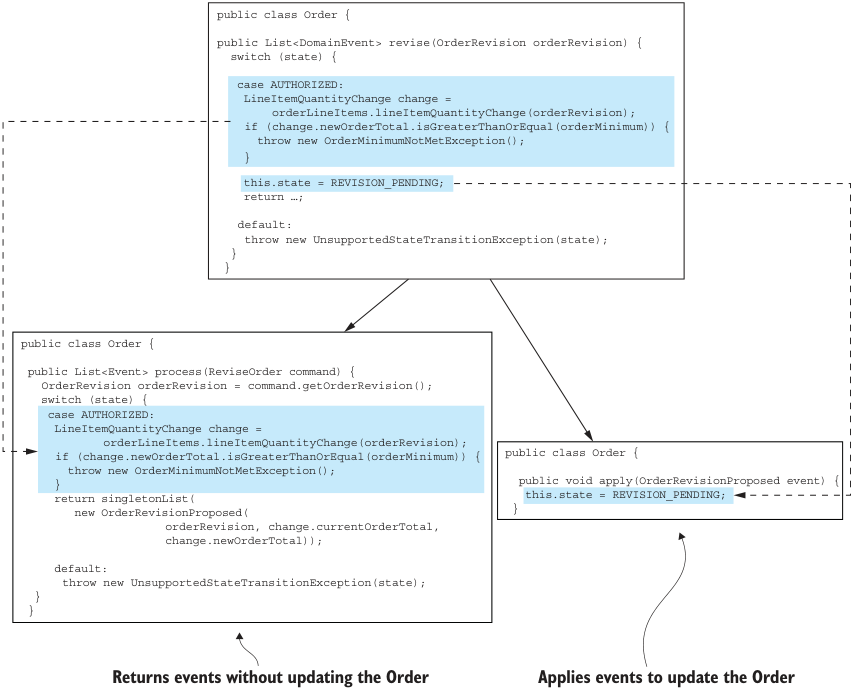

**----- Start of picture text -----** 
public class Order { public List<DomainEvent> revise(OrderRevision orderRevision) { switch (state) { case AUTHORIZED: LineItemQuantityChange change = orderLineItems.lineItemQuantityChange(orderRevision); if (change.newOrderTotal.isGreaterThanOrEqual(orderMinimum)) { throw new OrderMinimumNotMetException(); } this.state = REVISION_PENDING; return …; default: throw new UnsupportedStateTransitionException(state); } } public class Order { public List<Event> process(ReviseOrder command) { OrderRevision orderRevision = command.getOrderRevision(); switch (state) { case AUTHORIZED: LineItemQuantityChange change = orderLineItems.lineItemQuantityChange(orderRevision); if (change.newOrderTotal.isGreaterThanOrEqual(orderMinimum)) { public class Order { throw new OrderMinimumNotMetException(); }return singletonList( publicthis.statevoid =apply(OrderRevisionProposedREVISION_PENDING; event) { new OrderRevisionProposed( } orderRevision, change.currentOrderTotal, change.newOrderTotal)); default: throw new UnsupportedStateTransitionException(state); } } Returns events without updating the Order Applies events to update the Order **----- End of picture text -----** 

Figure 6.5 Event sourcing splits a method that updates an aggregate into a **process()** method, which takes a command and returns events, and one or more **apply()** methods, which take an event and update the aggregate. 

_**Developing business logic using event sourcing**_ 

In this example, the reviseOrder() method is replaced by a process() method and an apply() method. The process() method takes a ReviseOrder command as a parameter. This command class is defined by applying _Introduce Parameter Object_ refactoring (https://refactoring.com/catalog/introduceParameterObject.html) to the reviseOrder() method. The process() method either returns an OrderRevisionProposed event, or throws an exception if it’s too late to revise the Order or if the proposed revision doesn’t meet the order minimum. The apply() method for the OrderRevisionProposed event changes the state of the Order to REVISION_PENDING. 

An aggregate is created using the following steps: 

- 1 Instantiate aggregate root using its default constructor. 

- 2 Invoke process() to generate the new events. 

- 3 Update the aggregate by iterating through the new events, calling its apply(). 

- 4 Save the new events in the event store. 

An aggregate is updated using the following steps: 

- 1 Load aggregate’s events from the event store. 

- 2 Instantiate the aggregate root using its default constructor. 

- 3 Iterate through the loaded events, calling apply() on the aggregate root. 

- 4 Invoke its process() method to generate new events. 

- 5 Update the aggregate by iterating through the new events, calling apply(). 

- 6 Save the new events in the event store. 

To see this in action, let’s now look at the event sourcing version of the Order aggregate. 

## EVENT SOURCING-BASED ORDER AGGREGATE 

Listing 6.1 shows the Order aggregate’s fields and the methods responsible for creating it. The event sourcing version of the Order aggregate has some similarities to the JPA-based version shown in chapter 5. Its fields are almost identical, and it emits similar events. What’s different is that its business logic is implemented in terms of processing commands that emit events and applying those events, which updates its state. Each method that creates or updates the JPA-based aggregate, such as createOrder() and reviseOrder(), is replaced in the event sourcing version by process() and apply() methods. 

Listing 6.1 The **Order** aggregate’s fields and its methods that initialize an instance public class Order { private OrderState state; private Long consumerId; private Long restaurantId; private OrderLineItems orderLineItems; private DeliveryInformation deliveryInformation; private PaymentInformation paymentInformation; private Money orderMinimum; 

public Order() { } 

**Validates the command and returns an OrderCreatedEvent**
public List<Event> process(CreateOrderCommand command) { ... validate command ... return events(new OrderCreatedEvent(command.getOrderDetails())); } public void apply(OrderCreatedEvent event) { OrderDetails orderDetails = event.getOrderDetails(); this.orderLineItems = new OrderLineItems(orderDetails.getLineItems()); this.orderMinimum = orderDetails.getOrderMinimum(); this.state = APPROVAL_PENDING; } **Apply the OrderCreatedEvent by** 

**Apply the OrderCreatedEvent by initializing the fields of the Order.** 

This class’s fields are similar to those of the JPA-based Order. The only difference is that the aggregate’s id isn’t stored in the aggregate. The Order’s methods are quite different. The createOrder() factory method has been replaced by process() and apply() methods. The process() method takes a CreateOrder command and emits an OrderCreated event. The apply() method takes the OrderCreated and initializes the fields of the Order. 

We’ll now look at the slightly more complex business logic for revising an order. Previously this business logic consisted of three methods: reviseOrder(), confirmRevision(), and rejectRevision(). The event sourcing version replaces these three methods with three process() methods and some apply() methods. The following listing shows the event sourcing version of reviseOrder() and confirmRevision(). 

Listing 6.2 The **process()** and **apply()** methods that revise an **Order** aggregate public class Order { **Verify that the Order can be revised and** public List<Event> process(ReviseOrder command) { **that the revised** OrderRevision orderRevision = command.getOrderRevision(); **order meets the** switch (state) { **order minimum.** case APPROVED: LineItemQuantityChange change = orderLineItems.lineItemQuantityChange(orderRevision); if (change.newOrderTotal.isGreaterThanOrEqual(orderMinimum)) { throw new OrderMinimumNotMetException(); } return singletonList(new OrderRevisionProposed(orderRevision, change.currentOrderTotal, change.newOrderTotal)); 

**Verify that the Order can be revised and that the revised order meets the order minimum.**
default: throw new UnsupportedStateTransitionException(state); 

} } public void apply(OrderRevisionProposed event) { this.state = REVISION_PENDING; 

**Change the state of the Order to REVISION_PENDING.** 

} 

_**Developing business logic using event sourcing**_ 

public List<Event> process(ConfirmReviseOrder command) { OrderRevision orderRevision = command.getOrderRevision(); switch (state) { case REVISION_PENDING: LineItemQuantityChange licd = orderLineItems.lineItemQuantityChange(orderRevision); return singletonList(new OrderRevised(orderRevision, licd.currentOrderTotal, licd.newOrderTotal)); default: throw new UnsupportedStateTransitionException(state); } 

**Verify that the revision can be confirmed and return an OrderRevised event.** 

} 

**Revise the Order.**
public void apply(OrderRevised event) { OrderRevision orderRevision = event.getOrderRevision(); if (!orderRevision.getRevisedLineItemQuantities().isEmpty()) { orderLineItems.updateLineItems(orderRevision); } this.state = APPROVED; } 

As you can see, each method has been replaced by a process() method and one or more apply() methods. The reviseOrder() method has been replaced by process (ReviseOrder) and apply(OrderRevisionProposed). Similarly, confirmRevision() has been replaced by process(ConfirmReviseOrder) and apply(OrderRevised). 

- _6.1.3 Handling concurrent updates using optimistic locking_ 

It’s not uncommon for two or more requests to simultaneously update the same aggregate. An application that uses traditional persistence often uses optimistic locking to prevent one transaction from overwriting another’s changes. _Optimistic locking_ typically uses a version column to detect whether an aggregate has changed since it was read. The application maps the aggregate root to a table that has a VERSION column, which is incremented whenever the aggregate is updated. The application updates the aggregate using an UPDATE statement like this: 

UPDATE AGGREGATE_ROOT_TABLE SET VERSION = VERSION + 1 ... WHERE VERSION = <original version> 

This UPDATE statement will only succeed if the version is unchanged from when the application read the aggregate. If two transactions read the same aggregate, the first one that updates the aggregate will succeed. The second one will fail because the version number has changed, so it won’t accidentally overwrite the first transaction’s changes. 

An event store can also use optimistic locking to handle concurrent updates. Each aggregate instance has a version that’s read along with the events. When the application inserts events, the event store verifies that the version is unchanged. A simple 

approach is to use the number of events as the version number. Alternatively, as you’ll see below in section 6.2, an event store could maintain an explicit version number. 

- _6.1.4 Event sourcing and publishing events_ 

Strictly speaking, event sourcing persists aggregates as events and reconstructs the current state of an aggregate from those events. You can also use event sourcing as a reliable event publishing mechanism. Saving an event in the event store is an inherently atomic operation. We need to implement a mechanism to deliver all persisted events to interested consumers. 

Chapter 3 describes a couple of different mechanisms—polling and transaction log tailing—for publishing messages that are inserted into the database as part of a transaction. An event sourcing-based application can publish events using one of these mechanisms. The main difference is that it permanently stores events in an EVENTS table rather than temporarily saving events in an OUTBOX table and then deleting them. Let’s take a look at each approach, starting with polling. 

## USING POLLING TO PUBLISH EVENTS 

If events are stored in the EVENTS table shown in figure 6.6, an event publisher can poll the table for new events by executing a SELECT statement and publish the events to a message broker. The challenge is determining which events are new. For example, imagine that eventIds are monotonically increasing. The superficially appealing approach is for the event publisher to record the last eventId that it has processed. It would then retrieve new events using a query like this: SELECT * FROM EVENTS where event_id > ? ORDER BY event_id ASC. 

The problem with this approach is that transactions can commit in an order that’s different from the order in which they generate events. As a result, the event publisher can accidentally skip over an event. Figure 6.6 shows such as a scenario. 

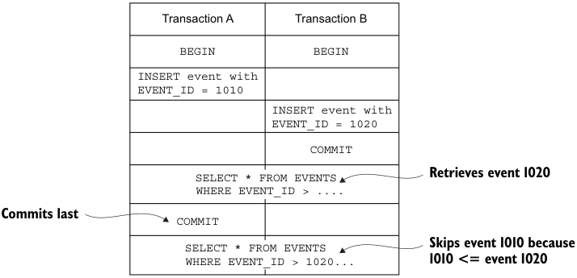

**----- Start of picture text -----** 
Transaction A Transaction B BEGIN BEGIN INSERT event with EVENT_ID = 1010 INSERT event with EVENT_ID = 1020 COMMIT SELECT * FROM EVENTS Retrieves event 1020 WHERE EVENT_ID > .... Commits last COMMIT SELECT * FROM EVENTS Skips event 1010 because WHERE EVENT_ID > 1020... 1010 <= event 1020 **----- End of picture text -----** 

Figure 6.6 A scenario where an event is skipped because its transaction _A_ commits after transaction _B_ . Polling sees **eventId=1020** and then later skips **eventId=1010** . 

_**Developing business logic using event sourcing**_ 

In this scenario, Transaction _A_ inserts an event with an EVENT_ID of 1010. Next, transaction _B_ inserts an event with an EVENT_ID of 1020 and then commits. If the event publisher were now to query the EVENTS table, it would find event 1020. Later on, after transaction _A_ committed and event 1010 became visible, the event publisher would ignore it. 

One solution to this problem is to add an extra column to the EVENTS table that tracks whether an event has been published. The event publisher would then use the following process: 

- 1 Find unpublished events by executing this SELECT statement: SELECT * FROM EVENTS where PUBLISHED = 0 ORDER BY event_id ASC. 

- 2 Publish events to the message broker. 

- 3 Mark the events as having been published: UPDATE EVENTS SET PUBLISHED = 1 WHERE EVENT_ID in. 

This approach prevents the event publisher from skipping events. 

## USING TRANSACTION LOG TAILING TO RELIABLY PUBLISH EVENTS 

More sophisticated event stores use _transaction log tailing_ , which, as chapter 3 describes, guarantees that events will be published and is also more performant and scalable. For example, Eventuate Local, an open source event store, uses this approach. It reads events inserted into an EVENTS table from the database transaction log and publishes them to the message broker. Section 6.2 discusses how Eventuate Local works in more detail. 

## _6.1.5 Using snapshots to improve performance_ 

An Order aggregate has relatively few state transitions, so it only has a small number of events. It’s efficient to query the event store for those events and reconstruct an Order aggregate. Long-lived aggregates, though, can have a large number of events. For example, an Account aggregate potentially has a large number of events. Over time, it would become increasingly inefficient to load and fold those events. 

A common solution is to periodically persist a snapshot of the aggregate’s state. Figure 6.7 shows an example of using a snapshot. The application restores the state of 

**The application only needs to retrieve the snapshot and events that occur after it.** 

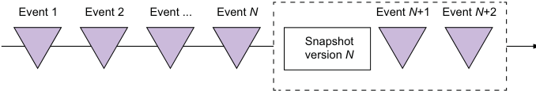

**----- Start of picture text -----** 
Event 1 Event 2 Event ... Event  N Event N +1 Event N +2 Snapshot version  N **----- End of picture text -----** 

Figure 6.7 Using a snapshot improves performance by eliminating the need to load all events. An application only needs to load the snapshot and the events that occur after it. 

an aggregate by loading the most recent snapshot and only those events that have occurred since the snapshot was created. 

In this example, the snapshot version is _N_ . The application only needs to load the snapshot and the two events that follow it in order to restore the state of the aggregate. The previous _N_ events are not loaded from the event store. 

When restoring the state of an aggregate from a snapshot, an application first creates an aggregate instance from the snapshot and then iterates through the events, applying them. For example, the Eventuate Client framework, described in section 6.2.2, uses code similar to the following to reconstruct an aggregate: 

Class aggregateClass = ...; Snapshot snapshot = ...; Aggregate aggregate = recreateFromSnapshot(aggregateClass, snapshot); for (Event event : events) { aggregate = aggregate.applyEvent(event); } // use aggregate... 

When using snapshots, the aggregate instance is recreated from the snapshot instead of being created using its default constructor. If an aggregate has a simple, easily serializable structure, the snapshot can be, for example, its JSON serialization. More complex aggregates can be snapshotted using the Memento pattern (https://en.wikipedia .org/wiki/Memento_pattern). 

The Customer aggregate in the online store example has a very simple structure: the customer’s information, their credit limit, and their credit reservations. A snapshot of a Customer is the JSON serialization of its state. Figure 6.8 shows how to recreate a Customer from a snapshot corresponding to the state of a Customer as of event #103. The Customer Service needs to load the snapshot and the events that have occurred after event #103. 

|EVENTS|EVENTS|EVENTS|EVENTS|EVENTS|SNAPSHOTS|SNAPSHOTS|SNAPSHOTS|SNAPSHOTS|SNAPSHOTS|
|---|---|---|---|---|---|---|---|---|---|
|event_id|event_type|entity_type|entity_id|event_data|event_id ... 103 ... ... entity_type ... Customer ... ... snapshot_data ... {name: “...” , ...} ... ... event_id ... 101 ... ...|event_id|entity_type|event_id|snapshot_data|
|...|...|...|...|...||...|...|...|...|
|103|...|Customer|101|{...}||103|Customer|101|{name: “...” , ...}|
|104|Credit Reserved|Customer|101|{...}||...|...|...|...|
|105|Address Changed|Customer|101|{...}||...|...|...|...|
|106|Credit Reserved|Customer|101|{...}||||||

Figure 6.8 The **Customer Service** recreates the **Customer** by deserializing the snapshot’s JSON and then loading and applying events #104 through #106. 

The Customer Service recreates the Customer by deserializing the snapshot’s JSON and then loading and applying events #104 through #106. 

_**Developing business logic using event sourcing**_ 

## _6.1.6 Idempotent message processing_ 

Services often consume messages from other applications or other services. A service might, for example, consume domain events published by aggregates or command messages sent by a saga orchestrator. As described in chapter 3, an important issue when developing a message consumer is ensuring that it’s idempotent, because a message broker might deliver the same message multiple times. 

A message consumer is idempotent if it can safely be invoked with the same message multiple times. The Eventuate Tram framework, for example, implements idempotent message handling by detecting and discarding duplicate messages. It records the _ids_ of processed messages in a PROCESSED_MESSAGES table as part of the local ACID transaction used by the business logic to create or update aggregates. If the ID of a message is in the PROCESSED_MESSAGES table, it’s a duplicate and can be discarded. Event sourcing-based business logic must implement an equivalent mechanism. How this is done depends on whether the event store uses an RDBMS or a NoSQL database. 

IDEMPOTENT MESSAGE PROCESSING WITH AN RDBMS-BASED EVENT STORE 

If an application uses an RDBMS-based event store, it can use an identical approach to detect and discard duplicates messages. It inserts the message ID into the PROCESSED _MESSAGES table as part of the transaction that inserts events into the EVENTS table. 

IDEMPOTENT MESSAGE PROCESSING WHEN USING A NOSQL-BASED EVENT STORE 

A NoSQL-based event store, which has a limited transaction model, must use a different mechanism to implement idempotent message handling. A message consumer must somehow atomically persist events and record the message ID. Fortunately, there’s a simple solution. A message consumer stores the message’s ID in the events that are generated while processing it. It detects duplicates by verifying that none of an aggregate’s events contains the message ID. 

One challenge with using this approach is that processing a message might not generate any events. The lack of events means there’s no record of a message having been processed. A subsequent redelivery and reprocessing of the same message might result in incorrect behavior. For example, consider the following scenario: 

- 1 Message A is processed but doesn’t update an aggregate. 

- 2 Message B is processed, and the message consumer updates the aggregate. 

- 3 Message A is redelivered, and because there’s no record of it having been processed, the message consumer updates the aggregate. 

- 4 Message B is processed again…. 

In this scenario, the redelivery of events results in a different and possibly erroneous outcome. 

One way to avoid this problem is to always publish an event. If an aggregate doesn’t emit an event, an application saves a pseudo event solely to record the message ID. Event consumers must ignore these pseudo events. 

## _6.1.7 Evolving domain events_ 

Event sourcing, at least conceptually, stores events forever—which is a double-edged sword. On one hand, it provides the application with an audit log of changes that’s guaranteed to be accurate. It also enables an application to reconstruct the historical state of an aggregate. On the other hand, it creates a challenge, because the structure of events often changes over time. 

An application must potentially deal with multiple versions of events. For example, a service that loads an Order aggregate could potentially need to fold multiple versions of events. Similarly, an event subscriber might potentially see multiple versions. 

Let’s first look at the different ways that events can change, and then I’ll describe a commonly used approach for handling changes. 

## EVENT SCHEMA EVOLUTION 

Conceptually, an event sourcing application has a schema that’s organized into three levels: 

- Consists of one or more aggregates 

- Defines the events that each aggregate emits 

- Defines the structure of the events 

Table 6.1 shows the different types of changes that can occur at each level. 

Table 6.1 The different ways that an application’s events can evolve 

|Level|Change|Backward compatible|
|---|---|---|
|Schema Remove aggregate Rename aggregate Aggregate Remove event Rename event Event Delete field Rename field Change type of field|Define a new aggregate type Remove an existing aggregate Change the name of an aggregate type Add a new event type Remove an event type Change the name of an event type Add a new field Delete a field Rename a field Change the type of a field|Yes No No Yes No No Yes No No No|

These changes occur naturally as a service’s domain model evolves over time—for example, when a service’s requirements change or as its developers gain deeper insight into a domain and improve the domain model. At the schema level, developers add, remove, and rename aggregate classes. At the aggregate level, the types of events 

_**Developing business logic using event sourcing**_ 

emitted by a particular aggregate can change. Developers can change the structure of an event type by adding, removing, and changing the name or type of a field. 

Fortunately, many of these types of changes are backward-compatible changes. For example, adding a field to an event is unlikely to impact consumers. A consumer ignores unknown fields. Other changes, though, aren’t backward compatible. For example, changing the name of an event or the name of a field requires consumers of that event type to be changed. 

## MANAGING SCHEMA CHANGES THROUGH UPCASTING 

In the SQL database world, changes to a database schema are commonly handled using schema migrations. Each schema change is represented by a _migration_ , a SQL script that changes the schema and migrates the data to a new schema. The schema migrations are stored in a version control system and applied to a database using a tool such as Flyway. 

An event sourcing application can use a similar approach to handle non-backwardcompatible changes. But instead of migrating events to the new schema version in situ, event sourcing frameworks transform events when they’re loaded from the event store. A component commonly called an _upcaster_ updates individual events from an old version to a newer version. As a result, the application code only ever deals with the current event schema. 

Now that we’ve looked at how event sourcing works, let’s consider its benefits and drawbacks. 

## _6.1.8 Benefits of event sourcing_ 

Event sourcing has both benefits and drawbacks. The benefits include the following: 

- Reliably publishes domain events 

- Preserves the history of aggregates 

- Mostly avoids the O/R impedance mismatch problem 

- Provides developers with a time machine 

Let’s examine each benefit in more detail. 

## RELIABLY PUBLISHES DOMAIN EVENTS 

A major benefit of event sourcing is that it reliably publishes events whenever the state of an aggregate changes. That’s a good foundation for an event-driven microservice architecture. Also, because each event can store the identity of the user who made the change, event sourcing provides an audit log that’s guaranteed to be accurate. The stream of events can be used for a variety of other purposes, including notifying users, application integration, analytics, and monitoring. 

## PRESERVES THE HISTORY OF AGGREGATES 

Another benefit of event sourcing is that it stores the entire history of each aggregate. You can easily implement temporal queries that retrieve the past state of an aggregate. To determine the state of an aggregate at a given point in time, you fold the events 

that occurred up until that point. It’s straightforward, for example, to calculate the available credit of a customer at some point in the past. 

## MOSTLY AVOIDS THE O/R IMPEDANCE MISMATCH PROBLEM 

Event sourcing persists events rather than aggregating them. Events typically have a simple, easily serializable structure. As mentioned earlier, a service can snapshot a complex aggregate by serializing a memento of its state, which adds a level of indirection between an aggregate and its serialized representation. 

## PROVIDES DEVELOPERS WITH A TIME MACHINE 

Event sourcing stores a history of everything that’s happened in the lifetime of an application. Imagine that the FTGO developers need to implement a new requirement to customers who added an item to their shopping cart and then removed it. A traditional application wouldn’t preserve this information, so could only market to customers who add and remove items after the feature is implemented. In contrast, an event sourcing-based application can immediately market to customers who have done this in the past. It’s as if event sourcing provides developers with a time machine for traveling to the past and implementing unanticipated requirements. 

## _6.1.9 Drawbacks of event sourcing_ 

Event sourcing isn’t a silver bullet. It has the following drawbacks: 

- It has a different programming model that has a learning curve. 

- It has the complexity of a messaging-based application. 

- Evolving events can be tricky. 

- Deleting data is tricky. 

- Querying the event store is challenging. 

Let’s look at each drawback. 

## DIFFERENT PROGRAMMING MODEL THAT HAS A LEARNING CURVE 

It’s a different and unfamiliar programming model, and that means a learning curve. In order for an existing application to use event sourcing, you must rewrite its business logic. Fortunately, that’s a fairly mechanical transformation that you can do when you migrate your application to microservices. 

## COMPLEXITY OF A MESSAGING-BASED APPLICATION 

Another drawback of event sourcing is that message brokers usually guarantee at-leastonce delivery. Event handlers that aren’t idempotent must detect and discard duplicate events. The event sourcing framework can help by assigning each event a monotonically increasing ID. An event handler can then detect duplicate events by tracking the highest-seen event ID. This even happens automatically when event handlers update aggregates. 

_**Developing business logic using event sourcing**_ 

## EVOLVING EVENTS CAN BE TRICKY 

With event sourcing, the schema of events (and snapshots!) will evolve over time. Because events are stored forever, aggregates potentially need to fold events corresponding to multiple schema versions. There’s a real risk that aggregates may become bloated with code to deal with all the different versions. As mentioned in section 6.1.7, a good solution to this problem is to upgrade events to the latest version when they’re loaded from the event store. This approach separates the code that upgrades events from the aggregate, which simplifies the aggregates because they only need to apply the latest version of the events. 

## DELETING DATA IS TRICKY 

Because one of the goals of event sourcing is to preserve the history of aggregates, it intentionally stores data forever. The traditional way to delete data when using event sourcing is to do a soft delete. An application deletes an aggregate by setting a _deleted_ flag. The aggregate will typically emit a Deleted event, which notifies any interested consumers. Any code that accesses that aggregate can check the flag and act accordingly. 

Using a soft delete works well for many kinds of data. One challenge, however, is complying with the General Data Protection Regulation (GDPR), a European data protection and privacy regulation that grants individuals the right to erasure (https:// gdpr-info.eu/art-17-gdpr/). An application must have the ability to forget a user’s personal information, such as their email address. The issue with an event sourcing-based application is that the email address might either be stored in an AccountCreated event or used as the primary key of an aggregate. The application somehow must forget about the user without deleting the events. 

Encryption is one mechanism you can use to solve this problem. Each user has an encryption key, which is stored in a separate database table. The application uses that encryption key to encrypt any events containing the user’s personal information before storing them in an event store. When a user requests to be erased, the application deletes the encryption key record from the database table. The user’s personal information is effectively deleted, because the events can no longer be decrypted. 

Encrypting events solves most problems with erasing a user’s personal information. But if some aspect of a user’s personal information, such as email address, is used as an aggregate ID, throwing away the encryption key may not be sufficient. For example, section 6.2 describes an event store that has an entities table whose primary key is the aggregate ID. One solution to this problem is to use the technique of _pseudonymization_ , replacing the email address with a UUID token and using that as the aggregate ID. The application stores the association between the UUID token and the email address in a database table. When a user requests to be erased, the application deletes the row for their email address from that table. This prevents the application from mapping the UUID back to the email address. 

## QUERYING THE EVENT STORE IS CHALLENGING 

Imagine you need to find customers who have exhausted their credit limit. Because there isn’t a column containing the credit, you can’t write SELECT * FROM CUSTOMER WHERE CREDIT_LIMIT = 0. Instead, you must use a more complex and potentially inefficient query that has a nested SELECT to compute the credit limit by folding events that set the initial credit and adjusting it. To make matters worse, a NoSQL-based event store will typically only support primary key-based lookup. Consequently, you must implement queries using the CQRS approach described in chapter 7. 

## _6.2 Implementing an event store_ 

An application that uses event sourcing stores its events in an event store. An _event store_ is a hybrid of a database and a message broker. It behaves as a database because it has an API for inserting and retrieving an aggregate’s events by primary key. And it behaves as a message broker because it has an API for subscribing to events. 

There are a few different ways to implement an event store. One option is to implement your own event store and event sourcing framework. You can, for example, persist events in an RDBMS. A simple, albeit low-performance, way to publish events is for subscribers to poll the EVENTS table for events. But, as noted in section 6.1.4, one challenge is ensuring that a subscriber processes all events in order. 

Another option is to use a special-purpose event store, which typically provides a rich set of features and better performance and scalability. There are several of these to chose from: 

- _Event Store_ —A .NET-based open source event store developed by Greg Young, an event sourcing pioneer (https://eventstore.org). 

- _Lagom_ —A microservices framework developed by Lightbend, the company formerly known as Typesafe (www.lightbend.com/lagom-framework). 

- _Axon_ —An open source Java framework for developing event-driven applications that use event sourcing and CQRS (www.axonframework.org). 

- _Eventuate_ —Developed by my startup, Eventuate (http://eventuate.io). There are two versions of Eventuate: Eventuate SaaS, a cloud service, and Eventuate Local, an Apache Kafka/RDBMS-based open source project. 

Although these frameworks differ in the details, the core concepts remain the same. Because Eventuate is the framework I’m most familiar with, that’s the one I cover here. It has a straightforward, easy-to-understand architecture that illustrates event sourcing concepts. You can use it in your applications, reimplement the concepts yourself, or apply what you learn here to build applications with one of the other event sourcing frameworks. 

I begin the following sections by describing how the Eventuate Local event store works. Then I describe the Eventuate Client framework for Java, an easy-to-use framework for writing event sourcing-based business logic that uses the Eventuate Local event store. 

_**Implementing an event store**_ 

## _6.2.1 How the Eventuate Local event store works_ 

Eventuate Local is an open source event store. Figure 6.9 shows the architecture. Events are stored in a database, such as MySQL. Applications insert and retrieve aggregate events by primary key. Applications consume events from a message broker, such as Apache Kafka. A transaction log tailing mechanism propagates events from the database to the message broker. 

## **Stores the events** 

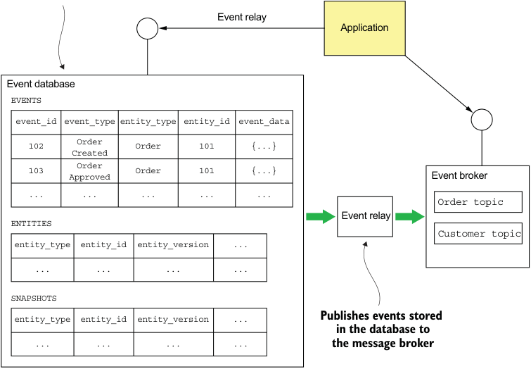

**----- Start of picture text -----** 
Event relay Application Event database EVENTS event_id event_type entity_type entity_id event_data 102 Order Order 101 {...} Created 103 AppOrderroved Order 101 {...} Event broker ... ... ... ... ... Order topic Event relay ENTITIES Customer topic entity_type entity_id entity_version ... ... ... ... ... SNAPSHOTS entity_type entity_id entity_version ... Publishes events stored in the database to ... ... ... ... the message broker **----- End of picture text -----** 

Figure 6.9 The architecture of Eventuate Local. It consists of an event database (such as MySQL) that stores the events, an event broker (like Apache Kafka) that delivers events to subscribers, and an event relay that publishes events stored in the event database to the event broker. 

Let’s look at the different Eventuate Local components, starting with the database schema. 

THE SCHEMA OF EVENTUATE LOCAL’S EVENT DATABASE 

The event database consists of three tables: 

- events—Stores the events 

- entities—One row per entity 

- snapshots—Stores snapshots 

The central table is the events table. The structure of this table is very similar to the table shown in figure 6.2. Here’s its definition: 

create table events ( event_id varchar(1000) PRIMARY KEY, event_type varchar(1000), event_data varchar(1000) NOT NULL, entity_type VARCHAR(1000) NOT NULL, entity_id VARCHAR(1000) NOT NULL, triggering_event VARCHAR(1000) ); 

The triggering_event column is used to detect duplicate events/messages. It stores the ID of the message/event whose processing generated this event. 

The entities table stores the current version of each entity. It’s used to implement optimistic locking. Here’s the definition of this table: create table entities ( entity_type VARCHAR(1000), entity_id VARCHAR(1000), entity_version VARCHAR(1000) NOT NULL, PRIMARY KEY(entity_type, entity_id) ); 

When an entity is created, a row is inserted into this table. Each time an entity is updated, the entity_version column is updated. 

The snapshots table stores the snapshots of each entity. Here’s the definition of this table: create table snapshots ( entity_type VARCHAR(1000), entity_id VARCHAR(1000), entity_version VARCHAR(1000), snapshot_type VARCHAR(1000) NOT NULL, snapshot_json VARCHAR(1000) NOT NULL, triggering_events VARCHAR(1000), PRIMARY KEY(entity_type, entity_id, entity_version) ) 

The entity_type and entity_id columns specify the snapshot’s entity. The snapshot _json column is the serialized representation of the snapshot, and the snapshot_type is its type. The entity_version specifies the version of the entity that this is a snapshot of. 

The three operations supported by this schema are find(), create(), and update(). The find() operation queries the snapshots table to retrieve the latest snapshot, if any. If a snapshot exists, the find() operation queries the events table to find all events whose event_id is greater than the snapshot’s entity_version. Otherwise, find() retrieves all events for the specified entity. The find() operation also queries the entity table to retrieve the entity’s current version. 

The create() operation inserts a row into the entity table and inserts the events into the events table. The update() operation inserts events into the events table. It 

_**Implementing an event store**_ 

also performs an optimistic locking check by updating the entity version in the entities table using this UPDATE statement: 

## UPDATE entities SET entity_version = ? 

WHERE entity_type = ? and entity_id = ? and entity_version = ? 

This statement verifies that the version is unchanged since it was retrieved by the find() operation. It also updates the entity_version to the new version. The update() operation performs these updates within a transaction in order to ensure atomicity. 

Now that we’ve looked at how Eventuate Local stores an aggregate’s events and snapshots, let’s see how a client subscribes to events using Eventuate Local’s event broker. 

## CONSUMING EVENTS BY SUBSCRIBING TO EVENTUATE LOCAL’S EVENT BROKER 

Services consume events by subscribing to the event broker, which is implemented using Apache Kafka. The event broker has a topic for each aggregate type. As described in chapter 3, a _topic_ is a partitioned message channel. This enables consumers to scale horizontally while preserving message ordering. The aggregate ID is used as the partition key, which preserves the ordering of events published by a given aggregate. To consume an aggregate’s events, a service subscribes to the aggregate’s topic. 

Let’s now look at the event relay—the glue between the event database and the event broker. 

THE EVENTUATE LOCAL EVENT RELAY PROPAGATES EVENTS FROM THE DATABASE TO THE MESSAGE BROKER 

The event relay propagates events inserted into the event database to the event broker. It uses transaction log tailing whenever possible and polling for other databases. For example, the MySQL version of the event relay uses the MySQL master/slave replication protocol. The event relay connects to the MySQL server as if it were a slave and reads the MySQL binlog, a record of updates made to the database. Inserts into the EVENTS table, which correspond to events, are published to the appropriate Apache Kafka topic. The event relay ignores any other kinds of changes. 

The event relay is deployed as a standalone process. In order to restart correctly, it periodically saves the current position in the binlog—filename and offset—in a special Apache Kafka topic. On startup, it first retrieves the last recorded position from the topic. The event relay then starts reading the MySQL binlog from that position. 

The event database, message broker, and event relay comprise the event store. Let’s now look at the framework a Java application uses to access the event store. 

## _6.2.2 The Eventuate client framework for Java_ 

The Eventuate client framework enables developers to write event sourcing-based applications that use the Eventuate Local event store. The framework, shown in figure 6.10, provides the foundation for developing event sourcing-based aggregates, services, and event handlers. 

_**Developing business logic with event sourcing**_ 

**----- Start of picture text -----** 
Abstract classes and interfaces that application classes extend or implement **----- End of picture text -----** 

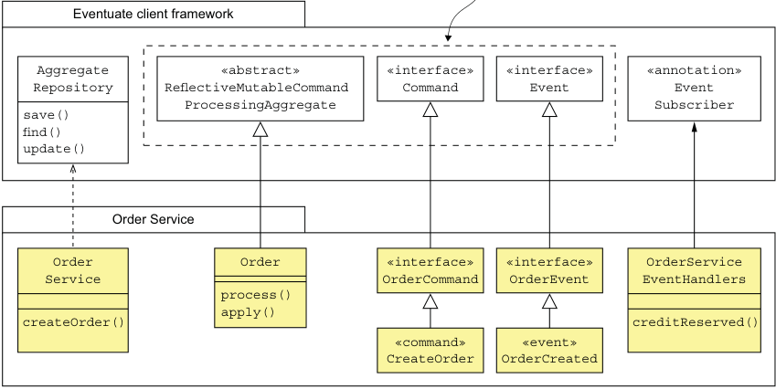

**----- Start of picture text -----** 
Eventuate client framework Aggregate «abstract» «interface» «interface» «annotation» Repository ReflectiveMutableCommand Command Event Event ProcessingAggregate Subscriber save() find() update() Order Service Order Order «interface» «interface» OrderService Service OrderCommand OrderEvent EventHandlers process() apply() createOrder() creditReserved() «command» «event» CreateOrder OrderCreated **----- End of picture text -----** 

Figure 6.10 The main classes and interfaces provided by the Eventuate client framework for Java 

The framework provides base classes for aggregates, commands, and events. There’s also an AggregateRepository class that provides CRUD functionality. And the framework has an API for subscribing to events. 

Let’s briefly look at each of the types shown in figure 6.10. 

DEFINING AGGREGATES WITH THE REFLECTIVEMUTABLECOMMANDPROCESSINGAGGREGATE CLASS ReflectiveMutableCommandProcessingAggregate is the base class for aggregates. It’s a generic class that has two type parameters: the first is the concrete aggregate class, and the second is the superclass of the aggregate’s command classes. As its rather long name suggests, it uses reflection to dispatch command and events to the appropriate method. Commands are dispatched to a process() method, and events to an apply() method. 

The Order class you saw earlier extends ReflectiveMutableCommandProcessingAggregate. The following listing shows the Order class. 

Listing 6.3 The Eventuate version of the **Order** class 

- public class Order extends ReflectiveMutableCommandProcessingAggregate<Order, OrderCommand> { 

public List<Event> process(CreateOrderCommand command) { ... } public void apply(OrderCreatedEvent event) { ... } 

_**Implementing an event store**_ 

... 

} 

The two type parameters passed to ReflectiveMutableCommandProcessingAggregate are Order and OrderCommand, which is the base interface for Order’s commands. 

## DEFINING AGGREGATE COMMANDS 

An aggregate’s command classes must extend an aggregate-specific base interface, which itself must extend the Command interface. For example, the Order aggregate’s commands extend OrderCommand: public interface OrderCommand extends Command { } public class CreateOrderCommand implements OrderCommand { ... } 

The OrderCommand interface extends Command, and the CreateOrderCommand command class extends OrderCommand. 

## DEFINING DOMAIN EVENTS 

An aggregate’s event classes must extend the Event interface, which is a marker interface with no methods. It’s also useful to define a common base interface, which extends Event for all of an aggregate’s event classes. For example, here’s the definition of the OrderCreated event: interface OrderEvent extends Event { 

} public class OrderCreated extends OrderEvent { ... } 

The OrderCreated event class extends OrderEvent, which is the base interface for the Order aggregate’s event classes. The OrderEvent interface extends Event. 

CREATING, FINDING, AND UPDATING AGGREGATES WITH THE AGGREGATEREPOSITORY CLASS 

The framework provides several ways to create, find, and update aggregates. The simplest approach, which I describe here, is to use an AggregateRepository. AggregateRepository is a generic class that’s parameterized by the aggregate class and the aggregate’s base command class. It provides three overloaded methods: 

- save()—Creates an aggregate 

- find()—Finds an aggregate 

- update()—Updates an aggregate 

The save () and update() methods are particularly convenient because they encapsulate the boilerplate code required for creating and updating aggregates. For instance, save() takes a command object as a parameter and performs the following steps: 

- 1 Instantiates the aggregate using its default constructor 

- 2 Invokes process() to process the command 

- 3 Applies the generated events by calling apply() 

- 4 Saves the generated events in the event store 

The update() method is similar. It has two parameters, an aggregate ID and a command, and performs the following steps: 

- 1 Retrieves the aggregate from the event store 

- 2 Invokes process() to process the command 

- 3 Applies the generated events by calling apply() 

- 4 Saves the generated events in the event store 

The AggregateRepository class is primarily used by services, which create and update aggregates in response to external requests. For example, the following listing shows how OrderService uses an AggregateRepository to create an Order. 

Listing 6.4 **OrderService** uses an **AggregateRepository** 

- public class OrderService { private AggregateRepository<Order, OrderCommand> orderRepository; 

public OrderService(AggregateRepository<Order, OrderCommand> orderRepository) { this.orderRepository = orderRepository; 

} public EntityWithIdAndVersion<Order> createOrder(OrderDetails orderDetails) { return orderRepository.save(new CreateOrder(orderDetails)); } 

} 

OrderService is injected with an AggregateRepository for Orders. Its create() method invokes AggregateRepository.save() with a CreateOrder command. 

SUBSCRIBING TO DOMAIN EVENTS 

The Eventuate Client framework also provides an API for writing event handlers. Listing 6.5 shows an event handler for CreditReserved events. The @EventSubscriber annotation specifies the ID of the durable subscription. Events that are published when the subscriber isn’t running will be delivered when it starts up. The @EventHandlerMethod annotation identifies the creditReserved() method as an event handler. 

Listing 6.5 An event handler for **OrderCreatedEvent** 

@EventSubscriber(id="orderServiceEventHandlers") public class OrderServiceEventHandlers { 

- @EventHandlerMethod 

> public void creditReserved(EventHandlerContext<CreditReserved> ctx) { CreditReserved event = ctx.getEvent(); 

... 

} 

_**Using sagas and event sourcing together**_ 

An event handler has a parameter of type EventHandlerContext, which contains the event and its metadata. 

Now that we’ve looked at how to write event sourcing-based business logic using the Eventuate client framework, let’s look at how to use event sourcing-based business logic with sagas. 

## _6.3 Using sagas and event sourcing together_ 

Imagine you’ve implemented one or more services using event sourcing. You’ve probably written services similar to the one shown in listing 6.4. But if you’ve read chapter 4, you know that services often need to initiate and participate in _sagas_ , sequences of local transactions used to maintain data consistency across services. For example, Order Service uses a saga to validate an Order. Kitchen Service, Consumer Service, and Accounting Service participate in that saga. Consequently, you must integrate sagas and event sourcing-based business logic. 

Event sourcing makes it easy to use choreography-based sagas. The participants exchange the domain events emitted by their aggregates. Each participant’s aggregates handle events by processing commands and emitting new events. You need to write the aggregates and the event handler classes, which update the aggregates. 

But integrating event sourcing-based business logic with orchestration-based sagas can be more challenging. That’s because the event store’s concept of a transaction might be quite limited. When using some event stores, an application can only create or update a single aggregate and publish the resulting event(s). But each step of a saga consists of several actions that must be performed atomically: 

- _Saga creation_ —A service that initiates a saga must atomically create or update an aggregate and create the saga orchestrator. For example, Order Service’s createOrder() method must create an Order aggregate and a CreateOrderSaga. 

- _Saga orchestration_ —A saga orchestrator must atomically consume replies, update its state, and send command messages. 

- _Saga participants_ —Saga participants, such as Kitchen Service and Order Service, must atomically consume messages, detect and discard duplicates, create or update aggregates, and send reply messages. 

Because of this mismatch between these requirements and the transactional capabilities of an event store, integrating orchestration-based sagas and event sourcing potentially creates some interesting challenges. 

A key factor in determining the ease of integrating event sourcing and orchestrationbased sagas is whether the event store uses an RDBMS or a NoSQL database. The Eventuate Tram saga framework described in chapter 4 and the underlying Tram messaging framework described in chapter 3 rely on flexible ACID transactions provided by the RDBMS. The saga orchestrator and the saga participants use ACID transactions to atomically update their databases and exchange messages. If the application uses an RDBMS-based event store, such as Eventuate Local, then it can _cheat_ and invoke the 

Eventuate Tram saga framework and update the event store within an ACID transaction. But if the event store uses a NoSQL database, which can’t participate in the same transaction as the Eventuate Tram saga framework, it will have to take a different approach. 

Let’s take a closer look at some of the different scenarios and issues you’ll need to address: 

- Implementing choreography-based sagas 

- Creating an orchestration-based saga 

- Implementing an event sourcing-based saga participant 

- Implementing saga orchestrators using event sourcing 

We’ll begin by looking at how to implement choreography-based sagas using event sourcing. 

## _6.3.1 Implementing choreography-based sagas using event sourcing_ 

The event-driven nature of event sourcing makes it quite straightforward to implement choreography-based sagas. When an aggregate is updated, it emits an event. An event handler for a different aggregate can consume that event and update its aggregate. The event sourcing framework automatically makes each event handler idempotent. 

For example, chapter 4 discusses how to implement Create Order Saga using choreography. ConsumerService, KitchenService, and AccountingService subscribe to the OrderService’s events and vice versa. Each service has an event handler similar to the one shown in listing 6.5. The event handler updates the corresponding aggregate, which emits another event. 

Event sourcing and choreography-based sagas work very well together. Event sourcing provides the mechanisms that sagas need, including messaging-based IPC, message de-duplication, and atomic updating of state and message sending. Despite its simplicity, choreography-based sagas have several drawbacks. I talk about some drawbacks in chapter 4, but there’s a drawback that’s specific to event sourcing. 

The problem with using events for saga choreography is that events now have a dual purpose. Event sourcing uses events to represent state changes, but using events for saga choreography requires an aggregate to emit an event even if there is no state change. For example, if updating an aggregate would violate a business rule, then the aggregate must emit an event to report the error. An even worse problem is when a saga participant can’t create an aggregate. There’s no aggregate that can emit an error event. 

Because of these kinds of issues, it’s best to implement more complex sagas using orchestration. The following sections explain how to integrate orchestration-based sagas and event sourcing. As you’ll see, it involves solving some interesting problems. 

Let’s first look at how a service method such as OrderService.createOrder() creates a saga orchestrator. 

_**Using sagas and event sourcing together**_ 

## _6.3.2 Creating an orchestration-based saga_ 

Saga orchestrators are created by some service methods. Other service methods, such as OrderService.createOrder(), do two things: create or update an aggregate _and_ create a saga orchestrator. The service must perform both actions in a way that guarantees that if it does the first action, then the second action will be done eventually. How the service ensures that both of these actions are performed depends on the kind of event store it uses. 

## CREATING A SAGA ORCHESTRATOR WHEN USING AN RDBMS-BASED EVENT STORE 

If a service uses an RDBMS-based event store, it can update the event store and create a saga orchestrator within the same ACID transaction. For example, imagine that the OrderService uses Eventuate Local and the Eventuate Tram saga framework. Its createOrder() method would look like this: 

## class OrderService 

**Ensure the createOrder() executes within a database transaction.** 

@Autowired private SagaManager<CreateOrderSagaState> createOrderSagaManager; @Transactional public EntityWithIdAndVersion<Order> createOrder(OrderDetails orderDetails) { EntityWithIdAndVersion<Order> order = **Create the Order** orderRepository.save(new CreateOrder(orderDetails)); **aggregate.** CreateOrderSagaState data = new CreateOrderSagaState(order.getId(), orderDetails); **Create the CreateOrderSaga.**
createOrderSagaManager.create(data, Order.class, order.getId()); return order; } ... 

It’s a combination of the OrderService in listing 6.4 and the OrderService described in chapter 4. Because Eventuate Local uses an RDBMS, it can participate in the same ACID transaction as the Eventuate Tram saga framework. But if a service uses a NoSQL-based event store, creating a saga orchestrator isn’t as straightforward. 

CREATING A SAGA ORCHESTRATOR WHEN USING A NOSQL-BASED EVENT STORE 

A service that uses a NoSQL-based event store will most likely be unable to atomically update the event store and create a saga orchestrator. The saga orchestration framework might use an entirely different database. Even if it uses the same NoSQL database, the application won’t be able to create or update two different objects atomically because of the NoSQL database’s limited transaction model. Instead, a service must have an event handler that creates the saga orchestrator in response to a domain event emitted by the aggregate. 

For example, figure 6.11 shows how Order Service creates a CreateOrderSaga using an event handler for the OrderCreated event. Order Service first creates an 

Order aggregate and persists it in the event store. The event store publishes the OrderCreated event, which is consumed by the event handler. The event handler invokes the Eventuate Tram saga framework to create a CreateOrderSaga. 

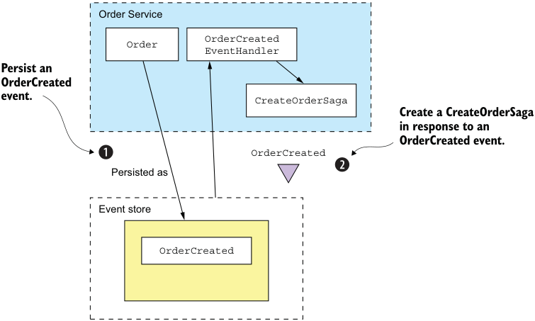

**----- Start of picture text -----** 
Order Service OrderCreated Order EventHandler Persist an OrderCreated event. CreateOrderSaga Create a CreateOrderSaga in response to an OrderCreated event. OrderCreated Persisted as Event store OrderCreated **----- End of picture text -----** 

Figure 6.11 Using an event handler to reliably create a saga after a service creates an event sourcing-based aggregate 

One issue to keep in mind when writing an event handler that creates a saga orchestrator is that it must handle duplicate events. At-least-once message delivery means that the event handler that creates the saga might be invoked multiple times. It’s important to ensure that only one saga instance is created. 

A straightforward approach is to derive the ID of the saga from a unique attribute of the event. There are a couple of different options. One is to use the ID of the aggregate that emits the event as the ID of the saga. This works well for sagas that are created in response to aggregate creation events. 

Another option is to use the event ID as the saga ID. Because event IDs are unique, this will guarantee that the saga ID is unique. If an event is a duplicate, the event handler’s attempt to create the saga will fail because the ID already exists. This option is useful when multiple instances of the same saga can exist for a given aggregate instance. 

A service that uses an RDBMS-based event store can also use the same event-driven approach to create sagas. A benefit of this approach is that it promotes loose coupling because services such as OrderService no longer explicitly instantiate sagas. 

Now that we’ve looked at how to reliably create a saga orchestrator, let’s see how event sourcing-based services can participate in orchestration-based sagas. 

_**Using sagas and event sourcing together**_ 

## _6.3.3 Implementing an event sourcing-based saga participant_ 

Imagine that you used event sourcing to implement a service that needs to participate in an orchestration-based saga. Not surprisingly, if your service uses an RDBMS-based event store such as Eventuate Local, you can easily ensure that it atomically processes saga command messages and sends replies. It can update the event store as part of the ACID transaction initiated by the Eventuate Tram framework. But you must use an entirely different approach if your service uses an event store that can’t participate in the same transaction as the Eventuate Tram framework. 

You must address a couple of different issues: 

- Idempotent command message handling 

- Atomically sending a reply message 

Let’s first look at how to implement idempotent command message handlers. 

## IDEMPOTENT COMMAND MESSAGE HANDLING 

The first problem to solve is how an event sourcing-based saga participant can detect and discard duplicate messages in order to implement idempotent command message handling. Fortunately, this is an easy problem to address using the idempotent message handling mechanism described earlier. A saga participant records the message ID in the events that are generated when processing the message. Before updating an aggregate, the saga participant verifies that it hasn’t processed the message before by looking for the message ID in the events. 

## ATOMICALLY SENDING REPLY MESSAGES 

The second problem to solve is how an event sourcing-based saga participant can atomically send replies. In principle, a saga orchestrator could subscribe to the events emitted by an aggregate, but there are two problems with this approach. The first is that a saga command might not actually change the state of an aggregate. In this scenario, the aggregate won’t emit an event, so no reply will be sent to the saga orchestrator. The second problem is that this approach requires the saga orchestrator to treat saga participants that use event sourcing differently from those that don’t. That’s because in order to receive domain events, the saga orchestrator must subscribe to the aggregate’s event channel in addition to its own reply channel. 

A better approach is for the saga participant to continue to send a reply message to the saga orchestrator’s reply channel. But rather than send the reply message directly, a saga participant uses a two-step process: 

- 1 When a saga command handler creates or updates an aggregate, it arranges for a SagaReplyRequested pseudo event to be saved in the event store along with the real events emitted by the aggregate. 

- 2 An event handler for the SagaReplyRequested pseudo event uses the data contained in the event to construct the reply message, which it then writes to the saga orchestrator’s reply channel. 

Let’s look at an example to see how this works. 

## EXAMPLE EVENT SOURCING-BASED SAGA PARTICIPANT 

This example looks at Accounting Service, one of the participants of Create Order Saga. Figure 6.12 shows how Accounting Service handles the Authorize Command sent by the saga. Accounting Service is implemented using the Eventuate Saga framework. The Eventuate Saga framework is an open source framework for writing sagas that use event sourcing. It’s built on the Eventuate Client framework. 

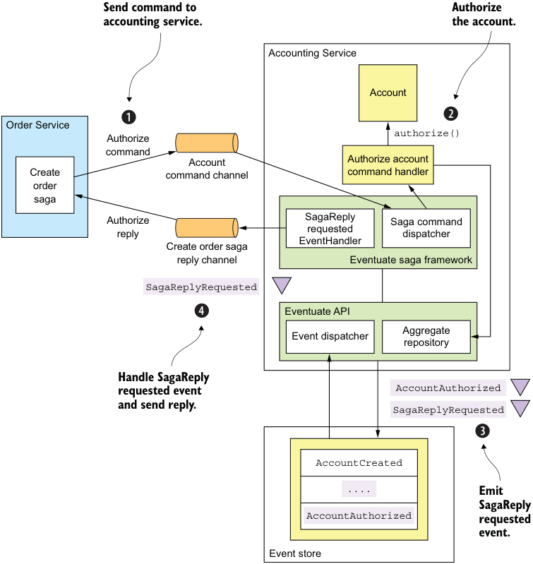

**----- Start of picture text -----** 
Send command to Authorize accounting service. the account. Accounting Service Account Order Service Authorize authorize() command Account Authorize account Create command channel command handler order saga Authorize SagaReply Saga command requested reply dispatcher EventHandler Create order saga reply channel Eventuate saga framework SagaReplyRequested Eventuate API Aggregate Event dispatcher repository Handle SagaReply requested event AccountAuthorized and send reply. SagaReplyRequested AccountCreated .... Emit SagaReply AccountAuthorized requested event. Event store **----- End of picture text -----** 

Figure 6.12 How the event sourcing-based **Accounting Service** participates in **Create Order Saga** 

This figure shows how Create Order Saga and AccountingService interact. The sequence of events is as follows: 

_**Using sagas and event sourcing together**_ 

- 1 Create Order Saga sends an AuthorizeAccount command to AccountingService via a messaging channel. The Eventuate Saga framework’s SagaCommandDispatcher invokes AccountingServiceCommandHandler to handle the command 

   - message. 

- 2 AccountingServiceCommandHandler sends the command to the specified Account aggregate. 

- 3 The aggregate emits two events, AccountAuthorized and SagaReplyRequestedEvent. 

- 4 SagaReplyRequestedEventHandler handles SagaReplyRequestedEvent by sending a reply message to CreateOrderSaga. 

The AccountingServiceCommandHandler shown in the following listing handles the AuthorizeAccount command message by calling AggregateRepository.update() to update the Account aggregate. 

Listing 6.6 Handles command messages sent by sagas public class AccountingServiceCommandHandler { 

@Autowired private AggregateRepository<Account, AccountCommand> accountRepository; public void authorize(CommandMessage<AuthorizeCommand> cm) { AuthorizeCommand command = cm.getCommand(); accountRepository.update(command.getOrderId(), command, replyingTo(cm) .catching(AccountDisabledException.class, () -> withFailure(new AccountDisabledReply())) .build()); } 

... 

The authorize() method invokes an AggregateRepository to update the Account aggregate. The third argument to update(), which is the UpdateOptions, is computed by this expression: replyingTo(cm) .catching(AccountDisabledException.class, () -> withFailure(new AccountDisabledReply())) .build() 

These UpdateOptions configure the update() method to do the following: 

- 1 Use the _message id_ as an idempotency key to ensure that the message is processed exactly once. As mentioned earlier, the Eventuate framework stores the idempotency key in all generated events, enabling it to detect and ignore duplicate attempts to update an aggregate. 

- 2 Add a SagaReplyRequestedEvent pseudo event to the list of events saved in the event store. When SagaReplyRequestedEventHandler receives the SagaReplyRequestedEvent pseudo event, it sends a reply to the CreateOrderSaga’s reply channel. 

- 3 Send an AccountDisabledReply instead of the default error reply when the aggregate throws an AccountDisabledException. 

Now that we’ve looked at how to implement saga participants using event sourcing, let’s find out how to implement saga orchestrators. 

## _6.3.4 Implementing saga orchestrators using event sourcing_ 

So far in this section, I’ve described how event sourcing-based services can initiate and participate in sagas. You can also use event sourcing to implement saga orchestrators. This will enable you to develop applications that are entirely based on an event store. 

There are three key design problems you must solve when implementing a saga orchestrator: 

- 1 How can you persist a saga orchestrator? 

- 2 How can you atomically change the state of the orchestrator and send command messages? 

- 3 How can you ensure that a saga orchestrator processes reply messages exactly once? 

Chapter 4 discusses how to implement an RDBMS-based saga orchestrator. Let’s look at how to solve these problems when using event sourcing. 

## PERSISTING A SAGA ORCHESTRATOR USING EVENT SOURCING 

A saga orchestrator has a very simple lifecycle. First, it’s created. Then it’s updated in response to replies from saga participants. We can, therefore, persist a saga using the following events: 

- SagaOrchestratorCreated—The saga orchestrator has been created. 

- SagaOrchestratorUpdated—The saga orchestrator has been updated. 

A saga orchestrator emits a SagaOrchestratorCreated event when it’s created and a SagaOrchestratorUpdated event when it has been updated. These events contain the data necessary to re-create the state of the saga orchestrator. For example, the events for CreateOrderSaga, described in chapter 4, would contain a serialized (for example, JSON) CreateOrderSagaState. 

## SENDING COMMAND MESSAGES RELIABLY 

Another key design issue is how to atomically update the state of the saga and send a command. As described in chapter 4, the Eventuate Tram-based saga implementation does this by updating the orchestrator and inserting the command message into a message table as part of the same transaction. An application that uses an 

_**Using sagas and event sourcing together**_ 

RDBMS-based event store, such as Eventuate Local, can use the same approach. An application that uses a NoSQL-based event store, such as Eventuate SaaS, can use an analogous approach, despite having a very limited transaction model. 

The trick is to persist a SagaCommandEvent, which represents a command to send. An event handler then subscribes to SagaCommandEvents and sends each command message to the appropriate channel. Figure 6.13 shows how this works. 

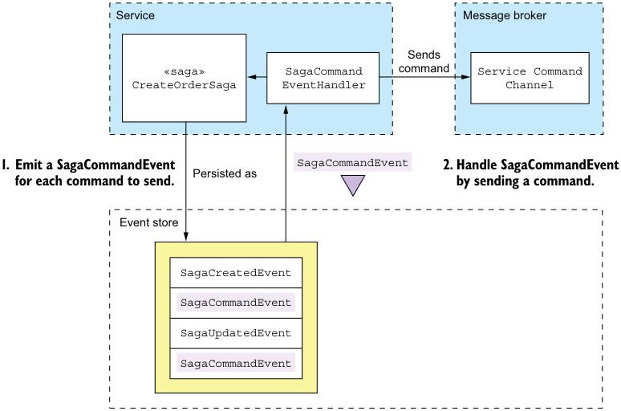

**----- Start of picture text -----** 
Service Message broker Sends «saga» SagaCommand command Service Command CreateOrderSaga EventHandler Channel 1. Emit a SagaCommandEvent Persisted as SagaCommandEvent 2. Handle SagaCommandEvent for each command to send. by sending a command. Event store SagaCreatedEvent SagaCommandEvent SagaUpdatedEvent SagaCommandEvent **----- End of picture text -----** 

Figure 6.13 How an event sourcing-based saga orchestrator sends commands to saga participants 

The saga orchestrator uses a two-step process to send commands: 

- 1 A saga orchestrator emits a SagaCommandEvent for each command that it wants to send. SagaCommandEvent contains all the data needed to send the command, such as the destination channel and the command object. These events are persisted in the event store. 

- 2 An event handler processes these SagaCommandEvents and sends command messages to the destination message channel. 

This two-step approach guarantees that the command will be sent at least once. 

Because the event store provides at-least-once delivery, an event handler might be invoked multiple times with the same event. That will cause the event handler for SagaCommandEvents to send duplicate command messages. Fortunately, though, a saga participant can easily detect and discard duplicate commands using the following 

mechanism. The ID of SagaCommandEvent, which is guaranteed to be unique, is used as the ID of the command message. As a result, the duplicate messages will have the same ID. A saga participant that receives a duplicate command message will discard it using the mechanism described earlier. 

## PROCESSING REPLIES EXACTLY ONCE 

A saga orchestrator also needs to detect and discard duplicate reply messages, which it can do using the mechanism described earlier. The orchestrator stores the reply message’s ID in the events that it emits when processing the reply. It can then easily determine whether a message is a duplicate. 

As you can see, event sourcing is a good foundation for implementing sagas. This is in addition to the other benefits of event sourcing, including the inherently reliable generation of events whenever data changes, reliable audit logging, and the ability to do temporal queries. Event sourcing isn’t a silver bullet, though. It involves a significant learning curve. Evolving the event schema isn’t always straightforward. But despite these drawbacks, event sourcing has a major role to play in a microservice architecture. In the next chapter, we’ll switch gears and look at how to tackle a different distributed data management challenge in a microservice architecture: queries. I’ll describe how to implement queries that retrieve data scattered across multiple services. 

## _Summary_ 

- Event sourcing persists an aggregate as a sequence of events. Each event represents either the creation of the aggregate or a state change. An application recreates the state of an aggregate by replaying events. Event sourcing preserves the history of a domain object, provides an accurate audit log, and reliably publishes domain events. 

- Snapshots improve performance by reducing the number of events that must be replayed. 

- Events are stored in an event store, a hybrid of a database and a message broker. When a service saves an event in an event store, it delivers the event to subscribers. 

- Eventuate Local is an open source event store based on MySQL and Apache Kafka. Developers use the Eventuate client framework to write aggregates and event handlers. 

- One challenge with using event sourcing is handling the evolution of events. An application potentially must handle multiple event versions when replaying events. A good solution is to use upcasting, which upgrades events to the latest version when they’re loaded from the event store. 

- Deleting data in an event sourcing application is tricky. An application must use techniques such as encryption and pseudonymization in order to comply with regulations like the European Union’s GDPR that requires an application to erase an individual’s data. 

_**Summary**_ 

- Event sourcing is a simple way to implement choreography-based sagas. Services have event handlers that listen to the events published by event sourcingbased aggregates. 

- Event sourcing is a good way to implement saga orchestrators. As a result, you can write applications that exclusively use an event store. 

