# 7 Implementing queries in a microservice architecture

**This chapter covers**

- The challenges of querying data in a microservice architecture 

- When and how to implement queries using the API composition pattern 

- When and how to implement queries using the Command query responsibility segregation (CQRS) pattern 

Mary and her team were just starting to get comfortable with the idea of using sagas to maintain data consistency. Then they discovered that transaction management wasn’t the only distributed data-related challenge they had to worry about when migrating the FTGO application to microservices. They also had to figure out how to implement queries. 

In order to support the UI, the FTGO application implements a variety of query operations. Implementing these queries in the existing monolithic application is relatively straightforward, because it has a single database. For the most part, all the FTGO developers needed to do was write SQL SELECT statements and define the necessary indexes. As Mary discovered, writing queries in a microservice architecture is challenging. Queries often need to retrieve data that’s scattered 


_**Querying using the API composition pattern**_ 


among the databases owned by multiple services. You can’t, however, use a traditional distributed query mechanism, because even if it were technically possible, it violates encapsulation. 

Consider, for example, the query operations for the FTGO application described in chapter 2. Some queries retrieve data that’s owned by just one service. The findConsumerProfile() query, for example, returns data from Consumer Service. But other FTGO query operations, such as findOrder() and findOrderHistory(), return data owned by multiple services. Implementing these query operations is not as straightforward. 

There are two different patterns for implementing query operations in a microservice architecture: 

- _The API composition pattern_ —This is the simplest approach and should be used whenever possible. It works by making clients of the services that own the data responsible for invoking the services and combining the results. 

- _The Command query responsibility segregation (CQRS) pattern_ —This is more powerful than the API composition pattern, but it’s also more complex. It maintains one or more view databases whose sole purpose is to support queries. 

After discussing these two patterns, I will talk about how to design CQRS views, followed by the implementation of an example view. Let’s start by taking a look at the API composition pattern. 

## 7.1 Querying using the API composition pattern

The FTGO application implements numerous query operations. Some queries, as mentioned earlier, retrieve data from a single service. Implementing these queries is usually straightforward—although later in this chapter, when I cover the CQRS pattern, you’ll see examples of single service queries that are challenging to implement. 

There are also queries that retrieve data from multiple services. In this section, I describe the findOrder() query operation, which is an example of a query that retrieves data from multiple services. I explain the challenges that often crop up when implementing this type of query in a microservice architecture. I then describe the API composition pattern and show how you can use it to implement queries such as findOrder(). 

### 7.1.1 The findOrder() query operation

The findOrder() operation retrieves an order by its primary key. It takes an orderId as a parameter and returns an OrderDetails object, which contains information about the order. As shown in figure 7.1, this operation is called by a frontend module, such as a mobile device or a web application, that implements the _Order Status_ view. 

The information displayed by the _Order Status_ view includes basic information about the order, including its status, payment status, status of the order from the 


**Data from multiple services Mobile device or web application**


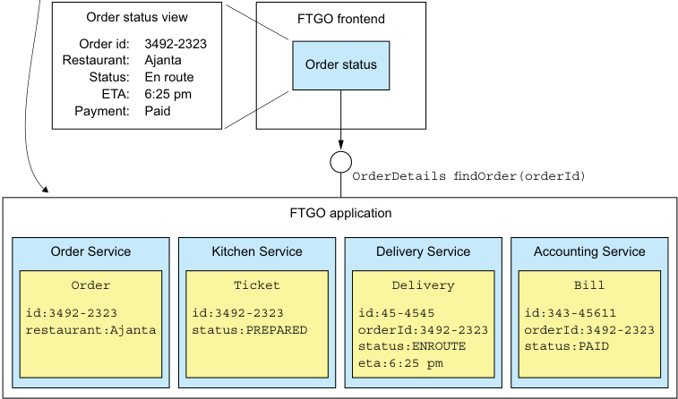


**----- Start of picture text -----**<br>
Order status view FTGO frontend<br>Order id: 3492-2323<br>Restaurant: Ajanta Order status<br>Status: En route<br>ETA: 6:25 pm<br>Payment: Paid<br>OrderDetails findOrder(orderId)<br>FTGO application<br>Order Service Kitchen Service Delivery Service Accounting Service<br>Order Ticket Delivery Bill<br>id:3492-2323 id:3492-2323 id:45-4545 id:343-45611<br>restaurant:Ajanta status:PREPARED orderId:3492-2323 orderId:3492-2323<br>status:ENROUTE status:PAID<br>eta:6:25 pm<br>**----- End of picture text -----**<br>


Figure 7.1 The **findOrder()** operation is invoked by a FTGO frontend module and returns the details of an **Order** . restaurant’s perspective, and delivery status, including its location and estimated delivery time if in transit. 

Because its data resides in a single database, the monolithic FTGO application can easily retrieve the order details by executing a single SELECT statement that joins the various tables. In contrast, in the microservices-based version of the FTGO application, the data is scattered around the following services: 

- Order Service—Basic order information, including the details and status 

- Kitchen Service—Status of the order from the restaurant’s perspective and the estimated time it will be ready for pickup 

- Delivery Service—The order’s delivery status, estimated delivery information, and its current location 

- Accounting Service—The order’s payment status 

Any client that needs the order details must ask all of these services. 

### 7.1.2 Overview of the API composition pattern

One way to implement query operations, such as findOrder(), that retrieve data owned by multiple services is to use the API composition pattern. This pattern implements a 


_**Querying using the API composition pattern**_ 


query operation by invoking the services that own the data and combining the results. Figure 7.2 shows the structure of this pattern. It has two types of participants: 

- _An API composer_ —This implements the query operation by querying the provider services. 

- _A provider service_ —This is a service that owns some of the data that the query returns. 


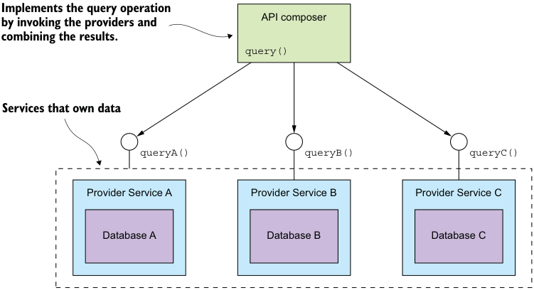


**----- Start of picture text -----**<br>
Implements the query operation<br>by invoking the providers and API composer<br>combining the results.<br>query()<br>Services that own data<br>queryA() queryB() queryC()<br>Provider Service A Provider Service B Provider Service C<br>Database A Database B Database C<br>**----- End of picture text -----**<br>


Figure 7.2 The API composition pattern consists of an API composer and two or more provider services. The API composer implements a query by querying the providers and combining the results. 

Figure 7.2 shows three provider services. The API composer implements the query by retrieving data from the provider services and combining the results. An API composer might be a client, such as a web application, that needs the data to render a web page. Alternatively, it might be a service, such as an API gateway and its Backends for frontends variant described in chapter 8, which exposes the query operation as an API endpoint. 

**Pattern: API composition**

Implement a query that retrieves data from several services by querying each service via its API and combining the results. See http://microservices.io/patterns/data/apicomposition.html. 

Whether you can use this pattern to implement a particular query operation depends on several factors, including how the data is partitioned, the capabilities of the APIs exposed by the services that own the data, and the capabilities of the databases used by the services. For instance, even if the _Provider services_ have APIs for retrieving the 


required data, the aggregator might need to perform an inefficient, in-memory join of large datasets. Later on, you’ll see examples of query operations that can’t be implemented using this pattern. Fortunately, though, there are many scenarios where this pattern is applicable. To see it in action, we’ll look at an example. 

### 7.1.3 Implementing the findOrder() query operation using the API composition pattern

The findOrder() query operation corresponds to a simple primary key-based equijoin query. It’s reasonable to expect that each of the _Provider services_ has an API endpoint for retrieving the required data by orderId. Consequently, the findOrder() query operation is an excellent candidate to be implemented by the API composition pattern. The _API composer_ invokes the four services and combines the results together. Figure 7.3 shows the design of the Find Order Composer. 


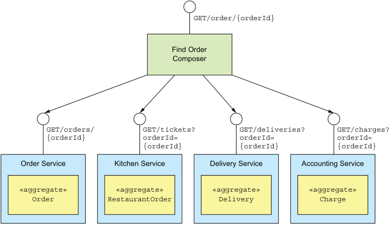


**----- Start of picture text -----**<br>
GET/order/{orderId}<br>Find Order<br>Composer<br>GET/orders/ GET/tickets? GET/deliveries? GET/charges?<br>{orderId} orderId= orderId= orderId=<br>{orderId} {orderId} {orderId}<br>Order Service Kitchen Service Delivery Service Accounting Service<br>«aggregate» «aggregate» «aggregate» «aggregate»<br>Order RestaurantOrder Delivery Charge<br>**----- End of picture text -----**<br>


Figure 7.3 Implementing **findOrder()** using the API composition pattern 

In this example, the _API composer_ is a service that exposes the query as a REST endpoint. The _Provider services_ also implement REST APIs. But the concept is the same if the services used some other interprocess communication protocol, such as gRPC, instead of HTTP. The Find Order Composer implements a REST endpoint GET /order/{orderId}. It invokes the four services and joins the responses using the orderId. Each _Provider service_ implements a REST endpoint that returns a response corresponding to a single aggregate. The OrderService retrieves its version of an Order by primary key and the other services use the orderId as a foreign key to retrieve their aggregates. 

As you can see, the API composition pattern is quite simple. Let’s look at a couple of design issues you must address when applying this pattern. 


_**Querying using the API composition pattern**_ 


### 7.1.4 API composition design issues

When using this pattern, you have to address a couple of design issues: 

- Deciding which component in your architecture is the query operation’s _API composer_ 

- How to write efficient aggregation logic 

Let’s look at each issue. 

**WHO PLAYS THE ROLE OF THE API COMPOSER?**

One decision that you must make is who plays the role of the query operation’s _API composer_ . You have three options. The first option, shown in figure 7.4, is for a client of the services to be the _API composer_ . 


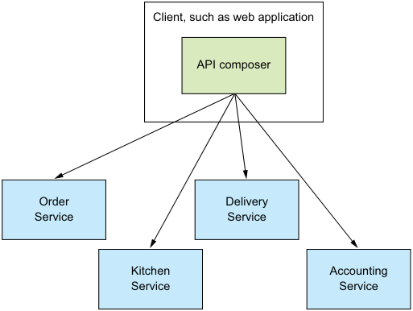


**----- Start of picture text -----**<br>
Client, such as web application<br>API composer<br>Order Delivery<br>Service Service<br>Kitchen Accounting<br>Service Service<br>**----- End of picture text -----**<br>


Figure 7.4 Implementing API composition in a client. The client queries the provider services to retrieve the data. 

A frontend client such as a web application, that implements the Order Status view and is running on the same LAN, could efficiently retrieve the order details using this pattern. But as you’ll learn in chapter 8, this option is probably not practical for clients that are outside of the firewall and access services via a slower network. 

The second option, shown in figure 7.5, is for an API gateway, which implements the application’s external API, to play the role of an _API composer_ for a query operation. 

This option makes sense if the query operation is part of the application’s external API. Instead of routing a request to another service, the API gateway implements the API composition logic. This approach enables a client, such as a mobile device, that’s running outside of the firewall to efficiently retrieve data from numerous services with a single API call. I discuss the API gateway in chapter 8. 

The third option, shown in figure 7.6, is to implement an _API composer_ as a standalone service. 


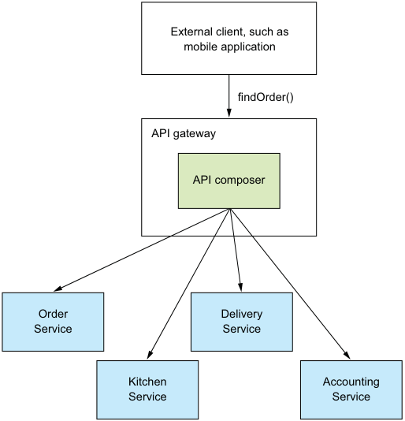


**----- Start of picture text -----**<br>
External client, such as<br>mobile application<br>findOrder()<br>API gateway<br>API composer<br>Order Delivery<br>Service Service<br>Kitchen Accounting<br>Service Service<br>**----- End of picture text -----**<br>


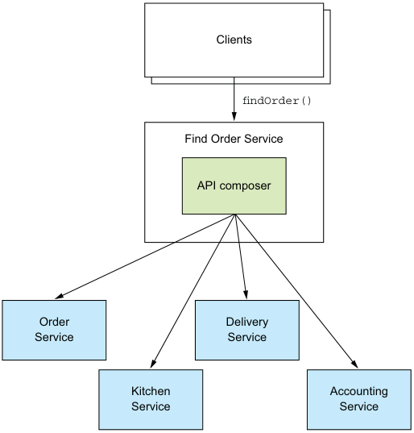


**----- Start of picture text -----**<br>
Clients<br>findOrder()<br>Find Order Service<br>API composer<br>Order Delivery<br>Service Service<br>Kitchen Accounting<br>Service Service<br>**----- End of picture text -----**<br>


Figure 7.5 Implementing API composition in the API gateway. The API queries the provider services to retrieve the data, combines the results, and returns a response to the client. 

Figure 7.6 Implement a query operation used by multiple clients and services as a standalone service. 


_**Querying using the API composition pattern**_ 

You should use this option for a query operation that’s used internally by multiple services. This operation can also be used for externally accessible query operations whose aggregation logic is too complex to be part of an API gateway. 

**API COMPOSERS SHOULD USE A REACTIVE PROGRAMMING MODEL**

When developing a distributed system, minimizing latency is an ever-present concern. Whenever possible, an _API composer_ should call provider services in parallel in order to minimize the response time for a query operation. The Find Order Aggregator should, for example, invoke the four services concurrently because there are no dependencies between the calls. Sometimes, though, an _API composer_ needs the result of one _Provider service_ in order to invoke another service. In this case, it will need to invoke some—but hopefully not all—of the _provider services_ sequentially. 

The logic to efficiently execute a mixture of sequential and parallel service invocations can be complex. In order for an _API composer_ to be maintainable as well as performant and scalable, it should use a reactive design based on Java CompletableFuture’s, RxJava observables, or some other equivalent abstraction. I discuss this topic further in chapter 8 when I cover the API gateway pattern. 

### 7.1.5 The benefits and drawbacks of the API composition pattern

This pattern is a simple and intuitive way to implement query operations in a microservice architecture. But it has some drawbacks: 

- Increased overhead 

- Risk of reduced availability 

- Lack of transactional data consistency 

Let’s take a look at them. 

**INCREASED OVERHEAD**

One drawback of this pattern is the overhead of invoking multiple services and querying multiple databases. In a monolithic application, a client can retrieve data with a single request, which will often execute a single database query. In comparison, using the API composition pattern involves multiple requests and database queries. As a result, more computing and network resources are required, increasing the cost of running the application. 

**RISK OF REDUCED AVAILABILITY**

Another drawback of this pattern is reduced availability. As described in chapter 3, the availability of an operation declines with the number of services that are involved. Because the implementation of a query operation involves at least three services—the _API composer_ and at least two provider services—its availability will be significantly less than that of a single service. For example, if the availability of an individual service is 99.5%, then the availability of the findOrder() endpoint, which invokes four provider services, is 99.5%[(4+1)] = 97.5%! 

There are couple of strategies you can use to improve availability. The first strategy is for the _API composer_ to return previously cached data when a _Provider service_ is 


unavailable. An _API composer_ sometimes caches the data returned by a _Provider service_ in order to improve performance. It can also use this cache to improve availability. If a provider is unavailable, the _API composer_ can return data from the cache, though it may be potentially stale. 

Another strategy for improving availability is for the _API composer_ to return incomplete data. For example, imagine that Kitchen Service is temporarily unavailable. The _API Composer_ for the findOrder() query operation could omit that service’s data from the response, because the UI can still display useful information. You’ll see more details on API design, caching, and reliability in chapter 8. 

**LACK OF TRANSACTIONAL DATA CONSISTENCY**

Another drawback of the API composition pattern is the lack of data consistency. A monolithic application typically executes a query operation using a single database transaction. ACID transactions—subject to the fine print about isolation levels—ensure that an application has a consistent view of the data, even if it executes multiple database queries. In contrast, the API composition pattern executes multiple database queries against multiple databases. There’s a risk, therefore, that a query operation will return inconsistent data. 

For example, an Order retrieved from Order Service might be in the CANCELLED state, whereas the corresponding Ticket retrieved from Kitchen Service might not yet have been cancelled. The _API composer_ must resolve this discrepancy, which increases the code complexity. To make matters worse, an _API composer_ might not always be able to detect inconsistent data, and will return it to the client. 

Despite these drawbacks, the API composition pattern is extremely useful. You can use it to implement many query operations. But there are some query operations that can’t be efficiently implemented using this pattern. A query operation might, for example, require the _API composer_ to perform an in-memory join of large datasets. 

It’s usually better to implement these types of query operations using the CQRS pattern. Let’s take a look at how this pattern works. 

## 7.2 Using the CQRS pattern

Many enterprise applications use an RDBMS as the transactional system of record and a text search database, such as Elasticsearch or Solr, for text search queries. Some applications keep the databases synchronized by writing to both simultaneously. Others periodically copy data from the RDBMS to the text search engine. Applications with this architecture leverage the strengths of multiple databases: the transactional properties of the RDBMS and the querying capabilities of the text database. 

Pattern: Command query responsibility segregation 

Implement a query that needs data from several services by using events to maintain a read-only view that replicates data from the services. See http://microservices .io/patterns/data/cqrs.html. 


_**Using the CQRS pattern**_ 


CQRS is a generalization of this kind of architecture. It maintains one or more view databases—not just text search databases—that implement one or more of the application’s queries. To understand why this is useful, we’ll look at some queries that can’t be efficiently implemented using the API composition pattern. I’ll explain how CQRS works and then talk about the benefits and drawbacks of CQRS. Let’s take a look at when you need to use CQRS. 

### 7.2.1 Motivations for using CQRS

The API composition pattern is a good way to implement many queries that must retrieve data from multiple services. Unfortunately, it’s only a partial solution to the problem of querying in a microservice architecture. That’s because there are multiple service queries the API composition pattern can’t implement efficiently. 

What’s more, there are also single service queries that are challenging to implement. Perhaps the service’s database doesn’t efficiently support the query. Alternatively, it sometimes makes sense for a service to implement a query that retrieves data owned by a different service. Let’s take a look at these problems, starting with a multiservice query that can’t be efficiently implemented using API composition. 

**IMPLEMENTING THE FINDORDERHISTORY() QUERY OPERATION**

The findOrderHistory() operation retrieves a consumer’s order history. It has several parameters: 

- consumerId—Identifies the consumer 

- pagination—Page of results to return 

- filter—Filter criteria, including the max age of the orders to return, an optional order status, and optional keywords that match the restaurant name and menu items 

This query operation returns an OrderHistory object that contains a summary of the matching orders sorted by increasing age. It’s called by the module that implements the Order History view. This view displays a summary of each order, which includes the order number, order status, order total, and estimated delivery time. 

On the surface, this operation is similar to the findOrder() query operation. The only difference is that it returns multiple orders instead of just one. It may appear that the _API composer_ only has to execute the same query against each _Provider service_ and combine the results. Unfortunately, it’s not that simple. 

That’s because not all services store the attributes that are used for filtering or sorting. For example, one of the findOrderHistory() operation’s filter criteria is a keyword that matches against a menu item. Only two of the services, Order Service and Kitchen Service, store an Order’s menu items. Neither Delivery Service nor Accounting Service stores the menu items, so can’t filter their data using this keyword. Similarly, neither Kitchen Service nor Delivery Service can sort by the orderCreationDate attribute. 


_**Implementing queries in a microservice architecture**_ 


There are two ways an _API composer_ could solve this problem. One solution is for the _API composer_ to do an in-memory join, as shown in figure 7.7. It retrieves all orders for the consumer from Delivery Service and Accounting Service and performs a join with the orders retrieved from Order Service and Kitchen Service. 


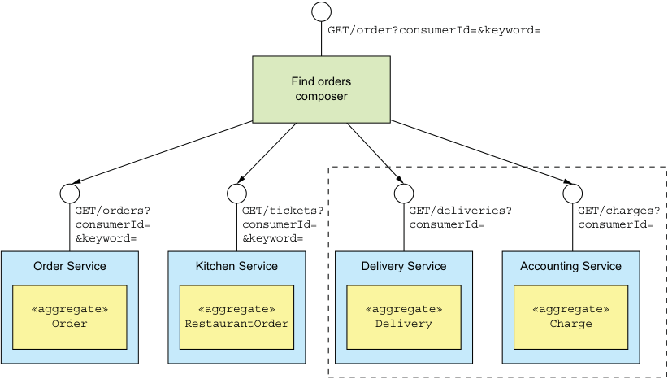


**----- Start of picture text -----**<br>
GET/order?consumerId=&keyword=<br>Find orders<br>composer<br>GET/orders? GET/tickets? GET/deliveries? GET/charges?<br>consumerId= consumerId= consumerId= consumerId=<br>&keyword= &keyword=<br>Order Service Kitchen Service Delivery Service Accounting Service<br>«aggregate» «aggregate» «aggregate» «aggregate»<br>Order RestaurantOrder Delivery Charge<br>**----- End of picture text -----**<br>


**These services don’t store the data needed for a keyword search, so will return all of a consumer’s orders.** 

Figure 7.7 API composition can’t efficiently retrieve a consumer’s orders, because some providers, such as **Delivery Service** , don’t store the attributes used for filtering. 

The drawback of this approach is that it potentially requires the _API composer_ to retrieve and join large datasets, which is inefficient. 

The other solution is for the _API composer_ to retrieve matching orders from Order Service and Kitchen Service and then request orders from the other services by ID. But this is only practical if those services have a bulk fetch API. Requesting orders individually will likely be inefficient because of excessive network traffic. 

Queries such as findOrderHistory() require the _API composer_ to duplicate the functionality of an RDBMS’s query execution engine. On one hand, this potentially moves work from the less scalable database to the more scalable application. On the other hand, it’s less efficient. Also, developers should be writing business functionality, not a query execution engine. 

Next I show you how to apply the CQRS pattern and use a separate datastore, which is designed to efficiently implement the findOrderHistory() query operation. 


_**Using the CQRS pattern**_ 


But first, let’s look at an example of a query operation that’s challenging to implement, despite being local to a single service. 

A CHALLENGING SINGLE SERVICE QUERY: FINDAVAILABLERESTAURANTS() 

As you’ve just seen, implementing queries that retrieve data from multiple services can be challenging. But even queries that are local to a single service can be difficult to implement. There are a couple of reasons why this might be the case. One is because, as discussed shortly, sometimes it’s not appropriate for the service that owns the data to implement the query. The other reason is that sometimes a service’s database (or data model) doesn’t efficiently support the query. 

Consider, for example, the findAvailableRestaurants() query operation. This query finds the restaurants that are available to deliver to a given address at a given time. The heart of this query is a geospatial (location-based) search for restaurants that are within a certain distance of the delivery address. It’s a critical part of the order process and is invoked by the UI module that displays the available restaurants. 

The key challenge when implementing this query operation is performing an efficient geospatial query. How you implement the findAvailableRestaurants() query depends on the capabilities of the database that stores the restaurants. For example, it’s straightforward to implement the findAvailableRestaurants() query using either MongoDB or the Postgres and MySQL geospatial extensions. These databases support geospatial datatypes, indexes, and queries. When using one of these databases, Restaurant Service persists a Restaurant as a database record that has a location attribute. It finds the available restaurants using a geospatial query that’s optimized by a geospatial index on the location attribute. 

If the FTGO application stores restaurants in some other kind of database, implementing the findAvailableRestaurant() query is more challenging. It must maintain a replica of the restaurant data in a form that’s designed to support the geospatial query. The application could, for example, use the Geospatial Indexing Library for DynamoDB (https://github.com/awslabs/dynamodb-geo) that uses a table as a geospatial index. Alternatively, the application could store a replica of the restaurant data in an entirely different type of database, a situation very similar to using a text search database for text queries. 

The challenge with using replicas is keeping them up-to-date whenever the original data changes. As you’ll learn below, CQRS solves the problem of synchronizing replicas. 

**THE NEED TO SEPARATE CONCERNS**

Another reason why single service queries are challenging to implement is that sometimes the service that owns the data shouldn’t be the one that implements the query. The findAvailableRestaurants() query operation retrieves data that is owned by Restaurant Service. This service enables restaurant owners to manage their restaurant’s profile and menu items. It stores various attributes of a restaurant, including its name, address, cuisines, menu, and opening hours. Given that this service owns the 


data, it makes sense, at least on the surface, for it to implement this query operation. But data ownership isn’t the only factor to consider. 

You must also take into account the need to separate concerns and avoid overloading services with too many responsibilities. For example, the primary responsibility of the team that develops Restaurant Service is enabling restaurant managers to maintain their restaurants. That’s quite different from implementing a highvolume, critical query. What’s more, if they were responsible for the findAvailableRestaurants() query operation, the team would constantly live in fear of deploying a change that prevented consumers from placing orders. 

It makes sense for Restaurant Service to merely provide the restaurant data to another service that implements the findAvailableRestaurants() query operation and is most likely owned by the Order Service team. As with the findOrderHistory() query operation, and when needing to maintain geospatial index, there’s a requirement to maintain an eventually consistent replica of some data in order to implement a query. Let’s look at how to accomplish that using CQRS. 

### 7.2.2 Overview of CQRS

The examples described in section 7.2.1 highlighted three problems that are commonly encountered when implementing queries in a microservice architecture: 

- Using the API composition pattern to retrieve data scattered across multiple services results in expensive, inefficient in-memory joins. 

- The service that owns the data stores the data in a form or in a database that doesn’t efficiently support the required query. 

- The need to separate concerns means that the service that owns the data isn’t the service that should implement the query operation. 

The solution to all three of these problems is to use the CQRS pattern. 

**CQRS SEPARATES COMMANDS FROM QUERIES**

Command Query Responsibility Segregation, as the name suggests, is all about _segregation_ , or the separation of concerns. As figure 7.8 shows, it splits a persistent data model and the modules that use it into two parts: the command side and the query side. The command side modules and data model implement create, update, and delete operations (abbreviated CUD—for example, HTTP POSTs, PUTs, and DELETEs). The query-side modules and data model implement queries (such as HTTP GETs). The query side keeps its data model synchronized with the command-side data model by subscribing to the events published by the command side. 

Both the non-CQRS and CQRS versions of the service have an API consisting of various CRUD operations. In a non-CQRS-based service, those operations are typically implemented by a domain model that’s mapped to a database. For performance, a few queries might bypass the domain model and access the database directly. A single persistent data model supports both commands and queries. 


_**Using the CQRS pattern**_ 


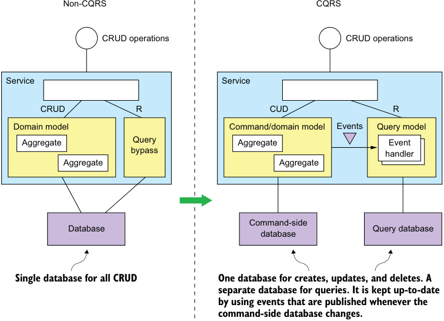


**----- Start of picture text -----**<br>
Non-CQRS CQRS<br>CRUD operations CRUD operations<br>Service Service<br>CRUD R CUD R<br>Domain model Command/domain model Events Query model<br>Aggregate Query Aggregate Event<br>bypass handler<br>Aggregate Aggregate<br>Command-side<br>Database Query database<br>database<br>Single database for all CRUD One database for creates, updates, and deletes. A<br>separate database for queries. It is kept up-to-date<br>by using events that are published whenever the<br>command-side database changes.<br>**----- End of picture text -----**<br>


Figure 7.8 On the left is the non-CQRS version of the service, and on the right is the CQRS version. CQRS restructures a service into command-side and query-side modules, which have separate databases. 

In a CQRS-based service, the command-side domain model handles CRUD operations and is mapped to its own database. It may also handle simple queries, such as nonjoin, primary key-based queries. The command side publishes domain events whenever its data changes. These events might be published using a framework such as Eventuate Tram or using event sourcing. 

A separate query model handles the nontrivial queries. It’s much simpler than the command side because it’s not responsible for implementing the business rules. The query side uses whatever kind of database makes sense for the queries that it must support. The query side has event handlers that subscribe to domain events and update the database or databases. There may even be multiple query models, one for each type of query. 

**CQRS AND QUERY-ONLY SERVICES**

Not only can CQRS be applied within a service, but you can also use this pattern to define query services. A query service has an API consisting of only query operations—no command operations. It implements the query operations by querying a database that it keeps up-to-date by subscribing to events published by one or more other services. A query-side service is a good way to implement a view that’s built by 


subscribing to events published by multiple services. This kind of view doesn’t belong to any particular service, so it makes sense to implement it as a standalone service. A good example of such a service is Order History Service, which is a query service that implements the findOrderHistory() query operation. As figure 7.9 shows, this service subscribes to events published by several services, including Order Service, Delivery Service, and so on. 


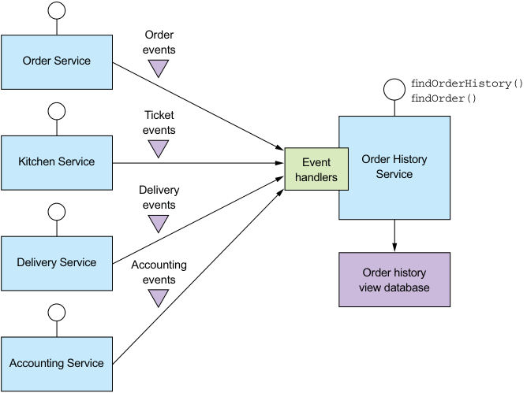


**----- Start of picture text -----**<br>
Order<br>events<br>Order Service<br>findOrderHistory()<br>findOrder()<br>Ticket<br>events<br>Kitchen Service Event Order History<br>handlers Service<br>Delivery<br>events<br>Delivery Service Accounting<br>events Order history<br>view database<br>Accounting Service<br>**----- End of picture text -----**<br>


Figure 7.9 The design of **Order History Service** , which is a query-side service. It implements the **findOrderHistory()** query operation by querying a database, which it maintains by subscribing to events published by multiple other services. 

Order History Service has event handlers that subscribe to events published by several services and update the Order History View Database. I describe the implementation of this service in more detail in section 7.4. 

A query service is also a good way to implement a view that replicates data owned by a single service yet because of the need to separate concerns isn’t part of that service. For example, the FTGO developers can define an Available Restaurants Service, which implements the findAvailableRestaurants() query operation described earlier. It subscribes to events published by Restaurant Service and updates a database designed for efficient geospatial queries. 

In many ways, CQRS is an event-based generalization of the popular approach of using RDBMS as the system of record and a text search engine, such as Elasticsearch, to handle text queries. What’s different is that CQRS uses a broader range of database 


_**Using the CQRS pattern**_ 


types—not just a text search engine. Also, CQRS query-side views are updated in near real time by subscribing to events. 

Let’s now look at the benefits and drawbacks of CQRS. 

### 7.2.3 The benefits of CQRS

CQRS has both benefits and drawbacks. The benefits are as follows: 

- Enables the efficient implementation of queries in a microservice architecture 

- Enables the efficient implementation of diverse queries 

- Makes querying possible in an event sourcing-based application 

- Improves separation of concerns 

**ENABLES THE EFFICIENT IMPLEMENTATION OF QUERIES IN A MICROSERVICE ARCHITECTURE**

One benefit of the CQRS pattern is that it efficiently implements queries that retrieve data owned by multiple services. As described earlier, using the API composition pattern to implement queries sometimes results in expensive, inefficient in-memory joins of large datasets. For those queries, it’s more efficient to use an easily queried CQRS view that pre-joins the data from two or more services. 

**ENABLES THE EFFICIENT IMPLEMENTATION OF DIVERSE QUERIES**

Another benefit of CQRS is that it enables an application or service to efficiently implement a diverse set of queries. Attempting to support all queries using a single persistent data model is often challenging and in some cases impossible. Some NoSQL databases have very limited querying capabilities. Even when a database has extensions to support a particular kind of query, using a specialized database is often more efficient. The CQRS pattern avoids the limitations of a single datastore by defining one or more views, each of which efficiently implements specific queries. 

ENABLES QUERYING IN AN EVENT SOURCING-BASED APPLICATION 

CQRS also overcomes a major limitation of event sourcing. An event store only supports primary key-based queries. The CQRS pattern addresses this limitation by defining one or more views of the aggregates, which are kept up-to-date, by subscribing to the streams of events that are published by the event sourcing-based aggregates. As a result, an event sourcing-based application invariably uses CQRS. 

IMPROVES SEPARATION OF CONCERNS 

Another benefit of CQRS is that it separates concerns. A domain model and its corresponding persistent data model don’t handle both commands and queries. The CQRS pattern defines separate code modules and database schemas for the command and query sides of a service. By separating concerns, the command side and query side are likely to be simpler and easier to maintain. 

Moreover, CQRS enables the service that implements a query to be different than the service that owns the data. For example, earlier I described how even though Restaurant Service owns the data that’s queried by the findAvailableRestaurants query operation, it makes sense for another service to implement such a critical, 


high-volume query. A CQRS query service maintains a view by subscribing to the events published by the service or services that own the data. 

### 7.2.4 The drawbacks of CQRS

Even though CQRS has several benefits, it also has significant drawbacks: 

- More complex architecture 

- Dealing with the replication lag 

Let’s look at these drawbacks, starting with the increased complexity. 

**MORE COMPLEX ARCHITECTURE**

One drawback of CQRS is that it adds complexity. Developers must write the queryside services that update and query the views. There is also the extra operational complexity of managing and operating the extra datastores. What’s more, an application might use different types of databases, which adds further complexity for both developers and operations. 

**DEALING WITH THE REPLICATION LAG**

Another drawback of CQRS is dealing with the “lag” between the command-side and the query-side views. As you might expect, there’s delay between when the command side publishes an event and when that event is processed by the query side and the view updated. A client application that updates an aggregate and then immediately queries a view may see the previous version of the aggregate. It must often be written in a way that avoids exposing these potential inconsistencies to the user. 

One solution is for the command-side and query-side APIs to supply the client with version information that enables it to tell that the query side is out-of-date. A client can poll the query-side view until it’s up-to-date. Shortly I’ll discuss how the service APIs can enable a client to do this. 

A UI application such as a native mobile application or single page JavaScript application can handle replication lag by updating its local model once the command is successful without issuing a query. It can, for example, update its model using data returned by the command. Hopefully, when a user action triggers a query, the view will be up-to-date. One drawback of this approach is that the UI code may need to duplicate server-side code in order to update its model. 

As you can see, CQRS has both benefits and drawbacks. As mentioned earlier, you should use the API composition whenever possible and use CQRS only when you must. 

Now that you’ve seen the benefits and drawbacks of CQRS, let’s now look at how to design CQRS views. 

## 7.3 Designing CQRS views

A CQRS view module has an API consisting of one more query operations. It implements these query operations by querying a database that it maintains by subscribing to events published by one or more services. As figure 7.10 shows, a view module consists of a view database and three submodules. 


_**Designing CQRS views**_ 


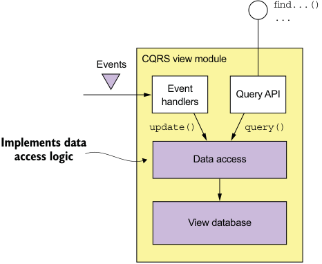


**----- Start of picture text -----**<br>
find...()<br>...<br>CQRS view module<br>Events<br>Event<br>Query API<br>handlers<br>update() query()<br>Implements data<br>access logic Data access<br>View database<br>**----- End of picture text -----**<br>


Figure 7.10 The design of a CQRS view module. Event handlers update the view database, which is queried by the Query API module. 

The data access module implements the database access logic. The event handlers and query API modules use the data access module to update and query the database. The event handlers module subscribes to events and updates the database. The query API module implements the query API. 

You must make some important design decisions when developing a view module: 

- You must choose a database and design the schema. 

- When designing the data access module, you must address various issues, including ensuring that updates are idempotent and handling concurrent updates. 

- When implementing a new view in an existing application or changing the schema of an existing application, you must implement a mechanism to efficiently build or rebuild the view. 

- You must decide how to enable a client of the view to cope with the replication lag, described earlier. 

Let’s look at each of these issues. 

### 7.3.1 Choosing a view datastore

A key design decision is the choice of database and the design of the schema. The primary purpose of the database and the data model is to efficiently implement the view module’s query operations. It’s the characteristics of those queries that are the primary consideration when selecting a database. But the database must also efficiently implement the update operations performed by the event handlers. 

**SQL VS. NOSQL DATABASES**

Not that long ago, there was one type of database to rule them all: the SQL-based RDBMS. As the Web grew in popularity, though, various companies discovered that an RDBMS couldn’t satisfy their web scale requirements. That led to the creation of 


the so-called NoSQL databases. A _NoSQL database_ typically has a limited form of transactions and less general querying capabilities. For certain use cases, these databases have certain advantages over SQL databases, including a more flexible data model and better performance and scalability. 

A NoSQL database is often a good choice for a CQRS view, which can leverage its strengths and ignore its weaknesses. A CQRS view benefits from the richer data model, and performance of a NoSQL database. It’s unaffected by the limitations of a NoSQL database, because it only uses simple transactions and executes a fixed set of queries. 

Having said that, sometimes it makes sense to implement a CQRS view using a SQL database. A modern RDBMS running on modern hardware has excellent performance. Developers, database administrators, and IT operations are, in general, much more familiar with SQL databases than they are with NoSQL databases. As mentioned earlier, SQL databases often have extensions for non-relational features, such as geospatial datatypes and queries. Also, a CQRS view might need to use a SQL database in order to support a reporting engine. 

As you can see in table 7.1, there are lots of different options to choose from. And to make the choice even more complicated, the differences between the different types of database are starting to blur. For example, MySQL, which is an RDBMS, has excellent support for JSON, which is one of the strengths of MongoDB, a JSON-style document-oriented database. 

Table 7.1 Query-side view stores 

|If you need|Use|Example|
|---|---|---|
|PK-based lookup of JSON<br>objects<br>Query-based lookup of JSON<br>objects<br>Text queries<br>Graph queries<br>Traditional SQL reporting/BI|A document store such as MongoDB<br>or DynamoDB, or a key value store<br>such as Redis<br>A document store such as MongoDB<br>or DynamoDB<br>A text search engine such as Elastic-<br>search<br>A graph database such as Neo4j<br>An RDBMS|Implement order history by main-<br>taining a MongoDB document<br>containing the per-customer.<br>Implement customer view using<br>MongoDB or DynamoDB.<br>Implement text search for orders<br>by maintaining a per-order Elas-<br>ticsearch document.<br>Implement fraud detection by<br>maintaining a graph of custom-<br>ers, orders, and other data.<br>Standard business reports and<br>analytics.|


Now that I’ve discussed the different kinds of databases you can use to implement a CQRS view, let’s look at the problem of how to efficiently update a view. 

**SUPPORTING UPDATE OPERATIONS**

Besides efficiently implementing queries, the view data model must also efficiently implement the update operations executed by the event handlers. Usually, an event 


_**Designing CQRS views**_ 


handler will update or delete a record in the view database using its primary key. For example, soon I’ll describe the design of a CQRS view for the findOrderHistory() query. It stores each Order as a database record using the orderId as the primary key. When this view receives an event from Order Service, it can straightforwardly update the corresponding record. 

Sometimes, though, it will need to update or delete a record using the equivalent of a foreign key. Consider, for instance, the event handlers for Delivery* events. If there is a one-to-one correspondence between a Delivery and an Order, then Delivery.id might be the same as Order.id. If it is, then Delivery* event handlers can easily update the order’s database record. 

But suppose a Delivery has its own primary key or there is a one-to-many relationship between an Order and a Delivery. Some Delivery* events, such as the DeliveryCreated event, will contain the orderId. But other events, such as a DeliveryPickedUp event, might not. In this scenario, an event handler for DeliveryPickedUp will need to update the order’s record using the deliveryId as the equivalent of a foreign key. 

Some types of database efficiently support foreign-key-based update operations. For example, if you’re using an RDBMS or MongoDB, you create an index on the necessary columns. However, non-primary key-based updates are not straightforward when using other NOSQL databases. The application will need to maintain some kind of database-specific mapping from a foreign key to a primary key in order to determine which record to update. For example, an application that uses DynamoDB, which only supports primary key-based updates and deletes, must first query a DynamoDB secondary index (discussed shortly) to determine the primary keys of the items to update or delete. 

### 7.3.2 Data access module design

The event handlers and the query API module don’t access the datastore directly. Instead they use the data access module, which consists of a data access object (DAO) and its helper classes. The DAO has several responsibilities. It implements the update operations invoked by the event handlers and the query operations invoked by the query module. The DAO maps between the data types used by the higher-level code and the database API. It also must handle concurrent updates and ensure that updates are idempotent. 

Let’s look at these issues, starting with how to handle concurrent updates. 

**HANDLING CONCURRENCY**

Sometimes a DAO must handle the possibility of multiple concurrent updates to the same database record. If a view subscribes to events published by a single aggregate type, there won’t be any concurrency issues. That’s because events published by a particular aggregate instance are processed sequentially. As a result, a record corresponding to an aggregate instance won’t be updated concurrently. But if a view subscribes to events published by multiple aggregate types, then it’s possible that multiple events handlers update the same record simultaneously. 


For example, an event handler for an Order* event might be invoked at the same time as an event handler for a Delivery* event for the same order. Both event handlers then simultaneously invoke the DAO to update the database record for that Order. A DAO must be written in a way that ensures that this situation is handled correctly. It must not allow one update to overwrite another. If a DAO implements updates by reading a record and then writing the updated record, it must use either pessimistic or optimistic locking. In the next section you’ll see an example of a DAO that handles concurrent updates by updating database records without reading them first. 

**IDEMPOTENT EVENT HANDLERS**

As mentioned in chapter 3, an event handler may be invoked with the same event more than once. This is generally not a problem if a query-side event handler is idempotent. An event handler is idempotent if handling duplicate events results in the correct outcome. In the worst case, the view datastore will temporarily be out-of-date. For example, an event handler that maintains the Order History view might be invoked with the (admittedly improbable) sequence of events shown in figure 7.11: DeliveryPickedUp, DeliveryDelivered, DeliveryPickedUp, and DeliveryDelivered. After delivering the DeliveryPickedUp and DeliveryDelivered events the first time, the message broker, perhaps because of a network error, starts delivering the events from an earlier point in time, and so redelivers DeliveryPickedUp and DeliveryDelivered. 


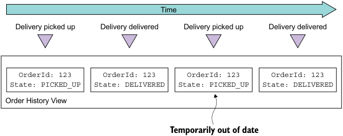


**----- Start of picture text -----**<br>
Time<br>Delivery picked up Delivery delivered Delivery picked up Delivery delivered<br>OrderId: 123 OrderId: 123 OrderId: 123 OrderId: 123<br>State: PICKED_UP State: DELIVERED State: PICKED_UP State: DELIVERED<br>Order History View<br>Temporarily out of date<br>**----- End of picture text -----**<br>


Figure 7.11 The **DeliveryPickedUp** and **DeliveryDelivered** events are delivered twice, which causes the order state in view to be temporarily out-of-date. 

After the event handler processes the second DeliveryPickedUp event, the Order History view temporarily contains the out-of-date state of the Order until the DeliveryDelivered is processed. If this behavior is undesirable, then the event handler should detect and discard duplicate events, like a non-idempotent event handler. 

An event handler isn’t idempotent if duplicate events result in an incorrect outcome. For example, an event handler that increments the balance of a bank account isn’t idempotent. A non-idempotent event handler must, as explained in chapter 3, detect and discard duplicate events by recording the IDs of events that it has processed in the view datastore. 


_**Designing CQRS views**_ 


In order to be reliable, the event handler must record the event ID and update the datastore atomically. How to do this depends on the type of database. If the view database store is a SQL database, the event handler could insert processed events into a PROCESSED_EVENTS table as part of the transaction that updates the view. But if the view datastore is a NoSQL database that has a limited transaction model, the event handler must save the event in the datastore “record” (for example, a MongoDB document or DynamoDB table item) that it updates. 

It’s important to note that the event handler doesn’t need to record the ID of every event. If, as is the case with Eventuate, events have a monotonically increasing ID, then each record only needs to store the max(eventId) that’s received from a given aggregate instance. Furthermore, if the record corresponds to a single aggregate instance, then the event handler only needs to record max(eventId). Only records that represent joins of events from multiple aggregates must contain a map from [aggregate type, aggregate id] to max(eventId). 

For example, you’ll soon see that the DynamoDB implementation of the Order History view contains items that have attributes for tracking events that look like this: {... 

"Order3949384394-039434903" : "0000015e0c6fc18f-0242ac1100e50002", "Delivery3949384394-039434903" : "0000015e0c6fc264-0242ac1100e50002", } 

This view is a join of events published by various services. The name of each of these event-tracking attributes is «aggregateType»«aggregateId», and the value is the eventId. Later on, I describe how this works in more detail. 

ENABLING A CLIENT APPLICATION TO USE AN EVENTUALLY CONSISTENT VIEW 

As I said earlier, one issue with using CQRS is that a client that updates the command side and then immediately executes a query might not see its own update. The view is eventually consistent because of the unavoidable latency of the messaging infrastructure. 

The command and query module APIs can enable the client to detect an inconsistency using the following approach. A command-side operation returns a token containing the ID of the published event to the client. The client then passes the token to a query operation, which returns an error if the view hasn’t been updated by that event. A view module can implement this mechanism using the duplicate eventdetection mechanism. 

### 7.3.3 Adding and updating CQRS views

CQRS views will be added and updated throughout the lifetime of an application. Sometimes you need to add a new view to support a new query. At other times you might need to re-create a view because the schema has changed or you need to fix a bug in code that updates the view. 

Adding and updating views is conceptually quite simple. To create a new view, you develop the query-side module, set up the datastore, and deploy the service. The query 


_**Implementing queries in a microservice architecture**_ 


side module’s event handlers process all the events, and eventually the view will be up-to-date. Similarly, updating an existing view is also conceptually simple: you change the event handlers and rebuild the view from scratch. The problem, however, is that this approach is unlikely to work in practice. Let’s look at the issues. 

**BUILD CQRS VIEWS USING ARCHIVED EVENTS**

One problem is that message brokers can’t store messages indefinitely. Traditional message brokers such as RabbitMQ delete a message once it’s been processed by a consumer. Even more modern brokers such as Apache Kafka, that retain messages for a configurable retention period, aren’t intended to store events indefinitely. As a result, a view can’t be built by only reading all the needed events from the message broker. Instead, an application must also read older events that have been archived in, for example, AWS S3. You can do this by using a scalable big data technology such as Apache Spark. 

**BUILD CQRS VIEWS INCREMENTALLY**

Another problem with view creation is that the time and resources required to process all events keep growing over time. Eventually, view creation will become too slow and expensive. The solution is to use a two-step incremental algorithm. The first step periodically computes a snapshot of each aggregate instance based on its previous snapshot and events that have occurred since that snapshot was created. The second step creates a view using the snapshots and any subsequent events. 

## 7.4 Implementing a CQRS view with AWS DynamoDB

Now that we’ve looked at the various design issues you must address when using CQRS, let’s consider an example. This section describes how to implement a CQRS view for the findOrderHistory() operation using DynamoDB. AWS DynamoDB is a scalable, NoSQL database that’s available as a service on the Amazon cloud. The DynamoDB data model consists of tables that contain items that, like JSON objects, are collections of hierarchical name-value pairs. AWS DynamoDB is a fully managed database, and you can scale the throughput capacity of a table up and down dynamically. 

The CQRS view for the findOrderHistory() consumes events from multiple services, so it’s implemented as a standalone Order View Service. The service has an API that implements two operations: findOrderHistory() and findOrder(). Even though findOrder() can be implemented using API composition, this view provides this operation for free. Figure 7.12 shows the design of the service. Order History Service is structured as a set of modules, each of which implements a particular responsibility in order to simplify development and testing. The responsibility of each module is as follows: 

- OrderHistoryEventHandlers—Subscribes to events published by the various services and invokes the OrderHistoryDAO 

- OrderHistoryQuery API _module_ —Implements the REST endpoints described earlier 


_**Implementing a CQRS view with AWS DynamoDB**_ 


- OrderHistoryDataAccess—Contains the OrderHistoryDAO, which defines the methods that update and query the ftgo-order-history DynamoDB table and its helper classes 

- ftgo-order-history _DynamoDB table_ —The table that stores the orders 


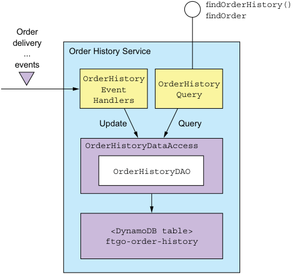


**----- Start of picture text -----**<br>
findOrderHistory()<br>findOrder<br>Order<br>delivery<br>... Order History Service<br>events<br>OrderHistory<br>OrderHistory<br>Event<br>Query<br>Handlers<br>Update Query<br>OrderHistoryDataAccess<br>OrderHistoryDAO<br><DynamoDB table><br>ftgo-order-history<br>**----- End of picture text -----**<br>


Figure 7.12 The design of **OrderHistoryService** . **OrderHistoryEventHandlers** updates the database in response to events. The **OrderHistoryQuery** module implements the query operations by querying the database. These two modules use the **OrderHistoryDataAccess** module to access the database. 

Let’s look at the design of the event handlers, the DAO, and the DynamoDB table in more detail. 

### 7.4.1 The OrderHistoryEventHandlers module

This module consists of the event handlers that consume events and update the DynamoDB table. As the following listing shows, the event handlers are simple methods. Each method is a one-liner that invokes an OrderHistoryDao method with arguments that are derived from the event. 


Listing 7.1 Event handlers that call the **OrderHistoryDao** 

```java
public class OrderHistoryEventHandlers { 
  private OrderHistoryDao orderHistoryDao; 

  public OrderHistoryEventHandlers(OrderHistoryDao orderHistoryDao) { 
    this.orderHistoryDao = orderHistoryDao; 
  } 

  public void handleOrderCreated(DomainEventEnvelope<OrderCreated> dee) { 
    orderHistoryDao.addOrder(makeOrder(dee.getAggregateId(), dee.getEvent()), makeSourceEvent(dee)); 
  } 

  private Order makeOrder(String orderId, OrderCreatedEvent event) { 
    ... 
  } 

  public void handleDeliveryPickedUp(DomainEventEnvelope<DeliveryPickedUp> dee) { 
    orderHistoryDao.notePickedUp(dee.getEvent().getOrderId(), makeSourceEvent(dee)); 
  } 
  ... 
}
```

Each event handler has a single parameter of type DomainEventEnvelope, which contains the event and some metadata describing the event. For example, the handleOrderCreated() method is invoked to handle an OrderCreated event. It calls orderHistoryDao.addOrder() to create an Order in the database. Similarly, the handleDeliveryPickedUp() method is invoked to handle a DeliveryPickedUp event. It calls orderHistoryDao.notePickedUp() to update the status of the Order in the database. 

Both methods call the helper method makeSourceEvent(), which constructs a SourceEvent containing the type and ID of the aggregate that emitted the event and the event ID. In the next section you’ll see that OrderHistoryDao uses SourceEvent to ensure that update operations are idempotent. 

Let’s now look at the design of the DynamoDB table and after that examine OrderHistoryDao. 

### 7.4.2 Data modeling and query design with DynamoDB

Like many NoSQL databases, DynamoDB has data access operations that are much less powerful than those that are provided by an RDBMS. Consequently, you must carefully design how the data is stored. In particular, the queries often dictate the design of the schema. We need to address several design issues: 

- Designing the ftgo-order-history table 

- Defining an index for the findOrderHistory query 


_**Implementing a CQRS view with AWS DynamoDB**_ 


- Implementing the findOrderHistory query 

- Paginating the query results 

- Updating orders 

- Detecting duplicate events 

We’ll look at each one in turn. 

**DESIGNING THE FTGO-ORDER-HISTORY TABLE**

The DynamoDB storage model consists of tables, which contain items, and indexes, which provide alternative ways to access a table’s items (discussed shortly). An _item_ is a collection of named attributes. An _attribute value_ is either a scalar value such as a string, a multivalued collection of strings, or a collection of named attributes. Although an item is the equivalent to a row in an RDBMS, it’s a lot more flexible and can store an entire aggregate. 

This flexibility enables the OrderHistoryDataAccess module to store each Order as a single item in a DynamoDB table called ftgo-order-history. Each field of the Order class is mapped to an item attribute, as shown in figure 7.13. Simple fields such as orderCreationTime and status are mapped to single-value item attributes. The lineItems field is mapped to an attribute that is a list of maps, one map per time line. It can be considered to be a JSON array of objects. 

**ftgo-order-history table**

|Primary key|Primary key||||||
|---|---|---|---|---|---|---|
|orderId||consumerId|orderCreationTime|status|lineItems|...|
||||22939283232|CREATED|[{...}.<br>{...},<br>....]|...|
|...|||||||
|...|...||...|...|....|...|


Figure 7.13 Preliminary structure of the DynamoDB **OrderHistory** table 

An important part of the definition of a table is its primary key. A DynamoDB application inserts, updates, and retrieves a table’s items by primary key. It would seem to make sense for the primary key to be orderId. This enables Order History Service to insert, update, and retrieve an order by orderId. But before finalizing this decision, let’s first explore how a table’s primary key impacts the kinds of data access operations it supports. 

**DEFINING AN INDEX FOR THE FINDORDERHISTORY QUERY**

This table definition supports primary key-based reads and writes of Orders. But it doesn’t support a query such as findOrderHistory() that returns multiple matching orders sorted by increasing age. That’s because, as you will see later in this section, this query uses the DynamoDB query() operation, which requires a table to have a 


composite primary key consisting of two scalar attributes. The first attribute is a partition key. The _partition key_ is so called because DynamoDB’s Z-axis scaling (described in chapter 1) uses it to select an item’s storage partition. The second attribute is the _sort_ key. A query() operation returns those items that have the specified partition key, have a sort key in the specified range, and match the optional filter expression. It returns items in the order specified by the sort key. 

The findOrderHistory() query operation returns a consumer’s orders sorted by increasing age. It therefore requires a primary key that has the consumerId as the partition key and the orderCreationDate as the sort key. But it doesn’t make sense for (consumerId, orderCreationDate) to be the primary key of the ftgo-order-history table, because it’s not unique. 

The solution is for findOrderHistory() to query what DynamoDB calls a _secondary index_ on the ftgo-order-history table. This index has (consumerId, orderCreationDate) as its non-unique key. Like an RDBMS index, a DynamoDB index is automatically updated whenever its table is updated. But unlike a typical RDBMS index, a DynamoDB index can have non-key attributes. _Non-key attributes_ improve performance because they’re returned by the query, so the application doesn’t have to fetch them from the table. Also, as you’ll soon see, they can be used for filtering. Figure 7.14 shows the structure of the table and this index. 

The index is part of the definition of the ftgo-order-history table and is called ftgo-order-history-by-consumer-id-and-creation-time. The index’s attributes ftgo-order-history-by-consumer-id-and-creation-time global secondary index 

|Primary key|Primary key|Primary key|Primary key|Primary key|Primary key|||||||
|---|---|---|---|---|---|---|---|---|---|---|---|
|consumerId||orderCreationTime||||orderId|status||...|||
|||||||cde-fgh|CREATED||...|||
|xyz-abc||22939283232||||||||||
|.|..|...||||...|...||...|||
|||||||||||||
||Primary key|||||||||||
||orderId|||consumerId|orderCreationTime|||status||lineItems|...|
||||||22939283232|||CREATED||[{...}.<br>{...},<br>....]|...|
||cde-fgh|||||||||||
||...||...||...|||...||....|...|


Figure 7.14 The design of the **OrderHistory** table and index 


_**Implementing a CQRS view with AWS DynamoDB**_
include the primary key attributes, consumerId and orderCreationTime, and non-key attributes, including orderId and status. 

The ftgo-order-history-by-consumer-id-and-creation-time index enables the OrderHistoryDaoDynamoDb to efficiently retrieve a consumer’s orders sorted by increasing age. 

Let’s now look at how to retrieve only those orders that match the filter criteria. 

**IMPLEMENTING THE FINDORDERHISTORY QUERY**

The findOrderHistory() query operation has a filter parameter that specifies the search criteria. One filter criterion is the maximum age of the orders to return. This is easy to implement because the DynamoDB Query operation’s _key condition expression_ supports a range restriction on the sort key. The other filter criteria correspond to non-key attributes and can be implemented using a _filter expression_ , which is a Boolean expression. A DynamoDB Query operation returns only those items that satisfy the filter expression. For example, to find Orders that are CANCELLED, the OrderHistoryDaoDynamoDb uses a query expression orderStatus = :orderStatus, where :orderStatus is a placeholder parameter. 

The keyword filter criteria is more challenging to implement. It selects orders whose restaurant name or menu items match one of the specified keywords. The OrderHistoryDaoDynamoDb enables the keyword search by tokenizing the restaurant name and menu items and storing the set of keywords in a set-valued attribute called keywords. It finds the orders that match the keywords by using a filter expression that uses the contains() function, for example contains(keywords, :keyword1) OR contains(keywords, :keyword2), where :keyword1 and :keyword2 are placeholders for the specified keywords. 

**PAGINATING THE QUERY RESULTS**

Some consumers will have a large number of orders. It makes sense, therefore, for the findOrderHistory() query operation to use pagination. The DynamoDB Query operation has an operation pageSize parameter, which specifies the maximum number of items to return. If there are more items, the result of the query has a non-null LastEvaluatedKey attribute. A DAO can retrieve the next page of items by invoking the query with the exclusiveStartKey parameter set to LastEvaluatedKey. 

As you can see, DynamoDB doesn’t support position-based pagination. Consequently, Order History Service returns an opaque pagination token to its client. The client uses this pagination token to request the next page of results. 

Now that I’ve described how to query DynamoDB for orders, let’s look at how to insert and update them. 

**UPDATING ORDERS**

DynamoDB supports two operations for adding and updating items: PutItem() and UpdateItem(). The PutItem() operation creates or replaces an entire item by its primary key. In theory, OrderHistoryDaoDynamoDb could use this operation to insert 


and update orders. One challenge, however, with using PutItem() is ensuring that simultaneous updates to the same item are handled correctly. 

Consider, for example, the scenario where two event handlers simultaneously attempt to update the same item. Each event handler calls OrderHistoryDaoDynamoDb to load the item from DynamoDB, change it in memory, and update it in DynamoDB using PutItem(). One event handler could potentially overwrite the change made by the other event handler. OrderHistoryDaoDynamoDb can prevent lost updates by using DynamoDB’s optimistic locking mechanism. But an even simpler and more efficient approach is to use the UpdateItem() operation. 

The UpdateItem() operation updates individual attributes of the item, creating the item if necessary. Since different event handlers update different attributes of the Order item, using UpdateItem makes sense. This operation is also more efficient because there’s no need to first retrieve the order from the table. 

One challenge with updating the database in response to events is, as mentioned earlier, detecting and discarding duplicate events. Let’s look at how to do that when using DynamoDB. 

**DETECTING DUPLICATE EVENTS**

All of Order History Service’s event handlers are idempotent. Each one sets one or more attributes of the Order item. Order History Service could, therefore, simply ignore the issue of duplicate events. The downside of ignoring the issue, though, is that Order item will sometimes be temporarily out-of-date. That’s because an event handler that receives a duplicate event will set an Order item’s attributes to previous values. The Order item won’t have the correct values until later events are redelivered. 

As described earlier, one way to prevent data from becoming out-of-date is to detect and discard duplicate events. OrderHistoryDaoDynamoDb can detect duplicate events by recording in each item the events that have caused it to be updated. It can then use the UpdateItem() operation’s conditional update mechanism to only update an item if an event isn’t a duplicate. 

A conditional update is only performed if a _condition expression_ is true. A _condition expression_ tests whether an attribute exists or has a particular value. The OrderHistoryDaoDynamoDb DAO can track events received from each aggregate instance using an attribute called «aggregateType»«aggregateId» whose value is the highest received event ID. An event is a duplicate if the attribute exists and its value is less than or equal to the event ID. The OrderHistoryDaoDynamoDb DAO uses this condition expression: attribute_not_exists(«aggregateType»«aggregateId») 

OR «aggregateType»«aggregateId» < :eventId 

The _condition expression_ only allows the update if the attribute doesn’t exist or the eventId is greater than the last processed event ID. 


_**Implementing a CQRS view with AWS DynamoDB**_ 


For example, suppose an event handler receives a DeliveryPickup event whose ID is 123323-343434 from a Delivery aggregate whose ID is 3949384394-039434903. The name of the tracking attribute is Delivery3949384394-039434903. The event handler should consider the event to be a duplicate if the value of this attribute is greater than or equal to 123323-343434. The query() operation invoked by the event handler updates the Order item using this condition expression: attribute_not_exists(Delivery3949384394-039434903) OR Delivery3949384394-039434903 < :eventId 

Now that I’ve described the DynamoDB data model and query design, let’s take a look at OrderHistoryDaoDynamoDb, which defines the methods that update and query the ftgo-order-history table. 

### 7.4.3 The OrderHistoryDaoDynamoDb class

The OrderHistoryDaoDynamoDb class implements methods that read and write items in the ftgo-order-history table. Its update methods are invoked by OrderHistoryEventHandlers, and its query methods are invoked by OrderHistoryQuery API. Let’s take a look at some example methods, starting with the addOrder() method. 

**THE ADDORDER() METHOD**

The addOrder() method, which is shown in listing 7.2, adds an order to the ftgoorder-history table. It has two parameters: order and sourceEvent. The order parameter is the Order to add, which is obtained from the OrderCreated event. The sourceEvent parameter contains the eventId and the type and ID of the aggregate that emitted the event. It’s used to implement the conditional update. 

Listing 7.2 The **addOrder()** method adds or updates an **Order** 

```java
public class OrderHistoryDaoDynamoDb ... { 
  @Override 
  public boolean addOrder(Order order, Optional<SourceEvent> eventSource) { 
    UpdateItemSpec spec = new UpdateItemSpec() 
      .withPrimaryKey("orderId", order.getOrderId()) 
      .withUpdateExpression("SET orderStatus = :orderStatus, " + 
                            "creationDate = :cd, lineItems = :lineItems, " + 
                            "keywords = :keywords, consumerId = :consumerId, " + 
                            "restaurantName = :restaurantName") 
      .withValueMap(new Maps() 
        .add(":orderStatus", order.getStatus().toString()) 
        .add(":cd", order.getCreationDate().getMillis()) 
        .add(":consumerId", order.getConsumerId()) 
        .add(":lineItems", mapLineItems(order.getLineItems())) 
        .add(":keywords", mapKeywords(order)) 
        .add(":restaurantName", order.getRestaurantName()) 
        .map()) 
      .withReturnValues(ReturnValue.NONE); 
    return idempotentUpdate(spec, eventSource); 
  } 
}
```


The addOrder() method creates an UpdateSpec, which is part of the AWS SDK and describes the update operation. After creating the UpdateSpec, it calls idempotentUpdate(), a helper method that performs the update after adding a condition expression that guards against duplicate updates. 

**THE NOTEPICKEDUP() METHOD**

The notePickedUp() method, shown in listing 7.3, is called by the event handler for the DeliveryPickedUp event. It changes the deliveryStatus of the Order item to PICKED_UP. 

Listing 7.3 The **notePickedUp()** method changes the order status to **PICKED_UP** 

```java
public class OrderHistoryDaoDynamoDb ... { 
  @Override 
  public void notePickedUp(String orderId, Optional<SourceEvent> eventSource) { 
    UpdateItemSpec spec = new UpdateItemSpec() 
      .withPrimaryKey("orderId", orderId) 
      .withUpdateExpression("SET #deliveryStatus = :deliveryStatus") 
      .withNameMap(Collections.singletonMap("#deliveryStatus", DELIVERY_STATUS_FIELD)) 
      .withValueMap(Collections.singletonMap(":deliveryStatus", DeliveryStatus.PICKED_UP.toString())) 
      .withReturnValues(ReturnValue.NONE); 
    idempotentUpdate(spec, eventSource); 
  } 
}
```

This method is similar to addOrder(). It creates an UpdateItemSpec and invokes idempotentUpdate(). Let’s look at the idempotentUpdate() method. 

**THE IDEMPOTENTUPDATE() METHOD**

The following listing shows the idempotentUpdate() method, which updates the item after possibly adding a condition expression to the UpdateItemSpec that guards against duplicate updates. 

Listing 7.4 The **idempotentUpdate()** method ignores duplicate events 

```java
public class OrderHistoryDaoDynamoDb ... { 
  private boolean idempotentUpdate(UpdateItemSpec spec, Optional<SourceEvent> eventSource) { 
    try { 
      table.updateItem(eventSource.map(es -> es.addDuplicateDetection(spec)) 
        .orElse(spec)); 
      return true; 
    } catch (ConditionalCheckFailedException e) { 
      // Do nothing 
      return false; 
    } 
  } 
}
```


_**Implementing a CQRS view with AWS DynamoDB**_ 


If the sourceEvent is supplied, idempotentUpdate() invokes SourceEvent.addDuplicateDetection() to add to UpdateItemSpec the condition expression that was described earlier. The idempotentUpdate() method catches and ignores the ConditionalCheckFailedException, which is thrown by updateItem() if the event was a duplicate. 

Now that we’ve seen the code that updates the table, let’s look at the query method. 

**THE FINDORDERHISTORY() METHOD**

The findOrderHistory() method, shown in listing 7.5, retrieves the consumer’s orders by querying the ftgo-order-history table using the ftgo-order-history-by-consumerid-and-creation-time secondary index. It has two parameters: consumerId specifies the consumer, and filter specifies the search criteria. This method creates QuerySpec—which, like UpdateSpec, is part of the AWS SDK—from its parameters, queries the index, and transforms the returned items into an OrderHistory object. 

Listing 7.5 The **findOrderHistory()** method retrieves a consumer’s matching orders 

```java
public class OrderHistoryDaoDynamoDb ... { 
  @Override 
  public OrderHistory findOrderHistory(String consumerId, OrderHistoryFilter filter) { 
    QuerySpec spec = new QuerySpec() 
      .withScanIndexForward(false) 
      .withHashKey("consumerId", consumerId) 
      .withRangeKeyCondition(new RangeKeyCondition("creationDate") 
        .gt(filter.getSince().getMillis())); 

    filter.getStartKeyToken().ifPresent(token -> spec.withExclusiveStartKey(toStartingPrimaryKey(token))); 

    Map<String, Object> valuesMap = new HashMap<>(); 
    String filterExpression = Expressions.and( 
      keywordFilterExpression(valuesMap, filter.getKeywords()), 
      statusFilterExpression(valuesMap, filter.getStatus())); 

    if (!valuesMap.isEmpty()) 
      spec.withValueMap(valuesMap); 

    if (StringUtils.isNotBlank(filterExpression)) { 
      spec.withFilterExpression(filterExpression); 
    } 

    filter.getPageSize().ifPresent(spec::withMaxResultSize); 

    ItemCollection<QueryOutcome> result = index.query(spec); 

    return new OrderHistory( 
      StreamSupport.stream(result.spliterator(), false) 
        .map(this::toOrder) 
        .collect(toList()), 
      Optional.ofNullable(result.getLastLowLevelResult().getQueryResult().getLastEvaluatedKey()) 
        .map(this::toStartKeyToken)); 
  } 
}
```

After building a QuerySpec, this method then executes a query and builds an OrderHistory, which contains the list of Orders, from the returned items. 

The findOrderHistory() method implements pagination by serializing the value returned by getLastEvaluatedKey() into a JSON token. If a client specifies a start token in OrderHistoryFilter, then findOrderHistory() serializes it and invokes withExclusiveStartKey() to set the start key. 

As you can see, you must address numerous issues when implementing a CQRS view, including picking a database, designing the data model that efficiently implements updates and queries, handling concurrent updates, and dealing with duplicate events. The only complex part of the code is the DAO, because it must properly handle concurrency and ensure that updates are idempotent. 

## Summary

- Implementing queries that retrieve data from multiple services is challenging because each service’s data is private. 

- There are two ways to implement these kinds of query: the API composition pattern and the Command query responsibility segregation (CQRS) pattern. 

- The API composition pattern, which gathers data from multiple services, is the simplest way to implement queries and should be used whenever possible. 

- A limitation of the API composition pattern is that some complex queries require inefficient in-memory joins of large datasets. 

- The CQRS pattern, which implements queries using view databases, is more powerful but more complex to implement. 

- A CQRS view module must handle concurrent updates as well as detect and discard duplicate events. 

- CQRS improves separation of concerns by enabling a service to implement a query that returns data owned by a different service. 

- Clients must handle the eventual consistency of CQRS views. 


