# 8 External API patterns

**This chapter covers**

- The challenge of designing APIs that support a diverse set of clients 

- Applying API gateway and Backends for frontends patterns 

- Designing and implementing an API gateway 

- Using reactive programming to simplify API composition 

- Implementing an API gateway using GraphQL 

The FTGO application, like many other applications, has a REST API. Its clients include the FTGO mobile applications, JavaScript running in the browser, and applications developed by partners. In such a monolithic architecture, the API that’s exposed to clients is the monolith’s API. But when once the FTGO team starts deploying microservices, there’s no longer one API, because each service has its own API. Mary and her team must decide what kind of API the FTGO application should now expose to its clients. For example, should clients be aware of the existence of services and make requests to them directly? 

The task of designing an application’s external API is made even more challenging by the diversity of its clients. Different clients typically require different data. A desktop browser-based UI usually displays far more information than a mobile application. Also, different clients access the services over different kinds of networks. The clients within the firewall use a high-performance LAN, and the clients outside of the firewall use the internet or mobile network, which will have lower performance. Consequently, as you’ll learn, it often doesn’t make sense to have a single, one-size-fits-all API. 

This chapter begins by describing various external API design issues. I then describe the external API patterns. I cover the API gateway pattern and then the Backends for frontends pattern. After that, I discuss how to design and implement an API gateway. I review the various options that are available, which include off-the-shelf API gateway products and frameworks for developing your own. I describe the design and implementation of an API gateway that’s built using the Spring Cloud Gateway framework. I also describe how to build an API gateway using GraphQL, a framework that provides graph-based query language. 

## 8.1 External API design issues

In order to explore the various API-related issues, let’s consider the FTGO application. As figure 8.1 shows, this application’s services are consumed by a variety of clients. Four kinds of clients consume the services’ APIs: 

- Web applications, such as Consumer web application, which implements the browser-based UI for consumers, Restaurant web application, which implements the browser-based UI for restaurants, and Admin web application, which implements the internal administrator UI 

- JavaScript applications running in the browser 

- Mobile applications, one for consumers and the other for couriers 

- Applications written by third-party developers 

The web applications run inside the firewall, so they access the services over a highbandwidth, low-latency LAN. The other clients run outside the firewall, so they access the services over the lower-bandwidth, higher-latency internet or mobile network. 

One approach to API design is for clients to invoke the services directly. On the surface, this sounds quite straightforward—after all, that’s how clients invoke the API of a monolithic application. But this approach is rarely used in a microservice architecture because of the following drawbacks: 

- The fine-grained service APIs require clients to make multiple requests to retrieve the data they need, which is inefficient and can result in a poor user experience. 

- The lack of encapsulation caused by clients knowing about each service and its API makes it difficult to change the architecture and the APIs. 

- Services might use IPC mechanisms that aren’t convenient or practical for clients to use, especially those clients outside the firewall. 

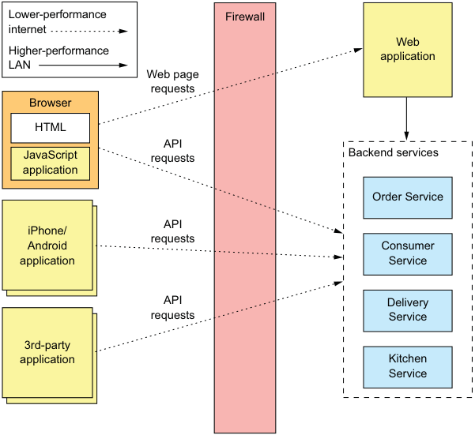

**----- Start of picture text -----**<br>
Lower-performance Firewall<br>internet<br>Web<br>Higher-performance<br>application<br>LAN<br>Web page<br>requests<br>Browser<br>HTML<br>API<br>JavaScript requests Backend services<br>application<br>Order Service<br>API<br>iPhone/<br>Android requests Consumer<br>application Service<br>API Delivery<br>requests Service<br>3rd-party<br>application Kitchen<br>Service<br>**----- End of picture text -----**<br>

Figure 8.1 The FTGO application’s services and their clients. There are several different types of clients. Some are inside the firewall, and others are outside. Those outside the firewall access the services over the lower-performance internet/mobile network. Those clients inside the firewall use a higherperformance LAN. 

To learn more about these drawbacks, let’s take a look at how the FTGO mobile application for consumers retrieves data from the services. 

### 8.1.1 API design issues for the FTGO mobile client

Consumers use the FTGO mobile client to place and manage their orders. Imagine you’re developing the mobile client’s View Order view, which displays an order. As described in chapter 7, the information displayed by this view includes basic order information, including its status, payment status, status of the order from the restaurant’s perspective, and delivery status, including its location and estimated delivery time if in transit. 

The monolithic version of the FTGO application has an API endpoint that returns the order details. The mobile client retrieves the information it needs by making a single request. In contrast, in the microservices version of the FTGO application, the order details are, as described previously, scattered across several services, including the following: 

- Order Service—Basic order information, including the details and status 

- Kitchen Service—The status of the order from the restaurant’s perspective and the estimated time it will be ready for pickup 

- Delivery Service—The order’s delivery status, its estimated delivery time, and its current location 

- Accounting Service—The order’s payment status 

If the mobile client invokes the services directly, then it must, as figure 8.2 shows, make multiple calls to retrieve this data. 

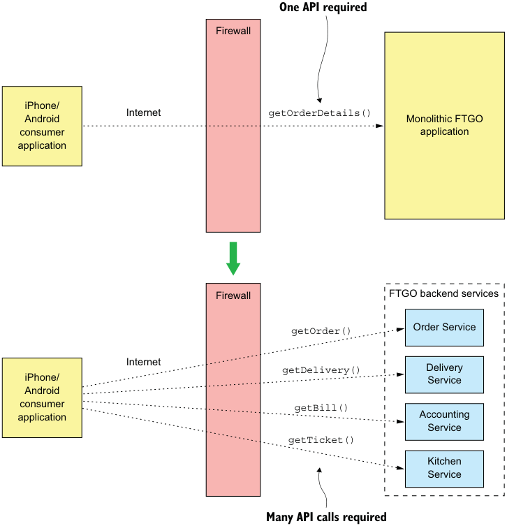

**----- Start of picture text -----**<br>
One API required<br>Firewall<br>iPhone/<br>Android Internet getOrderDetails() Monolithic FTGO<br>consumer application<br>application<br>Firewall FTGO backend services<br>Order Service<br>getOrder()<br>Internet<br>getDelivery() Delivery<br>iPhone/ Service<br>Android<br>consumer getBill()<br>application Accounting<br>Service<br>getTicket()<br>Kitchen<br>Service<br>Many API calls required<br>**----- End of picture text -----**<br>

Figure 8.2 A client can retrieve the order details from the monolithic FTGO application with a single request. But the client must make multiple requests to retrieve the same information in a microservice architecture. 

In this design, the mobile application is playing the role of API composer. It invokes multiple services and combines the results. Although this approach seems reasonable, it has several serious problems. 

**POOR USER EXPERIENCE DUE TO THE CLIENT MAKING MULTIPLE REQUESTS**

The first problem is that the mobile application must sometimes make multiple requests to retrieve the data it wants to display to the user. The chatty interaction between the application and the services can make the application seem unresponsive, especially when it uses the internet or a mobile network. The internet has much lower bandwidth and higher latency than a LAN, and mobile networks are even worse. The latency of a mobile network (and internet) is typically 100x greater than a LAN. 

The higher latency might not be a problem when retrieving the order details, because the mobile application minimizes the delay by executing the requests concurrently. The overall response time is no greater than that of a single request. But in other scenarios, a client may need to execute requests sequentially, which will result in a poor user experience. 

What’s more, poor user experience due to network latency is not the only issue with a chatty API. It requires the mobile developer to write potentially complex API composition code. This work is a distraction from their primary task of creating a great user experience. Also, because each network request consumes power, a chatty API drains the mobile device’s battery faster. 

**LACK OF ENCAPSULATION REQUIRES FRONTEND DEVELOPERS TO CHANGE THEIR CODE IN LOCKSTEP WITH THE BACKEND**

Another drawback of a mobile application directly accessing the services is the lack of encapsulation. As an application evolves, the developers of a service sometimes change an API in a way that breaks existing clients. They might even change how the system is decomposed into services. Developers may add new services and split or merge existing services. But if knowledge about the services is baked into a mobile application, it can be difficult to change the services’ APIs. 

Unlike when updating a server-side application, it takes hours or perhaps even days to roll out a new version of a mobile application. Apple or Google must approve the upgrade and make it available for download. Users might not download the upgrade immediately—if ever. And you may not want to force reluctant users to upgrade. The strategy of exposing service APIs to mobile creates a significant obstacle to evolving those APIs. 

**SERVICES MIGHT USE CLIENT-UNFRIENDLY IPC MECHANISMS**

Another challenge with a mobile application directly calling services is that some services could use protocols that aren’t easily consumed by a client. Client applications that run outside the firewall typically use protocols such as HTTP and WebSockets. But as described in chapter 3, service developers have many protocols to choose from—not just HTTP. Some of an application’s services might use gRPC, whereas others could use the AMQP messaging protocol. These kinds of protocols work well internally, but might not be easily consumed by a mobile client. Some aren’t even firewall friendly. 

### 8.1.2 API design issues for other kinds of clients

I picked the mobile client because it’s a great way to demonstrate the drawbacks of clients accessing services directly. But the problems created by exposing services to clients aren’t specific to just mobile clients. Other kinds of clients, especially those outside the firewall, also encounter these problems. As described earlier, the FTGO application’s services are consumed by web applications, browser-based JavaScript applications, and third-party applications. Let’s take a look at the API design issues with these clients. 

**API DESIGN ISSUES FOR WEB APPLICATIONS**

Traditional server-side web applications, which handle HTTP requests from browsers and return HTML pages, run within the firewall and access the services over a LAN. Network bandwidth and latency aren’t obstacles to implementing API composition in a web application. Also, web applications can use non-web-friendly protocols to access the services. The teams that develop web applications are part of the same organization and often work in close collaboration with the teams writing the backend services, so a web application can easily be updated whenever the backend services are changed. Consequently, it’s feasible for a web application to access the backend services directly. 

API DESIGN ISSUES FOR BROWSER-BASED JAVASCRIPT APPLICATIONS 

Modern browser applications use some amount of JavaScript. Even if the HTML is primarily generated by a server-side web application, it’s common for JavaScript running in the browser to invoke services. For example, all of the FTGO application web applications—Consumer, Restaurant, and Admin—contain JavaScript that invokes the backend services. The Consumer web application, for instance, dynamically refreshes the Order Details page using JavaScript that invokes the service APIs. 

On one hand, browser-based JavaScript applications are easy to update when service APIs change. On the other hand, JavaScript applications that access the services over the internet have the same problems with network latency as mobile applications. To make matters worse, browser-based UIs, especially those for the desktop, are usually more sophisticated and need to compose more services than mobile applications. It’s likely that the Consumer and Restaurant applications, which access services over the internet, won’t be able to compose service APIs efficiently. 

**DESIGNING APIS FOR THIRD-PARTY APPLICATIONS**

FTGO, like many other organizations, exposes an API to third-party developers. The developers can use the FTGO API to write applications that place and manage orders. These third-party applications access the APIs over the internet, so API composition is likely to be inefficient. But the inefficiency of API composition is a relatively minor problem compared to the much larger challenge of designing an API 

that’s used by third-party applications. That’s because third-party developers need an API that’s stable. 

Very few organizations can force third-party developers to upgrade to a new API. Organizations that have an unstable API risk losing developers to a competitor. Consequently, you must carefully manage the evolution of an API that’s used by thirdparty developers. You typically have to maintain older versions for a long time—possibly forever. 

This requirement is a huge burden for an organization. It’s impractical to make the developers of the backend services responsible for maintaining long-term backward compatibility. Rather than expose services directly to third-party developers, organizations should have a separate public API that’s developed by a separate team. As you’ll learn later, the public API is implemented by an architectural component known as an _API gateway_ . Let’s look at how an API gateway works. 

## 8.2 The API gateway pattern

As you’ve just seen, there are numerous drawbacks with services accessing services directly. It’s often not practical for a client to perform API composition over the internet. The lack of encapsulation makes it difficult for developers to change service decomposition and APIs. Services sometimes use communication protocols that aren’t suitable outside the firewall. Consequently, a much better approach is to use an API gateway. 

**Pattern: API gateway**

Implement a service that’s the entry point into the microservices-based application from external API clients. See http://microservices.io/patterns/apigateway.html. 

An _API gateway_ is a service that’s the entry point into the application from the outside world. It’s responsible for request routing, API composition, and other functions, such as authentication. This section covers the API gateway pattern. I discuss its benefits and drawbacks and describe various design issues you must address when developing an API gateway. 

### 8.2.1 Overview of the API gateway pattern

Section 8.1.1 described the drawbacks of clients, such as the FTGO mobile application, making multiple requests in order to display information to the user. A much better approach is for a client to make a single request to an API gateway, a service that serves as the single entry point for API requests into an application from outside the firewall. It’s similar to the Facade pattern from object-oriented design. Like a facade, an API gateway encapsulates the application’s internal architecture and provides an API to its clients. It may also have other responsibilities, such as authentication, monitoring, and rate limiting. Figure 8.3 shows the relationship between the clients, the API gateway, and the services. 

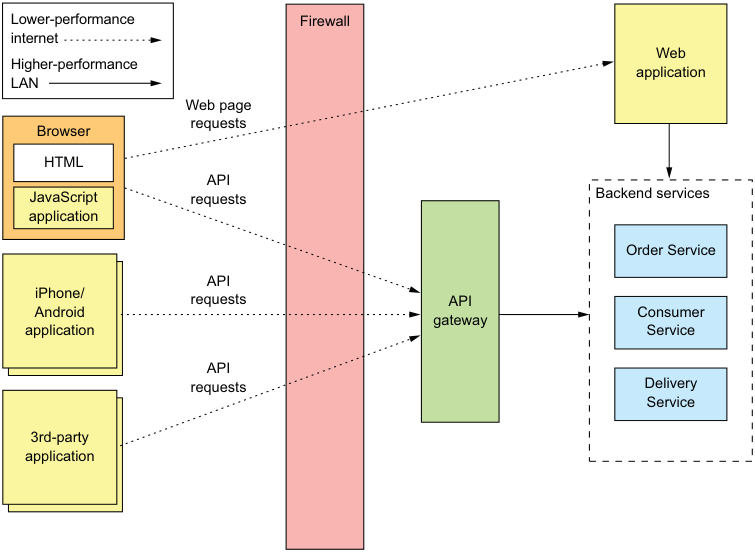

**----- Start of picture text -----**<br>
Lower-performance Firewall<br>internet<br>Web<br>Higher-performance<br>application<br>LAN<br>Web page<br>Browser requests<br>HTML<br>API<br>JavaScript requests Backend services<br>application<br>Order Service<br>API<br>iPhone/<br>requests API<br>Android Consumer<br>gateway<br>application Service<br>API<br>requests Delivery<br>Service<br>3rd-party<br>application<br>**----- End of picture text -----**<br>

Figure 8.3 The API gateway is the single entry point into the application for API calls from outside the firewall. 

The API gateway is responsible for request routing, API composition, and protocol translation. All API requests from _external_ clients first go to the API gateway, which routes some requests to the appropriate service. The API gateway handles other requests using the API composition pattern and by invoking multiple services and aggregating the results. It may also translate between client-friendly protocols such as HTTP and WebSockets and client-unfriendly protocols used by the services. 

**REQUEST ROUTING**

One of the key functions of an API gateway is _request routing_ . An API gateway implements some API operations by routing requests to the corresponding service. When it receives a request, the API gateway consults a routing map that specifies which service to route the request to. A routing map might, for example, map an HTTP method and path to the HTTP URL of a service. This function is identical to the reverse proxying features provided by web servers such as NGINX. 

**API COMPOSITION**

An API gateway typically does more than simply reverse proxying. It might also implement some API operations using API composition. The FTGO API gateway, for example, implements the Get Order Details API operation using API composition. As figure 8.4 shows, the mobile application makes one request to the API gateway, which fetches the order details from multiple services. 

The FTGO API gateway provides a coarse-grained API that enables mobile clients to retrieve the data they need with a single request. For example, the mobile client makes a single getOrderDetails() request to the API gateway. 

**Many API calls required**

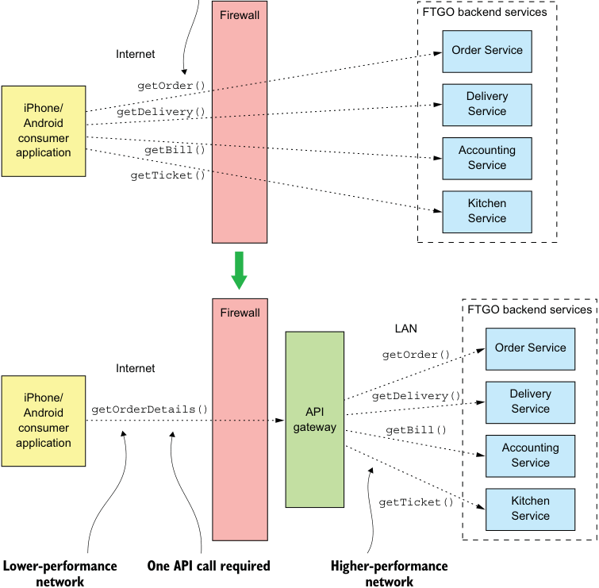

**----- Start of picture text -----**<br>
Firewall FTGO backend services<br>Internet Order Service<br>getOrder()<br>Delivery<br>iPhone/ getDelivery() Service<br>Android<br>consumer<br>application getBill() Accounting<br>Service<br>getTicket()<br>Kitchen<br>Service<br>Firewall FTGO backend services<br>LAN<br>Order Service<br>getOrder()<br>Internet<br>iPhone/ getDelivery() Delivery<br>Android getOrderDetails() API Service<br>consumer gateway getBill()<br>application Accounting<br>Service<br>getTicket() Kitchen<br>Service<br>Lower-performance One API call required Higher-performance<br>network network<br>**----- End of picture text -----**<br>

Figure 8.4 An API gateway often does API composition, which enables a client such as a mobile device to efficiently retrieve data using a single API request. 

**PROTOCOL TRANSLATION**

An API gateway might also perform protocol translation. It might provide a RESTful API to external clients, even though the application services use a mixture of protocols internally, including REST and gRPC. When needed, the implementation of some API operations translates between the RESTful external API and the internal gRPCbased APIs. 

**THE API GATEWAY PROVIDES EACH CLIENT WITH CLIENT-SPECIFIC API**

An API gateway could provide a single one-size-fits-all (OSFA) API. The problem with a single API is that different clients often have different requirements. For instance, a third-party application might require the Get Order Details API operation to return the complete Order details, whereas a mobile client only needs a subset of the data. One way to solve this problem is to give clients the option of specifying in a request which fields and related objects the server should return. This approach is adequate for a public API that must serve a broad range of third-party applications, but it often doesn’t give clients the control they need. 

A better approach is for the API gateway to provide each client with its own API. For example, the FTGO API gateway can provide the FTGO mobile client with an API that’s specifically designed to meet its requirements. It may even have different APIs for the Android and iPhone mobile applications. The API gateway will also implement a public API for third-party developers to use. Later on, I’ll describe the Backends for frontends pattern that takes this concept of an API-per-client even further by defining a separate API gateway for each client. 

**IMPLEMENTING EDGE FUNCTIONS**

Although an API gateway’s primary responsibilities are API routing and composition, it may also implement what are known as edge functions. An _edge function_ is, as the name suggests, a request-processing function implemented at the edge of an application. Examples of edge functions that an application might implement include the following: 

- _Authentication_ —Verifying the identity of the client making the request. 

- _Authorization_ —Verifying that the client is authorized to perform that particular operation. 

- _Rate limiting_ —Limiting how many requests per second from either a specific client and/or from all clients. 

- _Caching_ —Cache responses to reduce the number of requests made to the services. 

- _Metrics collection_ —Collect metrics on API usage for billing analytics purposes. 

- _Request logging_ —Log requests. 

There are three different places in your application where you could implement these edge functions. First, you can implement them in the backend services. This might make sense for some functions, such as caching, metrics collection, and possibly authorization. But it’s generally more secure if the application authenticates requests on the edge before they reach the services. 

The second option is to implement these edge functions in an edge service that’s upstream from the API gateway. The edge service is the first point of contact for an external client. It authenticates the request and performs other edge processing before passing it to the API gateway. 

An important benefit of using a dedicated edge service is that it separates concerns. The API gateway focuses on API routing and composition. Another benefit is that it centralizes responsibility for critical edge functions such as authentication. That’s particularly valuable when an application has multiple API gateways that are possibly written using a variety of languages and frameworks. I’ll talk more about that later. The drawback of this approach is that it increases network latency because of the extra hop. It also adds to the complexity of the application. 

As a result, it’s often convenient to use the third option and implement these edge functions, especially authorization, in the API gateway itself. There’s one less network hop, which improves latency. There are also fewer moving parts, which reduces complexity. Chapter 11 describes how the API gateway and the services collaborate to implement security. 

**API GATEWAY ARCHITECTURE**

An API gateway has a layered, modular architecture. Its architecture, shown in figure 8.5, consists of two layers: the API layer and a common layer. The API layer consists of one or more independent API modules. Each API module implements an API for a 

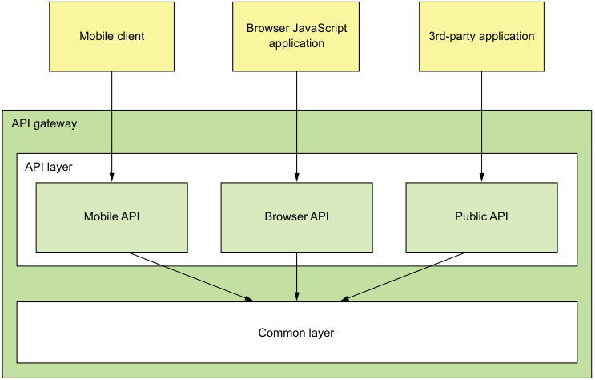

**----- Start of picture text -----**<br>
Browser JavaScript<br>Mobile client 3rd-party application<br>application<br>API gateway<br>API layer<br>Mobile API Browser API Public API<br>Common layer<br>**----- End of picture text -----**<br>

Figure 8.5 An API gateway has a layered modular architecture. The API for each client is implemented by a separate module. The common layer implements functionality common to all APIs, such as authentication. 

particular client. The common layer implements shared functionality, including edge functions such as authentication. 

In this example, the API gateway has three API modules: 

- _Mobile API_ —Implements the API for the FTGO mobile client 

- _Browser API_ —Implements the API for the JavaScript application running in the browser 

- _Public API_ —Implements the API for third-party developers 

An API module implements each API operation in one of two ways. Some API operations map directly to single service API operation. An API module implements these operations by routing requests to the corresponding service API operation. It might route requests using a generic routing module that reads a configuration file describing the routing rules. 

An API module implements other, more complex API operations using API composition. The implementation of this API operation consists of custom code. Each API operation implementation handles requests by invoking multiple services and combining the results. 

**API GATEWAY OWNERSHIP MODEL**

An important question that you must answer is who is responsible for the development of the API gateway and its operation? There are a few different options. One is for a separate team to be responsible for the API gateway. The drawback to that is that it’s similar to SOA, where an Enterprise Service Bus (ESB) team was responsible for all ESB development. If a developer working on the mobile application needs access to a particular service, they must submit a request to the API gateway team and wait for them to expose the API. This kind of centralized bottleneck in the organization is very much counter to the philosophy of the microservice architecture, which promotes loosely coupled autonomous teams. 

A better approach, which has been promoted by Netflix, is for the client teams— the mobile, web, and public API teams—to own the API module that exposes their API. An API gateway team is responsible for developing the Common module and for the operational aspects of the gateway. This ownership model, shown in figure 8.6, gives the teams control over their APIs. 

When a team needs to change their API, they check in the changes to the source repository for the API gateway. To work well, the API gateway’s deployment pipeline must be fully automated. Otherwise, the client teams will often be blocked waiting for the API gateway team to deploy the new version. 

**USING THE BACKENDS FOR FRONTENDS PATTERN**

One concern with an API gateway is that responsibility for it is blurred. Multiple teams contribute to the same code base. An API gateway team is responsible for its operation. Though not as bad as a SOA ESB, this blurring of responsibilities is counter to the microservice architecture philosophy of “if you build it, you own it.” 

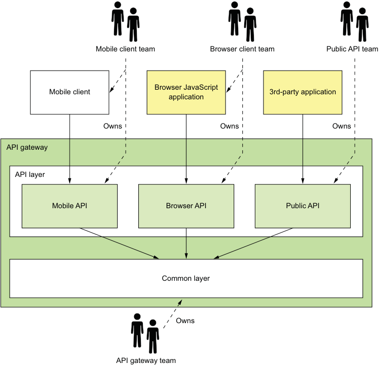

**----- Start of picture text -----**<br>
Mobile client team Browser client team Public API team<br>Browser JavaScript<br>Mobile client 3rd-party application<br>application<br>Owns Owns Owns<br>API gateway<br>API layer<br>Mobile API Browser API Public API<br>Common layer<br>Owns<br>API gateway team<br>**----- End of picture text -----**<br>

Figure 8.6 A client team owns their API module. As they change the client, they can change the API module and not ask the API gateway team to make the changes. 

The solution is to have an API gateway for each client, the so-called Backends for frontends (BFF) pattern, which was pioneered by Phil Calçado (http://philcalcado.com/) and his colleagues at SoundCloud. As figure 8.7 shows, each API module becomes its own standalone API gateway that’s developed and operated by a single client team. 

**Pattern: Backends for frontends**

Implement a separate API gateway for each type of client. See http://microservices .io/patterns/apigateway.html. 

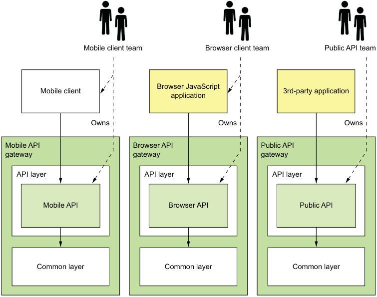

**----- Start of picture text -----**<br>
Mobile client team Browser client team Public API team<br>Browser JavaScript<br>Mobile client 3rd-party application<br>application<br>Owns Owns Owns<br>Mobile API Browser API Public API<br>gateway gateway gateway<br>API layer API layer API layer<br>Mobile API Browser API Public API<br>Common layer Common layer Common layer<br>**----- End of picture text -----**<br>

Figure 8.7 The Backends for frontends pattern defines a separate API gateway for each client. Each client team owns their API gateway. An API gateway team owns the common layer. 

The public API team owns and operates their API gateway, the mobile team owns and operates theirs, and so on. In theory, different API gateways could be developed using different technology stacks. But that risks duplicating code for common functionality, such as the code that implements edge functions. Ideally, all API gateways use the same technology stack. The common functionality is a shared library implemented by the API gateway team. 

Besides clearly defining responsibilities, the BFF pattern has other benefits. The API modules are isolated from one another, which improves reliability. One misbehaving API can’t easily impact other APIs. It also improves observability, because different API modules are different processes. Another benefit of the BFF pattern is that each API is independently scalable. The BFF pattern also reduces startup time because each API gateway is a smaller, simpler application. 

### 8.2.2 Benefits and drawbacks of an API gateway

As you might expect, the API gateway pattern has both benefits and drawbacks. 

**BENEFITS OF AN API GATEWAY**

A major benefit of using an API gateway is that it encapsulates internal structure of the application. Rather than having to invoke specific services, clients talk to the gateway. The API gateway provides each client with a client-specific API, which reduces the number of round-trips between the client and application. It also simplifies the client code. 

**DRAWBACKS OF AN API GATEWAY**

The API gateway pattern also has some drawbacks. It is yet another highly available component that must be developed, deployed, and managed. There’s also a risk that the API gateway becomes a development bottleneck. Developers must update the API gateway in order to expose their services’s API. It’s important that the process for updating the API gateway be as lightweight as possible. Otherwise, developers will be forced to wait in line in order to update the gateway. Despite these drawbacks, though, for most real-world applications, it makes sense to use an API gateway. If necessary, you can use the Backends for frontends pattern to enable the teams to develop and deploy their APIs independently. 

### 8.2.3 Netflix as an example of an API gateway

A great example of an API gateway is the Netflix API. The Netflix streaming service is available on hundreds of different kinds of devices including televisions, Blu-ray players, smartphones, and many more gadgets. Initially, Netflix attempted to have a one-size-fits-all style API for its streaming service (www.programmableweb.com/news/ why-rest-keeps-me-night/2012/05/15). But the company soon discovered that didn’t work well because of the diverse range of devices and their different needs. Today, Netflix uses an API gateway that implements a separate API for each device. The client device team develops and owns the API implementation. 

In the first version of the API gateway, each client team implemented their API using Groovy scripts that perform routing and API composition. Each script invoked one or more service APIs using Java client libraries provided by the service teams. On one hand, this works well, and client developers have written thousands of scripts. The Netflix API gateway handles billions of requests per day, and on average each API call fans out to six or seven backend services. On the other hand, Netflix has found this monolithic architecture to be somewhat cumbersome. 

As a result, Netflix is now moving to an API gateway architecture similar to the Backends for frontends pattern. In this new architecture, client teams write API modules using NodeJS. Each API module runs its own Docker container, but the scripts don’t invoke the services directly. Rather, they invoke a second “API gateway,” which exposes the service APIs using Netflix Falcor. _Netflix Falcor_ is an API technology that does declarative, dynamic API composition and enables a client to invoke multiple services using a single request. This new architecture has a number of benefits. The API modules are isolated from one another, which improves reliability and observability, and the client API module is independently scalable. 

### 8.2.4 API gateway design issues

Now that we’ve looked at the API gateway pattern and its benefits and drawbacks, let’s examine various API gateway design issues. There are several issues to consider when designing an API gateway: 

- Performance and scalability 

- Writing maintainable code by using reactive programming abstractions 

- Handling partial failure 

- Being a good citizen in the application’s architecture 

We’ll look at each one. 

**PERFORMANCE AND SCALABILITY**

An API gateway is the application’s front door. All external requests must first pass through the gateway. Although most companies don’t operate at the scale of Netflix, which handles billions of requests per day, the performance and scalability of the API gateway is usually very important. A key design decision that affects performance and scalability is whether the API gateway should use synchronous or asynchronous I/O. 

In the _synchronous_ I/O model , each network connection is handled by a dedicated thread. This is a simple programming model and works reasonably well. For example, it’s the basis of the widely used Java EE servlet framework, although this framework provides the option of completing a request asynchronously. One limitation of synchronous I/O, however, is that operating system threads are heavyweight, so there is a limit on the number of threads, and hence concurrent connections, that an API gateway can have. 

The other approach is to use the _asynchronous_ (nonblocking) I/O model . In this model, a single event loop thread dispatches I/O requests to event handlers. You have a variety of asynchronous I/O technologies to choose from. On the JVM you can use one of the NIO-based frameworks such as Netty, Vertx, Spring Reactor, or JBoss Undertow. One popular non-JVM option is NodeJS, a platform built on Chrome’s JavaScript engine. 

Nonblocking I/O is much more scalable because it doesn’t have the overhead of using multiple threads. The drawback, though, is that the asynchronous, callbackbased programming model is much more complex. The code is more difficult to write, understand, and debug. Event handlers must return quickly to avoid blocking the event loop thread. 

Also, whether using nonblocking I/O has a meaningful overall benefit depends on the characteristics of the API gateway’s request-processing logic. Netflix had mixed results when it rewrote Zuul, its edge server, to use NIO (see https://medium.com/netflixtechblog/zuul-2-the-netflix-journey-to-asynchronous-non-blocking-systems-45947377fb5c). 

On one hand, as you would expect, using NIO reduced the cost of each network connection, due to the fact that there’s no longer a dedicated thread for each one. Also, a Zuul cluster that ran I/O-intensive logic—such as request routing—had a 25% increase in throughput and a 25% reduction in CPU utilization. On the other hand, a Zuul cluster that ran CPU-intensive logic—such as decryption and compression—showed no improvement. 

**USE REACTIVE PROGRAMMING ABSTRACTIONS**

As mentioned earlier, API composition consists of invoking multiple backend services. Some backend service requests depend entirely on the client request’s parameters. Others might depend on the results of other service requests. One approach is for an API endpoint handler method to call the services in the order determined by the dependencies. For example, the following listing shows the handler for the findOrder() request that’s written this way. It calls each of the four services, one after the other. 

Listing 8.1 Fetching the order details by calling the backend services sequentially 

```java
@RestController 
public class OrderDetailsController { 
  @RequestMapping("/order/{orderId}") 
  public OrderDetails getOrderDetails(@PathVariable String orderId) { 
    OrderInfo orderInfo = orderService.findOrderById(orderId); 
    TicketInfo ticketInfo = kitchenService.findTicketByOrderId(orderId); 
    DeliveryInfo deliveryInfo = deliveryService.findDeliveryByOrderId(orderId); 
    BillInfo billInfo = accountingService.findBillByOrderId(orderId); 
    OrderDetails orderDetails = OrderDetails.makeOrderDetails(orderInfo, ticketInfo, deliveryInfo, billInfo); 
    return orderDetails; 
  } 
  ... 
}
```

The drawback of calling the services sequentially is that the response time is the sum of the service response times. In order to minimize response time, the composition logic should, whenever possible, invoke services concurrently. In this example, there are no dependencies between the service calls. All services should be invoked concurrently, which significantly reduces response time. The challenge is to write concurrent code that’s maintainable. 

This is because the traditional way to write scalable, concurrent code is to use callbacks. Asynchronous, event-driven I/O is inherently callback-based. Even a Servlet 

API-based API composer that invokes services concurrently typically uses callbacks. It could execute requests concurrently by calling ExecutorService.submitCallable(). The problem there is that this method returns a Future, which has a blocking API. A more scalable approach is for an API composer to call ExecutorService.submit (Runnable) and for each Runnable to invoke a callback with the outcome of the request. The callback accumulates results, and once all of them have been received it sends back the response to the client. 

Writing API composition code using the traditional asynchronous callback approach quickly leads you to callback hell. The code will be tangled, difficult to understand, and error prone, especially when composition requires a mixture of parallel and sequential requests. A much better approach is to write API composition code in a declarative style using a reactive approach. Examples of reactive abstractions for the JVM include the following: 

- Java 8 CompletableFutures 

- Project Reactor Monos 

- RxJava (Reactive Extensions for Java) Observables, created by Netflix specifically to solve this problem in its API gateway 

- Scala Futures 

A NodeJS-based API gateway would use JavaScript promises or RxJS, which is reactive extensions for JavaScript. Using one of these reactive abstractions will enable you to write concurrent code that’s simple and easy to understand. Later in this chapter, I show an example of this style of coding using Project Reactor Monos and version 5 of the Spring Framework. 

**HANDLING PARTIAL FAILURES**

As well as being scalable, an API gateway must also be reliable. One way to achieve reliability is to run multiple instances of the gateway behind a load balancer. If one instance fails, the load balancer will route requests to the other instances. 

Another way to ensure that an API gateway is reliable is to properly handle failed requests and requests that have unacceptably high latency. When an API gateway invokes a service, there’s always a chance that the service is slow or unavailable. An API gateway may wait a very long time, perhaps indefinitely, for a response, which consumes resources and prevents it from sending a response to its client. An outstanding request to a failed service might even consume a limited, precious resource such as a thread and ultimately result in the API gateway being unable to handle any other requests. The solution, as described in chapter 3, is for an API gateway to use the Circuit breaker pattern when invoking services. 

**BEING A GOOD CITIZEN IN THE ARCHITECTURE**

In chapter 3 I described patterns for service discovery, and in chapter 11, I cover patterns for observability. The service discovery patterns enable a service client, such as an API gateway, to determine the network location of a service instance so that it can invoke it. The observability patterns enable developers to monitor the 

behavior of an application and troubleshoot problems. An API gateway, like other services in the architecture, must implement the patterns that have been selected for the architecture. 

## 8.3 Implementing an API gateway

Let’s now look at how to implement an API gateway. As mentioned earlier, the responsibilities of an API gateway are as follows: 

- _Request routing_ —Routes requests to services using criteria such as HTTP request method and path. The API gateway must route using the HTTP request method when the application has one or more CQRS query services. As discussed in chapter 7, in such an architecture commands and queries are handled by separate services. 

- _API composition_ —Implements a GET REST endpoint using the API composition pattern, described in chapter 7. The request handler combines the results of invoking multiple services. 

- _Edge functions_ —Most notable among these is authentication. 

- _Protocol translation_ —Translates between client-friendly protocols and the clientunfriendly protocols used by services. 

- Being a good citizen in the application’s architecture. 

There are a couple of different ways to implement an API gateway: 

- _Using an off-the-shelf API gateway product/service_ —This option requires little or no development but is the least flexible. For example, an off-the-shelf API gateway typically does not support API composition 

- _Developing your own API gateway using either an API gateway framework or a web framework as the starting point_ —This is the most flexible approach, though it requires some development effort. 

Let’s look at these options, starting with using an off-the-shelf API gateway product or service. 

### 8.3.1 Using an off-the-shelf API gateway product/service

Several off-the-self services and products implement API gateway features. Let’s first look at a couple of services that are provided by AWS. After that, I’ll discuss some products that you can download, configure, and run yourself. 

**AWS API GATEWAY**

The AWS API gateway, one of the many services provided by Amazon Web Services, is a service for deploying and managing APIs. An AWS API gateway API is a set of REST resources, each of which supports one or more HTTP methods. You configure the API gateway to route each (Method, Resource) to a backend service. A backend service is either an AWS Lambda Function, described later in chapter 12, an applicationdefined HTTP service, or an AWS service. If necessary, you can configure the API gateway to transform request and response using a template-based mechanism. The AWS API gateway can also authenticate requests. 

The AWS API gateway fulfills some of the requirements for an API gateway that I listed earlier. The API gateway is provided by AWS, so you’re not responsible for installation and operations. You configure the API gateway, and AWS handles everything else, including scaling. 

Unfortunately, the AWS API gateway has several drawbacks and limitations that cause it to not fulfill other requirements. It doesn’t support API composition, so you’d need to implement API composition in the backend services. The AWS API gateway only supports HTTP(S) with a heavy emphasis on JSON. It only supports the Serverside discovery pattern, described in chapter 3. An application will typically use an AWS Elastic Load Balancer to load balance requests across a set of EC2 instances or ECS containers. Despite these limitations, unless you need API composition, the AWS API gateway is a good implementation of the API gateway pattern. 

**AWS APPLICATION LOAD BALANCER**

Another AWS service that provides API gateway-like functionality is the AWS Application Load Balancer, which is a load balancer for HTTP, HTTPS, WebSocket, and HTTP/2 (https://aws.amazon.com/blogs/aws/new-aws-application-load-balancer/). When configuring an Application Load Balancer, you define routing rules that route requests to backend services, which must be running on AWS EC2 instances. 

Like the AWS API gateway, the AWS Application Load Balancer meets some of the requirements for an API gateway. It implements basic routing functionality. It’s hosted, so you’re not responsible for installation or operations. Unfortunately, it’s quite limited. It doesn’t implement HTTP method-based routing. Nor does it implement API composition or authentication. As a result, the AWS Application Load Balancer doesn’t meet the requirements for an API gateway. 

**USING AN API GATEWAY PRODUCT**

Another option is to use an API gateway product such as Kong or Traefik . These are open source packages that you install and operate yourself. Kong is based on the NGINX HTTP server, and Traefik is written in GoLang. Both products let you configure flexible routing rules that use the HTTP method, headers, and path to select the backend service. Kong lets you configure plugins that implement edge functions such as authentication. Traefik can even integrate with some service registries, described in chapter 3. 

Although these products implement edge functions and powerful routing capabilities, they have some drawbacks. You must install, configure, and operate them yourself. They don’t support API composition. And if you want the API gateway to perform API composition, you must develop your own API gateway. 

### 8.3.2 Developing your own API gateway

Developing an API gateway isn’t particularly difficult. It’s basically a web application that proxies requests to other services. You can build one using your favorite web framework. There are, however, two key design problems that you’ll need to solve: 

- Implementing a mechanism for defining routing rules in order to minimize the complex coding 

- Correctly implementing the HTTP proxying behavior, including how HTTP headers are handled 

Consequently, a better starting point for developing an API gateway is to use a framework designed for that purpose. Its built-in functionality significantly reduces the amount of code you need to write. 

We’ll take a look at Netflix Zuul, an open source project by Netflix, and then consider the Spring Cloud Gateway, an open source project from Pivotal. 

**USING NETFLIX ZUUL**

Netflix developed the Zuul framework to implement edge functions such as routing, rate limiting, and authentication (https://github.com/Netflix/zuul). The Zuul framework uses the concept of _filters_ , reusable request interceptors that are similar to servlet filters or NodeJS Express middleware. Zuul handles an HTTP request by assembling a chain of applicable filters that then transform the request, invoke backend services, and transform the response before it’s sent back to the client. Although you can use Zuul directly, using Spring Cloud Zuul, an open source project from Pivotal, is far easier. Spring Cloud Zuul builds on Zuul and through convention-over-configuration makes developing a Zuul-based server remarkably easy. 

Zuul handles the routing and edge functionality. You can extend Zuul by defining Spring MVC controllers that implement API composition. But a major limitation of Zuul is that it can only implement path-based routing. For example, it’s incapable of routing GET /orders to one service and POST /orders to a different service. Consequently, Zuul doesn’t support the query architecture described in chapter 7. 

ABOUT SPRING CLOUD GATEWAY 

None of the options I’ve described so far meet all the requirements. In fact, I had given up in my search for an API gateway framework and had started developing an API gateway based on Spring MVC. But then I discovered the Spring Cloud Gateway project (https://cloud.spring.io/spring-cloud-gateway/). It’s an API gateway framework built on top of several frameworks, including Spring Framework 5, Spring Boot 2, and Spring Webflux, which is a reactive web framework that's part of Spring Framework 5 and built on Project Reactor. Project Reactor is an NIO-based reactive framework for the JVM that provides the Mono abstraction used a little later in this chapter. 

Spring Cloud Gateway provides a simple yet comprehensive way to do the following: 

- Route requests to backend services. 

- Implement request handlers that perform API composition. 

- Handle edge functions such as authentication. 

Figure 8.8 shows the key parts of an API gateway built using this framework. 

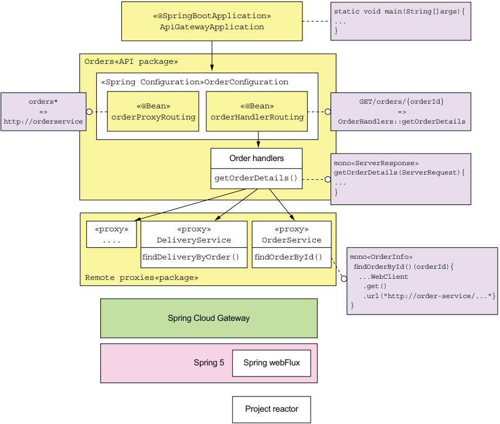

**----- Start of picture text -----**<br>
static void main(String[]args){<br>«@SpringBootApplication»ApiGatewayApplication ...<br>}<br>Orders«API package»<br>«Spring Configuration»OrderConfiguration<br>orders* «@Bean» «@Bean» GET/orders/{orderId}<br>http://orderservice=> orderProxyRouting orderHandlerRouting OrderHandlers::getOrderDetails=><br>Order handlers<br>mono<ServerResponse><br>getOrderDetails(ServerRequest){<br>getOrderDetails() ...<br>}<br>«proxy» «proxy» «proxy»<br>.... DeliveryService OrderService<br>findDeliveryByOrder() findOrderById() mono<OrderInfo><br>findOrderById()(orderId){<br>Remote proxies«package» ...WebClient<br>.get()<br>.url("http://order-service/..."}<br>}<br>Spring Cloud Gateway<br>Spring 5 Spring webFlux<br>Project reactor<br>**----- End of picture text -----**<br>

Figure 8.8 The architecture of an API gateway built using Spring Cloud Gateway 

The API gateway consists of the following packages: 

- ApiGatewayMain _package_ —Defines the Main program for the API gateway. 

- _One or more API packages_ —An API package implements a set of API endpoints. For example, the Orders package implements the Order-related API endpoints. 

- _Proxy package_ —Consists of proxy classes that are used by the API packages to invoke the services. 

The OrderConfiguration class defines the Spring beans responsible for routing Order-related requests. A routing rule can match against some combination of the HTTP method, the headers, and the path. The orderProxyRoutes @Bean defines rules that map API operations to backend service URLs. For example, it routes paths beginning with /orders to the Order Service. 

The orderHandlers @Bean defines rules that override those defined by orderProxyRoutes. These rules map API operations to handler methods, which are the Spring WebFlux equivalent of Spring MVC controller methods. For example, orderHandlers maps the operation GET /orders/{orderId} to the OrderHandlers::getOrderDetails() method. 

The OrderHandlers class implements various request handler methods, such as OrderHandlers::getOrderDetails(). This method uses API composition to fetch the order details (described earlier). The handle methods invoke backend services using remote proxy classes, such as OrderService. This class defines methods for invoking the OrderService. 

Let’s take a look at the code, starting with the OrderConfiguration class. 

**THE ORDERCONFIGURATION CLASS**

The OrderConfiguration class, shown in listing 8.2, is a Spring @Configuration class. It defines the Spring @Beans that implement the /orders endpoints. The orderProxyRouting and orderHandlerRouting @Beans use the Spring WebFlux routing DSL to define the request routing. The orderHandlers @Bean implements the request handlers that perform API composition. 

Listing 8.2 The Spring **@Beans** that implement the **/orders** endpoints 

```java
@Configuration 
@EnableConfigurationProperties(OrderDestinations.class) 
public class OrderConfiguration { 

  @Bean 
  public RouteLocator orderProxyRouting(OrderDestinations orderDestinations) { 
    return Routes.locator() 
      .route("orders") 
      .uri(orderDestinations.orderServiceUrl) 
      .predicate(path("/orders").or(path("/orders/*"))) 
      .and() 
      .build(); 
  } 

  @Bean 
  public OrderHandlers orderHandlers(OrderService orderService, 
                                     KitchenService kitchenService, 
                                     DeliveryService deliveryService, 
                                     AccountingService accountingService) { 
    return new OrderHandlers(orderService, kitchenService, deliveryService, accountingService); 
  } 

  @Bean 
  public RouterFunction<ServerResponse> orderHandlerRouting(OrderHandlers orderHandlers) { 
    return RouterFunctions.route(GET("/orders/{orderId}"), orderHandlers::getOrderDetails); 
  } 
}
```

OrderDestinations, shown in the following listing, is a Spring @ConfigurationProperties class that enables the externalized configuration of backend service URLs. 

Listing 8.3 The externalized configuration of backend service URLs 

```java
@ConfigurationProperties(prefix = "order.destinations") 
public class OrderDestinations { 
  @NotNull 
  public String orderServiceUrl; 

  public String getOrderServiceUrl() { return orderServiceUrl; } 

  public void setOrderServiceUrl(String orderServiceUrl) { 
    this.orderServiceUrl = orderServiceUrl; 
  } 
  ... 
}
```

You can, for example, specify the URL of the Order Service either as the order .destinations.orderServiceUrl property in a properties file or as an operating system environment variable, ORDER_DESTINATIONS_ORDER_SERVICE_URL. 

**THE ORDERHANDLERS CLASS**

The OrderHandlers class, shown in the following listing, defines the request handler methods that implement custom behavior, including API composition. The getOrderDetails() method, for example, performs API composition to retrieve information about an order. This class is injected with several proxy classes that make requests to backend services. 

Listing 8.4 The **OrderHandlers** class implements custom request-handling logic. 

```java
public class OrderHandlers { 
  private OrderService orderService; 
  private KitchenService kitchenService; 
  private DeliveryService deliveryService; 
  private AccountingService accountingService; 

  public OrderHandlers(OrderService orderService, 
                       KitchenService kitchenService, 
                       DeliveryService deliveryService, 
                       AccountingService accountingService) { 
    this.orderService = orderService; 
    this.kitchenService = kitchenService; 
    this.deliveryService = deliveryService; 
    this.accountingService = accountingService; 
  } 

  public Mono<ServerResponse> getOrderDetails(ServerRequest serverRequest) { 
    String orderId = serverRequest.pathVariable("orderId"); 
    Mono<OrderInfo> orderInfo = orderService.findOrderById(orderId); 

    Mono<Optional<TicketInfo>> ticketInfo = kitchenService 
      .findTicketByOrderId(orderId) 
      .map(Optional::of) 
      .onErrorReturn(Optional.empty()); 

    Mono<Optional<DeliveryInfo>> deliveryInfo = deliveryService 
      .findDeliveryByOrderId(orderId) 
      .map(Optional::of) 
      .onErrorReturn(Optional.empty()); 

    Mono<Optional<BillInfo>> billInfo = accountingService 
      .findBillByOrderId(orderId) 
      .map(Optional::of) 
      .onErrorReturn(Optional.empty()); 

    Mono<Tuple4<OrderInfo, Optional<TicketInfo>, Optional<DeliveryInfo>, Optional<BillInfo>>> combined = 
      Mono.when(orderInfo, ticketInfo, deliveryInfo, billInfo); 

    return combined.flatMap(tuple -> { 
      OrderDetails orderDetails = OrderDetails.makeOrderDetails(tuple.getT1(), tuple.getT2(), tuple.getT3(), tuple.getT4()); 
      return ServerResponse.ok() 
        .contentType(MediaType.APPLICATION_JSON) 
        .body(fromObject(orderDetails)); 
    }); 
  } 
}
```
**If the service invocation failed, return Optional.empty().** 

Mono<OrderDetails> orderDetails = combined.map(OrderDetails::makeOrderDetails); 

**Transform the Tuple4 into an OrderDetails.** 

} return orderDetails.flatMap(person -> ServerResponse.ok() .contentType(MediaType.APPLICATION_JSON) .body(fromObject(person))); } 

**Transform the OrderDetails into a ServerResponse.** 

The getOrderDetails() method implements API composition to fetch the order details. It’s written in a scalable, reactive style using the Mono abstraction , which is provided by Project Reactor. A Mono, which is a richer kind of Java 8 CompletableFuture, contains the outcome of an asynchronous operation that’s either a value or an exception. It has a rich API for transforming and combining the values returned by asynchronous operations. You can use Monos to write concurrent code in a style that’s simple and easy to understand. In this example, the getOrderDetails() method invokes the four services in parallel and combines the results to create an OrderDetails object. 

The getOrderDetails() method takes a ServerRequest, which is the Spring WebFlux representation of an HTTP request, as a parameter and does the following: 

- 1 It extracts the orderId from the path. 

- 2 It invokes the four services asynchronously via their proxies, which return Monos. In order to improve availability, getOrderDetails() treats the results of all services except the OrderService as optional. If a Mono returned by an optional service contains an exception, the call to onErrorReturn() transforms it into a Mono containing an empty Optional. 

- 3 It combines the results asynchronously using Mono.when(), which returns a Mono<Tuple4> containing the four values. 

- 4 It transforms the Mono<Tuple4> into a Mono<OrderDetails> by calling OrderDetails::makeOrderDetails. 

- 5 It transforms the OrderDetails into a ServerResponse, which is the Spring WebFlux representation of the JSON/HTTP response. 

As you can see, because getOrderDetails() uses Monos, it concurrently invokes the services and combines the results without using messy, difficult-to-read callbacks. Let’s take a look at one of the service proxies that return the results of a service API call wrapped in a Mono. 

THE ORDERSERVICE CLASS 

The OrderService class, shown in the following listing, is a remote proxy for the Order Service. It invokes the Order Service using a WebClient, which is the Spring WebFlux reactive HTTP client. 

Listing 8.5 **OrderService** class—a remote proxy for **Order Service** 

```java
@Service 
public class OrderService { 
  private OrderDestinations orderDestinations; 
  private WebClient client; 

  public OrderService(OrderDestinations orderDestinations, WebClient client) { 
    this.orderDestinations = orderDestinations; 
    this.client = client; 
  } 

  public Mono<OrderInfo> findOrderById(String orderId) { 
    Mono<ClientResponse> response = client 
      .get() 
      .uri(orderDestinations.orderServiceUrl + "/orders/{orderId}", orderId) 
      .exchange(); 
    return response.flatMap(resp -> resp.bodyToMono(OrderInfo.class)); 
  } 
}
```

The findOrder() method retrieves the OrderInfo for an order. It uses the WebClient to make the HTTP request to the Order Service and deserializes the JSON response to an OrderInfo. WebClient has a reactive API, and the response is wrapped in a Mono. The findOrder() method uses flatMap() to transform the Mono<ClientResponse> into a Mono<OrderInfo>. As the name suggests, the bodyToMono() method returns the response body as a Mono. 

**THE APIGATEWAYAPPLICATION CLASS**

The ApiGatewayApplication class, shown in the following listing, implements the API gateway’s main() method. It’s a standard Spring Boot main class. 

Listing 8.6 The **main()** method for the API gateway 

```java
@SpringBootConfiguration 
@EnableAutoConfiguration 
@EnableGateway 
@Import(OrdersConfiguration.class) 
public class ApiGatewayApplication { 
  public static void main(String[] args) { 
    SpringApplication.run(ApiGatewayApplication.class, args); 
  } 
}
```

The @EnableGateway annotation imports the Spring configuration for the Spring Cloud Gateway framework. 

Spring Cloud Gateway is an excellent framework for implementing an API gateway. It enables you to configure basic proxying using a simple, concise routing rules DSL. It’s also straightforward to route requests to handler methods that perform API composition and protocol translation. Spring Cloud Gateway is built using the scalable, reactive Spring Framework 5 and Project Reactor frameworks. But there’s another appealing option for developing your own API gateway: GraphQL, a framework that provides graph-based query language. Let’s look at how that works. 

### 8.3.3 Implementing an API gateway using GraphQL

Imagine that you’re responsible for implementing the FTGO’s API Gateway’s GET /orders/{orderId} endpoint, which returns the order details. On the surface, implementing this endpoint might appear to be simple. But as described in section 8.1, this endpoint retrieves data from multiple services. Consequently, you need to use the 

API composition pattern and write code that invokes the services and combines the results. 

Another challenge, mentioned earlier, is that different clients need slightly different data. For example, unlike the mobile application, the desktop SPA application displays your rating for the order. One way to tailor the data returned by the endpoint, as described in chapter 3, is to give the client the ability to specify the data they need. An endpoint can, for example, support query parameters such as the expand parameter, which specifies the related resources to return, and the field parameter, which specifies the fields of each resource to return. The other option is to define multiple versions of this endpoint as part of applying the Backends for frontends pattern. This is a lot of work for just one of the many API endpoints that the FTGO’s API Gateway needs to implement. 

Implementing an API gateway with a REST API that supports a diverse set of clients well is time consuming. Consequently, you may want to consider using a graphbased API framework, such as GraphQL, that’s designed to support efficient data fetching. The key idea with graph-based API frameworks is that, as figure 8.9 shows, the server’s API consists of a graph-based schema. The graph-based schema defines a set of _nodes_ (types), which have _properties_ (fields) and relationships with other nodes. The client retrieves data by executing a query that specifies the required data in terms of the graph’s nodes and their properties and relationships. As a result, a client can retrieve the data it needs in a single round-trip to the API gateway. 

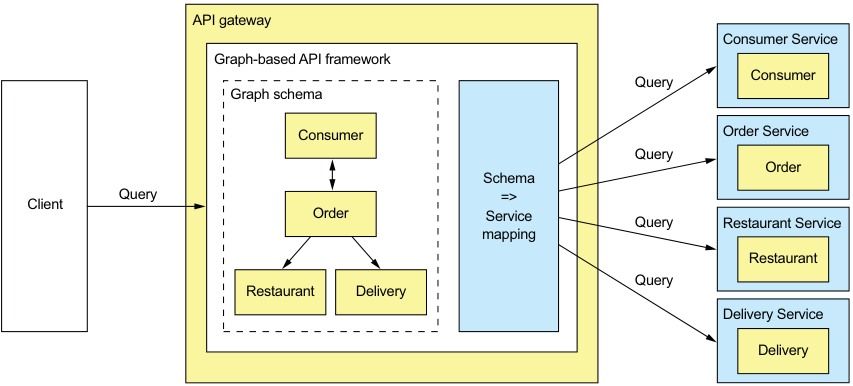

**----- Start of picture text -----**<br>
API gateway<br>Consumer Service<br>Graph-based API framework<br>Consumer<br>Query<br>Graph schema<br>Consumer Order Service<br>Query<br>Order<br>Schema<br>Query =><br>Client<br>Order Service<br>Query Restaurant Service<br>mapping<br>Restaurant<br>Query<br>Restaurant Delivery<br>Delivery Service<br>Delivery<br>**----- End of picture text -----**<br>

Figure 8.9 The API gateway’s API consists of a graph-based schema that’s mapped to the services. A client issues a query that retrieves multiple graph nodes. The graph-based API framework executes the query by retrieving data from one or more services. 

Graph-based API technology has a couple of important benefits. It gives clients control over what data is returned. Consequently, developing a single API that’s flexible enough to support diverse clients becomes feasible. Another benefit is that even though the API is much more flexible, this approach significantly reduces the development effort. That’s because you write the server-side code using a query execution framework that’s designed to support API composition and projections. It’s as if, rather than force clients to retrieve data via stored procedures that you need to write and maintain, you let them execute queries against the underlying database. 

**Schema-driven API technologies**

The two most popular graph-based API technologies are GraphQL (http://graphql.org) and Netflix Falcor (http://netflix.github.io/falcor/). Netflix Falcor models server-side data as a virtual JSON object graph. The Falcor client retrieves data from a Falcor server by executing a query that retrieves properties of that JSON object. The client can also update properties. In the Falcor server, the properties of the object graph are mapped to backend data sources, such as services with REST APIs. The server handles a request to set or get properties by invoking one or more backend data sources. 

GraphQL, developed by Facebook and released in 2015, is another popular graphbased API technology. It models the server-side data as a graph of objects that have fields and references to other objects. The object graph is mapped to backend data sources. GraphQL clients can execute queries that retrieve data and mutations that create and update data. Unlike Netflix Falcor, which is an implementation, GraphQL is a standard, with clients and servers available for a variety of languages, including NodeJS, Java, and Scala. 

Apollo GraphQL is a popular JavaScript/NodeJS implementation (www.apollographql .com). It’s a platform that includes a GraphQL server and client. Apollo GraphQL implements some powerful extensions to the GraphQL specification, such as subscriptions that push changed data to the client. 

This section talks about how to develop an API gateway using Apollo GraphQL. I’m only going to cover a few of the key features of GraphQL and Apollo GraphQL. For more information, you should consult the GraphQL and Apollo GraphQL documentation. 

The GraphQL-based API gateway, shown in figure 8.10, is written in JavaScript using the NodeJS Express web framework and the Apollo GraphQL server. The key parts of the design are as follows: 

- _GraphQL schema_ —The GraphQL schema defines the server-side data model and the queries it supports. 

- _Resolver functions_ —The resolve functions map elements of the schema to the various backend services. 

- _Proxy classes_ —The proxy classes invoke the FTGO application’s services. 

There’s also a small amount of glue code that integrates the GraphQL server with the Express web framework. Let’s look at each part, starting with the GraphQL schema. 

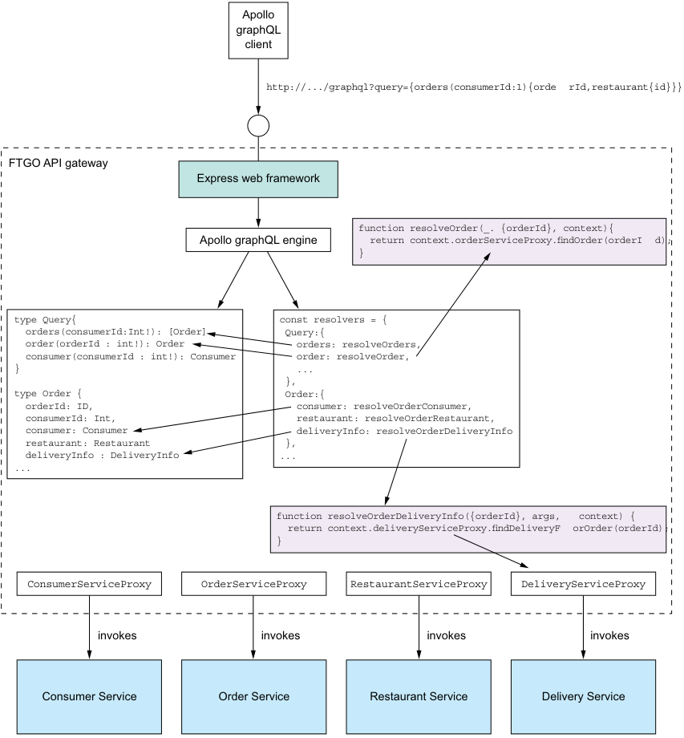

**----- Start of picture text -----**<br>
Apollo<br>graphQL<br>client<br>http://.../graphql?query={orders(consumerId:1){orde rId,restaurant{id}}}<br>FTGO API gateway<br>Express web framework<br>function resolveOrder(_. {orderId}, context){<br>Apollo graphQL engine return context.orderServiceProxy.findOrder(orderI d);<br>}<br>type Query{ const resolvers = {<br>orders(consumerId:Int!): [Order] Query:{<br>order(orderId : int!): Order orders: resolveOrders,<br>consumer(consumerId : int!): Consumer order: resolveOrder,<br>} ...<br>},<br>type Order { Order:{<br>orderId: ID, consumer: resolveOrderConsumer,<br>consumerId: Int, restaurant: resolveOrderRestaurant,<br>consumer: Consumer deliveryInfo: resolveOrderDeliveryInfo<br>restaurant: Restaurant },<br>deliveryInfo : DeliveryInfo ...<br>...<br>function resolveOrderDeliveryInfo({orderId}, args, context) {<br>return context.deliveryServiceProxy.findDeliveryF orOrder(orderId);<br>}<br>ConsumerServiceProxy OrderServiceProxy RestaurantServiceProxy DeliveryServiceProxy<br>invokes invokes invokes invokes<br>Consumer Service Order Service Restaurant Service Delivery Service<br>**----- End of picture text -----**<br>

Figure 8.10 The design of the GraphQL-based FTGO API Gateway 

**DEFINING A GRAPHQL SCHEMA**

A GraphQL API is centered around a _schema_ , which consists of a collection of types that define the structure of the server-side data model and the operations, such as queries, that a client can perform. GraphQL has several different kinds of types. The example code in this section uses just two kinds of types: _object_ types, which are the primary way of defining the data model, and _enums_ , which are similar to Java enums. An object type has a name and a collection of typed, named fields. A _field_ can be a scalar type, such as a number, string, or enum; a list of scalar types; a reference to another object type; or a collection of references to another object type. Despite resembling a field of a traditional object-oriented class, a GraphQL field is conceptually a function that returns a value. It can have arguments, which enable a GraphQL client to tailor the data the function returns. 

GraphQL also uses fields to define the queries supported by the schema. You define the schema’s queries by declaring an object type, which by convention is called Query. Each field of the Query object is a named query, which has an optional set of parameters, and a return type. I found this way of defining queries a little confusing when I first encountered it, but it helps to keep in mind that a GraphQL field is a function. It will become even clearer when we look at how fields are connected to the backend data sources. 

The following listing shows part of the schema for the GraphQL-based FTGO API gateway. It defines several object types. Most of the object types correspond to the FTGO application’s Consumer, Order, and Restaurant entities. It also has a Query object type that defines the schema’s queries. 

Listing 8.7 The GraphQL schema for the FTGO API gateway 

```graphql
type Query { 
  orders(consumerId : Int!): [Order] 
  order(orderId : Int!): Order 
  consumer(consumerId : Int!): Consumer 
} 

type Consumer { 
  id: ID 
  firstName: String 
  lastName: String 
  orders: [Order] 
} 

type Order { 
  orderId: ID 
  consumer: Consumer 
  restaurant: Restaurant 
  deliveryInfo : DeliveryInfo 
} 

type Restaurant { 
  id: ID 
  name: String 
} 

type DeliveryInfo { 
  status : DeliveryStatus 
  estimatedDeliveryTime : Int 
  assignedCourier :String 
} 

enum DeliveryStatus { 
  PREPARING 
  READY_FOR_PICKUP 
  PICKED_UP 
  DELIVERED 
} 
```

Despite having a different syntax, the Consumer, Order, Restaurant, and DeliveryInfo object types are structurally similar to the corresponding Java classes. One difference is the ID type, which represents a unique identifier. 

This schema defines three queries: 

- orders()—Returns the Orders for the specified Consumer 

- order()—Returns the specified Order 

- consumer()—Returns the specified Consumer 

These queries may seem not different from the equivalent REST endpoints, but GraphQL gives the client tremendous control over the data that’s returned. To understand why, let’s look at how a client executes GraphQL queries. 

**EXECUTING GRAPHQL QUERIES**

The principal benefit of using GraphQL is that its query language gives the client incredible control over the returned data. A client executes a query by making a request containing a query document to the server. In the simple case, a query document specifies the name of the query, the argument values, and the fields of the result object to return. Here’s a simple query that retrieves firstName and lastName of the consumer with a particular ID: query { **Specifies the query called consumer, which fetches a consumer** consumer(consumerId:1) { firstName **The fields of the** lastName **Consumer to return** } } 

This query returns those fields of the specified Consumer. 

Here’s a more elaborate query that returns a consumer, their orders, and the ID and name of each order’s restaurant: query { consumer(consumerId:1) { id firstName lastName orders { orderId restaurant { id name } deliveryInfo { estimatedDeliveryTime name } 

} 

} 

} 

This query tells the server to return more than just the fields of the Consumer. It retrieves the consumer’s Orders and each Order’s restaurant. As you can see, a GraphQL client can specify exactly the data to return, including the fields of transitively related objects. 

The query language is more flexible than it might first appear. That’s because a query is a field of the Query object, and a query document specifies which of those fields the server should return. These simple examples retrieve a single field, but a query document can execute multiple queries by specifying multiple fields. For each field, the query document supplies the field’s arguments and specifies what fields of the result object it’s interested in. Here’s a query that retrieves two different consumers: 

**query {** c1: consumer (consumerId:1) { id, firstName, lastName} c2: consumer (consumerId:2) { id, firstName, lastName} } 

In this query document, c1 and c2 are what GraphQL calls _aliases_ . They’re used to distinguish between the two Consumers in the result, which would otherwise both be called consumer. This example retrieves two objects of the same type, but a client could retrieve several objects of different types. 

A GraphQL schema defines the shape of the data and the supported queries. To be useful, it has to be connected to the source of the data. Let’s look at how to do that. 

CONNECTING THE SCHEMA TO THE DATA 

When the GraphQL server executes a query, it must retrieve the requested data from one or more data stores. In the case of the FTGO application, the GraphQL server must invoke the APIs of the services that own the data. You associate a GraphQL schema with the data sources by attaching resolver functions to the fields of the object types defined by the schema. The GraphQL server implements the API composition pattern by invoking resolver functions to retrieve the data, first for the top-level query, and then recursively for the fields of the result object or objects. 

The details of how resolver functions are associated with the schema depend on which GraphQL server you are using. Listing 8.8 shows how to define the resolvers when using the Apollo GraphQL server. You create a doubly nested JavaScript object. Each top-level property corresponds to an object type, such as Query and Order. Each second-level property, such as Order.consumer, defines a field’s resolver function. 

Listing 8.8 Attaching the resolver functions to fields of the GraphQL schema 

```javascript
const resolvers = { 
  Query: { 
    orders: resolveOrders, 
    consumer: resolveConsumer, 
    order: resolveOrder 
  }, 
  Order: { 
    consumer: resolveOrderConsumer, 
    restaurant: resolveOrderRestaurant, 
    deliveryInfo: resolveOrderDeliveryInfo 
  } 
}; 
```

A resolver function has three parameters: 

- _Object_ —For a top-level query field, such as resolveOrders, object is a root object that’s usually ignored by the resolver function. Otherwise, object is the value returned by the resolver for the parent object. For example, the resolver function for the Order.consumer field is passed the value returned by the Order’s resolver function. 

- _Query arguments_ —These are supplied by the query document. 

- _Context_ —Global state of the query execution that’s accessible by all resolvers. It’s used, for example, to pass user information and dependencies to the resolvers. 

A resolver function might invoke a single service or it might implement the API composition pattern and retrieve data from multiple services. An Apollo GraphQL server resolver function returns a Promise, which is JavaScript’s version of Java’s CompletableFuture. The promise contains the object (or a list of objects) that the resolver function retrieved from the data store. GraphQL engine includes the return value in the result object. 

Let’s look at a couple of examples. Here’s the resolveOrders() function, which is the resolver for the orders query: 

```javascript
function resolveOrders(_, { consumerId }, context) { 
  return context.orderServiceProxy.findOrders(consumerId); 
} 
```

This function obtains the OrderServiceProxy from the context and invokes it to fetch a consumer’s orders. It ignores its first parameter. It passes the consumerId argument, provided by the query document, to OrderServiceProxy.findOrders(). The findOrders() method retrieves the consumer’s orders from OrderHistoryService. 

Here’s the resolveOrderRestaurant() function, which is the resolver for the Order.restaurant field that retrieves an order’s restaurant: 

```javascript
function resolveOrderRestaurant({restaurantId}, args, context) { 
  return context.restaurantServiceProxy.findRestaurant(restaurantId); 
} 
```

Its first parameter is Order. It invokes RestaurantServiceProxy.findRestaurant() with the Order’s restaurantId, which was provided by resolveOrders(). 

GraphQL uses a recursive algorithm to execute the resolver functions. First, it executes the resolver function for the top-level query specified by the Query document. Next, for each object returned by the query, it iterates through the fields specified in the Query document. If a field has a resolver, it invokes the resolver with the object and the arguments from the Query document. It then recurses on the object or objects returned by that resolver. 

Figure 8.11 shows how this algorithm executes the query that retrieves a consumer’s orders and each order’s delivery information and restaurant. First, the GraphQL engine invokes resolveConsumer(), which retrieves Consumer. Next, it invokes resolveConsumerOrders(), which is the resolver for the Consumer.orders field that returns the consumer’s orders. The GraphQL engine then iterates through Orders, invoking the resolvers for the Order.restaurant and Order.deliveryInfo fields. 

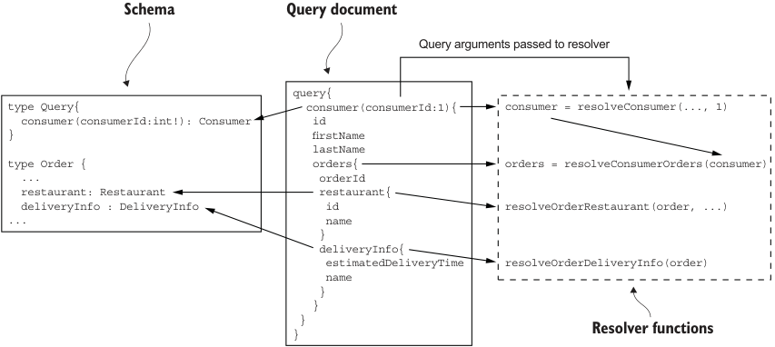

**----- Start of picture text -----**<br>
Schema Query document<br>Query arguments passed to resolver<br>query{<br>type Query{ consumer(consumerId:1){ consumer = resolveConsumer(..., 1)<br>consumer(consumerId:int!): Consumer id<br>} firstName<br>lastName<br>type Order { orders{ orders = resolveConsumerOrders(consumer)<br>... orderId<br>restaurant: Restaurant restaurant{<br>deliveryInfo : DeliveryInfo id resolveOrderRestaurant(order, ...)<br>... name<br>}<br>deliveryInfo{<br>estimatedDeliveryTime resolveOrderDeliveryInfo(order)<br>name<br>}<br>}<br>}<br>Resolver functions<br>}<br>**----- End of picture text -----**<br>

Figure 8.11 GraphQL executes a query by recursively invoking the resolver functions for the fields specified in the Query document. First, it executes the resolver for the query, and then it recursively invokes the resolvers for the fields in the result object hierarchy. 

The result of executing the resolvers is a Consumer object populated with data retrieved from multiple services. 

Let’s now look at how to optimize the executing of resolvers by using batching and caching. 

**OPTIMIZING LOADING USING BATCHING AND CACHING**

GraphQL can potentially execute a large number of resolvers when executing a query. Because the GraphQL server executes each resolver independently, there’s a risk of poor performance due to excessive round-trips to the services. Consider, for example, a query that retrieves a consumer, their orders, and the orders’ restaurants. If there are _N_ orders, then a simplistic implementation would make one call to Consumer Service, one call to Order History Service, and then _N_ calls to Restaurant Service. Even though the GraphQL engine will typically make the calls to Restaurant Service in parallel, there’s a risk of poor performance. Fortunately, you can use a few techniques to improve performance. 

One important optimization is to use a combination of server-side batching and caching. _Batching_ turns _N_ calls to a service, such as Restaurant Service, into a single call that retrieves a batch of _N_ objects. _Caching_ reuses the result of a previous fetch of the same object to avoid making an unnecessary duplicate call. The combination of batching and caching significantly reduces the number of round-trips to backend services. 

A NodeJS-based GraphQL server can use the DataLoader module to implement batching and caching (https://github.com/facebook/dataloader). It coalesces loads that occur within a single execution of the event loop and calls a batch loading function that you provide. It also caches calls to eliminate duplicate loads. The following listing shows how RestaurantServiceProxy can use DataLoader. The findRestaurant() method loads a Restaurant via DataLoader. 

Listing 8.9 Using a **DataLoader** to optimize calls to **Restaurant Service** 

```javascript
const DataLoader = require('dataloader'); class RestaurantServiceProxy { 
  constructor() { 
    this.dataLoader = new DataLoader(restaurantIds => this.batchFindRestaurants(restaurantIds)); 
  } 

  findRestaurant(restaurantId) { 
    return this.dataLoader.load(restaurantId); 
  } 

  batchFindRestaurants(restaurantIds) { 
    ... 
  } 
} 
```

RestaurantServiceProxy and, hence, DataLoader are created for each request, so there’s no possibility of DataLoader mixing together different users’ data. 

Let’s now look at how to integrate the GraphQL engine with a web framework so that it can be invoked by clients. 

**INTEGRATING THE APOLLO GRAPHQL SERVER WITH EXPRESS**

The Apollo GraphQL server executes GraphQL queries. In order for clients to invoke it, you need to integrate it with a web framework. Apollo GraphQL server supports several web frameworks, including Express, a popular NodeJS web framework. 

Listing 8.10 shows how to use the Apollo GraphQL server in an Express application. The key function is graphqlExpress, which is provided by the apollo-serverexpress module. It builds an Express request handler that executes GraphQL queries against a schema. This example configures Express to route requests to the GET /graphql and POST /graphql endpoints of this GraphQL request handler. It also creates a GraphQL context containing the proxies, which makes them available to the resolvers. 

Listing 8.10 Integrating the GraphQL server with the Express web framework 

```javascript
const {graphqlExpress} = require("apollo-server-express"); const schema = makeExecutableSchema({ typeDefs, resolvers }); const app = express(); function makeContextWithDependencies(req) { 
  const orderServiceProxy = new OrderServiceProxy(); 
  const consumerServiceProxy = new ConsumerServiceProxy(); 
  const restaurantServiceProxy = new RestaurantServiceProxy(); 
  return {orderServiceProxy, consumerServiceProxy, restaurantServiceProxy}; 
} 

function makeGraphQLHandler() { 
  return graphqlExpress(req => { 
    return {schema: schema, context: makeContextWithDependencies(req)} 
  }); 
} 

app.post('/graphql', bodyParser.json(), makeGraphQLHandler()); 
app.get('/graphql', makeGraphQLHandler()); app.listen(PORT); 
```

**Route POST /graphql and GET /graphql endpoints to the GraphQL server.** 

This example doesn’t handle concerns such as security, but those would be straightforward to implement. The API gateway could, for example, authenticate users using Passport, a NodeJS security framework described in chapter 11. The makeContextWithDependencies() function would pass the user information to each repository’s constructor so that they can propagate the user information to the services. 

Let’s now look at how a client can invoke this server to execute GraphQL queries. 

**WRITING A GRAPHQL CLIENT**

There are a couple of different ways a client application can invoke the GraphQL server. Because the GraphQL server has an HTTP-based API, a client application could use an HTTP library to make requests, such as GET http://localhost:3000/ graphql?query={orders(consumerId:1){orderId,restaurant{id}}}'. It’s easier, though, to use a GraphQL client library, which takes care of properly formatting requests and typically provides features such as client-side caching. 

The following listing shows the FtgoGraphQLClient class, which is a simple GraphQL-based client for the FTGO application. Its constructor instantiates ApolloClient, which is provided by the Apollo GraphQL client library. The FtgoGraphQLClient class defines a findConsumer() method that uses the client to retrieve the name of a consumer. 

Listing 8.11 Using the Apollo GraphQL client to execute queries 

```javascript
class FtgoGraphQLClient { 
  constructor(...) { 
    this.client = new ApolloClient({ ... }); 
  } 

  findConsumer(consumerId) { 
    return this.client.query({ 
      variables: { cid: consumerId}, 
      query: gql` 
        query foo($cid : Int!) { 
          consumer(consumerId: $cid) { 
            id 
            firstName 
            lastName 
          } 
        } 
      `, 
    }) 
  } 
}
```

The FtgoGraphQLClient class can define a variety of query methods, such as findConsumer(). Each one executes a query that retrieves exactly the data needed by the client. 

## Summary

This section has barely scratched the surface of GraphQL’s capabilities. I hope I’ve demonstrated that GraphQL is a very appealing alternative to a more traditional, REST-based API gateway. It lets you implement an API that’s flexible enough to support a diverse set of clients. Consequently, you should consider using GraphQL to implement your API gateway. 

## Summary

- Your application’s external clients usually access the application’s services via an API gateway. An API gateway provides each client with a custom API. It’s responsible for request routing, API composition, protocol translation, and implementation of edge functions such as authentication. 

- Your application can have a single API gateway or it can use the Backends for frontends pattern, which defines an API gateway for each type of client. The main advantage of the Backends for frontends pattern is that it gives the client teams greater autonomy, because they develop, deploy, and operate their own API gateway. 

- There are numerous technologies you can use to implement an API gateway, including off-the-shelf API gateway products. Alternatively, you can develop your own API gateway using a framework. 

- Spring Cloud Gateway is a good, easy-to-use framework for developing an API gateway. It routes requests using any request attribute, including the method and the path. Spring Cloud Gateway can route a request either directly to a backend service or to a custom handler method. It’s built using the scalable, reactive Spring Framework 5 and Project Reactor frameworks. You can write your custom request handlers in a reactive style using, for example, Project Reactor’s Mono abstraction. 

- GraphQL, a framework that provides graph-based query language, is another excellent foundation for developing an API Gateway. You write a graph-oriented schema to describe the server-side data model and its supported queries. You then map that schema to your services by writing resolvers, which retrieve data. GraphQL-based clients execute queries against the schema that specify exactly the data that the server should return. As a result, a GraphQL-based API gateway can support diverse clients. 

