# _Testing microservices: Part 1_ 

# _This chapter covers_ 

- Effective testing strategies for microservices 

- Using mocks and stubs to test a software element in isolation 

- Using the test pyramid to determine where to focus testing efforts 

- Unit testing the classes inside a service 

FTGO, like many organizations, had adopted a traditional approach to testing. _Testing_ is primarily an activity that happens after development. The FTGO developers throw their code over a wall to the QA team, who verify that the software works as expected. What’s more, most of their testing is done manually. Sadly, this approach to testing is broken—for two reasons: 

- _Manual testing is extremely inefficient_ —You should never ask a human to do what a machine can do better. Compared to machines, humans are slow and can’t work 24/7. You won’t be able to deliver software rapidly and safely if you rely on manual testing. It’s essential that you write automated tests. 

- _Testing is done far too late in the delivery process_ —There certainly is a role for tests that critique an application after it’s been written, but experience has shown that those tests are insufficient. A much better approach is for developers to 


write automated tests as part of development. It improves their productivity because, for example, they’ll have tests that provide immediate feedback while editing code. 

In this regard, FTGO is a fairly typical organization. The Sauce Labs Testing Trends in 2018 report paints a fairly gloomy picture of the state of test automation (https:// saucelabs.com/resources/white-papers/testing-trends-for-2018). It describes how only 26% of organizations are mostly automated, and a minuscule 3% are fully automated! 

The reliance on manual testing isn’t because of a lack of tooling and frameworks. For example, JUnit, a popular Java testing framework, was first released in 1998. The reason for the lack of automated tests is mostly cultural: “Testing is QA’s job,” “It’s not the best use of a developers’s time,” and so on. It also doesn’t help that developing a fast-running, yet effective, maintainable test suite is challenging. And, a typical large, monolithic application is extremely difficult to test. 

One key motivation for using the microservice architecture is, as described in chapter 2, improving testability. Yet at the same time, the complexity of the microservice architecture demands that you write automated tests. Furthermore, some aspects of testing microservices are challenging. That’s because we need to verify that services can interact correctly while minimizing the number of slow, complex, and unreliable end-to-end-tests that launch many services. 

This chapter is the first of two chapters on testing. It’s an introduction to testing. Chapter 10 covers more advanced testing concepts. The two chapters are long, but together they cover testing ideas and techniques that are essential to modern software development in general, and to the microservice architecture in particular. 

I begin this chapter by describing effective testing strategies for a microservicesbased application. These strategies enable you to be confident that your software works, while minimizing test complexity and execution time. After that, I describe how to write one particular kind of test for your services: unit tests. Chapter 10 covers the other kinds of tests: integration, component, and end-to-end. 

Let’s start by taking a look at testing strategies for microservices. 

# Why an introduction to testing? 

You may be wondering why this chapter includes an introduction to basic testing concepts. If you’re already familiar with concepts such as the test pyramid and the different types of tests, feel free to speed-read this chapter and move onto the next one, which focuses on microservices-specific testing topics. But based on my experiences consulting for and training clients all over the world, a fundamental weakness of many software development organizations is the lack of automated testing. That’s because if you want to deliver software quickly and reliably, it’s _absolutely essential_ to do automated testing. It’s the only way to have a short _lead time_ , which is the time it takes to get committed code into production. Perhaps even more importantly, automated testing is essential because it forces you to develop a testable application. It’s typically very difficult to introduce automating testing into an already large, complex application. In other words, the fast track to monolithic hell is to not write automated tests. 


# _9.1 Testing strategies for microservice architectures_ 

Let’s say you’ve made a change to FTGO application’s Order Service. Naturally, the next step is for you to run your code and verify that the change works correctly. One option is to test the change manually. First, you run Order Service and all its dependencies, which include infrastructure services such as a database and other application services. Then you “test” the service by either invoking its API or using the FTGO application’s UI. The downside of this approach is that it’s a slow, manual way to test your code. 

A much better option is to have automated tests that you can run during development. Your development workflow should be: edit code, run tests (ideally with a single keystroke), repeat. The fast-running tests quickly tell you whether your changes work within a few seconds. But how do you write fast-running tests? And are they sufficient or do you need more comprehensive tests? These are the kind of questions I answer in this and other sections in this chapter. 

I start this section with an overview of important automated testing concepts. We’ll look at the purpose of testing and the structure of a typical test. I cover the different types of tests that you’ll need to write. I also describe the test pyramid, which provides valuable guidance about where you should focus your testing efforts. After covering testing concepts, I discuss strategies for testing microservices. We’ll look at the distinct challenges of testing applications that have a microservice architecture. I describe techniques you can use to write simpler and faster, yet still-effective, tests for your microservices. 

Let’s take a look at testing concepts. 

# _9.1.1 Overview of testing_ 

In this chapter, my focus is on automated testing, and I use the term _test_ as shorthand for _automated test_ . Wikipedia defines a _test case_ , or test, as follows: 

_A test case is a set of test inputs, execution conditions, and expected results developed for a particular objective, such as to exercise a particular program path or to verify compliance with a specific requirement._
https://en.wikipedia.org/wiki/Test_case 

In other words, the purpose of a test is, as figure 9.1 shows, to verify the behavior of the System Under Test (SUT). In this definition, _system_ is a fancy term that means the software element being tested. It might be something as small as a class, as large as the entire application, or something in between, such as a cluster of classes or an individual service. A collection of related tests form a _test suite_ . 

Let’s first look at the concept of an automated test. Then I discuss the different kinds of tests that you’ll need to write. After that, I discuss the test pyramid, which describes the relative proportions of the different types of tests that you should write. 


_**Testing strategies for microservice architectures**_ 


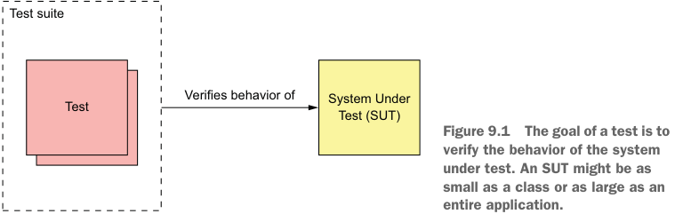


**----- Start of picture text -----**<br>
Test suite<br>Test Verifies behavior of System Under<br>Test (SUT)<br>Figure 9.1 The goal of a test is to<br>verify the behavior of the system<br>under test. An SUT might be as<br>small as a class or as large as an<br>entire application.<br>**----- End of picture text -----**<br>


# WRITING AUTOMATED TESTS 

Automated tests are usually written using a testing framework. JUnit, for example, is a popular Java testing framework. Figure 9.2 shows the structure of an automated test. Each test is implemented by a test method, which belongs to a test class. 


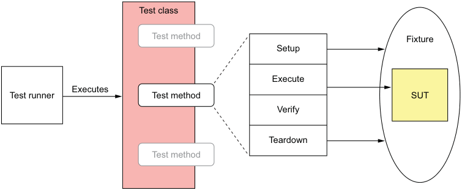


**----- Start of picture text -----**<br>
Test class<br>Test method Fixture<br>Setup<br>Execute<br>Executes<br>Test runne r Test method SUT<br>Verify<br>Teardown<br>Test method<br>**----- End of picture text -----**<br>


Figure 9.2 Each automated test is implemented by a test method, which belongs to a test class. A test consists of four phases: _setup_ , which initializes the test fixture, which is everything required to run the test; _execute_ , which invokes the SUT; _verify_ , which verifies the outcome of the test; and _teardown_ , which cleans up the test fixture. 

An automated test typically consists of four phases (http://xunitpatterns.com/ Four%20Phase%20Test.html): 

- 1 _Setup_ —Initialize the test fixture, which consists of the SUT and its dependencies, to the desired initial state. For example, create the class under test and initialize it to the state required for it to exhibit the desired behavior. 

- 2 _Exercise_ —Invoke the SUT—for example, invoke a method on the class under test. 

- 3 _Verify_ —Make assertions about the invocation’s outcome and the state of the SUT. For example, verify the method’s return value and the new state of the class under test. 


- 4 _Teardown_ —Clean up the test fixture, if necessary. Many tests omit this phase, but some types of database test will, for example, roll back a transaction initiated by the setup phase. 

In order to reduce code duplication and simplify tests, a test class might have setup methods that are run before a test method, and teardown methods that are run afterwards. A test _suite_ is a set of test classes. The tests are executed by a _test runner_ . 

# TESTING USING MOCKS AND STUBS 

An SUT often has dependencies. The trouble with dependencies is that they can complicate and slow down tests. For example, the OrderController class invokes OrderService, which ultimately depends on numerous other application services and infrastructure services. It wouldn’t be practical to test the OrderController class by running a large portion of the system. We need a way to test an SUT in isolation. 

The solution, as figure 9.3 shows, is to replace the SUT’s dependencies with test doubles. A _test double_ is an object that simulates the behavior of the dependency. 


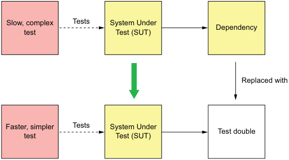


**----- Start of picture text -----**<br>
Slow, complex Tests System Under<br>Dependency<br>test Test (SUT)<br>Replaced with<br>Faster, simpler Tests System Under<br>Test double<br>test Test (SUT)<br>**----- End of picture text -----**<br>


Figure 9.3 Replacing a dependency with a test double enables the SUT to be tested in isolation. The test is simpler and faster. 

There are two types of test doubles: stubs and mocks. The terms _stubs_ and _mocks_ are often used interchangeably, although they have slightly different behavior. A _stub_ is a test double that returns values to the SUT. A _mock_ is a test double that a test uses to verify that the SUT correctly invokes a dependency. Also, a mock is often a stub. 

Later on in this chapter, you’ll see examples of test doubles in action. For example, section 9.2.5 shows how to test the OrderController class in isolation by using a test double for the OrderService class. In that example, the OrderService test double is implemented using Mockito, a popular mock object framework for Java. Chapter 10 shows how to test Order Service using test doubles for the other services that it invokes. Those test doubles respond to command messages sent by Order Service. 

Let’s now look at the different types of tests. 


_**Testing strategies for microservice architectures**_ 

# THE DIFFERENT TYPES OF TESTS 

There are many different types of tests. Some tests, such as performance tests and usability tests, verify that the application satisfies its quality of service requirements. In this chapter, I focus on automated tests that verify the functional aspects of the application or service. I describe how to write four different types of tests: 

- _Unit tests_ —Test a small part of a service, such as a class. 

- _Integration tests_ —Verify that a service can interact with infrastructure services such as databases and other application services. 

- _Component tests_ —Acceptance tests for an individual service. 

- _End-to-end tests_ —Acceptance tests for the entire application. 

They differ primarily in scope. At one end of the spectrum are unit tests, which verify behavior of the smallest meaningful program element. For an object-oriented language such as Java, that’s a class. At the other end of the spectrum are end-to-end tests, which verify the behavior of an entire application. In the middle are component tests, which test individual services. Integration tests, as you’ll see in the next chapter, have a relatively small scope, but they’re more complex than pure unit tests. Scope is only one way of characterizing tests. Another way is to use the test quadrant. 

# Compile-time unit tests 

Testing is an integral part of development. The modern development workflow is to edit code, then run tests. Moreover, if you’re a Test-Driven Development (TDD) practitioner, you develop a new feature or fix a bug by first writing a failing test and then writing the code to make it pass. Even if you’re not a TDD adherent, an excellent way to fix a bug is to write a test that reproduces the bug and then write the code that fixes it. 

The tests that you run as part of this workflow are known as _compile-time_ tests. In a modern IDE, such as IntelliJ IDEA or Eclipse, you typically don’t compile your code as a separate step. Rather, you use a single keystroke to compile the code and run the tests. In order to stay in the flow, these tests need to execute quickly—ideally, no more than a few seconds. 

# USING THE TEST QUADRANT TO CATEGORIZE TESTS 

A good way to categorize tests is Brian Marick’s _test quadrant_ (www.exampler.com/oldblog/2003/08/21/#agile-testing-project-1). The test quadrant, shown in figure 9.4, categorizes tests along two dimensions: 

- _Whether the test is business facing or technology facing_ —A business-facing test is described using the terminology of a domain expert, whereas a technology-facing test is described using the terminology of developers and the implementation. 

- _Whether the goal of the test is to support programming or critique the application_ —Developers use tests that support programming as part of their daily work. Tests that critique the application aim to identify areas that need improvement. 


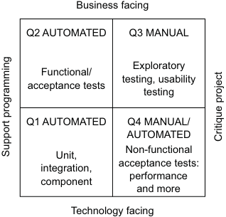


**----- Start of picture text -----**<br>
Business facing<br>Q2 AUTOMATED Q3 MANUAL<br>Exploratory<br>Functional/<br>testing, usability<br>acceptance tests<br>testing<br>Q1 AUTOMATED Q4 MANUAL/<br>AUTOMATED<br>Non-functional<br>Unit,<br>acceptance tests:<br>integration,<br>performance<br>component<br>and more<br>Technology facing<br>Critique project<br>Support programming<br>**----- End of picture text -----**<br>


Figure 9.4 The test quadrant categorizes tests along two dimensions. The first dimension is whether a test is business facing or technology facing. The second is whether the purpose of the test is to support programming or critique the application. 

The test quadrant defines four different categories of tests: 

- _Q1_ —Support programming/technology facing: unit and integration tests 

- _Q2_ —Support programming/business facing: component and end-to-end test 

- _Q3_ —Critique application/business facing: usability and exploratory testing 

- _Q4_ —Critique application/technology facing: nonfunctional acceptance tests such as performance tests 

The test quadrant isn’t the only way of organizing tests. There’s also the test pyramid, which provides guidance on how many tests of each type to write. 

USING THE TEST PYRAMID AS A GUIDE TO FOCUSING YOUR TESTING EFFORTS 

We must write different kinds of tests in order to be confident that our application works. The challenge, though, is that the execution time and complexity of a test increase with its scope. Also, the larger the scope of a test and the more moving parts it has, the less reliable it becomes. Unreliable tests are almost as bad as no tests, because if you can’t trust a test, you’re likely to ignore failures. 

On one end of the spectrum are unit tests for individual classes. They’re fast to execute, easy to write, and reliable. At the other end of the spectrum are end-to-end tests for the entire application. These tend to be slow, difficult to write, and often unreliable because of their complexity. Because we don’t have unlimited budget for development and testing, we want to focus on writing tests that have small scope without compromising the effectiveness of the test suite. 

The test pyramid, shown in figure 9.5, is a good guide (https://martinfowler.com/ bliki/TestPyramid.html). At the base of the pyramid are the fast, simple, and reliable unit tests. At the top of the pyramid are the slow, complex, and brittle end-to-end tests. Like the USDA food pyramid, although more useful and less controversial (https://en .wikipedia.org/wiki/History_of_USDA_nutrition_guides), the test pyramid describes the relative proportions of each type of test. 

The key idea of the test pyramid is that as we move up the pyramid we should write fewer and fewer tests. We should write lots of unit tests and very few end-to-end tests. 


_**Testing strategies for microservice architectures**_ 


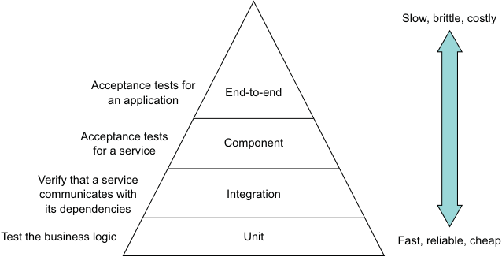


**----- Start of picture text -----**<br>
Slow, brittle, costly<br>Acceptance tests for End-to-end<br>an application<br>Acceptance tests<br>Component<br>for a service<br>Verify that a service<br>communicates with Integration<br>its dependencies<br>Test the business logic Unit Fast, reliable, cheap<br>**----- End of picture text -----**<br>


Figure 9.5 The test pyramid describes the relative proportions of each type of test that you need to write. As you move up the pyramid, you should write fewer and fewer tests. 

As you’ll see in this chapter, I describe a strategy that emphasizes testing the pieces of a service. It even minimizes the number of component tests, which test an entire service. 

It’s clear how to test individual microservices such as Consumer Service, which don’t depend on any other services. But what about services such as Order Service, that do depend on numerous other services? And how can we be confident that the application as a whole works? This is the key challenge of testing applications that have a microservice architecture. The complexity of testing has moved from the individual services to the interactions between them. Let’s look at how to tackle this problem. 

# _9.1.2 The challenge of testing microservices_ 

Interprocess communication plays a much more important role in a microservicesbased application than in a monolithic application. A monolithic application might communicate with a few external clients and services. For example, the monolithic version of the FTGO application uses a few third-party web services, such as Stripe for payments, Twilio for messaging, and Amazon SES for email, which have stable APIs. Any interaction between the modules of the application is through programming language-based APIs. Interprocess communication is very much on the edge of the application. 

In contrast, interprocess communication is central to microservice architecture. A microservices-based application is a distributed system. Teams are constantly developing their services and evolving their APIs. It’s essential that developers of a service write tests that verify that their service interacts with its dependencies and clients. 

As described in chapter 3, services communicate with each other using a variety of interaction styles and IPC mechanisms. Some services use request/response-style interaction that’s implemented using a synchronous protocol, such as REST or gRPC. 


Other services interact through request/asynchronous reply or publish/subscribe using asynchronous messaging. For instance, figure 9.6 shows how some of the services in the FTGO application communicate. Each arrow points from a consumer service to a producer service. 


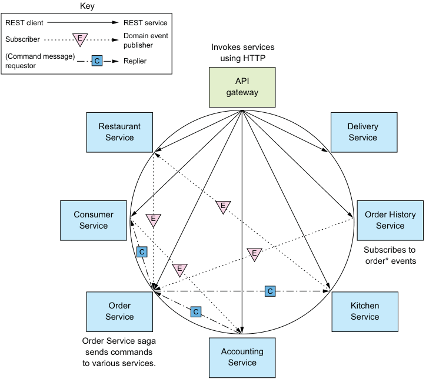


**----- Start of picture text -----**<br>
Key<br>REST client REST service<br>Subscriber E Domain event<br>publisher Invokes services<br>(Command message) C Replier using HTTP<br>requestor<br>API<br>gateway<br>Restaurant Delivery<br>Service Service<br>E<br>Consumer E Order History<br>Service Service<br>C E Subscribes to<br>order* events<br>E<br>C<br>Order Kitchen<br>C<br>Service Service<br>Order Service saga<br>sends commands Accounting<br>to various services. Service<br>**----- End of picture text -----**<br>


Figure 9.6 Some of the interservice communication in the FTGO application. Each arrow points from a consumer service to a producer service. 

The arrow points in the direction of the dependency, from the consumer of the API to the provider of the API. The assumptions that a consumer makes about an API depend on the nature of the interaction: 

- _REST client_  _service_ —The API gateway routes requests to services and implements API composition. 

- _Domain event consumer_  _publisher_ —Order History Service consumes events published by Order Service. 

- _Command message requestor_  _replier_ —Order Service sends command messages to various services and consumes the replies. 


_**Testing strategies for microservice architectures**_ 


Each interaction between a pair of services represents an agreement or contract between the two services. Order History Service and Order Service must, for example, agree on the event message structure and the channel that they’re published to. Similarly, the API gateway and the services must agree on the REST API endpoints. And Order Service and each service that it invokes using asynchronous request/ response must agree on the command channel and the format of the command and reply messages. 

As a developer of a service, you need to be confident that the services you consume have stable APIs. Similarly, you don’t want to unintentionally make breaking changes to your service’s API. For example, if you’re working on Order Service, you want to be sure that the developers of your service’s dependencies, such as Consumer Service and Kitchen Service, don’t change their APIs in ways that are incompatible with your service. Similarly, you must ensure that you don’t change the Order Services’s API in a way that breaks the API Gateway or Order History Service. 

One way to verify that two services can interact is to run both services, invoke an API that triggers the communication, and verify that it has the expected outcome. This will certainly catch integration problems, but it’s basically an end-to-end. The test likely would need to run numerous other transitive dependencies of those services. A test might also need to invoke complex, high-level functionality such as business logic, even if its goal is to test relatively low-level IPC. It’s best to avoid writing end-to-end tests like these. Somehow, we need to write faster, simpler, and more reliable tests that ideally test services in isolation. The solution is to use what’s known as _consumer-driven contract testing_ . 

# CONSUMER-DRIVEN CONTRACT TESTING 

Imagine that you’re a member of the team developing API Gateway, described in chapter 8. The API Gateway’s OrderServiceProxy invokes various REST endpoints, including the GET /orders/{orderId} endpoint. It’s essential that we write tests that verify that API Gateway and Order Service agree on an API. In the terminology of consumer contract testing, the two services participate in a _consumer-provider relationship_ . API Gateway is a consumer, and Order Service is a provider. A consumer contract test is an integration test for a provider, such as Order Service, that verifies that its API matches the expectations of a consumer, such as API Gateway. 

A consumer contract test focuses on verifying that the “shape” of a provider’s API meets the consumer’s expectations. For a REST endpoint, a contract test verifies that the provider implements an endpoint that 

- Has the expected HTTP method and path 

- Accepts the expected headers, if any 

- Accepts a request body, if any 

- Returns a response with the expected status code, headers, and body 

It’s important to remember that contract tests don’t thoroughly test the provider’s business logic. That’s the job of unit tests. Later on, you’ll see that consumer contract tests for a REST API are in fact mock controller tests. 


_**Testing microservices: Part 1**_ 


The team that develops the consumer writes a contract test suite and adds it (for example, via a pull request) to the provider’s test suite. The developers of other services that invoke Order Service also contribute a test suite, as shown in figure 9.7. Each test suite will test those aspects of Order Service’s API that are relevant to each consumer. The test suite for Order History Service, for example, verifies that Order Service publishes the expected events. 


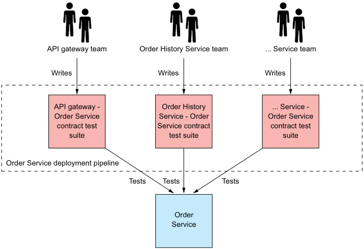


**----- Start of picture text -----**<br>
API gateway team Order History Service team ... Service team<br>Writes Writes Writes<br>API gateway - Order History ... Service -<br>Order Service Service - Order Order Service<br>contract test Service contract contract test<br>suite test suite suite<br>Order Service deployment pipeline<br>Tests Tests Tests<br>Order<br>Service<br>**----- End of picture text -----**<br>


Figure 9.7 Each team that develops a service that consumes **Order Service** ’s API contributes a contract test suite. The test suite verifies that the API matches the consumer’s expectations. This test suite, along with those contributed by other teams, is run by **Order Service** ’s deployment pipeline. 

These test suites are executed by the deployment pipeline for Order Service. If a consumer contract test fails, that failure tells the producer team that they’ve made a breaking change to the API. They must either fix the API or talk to the consumer team. 

# Pattern: Consumer-driven contract test 

Verify that a service meets the expectations of its clients See http://microservices.io/patterns/testing/service-integration-contract-test.html. 

Consumer-driven contract tests typically use testing by example. The interaction between a consumer and provider is defined by a set of examples, known as contracts. Each _contract_ consists of example messages that are exchanged during one interaction. 


_**Testing strategies for microservice architectures**_ 


For instance, a contract for a REST API consists of an example HTTP request and response. On the surface, it may seem better to define the interaction using schemas written using, for example, OpenAPI or JSON schema. But it turns out schemas aren’t that useful when writing tests. A test can validate the response using the schema but it still needs to invoke the provider with an example request. 

What’s more, consumer tests also need example responses. That’s because even though the focus of consumer-driven contract testing is to test a provider, contracts are also used to verify that the consumer conforms to the contract. For instance, a consumer-side contract test for a REST client uses the contract to configure an HTTP stub service that verifies that the HTTP request matches the contract’s request and sends back the contract’s HTTP response. Testing both sides of interaction ensures that the consumer and provider agree on the API. Later on we’ll look at examples of how to write this kind of testing, but first let’s see how to write consumer contract tests using Spring Cloud Contract. 

# Pattern: Consumer-side contract test 

Verify that the client of a service can communicate with the service. See https:// microservices.io/patterns/testing/consumer-side-contract-test.html. 

# TESTING SERVICES USING SPRING CLOUD CONTRACT 

Two popular contract testing frameworks are Spring Cloud Contract (https://cloud .spring.io/spring-cloud-contract/), which is a consumer contract testing framework for Spring applications, and the Pact family of frameworks (https://github.com/pactfoundation), which support a variety of languages. The FTGO application is a Spring framework-based application, so in this chapter I’m going to describe how to use Spring Cloud Contract. It provides a Groovy domain-specific language (DSL) for writing contracts. Each contract is a concrete example of an interaction between a consumer and a provider, such as an HTTP request and response. Spring Cloud Contract code generates contract tests for the provider. It also configures mocks, such as a mock HTTP server, for consumer integration tests. 

Say, for example, you’re working on API Gateway and want to write a consumer contract test for Order Service. Figure 9.8 shows the process, which requires you to collaborate with Order Service teams. You write contracts that define how API Gateway interacts with Order Service. The Order Service team uses these contracts to test Order Service, and you use them to test API Gateway. The sequence of steps is as follows: 

- 1 You write one or more contracts, such as the one shown in listing 9.1. Each contract consists of an HTTP request that API Gateway might send to Order Service and an expected HTTP response. You give the contracts, perhaps via a Git pull request, to the Order Service team. 

- 2 The Order Service team tests Order Service using consumer contract tests, which Spring Cloud Contract code generates from contracts. 


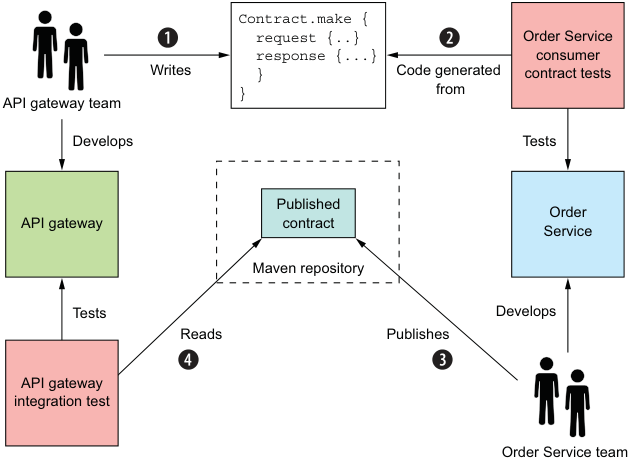


**----- Start of picture text -----**<br>
Contract.make {<br>request {..} Order Service<br>response {...} consumer<br>Writes } Code generated contract tests<br>} from<br>API gateway team<br>Develops Tests<br>Published<br>Order<br>API gateway contract Service<br>Maven repository<br>Tests Develops<br>Reads Publishes<br>API gateway<br>integration test<br>Order Service team<br>**----- End of picture text -----**<br>


Figure 9.8 The **API Gateway** team writes the contracts. The **Order Service** team uses those contracts to test **Order Service** and publishes them to a repository. The **API Gateway** team uses the published contracts to test **API Gateway** . 

- 3 The Order Service team publishes the contracts that tested Order Service to a Maven repository. 

- 4 You use the published contracts to write tests for API Gateway. 

Because you test API Gateway using the published contracts, you can be confident that it works with the deployed Order Service. 

The contracts are the key part of this testing strategy. The following listing shows an example Spring Cloud Contract. It consists of an HTTP request and an HTTP response. 

Listing 9.1 A contract that describes how **API Gateway** invokes **Order Service** 

```groovy
org.springframework.cloud.contract.spec.Contract.make { 
  request { 
    method 'GET' 
    url '/orders/1223232' 
  } 
  response { 
    status 200 
    headers { 
      header('Content-Type': 'application/json;charset=UTF-8') 
    } 
    body("{ ... }") 
  } 
}
```


_**Testing strategies for microservice architectures**_ 


The request element is an HTTP request for the REST endpoint GET /orders/ {orderId}. The response element is an HTTP response that describes an Order expected by API Gateway. The Groovy contracts are part of the provider’s code base. Each consumer team writes contracts that describe how their service interacts with the provider and gives them, perhaps via a Git pull request, to the provider team. The provider team is responsible for packaging the contracts as a JAR and publishing them to a Maven repository. The consumer-side tests download the JAR from the repository. 

Each contract’s request and response play dual roles of test data and the specification of expected behavior. In a consumer-side test, the contract is used to configure a stub, which is similar to a Mockito mock object and simulates the behavior of Order Service. It enables API Gateway to be tested without running Order Service. In the provider-side test, the generated test class invokes the provider with the contract’s request and verifies that it returns a response that matches the contract’s response. The next chapter discusses the details of how to use Spring Cloud Contract, but now we’re going to look at how to use consumer contract testing for messaging APIs. 

# CONSUMER CONTRACT TESTS FOR MESSAGING APIS 

A REST client isn’t the only kind of consumer that has expectations of a provider’s API. Services that subscribe to domain events and use asynchronous request/response-based communication are also consumers. They consume some other service’s messaging API, and make assumptions about the nature of that API. We must also write consumer contract tests for these services. 

Spring Cloud Contract also provides support for testing messaging-based interactions. The structure of a contract and how it’s used by the tests depend on the type of interaction. A contract for domain event publishing consists of an example domain event. A provider test causes the provider to emit an event and verifies that it matches the contract’s event. A consumer test verifies that the consumer can handle that event. In the next chapter, I describe an example test. 

A contract for an asynchronous request/response interaction is similar to an HTTP contract. It consists of a request message and a response message. A provider test invokes the API with the contract’s request message and verifies that the response matches the contract’s response. A consumer test uses the contract to configure a stub subscriber, which listens for the contract’s request message and replies with the specified response. The next chapter discusses an example test. But first we’ll take a look at the deployment pipeline, which runs these and other tests. 

# _9.1.3 The deployment pipeline_ 

Every service has a deployment pipeline. Jez Humble’s book, Continuous Delivery (Addison-Wesley, 2010) describes a _deployment pipeline_ as the automated process of getting code from the developer’s desktop into production. As figure 9.9 shows, it consists 


of a series of stages that execute test suites, followed by a stage that releases or deploys the service. Ideally, it’s fully automated, but it might contain manual steps. A deployment pipeline is often implemented using a Continuous Integration (CI) server, such as Jenkins. 


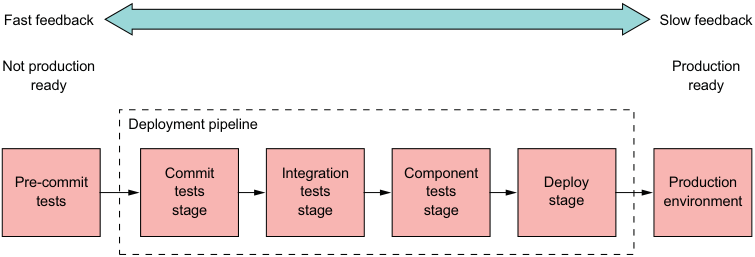


**----- Start of picture text -----**<br>
Fast feedback Slow feedback<br>Not production Production<br>ready ready<br>Deployment pipeline<br>Commit Integration Component<br>Pre-commit Deploy Production<br>tests tests tests<br>tests stage environment<br>stage stage stage<br>**----- End of picture text -----**<br>


Figure 9.9 An example deployment pipeline for **Order Service** . It consists of a series of stages. The pre-commit tests are run by the developer prior to committing their code. The remaining stages are executed by an automated tool, such as the Jenkins CI server. 

As code flows through the pipeline, the test suites subject it to increasingly more thorough testing in environments that are more production like. At the same time, the execution time of each test suite typically grows. The idea is to provide feedback about test failures as rapidly as possible. 

The example deployment pipeline shown in figure 9.9 consists of the following stages: 

- _Pre-commit tests stage_ —Runs the unit tests. This is executed by the developer before committing their changes. 

- _Commit tests stage_ —Compiles the service, runs the unit tests, and performs static code analysis. 

- _Integration tests stage_ —Runs the integration tests. 

- _Component tests stage_ —Runs the component tests for the service. 

- _Deploy stage_ —Deploys the service into production. 

The CI server runs the commit stage when a developer commits a change. It executes extremely quickly, so it provides rapid feedback about the commit. The later stages take longer to run, providing less immediate feedback. If all the tests pass, the final stage is when this pipeline deploys it into production. 

In this example, the deployment pipeline is fully automated all the way from commit to deployment. There are, however, situations that require manual steps. For example, you might need a manual testing stage, such as a staging environment. In such a scenario, the code progresses to the next stage when a tester clicks a button to indicate that it was successful. Alternatively, a deployment pipeline for an on-premise 


_**Writing unit tests for a service**_
product would release the new version of the service. Later on, the released services would be packaged into a product release and shipped to customers. 

Now that we’ve looked at the organization of the deployment pipeline and when it executes the different types of tests, let’s head to the bottom of the test pyramid and look at how to write unit tests for a service. 

# _9.2 Writing unit tests for a service_ 

Imagine that you want to write a test that verifies that the FTGO application’s Order Service correctly calculates the subtotal of an Order. You could write tests that run Order Service, invoke its REST API to create an Order, and check that the HTTP response contains the expected values. The drawback of this approach is that not only is the test complex, it’s also slow. If these tests were the compile-time tests for the Order class, you’d waste a lot of time waiting for it to finish. A much more productive approach is to write unit tests for the Order class. 

As figure 9.10 shows, unit tests are the lowest level of the test pyramid. They’re technology-facing tests that support development. A unit test verifies that a _unit_ , which is a very small part of a service, works correctly. A unit is typically a class, so the goal of unit testing is to verify that it behaves as expected. 


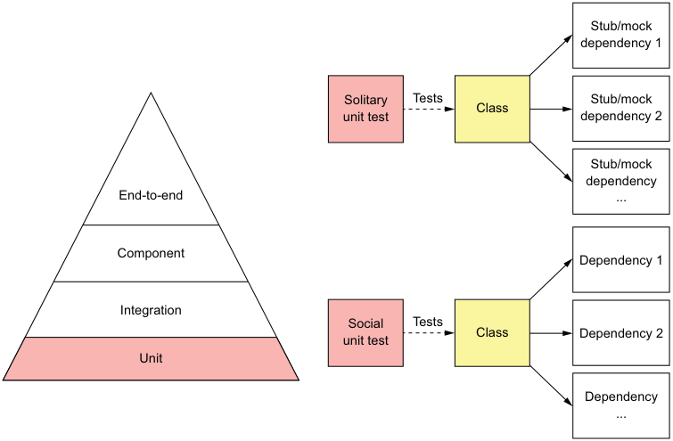


**----- Start of picture text -----**<br>
Stub/mock<br>dependency 1<br>Solitary Tests Stub/mock<br>Cl ass<br>unit test dependency 2<br>Stub/mock<br>dependency<br>End-to-end ...<br>Component<br>Dependency 1<br>Integration<br>Social Tests<br>unit test Cl ass Dependency 2<br>Unit<br>Dependency<br>...<br>**----- End of picture text -----**<br>


Figure 9.10 Unit tests are the base of the pyramid. They’re fast running, easy to write, and reliable. A solitary unit test tests a class in isolation, using mocks or stubs for its dependencies. A sociable unit test tests a class and its dependencies. 


There are two types of unit tests (https://martinfowler.com/bliki/UnitTest.html): 

- _Solitary unit test_ —Tests a class in isolation using mock objects for the class’s dependencies 

- _Sociable unit test_ —Tests a class and its dependencies 

The responsibilities of the class and its role in the architecture determine which type of test to use. Figure 9.11 shows the hexagonal architecture of a typical service and the type of unit test that you’ll typically use for each kind of class. Controller and service classes are often tested using solitary unit tests. Domain objects, such as entities and value objects, are typically tested using sociable unit tests. 


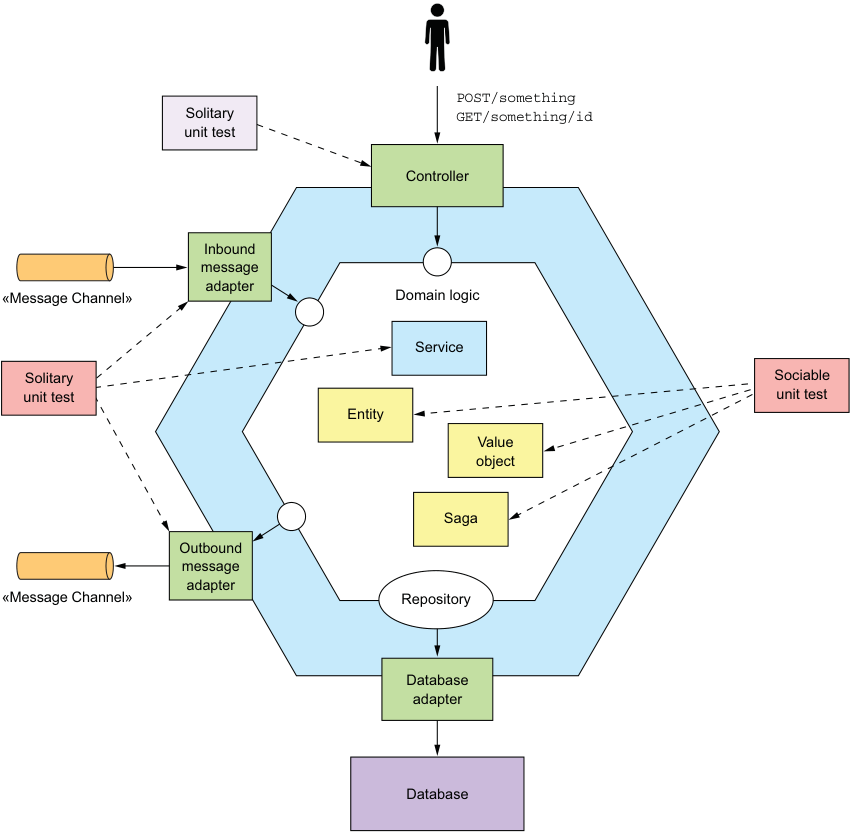


**----- Start of picture text -----**<br>
POST/something<br>Solitary GET/something/id<br>unit test<br>Controller<br>Inbound<br>message<br>adapter<br>«Message Channel» Domain logic<br>Service<br>Solitary Sociable<br>unit test unit test<br>Entity<br>Value<br>object<br>Saga<br>Outbound<br>m essage<br>adapter<br>«Message Channel» Repository<br>Database<br>adapter<br>Database<br>**----- End of picture text -----**<br>


Figure 9.11 The responsibilities of a class determine whether to use a solitary or sociable unit test. 


_**Writing unit tests for a service**_ 


The typical testing strategy for each class is as follows: 

- Entities, such as Order, which as described in chapter 5 are objects with persistent identity, are tested using sociable unit tests. 

- Value objects, such as Money, which as described in chapter 5 are objects that are collections of values, are tested using sociable unit tests. 

- Sagas, such as CreateOrderSaga, which as described in chapter 4 maintain data consistency across services, are tested using sociable unit tests. 

- Domain services, such as OrderService, which as described in chapter 5 are classes that implement business logic that doesn’t belong in entities or value objects, are tested using solitary unit tests. 

- Controllers, such as OrderController, which handle HTTP requests, are tested using solitary unit tests. 

- Inbound and outbound messaging gateways are tested using solitary unit tests. 

Let’s begin by looking at how to test entities. 

# _9.2.1 Developing unit tests for entities_ 

The following listing shows an excerpt of OrderTest class, which implements the unit tests for the Order entity. The class has an @Before setUp() method that creates an Order before running each test. Its @Test methods might further initialize Order, invoke one of its methods, and then make assertions about the return value and the state of Order. 

Listing 9.2 A simple, fast-running unit test for the **Order** entity 

```java
public class OrderTest { 
  private ResultWithEvents<Order> createResult; 
  private Order order; 

  @Before 
  public void setUp() throws Exception { 
    createResult = Order.createOrder(CONSUMER_ID, AJANTA_ID, CHICKEN_VINDALOO_LINE_ITEMS); 
    order = createResult.result; 
  } 

  @Test 
  public void shouldCalculateTotal() { 
    assertEquals(CHICKEN_VINDALOO_PRICE.multiply(CHICKEN_VINDALOO_QUANTITY), order.getOrderTotal()); 
  } 
  ... 
}
```

The @Test shouldCalculateTotal() method verifies that Order.getOrderTotal() returns the expected value. Unit tests thoroughly test the business logic. They are 


sociable unit tests for the Order class and its dependencies. You can use them as compile-time tests because they execute extremely quickly. The Order class relies on the Money value object, so it’s important to test that class as well. Let’s see how to do that. 

# _9.2.2 Writing unit tests for value objects_ 

Value objects are immutable, so they tend to be easy to test. You don’t have to worry about side effects. A test for a value object typically creates a value object in a particular state, invokes one of its methods, and makes assertions about the return value. Listing 9.3 shows the tests for the Money value object, which is a simple class that represents a money value. These tests verify the behavior of the Money class’s methods, including add(), which adds two Money objects, and multiply(), which multiplies a Money object by an integer. They are solitary tests because the Money class doesn’t depend on any other application classes. 

Listing 9.3 A simple, fast-running test for the **Money** value object 

```java
public class MoneyTest { 
  private final int M1_AMOUNT = 10; 
  private final int M2_AMOUNT = 15; 
  private Money m1 = new Money(M1_AMOUNT); 
  private Money m2 = new Money(M2_AMOUNT); 

  @Test 
  public void shouldAdd() { 
    assertEquals(new Money(M1_AMOUNT + M2_AMOUNT), m1.add(m2)); 
  } 

  @Test 
  public void shouldMultiply() { 
    int multiplier = 12; 
    assertEquals(new Money(M2_AMOUNT * multiplier), m2.multiply(multiplier)); 
  } 
  ... 
}
```

Entities and value objects are the building blocks of a service’s business logic. But some business logic also resides in the service’s sagas and services. Let’s look at how to test those. 

# _9.2.3 Developing unit tests for sagas_ 

A saga, such as the CreateOrderSaga class, implements important business logic, so needs to be tested. It’s a persistent object that sends command messages to saga participants and processes their replies. As described in chapter 4, CreateOrderSaga exchanges command/reply messages with several services, such as Consumer Service and Kitchen Service. A test for this class creates a saga and verifies that it sends the 


_**Writing unit tests for a service**_ 


expected sequence of messages to the saga participants. One test you need to write is for the happy path. You must also write tests for the various scenarios where the saga rolls back because a saga participant sent back a failure message. 

One approach would be to write tests that use a real database and message broker along with stubs to simulate the various saga participants. For example, a stub for Consumer Service would subscribe to the consumerService command channel and send back the desired reply message. But tests written using this approach would be quite slow. A much more effective approach is to write tests that mock those classes that interact with the database and message broker. That way, we can focus on testing the saga’s core responsibility. 

Listing 9.4 shows a test for CreateOrderSaga. It’s a sociable unit test that tests the saga class and its dependencies. It’s written using the Eventuate Tram Saga testing framework (https://github.com/eventuate-tram/eventuate-tram-sagas). This framework provides an easy-to-use DSL that abstracts away the details of interacting with sagas. With this DSL, you can create a saga and verify that it sends the correct command messages. Under the covers, the Saga testing framework configures the Saga framework with mocks for the database and messaging infrastructure. 

Listing 9.4 A simple, fast-running unit test for **CreateOrderSaga** 

```java
public class CreateOrderSagaTest { 

  @Test 
  public void shouldCreateOrder() { 
    given() 
      .saga(new CreateOrderSaga(kitchenServiceProxy), 
            new CreateOrderSagaState(ORDER_ID, CHICKEN_VINDALOO_ORDER_DETAILS)) 
    .expect() 
      .command(new ValidateOrderByConsumer(CONSUMER_ID, ORDER_ID, CHICKEN_VINDALOO_ORDER_TOTAL)) 
      .to(ConsumerServiceChannels.consumerServiceChannel) 
    .andGiven() 
      .successReply() 
    .expect() 
      .command(new CreateTicket(AJANTA_ID, ORDER_ID, null)) 
      .to(KitchenServiceChannels.kitchenServiceChannel); 
  } 

  @Test 
  public void shouldRejectOrderDueToConsumerVerificationFailed() { 
    given() 
      .saga(new CreateOrderSaga(kitchenServiceProxy), 
            new CreateOrderSagaState(ORDER_ID, CHICKEN_VINDALOO_ORDER_DETAILS)) 
    .expect() 
      .command(new ValidateOrderByConsumer(CONSUMER_ID, ORDER_ID, CHICKEN_VINDALOO_ORDER_TOTAL)) 
      .to(ConsumerServiceChannels.consumerServiceChannel) 
    .andGiven() 
      .failureReply() 
    .expect() 
      .command(new RejectOrderCommand(ORDER_ID)) 
      .to(OrderServiceChannels.orderServiceChannel); 
  } 
}
```

The @Test shouldCreateOrder() method tests the happy path. The @Test shouldRejectOrderDueToConsumerVerificationFailed() method tests the scenario where Consumer Service rejects the order. It verifies that CreateOrderSaga sends a RejectOrderCommand to compensate for the consumer being rejected. The CreateOrderSagaTest class has methods that test other failure scenarios. 

Let’s now look at how to test domain services. 

# _9.2.4 Writing unit tests for domain services_ 

The majority of a service’s business logic is implemented by the entities, value objects, and sagas. Domain service classes, such as the OrderService class, implement the remainder. This class is a typical domain service class. Its methods invoke entities and repositories and publish domain events. An effective way to test this kind of class is to use a mostly solitary unit test, which mocks dependencies such as repositories and messaging classes. 

Listing 9.5 shows the OrderServiceTest class, which tests OrderService. It defines solitary unit tests, which use Mockito mocks for the service’s dependencies. Each test implements the test phases as follows: 

- 1 _Setup_ —Configures the mock objects for the service’s dependencies 

- 2 _Execute_ —Invokes a service method 

- 3 _Verify_ —Verifies that the value returned by the service method is correct and that the dependencies have been invoked correctly 

Listing 9.5 A simple, fast-running unit test for the **OrderService** class 

```java
public class OrderServiceTest { 
  private OrderService orderService; 
  private OrderRepository orderRepository; 
  private DomainEventPublisher eventPublisher; 
  private RestaurantRepository restaurantRepository; 
  private SagaManager<CreateOrderSagaState> createOrderSagaManager; 
  private SagaManager<CancelOrderSagaData> cancelOrderSagaManager; 
  private SagaManager<ReviseOrderSagaData> reviseOrderSagaManager; 

  @Before 
  public void setup() { 
    orderRepository = mock(OrderRepository.class); 
    eventPublisher = mock(DomainEventPublisher.class); 
    restaurantRepository = mock(RestaurantRepository.class); 
    createOrderSagaManager = mock(SagaManager.class); 
    cancelOrderSagaManager = mock(SagaManager.class); 
    reviseOrderSagaManager = mock(SagaManager.class); 
    orderService = new OrderService(orderRepository, eventPublisher, restaurantRepository, createOrderSagaManager, cancelOrderSagaManager, reviseOrderSagaManager); 
  } 

  @Test 
  public void shouldCreateOrder() { 
    when(restaurantRepository.findById(AJANTA_ID)).thenReturn(Optional.of(AJANTA_RESTAURANT)); 
    when(orderRepository.save(any(Order.class))).then(invocation -> { 
      Order order = (Order) invocation.getArguments()[0]; 
      order.setId(ORDER_ID); 
      return order; 
    }); 

    Order order = orderService.createOrder(CONSUMER_ID, AJANTA_ID, CHICKEN_VINDALOO_MENU_ITEMS_AND_QUANTITIES); 

    verify(orderRepository).save(same(order)); 
    verify(eventPublisher).publish(Order.class, ORDER_ID, singletonList(new OrderCreatedEvent(CHICKEN_VINDALOO_ORDER_DETAILS))); 
    verify(createOrderSagaManager).create(new CreateOrderSagaState(ORDER_ID, CHICKEN_VINDALOO_ORDER_DETAILS), Order.class, ORDER_ID); 
  } 
}
```

The setUp() method creates an OrderService injected with mock dependencies. The @Test shouldCreateOrder() method verifies that OrderService.createOrder() invokes OrderRepository to save the newly created Order, publishes an OrderCreatedEvent, and creates a CreateOrderSaga. 

Now that we’ve seen how to unit test the domain logic classes, let’s look at how to unit test the adapters that interact with external systems. 

# _9.2.5 Developing unit tests for controllers_ 

Services, such as Order Service, typically have one or more controllers that handle HTTP requests from other services and the API gateway. A controller class consists of a set of request handler methods. Each method implements a REST API endpoint. A method’s parameters represent values from the HTTP request, such as path variables. It typically invokes a domain service or a repository and returns a response object. 


OrderController, for instance, invokes OrderService and OrderRepository. An effective testing strategy for controllers is solitary unit tests that mock the services and repositories. 

You could write a test class similar to the OrderServiceTest class to instantiate a controller class and invoke its methods. But this approach doesn’t test some important functionality, such as request routing. It’s much more effective to use a mock MVC testing framework, such as Spring Mock Mvc, which is part of the Spring Framework, or Rest Assured Mock MVC, which builds on Spring Mock Mvc. Tests written using one of these frameworks make what appear to be HTTP requests and make assertions about HTTP responses. These frameworks enable you to test HTTP request routing and conversion of Java objects to and from JSON without having to make real network calls. Under the covers, Spring Mock Mvc instantiates just enough of the Spring MVC classes to make this possible. 

# Are these really unit tests? 

Because these tests use the Spring Framework, you might argue that they’re not unit tests. They’re certainly more heavyweight than the unit tests I’ve described so far. The Spring Mock Mvc documentation refers to these as out-of-servlet-container integration tests (https://docs.spring.io/spring/docs/current/spring-framework-reference/ testing.html#spring-mvc-test-vs-end-to-end-integration-tests). Yet Rest Assured Mock MVC describes these tests as unit tests (https://github.com/rest-assured/restassured/wiki/Usage#spring-mock-mvc-module). Regardless of the debate over terminology, these are important tests to write. 

Listing 9.6 shows the OrderControllerTest class, which tests Order Service’s OrderController. It defines solitary unit tests that use mocks for OrderController’s dependencies. It’s written using Rest Assured Mock MVC , which provides a simple DSL that abstracts away the details of interacting with controllers. Rest Assured makes it easy to send a mock HTTP request to a controller and verify the response. OrderControllerTest creates a controller that’s injected with Mockito mocks for OrderService and OrderRepository. Each test configures the mocks, makes an HTTP request, verifies that the response is correct, and possibly verifies that the controller invoked the mocks. 

Listing 9.6 A simple, fast-running unit test for the **OrderController** class 

```java
public class OrderControllerTest { 
  private OrderService orderService; 
  private OrderRepository orderRepository; 

  @Before 
  public void setUp() throws Exception { 
    orderService = mock(OrderService.class); 
    orderRepository = mock(OrderRepository.class); 
    orderController = new OrderController(orderService, orderRepository); 
  } 

  @Test 
  public void shouldFindOrder() { 
    when(orderRepository.findById(1L)).thenReturn(Optional.of(CHICKEN_VINDALOO_ORDER)); 
    given() 
      .standaloneSetup(orderController) 
    .when() 
      .get("/orders/1") 
    .then() 
      .statusCode(200) 
      .body("orderId", equalTo(new Long(OrderDetailsMother.ORDER_ID).intValue())) 
      .body("state", equalTo(OrderDetailsMother.CHICKEN_VINDALOO_ORDER_STATE.name())) 
      .body("orderTotal", equalTo(CHICKEN_VINDALOO_ORDER_TOTAL.asString())); 
  } 
  ... 
}
```

The shouldFindOrder() test method first configures the OrderRepository mock to return an Order. It then makes an HTTP request to retrieve the order. Finally, it checks that the request was successful and that the response body contains the expected data. 

Controllers aren’t the only adapters that handle requests from external systems. There are also event/message handlers, so let’s talk about how to unit test those. 

# _9.2.6 Writing unit tests for event and message handlers_ 

Services often process messages sent by external systems. Order Service, for example, has OrderEventConsumer, which is a message adapter that handles domain events published by other services. Like controllers, message adapters tend to be simple classes that invoke domain services. Each of a message adapter’s methods typically invokes a service method with data from the message or event. 

We can unit test message adapters using an approach similar to the one we used for unit testing controllers. Each test instances the message adapter, sends a message to a channel, and verifies that the service mock was invoked correctly. Behind the 


scenes, though, the messaging infrastructure is stubbed, so no message broker is involved. Let’s look at how to test the OrderEventConsumer class. 

Listing 9.7 shows part of the OrderEventConsumerTest class, which tests OrderEventConsumer. It verifies that OrderEventConsumer routes each event to the appropriate handler method and correctly invokes OrderService. The test uses the Eventuate Tram Mock Messaging framework, which provides an easy-to-use DSL for writing mock messaging tests that uses the same given-when-then format as Rest Assured. Each test instantiates OrderEventConsumer injected with a mock OrderService, publishes a domain event, and verifies that OrderEventConsumer correctly invokes the service mock. 

Listing 9.7 A fast-running unit test for the **OrderEventConsumer** class 

```java
public class OrderEventConsumerTest { 
  private OrderService orderService; 
  private OrderEventConsumer orderEventConsumer; 

  @Before 
  public void setUp() throws Exception { 
    orderService = mock(OrderService.class); 
    orderEventConsumer = new OrderEventConsumer(orderService); 
  } 

  @Test 
  public void shouldCreateMenu() { 
    given() 
      .eventHandlers(orderEventConsumer.domainEventHandlers()) 
    .when() 
      .aggregate("net.chrisrichardson.ftgo.restaurantservice.domain.Restaurant", AJANTA_ID) 
      .publishes(new RestaurantCreated(AJANTA_RESTAURANT_NAME, RestaurantMother.AJANTA_RESTAURANT_MENU)) 
    .then() 
      .verify(() -> { 
        verify(orderService).createMenu(AJANTA_ID, new RestaurantMenu(RestaurantMother.AJANTA_RESTAURANT_MENU_ITEMS)); 
      }); 
  } 
}
```

The setUp() method creates an OrderEventConsumer injected with a mock OrderService. The shouldCreateMenu() method publishes a RestaurantCreated event and verifies that OrderEventConsumer invoked OrderService.createMenu(). The OrderEventConsumerTest class and the other unit test classes execute extremely quickly. The unit tests run in just a few seconds. 


_**Summary**_ 

But the unit tests don’t verify that a service, such as Order Service, properly interacts with other services. For example, the unit tests don’t verify that an Order can be persisted in MySQL. Nor do they verify that CreateOrderSaga sends command messages in the right format to the right message channel. And they don’t verify that the RestaurantCreated event processed by OrderEventConsumer has the same structure as the event published by Restaurant Service. In order to verify that a service properly interacts with other services, we must write integration tests. We also need to write component tests that test an entire service in isolation. The next chapter discusses how to conduct those types of tests, as well as end-to-end tests. 

# _Summary_ 

- Automated testing is the key foundation of rapid, safe delivery of software. What’s more, because of its inherent complexity, to fully benefit from the microservice architecture you _must_ automate your tests. 

- The purpose of a test is to verify the behavior of the system under test (SUT). In this definition, _system_ is a fancy term that means the software element being tested. It might be something as small as a class, as large as the entire application, or something in between, such as a cluster of classes or an individual service. A collection of related tests form a test suite. 

- A good way to simplify and speed up a test is to use test doubles. A test double is an object that simulates the behavior of a SUT’s dependency. There are two types of test doubles: stubs and mocks. A stub is a test double that returns values to the SUT. A mock is a test double that a test uses to verify that the SUT correctly invokes a dependency. 

- Use the test pyramid to determine where to focus your testing efforts for your services. The majority of your tests should be fast, reliable, and easy-to-write unit tests. You must minimize the number of end-to-end tests, because they’re slow, brittle, and time consuming to write. 


