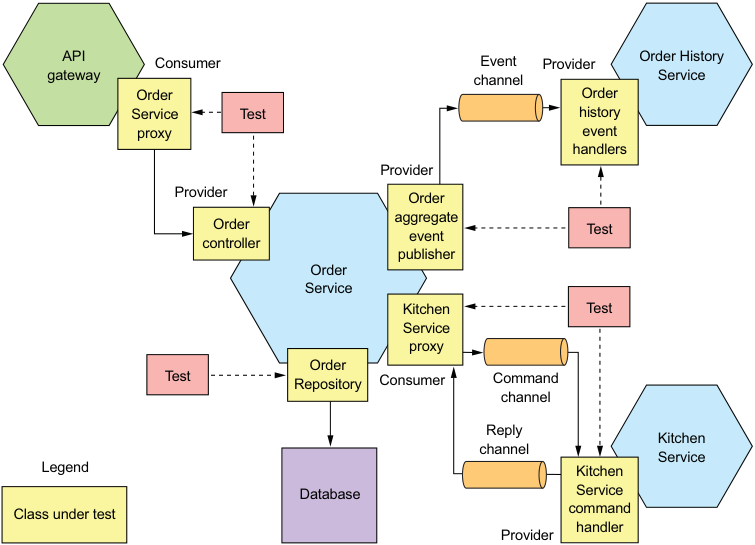
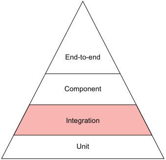
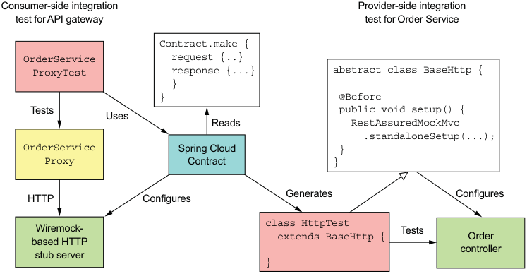
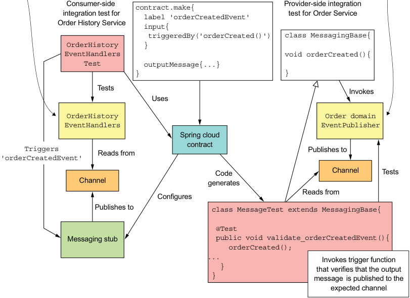
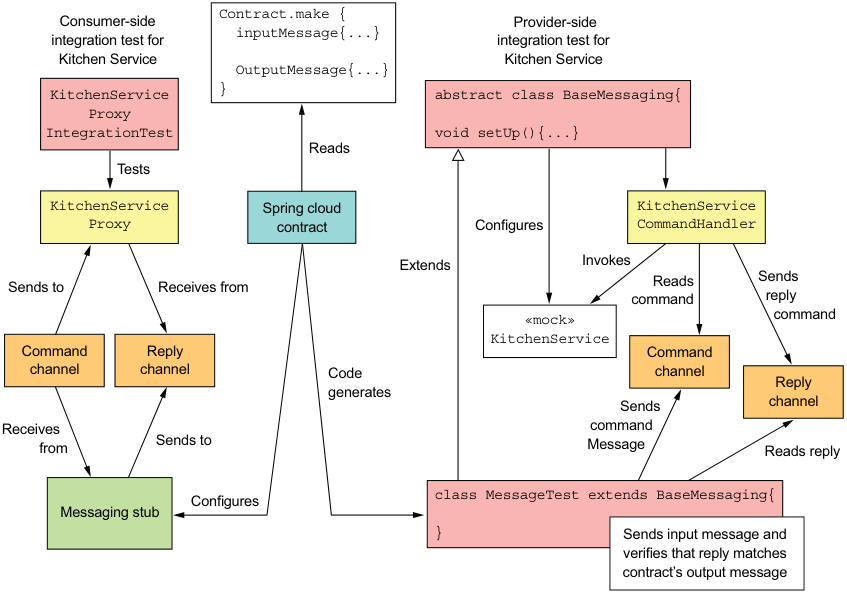
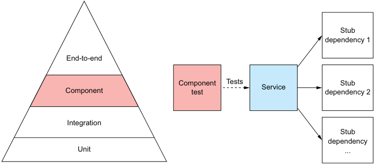
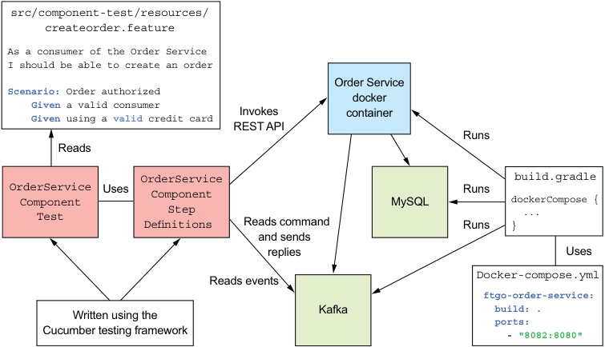
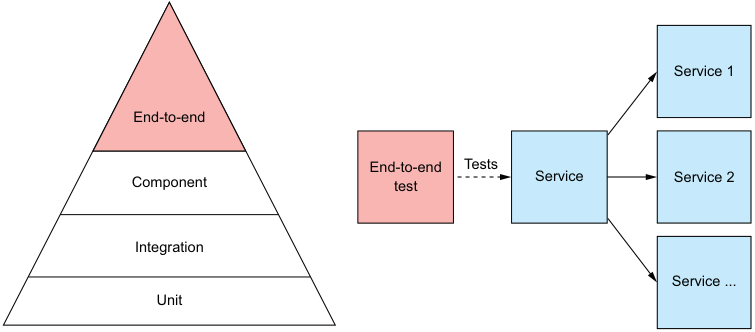

# 10 Testing microservices: Part 2

**This chapter covers**

- Techniques for testing services in isolation 

- Using consumer-driven contract testing to write tests that quickly yet reliably verify interservice communication 

- When and how to do end-to-end testing of applications 

This chapter builds on the previous chapter, which introduced testing concepts, including the test pyramid. The _test pyramid_ describes the relative proportions of the different types of tests that you should write. The previous chapter described how to write unit tests, which are at the base of the testing pyramid. In this chapter, we continue our ascent of the testing pyramid. 

This chapter begins with how to write integration tests, which are the level above unit tests in the testing pyramid. _Integration tests_ verify that a service can properly interact with infrastructure services, such as databases, and other application services. Next, I cover _component tests_ , which are acceptance tests for services. A component test tests a service in isolation by using stubs for its dependencies. After that, I describe how to write end-to-end tests, which test a group of services or the entire application. End-to-end tests are at the top of the test pyramid and should, therefore, be used sparingly. 

Let’s start by taking a look at how to write integration tests. 

## 10.1 Writing integration tests

Services typically interact with other services. For example, Order Service, as figure 10.1 shows, interacts with several services. Its REST API is consumed by API Gateway, and its domain events are consumed by services, including Order History Service. Order Service uses several other services. It persists Orders in MySQL. It also sends commands to and consumes replies from several other services, such as Kitchen Service. 



**----- Start of picture text -----**<br>
API Consumer Event Provider Order History<br>gateway channel Service<br>Order Order<br>Service Test history<br>proxy event<br>handlers<br>Provider<br>Provider Order<br>Order aggregateevent Test<br>controller<br>publisher<br>Order<br>Service<br>Kitchen Test<br>Service<br>proxy<br>Order<br>T est Repository Consumer Command<br>channel<br>Reply Kitchen<br>channel<br>Service<br>Legend Kitchen<br>Database Service<br>Class under test command<br>handler<br>Provider<br>**----- End of picture text -----**<br>

Figure 10.1 Integration tests must verify that a service can communicate with its clients and dependencies. But rather than testing whole services, the strategy is to test the individual adapter classes that implement the communication. 

In order to be confident that a service such as Order Service works as expected, we must write tests that verify that the service can properly interact with infrastructure services and other application services. One approach is to launch all the services and test them through their APIs. This, however, is what’s known as end-to-end testing, which is slow, brittle, and costly. As explained in section 10.3, there’s a role for end-to-end testing sometimes, but it’s at the top of the test pyramid, so you want to minimize the number of end-to-end tests. 

A much more effective strategy is to write what are known as integration tests. As figure 10.2 shows, integration tests are the layer above unit tests in the testing pyramid. They verify that a service can properly interact with infrastructure services and other services. But unlike end-to-end tests, they don’t launch services. Instead, we use a couple of strategies that significantly simplify the tests without impacting their effectiveness. 



**----- Start of picture text -----**<br>
End-to-end<br>Component<br>Integration<br>Unit<br>**----- End of picture text -----**<br>

Figure 10.2 Integration tests are the layer above unit tests. They verify that a service can communicate with its dependencies, which includes infrastructure services, such as the database, and application services. 

The first strategy is to test each of the service’s adapters, along with, perhaps, the adapter’s supporting classes. For example, in section 10.1.1 you’ll see a JPA persistence test that verifies that Orders are persisted correctly. Rather than test persistence through Order Service’s API, it directly tests the OrderRepository class. Similarly, in section 10.1.3 you’ll see a test that verifies that Order Service publishes correctly structured domain events by testing the OrderDomainEventPublisher class. The benefit of testing only a small number of classes rather than the entire service is that the tests are significantly simpler and faster. 

The second strategy for simplifying integration tests that verify interactions between application services is to use contracts, discussed in chapter 9. A _contract_ is a concrete example of an interaction between a pair of services. As table 10.1 shows, the structure of a contract depends on the type of interaction between the services. 

Table 10.1 The structure of a contract depends on the type of interaction between the services. 

|Interaction style|Consumer|Provider|Contract|
|---|---|---|---|
|REST-based,<br>request/response<br>Publish/subscribe<br>Asynchronous<br>request/response|API Gateway<br>Order History Service<br>Order Service|Order Service<br>Order Service<br>Kitchen Service|HTTP request and<br>response<br>Domain event<br>Command message<br>and reply message|

A contract consists of either one message, in the case of publish/subscribe style interactions, or two messages, in the case of request/response and asynchronous request/ response style interactions. 

The contracts are used to test both the consumer and the provider, which ensures that they agree on the API. They’re used in slightly different ways depending on whether you’re testing the consumer or the provider: 

- _Consumer-side tests_ —These are tests for the consumer’s adapter. They use the contracts to configure stubs that simulate the provider, enabling you to write integration tests for a consumer that don’t require a running provider. 

- _Provider-side tests_ —These are tests for the provider’s adapter. They use the contracts to test the adapters using mocks for the adapters’s dependencies. 

Later in this section, I describe examples of these types of tests—but first let’s look at how to write persistence tests. 

### 10.1.1 Persistence integration tests

Services typically store data in a database. For instance, Order Service persists aggregates, such as Order, in MySQL using JPA. Similarly, Order History Service maintains a CQRS view in AWS DynamoDB. The unit tests we wrote earlier only test in-memory objects. In order to be confident that a service works correctly, we must write persistence integration tests, which verify that a service’s database access logic works as expected. In the case of Order Service, this means testing the JPA repositories, such as OrderRepository. 

Each phase of a persistence integration test behaves as follows: 

- _Setup_ —Set up the database by creating the database schema and initializing it to a known state. It might also begin a database transaction. 

- _Execute_ —Perform a database operation. 

- _Verify_ —Make assertions about the state of the database and objects retrieved from the database. 

- _Teardown_ —An optional phase that might undo the changes made to the database by, for example, rolling back the transaction that was started by the setup phase. 

Listing 10.1 shows a persistent integration test for the Order aggregate and OrderRepository. Apart from relying on JPA to create the database schema, the persistence integration tests don’t make any assumption about the state of the database. Consequently, tests don’t need to roll back the changes they make to the database, which avoids problems with the ORM caching data changes in memory. 

Listing 10.1 An integration test that verifies that an **Order** can be persisted 

```java
@RunWith(SpringRunner.class) 
@SpringBootTest(classes = OrderJpaTestConfiguration.class) 
public class OrderJpaTest { 
  @Autowired 
  private OrderRepository orderRepository; 

  @Autowired 
  private TransactionTemplate transactionTemplate; 

  @Test 
  public void shouldSaveAndLoadOrder() { 
    Long orderId = transactionTemplate.execute((ts) -> { 
      Order order = new Order(CONSUMER_ID, AJANTA_ID, CHICKEN_VINDALOO_LINE_ITEMS); 
      orderRepository.save(order); 
      return order.getId(); 
    }); 

      Order order = orderRepository.findById(orderId).get(); 
      assertEquals(OrderState.APPROVAL_PENDING, order.getState()); 
      assertEquals(AJANTA_ID, order.getRestaurantId()); 
      assertEquals(CONSUMER_ID, order.getConsumerId().longValue()); 
      assertEquals(CHICKEN_VINDALOO_LINE_ITEMS, order.getLineItems()); 
      return null; 
    }); 
  } 
}
```

The shouldSaveAndLoadOrder() test method executes two transactions. The first saves a newly created Order in the database. The second transaction loads the Order and verifies that its fields are properly initialized. 

One problem you need to solve is how to provision the database that’s used in persistence integration tests. An effective solution to run an instance of the database during testing is to use Docker. Section 10.2 describes how to use the Docker Compose Gradle plugin to automatically run services during component testing. You can use a similar approach to run MySQL, for example, during persistence integration testing. 

The database is only one of the external services a service interacts with. Let’s now look at how to write integration tests for interservice communication between application services, starting with REST. 

### 10.1.2 Integration testing REST-based request/response style interactions

REST is a widely used interservice communication mechanism. The REST client and REST service must agree on the REST API, which includes the REST endpoints and the structure of the request and response bodies. The client must send an HTTP request to the correct endpoint, and the service must send back the response that the client expects. 

For example, chapter 8 describes how the FTGO application’s API Gateway makes REST API calls to numerous services, including ConsumerService, Order Service, and Delivery Service. The OrderService’s GET /orders/{orderId} endpoint is one of the endpoints invoked by the API Gateway. In order to be confident that API Gateway and Order Service can communicate without using an end-to-end test, we need to write integration tests. 

As stated in the preceding chapter, a good integration testing strategy is to use consumer-driven contract tests. The interaction between API Gateway and GET /orders/{orderId} can be described using a set of HTTP-based contracts. Each contract consists of an HTTP request and an HTTP reply. The contracts are used to test API Gateway and Order Service. 

Figure 10.3 shows how to use Spring Cloud Contract to test REST-based interactions. The consumer-side API Gateway integration tests use the contracts to configure an HTTP stub server that simulates the behavior of Order Service. A contract’s request specifies an HTTP request from the API gateway, and the contract’s response specifies the response that the stub sends back to the API gateway. Spring Cloud Contract uses the contracts to code-generate the provider-side Order Service integration tests, which test the controllers using Spring Mock MVC or Rest Assured Mock MVC. The contract’s request specifies the HTTP request to make to the controller, and the contract’s response specifies the controller’s expected response. 

The consumer-side OrderServiceProxyTest invokes OrderServiceProxy, which has been configured to make HTTP requests to WireMock. WireMock is a tool for efficiently mocking HTTP servers—in this test it simulates Order Service. Spring Cloud 



**----- Start of picture text -----**<br>
Consumer-side integration Provider-side integration<br>test forAPI gateway test for Order Service<br>Contract.make {<br>OrderService request {..}<br>ProxyTest response {...} abstract class BaseHttp {<br>}<br>} @Before<br>Tests Uses public void setup() {<br>Reads RestAssuredMockMvc<br>.standaloneSetup(...);<br>OrderService Spring Cloud }<br>Proxy Contract }<br>HTTP Configures Generates Configures<br>Wiremock- class HttpTest Tests<br>based HTTP extends BaseHttp { Order<br>controller<br>stub server<br>}<br>**----- End of picture text -----**<br>

Figure 10.3 The contracts are used to verify that the adapter classes on both sides of the REST-based communication between **API Gateway** and **Order Service** conform to the contract. The consumer-side tests verify that **OrderServiceProxy** invokes **Order Service** correctly. The provider-side tests verify that **OrderController** implements the REST API endpoints correctly. 

Contract manages WireMock and configures it to respond to the HTTP requests defined by the contracts. 

On the provider side, Spring Cloud Contract generates a test class called HttpTest, which uses Rest Assured Mock MVC to test Order Service’s controllers. Test classes such as HttpTest must extend a handwritten base class. In this example, the base class BaseHttp instantiates OrderController injected with mock dependencies and calls RestAssuredMockMvc.standaloneSetup() to configure Spring MVC. 

Let’s take a closer look at how this works, starting with an example contract. 

**AN EXAMPLE CONTRACT FOR A REST API**

A REST contract, such as the one shown in listing 10.2, specifies an HTTP request, which is sent by the REST client, and the HTTP response, which the client expects to get back from the REST server. A contract’s request specifies the HTTP method, the path, and optional headers. A contract’s response specifies the HTTP status code, optional headers, and, when appropriate, the expected body. 

Listing 10.2 A contract that describes an HTTP-based request/response style interaction 

```groovy
org.springframework.cloud.contract.spec.Contract.make { 
  request { 
    method 'GET' 
    url '/orders/1223232' 
  } 
  response { 
    status 200 
    headers { 
      header('Content-Type': 'application/json;charset=UTF-8') 
    } 
    body('''{"orderId" : "1223232", "state" : "APPROVAL_PENDING"}''') 
  } 
}
```

This particular contract describes a successful attempt by API Gateway to retrieve an Order from Order Service. Let’s now look at how to use this contract to write integration tests, starting with the tests for Order Service. 

CONSUMER-DRIVEN CONTRACT INTEGRATION TESTS FOR ORDER SERVICE 

The consumer-driven contract integration tests for Order Service verify that its API meets its clients’ expectations. Listing 10.3 shows HttpBase, which is the base class for the test class code-generated by Spring Cloud Contract. It’s responsible for the setup phase of the test. It creates the controllers injected with mock dependencies and configures those mocks to return values that cause the controller to generate the expected response. 

Listing 10.3 The abstract base class for the tests code-generated by Spring Cloud Contract 

```java
public abstract class HttpBase { 
  private StandaloneMockMvcBuilder controllers(Object... controllers) { 
    return MockMvcBuilders.standaloneSetup(controllers) 
      .setMessageConverters(...); 
  } 

  @Before 
  public void setup() { 
    OrderService orderService = mock(OrderService.class); 
    OrderRepository orderRepository = mock(OrderRepository.class); 
    OrderController orderController = new OrderController(orderService, orderRepository); 

    when(orderRepository.findById(1223232L)) 
      .thenReturn(Optional.of(OrderDetailsMother.CHICKEN_VINDALOO_ORDER)); 

    RestAssuredMockMvc.standaloneSetup(controllers(orderController)); 
  } 
}
```

**Configure Spring MVC with OrderController.** 

**Configure OrderResponse to return an Order when findById() is invoked with the orderId specified in the contract.** 

The argument 1223232L that’s passed to the mock OrderRepository’s findById() method matches the orderId specified in the contract shown in listing 10.3. This test verifies that Order Service has a GET /orders/{orderId} endpoint that matches its client’s expectations. 

Let’s take a look at the corresponding client test. 

CONSUMER-SIDE INTEGRATION TEST FOR API GATEWAY’S ORDERSERVICEPROXY 

API Gateway’s OrderServiceProxy invokes the GET /orders/{orderId} endpoint. Listing 10.4 shows the OrderServiceProxyIntegrationTest test class, which verifies that it conforms to the contracts. This class is annotated with @AutoConfigureStubRunner, provided by Spring Cloud Contract. It tells Spring Cloud Contract to run the WireMock server on a random port and configure it using the specified contracts. OrderServiceProxyIntegrationTest configures OrderServiceProxy to make requests to the WireMock port. 

Listing 10.4 A consumer-side integration test for **API Gateway** 's **OrderServiceProxy** 

```java
@RunWith(SpringRunner.class) 
@SpringBootTest(classes=TestConfiguration.class, webEnvironment= SpringBootTest.WebEnvironment.NONE) 
@AutoConfigureStubRunner(ids = {"net.chrisrichardson.ftgo.contracts:ftgo-order-service-contracts"}, workOffline = false) 
@DirtiesContext 
public class OrderServiceProxyIntegrationTest { 
  @Value("${stubrunner.runningstubs.ftgo-order-service-contracts.port}") 
  private int port; 

  private OrderDestinations orderDestinations; 
  private OrderServiceProxy orderService; 

  @Before 
  public void setUp() throws Exception { 
    orderDestinations = new OrderDestinations(); 
    String orderServiceUrl = "http://localhost:" + port; 
    orderDestinations.setOrderServiceUrl(orderServiceUrl); 
    orderService = new OrderServiceProxy(orderDestinations, WebClient.create()); 
  } 

  @Test 
  public void shouldVerifyExistingCustomer() { 
    OrderInfo result = orderService.findOrderById("1223232").block(); 
    assertEquals("1223232", result.getOrderId()); 
    assertEquals("APPROVAL_PENDING", result.getState()); 
  } 

  @Test(expected = OrderNotFoundException.class) 
  public void shouldFailToFindMissingOrder() { 
    orderService.findOrderById("555").block(); 
  } 
}
```

Each test method invokes OrderServiceProxy and verifies that either it returns the correct values or throws the expected exception. The shouldVerifyExistingCustomer() test method verifies that findOrderById() returns values equal to those specified in the contract’s response. The shouldFailToFindMissingOrder() attempts to retrieve a nonexistent Order and verifies that OrderServiceProxy throws an OrderNotFoundException. Testing both the REST client and the REST service using the same contracts ensures that they agree on the API. 

Let’s now look at how to do the same kind of testing for services that interact using messaging. 

### 10.1.3 Integration testing publish/subscribe-style interactions

Services often publish domain events that are consumed by one or more other services. Integration testing must verify that the publisher and its consumers agree on the message channel and the structure of the domain events. Order Service, for example, publishes Order* events whenever it creates or updates an Order aggregate. Order History Service is one of the consumers of those events. We must, therefore, write tests that verify that these services can interact. 

Figure 10.4 shows the approach to integration testing publish/subscribe interactions. Its quite similar to the approach used for testing REST interactions. As before, the interactions are defined by a set of contracts. What’s different is that each contract specifies a domain event. 

**Class under test**

**Class under test**



**----- Start of picture text -----**<br>
Consumer-side contract.make{ Provider-side integration<br>integration test for label 'orderCreatedEvent' test for Order Service<br>Order History Service<br>input{<br>triggeredBy('orderCreated()') class MessagingBase{<br>OrderHistory }<br>EventHandlers void orderCreated(){<br>Test outputMessage{...}<br>} }<br>Tests<br>Invokes<br>Uses<br>OrderHistory Order domain<br>EventHandlers EventPublisher<br>Spring cloud<br>contract<br>Triggers Publishes to<br>Reads from<br>'orderCreatedEvent'<br>Code Channel Tests<br>Channel generates<br>Reads from<br>Configures<br>Publishes to class MessageTest extends MessagingBase{<br>@Test<br>Messaging stub public void validate_orderCreatedEvent(){<br>orderCreated();<br>... Invokes trigger function<br>} that verifies that the output<br>} message is published to the<br>expected channel<br>**----- End of picture text -----**<br>

Figure 10.4 The contracts are used to test both sides of the publish/subscribe interaction. The provider-side tests verify that **OrderDomainEventPublisher** publishes events that confirm to the contract. The consumer-side tests verify that **OrderHistoryEventHandlers** consume the example events from the contract. 

Each consumer-side test publishes the event specified by the contract and verifies that OrderHistoryEventHandlers invokes its mocked dependencies correctly. 

On the provider side, Spring Cloud Contract code-generates test classes that extend MessagingBase, which is a hand-written abstract superclass. Each test method invokes a hook method defined by MessagingBase, which is expected to trigger the publication of an event by the service. In this example, each hook method invokes OrderDomainEventPublisher, which is responsible for publishing Order aggregate events. The test method then verifies that OrderDomainEventPublisher published the expected event. Let’s look at the details of how these tests work, starting with the contract. 

THE CONTRACT FOR PUBLISHING AN ORDERCREATED EVENT 

Listing 10.5 shows the contract for an OrderCreated event. It specifies the event’s channel, along with the expected body and message headers. 

Listing 10.5 A contract for a publish/subscribe interaction style 

```groovy
package contracts org.springframework.cloud.contract.spec.Contract.make { 
  input { 
  } 
  outputMessage { 
    sentTo('net.chrisrichardson.ftgo.orderservice.domain.Order') 
    body('''{"orderDetails":{"lineItems":[{"quantity":5,"menuItemId":"1", 
            "name":"Chicken Vindaloo","price":"12.34","total":"61.70"}], 
            "orderTotal":"61.70","restaurantId":1, 
            "consumerId":1511300065921},"orderState":"APPROVAL_PENDING"}''') 
    headers { 
      header('event-aggregate-type', 'net.chrisrichardson.ftgo.orderservice.domain.Order') 
      header('event-aggregate-id', '1') 
    } 
  } 
}
```

The contract also has two other important elements: 

- label—is used by a consumer test to trigger publication of the event by Spring Contact 

- triggeredBy—the name of the superclass method invoked by the generated test method to trigger the publishing of the event 

Let’s look at how the contract is used, starting with the provider-side test for OrderService. 

CONSUMER-DRIVEN CONTRACT TESTS FOR ORDER SERVICE 

The provider-side test for Order Service is another consumer-driven contract integration test. It verifies that OrderDomainEventPublisher, which is responsible for publishing Order aggregate domain events, publishes events that match its clients’ expectations. Listing 10.6 shows MessagingBase, which is the base class for the test classes code-generated by Spring Cloud Contract. It’s responsible for configuring the OrderDomainEventPublisher class to use in-memory messaging stubs. It also defines the methods, such as orderCreated(), which are invoked by the generated tests to trigger the publishing of the event. 

Listing 10.6 The abstract base class for the Spring Cloud Contract provider-side tests 

```java
@RunWith(SpringRunner.class) 
@SpringBootTest(classes = MessagingBase.TestConfiguration.class, webEnvironment = SpringBootTest.WebEnvironment.NONE) 
@AutoConfigureMessageVerifier 
public abstract class MessagingBase { 
  @Configuration 
  @EnableAutoConfiguration 
  @Import({EventuateContractVerifierConfiguration.class, TramEventsPublisherConfiguration.class, TramInMemoryConfiguration.class}) 
  public static class TestConfiguration { 
    @Bean 
    public OrderDomainEventPublisher orderDomainEventPublisher(DomainEventPublisher eventPublisher) { 
      return new OrderDomainEventPublisher(eventPublisher); 
    } 
  } 

  @Autowired 
  private OrderDomainEventPublisher OrderDomainEventPublisher; 

  protected void orderCreated() { 
    OrderDomainEventPublisher.publish(CHICKEN_VINDALOO_ORDER, singletonList(new OrderCreatedEvent(CHICKEN_VINDALOO_ORDER_DETAILS))); 
  } 
}
```

This test class configures OrderDomainEventPublisher with in-memory messaging stubs. orderCreated() is invoked by the test method generated from the contract shown earlier in listing 10.5. It invokes OrderDomainEventPublisher to publish an OrderCreated event. The test method attempts to receive this event and then verifies that it matches the event specified in the contract. Let’s now look at the corresponding consumer-side tests. 

**CONSUMER-SIDE CONTRACT TEST FOR THE ORDER HISTORY SERVICE**

Order History Service consumes events published by Order Service. As I described in chapter 7, the adapter class that handles these events is the OrderHistoryEventHandlers class. Its event handlers invoke OrderHistoryDao to update the CQRS view. Listing 10.7 shows the consumer-side integration test. It creates an OrderHistoryEventHandlers injected with a mock OrderHistoryDao. Each test method first invokes Spring Cloud to publish the event defined in the contract and then verifies that OrderHistoryEventHandlers invokes OrderHistoryDao correctly. 

Listing 10.7 The consumer-side integration test for the **OrderHistoryEventHandlers** class 

```java
@RunWith(SpringRunner.class) 
@SpringBootTest(classes= OrderHistoryEventHandlersTest.TestConfiguration.class, webEnvironment= SpringBootTest.WebEnvironment.NONE) 
@AutoConfigureStubRunner(ids = {"net.chrisrichardson.ftgo.contracts:ftgo-order-service-contracts"}, workOffline = false) 
@DirtiesContext 
public class OrderHistoryEventHandlersTest { 
  @Configuration 
  @EnableAutoConfiguration 
  @Import({OrderHistoryServiceMessagingConfiguration.class, TramCommandProducerConfiguration.class, TramInMemoryConfiguration.class, EventuateContractVerifierConfiguration.class}) 
  public static class TestConfiguration { 
    @Bean 
    public OrderHistoryDao orderHistoryDao() { 
      return mock(OrderHistoryDao.class); 
    } 
  } 

  @Test 
  public void shouldHandleOrderCreatedEvent() throws Exception { 
    stubFinder.trigger("orderCreatedEvent"); 
    eventually(() -> { 
      verify(orderHistoryDao).addOrder(any(Order.class), any(Optional.class)); 
    }); 
  } 
}
```

The shouldHandleOrderCreatedEvent() test method tells Spring Cloud Contract to publish the OrderCreated event. It then verifies that OrderHistoryEventHandlers invoked orderHistoryDao.addOrder(). Testing both the domain event’s publisher and consumer using the same contracts ensures that they agree on the API. Let’s now look at how to do integration test services that interact using asynchronous request/response. 

### 10.1.4 Integration contract tests for asynchronous request/response interactions

Publish/subscribe isn’t the only kind of messaging-based interaction style. Services also interact using asynchronous request/response. For example, in chapter 4 we saw that Order Service implements sagas that send command messages to various services, such as Kitchen Service, and processes the reply messages. 

The two parties in an asynchronous request/response interaction are the requestor, which is the service that sends the command, and the replier, which is the service that processes the command and sends back a reply. They must agree on the name of command message channel and the structure of the command and reply messages. Let’s look at how to write integration tests for asynchronous request/response interactions. 

Figure 10.5 shows how to test the interaction between Order Service and Kitchen Service. The approach to integration testing asynchronous request/response interactions is quite similar to the approach used for testing REST interactions. The interactions between the services are defined by a set of contracts. What’s different is that a contract specifies an input message and an output message instead of an HTTP request and reply. 



**----- Start of picture text -----**<br>
Consumer-side Contract.make { Provider-side<br>inputMessage{...}<br>integration test for integration test for<br>Kitchen Service Kitchen Service<br>OutputMessage{...}<br>KitchenService } abstract class BaseMessaging{<br>Proxy<br>IntegrationTest void setUp(){...}<br>Reads<br>Tests<br>KitchenService Spring cloud KitchenService<br>Proxy contract Configures CommandHandler<br>Extends Invokes<br>Sends to Receives from Reads Sends<br>command reply<br>«mock» command<br>KitchenService<br>Command Reply Command<br>channel channel Code channel<br>Reply<br>generates Sends channel<br>Receives command<br>from Sends to Message Reads reply<br>class MessageTest extends BaseMessaging{<br>Configures<br>Messaging stub<br>} Sends input message and<br>verifies that reply matches<br>contract’s output message<br>**----- End of picture text -----**<br>

Figure 10.5 The contracts are used to test the adapter classes that implement each side of the asynchronous request/response interaction. The provider-side tests verify that **KitchenServiceCommandHandler** handles commands and sends back replies. The consumer-side tests verify **KitchenServiceProxy** sends commands that conform to the contract, and that it handles the example replies from the contract. 

The consumer-side test verifies that the command message proxy class sends correctly structured command messages and correctly processes reply messages. In this example, KitchenServiceProxyTest tests KitchenServiceProxy. It uses Spring Cloud Contract to configure messaging stubs that verify that the command message matches a contract’s input message and replies with the corresponding output message. 

The provider-side tests are code-generated by Spring Cloud Contract. Each test method corresponds to a contract. It sends the contract’s input message as a command message and verifies that the reply message matches the contract’s output message. Let’s look at the details, starting with the contract. 

**EXAMPLE ASYNCHRONOUS REQUEST/RESPONSE CONTRACT**

Listing 10.8 shows the contract for one interaction. It consists of an input message and an output message. Both messages specify a message channel, message body, and message headers. The naming convention is from the provider’s perspective. The input message’s messageFrom element specifies the channel that the message is read from. 

Similarly, the output message’s sentTo element specifies the channel that the reply should be sent to. 

Listing 10.8 Contract describing how **Order Service** asynchronously invokes **Kitchen Service** 

```groovy
package contracts org.springframework.cloud.contract.spec.Contract.make { 
  label 'createTicket' 
  input { 
    messageFrom('kitchenService') 
    messageBody('''{"orderId":1,"restaurantId":1,"ticketDetails":{...}}''') 
    messageHeaders { 
      header('command_type','net.chrisrichardson...CreateTicket') 
      header('command_saga_type','net.chrisrichardson...CreateOrderSaga') 
      header('command_saga_id',$(consumer(regex('[0-9a-f]{16}-[0-9a-f]{16}')))) 
      header('command_reply_to','net.chrisrichardson...CreateOrderSaga-Reply') 
    } 
  } 
  outputMessage { 
    sentTo('net.chrisrichardson...CreateOrderSaga-reply') 
    body([ ticketId: 1 ]) 
    headers { 
      header('reply_type', 'net.chrisrichardson...CreateTicketReply') 
      header('reply_outcome-type', 'SUCCESS') 
    } 
  } 
}
```

In this example contract, the input message is a CreateTicket command that’s sent to the kitchenService channel. The output message is a successful reply that’s sent to the CreateOrderSaga’s reply channel. Let’s look at how to use this contract in tests, starting with the consumer-side tests for Order Service. 

CONSUMER-SIDE CONTRACT INTEGRATION TEST FOR AN ASYNCHRONOUS REQUEST/RESPONSE INTERACTION 

The strategy for writing a consumer-side integration test for an asynchronous request/ response interaction is similar to testing a REST client. The test invokes the service’s messaging proxy and verifies two aspects of its behavior. First, it verifies that the messaging proxy sends a command message that conforms to the contract. Second, it verifies that the proxy properly handles the reply message. 

Listing 10.9 shows the consumer-side integration test for KitchenServiceProxy, which is the messaging proxy used by Order Service to invoke Kitchen Service. Each test sends a command message using KitchenServiceProxy and verifies that it returns the expected result. It uses Spring Cloud Contract to configure messaging stubs for 

Kitchen Service that find the contract whose input message matches the command message and sends its output message as the reply. The tests use in-memory messaging for simplicity and speed. 

Listing 10.9 The consumer-side contract integration test for **Order Service** 

```java
@RunWith(SpringRunner.class) 
@SpringBootTest(classes= KitchenServiceProxyIntegrationTest.TestConfiguration.class, webEnvironment= SpringBootTest.WebEnvironment.NONE) 
@AutoConfigureStubRunner(ids = {"net.chrisrichardson.ftgo.contracts:ftgo-kitchen-service-contracts"}, workOffline = false) 
@DirtiesContext 
public class KitchenServiceProxyIntegrationTest { 
  @Configuration 
  @EnableAutoConfiguration 
  @Import({TramCommandProducerConfiguration.class, TramInMemoryConfiguration.class, EventuateContractVerifierConfiguration.class}) 
  public static class TestConfiguration { 
    ... 
  } 

  @Autowired 
  private SagaMessagingTestHelper sagaMessagingTestHelper; 

  @Autowired 
  private KitchenServiceProxy kitchenServiceProxy; 

  @Test 
  public void shouldSuccessfullyCreateTicket() { 
    CreateTicket command = new CreateTicket(AJANTA_ID, OrderDetailsMother.ORDER_ID, 
      new TicketDetails(Collections.singletonList( 
        new TicketLineItem(CHICKEN_VINDALOO_MENU_ITEM_ID, CHICKEN_VINDALOO, CHICKEN_VINDALOO_QUANTITY)))); 
    String sagaType = CreateOrderSaga.class.getName(); 
    CreateTicketReply reply = sagaMessagingTestHelper 
      .sendAndReceiveCommand(kitchenServiceProxy.create, command, CreateTicketReply.class, sagaType); 
    assertEquals(new CreateTicketReply(OrderDetailsMother.ORDER_ID), reply); 
  } 
}
```

The shouldSuccessfullyCreateTicket() test method sends a CreateTicket command message and verifies that the reply contains the expected data. It uses SagaMessagingTestHelper, which is a test helper class that synchronously sends and receives messages. 

Let’s now look at how to write provider-side integration tests. 

**WRITING PROVIDER-SIDE, CONSUMER-DRIVEN CONTRACT TESTS FOR ASYNCHRONOUS REQUEST/RESPONSE INTERACTIONS**

A provider-side integration test must verify that the provider handles a command message by sending the correct reply. Spring Cloud Contract generates test classes that have a test method for each contract. Each test method sends the contract’s input message and verifies that the reply matches the contract’s output message. 

The provider-side integration tests for Kitchen Service test KitchenServiceCommandHandler. The KitchenServiceCommandHandler class handles a message by invoking KitchenService. The following listing shows the AbstractKitchenServiceConsumerContractTest class, which is the base class for the Spring Cloud Contractgenerated tests. It creates a KitchenServiceCommandHandler injected with a mock KitchenService. 

**Listing 10.10 Superclass of provider-side, consumer-driven contract tests for Kitchen Service**

```java
@RunWith(SpringRunner.class) 
@SpringBootTest(classes = AbstractKitchenServiceConsumerContractTest.TestConfiguration.class, webEnvironment = SpringBootTest.WebEnvironment.NONE) 
@AutoConfigureMessageVerifier 
public abstract class AbstractKitchenServiceConsumerContractTest { 
  @Configuration 
  @Import(RestaurantMessageHandlersConfiguration.class) 
  public static class TestConfiguration { 
    ... 
    @Bean 
    public KitchenService kitchenService() { 
      return mock(KitchenService.class); 
    } 
  } 

  @Autowired 
  private KitchenService kitchenService; 

  @Before 
  public void setup() { 
    reset(kitchenService); 
    when(kitchenService.createTicket(eq(1L), eq(1L), any(TicketDetails.class))) 
      .thenReturn(new Ticket(1L, 1L, new TicketDetails(Collections.emptyList()))); 
  } 
}
```

KitchenServiceCommandHandler invokes KitchenService with arguments that are derived from a contract’s input message and creates a reply message that’s derived from the return value. The test class’s setup() method configures the mock KitchenService to return the values that match the contract’s output message 

Integration tests and unit tests verify the behavior of individual parts of a service. The integration tests verify that services can communicate with their clients and dependencies. The unit tests verify that a service’s logic is correct. Neither type of test runs the entire service. In order to verify that a service as a whole works, we’ll move up the pyramid and look at how to write component tests. 

## 10.2 Developing component tests

So far, we’ve looked at how to test individual classes and clusters of classes. But imagine that we now want to verify that Order Service works as expected. In other words, we want to write the service’s acceptance tests, which treat it as a black box and verify its behavior through its API. One approach is to write what are essentially end-to-end tests and deploy Order Service and all of its transitive dependencies. As you should know by now, that’s a slow, brittle, and expensive way to test a service. 

**Pattern: Service component test**

Test a service in isolation. See http://microservices.io/patterns/testing/servicecomponent-test.html. 

A much better way to write acceptance tests for a service is to use component testing. As figure 10.6 shows, _component tests_ are sandwiched between integration tests and end-to-end tests. Component testing verifies the behavior of a service in isolation. It replaces a service’s dependencies with stubs that simulate their behavior. It might even use in-memory versions of infrastructure services such as databases. As a result, component tests are much easier to write and faster to run. 

I begin by briefly describing how to use a testing DSL called Gherkin to write acceptance tests for services, such as Order Service. After that I discuss various component testing design issues. I then show how to write acceptance tests for Order Service. 

Let’s look at writing acceptance tests using Gherkin. 



**----- Start of picture text -----**<br>
Stub<br>dependency 1<br>End-to-end<br>Component Tests Servi ce Stub<br>Component test dependency 2<br>Integration<br>Stub<br>dependency<br>Unit ...<br>**----- End of picture text -----**<br>

Figure 10.6 A component test tests a service in isolation. It typically uses stubs for the service’s dependencies. 

### 10.2.1 Defining acceptance tests

Acceptance tests are business-facing tests for a software component. They describe the desired externally visible behavior from the perspective of the component’s clients rather than in terms of the internal implementation. These tests are derived from user stories or use cases. For example, one of the key stories for Order Service is the Place Order story: 

As a consumer of the Order Service I should be able to place an order 

We can expand this story into scenarios such as the following: 

Given a valid consumer Given using a valid credit card Given the restaurant is accepting orders When I place an order for Chicken Vindaloo at Ajanta Then the order should be APPROVED And an OrderAuthorized event should be published 

This scenario describes the desired behavior of Order Service in terms of its API. Each scenario defines an acceptance test. The _givens_ correspond to the test’s setup phase, the _when_ maps to the execute phase, and the _then_ and the _and_ to the verification phase. Later, you see a test for this scenario that does the following: 

- 1 Creates an Order by invoking the POST /orders endpoint 

- 2 Verifies the state of the Order by invoking the GET /orders/{orderId} endpoint 

- 3 Verifies that the Order Service published an OrderAuthorized event by subscribing to the appropriate message channel 

We could translate each scenario into Java code. An easier option, though, is to write the acceptance tests using a DSL such as Gherkin. 

### 10.2.2 Writing acceptance tests using Gherkin

Writing acceptance tests in Java is challenging. There’s a risk that the scenarios and the Java tests diverge. There’s also a disconnect between the high-level scenarios and the Java tests, which consist of low-level implementation details. Also, there’s a risk that a scenario lacks precision or is ambiguous and can’t be translated into Java code. A much better approach is to eliminate the manual translation step and write executable scenarios. 

Gherkin is a DSL for writing executable specifications. When using Gherkin, you define your acceptance tests using English-like scenarios, such as the one shown earlier. You then execute the specifications using Cucumber, a test automation framework for Gherkin. Gherkin and Cucumber eliminate the need to manually translate scenarios into runnable code. 

The Gherkin specification for a service such as Order Service consists of a set of features. Each _feature_ is described by a set of scenarios such as the one you saw earlier. A scenario has the given-when-then structure. The _givens_ are the preconditions, the _when_ is the action or event that occurs, and the _then_ / _and_ are the expected outcome. 

For example, the desired behavior of Order Service is defined by several features, including Place Order, Cancel Order, and Revise Order. Listing 10.11 is an excerpt of the Place Order feature. This feature consists of several elements: 

- _Name_ —For this feature, the name is Place Order. 

- _Specification brief_ —This describes why the feature exists. For this feature, the specification brief is the user story. 

- _Scenarios_ —Order authorized and Order rejected due to expired credit card. 

Listing 10.11 The Gherkin definition of the **Place Order** feature and some of its scenarios 

```gherkin
Feature: Place Order 
  As a consumer of the Order Service 
  I should be able to place an order 

  Scenario: Order authorized 
    Given a valid consumer 
    Given using a valid credit card 
    Given the restaurant is accepting orders 
    When I place an order for Chicken Vindaloo at Ajanta 
    Then the order should be APPROVED 
    And an OrderAuthorized event should be published 

  Scenario: Order rejected due to expired credit card 
    Given a valid consumer 
    Given using an expired credit card 
    Given the restaurant is accepting orders 
    When I place an order for Chicken Vindaloo at Ajanta 
    Then the order should be REJECTED 
    And an OrderRejected event should be published 
```

In both scenarios, a consumer attempts to place an order. In the first scenario, they succeed. In the second scenario, the order is rejected because the consumer’s credit card has expired. For more information on Gherkin, see the book _Writing Great Specifications: Using Specification by Example and Gherkin_ by Kamil Nicieja (Manning, 2017). 

EXECUTING GHERKIN SPECIFICATIONS USING CUCUMBER 

Cucumber is an automated testing framework that executes tests written in Gherkin. It’s available in a variety of languages, including Java. When using Cucumber for Java, you write a step definition class, such as the one shown in listing 10.12. A _step definition class_ consists of methods that define the meaning of each given-then-when step. Each step definition method is annotated with either @Given, @When, @Then, or @And. Each of these annotations has a value element that’s a regular expression, which Cucumber matches against the steps. 

Listing 10.12 The Java step definitions class makes the Gherkin scenarios executable. 

```java
public class StepDefinitions ... { 
  ... 
  @Given("A valid consumer") 
  public void useConsumer() { ... } 

  @Given("using a(.?) (.*) credit card") 
  public void useCreditCard(String ignore, String creditCard) { ... } 

  @When("I place an order for Chicken Vindaloo at Ajanta") 
  public void placeOrder() { ... } 

  @Then("the order should be (.*)") 
  public void theOrderShouldBe(String desiredOrderState) { ... } 

  @And("an (.*) event should be published") 
  public void verifyEventPublished(String expectedEventClass) { ... } 
}
```

Each type of method is part of a particular phase of the test: 

- @Given—The setup phase 

- @When—The execute phase 

- @Then _and_ @And—The verification phase 

Later in section 10.2.4, when I describe this class in more detail, you’ll see that many of these methods make REST calls to Order Service. For example, the placeOrder() method creates Order by invoking the POST /orders REST endpoint. The theOrderShouldBe() method verifies the status of the order by invoking GET /orders/ {orderId}. 

But before getting into the details of how to write step classes, let’s explore some design issues with component tests. 

### 10.2.3 Designing component tests

Imagine you’re implementing the component tests for Order Service. Section 10.2.2 shows how to specify the desired behavior using Gherkin and execute it using Cucumber. But before a component test can execute the Gherkin scenarios, it must first run Order Service and set up the service’s dependencies. You need to test Order Service in isolation, so the component test must configure stubs for several services, including Kitchen Service. It also needs to set up a database and the messaging infrastructure. There are a few different options that trade off realism with speed and simplicity. 

**IN-PROCESS COMPONENT TESTS**

One option is to write in-process component tests. An _in-process component test_ runs the service with in-memory stubs and mocks for its dependencies. For example, you can write a component test for a Spring Boot-based service using the Spring Boot testing framework. A test class, which is annotated with @SpringBootTest, runs the service in the same JVM as the test. It uses dependency injection to configure the service to use mocks and stubs. For instance, a test for Order Service would configure it to use an in-memory JDBC database, such as H2, HSQLDB, or Derby, and in-memory stubs for Eventuate Tram. In-process tests are simpler to write and faster, but have the downside of not testing the deployable service. 

**OUT-OF-PROCESS COMPONENT TESTING**

A more realistic approach is to package the service in a production-ready format and run it as a separate process. For example, chapter 12 explains that it’s increasingly common to package services as Docker container images. An _out-of-process component test_ uses real infrastructure services, such as databases and message brokers, but uses stubs for any dependencies that are application services. For example, an out-of-process component test for FTGO Order Service would use MySQL and Apache Kafka, and stubs for services including Consumer Service and Accounting Service. Because Order Service interacts with those services using messaging, these stubs would consume messages from Apache Kafka and send back reply messages. 

A key benefit of out-of-process component testing is that it improves test coverage, because what’s being tested is much closer to what’s being deployed. The drawback is that this type of test is more complex to write, slower to execute, and potentially more brittle than an in-process component test. You also have to figure out how to stub the application services. Let’s look at how to do that. 

**HOW TO STUB SERVICES IN OUT-OF-PROCESS COMPONENT TESTS**

The service under test often invokes dependencies using interaction styles that involve sending back a response. Order Service, for example, uses asynchronous request/ response and sends command messages to various services. API Gateway uses HTTP, which is a request/response interaction style. An out-of-process test must configure stubs for these kinds of dependencies, which handle requests and send back replies. 

One option is to use Spring Cloud Contract, which we looked at earlier in section 10.1 when discussing integration tests. We could write contracts that configure stubs for component tests. One thing to consider, though, is that it’s likely that these contracts, unlike those used for integration, would only be used by the component tests. 

Another drawback of using Spring Cloud Contract for component testing is that because its focus is consumer contract testing, it takes a somewhat heavyweight approach. The JAR files containing the contracts must be deployed in a Maven repository rather than merely being on the classpath. Handling interactions involving dynamically generated values is also challenging. Consequently, a simpler option is to configure stubs from within the test itself. 

A test can, for example, configure an HTTP stub using the WireMock stubbing DSL. Similarly, a test for a service that uses Eventuate Tram messaging can configure messaging stubs. Later in this section I show an easy-to-use Java library that does this. 

Now that we’ve looked at how to design component tests, let’s consider how to write component tests for the FTGO Order Service. 

### 10.2.4 Writing component tests for the FTGO Order Service

As you saw earlier in this section, there are a few different ways to implement component tests. This section describes the component tests for Order Service that use the out-of-process strategy to test the service running as a Docker container. You’ll see how the tests use a Gradle plugin to start and stop the Docker container. I discuss how to use Cucumber to execute the Gherkin-based scenarios that define the desired behavior for Order Service. 

Figure 10.7 shows the design of the component tests for Order Service. OrderServiceComponentTest is the test class that runs Cucumber: 

**@RunWith(Cucumber.class)**

@CucumberOptions(features = "src/component-test/resources/features") public class OrderServiceComponentTest { } 

It has an @CucumberOptions annotation that specifies where to find the Gherkin feature files. It’s also annotated with @RunWith(Cucumber.class), which tells JUNIT to use the Cucumber test runner. But unlike a typical JUNIT-based test class, it doesn’t have any test methods. Instead, it defines the tests by reading the Gherkin features and uses the OrderServiceComponentTestStepDefinitions class to make them executable. 

Using Cucumber with the Spring Boot testing framework requires a slightly unusual structure. Despite not being a test class, OrderServiceComponentTestStepDefinitions is still annotated with @ContextConfiguration, which is part of the Spring Testing framework. It creates Spring ApplicationContext, which defines the various Spring components, including messaging stubs. Let’s look at the details of the step definitions. 



**----- Start of picture text -----**<br>
src/component-test/resources/<br>createorder.feature<br>As a consumer of the Order Service<br>I should be able to create an order<br>Order Service<br>Scenario: Order authorized<br>docker<br>GivenGiven ausingvalida consumer valid credit card Invokes container<br>REST API<br>Runs<br>Reads<br>OrderService build.gradle<br>OrderService Uses Runs<br>Component Component MySQL dockerCompose {<br>Test DefinitionsStep Reads command Runs } ...<br>and sends<br>replies Uses<br>Reads events Docker-compose.yml<br>ftgo-order-service:<br>Kafka build: .<br>Written using the<br>ports:<br>Cucumber testing framework - "8082:8080"<br>**----- End of picture text -----**<br>

Figure 10.7 The component tests for **Order Service** use the Cucumber testing framework to execute tests scenarios written using Gherkin acceptance testing DSL. The tests use Docker to run **Order Service** along with its infrastructure services, such as Apache Kafka and MySQL. 

**THE ORDERSERVICECOMPONENTTESTSTEPDEFINITIONS CLASS**

The OrderServiceComponentTestStepDefinitions class is the heart of the tests. This class defines the meaning of each step in Order Service’s component tests. The following listing shows the usingCreditCard() method, which defines the meaning of the Given using … credit card step. 

Listing 10.13 The **@GivenuseCreditCard()** method defines the meaning of the **Given using … credit card** step. 

```java
@ContextConfiguration(classes = OrderServiceComponentTestStepDefinitions.TestConfiguration.class) 
public class OrderServiceComponentTestStepDefinitions { 
  ... 
  @Autowired protected SagaParticipantStubManager sagaParticipantStubManager; 

  @Given("using a(.?) (.*) credit card") 
  public void useCreditCard(String ignore, String creditCard) { 
    if (creditCard.equals("valid")) 
        .forChannel("accountingService") 
        .when(AuthorizeCommand.class).replyWithSuccess(); 
    else if (creditCard.equals("invalid")) 
        .forChannel("accountingService") 
        .when(AuthorizeCommand.class).replyWithFailure(); 
    else fail("Don't know what to do with this credit card"); 
  } 
}
```

This method uses the SagaParticipantStubManager class, a test helper class that configures stubs for saga participants. The useCreditCard() method uses it to configure the Accounting Service stub to reply with either a success or a failure message, depending on the specified credit card. 

The following listing shows the placeOrder() method, which defines the When I place an order for Chicken Vindaloo at Ajanta step. It invokes the Order Service REST API to create Order and saves the response for validation in a later step. 

Listing 10.14 The **placeOrder()** method defines the **When I place an order for Chicken Vindaloo at Ajanta** step. 

```java
@ContextConfiguration(classes = OrderServiceComponentTestStepDefinitions.TestConfiguration.class) 
  private int port = 8082; 
  private String host = System.getenv("DOCKER_HOST_IP"); 

  protected String baseUrl(String path) { 
    return String.format("http://%s:%s%s", host, port, path); 
  } 

  private Response response; 

  @When("I place an order for Chicken Vindaloo at Ajanta") 
  public void placeOrder() { 
    response = given(). 
      body(new CreateOrderRequest(consumerId, RestaurantMother.AJANTA_ID, 
        Collections.singletonList(new CreateOrderRequest.LineItem( 
          RestaurantMother.CHICKEN_VINDALOO_MENU_ITEM_ID, 
          OrderDetailsMother.CHICKEN_VINDALOO_QUANTITY)))). 
      contentType("application/json"). 
    when(). 
      post(baseUrl("/orders")); 
  } 
}
```

The baseUrl() help method returns the URL of the order service. 

Listing 10.15 shows the theOrderShouldBe() method, which defines the meaning of the Then the order should be … step. It verifies that Order was successfully created and that it’s in the expected state. 

Listing 10.15 The **@ThentheOrderShouldBe()** method verifies HTTP request was successful. 

```java
@ContextConfiguration(classes = OrderServiceComponentTestStepDefinitions.TestConfiguration.class) 
public class OrderServiceComponentTestStepDefinitions { 
  @Then("the order should be (.*)") 
  public void theOrderShouldBe(String desiredOrderState) { 
    Integer orderId = this.response. 
      then(). 
        statusCode(200). 
      extract(). 
        path("orderId"); 

    assertNotNull(orderId); 

    eventually(() -> { 
      String state = given(). 
        when(). 
          get(baseUrl("/orders/" + orderId)). 
        then(). 
        extract(). 
          path("state"); 
      assertEquals(desiredOrderState, state); 
    }); 
  } 
}
```

The assertion of the expected state is wrapped in a call to eventually(), which repeatedly executes the assertion. 

The following listing shows the verifyEventPublished() method, which defines the And an … event should be published step. It verifies that the expected domain event was published. 

Listing 10.16 The Cucumber step definitions class for the **Order Service** component tests 

```java
@ContextConfiguration(classes = OrderServiceComponentTestStepDefinitions.TestConfiguration.class) 
public class OrderServiceComponentTestStepDefinitions { 
  @Autowired protected MessageTracker messageTracker; 

  @And("an (.*) event should be published") 
  public void verifyEventPublished(String expectedEventClass) throws ClassNotFoundException { 
    messageTracker.assertDomainEventPublished("net.chrisrichardson.ftgo.orderservice.domain.Order", 
      (Class<DomainEvent>)Class.forName("net.chrisrichardson.ftgo.orderservice.domain." + expectedEventClass)); 
  } 
}
```

The verifyEventPublished() method uses the MessageTracker class, a test helper class that records the events that have been published during the test. This class and SagaParticipantStubManager are instantiated by the TestConfiguration @Configuration class. 

Now that we’ve looked at the step definitions, let’s look at how to run the component tests. 

**RUNNING THE COMPONENT TESTS**

Because these tests are relatively slow, we don’t want to run them as part of ./gradlew test. Instead, we’ll put the test code in a separate src/component-test/java directory and run them using ./gradlew componentTest. Take a look at the ftgo-order-service/ build.gradle file to see the Gradle configuration. 

The tests use Docker to run Order Service and its dependencies. As described in chapter 12, a Docker container is a lightweight operating system virtualization mechanism that lets you deploy a service instance in an isolated sandbox. Docker Compose is an extremely useful tool with which you can define a set of containers and start and stop them as a unit. The FTGO application has a docker-compose file in the root directory that defines containers for all the services, and the infrastructure service. 

We can use the Gradle Docker Compose plugin to run the containers before executing the tests and stop the containers once the tests complete: 

```groovy
apply plugin: 'docker-compose' dockerCompose.isRequiredBy(componentTest) 
componentTest.dependsOn(assemble) 

dockerCompose { 
  startedServices = [ 'ftgo-order-service'] 
} 
```

The preceding snippet of Gradle configuration does two things. First, it configures the Gradle Docker Compose plugin to run before the component tests and start Order Service along with the infrastructure services that it’s configured to depend on. Second, it configures componentTest to depend on assemble so that the JAR file required by the Docker image is built first. With that in place, we can run these component tests with the following commands: 

./gradlew :ftgo-order-service:componentTest 

Those commands, which take a couple of minutes, perform the following actions: 

- 1 Build Order Service. 

- 2 Run the service and its infrastructure services. 

- 3 Run the tests. 

- 4 Stop the running services. 

Now that we’ve looked at how to test a service in isolation, we’ll see how to test the entire application. 

## 10.3 Writing end-to-end tests

Component testing tests each service separately. End-to-end testing, though, tests the entire application. As figure 10.8 shows, end-to-end testing is the top of the test pyramid. That’s because these kinds of tests are—say it with me now—slow, brittle, and time consuming to develop. 



**----- Start of picture text -----**<br>
Service 1<br>End-to-end<br>End-to-end Tests<br>Component test Servi ce Service 2<br>Integration<br>Service ...<br>Unit<br>**----- End of picture text -----**<br>

Figure 10.8 End-to-end tests are at the top of the test pyramid. They are slow, brittle, and time consuming to develop. You should minimize the number of end-to-end tests. 

End-to-end tests have a large number of moving parts. You must deploy multiple services and their supporting infrastructure services. As a result, end-to-end tests are slow. Also, if your test needs to deploy a large number of services, there’s a good chance one of them will fail to deploy, making the tests unreliable. Consequently, you should minimize the number of end-to-end tests. 

### 10.3.1 Designing end-to-end tests

As I’ve explained, it’s best to write as few of these as possible. A good strategy is to write user journey tests. A _user journey test_ corresponds to a user’s journey through the system. For example, rather than test create order, revise order, and cancel order separately, you can write a single test that does all three. This approach significantly reduces the number of tests you must write and shortens the test execution time. 

### 10.3.2 Writing end-to-end tests

End-to-end tests are, like the acceptance tests covered in section 10.2, business-facing tests. It makes sense to write them in a high-level DSL that’s understood by the business people. You can, for example, write the end-to-end tests using Gherkin and execute them using Cucumber. The following listing shows an example of such a test. It’s similar to the acceptance tests we looked at earlier. The main difference is that rather than a single Then, this test has multiple actions. 

Listing 10.17 A Gherkin-based specification of a user journey 

```gherkin
Feature: Place Revise and Cancel 
  As a consumer of the Order Service 
  I should be able to place, revise, and cancel an order 

  Scenario: Order created, revised, and cancelled 
    Given a valid consumer 
    Given using a valid credit card 
    Given the restaurant is accepting orders 
    When I place an order for Chicken Vindaloo at Ajanta 
    Then the order should be APPROVED 
    Then the order total should be 16.33 
    And when I revise the order by adding 2 vegetable samosas 
    Then the order total should be 20.97 
    And when I cancel the order 
    Then the order should be CANCELLED 
```

This scenario places an order, revises it, and then cancels it. Let’s look at how to run it. 

### 10.3.3 Running end-to-end tests

End-to-end tests must run the entire application, including any required infrastructure services. As you saw in earlier in section 10.2, the Gradle Docker Compose plugin provides a convenient way to do this. Instead of running a single application service, though, the Docker Compose file runs all the application’s services. 

Now that we’ve looked at different aspects of designing and writing end-to-end tests, let’s see an example end-to-end test. 

The ftgo-end-to-end-test module implements the end-to-end tests for the FTGO application. The implementation of the end-to-end test is quite similar to the implementation of the component tests discussed earlier in section 10.2. These tests are written using Gherkin and executed using Cucumber. The Gradle Docker Compose plugin runs the containers before the tests run. It takes around four to five minutes to start the containers and run the tests. 

That may not seem like a long time, but this is a relatively simple application with just a handful of containers and tests. Imagine if there were hundreds of containers and many more tests. The tests could take quite a long time. Consequently, it’s best to focus on writing tests that are lower down the pyramid. 

## Summary

## Summary

- Use contracts, which are example messages, to drive the testing of interactions between services. Rather than write slow-running tests that run both services and their transitive dependencies, write tests that verify that the adapters of both services conform to the contracts. 

- Write component tests to verify the behavior of a service via its API. You should simplify and speed up component tests by testing a service in isolation, using stubs for its dependencies. 

- Write user journey tests to minimize the number of end-to-end tests, which are slow, brittle, and time consuming. A user journey test simulates a user’s journey through the application and verifies high-level behavior of a relatively large slice of the application’s functionality. Because there are few tests, the amount of per-test overhead, such as test setup, is minimized, which speeds up the tests. 

