## _Developing roduction-read services p y_ 

## _This chapter covers:_ 

- Developing secure services 

- Applying the Externalized configuration pattern 

- Applying the observability patterns: 

   - Health check API 

   - Log aggregation 

   - Distributed tracing 

   - Exception tracking 

   - Application metrics 

   - Audit logging 

- Simplifying the development of services by applying the Microservice chassis pattern 

Mary and her team felt that they had mastered service decomposition, interservice communication, transaction management, querying and business logic design, and testing. They were confident that they could develop services that met their functional requirements. But in order for a service to be ready to be deployed into production, they needed to ensure that it would also satisfy three critically important quality attributes: security, configurability, and observability. 

_**Developing secure services**_ 

The first quality attribute is _application security_ . It’s essential to develop secure applications, unless you want your company to be in the headlines for a data breach. Fortunately, most aspects of security in a microservice architecture are not any different than in a monolithic application. The FTGO team knew that much of what they had learned over the years developing the monolith also applied to microservices. But the microservice architecture forces you to implement some aspects of application-level security differently. For example, you need to implement a mechanism to pass the identity of the user from one service to another. 

The second quality attribute you must address is _service configurability_ . A service typically uses one or more external services, such as message brokers and databases. The network location and credentials of each external service often depend on the environment that the service is running in. You can’t hard-wire the configuration properties into the service. Instead, you must use an externalized configuration mechanism that provides a service with configuration properties at runtime. 

The third quality attribute is _observability_ . The FTGO team had implemented monitoring and logging for the existing application. But a microservice architecture is a distributed system, and that presents some additional challenges. Every request is handled by the API gateway and at least one service. Imagine, for example, that you’re trying to determine which of six services is causing a latency issue. Or imagine trying to understand how a request is handled when the log entries are scattered across five different services. In order to make it easier to understand the behavior of your application and troubleshoot problems, you must implement several observability patterns. 

I begin this chapter by describing how to implement security in a microservice architecture. Next, I discuss how to design services that are configurable. I cover a couple of different service configuration mechanisms. After that I talk about how to make your services easier to understand and troubleshoot by using the observability patterns. I end the chapter by showing how to simplify the implementation of these and other concerns by developing your services on top of a microservice chassis framework. 

Let’s first look at security. 

## _11.1 Developing secure services_ 

Cybersecurity has become a critical issue for every organization. Almost every day there are headlines about how hackers have stolen a company’s data. In order to develop secure software and stay out of the headlines, an organization needs to tackle a diverse range of security issues, including physical security of the hardware, encryption of data in transit and at rest, authentication and authorization, and policies for patching software vulnerabilities. Most of these issues are the same regardless of whether you’re using a monolithic or microservice architecture. This section focuses on how the microservice architecture impacts security at the application level. 

An application developer is primarily responsible for implementing four different aspects of security: 

- _Authentication_ —Verifying the identity of the application or human (a.k.a. the _principal_ ) that’s attempting to access the application. For example, an application typically verifies a principal’s credentials, such as a user ID and password or an application’s API key and secret. 

- _Authorization_ —Verifying that the principal is allowed to perform the requested operation on the specified data. Applications often use a combination of rolebased security and access control lists (ACLs). Role-based security assigns each user one or more roles that grant them permission to invoke particular operations. ACLs grant users or roles permission to perform an operation on a particular business object, or aggregate. 

- _Auditing_ —Tracking the operations that a principal performs in order to detect security issues, help customer support, and enforce compliance. 

- _Secure interprocess communication_ —Ideally, all communication in and out of services should be over Transport Layer Security (TLS). Interservice communication may even need to use authentication. 

I describe auditing in detail in section 11.3 and touch on securing interservice communication when discussing service meshes in section 11.4.1. This section focuses on implementing authentication and authorization. 

I begin by first describing how security is implemented in the FTGO monolith application. I then describe the challenges with implementing security in a microservice architecture and how techniques that work well in a monolithic architecture can’t be used in a microservice architecture. After that I cover how to implement security in a microservice architecture. 

Let’s start by reviewing how the monolithic FTGO application handles security. 

## _11.1.1 Overview of security in a traditional monolithic application_ 

The FTGO application has several kinds of human users, including consumers, couriers, and restaurant staff. They access the application using browser-based web applications and mobile applications. All FTGO users must log in to access the application. Figure 11.1 shows how the clients of the monolithic FTGO application authenticate and make requests. 

When a user logs in with their user ID and password, the client makes a POST request containing the user’s credentials to the FTGO application. The FTGO application verifies the credentials and returns a session token to the client. The client includes the session token in each subsequent request to the FTGO application. 

Figure 11.2 shows a high-level view of how the FTGO application implements security. The FTGO application is written in Java and uses the Spring Security framework, but I’ll describe the design using generic terms that are applicable to other frameworks, such as Passport for NodeJS. 

_**Developing secure services**_ 

**----- Start of picture text -----** 
Log in to obtain session token, which is a cookie. **----- End of picture text -----** 

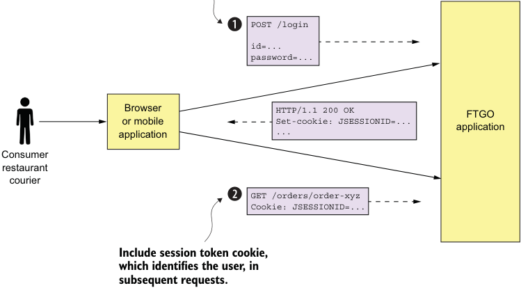

**----- Start of picture text -----** 
POST /login id=... password=... Browser HTTP/1.1 200 OK FTGO or mobile Set-cookie: JSESSIONID=... application ... application Consumer restaurant courier GET /orders/order-xyz Cookie: JSESSIONID=... Include session token cookie, which identifies the user, in subsequent requests. **----- End of picture text -----** 

Figure 11.1 A client of the FTGO application first logs in to obtain a session token, which is often a cookie. The client includes the session token in each subsequent request it makes to the application. 

## Using a security framework 

Implementing authentication and authorization correctly is challenging. It’s best to use a proven security framework. Which framework to use depends on your application’s technology stack. Some popular frameworks include the following: 

- _Spring Security_ (https://projects.spring.io/spring-security/)—A popular framework for Java applications. It’s a sophisticated framework that handles authentication and authorization. 

- _Apache Shiro_ (https://shiro.apache.org)—Another Java framework. 

- _Passport_ (http://www.passportjs.org)—A popular security framework for NodeJS applications that’s focused on authentication. 

One key part of the security architecture is the session, which stores the principal’s ID and roles. The FTGO application is a traditional Java EE application, so the session is an HttpSession in-memory session. A _session_ is identified by a session token, which the client includes in each request. It’s usually an opaque token such as a cryptographically strong random number. The FTGO application’s session token is an HTTP cookie called JSESSIONID. 

The other key part of the security implementation is the security _context_ , which stores information about the user making the current request. The Spring Security 

framework uses the standard Java EE approach of storing the security context in a static, thread-local variable, which is readily accessible to any code that’s invoked to handle the request. A request handler can call SecurityContextHolder.getContext() .getAuthentication() to obtain information about the current user, such as their identity and roles. In contrast, the Passport framework stores the security context as the user attribute of the request. 

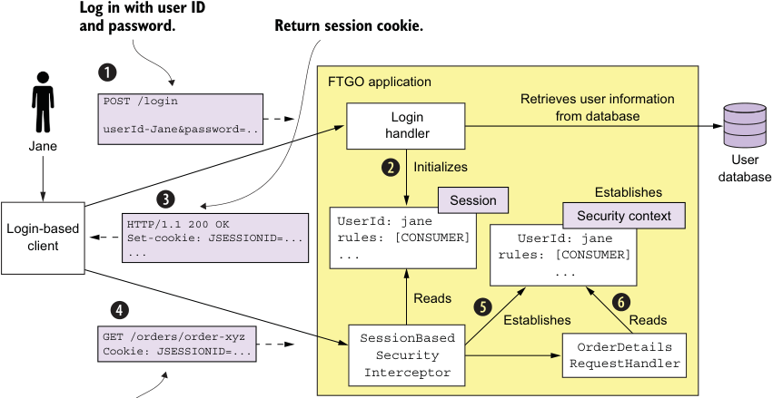

**----- Start of picture text -----** 
Log in with user ID and password. Return session cookie. FTGO application POST /login Retrieves user information Login from database userId-Jane&password=.. handler Jane User Initializes database Establishes Session Login-based HTTP/1.1 200 OKSe t -cookie: JSESSIONID=... UserId: janerules: [CONSUMER] UserId: janeSecurity context client ... ... rules: [CONSUMER] ... Reads Establishes Reads GET /orders/order-xyz SessionBased Cookie: JSESSIONID=... Security OrderDetails RequestHandler Interceptor **----- End of picture text -----** 

## **Provides session cookie** 

Figure 11.2 When a client of the FTGO application makes a login request, **Login Handler** authenticates the user, initializes the session user information, and returns a session token cookie, which securely identifies the session. Next, when the client makes a request containing the session token, **SessionBasedSecurityInterceptor** retrieves the user information from the specified session and establishes the security context. Request handlers, such as **OrderDetailsRequestHandler** , retrieve the user information from the security context. 

The sequence of events shown in Figure 11.2 is as follows: 

- 1 The client makes a login request to the FTGO application. 

- 2 The login request is handled by LoginHandler, which verifies the credentials, creates the session, and stores information about the principal in the session. 

- 3 Login Handler returns a session token to the client. 

- 4 The client includes the session token in requests that invoke operations. 

- 5 These requests are first processed by SessionBasedSecurityInterceptor. The interceptor authenticates each request by verifying the session token and establishes a security context. The security context describes the principal and its roles. 

_**Developing secure services**_ 

- 6 A request handler uses the security context to determine whether to allow a user to perform the requested operation and obtain their identity. 

The FTGO application uses _role-based_ authorization. It defines several roles corresponding to the different kinds of users, including CONSUMER, RESTAURANT, COURIER, and ADMIN. It uses Spring Security’s declarative security mechanism to restrict access to URLs and service methods to specific roles. Roles are also interwoven into the business logic. For example, a consumer can only access their orders, whereas an administrator can access all orders. 

The security design used by the monolithic FTGO application is only one possible way to implement security. For example, one drawback of using an in-memory session is that it requires all requests for a particular session to be routed to the same application instance. This requirement complicates load balancing and operations. You must, for example, implement a session draining mechanism that waits for all sessions to expire before shutting down an application instance. An alternative approach, which avoids these problems, is to store the session in a database. 

You can sometimes eliminate the server-side session entirely. For example, many applications have API clients that provide their credentials, such as an API key and secret, in every request. As a result, there’s no need to maintain a server-side session. Alternatively, the application can store session state in the session token. Later in this section, I describe one way to use a session token to store the session state. But let’s begin by looking at the challenges of implementing security in a microservice architecture. 

## _11.1.2 Implementing security in a microservice architecture_ 

A microservice architecture is a distributed architecture. Each external request is handled by the API gateway and at least one service. Consider, for example, the getOrderDetails() query, discussed in chapter 8. The API gateway handles this query by invoking several services, including Order Service, Kitchen Service, and Accounting Service. Each service must implement some aspects of security. For instance, Order Service must only allow a consumer to see their orders, which requires a combination of authentication and authorization. In order to implement security in a microservice architecture we need to determine who is responsible for authenticating the user and who is responsible for authorization. 

One challenge with implementing security in a microservices application is that we can’t just copy the design from a monolithic application. That’s because two aspects of the monolithic application’s security architecture are nonstarters for a microservice architecture: 

- _In-memory security context_ —Using an in-memory security context, such as a threadlocal, to pass around user identity. Services can’t share memory, so they can’t use an in-memory security context, such as a thread-local, to pass around the 

user identity. In a microservice architecture, we need a different mechanism for passing user identity from one service to another. 

- _Centralized session_ —Because an in-memory security context doesn’t make sense, neither does an in-memory session. In theory, multiple services could access a database-based session, except that it would violate the principle of loose coupling. We need a different session mechanism in a microservice architecture. 

Let’s begin our exploration of security in a microservice architecture by looking at how to handle authentication. 

## HANDLING AUTHENTICATION IN THE API GATEWAY 

There are a couple of different ways to handle authentication. One option is for the individual services to authenticate the user. The problem with this approach is that it permits unauthenticated requests to enter the internal network. It relies on every development team correctly implementing security in all of their services. As a result, there’s a significant risk of an application containing security vulnerabilities. 

Another problem with implementing authentication in the services is that different clients authenticate in different ways. Pure API clients supply credentials with each request using, for example, basic authentication. Other clients might first log in and then supply a session token with each request. We want to avoid requiring services to handle a diverse set of authentication mechanisms. 

A better approach is for the API gateway to authenticate a request before forwarding it to the services. Centralizing API authentication in the API gateway has the advantage that there’s only one place to get right. As a result, there’s a much smaller chance of a security vulnerability. Another benefit is that only the API gateway has to deal with the various different authentication mechanisms. It hides this complexity from the services. 

Figure 11.3 shows how this approach works. Clients authenticate with the API gateway. API clients include credentials in each request. Login-based clients POST the user’s credentials to the API gateway’s authentication and receive a session token. Once the API gateway has authenticated a request, it invokes one or more services. 

## Pattern: Access token 

The API gateway passes a token containing information about the user, such as their identity and their roles, to the services that it invokes. See http://microservices.io/ patterns/security/access-token.html. 

A service invoked by the API gateway needs to know the principal making the request. It must also verify that the request has been authenticated. The solution is for the API gateway to include a token in each service request. The service uses the token to validate the request and obtain information about the principal. The API gateway might also give the same token to session-oriented clients to use as the session token. 

_**Developing secure services**_ 

## **API clients supply credentials in the Authorization header.** 

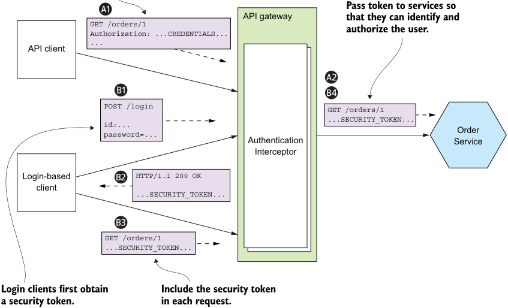

**----- Start of picture text -----** 
Pass token to services so GETAuthorization:/orders/1 ...CREDENTIALS... API gateway that they can identify andauthorize the user. API client ... POST /login GET /orders/1 id=... ...SECURITY_TOKEN... Order password=... Authentication Service Interceptor Login-based HTTP/1.1 200 OK client ...SECURITY_TOKEN... GET /orders/1 ...SECURITY_TOKEN... Login clients first obtain Include the security token a security token. in each request. **----- End of picture text -----** 

Figure 11.3 The API gateway authenticates requests from clients and includes a security token in the requests it makes to services. The services use the token to obtain information about the principal. The API gateway can also use the security token as a session token. 

The sequence of events for API clients is as follows: 

- 1 A client makes a request containing credentials. 

- 2 The API gateway authenticates the credentials, creates a security token, and passes that to the service or services. 

The sequence of events for login-based clients is as follows: 

- 1 A client makes a login request containing credentials. 

- 2 The API gateway returns a security token. 

- 3 The client includes the security token in requests that invoke operations. 

- 4 The API gateway validates the security token and forwards it to the service or services. 

A little later in this chapter, I describe how to implement tokens, but let’s first look at the other main aspect of security: authorization. 

## HANDLING AUTHORIZATION 

Authenticating a client’s credentials is important but insufficient. An application must also implement an authorization mechanism that verifies that the client is allowed to perform the requested operation. For example, in the FTGO application the getOrderDetails() query can only be invoked by the consumer who placed the Order (an example of instance-based security) and a customer service agent who is helping the consumer. 

One place to implement authorization is the API gateway. It can, for example, restrict access to GET /orders/{orderId} to only users who are consumers and customer service agents. If a user isn’t allowed to access a particular path, the API gateway can reject the request before forwarding it on to the service. As with authentication, centralizing authorization within the API gateway reduces the risk of security vulnerabilities. You can implement authorization in the API gateway using a security framework, such as Spring Security. 

One drawback of implementing authorization in the API gateway is that it risks coupling the API gateway to the services, requiring them to be updated in lockstep. What’s more, the API gateway can typically only implement role-based access to URL paths. It’s generally not practical for the API gateway to implement ACLs that control access to individual domain objects, because that requires detailed knowledge of a service’s domain logic. 

The other place to implement authorization is in the services. A service can implement role-based authorization for URLs and for service methods. It can also implement ACLs to manage access to aggregates. Order Service can, for example, implement the role-based and ACL-based authorization mechanism for controlling access to orders. Other services in the FTGO application implement similar authorization logic. 

## USING JWTS TO PASS USER IDENTITY AND ROLES 

When implementing security in a microservice architecture, you need to decide which type of token an API gateway should use to pass user information to the services. There are two types of tokens to choose from. One option is to use _opaque_ tokens, which are typically UUIDs. The downside of opaque tokens is that they reduce performance and availability and increase latency. That’s because the recipient of such a token must make a synchronous RPC call to a security service to validate the token and retrieve the user information. 

An alternative approach, which eliminates the call to the security service, is to use a _transparent_ token containing information about the user. One such popular standard for transparent tokens is the JSON Web Token (JWT). JWT is standard way to securely represent claims, such as user identity and roles, between two parties. A JWT has a payload, which is a JSON object that contains information about the user, such as their identity and roles, and other metadata, such as an expiration date. It’s signed with a secret that’s only known to the creator of the JWT, such as the API gateway and the recipient of the JWT, such as a service. The secret ensures that a malicious third party can’t forge or tamper with a JWT. 

_**Developing secure services**_ 

One issue with JWT is that because a token is self-contained, it’s irrevocable. By design, a service will perform the request operation after verifying the JWT’s signature and expiration date. As a result, there’s no practical way to revoke an individual JWT that has fallen into the hands of a malicious third party. The solution is to issue JWTs with short expiration times, because that limits what a malicious party could do. One drawback of short-lived JWTs, though, is that the application must somehow continually reissue JWTs to keep the session active. Fortunately, this is one of the many protocols that are solved by a security standard calling OAuth 2.0. Let’s look at how that works. 

USING OAUTH 2.0 IN A MICROSERVICE ARCHITECTURE 

Let’s say you want to implement a User Service for the FTGO application that manages a user database containing user information, such as credentials and roles. The API gateway calls the User Service to authenticate a client request and obtain a JWT. You could design a User Service API and implement it using your favorite web framework. But that’s generic functionality that isn’t specific to the FTGO application— developing such a service wouldn’t be an efficient use of development resources. 

Fortunately, you don’t need to develop this kind of security infrastructure. You can use an off-the-shelf service or framework that implements a standard called OAuth 2.0. OAuth 2.0 is an authorization protocol that was originally designed to enable a user of a public cloud service, such as GitHub or Google, to grant a third-party application access to its information without revealing its password. For example, OAuth 2.0 is the mechanism that enables you to securely grant a third party cloud-based Continuous Integration (CI) service access to your GitHub repository. 

Although the original focus of OAuth 2.0 was authorizing access to public cloud services, you can also use it for authentication and authorization in your application. Let’s take a quick look at how a microservice architecture might use OAuth 2.0. 

## About OAuth 2.0 

OAuth 2.0 is a complex topic. In this chapter, I can only provide a brief overview and describe how it can be used in a microservice architecture. For more information on OAuth 2.0, check out the online book _OAuth 2.0 Servers_ by Aaron Parecki (www.oauth.com). Chapter 7 of _Spring Microservices in Action_ (Manning, 2017) also covers this topic (https://livebook.manning.com/#!/book/spring-microservices-inaction/chapter-7/). 

The key concepts in OAuth 2.0 are the following: 

- Authorization Server—Provides an API for authenticating users and obtaining an access token and a refresh token. Spring OAuth is a great example of a framework for building an OAuth 2.0 authorization server. 

- Access Token—A token that grants access to a Resource Server. The format of the access token is implementation dependent. But some implementations, such as Spring OAuth, use JWTs. 

- Refresh Token—A long-lived yet revocable token that a Client uses to obtain a new AccessToken. 

- Resource Server—A service that uses an access token to authorize access. In a microservice architecture, the services are resource servers. 

- Client—A client that wants to access a Resource Server. In a microservice architecture, API Gateway is the OAuth 2.0 client. 

Later in this section, I describe how to support login-based clients. But first, let’s talk about how to authenticate API clients. 

Figure 11.4 shows how the API gateway authenticates a request from an API client. The API gateway authenticate the API client by making a request to the OAuth 2.0 authorization server, which returns an access token. The API gateway then makes one or more requests containing the access token to the services. 

The sequence of events shown in figure 11.4 is as follows: 

- 1 The client makes a request, supplying its credentials using basic authentication. 

- 2 The API gateway makes an OAuth 2.0 Password Grant request (www.oauth.com/ oauth2-servers/access-tokens/password-grant/) to the OAuth 2.0 authentication server. 

## **Password grant request** 

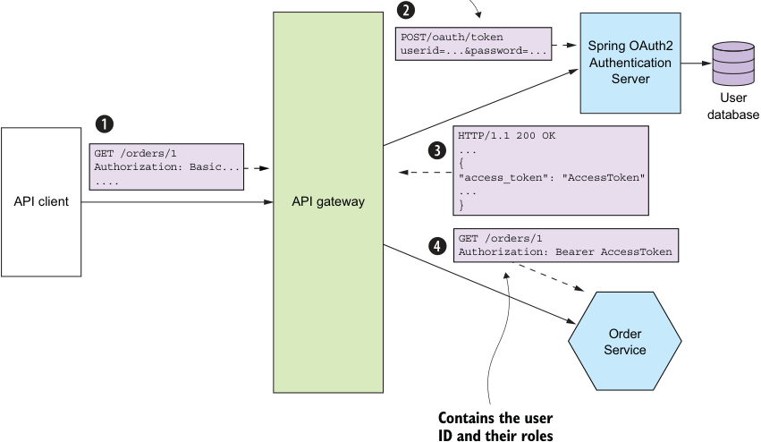

**----- Start of picture text -----** 
POST/oauth/token userid=...&password=... Spring OAuth2 Authenticatio n Server User database HTTP/1.1 200 OK GET /orders/1 ... Authorization: Basic... { .... "access_token": "AccessToken" API cli ent API gateway ...} GET /orders/1 Authorization: Bearer AccessToken Order Service Contains the user ID and their roles **----- End of picture text -----** 

Figure 11.4 An API gateway authenticates an API client by making a Password Grant request to the OAuth 2.0 authentication server. The server returns an access token, which the API gateway passes to the services. A service verifies the token’s signature and extracts information about the user, including their identity and roles. 

_**Developing secure services**_ 

- 3 The authentication server validates the API client’s credentials and returns an access token and a refresh token. 

- 4 The API gateway includes the access token in the requests it makes to the services. A service validates the access token and uses it to authorize the request. 

An OAuth 2.0-based API gateway can authenticate session-oriented clients by using an OAuth 2.0 access token as a session token. What’s more, when the access token expires, it can obtain a new access token using the refresh token. Figure 11.5 shows how an API gateway can use OAuth 2.0 to handle session-oriented clients. An API client initiates a session by POSTing its credentials to the API gateway’s /login endpoint. The API gateway returns an access token and a refresh token to the client. The API client then supplies both tokens when it makes requests to the API gateway. 

## **Password grant request** 

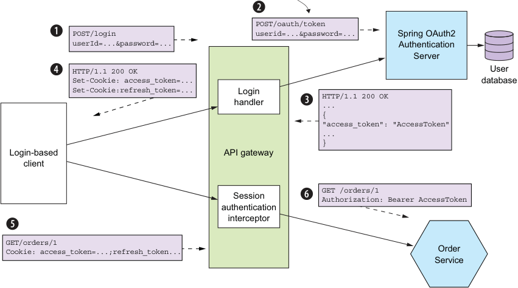

**----- Start of picture text -----** 
POST/oauth/token POST/login userid=...&password=... Spring OAuth2 userId=...&password=... Authentication Server HTTP/1.1 200 OK User Set-Cookie: access_token=... database Set-Cookie:refresh_token=... Login HTTP/1.1 200 OK handler ... { "access_token": "AccessToken" ... } Login-based API gateway client GET /orders/1 Session Authorization: Bearer AccessToken authentication interceptor GET/orders/1 Cookie: access_token=...;refresh_token... ServiceOrder **----- End of picture text -----** 

Figure 11.5 A client logs in by POSTing its credentials to the API gateway. The API gateway authenticates the credentials using the OAuth 2.0 authentication server and returns the access token and refresh token as cookies. A client includes these tokens in the requests it makes to the API gateway. 

The sequence of events is as follows: 

- 1 The login-based client POSTs its credentials to the API gateway. 

- 2 The API gateway’s Login Handler makes an OAuth 2.0 Password Grant request (www.oauth.com/oauth2-servers/access-tokens/password-grant/) to the OAuth 2.0 authentication server. 

- 3 The authentication server validates the client’s credentials and returns an access token and a refresh token. 

- 4 The API gateway returns the access and refresh tokens to the client—as cookies, for example. 

- 5 The client includes the access and refresh tokens in requests it makes to the API gateway. 

- 6 The API gateway’s Session Authentication Interceptor validates the access token and includes it in requests it makes to the services. 

If the access token has expired or is about to expire, the API gateway obtains a new access token by making an OAuth 2.0 Refresh Grant request (www.oauth.com/ oauth2-servers/access-tokens/refreshing-access-tokens/), which contains the refresh token, to the authorization server. If the refresh token hasn’t expired or been revoked, the authorization server returns a new access token. API Gateway passes the new access token to the services and returns it to the client. 

An important benefit of using OAuth 2.0 is that it’s a proven security standard. Using an off-the-shelf OAuth 2.0 Authentication Server means you don’t have to waste time reinventing the wheel or risk developing an insecure design. But OAuth 2.0 isn’t the only way to implement security in a microservice architecture. Regardless of which approach you use, the three key ideas are as follows: 

- The API gateway is responsible for authenticating clients. 

- The API gateway and the services use a transparent token, such as a JWT, to pass around information about the principal. 

- A service uses the token to obtain the principal’s identity and roles. 

Now that we’ve looked at how to make services secure, let’s see how to make them configurable. 

## _11.2 Designing configurable services_ 

Imagine that you’re responsible for Order History Service. As figure 11.6 shows, the service consumes events from Apache Kafka and reads and writes AWS DynamoDB table items. In order for this service to run, it needs various configuration properties, including the network location of Apache Kafka and the credentials and network location for AWS DynamoDB. 

The values of these configuration properties depend on which environment the service is running in. For example, the developer and production environments will use different Apache Kafka brokers and different AWS credentials. It doesn’t make sense to hard-wire a particular environment’s configuration property values into the deployable service because that would require it to be rebuilt for each environment. Instead, a service should be built once by the deployment pipeline and deployed into multiple environments. 

Nor does it make sense to hard-wire different sets of configuration properties into the source code and use, for example, the Spring Framework’s profile mechanism to 

_**Designing configurable services**_ 

**----- Start of picture text -----** 
Environment-specific configuration **----- End of picture text -----** 

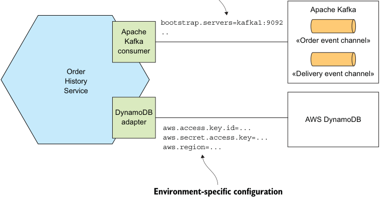

**----- Start of picture text -----** 
Apache Kafka bootstrap.servers=kafka1:9092 Apache .. Kafka «Order event channel» consumer Order «Delivery event channel» History Service DynamoDB adapter AWS DynamoDB aws.access.key.id=... aws.secret.access.key=... aws.region=... Environment-specific configuration **----- End of picture text -----** 

Figure 11.6 **Order History Service** uses Apache Kafka and AWS DynamoDB. It needs to be configured with each service’s network location, credentials, and so on. select the appropriate set at runtime. That’s because doing so would introduce a security vulnerability and limit where it can be deployed. Additionally, sensitive data such as credentials should be stored securely using a secrets storage mechanism, such as Hashicorp Vault (www.vaultproject.io) or AWS Parameter Store (https://docs.aws .amazon.com/systems-manager/latest/userguide/systems-manager-paramstore.html). Instead, you should supply the appropriate configuration properties to the service at runtime by using the Externalized configuration pattern. 

## Pattern: Externalized configuration 

Supply configuration property values, such as database credentials and network location, to a service at runtime. See http://microservices.io/patterns/externalizedconfiguration.html. 

An externalized configuration mechanism provides the configuration property values to a service instance at runtime. There are two main approaches: 

- _Push model_ —The deployment infrastructure passes the configuration properties to the service instance using, for example, operating system environment variables or a configuration file. 

- _Pull model_ —The service instance reads its configuration properties from a configuration server. 

We’ll look at each approach, starting with the push model. 

## _11.2.1 Using push-based externalized configuration_ 

The push model relies on the collaboration of the deployment environment and the service. The deployment environment supplies the configuration properties when it creates a service instance. It might, as figure 11.7 shows, pass the configuration properties as environment variables. Alternatively, the deployment environment may supply the configuration properties using a configuration file. The service instance then reads the configuration properties when it starts up. 

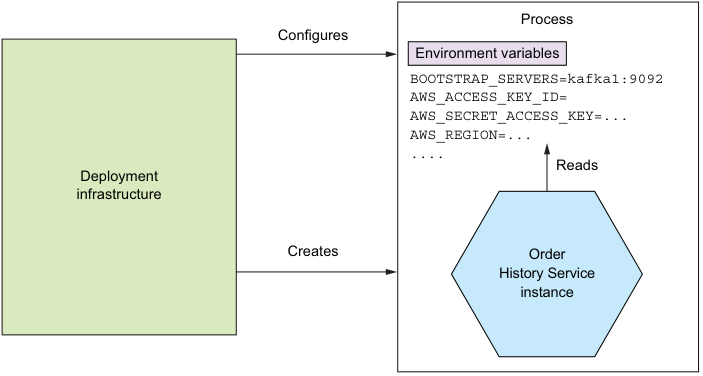

**----- Start of picture text -----** 
Process Configures Environment variables BOOTSTRAP_SERVERS=kafka1:9092 AWS_ACCESS_KEY_ID= AWS_SECRET_ACCESS_KEY=... AWS_REGION=... .... Reads Deployment infrastructure Creates Order History Service instance **----- End of picture text -----** 

Figure 11.7 When the deployment infrastructure creates an instance of **Order History Service** , it sets the environment variables containing the externalized configuration. **Order History Service** reads those environment variables. 

The deployment environment and the service must agree on how the configuration properties are supplied. The precise mechanism depends on the specific deployment environment. For example, chapter 12 describes how you can specify the environment variables of a Docker container. 

Let’s imagine that you’ve decided to supply externalized configuration property values using environment variables. Your application could call System.getenv() to obtain their values. But if you’re a Java developer, it’s likely that you’re using a framework that provides a more convenient mechanism. The FTGO services are built using Spring Boot, which has an extremely flexible externalized configuration mechanism that retrieves configuration properties from a variety of sources with well-defined precedence rules (https://docs.spring.io/spring-boot/docs/current/reference/html/bootfeatures-external-config.html). Let’s look at how it works. 

Spring Boot reads properties from a variety of sources. I find the following sources useful in a microservice architecture: 

_**Designing configurable services**_ 

- 1 Command-line arguments 

- 2 SPRING_APPLICATION_JSON, an operating system environment variable or JVM system property that contains JSON 

- 3 JVM System properties 

- 4 Operating system environment variables 

- 5 A configuration file in the current directory 

A particular property value from a source earlier in this list overrides the same property from a source later in this list. For example, operating system environment variables override properties read from a configuration file. 

Spring Boot makes these properties available to the Spring Framework’s ApplicationContext. A service can, for example, obtain the value of a property using the @Value annotation: public class OrderHistoryDynamoDBConfiguration { 

@Value("${aws.region}") private String awsRegion; 

The Spring Framework initializes the awsRegion field to the value of the aws.region property. This property is read from one of the sources listed earlier, such as a configuration file or from the AWS_REGION environment variable. 

The push model is an effective and widely used mechanism for configuring a service. One limitation, however, is that reconfiguring a running service might be challenging, if not impossible. The deployment infrastructure might not allow you to change the externalized configuration of a running service without restarting it. You can’t, for example, change the environment variables of a running process. Another limitation is that there’s a risk of the configuration property values being scattered throughout the definition of numerous services. As a result, you may want to consider using a pull-based model. Let’s look at how it works. 

## _11.2.2 Using pull-based externalized configuration_ 

In the pull model, a service instance reads its configuration properties from a configuration server. Figure 11.8 shows how it works. On startup, a service instance queries the configuration service for its configuration. The configuration properties for accessing the configuration server, such as its network location, are provided to the service instance via a push-based configuration mechanism, such as environment variables. 

There are a variety of ways to implement a configuration server, including the following: 

- Version control system such as Git 

- SQL and NoSQL databases 

- Specialized configuration servers, such as Spring Cloud Config Server, Hashicorp Vault, which is a store for sensitive data such as credentials, and AWS Parameter Store 

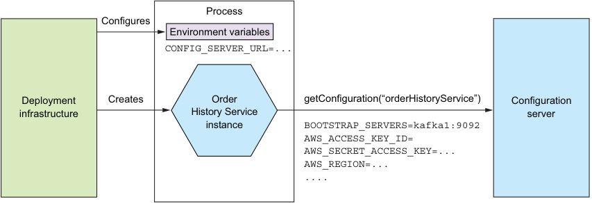

**----- Start of picture text -----** 
Process Configures Environment variables CONFIG_SERVER_URL=... Deployment Creates Order getConfiguration(“orderHistoryService”) Configuration infrastructure History Service server instance BOOTSTRAP_SERVERS=kafka1:9092 AWS_ACCESS_KEY_ID= AWS_SECRET_ACCESS_KEY=... AWS_REGION=... .... **----- End of picture text -----** 

Figure 11.8 On startup, a service instance retrieves its configuration properties from a configuration server. The deployment infrastructure provides the configuration properties for accessing the configuration server. 

The Spring Cloud Config project is a good example of a configuration server-based framework. It consists of a server and a client. The server supports a variety of backends for storing configuration properties, including version control systems, databases, and Hashicorp Vault. The client retrieves configuration properties from the server and injects them into the Spring ApplicationContext. 

Using a configuration server has several benefits: 

- _Centralized configuration_ —All the configuration properties are stored in one place, which makes them easier to manage. What’s more, in order to eliminate duplicate configuration properties, some implementations let you define global defaults, which can be overridden on a per-service basis. 

- _Transparent decryption of sensitive data_ —Encrypting sensitive data such as database credentials is a security best practice. One challenge of using encryption, though, is that usually the service instance needs to decrypt them, which means it needs the encryption keys. Some configuration server implementations automatically decrypt properties before returning them to the service. 

- _Dynamic reconfiguration_ —A service could potentially detect updated property values by, for example, polling, and reconfigure itself. 

The primary drawback of using a configuration server is that unless it’s provided by the infrastructure, it’s yet another piece of infrastructure that needs to be set up and maintained. Fortunately, there are various open source frameworks, such as Spring Cloud Config, which make it easier to run a configuration server. 

Now that we’ve looked at how to design configurable services, let’s talk about how to design observable services. 

## _11.3 Designing observable services_ 

Let’s say you’ve deployed the FTGO application into production. You probably want to know what the application is doing: requests per second, resource utilization, and 

_**Designing observable services**_ 

so on. You also need to be alerted if there’s a problem, such as a failed service instance or a disk filling up—ideally before it impacts a user. And, if there’s a problem, you need to be able to troubleshoot and identify the root cause. 

Many aspects of managing an application in production are outside the scope of the developer, such as monitoring hardware availability and utilization. These are clearly the responsibility of operations. But there are several patterns that you, as a service developer, must implement to make your service easier to manage and troubleshoot. These patterns, shown in figure 11.9, expose a service instance’s behavior and health. They enable a monitoring system to track and visualize the state of a service and generate alerts when there’s a problem. These patterns also make troubleshooting problems easier. 

You can use the following patterns to design observable services: 

- _Health check API_ —Expose an endpoint that returns the health of the service. 

- _Log aggregation_ —Log service activity and write logs into a centralized logging server, which provides searching and alerting. 

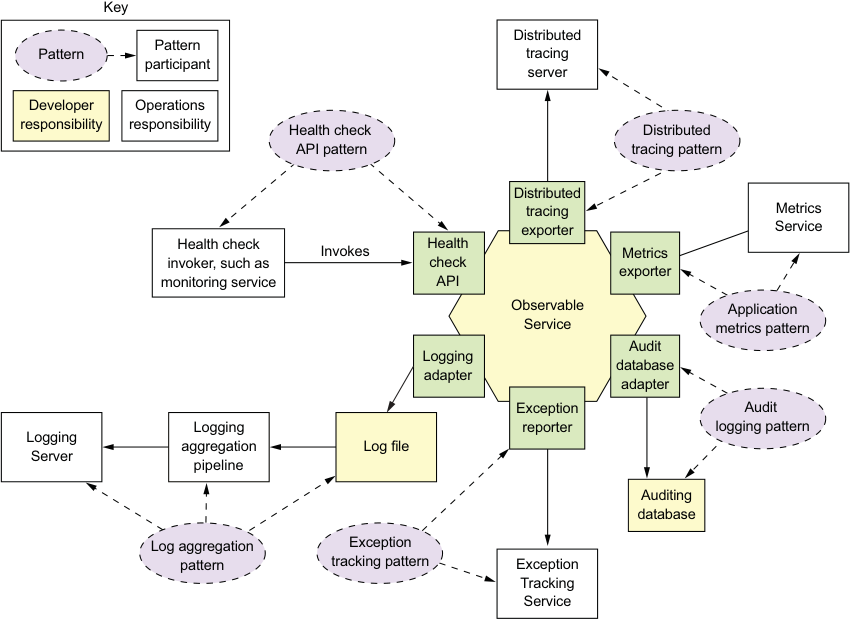

**----- Start of picture text -----** 
Key Distributed Pattern Pattern tracing participant server Developer Operations responsibility responsibility Health check Distributed API pattern tracing pattern Distributed tracing Metrics exporter Service Health check Health Invokes Metrics invoker, such as check exporter monitoring service API Observable Application Service metrics pattern Audit Logging database adapter adapter Exception Audit Logging reporter logging pattern Logging ag g regation L og file Server pipeline Auditing database Log aggregation Exception pattern tracking pattern Exception Tracking Service **----- End of picture text -----** 

Figure 11.9 The observability patterns enable developers and operations to understand the behavior of an application and troubleshoot problems. Developers are responsible for ensuring that their services are observable. Operations are responsible for the infrastructure that collects the information exposed by the services. 

- _Distributed tracing_ —Assign each external request a unique ID and trace requests as they flow between services. 

- _Exception tracking_ —Report exceptions to an exception tracking service, which de-duplicates exceptions, alerts developers, and tracks the resolution of each exception. 

- _Application metrics_ —Services maintain metrics, such as counters and gauges, and expose them to a metrics server. 

- _Audit logging_ —Log user actions. 

A distinctive feature of most of these patterns is that each pattern has a developer component and an operations component. Consider, for example, the Health check API pattern. The developer is responsible for ensuring that their service implements a health check endpoint. Operations is responsible for the monitoring system that periodically invokes the health check API. Similarly, for the Log aggregation pattern, a developer is responsible for ensuring that their services log useful information, whereas operations is responsible for log aggregation. 

Let’s take a look at each of these patterns, starting with the Health check API pattern. 

## _11.3.1 Using the Health check API pattern_ 

Sometimes a service may be running but unable to handle requests. For instance, a newly started service instance may not be ready to accept requests. The FTGO Consumer Service, for example, takes around 10 seconds to initialize the messaging and database adapters. It would be pointless for the deployment infrastructure to route HTTP requests to a service instance until it’s ready to process them. 

Also, a service instance can fail without terminating. For example, a bug might cause an instance of Consumer Service to run out of database connections and be unable to access the database. The deployment infrastructure shouldn’t route requests to a service instance that has failed yet is still running. And, if the service instance does not recover, the deployment infrastructure must terminate it and create a new instance. 

## Pattern: Health check API 

A service exposes a health check API endpoint, such as GET /health, which returns the health of the service. See http://microservices.io/patterns/observability/healthcheck-api.html. 

A service instance needs to be able to tell the deployment infrastructure whether or not it’s able to handle requests. A good solution is for a service to implement a health check endpoint, which is shown in figure 11.10. The Spring Boot Actuator Java library, for example, implements a GET /actuator/health endpoint, which returns 200 if and only if the service is healthy, and 503 otherwise. Similarly, the HealthChecks .NET 

_**Designing observable services**_
library implements a GET /hc endpoint (https://docs.microsoft.com/en-us/dotnet/ standard/microservices-architecture/implement-resilient-applications/monitor-apphealth). The deployment infrastructure periodically invokes this endpoint to determine the health of the service instance and takes the appropriate action if it’s unhealthy. 

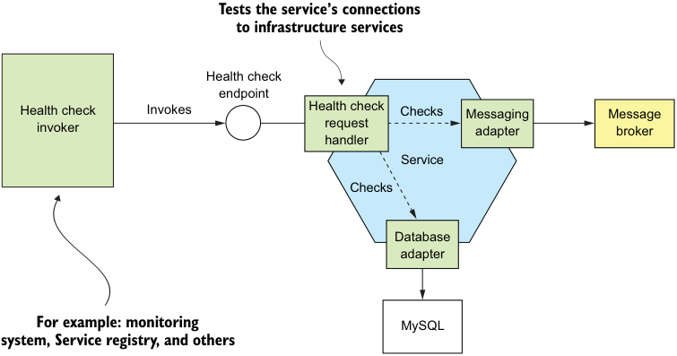

**----- Start of picture text -----** 
Tests the service’s connections to infrastructure services Health check endpoint Health check Invokes Health check Checks Messaging Message invoker re quest adapter broker handler Service Checks Database adapter For example: monitoring MySQL system, Service registry, and others **----- End of picture text -----** 

Figure 11.10 A service implements a health check endpoint, which is periodically invoked by the deployment infrastructure to determine the health of the service instance. 

A Health Check Request Handler typically tests the service instance’s connections to external services. It might, for example, execute a test query against a database. If all the tests succeed, Health Check Request Handler returns a healthy response, such as an HTTP 200 status code. If any of them fails, it returns an unhealthy response, such as an HTTP 500 status code. 

Health Check Request Handler might simply return an empty HTTP response with the appropriate status code. Or it might return a detailed description of the health of each of the adapters. The detailed information is useful for troubleshooting. But because it may contain sensitive information, some frameworks, such as Spring Boot Actuator, let you configure the level of detail in the health endpoint response. 

There are two issues you need to consider when using health checks. The first is the implementation of the endpoint, which must report back on the health of the service instance. The second issue is how to configure the deployment infrastructure to invoke the health check endpoint. Let’s first look at how to implement the endpoint. 

## IMPLEMENTING THE HEALTH CHECK ENDPOINT 

The code that implements the health check endpoint must somehow determine the health of the service instance. One simple approach is to verify that the service instance can access its external infrastructure services. How to do this depends on the 

infrastructure service. The health check code can, for example, verify that it’s connected to an RDBMS by obtaining a database connection and executing a test query. A more elaborate approach is to execute a synthetic transaction that simulates the invocation of the service’s API by a client. This kind of health check is more thorough, but it’s likely to be more time consuming to implement and take longer to execute. 

A great example of a health check library is Spring Boot Actuator. As mentioned earlier, it implements a /actuator/health endpoint. The code that implements this endpoint returns the result of executing a set of health checks. By using convention over configuration, Spring Boot Actuator implements a sensible set of health checks based on the infrastructure services used by the service. If, for example, a service uses a JDBC DataSource, Spring Boot Actuator configures a health check that executes a test query. Similarly, if the service uses the RabbitMQ message broker, it automatically configures a health check that verifies that the RabbitMQ server is up. 

You can also customize this behavior by implementing additional health checks for your service. You implement a custom health check by defining a class that implements the HealthIndicator interface. This interface defines a health() method, which is called by the implementation of the /actuator/health endpoint. It returns the outcome of the health check. 

## INVOKING THE HEALTH CHECK ENDPOINT 

A health check endpoint isn’t much use if nobody calls it. When you deploy your service, you must configure the deployment infrastructure to invoke the endpoint. How you do that depends on the specific details of your deployment infrastructure. For example, as described in chapter 3, you can configure some service registries, such as Netflix Eureka, to invoke the health check endpoint in order to determine whether traffic should be routed to the service instance. Chapter 12 discusses how to configure Docker and Kubernetes to invoke a health check endpoint. 

## _11.3.2 Applying the Log aggregation pattern_ 

Logs are a valuable troubleshooting tool. If you want to know what’s wrong with your application, a good place to start is the log files. But using logs in a microservice architecture is challenging. For example, imagine you’re debugging a problem with the getOrderDetails() query. As described in chapter 8, the FTGO application implements this query using API composition. As a result, the log entries you need are scattered across the log files of the API gateway and several services, including Order Service and Kitchen Service. 

## Pattern: Log aggregation 

Aggregate the logs of all services in a centralized database that supports searching and alerting. See http://microservices.io/patterns/observability/application-logging .html. 

_**Designing observable services**_ 

The solution is to use log aggregation. As figure 11.11 shows, the log aggregation pipeline sends the logs of all of the service instances to a centralized logging server. Once the logs are stored by the logging server, you can view, search, and analyze them. You can also configure alerts that are triggered when certain messages appear in the logs. 

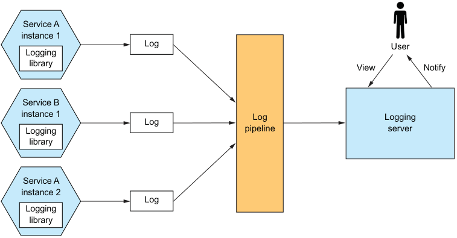

**----- Start of picture text -----** 
Service A instance 1 Log User Logging library View Notify Service B instance 1 Log Logging Log Logging pipeline server library Service A instance 2 Log Logging library **----- End of picture text -----** 

Figure 11.11 The log aggregation infrastructure ships the logs of each service instance to a centralized logging server. Users can view and search the logs. They can also set up alerts, which are triggered when log entries match search criteria. 

The logging pipeline and server are usually the responsibility of operations. But service developers are responsible for writing services that generate useful logs. Let’s first look at how a service generates a log. 

## HOW A SERVICE GENERATES A LOG 

As a service developer, there are a couple of issues you need to consider. First you need to decide which logging library to use. The second issue is where to write the log entries. Let’s first look at the logging library. 

Most programming languages have one or more logging libraries that make it easy to generate correctly structured log entries. For example, three popular Java logging libraries are Logback, log4j, and JUL (java.util.logging). There’s also SLF4J, which is a logging facade API for the various logging frameworks. Similarly, Log4JS is a popular logging framework for NodeJS. One reasonable way to use logging is to sprinkle calls to one of these logging libraries in your service’s code. But if you have strict logging requirements that can’t be enforced by the logging library, you may need to define your own logging API that wraps a logging library. 

You also need to decide where to log. Traditionally, you would configure the logging framework to write to a log file in a well-known location in the filesystem. But with the more modern deployment technologies, such as containers and serverless, 

described in chapter 12, this is often not the best approach. In some environments, such as AWS Lambda, there isn’t even a “permanent” filesystem to write the logs to! Instead, your service should log to stdout. The deployment infrastructure will then decide what to do with the output of your service. 

## THE LOG AGGREGATION INFRASTRUCTURE 

The logging infrastructure is responsible for aggregating the logs, storing them, and enabling the user to search them. One popular logging infrastructure is the ELK stack. ELK consists of three open source products: 

- _Elasticsearch_ —A text search-oriented NoSQL database that’s used as the logging server 

- _Logstash_ —A log pipeline that aggregates the service logs and writes them to Elasticsearch 

- _Kibana_ —A visualization tool for Elasticsearch 

Other open source log pipelines include Fluentd and Apache Flume. Examples of logging servers include cloud services, such as AWS CloudWatch Logs, as well as numerous commercial offerings. Log aggregation is a useful debugging tool in a microservice architecture. 

Let’s now look at distributed tracing, which is another way of understanding the behavior of a microservices-based application. 

## _11.3.3 Using the Distributed tracing pattern_ 

Imagine you’re a FTGO developer who is investigating why the getOrderDetails() query has slowed down. You’ve ruled out the problem being an external networking issue. The increased latency must be caused by either the API gateway or one of the services it has invoked. One option is to look at each service’s average response time. The trouble with this option is that it’s an average across requests rather than the timing breakdown for an individual request. Plus more complex scenarios might involve many nested service invocations. You may not even be familiar with all services. As a result, it can be challenging to troubleshoot and diagnose these kinds of performance problems in a microservice architecture. 

## Pattern: Distributed tracing 

Assign each external request a unique ID and record how it flows through the system from one service to the next in a centralized server that provides visualization and analysis. See http://microservices.io/patterns/observability/distributed-tracing.html. 

A good way to get insight into what your application is doing is to use distributed tracing. _Distributed tracing_ is analogous to a performance profiler in a monolithic application. It records information (for example, start time and end time) about the tree of service calls that are made when handling a request. You can then see how the services 

_**Designing observable services**_
interact during the handling of external requests, including a breakdown of where the time is spent. 

Figure 11.12 shows an example of how a distributed tracing server displays what happens when the API gateway handles a request. It shows the inbound request to the API gateway and the request that the gateway makes to Order Service. For each request, the distributed tracing server shows the operation that’s performed and the timing of the request. 

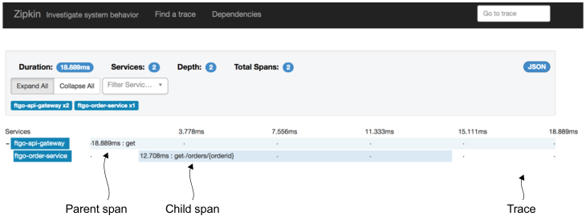

**----- Start of picture text -----** 
Parent span Child span Trace **----- End of picture text -----** 

Figure 11.12 The Zipkin server shows how the FTGO application handles a request that’s routed by the API gateway to **Order Service** . Each request is represented by a trace. A trace is a set of spans. Each span, which can contain child spans, is the invocation of a service. Depending on the level of detail collected, a span can also represent the invocation of an operation inside a service. 

Figure 11.12 shows what in distributed tracing terminology is called a _trace_ . A trace represents an external request and consists of one or more spans. A _span_ represents an operation, and its key attributes are an operation name, start timestamp, and end time. A span can have one or more child spans, which represent nested operations. For example, a top-level span might represent the invocation of the API gateway, as is the case in figure 11.12. Its child spans represent the invocations of services by the API gateway. 

A valuable side effect of distributed tracing is that it assigns a unique ID to each external request. A service can include the request ID in its log entries. When combined with log aggregation, the request ID enables you to easily find all log entries for a particular external request. For example, here’s an example log entry from Order Service: 

- 2018-03-04 17:38:12.032 DEBUG [ftgo-orderservice,8d8fdc37be104cc6,8d8fdc37be104cc6,false] 

7 --- [nio-8080-exec-6] org.hibernate.SQL : select order0_.id as id1_3_0_, order0_.consumer_id as consumer2_3_0_, order 0_.city as city3_3_0_, order0_.delivery_state as delivery4_3_0_, order0_.street1 as street5_3_0_, order0_.street2 as street6_3_0_, order0_.zip as zip7_3_0_, order0_.delivery_time as delivery8_3_0_, order0_.a 

The [ftgo-order-service,8d8fdc37be104cc6,8d8fdc37be104cc6,false] part of the log entry (the SLF4J Mapped Diagnostic Context—see www.slf4j.org/manual.html) contains information from the distributed tracing infrastructure. It consists of four values: 

- ftgo-order-service—The name of the application 

- 8d8fdc37be104cc6—The traceId 

- 8d8fdc37be104cc6—The spanId 

- false—Indicates that this span wasn’t exported to the distributed tracing server 

If you search the logs for 8d8fdc37be104cc6, you’ll find all log entries for that request. Figure 11.13 shows how distributed tracing works. There are two parts to distributed tracing: an instrumentation library, which is used by each service, and a distributed tracing server. The instrumentation library manages the traces and spans. It also adds 

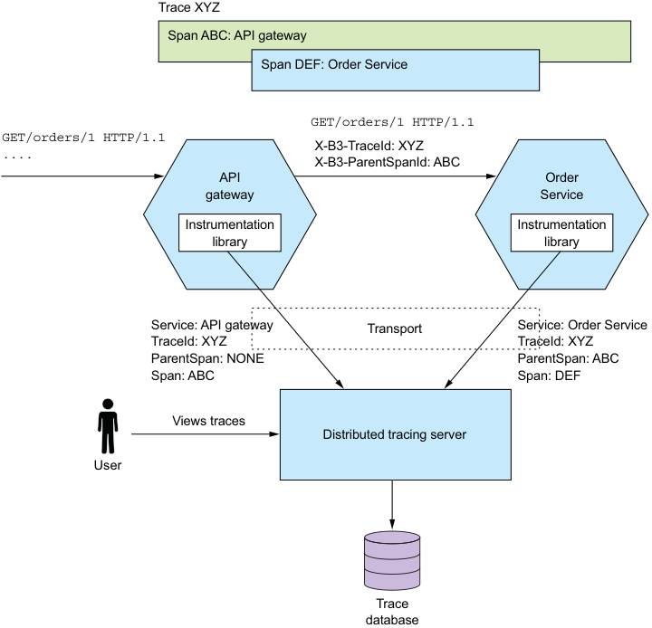

**----- Start of picture text -----** 
Trace XYZ Span ABC: API gateway Span DEF: Order Service GET/orders/1 HTTP/1.1 GET/orders/1 HTTP/1.1 X-B3-TraceId: XYZ .... X-B3-ParentSpanId: ABC API Order gateway Service Instrumentation Instrumentation library library Service: API gateway Transport Service: Order Service TraceId: XYZ TraceId: XYZ ParentSpan: NONE ParentSpan: ABC Span: ABC Span: DEF Views traces Distributed tracing server User Trace database **----- End of picture text -----** 

Figure 11.13 Each service (including the API gateway) uses an instrumentation library. The instrumentation library assigns an ID to each external request, propagates tracing state between services, and reports spans to the distributed tracing server. 

_**Designing observable services**_
tracing information, such as the current trace ID and the parent span ID, to outbound requests. For example, one common standard for propagating trace information is the B3 standard (https://github.com/openzipkin/b3-propagation), which uses headers such as X-B3-TraceId and X-B3-ParentSpanId. The instrumentation library also reports traces to the distributed tracing server. The distributed tracing server stores the traces and provides a UI for visualizing them. 

Let’s take a look at the instrumentation library and the distribution tracing server, beginning with the library. 

## USING AN INSTRUMENTATION LIBRARY 

The instrumentation library builds the tree of spans and sends them to the distributed tracing server. The service code could call the instrumentation library directly, but that would intertwine the instrumentation logic with business and other logic. A cleaner approach is to use interceptors or aspect-oriented programming (AOP). 

A great example of an AOP-based framework is Spring Cloud Sleuth. It uses the Spring Framework’s AOP mechanism to automagically integrate distributed tracing into the service. As a result, you have to add Spring Cloud Sleuth as a project dependency. Your service doesn’t need to call a distributed tracing API except in those cases that aren’t handled by Spring Cloud Sleuth. 

## ABOUT THE DISTRIBUTED TRACING SERVER 

The instrumentation library sends the spans to a distributed tracing server. The distributed tracing server stitches the spans together to form complete traces and stores them in a database. One popular distributed tracing server is Open Zipkin. Zipkin was originally developed by Twitter. Services can deliver spans to Zipkin using either HTTP or a message broker. Zipkin stores the traces in a storage backend, which is either a SQL or NoSQL database. It has a UI that displays traces, as shown earlier in figure 11.12. AWS X-ray is another example of a distributed tracing server. 

## _11.3.4 Applying the Application metrics pattern_ 

A key part of the production environment is monitoring and alerting. As figure 11.14 shows, the monitoring system gathers metrics, which provide critical information about the health of an application, from every part of the technology stack. Metrics range from infrastructure-level metrics, such as CPU, memory, and disk utilization, to application-level metrics, such as service request latency and number of requests executed. Order Service, for example, gathers metrics about the number of placed, approved, and rejected orders. The metrics are collected by a metrics service, which provides visualization and alerting. 

## Pattern: Application metrics 

Services report metrics to a central server that provides aggregation, visualization, and alerting. 

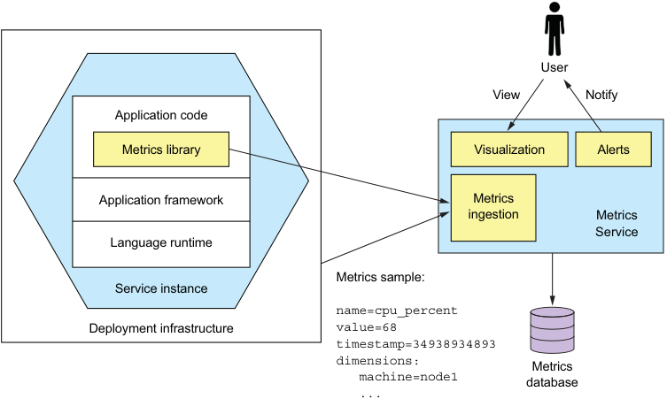

**----- Start of picture text -----** 
User View Notify Application code Metrics library Visualization Alerts Application framework Metrics ingestion Metrics Service Language runtime Metrics sample: Service instance name=cpu_percent Deployment infrastructure value=68 timestamp=34938934893 dimensions: Metrics machine=node1 database ... **----- End of picture text -----** 

Figure 11.14 Metrics at every level of the stack are collected and stored in a metrics service, which provides visualization and alerting. 

Metrics are sampled periodically. A metric sample has the following three properties: 

- _Name_ —The name of the metric, such as jvm_memory_max_bytes or placed_orders 

- _Value_ —A numeric value 

- _Timestamp_ —The time of the sample 

In addition, some monitoring systems support the concept of _dimensions_ , which are arbitrary name-value pairs. For example, jvm_memory_max_bytes is reported with dimensions such as area="heap",id="PS Eden Space" and area="heap",id="PS Old Gen". Dimensions are often used to provide additional information, such as the machine name or service name, or a service instance identifier. A monitoring system typically _aggregates_ (sums or averages) metric samples along one or more dimensions. 

Many aspects of monitoring are the responsibility of operations. But a service developer is responsible for two aspects of metrics. First, they must instrument their service so that it collects metrics about its behavior. Second, they must expose those service metrics, along with metrics from the JVM and the application framework, to the metrics server. 

Let’s first look at how a service collects metrics. 

## COLLECTING SERVICE-LEVEL METRICS 

How much work you need to do to collect metrics depends on the frameworks that your application uses and the metrics you want to collect. A Spring Boot-based service can, for example, gather (and expose) basic metrics, such as JVM metrics, by including 

_**Designing observable services**_
the Micrometer Metrics library as a dependency and using a few lines of configuration. Spring Boot’s autoconfiguration takes care of configuring the metrics library and exposing the metrics. A service only needs to use the Micrometer Metrics API directly if it gathers application-specific metrics. 

The following listing shows how OrderService can collect metrics about the number of orders placed, approved, and rejected. It uses MeterRegistry, which is the interfaceprovided Micrometer Metrics, to gather custom metrics. Each method increments an appropriately named counter. 

Listing 11.1 **OrderService** tracks the number of orders placed, approved, and rejected. public class OrderService { **The Micrometer Metrics** @Autowired **library API for managing** private MeterRegistry meterRegistry; **application-specific meters** public Order createOrder(...) { **Increments the** ... **placedOrders counter** meterRegistry.counter("placed_orders").increment(); **when an order has** return order; **successfully been** } **placed** public void approveOrder(long orderId) { **Increments the** ... **approvedOrders counter when an counter when an** meterRegistry.counter("approved_orders").increment(); **order has been** } **approved** public void rejectOrder(long orderId) { **Increments the** ... **rejectedOrders** meterRegistry.counter("rejected_orders").increment(); **counter when an** } 

**Increments the approvedOrders counter when an counter when an order has been approved Increments the rejectedOrders counter when an order has been rejected** 

## DELIVERING METRICS TO THE METRICS SERVICE 

A service delivers metrics to the Metrics Service in one of two ways: push or pull. With the _push_ model, a service instance sends the metrics to the Metrics Service by invoking an API. AWS Cloudwatch metrics, for example, implements the push model. 

With the _pull_ model, the Metrics Service (or its agent running locally) invokes a service API to retrieve the metrics from the service instance. Prometheus, a popular open source monitoring and alerting system, uses the pull model. 

The FTGO application’s Order Service uses the micrometer-registry-prometheus library to integrate with Prometheus. Because this library is on the classpath, Spring Boot exposes a GET /actuator/prometheus endpoint, which returns metrics in the format that Prometheus expects. The custom metrics from OrderService are reported as follows: 

$ curl -v http://localhost:8080/actuator/prometheus | grep _orders # HELP placed_orders_total 

# TYPE placed_orders_total counter 

placed_orders_total{service="ftgo-order-service",} 1.0 

# HELP approved_orders_total # TYPE approved_orders_total counter approved_orders_total{service="ftgo-order-service",} 1.0 

The placed_orders counter is, for example, reported as a metric of type counter. 

The Prometheus server periodically polls this endpoint to retrieve metrics. Once the metrics are in Prometheus, you can view them using Grafana, a data visualization tool (https://grafana.com). You can also set up alerts for these metrics, such as when the rate of change for placed_orders_total falls below some threshold. 

Application metrics provide valuable insights into your application’s behavior. Alerts triggered by metrics enable you to quickly respond to a production issue, perhaps before it impacts users. Let’s now look at how to observe and respond to another source of alerts: exceptions. 

## _11.3.5 Using the Exception tracking pattern_ 

A service should rarely log an exception, and when it does, it’s important that you identify the root cause. The exception might be a symptom of a failure or a programming bug. The traditional way to view exceptions is to look in the logs. You might even configure the logging server to alert you if an exception appears in the log file. There are, however, several problems with this approach: 

- Log files are oriented around single-line log entries, whereas exceptions consist of multiple lines. 

- There’s no mechanism to track the resolution of exceptions that occur in log files. You would have to manually copy/paste the exception into an issue tracker. 

- There are likely to be duplicate exceptions, but there’s no automatic mechanism to treat them as one. 

## Pattern: Exception tracking 

Services report exceptions to a central service that de-duplicates exceptions, generates alerts, and manages the resolution of exceptions. See http://microservices.io/ patterns/observability/audit-logging.html. 

A better approach is to use an exception tracking service. As figure 11.15 shows, you configure your service to report exceptions to an exception tracking service via, for example, a REST API. The exception tracking service de-duplicates exceptions, generates alerts, and manages the resolution of exceptions. 

There are a couple of ways to integrate the exception tracking service into your application. Your service could invoke the exception tracking service’s API directly. A better approach is to use a client library provided by the exception tracking service. For example, HoneyBadger’s client library provides several easy-to-use integration mechanisms, including a Servlet Filter that catches and reports exceptions. 

_**Designing observable services**_ 

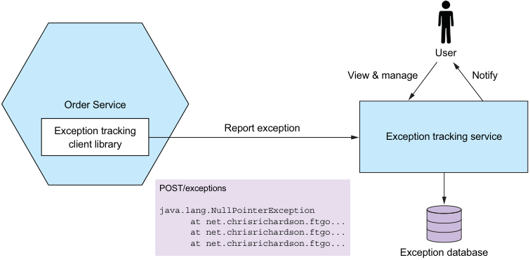

**----- Start of picture text -----** 
User View & manage Notify Order Service Exception tracking Report exception Exception tracking service client library POST/exceptions java.lang.NullPointerException at net.chrisrichardson.ftgo... at net.chrisrichardson.ftgo... at net.chrisrichardson.ftgo... Exception database **----- End of picture text -----** 

Figure 11.15 A service reports exceptions to an exception tracking service, which de-duplicates exceptions and alerts developers. It has a UI for viewing and managing exceptions. 

## Exception tracking services 

There are several exception tracking services. Some, such as Honeybadger (www .honeybadger.io), are purely cloud-based. Others, such as Sentry.io (https://sentry.io/ welcome/), also have an open source version that you can deploy on your own infrastructure. These services receive exceptions from your application and generate alerts. They provide a console for viewing exceptions and managing their resolution. An exception tracking service typically provides client libraries in a variety of languages. 

The Exception tracking pattern is a useful way to quickly identify and respond to production issues. 

It’s also important to track user behavior. Let’s look at how to do that. 

## _11.3.6 Applying the Audit logging pattern_ 

The purpose of audit logging is to record each user’s actions. An audit log is typically used to help customer support, ensure compliance, and detect suspicious behavior. Each audit log entry records the identity of the user, the action they performed, and the business object(s). An application usually stores the audit log in a database table. 

## Pattern: Audit logging 

Record user actions in a database in order to help customer support, ensure compliance, and detect suspicious behavior. See http://microservices.io/patterns/ observability/audit-logging.html. 

There are a few different ways to implement audit logging: 

- Add audit logging code to the business logic. 

- Use aspect-oriented programming (AOP). 

- Use event sourcing. 

Let’s look at each option. 

## ADD AUDIT LOGGING CODE TO THE BUSINESS LOGIC 

The first and most straightforward option is to sprinkle audit logging code throughout your service’s business logic. Each service method, for example, can create an audit log entry and save it in the database. The drawback with this approach is that it intertwines auditing logging code and business logic, which reduces maintainability. The other drawback is that it’s potentially error prone, because it relies on the developer writing audit logging code. 

## USE ASPECT-ORIENTED PROGRAMMING 

The second option is to use AOP. You can use an AOP framework, such as Spring AOP, to define advice that automatically intercepts each service method call and persists an audit log entry. This is a much more reliable approach, because it automatically records every service method invocation. The main drawback of using AOP is that the advice only has access to the method name and its arguments, so it might be challenging to determine the business object being acted upon and generate a businessoriented audit log entry. 

## USE EVENT SOURCING 

The third and final option is to implement your business logic using event sourcing. As mentioned in chapter 6, _event sourcing_ automatically provides an audit log for create and update operations. You need to record the identity of the user in each event. One limitation with using event sourcing, though, is that it doesn’t record queries. If your service must create log entries for queries, then you’ll have to use one of the other options as well. 

## _11.4 Developing services using the Microservice chassis pattern_ 

This chapter has described numerous concerns that a service must implement, including metrics, reporting exceptions to an exception tracker, logging and health checks, externalized configuration, and security. Moreover, as described in chapter 3, a service may also need to handle service discovery and implement circuit breakers. That’s not something you’d want to set up from scratch each time you implement a new service. If you did, it would potentially be days, if not weeks, before you wrote your first line of business logic. 

_**Developing services using the Microservice chassis pattern**_ 

## Pattern: Microservice chassis 

Build services on a framework or collection of frameworks that handle cross-cutting concerns, such as exception tracking, logging, health checks, externalized configuration, and distributed tracing. See http://microservices.io/patterns/microservicechassis.html. 

A much faster way to develop services is to build your services upon a microservices chassis. As figure 11.16 shows, a _microservice chassis_ is a framework or set of frameworks that handle these concerns. When using a microservice chassis, you write little, if any, code to handle these concerns. 

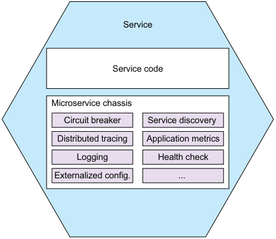

**----- Start of picture text -----** 
Service Service code Microservice chassis Circuit breaker Service discovery Distributed tracing Application metrics Logging Health check Externalized config. ... **----- End of picture text -----** 

Figure 11.16 A microservice chassis is a framework that handles numerous concerns, such as exception tracking, logging, health checks, externalized configuration, and distributed tracing. 

In this section, I first describe the concept of a microservice chassis and suggest some excellent microservice chassis frameworks. After that I introduce the concept of a service mesh, which at the time of writing is emerging as an intriguing alternative to using frameworks and libraries. 

Let’s first look at the idea of a microservice chassis. 

## _11.4.1 Using a microservice chassis_ 

A microservices chassis is a framework or set of frameworks that handle numerous concerns including the following: 

- Externalized configuration 

- Health checks 

- Application metrics 

- Service discovery 

- Circuit breakers 

- Distributed tracing 

It significantly reduces the amount of code you need to write. You may not even need to write any code. Instead, you configure the microservice chassis to fit your requirements. A microservice chassis enables you to focus on developing your service’s business logic. 

The FTGO application uses Spring Boot and Spring Cloud as the microservice chassis. Spring Boot provides functions such as externalized configuration. Spring Cloud provides functions such as circuit breakers. It also implements client-side service discovery, although the FTGO application relies on the infrastructure for service discovery. Spring Boot and Spring Cloud aren’t the only microservice chassis frameworks. If, for example, you’re writing services in GoLang, you could use either Go Kit (https://github.com/go-kit/kit) or Micro (https://github.com/micro/micro). 

One drawback of using a microservice chassis is that you need one for every language/platform combination that you use to develop services. Fortunately, it’s likely that many of the functions implemented by a microservice chassis will instead be implemented by the infrastructure. For example, as described in chapter 3, many deployment environments handle service discovery. What’s more, many of the networkrelated functions of a microservice chassis will be handled by what’s known as a service mesh, an infrastructure layer running outside of the services. 

## _11.4.2 From microservice chassis to service mesh_ 

A microservice chassis is a good way to implement various cross-cutting concerns, such as circuit breakers. But one obstacle to using a microservice chassis is that you need one for each programming language you use. For example, Spring Boot and Spring Cloud are useful if you’re a Java/Spring developer, but they aren’t any help if you want to write a NodeJS-based service. 

## Pattern: Service mesh 

Route all network traffic in and out of services through a networking layer that implements various concerns, including circuit breakers, distributed tracing, service discovery, load balancing, and rule-based traffic routing. See http://microservices.io/ patterns/deployment/service-mesh.html. 

An emerging alternative that avoids this problem is to implement some of this functionality outside of the service in what’s known as a service mesh. A _service mesh_ is networking infrastructure that mediates the communication between a service and other services and external applications. As figure 11.17 shows, all network traffic in and out of a service goes through the service mesh. It implements various concerns including circuit breakers, distributed tracing, service discovery, load balancing, and rule-based traffic routing. A service mesh can also secure interprocess communication by using 

_**Developing services using the Microservice chassis pattern**_ 

## **Fewer functions** 

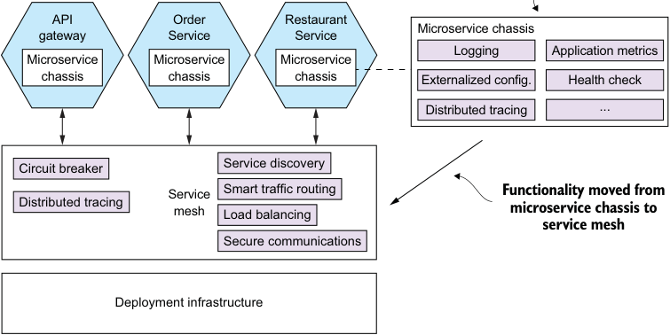

**----- Start of picture text -----** 
API Order Restaurant Microservice chassis gateway Service Service Logging Application metrics Microservice Microservice Microservice chassis chassis chassis Externalized config. Health check Distributed tracing ... Circuit breaker Service discovery Service Smart traffic routing Functionality moved from Distributed tracing mesh Load balancing microservice chassis to service mesh Secure communications Deployment infrastructure **----- End of picture text -----** 

Figure 11.17 All network traffic in and out of a service flows through the service mesh. The service mesh implements various functions including circuit breakers, distributed tracing, service discovery, and load balancing. Fewer functions are implemented by the microservice chassis. It also secures interprocess communication by using TLS-based IPC between services. 

TLS-based IPC between services. As a result, you no longer need to implement these particular concerns in the services. 

When using a service mesh, the microservice chassis is much simpler. It only needs to implement concerns that are tightly integrated with the application code, such as externalized configuration and health checks. The microservice chassis must support distributed tracing by propagating distributed tracing information, such as the B3 standard headers I discussed earlier in section 11.3.3. 

The current state of service mesh implementations 

There are various service mesh implementations, including the following: 

- Istio (https://istio.io) 

- Linkerd (https://linkerd.io) 

- Conduit (https://conduit.io) 

As of the time of writing, Linkerd is the most mature, with Istio and Conduit still under active development. For more information about this exciting new technology, take a look at each product’s documentation. 

The service mesh concept is an extremely promising idea. It frees the developer from having to deal with various cross-cutting concerns. Also, the ability of a service mesh to 

route traffic enables you to separate deployment from release. It gives you the ability to deploy a new version of a service into production but only release it to certain users, such as internal test users. Chapter 12 discusses this concept further when describing how to deploy services using Kubernetes. 

## _Summary_ 

- It’s essential that a service implements its functional requirements, but it must also be secure, configurable, and observable. 

- Many aspects of security in a microservice architecture are no different than in a monolithic architecture. But there are some aspects of application security that are necessarily different, including how user identity is passed between the API gateway and the services and who is responsible for authentication and authorization. A commonly used approach is for the API gateway to authenticate clients. The API gateway includes a transparent token, such as a JWT, in each request to a service. The token contains the identity of the principal and their roles. The services use the information in the token to authorize access to resources. OAuth 2.0 is a good foundation for security in a microservice architecture. 

- A service typically uses one or more external services, such as message brokers and databases. The network location and credentials of each external service often depend on the environment that the service is running in. You must apply the Externalized configuration pattern and implement a mechanism that provides a service with configuration properties at runtime. One commonly used approach is for the deployment infrastructure to supply those properties via operating system environment variables or a properties file when it creates a service instance. Another option is for a service instance to retrieve its configuration from a configuration properties server. 

- Operations and developers share responsibility for implementing the observability patterns. Operations is responsible for the observability infrastructure, such as servers that handle log aggregation, metrics, exception tracking, and distributed tracing. Developers are responsible for ensuring that their services are observable. Services must have health check API endpoints, generate log entries, collect and expose metrics, report exceptions to an exception tracking service, and implement distributed tracing. 

- In order to simplify and accelerate development, you should develop services on top of a microservices chassis. A microservices chassis is framework or set of frameworks that handle various cross-cutting concerns, including those described in this chapter. Over time, though, it’s likely that many of the networkingrelated functions of a microservice chassis will migrate into a service mesh, a layer of infrastructure software through which all of a service’s network traffic flows. 

