## _De lo in microservices p y g_ 

## _This chapter covers_ 

- The four key deployment patterns, how they work, and their benefits and drawbacks: 

   - Language-specific packaging format 

   - Deploying a service as a VM 

   - Deploying a service as a container 

   - Serverless deployment 

- Deploying services with Kubernetes 

- Using a service mesh to separate deployment from release 

- Deploying services with AWS Lambda 

- Picking a deployment pattern 

Mary and her team at FTGO are almost finished writing their first service. Although it’s not yet feature complete, it’s running on developer laptops and the Jenkins CI server. But that’s not good enough. Software has no value to FTGO until it’s running in production and available to users. FTGO needs to deploy their service into production. 

_Deployment_ is a combination of two interrelated concepts: process and architecture. The deployment process consists of the steps that must be performed by people— developers and operations—in order to get software into production. The deployment architecture defines the structure of the environment in which that software runs. Both aspects of deployment have changed radically since I first started developing Enterprise Java applications in the late 1990s. The manual process of developers throwing code over the wall to production has become highly automated. As figure 12.1 shows, physical production environments have been replaced by increasingly lightweight and ephemeral computing infrastructure. 

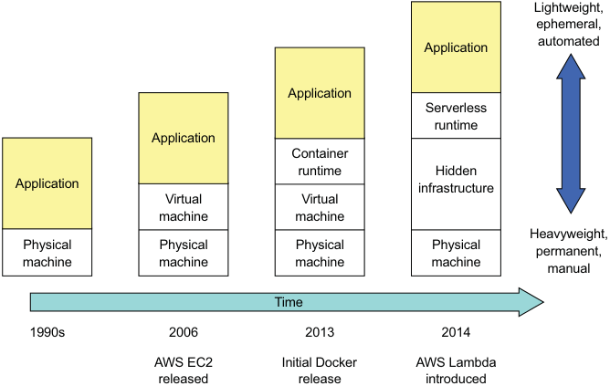

**----- Start of picture text -----** 
Lightweight, ephemeral, automated Application Application Serverless runtime Application Container runtime Hidden Application infrastructure Virtual Virtual machine machine Heavyweight, Physical Physical Physical Physical permanent, machine machine machine machine manual Time 1990s 2006 2013 2014 AWS EC2 Initial Docker AWS Lambda released release introduced **----- End of picture text -----** 

Figure 12.1 Heavyweight and long-lived physical machines have been abstracted away by increasingly lightweight and ephemeral technologies. 

Back in the 1990s, if you wanted to deploy an application into production, the first step was to throw your application along with a set of operating instructions over the wall to operations. You might, for example, file a trouble ticket asking operations to deploy the application. Whatever happened next was entirely the responsibility of operations, unless they encountered a problem they needed your help to fix. Typically, operations bought and installed expensive and heavyweight application servers such as WebLogic or WebSphere. Then they would log in to the application server console and deploy your applications. They would lovingly care for those machines, as if they were pets, installing patches and updating the software. 

In the mid 2000s, the expensive application servers were replaced with open source, lightweight web containers such as Apache Tomcat and Jetty. You could still run multiple applications on each web container, but having one application per web container became feasible. Also, virtual machines started to replace physical machines. 

But machines were still treated as beloved pets, and deployment was still a fundamentally manual process. 

Today, the deployment process is radically different. Instead of handing off code to a separate production team, the adoption of DevOps means that the development team is also responsible for deploying their application or services. In some organizations, operations provides developers with a console for deploying their code. Or, better yet, once the tests pass, the deployment pipeline automatically deploys the code into production. 

The computing resources used in a production environment have also changed radically with physical machines being abstracted away. Virtual machines running on a highly automated cloud, such as AWS, have replaced the long-lived, pet-like physical and virtual machines. Today’s virtual machines are immutable. They’re treated as disposable cattle instead of pets and are discarded and recreated rather than being reconfigured. _Containers_ , an even more lightweight abstraction layer of top of virtual machines, are an increasingly popular way of deploying applications. You can also use an even more lightweight _serverless_ deployment platform, such as AWS Lambda, for many use cases. 

It’s no coincidence that the evolution of deployment processes and architectures has coincided with the growing adoption of the microservice architecture. An application might have tens or hundreds of services written in a variety of languages and frameworks. Because each service is a small application, that means you have tens or hundreds of applications in production. It’s no longer practical, for example, for system administrators to hand configure servers and services. If you want to deploy microservices at scale, you need a highly automated deployment process and infrastructure. 

Figure 12.2 shows a high-level view of a production environment. The production environment enables developers to configure and manage their services, the deployment 

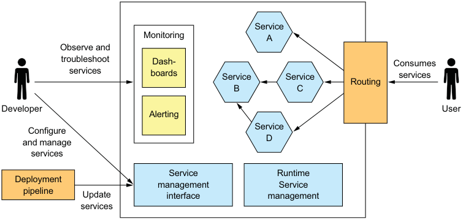

**----- Start of picture text -----** 
Service Monitoring A Observe and troubleshoot Dash- Consumes services boards Service Service services Routing B C Developer User Alerting Service Configure D and manage services Service Runtime Deployment management Service pipeline Update interface management services **----- End of picture text -----** 

Figure 12.2 A simplified view of the production environment. It provides four main capabilities: service management enables developers to deploy and manage their services, runtime management ensures that the services are running, monitoring visualizes service behavior and generates alerts, and request routing routes requests from users to the services. 

pipeline to deploy new versions of services, and users to access functionality implemented by those services. 

A production environment must implement four key capabilities: 

- _Service management interface_ —Enables developers to create, update, and configure services. Ideally, this interface is a REST API invoked by command-line and GUI deployment tools. 

- _Runtime service management_ —Attempts to ensure that the desired number of service instances is running at all times. If a service instance crashes or is somehow unable to handle requests, the production environment must restart it. If a machine crashes, the production environment must restart those service instances on a different machine. 

- _Monitoring_ —Provides developers with insight into what their services are doing, including log files and metrics. If there are problems, the production environment must alert the developers. Chapter 11 describes monitoring, also called _observability_ . 

- _Request routing_ —Routes requests from users to the services. 

In this chapter I discuss the four main deployment options: 

- Deploying services as language-specific packages, such as Java JAR or WAR files. It’s worthwhile exploring this option, because even though I recommend using one of the other options, its drawbacks motivate the other options. 

- Deploying services as virtual machines, which simplifies deployment by packaging a service as a virtual machine image that encapsulate the service’s technology stack. 

- Deploying services as containers, which are more lightweight than virtual machines. I show how to deploy the FTGO application’s Restaurant Service using Kubernetes, a popular Docker orchestration framework. 

- Deploying services using serverless deployment, which is even more modern than containers. We’ll look at how to deploy Restaurant Service using AWS Lambda, a popular serverless platform. 

Let’s first look at how to deploy services as language-specific packages. 

## _12.1 Deploying services using the Language-specific packaging format pattern_ 

Let’s imagine that you want to deploy the FTGO application’s Restaurant Service, which is a Spring Boot-based Java application. One way to deploy this service is by using the Service as a language-specific package pattern. When using this pattern, what’s deployed in production and what’s managed by the service runtime is a service in its language-specific package. In the case of Restaurant Service, that’s either the executable JAR file or a WAR file. For other languages, such as NodeJS, a service is a directory of source code and modules. For some languages, such as GoLang, a service is an operating system-specific executable. 

_**Deploying services using the Language-specific packaging format pattern**_ 

Pattern: Language-specific packaging format 

Deploy a language-specific package into production. See http://microservices.io/ patterns/deployment/language-specific-packaging.html. 

To deploy Restaurant Service on a machine, you would first install the necessary runtime, which in this case is the JDK. If it’s a WAR file, you also need to install a web container such as Apache Tomcat. Once you’ve configured the machine, you copy the package to the machine and start the service. Each service instance runs as a JVM process. 

Ideally, you’ve set up your deployment pipeline to automatically deploy the service to production, as shown in figure 12.3. The deployment pipeline builds an executable JAR file or WAR file. It then invokes the production environment’s service management interface to deploy the new version. 

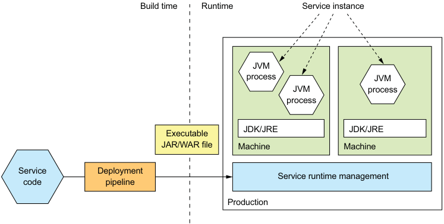

**----- Start of picture text -----** 
Build time Runtime Service instance JVM process JVM JVM process process JDK/JRE JDK/JRE Executable JAR/WAR file Machine Machine Service Deployment Service runtime management code pipeline Production **----- End of picture text -----** 

Figure 12.3 The deployment pipeline builds an executable JAR file and deploys it into production. In production, each service instance is a JVM running on a machine that has the JDK or JRE installed. 

A service instance is typically a single process but sometimes may be a group of processes. A Java service instance, for example, is a process running the JVM. A NodeJS service might spawn multiple worker processes in order to process requests concurrently. Some languages support deploying multiple service instances within the same process. 

Sometimes you might deploy a single service instance on a machine, while retaining the option to deploy multiple service instances on the same machine. For example, as figure 12.4 shows, you could run multiple JVMs on a single machine. Each JVM runs a single service instance. 

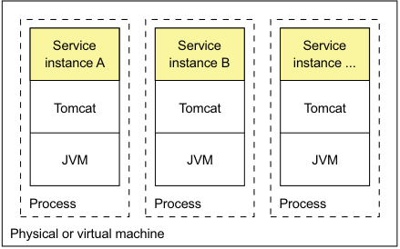

**----- Start of picture text -----** 
Service Service Service instance A instance B instance ... Tomcat Tomcat Tomcat JVM JVM JVM Process Process Process Physical or virtual machine **----- End of picture text -----** 

Figure 12.4 Deploying multiple service instances on the same machine. They might be instances of the same service or instances of different services. The overhead of the OS is shared among the service instances. Each service instance is a separate process, so there’s some isolation between them. 

Some languages also let you run multiple services instances in a single process. For example, as figure 12.5 shows, you can run multiple Java services on a single Apache Tomcat. 

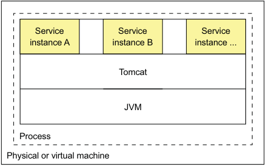

**----- Start of picture text -----** 
Service Service Service instance A instance B instance ... Tomcat JVM Process Physical or virtual machine **----- End of picture text -----** 

Figure 12.5 Deploying multiple services instances on the same web container or application server. They might be instances of the same service or instances of different services. The overhead of the OS and runtime is shared among all the service instances. But because the service instances are in the same process, there’s no isolation between them. 

This approach is commonly used when deploying applications on traditional expensive and heavyweight application servers, such as WebLogic and WebSphere. You can also package services as OSGI bundles and run multiple service instances in each OSGI container. 

The Service as a language-specific package pattern has both benefits and drawbacks. Let’s first look at the benefits. 

## _12.1.1 Benefits of the Service as a language-specific package pattern_ 

The Service as a language-specific package pattern has a few benefits: 

- Fast deployment 

- Efficient resource utilization, especially when running multiple instances on the same machine or within the same process 

Let’s look at each one. 

_**Deploying services using the Language-specific packaging format pattern**_ 

## FAST DEPLOYMENT 

One major benefit of this pattern is that deploying a service instance is relatively fast: you copy the service to a host and start it. If the service is written in Java, you copy a JAR or WAR file. For other languages, such as NodeJS or Ruby, you copy the source code. In either case, the number of bytes copied over the network is relatively small. 

Also, starting a service is rarely time consuming. If the service is its own process, you start it. Otherwise, if the service is one of several instances running in the same container process, you either dynamically deploy it into the container or restart the container. Because of the lack of overhead, starting a service is usually fast. 

## EFFICIENT RESOURCE UTILIZATION 

Another major benefit of this pattern is that it uses resources relatively efficiently. Multiple service instances share the machine and its operating system. It’s even more efficient if multiple service instances run within the same process. For example, multiple web applications could share the same Apache Tomcat server and JVM. 

## _12.1.2 Drawbacks of the Service as a language-specific package pattern_ 

Despite its appeal, the Service as a language-specific package pattern has several significant drawbacks: 

- Lack of encapsulation of the technology stack. 

- No ability to constrain the resources consumed by a service instance. 

- Lack of isolation when running multiple service instances on the same machine. 

- Automatically determining where to place service instances is challenging. 

Let’s look at each drawback. 

## LACK OF ENCAPSULATION OF THE TECHNOLOGY STACK 

The operation team must know the specific details of how to deploy each and every service. Each service needs a particular version of the runtime. A Java web application, for example, needs particular versions of Apache Tomcat and the JDK. Operations must install the correct version of each required software package. 

To make matters worse, services can be written in a variety of languages and frameworks. They might also be written in multiple versions of those languages and frameworks. Consequently, the development team must share lots of details with operations. This complexity increases the risk of errors during deployment. A machine might, for example, have the wrong version of the language runtime. 

## NO ABILITY TO CONSTRAIN THE RESOURCES CONSUMED BY A SERVICE INSTANCE 

Another drawback is that you can’t constrain the resources consumed by a service instance. A process can potentially consume all of a machine’s CPU or memory, starving other service instances and operating systems of resources. This might happen, for example, because of a bug. 

## LACK OF ISOLATION WHEN RUNNING MULTIPLE SERVICE INSTANCES ON THE SAME MACHINE 

The problem is even worse when running multiple instances on the same machine. The lack of isolation means that a misbehaving service instance can impact other service instances. As a result, the application risks being unreliable, especially when running multiple service instances on the same machine. 

## AUTOMATICALLY DETERMINING WHERE TO PLACE SERVICE INSTANCES IS CHALLENGING 

Another challenge with running multiple service instances on the same machine is determining the placement of service instances. Each machine has a fixed set of resources, CPU, memory, and so on, and each service instance needs some amount of resources. It’s important to assign service instances to machines in a way that uses the machines efficiently without overloading them. As I explain shortly, VM-based clouds and container orchestration frameworks handle this automatically. When deploying services natively, it’s likely that you’ll need to manually decide the placement. 

As you can see, despite its familiarity, the Service as a language-specific package pattern has some significant drawbacks. You should rarely use this approach, except perhaps when efficiency outweighs all other concerns. 

Let’s now look at modern ways of deploying services that avoid these problems. 

## _12.2 Deploying services using the Service as a virtual machine pattern_ 

Once again, imagine you want to deploy the FTGO Restaurant Service, except this time it’s on AWS EC2. One option would be to create and configure an EC2 instance and copy onto it the executable or WAR file. Although you would get some benefit from using the cloud, this approach suffers from the drawbacks described in the preceding section. A better, more modern approach is to package the service as an Amazon Machine Image (AMI), as shown in figure 12.6. Each service instance is an EC2 instance created from that AMI. The EC2 instances would typically be managed by an AWS Auto Scaling group, which attempts to ensure that the desired number of healthy instances is always running. 

## Pattern: Deploy a service as a VM 

Deploy services packaged as VM images into production. Each service instance is a VM. See http://microservices.io/patterns/deployment/service-per-vm.html. 

The virtual machine image is built by the service’s deployment pipeline. The deployment pipeline, as figure 12.6 shows, runs a VM image builder to create a VM image that contains the service’s code and whatever software is required to run it. For example, the VM builder for a FTGO service installs the JDK and the service’s executable JAR. The VM image builder configures the VM image machine to run the application when the VM boots, using Linux’s init system, such as upstart. 

_**Deploying services using the Service as a virtual machine pattern**_ 

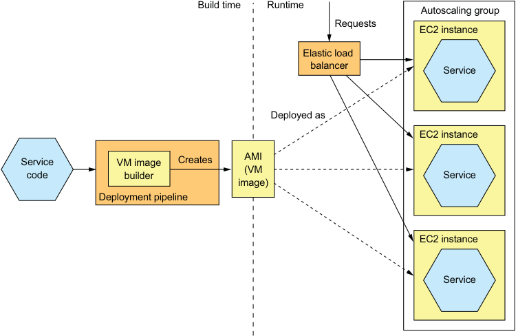

**----- Start of picture text -----** 
Build time Runtime Autoscaling group Requests EC2 instance Elastic load balancer Service Deployed as EC2 instance Service VM image Creates AMI code builder (VM Service image) Deployment pipeline EC2 instance Service **----- End of picture text -----** 

Figure 12.6 The deployment pipeline packages a service as a virtual machine image, such as an EC2 AMI, containing everything required to run the service, including the language runtime. At runtime, each service instance is a VM, such as an EC2 instance, instantiated from that image. An EC2 Elastic Load Balancer routes requests to the instances. 

There are a variety of tools that your deployment pipeline can use to build VM images. One early tool for creating EC2 AMIs is Aminator, created by Netflix, which used it to deploy its video-streaming service on AWS (https://github.com/Netflix/ aminator). A more modern VM image builder is Packer, which unlike Aminator supports a variety of virtualization technologies, including EC2, Digital Ocean, Virtual Box, and VMware (www.packer.io). To use Packer to create an AMI, you write a configuration file that specifies the base image and a set of provisioners that install software and configure the AMI. 

## About Elastic Beanstalk 

Elastic Beanstalk, which is provided by AWS, is an easy way to deploy your services using VMs. You upload your code, such as a WAR file, and Elastic Beanstalk deploys it as one or more load-balanced and managed EC2 instances. Elastic Beanstalk is perhaps not quite as fashionable as, say, Kubernetes, but it’s an easy way to deploy a microservices-based application on EC2. 

Interestingly, Elastic Beanstalk combines elements of the three deployment patterns described in this chapter. It supports several packaging formats for several languages, including Java, Ruby, and .NET. It deploys the application as VMs, but rather than building an AMI, it uses a base image that installs the application on startup. 

_(continued)_ 

Elastic Beanstalk can also deploy Docker containers. Each EC2 instance runs a collection of one or more containers. Unlike a Docker orchestration framework, covered later in the chapter, the unit of scaling is the EC2 instance rather than a container. 

Let’s look at the benefits and drawbacks of using this approach. 

## _12.2.1 The benefits of deploying services as VMs_ 

The Service as a virtual machine pattern has a number of benefits: 

- The VM image encapsulates the technology stack. 

- Isolated service instances. 

- Uses mature cloud infrastructure. 

Let’s look at each one. 

## THE VM IMAGE ENCAPSULATES THE TECHNOLOGY STACK 

An important benefit of this pattern is that the VM image contains the service and all of its dependencies. It eliminates the error-prone requirement to correctly install and set up the software that a service needs in order to run. Once a service has been packaged as a virtual machine, it becomes a black box that encapsulates your service’s technology stack. The VM image can be deployed anywhere without modification. The API for deploying the service becomes the VM management API. Deployment becomes much simpler and more reliable. 

## SERVICE INSTANCES ARE ISOLATED 

A major benefit of virtual machines is that each service instance runs in complete isolation. That, after all, is one of the main goals of virtual machine technology. Each virtual machine has a fixed amount of CPU and memory and can’t steal resources from other services. 

## USES MATURE CLOUD INFRASTRUCTURE 

Another benefit of deploying your microservices as virtual machines is that you can leverage mature, highly automated cloud infrastructure. Public clouds such as AWS attempt to schedule VMs on physical machines in a way that avoids overloading the machine. They also provide valuable features such as load balancing of traffic across VMs and autoscaling. 

## _12.2.2 The drawbacks of deploying services as VMs_ 

The Service as a VM pattern also has some drawbacks: 

- Less-efficient resource utilization 

- Relatively slow deployments 

- System administration overhead 

Let’s look at each drawback in turn. 

_**Deploying services using the Service as a container pattern**_ 

## LESS-EFFICIENT RESOURCE UTILIZATION 

Each service instance has the overhead of an entire virtual machine, including its operating system. Moreover, a typical public IaaS virtual machine offers a limited set of VM sizes, so the VM will probably be underutilized. This is less likely to be a problem for Java-based services because they’re relatively heavyweight. But this pattern might be an inefficient way of deploying lightweight NodeJS and GoLang services. 

## RELATIVELY SLOW DEPLOYMENTS 

Building a VM image typically takes some number of minutes because of the size of the VM. There are lots of bits to be moved over the network. Also, instantiating a VM from a VM image is time consuming because of, once again, the amount of data that must be moved over the network. The operating system running inside the VM also takes some time to boot, though _slow_ is a relative term. This process, which perhaps takes minutes, is much faster than the traditional deployment process. But it’s much slower than the more lightweight deployment patterns you’ll read about soon. 

## SYSTEM ADMINISTRATION OVERHEAD 

You’re responsible for patching the operation system and runtime. System administration may seem inevitable when deploying software, but later in section 12.5, I describe serverless deployment, which eliminates this kind of system administration. 

Let’s now look at an alternative way to deploy microservices that’s more lightweight, yet still has many of the benefits of virtual machines. 

## _12.3 Deploying services using the Service as a container pattern_ 

Containers are a more modern and lightweight deployment mechanism. They’re an operating-system-level virtualization mechanism. A container, as figure 12.7 shows, consists of usually one but sometimes multiple processes running in a sandbox, which isolates it from other containers. A container running a Java service, for example, would typically consist of the JVM process. 

From the perspective of a process running in a container, it’s as if it’s running on its own machine. It typically has its own IP address, which eliminates port conflicts. All Java processes can, for example, listen on port 8080. Each container also has its own root filesystem. The container runtime uses operating system mechanisms to isolate the containers from each other. The most popular example of a container runtime is Docker, although there are others, such as Solaris Zones. 

## Pattern: Deploy a service as a container 

Deploy services packaged as container images into production. Each service instance is a container. See http://microservices.io/patterns/deployment/service-per-container .html. 

## **Each container is a sandbox that isolates the processes.** 

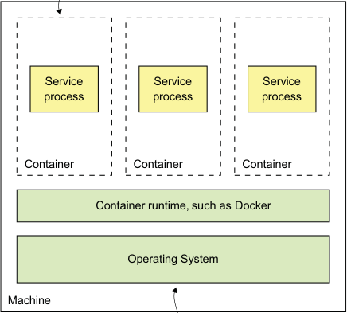

**----- Start of picture text -----** 
Service Service Service process process process Container Container Container Container runtime, such as Docker Operating System Machine **----- End of picture text -----** 

**Shared by all of the containers** 

Figure 12.7 A container consists of one or more processes running in an isolated sandbox. Multiple containers usually run on a single machine. The containers share the operating system. 

When you create a container, you can specify its CPU, memory resources, and, depending on the container implementation, perhaps the I/O resources. The container runtime enforces these limits and prevents a container from hogging the resources of its machine. When using a Docker orchestration framework such as Kubernetes, it’s especially important to specify a container’s resources. That’s because the orchestration framework uses a container’s requested resources to select the machine to run the container and thereby ensure that machines aren’t overloaded. 

Figure 12.8 shows the process of deploying a service as a container. At build-time, the deployment pipeline uses a container image-building tool, which reads the service’s code and a description of the image, to create the container image and stores it in a registry. At runtime, the container image is pulled from the registry and used to create containers. 

Let’s take a look at build-time and runtime steps in more detail. 

_**Deploying services using the Service as a container pattern**_ 

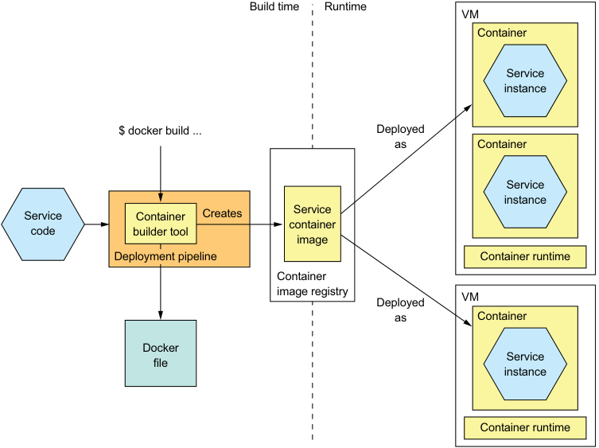

**----- Start of picture text -----** 
Build time Runtime VM Container Service instance $ docker build ... Deployed as Container Service instance Service Container Creates Service container code builder tool image Deployment pipeline Container runtime Container image registry VM Deployed as Container Docker Service file instance Container runtime **----- End of picture text -----** 

Figure 12.8 A service is packaged as a container image, which is stored in a registry. At runtime the service consists of multiple containers instantiated from that image. Containers typically run on virtual machines. A single VM will usually run multiple containers. 

## _12.3.1 Deploying services using Docker_ 

To deploy a service as a container, you must package it as a container image. A _container image_ is a filesystem image consisting of the application and any software required to run the service. It’s often a complete Linux root filesystem, although more lightweight images are also used. For example, to deploy a Spring Boot-based service, you build a container image containing the service’s executable JAR and the correct version of the JDK. Similarly, to deploy a Java web application, you would build a container image containing the WAR file, Apache Tomcat, and the JDK. 

## BUILDING A DOCKER IMAGE 

The first step in building an image is to create a Dockerfile. A _Dockerfile_ describes how to build a Docker container image. It specifies the base container image, a series of instructions for installing software and configuring the container, and the shell command to run when the container is created. Listing 12.1 shows the Dockerfile used to build an image for Restaurant Service. It builds a container image containing the service’s executable JAR file. It configures the container to run the java -jar command on startup. 

Listing 12.1 The **Dockerfile** used to build **Restaurant Service** 

**The base image Install curl for use by the Configure Docker health check. to run java -jar .. when the container is started.** 

FROM openjdk:8u171-jre-alpine RUN apk --no-cache add curl CMD java ${JAVA_OPTS} -jar ftgo-restaurant-service.jar HEALTHCHECK --start-period=30s -- interval=5s CMD curl http://localhost:8080/actuator/health || exit 1 COPY build/libs/ftgo-restaurant-service.jar . 

**Configure Docker to Copies the JAR in Gradle’s build invoke the health directory into the image check endpoint.** 

The base image openjdk:8u171-jre-alpine is a minimal footprint Linux image containing the JRE. The Dockerfile copies the service’s JAR into the image and configures the image to execute the JAR on startup. It also configures Docker to periodically invoke the health check endpoint, described in chapter 11. The HEALTHCHECK directive says to invoke the health check endpoint API, described in chapter 11, every 5 seconds after an initial 30-second delay, which gives the service time to start. 

Once you’ve written the Dockerfile, you can then build the image. The following listing shows the shell commands to build the image for Restaurant Service. The script builds the service’s JAR file and executes the docker build command to create the image. 

Listing 12.2 The shell commands used to build the container image for **Restaurant Service** 

**Change to the Build the** cd ftgo-restaurant-service **service’s directory. service’s JAR.** ../gradlew assemble docker build -t ftgo-restaurant-service . **Build the image.** 

The docker build command has two arguments: the -t argument specifies the name of the image, and the . specifies what Docker calls the context. The _context_ , which in this example is the current directory, consists of Dockerfile and the files used to build the image. The docker build command uploads the context to the Docker daemon, which builds the image. 

## PUSHING A DOCKER IMAGE TO A REGISTRY 

The final step of the build process is to push the newly built Docker image to what is known as a registry. A Docker _registry_ is the equivalent of a Java Maven repository for Java libraries, or a NodeJS npm registry for NodeJS packages. Docker hub is an example of a public Docker registry and is equivalent to Maven Central or NpmJS.org. But for your applications you’ll probably want to use a private registry provided by services, such as Docker Cloud registry or AWS EC2 Container Registry. 

You must use two Docker commands to push an image to a registry. First, you use the docker tag command to give the image a name that’s prefixed with the hostname 

_**Deploying services using the Service as a container pattern**_
and optional port of the registry. The image name is also suffixed with the version, which will be important when you make a new release of the service. For example, if the hostname of the registry is registry.acme.com, you would use this command to tag the image: docker tag ftgo-restaurant-service registry.acme.com/ftgo-restaurantservice:1.0.0.RELEASE 

Next you use the docker push command to upload that tagged image to the registry: docker push registry.acme.com/ftgo-restaurant-service:1.0.0.RELEASE 

This command often takes much less time than you might expect. That’s because a Docker image has what’s known as a _layered file system_ , which enables Docker to only transfer part of the image over the network. An image’s operating system, Java runtime, and the application are in separate layers. Docker only needs to transfer those layers that don’t exist in the destination. As a result, transferring an image over a network is quite fast when Docker only has to move the application’s layers, which are a small fraction of the image. 

Now that we’ve pushed the image to a registry, let’s look at how to create a container. 

## RUNNING A DOCKER CONTAINER 

Once you’ve packaged your service as a container image, you can then create one or more containers. The container infrastructure will pull the image from the registry onto a production server. It will then create one or more containers from that image. Each container is an instance of your service. 

As you might expect, Docker provides a docker run command that creates and starts a container. Listing 12.3 shows how to use this command to run Restaurant Service. The docker run command has several arguments, including the container image and a specification of environment variables to set in the runtime container. These are used to pass an externalized configuration, such as the database’s network location and more. 

Listing 12.3 Using **docker run** to run a containerized service 

|docker run \ -d \ --name ftgo-restaurant-service **Runs it as a** **background**|\   **daemon**||**The name of** **the container**|**Binds port 8080 of the** **container to port 8082** **of the host machine**|**Binds port 8080 of the** **container to port 8082** **of the host machine**|**Binds port 8080 of the** **container to port 8082** **of the host machine**|
|---|---|---|---|---|---|---|
|-p 8082:8080 \|||||||
|-e SPRING_DATASOURCE_URL=... -e|SPRING_DATASOURCE_USERNAME=...|||||\ **Environment**|
|-e SPRING_DATASOURCE_PASSWORD=... \||||||**variables**|
|registry.acme.com/ftgo-restaurant-service:1.0.0.RELEASE|||||||
||||**Image to run**||||

The docker run command pulls the image from the registry if necessary. It then creates and starts the container, which runs the java -jar command specified in the Dockerfile. 

Using the docker run command may seem simple, but there are a couple of problems. One is that docker run isn’t a reliable way to deploy a service, because it creates a container running on a single machine. The Docker engine provides some basic management features, such as automatically restarting containers if they crash or if the machine is rebooted. But it doesn’t handle machine crashes. 

Another problem is that services typically don’t exist in isolation. They depend on other services, such as databases and message brokers. It would be nice to deploy or undeploy a service and its dependencies as a unit. 

A better approach that’s especially useful during development is to use Docker Compose. Docker Compose is a tool that lets you declaratively define a set of containers using a YAML file, and then start and stop those containers as a group. What’s more, the YAML file is a convenient way to specify numerous externalized configuration properties. To learn more about Docker Compose, I recommend reading _Docker in Action_ by Jeff Nickoloff (Manning, 2016) and looking at the docker-compose.yml file in the example code. 

The problem with Docker Compose, though, is that it’s limited to a single machine. To deploy services reliably, you must use a Docker orchestration framework, such as Kubernetes, which turns a set of machines into a pool of resources. I describe how to use Kubernetes later, in section 12.4. First, let’s review the benefits and drawbacks of using containers. 

## _12.3.2 Benefits of deploying services as containers_ 

Deploying services as containers has several benefits. First, containers have many of the benefits of virtual machines: 

- Encapsulation of the technology stack in which the API for managing your services becomes the container API. 

- Service instances are isolated. 

- Service instances’s resources are constrained. 

But unlike virtual machines, containers are a lightweight technology. Container images are typically fast to build. For example, on my laptop it takes as little as five seconds to package a Spring Boot application as a container image. Moving a container image over the network, such as to and from the container registry, is also relatively fast, primarily because only a subset of an image’s layers need to be transferred. Containers also start very quickly, because there’s no lengthy OS boot process. When a container starts, all that runs is the service. 

_**Deploying the FTGO application with Kubernetes**_ 

## _12.3.3 Drawbacks of deploying services as containers_ 

One significant drawback of containers is that you’re responsible for the undifferentiated heavy lifting of administering the container images. You must patch the operating system and runtime. Also, unless you’re using a hosted container solution such as Google Container Engine or AWS ECS, you must administer the container infrastructure and possibly the VM infrastructure it runs on. 

## _12.4 Deploying the FTGO application with Kubernetes_ 

Now that we’ve looked at containers and their trade-offs, let’s look at how to deploy the FTGO application’s Restaurant Service using Kubernetes. Docker Compose, described in section 12.3.1, is great for development and testing. But to reliably run containerized services in production, you need to use a much more sophisticated container runtime, such as Kubernetes. Kubernetes is a Docker orchestration framework, a layer of software on top of Docker that turns a set of machines into a single pool of resources for running services. It endeavors to keep the desired number of instances of each service running at all times, even when service instances or machines crash. The agility of containers combined with the sophistication of Kubernetes is a compelling way to deploy services. 

In this section, I first give an overview of Kubernetes, its functionality, and its architecture. After that, I show how to deploy a service using Kubernetes. Kubernetes is a complex topic, and covering it exhaustively is beyond the scope of this book, so I only show how to use Kubernetes from the perspective of a developer. For more information, I recommend _Kubernetes in Action_ by Marko Luksa (Manning, 2018). 

## _12.4.1 Overview of Kubernetes_ 

Kubernetes is a Docker orchestration framework. A _Docker orchestration framework_ treats a set of machines running Docker as a pool of resources. You tell the Docker orchestration framework to run _N_ instances of your service, and it handles the rest. Figure 12.9 shows the architecture of a Docker orchestration framework. 

A Docker orchestration framework, such as Kubernetes , has three main functions: 

- _Resource management_ —Treats a cluster of machines as a pool of CPU, memory, and storage volumes, turning the collection of machines into a single machine. 

- _Scheduling_ —Selects the machine to run your container. By default, scheduling considers the resource requirements of the container and each node’s available resources. It might also implement _affinity_ , which colocates containers on the same node, and _anti-affinity_ , which places containers on different nodes. 

- _Service management_ —Implements the concept of named and versioned services that map directly to services in the microservice architecture. The orchestration framework ensures that the desired number of healthy instances is running at all times. It load balances requests across them. The orchestration framework performs rolling upgrades of services and lets you roll back to an old version. 

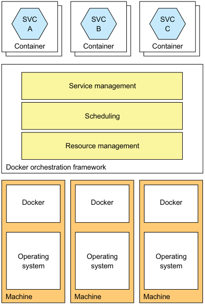

**----- Start of picture text -----** 
SVC SVC SVC A B C Container Container Container Service management Scheduling Resource management Docker orchestration framework Docker Docker Docker Operating Operating Operating system system system Machine Machine Machine **----- End of picture text -----** 

Figure 12.9 A Docker orchestration framework turns a set of machines running Docker into a cluster of resources. It assigns containers to machines. The framework attempts to keep the desired number of healthy containers running at all times. 

Docker orchestration frameworks are an increasingly popular way to deploy applications. Docker Swarm is part of the Docker engine, so is easy to set up and use. Kubernetes is much more complex to set up and administer, but it’s much more sophisticated. At the time of writing, Kubernetes has tremendous momentum, with a massive open source community. Let’s take a closer look at how it works. 

## KUBERNETES ARCHITECTURE 

Kubernetes runs on a cluster of machines. Figure 12.10 shows the architecture of a Kubernetes cluster. Each machine in a Kubernetes cluster is either a master or a node. A typical cluster has a small number of masters—perhaps just one—and many nodes. A _master_ machine is responsible for managing the cluster. A _node_ is a worker than runs one or more pods. A _pod_ is Kubernetes’s unit of deployment and consists of a set of containers. 

A master runs several components, including the following: 

- _API server_ —The REST API for deploying and managing services, used by the kubectl command-line interface, for example. 

- _Etcd_ —A key-value NoSQL database that stores the cluster data. 

_**Deploying the FTGO application with Kubernetes**_ 

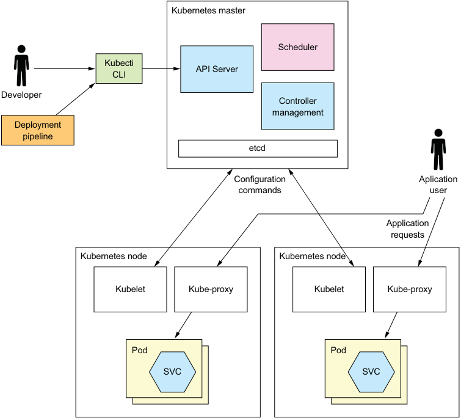

**----- Start of picture text -----** 
Kubernetes master Scheduler Kubecti API Server CLI Developer Controller management Deployment pipeline etcd Configuration Aplication commands user Application requests Kubernetes node Kubernetes node Kubelet Kube-proxy Kubelet Kube-proxy Pod Pod SVC SVC **----- End of picture text -----** 

Figure 12.10 A Kubernetes cluster consists of a master, which manages the cluster, and nodes, which run the services. Developers and the deployment pipeline interact with Kubernetes through the API server, which along with other cluster-management software runs on the master. Application containers run on nodes. Each node runs a Kubelet, which manages the application container, and a kube-proxy, which routes application requests to the pods, either directly as a proxy or indirectly by configuring iptables routing rules built into the Linux kernel. 

- _Scheduler_ —Selects a node to run a pod. 

- _Controller manager_ —Runs the controllers, which ensure that the state of the cluster matches the intended state. For example, one type of controller known as a _replication_ controller ensures that the desired number of instances of a service are running by starting and terminating instances. 

A node runs several components, including the following: 

- _Kubelet_ —Creates and manages the pods running on the node 

- _Kube-proxy_ —Manages networking, including load balancing across pods 

- _Pods_ —The application services 

Let’s now look at key Kubernetes concepts you’ll need to master to deploy services on Kubernetes. 

## KEY KUBERNETES CONCEPTS 

As mentioned in the introduction to this section, Kubernetes is quite complex. But it’s possible to use Kubernetes productively once you master a few key concepts, called _objects_ . Kubernetes defines many types of objects. From a developer’s perspective, the most important objects are the following: 

- _Pod_ —A pod is the basic unit of deployment in Kubernetes. It consists of one or more containers that share an IP address and storage volumes. The pod for a service instance often consists of a single container, such as a container running the JVM. But in some scenarios a pod contains one or more _sidecar_ containers, which implement supporting functions. For example, an NGINX server could have a sidecar that periodically does a git pull to download the latest version of the website. A pod is ephemeral, because either the pod’s containers or the node it’s running on might crash. 

- _Deployment_ —A declarative specification of a pod. A deployment is a controller that ensures that the desired number of instances of the pod (service instances) are running at all times. It supports versioning with rolling upgrades and rollbacks. Later in section 12.4.2, you’ll see that each service in a microservice architecture is a Kubernetes deployment. 

- _Service_ —Provides clients of an application service with a static/stable network location. It’s a form of infrastructure-provided service discovery, described in chapter 3. A service has an IP address and a DNS name that resolves to that IP address and load balances TCP and UDP traffic across one or more pods. The IP address and a DNS name are only accessible within the Kubernetes. Later, I describe how to configure services that are accessible from outside the cluster. 

- _ConfigMap_ —A named collection of name-value pairs that defines the externalized configuration for one or more application services (see chapter 11 for an overview of externalized configuration). The definition of a pod’s container can reference a ConfigMap to define the container’s environment variables. It can also use a ConfigMap to create configuration files inside the container. You can store sensitive information, such as passwords, in a form of ConfigMap called a Secret. 

Now that we’ve reviewed the key Kubernetes concepts, let’s see them in action by looking at how to deploy an application service on Kubernetes. 

## _12.4.2 Deploying the Restaurant service on Kubernetes_ 

As mentioned earlier, to deploy a service on Kubernetes, you need to define a deployment. The easiest way to create a Kubernetes object such as a deployment is by writing a YAML file. Listing 12.4 is a YAML file defining a deployment for Restaurant Service. This deployment specifies running two replicas of a pod. The pod has just one container. 

_**Deploying the FTGO application with Kubernetes**_ 

The container definition specifies the Docker image running along with other attributes, such as the values of environment variables. The container’s environment variables are the service’s externalized configuration. They are read by Spring Boot and made available as properties in the application context. 

Listing 12.4 Kubernetes **Deployment** for **ftgo-restaurant-service**
apiVersion: extensions/v1beta1 **Specifies that this is an** kind: Deployment **object of type Deployment** metadata: name: ftgo-restaurant-service **The name of the deployment** spec: replicas: 2 **Number of pod replicas** template: metadata: **Gives each pod a label** labels: **called app whose value is** app: ftgo-restaurant-service **ftgo-restaurant-service** spec: **The specification of** containers: **the pod, which defines** - name: ftgo-restaurant-service **just one container** image: msapatterns/ftgo-restaurant-service:latest imagePullPolicy: Always ports: - containerPort: 8080 **The container’s port** name: httpport env: - name: JAVA_OPTS **The container’s environment** value: "-Dsun.net.inetaddr.ttl=30" **variables, which are read by** - name: SPRING_DATASOURCE_URL **Spring Boot** value: jdbc:mysql://ftgo-mysql/eventuate - name: SPRING_DATASOURCE_USERNAME valueFrom: secretKeyRef: name: ftgo-db-secret key: username **Sensitive values that** - name: SPRING_DATASOURCE_PASSWORD valueFrom: **are retrieved from the Kubernetes Secret** secretKeyRef: **called ftgo-db-secret** name: ftgo-db-secret key: password - name: SPRING_DATASOURCE_DRIVER_CLASS_NAME value: com.mysql.jdbc.Driver - name: EVENTUATELOCAL_KAFKA_BOOTSTRAP_SERVERS value: ftgo-kafka:9092 - name: EVENTUATELOCAL_ZOOKEEPER_CONNECTION_STRING value: ftgo-zookeeper:2181 livenessProbe: **Configure Kubernetes** httpGet: **to invoke the health** path: /actuator/health **check endpoint.** port: 8080 initialDelaySeconds: 60 periodSeconds: 20 readinessProbe: 

httpGet: path: /actuator/health port: 8080 initialDelaySeconds: 60 periodSeconds: 20 

This deployment definition configures Kubernetes to invoke Restaurant Service’s health check endpoint. As described in chapter 11, a health check endpoint enables Kubernetes to determine the health of the service instance. Kubernetes implements two different checks. The first check is readinessProbe, which it uses to determine whether it should route traffic to a service instance. In this example, Kubernetes invokes the /actuator/health HTTP endpoint every 20 seconds after an initial 30second delay, which gives it a chance to initialize. If some number (default is 1) of consecutive readinessProbes succeeds, Kubernetes considers the service to be ready, whereas if some number (default, 3) of consecutive readinessProbes fail, it’s considered not to be ready. Kubernetes will only route traffic to the service instance when the readinessProbe indicates that it’s ready. 

The second health check is the livenessProbe. It’s configured the same way as the readinessProbe. But rather than determine whether traffic should be routed to a service instance, the livenessProbe determines whether Kubernetes should terminate and restart the service instance. If some number (default, 3) of consecutive livenessProbes fail in a row, Kubernetes will terminate and restart the service. 

Once you’ve written the YAML file, you can create or update the deployment by using the kubectl apply command: kubectl apply -f ftgo-restaurant-service/src/deployment/kubernetes/ftgorestaurant-service.yml 

This command makes a request to the Kubernetes API server that results in the creation of the deployment and the pods. 

To create this deployment, you must first create the Kubernetes Secret called ftgo-db-secret. One quick and insecure way to do that is as follows: kubectl create secret generic ftgo-db-secret \ 

--from-literal=username=mysqluser --from-literal=password=mysqlpw 

This command creates a secret containing the database user ID and password specified on the command line. See the Kubernetes documentation (https://kubernetes .io/docs/concepts/configuration/secret/#creating-your-own-secrets) for more secure ways to create secrets. 

## CREATING A KUBERNETES SERVICE 

At this point the pods are running, and the Kubernetes deployment will do its best to keep them running. The problem is that the pods have dynamically assigned IP addresses and, as such, aren’t that useful to a client that wants to make an HTTP request. As described in chapter 3, the solution is to use a service discovery mechanism. 

_**Deploying the FTGO application with Kubernetes**_ 

One approach is to use a client-side discovery mechanism and install a service registry, such as Netflix OSS Eureka. Fortunately, we can avoid doing that by using the service discovery mechanism built in to Kubernetes and define a Kubernetes service. 

A _service_ is a Kubernetes object that provides the clients of one or more pods with a stable endpoint. It has an IP address and a DNS name that resolves that IP address. The service load balances traffic to that IP address across the pods. Listing 12.5 shows the Kubernetes service for Restaurant Service. This service routes traffic from http://ftgo-restaurant-service:8080 to the pods defined by the deployment shown in the listing. 

Listing 12.5 The YAML definition of the Kubernetes service for **ftgo-restaurant-service** apiVersion: v1 kind: Service metadata: **The name of the service, also the DNS name** name: ftgo-restaurant-service spec: ports: **The exposed** - port: 8080 **port The container port to route traffic to** targetPort: 8080 selector: app: ftgo-restaurant-service **Selects the containers** --- **to route traffic to** 

The key part of the service definition is selector, which selects the target pods. It selects those pods that have a label named app with the value ftgo-restaurant-service. If you look closely, you’ll see that the container defined in listing 12.4 has such a label. 

Once you’ve written the YAML file, you can create the service using this command: kubectl apply -f ftgo-restaurant-service-service.yml 

Now that we’ve created the Kubernetes service, any clients of Restaurant Service that are running inside the Kubernetes cluster can access its REST API via http:// ftgo-restaurant-service:8080. Later, I discuss how to upgrade running services, but first let’s take a look at how to make the services accessible from outside the Kubernetes cluster. 

## _12.4.3 Deploying the API gateway_ 

The Kubernetes service for Restaurant Service, shown in listing 12.5, is only accessible from within the cluster. That’s not a problem for Restaurant Service, but what about API Gateway? Its role is to route traffic from the outside world to the service. It therefore needs to be accessible from outside the cluster. Fortunately, a Kubernetes service supports this use case as well. The service we looked at earlier is a ClusterIP service, which is the default, but there are, however, two other types of services: NodePort and LoadBalancer. 

A NodePort service is accessible via a cluster-wide port on all the nodes in the cluster. Any traffic to that port on any cluster node is load balanced to the backend pods. You must select an available port in the range of 30000–32767. For example, listing 12.6 shows a service that routes traffic to port 30000 of Consumer Service. 

Listing 12.6 The YAML definition of a **NodePort** service that routes traffic to port 8082 of **Consumer Service**
apiVersion: v1 kind: Service metadata: name: ftgo-api-gateway spec: **Specifies a type of NodePort** type: NodePort ports: - nodePort: 30000 **The cluster-** port: 80 **wide port** targetPort: 8080 selector: app: ftgo-api-gateway 

--- 

API Gateway is within the cluster using the URL http://ftgo-api-gateway and outside the URL http://<node-ip-address>:3000/, where node-ip-address is the IP address of one of the nodes. After configuring a NodePort service you can, for example, configure an AWS Elastic Load Balancer (ELB) to load balance requests from the internet across the nodes. A key benefit of this approach is that the ELB is entirely under your control. You have complete flexibility when configuring it. 

A NodePort type service isn’t the only option, though. You can also use a LoadBalancer service, which automatically configures a cloud-specific load balancer. The load balancer will be an ELB if Kubernetes is running on AWS. One benefit of this type of service is that you no longer have to configure your own load balancer. The drawback, however, is that although Kubernetes does give a few options for configuring the ELB, such the SSL certificate, you have a lot less control over its configuration. 

## _12.4.4 Zero-downtime deployments_ 

Imagine you’ve updated Restaurant Service and want to deploy those changes into production. Updating a running service is a simple three-step process when using Kubernetes: 

- 1 Build a new container image and push it to the registry using the same process described earlier. The only difference is that the image will be tagged with a different version tag—for example, ftgo-restaurant-service:1.1.0.RELEASE. 

- 2 Edit the YAML file for the service’s deployment so that it references the new image. 

- 3 Update the deployment using the kubectl apply -f command. 

Kubernetes will then perform a rolling upgrade of the pods. It will incrementally create pods running version 1.1.0.RELEASE and terminate the pods running version 

_**Deploying the FTGO application with Kubernetes**_ 

1.0.0.RELEASE. What’s great about how Kubernetes does this is that it doesn’t terminate old pods until their replacements are ready to handle requests. It uses the readinessProbe mechanism, a health check mechanism described earlier in this section, to determine whether a pod is ready. As a result, there will always be pods available to handle requests. Eventually, assuming the new pods start successfully, all the deployment’s pods will be running the new version. 

But what if there’s a problem and the version 1.1.0.RELEASE pods don’t start? Perhaps there’s a bug, such as a misspelled container image name or a missing environment variable for a new configuration property. If the pods fail to start, the deployment will become stuck. At that point, you have two options. One option is to fix the YAML file and rerun kubectl apply -f to update the deployment. The other option is to roll back the deployment. 

A deployment maintains the history of what are termed _rollouts_ . Each time you update the deployment, it creates a new rollout. As a result, you can easily roll back a deployment to a previous version by executing the following command: kubectl rollout undo deployment ftgo-restaurant-service 

Kubernetes will then replace the pods running version 1.1.0.RELEASE with pods running the older version, 1.0.0.RELEASE. 

A Kubernetes deployment is a good way to deploy a service without downtime. But what if a bug only appears after the pod is ready and receiving production traffic? In that situation, Kubernetes will continue to roll out new versions, so a growing number of users will be impacted. Though your monitoring system will hopefully detect the issue and quickly roll back the deployment, you won’t avoid impacting at least some users. To address this issue and make rolling out a new version of a service more reliable, we need to separate _deploying_ , which means getting the service running in production, from _releasing_ the service, which means making it available to handle production traffic. Let’s look at how to accomplish that using a service mesh. 

## _12.4.5 Using a service mesh to separate deployment from release_ 

The traditional way to roll out a new version of a service is to first test it in a staging environment. Then, once it’s passed the test in staging, you deploy in production by doing a rolling upgrade that replaces old instances of the service with new service instances. On one hand, as you just saw, Kubernetes deployments make doing a rolling upgrade very straightforward. On the other hand, this approach assumes that once a service version has passed the tests in the staging environment, it will work in production. Sadly, this is not always the case. 

One reason is because staging is unlikely to be an exact clone, if for no other reason than the production environment is likely to be much larger and handle much more traffic. It’s also time consuming to keep the two environments synchronized. As a result of discrepancies, it’s likely that some bugs will only show up in production. And even it were an exact clone, you can’t guarantee that testing will catch all bugs. 

A much more reliable way to roll out a new version is to separate deployment from release: 

- _Deployment_ —Running in the production environment 

- _Releasing a service_ —Making it available to end users 

You then deploy a service into production using the following steps: 

- 1 Deploy the new version into production without routing any end-user requests to it. 

- 2 Test it in production. 

- 3 Release it to a small number of end users. 

- 4 Incrementally release it to an increasingly larger number of users until it’s handling all the production traffic. 

- 5 If at any point there’s an issue, revert back to the old version—otherwise, once you’re confident the new version is working correctly, delete the old version. 

Ideally, those steps will be performed by a fully automated deployment pipeline that carefully monitors the newly deployed service for errors. 

Traditionally, separating deployments and releases in this way has been challenging because it requires a lot of work to implement it. But one of the benefits of using a service mesh is that using this style of deployment is a lot easier. A _service mesh_ is, as described in chapter 11, networking infrastructure that mediates all communication between a service and other services and external applications. In addition to taking on some of the responsibilities of the microservice chassis framework, a service mesh provides rule-based load balancing and traffic routing that lets you safely run multiple versions of your services simultaneously. Later in this section, you’ll see that you can route test users to one version of a service and end-users to a different version, for example. 

As described in chapter 11, there are several service meshes to choose from. In this section, I show you how to use Istio, a popular, open source service mesh originally developed by Google, IBM, and Lyft. I begin by providing a brief overview of Istio and a few of its many features. Next I describe how to deploy an application using Istio. After that, I show how to use its traffic-routing capabilities to deploy and release an upgrade to a service. 

## OVERVIEW OF THE ISTIO SERVICE MESH 

The Istio website describes Istio as an “An open platform to connect, manage, and secure microservices” (https://istio.io). It’s a networking layer through which all of your services’ network traffic flows. Istio has a rich set of features organized into four main categories: 

- _Traffic management_ —Includes service discovery, load balancing, routing rules, and circuit breakers 

- _Security_ —Secures interservice communication using Transport Layer Security (TLS) 

_**Deploying the FTGO application with Kubernetes**_ 

- _Telemetry_ —Captures metrics about network traffic and implements distributed tracing 

- _Policy enforcement_ —Enforces quotas and rate limits 

This section focuses on Istio’s traffic-management capabilities. 

Figure 12.11 shows Istio’s architecture. It consists of a control plane and a data plane. The control plane implements management functions, including configuring the data plane to route traffic. The data plane consists of Envoy proxies, one per service instance. 

The two main components of the control plane are the Pilot and the Mixer. The _Pilot_ extracts information about deployed services from the underlying infrastructure. When running on Kubernetes, for example, the Pilot retrieves the services and healthy pods. It configures the Envoy proxies to route traffic according to the defined routing rules. The _Mixer_ collects telemetry from the Envoy proxies and enforces policies. 

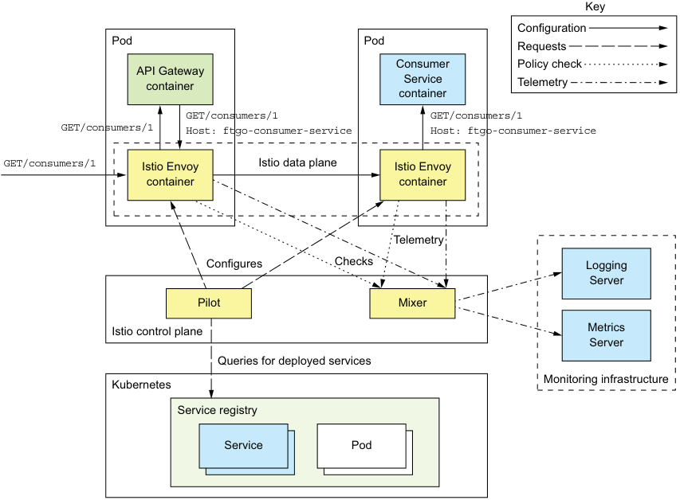

**----- Start of picture text -----** 
Key Configuration Pod Pod Requests Consumer Policy check API Gateway container Service Telemetry container GET/consumers/1 GET/consumers/1 GET/consumers/1 Host: ftgo-consumer-service Host: ftgo-consumer-service GET/consumers/1 Istio Envoy Istio data plane Istio Envoy container container Telemetry Configures Checks Logging Server Pilot Mixer Istio control plane Metrics Server Queries for deployed services Kubernetes Monitoring infrastructure Service registry Service Pod **----- End of picture text -----** 

Figure 12.11 Istio consists of a control plane, whose components include the Pilot and the Mixer, and a data plane, which consists of Envoy proxy servers. The Pilot extracts information about deployed services from the underlying infrastructure and configures the data plane. The Mixer enforces policies such as quotas and gathers telemetry, reporting it to the monitoring infrastructure servers. The Envoy proxy servers route traffic in and out of services. There’s one Envoy proxy server per service instance. 

The Istio Envoy proxy is a modified version of Envoy (www.envoyproxy.io). It’s a highperformance proxy that supports a variety of protocols, including TCP, low-level protocols such as HTTP and HTTPS, and higher-level protocols. It also understands MongoDB, Redis, and DynamoDB protocols. Envoy also supports robust interservice communication with features such as circuit breakers, rate limiting, and automatic retries. It can secure communication within the application by using TLS for interEnvoy communication. 

Istio uses Envoy as a sidecar, a process or container that runs alongside the service instance and implements cross-cutting concerns. When running on Kubernetes, the Envoy proxy is a container within the service’s pod. In other environments that don’t have the pod concept, Envoy runs in the same container as the service. All traffic to and from a service flows through its Envoy proxy, which routes traffic according to the routing rules given to it by the control plane. For example, direct Service  Service communication becomes Service  Source Envoy  Destination Envoy  Service. 

## Pattern: Sidecar 

Implement cross-cutting concerns in a sidecar process or container that runs alongside the service instance. See http://microservices.io/patterns/deployment/sidecar.html. 

Istio is configured using Kubernetes-style YAML configuration files. It has a commandline tool called istioctl that’s similar to kubectl. You use istioctl for creating, updating, and deleting rules and policies. When using Istio on Kubernetes, you can also use kubectl. 

Let’s look at how to deploy a service with Istio. 

## DEPLOYING A SERVICE WITH ISTIO 

Deploying a service on Istio is quite straightforward. You define a Kubernetes Service and a Deployment for each of your application’s services. Listing 12.7 shows the definition of Service and Deployment for Consumer Service. Although it’s almost identical to the definitions I showed earlier, there are a few differences. That’s because Istio has a few requirements for the Kubernetes services and pods: 

- A Kubernetes service port must use the Istio naming convention of <protocol>[-<suffix>], where protocol is http, http2, grpc, mongo, or redis. If the port is unnamed, Istio will treat the port as a TCP port and won’t apply rulebased routing. 

- A pod should have an app label such as app: ftgo-consumer-service, which identifies the service, in order to support Istio distributed tracing. 

- In order to run multiple versions of a service simultaneously, the name of a Kubernetes deployment must include the version, such as ftgo-consumerservice-v1, ftgo-consumer-service-v2, and so on. A deployment’s pods should have a version label, such as version: v1, which specifies the version, so that Istio can route to a specific version. 

_**Deploying the FTGO application with Kubernetes**_ 

Listing 12.7 Deploying Consumer Service with Istio apiVersion: v1 kind: Service metadata: name: ftgo-consumer-service spec: ports: - name: http **Named port** port: 8080 targetPort: 8080 selector: app: ftgo-consumer-service --apiVersion: extensions/v1beta1 kind: Deployment metadata: **Versioned** name: ftgo-consumer-service-v2 **deployment** spec: replicas: 1 template: metadata: labels: **Recommended labels** app: ftgo-consumer-service version: v2 spec: containers: **Image** - **version** image: image: ftgo-consumer-service:v2 ... 

By now, you may be wondering how to run the Envoy proxy container in the service’s pod. Fortunately, Istio makes that remarkably easy by automating modifying the pod definition to include the Envoy proxy. There are two ways to do that. The first is to use _manual sidecar injection_ and run the istioctl kube-inject command: istioctl kube-inject -f ftgo-consumer-service/src/deployment/kubernetes/ftgoconsumer-service.yml | kubectl apply -f - 

This command reads a Kubernetes YAML file and outputs the modified configuration containing the Envoy proxy. The modified configuration is then piped into kubectl apply. 

The second way to add the Envoy sidecar to the pod is to use _automatic sidecar injection_ . When this feature is enabled, you deploy a service using kubectl apply. Kubernetes automatically invokes Istio to modify the pod definition to include the Envoy proxy. 

If you describe your service’s pod, you’ll see that it consists of more than your service’s container: 

$ kubectl describe po ftgo-consumer-service-7db65b6f97-q9jpr Name: ftgo-consumer-service-7db65b6f97-q9jpr Namespace: default ... 

Init Containers: **Initializes the pod** istio-init: Image: docker.io/istio/proxy_init:0.8.0 .... **The service** Containers: **container** ftgo-consumer-service: Image: msapatterns/ftgo-consumer-service:latest istio-proxy:... **The Envoy container** Image: docker.io/istio/proxyv2:0.8.0 ... 

Now that we’ve deployed the service, let’s look at how to define routing rules. 

CREATE ROUTING RULES TO ROUTE TO THE V1 VERSION 

Let’s imagine that you deployed the ftgo-consumer-service-v2 deployment. In the absence of routing rules, Istio load balances requests across all versions of a service. It would, therefore, load balance across versions 1 and 2 of ftgo-consumer-service, which defeats the purpose of using Istio. In order to safely roll out a new version, you must define a routing rule that routes all traffic to the current v1 version. 

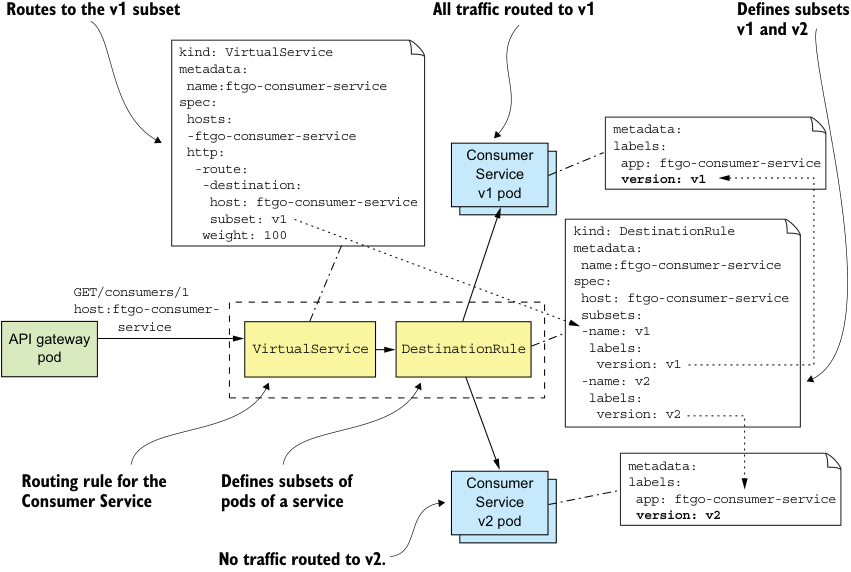

**----- Start of picture text -----** 
Routes to the v1 subset All traffic routed to v1 Defines subsets v1 and v2 kind: VirtualService metadata: name:ftgo-consumer-service spec: hosts: -ftgo-consumer-service metadata: http: Consumer labels: -route:-destination: Service app: version: ftgo-consumer-service v1 host: ftgo-consumer-service v1 pod subset: v1 weight: 100 kind: DestinationRule metadata: name:ftgo-consumer-service spec: GET/consumers/1 host: ftgo-consumer-service host:ftgo-consumer- subsets: API gateway service VirtualService DestinationRule -name:labels:v1 pod version: v1 -name: v2 labels: version: v2 metadata: Routing rule for the Defines subsets of Consumer labels: Consumer Service pods of a service Service app: ftgo-consumer-service v2 pod version: v2 No traffic routed to v2. **----- End of picture text -----** 

Figure 12.12 The routing rule for **Consumer Service** , which routes all traffic to the v1 pods. It consists of a **VirtualService** , which routes its traffic to the v1 subset, and a **DestinationRule** , which defines the v1 subset as the pods labeled with **version: v1** . Once you’ve defined this rule, you can safely deploy a new version without routing any traffic to it initially. 

_**Deploying the FTGO application with Kubernetes**_ 

Figure 12.12 shows the routing rule for Consumer Service that routes all traffic to v1. It consists of two Istio objects: a VirtualService and a DestinationRule. 

A VirtualService defines how to route requests for one or more hostnames. In this example, VirtualService defines the routes for a single hostname: ftgo-consumerservice. Here’s the definition of VirtualService for Consumer Service: apiVersion: networking.istio.io/v1alpha3 kind: VirtualService metadata: name: ftgo-consumer-service spec: hosts: **Applies to the** - **Consumer Service** ftgo-consumer-service http: - route: **Routes to** - destination: **Consumer Service** host: ftgo-consumer-service subset: v1 **The v1 subset** 

It routes all requests for the v1 subset of the pods of Consumer Service. Later, I show more complex examples that route based on HTTP requests and load balance across multiple weighted destinations. 

In addition to VirtualService, you must also define a DestinationRule, which defines one or more subsets of pods for a service. A subset of pods is typically a service version. A DestinationRule can also define traffic policies, such as the load-balancing algorithm. Here’s the DestinationRule for Consumer Service: apiVersion: networking.istio.io/v1alpha3 kind: DestinationRule metadata: name: ftgo-consumer-service spec: host: ftgo-consumer-service subsets: **The name of** - name: v1 **the subset** labels: version: v1 - name: v2 **The pod selector for the subset** labels: version: v2 

This DestinationRule defines two subsets of pods: v1 and v2. The v1 subset selects pods with the label version: v1. The v2 subset selects pods with the label version: v2. 

Once you’ve defined these rules, Istio will only route traffic pods labeled version: v1. It’s now safe to deploy v2. 

DEPLOYING VERSION 2 OF CONSUMER SERVICE 

Here’s an excerpt of the version 2 Deployment for Consumer Service: apiVersion: extensions/v1beta1 kind: Deployment metadata: name: ftgo-consumer-service-v2 **Version 2** spec: replicas: 1 template: metadata: labels: **Pod is labeled** app: ftgo-consumer-service version: v2 **with the version** ... 

This deployment is called ftgo-consumer-service-v2. It labels its pods with version: v2. After creating this deployment, both versions of the ftgo-consumer-service will be running. But because of the routing rules, Istio won’t route any traffic to v2. You’re now ready to route some test traffic to v2. 

ROUTING TEST TRAFFIC TO VERSION 2 

Once you’ve deployed a new version of a service, the next step is to test it. Let’s suppose that requests from test users have a testuser header . We can enhance the ftgoconsumer-service VirtualService to route requests with this header to v2 instances by making the following change: apiVersion: networking.istio.io/v1alpha3 kind: VirtualService metadata: name: ftgo-consumer-service spec: hosts: - ftgo-consumer-service http: - match: - headers: testuser: **Matches a nonblank** regex: "^.+$" **testuser header** route: - destination: host: ftgo-consumer-service **Routes test** subset: v2 **users to v2** - route: - destination: host: ftgo-consumer-service **Routes everyone** subset: v1 **else to v1** 

In addition to the original default route, VirtualService has a routing rule that routes requests with the testuser header to the v2 subset. After you’ve updated the rules, you can now test Consumer Service. Then, once you feel confident that the v2 is working, you can route some production traffic to it. Let’s look at how to do that. 

_**Deploying services using the Serverless deployment pattern**_ 

ROUTING PRODUCTION TRAFFIC TO VERSION 2 

After you’ve tested a newly deployed service, the next step is to start routing production traffic to it. A good strategy is to initially only route a small amount of traffic. Here, for example, is a rule that routes 95% of traffic to v1 and 5% to v2: apiVersion: networking.istio.io/v1alpha3 kind: VirtualService metadata: name: ftgo-consumer-service spec: hosts: - ftgo-consumer-service http: - route: - destination: host: ftgo-consumer-service subset: v1 weight: 95 - destination: host: ftgo-consumer-service subset: v2 weight: 5 

As you gain confidence that the service can handle production traffic, you can incrementally increase the amount of traffic going to the version 2 pods until it reaches 100%. At that point, Istio isn’t routing any traffic to the v1 pods. You could leave them running for a little while longer before deleting the version 1 Deployment. 

By letting you easily separate deployment from release, Istio makes rolling out a new version of a service much more reliable. Yet I’ve barely scratched the surface of Istio’s capabilities. As of the time of writing, the current version of Istio is 0.8. I’m excited to watch it and the other service meshes mature and become a standard part of a production environment. 

## _12.5 Deploying services using the Serverless deployment pattern_ 

The Language-specific packaging (section 12.1), Service as a VM (section 12.2), and Service as a container (section 12.3) patterns are all quite different, but they share some common characteristics. The first is that with all three patterns you must preprovision some computing resources—either physical machines, virtual machines, or containers. Some deployment platforms implement autoscaling, which dynamically adjusts the number of VMs or containers based on the load. But you’ll always need to pay for some VMs or containers, even if they’re idle. 

Another common characteristic is that you’re responsible for system administration. If you’re running any kind of machine, you must patch the operating system. In the case of physical machines, this also includes racking and stacking. You’re also responsible for administering the language runtime. This is an example of what Amazon called “undifferentiated heavy lifting.” Since the early days of computing, system 

_**Deploying microservices**_ 

administration has been one of those things you need to do. As it turns out, though, there’s a solution: serverless. 

## _12.5.1 Overview of serverless deployment with AWS Lambda_ 

At AWS Re:Invent 2014, Werner Vogels, the CTO of Amazon, introduced AWS Lambda with the amazing phrase “magic happens at the intersection of functions, events, and data.” As this phrase suggests, AWS Lambda was initially for deploying event-driven services. It’s “magic” because, as you’ll see, AWS Lambda is an example of serverless deployment technology. 

## Serverless deployment technologies 

The main public clouds all provide a serverless deployment option, although AWS Lambda is the most advanced. Google Cloud has Google Cloud functions, which as of the time writing is in beta (https://cloud.google.com/functions/). Microsoft Azure has Azure functions (https://azure.microsoft.com/en-us/services/functions). 

There are also open source serverless frameworks, such as Apache Openwhisk (https://openwhisk.apache.org) and Fission for Kubernetes (https://fission.io), that you can run on your own infrastructure. But I’m not entirely convinced of their value. You need to manage the infrastructure that runs the serverless framework—which doesn’t exactly sound like _serverless_ . Moreover, as you’ll see later in this section, serverless provides a constrained programming model in exchange for minimal system administration. If you need to manage infrastructure, then you have the constraints without the benefit. 

AWS Lambda supports Java, NodeJS, C#, GoLang, and Python. A _lambda_ function is a stateless service. It typically handles requests by invoking AWS services. For example, a lambda function that’s invoked when an image is uploaded to an S3 bucket could insert an item into a DynamoDB IMAGES table and publish a message to Kinesis to trigger image processing. A lambda function can also invoke third-party web services. 

To deploy a service, you package your application as a ZIP file or JAR file, upload it to AWS Lambda, and specify the name of the function to invoke to handle a request (also called an _event_ ). AWS Lambda automatically runs enough instances of your microservice to handle incoming requests. You’re billed for each request based on the time taken and the memory consumed. Of course, the devil is in the details, and later you’ll see that AWS Lambda has limitations. But the notion that neither you as a developer nor anyone in your organization need worry about any aspect of servers, virtual machines, or containers is incredibly powerful. 

## Pattern: Serverless deployment 

Deploy services using a serverless deployment mechanism provided by a public cloud. See http://microservices.io/patterns/deployment/serverless-deployment.html. 

_**Deploying services using the Serverless deployment pattern**_ 

## _12.5.2 Developing a lambda function_ 

Unlike when using the other three patterns, you must use a different programming model for your lambda functions. A lambda function’s code and the packaging depend on the programming language. A Java lambda function is a class that implements the generic interface RequestHandler, which is defined by the AWS Lambda Java core library and shown in the following listing. This interface takes two type parameters: I, which is the input type, and O, which is the output type. The type of I and O depend on the specific kind of request that the lambda handles. 

Listing 12.8 A Java lambda function is a class that implements the **RequestHandler** interface. public interface RequestHandler<I, O> { public O handleRequest(I input, Context context); } 

The RequestHandler interface defines a single handleRequest() method. This method has two parameters, an input object and a context, which provide access to the lambda execution environment, such as the request ID. The handleRequest() method returns an output object. For lambda functions that handle HTTP requests that are proxied by an AWS API Gateway, I and O are APIGatewayProxyRequestEvent and APIGatewayProxyResponseEvent, respectively. As you’ll soon see, the handler functions are quite similar to old-style Java EE servlets. 

A Java lambda is packaged as either a ZIP file or a JAR file. A JAR file is an uber JAR (or fat JAR) created by, for example, the Maven Shade plugin. A ZIP file has the classes in the root directory and JAR dependencies in the lib directory. Later, I show how a Gradle project can create a ZIP file. But first, let’s look at the different ways of invoking lambda function. 

## _12.5.3 Invoking lambda functions_ 

There are four ways to invoke a lambda function: 

- HTTP requests 

- Events generated by AWS services 

- Scheduled invocations 

- Directly using an API call 

Let’s look at each one. 

## HANDLING HTTP REQUESTS 

One way to invoke a lambda function is to configure an AWS API Gateway to route HTTP requests to your lambda. The API gateway exposes your lambda function as an HTTPS endpoint. It functions as an HTTP proxy, invokes the lambda function with an HTTP request object, and expects the lambda function to return an HTTP response object. By using the API gateway with AWS Lambda you can, for example, deploy RESTful services as lambda functions. 

## HANDLING EVENTS GENERATED BY AWS SERVICES 

The second way to invoke a lambda function is to configure your lambda function to handle events generated by an AWS service. Examples of events that can trigger a lambda function include the following: 

- An object is created in an S3 bucket. 

- An item is created, updated, or deleted in a DynamoDB table. 

- A message is available to read from a Kinesis stream. 

- An email is received via the Simple email service. 

Because of this integration with other AWS services, AWS Lambda is useful for a wide range of tasks. 

## DEFINING SCHEDULED LAMBDA FUNCTIONS 

Another way to invoke a lambda function is to use a Linux cron-like schedule. You can configure your lambda function to be invoked periodically—for example, every minute, 3 hours, or 7 days. Alternatively, you can use a cron expression to specify when AWS should invoke your lambda. cron expressions give you tremendous flexibility. For example, you can configure a lambda to be invoked at 2:15 p.m. Monday through Friday. 

## INVOKING A LAMBDA FUNCTION USING A WEB SERVICE REQUEST 

The fourth way to invoke a lambda function is for your application to invoke it using a web service request. The web service request specifies the name of the lambda function and the input event data. Your application can invoke a lambda function synchronously or asynchronously. If your application invokes the lambda function synchronously, the web service’s HTTP response contains the response of the lambda function. Otherwise, if it invokes the lambda function asynchronously, the web service response indicates whether the execution of the lambda was successfully initiated. 

## _12.5.4 Benefits of using lambda functions_ 

Deploying services using lambda functions has several benefits: 

- _Integrated with many AWS services_ —It’s remarkably straightforward to write lambdas that consume events generated by AWS services, such as DynamoDB and Kinesis, and handle HTTP requests via the AWS API Gateway. 

- _Eliminates many system administration tasks_ —You’re no longer responsible for lowlevel system administration. There are no operating systems or runtimes to patch. As a result, you can focus on developing your application. 

- _Elasticity_ —AWS Lambda runs as many instances of your application as are needed to handle the load. You don’t have the challenge of predicting needed capacity or run the risk of underprovisioning or overprovisioning VMs or containers. 

- _Usage-based pricing_ —Unlike a typical IaaS cloud, which charges by the minute or hour for a VM or container even when it’s idle, AWS Lambda only charges you for the resources that are consumed while processing each request. 

_**Deploying a RESTful service using AWS Lambda and AWS Gateway**_ 

## _12.5.5 Drawbacks of using lambda functions_ 

As you can see, AWS Lambda is an extremely convenient way to deploy services, but there are some significant drawbacks and limitations: 

- _Long-tail latency_ —Because AWS Lambda dynamically runs your code, some requests have high latency because of the time it takes for AWS to provision an instance of your application and for the application to start. This is particularly challenging when running Java-based services because they typically take at least several seconds to start. For instance, the example lambda function described in the next section takes a while to start up. Consequently, AWS Lambda may not be suited for latency-sensitive services. 

- _Limited event/request-based programming model_ —AWS Lambda isn’t intended to be used to deploy long-running services, such as a service that consumes messages from a third-party message broker. 

Because of these drawbacks and limitations, AWS Lambda isn’t a good fit for all services. But when choosing a deployment pattern, I recommend first evaluating whether serverless deployment supports your service’s requirements before considering alternatives. 

## _12.6 Deploying a RESTful service using AWS Lambda and AWS Gateway_ 

Let’s take a look at how to deploy Restaurant Service using AWS Lambda. It’s a service that has a REST API for creating and managing restaurants. It doesn’t have longlived connections to Apache Kafka, for example, so it’s a good fit for AWS lambda. Figure 12.13 shows the deployment architecture for this service. The service consists of several lambda functions, one for each REST endpoint. An AWS API Gateway is responsible for routing HTTP requests to the lambda functions. 

Each lambda function has a request handler class. The ftgo-create-restaurant lambda function invokes the CreateRestaurantRequestHandler class, and the ftgofind-restaurant lambda function invokes FindRestaurantRequestHandler. Because these request handler classes implement closely related aspects of the same service, they’re packaged together in the same ZIP file, restaurant-service-aws-lambda .zip. Let’s look at the design of the service, including those handler classes. 

## _12.6.1 The design of the AWS Lambda version of Restaurant Service_ 

The architecture of the service, shown in figure 12.14, is quite similar to that of a traditional service. The main difference is that Spring MVC controllers have been replaced by AWS Lambda request handler classes. The rest of the business logic is unchanged. 

The service consists of a presentation tier consisting of the request handlers, which are invoked by AWS Lambda to handle the HTTP requests, and a traditional business 

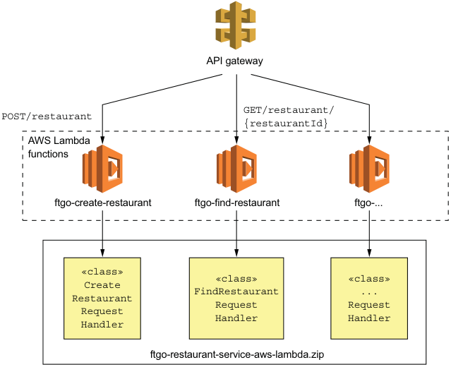

**----- Start of picture text -----** 
API gateway GET/restaurant/ POST/restaurant {restaurantId} AWS Lambda functions ftgo-create-restaurant ftgo-find-restaurant ftgo-... «class» «class» «class» Create Restaurant FindRestaurant ... Request Request Request Handler Handler Handler ftgo-restaurant-service-aws-lambda.zip **----- End of picture text -----** 

Figure 12.13 Deploying **Restaurant Service** as AWS Lambda functions. The AWS API Gateway routes HTTP requests to the AWS Lambda functions, which are implemented by request handler classes defined by **Restaurant Service** . 

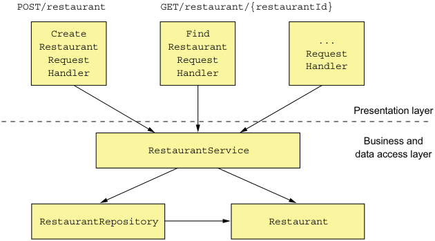

**----- Start of picture text -----** 
POST/restaurant GET/restaurant/{restaurantId} Create Find Restaurant Restaurant ... Request Request Request Handler Handler Handler Presentation layer Business and RestaurantService data access layer RestaurantRepository Restaurant **----- End of picture text -----** 

Figure 12.14 The design of the AWS Lambda-based **Restaurant Service** . The presentation layer consists of request handler classes, which implement the lambda functions. They invoke the business tier, which is written in a traditional style consisting of a service class, an entity, and a repository. 

_**Deploying a RESTful service using AWS Lambda and AWS Gateway**_ 

tier. The business tier consists of RestaurantService, the Restaurant JPA entity, and RestaurantRepository, which encapsulates the database. 

Let’s take a look at the FindRestaurantRequestHandler class. 

## THE FINDRESTAURANTREQUESTHANDLER CLASS 

The FindRestaurantRequestHandler class implements the GET /restaurant/ {restaurantId} endpoint. This class along with the other request handler classes are the leaves of the class hierarchy shown in figure 12.15. The root of the hierarchy is RequestHandler, which is part of the AWS SDK. Its abstract subclasses handle errors and inject dependencies. 

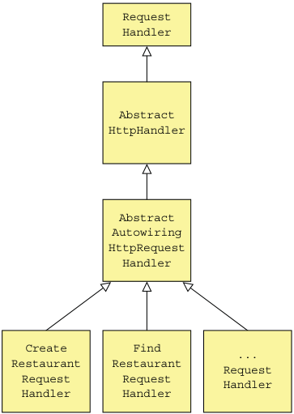

**----- Start of picture text -----** 
Request Handler Abstract HttpHandler Abstract Autowiring HttpRequest Handler Create Find Restaurant Restaurant ... Request Request Request Handler Handler Handler **----- End of picture text -----** 

Figure 12.15 The design of the request handler classes. The abstract superclasses implement dependency injection and error handling. 

The AbstractHttpHandler class is the abstract base class for HTTP request handlers. It catches unhandled exceptions thrown during request handling and returns a 500 - internal server error response. The AbstractAutowiringHttpRequestHandler class implements dependency injection for request handlers. I’ll describe these abstract superclasses shortly, but first let’s look at the code for FindRestaurantRequestHandler. 

Listing 12.9 shows the code for the FindRestaurantRequestHandler class. The FindRestaurantRequestHandler class has a handleHttpRequest() method, which takes an APIGatewayProxyRequestEvent representing an HTTP request as a parameter. It invokes RestaurantService to find the restaurant and returns an APIGatewayProxyResponseEvent describing the HTTP response. 

Listing 12.9 The handler class for **GET /restaurant/{restaurantId}**
public class FindRestaurantRequestHandler extends AbstractAutowiringHttpRequestHandler { 

@Autowired private RestaurantService restaurantService; 

**The Spring Java configuration class to use for the application context** 

@Override protected Class<?> getApplicationContextClass() { return CreateRestaurantRequestHandler.class; } @Override protected APIGatewayProxyResponseEvent handleHttpRequest(APIGatewayProxyRequestEvent request, Context context) { long restaurantId; try { restaurantId = Long.parseLong(request.getPathParameters() .get("restaurantId")); } catch (NumberFormatException e) { **Returns a 400 - bad request** return makeBadRequestResponse(context); **response if the restaurantId** } **is missing or invalid** 

**Returns a 400 - bad request response if the restaurantId is missing or invalid** 

Optional<Restaurant> possibleRestaurant = restaurantService.findById(restaur antId); 

**Returns either the restaurant or a 404 - not found response**
return possibleRestaurant .map(this::makeGetRestaurantResponse) .orElseGet(() -> makeRestaurantNotFoundResponse(context, restaurantId)); 

} private APIGatewayProxyResponseEvent makeBadRequestResponse(Context context) { 

... 

} private APIGatewayProxyResponseEvent makeRestaurantNotFoundResponse(Context context, long restaurantId) { ... } private APIGatewayProxyResponseEvent makeGetRestaurantResponse(Restaurant restaurant) { ... } } 

As you can see, it’s quite similar to a servlet, except that instead of a service() method, which takes an HttpServletRequest and returns HttpServletResponse, it has a handleHttpRequest(), which takes an APIGatewayProxyRequestEvent and returns APIGatewayProxyResponseEvent. 

Let’s now take a look at its superclass, which implements dependency injection. 

_**Deploying a RESTful service using AWS Lambda and AWS Gateway**_ 

DEPENDENCY INJECTION USING THE ABSTRACTAUTOWIRINGHTTPREQUESTHANDLER CLASS 

An AWS Lambda function is neither a web application nor an application with a main() method. But it would be a shame to not be able to use the features of Spring Boot that we’ve been accustomed to. The AbstractAutowiringHttpRequestHandler class, shown in the following listing, implements dependency injection for request handlers. It creates an ApplicationContext using SpringApplication.run() and autowires dependencies prior to handling the first request. Subclasses such as FindRestaurantRequestHandler must implement the getApplicationContextClass() method. 

Listing 12.10 An abstract **RequestHandler** that implements dependency injection public abstract class AbstractAutowiringHttpRequestHandler extends AbstractHttpHandler { private static ConfigurableApplicationContext ctx; private ReentrantReadWriteLock ctxLock = new ReentrantReadWriteLock(); private boolean autowired = false; **Creates the Spring** protected synchronized ApplicationContext getAppCtx() { **Boot application** ctxLock.writeLock().lock(); **context just once** try { if (ctx == null) { ctx = SpringApplication.run(getApplicationContextClass()); } return ctx; } finally { ctxLock.writeLock().unlock(); } **Injects dependencies into** } **the request handler using autowiring before handling** @Override **the first request** protected void beforeHandling(APIGatewayProxyRequestEvent request, Context context) { super.beforeHandling(request, context); if (!autowired) { getAppCtx().getAutowireCapableBeanFactory().autowireBean(this); autowired = true; } **Returns the @Configuration** } **class used to create ApplicationContext**
protected abstract Class<?> getApplicationContextClass(); } 

This class overrides the beforeHandling() method defined by AbstractHttpHandler. Its beforeHandling() method injects dependencies using autowiring before handling the first request. 

## THE ABSTRACTHTTPHANDLER CLASS 

The request handlers for Restaurant Service ultimately extend AbstractHttpHandler, shown in listing 12.11. This class implements RequestHandler<APIGatewayProxyRequestEvent and APIGatewayProxyResponseEvent>. Its key responsibility is to catch exceptions thrown when handling a request and throw a 500 error code. 

Listing 12.11 An abstract **RequestHandler** that catches exceptions and returns a 500 HTTP response 

- public abstract class AbstractHttpHandler implements RequestHandler<APIGatewayProxyRequestEvent, APIGatewayProxyResponseEvent> { 

private Logger log = LoggerFactory.getLogger(this.getClass()); @Override public APIGatewayProxyResponseEvent handleRequest( APIGatewayProxyRequestEvent input, Context context) { log.debug("Got request: {}", input); try { beforeHandling(input, context); return handleHttpRequest(input, context); } catch (Exception e) { log.error("Error handling request id: {}", context.getAwsRequestId(), e); return buildErrorResponse(new AwsLambdaError( "Internal Server Error", "500", context.getAwsRequestId(), "Error handling request: " + context.getAwsRequestId() + " " + input.toString())); } } protected void beforeHandling(APIGatewayProxyRequestEvent request, Context context) { // do nothing } protected abstract APIGatewayProxyResponseEvent handleHttpRequest( APIGatewayProxyRequestEvent request, Context context); } 

## _12.6.2 Packaging the service as ZIP file_ 

Before the service can be deployed, we must package it as a ZIP file. We can easily build the ZIP file using the following Gradle task: task buildZip(type: Zip) { from compileJava from processResources into('lib') { from configurations.runtime } } 

This task builds a ZIP with the classes and resources at the top level and the JAR dependencies in the lib directory. 

Now that we’ve built the ZIP file, let’s look at how to deploy the lambda function. 

_**Deploying a RESTful service using AWS Lambda and AWS Gateway**_ 

## _12.6.3 Deploying lambda functions using the Serverless framework_ 

Using the tools provided by AWS to deploy lambda functions and configure the API gateway is quite tedious. Fortunately, the Serverless open source project makes using lambda functions a lot easier. When using Serverless, you write a simple serverless.yml file that defines your lambda functions and their RESTful endpoints. Serverless then deploys the lambda functions and creates and configures an API gateway that routes requests to them. 

The following listing is an excerpt of the serverless.yml that deploys Restaurant Service as a lambda. 

Listing 12.12 The **serverless.yml** deploys **Restaurant Service** . service: ftgo-application-lambda provider: **Tells serverless to** name: aws **deploy on AWS** runtime: java8 timeout: 35 **Supplies the service’s** region: ${env:AWS_REGION} **externalized configuration** stage: dev **via environment variables** environment: SPRING_DATASOURCE_DRIVER_CLASS_NAME: com.mysql.jdbc.Driver SPRING_DATASOURCE_URL: ... SPRING_DATASOURCE_USERNAME: ... **The ZIP file** SPRING_DATASOURCE_PASSWORD: ... **containing the lambda functions** package: artifact: ftgo-restaurant-service-aws-lambda/build/distributions/ ftgo-restaurant-service-aws-lambda.zip **Lambda function definitions consisting of the handler** functions: **function and HTTP endpoint** create-restaurant: handler: net.chrisrichardson.ftgo.restaurantservice.lambda .CreateRestaurantRequestHandler events: - http: path: restaurants method: post find-restaurant: handler: net.chrisrichardson.ftgo.restaurantservice.lambda .FindRestaurantRequestHandler events: - http: path: restaurants/{restaurantId} method: get 

You can then use the serverless deploy command, which reads the serverless.yml file, deploys the lambda functions, and configures the AWS API Gateway. After a short 

wait, your service will be accessible via the API gateway’s endpoint URL. AWS Lambda will provision as many instances of each Restaurant Service lambda function that are needed to support the load. If you change the code, you can easily update the lambda by rebuilding the ZIP file and rerunning serverless deploy. No servers involved! 

The evolution of infrastructure is remarkable. Not that long ago, we manually deployed applications on physical machines. Today, highly automated public clouds provide a range of virtual deployment options. One option is to deploy services as virtual machines. Or better yet, we can package services as containers and deploy them using sophisticated Docker orchestration frameworks such as Kubernetes. Sometimes we even avoid thinking about infrastructure entirely and deploy services as lightweight, ephemeral lambda functions. 

## _Summary_ 

- You should choose the most lightweight deployment pattern that supports your service’s requirements. Evaluate the options in the following order: serverless, containers, virtual machines, and language-specific packages. 

- A serverless deployment isn’t a good fit for every service, because of long-tail latencies and the requirement to use an event/request-based programming model. When it is a good fit, though, serverless deployment is an extremely compelling option because it eliminates the need to administer operating systems and runtimes and provides automated elastic provisioning and requestbased pricing. 

- Docker containers, which are a lightweight, OS-level virtualization technology, are more flexible than serverless deployment and have more predictable latency. It’s best to use a Docker orchestration framework such as Kubernetes, which manages containers on a cluster of machines. The drawback of using containers is that you must administer the operating systems and runtimes and most likely the Docker orchestration framework and the VMs that it runs on. 

- The third deployment option is to deploy your service as a virtual machine. On one hand, virtual machines are a heavyweight deployment option, so deployment is slower and it will most likely use more resources than the second option. On the other hand, modern clouds such as Amazon EC2 are highly automated and provide a rich set of features. Consequently, it may sometimes be easier to deploy a small, simple application using virtual machines than to set up a Docker orchestration framework. 

- Deploying your services as language-specific packages is generally best avoided unless you only have a small number of services. For example, as described in chapter 13, when starting on your journey to microservices you’ll probably deploy the services using the same mechanism you use for your monolithic application, which is most likely this option. You should only consider setting 

_**Summary**_
up a sophisticated deployment infrastructure such as Kubernetes once you’ve developed some services. 

- One of the many benefits of using a service mesh—a networking layer that mediates all network traffic in and out of services—is that it enables you to deploy a service in production, test it, and only then route production traffic to it. Separating deployment from release improves the reliability of rolling out new versions of services. 

