# _Refactoring to microservices_ 

# _This chapter covers_ 

- When to migrate a monolithic application to a microservice architecture 

- Why using an incremental approach is essential when refactoring a monolithic application to microservices 

- Implementing new features as services 

- Extracting services from the monolith 

- Integrating a service and the monolith 

I hope that this book has given you a good understanding of the microservice architecture, its benefits and drawbacks, and when to use it. There is, however, a fairly good chance you’re working on a large, complex monolithic application. Your daily experience of developing and deploying your application is slow and painful. Microservices, which appear like a good fit for your application, seem like distant nirvana. Like Mary and the rest of the FTGO development team, you’re wondering how on earth you can adopt the microservice architecture? 

Fortunately, there are strategies you can use to escape from monolithic hell without having to rewrite your application from scratch. You incrementally convert 


_**Overview of refactoring to microservices**_ 


your monolith into microservices by developing what’s known as a strangler application. The idea of a strangler application comes from strangler vines, which grow in rain forests by enveloping and sometimes killing trees. A _strangler application_ is a new application consisting of microservices that you develop by implementing new functionality as services and extracting services from the monolith. Over time, as the strangler application implements more and more functionality, it shrinks and ultimately kills the monolith. An important benefit of developing a strangler application is that, unlike a big bang rewrite, it delivers value to the business early and often. 

I begin this chapter by describing the motivations for refactoring a monolith to a microservice architecture. I then describe how to develop the strangler application by implementing new functionality as services and extracting services from the monolith. Next, I cover various design topics, including how to integrate the monolith and services, how to maintain database consistency across the monolith and services, and how to handle security. I end the chapter by describing a couple of example services. One service is Delayed Order Service, which implements brand new functionality. The other service is Delivery Service, which is extracted from the monolith. Let’s start by taking a look at the concept of refactoring to a microservice architecture. 

# _13.1 Overview of refactoring to microservices_ 

Put yourself in Mary’s shoes. You’re responsible for the FTGO application, a large and old monolithic application. The business is extremely frustrated with engineering’s inability to deliver features rapidly and reliably. FTGO appears to be suffering from a classic case of monolithic hell. Microservices seem, at least on the surface, to be the answer. Should you propose diverting development resources away from feature development to migrating to a microservice architecture? 

I start this section by discussing why you should consider refactoring to microservices. I also discuss why it’s important to be sure that your software development problems are because you’re in monolithic hell rather than in, for example, a poor software development process. I then describe strategies for incrementally refactoring your monolith to a microservice architecture. Next, I discuss the importance of delivering improvements earlier and often in order to maintain the support of the business. I then describe why you should avoid investing in a sophisticated deployment infrastructure until you’ve developed a few services. Finally, I describe the various strategies you can use to introduce services into your architecture, including implementing new features as services and extracting services from the monolith. 

# _13.1.1 Why refactor a monolith?_ 

The microservice architecture has, as described in chapter 1, numerous benefits. It has much better maintainability, testability, and deployability, so it accelerates development. The microservice architecture is more scalable and improves fault isolation. It’s also much easier to evolve your technology stack. But refactoring a monolith to 


microservices is a significant undertaking. It will divert resources away from new feature development. As a result, it’s likely that the business will only support the adoption of microservices if it solves a significant business problem. 

If you’re in monolithic hell, it’s likely that you already have at least one business problem. Here are some examples of business problems caused by monolithic hell: 

- _Slow delivery_ —The application is difficult to understand, maintain, and test, so developer productivity is low. As a result, the organization is unable to compete effectively and risks being overtaken by competitors. 

- _Buggy software releases_ —The lack of testability means that software releases are often buggy. This makes customers unhappy, which results in losing customers and reduced revenue. 

- _Poor scalability_ —Scaling a monolithic application is difficult because it combines modules with very different resource requirements into one executable component. The lack of scalability means that it’s either impossible or prohibitively expensive to scale the application beyond a certain point. As a result, the application can’t support the current or predicted needs of the business. 

It’s important to be sure that these problems are there because you’ve outgrown your architecture. A common reason for slow delivery and buggy releases is a poor software development process. For example, if you’re still relying on manual testing, then adopting automated testing alone can significantly increase development velocity. Similarly, you can sometimes solve scalability problems without changing your architecture. You should first try simpler solutions. If, and only if, you still have software delivery problems should you then migrate to the microservice architecture. Let’s look at how to do that. 

# _13.1.2 Strangling the monolith_ 

The process of transforming a monolithic application into microservices is a form of application modernization (https://en.wikipedia.org/wiki/Software_modernization). _Application modernization_ is the process of converting a legacy application to one having a modern architecture and technology stack. Developers have been modernizing applications for decades. As a result, there is wisdom accumulated through experience we can use when refactoring an application into a microservice architecture. The most important lesson learned over the years is to not do a big bang rewrite. 

A _big bang rewrite_ is when you develop a new application—in this case, a microservicesbased application—from scratch. Although starting from scratch and leaving the legacy code base behind sounds appealing, it’s extremely risky and will likely end in failure. You will spend months, possibly years, duplicating the existing functionality, and only then can you implement the features that the business needs today! Also, you’ll need to develop the legacy application anyway, which diverts effort away from the rewrite and means that you have a constantly moving target. What’s more, it’s possible 


_**Overview of refactoring to microservices**_ 


that you’ll waste time reimplementing features that are no longer needed. As Martin Fowler reportedly said, “the only thing a Big Bang rewrite guarantees is a Big Bang!” (www.randyshoup.com/evolutionary-architecture). 

Instead of doing a big bang rewrite, you should, as figure 13.1 shows, incrementally refactor your monolithic application. You gradually build a new application, which is called a strangler application. It consists of microservices that runs in conjunction with your monolithic application. Over time, the amount of functionality implemented by the monolithic application shrinks until either it disappears entirely or it becomes just another microservice. This strategy is akin to servicing your car while driving down the highway at 70 mph. It’s challenging, but is far less risky that attempting a big bang rewrite. 

**The strangler application grows larger over time.** 


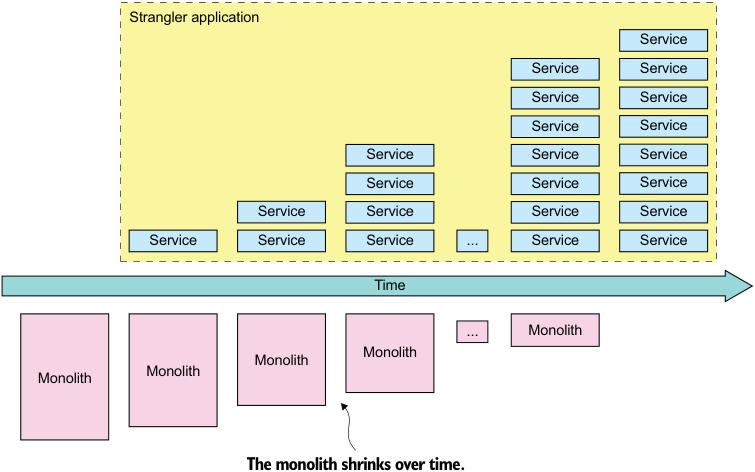


**----- Start of picture text -----**<br>
Strangler application<br>Service<br>Service Service<br>Service Service<br>Service Service<br>Service Service Service<br>Service Service Service<br>Service Service Service Service<br>Service Service Service ... Service Service<br>Time<br>... Monolith<br>Monolith<br>Monolith<br>Monolith<br>Monolith<br>The monolith shrinks over time.<br>**----- End of picture text -----**<br>


Figure 13.1 The monolith is incrementally replaced by a strangler application comprised of services. Eventually, the monolith is replaced entirely by the strangler application or becomes another microservice. 

Martin Fowler refers to this application modernization strategy as the Strangler application pattern (www.martinfowler.com/bliki/StranglerApplication.html). The name comes from the strangler vine (or strangler fig—see https://en.wikipedia.org/wiki/ Strangler_fig) that is found in rain forests. A strangler vine grows around a tree in 


order to reach the sunlight above the forest canopy. Often the tree dies, because either it’s killed by the vine or it dies of old age, leaving a tree-shaped vine. 

# Pattern: Strangler application 

Modernize an application by incrementally developing a new (strangler) application around the legacy application. See http://microservices.io/patterns/refactoring/ strangler-application.html. 

The refactoring process typically takes months, or years. For example, according to Steve Yegge (https://plus.google.com/+RipRowan/posts/eVeouesvaVX) it took Amazon.com a couple of years to refactor its monolith. In the case of a very large system, you may never complete the process. You could, for example, get to a point where you have tasks that are more important than breaking up the monolith, such as implementing revenue-generating features. If the monolith isn’t an obstacle to ongoing development, you may as well leave it alone. 

# DEMONSTRATE VALUE EARLY AND OFTEN 

An important benefit of incrementally refactoring to a microservice architecture is that you get an immediate return on your investment. That’s very different than a big bang rewrite, which doesn’t deliver any benefit until it’s complete. When incrementally refactoring the monolith, you can develop each new service using a new technology stack and a modern, high-velocity, DevOps-style development and delivery process. As a result, your team’s delivery velocity steadily increases over time. 

What’s more, you can migrate the high-value areas of your application to microservices first. For instance, imagine you’re working on the FTGO application. The business might, for example, decide that the delivery scheduling algorithm is a key competitive advantage. It’s likely that delivery management will be an area of constant, ongoing development. By extracting delivery management into a standalone service, the delivery management team will be able to work independently of the rest of the FTGO developers and significantly increase their development velocity. They’ll be able to frequently deploy new versions of the algorithm and evaluate their effectiveness. 

Another benefit of being able to deliver value earlier is that it helps maintain the business’s support for the migration effort. Their ongoing support is essential, because the refactoring effort will mean that less time is spent on developing features. Some organizations have difficulty eliminating technical debt because past attempts were too ambitious and didn’t provide much benefit. As a result, the business becomes reluctant to invest in further cleanup efforts. The incremental nature of refactoring to microservices means that the development team is able to demonstrate value early and often. 

# MINIMIZE CHANGES TO THE MONOLITH 

A recurring theme in this chapter is that you should avoid making widespread changes to the monolith when migrating to a microservice architecture. It’s inevitable 


_**Strategies for refactoring a monolith to microservices**_ 


that you’ll need to make some changes in order to support migration to services. Section 13.3.2 talks about how the monolith often needs to be modified so that it can participate in sagas that maintain data consistency across the monolith and services. The problem with making widespread changes to the monolith is that it’s time consuming, costly, and risky. After all, that’s probably why you want to migrate to microservices in the first place. 

Fortunately, there are strategies you can use for reducing the scope of the changes you need to make. For example, in section 13.2.3, I describe the strategy of replicating data from an extracted service back to the monolith’s database. And in section 13.3.2, I show how you can carefully sequence the extraction of services to reduce the impact on the monolith. By applying these strategies, you can reduce the amount of work required to refactor the monolith. 

TECHNICAL DEPLOYMENT INFRASTRUCTURE: YOU DON’T NEED ALL OF IT YET 

Throughout this book I’ve discussed a lot of shiny new technology, including deployment platforms such as Kubernetes and AWS Lambda and service discovery mechanisms. You might be tempted to begin your migrating to microservices by selecting technologies and building out that infrastructure. You might even feel pressure from the business people and from your friendly PaaS vendor to start spending money on this kind of infrastructure. 

As tempting as it seems to build out this infrastructure up front, I recommend only making a minimal up-front investment in developing it. The only thing you can’t live without is a deployment pipeline that performs automating testing. For example, if you only have a handful of services, you don’t need a sophisticated deployment and observability infrastructure. Initially, you can even get away with just using a hardcoded configuration file for service discovery. I suggest deferring any decisions about technical infrastructure that involve significant investment until you’ve gained real experience with the microservice architecture. It’s only once you have a few services running that you’ll have the experience to pick technologies. 

Let’s now look at the strategies you can use for migrating to a microservice architecture. 

# _13.2 Strategies for refactoring a monolith to microservices_ 

There are three main strategies for strangling the monolith and incrementally replacing it with microservices: 

- 1 Implement new features as services. 

- 2 Separate the presentation tier and backend. 

- 3 Break up the monolith by extracting functionality into services. 

The first strategy stops the monolith from growing. It’s typically a quick way to demonstrate the value of microservices, helping build support for the migration effort. The other two strategies break apart the monolith. When refactoring your monolith, you might sometimes use the second strategy, but you’ll definitely use the 


third strategy, because it’s how functionality is migrated from the monolith into the strangler application. 

Let’s take a look at each of these strategies, starting with implementing new features as services. 

# _13.2.1 Implement new features as services_ 

The Law of Holes states that “if you find yourself in a hole, stop digging” (https:// en.m.wikipedia.org/wiki/Law_of_holes). This is great advice to follow when your monolithic application has become unmanageable. In other words, if you have a large, complex monolithic application, don’t implement new features by adding code to the monolith. That will make your monolith even larger and more unmanageable. Instead, you should implement new features as services. 

This is a great way to begin migrating your monolithic application to a microservice architecture. It reduces the growth rate of the monolith. It accelerates the development of the new features, because you’re doing development in a brand new code base. It also quickly demonstrates the value of adopting the microservice architecture. 

# INTEGRATING THE NEW SERVICE WITH THE MONOLITH 

Figure 13.2 shows the application’s architecture after implementing a new feature as a service. Besides the new service and monolith, the architecture includes two other elements that integrate the service into the application: 

- _API gateway_ —Routes requests for new functionality to the new service and routes legacy requests to the monolith. 

- _Integration glue code_ —Integrates the service with the monolith. It enables the service to access data owned by the monolith and to invoke functionality implemented by the monolith. 

The integration glue code isn’t a standalone component. Instead, it consists of adapters in the monolith and the service that use one or more interprocess communication mechanisms. For example, integration glue for Delayed Delivery Service, described in section 13.4.1, uses both REST and domain events. The service retrieves customer contract information from the monolith by invoking a REST API. The monolith publishes Order domain events so that Delayed Delivery Service can track the state of Orders and respond to orders that won’t be delivered on time. Section 13.3.1 describes the integration glue code in more detail. 

WHEN TO IMPLEMENT A NEW FEATURE AS A SERVICE 

Ideally, you should implement every new feature in the strangler application rather than in the monolith. You’ll implement a new feature as either a new service or as part of an existing service. This way you’ll avoid ever having to touch the monolith code base. Unfortunately, though, not every new feature can be implemented as a service. 

That’s because the essence of a microservice architecture is a set of loosely coupled services that are organized around business capabilities. A feature might, for instance, be too small to be a meaningful service. You might, for example, just need to add a 


_**Strategies for refactoring a monolith to microservices**_ 


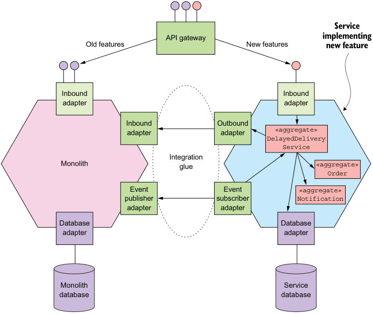


**----- Start of picture text -----**<br>
Service<br>API gateway implementing<br>Old features New features new feature<br>Inbound Inbound<br>adapter adapter<br>Inbound Outbound<br>adapter adapter «aggregate»<br>DelayedDelivery<br>Service<br>Integration<br>Monolith glue «aggregate»<br>Order<br>Event Event «aggregate»<br>publisher subscriber Notification<br>adapter adapter<br>Database Database<br>adapter adapter<br>Monolith Service<br>database database<br>**----- End of picture text -----**<br>


Figure 13.2 A new feature is implemented as a service that’s part of the strangler application. The integration glue integrates the service with the monolith and consists of adapters that implement synchronous and asynchronous APIs. An API gateway routes requests that invoke new functionality to the service. few fields and methods to an existing class. Or the new feature might be too tightly coupled to the code in the monolith. If you attempted to implement this kind of feature as a service you would typically find that performance would suffer because of excessive interprocess communication. You might also have problems maintaining data consistency. If a new feature can’t be implemented as a service, the solution is often to initially implement the new feature in the monolith. Later on, you can then extract that feature along with other related features into their own service. 

Implementing new features as services accelerates the development of those features. It’s a good way to quickly demonstrate the value of the microservice architecture. It also reduces the monolith’s growth rate. But ultimately, you need to break apart the monolith using the two other strategies. You need to migrate functionality to the strangler application by extracting functionality from the monolith into services. You might also be able to improve development velocity by splitting the monolith horizontally. Let’s look at how to do that. 


# _13.2.2 Separate presentation tier from the backend_ 

One strategy for shrinking a monolithic application is to split the presentation layer from the business logic and data access layers. A typical enterprise application consists of the following layers: 

- _Presentation logic_ —This consists of modules that handle HTTP requests and generate HTML pages that implement a web UI. In an application that has a sophisticated user interface, the presentation tier is often a substantial body of code. 

- _Business logic_ —This consists of modules that implement the business rules, which can be complex in an enterprise application. 

- _Data access logic_ —This consists of modules that access infrastructure services such as databases and message brokers. 

There is usually a clean separation between the presentation logic and the business and data access logic. The business tier has a coarse-grained API consisting of one or more facades that encapsulate the business logic. This API is a natural seam along which you can split the monolith into two smaller applications, as shown in figure 13.3. 


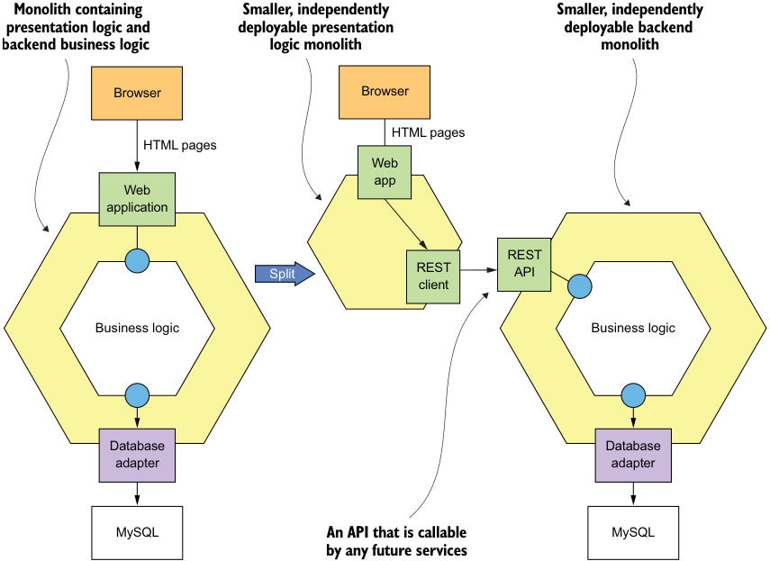


**----- Start of picture text -----**<br>
Monolith containing Smaller, independently Smaller, independently<br>presentation logic and deployable presentation deployable backend<br>backend business logic logic monolith monolith<br>Browser Browser<br>HTML pages<br>HTML pages<br>Web<br>app<br>Web<br>application<br>REST<br>Split REST API<br>client<br>Business logic Business logic<br>Database Database<br>adapter adapter<br>MySQL An API that is callable MySQL<br>by any future services<br>**----- End of picture text -----**<br>


Figure 13.3 Splitting the frontend from the backend enables each to be deployed independently. It also exposes an API for services to invoke. 


_**Strategies for refactoring a monolith to microservices**_ 

One application contains the presentation layer, and the other contains the business and data access logic. After the split, the presentation logic application makes remote calls to the business logic application. 

Splitting the monolith in this way has two main benefits. It enables you to develop, deploy, and scale the two applications independently of one another. In particular, it allows the presentation layer developers to rapidly iterate on the user interface and easily perform A/B testing, for example, without having to deploy the backend. Another benefit of this approach is that it exposes a remote API that can be called by the microservices you develop later. 

But this strategy is only a partial solution. It’s very likely that at least one or both of the resulting applications will still be an unmanageable monolith. You need to use the third strategy to replace the monolith with services. 

# _13.2.3 Extract business capabilities into services_ 

Implementing new features as services and splitting the frontend web application from the backend will only get you so far. You’ll still end up doing a lot of development in the monolithic code base. If you want to significantly improve your application’s architecture and increase your development velocity, you need to break apart the monolith by incrementally migrating business capabilities from the monolith to services. For example, section 13.5 describes how to extract delivery management from the FTGO monolith into a new Delivery Service. When you use this strategy, over time the number of business capabilities implemented by the services grows, and the monolith gradually shrinks. 

The functionality you want extract into a service is a vertical slice through the monolith. The slice consists of the following: 

- Inbound adapters that implement API endpoints 

- Domain logic 

- Outbound adapters such as database access logic 

- The monolith’s database schema 

As figure 13.4 shows, this code is extracted from the monolith and moved into a standalone service. An API gateway routes requests that invoke the extracted business capability to the service and routes the other requests to the monolith. The monolith and the service collaborate via the integration glue code. As described in section 13.3.1, the integration glue consists of adapters in the service and monolith that use one or more interprocess communication (IPC) mechanisms. 

Extracting services is challenging. You need to determine how to split the monolith’s domain model into two separate domain models, one of which becomes the service’s domain model. You need to break dependencies such as object references. You might even need to split classes in order to move functionality into the service. You also need to refactor the database. 

Extracting a service is often time consuming, especially because the monolith’s code base is likely to be messy. Consequently, you need to carefully think about which 


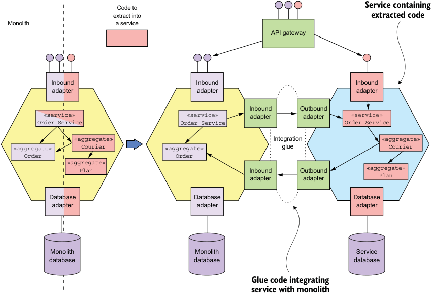


**----- Start of picture text -----**<br>
Code to Service containing<br>extract into extracted code<br>Monolith a service<br>API gateway<br>Inbound Inbound Inbound<br>adapter adapter adapter<br>Inbound Outbound<br>«service» «service» adapter adapter «service»<br>Order Service Order Service Order Service<br>«aggregate» Integration «aggregate»<br>«aggregate» Courier «aggregate» glue Courier<br>Order Order<br>«aggregate»<br>Plan Inbound Outbound «aggregate»<br>adapter adapter Plan<br>Database Database Database<br>adapter adapter adapter<br>Monolith Monolith Service<br>database database database<br>Glue code integrating<br>service with monolith<br>**----- End of picture text -----**<br>


Figure 13.4 Break apart the monolith by extracting services. You identify a slice of functionality, which consists of business logic and adapters, to extract into a service. You move that code into the service. The newly extracted service and the monolith collaborate via the APIs provided by the integration glue. services to extract. It’s important to focus on refactoring those parts of the application that provide a lot of value. Before extracting a service, ask yourself what the benefit is of doing that. 

For example, it’s worthwhile to extract a service that implements functionality that’s critical to the business and constantly evolving. It’s not valuable to invest effort in extracting services when there’s not much benefit from doing so. Later in this section I describe some strategies for determining what to extract and when. But first, let’s look in more detail at some of the challenges you’ll face when extracting a service and how to address them. 

You’ll encounter a couple of challenges when extracting a service: 

- Splitting the domain model 

- Refactoring the database 

Let’s look at each one, starting with splitting the domain model. 


_**Strategies for refactoring a monolith to microservices**_ 


# SPLITTING THE DOMAIN MODEL 

In order to extract a service, you need to extract its domain model out of the monolith’s domain model. You’ll need to perform major surgery to split the domain models. One challenge you’ll encounter is eliminating object references that would otherwise span service boundaries. It’s possible that classes that remain in the monolith will reference classes that have been moved to the service or vice versa. For example, imagine that, as figure 13.5 shows, you extract Order Service, and as a result its Order class references the monolith’s Restaurant class. Because a service instance is typically a process, it doesn’t make sense to have object references that cross service boundaries. Somehow you need to eliminate these types of object reference. 


**----- Start of picture text -----**<br>
Extracted service<br>**----- End of picture text -----**<br>


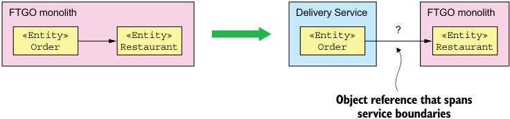


**----- Start of picture text -----**<br>
FTGO monolith Delivery Service FTGO monolith<br>?<br>«Entity» «Entity» «Entity» «Entity»<br>Order Restaurant Order Restaurant<br>Object reference that spans<br>service boundaries<br>**----- End of picture text -----**<br>


Figure 13.5 The **Order** domain class has a reference to a **Restaurant** class. If we extract **Order** into a separate service, we need to do something about its reference to **Restaurant** , because object references between processes don’t make sense. 

One good way to solve this problem is to think in terms of DDD aggregates, described in chapter 5. _Aggregates_ reference each other using primary keys rather than object references. You would, therefore, think of the Order and Restaurant classes as aggregates and, as figure 13.6 shows, replace the reference to Restaurant in the Order class with a restaurantId field that stores the primary key value. 


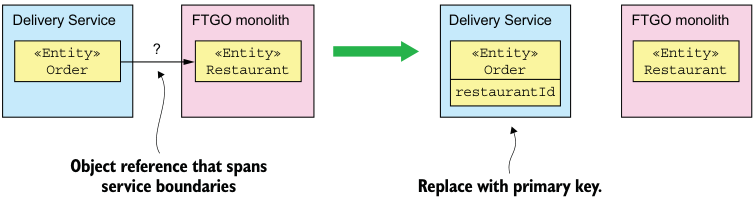


**----- Start of picture text -----**<br>
Delivery Service FTGO monolith Delivery Service FTGO monolith<br>«Entity» ? «Entity» «Entity» «Entity»<br>Order Restaurant Order Restaurant<br>restaurantId<br>Object reference that spans<br>service boundaries Replace with primary key.<br>**----- End of picture text -----**<br>


Figure 13.6 The **Order** class’s reference to **Restaurant** is replaced with the **Restaurant** 's primary key in order to eliminate an object that would span process boundaries. 


One issue with replacing object references with primary keys is that although this is a minor change to the class, it can potentially have a large impact on the clients of the class, which expect an object reference. Later in this section, I describe how to reduce the scope of the change by replicating data between the service and monolith. Delivery Service, for example, could define a Restaurant class that’s a replica of the monolith’s Restaurant class. 

Extracting a service is often much more involved than moving entire classes into a service. An even greater challenge with splitting a domain model is extracting functionality that’s embedded in a class that has other responsibilities. This problem often occurs in god classes, described in chapter 2, that have an excessive number of responsibilities. For example, the Order class is one of the god classes in the FTGO application. It implements multiple business capabilities, including order management, delivery management, and so on. Later in section 13.5, I discuss how extracting the delivery management into a service involves extracting a Delivery class from the Order class. The Delivery entity implements the delivery management functionality that was previously bundled with other functionality in the Order class. 

# REFACTORING THE DATABASE 

Splitting a domain model involves more than just changing code. Many classes in a domain model are persistent. Their fields are mapped to a database schema. Consequently, when you extract a service from the monolith, you’re also moving data. You need to move tables from the monolith’s database to the service’s database. 

Also, when you split an entity you need to split the corresponding database table and move the new table to the service. For example, when extracting delivery management into a service, you split the Order entity and extract a Delivery entity. At the database level, you split the ORDERS table and define a new DELIVERY table. You then move the DELIVERY table to the service. 

The book _Refactoring Databases_ by Scott W. Ambler and Pramod J. Sadalage (AddisonWesley, 2011) describes a set of refactorings for a database schema. For example, it describes the _Split Table_ refactoring, which splits a table into two or more tables. Many of the technique in that book are useful when extracting services from the monolith. One such technique is the idea of replicating data in order to allow you to incrementally update clients of the database to use the new schema. We can adapt that idea to reduce the scope of the changes you must make to the monolith when extracting a service. 

# REPLICATE DATA TO AVOID WIDESPREAD CHANGES 

As mentioned, extracting a service requires you to change to the monolith’s domain model. For example, you replace object references with primary keys and split classes. These types of changes can ripple through the code base and require you to make widespread changes to the monolith. For example, if you split the Order entity and extract a Delivery entity, you’ll have to change every place in the code that references the fields that have been moved. Making these kinds of changes can be extremely time consuming and can become a huge barrier to breaking up the monolith. 


_**Strategies for refactoring a monolith to microservices**_ 


A great way to delay and possibly avoid making these kinds of expensive changes is to use an approach that’s similar to the one described in _Refactoring Databases_ . A major obstacle to refactoring a database is changing all the clients of that database to use the new schema. The solution proposed in the book is to preserve the original schema for a transition period and use triggers to synchronize the original and new schemas. You then migrate clients from the old schema to the new schema over time. 

We can use a similar approach when extracting services from the monolith. For example, when extracting the Delivery entity, we leave the Order entity mostly unchanged for a transition period. As figure 13.7 shows, we make the delivery-related fields read-only and keep them up-to-date by replicating data from Delivery Service back to the monolith. As a result, we only need to find the places in the monolith’s code that update those fields and change them to invoke the new Delivery Service. 

Preserving the structure of the Order entity by replicating data from Delivery Service significantly reduces the amount of work we need to do immediately. Over time, we can migrate code that uses the delivery-related Order entity fields or ORDERS table columns to Delivery Service. What’s more, it’s possible that we never need to 


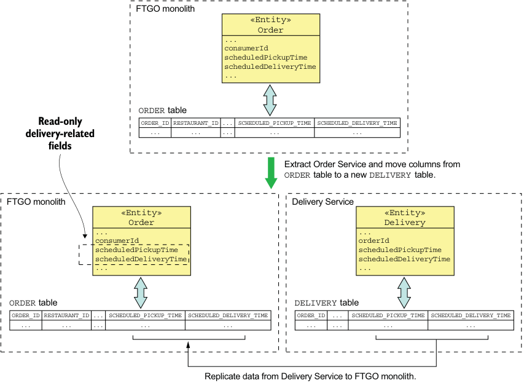


**----- Start of picture text -----**<br>
FTGO monolith<br>«Entity»<br>Order<br>...<br>consumerId<br>scheduledPickupTime<br>scheduledDeliveryTime<br>...<br>ORDER table<br>Read-only ORDER_ID RESTAURANT_ID ... SCHEDULED_PICKUP_TIME SCHEDULED_DELIVERY_TIME<br>... ... ... ... ...<br>delivery-related<br>fields<br>Extract Order Service and move columns from<br>ORDER table to a new DELIVERY table.<br>FTGO monolith Delivery Service<br>«Entity» «Entity»<br>Order Delivery<br>... ...<br>consumerId orderId<br>scheduledPickupTime scheduledPickupTime<br>scheduledDeliveryTime scheduledDeliveryTime<br>... ...<br>ORDER table DELIVERY table<br>ORDER_ID RESTAURANT_ID ... SCHEDULED_PICKUP_TIME SCHEDULED_DELIVERY_TIME ORDER_ID ... SCHEDULED_PICKUP_TIME SCHEDULED_DELIVERY_TIME<br>... ... ... ... ... ... ... ... ...<br>Replicate data from Delivery Service to FTGO monolith.<br>**----- End of picture text -----**<br>


Figure 13.7 Minimize the scope of the changes to the FTGO monolith by replicating delivery-related data from the newly extracted **Delivery Service** back to the monolith’s database. 


make that change in the monolith. If that code is subsequently extracted into a service, then the service can access Delivery Service. 

# WHAT SERVICES TO EXTRACT AND WHEN 

As I mentioned, breaking apart the monolith is time consuming. It diverts effort away from implementing features. As a result, you must carefully decide the sequence in which you extract services. You need to focus on extracting services that give the largest benefit. What’s more, you want to continually demonstrate to the business that there’s value in migrating to a microservice architecture. 

On any journey, it’s essential to know where you’re going. A good way to start the migration to microservices is with a time-boxed architecture definition effort. You should spend a short amount of time, such as a couple of weeks, brainstorming your ideal architecture and defining a set of services. This gives you a destination to aim for. It’s important, though, to remember that this architecture isn’t set in stone. As you break apart the monolith and gain experience, you should revise the architecture to take into account what you’ve learned. 

Once you’ve determined the approximate destination, the next step is to start breaking apart the monolith. There are a couple of different strategies you can use to determine the sequence in which you extract services. 

One strategy is to effectively freeze development of the monolith and extract services on demand. Instead of implementing features or fixing bugs in the monolith, you extract the necessary service or service(s) and change those. One benefit of this approach is that it forces you to break up the monolith. One drawback is that the extraction of services is driven by short-term requirements rather than long-term needs. For instance, it requires you to extract services even if you’re making a small change to a relatively stable part of the system. As a result, you risk doing a lot of work for minimal benefit. 

An alternative strategy is a more planned approach, where you rank the modules of an application by the benefit you anticipate getting from extracting them. There are a few reasons why extracting a service is beneficial: 

- _Accelerates development_ —If your application’s roadmap suggests that a particular part of your application will undergo a lot of development over the next year, then converting it to a service accelerates development. 

- _Solves a performance, scaling, or reliability problem_ —If a particular part of your application has a performance or scalability problem or is unreliable, then it’s valuable to convert it to a service. 

- _Enables the extraction of some other services_ —Sometimes extracting one service simplifies the extraction of another service, due to dependencies between modules. 

You can use these criteria to add refactoring tasks to your application’s backlog, ranked by expected benefit. The benefit of this approach is that it’s more strategic and much more closely aligned with the needs of the business. During sprint planning, you decide whether it’s more valuable to implement features or extract services. 


_**Designing how the service and the monolith collaborate**_ 


# _13.3 Designing how the service and the monolith collaborate_ 

A service is rarely standalone. It usually needs to collaborate with the monolith. Sometimes a service needs to access data owned by the monolith or invoke its operations. For example, Delayed Delivery Service, described in detail in section 13.4.1, requires access to the monolith’s orders and customer contact info. The monolith might also need to access data owned by the service or invoke its operations. For example, later in section 13.5, when discussing how to extract delivery management into a service, I describe how the monolith needs to invoke Delivery Service. 

One important concern is maintaining data consistency between the service and monolith. In particular, when you extract a service from the monolith, you invariably split what were originally ACID transactions. You must be careful to ensure that data consistency is still maintained. As described later in this section, sometimes you use sagas to maintain data consistency. 

The interaction between a service and the monolith is, as described earlier, facilitated by integration glue code. Figure 13.8 shows the structure of the integration glue. It consists of adapters in the service and monolith that communicate using some kind of IPC mechanism. Depending on the requirements, the service and monolith might interact over REST or they might use messaging. They might even communicate using multiple IPC mechanisms. 


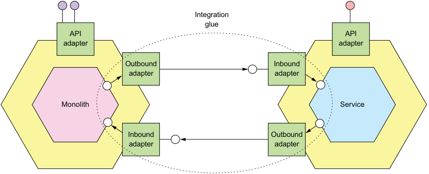


**----- Start of picture text -----**<br>
Integration<br>glue<br>API API<br>adapter adapter<br>Outbound Inbound<br>adapter adapter<br>Monolith Service<br>Inbound Outbound<br>adapter adapter<br>**----- End of picture text -----**<br>


Figure 13.8 When migrating a monolith to microservices, the services and monolith often need to access each other’s data. This interaction is facilitated by the integration glue, which consists of adapters that implement APIs. Some APIs are messaging based. Other APIs are RPI based. 

For example, Delayed Delivery Service uses both REST and domain events. It retrieves customer contact info from the monolith using REST. It tracks the state of Orders by subscribing to domain events published by the monolith. 


In this section, I first describe the design of the integration glue. I talk about the problems it solves and the different implementation options. After that I describe transaction management strategies, including the use of sagas. I discuss how sometimes the requirement to maintain data consistency changes the order in which you extract services. Let’s first look at the design of the integration glue. 

# _13.3.1 Designing the integration glue_ 

When implementing a feature as a service or extracting a service from the monolith, you must develop the integration glue that enables a service to collaborate with the monolith. It consists of code in both the service and monolith that uses some kind of IPC mechanism. The structure of the integration glue depends on the type of IPC mechanism that is used. If, for example, the service invokes the monolith using REST, then the integration glue consists of a REST client in the service and web controllers in the monolith. Alternatively, if the monolith subscribes to domain events published by the service, then the integration glue consists of an event-publishing adapter in the service and event handlers in the monolith. 

# DESIGNING THE INTEGRATION GLUE API 

The first step in designing the integration glue is to decide what APIs it provides to the domain logic. There are a couple of different styles of interface to choose from, depending on whether you’re querying data or updating data. Let’s say you’re working on Delayed Delivery Service, which needs to retrieve customer contact info from the monolith. The service’s business logic doesn’t need to know the IPC mechanism that the integration glue uses to retrieve the information. Therefore, that mechanism should be encapsulated by an interface. Because Delayed Delivery Service is querying data, it makes sense to define a CustomerContactInfoRepository: 

```java
interface CustomerContactInfoRepository { 
  CustomerContactInfo findCustomerContactInfo(long customerId); 
} 
```

The service’s business logic can invoke this API without knowing how the integration glue retrieves the data. 

Let’s consider a different service. Imagine that you’re extracting delivery management from the FTGO monolith. The monolith needs to invoke Delivery Service to schedule, reschedule, and cancel deliveries. Once again, the details of the underlying IPC mechanism aren’t important to the business logic and should be encapsulated by an interface. In this scenario, the monolith must invoke a service operation, so using a repository doesn’t make sense. A better approach is to define a service interface, such as the following: 

```java
interface DeliveryService { 
  void scheduleDelivery(...); 
  void rescheduleDelivery(...); 
  void cancelDelivery(...); 
} 
```


_**Designing how the service and the monolith collaborate**_ 


The monolith’s business logic invokes this API without knowing how it’s implemented by the integration glue. 

Now that we’ve seen interface design, let’s look at interaction styles and IPC mechanisms. 

# PICKING AN INTERACTION STYLE AND IPC MECHANISM 

An important design decision you must make when designing the integration glue is selecting the interaction styles and IPC mechanisms that enable the service and the monolith to collaborate. As described in chapter 3, there are several interaction styles and IPC mechanisms to choose from. Which one you should use depends on what one _party_ —the service or monolith—needs in order to query or update the other party. 

If one party needs to query data owned by the other party, there are several options. One option is, as figure 13.9 shows, for the adapter that implements the repository interface to invoke an API of the data provider. This API will typically use a request/response interaction style, such as REST or gRPC. For example, Delayed Delivery Service might retrieve the customer contact info by invoking a REST API implemented by the FTGO monolith. 


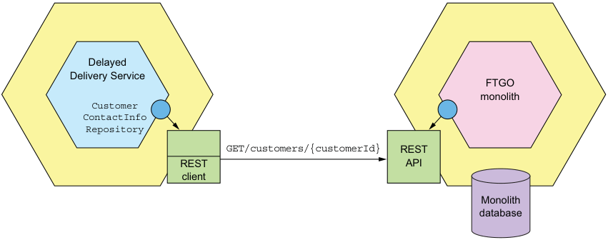


**----- Start of picture text -----**<br>
Delayed<br>Delivery Service<br>FTGO<br>monolith<br>Customer<br>ContactInfo<br>Repository<br>GET/customers/{customerId} REST<br>REST API<br>client<br>Monolith<br>database<br>**----- End of picture text -----**<br>


Figure 13.9 The adapter that implements the **CustomerContactInfoRepository** interface invokes the monolith’s REST API to retrieve the customer information. 

In this example, the Delayed Delivery Service’s domain logic retrieves the customer contact info by invoking the CustomerContactInfoRepository interface. The implementation of this interface invokes the monolith’s REST API. 

An important benefit of querying data by invoking a query API is its simplicity. The main drawback is that it’s potentially inefficient. A consumer might need to make a large number of requests. A provider might return a large amount of data. Another drawback is that it reduces availability because it’s synchronous IPC. As a result, it might not be practical to use a query API. 


An alternative approach is for the data consumer to maintain a replica of the data, as shown in figure 13.10. The replica is essentially a CQRS view. The data consumer keeps the replica up-to-date by subscribing to domain events published by the data provider. 


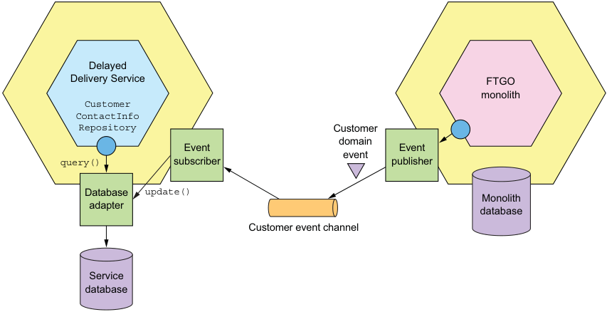


**----- Start of picture text -----**<br>
Delayed<br>Delivery Service FTGO<br>monolith<br>Customer<br>ContactInfo<br>Repository Customer<br>domain<br>Event Event<br>event<br>query() subscriber publisher<br>Database update()<br>Monolith<br>adapter database<br>Customer event channel<br>Service<br>database<br>**----- End of picture text -----**<br>


Figure 13.10 The integration glue replicates data from the monolith to the service. The monolith publishes domain events, and an event handler implemented by the service updates the service’s database. 

Using a replica has several benefits. It avoids the overhead of repeatedly querying the data provider. Instead, as discussed when describing CQRS in chapter 7, you can design the replica to support efficient queries. One drawback of using a replica, though, is the complexity of maintaining it. A potential challenge, as described later in this section, is the need to modify the monolith to publish domain events. 

Now that we’ve discussed how to do queries, let’s consider how to do updates. One challenge with performing updates is the need to maintain data consistency across the service and monolith. The party making the update request (the requestor) has updated or needs to update its database. So it’s essential that both updates happen. The solution is for the service and monolith to communicate using transactional messaging implemented by a framework, such as Eventuate Tram. In simple scenarios, the requestor can send a notification message or publish an event to trigger an update. In more complex scenarios, the requestor must use a saga to maintain data consistency. Section 13.3.2 discusses the implications of using sagas. 

# IMPLEMENTING AN ANTI-CORRUPTION LAYER 

Imagine you’re implementing a new feature as a brand new service. You’re not constrained by the monolith’s code base, so you can use modern development techniques 


_**Designing how the service and the monolith collaborate**_
such as DDD and develop a pristine new domain model. Also, because the FTGO monolith’s domain is poorly defined and somewhat out-of-date, you’ll probably model concepts differently. As a result, your service’s domain model will have different class names, field names, and field values. For example, Delayed Delivery Service has a Delivery entity with narrowly focused responsibilities, whereas the FTGO monolith has an Order entity with an excessive number of responsibilities. Because the two domain models are different, you must implement what DDD calls an _anti-corruption layer_ (ACL) in order for the service to communicate with the monolith. 

# Pattern: Anti-corruption layer 

A software layer that translates between two different domain models in order to prevent concepts from one model polluting another. See https://microservices.io/ patterns/refactoring/anti-corruption-layer.html. 

The goal of an ACL is to prevent a legacy monolith’s domain model from polluting a service’s domain model. It’s a layer of code that translates between the different domain models. For example, as figure 13.11 shows, Delayed Delivery Service has a CustomerContactInfoRepository interface, which defines a findCustomerContactInfo() method that returns CustomerContactInfo. The class that implements the CustomerContactInfoRepository interface must translate between the ubiquitous language of Delayed Delivery Service and that of the FTGO monolith. 


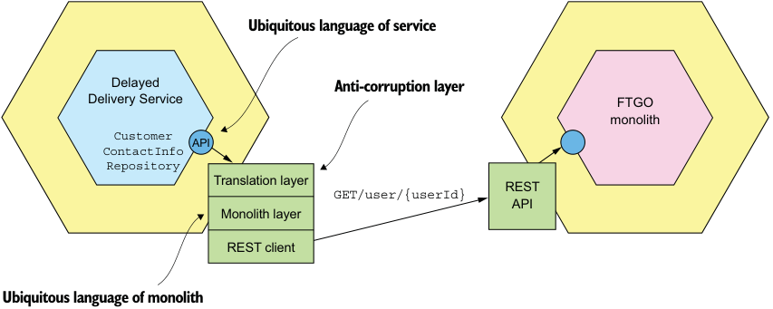


**----- Start of picture text -----**<br>
Ubiquitous language of service<br>Delayed Anti-corruption layer<br>Delivery Service FTGO<br>monolith<br>Customer<br>API<br>ContactInfo<br>Repository<br>Translation layer REST<br>GET/user/{userId}<br>API<br>Monolith layer<br>REST client<br>Ubiquitous language of monolith<br>**----- End of picture text -----**<br>


Figure 13.11 A service adapter that invokes the monolith must translate between the service’s domain model and the monolith’s domain model. 

The implementation of findCustomerContactInfo() invokes the FTGO monolith to retrieve the customer information and translates the response to CustomerContactInfo. In this example, the translation is quite simple, but in other scenarios it could be quite complex and involve, for example, mapping values such as status codes. 


An event subscriber, which consumes domain events, also has an ACL. Domain events are part of the publisher’s domain model. An event handler must translate domain events to the subscriber’s domain model. For example, as figure 13.12 shows, the FTGO monolith publishes Order domain events. Delivery Service has an event handler that subscribes to those events. 


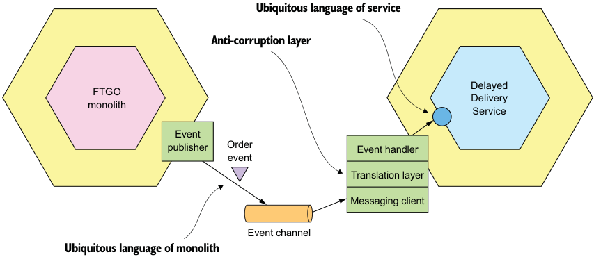


**----- Start of picture text -----**<br>
Ubiquitous language of service<br>Anti-corruption layer<br>Delayed<br>FTGO<br>Delivery<br>monolith<br>Service<br>Event<br>Order<br>publisher Event handler<br>event<br>Translation layer<br>Messaging client<br>Event channel<br>Ubiquitous language of monolith<br>**----- End of picture text -----**<br>


Figure 13.12 An event handler must translate from the event publisher’s domain model to the subscriber’s domain model. 

The event handler must translate domain events from the monolith’s domain language to that of Delivery Service. It might need to map class and attribute names and potentially attribute values. 

It’s not just services that use an anti-corruption layer. A monolith also uses an ACL when invoking the service and when subscribing to domain events published by a service. For example, the FTGO monolith schedules a delivery by sending a notification message to Delivery Service. It sends the notification by invoking a method on the DeliveryService interface. The implementation class translates its parameters into a message that Delivery Service understands. 

# HOW THE MONOLITH PUBLISHES AND SUBSCRIBES TO DOMAIN EVENTS 

Domain events are an important collaboration mechanism. It’s straightforward for a newly developed service to publish and consume events. It can use one of the mechanisms described in chapter 3, such as the Eventuate Tram framework. A service might even publish events using event sourcing, described in chapter 6. It’s potentially challenging, though, to change the monolith to publish and consume events. Let’s look at why. 

There are a couple of different ways that a monolith can publish domain events. One approach is to use the same domain event publishing mechanism used by the 


_**Designing how the service and the monolith collaborate**_ 


services. You find all the places in the code that change a particular entity and insert a call to an event publishing API. The problem with this approach is that changing a monolith isn’t always easy. It might be time consuming and error prone to locate all the places and insert calls to publish events. To make matters worse, some of the monolith’s business logic might consist of stored procedures that can’t easily publish domain events. 

Another approach is to publish domain events at the database level. You can, for example, use either transaction logic tailing or polling, described in chapter 3. A key benefit of using transaction tailing is that you don’t have to change the monolith. The main drawback of publishing events at the database level is that it’s often difficult to identify the reason for the update and publish the appropriate high-level business event. As a result, the service will typically publish events representing changes to tables rather than business entities. 

Fortunately, it’s usually easier for the monolith to subscribe to domain events published as services. Quite often, you can write event handlers using a framework, such as Eventuate Tram. But sometimes it’s even challenging for the monolith to subscribe to events. For example, the monolith might be written in a language that doesn’t have a message broker client. In that situation, you need to write a small “helper” application that subscribes to events and updates the monolith’s database directly. 

Now that we’ve looked at how to design the integration glue that enables a service and the monolith to collaborate, let’s look at another challenge you might face when migrating to microservices: maintaining data consistency across a service and a monolith. 

# _13.3.2 Maintaining data consistency across a service and a monolith_ 

When you develop a service, you might find it challenging to maintain data consistency across the service and the monolith. A service operation might need to update data in the monolith, or a monolith operation might need to update data in the service. For example, imagine you extracted Kitchen Service from the monolith. You would need to change the monolith’s order-management operations, such as createOrder() and cancelOrder(), to use sagas in order to keep the Ticket consistent with the Order. 

The problem with using sagas, however, is that the monolith might not be a willing participant. As described in chapter 4, sagas must use compensating transactions to undo changes. Create Order Saga, for example, includes a compensating transaction that marks an Order as rejected if it’s rejected by Kitchen Service. The problem with compensating transactions in the monolith is that you might need to make numerous and time-consuming changes to the monolith in order to support them. The monolith might also need to implement countermeasures to handle the lack of isolation between sagas. The cost of these code changes can be a huge obstacle to extracting a service. 


# Key saga terminology 

I cover sagas in chapter 4. Here are some key terms: 

- _Saga_ —A sequence of local transactions coordinated through asynchronous messaging. 

- _Compensating transaction_ —A transaction that undoes the updates made by a local transaction. 

- _Countermeasure_ —A design technique used to handle the lack of isolation between sagas. 

- _Semantic lock_ —A countermeasure that sets a flag in a record that is being updated by a saga. 

- _Compensatable transaction_ —A transaction that needs a compensating transaction because one of the transactions that follows it in the saga can fail. 

- _Pivot transaction_ —A transaction that is the saga’s go/no-go point. If it succeeds, then the saga will run to completion. 

- _Retriable transaction_ —A transaction that follows the pivot transaction and is guaranteed to succeed. 

Fortunately, many sagas are straightforward to implement. As covered in chapter 4, if the monolith’s transactions are either _pivot transactions_ or _retriable transactions_ , then implementing sagas should be straightforward. You may even be able to simplify implementation by carefully ordering the sequence of service extractions so that the monolith’s transactions never need to be compensatable. Or it may be relatively difficult to change the monolith to support compensating transactions. To understand why implementing compensating transactions in the monolith is sometimes challenging, let’s look at some examples, beginning with a particularly troublesome one. 

THE CHALLENGE OF CHANGING THE MONOLITH TO SUPPORT COMPENSATABLE TRANSACTIONS 

Let’s dig into the problem of compensating transactions that you’ll need to solve when extracting Kitchen Service from the monolith. This refactoring involves splitting the Order entity and creating a Ticket entity in Kitchen Service. It impacts numerous commands implemented by the monolith, including createOrder(). 

The monolith implements the createOrder() command as a single ACID transaction consisting of the following steps: 

- 1 Validate order details. 

- 2 Verify that the consumer can place an order. 

- 3 Authorize consumer’s credit card. 

- 4 Create an Order. 

You need to replace this ACID transaction with a saga consisting of the following steps: 

- 1 In the monolith 

   - Create an Order in an APPROVAL_PENDING state. 

   - Verify that the consumer can place an order. 


_**Designing how the service and the monolith collaborate**_ 


- 2 In the Kitchen Service 

   - Validate order details. 

   - Create a Ticket in the CREATE_PENDING state. 

- 3 In the monolith 

   - Authorize consumer’s credit card. 

   - Change state of Order to APPROVED. 

- 4 In Kitchen Service 

   - Change the state of the Ticket to AWAITING_ACCEPTANCE. 

This saga is similar to CreateOrderSaga described in chapter 4. It consists of four local transactions, two in the monolith and two in Kitchen Service. The first transaction creates an Order in the APPROVAL_PENDING state. The second transaction creates a Ticket in the CREATE_PENDING state. The third transaction authorizes the Consumer credit card and changes the state of the order to APPROVED. The fourth and final transaction changes the state of the Ticket to AWAITING_ACCEPTANCE. 

The challenge with implementing this saga is that the first step, which creates the Order, must be compensatable. That’s because the second local transaction, which occurs in Kitchen Service, might fail and require the monolith to undo the updates performed by the first local transaction. As a result, the Order entity needs to have an APPROVAL_PENDING, a semantic lock countermeasure, described in chapter 4, that indicates an Order is in the process of being created. 

The problem with introducing a new Order entity state is that it potentially requires widespread changes to the monolith. You might need to change every place in the code that touches an Order entity. Making these kinds of widespread changes to the monolith is time consuming and not the best investment of development resources. It’s also potentially risky, because the monolith is often difficult to test. 

SAGAS DON’T ALWAYS REQUIRE THE MONOLITH TO SUPPORT COMPENSATABLE TRANSACTIONS Sagas are highly domain-specific. Some, such as the one we just looked at, require the monolith to support compensating transactions. But it’s quite possible that when you extract a service, you may be able to design sagas that don’t require the monolith to implement compensating transactions. That’s because a monolith only needs to support compensating transactions if the transactions that follow the monolith’s transaction can fail. If each of the monolith’s transactions is either a pivot transaction or a retriable transaction, then the monolith never needs to execute a compensating transaction. As a result, you only need to make minimal changes to the monolith to support sagas. 

For example, imagine that instead of extracting Kitchen Service, you extract Order Service. This refactoring involves splitting the Order entity and creating a slimmeddown Order entity in Order Service. It also impacts numerous commands, including createOrder(), which is moved from the monolith to Order Service. In order to extract Order Service, you need to change the createOrder() command to use a saga, using the following steps: 


- 1 Order Service 

   - Create an Order in an APPROVAL_PENDING state. 

- 2 Monolith 

   - Verify that the consumer can place an order. 

   - Validate order details and create a Ticket. 

   - Authorize consumer’s credit card. 

- 3 Order Service 

   - Change state of Order to APPROVED. 

This saga consists of three local transactions, one in the monolith and two in Order Service. The first transaction, which is in Order Service, creates an Order in the APPROVAL_PENDING state. The second transaction, which is in the monolith, verifies that the consumer can place orders, authorizes their credit card, and creates a Ticket. The third transaction, which is in Order Service, changes the state of the Order to APPROVED. 

The monolith’s transaction is the saga’s pivot transaction—the point of no return for the saga. If the monolith’s transaction completes, then the saga will run until completion. Only the first and second steps of this saga can fail. The third transaction can’t fail, so the second transaction in the monolith never needs to be rolled back. As a result, all the complexity of supporting compensatable transactions is in Order Service, which is much more testable than the monolith. 

If all the sagas that you need to write when extracting a service have this structure, you’ll need to make far fewer changes to the monolith. What’s more, it’s possible to carefully sequence the extraction of services to ensure that the monolith’s transactions are either pivot transactions or retriable transactions. Let’s look at how to do that. 

# SEQUENCING THE EXTRACTION OF SERVICES TO AVOID IMPLEMENTING COMPENSATING TRANSACTIONS IN THE MONOLITH 

As we just saw, extracting Kitchen Service requires the monolith to implement compensating transactions, whereas extracting Order Service doesn’t. This suggests that the order in which you extract services matters. By carefully ordering the extraction of services, you can potentially avoid having to make widespread modifications to the monolith to support compensatable transactions. We can ensure that the monolith’s transactions are either pivot transactions or retriable transactions. For example, if we first extract Order Service from the FTGO monolith and then extract Consumer Service, extracting Kitchen Service will be straightforward. Let’s take a closer look at how to do that. 

Once we have extracted Consumer Service, the createOrder() command uses the following saga: 

- 1 Order Service: create an Order in an APPROVAL_PENDING state. 

- 2 Consumer Service: verify that the consumer can place an order. 


_**Designing how the service and the monolith collaborate**_ 


- 3 Monolith 

   - Validate order details and create a Ticket. 

   - Authorize consumer’s credit card. 

- 4 Order Service: change state of Order to APPROVED. 

In this saga, the monolith’s transaction is the pivot transaction. Order Service implements the compensatable transaction. 

Now that we’ve extracted Consumer Service, we can extract Kitchen Service. If we extract this service, the createOrder() command uses the following saga: 

- 1 Order Service: create an Order in an APPROVAL_PENDING state. 

- 2 Consumer Service: verify that the consumer can place an order. 

- 3 Kitchen Service: validate order details and create a PENDING Ticket. 

- 4 Monolith: authorize consumer’s credit card. 

- 5 Kitchen Service: change state of Ticket to APPROVED. 

- 6 Order Service: change state of Order to APPROVED. 

In this saga, the monolith’s transaction is still the pivot transaction. Order Service and Kitchen Service implement the compensatable transactions. 

We can even continue to refactor the monolith by extracting Accounting Service. If we extract this service, the createOrder() command uses the following saga: 

- 1 Order Service: create an Order in an APPROVAL_PENDING state. 

- 2 Consumer Service: verify that the consumer can place an order. 

- 3 Kitchen Service: validate order details and create a PENDING Ticket. 

- 4 Accounting Service: authorize consumer’s credit card. 

- 5 Kitchen Service: change state of Ticket to APPROVED. 

- 6 Order Service: change state of Order to APPROVED. 

As you can see, by carefully sequencing the extractions, you can avoid using sagas that require making complex changes to the monolith. Let’s now look at how to handle security when migrating to a microservice architecture. 

# _13.3.3 Handling authentication and authorization_ 

Another design issue you need to tackle when refactoring a monolithic application to a microservice architecture is adapting the monolith’s security mechanism to support the services. Chapter 11 describes how to handle security in a microservice architecture. A microservices-based application uses tokens, such as JSON Web tokens (JWT), to pass around user identity. That’s quite different than a typical traditional, monolithic application that uses in-memory session state and passes around the user identity using a thread local. The challenge when transforming a monolithic application to a microservice architecture is that you need to support both the monolithic and JWT-based security mechanisms simultaneously. 

Fortunately, there’s a straightforward way to solve this problem that only requires you to make one small change to the monolith’s login request handler. Figure 13.13 


shows how this works. The login handler returns an additional cookie, which in this example I call USERINFO, that contains user information, such as the user ID and roles. The browser includes that cookie in every request. The API gateway extracts the information from the cookie and includes it in the HTTP requests that it makes to a service. As a result, each service has access to the needed user information. 


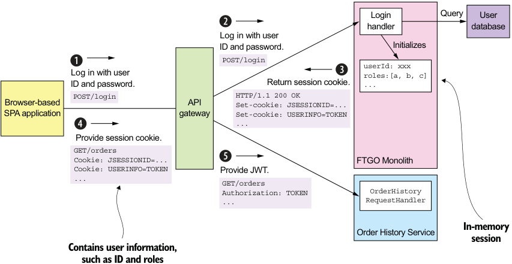


**----- Start of picture text -----**<br>
Login Query User<br>handler database<br>Log in with user<br>ID and password. Initializes<br>POST/login<br>userId: xxx<br>Log in with user roles:[a, b, c]<br>ID and password. Return session cookie. ...<br>POST/login HTTP/1.1 200 OK<br>Browser-based API Set-cookie: JSESSIONID=...<br>SPA application gateway Set-cookie: USERINFO=TOKEN<br>...<br>Provide session cookie.<br>GET/orders<br>Cookie: JSESSIONID=... FTGO Monolith<br>Cookie: USERINFO=TOKEN Provide JWT.<br>... GET/orders<br>Authorization: TOKEN OrderHistory<br>... RequestHandler<br>In-memory<br>Order History Service<br>session<br>Contains user information,<br>such as ID and roles<br>**----- End of picture text -----**<br>


Figure 13.13 The login handler is enhanced to set a **USERINFO** cookie, which is a JWT containing user information. **API Gateway** transfers the **USERINFO** cookie to an authorization header when it invokes a service. 

The sequence of events is as follows: 

- 1 The client makes a login request containing the user’s credentials. 

- 2 API Gateway routes the login request to the FTGO monolith. 

- 3 The monolith returns a response containing the JSESSIONID session cookie and the USERINFO cookie, which contains the user information, such as ID and roles. 

- 4 The client makes a request, which includes the USERINFO cookie, in order to invoke an operation. 

- 5 API Gateway validates the USERINFO cookie and includes it in the Authorization header of the request that it makes to the service. The service validates the USERINFO token and extracts the user information. 

Let’s look at LoginHandler and API Gateway in more detail. 

# THE MONOLITH’S LOGINHANDLER SETS THE USERINFO COOKIE 

LoginHandler processes the POST of the user’s credentials. It authenticates the user and stores information about the user in the session. It’s often implemented by a 


_**Implementing a new feature as a service: handling misdelivered orders**_ 


security framework, such as Spring Security or Passport for NodeJS. If the application is configured to use the default in-memory session, the HTTP response sets a session cookie, such as JSESSIONID. In order to support the migration to microservices, LoginHandler must also set the USERINFO cookie containing the JWT that describes the user. 

# THE API GATEWAY MAPS THE USERINFO COOKIE TO THE AUTHORIZATION HEADER 

The API gateway, as described in chapter 8, is responsible for request routing and API composition. It handles each request by making one or more requests to the monolith and the services. When the API gateway invokes a service, it validates the USERINFO cookie and passes it to the service in the HTTP request’s Authorization header. By mapping the cookie to the Authorization header, the API gateway ensures that it passes the user identity to the service in a standard way that’s independent of the type of client. 

Eventually, we’ll most likely extract login and user management into services. But as you can see, by only making one small change to the monolith’s login handler, it’s now possible for services to access user information. This enables you focus on developing services that provide the greatest value to the business and delay extracting less valuable services, such as user management. 

Now that we’ve looked at how to handle security when refactoring to microservices, let’s see an example of implementing a new feature as a service. 

# _13.4 Implementing a new feature as a service: handling misdelivered orders_ 

Let’s say you’ve been tasked with improving how FTGO handles misdelivered orders. A growing number of customers have been complaining about how customer service handles orders not being delivered. The majority of orders are delivered on time, but from time to time orders are either delivered late or not at all. For example, the courier gets delayed by unexpectedly bad traffic, so the order is picked up and delivered late. Or perhaps by the time the courier arrives at the restaurant, it’s closed, and the delivery can’t be made. To make matters worse, the first time customer service hears about the misdelivery is when they receive an angry email from an unhappy customer. 

# A true story: My missing ice cream 

One Saturday night I was feeling lazy and placed an order using a well-known food delivery app to have ice cream delivered from Smitten. It never showed up. The only communication from the company was an email the next morning saying my order had been canceled. I also got a voicemail from a very confused customer service agent who clearly didn’t know what she was calling about. Perhaps the call was prompted by one of my tweets describing what happened. Clearly, the delivery company had not established any mechanisms for properly handling inevitable mistakes. 


_**Refactoring to microservices**_ 


The root cause for many of these delivery problems is the primitive delivery scheduling algorithm used by the FTGO application. A more sophisticated scheduler is under development but won’t be finished for a few months. The interim solution is for FTGO to proactively handle delayed or canceled orders by apologizing to the customer, and in some cases offering compensation before the customer complains. 

Your job is to implement a new feature that will do the following: 

- 1 Notify the customer when their order won’t be delivered on time. 

- 2 Notify the customer when their order can’t be delivered because it can’t be picked up before the restaurant closes. 

- 3 Notify customer service when an order can’t be delivered on time so that they can proactively rectify the situation by compensating the customer. 

- 4 Track delivery statistics. 

This new feature is fairly simple. The new code must track the state of each Order, and if an Order can’t be delivered as promised, the code must notify the customer and customer support, by, for example, sending an email. 

But how—or perhaps more precisely, _where_ —should you implement this new feature? One approach is to implement a new module in the monolith. The problem there is that developing and testing this code will be difficult. What’s more, this approach increases the size of the monolith and thereby makes monolith hell even worse. Remember the Law of Holes from earlier: when you’re in a hole, it’s best to stop digging. Rather than make the monolith larger, a much better approach is to implement these new features as a service. 

# _13.4.1 The design of Delayed Delivery Service_ 

We’ll implement this feature as a service called Delayed Order Service. Figure 13.14 shows the FTGO application’s architecture after implementing this service. The application consists of the FTGO monolith, the new Delayed Delivery Service, and an API Gateway. Delayed Delivery Service has an API that defines a single query operation called getDelayedOrders(), which returns the currently delayed or undeliverable orders. API Gateway routes the getDelayedOrders() request to the service and all other requests to the monolith. The integration glue provides Delayed Order Service with access to the monolith’s data. 

The Delayed Order Service’s domain model consists of various entities, including DelayedOrderNotification, Order, and Restaurant. The core logic is implemented by the DelayedOrderService class. It’s periodically invoked by a timer to find orders that won’t be delivered on time. It does that by querying Orders and Restaurants. If an Order can’t be delivered on time, DelayedOrderService notifies the consumer and customer service. 

Delayed Order Service doesn’t own the Order and Restaurant entities. Instead, this data is replicated from the FTGO monolith. What’s more, the service doesn’t store the customer contact information, but instead retrieves it from the monolith. 


_**Implementing a new feature as a service: handling misdelivered orders**_ 


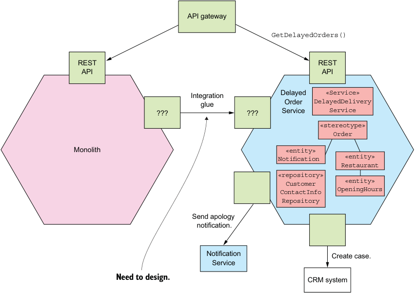


**----- Start of picture text -----**<br>
API gateway<br>GetDelayedOrders()<br>REST REST<br>API API<br>Integration Delayed «Service»<br>glue Order DelayedDelivery<br>??? ??? Service Service<br>«stereotype»<br>Order<br>Monolith «entity»<br>Notification «entity»<br>Restaurant<br>«repository»<br>Customer «entity»<br>ContactInfo OpeningHours<br>Repository<br>Send apology<br>notification.<br>Notification Create case.<br>Service<br>Need to design. CRM system<br>**----- End of picture text -----**<br>


Figure 13.14 The design of **Delayed Delivery Service** . The integration glue provides **Delayed Delivery Service** access to data owned by the monolith, such as the **Order** and **Restaurant** entities, and the customer contact information. 

Let’s look at the design of the integration glue that provides Delayed Order Service access to the monolith’s data. 

# _13.4.2 Designing the integration glue for Delayed Delivery Service_ 

Even though a service that implements a new feature defines its own entity classes, it usually accesses data that’s owned by the monolith. Delayed Delivery Service is no exception. It has a DelayedOrderNotification entity, which represents a notification that it has sent to the consumer. But as I just mentioned, its Order and Restaurant entities replicate data from the FTGO monolith. It also needs to query user contact information in order to notify the user. Consequently, we need to implement integration glue that enables Delivery Service to access the monolith’s data. 

Figure 13.15 shows the design of the integration glue. The FTGO monolith publishes Order and Restaurant domain events. Delivery Service consumes these events and updates its replicas of those entities. The FTGO monolith implements a REST 


endpoint for querying the customer contact information. Delivery Service calls this endpoint when it needs to notify a user that their order cannot be delivered on time. 


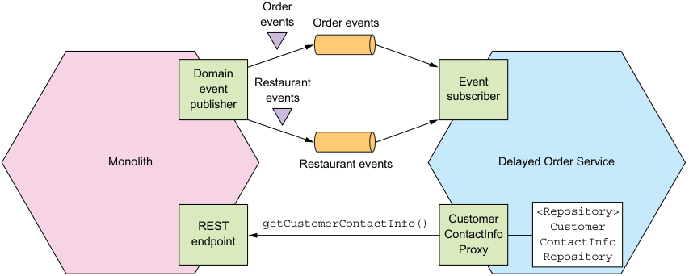


**----- Start of picture text -----**<br>
Order<br>events Order events<br>Domain<br>Restaurant Event<br>event<br>events subscriber<br>publisher<br>Monolith Restaurant events Delayed Order Service<br><Repository><br>REST getCustomerContactInfo() Customer Customer<br>ContactInfo<br>endpoint ContactInfo<br>Proxy<br>Repository<br>**----- End of picture text -----**<br>


Figure 13.15 The integration glue provides **Delayed Delivery Service** with access to the data owned by the monolith. 

Let’s look at the design of each part of the integration, starting with the REST API for retrieving customer contact information. 

# QUERYING CUSTOMER CONTACT INFORMATION USING CUSTOMERCONTACTINFOREPOSITORY 

As described in section 13.3.1, there are a couple of different ways that a service such as Delayed Delivery Service could read the monolith’s data. The simplest option is for Delayed Order Service to retrieve data using the monolith’s query API. This approach makes sense when retrieving the User contact information. There aren’t any latency or performance, issues because Delayed Delivery Service rarely needs to retrieve a user’s contact information, and the amount of data is quite small. 

CustomerContactInfoRepository is an interface that enables Delayed Delivery Service to retrieve a consumer’s contact info. It’s implemented by a CustomerContactInfoProxy, which retrieves the user information by invoking the monolith’s getCustomerContactInfo() REST endpoint. 

PUBLISHING AND CONSUMING ORDER AND RESTAURANT DOMAIN EVENTS 

Unfortunately, it isn’t practical for Delayed Delivery Service to query the monolith for the state of all open Orders and Restaurant hours. That’s because it’s inefficient to repeatedly transfer a large amount of data over the network. Consequently, Delayed Delivery Service must use the second, more complex option and maintain a replica of Orders and Restaurants by subscribing to events published by the monolith. It’s important to remember that the replica isn’t a complete copy of the data from the monolith—it just stores a small subset of the attributes of Order and Restaurant entities. 


_**Breaking apart the monolith: extracting delivery management**_ 


As described earlier in section 13.3.1, there are a couple of different ways that we can change the FTGO monolith so that it publishes Order and Restaurant domain events. One option is to modify all the places in the monolith that update Orders and Restaurants to publish high-level domain events. The second option is to tail the transaction log to replicate the changes as events. In this particular scenario, we need to synchronize the two databases. We don’t require the FTGO monolith to publish high-level domain events, so either approach is fine. 

Delayed Order Service implements event handlers that subscribe to events from the monolith and update its Order and Restaurant entities. The details of the event handlers depend on whether the monolith publishes specific high-level events or lowlevel change events. In either case, you can think of an event handler as translating an event in the monolith’s bounded context to the update of an entity in the service’s bounded context. 

An important benefit of using a replica is that it enables Delayed Order Service to efficiently query the orders and the restaurant opening hours. One drawback, however, is that it’s more complex. Another drawback is that it requires the monolith to publish the necessary Order and Restaurant events. Fortunately, because Delayed Delivery Service only needs what’s essentially a subset of the columns of the ORDERS and RESTAURANT tables, we shouldn’t encounter the problems described in section 13.3.1. 

Implementing a new feature such as delayed order management as a standalone service accelerates its development, testing, and deployment. What’s more, it enables you to implement the feature using a brand new technology stack instead of the monolith’s older one. It also stops the monolith from growing. Delayed order management is just one of many new features planned for the FTGO application. The FTGO team can implement many of these features as separate services. 

Unfortunately, you can’t implement all changes as new services. Quite often you must make extensive changes to the monolith to implement new features or change existing features. Any development involving the monolith will mostly likely be slow and painful. If you want to accelerate the delivery of these features, you must break up the monolith by migrating functionality from the monolith into services. Let’s look at how to do that. 

# _13.5 Breaking apart the monolith: extracting delivery management_ 

To accelerate the delivery of features that are implemented by a monolith, you need to break up the monolith into services. For example, let’s imagine that you want to enhance FTGO delivery management by implementing a new routing algorithm. A major obstacle to developing delivery management is that it’s entangled with order management and is part of the monolithic code base. Developing, testing, and deploying delivery management is likely to be slow. In order to accelerate its development, you need to extract delivery management into a Delivery Service. 


_**Refactoring to microservices**_ 


I start this section by describing delivery management and how it’s currently embedded within the monolith. Next I discuss the design of the new, standalone Delivery Service and its API. I then describe how Delivery Service and the FTGO monolith collaborate. Finally I talk about some of the changes we need to make to the monolith to support Delivery Service. 

Let’s begin by reviewing the existing design. 

# _13.5.1 Overview of existing delivery management functionality_ 

Delivery management is responsible for scheduling the couriers that pick up orders at restaurants and deliver them to consumers. Each courier has a plan that is a schedule of pickup and deliver actions. A _pickup_ action tells the Courier to pick up an order from a restaurant at a particular time. A _deliver_ action tells the Courier to deliver an order to a consumer. The plans are revised whenever orders are placed, canceled, or revised, and as the location and availability of couriers changes. 

Delivery management is one of the oldest parts of the FTGO application. As figure 13.16 shows, it’s embedded within order management. Much of the code for managing deliveries is in OrderService. What’s more, there’s no explicit representation of a Delivery. It’s embedded within the Order entity, which has various delivery-related fields, such as scheduledPickupTime and scheduledDeliveryTime. 

Numerous commands implemented by the monolith invoke delivery management, including the following: 

- acceptOrder()—Invoked when a restaurant accepts an order and commits to preparing it by a certain time. This operation invokes delivery management to schedule a delivery. 

- cancelOrder()—Invoked when a consumer cancels an order. If necessary, it cancels the delivery. 

- noteCourierLocationUpdated()—Invoked by the courier’s mobile application to update the courier’s location. It triggers the rescheduling of deliveries. 

- noteCourierAvailabilityChanged()—Invoked by the courier’s mobile application to update the courier’s availability. It triggers the rescheduling of deliveries. 

Also, various queries retrieve data maintained by delivery management, including the following: 

- getCourierPlan()—Invoked by the courier’s mobile application and returns the courier’s plan 

- getOrderStatus()—Returns the order’s status, which includes delivery-related information such as the assigned courier and the ETA 

- getOrderHistory()—Returns similar information as getOrderStatus() except about multiple orders 

Quite often what’s extracted into a service is, as mentioned in section 13.2.3, an entire vertical slice, with controllers at the top and database tables at the bottom. We could 


_**Breaking apart the monolith: extracting delivery management**_ 


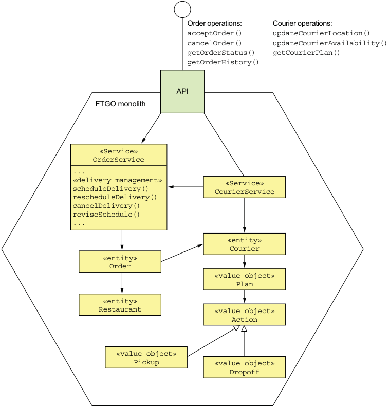


**----- Start of picture text -----**<br>
Order operations: Courier operations:<br>acceptOrder() updateCourierLocation()<br>cancelOrder() updateCourierAvailability()<br>getOrderStatus() getCourierPlan()<br>getOrderHistory()<br>API<br>FTGO monolith<br>«Service»<br>OrderService<br>...<br>«delivery management» «Service»<br>scheduleDelivery() CourierService<br>rescheduleDelivery()<br>cancelDelivery()<br>reviseSchedule()<br>...<br>«entity»<br>Courier<br>«entity»<br>Order<br>«value object»<br>Plan<br>«entity»<br>Restaurant «value object»<br>Action<br>«value object»<br>Pickup «value object»<br>Dropoff<br>**----- End of picture text -----**<br>


Figure 13.16 Delivery management is entangled with order management within the FTGO monolith. consider the Courier-related commands and queries to be part of delivery management. After all, delivery management creates the courier plans and is the primary consumer of the Courier location and availability information. But in order to minimize the development effort, we’ll leave those operations in the monolith and just extract the core of the algorithm. Consequently, the first iteration of Delivery Service won’t expose a publicly accessible API. Instead, it will only be invoked by the monolith. Next, let’s explore the design of Delivery Service. 


# _13.5.2 Overview of Delivery Service_ 

The proposed new Delivery Service is responsible for scheduling, rescheduling, and canceling deliveries. Figure 13.17 shows a high-level view of the architecture of the FTGO application after extracting Delivery Service. The architecture consists of the FTGO monolith and Delivery Service. They collaborate using the integration glue, which consists of APIs in both the service and monolith. Delivery Service has its own domain model and database. 


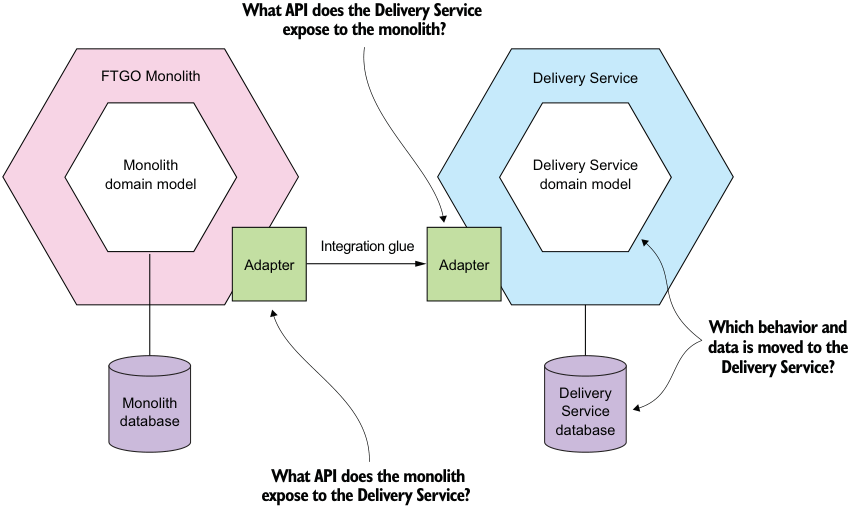


**----- Start of picture text -----**<br>
What API does the Delivery Service<br>expose to the monolith?<br>FTGO Monolith Delivery Service<br>Monolith Delivery Service<br>domain model domain model<br>Integration glue<br>Adapter Adapter<br>Which behavior and<br>data is moved to the<br>Delivery Service?<br>Delivery<br>Monolith<br>Service<br>database<br>database<br>What API does the monolith<br>expose to the Delivery Service?<br>**----- End of picture text -----**<br>


Figure 13.17 The high-level view of the FTGO application after extracting **Delivery Service** . The FTGO monolith and **Delivery Service** collaborate using the integration glue, which consists of APIs in each of them. The two key decisions that need to be made are which functionality and data are moved to **Delivery Service** and how do the monolith and **Delivery Service** collaborate via APIs? 

In order to flesh out this architecture and determine the service’s domain model, we need to answer the following questions: 

- Which behavior and data are moved to Delivery Service? 

- What API does Delivery Service expose to the monolith? 

- What API does the monolith expose to Delivery Service? 

These issues are interrelated because the distribution of responsibilities between the monolith and the service affects the APIs. For instance, Delivery Service will need to invoke an API provided by the monolith to access the data in the monolith’s database and vice versa. Later, I’ll describe the design of the integration glue that enables 


_**Breaking apart the monolith: extracting delivery management**_ 


Delivery Service and the FTGO monolith to collaborate. But first, let’s look at the design of Delivery Service’s domain model. 

# _13.5.3 Designing the Delivery Service domain model_ 

To be able to extract delivery management, we first need to identify the classes that implement it. Once we’ve done that, we can decide which classes to move to Delivery Service to form its domain logic. In some cases, we’ll need to split classes. We’ll also need to decide which data to replicate between the service and the monolith. 

Let’s start by identifying the classes that implement delivery management. 

IDENTIFYING WHICH ENTITIES AND THEIR FIELDS ARE PART OF DELIVERY MANAGEMENT 

The first step in the process of designing Delivery Service is to carefully review the delivery management code and identify the participating entities and their fields. Figure 13.18 shows the entities and fields that are part of delivery management. Some fields are inputs to the delivery-scheduling algorithm, and others are the outputs. The figure shows which of those fields are also used by other functionality implemented by the monolith. 


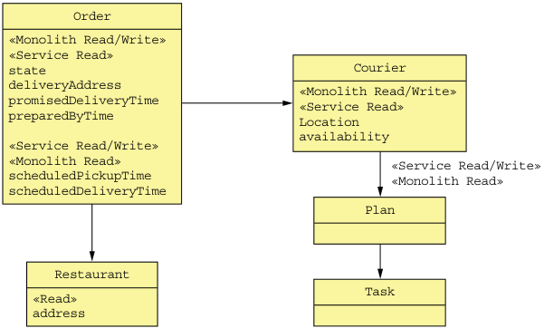


**----- Start of picture text -----**<br>
Order<br>«Monolith Read/Write»<br>«Service Read»<br>state Courier<br>deliveryAddress «Monolith Read/Write»<br>promisedDeliveryTime «Service Read»<br>preparedByTime Location<br>availability<br>«Service Read/Write»<br>«Monolith Read» «Service Read/Write»<br>scheduledPickupTime «Monolith Read»<br>scheduledDeliveryTime<br>Plan<br>Restaurant<br>Task<br>«Read»<br>address<br>**----- End of picture text -----**<br>


Figure 13.18 The entities and fields that are accessed by delivery management and other functionality implemented by the monolith. A field can be read or written or both. It can be accessed by delivery management, the monolith, or both. 

The delivery scheduling algorithm reads various attributes including the Order’s restaurant, promisedDeliveryTime, and deliveryAddress, and the Courier’s location, availability, and current plans. It updates the Courier’s plans, the Order’s scheduledPickupTime, and scheduledDeliveryTime. As you can see, the fields used by delivery management are also used by the monolith. 


# DECIDING WHICH DATA TO MIGRATE TO DELIVERY SERVICE 

Now that we’ve identified which entities and fields participate in delivery management, the next step is to decide which of them we should move to the service. In an ideal scenario, the data accessed by the service is used exclusively by the service, so we could simply move that data to the service and be done. Sadly, it’s rarely that simple, and this situation is no exception. All the entities and fields used by the delivery management are also used by other functionality implemented by the monolith. 

As a result, when determining which data to move to the service, we need to keep in mind two issues. The first is: how does the service access the data that remains in the monolith? The second is: how does the monolith access data that’s moved to the service? Also, as described earlier in section 13.3, we need to carefully consider how to maintain data consistency between the service and the monolith. 

The essential responsibility of Delivery Service is managing courier plans and updating the Order’s scheduledPickupTime and scheduledDeliveryTime fields. It makes sense, therefore, for it to own those fields. We could also move the Courier.location and Courier.availability fields to Delivery Service. But because we’re trying to make the smallest possible change, we’ll leave those fields in the monolith for now. 

# THE DESIGN OF THE DELIVERY SERVICE DOMAIN LOGIC 

Figure 13.19 shows the design of the Delivery Service’s domain model. The core of the service consists of domain classes such as Delivery and Courier. The DeliveryServiceImpl class is the entry point into the delivery management business logic. It implements the DeliveryService and CourierService interfaces, which are invoked by DeliveryServiceEventsHandler and DeliveryServiceNotificationsHandlers, described later in this section. 

The delivery management business logic is mostly code copied from the monolith. For example, we’ll copy the Order entity from the monolith to Delivery Service, rename it to Delivery, and delete all fields except those used by delivery management. We’ll also copy the Courier entity and delete most of its fields. In order to develop the domain logic for Delivery Service, we will need to untangle the code from the monolith. We’ll need to break numerous dependencies, which is likely to be time consuming. Once again, it’s a lot easier to refactor code when using a statically typed language, because the compiler will be your friend. 

Delivery Service is not a standalone service. Let’s look at the design of the integration glue that enables Delivery Service and the FTGO monolith to collaborate. 


_**Breaking apart the monolith: extracting delivery management**_ 


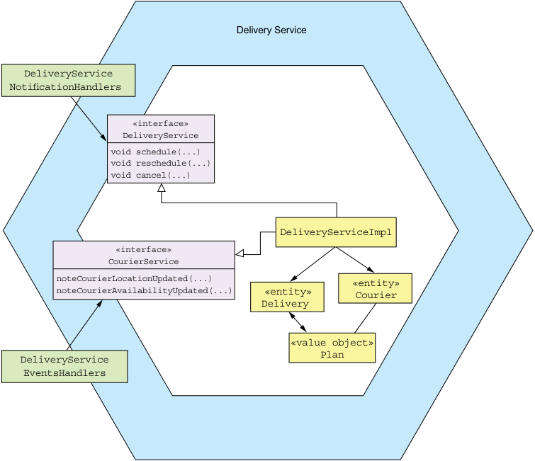


**----- Start of picture text -----**<br>
Delivery Service<br>DeliveryService<br>NotificationHandlers<br>«interface»<br>DeliveryService<br>void schedule(...)<br>void reschedule(...)<br>void cancel(...)<br>DeliveryServiceImpl<br>«interface»<br>CourierService<br>noteCourierLocationUpdated(...) «entity»<br>noteCourierAvailabilityUpdated(...) «entity» Courier<br>Delivery<br>«value object»<br>Plan<br>DeliveryService<br>EventsHandlers<br>**----- End of picture text -----**<br>


Figure 13.19 The design of the **Delivery Service** 's domain model 

# _13.5.4 The design of the Delivery Service integration glue_ 

The FTGO monolith needs to invoke Delivery Service to manage deliveries. The monolith also needs to exchange data with Delivery Service. This collaboration is enabled by the integration glue. Figure 13.20 shows the design of the Delivery Service integration glue. Delivery Service has a delivery management API. It also publishes Delivery and Courier domain events. The FTGO monolith publishes Courier domain events. 

Let’s look at the design of each part of the integration glue, starting with Delivery Service’s API for managing deliveries. 

# THE DESIGN OF THE DELIVERY SERVICE API 

Delivery Service must provide an API that enables the monolith to schedule, revise, and cancel deliveries. As you’ve seen throughout this book, the preferred approach is to use asynchronous messaging, because it promotes loose coupling and increases availability. One approach is for Delivery Service to subscribe to Order domain events published by the monolith. Depending on the type of the event, it creates, 


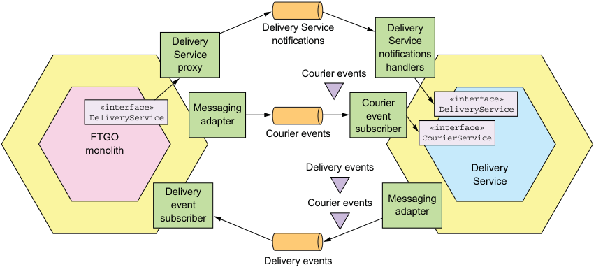


**----- Start of picture text -----**<br>
Delivery Service Delivery<br>Delivery notifications Service<br>Service notifications<br>proxy Courier events handlers<br>«interface» Messaging Courier DeliveryService«interface»<br>DeliveryServiceFTGO adapter Courier events subscriberevent CourierService«interface»<br>monolith<br>Delivery events Delivery<br>Service<br>Delivery<br>event Courier events Messaging<br>adapter<br>subscriber<br>Delivery events<br>**----- End of picture text -----**<br>


Figure 13.20 The design of the **Delivery Service** integration glue. **Delivery Service** has a delivery management API. The service and the FTGO monolith synchronize data by exchanging domain events. revises, and cancels a Delivery. A benefit of this approach is that the monolith doesn’t need to explicitly invoke Delivery Service. The drawback of relying on domain events is that it requires Delivery Service to know how each Order event impacts the corresponding Delivery. 

A better approach is for Delivery Service to implement a notification-based API that enables the monolith to explicitly tell Delivery Service to create, revise, and cancel deliveries. Delivery Service’s API consists of a message notification channel and three message types: ScheduleDelivery, ReviseDelivery, or CancelDelivery. A notification message contains Order information needed by Delivery Service. For example, a ScheduleDelivery notification contains the pickup time and location and the delivery time and location. An important benefit of this approach is that Delivery Service doesn’t have detailed knowledge of the Order lifecycle. It’s entirely focused on managing deliveries and has no knowledge of orders. 

This API isn’t the only way that Delivery Service and the FTGO monolith collaborate. They also need to exchange data. 

HOW THE DELIVERY SERVICE ACCESSES THE FTGO MONOLITH’S DATA 

Delivery Service needs to access the Courier location and availability data, which is owned by the monolith. Because that’s potentially a large amount of data, it’s not practical for the service to repeatedly query the monolith. Instead, a better approach is for the monolith to replicate the data to Delivery Service by publishing Courier domain events, CourierLocationUpdated and CourierAvailabilityUpdated. Delivery Service has a CourierEventSubscriber that subscribes to the domain events and updates its version of the Courier. It might also trigger the rescheduling of deliveries. 


_**Breaking apart the monolith: extracting delivery management**_ 

# HOW THE FTGO MONOLITH ACCESSES THE DELIVERY SERVICE DATA 

The FTGO monolith needs to read the data that’s been moved to Delivery Service, such as the Courier plans. In theory, the monolith could query the service, but that requires extensive changes to the monolith. For the time being, it’s easier to leave the monolith’s domain model and database schema unchanged and replicate data from the service back to the monolith. 

The easiest way to accomplish that is for Delivery Service to publish Courier and Delivery domain events. The service publishes a CourierPlanUpdated event when it updates a Courier’s plan, and a DeliveryScheduleUpdate event when it updates a Delivery. The monolith consumes these domain events and updates its database. 

Now that we’ve looked at how the FTGO monolith and Delivery Service interact, let’s see how to change the monolith. 

# _13.5.5 Changing the FTGO monolith to interact with Delivery Service_ 

In many ways, implementing Delivery Service is the easier part of the extraction process. Modifying the FTGO monolith is much more difficult. Fortunately, replicating data from the service back to the monolith reduces the size of the change. But we still need to change the monolith to manage deliveries by invoking Delivery Service. Let’s look at how to do that. 

# DEFINING A DELIVERYSERVICE INTERFACE 

The first step is to encapsulate the delivery management code with a Java interface corresponding to the messaging-based API defined earlier. This interface, shown in figure 13.21, defines methods for scheduling, rescheduling, and canceling deliveries. 


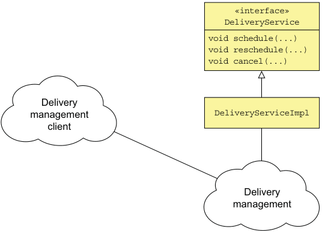


**----- Start of picture text -----**<br>
«interface»<br>DeliveryService<br>void schedule(...)<br>void reschedule(...)<br>void cancel(...)<br>Delivery<br>management DeliveryServiceImpl<br>client<br>Delivery<br>management<br>**----- End of picture text -----**<br>


Figure 13.21 The first step is to define **DeliveryService** , which is a coarse-grained, remotable API for invoking the delivery management logic. 


Eventually, we’ll implement this interface with a proxy that sends messages to the delivery service. But initially, we’ll implement this API with a class that calls the delivery management code. 

The DeliveryService interface is a coarse-grained interface that’s well suited to being implemented by an IPC mechanism. It defines schedule(), reschedule(), and cancel() methods, which correspond to the notification message types defined earlier. 

# REFACTORING THE MONOLITH TO CALL THE DELIVERYSERVICE INTERFACE 

Next, as figure 13.22 shows, we need to identify all the places in the FTGO monolith that invoke delivery management and change them to use the DeliveryService interface. This may take some time and is one of the most challenging aspects of extracting a service from the monolith. 


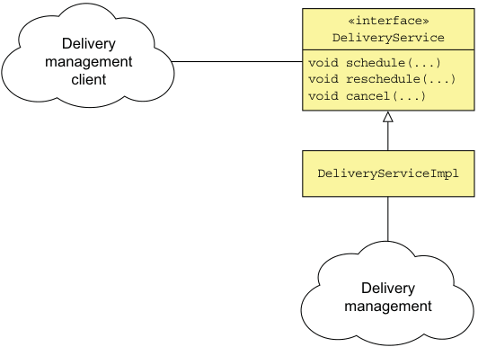


**----- Start of picture text -----**<br>
«interface»<br>Delivery DeliveryService<br>management v oid schedule(...)<br>client void reschedule(...)<br>void cancel(...)<br>DeliveryServiceImpl<br>Delivery<br>management<br>**----- End of picture text -----**<br>


Figure 13.22 The second step is to change the FTGO monolith to invoke delivery management via the **DeliveryService** interface. 

It certainly helps if the monolith is written in a statically typed language, such as Java, because the tools do a better job of identifying dependencies. If not, then hopefully you have some automated tests with sufficient coverage of the parts of the code that need to be changed. 

# IMPLEMENTING THE DELIVERYSERVICE INTERFACE 

The final step is to replace the DeliveryServiceImpl class with a proxy that sends notification messages to the standalone Delivery Service. But rather than discard the existing implementation right away, we’ll use a design, shown in figure 13.23, that enables the monolith to dynamically switch between the existing implementation and Delivery Service. We’ll implement the DeliveryService interface with a class that uses a dynamic feature toggle to determine whether to invoke the existing implementation or Delivery Service. 


_**Breaking apart the monolith: extracting delivery management**_ 


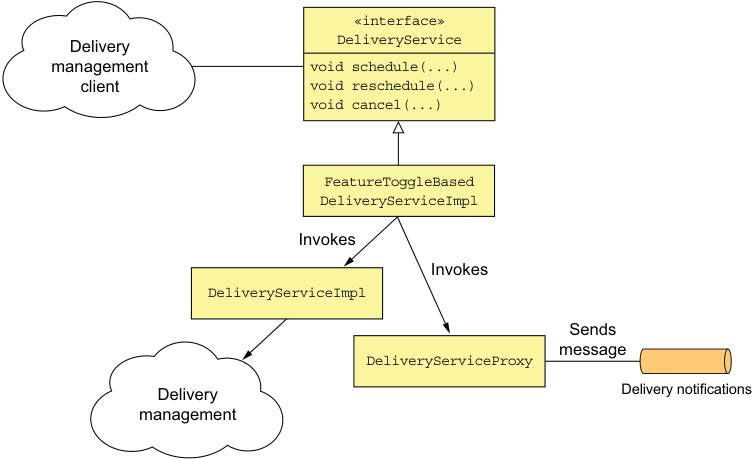


**----- Start of picture text -----**<br>
«interface»<br>Delivery DeliveryService<br>management v oid schedule(...)<br>client void reschedule(...)<br>void cancel(...)<br>FeatureToggleBased<br>DeliveryServiceImpl<br>Invokes<br>Invokes<br>DeliveryServiceImpl<br>Sends<br>message<br>DeliveryServiceProxy<br>Delivery Delivery notifications<br>management<br>**----- End of picture text -----**<br>


Figure 13.23 The final step is to implement **DeliveryService** with a proxy class that sends messages **Delivery Service** . A feature toggle controls whether the FTGO monolith uses the old implementation or the new **Delivery Service** . 

Using a feature toggle significantly reduces the risk of rolling out Delivery Service. We can deploy Delivery Service and test it. And then, once we’re sure it works, we can flip the toggle to route traffic to it. If we then discover that Delivery Service isn’t working as expected, we can switch back to the old implementation. 

# About feature toggles 

_Feature toggles_ , or _feature flags_ , let you deploy code changes without necessarily releasing them to users. They also enable you to dynamically change the behavior of the application by deploying new code. This article by Martin Fowler provides an excellent overview of the topic: https://martinfowler.com/articles/feature-toggles .html. 

Once we’re sure that Delivery Service is working as expected, we can then remove the delivery management code from the monolith. 

Delivery Service and Delayed Order Service are examples of the services that the FTGO team will develop during their journey to the microservice architecture. Where they go next after implementing these services depends on the priorities of the business. One possible path is to extract Order History Service, described in chapter 7. Extracting this service partially eliminates the need for Delivery Service to replicate data back to the monolith. 


After implementing Order History Service, the FTGO team can then extract the services in the order described in section 13.3.2: Order Service, Consumer Service, Kitchen Service, and so on. As the FTGO team extracts each service, the maintainability and testability of their application gradually improves, and their development velocity increases. 

# _Summary_ 

- Before migrating to a microservice architecture, it’s important to be sure that your software delivery problems are a result of having outgrown your monolithic architecture. You might be able to accelerate delivery by improving your software development process. 

- It’s important to migrate to microservices by incrementally developing a strangler application. A strangler application is a new application consisting of microservices that you build around the existing monolithic application. You should demonstrate value early and often in order to ensure that the business supports the migration effort. 

- A great way to introduce microservices into your architecture is to implement new features as services. Doing so enables you to quickly and easily develop a feature using a modern technology and development process. It’s a good way to quickly demonstrate the value of migrating to microservices. 

- One way to break up the monolith is to separate the presentation tier from the backend, which results in two smaller monoliths. Although it’s not a huge improvement, it does mean that you can deploy each monolith independently. This allows, for example, the UI team to iterate more easily on the UI design without impacting the backend. 

- The main way to break up the monolith is by incrementally migrating functionality from the monolith into services. It’s important to focus on extracting the services that provide the most benefit. For example, you’ll accelerate development if you extract a service that implements functionality that’s being actively developed. 

- Newly developed services almost always have to interact with the monolith. A service often needs to access a monolith’s data and invoke its functionality. The monolith sometimes needs to access a service’s data and invoke its functionality. To implement this collaboration, develop integration glue, which consists of inbound and outbound adapters in the monolith. 

- To prevent the monolith’s domain model from polluting the service’s domain model, the integration glue should use an anti-corruption layer, which is a layer of software that translates between domain models. 

- One way to minimize the impact on the monolith of extracting a service is to replicate the data that was moved to the service back to the monolith’s database. Because the monolith’s schema is left unchanged, this eliminates the need to make potentially widespread changes to the monolith code base. 


_**Summary**_ 

- Developing a service often requires you to implement sagas that involve the monolith. But it can be challenging to implement a compensatable transaction that requires making widespread changes to the monolith. Consequently, you sometimes need to carefully sequence the extraction of services to avoid implementing compensatable transactions in the monolith. 

- When refactoring to a microservice architecture, you need to simultaneously support the monolithic application’s existing security mechanism, which is often based on an in-memory session, and the token-based security mechanism used by the services. Fortunately, a simple solution is to modify the monolith’s login handler to generate a cookie containing a security token, which is then forwarded to the services by the API gateway. 


# _index_ 

# Numerics 

2PC (two-phase commit) 112 3rd party registration pattern 84–85, 108 4+1 view model of software architecture 35–37 500 status code, HTTP 367 

# A 

AbstractAutowiringHttpRequestHandler class 423 AbstractHttpHandler class 423 accept() method 165, 172 acceptance tests 335–338 defining 336 executing specifications using Cucumber 338 writing using Gherkin 337–338 acceptOrder() method 460 Access Token 28, 354, 357 ACD (Atomicity, Consistency, Durability) 111 ACID (Atomicity, Consistency, Isolation, Durability) transactions 98, 110 ACLs (access control lists) 350 ActiveMQ message broker 92 add() method 310 addOrder() method 249–250 AggregateRepository class 206–208 aggregates 147, 374, 439 consistency boundaries 155 creating, finding, and updating 207–208 defining aggregate commands 207 defining with ReflectiveMutableCommandProcessingAggregate class 206–207 designing business logic with 159–160 event sourcing aggregate history 186, 199–200 aggregate methods and events 189–191 event sourcing-based Order aggregate 191–193 persisting aggregates using events 186–188 event sourcing and aggregate history 199–200 explicit boundaries 154–155 granularity 158 identifying 155 Order aggregate 175–180 methods 177–180 state machine 176–177 structure of 175–176 rules for 155–157 Ticket aggregate 169–173 behavior of 170–171 KitchenService domain service 171–172 KitchenServiceCommandHandler class 172–173 structure of Ticket class 170 traditional persistence and aggregate history 186 aliases 285 Alternative pattern 22 AMI (Amazon Machine Image) 390 anomalies 126 Anti-corruption layer pattern 447 AOP (aspect-oriented programming) 373, 378 Apache Flume 370 Apache Kafka 92 Apache Openwhisk 416 Apache Shiro 351 API composition pattern 221–228 benefits and drawbacks of 227–228 increased overhead 227 lack of transactional data consistency 228 risk of reduced availability 227–228 


INDEX 

API composition pattern _(continued)_ design issues 225–227 reactive programming model 227 role of API composer 225–227 findOrder() query operation 221–222, 224 overview of 222–224 API gateway 259–291 authentication 354–355 benefits of 267 design issues 268–271 being good citizen in architecture 270–271 handling partial failures 270 performance and scalability 268–269 reactive programming abstractions 269–270 drawbacks of 267 implementation using GraphQL 279–291 connecting schema to data 285–287 defining schema 282–284 executing queries 284–285 integrating Apollo GraphQL server with Express 289–290 optimizing loading using batching and caching 288 writing client 290–291 implementation using Netflix Zuul 273 implementation using off-the-shelf products/ services 271–272 API gateway products 272 AWS API gateway service 271–272 AWS Application Load Balancer service 272 implementation using Spring Cloud Gateway 273–275 ApiGatewayApplication class 279 OrderConfiguration class 275–276 OrderHandlers class 276–278 OrderService class 278–279 mapping USERINFO cookie to Authorization header 455 Netflix example 267–268 overview of 259–266 API composition 261 architecture 263–264 Backends for frontends pattern 264–266 client-specific API 262 edge functions 262–263 ownership model 264 protocol translation 262 request routing 260 ApiGatewayApplication class 279 ApiGatewayMain package 274 APIGatewayProxyRequestEvent 417, 421–422 APIGatewayProxyResponseEvent 417, 422 APIs defining in microservice architecture 68–69 interprocess communication 69–71 creating specification for messaging-based service API 89–90 major, breaking changes 70–71 minor, backward-compatible changes 70 semantic versioning 70 specifying REST APIs 74 refactoring to microservices 444–445, 465–466 testing microservices consumer contract tests for messaging APIs 305 consumer-side integration test for API gateway’s OrderServiceProxy 325–326 example contract for REST API 324 _See also_ API gateways Application architecture patterns Microservice architecture 8–18, 40 Monolithic architecture 2–7, 22–34, 40 application infrastructure 24 application metrics 28, 366, 373–376 collecting service-level metrics 374–375 delivering metrics to metrics service 375–376 application modernization 23–24, 430–432 application security 349 apply() method 188, 193 architectural styles 37–40 hexagonal 38–40 layered 37–38 microservice architecture 40–43 loose coupling, defined 42–43 relative unimportance of size of service 43 role of shared libraries 43 services, defined 41–42 aspect-oriented programming (AOP) 373, 378 asynchronous (nonblocking) I/O model 268 asynchronous interactions 67 Asynchronous messaging pattern 85–103 competing receivers and message ordering 94–95 creating API specification 89–90 documenting asynchronous operations 90 documenting published events 90 duplicate messages 95–97 tracking messages and discarding duplicates 96–97 writing idempotent message handlers 96 improving availability 103–108 eliminating synchronous interaction 104–108 synchronous communication and availability 103–104 interaction styles 87–89 one-way notifications 89 publish/subscribe 89 request/response and asynchronous request/ response 87–88 


INDEX 

Asynchronous messaging pattern _(continued)_ libraries and frameworks for 100–103 basic messaging 101 command/reply-based messaging 102–103 domain event publishing 102 message brokers 90–94 benefits and drawbacks of 93–94 brokerless messaging 91–92 implementing message channels using 93 overview of 92 overview of 86–87 transactional messaging 97–100 publishing events using Polling publisher pattern 98–99 publishing events using Transaction log tailing pattern 99–100 using database table as message queue 97–98 asynchronous request/response interactions implementing 87–88 integration tests for consumer-side contract tests 332–335 contract tests 330–335 example contract 331–332 Atomicity, Consistency, Durability (ACD) 111 Atomicity, Consistency, Isolation, Durability (ACID) transactions 98, 110 attribute value 245 audit logging 28, 186, 366, 377–378 adding code to business logic 378 aspect-oriented programming 378 event sourcing 378 auditing 350 authentication and authorization refactoring to microservices 453–455 API gateway maps USERINFO cookie to Authorization header 455 LoginHandler sets USERINFO cookie 454–455 security in microservice architecture handling authentication 354–355 handling authorization 356 Authorization Server concept 357 automated testing 28, 293, 295–296 automatic sidecar injection 411 Avro 72 AWS API gateway service 271–272 AWS Application Load Balancer service 272 AWS DynamoDB 242–252 data modeling and query design 244–249 detecting duplicate events 248–249 findOrderHistory query 245–247 FTGO-order-history table 245 paginating query results 247 updating orders 247–248 

OrderHistoryDaoDynamoDb class 249–252 addOrder() method 249–250 findOrderHistory() method 251–252 idempotentUpdate() method 250–251 notePickedUp() method 250 OrderHistoryEventHandlers module 243–244 AWS Gateway, deploying RESTful services using 419–426 deploying lambda functions using Serverless framework 425–426 design of Restaurant Service 419–423 packaging service as ZIP file 424 AWS Lambda benefits of lambda functions 418 developing lambda functions 417 drawbacks of lambda functions 419 invoking lambda functions 417–418 defining scheduled lambda functions 418 handling events 418 handling HTTP requests 417 invoking lambda functions using web service requests 418 overview of 416 RESTful services 419–426 deploying lambda functions using Serverless framework 425–426 design of Restaurant Service 419–423 packaging service as ZIP file 424 aws.region property 363 Axon 202 Azure functions, Microsoft 416 

# B 

Backends for frontends (BFF) pattern 264–266 batching 288 @Before setUp() method 309 beforeHandling() method 423 Big Ball of Mud pattern 2 big bang rewrite 430 binary message formats 72 bounded context 55 broker-based messaging 90–94 benefits and drawbacks of 93–94 implementing message channels using 93 overview of 92 brokerless messaging 91–92 Browser API module 264 business capability 40 business logic 146–219 adding audit logging code to 378 domain events 160–168 consuming 167–168 defined 161 event enrichment 161–162 


INDEX business logic _(continued)_ generating 164–165 identifying 162–163 publishing 166–167 reasons to publish 160–161 domain model design 152–160 aggregates 154–160 problem with fuzzy boundaries 153–154 event sourcing 184–202 benefits of 199–200 drawbacks of 200–202 event publishing 194–195 evolving domain events 198–199 handling concurrent updates using optimistic locking 193–194 idempotent message processing 197 overview of 186–193 snapshots, improving performance with 195–196 traditional persistence 185–186 event store implementation 202–209 Eventuate client framework for Java 205–209 Eventuate Local event store 203–205 Kitchen Service business logic 168–173 Order Service business logic 173–182 Order aggregate 175–180 OrderService class 180–182 organization patterns 147–152 Domain model pattern 150–151 domain-driven design 151–152 Transaction script pattern 149–150 sagas and event sourcing together 209–218 creating orchestration-based saga 211–212 implementing choreography-based sagas using event sourcing 210 implementing event sourcing-based saga participant 213–216 implementing saga orchestrators using event sourcing 216–218 Business logic design patterns Aggregate 147, 152–160 Domain event 160 Domain model 150–151 Event sourcing 184 Transaction script 149–150 business logic layer 38, 436 by value countermeasure 131–132 

# C 

caching 262, 288 cancel() operation 177 cancelOrder() method 460 CAP theorem 113 CCP (Common Closure Principle) 56 centralized sessions 354 change failure rate 31 choreography 111 choreography-based sagas 118–121 benefits and drawbacks of 121 implementing Create Order saga 118–119 implementing using event sourcing 210 reliable event-based communication 120–121 CI (Continuous Integration) 6, 306, 357 Circuit breaker pattern 77–80 developing robust RPI proxies 79 recovering from unavailable services 79–80 Client concept 358 Client-side discovery pattern 82–83 command message 86 Command query responsibility segregation. _See_ CQRS pattern command/reply-based messaging 102–103 commands 41 commit tests stage 306 committed records 130 Common Closure Principle (CCP) 56–57 communication flexible 93 secure interprocess 350 communication patterns 23–25 commutative update countermeasure 130 compensatable transactions 116, 128, 450 compensating transaction 450 compile-time tests 297 component tests 306, 339–340 for FTGO Order Service OrderServiceComponentTestStepDefinitions class 341–344 running 344–345 writing 340–345 in-process component tests 339 out-of-process component tests 339–340 condition expression 248 Conduit 381 ConfigMap 402 configurable services 360–364 pull-based externalized configuration 363–364 push-based externalized configuration 362–363 @ConfigurationProperties class 276 consumer contract testing 301–303 for asynchronous request/response interaction 332–335 for messaging APIs 305 for publish/subscribe-style interactions 328–330 for REST-based request/response style interactions 324–326 consumer group 94 consumer-driven contract test 28, 302 


INDEX consumerId parameter 229 consumer-provider relationship 301 consumer-side contract test 28, 302 containers container image 395 Deploy a service as a container 22, 393 Docker 395–398 continuous deployment 5 deployment pipeline 305–307 Continuous Integration (CI) 6, 306, 357 controllers, unit tests for 313–315 Conway, Melvin 30 Conway’s law 30 correlation ID 88–89, 120 countermeasures 111, 126, 450 CQRS (Command query responsibility segregation) 26, 63, 160, 228–236 benefits of 235–236 efficient implementation 235 improved separation of concerns 235–236 querying in event sourcing-based application 235 drawbacks of 236 more complex architecture 236 replication lag 236 motivations for using 229–232 findAvailableRestaurants() query operation 231 findOrderHistory() query operation 229–231 need to separate concerns 231–232 overview of 232–235 query-only services 233–235 separating commands from queries 232–233 views adding and updating 241–242 designing 236–242 implementing with AWS DynamoDB 242–252 Create Order saga 114–115, 135–142 CreateOrderSaga orchestrator 136–138 CreateOrderSagaState class 138 Eventuate Tram Saga framework 140–142 implementing using choreography 118–119 implementing using orchestration 122–123 KitchenServiceProxy class 139 create, update, and delete (CRUD) operations 232 create() method 171, 204 createOrder() operation 114 CreateOrderSaga orchestrator 136–138 CreateOrderSagaState class 138 CreateOrderSagaTest class 312 Cross-cutting concerns patterns Externalized configuration 28, 361 Microservice chassis 28, 378–382 

CRUD (create, update, and delete) operations 232 Cucumber framework 338 CustomerContactInfoRepository interface 445, 458 

# D 

DAO (data access object) 39, 149, 239 data access logic layer 436 data consistency 449–453 API composition pattern and 228 maintaining across services 58 refactoring to microservices sagas and compensatable transactions 451–452 sequencing extraction of services 452–453 supporting compensatable transactions 450–451 Saga pattern 25–26, 114–117 data consistency patterns 25 Saga pattern 25–26, 114–117 DataLoader module 288 DDD (domain-driven design) 24, 34 DDD aggregate pattern 152–160 Debezium 100 Decompose by business capability pattern 51–54 decomposition 52–54 identifying business capabilities 51–52 purpose of business capabilities 51 decomposition 33–64 Decompose by subdomain 54 defining application’s microservice architecture 44–64 defining service APIs 61–64 guidelines for decomposition 56–57 identifying system operations 45–50 obstacles to decomposition 57–61 service definition with Decompose by business capability pattern 51–54 service definition with Decompose by subdomain pattern 54–55 guidelines for 56–57 Common Closure Principle 56–57 Single Responsibility Principle 56 obstacles to 57–61 god classes 58–61 maintaining data consistency across services 58 network latency 57 obtaining consistent view of data 58 synchronous interprocess communication 57 patterns Decompose by business capability 24, 51–54 Decompose by subdomain 24, 54 


INDEX 

Delayed Delivery Service changing FTGO monolith to interact with 467–470 defining interface 467–468 implementing interface 468–470 refactoring monolith to call interface 468 design for 456–457 domain model 463–464 deciding which data to migrate 464 design of domain logic 464 identifying which entities and fields are part of delivery management 463 existing delivery functionality 460–461 integration glue for 457–459, 465–467 CustomerContactInfoRepository interface 458 design of API 465–466 how Delivery Service accesses FTGO data 466 how FTGO accesses data 467 publishing and consuming Order and Restaurant domain events 458–459 overview of 462–463 deleted flag 201 deliver action 460 DeliveryServiceImpl class 468 dependencies 125 deploy stage 306 deployment 383–427 Language-specific packaging format pattern 386–390 benefits of 388–389 drawbacks of 389–390 RESTful services using AWS Lambda and AWS Gateway 419–426 deploying lambda functions using Serverless framework 425–426 design of Restaurant Service 419–423 packaging service as ZIP file 424 Serverless deployment pattern 415–419 benefits of lambda functions 418 developing lambda functions 417 drawbacks of lambda functions 419 invoking lambda functions 417–418 overview of 416 Service as container pattern 393–399 benefits of 398 Docker 395–398 drawbacks of 399 Service as virtual machine pattern 390–393 benefits of 392 drawbacks of 392–393 Service mesh pattern 380 Sidecar pattern 410 with Kubernetes 399–415 deploying API gateway 405–406 deploying Restaurant Service 402–405 overview of 399–402 service meshes 407–415 zero-downtime deployments 406–407 deployment frequency 31 Deployment patterns Deploy a service as a container 22, 393 Deploy a service as a VM 390, 392 Language-specific packaging format 386, 390 Serverless deployment 415–419 Service mesh 380 Sidecar 410 deployment pipeline 305–307 Deployment view 36 DestinationRule 413 dirty reads 127 Distributed tracing pattern 28, 366, 370–373 distributed tracing server 373 instrumentation libraries 373 Distributed Transaction Processing (DTP) 112 Docker 395–398 building images 395–396 pushing images to registry 396–397 running containers 397–398 docker build command 396 Docker containers 267 docker push command 397 docker run command 397 docker tag command 396 document message 86 domain event publishing 102 domain events 160–168, 198–199 consuming 167–168, 458–459 defined 161 defining 207 event enrichment 161–162 event schema evolution 198–199 generating 164–165 identifying 162–163 managing schema changes through upcasting 199 publishing 102, 166–167, 448–449, 458–459 reasons to publish 160–161 subscribing to 208–209, 448–449 domain model 54, 150–160 aggregates consistency boundaries 155 designing business logic with 159–160 explicit boundaries 154–155 granularity 158 identifying aggregates 155 rules for 155–157 creating high-level domain model 46–48 


INDEX domain model _(continued)_ Delivery Service 463–464 deciding which data to migrate 464 design of domain logic 464 identifying which entities and fields are part of delivery management 463 problem with fuzzy boundaries 153–154 splitting 439–440 domain services KitchenService 171–172 unit tests for 312–313 domain-driven design (DDD) 24, 34 DSL (domain-specific language) 303 DTP (Distributed Transaction Processing) 112 dumb pipes 14 duplicate messages 95–97 tracking messages and discarding duplicates 96–97 writing idempotent message handlers 96 DynamoDB streams 100 

# E 

edge functions 271 Elastic Beanstalk 391 Elasticsearch 370 @EnableGateway annotation 279 end-to-end tests 345–346 designing 345 running 346 writing 346 Enterprise Service Bus (ESB) 264 entities, unit tests for 309–310 Entity object, DDD 151 enums 283 ESB (Enterprise Service Bus) 264 event. _See_ Domain events event handlers events generated by AWS services 418 idempotent 240–241 unit tests for 315–317 event message 86 event publishing 194–195 Asynchronous messaging pattern 89–90, 98–100, 102 domain events 160–168 consuming 167–168 defined 161 event enrichment 161–162 generating and publishing 164–167 identifying 162–163 reasons for 160–161 event sourcing 194–195, 199 traditional persistence and 186 using polling 194–195 using transaction log tailing 195 event sourcing 184–202 audit logging 378 benefits of 199–200 avoids O/R impedance mismatch problem 200 preserves aggregate history 199–200 reliable domain event publishing 199 time machine for developers 200 concurrent updates and optimistic locking 193–194 drawbacks of 200–202 complexity 200 deleting data 201 evolving events 201 learning curve 200 querying event store 202 event publishing 194–195 using polling 194–195 using transaction log tailing 195 evolving domain events 198–199 event schema evolution 198–199 managing schema changes through upcasting 199 idempotent message processing 197 with NoSQL-based event store 197 with RDBMS-based event store 197 overview of 186–193 aggregate methods required to generate events 189–191 event sourcing-based Order aggregate 191–193 events representing state changes 188 persisting aggregates using events 186–188 sagas and 209–218 creating orchestration-based saga 211–212 implementing choreography-based sagas using event sourcing 210 implementing event sourcing-based saga participant 213–216 implementing saga orchestrators using event sourcing 216–218 snapshots and performance improvement 195–196 trouble with traditional persistence 185–186 audit logging 186 event publishing bolted to business logic 186 lack of aggregate history 186 Object-Relational impedance mismatch 185–186 Event Store 202 event store implementation 202–209 Eventuate client framework for Java 205–209 AggregateRepository class 207–208 defining aggregate commands 207 


INDEX event store implementation _(continued)_ defining aggregates with ReflectiveMutableCommandProcessingAggregate class 206–207 defining domain events 207 subscribing to domain events 208–209 Eventuate Local event store 203–205 consuming events by subscribing to event broker 205 event relay propagates events from database to message broker 205 schema 203–205 event storming 162 event-driven I/O 269 @EventHandlerMethod annotation 208 events. _See_ Domain events @EventSubscriber annotation 208 Eventuate framework 101, 202, 205–209 and updating aggregates with the AggregateRepository class 207–208 defining aggregate commands 207 defining aggregates with ReflectiveMutableCommandProcessingAggregate class 206–207 defining domain events 207 subscribing to domain events 208–209 Eventuate Local event store 203–205 consuming events by subscribing to event broker 205 event relay propagates events from database to message broker 205 schema 203–205 Eventuate Tram 100, 166 Eventuate Tram Saga framework 140–142 Exception tracking pattern 28, 366, 376–377 Express framework 289–290 external API patterns 253–291 API gateway 76, 227, 254, 259–272 API gateway implementation 271–291 using GraphQL 279–291 using Netflix Zuul 273 using off-the-shelf products/services 271–272 using Spring Cloud Gateway 273–275 API gateway pattern 76, 227, 254, 259–271 benefits of 267 design issues 268–271 drawbacks of 267 Netflix example 267–268 overview of 259–266 Backends for frontends 254, 262, 264–266 design issues 254–259 browser-based JavaScript applications 258 FTGO mobile client 255–258 third-party applications 258–259 web applications 258 externalized configuration 361 pull-based 363–364 push-based 262–263 Externalized Configuration pattern 28, 361 

# F 

Factory object, DDD 151 fault isolation 6 feature flags 469 feature toggles 469 filter expression 247 filter parameter 229 find() operation 204 findAvailableRestaurants() query operation 231 findCustomerContactInfo() method 447 findOrder() operation 221–222, 224 findOrderHistory() query operation 229–231, 251–252 defining index for 245–247 implementing 247 FindRestaurantRequestHandler class 421–422 Fission framework 416 Fluentd 370 Flume 370 fold operation 187 FTGO application API design issues for mobile client 255–258 changing monolith to interact with Delivery Service 467–470 component tests for Order Service 340–345 deploying with Kubernetes 399–415 API gateway 405–406 Restaurant Service 402–405 service meshes 407–415 zero-downtime deployments 406–407 microservice architecture of 12–13 monolithic architecture of 3–4 ftgo-db-secret 404 FtgoGraphQLClient class 290 functional decomposition 10 fuzzy boundaries 153–154 

# G 

GDPR (General Data Protection Regulation) 201 generalization pattern 22 GET REST endpoint 271 getDelayedOrders() method 456 getOrderDetails() query 368 Gherkin executing specifications using Cucumber 338 writing acceptance tests 337–338 Go Kit 380 god classes 58–61 


INDEX 

GoLang (Go language) 4, 380 Google Cloud functions 416 graph-based schema 280 GraphQL 279, 281–291 connecting schema to data 285–287 defining schema 282–284 executing queries 284–285 integrating Apollo GraphQL server with Express 289–290 load optimization using batching and caching 288 writing client 290–291 gRPC 76–77 

# H 

handleHttpRequest() method 421 handleRequest() method 417 health check 82, 365 Health check API pattern 27, 366–368 implementing endpoint 367–368 invoking endpoint 368 hexagonal architecture 3, 38–40 high-level design patterns 20 Honeybadger 377 HttpServletResponse 422 Humble, Jez 30 

# I 

idempotent message processing 96, 197 CQRS views 240–241 event sourcing-based saga participant 213 with NoSQL-based event store 197 with RDBMS-based event store 197 idempotentUpdate() method 250–251 IDL (interface definition language) 69 -ilities 8, 34, 37 Implementation view 35 inbound adapters 3, 38 infrastructure patterns 23–24 init system, Linux 390 in-memory security context 353 instrumentation libraries 373 integration glue 444–449 designing API for 444–445 for Delayed Delivery Service 457–459, 465–467 CustomerContactInfoRepository interface 458 design of API 465–466 how Delivery Service accesses FTGO data 466 how FTGO accesses data 467 publishing and consuming Order and Restaurant domain events 458–459 how monolith publishes and subscribes to domain events 448–449 implementing anti-corruption layer 446–448 picking interaction style and IPC mechanism 445–446 integration tests 319–335 asynchronous request/response interactions 330–335 example contract 331–332 tests for asynchronous request/response interaction 332–335 persistence integration tests 321–322 publish/subscribe-style interactions 326–330 contract for publishing OrderCreated event 327–328 tests for Order History Service 329–330 tests for Order Service 328–329 REST-based request/response style interactions 322–326 example contract 324 tests for API gateway OrderServiceProxy 325–326 tests for Order Service 324–325 interaction styles 67–68, 87–89 asynchronous 104–105 one-way notifications 89 publish/async responses 89 publish/subscribe 89 request/response and asynchronous request/ response 87–88 selecting 445–446 interface definition language (IDL) 69 invariants 153 IPC (interprocess communication) 24, 65, 93–109 overview of 66–72 defining APIs 68–69 evolving APIs 69–71 interaction styles 67–68 message formats 71–72 using asynchronous Messaging pattern 85–103 competing receivers and message ordering 94–95 creating API specification 89–90 duplicate messages 95–97 improving availability 103–108 interaction styles 87–89 libraries and frameworks for 100–103 message brokers 90–94 overview of 86–87 transactional messaging 97–100 using synchronous Remote procedure invocation pattern 72–85 Circuit breaker pattern 77–80 gRPC 76–77 REST 73–76 service discovery 80–85 


INDEX 

Istio 381 deploying services 410–412 Envoy proxy 410 service meshes 408–410 

# J 

java -jar command 395 Jenkins 306 JSESSIONID cookie 351 JSON message 71 JUL (java.util.logging) 369 JWT (JSON Web Token) 28, 356–357 

# K 

Kafka 92 key condition expression 247 Kibana 370 Kitchen Service business logic 168–173 Ticket aggregate 169–173 KitchenServiceCommandHandler class 172–173 KitchenServiceProxy class 139 Kong package 272 kubectl apply command 404 kubectl apply -f command 406 Kubernetes 399–415 deploying API gateway 405–406 deploying Restaurant Service 402–405 overview of 399–402 architecture 400–402 key concepts 402 service meshes 407–415 deploying services 410–412 deploying v2 of Consumer Service 414 Istio 408–412 routing production traffic to v2 415 routing rules to route to v1 version 412–413 routing test traffic to v2 414 zero-downtime deployments 406–407 

# L 

Lagom 202 lambda functions 271, 416 benefits of 418 deploying using Serverless framework 425–426 developing 417 drawbacks of 419 invoking 417–418 defining scheduled lambda functions 418 handling events generated by AWS services 418 handling HTTP requests 417 using web service request 418 Language-specific packaging format pattern 386–390 benefits of 388–389 efficient resource utilization 389 fast deployment 389 drawbacks of 389–390 automatically determining where to place service instances 390 lack of encapsulation of technology stack 389 lack of isolation 390 no ability to constrain resources consumed 389 latency 419 layered architectural style 37–38 layered file system 397 lead time 31, 293 lines of code (LOC) application 5 LinkedIn Databus 100 Linkerd 381 livenessProbe 404 LoadBalancer service 405 LOC (lines of code) application 5 Log aggregation pattern 27, 365, 368–370 log aggregation infrastructure 370 log generation 369–370 log4j 369 Logback 369 Logical view 35 LoginHandler 352, 454–455 Logstash 370 loose coupling 93, 121 lost updates 127 

# M 

MAJOR part, Semvers 70 makeContextWithDependencies() function 290 manual sidecar injection 411 Martin, Robert C. 57 master machine 400 mean time to recover 31 Memento pattern 196 message brokers 85, 90–94 benefits and drawbacks of 93–94 implementing message channels using 93 overview of 92 message buffering 93 message channels 86–87, 93 message handler adapter class 86 message handlers, unit tests for 315–317 message identifier 88 message ordering 94–95 message sender adapter class 86 


INDEX messaging. _See_ Asynchronous messaging pattern Messaging style patterns. _See_ Asynchronous messaging pattern metrics collection 262 Micro framework 380 micrometer-registry-prometheus library 375 microservice architecture 8–14, 34, 43 as form of modularity 11–12 benefits of 14–17 continuous delivery and deployment of large, complex applications 15 fault isolation improvement 16 independently scalable services 16 new technology experimentation and adoption 16–17 small, easily maintained services 15 defining 44–64 decomposition guidelines 56–57 defining service APIs 61–64 identifying system operations 45–50 obstacles to decomposing an application into services 57–61 service definition with Decompose by business capability pattern 51–54 service definition with Decompose by subdomain pattern 54–55 drawbacks of 17–19 adoption timing 18–19 challenge of finding right services 17 complex distributed systems 17–18 deployment coordination 18 each service has own database 12 FTGO application 12–13 loose coupling, defined 42–43 not silver bullet 19–20 relationships between process, organization, and 29–32 human side of adopting microservices 31–32 software development and delivery organization 29–30 software development and delivery process 30–31 relative unimportance of size of service 43 role of shared libraries 43 scale cube 8–11 X-axis scaling 9 Y-axis scaling 10–11 Z-axis scaling 9–10 service-oriented architecture versus 13–14 services, defined 41–42 software architecture 34–37 4+1 view model of 35–37 definition of 35 relevance of 37 transaction management 111–117 maintaining data consistency 114–117 need for distributed transactions 112 trouble with distributed transactions 112–114 Microservice chassis pattern 28, 378–382 service meshes 380–382 using 379–380 MINOR part, Semvers 70 Mixer 409 Mobile API module 264 Mockito 305 mocks 296 modularity, microservice architecture as form of 11–12 Mono abstraction 277 monolithic architecture 1–32, 40 benefits of 4 causes of monolithic hell 4–7 intimidation due to complexity 4–5 long and arduous path from commit to deployment 5–6 reliability challenges 6 scaling challenges 6 slow development 5 technology stack obsolescence 6–7 FTGO monolithic architecture 3–4 multiply() method 310 MyBATIS 185 

# N 

Netflix Falcor 281 Netflix Hystrix 79 Netflix Zuul 273 Netflix, as API gateway 267–268 network latency 57 network timeouts 79 NodePort service 406 nodes 280, 400 nonblocking I/O 268 nonfunctional requirements 8 non-key attributes 246 NoSQL-based event store creating saga orchestrator when using 211–212 idempotent message processing when using 197 SQL versus 237–238 notePickedUp() method 250 

# O 

O/R (Object-Relational) impedance mismatch 185–186, 200 OAuth 2.0 protocol 357–360 object-oriented design pattern 20 object-oriented programming (OOP) 149 


INDEX 

Object-Relational (O/R) impedance mismatch 185–186, 200 observability 349 observability patterns 27–28 Application metrics 373–376 Audit logging 377–378 Distributed tracing 370–373 Exception tracking 376–377 Health check API 366–368 Log aggregation 366, 368–370 observable services 364–378 Application metrics pattern 373–376 collecting service-level metrics 374–375 delivering metrics to metrics service 375–376 Audit logging pattern 377–378 adding code to business logic 378 aspect-oriented programming 378 event sourcing 378 Distributed tracing pattern 370–373 distributed tracing server 373 instrumentation libraries 373 Exception tracking pattern 376–377 Health check API pattern 366–368 implementing endpoint 367–368 invoking endpoint 368 Log aggregation pattern 368–370 log generation 369–370 logging aggregation infrastructure 370 ole-based authorization 353 one-size-fits-all (OSFA) 262 one-to-many interaction 67 one-to-one interaction 67 one-way notifications 68, 89 one-way notification-style API 90 OOP (object-oriented programming) 149 opaque tokens 356 Openwhisk 416 optimistic locking 193–194 Optimistic Offline Lock pattern 131 orchestration 111, 399 orchestration-based sagas 121–125 benefits and drawbacks of 125 creating 211–212 implementing Create Order saga 122–123 implementing using event sourcing 216–218 modeling saga orchestrators as state machines 123–124 transactional messaging and 125 Order aggregate 175–180 event sourcing-based 191–193 methods 177–180 state machine 176–177 structure of 175–176 Order domain events, publishing and consuming 458–459 

Order History Service 329–330 Order Service business logic 173–182 Order aggregate 175–180 OrderService class 180–182 consumer-driven contract integration tests for 324–325 consumer-driven contract tests for 328–329 OrderCommandHandlers class 142–143 OrderService class 133–134 OrderServiceConfiguration class 143–145 OrderCommandHandlers class 142–143 OrderConfiguration class 275–276 OrderCreated event 327–328 OrderDetailsRequestHandler 352 OrderHandlers class 276–278 OrderHistoryDaoDynamoDb class 249–252 addOrder() method 249–250 findOrderHistory() method 251–252 idempotentUpdate() method 250–251 notePickedUp() method 250 OrderHistoryEventHandlers module 243–244 OrderService class 133–134, 180–182, 278–279 OrderServiceComponentTestStepDefinitions class 341–344 OrderServiceConfiguration class 143–145 OrderServiceProxy 325–326 OSFA (one-size-fits-all) 262 outbound adapters 3, 38, 147 outstanding requests 79 

P pagination parameter 229 partition key 246 Passport framework 351 PATCH part, Semvers 70 patterns and pattern language 20–23 by name 3rd party registration 85 Access token 354 Aggregate 150 Anti-corruption layer 447 API composition 223 API gateway 259 Application metrics 373 Audit logging 377 Backends for frontends 265 Circuit breaker 78 Client-side discovery 83 Command query responsibility segregation 228 Consumer-driven contract test 302 Consumer-side contract test 303 Decompose by business capability 51 


INDEX patterns and pattern language _(continued)_ Decompose by subdomain 54 Deploy a service as a container 393 Deploy a service as a VM 390 Distributed tracing 370 Domain event 160 Domain model 150 Event sourcing 184 Exception tracking 376 Externalized configuration 361 Health check API 366 Language-specific packaging format 387 Log aggregation 368 Messaging 85 Microservice architecture 40 Microservice chassis 379 Monolithic architecture 40 Polling publisher 98 Remote procedure invocation 72 Saga 114 Self registration 82 Serverless deployment 416 Server-side discovery 85 Service component test 335 Service mesh 380 Sidecar 410 Strangler application 432 Transaction log tailing 99 Transaction script 149 Transactional outbox 98 groups of patterns 23–29 communication patterns 24–25 data consistency patterns 25 for automated testing of services 28 for decomposing applications into services 24 for handling cross-cutting concerns 28 for querying data 25–26 observability patterns 27–28 security patterns 28–29 service deployment patterns 26 sections of patterns forces 21 related patterns 21–23 resulting context 21 pending state 176 persistence persisting aggregates using events 186–188 traditional approach to 185–186 audit logging 186 event publishing bolted to business logic 186 lack of aggregate history 186 object-relational impedance mismatch 185–186 persistence integration tests 321–322 Persistence layer 38 pessimistic view countermeasure 130–131 pickup action 460 Pilot 409 pivot transaction 128, 450 pods 402 point-to-point channel 87 policy enforcement 409 polling 194–195 Polling publisher pattern 98–99 ports 38 pre-commit tests stage 306 predecessor pattern 21 Presentation layer 38 presentation logic 436 primary key-based queries 235 Process view 36 process() method 190, 193 production-ready service development 348–382 configurable services 360–364 pull-based externalized configuration 363–364 push-based externalized configuration 362–363 Microservice chassis pattern 378–382 service meshes 380–382 using 379–380 observable services 364–378 Application metrics pattern 373–376 Audit logging pattern 377–378 Distributed tracing pattern 370–373 Exception tracking pattern 376–377 Health check API pattern 366–368 Log aggregation pattern 368–370 secure services 349–360 handling authentication in API gateway 354–355 handling authorization 356 in traditional monolithic application 350–353 using JWTs to pass user identity and roles 356–357 using OAuth 2.0 357–360 Prometheus 375 properties, graph-based schema 280 Protocol Buffers 72 provider service 223 proxy classes 274 proxy interface 72 pseudonymization 201 Public API module 264 publish() method 166 publish/async responses 89 


INDEX publish/subscribe-style interaction implementing 89 integration tests for 326–330 contract for publishing OrderCreated event 327–328 tests for Order History Service 329–330 tests for Order Service 328–329 publish-subscribe channel 87 pull model of externalized configuration 361, 375 push model of externalized configuration 361, 375 

# Q 

quality attributes 8, 34, 37 quality of service 8, 37 queries 41 query arguments 286 query() operation 246, 249 querying patterns 220–252 API composition pattern 26, 64, 79, 221–228 benefits and drawbacks of 227–228 design issues 225–227 findOrder() query operation 221–222, 224 overview of 222–224 CQRS pattern 26, 63, 160, 184, 221, 228–236 benefits of 235–236 drawbacks of 236 motivations for using 229–232 overview of 232–235 

# R 

RabbitMQ 92 rate limiting 262 RDBMS-based event store creating saga orchestrator when using 211 idempotent message processing with 197 reactive programming model 227 readinessProbe 404, 407 receiving port interface 86 reduce operation 187 refactoring 428–471 application modernization 430–432 demonstrating value 432 designing how service and monolith collaborate 443–455 authentication and authorization 453–455 data consistency 449–453 integration glue 444–449 extracting delivery management 459–470 changing FTGO monolith to interact with Delivery Service 467–470 designing Delivery Service domain model 463–464 designing Delivery Service integration glue 465–467 existing delivery functionality 460–461 overview of Delivery Service 462–463 implementing new features as services 455–459 design for Delayed Delivery Service 456–457 integration glue for Delayed Delivery Service 457–459 minimizing changes 432–433 overview of 429–433 reasons for 429–430 strategies for 433–442 extracting business capabilities into services 437–442 implementing new features as services 434–435 separating presentation tier from backend 436–437 technical deployment infrastructure 433 Refactoring to microservices patterns Anti-corruption layer 446–447 Strangler application 431–432 ReflectiveMutableCommandProcessingAggregate class 206–207 Refresh Token concept 358 Releasing services 408 Reliable communications pattern Circuit breaker 77–80, 108 Remote procedure invocation (RPI) pattern 72–85 Circuit breaker pattern 77–80 developing robust RPI proxies 79 recovering from unavailable services 79–80 gRPC 76–77 REST 73–76 benefits and drawbacks of 75–76 fetching multiple resources in single request 74–75 mapping operations to HTTP verbs 75 REST maturity model 74 specifying REST APIs 74 service discovery 80–85 overview of 81 using application-level service discovery patterns 81–83 using platform-provided service discovery patterns 83–85 reply channel header 88–89 Repository object, DDD 152 request attribute 10 request logging 262 request/async response-style API 90 request/response interactions 87–89 asynchronous 87–88 integration tests for REST-based 322–326 


INDEX 

RequestHandler interface 417 reread value countermeasure 131 Resource Server concept 358 REST 73–76 benefits and drawbacks of 75–76 fetching multiple resources in single request 74–75 mapping operations to HTTP verbs 75 REST maturity model 74 specifying REST APIs 74 Rest Assured Mock MVC 314 Restaurant domain events 458–459 Restaurant Service creating services 404–405 deploying 402–405 design of 419–423 AbstractAutowiringHttpRequestHandler class 423 AbstractHttpHandler class 423 FindRestaurantRequestHandler class 421–422 REST-based request/response style interactions, integration tests for 322–326 example contract 324 tests for API gateway OrderServiceProxy 325–326 tests for Order Service 324–325 RESTful services 419–426 deploying lambda functions using Serverless framework 425–426 design of Restaurant Service 419–423 packaging service as ZIP file 424 retriable transactions 117, 129, 450 revise() method 179 

# S 

Saas (Software-as-a-Service) 5 saga orchestration package 140 Saga pattern 26 SagaOrchestratorCreated event 216 SagaOrchestratorUpdated event 216 SagaReplyRequested pseudo event 213 sagas 17, 58, 106, 110–145, 209–218, 450 coordinating 117–125 choreography-based sagas 118–121 orchestration-based sagas 121–125 Create Order saga 135–142 CreateOrderSaga orchestrator 136–138 CreateOrderSagaState class 138 Eventuate Tram Saga framework 140–142 KitchenServiceProxy class 139 

- creating orchestration-based saga 211–212 with a NoSQL-based event store 211–212 with RDBMS-based event store 211 

implementing choreography-based sagas using event sourcing 210 implementing event sourcing-based saga participant 213–216 implementing saga orchestrators using event sourcing 216–218 persisting using event sourcing 216 processing replies exactly once 218 sending command messages reliably 216–218 lack of isolation 126–132 anomalies caused by 127 countermeasures for handling 128–132 Order Service OrderCommandHandlers class 142–143 OrderService class 133–134 OrderServiceConfiguration class 143–145 transaction management 111–117 maintaining data consistency 114–117 need for distributed transactions 112 trouble with distributed transactions 112–114 unit tests for 310–312 SATURN conference 34 save() method 207 scalability 430 scale cube 8–11 X-axis scaling 9 Y-axis scaling 10–11 Z-axis scaling 9–10 secure services 349–360 authentication in API gateway 354–355 authorization 356 in traditional monolithic application 350–353 using JWTs to pass user identity and roles 356–357 using OAuth 2.0 357–360 security patterns 28–29 Access token 28, 38, 354 SELECT statements 188 Self registration pattern 82 semantic lock 450 semantic lock countermeasure 129–130 sending port interface 86 Serverless deployment with lambda 415–419 benefits of lambda functions 418 developing lambda functions 417 drawbacks of lambda functions 419 invoking lambda functions 417–418 defining scheduled lambda functions 418 handling events generated by AWS services 418 handling HTTP requests 417 using web service request 418 overview of 416 


INDEX 

Serverless framework 425–426 server-side discovery pattern 84–85 service API definition 61–64 assigning system operations to services 61–62 determining APIs required to support collaboration between services 62–64 Service as a container pattern 393–399 benefits of 398 Docker 395–398 building Docker images 395–396 pushing Docker images to registry 396–397 running Docker containers 397–398 drawbacks of 399 Service as a virtual machine pattern 390–393 benefits of 392 mature cloud infrastructure 392 service instances are isolated 392 VM image encapsulates technology stack 392 drawbacks of 392–393 less-efficient resource utilization 393 relatively slow deployments 393 system administration overhead 393 service component test 28, 335 service configurability 349 service definition 76 Decompose by business capability pattern 51–54 decomposition 52–54 identifying business capabilities 51–52 purpose of business capabilities 51 Decompose by sub-domain pattern 54–55 service deployment patterns 26 service discovery 80–85 3rd party registration 84–85, 108 Client-side discovery 82–83 overview of 81 Self registration 82 Server-side discovery 84–85 service meshes 380–382, 407–415 deploying v2 of Consumer Service 414 Istio 408–412 routing production traffic to v2 415 routing rules to route to v1 version 412–413 routing test traffic to v2 414 Service object, DDD 152 service() method 422 service-oriented architecture (SOA) 13–14 

SES (Simple Email Service) 2 SessionBasedSecurityInterceptor 352 sessions 351 setUp() method 313 sharded channel 94 Shiro 351 Sidecar pattern 410 Simple Email Service (SES) 2 Single persistence layer 38 Single presentation layer 38 Single Responsibility Principle (SRP) 56 smart pipes 14 snapshots 195–196, 201 SOA (service-oriented architecture) 13 sociable unit test 308 software architecture 34–37 4+1 view model of 35–37 definition of 35 relevance of 37 software pattern 20 Software-as-a-Service (SaaS) 5 solitary unit test 308 SoundCloud 265 specialization pattern 22 Spring Cloud Contract 303–305 Spring Cloud Gateway 273–275 ApiGatewayApplication class 279 OrderConfiguration class 275–276 OrderHandlers class 276–278 OrderService class 278–279 Spring Mock MVC 314 Spring Security 351 SPRING_APPLICATION_JSON variable 363 SQL 237–238 SRP (Single Responsibility Principle) 56 state machines modeling saga orchestrators as 123–124 Order aggregate 176–177 Strangler Application pattern 431–432 Strategy pattern 20 stubs 296, 339–340 successor pattern 21 SUT (system under test) 294 synchronous I/O model 268 synchronous interactions 67 system operations 45 assigning to services 61–62 creating high-level domain model 46–48 defining 48–50 identifying 45–50 system under test (SUT) 294 System.getenv() method 362 


INDEX 

# T 

telemetry 409 test cases 294 test double 296 test pyramid 298–299 test quadrant 297–298 @Test shouldCalculateTotal() method 309 @Test shouldCreateOrder() method 312 test suites 294 testing 292–347 acceptance tests 335–338 defining 336 writing using Gherkin 337–338 challenge of 299–305 consumer contract testing 301–303 consumer contract testing for messaging APIs 305 Spring Cloud Contract 303–305 component tests 339–340 for FTGO Order Service 340–345 in-process component tests 339 out-of-process component tests 339–340 Consumer-driven contract test 28, 301–302 Consumer-side contract test 28, 303 deployment pipeline 305–307 end-to-end tests 345–346 designing 345 running 346 writing 346 integration tests 319–335 contract tests for asynchronous request/ response interactions 330–335 persistence integration tests 321–322 publish/subscribe-style interactions 326–330 REST-based request/response style interactions 322–326 overview of 294–299 automated tests 295–296 different types of tests 297 mocks and stubs 296 test pyramid 298–299 test quadrant 297–298 Service component test 28, 335 unit tests 307–317 for controllers 313–315 for domain services 312–313 for entities 309–310 for event and message handlers 315–317 for sagas 310–312 for value objects 310 testuser header 414 text-based message formats 71–72 Ticket aggregate 169–173 behavior of 170–171 KitchenService domain service 171–172 KitchenServiceCommandHandler class 172–173 structure of Ticket class 170 tight coupling 121 timeouts 79 TLS (Transport Layer Security) 350 tokens 356 Traefik 272 traffic management 408 transaction log tailing 99–100, 195 transaction management 111–117 maintaining data consistency 114–117 need for distributed transactions 112 trouble with distributed transactions 112–114 _See also_ sagas Transaction script pattern 149–150 @Transactional annotation 111 transactional messaging 97–100 Polling publisher pattern 98–99 Transaction log tailing pattern 99–100 Transactional outbox pattern 97–98, 109 using database table as message queue 97–98 transparent tokens 356 Transport Layer Security (TLS) 350 two-phase commit (2PC) 112 

# U 

Ubiquitous Language 54 unit tests 307–317 for controllers 313–315 for domain services 312–313 for entities 309–310 for event and message handlers 315–317 for sagas 310–312 for value objects 310 upcasting 199 UPDATE statement 193 update() method 204, 207, 215 UpdateItem() operation 248 USERINFO cookie LoginHandler and 454–455 mapping to Authorization header 455 

# V 

Value object, DDD 151 value objects, unit tests for 310 version file countermeasure 131 


INDEX 

VIP (virtual IP) address 83 VirtualService 413 VMs (virtual machines) 26 

# W 

WAR (Web Application Archive) file 2 WebSockets 257 

# X 

XML message 71 

# Z 

ZeroMQ 91 Zipkin 373 


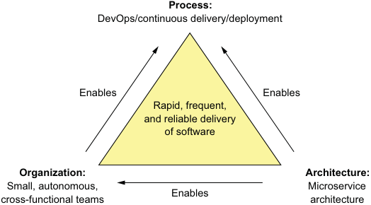


**----- Start of picture text -----**<br>
Process:<br>DevOps/continuous delivery/deployment<br>Enables Enables<br>Rapid, frequent,<br>and reliable delivery<br>of software<br>Organization: Architecture:<br>Small, autonomous, Microservice<br>Enables<br>cross-functional teams architecture<br>**----- End of picture text -----**<br>


The rapid, frequent, and reliable delivery of large, complex applications requires a combination of DevOps, which includes continuous delivery/deployment, small, autonomous teams, and the microservice architecture. 


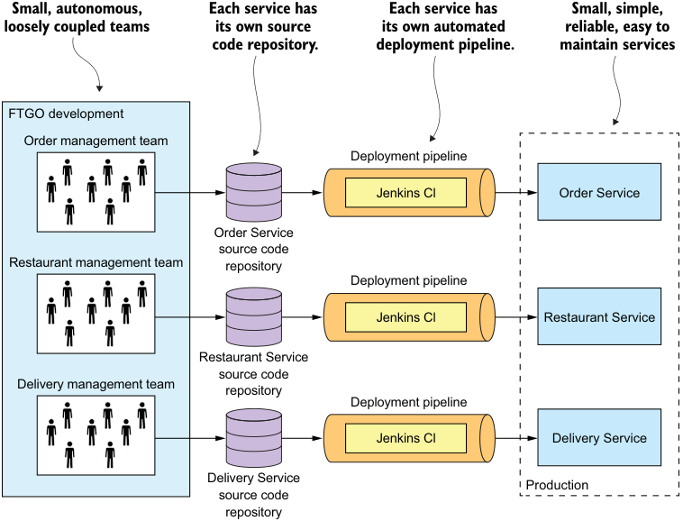


**----- Start of picture text -----**<br>
Small, autonomous, Each service has Each service has Small, simple,<br>loosely coupled teams its own source its own automated reliable, easy to<br>code repository. deployment pipeline. maintain services<br>FTGO development<br>Order management team<br>Deployment pipeline<br>Jenkins Cl Order Service<br>Order Service<br>source code<br>Restaurant management team repository<br>Deployment pipeline<br>Jenkins Cl Restaurant Service<br>Restaurant Service<br>source code<br>Delivery management team<br>repository<br>Deployment pipeline<br>Jenkins Cl Delivery Service<br>Delivery Service Production<br>source code<br>repository<br>**----- End of picture text -----**<br>


The microservice architecture structures an application as a set of loosely coupled services that are organized around business capabilities. Each team develops, tests, and deploys their services independently. 


SOFTWARE DEVELOPMENT 

# Microservices Patterns 

# Chris Richardson 

uccessfully developing microservices-based applications requires mastering a new set of architectural insights and S practices. In this unique book, microservice architecture pioneer and Java Champion Chris Richardson collects, catalogues, and explains 44 patterns that solve problems such as service decomposition, transaction management, querying, and inter-service communication. 

Microservices Patterns teaches you how to develop and deploy production-quality microservices-based applications. This invaluable set of design patterns builds on decades of distributed system experience, adding new patterns for writing services and composing them into systems that scale and perform reliably under real-world conditions. More than just a patterns catalog, this practical guide offers experience-driven advice to help you design, implement, test, and deploy your microservices-based application. 

# What’s Inside 

- How (and why!) to use the microservice architecture 

- Service decomposition strategies 

- Transaction management and querying patterns 

- Effective testing strategies 

- Deployment patterns including containers and serverless 

Written for enterprise developers familiar with standard enterprise application architecture. Examples are in Java. 


**----- Start of picture text -----**<br>
See first page<br>**----- End of picture text -----**<br>


“A comprehensive overview of the challenges teams face when moving to microservices, with industry-tested solutions to these problems.” —Tim Moore, Lightbend 

“Pragmatic treatment of an important new architectural landscape.” —Simeon Leyzerzon Excelsior Software 

“A solid compendium of information that will quicken your migration to this modern cloud-based architecture.” 

—John Guthrie, Dell/EMC 

“How to understand the microservices approach, and how to use it in real life.” —Potito Coluccelli Bizmatica Econocom 

Chris Richardson is a Java Champion, a JavaOne rock star, author of Manning’s _POJOs in Action_ , and the creator of the original CloudFoundry.com. 

To download their free eBook in PDF, ePub, and Kindle formats, owners of this book should visit manning.com/books/microservices-patterns 


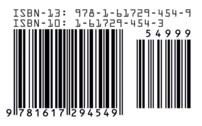


**M A N N I N G** 

$49.99 / Can $65.99  [INCLUDING eBOOK] 

