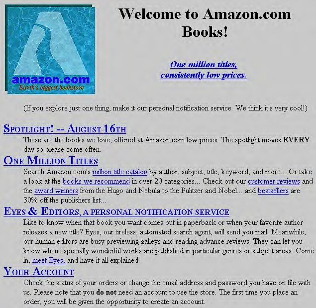

# Part III: System Design Use Cases

## PART III System Design Use Cases

_Ninety percent of the functionality delivered now is better than 100% of it delivered never._ —Brian Kernighan and P. J. Plauger

Part III of this book covers some common system design use cases and examples, which we will work through together to build and scale on top of AWS cloud computing services. For all the use cases, we’ll start with figuring out the system requirements, then move to a deep dive into system components, and finally close the chapter with a deployment view on AWS with Day 0 architecture (minimum viable product for a startup with, say, one thousand customers) and Day N architecture (scaling to millions of customers). Along the way, we’ll discuss the bottlenecks that might occur in design, best practices for designing large-scale systems, and comparisons of similar AWS services.

We recommend following the Make It Work, Make It Right, Make It Fast principle, and all the chapters in Part III follow this philosophy. It’s good to be optimistic that one day our system will serve one billion active users, but you don’t have to build the system from day one to support this scale. The goal of huge scale should never hold you back from launching the product—just make sure the system is extensible enough so that if there is a need in the future, it can be evolved as new users are onboarded and new features are introduced. For example, the following _amazon.com_ website screenshot shows the initial launch of the website—there was no point back then in thinking of how to make it work for a billion customers.

Other reasons for redesigning any system could be cost and operational maintenance, such as when Uber started with Amazon DynamoDB to build a ledger store but later moved to its custom-built storage solution, Docstore. The same principle applies

while we figure out components in any system: the goal should always be to get the system out in the hands of the public and gather feedback. There is no win in overoptimizing the system if we never reach the goal of solving the customers’ problems and finally generating revenue from it; after all, everyone is in business to earn money from the designed system or help other people to do so (as with open source projects).

Every chapter in Part III will follow this general outline:

1. Introduction 1.

a. Background a.

b. Business use case b.

2. System requirements 2.

a. Functional and nonfunctional requirements a.

b. System scale b.

3. Starting with the design 3.

a. Concepts and principles a.

b. System components b.

c. A rough system design c.

4. Launching the system on AWS 4.

a. Day 0 architecture a.

b. Scaling to millions and beyond b.

c. Day N architecture c.

5. Conclusion 5.

By the end of Part III, you will:

- Understand the business use case for each system-design problem and how to ask • the right questions to evaluate the requirements

- Know how to outline the functional and nonfunctional requirements for the use • case and how to estimate the scale requirements for storage, throughput, and latency, which percolate to capacity and cost estimations

- Know how to build the solution with the first principles using system-design • basics and how to handle the edge cases and nuances around the design

- Deploy initial solutions on AWS with Day 0 architecture for a minimum viable • product and evolve it into a most valuable product

- Scale the architecture to millions of users for Day 1 and beyond on AWS, making • it secure, high-performing, resilient, and efficient

We’ve chosen eight use cases to explore a wide range of problem statements in the industry:

- Imagine a tool that takes long web addresses and turns them into short ones. • Chapter 14 will take you into the world of URL shorteners. We’ll learn why they’re important, what they need to do, and how to build them using AWS. We’ll start with a simple setup for a startup and then see how to make it work for millions of users.

- Chapter 15 is all about web crawlers and search engines like Google and Bing. • We’ll explore how these systems work, what they need to do, and how to create them using AWS. We’ll start small and then figure out how to handle a massive amount of data.

- Ever wonder how social networks like Facebook connect people from all over • the world? Chapter 16 will cover how to design a social network like Facebook or Instagram and create a newsfeed system to connect people from all over the

world. We’ll cover how to make sure people can share and see updates and how to build it all using AWS.

- Online games are a blast, and real-time leaderboards are an important part of • these games. Chapter 17 will show you how to design a system for tracking online game scores and ranking players. We’ll use AWS to make sure the leaderboards can handle lots of players and updates.

- Planning a vacation and booking the perfect place to stay can feel thrilling, • but have you ever thought about the complex system behind the scenes that makes it all work? Chapter 18 will delve into the architecture of an online hotel reservation system, addressing complex requirements like booking conflicts and transaction handling. We’ll break down the components and deploy a scalable solution on the AWS cloud.

- Chapter 19 is about designing a chat application that lets people send messages • in real time. We’ll see how AWS can help us create a seamless, responsive chat experience.

- Relaxing with Netflix is a favorite pastime for many, and Chapter 20 will • teach you how to design a system that processes and streams videos smoothly. We’ll learn how to onboard video to the system and discover how the videos are streamed smoothly to a variety of devices all over the world without interruptions.

- Chapter 21 looks into designing a system for buying and selling stocks: a stock‐• broker application. You’ll learn how to create a reliable, efficient stockbroker system and deploy it on AWS.

By the end of the book, you’ll have a clear understanding of how to tackle different real-world challenges using AWS cloud computing services. You’ll know how to design systems that are efficient, reliable, and ready to handle millions of users. So let’s dive in and start designing some amazing systems!

