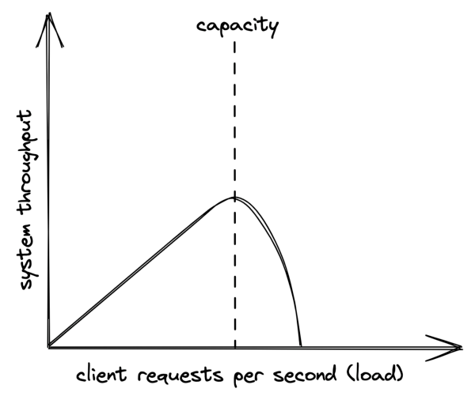
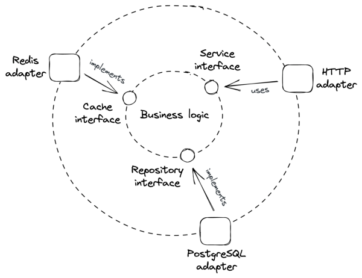

# **Chapter 1** 

# **Introduction** 

_“A distributed system is one in which the failure of a computer you didn’t even know existed can render your own computer unusable.”_ 

– Leslie Lamport 

Loosely speaking, a distributed system is a group of nodes that cooperate by exchanging messages over communication links to achieve some task. A node can generically refer to a physical machine, like a phone, or a software process, like a browser. 

Why do we bother building distributed systems in the first place? 

Some applications are inherently distributed. For example, the web is a distributed system you are very familiar with. You access it with a browser, which runs on your phone, tablet, desktop, or Xbox. Together with other billions of devices worldwide, it forms a distributed system. 

Another reason for building distributed systems is that some applications require high availability and need to be resilient to singlenode failures. For example, Dropbox replicates your data across multiple nodes so that the loss of a single one doesn’t cause your data to be lost. 

Some applications need to tackle workloads that are just too big to fit on a single node, no matter how powerful. For example, Google receives tens of thousands of search requests per second from all over the globe. There is no way a single node could handle that. 

And finally, some applications have performance requirements that would be physically impossible to achieve with a single node. Netflix can seamlessly stream movies to your TV at high resolution because it has a data center close to you. 

This book tackles the fundamental challenges that need to be solved to design, build, and operate distributed systems. 

# **1.1 Communication** 

The first challenge derives from the need for nodes to communicate with each other over the network. For example, when your browser wants to load a website, it resolves the server’s IP address from the URL and sends an HTTP request to it. In turn, the server returns a response with the page’s content. 

How are the request and response messages represented on the wire? What happens when there is a temporary network outage, or some faulty network switch flips a few bits in the messages? How does the server guarantee that no intermediary can snoop on the communication? Although it would be convenient to assume that some networking library is going to abstract all communication concerns away, in practice, it’s not that simple because abstractions leak[1] , and you need to understand how the network stack works when that happens. 

> 1“The Law of Leaky Abstractions,” https://www.joelonsoftware.com/2002/ 11/11/the-law-of-leaky-abstractions/ 

# **1.2 Coordination** 

Another hard challenge of building distributed systems is that some form of coordination is required to make individual nodes work in unison towards a shared objective. This is particularly challenging to do in the presence of failures. The “two generals” problem is a famous thought experiment that showcases this. 

Suppose two generals (nodes), each commanding their own army, need to agree on a time to jointly attack a city. There is some distance between the armies (network), and the only way to communicate is via messengers, who can be captured by the enemy (network failure). Under these assumptions, is there a way for the generals to agree on a time? 

Well, general 1 could send a message with a proposed time to general 2. But since the messenger could be captured, general 1 wouldn’t know whether the message was actually delivered. You could argue that general 2 could send a messenger with a response to confirm it received the original message. However, just like before, general 2 wouldn’t know whether the response was actually delivered and another confirmation would be required. As it turns out, no matter how many rounds of confirmation are made, neither general can be certain that the other army will attack the city at the same time. As you can see, this problem is much harder to solve than it originally appeared. 

Because coordination is such a key topic, the second part of the book is dedicated to understanding the fundamental distributed algorithms used to implement it. 

# **1.3 Scalability** 

The performance of an application represents how efficiently it can handle _load_ . Intuitively, load is anything that consumes the system’s resources such as CPU, memory, and network bandwidth. Since the nature of load depends on the application’s use cases and architecture, there are different ways to measure it. For example, 

the number of concurrent users or the ratio of writes to reads are different forms of load. 

For the type of applications discussed in this book, performance is generally measured in terms of throughput and response time. _Throughput_ is the number of requests processed per second by the application, while _response time_ is the time elapsed in seconds between sending a request to the application and receiving a response. 

As load increases, the application will eventually reach its _capacity_ , i.e., the maximum load it can withstand, when a resource is exhausted. The performance either plateaus or worsens at that point, as shown in Figure 1.1. If the load on the system continues to grow, it will eventually hit a point where most operations fail or time out. 

Figure 1.1: The system throughput on the y axis is the subset of client requests (x axis) that can be handled without errors and with low response times, also referred to as its goodput. 

The capacity of a distributed system depends on its architecture, its implementation, and an intricate web of physical limitations like the nodes’ memory size and clock cycle and the bandwidth and latency of network links. For an application to be scalable, a load increase should not degrade the application’s performance. This requires increasing the capacity of the application at will. 

A quick and easy way is to buy more expensive hardware with better performance, which is also referred to as _scaling up_ . Unfortunately, this approach is bound to hit a brick wall sooner or later when such hardware just doesn’t exist. The alternative is _scaling out_ by adding more commodity machines to the system and having them work together. 

Although procuring additional machines at will may have been daunting a few decades ago, the rise of cloud providers has made that trivial. In 2006 Amazon launched Amazon Web Services (AWS), which included the ability to rent virtual machines with its Elastic Compute Cloud (EC2[2] ) service. Since then, the number of cloud providers and cloud services has only grown, democratizing the ability to create scalable applications. 

In Part III of this book, we will explore the core architectural patterns and building blocks of scalable cloud-native applications. 

# **1.4 Resiliency** 

A distributed system is resilient when it can continue to do its job even when failures happen. And at scale, anything that can go wrong will go wrong. Every component has a probability of failing — nodes can crash, network links can be severed, etc. No matter how small that probability is, the more components there are and the more operations the system performs, the higher the number of failures will be. And it gets worse because a failure of one component can increase the probability that another one will fail if the components are not well isolated. 

2“Amazon EC2,” https://aws.amazon.com/ec2/ 

Failures that are left unchecked can impact the system’s _availability_[3] , i.e., the percentage of time the system is available for use. It’s a ratio defined as the amount of time the application can serve requests ( _uptime_ ) divided by the total time measured ( _uptime_ plus _downtime_ , i.e., the time the application can’t serve requests). 

Availability is often described with nines, a shorthand way of expressing percentages of availability. Three nines are typically considered acceptable by users, and anything above four is considered to be highly available. 

|Availability %|Downtime per day|
|---|---|
|90% (“one nine”)|2.40 hours|
|99% (“two nines”)|14.40 minutes|
|99.9% (“three nines”)|1.44 minutes|
|99.99% (“four nines”)|8.64 seconds|
|99.999% (“fve nines”)|864 milliseconds|

If the system isn’t resilient to failures, its availability will inevitably drop. Because of that, a distributed system needs to embrace failures and be prepared to withstand them using techniques such as redundancy, fault isolation, and self-healing mechanisms, which we will discuss in Part IV, _Resiliency_ . 

# **1.5 Maintainability** 

It’s a well-known fact that the majority of the cost of software is spent after its initial development in maintenance activities, such as fixing bugs, adding new features, and operating it. Thus, we should aspire to make our systems easy to modify, extend and operate so that they are easy to maintain. 

Any change is a potential incident waiting to happen. Good testing — in the form of unit, integration, and end-to-end tests — is a 

> 3“AWS Well-Architected Framework, Availability,” https://docs.aws.amazon. com/wellarchitected/latest/reliability-pillar/availability.html 

7 minimum requirement to modify or extend a system without worrying it will break. And once a change has been merged into the codebase, it needs to be released to production safely without affecting the system’s availability. 

Also, operators need to monitor the system’s health, investigate degradations and restore the service when it can’t self-heal. This requires altering the system’s behavior without code changes, e.g., toggling a feature flag or scaling out a service with a configuration change. 

Historically, developers, testers, and operators were part of different teams, but the rise of microservices and DevOps has changed that. Nowadays, the same team that designs and implements a system is also responsible for testing and operating it. That’s a good thing since there is no better way to discover where a system falls short than being on call for it. Part V will explore best practices for testing and operating distributed systems. 

# **1.6 Anatomy of a distributed system** 

Distributed systems come in all shapes and sizes. In this book, we are mainly concerned with backend applications that run on commodity machines and implement some kind of business service. So you could say a distributed system is a group of machines that communicate over network links. However, from a run-time point of view, a distributed system is a group of software processes that communicate via _inter-process communication_ (IPC) mechanisms like HTTP. And from an implementation perspective, a distributed system is a group of loosely-coupled components (services) that communicate via APIs. All these are valid and useful architectural points of view. In the rest of the book, we will switch between them depending on which one is more appropriate to discuss a particular topic. 

A _service_ implements one specific part of the overall system’s capabilities. At the core of a service sits the business logic, which exposes interfaces to communicate with the outside world. Some 

8 interfaces define the operations that the service offers to its users. In contrast, others define the operations that the service can invoke on other services, like data stores, message brokers, etc. 

Since processes can’t call each other’s interfaces directly, _adapters_ are needed to connect IPC mechanisms to service interfaces. An inbound adapter is part of the service’s _Application Programming Interface_ (API); it handles the requests received from an IPC mechanism, like HTTP, by invoking operations defined in the service interfaces. In contrast, outbound adapters grant the business logic access to external services, like data stores. This architectural style is also referred to as the ports and adapters architecture[4] . The idea is that the business logic doesn’t depend on technical details; instead, the technical details depend on the business logic (dependency inversion principle[5] ). This concept is illustrated in Figure 1.2. 

Going forward, we will refer to a process running a service as a _server_ , and a process sending requests to a server as a _client_ . Sometimes, a process will be both a client and a server. For simplicity, we will assume that an individual instance of a service runs entirely within a single server process. Similarly, we will also assume that a process has a single thread. These assumptions will allow us to neglect some implementation details that would only complicate the discussion without adding much value. 

> 4“Ports And Adapters Architecture,” http://wiki.c2.com/?PortsAndAdapter sArchitecture 

> 5“Dependency inversion principle,” https://en.wikipedia.org/wiki/Depend ency_inversion_principle 

Figure 1.2: In this example, the business logic uses the repository interface, implemented by the PostgreSQL adapter, to access the database. In contrast, the HTTP adapter handles incoming requests by calling operations defined in the service interface. 

