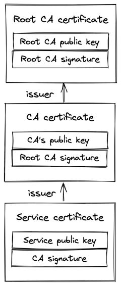

# **Chapter 3** 

# **Secure links** 

We now know how to reliably send bytes from one process to another over the network. The problem is that these bytes are sent in the clear, and a middleman could intercept the communication. To protect against that, we can use the _Transport Layer Security_[1] (TLS) protocol. TLS runs on top of TCP and encrypts the communication channel so that application layer protocols, like HTTP, can leverage it to communicate securely. In a nutshell, TLS provides _encryption_ , _authentication_ , and _integrity_ . 

# **3.1 Encryption** 

Encryption guarantees that the data transmitted between a client and a server is obfuscated and can only be read by the communicating processes. 

When the TLS connection is first opened, the client and the server negotiate a shared encryption secret using _asymmetric encryption_ . First, each party generates a key pair consisting of a private and public key. The processes can then create a shared secret by exchanging their public keys. This is possible thanks to some mathematical properties[2] of the key pairs. The beauty of this approach is that the shared secret is never communicated over the wire.

> 1“RFC 8446: The Transport Layer Security (TLS) Protocol Version 1.3,” https: //datatracker.ietf.org/doc/html/rfc8446

Although asymmetric encryption is slow and expensive, it’s only used to create the shared encryption key. After that, _symmetric encryption_ is used, which is fast and cheap. The shared key is periodically renegotiated to minimize the amount of data that can be deciphered if the shared key is broken. 

Encrypting in-flight data has a CPU penalty, but it’s negligible since modern processors have dedicated cryptographic instructions. Therefore, TLS should be used for all communications, even those not going through the public internet. 

# **3.2 Authentication** 

Although we have a way to obfuscate data transmitted across the wire, the client still needs to authenticate the server to verify it’s who it claims to be. Similarly, the server might want to authenticate the identity of the client. 

TLS implements authentication using digital signatures based on asymmetric cryptography. The server generates a key pair with a private and a public key and shares its public key with the client. When the server sends a message to the client, it signs it with its private key. The client uses the server’s public key to verify that the digital signature was actually signed with the private key. This is possible thanks to mathematical properties[3] of the key pair. 

The problem with this approach is that the client has no idea whether the public key shared by the server is authentic. Hence, the protocol uses certificates to prove the ownership of a public key. A certificate includes information about the owning entity, expiration date, public key, and a digital signature of the thirdparty entity that issued the certificate. The certificate’s issuing 

> 2“A (Relatively Easy To Understand) Primer on Elliptic Curve Cryptography,” https://blog.cloudflare.com/a-relatively-easy-to-understand-primer-on-ellipticcurve-cryptography/ 

> 3“Digital signature,” https://en.wikipedia.org/wiki/Digital_signature

entity is called a _certificate authority_ (CA), which is also represented with a certificate. This creates a chain of certificates that ends with a certificate issued by a root CA, as shown in Figure 3.1, which self-signs its certificate. 

For a TLS certificate to be trusted by a device, the certificate, or one of its ancestors, must be present in the trusted store of the client. Trusted root CAs, such as Let’s Encrypt[4] , are typically included in the client’s trusted store by default by the operating system vendor. 

Figure 3.1: A certificate chain ends with a self-signed certificate issued by a root CA. 

When a TLS connection is opened, the server sends the full certificate chain to the client, starting with the server’s certificate andending with the root CA. The client verifies the server’s certificate by scanning the certificate chain until it finds a certificate that it trusts. Then, the certificates are verified in reverse order from that point in the chain. The verification checks several things, like the certificate’s expiration date and whether the digital signature was actually signed by the issuing CA. If the verification reaches the last certificate in the path (the server’s own certificate) without errors, the path is verified, and the server is authenticated.

> 4“Let’s Encrypt: A nonprofit Certificate Authority,” https://letsencrypt.org/

One of the most common mistakes when using TLS is letting a certificate expire. When that happens, the client won’t be able to verify the server’s identity, and opening a connection to the remote process will fail. This can bring an entire application down as clients can no longer connect with it. For this reason, automation to monitor and auto-renew certificates close to expiration is well worth the investment. 

# **3.3 Integrity** 

Even if the data is obfuscated, a middleman could still tamper with it; for example, random bits within the messages could be swapped. To protect against tampering, TLS verifies the integrity of the data by calculating a message digest. A secure hash function is used to create a message authentication code[5] (HMAC). When a process receives a message, it recomputes the digest of the message and checks whether it matches the digest included in the message. If not, then the message has either been corrupted during transmission or has been tampered with. In this case, the message is dropped. 

The TLS HMAC protects against data corruption as well, not just tampering. You might be wondering how data can be corrupted if TCP is supposed to guarantee its integrity. While TCP does use a checksum to protect against data corruption, it’s not 100% reliable[6] :tatracker.ietf.org/doc/html/rfc2104

> 5“RFC 2104: HMAC: Keyed-Hashing for Message Authentication,” https://da

> 6“When the CRC and TCP checksum disagree,” https://dl.acm.org/doi/10.11 45/347057.347561 it fails to detect errors for roughly 1 in 16 million to 10 billion packets. With packets of 1 KB, this is expected to happen once per 16 GB to 10 TB transmitted. 

# **3.4 Handshake** 

When a new TLS connection is established, a handshake between the client and server occurs during which: 

1. The parties agree on the cipher suite to use. A cipher suite specifies the different algorithms that the client and the server intend to use to create a secure channel, like the: 

   - key exchange algorithm used to generate shared secrets; 

   - signature algorithm used to sign certificates; 

   - symmetric encryption algorithm used to encrypt the application data; 

   - HMAC algorithm used to guarantee the integrity and authenticity of the application data. 

2. The parties use the key exchange algorithm to create a shared secret. The symmetric encryption algorithm uses the shared secret to encrypt communication on the secure channel going forward. 

3. The client verifies the certificate provided by the server. The verification process confirms that the server is who it says it is. If the verification is successful, the client can start sending encrypted application data to the server. The server can optionally also verify the client certificate if one is available. 

These operations don’t necessarily happen in this order, as modern implementations use several optimizations to reduce round trips. For example, the handshake typically requires 2 round trips with TLS 1.2 and just one with TLS 1.3. The bottom line is that creating a new connection is not free: yet another reason to put your servers geographically closer to the clients and reuse connections when possible. 

