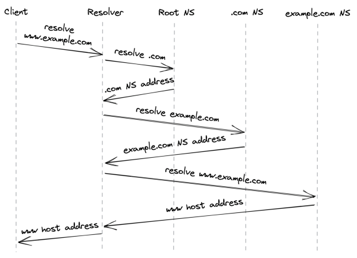

# **Chapter 4** 

# **Discovery** 

So far, we have explored how to create a reliable and secure channel between two processes running on different machines. However, to create a new connection with a remote process, we must first discover its IP address somehow. The most common way of doing that is via the phone book of the internet: the _Domain Name System_[1] (DNS) — a distributed, hierarchical, and eventually consistent key-value store. 

In this chapter, we will look at how DNS resolution[2] works in a browser, but the process is similar for other types of clients. When you enter a URL in your browser, the first step is to resolve the hostname’s IP address, which is then used to open a new TLS connection. For example, let’s take a look at how the DNS resolution works when you type _www.example.com_ into your browser (see Figure 4.1). 

1. The browser checks its local cache to see whether it has resolved the hostname before. If so, it returns the cached IP address; otherwise, it routes the request to a DNS resolver,tatracker.ietf.org/doc/html/rfc1035

> 1“RFC 1035: Domain Names - Implementation and Specification,” https://da

2“A deep dive into DNS,” https://www.youtube.com/watch?v=drWd9HIhJ dU a server typically hosted by your Internet Service Provider (ISP). 

2. The resolver is responsible for iteratively resolving the hostname for its clients. The reason why it’s iterative will become obvious in a moment. The resolver first checks its local cache for a cached entry, and if one is found, it’s returned to the client. If not, the query is sent to a root name server (root NS). 

3. The root name server maps the _top-level domain_ (TLD) of the request, i.e., _.com_ , to the address of the name server responsible for it. 

4. The resolver sends a resolution request for _example.com_ to the TLD name server. 

5. The TLD name server maps the _example.com_ domain name to the address of the _authoritative name server_ responsible for the domain. 

6. Finally, the resolver queries the authoritative name server for _www.example.com_ , which returns the IP address of the _www_ hostname. 

If the query included a subdomain of _example.com_ , like _news.example.com_ , the authoritative name server would have returned the address of the name server responsible for the subdomain, and an additional request would be required. 

The original DNS protocol sent plain-text messages primarily over UDP for efficiency reasons. However, because this allows anyone monitoring the transmission to snoop, the industry has mostly moved to secure alternatives, such as DNS on top of TLS[3] . 

The resolution process involves several round trips in the worst case, but its beauty is that the address of a root name server is all that’s needed to resolve a hostname. That said, the resolution would be slow if every request had to go through several name 

> 3“RFC 7858: Specification for DNS over Transport Layer Security (TLS),” https: //en.wikipedia.org/wiki/DNS_over_TLS 

Figure 4.1: DNS resolution process server lookups. Not only that, but think of the scale required for the name servers to handle the global resolution load. So caching is used to speed up the resolution process since the mapping of domain names to IP addresses doesn’t change often — the browser, operating system, and DNS resolver all use caches internally. 

How do these caches know when to expire a record? Every DNS record has a _time to live_ (TTL) that informs the cache how long the entry is valid for. But there is no guarantee that clients play nicely and enforce the TTL. So don’t be surprised when you change a DNS entry and find out that a small number of clients are still trying to connect to the old address long after the TTL has expired. 

Setting a TTL requires making a tradeoff. If you use a long TTL, many clients won’t see a change for a long time. But if you set it too short, you increase the load on the name servers and the average response time of requests because clients will have to resolve the hostname more often. 

If your name server becomes unavailable for any reason, then the smaller the record’s TTL is, the higher the number of clients impacted will be. DNS can easily become a single point of failure — if your DNS name server is down and clients can’t find the IP address of your application, they won’t be able to connect it. This can lead to massive outages[4] . 

This brings us to an interesting observation. DNS could be a lot more robust to failures if DNS caches would serve stale entries when they can’t reach a name server, rather than treating TTLs as time bombs. Since entries rarely change, serving a stale entry is arguably a lot more robust than not serving any entry at all. The principle that a system should continue to function even when a dependency is impaired is also referred to as “static stability”; we will talk more about it in the resiliency part of the book. 

4“DDoS attack on Dyn,” https://en.wikipedia.org/wiki/2016_Dyn_cyberatta ck 

