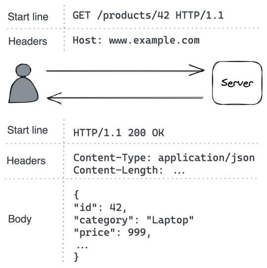

# **Chapter 5** 

# **APIs** 

Now that we know how a client can discover the IP address of a server and create a reliable and secure communication link with it, we want the client to invoke operations offered by the server. To that end, the server uses an adapter — which defines its application programming interface (API) — to translate messages received from the communication link to interface calls implemented by its business logic (see Figure 1.2). 

The communication style between a client and a server can be _direct_ or _indirect_ , depending on whether the client communicates directly with the server or indirectly through a broker. Direct communication requires that both processes are up and running for the communication to succeed. However, sometimes this guarantee is either not needed or very hard to achieve, in which case indirect communication is a better fit. An example of indirect communication is _messaging_ . In this model, the sender and the receiver don’t communicate directly, but they exchange messages through a message channel (the broker). The sender sends messages to the channel, and on the other side, the receiver reads messages from it. Later in chapter 23, we will see how message channels are implemented and how to best use them. 

In this chapter, we will focus our attention on a direct communi36 cation style called _request-response_ , in which a client sends a _request message_ to the server, and the server replies with a _response message_ . This is similar to a function call but across process boundaries and over the network. 

The request and response messages contain data that is serialized in a language-agnostic format. The choice of format determines a message’s serialization and deserialization speed, whether it’s human-readable, and how hard it is to evolve it over time. A _textual_ format like JSON[1] is self-describing and human-readable, at the expense of increased verbosity and parsing overhead. On the other hand, a binary format like Protocol Buffers[2] is leaner and more performant than a textual one at the expense of human readability. 

When a client sends a request to a server, it can block and wait for the response to arrive, making the communication _synchronous_ . Alternatively, it can ask the outbound adapter to invoke a callback when it receives the response, making the communication _asynchronous_ . 

Synchronous communication is inefficient, as it blocks threads that could be used to do something else. Some languages, like JavaScript, C#, and Go, can completely hide callbacks through language primitives such as async/await[3] . These primitives make writing asynchronous code as straightforward as writing synchronous code. 

Commonly used IPC technologies for request-response interactions are HTTP and gRPC[4] . Typically, internal APIs used for server-to-server communications within an organization are implemented with a high-performance RPC framework like gRPC. In contrast, external APIs available to the public tend to be basedon HTTP, since web browsers can easily make HTTP requests via JavaScript code.

> 1“ECMA-404: The JSON data interchange syntax,” https://www.ecma-intern ational.org/publications-and-standards/standards/ecma-404/ 

> 2“Protocol Buffers: a language-neutral, platform-neutral extensible mechanism for serializing structured data,” https://developers.google.com/protocol-buffers 3“Asynchronous programming with async and await,” https://docs.microsoft .com/en-us/dotnet/csharp/programming-guide/concepts/async/ 

> 4“gRPC: A high performance, open source universal RPC framework,” https: //grpc.io/

A popular set of design principles for designing elegant and scalable HTTP APIs is representational state transfer (REST[5] ), and an API based on these principles is said to be RESTful. For example, these principles include that: 

- requests are stateless, and therefore each request contains all the necessary information required to process it; 

- responses are implicitly or explicitly labeled as cacheable or non-cacheable. If a response is cacheable, the client can reuse the response for a later, equivalent request. 

Given the ubiquity of RESTful HTTP APIs, we will walk through the process of creating an HTTP API in the rest of the chapter. 

# **5.1 HTTP** 

_HTTP_[6] is a request-response protocol used to encode and transport information between a client and a server. In an _HTTP transaction_ , the client sends a _request message_ to the server’s API endpoint, and the server replies back with a _response message_ , as shown in Figure 5.1. 

In HTTP 1.1, a message is a textual block of data that contains a start line, a set of headers, and an optional body: 

- In a request message, the _start line_ indicates what the request is for, and in a response message, it indicates whether the request was successful or not. 

- The _headers_ are key-value pairs with metadata that describes the message. 

- The message _body_ is a container for data. 

HTTP is a stateless protocol, which means that everything needed by a server to process a request needs to be specified within the 

> 5“Representational State Transfer,” https://www.ics.uci.edu/~fielding/pubs /dissertation/rest_arch_style.htm 

> 6“Hypertext Transfer Protocol,” https://en.wikipedia.org/wiki/Hypertext_T ransfer_Protocol 



Figure 5.1: An example HTTP transaction between a browser and a web server request itself, without context from previous requests. HTTP uses TCP for the reliability guarantees discussed in chapter 2. When it runs on top of TLS, it’s also referred to as HTTPS. 

HTTP 1.1 keeps a connection to a server open by default to avoid needing to create a new one for the next transaction. However, a new request can’t be issued until the response to the previous one has been received (aka _head-of-line blocking_ or HOL blocking); in other words, the transactions have to be serialized. For example, a browser that needs to fetch several images to render an HTML page has to download them one at a time, which can be very inefAlthough HTTP 1.1 technically allows some type of requests to be pipelined[7] , it still suffers from HOL blocking as a single slow response will block all the responses after it. With HTTP 1.1, the typical way to improve the throughput of outgoing requests is by creating multiple connections. However, this comes with a price because connections consume resources like memory and sockets. 

HTTP 2[8] was designed from the ground up to address the main limitations of HTTP 1.1. It uses a binary protocol rather than a textual one, allowing it to multiplex multiple concurrent requestresponse transactions (streams) on the same connection. In early 2020 about half of the most-visited websites on the internet were using the new HTTP 2 standard. 

HTTP 3[9] is the latest iteration of the HTTP standard, which is based on UDP and implements its own transport protocol to address some of TCP’s shortcomings[10] . For example, with HTTP 2, a packet loss over the TCP connection blocks all streams (HOL), but with HTTP 3 a packet loss interrupts only one stream, not all of them. 

This book uses the HTTP 1.1 standard for illustration purposes since its plain text format is easier to display. Moreover, HTTP 1.1 is still widely used. 

# **5.2 Resources** 

Suppose we would like to implement a service to manage the product catalog of an e-commerce application. The service must allow customers to browse the catalog and administrators to create, update, or delete products. Although that sounds simple, in order to expose this service via HTTP, we first need to understand how to model APIs with HTTP.is next Generation HTTP. Is it QUIC enough?,” https://www.yout ube.com/watch?v=rlN4F1oyaRM

> 7“HTTP pipelining,” https://en.wikipedia.org/wiki/HTTP_pipelining 

> 8“RFC 7540: Hypertext Transfer Protocol Version 2 (HTTP/2),” https://tools.ie tf.org/html/rfc7540 

> 9“HTTP/3

> 10“Comparing HTTP/3

An HTTP server hosts resources, where a _resource_ can be a physical or abstract entity, like a document, an image, or a collection of other resources. A URL identifies a resource by describing its location on the server. 

In our catalog service, the collection of products is a type of resource, which could be accessed with a URL like _https://www.exam ple.com/products?sort=price_ , where: 

- _https_ is the protocol; 

- _www.example.com_ is the hostname; 

- _products_ is the name of the resource; 

- _?sort=price_ is the query string, which contains additional parameters that affect how the service handles the request; in this case, the sort order of the list of products returned in the response. 

The URL without the query string is also referred to as the API’s _/products_ endpoint. 

URLs can also model relationships between resources. For example, since a product is a resource that belongs to the collection of products, the product with the unique identifier 42 could have the following relative URL: _/products/42_ . And if the product also has a list of reviews associated with it, we could append its resource name to the product’s URL, i.e., _/products/42/reviews_ . However, the API becomes more complex as the nesting of resources increases, so it’s a balancing act. 

Naming resources is only one part of the equation; we also have to serialize the resources on the wire when they are transmitted in the body of request and response messages. When a client sends a request to get a resource, it adds specific headers to the message to describe the preferred representation for the resource. The server uses these headers to pick the most appropriate representation[11] for the response. Generally, in HTTP APIs, JSON is used to represent non-binary resources. For example, this is how the representation of _/products/42_ might look: 

> 11“HTTP Content negotiation,” https://developer.mozilla.org/en-US/docs/ Web/HTTP/Content_negotiation 

```json
{ 
  "id": 42, 
  "category": "Laptop", 
  "price": 999 
}
``` 

# **5.3 Request methods** 

HTTP requests can create, read, update, and delete (CRUD) resources using request _methods_ . When a client makes a request to a server for a particular resource, it specifies which method to use. You can think of a request method as the verb or action to use on a resource. 

The most commonly used methods are _POST_ , _GET_ , _PUT_ , and _DELETE_ . For example, the API of our catalog service could be 

- _POST /products_ — Create a new product and return the URL of the new resource. 

- _GET /products_ — Retrieve a list of products. The query string can be used to filter, paginate, and sort the collection. 

- _GET /products/42_ — Retrieve product 42. 

- _PUT /products/42_ — Update product 42. 

- _DELETE /products/42_ — Delete product 42. 

Request methods can be categorized based on whether they are safe and whether they are idempotent. A _safe_ method should not have any visible side effects and can safely be cached. An _idempotent_ method can be executed multiple times, and the end result should be the same as if it was executed just a single time. Idempotency is a crucial aspect of APIs, and we will talk more about it later in section 5.7. 

|Method|Safe|Idempotent|
|---|---|---|
|POST|No|No|
|GET|Yes|Yes|
|PUT|No|Yes|

|Method|Safe|Idempotent|
|---|---|---|
|DELETE|No|Yes|

# **5.4 Response status codes** 

After the server has received a request, it needs to process it and send a response back to the client. The HTTP response contains a _status code_[12] to communicate to the client whether the request succeeded or not. Different status code ranges have different meanings. 

Status codes between 200 and 299 are used to communicate success. For example, _200 (OK)_ means that the request succeeded, and the body of the response contains the requested resource. 

Status codes between 300 and 399 are used for redirection. For example, _301 (Moved Permanently)_ means that the requested resource has been moved to a different URL specified in the response message _Location_ header. 

Status codes between 400 and 499 are reserved for client errors. A request that fails with a client error will usually return the same error if it’s retried since the error is caused by an issue with the client, not the server. Because of that, it shouldn’t be retried. Some common client errors are: 

- _400 (Bad Request)_ — Validating the client-side input has failed. 

- _401 (Unauthorized)_ — The client isn’t authenticated. 

- _403 (Forbidden)_ — The client is authenticated, but it’s not allowed to access the resource. 

- _404 (Not Found)_ — The server couldn’t find the requested resource. 

Status codes between 500 and 599 are reserved for server errors. A request that fails with a server error can be retried as the issue thatcaused it to fail might be temporary. These are some typical server status codes:

> 12“HTTP Status Codes,” https://httpstatuses.com/

- _500 (Internal Server Error)_ — The server encountered an unexpected error that prevented it from handling the request. 

- _502 (Bad Gateway)_ — The server, while acting as a gateway or proxy, received an invalid response from a downstream server it accessed while attempting to handle the request.[13] 

- _503 (Service Unavailable)_ — The server is currently unable to handle the request due to a temporary overload or scheduled maintenance. 

# **5.5 OpenAPI** 

Now that we understand how to model an API with HTTP, we can write an adapter that handles HTTP requests by calling the business logic of the catalog service. For example, suppose the service is defined by the following interface: 

# **interface** CatalogService 

# { 

List<Product> GetProducts(...); Product GetProduct(...); void AddProduct(...); void DeleteProduct(...); void UpdateProduct(...) 

} 

So when the HTTP adapter receives a _GET /products_ request to retrieve the list of all products, it will invoke the _GetProducts(…)_ method and convert the result into an HTTP response. Although this is a simple example, you can see how the adapter connects the IPC mechanism (HTTP) to the business logic. 

We can generate a skeleton of the HTTP adapter by defining the 

> 13In this book, we will sometimes classify service dependencies as upstream or downstream depending on the direction of the dependency relationship. For example, if service A makes requests to service B, then service B is a downstream dependency of A, and A is an upstream dependency of B. Since there is no consensus in the industry for these terms, other texts might use a different convention. 

API of the service with an _interface definition language_ (IDL). An IDL is a language-independent definition of the API that can be used to generate boilerplate code for the server-side adapter and client-side software development kits (SDKs) in your languages of choice. 

The OpenAPI[14] specification, which evolved from the Swagger project, is one of the most popular IDLs for RESTful HTTP APIs. With it, we can formally describe the API in a YAML document, including the available endpoints, supported request methods, and response status codes for each endpoint, and the schema of the resources’ JSON representation. 

For example, this is how part of the _/products_ endpoint of the catalog service’s API could be defined: openapi **:** 3.0.0 info **:** version **:** "1.0.0" title **:** Catalog Service API paths **:** /products **:** get **:** summary **:** List products parameters **: -** in **:** query name **:** sort required **:** false schema **:** type **:** string responses **:** "200" **:** description **:** list of products in catalog content **:** application/json **:** schema **:**type **:** array items **:** $ref **:** "#/components/schemas/ProductItem" "400" **:** description **:** bad input components **:** schemas **:** ProductItem **:** type **:** object required **: -** id **-** name **-** category properties **:** id **:** type **:** number name **:** type **:** string category **:** type **:** string

> 14“OpenAPI Specification,” https://swagger.io/specification/

Although this is a very simple example and we won’t go deeper into OpenAPI, it should give you an idea of its expressiveness. With this definition, we can then run a tool to generate the API’s documentation, boilerplate adapters, and client SDKs. 

# **5.6 Evolution** 

An API starts out as a well-designed interface[15] . Slowly but surely, it will have to change to adapt to new use cases. The last thing we want to do when evolving an API is to introduce a breaking change that requires all clients to be modified at once, some of which we might have no control over. 

There are two types of changes that can break compatibility, oneat the endpoint level and another at the message level. For example, if we were to change the _/products_ endpoint to _/new-products_ , it would obviously break clients that haven’t been updated to support the new endpoint. The same applies when making a previously optional query parameter mandatory.

> 15Or at least it should. 

Changing the schema of request or response messages in a backward-incompatible way can also wreak havoc. For example, changing the type of the _category_ property in the _Product_ schema from string to number is a breaking change that would cause the old deserialization logic to blow up in clients. Similar arguments[16] can be made for messages represented with other serialization formats, like Protocol Buffers. 

REST APIs should be versioned to support breaking changes, e.g., by prefixing a version number in the URLs ( _/v1/products/_ ). However, as a general rule of thumb, APIs should evolve in a backward-compatible way unless there is a very good reason. Although backward-compatible APIs tend not to be particularly elegant, they are practical. 

# **5.7 Idempotency** 

When an API request times out, the client has no idea whether the server actually received the request or not. For example, the server could have processed the request and crashed right before sending a response back to the client. 

An effective way for clients to deal with transient failures such as these is to retry the request one or more times until they get a response back. Some HTTP request methods (e.g., PUT, DELETE) are considered inherently idempotent as the effect of executing multiple identical requests is identical to executing only one request[17] . For example, if the server processes the same PUT request 

> 16“Schema evolution in Avro, Protocol Buffers and Thrift,” https://martin.klepp mann.com/2012/12/05/schema-evolution-in-avro-protocol-buffers-thrift.html 17“Idempotent Methods,” https://datatracker.ietf.org/doc/html/rfc7231#secti on-4.2.2 for the same resource twice in a row, the end effect would be the same as if the PUT request was executed only once. 

But what about requests that are not inherently idempotent? For example, suppose a client issues a POST request to add a new product to the catalog service. If the request times out, the client has no way of knowing whether the request succeeded or not. If the request succeeds, retrying it will create two identical products, which is not what the client intended. 

In order to deal with this case, the client might have to implement some kind of reconciliation logic that checks for duplicate products and removes them when the request is retried. You can see how this introduces a lot of complexity for the client. Instead of pushing this complexity to the client, a better solution would be for the server to create the product only once by making the POST request idempotent, so that no matter how many times that specific request is retried, it will appear as if it only executed once. 

For the server to detect that a request is a duplicate, it needs to be decorated with an idempotency key — a unique identifier (e.g., a UUID). The identifier could be part of a header, like _IdempotencyKey_ in Stripe’s API[18] . For the server to detect duplicates, it needs to remember all the request identifiers it has seen by storing them in a database. When a request comes in, the server checks the database to see if the request ID is already present. If it’s not there, it adds the request identifier to the database and executes the request. Request identifiers don’t have to be stored indefinitely, and they can be purged after some time. 

Now here comes the tricky part. Suppose the server adds the request identifier to the database and crashes before executing the request. In that case, any future retry won’t have any effect because the server will think it has already executed it. So what we really want is for the request to be handled atomically: either the server processes the request successfully and adds the request identifier to the database, or it fails to process it without storing the request 

18“Designing robust and predictable APIs with idempotency,” https://stripe.c om/blog/idempotency 

# 

If the request identifiers and the resources managed by the server are stored in the same database, we can guarantee atomicity with ACID transactions[19] . In other words, we can wrap the product creation and request identifier log within the same database transaction in the POST handler. However, if the handler needs to make external calls to other services to handle the request, the implementation becomes a lot more challenging[20] , since it requires some form of coordination. Later, in chapter 13.2, we will learn how to do just that. 

Now, assuming the server can detect a duplicate request, how should it be handled? In our example, the server could respond to the client with a status code that signals that the product already exists. But then the client would have to deal with this case differently than if it had received a successful response for the first POST request ( _201 Created_ ). So ideally, the server should return the same response that it would have returned for the very first request. 

So far, we have only considered a single client. Now, imagine the following scenario: 

1. Client A sends a request to create a new product. Although the request succeeds, the client doesn’t receive a timely response. 

2. Client B deletes the newly created product. 

3. Client A retries the original creation request. 

How should the server deal with the request in step 3? From client’s A perspective, it would be less surprising[21] to receive the original creation response than some strange error mentioning that the resource created with that specific request identifier has been deleted. When in doubt, it’s helpful to follow the principleers-library/making-retries-safe-with-idempotent-APIs/ of least astonishment.

> 19“Using Atomic Transactions to Power an Idempotent API,” https://brandur. org/http-transactions 

> 20“Implementing Stripe-like Idempotency Keys in Postgres,” https://brandur. org/idempotency-keys 

> 21“Making retries safe with idempotent APIs,” https://aws.amazon.com/build

To summarize, an idempotent API makes it a lot easier to implement clients that are robust to failures, since they can assume that requests can be retried on failure without worrying about all the possible edge cases. 

# **Summary** 

Communicating over networks is what makes a system distributed. It’s all too easy to ignore the “leaking” complexity that goes into it, since modern programming languages and frameworks make it look like invoking a remote API is no different from calling a local function. I know I did at first and eventually learned this lesson after spending days investigating weird degradations that ultimately turned out to be caused by exhausted socket pools or routers dropping packets. 

Since then, I spend a great deal of time thinking of everything that can go wrong when a remote request is made: socket pools can be exhausted, TLS certificates can expire, DNS servers can become unavailable, routers can become congested and drop packets, nonidempotent requests can result in unexpected states, and the list goes on. The only universal truth is that the fastest, safest, most secure, and reliable network call is the one you don’t have to make. And I hope that by reading about TCP, TLS, UDP, DNS, and HTTP, you also have (re)discovered a profound respect for the challenges of building networked applications. 

