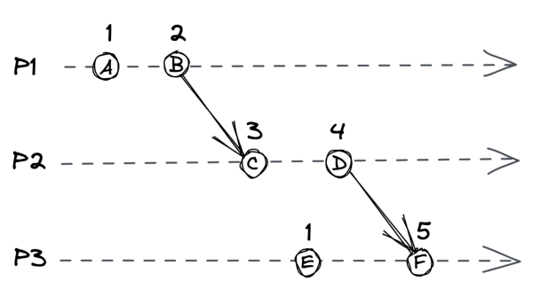
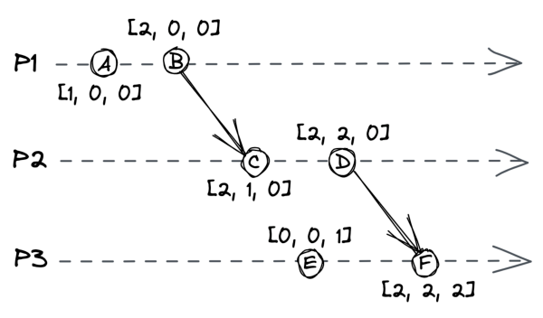

# **Chapter 8** 

# **Time** 

Time is an essential concept in any software application; even more so in distributed ones. We have seen it play a crucial role in the network stack (e.g., DNS record TTL) and failure detection (timeouts). Another important use of it is for ordering events. 

The flow of execution of a single-threaded application is simple to understand because every operation executes sequentially in time, one after the other. But in a distributed system, there is no shared global clock that all processes agree on that can be used to order operations. And, to make matters worse, processes can run concurrently. 

It’s challenging to build distributed applications that work as intended without knowing whether one operation happened before another. In this chapter, we will learn about a family of clocks that can be used to work out the order of operations across processes in a distributed system. 

# **8.1 Physical clocks** 

A process has access to a physical wall-time clock. The most common type is based on a vibrating quartz crystal, which is cheap but not very accurate. Depending on manufacturing differences and external temperature, one quartz clock can run slightly faster or slower than others. The rate at which a clock runs faster or slower is also called _clock drift_ . In contrast, the difference between two clocks at a specific point in time is referred to as _clock skew_ . 

Because quartz clocks drift, they need to be synced periodically with machines that have access to higher-accuracy clocks, like atomic ones. Atomic clocks[1] measure time based on quantummechanical properties of atoms. They are significantly more expensive than quartz clocks and accurate to 1 second in 3 million years. 

The synchronization between clocks can be implemented with a protocol, and the challenge is to do so despite the unpredictable latencies introduced by the network. The most commonly used protocol is the _Network Time Protocol_ (NTP[2] ). In NTP, a client estimates the clock skew by receiving a timestamp from a NTP server and correcting it with the estimated network latency. With an estimate of the clock skew, the client can adjust its clock. However, this causes the clock to jump forward or backward in time, which creates a problem when comparing timestamps. For example, an operation that runs after another could have an earlier timestamp because the clock jumped back in time between the two operations. 

Luckily, most operating systems offer a different type of clock that is not affected by time jumps: a monotonic clock. A _monotonic clock_ measures the number of seconds elapsed since an arbitrary point in time (e.g., boot time) and can only move forward. A monotonic clock is useful for measuring how much time has elapsed between two timestamps on the same node. However, monotonic clocks are of no use for comparing timestamps of different nodes. 

Since we don’t have a way to synchronize wall-time clocks across processes perfectly, we can’t depend on them for ordering operations across nodes. To solve this problem, we need to look at it from another angle. We know that two operations can’t run concurrently in a single-threaded process as one must happen before the other. This _happened-before_ relationship creates a _causal_ bond between the two operations, since the one that happens first can have side-effects that affect the operation that comes after it. We can use this intuition to build a different type of clock that isn’t tied to the physical concept of time but rather captures the causal relationship between operations: a logical clock.

> 1“Atomic clock,” https://en.wikipedia.org/wiki/Atomic_clock 

> 2“RFC 5905: Network Time Protocol Version 4: Protocol and Algorithms Specification,” https://datatracker.ietf.org/doc/html/rfc5905

# **8.2 Logical clocks** 

A _logical clock_ measures the passing of time in terms of logical operations, not wall-clock time. The simplest possible logical clock is a counter, incremented before an operation is executed. Doing so ensures that each operation has a distinct _logical timestamp_ . If two operations execute on the same process, then necessarily one must come before the other, and their logical timestamps will reflect that. But what about operations executed on different processes? 

Imagine sending an email to a friend. Any actions you did before sending that email, like drinking coffee, must have happened before the actions your friend took after receiving the email. Similarly, when one process sends a message to another, a so-called _synchronization point_ is created. The operations executed by the sender before the message was sent _must_ have happened before the operations that the receiver executed after receiving it. 

A _Lamport clock_[3] is a logical clock based on this idea. To implement it, each process in the system needs to have a local counter that follows specific rules: 

- The counter is initialized with 0. 

- The process increments its counter by 1 before executing an operation. 

- When the process sends a message, it increments its counter by 1 and sends a copy of it in the message. 

- When the process receives a message, it merges the counter 

3“Time, Clocks, and the Ordering of Events in a Distributed System,” http://la mport.azurewebsites.net/pubs/time-clocks.pdf it received with its local counter by taking the maximum of the two. Finally, it increments the counter by 1. 

Figure 8.1: Three processes using Lamport clocks. For example, because D happened before F, D’s logical timestamp is less than F’s. 

Although the Lamport clock assumes a crash-stop model, a crashrecovery one can be supported by e.g., persisting the clock’s state on disk. 

The rules guarantee that if operation 𝑂1 happened-before operation 𝑂2, the logical timestamp of 𝑂1 is less than the one of 𝑂2. In the example shown in Figure 8.1, operation D happened-before F, and their logical timestamps, 4 and 5, reflect that. 

However, two unrelated operations can have the same logical timestamp. For example, the logical timestamps of operations A and E are equal to 1. To create a strict total order, we can arbitrarily order the processes to break ties. For example, if we used the process IDs in Figure 8.1 to break ties (1, 2, and 3), E’s timestamp would be greater than A’s. 

Regardless of whether ties are broken, the order of logical timestamps doesn’t imply a causal relationship. For example, in Figure 8.1, operation E didn’t happen-before C, even if their timestamps appear to imply it. To guarantee this relationship, we have to use a different type of logical clock: a _vector clock_ . 

# **8.3 Vector clocks** 

A _vector clock_[4] is a logical clock that guarantees that if a logical timestamp is less than another, then the former must have happened-before the latter. A vector clock is implemented with an array of counters, one for each process in the system. And, as with Lamport clocks, each process has its local copy. 

For example, suppose the system is composed of three processes, 𝑃1, 𝑃2, and 𝑃3. In this case, each process has a local vector clock implemented with an array[5] of three counters [𝐶𝑃1, 𝐶𝑃2, 𝐶𝑃3]. The first counter in the array is associated with 𝑃1, the second with 𝑃2, and the third with 𝑃3. 

A process updates its local vector clock based on the following rules: 

- Initially, the counters in the array are set to 0. 

- When an operation occurs, the process increments its counter in the array by 1. 

- When the process sends a message, it increments its counter in the array by 1 and sends a copy of the array with the message. 

- When the process receives a message, it merges the array it received with the local one by taking the maximum of the two arrays element-wise. Finally, it increments its counter in the array by 1. 

The beauty of vector clock timestamps is that they can be partially ordered[6] ; given two operations 𝑂1 and 𝑂2 with timestamps 𝑇1 and 𝑇2, if: 

> 4“Timestamps in Message-Passing Systems That Preserve the Partial Ordering,” https://fileadmin.cs.lth.se/cs/Personal/Amr_Ergawy/dist-algos-papers/4.pdf 5In actual implementations, a dictionary is used rather than an array. 

> 6In a total order, every pair of elements is comparable. Instead, in partial order, some pairs are not comparable 

Figure 8.2: Each process has a vector clock represented by an array of three counters. 

- every counter in 𝑇1 is less than or equal to the corresponding counter in 𝑇2, 

- and there is at least one counter in 𝑇1 that is strictly less than the corresponding counter in 𝑇2, then 𝑂1 happened-before 𝑂2. For example, in Figure 8.2, B happened-before C. 

If 𝑂1 didn’t happen-before 𝑂2 and 𝑂2 didn’t happen-before 𝑂1, then the timestamps can’t be ordered, and the operations are considered to be concurrent. So, for example, operations E and C in Figure 8.2 can’t be ordered, and therefore are concurrent. 

One problem with vector clocks is that the storage requirement on each process grows linearly with the number of processes, which becomes a problem for applications with many clients. However, there are other types of logical clocks that solve this issue, like dotted version vectors[7] . 

This discussion about logical clocks might feel a bit abstract at this point but bear with me. Later in the book, we will encounter some 

> 7“Why Logical Clocks are Easy,” https://queue.acm.org/detail.cfm?id=291775

practical applications of logical clocks. What’s important to internalize at this point is that, in general, we can’t use physical clocks to accurately derive the order of events that happened on different processes. That being said, sometimes physical clocks are good enough. For example, using physical clocks to timestamp logs may be fine if they are only used for debugging purposes. 

